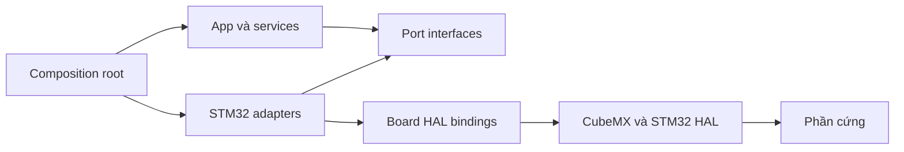
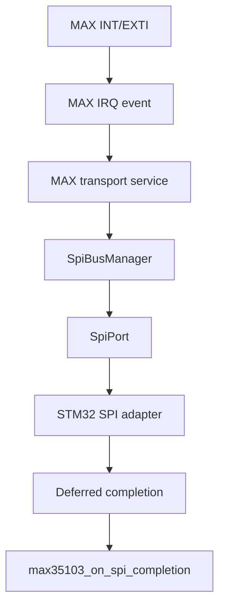

# Đề xuất chuyển đổi firmware portable sang STM32CubeMX/HAL

> **Mã tài liệu:** FW-MIG-STM32-001  
> **Trạng thái:** Đề xuất kỹ thuật  
> **MCU mục tiêu:** STM32L433xx  
> **Nền tảng sinh mã:** STM32CubeMX/STM32CubeIDE, CMake, Ninja  
> **Ngày cập nhật:** 2026-07-21

## 1. Mục tiêu tài liệu

Tài liệu này đề xuất cách đưa firmware hiện có của dự án **Smart Water Flow & Pressure Monitor** vào một dự án STM32L433 do CubeMX sinh ra, đồng thời giữ được các đặc tính quan trọng của kiến trúc hiện tại:

- Phần lớn mã nghiệp vụ không phụ thuộc STM32 HAL.
- Vẫn build và chạy unit test trên Linux/host.
- Mã do CubeMX quản lý có thể được sinh lại mà không làm mất mã ứng dụng.
- Driver cảm biến, quản lý phép đo, lưu trữ, cảnh báo rò rỉ và state machine không bị dồn vào `Core/Src/main.c`.
- Các callback ngắt của HAL không trực tiếp thực thi nghiệp vụ hoặc giao dịch bus dài.
- Có một composition root rõ ràng để chọn implementation Linux hoặc STM32 cho các port.

Đây là đề xuất **tích hợp kiến trúc**, không phải đề xuất viết lại toàn bộ firmware bằng STM32 HAL. Mục tiêu là giữ nguyên phần portable đã có, chỉ bổ sung lớp thích nghi phần cứng và cấu hình build cần thiết.

## 2. Kết luận kiến trúc

Không nên chép toàn bộ `src/` của firmware hiện tại vào `Core/Src/`. Cách bền vững hơn là:

1. Xem `Core/`, `Drivers/`, startup, linker script và file `.ioc` là **lớp nền tảng do CubeMX quản lý**.
2. Giữ `src/domain`, `src/services`, `src/drivers`, `src/ports`, `src/protocols`, `src/facades` và `src/app` là **firmware core portable**.
3. Tích hợp hai phần tại `src/platform/stm32/` và root `CMakeLists.txt`.
4. Giữ `main.c` rất mỏng: khởi tạo phần cứng do CubeMX sinh, gọi composition root, rồi chạy một vòng lặp ứng dụng không chặn.
5. Chọn platform bằng CMake để cùng một codebase có thể build cho Linux và STM32.

Kiến trúc đích có thể mô tả như sau:



Điểm quan trọng là dependency của nghiệp vụ dừng tại interface trong `src/ports`. Mã nghiệp vụ không include `stm32l4xx_hal.h`, không tham chiếu `ADC_HandleTypeDef`, `I2C_HandleTypeDef`, `SPI_HandleTypeDef` hoặc biến toàn cục như `hi2c1`.

## 3. Hiện trạng và khoảng cách cần xử lý

Firmware hiện tại đã có hướng tổ chức tốt cho một hệ thống portable:

- `domain`: kiểu dữ liệu và quy tắc nghiệp vụ.
- `services`: điều phối phép đo, lưu trữ, power, leak detection, event loop.
- `ports`: hợp đồng giao tiếp với ADC, I2C, SPI, RTC, watchdog, low power, UART và các dịch vụ nền tảng.
- `drivers`: logic thiết bị như cảm biến áp suất, đo lưu lượng và F-RAM.
- `platform/linux`: implementation dành cho mô phỏng và test trên host.
- `platform/stm32/adapters`: một phần adapter STM32 đã được thiết kế theo bảng hàm `ops`, tránh phụ thuộc HAL trực tiếp.
- `app`: composition và runtime cấp ứng dụng.

Dự án CubeMX cung cấp phần còn thiếu ở phía target:

- startup code và linker script cho STM32L433.
- CMSIS và STM32L4 HAL.
- clock tree, GPIO, DMA, NVIC và peripheral initialization.
- các handle HAL như `hadc1`, `hi2c1`, `hspi1`, `hrtc`, `hiwdg`, `huartx`.
- file ngắt, MSP, system initialization và CMake target do CubeMX sinh.

Khoảng cách chính không nằm ở việc “đổi toàn bộ code sang HAL”, mà nằm ở bốn vùng sau:

| Vùng | Hiện trạng | Việc cần làm |
|---|---|---|
| Build | Linux, STM32, simulator và test có nguy cơ được add cùng lúc | Tách build theo `SWFPM_PLATFORM` |
| Composition | Composition hiện chưa nhận đủ port của target | Mở rộng cấu hình/bindings và tạo STM32 composition root |
| HAL binding | Adapter STM32 cần implementation thực tế từ handle CubeMX | Tạo `board/*_hal_ops.c` và runtime ports |
| ISR/deferred work | Callback HAL chạy trong ngữ cảnh ngắt | Thêm mailbox/event bridge, xử lý hoàn tất ở thread/main context |

## 4. Cấu trúc thư mục đích

Nên hợp nhất dự án CubeMX vào chính thư mục `2.firmware/` và tổ chức như sau:

```text
2.firmware/
├── .clangd
├── .gitignore
├── .mxproject
├── .settings/
├── .vscode/
├── firmware.ioc
├── startup_stm32l433xx.s
├── STM32L433XX_FLASH.ld
├── CMakeLists.txt                    # User-owned: điều phối platform
├── CMakePresets.json                 # Preset Linux và STM32
│
├── cmake/
│   ├── warnings.cmake
│   ├── gcc-arm-none-eabi.cmake
│   ├── starm-clang.cmake
│   └── stm32cubemx/
│       └── CMakeLists.txt            # CubeMX-owned: có thể bị ghi đè
│
├── Core/                             # CubeMX-owned, chỉ sửa USER CODE blocks
│   ├── Inc/
│   │   ├── main.h
│   │   ├── stm32l4xx_hal_conf.h
│   │   └── stm32l4xx_it.h
│   └── Src/
│       ├── main.c
│       ├── stm32l4xx_hal_msp.c
│       ├── stm32l4xx_it.c
│       ├── syscalls.c
│       ├── sysmem.c
│       └── system_stm32l4xx.c
│
├── Drivers/                          # CubeMX-owned
│   ├── CMSIS/
│   └── STM32L4xx_HAL_Driver/
│
├── src/                              # User-owned: portable firmware
│   ├── domain/
│   ├── infrastructure/
│   ├── ports/
│   ├── protocols/
│   ├── drivers/
│   ├── services/
│   ├── facades/
│   ├── app/
│   └── platform/
│       ├── include/
│       ├── linux/
│       └── stm32/
│           ├── adapters/             # HAL-agnostic adapter theo ops table
│           ├── board/                # STM32 HAL bindings, pin và handle mapping
│           ├── runtime/              # clock, IRQ, reset, RTC, STOP2, watchdog
│           └── composition/          # composition root riêng cho STM32
│
├── apps/
│   └── linux_sim/
│
├── tests/                            # Chỉ build trên host
│
└── build/                            # Không commit
    ├── host-debug/
    └── stm32-debug/
```

### 4.1. Vì sao không đặt mã portable trong `Core/Src`

`Core/Src` phù hợp với mã glue do CubeMX sinh và các entry point bắt buộc của STM32. Nếu đưa tất cả driver và service vào đây, các vấn đề sau sẽ xuất hiện:

- Khó phân biệt file nào do CubeMX quản lý và file nào do nhóm firmware quản lý.
- Dễ phát sinh xung đột khi regenerate `.ioc`.
- Build host phải biết tới cấu trúc CubeMX dù không dùng HAL.
- Driver nghiệp vụ dễ include HAL trực tiếp, phá vỡ ranh giới port–adapter.
- Unit test bị phụ thuộc global handle và initialization order của board.

Vì vậy, `Core/Src/main.c` chỉ nên là entry point và cầu nối sang `src/platform/stm32/composition`.

## 5. Quyền sở hữu file và quy tắc regenerate CubeMX

| Thành phần | Chủ sở hữu | Quy tắc chỉnh sửa |
|---|---|---|
| `firmware.ioc` | CubeMX + nhóm firmware | Chỉnh bằng CubeMX, commit cùng thay đổi generated code |
| `Core/Src/main.c` | CubeMX | Chỉ thêm code trong `USER CODE BEGIN/END` |
| `Core/Src/stm32l4xx_it.c` | CubeMX | Chỉ thêm hook ngắn trong `USER CODE` nếu cần |
| `Core/Src/stm32l4xx_hal_msp.c` | CubeMX | Ưu tiên cấu hình từ `.ioc`; chỉ dùng `USER CODE` |
| `Core/Inc/*` | CubeMX | Không đặt API ứng dụng mới vào đây nếu không bắt buộc |
| `Drivers/*` | CubeMX/ST | Không sửa trực tiếp |
| `cmake/stm32cubemx/CMakeLists.txt` | CubeMX | Xem là generated; mọi chỉnh sửa có thể bị ghi đè |
| Root `CMakeLists.txt` | Nhóm firmware | Nơi thêm portable libraries, target và platform switch |
| `src/**` | Nhóm firmware | Không bị CubeMX ghi đè |
| `tests/**` | Nhóm firmware | Host-only, không link vào target STM32 |

Theo cấu trúc CMake mà CubeMX sinh, root `CMakeLists.txt` là vị trí phù hợp để người dùng bổ sung target và thư viện; file CMake bên trong `cmake/stm32cubemx/` phải được xem là phần generated. Sau mỗi lần regenerate cần kiểm tra `git diff` để chắc chắn CubeMX không thay đổi vùng ngoài dự kiến.

## 6. Xử lý các file đang trùng chức năng

Trong cây CubeMX mẫu đang có:

- `Core/Inc/fram_driver.h`
- `Core/Src/fram_driver.c`
- `Core/Inc/fram_test.h`
- `Core/Src/fram_test.c`

Trong firmware portable cũng đã có vùng driver lưu trữ/F-RAM. Không nên compile đồng thời hai implementation vì có thể gây:

- duplicate symbol;
- hai API khác nhau cho cùng một thiết bị;
- hai state machine truy cập cùng I2C bus;
- test bring-up bị kéo vào production image.

Đề xuất:

1. So sánh implementation `Core/Src/fram_driver.c` với driver F-RAM trong `src/drivers/storage/`.
2. Chuyển phần logic còn thiếu vào driver portable thông qua `I2cPort` hoặc `I2cBusManager`.
3. Sau khi driver portable hoạt động trên board, loại `Core/Src/fram_driver.c` khỏi target.
4. Chuyển `fram_test.c` thành hardware bring-up test, ví dụ `tests/hil/fram_bringup.c`, hoặc bật bằng một CMake option riêng.
5. Không gọi F-RAM test mặc định trong production boot.

Lưu ý: giai đoạn đầu có thể giữ file cũ trong repository để đối chiếu, nhưng chỉ **một implementation** được phép nằm trong source list của firmware target.

## 7. Thiết kế CMake đa nền tảng

### 7.1. Nguyên tắc

Root CMake cần thực hiện ba vai trò:

1. Tạo các thư viện portable luôn dùng cho mọi platform.
2. Chọn đúng implementation platform.
3. Chỉ bật executable simulator và unit test khi build host.

Biến chọn platform đề xuất:

```cmake
set(SWFPM_PLATFORM "linux" CACHE STRING "Target platform: linux or stm32")
set_property(CACHE SWFPM_PLATFORM PROPERTY STRINGS linux stm32)
```

Không nên dựa hoàn toàn vào `CMAKE_CROSSCOMPILING` để chọn source, vì platform là quyết định kiến trúc rõ ràng và cần xuất hiện trong preset/CI.

### 7.2. Các target portable

Nên gom source theo trách nhiệm, ví dụ:

```cmake
add_library(fw_domain STATIC
    # src/domain/*.c
)

add_library(fw_infrastructure STATIC
    # event queue, time utilities, common infrastructure
)

add_library(fw_drivers STATIC
    # pressure, flow, FRAM and protocol-independent device logic
)

add_library(fw_services STATIC
    # measurement, storage, power, leak detection
)

add_library(fw_app STATIC
    # event loop, application state and portable composition helpers
)

target_include_directories(fw_domain PUBLIC src)
target_include_directories(fw_infrastructure PUBLIC src)
target_include_directories(fw_drivers PUBLIC src)
target_include_directories(fw_services PUBLIC src)
target_include_directories(fw_app PUBLIC src)
```

Danh sách source nên được khai báo tường minh. `file(GLOB_RECURSE ...)` tiện lúc đầu nhưng dễ vô tình kéo test, mock hoặc file của platform sai vào target.

### 7.3. Nhánh Linux

```cmake
if(SWFPM_PLATFORM STREQUAL "linux")
    add_library(fw_platform_linux STATIC
        # src/platform/linux/*.c
    )

    add_executable(swfpm_sim
        apps/linux_sim/main.c
    )

    target_link_libraries(swfpm_sim PRIVATE
        fw_app
        fw_services
        fw_drivers
        fw_infrastructure
        fw_domain
        fw_platform_linux
    )

    include(CTest)
    if(BUILD_TESTING)
        add_subdirectory(tests)
    endif()
endif()
```

Sanitizer, coverage và các dependency chỉ dùng cho test phải nằm trong nhánh Linux, không được áp vào cross build STM32.

### 7.4. Nhánh STM32

Tên target do CubeMX tạo có thể thay đổi theo phiên bản. Cần mở `cmake/stm32cubemx/CMakeLists.txt` để xác nhận target thực tế; ví dụ dưới đây dùng tên minh họa `stm32cubemx`.

```cmake
if(SWFPM_PLATFORM STREQUAL "stm32")
    add_subdirectory(cmake/stm32cubemx)

    add_library(fw_platform_stm32 STATIC
        src/platform/stm32/adapters/adc_port_stm32.c
        src/platform/stm32/adapters/i2c_port_stm32.c
        src/platform/stm32/adapters/spi_port_stm32.c
        src/platform/stm32/board/stm32_board_ports.c
        src/platform/stm32/board/stm32_hal_adc_ops.c
        src/platform/stm32/board/stm32_hal_i2c_ops.c
        src/platform/stm32/board/stm32_hal_spi_ops.c
        src/platform/stm32/runtime/stm32_clock_port.c
        src/platform/stm32/runtime/stm32_critical_section_port.c
        src/platform/stm32/runtime/stm32_rtc_port.c
        src/platform/stm32/runtime/stm32_low_power_port.c
        src/platform/stm32/runtime/stm32_watchdog_port.c
        src/platform/stm32/runtime/stm32_irq_bridge.c
        src/platform/stm32/composition/stm32_app.c
    )

    target_include_directories(fw_platform_stm32 PUBLIC
        src
        src/platform/stm32
    )

    target_link_libraries(fw_platform_stm32 PUBLIC
        stm32cubemx
        fw_app
        fw_services
        fw_drivers
        fw_infrastructure
        fw_domain
    )

    add_executable(firmware)

    target_link_libraries(firmware PRIVATE
        stm32cubemx
        fw_platform_stm32
    )

    target_link_options(firmware PRIVATE
        -T${CMAKE_SOURCE_DIR}/STM32L433XX_FLASH.ld
        -Wl,-Map=${CMAKE_CURRENT_BINARY_DIR}/firmware.map
        -Wl,--gc-sections
    )
endif()
```

Khi tích hợp vào file thực tế, cần tránh add lại `Core/Src/main.c`, startup assembly, system file hoặc HAL source nếu target `stm32cubemx` đã chứa chúng.

### 7.5. CMake presets

Nên tách thư mục build để cache của host và cross compiler không lẫn nhau:

```json
{
  "version": 6,
  "configurePresets": [
    {
      "name": "host-debug",
      "generator": "Ninja",
      "binaryDir": "${sourceDir}/build/host-debug",
      "cacheVariables": {
        "CMAKE_BUILD_TYPE": "Debug",
        "SWFPM_PLATFORM": "linux",
        "BUILD_TESTING": "ON"
      }
    },
    {
      "name": "stm32-debug",
      "generator": "Ninja",
      "binaryDir": "${sourceDir}/build/stm32-debug",
      "toolchainFile": "${sourceDir}/cmake/gcc-arm-none-eabi.cmake",
      "cacheVariables": {
        "CMAKE_BUILD_TYPE": "Debug",
        "SWFPM_PLATFORM": "stm32",
        "BUILD_TESTING": "OFF"
      }
    }
  ],
  "buildPresets": [
    {
      "name": "host-debug",
      "configurePreset": "host-debug"
    },
    {
      "name": "stm32-debug",
      "configurePreset": "stm32-debug"
    }
  ]
}
```

Lệnh build chuẩn:

```bash
cmake --preset host-debug
cmake --build --preset host-debug
ctest --test-dir build/host-debug --output-on-failure

cmake --preset stm32-debug
cmake --build --preset stm32-debug
```

## 8. Thiết kế port–adapter cho STM32 HAL

### 8.1. Nguyên tắc dependency

Một port không “gọi adapter” bằng dependency compile-time. Trình tự đúng là:

1. Service nhận con trỏ tới một port interface.
2. Composition root khởi tạo adapter cụ thể.
3. Adapter cung cấp function pointer và context cho port.
4. Service gọi function pointer của port mà không biết đó là Linux, mock hay STM32.

Ví dụ khái niệm:

```c
typedef struct {
    void *context;
    bool (*read_raw)(void *context, uint16_t *sample);
} AdcPort;
```

STM32 adapter có thể nhận một bảng HAL ops:

```c
typedef struct {
    bool (*start)(void *hal_context);
    bool (*poll)(void *hal_context, uint32_t timeout_ms);
    bool (*read)(void *hal_context, uint32_t *value);
    bool (*stop)(void *hal_context);
} Stm32AdcHalOps;
```

`board/stm32_hal_adc_ops.c` mới là nơi cast `hal_context` sang `ADC_HandleTypeDef *` và gọi `HAL_ADC_*`. Nhờ vậy, phần adapter và phần core không cần include HAL.

### 8.2. Board container

Nên có một cấu trúc sở hữu toàn bộ adapter/port của board:

```c
typedef struct {
    Stm32AdcAdapter adc_adapter;
    Stm32I2cAdapter i2c_adapter;
    Stm32SpiAdapter spi_adapter;

    AdcPort adc_port;
    I2cPort i2c_port;
    SpiPort spi_port;
    CriticalSectionPort critical_section_port;
    RtcPort rtc_port;
    LowPowerPort low_power_port;
    WatchdogPort watchdog_port;
    UartPort ble_uart_port;
    UartPort cellular_uart_port;
} Stm32BoardPorts;

bool stm32_board_ports_init(Stm32BoardPorts *board);
```

`stm32_board_ports_init()` được phép tham chiếu các handle CubeMX như `hadc1`, `hi2c1`, `hspi1`, `hrtc`, `hiwdg`, nhưng các file phía trên nó thì không.

### 8.3. Ánh xạ port sang HAL

| Port/chức năng | Implementation STM32 đề xuất | HAL/CMSIS sử dụng |
|---|---|---|
| ADC pin/battery | `stm32_hal_adc_ops.c` | `HAL_ADC_Start`, poll/DMA, get value |
| I2C bus | `stm32_hal_i2c_ops.c` | `HAL_I2C_Master_Transmit/Receive_*` |
| SPI bus | `stm32_hal_spi_ops.c` | `HAL_SPI_TransmitReceive_*` |
| Monotonic clock | `stm32_clock_port.c` | TIM2 1 MHz + overflow accounting |
| Critical section | `stm32_critical_section_port.c` | PRIMASK save/restore |
| Reset | `stm32_system_control_port.c` | `NVIC_SystemReset()` |
| RTC | `stm32_rtc_port.c` | `HAL_RTC_GetTime/Date`, alarm/wakeup |
| Low power | `stm32_low_power_port.c` | `HAL_PWREx_EnterSTOP2Mode()` |
| Watchdog | `stm32_watchdog_port.c` | `HAL_IWDG_Refresh()` có điều kiện |
| BLE UART | `stm32_uart_port.c` | DMA/interrupt, Receive-to-idle nếu phù hợp |
| Cellular UART | `stm32_uart_port.c` | DMA/interrupt, buffer riêng |
| MAX35103 IRQ | `stm32_irq_bridge.c` | EXTI callback, event deferred |
| F-RAM | Driver portable qua shared I2C manager | Không gọi HAL trực tiếp từ driver |

ADC polling có thể chấp nhận được cho phép đo pin nếu timeout ngắn và tần suất thấp. I2C/SPI/UART phục vụ cảm biến và truyền thông nên ưu tiên interrupt hoặc DMA để tránh chặn event loop.

## 9. Refactor composition root

### 9.1. Vấn đề cần giải quyết

Composition hiện chỉ nhận một phần nhỏ dependency, ví dụ ADC và power configuration. Cấu hình này chưa đủ để dựng đầy đủ firmware trên board thật, vì target còn cần:

- I2C cho cảm biến áp suất và F-RAM.
- SPI và IRQ cho MAX35103.
- RTC và low-power wakeup.
- critical section cho event queue.
- watchdog.
- UART cho BLE/4G.

### 9.2. Hợp đồng bindings đề xuất

```c
typedef struct {
    const AdcPort *adc;
    const I2cPort *i2c;
    const SpiPort *spi;
    const CriticalSectionPort *critical_section;
    const RtcPort *rtc;
    const LowPowerPort *low_power;
    const WatchdogPort *watchdog;
    const UartPort *ble_uart;
    const UartPort *cellular_uart;
} AppPlatformBindings;

bool app_composition_init(
    AppComposition *app,
    const AppPlatformBindings *bindings,
    const AppRuntimeConfig *config);
```

`AppRuntimeConfig` chỉ chứa cấu hình chính sách/board như chu kỳ lấy mẫu, timeout, địa chỉ I2C, ngưỡng cảnh báo, dung lượng F-RAM và calibration. Nó không nên chứa HAL handle.

### 9.3. Quyền sở hữu bus manager

Nếu cảm biến áp suất ZSSC3241 và F-RAM cùng dùng một I2C vật lý, chỉ nên có **một `I2cBusManager`** sở hữu arbitration, timeout và completion của bus đó.

Không nên để `MeasurementManager` sở hữu riêng I2C manager nếu storage cũng dùng bus. Đề xuất nâng ownership lên `AppComposition`:

```text
AppComposition
├── I2cBusManager
│   ├── ZSSC3241 pressure transport
│   └── FRAM storage transport
├── SpiBusManager
│   └── MAX35103 flow transport
├── MeasurementManager
├── StorageService
├── PowerService
└── EventLoop
```

Lợi ích:

- Không có hai state machine cùng điều khiển một peripheral.
- Có một nơi thống nhất để xử lý busy, timeout, retry và cancel.
- Callback hoàn tất có thể định tuyến theo transaction owner.
- Dễ test contention giữa phép đo áp suất và ghi F-RAM.

### 9.4. Tích hợp SPI cho MAX35103

Nếu driver MAX35103 hiện mới nhận IRQ và completion nhưng chưa tự submit transaction, cần bổ sung một transport/service layer:



Driver thiết bị chỉ nên diễn giải frame/register và duy trì state machine thiết bị. Quyết định khi nào cấp bus, timeout và retry thuộc về bus manager/transport layer.

## 10. Entry point và vòng đời ứng dụng

### 10.1. `Core/Src/main.c`

`main.c` giữ nguyên thứ tự initialization do CubeMX sinh. Chỉ thêm các lời gọi ứng dụng trong `USER CODE`:

```c
/* USER CODE BEGIN Includes */
#include "platform/stm32/composition/stm32_app.h"
/* USER CODE END Includes */

int main(void)
{
    HAL_Init();
    SystemClock_Config();

    MX_GPIO_Init();
    MX_DMA_Init();
    MX_ADC1_Init();
    MX_I2C1_Init();
    MX_SPI1_Init();
    MX_RTC_Init();
    MX_IWDG_Init();

    /* USER CODE BEGIN 2 */
    if (!stm32_app_init()) {
        Error_Handler();
    }
    /* USER CODE END 2 */

    while (1) {
        /* USER CODE BEGIN WHILE */
        stm32_app_run_once();
        /* USER CODE END WHILE */
    }
}
```

Tên và thứ tự `MX_*_Init()` phải lấy từ `.ioc` thực tế, không sao chép máy móc từ ví dụ.

### 10.2. `stm32_app_init()`

Trình tự khởi tạo khuyến nghị:

1. Xác nhận HAL peripherals và timer nền đã được CubeMX khởi tạo.
2. Khởi tạo `Stm32BoardPorts` từ các handle HAL.
3. Khởi tạo monotonic clock.
4. Bind critical-section port cho event queue **trước khi enable nguồn sự kiện IRQ của ứng dụng**.
5. Dựng `AppPlatformBindings` và `AppRuntimeConfig`.
6. Khởi tạo shared I2C/SPI bus manager.
7. Khởi tạo driver pressure, flow và F-RAM.
8. Khởi tạo measurement, storage, power và communication services.
9. Đọc/khôi phục persistent state từ F-RAM.
10. Post sự kiện `INIT_COMPLETED` hoặc chuyển state machine sang trạng thái sẵn sàng.

Không nên bật watchdog quá sớm nếu initialization có các bước dài chưa được tính vào progress policy. Nếu CubeMX bắt buộc khởi tạo IWDG sớm, init path phải có checkpoint refresh có kiểm soát.

### 10.3. `stm32_app_run_once()`

Một vòng lặp nên ngắn và có giới hạn:

```c
void stm32_app_run_once(void)
{
    stm32_platform_poll_deferred_events();
    app_event_loop_run_once(&g_app.event_loop);
    stm32_watchdog_service_progress();
    stm32_power_idle_if_safe();
}
```

Không có `HAL_Delay()` dài trong vòng lặp ứng dụng. Mọi delay nghiệp vụ nên được biểu diễn bằng deadline dựa trên monotonic clock.

## 11. Thiết kế ISR và deferred completion

### 11.1. Quy tắc bắt buộc

Callback HAL và EXTI chạy trong ngữ cảnh ngắt. ISR chỉ được làm công việc có thời gian chặn hữu hạn:

- đọc/capture cờ trạng thái tối thiểu;
- ghi completion record vào mailbox đã cấp phát tĩnh;
- post một event nhỏ bằng API ISR-safe;
- thoát ngay.

ISR không được:

- chạy service nghiệp vụ;
- parse protocol dài;
- ghi F-RAM;
- start chuỗi transaction tiếp theo có thể block;
- cấp phát động;
- log bằng API blocking;
- gọi trực tiếp callback được thiết kế cho main context.

Luồng chuẩn:


### 11.2. Ánh xạ callback

| Callback HAL/IRQ | Việc làm trong ISR | Xử lý deferred |
|---|---|---|
| `HAL_I2C_MasterTxCpltCallback` | Ghi bus id/status, post `I2C_COMPLETED` | `I2cBusManager` hoàn tất transaction |
| `HAL_I2C_MasterRxCpltCallback` | Ghi length/status, post `I2C_COMPLETED` | Driver đọc buffer và chuyển state |
| `HAL_I2C_ErrorCallback` | Capture error code, post `I2C_FAILED` | Manager retry/fail theo policy |
| `HAL_SPI_TxRxCpltCallback` | Capture completion, post `SPI_COMPLETED` | MAX transport/driver xử lý frame |
| `HAL_SPI_ErrorCallback` | Capture error, post `SPI_FAILED` | Manager cleanup/retry |
| `HAL_GPIO_EXTI_Callback` cho MAX INT | Post `MAX35103_IRQ` | Transport submit SPI read |
| UART receive-to-idle | Ghi offset/length, post `UART_RX_READY` | Parser BLE/cellular chạy ở main context |
| RTC alarm/wakeup | Post `RTC_WAKEUP` | Power/event service cập nhật lịch |

Nếu adapter hiện có hàm như `i2c_port_stm32_on_complete()`, chỉ gọi hàm đó trong main/deferred context nếu contract của adapter yêu cầu như vậy. Callback HAL trong ISR chỉ đẩy record sang mailbox.

### 11.3. Critical section của event queue

Event queue dùng chung giữa ISR và main phải được bảo vệ bởi critical-section implementation đúng cho Cortex-M:

```c
typedef struct {
    uint32_t primask;
} Stm32CriticalToken;

static uint32_t enter_critical(void *context)
{
    uint32_t primask = __get_PRIMASK();
    __disable_irq();
    return primask;
}

static void exit_critical(void *context, uint32_t primask)
{
    if ((primask & 1U) == 0U) {
        __enable_irq();
    }
}
```

Implementation thực tế phải hỗ trợ nesting theo contract của port. Không được luôn gọi `__enable_irq()` khi thoát vì caller có thể đã ở trong vùng IRQ-disabled trước đó.

## 12. Clock, RTC và low power

### 12.1. Monotonic clock

Không nên dùng trực tiếp `HAL_GetTick()` làm nguồn thời gian duy nhất cho timeout và scheduling vì:

- độ phân giải thường chỉ 1 ms;
- tick có thể bị suspend trong low-power mode;
- wrap-around 32 bit;
- thời gian ngủ STOP2 cần được cộng bù.

Đề xuất dùng TIM2 ở 1 MHz và mở rộng counter thành 64 bit. Port trả về microsecond hoặc millisecond monotonic theo contract hiện có. Khi vào STOP2:

1. Chụp monotonic time trước sleep.
2. Cấu hình RTC wakeup/alarm.
3. Vào STOP2.
4. Sau wakeup, khôi phục system clock và peripheral clock.
5. Tính khoảng thời gian ngủ từ RTC và cộng vào monotonic epoch.

Timeout phải dùng phép trừ wrap-safe hoặc kiểu 64 bit thống nhất.

### 12.2. Low-power entry

Chỉ vào STOP2 khi:

- event queue không còn công việc gấp;
- I2C/SPI/UART DMA không có transaction active;
- storage không ở giữa commit;
- watchdog deadline cho phép;
- wakeup source đã được cấu hình;
- peripheral cần giữ trạng thái đã được xử lý đúng.

Sau STOP2 cần gọi lại hàm cấu hình clock theo hướng dẫn của board, vì PLL/system clock thường phải được phục hồi trước khi dùng UART/SPI/I2C.

## 13. Watchdog theo tiến độ hệ thống

Không refresh watchdog vô điều kiện ở đầu hoặc cuối `while (1)`. Cách đó chỉ chứng minh CPU vẫn chạy, không chứng minh hệ thống còn tiến triển.

Đề xuất chỉ refresh khi các điều kiện health/progress thỏa mãn, ví dụ:

- event loop đã chạy trong cửa sổ cho phép;
- không có bus transaction treo quá timeout;
- storage state machine không bị kẹt;
- cảm biến quan trọng có dữ liệu mới hoặc lỗi đã được báo đúng policy;
- queue không overflow liên tục.

Watchdog service có thể dùng một bitmask progress:

```text
EVENT_LOOP_PROGRESS
MEASUREMENT_PROGRESS
STORAGE_PROGRESS
COMMUNICATION_PROGRESS   # chỉ bắt buộc khi communication được bật
```

Trong mỗi watchdog window, chỉ refresh khi tập bit bắt buộc đã xuất hiện. Sau refresh thì xóa bit cho cửa sổ tiếp theo.

## 14. Lưu trữ F-RAM và tính toàn vẹn dữ liệu

F-RAM nên đi qua driver portable và shared I2C manager. Không để storage service gọi `HAL_I2C_*` trực tiếp.

Nếu firmware dùng hai bản ghi A/B hoặc journal, migration cần giữ nguyên các đặc tính:

- sequence/version tăng đơn điệu;
- CRC cho payload và metadata;
- chỉ đánh dấu record valid sau khi payload đã ghi xong;
- boot chọn record mới nhất hợp lệ;
- xử lý được mất nguồn giữa từng bước ghi;
- giới hạn địa chỉ và kích thước transaction theo thiết bị.

Các test tối thiểu:

1. Ghi và đọc lại record bình thường.
2. CRC sai ở slot A, slot B hợp lệ.
3. CRC sai ở slot B, slot A hợp lệ.
4. Mất nguồn giả lập sau header, giữa payload và trước commit marker.
5. I2C timeout/NACK ở từng bước.
6. Contention với transaction cảm biến áp suất trên cùng I2C bus.

## 15. Cấu hình CubeMX cần thống nhất

Trước khi viết binding HAL, cần chốt resource map trong `.ioc`:

| Tài nguyên | Mục đích | Điểm cần kiểm tra |
|---|---|---|
| I2C1 hoặc I2C khác | ZSSC3241 + F-RAM | Address, tốc độ, pull-up, DMA/IRQ, bus recovery |
| SPI1 hoặc SPI khác | MAX35103 | CPOL/CPHA, data size, CS GPIO, DMA/IRQ |
| EXTI | MAX35103 interrupt | Edge, pull, NVIC priority |
| ADC1 | Battery/analog input | Channel, sample time, VREF/calibration |
| TIM2 | Monotonic time | 1 MHz, overflow IRQ hoặc extension strategy |
| RTC | Timestamp và wakeup | LSE/LSI, backup domain, alarm/wakeup |
| IWDG | Watchdog | Prescaler, reload, timeout budget |
| USART | BLE/4G | Baud, DMA, RX idle, buffer strategy |
| GPIO | CS, reset, power enable | Initial level an toàn |

NVIC priority phải phù hợp với thời gian đáp ứng và quy tắc critical section. Không đặt callback truyền thông dài ở priority cao nếu không có lý do đo đạc rõ ràng.

## 16. Lộ trình migration theo giai đoạn

### Giai đoạn 0 — Đóng băng baseline

Mục tiêu: có mốc so sánh trước khi thay đổi cấu trúc.

- Build host từ commit sạch.
- Chạy toàn bộ unit test và simulator hiện có.
- Ghi lại warning count, test count và kết quả sanitizer nếu có.
- Ghi lại danh sách target CMake hiện tại.
- Không thay đổi thuật toán nghiệp vụ trong giai đoạn migration hạ tầng.

**Gate:** host build/test xanh trước khi bắt đầu.

### Giai đoạn 1 — Đưa tài sản CubeMX vào repository

- Đặt `.ioc`, startup, linker script, `Core/`, `Drivers/` và `cmake/stm32cubemx/` tại root `2.firmware/`.
- Đảm bảo MCU, flash/RAM layout và startup file đều là STM32L433 đúng biến thể.
- Thêm `build/` vào `.gitignore`.
- Không chép portable source vào `Core/Src`.

**Gate:** một dự án CubeMX tối thiểu vẫn cross-build được trước khi link portable core.

### Giai đoạn 2 — Loại bỏ trùng lặp ứng dụng trong `Core`

- Đối chiếu `fram_driver.*` với portable F-RAM driver.
- Chuyển logic cần giữ sang portable driver.
- Loại `fram_driver.c` và `fram_test.c` khỏi production source list.
- Giữ `main.c`, MSP, IRQ, syscall và system files do CubeMX sinh.

**Gate:** không có duplicate symbol, chỉ một ownership path cho F-RAM.

### Giai đoạn 3 — Tách CMake theo platform

- Tạo `SWFPM_PLATFORM`.
- Portable targets luôn có mặt.
- Linux-only source, tests và simulator nằm trong nhánh Linux.
- STM32-only source và generated target nằm trong nhánh STM32.
- Tạo preset `host-debug` và `stm32-debug`.

**Gate:** hai build directory độc lập đều configure/build được; STM32 image không link source Linux.

### Giai đoạn 4 — Thêm board HAL bindings và runtime ports

Thứ tự khuyến nghị:

1. critical section;
2. monotonic clock;
3. ADC;
4. I2C;
5. SPI;
6. GPIO/EXTI bridge;
7. RTC;
8. low power;
9. watchdog;
10. UART.

**Gate:** mỗi adapter có unit test/mock ở host hoặc hardware smoke test nhỏ trước khi nối toàn ứng dụng.

### Giai đoạn 5 — Refactor composition và ownership bus

- Thêm `AppPlatformBindings`.
- Nâng I2C/SPI manager lên ownership của `AppComposition`.
- Bind pressure và F-RAM vào cùng I2C manager.
- Bổ sung MAX35103 SPI transport.
- Đảm bảo Linux composition vẫn dùng cùng service graph.

**Gate:** host tests vẫn xanh; simulator sử dụng composition path tương đương target.

### Giai đoạn 6 — Nối main và callback bridge

- Tạo `stm32_app_init()` và `stm32_app_run_once()`.
- Thêm lời gọi trong `USER CODE` của `main.c`.
- Thêm mailbox/event bridge cho I2C, SPI, UART, EXTI và RTC.
- Xác nhận ISR bounded và không chạy nghiệp vụ.

**Gate:** board boot ổn định, event loop chạy và không HardFault khi IRQ xuất hiện.

### Giai đoạn 7 — Bring-up theo chuỗi phụ thuộc

Thứ tự bring-up đề xuất:

1. SWD, clock, GPIO và debug output tối thiểu.
2. Monotonic timer và event queue.
3. ADC/battery.
4. I2C probe và ZSSC3241.
5. F-RAM read/write và recovery.
6. SPI/MAX35103 register read.
7. MAX interrupt và flow measurement pipeline.
8. Volume accumulation và leak detection.
9. Persistent state restore/commit.
10. RTC wakeup và STOP2.
11. Watchdog progress gating.
12. BLE, cellular và LCD nếu có.

Mỗi bước phải có log/telemetry hoặc test point đủ để phân biệt lỗi điện, lỗi cấu hình CubeMX và lỗi state machine.

### Giai đoạn 8 — CI và release gate

CI tối thiểu gồm:

- host Debug + unit tests;
- host sanitizer build;
- STM32 cross build bằng `arm-none-eabi-gcc`;
- kiểm tra warning-as-error cho mã user-owned;
- sinh `.elf`, `.bin`/`.hex`, `.map`;
- báo cáo size flash/RAM;
- architecture check để chặn include HAL ngoài `platform/stm32` và `Core`.

## 17. Chiến lược kiểm thử

### 17.1. Host unit tests

Tiếp tục kiểm thử phần lớn logic trên Linux:

- event queue và overflow policy;
- measurement scheduling;
- ZSSC3241 conversion/state machine;
- MAX35103 frame/register logic;
- flow/volume calculation;
- leak detection;
- storage A/B recovery;
- bus arbitration, timeout và retry;
- power state transitions;
- watchdog progress policy.

### 17.2. Adapter contract tests

Dùng fake ops table để xác minh STM32 adapter mà không cần HAL thật:

- đúng thứ tự start/poll/read/stop;
- mapping HAL-like error sang port status;
- completion chỉ xảy ra một lần;
- timeout giải phóng bus;
- stale callback không hoàn tất nhầm transaction mới;
- buffer lifetime hợp lệ đến khi DMA kết thúc.

### 17.3. Hardware-in-the-loop/smoke tests

Các bài test board-specific nên tách khỏi production boot:

- đọc ADC với điện áp chuẩn;
- scan/đọc ID cảm biến I2C;
- F-RAM pattern test trên vùng không chứa production data;
- MAX35103 register read/write và IRQ;
- RTC alarm wakeup;
- STOP2 current measurement;
- watchdog reset có chủ đích;
- UART loopback hoặc modem/BLE handshake.

## 18. Rủi ro chính và biện pháp giảm thiểu

| Rủi ro | Hậu quả | Giảm thiểu |
|---|---|---|
| Sửa file generated ngoài `USER CODE` | Mất thay đổi khi regenerate | Ownership table + regenerate test trong CI/review |
| Link cả source Linux và STM32 | Duplicate symbol, sai behavior | Platform branch rõ ràng, inspect link map |
| Hai driver F-RAM cùng tồn tại | Tranh bus, API không nhất quán | Chỉ một implementation trong target |
| Hai I2C manager cho cùng peripheral | Race và completion sai owner | Shared manager thuộc `AppComposition` |
| Callback HAL gọi service trực tiếp | ISR dài, deadlock, reentrancy | Mailbox + deferred event |
| Dùng `HAL_GetTick()` xuyên STOP2 | Timeout/schedule sai | Monotonic timer + RTC sleep compensation |
| Refresh watchdog vô điều kiện | Không phát hiện state machine treo | Progress-gated watchdog |
| Blocking HAL timeout dài | Event loop mất đáp ứng | DMA/IT hoặc timeout ngắn, state machine async |
| Buffer DMA nằm trên stack | Use-after-return/corruption | Buffer có lifetime thuộc adapter/transaction |
| CubeMX đổi target/source list | Build hoặc duplicate file | Kiểm tra generated diff và CMake target sau regenerate |
| Stack/RAM tăng sau tích hợp | HardFault hoặc thiếu heap | Map file, stack watermark, static allocation budget |
| Simulator dùng composition khác production | Test xanh nhưng target lỗi | Dùng cùng service graph, chỉ thay platform bindings |

## 19. Quy ước code đề xuất

- Chỉ các file trong `Core/`, `Drivers/` và `src/platform/stm32/board|runtime` được include STM32 HAL.
- `src/domain`, `src/services`, `src/drivers` và `src/ports` không được include header HAL/CMSIS.
- Không khai báo `extern I2C_HandleTypeDef hi2c1` trong portable code.
- Mọi timeout có đơn vị trong tên hoặc type: `_ms`, `_us`.
- Không cấp phát động sau initialization nếu không có policy/budget rõ ràng.
- Buffer DMA phải có lifetime tĩnh hoặc thuộc transaction object.
- Mọi callback async phải xử lý stale generation/transaction ID.
- ISR API mang hậu tố `_from_isr` để tránh gọi nhầm API main-context.
- File do CubeMX sinh chỉ sửa trong `USER CODE` blocks.
- Build phải tạo map file và dùng `--gc-sections`.

Có thể thêm architecture check đơn giản trong CI:

```bash
if rg -n '#include[[:space:]]+[<"]stm32.*hal' \
    src/domain src/services src/drivers src/ports src/protocols; then
    echo "HAL dependency leaked into portable firmware"
    exit 1
fi
```

## 20. Checklist nghiệm thu

### Cấu trúc và build

- [ ] `src/` portable vẫn nằm ngoài `Core/`.
- [ ] Root CMake là user-owned; `cmake/stm32cubemx/CMakeLists.txt` không bị sửa tay.
- [ ] `host-debug` configure/build/test thành công.
- [ ] `stm32-debug` tạo được `firmware.elf` và `firmware.map`.
- [ ] STM32 link map không chứa Linux adapter, simulator hoặc test objects.
- [ ] Không có duplicate `main`, startup, `system_stm32l4xx`, syscall hoặc F-RAM symbols.
- [ ] Flash/RAM usage nằm trong budget.

### Kiến trúc

- [ ] Portable layers không include HAL/CMSIS.
- [ ] `AppPlatformBindings` cung cấp đủ dependency cho target.
- [ ] Một I2C manager duy nhất điều phối ZSSC3241 và F-RAM nếu dùng chung bus.
- [ ] Một SPI manager điều phối MAX35103.
- [ ] Linux và STM32 dùng cùng service graph.

### Runtime và ISR

- [ ] Critical-section port được bind trước khi sự kiện IRQ được phép post.
- [ ] I2C/SPI/UART/EXTI callbacks chỉ capture và post event.
- [ ] Không có nghiệp vụ, storage write hoặc parsing dài trong ISR.
- [ ] Timeout vẫn đúng sau counter wrap và STOP2.
- [ ] System clock được phục hồi sau wakeup.
- [ ] Watchdog chỉ refresh khi có đủ progress signal.

### Peripheral và dữ liệu

- [ ] ADC battery measurement đã hiệu chuẩn.
- [ ] ZSSC3241 đo áp suất ổn định và xử lý timeout/NACK.
- [ ] MAX35103 SPI + IRQ hoàn tất toàn pipeline đo lưu lượng.
- [ ] F-RAM A/B recovery chịu được mất nguồn giữa commit.
- [ ] Tổng thể tích và leak state được khôi phục đúng sau reset.
- [ ] BLE/4G UART không làm block event loop.

### CubeMX regeneration

- [ ] Mở `.ioc`, Generate Code, rồi kiểm tra `git diff`.
- [ ] Không mất lời gọi `stm32_app_init()`/`stm32_app_run_once()` trong USER CODE.
- [ ] Không mất source portable khỏi root CMake.
- [ ] Target STM32 vẫn build sau regenerate.

## 21. Definition of Done cho migration

Migration được xem là hoàn tất khi:

1. Firmware core portable vẫn build và test trên host.
2. Cùng firmware core được link vào STM32L433 thông qua platform bindings.
3. Pressure, flow, storage và event loop chạy trên board bằng đường production, không bằng driver tạm trong `Core/Src`.
4. Callback HAL được deferred đúng ngữ cảnh.
5. STOP2, RTC và monotonic time hoạt động nhất quán.
6. Watchdog phát hiện được trạng thái không tiến triển.
7. Regenerate CubeMX không làm mất mã user-owned.
8. CI kiểm tra đồng thời host test và STM32 cross build.
9. Link map, flash/RAM budget và hardware bring-up results được lưu cùng release evidence.

## 22. Các bước thực hiện ngay

Thứ tự công việc thực tế nên bắt đầu như sau:

1. Commit/tag baseline đang chạy được trên Linux.
2. Đưa cây CubeMX vào root `2.firmware/` nhưng chưa sửa driver portable.
3. Chuẩn hóa root CMake và hai presets.
4. Chỉ link một module portable nhỏ vào target để xác nhận include/link boundary.
5. Tạo `stm32_board_ports.c`, critical section và monotonic clock.
6. Nối ADC, sau đó shared I2C, F-RAM và pressure.
7. Nối SPI/MAX35103 và event bridge.
8. Refactor composition ownership của bus manager.
9. Thêm RTC/STOP2/watchdog.
10. Hoàn thiện communication, CI và nghiệm thu regenerate.

Ưu tiên quan trọng nhất là làm sạch ranh giới **generated platform ↔ STM32 bindings ↔ portable ports ↔ services** trước khi bring-up toàn bộ peripheral. Khi ranh giới này ổn định, các lần thay đổi `.ioc`, compiler hoặc board revision sẽ ít tác động đến logic nghiệp vụ.

## 23. Tài liệu tham khảo

- Repository firmware: [whoisLePhuc/smart-water-flow-pressure-monitor — `2.firmware`](https://github.com/whoisLePhuc/smart-water-flow-pressure-monitor/tree/main/2.firmware)
- STMicroelectronics: [STM32CubeIDE for Visual Studio Code — CMake basic concepts](https://dev.st.com/stm32cube-docs/stm32cubeide-vscode/latest/en/docs/markup/basic_concepts/cmake.html)
- STMicroelectronics Community: [How to customize your STM32CubeMX-generated CMake project](https://community.st.com/stm32cubemx-mcus-29/how-to-customize-your-stm32cubemx-generated-cmake-project-159569)

---

Tài liệu này mô tả kiến trúc đích và lộ trình chuyển đổi. Tên peripheral, HAL handle, target CMake và source list cuối cùng phải được đối chiếu với file `firmware.ioc` và output CubeMX thực tế của board STM32L433 đang sử dụng.
