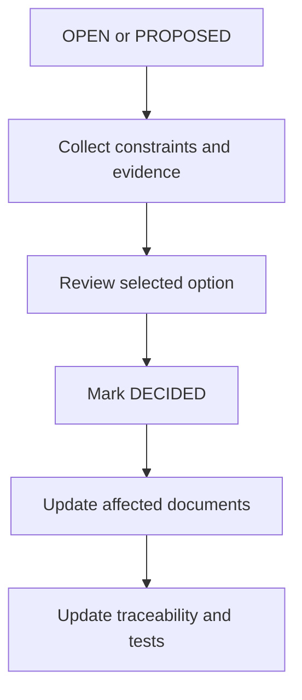

# 00 — Open Questions and Decision Registry

**Dự án:** Smart Water Flow and Pressure Monitor
**Tên viết tắt:** SWFPM
**Nhóm tài liệu:** `1.docs/00_overview`
**Cấp tài liệu:** Decision registry và implementation gate
**Trạng thái:** Active registry
**Revision marker:** `2026-07-14 — MQTT/HTTP transport, ACK, retry and RAM queue approval`

---

> **Decision update:** `DEC-COM-001`–`DEC-COM-004` đã chốt cho MVP: common `TelemetryTransport` với MQTT QoS 1 và HTTP POST/JSON, transport-level ACK (`PUBACK` hoặc HTTP `2xx`), retry bất đồng bộ sau 30 giây tối đa 3 lần liên tiếp, và bounded RAM FIFO queue 64 record. Checkpoint hiện có 38 decision đã chốt.

## 1. Mục tiêu

Tài liệu này là nơi quản lý tập trung các quyết định và câu hỏi mở xuất hiện trong `01_system_overview.md` đến `10_system_interfaces.md`.

Mục tiêu cụ thể:

* Hợp nhất các OQ trùng nội dung nhưng mang ID khác nhau.
* Phân biệt quyết định đã chốt, đề xuất đang chờ review, câu hỏi mở và nội dung deferred.
* Chỉ ra vấn đề nào chặn `11_firmware_implication.md` hoặc chặn implementation sau đó.
* Giữ liên kết từ một `Decision ID` tới tất cả OQ nguồn.
* Ngăn downstream document tự chọn hardware, threshold hoặc protocol chưa được duyệt.
* Tạo quy trình review và cập nhật nhất quán giữa các tài liệu.

Tài liệu này không thay thế nội dung kỹ thuật trong tài liệu 01–10. Nó chỉ quản lý trạng thái quyết định và trỏ tới tài liệu source-of-truth tương ứng.

---

## 2. Phạm vi

### 2.1. Nội dung thuộc phạm vi

```text
Decision status
Decision priority and implementation gate
Canonical Decision ID
Source OQ consolidation
Selected/proposed baseline
Rationale
Affected documents
Review and closure rules
```

### 2.2. Nội dung ngoài phạm vi

```text
Detailed hardware selection report
Exact component qualification
Exact firmware implementation
Exact protocol schema
Exact numeric threshold calibration
Test-result evidence
Change-control approval workflow outside this repository
```

---

## 3. Tài liệu nguồn

Registry này tổng hợp OQ từ:

```text
01_system_overview.md
02_system_block_diagram.md
03_operating_principle.md
04_main_operation_flow.md
05_sequence_diagrams.md
06_system_fsm.md
07_operating_modes.md
08_data_flow.md
09_error_handling_overview.md
10_system_interfaces.md
```

Quy ước tham chiếu OQ nguồn:

```text
01:OQ-001       -> OQ-001 trong 01_system_overview.md
03:OQ-OP-001    -> OQ-OP-001 trong 03_operating_principle.md
06:OQ-FSM-001   -> OQ-FSM-001 trong 06_system_fsm.md
10:OQ-001       -> OQ-001 trong 10_system_interfaces.md
```

Prefix tên tài liệu là bắt buộc vì `OQ-001` được dùng lại trong nhiều file.

---

## 4. Trạng thái quyết định

| Status       | Ý nghĩa                                                                      |
| ------------ | ---------------------------------------------------------------------------- |
| `DECIDED`    | Baseline đã được người có thẩm quyền chấp nhận và downstream phải tuân theo. |
| `PROPOSED`   | Đã có lựa chọn đề xuất cụ thể nhưng chưa được chấp nhận chính thức.          |
| `OPEN`       | Chưa có lựa chọn đủ căn cứ hoặc còn nhiều phương án.                         |
| `DEFERRED`   | Cố ý hoãn; không thuộc checkpoint hiện tại hoặc chưa cần cho scope hiện tại. |
| `SUPERSEDED` | Quyết định cũ đã được thay bằng decision khác; phải trỏ tới ID mới.          |

Chỉ `DECIDED` được coi là requirement/baseline bắt buộc. `PROPOSED` không được lặng lẽ biến thành implementation mặc định.

---

## 5. Mức ảnh hưởng và implementation gate

| Gate           | Ý nghĩa                                                                                                |
| -------------- | ------------------------------------------------------------------------------------------------------ |
| `GATE-A`       | Phải chốt trước khi `11_firmware_implication.md` trở thành baseline.                                   |
| `GATE-B`       | Có thể viết tài liệu 11 bằng abstraction, nhưng phải chốt trước khi implement core firmware liên quan. |
| `GATE-C`       | Phải chốt trước hardware schematic/driver/protocol implementation tương ứng.                           |
| `GATE-D`       | Có thể hoãn đến productization/production validation.                                                  |
| `NON_BLOCKING` | Không chặn checkpoint hiện tại; downstream giữ interface/TBD rõ ràng.                                  |

Một decision có thể ảnh hưởng nhiều gate; bảng registry ghi gate sớm nhất cần xử lý.

---

## 6. Quy tắc sử dụng registry

1. Mỗi vấn đề hợp nhất có một `Decision ID` duy nhất.
2. OQ trong tài liệu nguồn không bị xóa chỉ để mất traceability; nó được đánh dấu resolved/deferred và tham chiếu `Decision ID` khi tài liệu được hiệu chỉnh.
3. Mỗi thay đổi trạng thái phải có rationale và affected documents.
4. `PROPOSED -> DECIDED` cần explicit review; không tự động chuyển do firmware prototype đã dùng lựa chọn đó.
5. Quyết định hardware cụ thể phải dẫn tới tài liệu hardware owner.
6. Quyết định protocol cụ thể phải dẫn tới communication contract owner.
7. Exact test default không tự động là product threshold.
8. Nếu một decision thay đổi kiến trúc đã chốt, phải review các requirement và sequence liên quan.

---

## 7. Decision summary

### 7.1. Các quyết định đã chốt

| Decision ID     | Chủ đề                                                                                 | Status    | Gate                       |
| --------------- | -------------------------------------------------------------------------------------- | --------- | -------------------------- |
| `DEC-SYS-001`   | Vai trò BLE và 4G                                                                      | `DECIDED` | —                          |
| `DEC-SYS-002`   | Pressure chain dùng ZSSC3241                                                           | `DECIDED` | —                          |
| `DEC-SYS-003`   | Hai reporting window cấu hình được                                                     | `DECIDED` | —                          |
| `DEC-SYS-004`   | Nguồn time ưu tiên                                                                     | `DECIDED` | —                          |
| `DEC-SYS-005`   | `OFFLINE` là connectivity status                                                       | `DECIDED` | —                          |
| `DEC-SYS-006`   | Ba clock/time domain                                                                   | `DECIDED` | —                          |
| `DEC-SYS-007`   | Tập primary `SystemMode`                                                               | `DECIDED` | —                          |
| `DEC-SYS-008`   | Offline telemetry policy chưa thuộc baseline                                           | `DECIDED` | —                          |
| `DEC-HW-001`    | Pressure sensor/ZSSC3241 profile architecture                                          | `DECIDED` | Satisfied for architecture |
| `DEC-MEAS-001`  | Measurement period cấu hình được; dùng monotonic scheduler                             | `DECIDED` | Satisfied                  |
| `DEC-MEAS-002`  | Production dùng MAX35103 event-timing mode                                             | `DECIDED` | Satisfied                  |
| `DEC-MEAS-003`  | ZSSC3241 one-shot Sleep Mode; asynchronous completion                                  | `DECIDED` | Satisfied                  |
| `DEC-MEAS-004`  | Canonical quality dimensions; freshness mặc định `2 × period`                          | `DECIDED` | Satisfied                  |
| `DEC-LEAK-001`  | Versioned configurable leak profile; reset evidence khi đổi profile                    | `DECIDED` | Satisfied                  |
| `DEC-LEAK-002`  | Pressure trend thuộc MVP dưới dạng supporting evidence/diagnostics                     | `DECIDED` | Satisfied                  |
| `DEC-SCHED-001` | Time-invalid policy = `DEFER_UNTIL_VALID`; max sync age mặc định 7 ngày, cấu hình được | `DECIDED` | Satisfied                  |
| `DEC-SCHED-002` | Missed/duplicate report-slot policy = `SKIP_TO_NEXT`                                   | `DECIDED` | Satisfied                  |
| `DEC-SCHED-003` | MVP dùng scheduled-only telemetry                                                      | `DECIDED` | Satisfied                  |
| `DEC-SCHED-004` | Default window/range/timezone được chốt                                                | `DECIDED` | Satisfied                  |

### 7.2. Các architecture decision thuộc GATE-A

| Decision ID    | Chủ đề                                 | Status    | Gate      |
| -------------- | -------------------------------------- | --------- | --------- |
| `DEC-ARCH-001` | Flow path và core readiness            | `DECIDED` | Satisfied |
| `DEC-ARCH-002` | Owner của temperature processing       | `DECIDED` | Satisfied |
| `DEC-ARCH-003` | Uncompensated production flow          | `DECIDED` | Satisfied |
| `DEC-ARCH-004` | Production measurement trong `SERVICE` | `DECIDED` | Satisfied |
| `DEC-ARCH-005` | Logical I2C bus manager                | `DECIDED` | Satisfied |
| `DEC-ARCH-006` | Snapshot publication strategy          | `DECIDED` | Satisfied |
| `DEC-ARCH-007` | Config apply acknowledgement           | `DECIDED` | Satisfied |
| `DEC-ARCH-008` | OTA scope                              | `DECIDED` | Satisfied |

### 7.3. Open/deferred summary

| Nhóm                        | Số decision | Gate chủ yếu      |
| --------------------------- | ----------: | ----------------- |
| Hardware/component          |           4 | `GATE-B`/`GATE-C` |
| Measurement/algorithm       |           0 | —                 |
| Reporting/time/connectivity |           0 | —                 |
| Storage/data/diagnostics    |           3 | `GATE-B`/`GATE-D` |
| Error/power/service         |           8 | `GATE-B`/`GATE-C` |

---

## 8. Các quyết định đã chốt

### 8.1. `DEC-SYS-001` — Vai trò BLE và 4G

| Field         | Giá trị                                                                                                                                 |
| ------------- | --------------------------------------------------------------------------------------------------------------------------------------- |
| Status        | `DECIDED`                                                                                                                               |
| Decision      | nRF52810 dùng UART riêng cho local configuration/service; EC200U-CN dùng UART riêng cho time synchronization và gửi dữ liệu lên server. |
| Rationale     | Tách local configuration khỏi remote telemetry và tránh dùng chung parser/session context.                                              |
| Consequence   | Firmware có `BleConfigService` và cellular/telemetry context độc lập; hai module dùng hai UART peripheral riêng.                        |
| Source OQ     | 01:OQ-002, 01:OQ-003, 02:OQ-002, 02:OQ-003, 03:OQ-OP-002, 03:OQ-OP-003                                                                  |
| Affected docs | 01, 02, 03, 04, 05, 08, 10, 11                                                                                                          |

Model module và operating model đã được chốt trong `DEC-HW-002`/`DEC-HW-003`. GATT, AT syntax/framing và bản tin điện thoại–STM32 vẫn thuộc communication contract riêng; MQTT/HTTP, transport response, retry và telemetry queue đã được chốt trong `DEC-COM-001`–`DEC-COM-004`.

### 8.2. `DEC-SYS-002` — Pressure chain dùng ZSSC3241

| Field         | Giá trị                                                                                                                                                                                                                  |
| ------------- | ------------------------------------------------------------------------------------------------------------------------------------------------------------------------------------------------------------------------ |
| Status        | `DECIDED`                                                                                                                                                                                                                |
| Decision      | Pressure subsystem dùng resistive pressure bridge kết hợp ZSSC3241; MCU giao tiếp với ZSSC3241 qua I2C. Mỗi product variant chọn một pressure-sensor/ZSSC3241 profile tương thích theo `DEC-HW-001`.                     |
| Rationale     | ZSSC3241 là signal conditioner/digitizer; nó không thay thế pressure transducer cơ khí.                                                                                                                                  |
| Consequence   | Driver boundary chốt ở ZSSC3241. Model-specific values nằm trong versioned build-time profile; sai số riêng của thiết bị nằm trong calibration record; runtime chỉ thay đổi field được allowlist trong validated bounds. |
| Source OQ     | 01:OQ-001, 02:OQ-001, 03:OQ-OP-001, 10:OQ-001                                                                                                                                                                            |
| Affected docs | 01, 02, 03, 04, 05, 08, 09, 10, hardware docs                                                                                                                                                                            |

### 8.3. `DEC-SYS-003` — Hai reporting window cấu hình được

| Field         | Giá trị                                                                                                                     |
| ------------- | --------------------------------------------------------------------------------------------------------------------------- |
| Status        | `DECIDED`                                                                                                                   |
| Decision      | Có đúng hai `ReportingWindow`; mỗi window có start boundary và interval cấu hình qua BLE. Window không cố định là ngày/đêm. |
| Rationale     | Người dùng có thể chọn hai khoảng thời gian và tần suất khác nhau.                                                          |
| Consequence   | End boundary của một window được suy ra từ start của window còn lại trong chu kỳ 24 giờ.                                    |
| Source OQ     | 01:OQ-005, 03:OQ-OP-010, 04:OQ-FLOW-004, 10:OQ-013                                                                          |
| Affected docs | 01, 03, 04, 05, 08, 10, 13                                                                                                  |

Giá trị default và validation range được chốt bởi `DEC-SCHED-004`.

### 8.4. `DEC-SYS-004` — Nguồn time ưu tiên

| Field         | Giá trị                                                                              |
| ------------- | ------------------------------------------------------------------------------------ |
| Status        | `DECIDED`                                                                            |
| Decision      | Time từ 4G/network/server là nguồn đồng bộ ưu tiên cao nhất trong baseline hiện tại. |
| Rationale     | Nguồn remote/network được kỳ vọng chính xác hơn retained local RTC.                  |
| Consequence   | `TimeService` validate nguồn trước khi cập nhật STM32 RTC/system wall-clock.         |
| Source OQ     | 01:OQ-010, 02:OQ-008, 10:OQ-008                                                      |
| Affected docs | 03, 04, 05, 08, 10, 13                                                               |

Exact network time hay application-server time được phân biệt sau khi chọn 4G/protocol.

### 8.5. `DEC-SYS-005` — `OFFLINE` là connectivity status

| Field         | Giá trị                                                                      |
| ------------- | ---------------------------------------------------------------------------- |
| Status        | `DECIDED`                                                                    |
| Decision      | `OFFLINE` thuộc `ConnectivityStatus`, không thuộc primary `SystemMode`.      |
| Rationale     | Measurement, leak detection, BLE và LCD vẫn hoạt động khi 4G không khả dụng. |
| Consequence   | Ví dụ hợp lệ: `SystemMode=NORMAL`, `ConnectivityStatus=OFFLINE`.             |
| Source OQ     | Các OQ telemetry/offline trong 01, 02, 03, 04, 06–10                         |
| Affected docs | 06, 07, 08, 09, 11, 13                                                       |

### 8.6. `DEC-SYS-006` — Ba clock/time domain

| Field         | Giá trị                                                                                                            |
| ------------- | ------------------------------------------------------------------------------------------------------------------ |
| Status        | `DECIDED`                                                                                                          |
| Decision      | Hệ thống phân biệt clock/event timing của MAX35103, STM32 HAL/RTC timekeeping và 4G/server synchronization source. |
| Rationale     | Ba nguồn có vai trò khác nhau; MAX clock không tự động là reporting wall-clock authority.                          |
| Consequence   | `TimeService` sở hữu system time; MAX timing được map vào measurement metadata.                                    |
| Source OQ     | 01:OQ-010, 02:OQ-008, 04/05 time-related flows, 10:OQ-008                                                          |
| Affected docs | 03, 04, 05, 08, 10, 11                                                                                             |

### 8.7. `DEC-SYS-007` — Primary SystemMode

| Field         | Giá trị                                                                                               |
| ------------- | ----------------------------------------------------------------------------------------------------- |
| Status        | `DECIDED`                                                                                             |
| Decision      | Primary mode gồm `INIT`, `NORMAL`, `LOW_POWER`, `SERVICE`, `RECOVERY`, `ERROR`.                       |
| Rationale     | Mode loại trừ nhau; connectivity, time, measurement và leak là status trực giao.                      |
| Consequence   | Firmware phải có một `SystemModeManager`; internal driver/service phase không được trộn vào enum này. |
| Source OQ     | 06/07 operating-mode review                                                                           |
| Affected docs | 06, 07, 09, 11                                                                                        |

### 8.8. `DEC-SYS-008` — Offline telemetry policy delegated

| Field         | Giá trị                                                                                                                                                                     |
| ------------- | --------------------------------------------------------------------------------------------------------------------------------------------------------------------------- |
| Status        | `DECIDED`                                                                                                                                                                   |
| Decision      | Numeric offline/ACK policy được sở hữu bởi tài liệu 13 và `DEC-COM-001`–`DEC-COM-004`; các decision này hiện đã chốt cho MVP.                                               |
| Rationale     | Tách scheduling/time decision khỏi transport, retry và queue policy để mỗi owner có contract rõ ràng.                                                                       |
| Consequence   | Tài liệu 11 phải triển khai common transport, transport-level response, retry 30 giây × 3 và RAM FIFO 64 record theo tài liệu 13.                                           |
| Source OQ     | 01:OQ-004/009, 02:OQ-004/007, 03:OQ-OP-006/007/008, 04:OQ-FLOW-006/007/008/009, 05:OQ-SEQ-006/007, 07:OQ-MODE-012, 08:OQ-DATA-011/012/013/014, 09:OQ-ERR-013, 10:OQ-007/012 |
| Affected docs | 08, 09, 10, 11, 13                                                                                                                                                          |

---

## 9. Architecture decisions cho tài liệu 11

### 9.1. `DEC-ARCH-001` — Flow path và core readiness

| Field         | Giá trị                                                                                                                                                                                                                                                                                                                                                                                                                                                                                                                                                                                                    |
| ------------- | ---------------------------------------------------------------------------------------------------------------------------------------------------------------------------------------------------------------------------------------------------------------------------------------------------------------------------------------------------------------------------------------------------------------------------------------------------------------------------------------------------------------------------------------------------------------------------------------------------------- |
| Status        | `DECIDED`                                                                                                                                                                                                                                                                                                                                                                                                                                                                                                                                                                                                  |
| Gate          | `GATE-A` — satisfied                                                                                                                                                                                                                                                                                                                                                                                                                                                                                                                                                                                       |
| Question      | `INIT -> NORMAL` có bắt buộc flow path sẵn sàng không; runtime có cho flow unavailable degraded không?                                                                                                                                                                                                                                                                                                                                                                                                                                                                                                     |
| Decision      | Trong mỗi production boot, flow path phải khởi tạo thành công và tạo được ít nhất một self-check hoặc measurement result hợp lệ theo readiness policy trước khi `INIT -> NORMAL`. Trong runtime, flow fault tạm thời giữ `SystemMode=NORMAL` với flow/measurement status `DEGRADED` trong bounded local recovery. Volume update và flow-dependent leak evidence bị tạm dừng. Khi local recovery hết budget, hệ thống chuyển `RECOVERY`; chỉ chuyển `ERROR` khi coordinated recovery thất bại và không còn core flow operation an toàn. Authorized service boot vẫn có thể vào `SERVICE` theo policy riêng. |
| Rationale     | Flow là nguồn đo chính cho volume và leak; đồng thời tránh đưa toàn hệ thống vào `ERROR` chỉ vì một lỗi transient.                                                                                                                                                                                                                                                                                                                                                                                                                                                                                         |
| Source OQ     | 06:OQ-FSM-001/002, 07:OQ-MODE-001/002, 09:OQ-ERR-004                                                                                                                                                                                                                                                                                                                                                                                                                                                                                                                                                       |
| Affected docs | 01, 03, 04, 05, 06, 07, 08, 09, 10, 11, 12                                                                                                                                                                                                                                                                                                                                                                                                                                                                                                                                                                 |

### 9.2. `DEC-ARCH-002` — Owner của temperature processing

| Field         | Giá trị                                                                                                                                                                                                                                                                                                                                                                                                                                |
| ------------- | -------------------------------------------------------------------------------------------------------------------------------------------------------------------------------------------------------------------------------------------------------------------------------------------------------------------------------------------------------------------------------------------------------------------------------------- |
| Status        | `DECIDED`                                                                                                                                                                                                                                                                                                                                                                                                                              |
| Gate          | `GATE-A` — satisfied                                                                                                                                                                                                                                                                                                                                                                                                                   |
| Question      | Temperature processing là service riêng hay thuộc calibration?                                                                                                                                                                                                                                                                                                                                                                         |
| Decision      | `MeasurementManager` sở hữu acquisition và validation ban đầu của raw temperature-related result từ MAX35103. Temperature conversion, sensor-curve calculation, calibration, filtering/quality assignment và publication thuộc `CalibrationService`. `CalibrationService` là owner duy nhất của immutable/versioned `TemperatureResult`; flow compensation, `DataRepository`, LCD, telemetry và diagnostics chỉ đọc result đã publish. |
| Rationale     | Temperature chủ yếu phục vụ flow compensation; tránh thêm service owner không cần thiết nhưng vẫn giữ data contract rõ.                                                                                                                                                                                                                                                                                                                |
| Source OQ     | 05:OQ-SEQ-002, 08:OQ-DATA-003                                                                                                                                                                                                                                                                                                                                                                                                          |
| Affected docs | 03, 04, 05, 08, 10, glossary, README, 11, 12                                                                                                                                                                                                                                                                                                                                                                                           |

### 9.3. `DEC-ARCH-003` — Uncompensated production flow

| Field         | Giá trị                                                                                                                                                                                                                                                                                                                                                                                                                                                                                                           |
| ------------- | ----------------------------------------------------------------------------------------------------------------------------------------------------------------------------------------------------------------------------------------------------------------------------------------------------------------------------------------------------------------------------------------------------------------------------------------------------------------------------------------------------------------- |
| Status        | `DECIDED`                                                                                                                                                                                                                                                                                                                                                                                                                                                                                                         |
| Gate          | `GATE-A` — satisfied                                                                                                                                                                                                                                                                                                                                                                                                                                                                                              |
| Question      | Có cho phép production `FlowResult` khi temperature compensation không khả dụng?                                                                                                                                                                                                                                                                                                                                                                                                                                  |
| Decision      | Không cho uncompensated production flow trong baseline. Khi không có `TemperatureResult` usable theo pairing/quality policy, firmware chỉ được publish `FlowResult` với `INVALID` hoặc `DEGRADED_NOT_ACCEPTED` để quan sát trạng thái/chẩn đoán. Result này không cập nhật volume, không tạo flow-based leak evidence và không được xem là production telemetry hợp lệ. Chỉ mở held-temperature hoặc uncompensated fallback sau khi validation chứng minh error budget chấp nhận được và policy được version hóa. |
| Rationale     | Ngăn volume/leak sử dụng flow có sai số chưa định lượng.                                                                                                                                                                                                                                                                                                                                                                                                                                                          |
| Source OQ     | 03:OQ-OP-011, 04:OQ-FLOW-010, 08:OQ-DATA-004                                                                                                                                                                                                                                                                                                                                                                                                                                                                      |
| Affected docs | README, glossary, 03, 04, 05, 08, 09, 11, 12                                                                                                                                                                                                                                                                                                                                                                                                                                                                      |

### 9.4. `DEC-ARCH-004` — Production measurement trong SERVICE

| Field         | Giá trị                                                                                                                                                                                                                                                                                                                                                                                                                                                                                    |
| ------------- | ------------------------------------------------------------------------------------------------------------------------------------------------------------------------------------------------------------------------------------------------------------------------------------------------------------------------------------------------------------------------------------------------------------------------------------------------------------------------------------------ |
| Status        | `DECIDED`                                                                                                                                                                                                                                                                                                                                                                                                                                                                                  |
| Gate          | `GATE-A` — satisfied                                                                                                                                                                                                                                                                                                                                                                                                                                                                       |
| Question      | `SERVICE` có cho normal production measurement chạy song song không?                                                                                                                                                                                                                                                                                                                                                                                                                       |
| Decision      | Khi vào `SERVICE`, production measurement scheduler và production consumer path được quiesce mặc định. Authorized service profile có thể yêu cầu bounded `SERVICE_SAMPLE` hoặc `CALIBRATION_SAMPLE`; mọi result phải mang provenance tương ứng và không được update production volume, production leak state/evidence hoặc scheduled production telemetry. Khi thoát `SERVICE`, chỉ production sample mới sau khi production scheduling được restore mới được phép tiếp tục product state. |
| Rationale     | Đơn giản hóa scheduling và ngăn test stimulus làm nhiễm product state.                                                                                                                                                                                                                                                                                                                                                                                                                     |
| Source OQ     | 06:OQ-FSM-003, 07:OQ-MODE-005                                                                                                                                                                                                                                                                                                                                                                                                                                                              |
| Affected docs | README, glossary, 06, 07, 08, 11, 12                                                                                                                                                                                                                                                                                                                                                                                                                                                       |

### 9.5. `DEC-ARCH-005` — Logical I2C bus manager

| Field         | Giá trị                                                                                                                                                                                                                                                                                                                                                                          |
| ------------- | -------------------------------------------------------------------------------------------------------------------------------------------------------------------------------------------------------------------------------------------------------------------------------------------------------------------------------------------------------------------------------- |
| Status        | `DECIDED`                                                                                                                                                                                                                                                                                                                                                                        |
| Gate          | `GATE-A` — satisfied                                                                                                                                                                                                                                                                                                                                                             |
| Question      | Firmware quản lý ZSSC3241/F-RAM I2C ownership và recovery thế nào khi physical topology chưa chốt?                                                                                                                                                                                                                                                                               |
| Decision      | Dùng logical `I2cBusManager`/bus-owner abstraction làm owner duy nhất của arbitration, transaction admission, timeout, cancellation và bus recovery. `PressureMeasurementService` và `StorageService` gửi transaction request qua logical port, không gọi HAL I2C trực tiếp. Physical binding đã được chốt bởi `DEC-HW-006`: ZSSC3241 và FM24CL04B dùng chung một owner context. |
| Rationale     | Cho phép viết architecture trước schematic mà không làm mất shared-bus recovery contract.                                                                                                                                                                                                                                                                                        |
| Source OQ     | 09:OQ-ERR-005, 10:OQ-002                                                                                                                                                                                                                                                                                                                                                         |
| Affected docs | README, glossary, 04, 08, 09, 10, 11, 12, hardware docs                                                                                                                                                                                                                                                                                                                          |

### 9.6. `DEC-ARCH-006` — Snapshot publication strategy

| Field         | Giá trị                                                                                                                                                                                                                                                                                                                                                     |
| ------------- | ----------------------------------------------------------------------------------------------------------------------------------------------------------------------------------------------------------------------------------------------------------------------------------------------------------------------------------------------------------- |
| Status        | `DECIDED`                                                                                                                                                                                                                                                                                                                                                   |
| Gate          | `GATE-A` — satisfied                                                                                                                                                                                                                                                                                                                                        |
| Question      | `RuntimeSnapshot` dùng double buffer hay versioned read/lock?                                                                                                                                                                                                                                                                                               |
| Decision      | `DataRepository` dùng đúng hai `RuntimeSnapshot` buffer. Writer chỉ cập nhật inactive buffer, hoàn tất toàn bộ metadata/version, thực hiện publication barrier phù hợp rồi atomic swap active index. Consumer capture active index một lần và chỉ đọc buffer tương ứng; không giữ reference qua publication tiếp theo nếu lifetime contract không cho phép. |
| Rationale     | Consumer LCD/telemetry đọc đơn giản, tránh mixed-version snapshot và giảm coupling với RTOS choice.                                                                                                                                                                                                                                                         |
| Source OQ     | 08:OQ-DATA-008                                                                                                                                                                                                                                                                                                                                              |
| Affected docs | README, glossary, 05, 08, 10, 11, 12                                                                                                                                                                                                                                                                                                                        |

### 9.7. `DEC-ARCH-007` — Config apply acknowledgement

| Field         | Giá trị                                                                                                                                                                                                                                                                                                                                                                                                                                            |
| ------------- | -------------------------------------------------------------------------------------------------------------------------------------------------------------------------------------------------------------------------------------------------------------------------------------------------------------------------------------------------------------------------------------------------------------------------------------------------- |
| Status        | `DECIDED`                                                                                                                                                                                                                                                                                                                                                                                                                                          |
| Gate          | `GATE-A` — satisfied                                                                                                                                                                                                                                                                                                                                                                                                                               |
| Question      | Service đích xác nhận config apply thế nào?                                                                                                                                                                                                                                                                                                                                                                                                        |
| Decision      | Sau persistent commit và `ActiveConfig` version replacement, `ConfigRepository` gửi apply request gồm `transaction_id`, `config_version` và changed-field mask tới từng affected service. Service apply tại safe boundary và trả `APPLIED`, `DEFERRED` hoặc `REJECTED` cùng reason và matching version. `ConfigRepository` tổng hợp per-service status; BLE success không được đồng nghĩa mọi service đã apply nếu còn `DEFERRED` hoặc `REJECTED`. |
| Rationale     | Phân biệt persistent commit thành công với runtime apply thành công.                                                                                                                                                                                                                                                                                                                                                                               |
| Source OQ     | 05:OQ-SEQ-004                                                                                                                                                                                                                                                                                                                                                                                                                                      |
| Affected docs | README, glossary, 04, 05, 08, 10, 11, 12                                                                                                                                                                                                                                                                                                                                                                                                           |

### 9.8. `DEC-ARCH-008` — OTA scope

| Field         | Giá trị                                                                                                                                                                                                                                                                                                                                                                                           |
| ------------- | ------------------------------------------------------------------------------------------------------------------------------------------------------------------------------------------------------------------------------------------------------------------------------------------------------------------------------------------------------------------------------------------------- |
| Status        | `DECIDED`                                                                                                                                                                                                                                                                                                                                                                                         |
| Gate          | `GATE-A` — satisfied                                                                                                                                                                                                                                                                                                                                                                              |
| Question      | OTA có thuộc baseline hiện tại không?                                                                                                                                                                                                                                                                                                                                                             |
| Decision      | OTA firmware update và remote configuration/command qua 4G không thuộc baseline hiện tại. Cellular downlink chỉ được xử lý ở mức response cần thiết cho telemetry/time contract đã định nghĩa; không có OTA image, bootloader update, remote config apply hoặc generic remote-command interface. Bổ sung các chức năng này là future scope và bắt buộc system architecture/security review riêng. |
| Rationale     | Chưa có bootloader, image storage, rollback, signing và security requirement.                                                                                                                                                                                                                                                                                                                     |
| Source OQ     | 01:OQ-011, 03:OQ-OP-013                                                                                                                                                                                                                                                                                                                                                                           |
| Affected docs | README, glossary, 01, 02, 10, 11, 12                                                                                                                                                                                                                                                                                                                                                              |

---

## 10. Hardware và physical-interface decisions

| Decision ID  | Chủ đề                                            | Status    | Gate                                                                | Source OQ                                                            | Required output                                             |
| ------------ | ------------------------------------------------- | --------- | ------------------------------------------------------------------- | -------------------------------------------------------------------- | ----------------------------------------------------------- |
| `DEC-HW-001` | Pressure sensor/ZSSC3241 profile architecture     | `DECIDED` | Satisfied for architecture; per-variant release gate remains        | 01:OQ-001, 02:OQ-001, 03:OQ-OP-001, 08:OQ-DATA-005, 10:OQ-001        | Versioned variant/profile/calibration/config contract       |
| `DEC-HW-002` | BLE module model và UART operating model          | `DECIDED` | Satisfied for MVP architecture; communication-contract gate remains | 01:OQ-002, 02:OQ-002, 03:OQ-OP-002, 10:OQ-003                        | nRF52810 BLE coprocessor profile; protocol document pending |
| `DEC-HW-003` | 4G module, cellular technology và UART control    | `DECIDED` | Satisfied for MVP architecture; qualification gate remains          | 01:OQ-003, 02:OQ-003, 03:OQ-OP-003, 10:OQ-005/006                    | EC200U-CN modem profile and board qualification             |
| `DEC-HW-004` | LCD model, size và physical interface             | `OPEN`    | `GATE-C`                                                            | 01:OQ-007, 02:OQ-005, 03:OQ-OP-004, 10:OQ-009                        | Display hardware/driver specification                       |
| `DEC-HW-005` | Power source, battery và 4G peak-current budget   | `OPEN`    | `GATE-C`                                                            | 01:OQ-008, 02:OQ-006, 03:OQ-OP-005, 10:OQ-010                        | Power budget và schematic requirement                       |
| `DEC-HW-006` | ZSSC3241 và F-RAM chung hay tách physical I2C     | `DECIDED` | Satisfied for schematic/firmware binding                            | 10:OQ-002                                                            | Shared physical I2C dưới một `I2cBusManager`                |
| `DEC-HW-007` | STM32 low-power state và wake-capable peripherals | `OPEN`    | `GATE-B`                                                            | 04:OQ-FLOW-011, 05:OQ-SEQ-008, 06:OQ-FSM-005, 07:OQ-MODE-006/007/008 | Power-state/wake matrix                                     |
| `DEC-HW-008` | Service UART riêng ngoài SWD                      | `OPEN`    | `GATE-C`                                                            | 10:OQ-011                                                            | Debug/service interface decision                            |

Logical firmware architecture được phép dùng abstraction trong khi các decision còn lại mở. Với `DEC-HW-001`, kiến trúc profile đã chốt nhưng mỗi firmware variant vẫn phải có hardware datasheet, profile values và qualification evidence trước release.

### 10.1. `DEC-HW-001` — Pressure sensor/ZSSC3241 profile architecture

| Field                         | Giá trị                                                                                                                                                                                                                                                                                                                                 |
| ----------------------------- | --------------------------------------------------------------------------------------------------------------------------------------------------------------------------------------------------------------------------------------------------------------------------------------------------------------------------------------- |
| Status                        | `DECIDED`                                                                                                                                                                                                                                                                                                                               |
| Gate                          | Architecture gate satisfied; product-variant qualification required before production release                                                                                                                                                                                                                                           |
| Decision                      | Dùng một codebase firmware chung để tạo nhiều firmware variant. Mỗi variant chọn build-time `ProductVariantManifest` liên kết đúng một `PressureSensorProfile` với một `Zssc3241Profile`. Mỗi thiết bị giữ `PressureCalibrationRecord` riêng. Runtime chỉ cho phép thay đổi `PressureRuntimeConfig` theo allowlist và validated bounds. |
| Immutable/build-time boundary | Sensor model ID, pressure reference type, bridge topology, rated range/overpressure, ZSSC3241 analog-front-end/register profile, conversion capability và compatibility rules không được thay đổi tùy ý lúc runtime. Đổi loại sensor yêu cầu firmware variant/profile tương ứng và provisioning/qualification lại.                      |
| Per-device boundary           | Zero offset, gain correction, temperature coefficients, sensor serial/binding, calibration counter, schema/version và integrity thuộc calibration record riêng của thiết bị.                                                                                                                                                            |
| Runtime boundary              | Chu kỳ đo, freshness và các operational threshold được phép cấu hình chỉ khi field nằm trong allowlist, nằm trong product-profile bounds, persistent commit thành công và service apply matching version. Raw ZSSC3241 register write không được expose như generic runtime configuration.                                              |
| Compatibility                 | Boot phải kiểm tra manifest/profile/calibration IDs, schema, CRC và compatible-version tuple. Mismatch hoặc invalid calibration chặn `production_acceptance=ACCEPTED`; chỉ cho diagnostics/authorized service theo policy.                                                                                                              |
| Consumer boundary             | Application, leak detection, LCD và telemetry chỉ đọc canonical `PressureResult`; không phụ thuộc sensor model, gain code hoặc raw ZSSC3241 registers.                                                                                                                                                                                  |
| Rationale                     | Cho phép tái sử dụng logic, tránh fork source theo sensor, giữ calibration theo từng thiết bị và ngăn runtime configuration phá vỡ analog/safety assumptions của variant.                                                                                                                                                               |
| Required artifacts            | `ProductVariantManifest`, `PressureSensorProfile`, `Zssc3241Profile`, `PressureCalibrationRecord`, `PressureRuntimeConfig`, `PressureResult` contract và per-variant qualification report.                                                                                                                                              |
| Source OQ                     | 01:OQ-001, 02:OQ-001, 03:OQ-OP-001, 08:OQ-DATA-005, 10:OQ-001, principle:OQ-PM-001/002/003/004/006/007/012                                                                                                                                                                                                                              |
| Affected docs                 | README, glossary, 01–05, 07–12, pressure principle, validation plan, hardware/firmware/storage/simulation docs                                                                                                                                                                                                                          |

Model, numeric range, accuracy, register values và timeout cụ thể của từng sensor vẫn cần datasheet/characterization evidence. Đây là công việc tạo và qualify product variant, không còn là lựa chọn kiến trúc mở.

### 10.2. `DEC-HW-002` — nRF52810 BLE coprocessor và UART/AT boundary

| Field             | Giá trị                                                                                                                                                                                                                                                              |
| ----------------- | -------------------------------------------------------------------------------------------------------------------------------------------------------------------------------------------------------------------------------------------------------------------- |
| Status            | `DECIDED`                                                                                                                                                                                                                                                            |
| Gate              | MVP architecture gate satisfied; detailed communication contract required before protocol implementation freeze                                                                                                                                                      |
| Hardware          | Nordic nRF52810, firmware BLE do dự án tự phát triển                                                                                                                                                                                                                 |
| STM32 link        | Một UART riêng, `115200 8N1`, không RTS/CTS; receive dùng DMA/ring buffer và frame/buffer phải có giới hạn                                                                                                                                                           |
| Operating model   | STM32 điều khiển nRF52810 bằng tập lệnh AT tự định nghĩa. Dữ liệu ứng dụng giữa điện thoại và STM32 đi qua custom BLE GATT rồi UART; dùng bounded framing và stop-and-wait/application acknowledgement hoặc backpressure tương đương.                                |
| Responsibility    | nRF52810 sở hữu BLE stack, advertising, một kết nối BLE tại một thời điểm trong MVP, GATT endpoint, UART transport và AT parser. STM32 sở hữu command nghiệp vụ, authorization decision, `PendingConfig`, validation, persistent commit và apply vào `ActiveConfig`. |
| Safety boundary   | nRF52810 không được tự apply hoặc persist product configuration; UART callback trên STM32 không được thay đổi trực tiếp active state.                                                                                                                                |
| Out of scope      | BLE OTA/DFU không thuộc MVP theo `DEC-ARCH-008`.                                                                                                                                                                                                                     |
| Deferred contract | UUID/GATT layout, pairing/security, AT syntax, message IDs, framing/CRC/fragmentation, timeout, versioning và bản tin điện thoại–STM32 phải được chốt trong tài liệu communication riêng.                                                                            |
| Rationale         | Tách BLE stack khỏi MCU chính nhưng giữ STM32 là product authority; custom firmware cho phép giao thức local phù hợp MVP mà không phụ thuộc firmware module đóng.                                                                                                    |
| Affected docs     | README, glossary, 01–05, 07–13, communication specification, firmware/hardware docs                                                                                                                                                                                  |

### 10.3. `DEC-HW-003` — EC200U-CN LTE Cat 1 bis modem profile

| Field              | Giá trị                                                                                                                                                                                                                                                                                                                                                                                               |
| ------------------ | ----------------------------------------------------------------------------------------------------------------------------------------------------------------------------------------------------------------------------------------------------------------------------------------------------------------------------------------------------------------------------------------------------- |
| Status             | `DECIDED`                                                                                                                                                                                                                                                                                                                                                                                             |
| Gate               | MVP architecture gate satisfied; board/operator/power qualification required before release                                                                                                                                                                                                                                                                                                           |
| Hardware           | Quectel EC200U-CN, LTE Cat 1 bis, một physical SIM                                                                                                                                                                                                                                                                                                                                                    |
| STM32 link         | Main UART riêng, `115200 8N1`, RTS/CTS bật. Board route tối thiểu TX/RX/RTS/CTS/PWRKEY/RESET_N/STATUS và đưa DTR/RI ra MCU khi phù hợp schematic.                                                                                                                                                                                                                                                     |
| Operating model    | STM32 là application host và dùng bộ lệnh AT chuẩn của modem; dùng TCP/IP/protocol stack bên trong EC200U-CN, không dùng PPP trên STM32 cho MVP. Parser phải non-blocking, tách command response khỏi URC và có bounded timeout/recovery.                                                                                                                                                             |
| Configuration/time | APN là versioned persistent configuration, chỉ local authorized configuration được phép đổi. Time lấy qua network/NTP thông qua modem vào `TimeService`; STM32 RTC làm holdover.                                                                                                                                                                                                                      |
| Unused features    | Bluetooth tích hợp của modem không dùng vì nRF52810 sở hữu BLE. GNSS, voice/audio, QuecOpen/QuecPython và FOTA không thuộc MVP; USB chỉ là tùy chọn factory/debug, không phải runtime path.                                                                                                                                                                                                           |
| Detailed contract  | MQTT topic/HTTP URL/header, exact JSON field mapping, credential/TLS và adapter timeout thuộc communication specification. Protocol/transport response/retry/queue policy đã chốt bởi `DEC-COM-001`–`DEC-COM-004`. Exact ordering code, modem firmware, operator/band acceptance và peak-current qualification là release artifacts, không mở lại architecture nếu responsibility boundary không đổi. |
| Rationale          | Dùng modem AT tiêu chuẩn và internal stack giảm footprint/rủi ro tích hợp trên STM32, đồng thời giữ telemetry độc lập với measurement pipeline.                                                                                                                                                                                                                                                       |
| Affected docs      | README, glossary, 01–05, 07–13, communication specification, firmware/hardware/power docs                                                                                                                                                                                                                                                                                                             |

### 10.4. `DEC-HW-006` — Shared physical I2C cho pressure và F-RAM

| Field           | Giá trị                                                                                                                                                                                        |
| --------------- | ---------------------------------------------------------------------------------------------------------------------------------------------------------------------------------------------- |
| Status          | `DECIDED`                                                                                                                                                                                      |
| Gate            | `GATE-C` — satisfied for schematic/firmware binding                                                                                                                                            |
| Decision        | ZSSC3241 và FM24CL04B dùng chung một physical I2C để tiết kiệm peripheral STM32. Physical bus có đúng một `I2cBusManager` owner cho arbitration, admission, timeout, cancellation và recovery. |
| Priority        | Pressure transaction có priority cao hơn storage. Storage được chia thành bounded transaction ngắn; không preempt một I2C transaction đang active.                                             |
| Driver boundary | `Zssc3241Driver` và `FramDriver` chỉ submit logical transaction; không gọi HAL I2C hoặc tự reset/recover peripheral.                                                                           |
| Recovery        | Bus manager stop admission, resolve/cancel in-flight request deterministically, thực hiện bounded recovery và increment generation trước khi mở lại bus. Stale completion không được apply.    |
| Qualification   | Board phải chứng minh address compatibility, pull-up/timing/capacitance và chọn common qualified I2C frequency.                                                                                |
| Rationale       | Tiết kiệm MCU peripheral nhưng vẫn giữ deterministic ownership và ngăn storage làm mất pressure deadline.                                                                                      |
| Affected docs   | README, glossary, 01–05, 07–12, hardware/firmware/storage docs                                                                                                                                 |

---

## 11. Measurement và algorithm decisions

| Decision ID    | Chủ đề                                             | Status    | Gate      | Source OQ                                              | Direction hiện tại                                                                              |
| -------------- | -------------------------------------------------- | --------- | --------- | ------------------------------------------------------ | ----------------------------------------------------------------------------------------------- |
| `DEC-MEAS-001` | Measurement period của flow, temperature, pressure | `DECIDED` | Satisfied | 04:OQ-FLOW-001, 08:OQ-DATA-002                         | Per-stream configurable period; dùng monotonic scheduler                                        |
| `DEC-MEAS-002` | MAX direct mode hay event-timing production        | `DECIDED` | Satisfied | 04:OQ-FLOW-002, 05:OQ-SEQ-001                          | Production dùng event-timing; direct chỉ service/calibration/diagnostic                         |
| `DEC-MEAS-003` | ZSSC3241 trigger/read mode và conversion timing    | `DECIDED` | Satisfied | 04:OQ-FLOW-003, 05:OQ-SEQ-003                          | Sleep Mode one-shot qua I2C; EOC hoặc bounded polling; STM32 monotonic scheduler sở hữu cadence |
| `DEC-MEAS-004` | Exact quality enum và freshness limits             | `DECIDED` | Satisfied | 08:OQ-DATA-001/002                                     | Tách validity/freshness/acceptance/reason flags; default max age = `2 × active period`          |
| `DEC-LEAK-001` | Leak thresholds, evidence window, confirm/clear    | `DECIDED` | Satisfied | 01:OQ-006, 02:OQ-009, 05:OQ-LA-010                     | Các field thuộc versioned configurable leak profile; đổi profile reset evidence                 |
| `DEC-LEAK-002` | Pressure trend có thuộc MVP                        | `DECIDED` | Satisfied | 03:OQ-OP-012, principle:OQ-PM-010/OQ-LA-006/OQ-VAL-008 | Có trong MVP dưới dạng derived diagnostics/supporting flags; không tự đổi hoặc clear leak state |

Exact numeric default/range của leak profile thuộc product calibration/validation dataset; không làm thay đổi decision về ownership, transaction và evidence-reset behavior.

### 11.1. `DEC-MEAS-001` — Measurement period

| Field           | Giá trị                                                                                                                                                            |
| --------------- | ------------------------------------------------------------------------------------------------------------------------------------------------------------------ |
| Status          | `DECIDED`                                                                                                                                                          |
| Decision        | Flow, temperature và pressure có period cấu hình độc lập trong `ActiveConfig`; mọi deadline/duration dùng monotonic scheduler.                                     |
| Config behavior | Candidate phải validate theo product-profile bounds, persistent commit và apply qua matching config version. Exact numeric default/min/max thuộc profile chi tiết. |
| Consequence     | Measurement period độc lập reporting interval; thay đổi period phải invalidate stale deadline/generation mà không tạo duplicate cycle.                             |
| Source OQ       | 04:OQ-FLOW-001, 08:OQ-DATA-002, principle:OQ-UF-005                                                                                                                |
| Affected docs   | 01, 03, 04, 05, 06, 07, 08, 09, 10, 11, 12, principle 01, README, glossary                                                                                         |

### 11.2. `DEC-MEAS-002` — MAX35103 production mode

| Field         | Giá trị                                                                                                                                    |
| ------------- | ------------------------------------------------------------------------------------------------------------------------------------------ |
| Status        | `DECIDED`                                                                                                                                  |
| Decision      | Production measurement dùng MAX35103 event-timing mode. Direct mode chỉ dùng cho authorized `SERVICE_SAMPLE`, calibration hoặc diagnostic. |
| Guard         | Direct-mode result không được cập nhật production volume, leak evidence hoặc scheduled telemetry.                                          |
| Rationale     | Giảm MCU intervention và phù hợp low-power/periodic metering; vẫn giữ direct mode cho bring-up và service.                                 |
| Source OQ     | 04:OQ-FLOW-002, 05:OQ-SEQ-001, principle:OQ-UF-004                                                                                         |
| Affected docs | 01, 02, 03, 04, 05, 06, 07, 08, 09, 10, 11, 12, principle 01, README, glossary                                                             |

### 11.3. `DEC-LEAK-001` — Configurable leak profile

| Field          | Giá trị                                                                                                                                                                          |
| -------------- | -------------------------------------------------------------------------------------------------------------------------------------------------------------------------------- |
| Status         | `DECIDED`                                                                                                                                                                        |
| Decision       | Leak threshold, evidence duration/window, confirm duration, clear duration và hysteresis thuộc một versioned configurable leak profile.                                          |
| Apply behavior | Update phải validate, persistent commit và atomic apply. Khi active leak-profile version đổi, evidence đang tích lũy phải reset; state/result publish transition reason rõ ràng. |
| Safety/quality | Invalid/stale sample không được thay bằng zero hoặc dùng để tích lũy evidence. Exact numeric default/range được xác nhận bằng product dataset/validation profile.                |
| Rationale      | Cho phép tuning theo spool/meter/deployment nhưng tránh trộn evidence được tạo từ hai profile khác nhau.                                                                         |
| Source OQ      | 01:OQ-006, 02:OQ-009, 05:OQ-LA-010 và leak-principle OQ tương ứng                                                                                                                |
| Affected docs  | 01, 02, 03, 04, 05, 06, 07, 08, 09, 10, 11, 12, principle 04–07, README, glossary                                                                                                |

### 11.4. `DEC-MEAS-003` — ZSSC3241 production acquisition

| Field         | Giá trị                                                                                                                                                                 |
| ------------- | ----------------------------------------------------------------------------------------------------------------------------------------------------------------------- |
| Status        | `DECIDED`                                                                                                                                                               |
| Decision      | Production pressure acquisition dùng ZSSC3241 Sleep Mode với one-shot full measurement được trigger qua I2C. STM32 sở hữu pressure cadence bằng monotonic scheduler.    |
| Completion    | Ưu tiên EOC interrupt nếu phần cứng route pin; nếu không, dùng monotonic completion timer và bounded status polling. Không busy-wait hoặc giữ I2C bus trong conversion. |
| Mode boundary | Cyclic Mode không thuộc MVP. Command Mode chỉ dùng cho calibration/service.                                                                                             |
| Timing        | `pressure_conversion_timeout` lấy từ worst-case conversion time của profile cộng I2C arbitration và firmware jitter margin; exact numeric value phải characterize.      |
| Source OQ     | 04:OQ-FLOW-003, 05:OQ-SEQ-003                                                                                                                                           |
| Affected docs | 02, 03, 04, 05, 06, 07, 08, 09, 10, 11, 12, principle 03, README, glossary                                                                                              |

### 11.5. `DEC-MEAS-004` — Quality và freshness contract

| Field            | Giá trị                                                                                                                                             |
| ---------------- | --------------------------------------------------------------------------------------------------------------------------------------------------- |
| Status           | `DECIDED`                                                                                                                                           |
| Decision         | Mỗi result tách `validity`, `freshness`, `production_acceptance` và `reason_flags`; không dùng một boolean hoặc enum tổng hợp duy nhất.             |
| Canonical values | `validity={VALID, INVALID, UNAVAILABLE}`; `freshness={FRESH, STALE, UNKNOWN}`; `production_acceptance={ACCEPTED, DEGRADED_NOT_ACCEPTED, REJECTED}`. |
| Freshness        | Tính bằng monotonic age; mặc định `maximum_data_age = 2 × active_measurement_period` theo từng stream. `age >= maximum_data_age` là `STALE`.        |
| Admission        | Chỉ `VALID + FRESH + LIVE_PRODUCTION + compatible versions + no blocking flag` mới được `ACCEPTED`.                                                 |
| Source OQ        | 08:OQ-DATA-001/002 và các principle freshness OQ tương ứng                                                                                          |
| Affected docs    | 01, 03, 04, 05, 06, 07, 08, 09, 10, 11, 12, principle 01–03/05–07, README, glossary                                                                 |

### 11.6. `DEC-LEAK-002` — Pressure trend trong MVP

| Field         | Giá trị                                                                                                                                                      |
| ------------- | ------------------------------------------------------------------------------------------------------------------------------------------------------------ |
| Status        | `DECIDED`                                                                                                                                                    |
| Decision      | MVP tính và publish pressure trend/anomaly từ validated, fresh, filtered pressure samples bằng monotonic time. Trend chỉ là diagnostics/supporting evidence. |
| Guard         | Pressure trend không tự tạo `SUSPECTED`/`CONFIRMED`, không clear leak state và không thay thế flow evidence.                                                 |
| Versioning    | Không trộn sample từ hai pressure/config profile; trend reset khi gap vượt profile limit. Numeric window/threshold cần hardware/dataset validation.          |
| Source OQ     | 03:OQ-OP-012, principle:OQ-PM-010, OQ-LA-006, OQ-VAL-008                                                                                                     |
| Affected docs | 01, 03, 04, 05, 06, 07, 08, 09, 10, 11, 12, principle 03–07, README, glossary                                                                                |

---

## 12. Reporting, time và connectivity decisions

| Decision ID     | Chủ đề                                            | Status    | Gate              | Source OQ                                                                                                                | Direction hiện tại                                                                                 |
| --------------- | ------------------------------------------------- | --------- | ----------------- | ------------------------------------------------------------------------------------------------------------------------ | -------------------------------------------------------------------------------------------------- |
| `DEC-SCHED-001` | Time invalid: report hay defer                    | `DECIDED` | Satisfied         | 07:OQ-MODE-013, 08:OQ-DATA-016, 09:OQ-ERR-012                                                                            | `DEFER_UNTIL_VALID`; server sync dự kiến mỗi 24 giờ; max sync age mặc định 7 ngày và cấu hình được |
| `DEC-SCHED-002` | Missed/duplicate report-slot policy               | `DECIDED` | Satisfied         | 05:OQ-SEQ-010, 07:OQ-MODE-014, 08:OQ-DATA-017                                                                            | `SKIP_TO_NEXT`; không tạo catch-up record cho slot quá hạn                                         |
| `DEC-SCHED-003` | Immediate telemetry khi leak state đổi            | `DECIDED` | Satisfied         | 03:OQ-OP-009, 04:OQ-FLOW-005, 05:OQ-SEQ-005, 08:OQ-DATA-015, 09:OQ-ERR-015                                               | MVP scheduled-only; leak state vẫn cập nhật snapshot/LCD/diagnostics ngay                          |
| `DEC-SCHED-004` | Default start time và interval min/max            | `DECIDED` | Satisfied         | 01:OQ-005, 03:OQ-OP-010, 04:OQ-FLOW-004, 10:OQ-013                                                                       | W0 06:00/15 min; W1 22:00/5 min; interval 5–60 min                                                 |
| `DEC-COM-001`   | Server application protocol và telemetry encoding | `DECIDED` | Satisfied         | 01:OQ-004, 02:OQ-004, 08:OQ-DATA-011, 10:OQ-007                                                                          | Common transport; MQTT QoS 1 hoặc HTTP POST; versioned JSON envelope                               |
| `DEC-COM-002`   | Server acknowledgement semantics                  | `DECIDED` | Satisfied for MVP | 03:OQ-OP-006, 04:OQ-FLOW-006, 05:OQ-SEQ-006, 08:OQ-DATA-014, 09:OQ-ERR-013, 10:OQ-007                                    | MQTT `PUBACK` hoặc HTTP `2xx` là delivery response                                                 |
| `DEC-COM-003`   | Retry/backoff policy                              | `DECIDED` | Satisfied for MVP | 03:OQ-OP-008, 04:OQ-FLOW-007, 05:OQ-SEQ-007, 07:OQ-MODE-012, 08:OQ-DATA-014, 09:OQ-ERR-013                               | Non-blocking fixed 30 s delay; tối đa 3 consecutive retry                                          |
| `DEC-COM-004`   | Queue capacity, retention, backing, overflow      | `DECIDED` | Satisfied for MVP | 01:OQ-009, 02:OQ-007, 03:OQ-OP-007/008, 04:OQ-FLOW-008/009, 05:OQ-SEQ-007, 07:OQ-MODE-012, 08:OQ-DATA-012/013, 10:OQ-012 | Static RAM FIFO 64 record; one in-flight; 24 h TTL; drop oldest on full                            |

Tài liệu 13 là source-of-truth cho các numeric và adapter behavior của `DEC-COM-001`–`DEC-COM-004`. Application-level ACK, server deduplication và MQTT↔HTTP automatic failover không thuộc MVP.

### 12.1. `DEC-SCHED-001` — Time-invalid reporting

| Field             | Giá trị                                                                                                                                                                                                                                                                                                                                                                 |
| ----------------- | ----------------------------------------------------------------------------------------------------------------------------------------------------------------------------------------------------------------------------------------------------------------------------------------------------------------------------------------------------------------------- |
| Status            | `DECIDED`                                                                                                                                                                                                                                                                                                                                                               |
| Gate              | `GATE-B` — satisfied                                                                                                                                                                                                                                                                                                                                                    |
| Decision          | Dùng `DEFER_UNTIL_VALID`. Scheduled telemetry chỉ hoạt động khi STM32 system wall clock còn valid. Server sync dự kiến mỗi 24 giờ; giữa các lần sync, STM32 RTC chạy local. `max_time_sync_age` mặc định 7 ngày (`604800 s`) và cấu hình được qua BLE. Khi `sync_age >= max_time_sync_age` hoặc RTC continuity không tin cậy, time chuyển `INVALID` và reporting defer. |
| Recovery behavior | Khi time valid trở lại, không gửi bù các slot đã lỡ; áp dụng `DEC-SCHED-002 = SKIP_TO_NEXT`.                                                                                                                                                                                                                                                                            |
| Config behavior   | Thay đổi `max_time_sync_age` phải được validate, persistent commit và apply theo version; `TimeService` đánh giá lại validity ngay theo giá trị mới. Exact min/max thuộc detailed configuration contract.                                                                                                                                                               |
| Rationale         | Cho phép thiết bị tiếp tục lập lịch bằng local RTC khi mất sync ngắn hạn nhưng không dùng wall clock quá cũ vô thời hạn; đồng thời tránh timestamp/slot giả.                                                                                                                                                                                                            |
| Source OQ         | 07:OQ-MODE-013, 08:OQ-DATA-016, 09:OQ-ERR-012                                                                                                                                                                                                                                                                                                                           |
| Affected docs     | 01, 02, 03, 04, 05, 06, 07, 08, 09, 10, 11, 12, 13, README, glossary                                                                                                                                                                                                                                                                                                    |

### 12.2. `DEC-SCHED-002` — Missed report slot

| Field         | Giá trị                                                                                                                                                                                                                                          |
| ------------- | ------------------------------------------------------------------------------------------------------------------------------------------------------------------------------------------------------------------------------------------------ |
| Status        | `DECIDED`                                                                                                                                                                                                                                        |
| Gate          | `GATE-B` — satisfied                                                                                                                                                                                                                             |
| Decision      | Dùng `SKIP_TO_NEXT`. Khi wake muộn, time phục hồi hoặc wall clock nhảy tiến, mọi scheduled slot đã quá hạn bị bỏ qua. `ReportingScheduler` chỉ tính và arm slot hợp lệ tiếp theo trong tương lai; không tạo `SINGLE_CATCH_UP` hoặc `REPLAY_ALL`. |
| Rationale     | Thiết bị không mặc định lưu snapshot lịch sử cho từng slot; catch-up có thể tạo payload gắn sai thời điểm, duplicate hoặc burst làm nghẽn queue.                                                                                                 |
| Consequence   | Server có thể thấy reporting gap trong thời gian time/scheduler không khả dụng. Measurement, volume và leak vẫn tiếp tục; report hợp lệ tiếp theo mang current cumulative state/snapshot.                                                        |
| Source OQ     | 05:OQ-SEQ-010, 07:OQ-MODE-014, 08:OQ-DATA-017                                                                                                                                                                                                    |
| Affected docs | 03, 04, 05, 07, 08, 11, 12, 13                                                                                                                                                                                                                   |

### 12.3. `DEC-SCHED-003` — MVP telemetry trigger

| Field          | Giá trị                                                                                                                       |
| -------------- | ----------------------------------------------------------------------------------------------------------------------------- |
| Status         | `DECIDED`                                                                                                                     |
| Decision       | MVP chỉ tạo production telemetry theo scheduled report slot. Leak-state change không tự tạo immediate telemetry record.       |
| Local behavior | Leak result/state vẫn cập nhật `RuntimeSnapshot`, LCD và diagnostics ngay. Scheduled record kế tiếp mang leak state mới nhất. |
| Consequence    | Không có event-telemetry queue/dedup path trong MVP; bổ sung alarm telemetry sau này cần decision/version mới.                |
| Source OQ      | 03:OQ-OP-009, 04:OQ-FLOW-005, 05:OQ-SEQ-005, 08:OQ-DATA-015, 09:OQ-ERR-015                                                    |
| Affected docs  | 01, 03, 04, 05, 07, 08, 09, 11, 12, 13, README, glossary                                                                      |

### 12.4. `DEC-SCHED-004` — Reporting defaults và validation

| Field          | Giá trị                                                                                                                                                                   |
| -------------- | ------------------------------------------------------------------------------------------------------------------------------------------------------------------------- |
| Status         | `DECIDED`                                                                                                                                                                 |
| Default        | `Window[0]`: start `06:00`, interval `15 min`; `Window[1]`: start `22:00`, interval `5 min`.                                                                              |
| Boundary       | Local-time half-open window `[start, next_start)`; start có độ phân giải 1 phút, nằm trong `00:00`–`23:59`, hai start phải khác nhau và mỗi window dài tối thiểu 30 phút. |
| Interval range | Integer minute từ 5 đến 60 phút.                                                                                                                                          |
| Time basis     | Versioned local UTC offset; deployment baseline Việt Nam dùng `UTC+07:00`.                                                                                                |
| Apply behavior | Validate, persistent commit, atomic apply, invalidate stale alarm và recompute next due; không tạo immediate report.                                                      |
| Consequence    | Default tạo tối đa khoảng 160 scheduled record/ngày; power/data budget phải được xác nhận cùng communication/queue policy.                                                |
| Source OQ      | 01:OQ-005, 03:OQ-OP-010, 04:OQ-FLOW-004, 10:OQ-013                                                                                                                        |
| Affected docs  | README, glossary, 01, 03, 04, 05, 07, 08, 10, 11, 12, 13                                                                                                                  |

### 12.5. `DEC-COM-001` — Common MQTT/HTTP telemetry transport

| Field         | Giá trị                                                                                                                                                                                                                                                    |
| ------------- | ---------------------------------------------------------------------------------------------------------------------------------------------------------------------------------------------------------------------------------------------------------- |
| Status        | `DECIDED`                                                                                                                                                                                                                                                  |
| Decision      | `CellularTelemetryService` gọi một common `TelemetryTransport`; implementation cung cấp `MqttTransportAdapter` và `HttpTransportAdapter`. Mỗi profile chỉ chọn một active transport, không gửi đồng thời qua cả hai và không automatic failover trong MVP. |
| MQTT          | Publish QoS 1; topic/credential/endpoint nằm trong versioned transport profile.                                                                                                                                                                            |
| HTTP          | HTTP POST; URL/header/credential nằm trong versioned transport profile.                                                                                                                                                                                    |
| Encoding      | Cùng một versioned JSON telemetry envelope cho cả hai adapter. Record chứa tối thiểu schema version, device identity, captured timestamp/time quality, sequence và cumulative/runtime measurements. Retry giữ nguyên payload/timestamp/sequence.           |
| Boundary      | Business/service code chỉ thấy `TelemetryRecord` và `DeliveryResult`; MQTT topic, HTTP status và modem AT sequence nằm trong adapter.                                                                                                                      |
| Affected docs | README, glossary, 01–05, 07–13, communication/firmware docs                                                                                                                                                                                                |

### 12.6. `DEC-COM-002` — Transport-level delivery response

| Field         | Giá trị                                                                                                                                                                                         |
| ------------- | ----------------------------------------------------------------------------------------------------------------------------------------------------------------------------------------------- |
| Status        | `DECIDED`                                                                                                                                                                                       |
| HTTP success  | Bất kỳ response HTTP `2xx` hợp lệ. `408`, `429`, `5xx`, timeout hoặc mất kết nối là retryable; `4xx` khác là rejected/non-retryable và tạo diagnostic.                                          |
| MQTT success  | Nhận QoS 1 `PUBACK` khớp publish packet identifier. Không nhận `PUBACK` trước timeout hoặc mất kết nối là outcome unknown/retryable.                                                            |
| Removal rule  | Chỉ remove head record khỏi queue sau transport success. Không cần application-level ACK trong MVP.                                                                                             |
| Limitation    | ACK có thể bị mất sau khi server/broker đã nhận, nên retry có thể tạo duplicate. MVP chấp nhận hạn chế này; timestamp/sequence/cumulative volume giữ nguyên để backend có thể nhận biết về sau. |
| Affected docs | README, glossary, 03–05, 07–13, communication/firmware/test docs                                                                                                                                |

### 12.7. `DEC-COM-003` — Non-blocking fixed retry

| Field         | Giá trị                                                                                                                                                                            |
| ------------- | ---------------------------------------------------------------------------------------------------------------------------------------------------------------------------------- |
| Status        | `DECIDED`                                                                                                                                                                          |
| Decision      | Sau timeout/retryable failure, schedule retry sau 30 giây bằng monotonic deadline/event. Tối đa 3 consecutive resend attempts cho current head record.                             |
| After limit   | Record vẫn ở RAM queue; dừng retry liên tiếp và thử lại tại connectivity/reporting opportunity tiếp theo.                                                                          |
| Execution     | `WAIT_RESPONSE` và `RETRY_WAIT` là internal cellular states. Không dùng `HAL_Delay`, busy-wait hoặc block `AppEventLoop`; measurement, volume, leak, LCD, BLE và storage vẫn chạy. |
| Reset         | Retry counter/deadline là runtime state và mất khi reset cùng RAM queue.                                                                                                           |
| Affected docs | README, glossary, 03–13, communication/firmware/test docs                                                                                                                          |

### 12.8. `DEC-COM-004` — Bounded RAM telemetry queue

| Field            | Giá trị                                                                                                                                                           |
| ---------------- | ----------------------------------------------------------------------------------------------------------------------------------------------------------------- |
| Status           | `DECIDED`                                                                                                                                                         |
| Backing/capacity | Static RAM-only FIFO, capacity 64 immutable `TelemetryRecord`; không persist qua reset/brownout và không dùng FM24CL04B.                                          |
| Delivery         | Oldest eligible first; đúng một record in-flight. Record chỉ bị remove theo `DEC-COM-002`.                                                                        |
| Retention        | Maximum age 24 giờ. Expired record bị drop với diagnostic counter.                                                                                                |
| Overflow         | Khi đầy, drop oldest non-in-flight record để giữ telemetry mới nhất; tăng `telemetry_drop_count` và giữ loss metadata bounded.                                    |
| Scope            | Scheduled-only telemetry theo `DEC-SCHED-003`; queue mất khi reset là accepted MVP limitation. External NVM/modem storage và persistent queue là future decision. |
| Affected docs    | README, glossary, 01–05, 07–13, communication/firmware/test docs                                                                                                  |

---

## 13. Storage, data và diagnostics decisions

| Decision ID    | Chủ đề                                     | Status    | Gate      | Source OQ                                    | Direction hiện tại                                     |
| -------------- | ------------------------------------------ | --------- | --------- | -------------------------------------------- | ------------------------------------------------------ |
| `DEC-DATA-001` | Volume checkpoint interval/loss budget     | `DECIDED` | Satisfied | 08:OQ-DATA-006                               | Versioned configurable time/volume policy              |
| `DEC-DATA-002` | Persist leak state/evidence history        | `OPEN`    | `GATE-B`  | 08:OQ-DATA-007                               | Không restore evidence nếu time semantics không hợp lệ |
| `DEC-DATA-003` | Snapshot coalescing latency                | `OPEN`    | `GATE-B`  | 08:OQ-DATA-009                               | Bounded latency; critical status không bị che          |
| `DEC-DATA-004` | Persistent record layout và F-RAM map      | `DECIDED` | Satisfied | 08:OQ-DATA-010                               | Fixed FM24CL04B partition; per-type A/B slots          |
| `DEC-DATA-005` | Storage busy queue/reject theo record type | `DECIDED` | Satisfied | 05:OQ-SEQ-009                                | Per-record admission/coalescing policy                 |
| `DEC-DIAG-001` | Diagnostic retention/coalescing/upload     | `OPEN`    | `GATE-D`  | 08:OQ-DATA-018, 09:OQ-ERR-008, 06:OQ-FSM-009 | Bounded, không chứa secret                             |

### 13.1. `DEC-DATA-001` — Configurable volume-checkpoint policy

| Field          | Giá trị                                                                                                                                                                                                                             |
| -------------- | ----------------------------------------------------------------------------------------------------------------------------------------------------------------------------------------------------------------------------------- |
| Status         | `DECIDED`                                                                                                                                                                                                                           |
| Decision       | Dùng versioned `VolumeCheckpointPolicy` gồm `max_interval_s`, `max_uncheckpointed_volume` và `min_spacing_s`. Tạo checkpoint khi time interval hoặc uncheckpointed-volume threshold đến trước, nhưng không sớm hơn minimum spacing. |
| Configuration  | Policy có thể thay đổi bằng firmware/runtime configuration trong bounds của product profile; chỉ apply sau validation, persistent commit và matching config-version acknowledgement.                                                |
| Data behavior  | Thay đổi policy không reset accumulated volume. Checkpoint request dùng immutable `VolumeState` snapshot và monotonic sequence.                                                                                                     |
| Power boundary | Không emergency-flush khi low/critical power; A/B restore giữ previous valid checkpoint nếu reset xảy ra giữa commit.                                                                                                               |
| Numeric values | Default/min/max thuộc từng product profile và phải được xác nhận từ maximum permitted loss, maximum flow và shared-I2C timing evidence.                                                                                             |
| Affected docs  | README, glossary, 01, 03–05, 07–12, storage/config/validation docs                                                                                                                                                                  |

### 13.2. `DEC-DATA-004` — Fixed FM24CL04B partition và A/B record

| Region                  |                       Address |          Size |
| ----------------------- | ----------------------------: | ------------: |
| `CONFIG_A` / `CONFIG_B` | `0x000–0x03F` / `0x040–0x07F` | 64 B mỗi slot |
| `CALIB_A` / `CALIB_B`   | `0x080–0x0DF` / `0x0E0–0x13F` | 96 B mỗi slot |
| `VOLUME_A` / `VOLUME_B` | `0x140–0x16F` / `0x170–0x19F` | 48 B mỗi slot |
| `SYSTEM_A` / `SYSTEM_B` | `0x1A0–0x1BF` / `0x1C0–0x1DF` | 32 B mỗi slot |
| Reserved                |                 `0x1E0–0x1FF` |          32 B |

| Field          | Giá trị                                                                                                                                                   |
| -------------- | --------------------------------------------------------------------------------------------------------------------------------------------------------- |
| Status         | `DECIDED`                                                                                                                                                 |
| Record header  | Mỗi slot chứa `magic`, `record_type`, `schema_version`, `payload_length`, monotonic `sequence` và `CRC32`.                                                |
| Commit/restore | Encode vào buffer riêng, ghi inactive slot, readback/verify; boot chọn compatible valid slot có sequence mới nhất. Không dùng global active-slot pointer. |
| Build guard    | Serialized record phải có explicit encoding, không phụ thuộc struct padding; build/static check fail nếu record vượt slot.                                |
| Scope          | FM24CL04B MVP chỉ giữ config, calibration, volume checkpoint và system metadata. Không dùng vùng này làm persistent telemetry queue.                      |
| Affected docs  | README, glossary, 01, 03–05, 08–13, storage/firmware docs                                                                                                 |

### 13.3. `DEC-DATA-005` — Storage admission theo record class

| Field              | Giá trị                                                                                                                                          |
| ------------------ | ------------------------------------------------------------------------------------------------------------------------------------------------ |
| Status             | `DECIDED`                                                                                                                                        |
| Common rule        | `StorageService` là single writer; chỉ một immutable record commit in-flight. Request mới không được sửa in-flight buffer.                       |
| Config/calibration | Giữ tối đa một pending request mỗi loại; request tiếp theo trả `BUSY`. Không drop/coalesce âm thầm.                                              |
| Volume             | Một latest-wins pending mailbox; checkpoint mới thay pending checkpoint cũ, không thay record đang in-flight.                                    |
| System metadata    | Coalesce theo record type và giữ candidate mới nhất.                                                                                             |
| Diagnostics        | Best-effort bounded retention; được drop/coalesce khi đầy nhưng phải tăng drop counter.                                                          |
| Result             | Admission trả rõ `ACCEPTED`, `COALESCED`, `BUSY` hoặc `REJECTED`; completion riêng trả commit/verify result.                                     |
| Shared bus         | Pressure transaction có priority cao hơn storage; once admitted, mỗi physical I2C transaction hoàn tất hoặc timeout trước arbitration tiếp theo. |
| Telemetry          | Persistent telemetry không dùng FM24CL04B trong MVP và vẫn thuộc `DEC-COM-004`.                                                                  |
| Affected docs      | README, glossary, 03–05, 07–13, storage/firmware/test docs                                                                                       |

---

## 14. Error, recovery, power và service decisions

| Decision ID    | Chủ đề                                                           | Status    | Gate      | Source OQ                                               | Direction hiện tại                                                                      |
| -------------- | ---------------------------------------------------------------- | --------- | --------- | ------------------------------------------------------- | --------------------------------------------------------------------------------------- |
| `DEC-ERR-001`  | Peripheral retry/re-init budget                                  | `OPEN`    | `GATE-B`  | 04:OQ-FLOW-012, 09:OQ-ERR-003                           | Parameterized bounded policy                                                            |
| `DEC-ERR-002`  | System recovery attempt/timeout                                  | `OPEN`    | `GATE-B`  | 06:OQ-FSM-006, 07:OQ-MODE-009, 09:OQ-ERR-006            | No infinite recovery loop                                                               |
| `DEC-ERR-003`  | Degraded-safe return sau partial recovery failure                | `OPEN`    | `GATE-B`  | 06:OQ-FSM-007, 07:OQ-MODE-010, 09:OQ-ERR-007            | Chỉ khi readiness/safety được chứng minh                                                |
| `DEC-ERR-004`  | Repeated watchdog reset threshold/safe behavior                  | `OPEN`    | `GATE-B`  | 06:OQ-FSM-008, 09:OQ-ERR-009                            | Reset luôn quay về `INIT` và giữ reason                                                 |
| `DEC-ERR-005`  | Numeric error-code registry và production assertion              | `OPEN`    | `GATE-B`  | 09:OQ-ERR-001/016                                       | Symbolic domain/condition model đã chốt                                                 |
| `DEC-PWR-001`  | Battery thresholds/hysteresis                                    | `OPEN`    | `GATE-C`  | 09:OQ-ERR-010                                           | Power hardware/profile owner                                                            |
| `DEC-PWR-002`  | Critical power: `ERROR` hay shutdown flow                        | `DECIDED` | Satisfied | 06:OQ-FSM-010, 07:OQ-MODE-011, 09:OQ-ERR-011            | Không có controlled shutdown; hardware reset/brownout protection đưa firmware về `INIT` |
| `DEC-SVC-001`  | Service entry source, profile, authorization và clear permission | `OPEN`    | `GATE-B`  | 06:OQ-FSM-004, 07:OQ-MODE-004, 09:OQ-ERR-014, 10:OQ-004 | Authorization/allowlist bắt buộc                                                        |
| `DEC-MODE-001` | BLE availability trong `INIT`                                    | `OPEN`    | `GATE-B`  | 07:OQ-MODE-003                                          | Có thể limited commissioning/status                                                     |

### 14.1. `DEC-PWR-002` — Reset/brownout-only power protection

| Field         | Giá trị                                                                                                                                                                                                                                                                                                                                                                                                                                                                                     |
| ------------- | ------------------------------------------------------------------------------------------------------------------------------------------------------------------------------------------------------------------------------------------------------------------------------------------------------------------------------------------------------------------------------------------------------------------------------------------------------------------------------------------- |
| Status        | `DECIDED`                                                                                                                                                                                                                                                                                                                                                                                                                                                                                   |
| Gate          | `GATE-A` — satisfied                                                                                                                                                                                                                                                                                                                                                                                                                                                                        |
| Decision      | Hardware chỉ cung cấp reset/brownout protection; baseline không có controlled shutdown path hoặc dedicated `SHUTDOWN` `SystemMode`. Brownout/reset đưa MCU về `INIT`. Firmware không được giả định còn đủ thời gian/năng lượng để emergency flush; persistent records phải chịu được reset ở mọi commit phase bằng A/B slot, version, sequence và integrity validation. Nếu có early low-power indication, firmware có thể dừng operation không thiết yếu nhưng không bắt buộc ghi storage. |
| Rationale     | Không có hold-up-energy/controlled power-off hardware để bảo đảm shutdown sequence hoặc persistent write hoàn tất.                                                                                                                                                                                                                                                                                                                                                                          |
| Source OQ     | 06:OQ-FSM-010, 07:OQ-MODE-011, 09:OQ-ERR-011                                                                                                                                                                                                                                                                                                                                                                                                                                                |
| Affected docs | README, glossary, 04, 06, 07, 08, 09, 10, 11, 12, hardware docs                                                                                                                                                                                                                                                                                                                                                                                                                             |
| Remaining TBD | Battery-low/critical threshold và hysteresis vẫn thuộc `DEC-PWR-001`/hardware profile.                                                                                                                                                                                                                                                                                                                                                                                                      |

---

## 15. Implementation gate cho `11_firmware_implication.md`

### 15.1. Điều kiện bắt đầu — đã thỏa

Tài liệu 11 đã được triển khai sau khi các boundary chính sau được chốt:

```text
SystemMode set
Data ownership
Event-driven behavior
BLE and 4G roles
Measurement/result pipeline
Local versus system recovery
```

### 15.2. Điều kiện để tài liệu 11 trở thành baseline

Các decision sau phải `DECIDED` hoặc có explicit policy abstraction được review:

```text
DEC-ARCH-001 through DEC-ARCH-008
DEC-PWR-002
```

`DEC-PWR-002` đã `DECIDED`: tài liệu 11 không thêm dedicated shutdown state hoặc `PowerCriticalAction` shutdown policy; chỉ mô hình hóa reset/brownout restart, reset-reason capture và reset-safe persistence.

Điều kiện baseline đã được thỏa: `DEC-ARCH-001`–`DEC-ARCH-008` và `DEC-PWR-002` đều đã `DECIDED` và đã được map vào `11_firmware_implication.md`.

### 15.3. Không bắt buộc trước tài liệu 11

Không cần chốt model BLE/4G/LCD, pressure bridge, protocol server, exact threshold, queue capacity hoặc numeric error code để định nghĩa logical module architecture.

---

## 16. Review checklist cho các đề xuất GATE-A

| Decision       | Câu hỏi review chính                                                        |
| -------------- | --------------------------------------------------------------------------- |
| `DEC-ARCH-001` | Thiết bị còn giá trị sản phẩm nào nếu flow path không sẵn sàng?             |
| `DEC-ARCH-002` | `CalibrationService` có phải owner phù hợp với temperature lifecycle không? |

---

## 17. Quy trình đóng một decision



Mỗi lần đóng decision cần:

1. Ghi lựa chọn cuối cùng.
2. Ghi rationale và phương án bị loại nếu quan trọng.
3. Ghi ngày/version review khi quy trình dự án yêu cầu.
4. Cập nhật source OQ sang resolved/reference.
5. Cập nhật affected documents.
6. Bổ sung requirement/test mapping nếu behavior thay đổi.

---

## 18. Quy trình thay đổi decision đã chốt

Không sửa thầm `DECIDED` thành lựa chọn khác.

```text
Identify change request
  -> evaluate impact
  -> create revised decision or new Decision ID
  -> mark old decision SUPERSEDED when appropriate
  -> update all affected documents
  -> re-run design/test review
```

Một thay đổi ảnh hưởng system boundary, FSM, data ownership hoặc external contract cần review ở cấp kiến trúc.

---

## 19. Mẫu decision record

```markdown
### `DEC-<GROUP>-NNN` — <Title>

| Field | Giá trị |
|---|---|
| Status | `OPEN` / `PROPOSED` / `DECIDED` / `DEFERRED` |
| Gate | `GATE-A` / `GATE-B` / `GATE-C` / `GATE-D` |
| Question | ... |
| Decision/Proposed decision | ... |
| Rationale | ... |
| Alternatives | ... |
| Source OQ | ... |
| Affected docs | ... |
| Validation needed | ... |
```

---

## 20. Maintenance rules

* Thêm OQ mới phải map vào decision hiện có hoặc tạo `Decision ID` mới.
* Không dùng lại `Decision ID` đã tồn tại.
* Không đổi nghĩa của decision mà giữ nguyên ID nếu thay đổi mang tính kiến trúc.
* Source OQ đã resolved vẫn giữ reference tới decision.
* README chỉ tóm tắt open-decision group; registry này giữ trạng thái chi tiết.
* `12_system_traceability.md` phải liên kết requirement với decision khi decision ảnh hưởng behavior.
* `SYSTEM_DESIGN_COMPLETE.md` không được đánh dấu complete khi còn `GATE-A` chưa được xử lý.

---

## 21. Current checkpoint

Tại checkpoint hiện tại:

```text
DECIDED system baselines : 38
PROPOSED GATE-A items    : 0
Additional power GATE-A : satisfied by DEC-PWR-002
Hardware decisions      : DEC-HW-001/002/003/006 decided; four remaining open
Telemetry offline policy: MQTT/HTTP, transport ACK, fixed retry and RAM queue decided
Firmware architecture   : document 11 initial baseline defined; REQ-FW-001 through REQ-FW-074
System traceability     : document 12 initial baseline defined; 282 requirement IDs covered
Reporting/connectivity  : document 13 initial baseline defined; REQ-RCP-001 through REQ-RCP-056
```

Checkpoint tiếp theo:

1. Kiểm tra toàn bộ OQ nguồn trong tài liệu 01–10 đã được resolve/reference đúng.
2. Viết communication contract riêng cho nRF52810: GATT/security, AT command và bản tin điện thoại–STM32.
3. Viết detailed MQTT/HTTP JSON, topic/URL/credential và transport-state test contract theo `DEC-COM-001`–`DEC-COM-004`.
4. Chốt product-profile bounds cho `VolumeCheckpointPolicy`, rồi tạo storage layout/serialization và shared-I2C HIL tests theo `DEC-HW-006`/`DEC-DATA-001/004/005`.
5. Qualify EC200U-CN theo schematic, nguồn peak, firmware/operator/band; tạo ít nhất một pressure firmware variant theo `DEC-HW-001`.
6. Tạo detailed test-case/evidence ID cho các GATE-B/GATE-C liên quan.

---

## 22. Kết luận

Registry này cho phép tiếp tục thiết kế firmware mà không buộc phải chọn ngay mọi linh kiện và protocol. Ranh giới sử dụng là:

```text
Architecture-changing question
  -> decide before firmware architecture baseline

Hardware/protocol/value question
  -> keep explicit abstraction/TBD
  -> decide before corresponding implementation
```

Downstream document không được tự giải quyết OQ bằng assumption ẩn. Mọi lựa chọn phải được ghi thành decision, review và cập nhật traceability.
