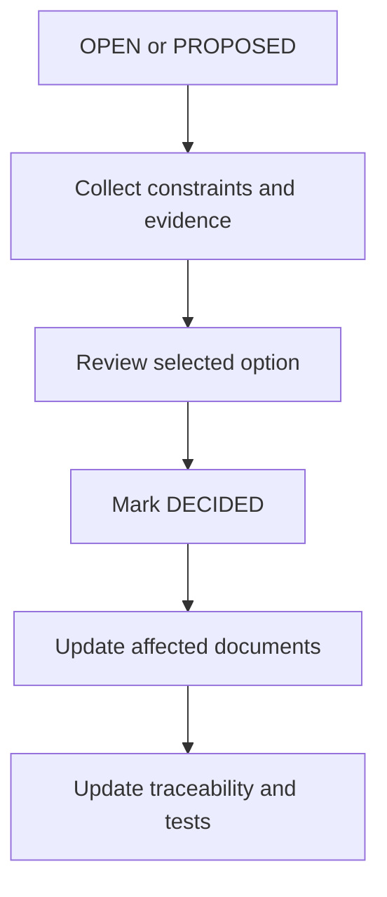

# 00 — Open Questions and Decision Registry

**Dự án:** Smart Water Flow and Pressure Monitor
**Tên viết tắt:** SWFPM
**Nhóm tài liệu:** `1.docs/00_overview`
**Cấp tài liệu:** Decision registry và implementation gate
**Trạng thái:** Active registry

---

## 1. Mục tiêu

Tài liệu này là nơi quản lý tập trung các quyết định và câu hỏi mở xuất hiện trong `01_system_overview.md` đến `10_system_interfaces.md`.

Mục tiêu cụ thể:

* Hợp nhất các OQ trùng nội dung nhưng mang ID khác nhau.
* Phân biệt quyết định đã chốt, đề xuất đang chờ review, câu hỏi mở và nội dung deferred.
* Chỉ ra vấn đề nào chặn `11_firmware_implication.md` hoặc chặn implementation sau đó.
* Giữ liên kết từ một `Decision ID` tới tất cả OQ nguồn.
* Ngăn downstream document tự chọn hardware, threshold hoặc protocol chưa được duyệt.
* Tạo quy trình review và cập nhật nhất quán giữa các tài liệu.

Tài liệu này không thay thế nội dung kỹ thuật trong tài liệu 01–10. Nó chỉ quản lý trạng thái quyết định và trỏ tới tài liệu source-of-truth tương ứng.

---

## 2. Phạm vi

### 2.1. Nội dung thuộc phạm vi

```text
Decision status
Decision priority and implementation gate
Canonical Decision ID
Source OQ consolidation
Selected/proposed baseline
Rationale
Affected documents
Review and closure rules
```

### 2.2. Nội dung ngoài phạm vi

```text
Detailed hardware selection report
Exact component qualification
Exact firmware implementation
Exact protocol schema
Exact numeric threshold calibration
Test-result evidence
Change-control approval workflow outside this repository
```

---

## 3. Tài liệu nguồn

Registry này tổng hợp OQ từ:

```text
01_system_overview.md
02_system_block_diagram.md
03_operating_principle.md
04_main_operation_flow.md
05_sequence_diagrams.md
06_system_fsm.md
07_operating_modes.md
08_data_flow.md
09_error_handling_overview.md
10_system_interfaces.md
```

Quy ước tham chiếu OQ nguồn:

```text
01:OQ-001       -> OQ-001 trong 01_system_overview.md
03:OQ-OP-001    -> OQ-OP-001 trong 03_operating_principle.md
06:OQ-FSM-001   -> OQ-FSM-001 trong 06_system_fsm.md
10:OQ-001       -> OQ-001 trong 10_system_interfaces.md
```

Prefix tên tài liệu là bắt buộc vì `OQ-001` được dùng lại trong nhiều file.

---

## 4. Trạng thái quyết định

| Status       | Ý nghĩa                                                                      |
| ------------ | ---------------------------------------------------------------------------- |
| `DECIDED`    | Baseline đã được người có thẩm quyền chấp nhận và downstream phải tuân theo. |
| `PROPOSED`   | Đã có lựa chọn đề xuất cụ thể nhưng chưa được chấp nhận chính thức.          |
| `OPEN`       | Chưa có lựa chọn đủ căn cứ hoặc còn nhiều phương án.                         |
| `DEFERRED`   | Cố ý hoãn; không thuộc checkpoint hiện tại hoặc chưa cần cho scope hiện tại. |
| `SUPERSEDED` | Quyết định cũ đã được thay bằng decision khác; phải trỏ tới ID mới.          |

Chỉ `DECIDED` được coi là requirement/baseline bắt buộc. `PROPOSED` không được lặng lẽ biến thành implementation mặc định.

---

## 5. Mức ảnh hưởng và implementation gate

| Gate           | Ý nghĩa                                                                                                |
| -------------- | ------------------------------------------------------------------------------------------------------ |
| `GATE-A`       | Phải chốt trước khi `11_firmware_implication.md` trở thành baseline.                                   |
| `GATE-B`       | Có thể viết tài liệu 11 bằng abstraction, nhưng phải chốt trước khi implement core firmware liên quan. |
| `GATE-C`       | Phải chốt trước hardware schematic/driver/protocol implementation tương ứng.                           |
| `GATE-D`       | Có thể hoãn đến productization/production validation.                                                  |
| `NON_BLOCKING` | Không chặn checkpoint hiện tại; downstream giữ interface/TBD rõ ràng.                                  |

Một decision có thể ảnh hưởng nhiều gate; bảng registry ghi gate sớm nhất cần xử lý.

---

## 6. Quy tắc sử dụng registry

1. Mỗi vấn đề hợp nhất có một `Decision ID` duy nhất.
2. OQ trong tài liệu nguồn không bị xóa chỉ để mất traceability; nó được đánh dấu resolved/deferred và tham chiếu `Decision ID` khi tài liệu được hiệu chỉnh.
3. Mỗi thay đổi trạng thái phải có rationale và affected documents.
4. `PROPOSED -> DECIDED` cần explicit review; không tự động chuyển do firmware prototype đã dùng lựa chọn đó.
5. Quyết định hardware cụ thể phải dẫn tới tài liệu hardware owner.
6. Quyết định protocol cụ thể phải dẫn tới communication contract owner.
7. Exact test default không tự động là product threshold.
8. Nếu một decision thay đổi kiến trúc đã chốt, phải review các requirement và sequence liên quan.

---

## 7. Decision summary

### 7.1. Các quyết định đã chốt

| Decision ID   | Chủ đề                                       | Status    | Gate |
| ------------- | -------------------------------------------- | --------- | ---- |
| `DEC-SYS-001` | Vai trò BLE và 4G                            | `DECIDED` | —    |
| `DEC-SYS-002` | Pressure chain dùng ZSSC3241                 | `DECIDED` | —    |
| `DEC-SYS-003` | Hai reporting window cấu hình được           | `DECIDED` | —    |
| `DEC-SYS-004` | Nguồn time ưu tiên                           | `DECIDED` | —    |
| `DEC-SYS-005` | `OFFLINE` là connectivity status             | `DECIDED` | —    |
| `DEC-SYS-006` | Ba clock/time domain                         | `DECIDED` | —    |
| `DEC-SYS-007` | Tập primary `SystemMode`                     | `DECIDED` | —    |
| `DEC-SYS-008` | Offline telemetry policy chưa thuộc baseline | `DECIDED` | —    |

### 7.2. Các architecture decision thuộc GATE-A

| Decision ID    | Chủ đề                                 | Status    | Gate      |
| -------------- | -------------------------------------- | --------- | --------- |
| `DEC-ARCH-001` | Flow path và core readiness            | `DECIDED` | Satisfied |
| `DEC-ARCH-002` | Owner của temperature processing       | `DECIDED` | Satisfied |
| `DEC-ARCH-003` | Uncompensated production flow          | `DECIDED` | Satisfied |
| `DEC-ARCH-004` | Production measurement trong `SERVICE` | `DECIDED` | Satisfied |
| `DEC-ARCH-005` | Logical I2C bus manager                | `DECIDED` | Satisfied |
| `DEC-ARCH-006` | Snapshot publication strategy          | `DECIDED` | Satisfied |
| `DEC-ARCH-007` | Config apply acknowledgement           | `DECIDED` | Satisfied |
| `DEC-ARCH-008` | OTA scope                              | `DECIDED` | Satisfied |

### 7.3. Open/deferred summary

| Nhóm                        | Số decision | Gate chủ yếu               |
| --------------------------- | ----------: | -------------------------- |
| Hardware/component          |           8 | `GATE-C`                   |
| Measurement/algorithm       |           6 | `GATE-B`/`GATE-C`          |
| Reporting/time/connectivity |           8 | `GATE-B`/`GATE-C`          |
| Storage/data/diagnostics    |           6 | `GATE-B`/`GATE-D`          |
| Error/power/service         |           9 | `GATE-A`/`GATE-B`/`GATE-C` |

---

## 8. Các quyết định đã chốt

### 8.1. `DEC-SYS-001` — Vai trò BLE và 4G

| Field         | Giá trị                                                                                                               |
| ------------- | --------------------------------------------------------------------------------------------------------------------- |
| Status        | `DECIDED`                                                                                                             |
| Decision      | BLE dùng UART cho local configuration/service; 4G dùng UART riêng cho time synchronization và gửi dữ liệu lên server. |
| Rationale     | Tách local configuration khỏi remote telemetry và tránh dùng chung parser/session context.                            |
| Consequence   | Firmware có `BleConfigService` và cellular/telemetry context độc lập; ưu tiên hai UART peripheral riêng.              |
| Source OQ     | 01:OQ-002, 01:OQ-003, 02:OQ-002, 02:OQ-003, 03:OQ-OP-002, 03:OQ-OP-003                                                |
| Affected docs | 01, 02, 03, 04, 05, 08, 10, 11                                                                                        |

Model module và protocol chi tiết vẫn thuộc `DEC-HW-002`, `DEC-HW-003`, `DEC-COM-001` và `DEC-COM-002`.

### 8.2. `DEC-SYS-002` — Pressure chain dùng ZSSC3241

| Field         | Giá trị                                                                                                     |
| ------------- | ----------------------------------------------------------------------------------------------------------- |
| Status        | `DECIDED`                                                                                                   |
| Decision      | Pressure subsystem dùng resistive pressure bridge TBD kết hợp ZSSC3241; MCU giao tiếp với ZSSC3241 qua I2C. |
| Rationale     | ZSSC3241 là signal conditioner/digitizer; nó không thay thế pressure transducer cơ khí.                     |
| Consequence   | Driver boundary chốt ở ZSSC3241; bridge range/profile/calibration vẫn mở.                                   |
| Source OQ     | 01:OQ-001, 02:OQ-001, 03:OQ-OP-001, 10:OQ-001                                                               |
| Affected docs | 01, 02, 03, 04, 05, 08, 09, 10, hardware docs                                                               |

### 8.3. `DEC-SYS-003` — Hai reporting window cấu hình được

| Field         | Giá trị                                                                                                                     |
| ------------- | --------------------------------------------------------------------------------------------------------------------------- |
| Status        | `DECIDED`                                                                                                                   |
| Decision      | Có đúng hai `ReportingWindow`; mỗi window có start boundary và interval cấu hình qua BLE. Window không cố định là ngày/đêm. |
| Rationale     | Người dùng có thể chọn hai khoảng thời gian và tần suất khác nhau.                                                          |
| Consequence   | End boundary của một window được suy ra từ start của window còn lại trong chu kỳ 24 giờ.                                    |
| Source OQ     | 01:OQ-005, 03:OQ-OP-010, 04:OQ-FLOW-004, 10:OQ-013                                                                          |
| Affected docs | 01, 03, 04, 05, 08, 10, 13                                                                                                  |

Giá trị default và min/max vẫn thuộc `DEC-SCHED-004`.

### 8.4. `DEC-SYS-004` — Nguồn time ưu tiên

| Field         | Giá trị                                                                              |
| ------------- | ------------------------------------------------------------------------------------ |
| Status        | `DECIDED`                                                                            |
| Decision      | Time từ 4G/network/server là nguồn đồng bộ ưu tiên cao nhất trong baseline hiện tại. |
| Rationale     | Nguồn remote/network được kỳ vọng chính xác hơn retained local RTC.                  |
| Consequence   | `TimeService` validate nguồn trước khi cập nhật STM32 RTC/system wall-clock.         |
| Source OQ     | 01:OQ-010, 02:OQ-008, 10:OQ-008                                                      |
| Affected docs | 03, 04, 05, 08, 10, 13                                                               |

Exact network time hay application-server time được phân biệt sau khi chọn 4G/protocol.

### 8.5. `DEC-SYS-005` — `OFFLINE` là connectivity status

| Field         | Giá trị                                                                      |
| ------------- | ---------------------------------------------------------------------------- |
| Status        | `DECIDED`                                                                    |
| Decision      | `OFFLINE` thuộc `ConnectivityStatus`, không thuộc primary `SystemMode`.      |
| Rationale     | Measurement, leak detection, BLE và LCD vẫn hoạt động khi 4G không khả dụng. |
| Consequence   | Ví dụ hợp lệ: `SystemMode=NORMAL`, `ConnectivityStatus=OFFLINE`.             |
| Source OQ     | Các OQ telemetry/offline trong 01, 02, 03, 04, 06–10                         |
| Affected docs | 06, 07, 08, 09, 11, 13                                                       |

### 8.6. `DEC-SYS-006` — Ba clock/time domain

| Field         | Giá trị                                                                                                            |
| ------------- | ------------------------------------------------------------------------------------------------------------------ |
| Status        | `DECIDED`                                                                                                          |
| Decision      | Hệ thống phân biệt clock/event timing của MAX35103, STM32 HAL/RTC timekeeping và 4G/server synchronization source. |
| Rationale     | Ba nguồn có vai trò khác nhau; MAX clock không tự động là reporting wall-clock authority.                          |
| Consequence   | `TimeService` sở hữu system time; MAX timing được map vào measurement metadata.                                    |
| Source OQ     | 01:OQ-010, 02:OQ-008, 04/05 time-related flows, 10:OQ-008                                                          |
| Affected docs | 03, 04, 05, 08, 10, 11                                                                                             |

### 8.7. `DEC-SYS-007` — Primary SystemMode

| Field         | Giá trị                                                                                               |
| ------------- | ----------------------------------------------------------------------------------------------------- |
| Status        | `DECIDED`                                                                                             |
| Decision      | Primary mode gồm `INIT`, `NORMAL`, `LOW_POWER`, `SERVICE`, `RECOVERY`, `ERROR`.                       |
| Rationale     | Mode loại trừ nhau; connectivity, time, measurement và leak là status trực giao.                      |
| Consequence   | Firmware phải có một `SystemModeManager`; internal driver/service phase không được trộn vào enum này. |
| Source OQ     | 06/07 operating-mode review                                                                           |
| Affected docs | 06, 07, 09, 11                                                                                        |

### 8.8. `DEC-SYS-008` — Offline telemetry policy deferred

| Field         | Giá trị                                                                                                                                                                     |
| ------------- | --------------------------------------------------------------------------------------------------------------------------------------------------------------------------- |
| Status        | `DECIDED`                                                                                                                                                                   |
| Decision      | Offline queue capacity, retry, backoff, overflow và server ACK chưa thuộc baseline hiện tại; phải được xem xét trong tài liệu 13.                                           |
| Rationale     | Chưa có server protocol, payload size và retention requirement.                                                                                                             |
| Consequence   | Tài liệu 11 chỉ định nghĩa abstraction và policy interface, không hard-code giá trị.                                                                                        |
| Source OQ     | 01:OQ-004/009, 02:OQ-004/007, 03:OQ-OP-006/007/008, 04:OQ-FLOW-006/007/008/009, 05:OQ-SEQ-006/007, 07:OQ-MODE-012, 08:OQ-DATA-011/012/013/014, 09:OQ-ERR-013, 10:OQ-007/012 |
| Affected docs | 08, 09, 10, 11, 13                                                                                                                                                          |

---

## 9. Architecture decisions cho tài liệu 11

### 9.1. `DEC-ARCH-001` — Flow path và core readiness

| Field         | Giá trị                                                                                                                                                                                                                                                                                                                                                                                                                                                                                                                                                                                                    |
| ------------- | ---------------------------------------------------------------------------------------------------------------------------------------------------------------------------------------------------------------------------------------------------------------------------------------------------------------------------------------------------------------------------------------------------------------------------------------------------------------------------------------------------------------------------------------------------------------------------------------------------------- |
| Status        | `DECIDED`                                                                                                                                                                                                                                                                                                                                                                                                                                                                                                                                                                                                  |
| Gate          | `GATE-A` — satisfied                                                                                                                                                                                                                                                                                                                                                                                                                                                                                                                                                                                       |
| Question      | `INIT -> NORMAL` có bắt buộc flow path sẵn sàng không; runtime có cho flow unavailable degraded không?                                                                                                                                                                                                                                                                                                                                                                                                                                                                                                     |
| Decision      | Trong mỗi production boot, flow path phải khởi tạo thành công và tạo được ít nhất một self-check hoặc measurement result hợp lệ theo readiness policy trước khi `INIT -> NORMAL`. Trong runtime, flow fault tạm thời giữ `SystemMode=NORMAL` với flow/measurement status `DEGRADED` trong bounded local recovery. Volume update và flow-dependent leak evidence bị tạm dừng. Khi local recovery hết budget, hệ thống chuyển `RECOVERY`; chỉ chuyển `ERROR` khi coordinated recovery thất bại và không còn core flow operation an toàn. Authorized service boot vẫn có thể vào `SERVICE` theo policy riêng. |
| Rationale     | Flow là nguồn đo chính cho volume và leak; đồng thời tránh đưa toàn hệ thống vào `ERROR` chỉ vì một lỗi transient.                                                                                                                                                                                                                                                                                                                                                                                                                                                                                         |
| Source OQ     | 06:OQ-FSM-001/002, 07:OQ-MODE-001/002, 09:OQ-ERR-004                                                                                                                                                                                                                                                                                                                                                                                                                                                                                                                                                       |
| Affected docs | 01, 03, 04, 05, 06, 07, 08, 09, 10, 11, 12                                                                                                                                                                                                                                                                                                                                                                                                                                                                                                                                                                 |

### 9.2. `DEC-ARCH-002` — Owner của temperature processing

| Field         | Giá trị                                                                                                                                                                                                                                                                                                                                                                                                                                |
| ------------- | -------------------------------------------------------------------------------------------------------------------------------------------------------------------------------------------------------------------------------------------------------------------------------------------------------------------------------------------------------------------------------------------------------------------------------------- |
| Status        | `DECIDED`                                                                                                                                                                                                                                                                                                                                                                                                                              |
| Gate          | `GATE-A` — satisfied                                                                                                                                                                                                                                                                                                                                                                                                                   |
| Question      | Temperature processing là service riêng hay thuộc calibration?                                                                                                                                                                                                                                                                                                                                                                         |
| Decision      | `MeasurementManager` sở hữu acquisition và validation ban đầu của raw temperature-related result từ MAX35103. Temperature conversion, sensor-curve calculation, calibration, filtering/quality assignment và publication thuộc `CalibrationService`. `CalibrationService` là owner duy nhất của immutable/versioned `TemperatureResult`; flow compensation, `DataRepository`, LCD, telemetry và diagnostics chỉ đọc result đã publish. |
| Rationale     | Temperature chủ yếu phục vụ flow compensation; tránh thêm service owner không cần thiết nhưng vẫn giữ data contract rõ.                                                                                                                                                                                                                                                                                                                |
| Source OQ     | 05:OQ-SEQ-002, 08:OQ-DATA-003                                                                                                                                                                                                                                                                                                                                                                                                          |
| Affected docs | 03, 04, 05, 08, 10, glossary, README, 11, 12                                                                                                                                                                                                                                                                                                                                                                                           |

### 9.3. `DEC-ARCH-003` — Uncompensated production flow

| Field         | Giá trị                                                                                                                                                                                                                                                                                                                                                                                                                                                                                                           |
| ------------- | ----------------------------------------------------------------------------------------------------------------------------------------------------------------------------------------------------------------------------------------------------------------------------------------------------------------------------------------------------------------------------------------------------------------------------------------------------------------------------------------------------------------- |
| Status        | `DECIDED`                                                                                                                                                                                                                                                                                                                                                                                                                                                                                                         |
| Gate          | `GATE-A` — satisfied                                                                                                                                                                                                                                                                                                                                                                                                                                                                                              |
| Question      | Có cho phép production `FlowResult` khi temperature compensation không khả dụng?                                                                                                                                                                                                                                                                                                                                                                                                                                  |
| Decision      | Không cho uncompensated production flow trong baseline. Khi không có `TemperatureResult` usable theo pairing/quality policy, firmware chỉ được publish `FlowResult` với `INVALID` hoặc `DEGRADED_NOT_ACCEPTED` để quan sát trạng thái/chẩn đoán. Result này không cập nhật volume, không tạo flow-based leak evidence và không được xem là production telemetry hợp lệ. Chỉ mở held-temperature hoặc uncompensated fallback sau khi validation chứng minh error budget chấp nhận được và policy được version hóa. |
| Rationale     | Ngăn volume/leak sử dụng flow có sai số chưa định lượng.                                                                                                                                                                                                                                                                                                                                                                                                                                                          |
| Source OQ     | 03:OQ-OP-011, 04:OQ-FLOW-010, 08:OQ-DATA-004                                                                                                                                                                                                                                                                                                                                                                                                                                                                      |
| Affected docs | README, glossary, 03, 04, 05, 08, 09, 11, 12                                                                                                                                                                                                                                                                                                                                                                                                                                                                      |

### 9.4. `DEC-ARCH-004` — Production measurement trong SERVICE

| Field         | Giá trị                                                                                                                                                                                                                                                                                                                                                                                                                                                                                    |
| ------------- | ------------------------------------------------------------------------------------------------------------------------------------------------------------------------------------------------------------------------------------------------------------------------------------------------------------------------------------------------------------------------------------------------------------------------------------------------------------------------------------------ |
| Status        | `DECIDED`                                                                                                                                                                                                                                                                                                                                                                                                                                                                                  |
| Gate          | `GATE-A` — satisfied                                                                                                                                                                                                                                                                                                                                                                                                                                                                       |
| Question      | `SERVICE` có cho normal production measurement chạy song song không?                                                                                                                                                                                                                                                                                                                                                                                                                       |
| Decision      | Khi vào `SERVICE`, production measurement scheduler và production consumer path được quiesce mặc định. Authorized service profile có thể yêu cầu bounded `SERVICE_SAMPLE` hoặc `CALIBRATION_SAMPLE`; mọi result phải mang provenance tương ứng và không được update production volume, production leak state/evidence hoặc scheduled production telemetry. Khi thoát `SERVICE`, chỉ production sample mới sau khi production scheduling được restore mới được phép tiếp tục product state. |
| Rationale     | Đơn giản hóa scheduling và ngăn test stimulus làm nhiễm product state.                                                                                                                                                                                                                                                                                                                                                                                                                     |
| Source OQ     | 06:OQ-FSM-003, 07:OQ-MODE-005                                                                                                                                                                                                                                                                                                                                                                                                                                                              |
| Affected docs | README, glossary, 06, 07, 08, 11, 12                                                                                                                                                                                                                                                                                                                                                                                                                                                       |

### 9.5. `DEC-ARCH-005` — Logical I2C bus manager

| Field         | Giá trị                                                                                                                                                                                                                                                                                                                                                                                                                                              |
| ------------- | ---------------------------------------------------------------------------------------------------------------------------------------------------------------------------------------------------------------------------------------------------------------------------------------------------------------------------------------------------------------------------------------------------------------------------------------------------- |
| Status        | `DECIDED`                                                                                                                                                                                                                                                                                                                                                                                                                                            |
| Gate          | `GATE-A` — satisfied                                                                                                                                                                                                                                                                                                                                                                                                                                 |
| Question      | Firmware quản lý ZSSC3241/F-RAM I2C ownership và recovery thế nào khi physical topology chưa chốt?                                                                                                                                                                                                                                                                                                                                                   |
| Decision      | Dùng logical `I2cBusManager`/bus-owner abstraction làm owner duy nhất của arbitration, transaction admission, timeout, cancellation và bus recovery. Mỗi physical I2C instance có một owner context; `PressureMeasurementService` và `StorageService` gửi transaction request qua logical port, không gọi HAL I2C trực tiếp. ZSSC3241 và F-RAM có thể map cùng hoặc khác physical instance trong hardware binding sau mà không đổi service contract. |
| Rationale     | Cho phép viết architecture trước schematic mà không làm mất shared-bus recovery contract.                                                                                                                                                                                                                                                                                                                                                            |
| Source OQ     | 09:OQ-ERR-005, 10:OQ-002                                                                                                                                                                                                                                                                                                                                                                                                                             |
| Affected docs | README, glossary, 04, 08, 09, 10, 11, 12, hardware docs                                                                                                                                                                                                                                                                                                                                                                                              |

### 9.6. `DEC-ARCH-006` — Snapshot publication strategy

| Field         | Giá trị                                                                                                                                                                                                                                                                                                                                                     |
| ------------- | ----------------------------------------------------------------------------------------------------------------------------------------------------------------------------------------------------------------------------------------------------------------------------------------------------------------------------------------------------------- |
| Status        | `DECIDED`                                                                                                                                                                                                                                                                                                                                                   |
| Gate          | `GATE-A` — satisfied                                                                                                                                                                                                                                                                                                                                        |
| Question      | `RuntimeSnapshot` dùng double buffer hay versioned read/lock?                                                                                                                                                                                                                                                                                               |
| Decision      | `DataRepository` dùng đúng hai `RuntimeSnapshot` buffer. Writer chỉ cập nhật inactive buffer, hoàn tất toàn bộ metadata/version, thực hiện publication barrier phù hợp rồi atomic swap active index. Consumer capture active index một lần và chỉ đọc buffer tương ứng; không giữ reference qua publication tiếp theo nếu lifetime contract không cho phép. |
| Rationale     | Consumer LCD/telemetry đọc đơn giản, tránh mixed-version snapshot và giảm coupling với RTOS choice.                                                                                                                                                                                                                                                         |
| Source OQ     | 08:OQ-DATA-008                                                                                                                                                                                                                                                                                                                                              |
| Affected docs | README, glossary, 05, 08, 10, 11, 12                                                                                                                                                                                                                                                                                                                        |

### 9.7. `DEC-ARCH-007` — Config apply acknowledgement

| Field         | Giá trị                                                                                                                                                                                                                                                                                                                                                                                                                                            |
| ------------- | -------------------------------------------------------------------------------------------------------------------------------------------------------------------------------------------------------------------------------------------------------------------------------------------------------------------------------------------------------------------------------------------------------------------------------------------------- |
| Status        | `DECIDED`                                                                                                                                                                                                                                                                                                                                                                                                                                          |
| Gate          | `GATE-A` — satisfied                                                                                                                                                                                                                                                                                                                                                                                                                               |
| Question      | Service đích xác nhận config apply thế nào?                                                                                                                                                                                                                                                                                                                                                                                                        |
| Decision      | Sau persistent commit và `ActiveConfig` version replacement, `ConfigRepository` gửi apply request gồm `transaction_id`, `config_version` và changed-field mask tới từng affected service. Service apply tại safe boundary và trả `APPLIED`, `DEFERRED` hoặc `REJECTED` cùng reason và matching version. `ConfigRepository` tổng hợp per-service status; BLE success không được đồng nghĩa mọi service đã apply nếu còn `DEFERRED` hoặc `REJECTED`. |
| Rationale     | Phân biệt persistent commit thành công với runtime apply thành công.                                                                                                                                                                                                                                                                                                                                                                               |
| Source OQ     | 05:OQ-SEQ-004                                                                                                                                                                                                                                                                                                                                                                                                                                      |
| Affected docs | README, glossary, 04, 05, 08, 10, 11, 12                                                                                                                                                                                                                                                                                                                                                                                                           |

### 9.8. `DEC-ARCH-008` — OTA scope

| Field         | Giá trị                                                                                                                                                                                                                                                                                                                                                                                           |
| ------------- | ------------------------------------------------------------------------------------------------------------------------------------------------------------------------------------------------------------------------------------------------------------------------------------------------------------------------------------------------------------------------------------------------- |
| Status        | `DECIDED`                                                                                                                                                                                                                                                                                                                                                                                         |
| Gate          | `GATE-A` — satisfied                                                                                                                                                                                                                                                                                                                                                                              |
| Question      | OTA có thuộc baseline hiện tại không?                                                                                                                                                                                                                                                                                                                                                             |
| Decision      | OTA firmware update và remote configuration/command qua 4G không thuộc baseline hiện tại. Cellular downlink chỉ được xử lý ở mức response cần thiết cho telemetry/time contract đã định nghĩa; không có OTA image, bootloader update, remote config apply hoặc generic remote-command interface. Bổ sung các chức năng này là future scope và bắt buộc system architecture/security review riêng. |
| Rationale     | Chưa có bootloader, image storage, rollback, signing và security requirement.                                                                                                                                                                                                                                                                                                                     |
| Source OQ     | 01:OQ-011, 03:OQ-OP-013                                                                                                                                                                                                                                                                                                                                                                           |
| Affected docs | README, glossary, 01, 02, 10, 11, 12                                                                                                                                                                                                                                                                                                                                                              |

---

## 10. Hardware và physical-interface decisions

| Decision ID  | Chủ đề                                                             | Status | Gate     | Source OQ                                                            | Required output                         |
| ------------ | ------------------------------------------------------------------ | ------ | -------- | -------------------------------------------------------------------- | --------------------------------------- |
| `DEC-HW-001` | Pressure bridge model/range/reference/accuracy và ZSSC3241 profile | `OPEN` | `GATE-C` | 01:OQ-001, 02:OQ-001, 03:OQ-OP-001, 08:OQ-DATA-005, 10:OQ-001        | Pressure hardware/profile specification |
| `DEC-HW-002` | BLE module model và UART operating model                           | `OPEN` | `GATE-C` | 01:OQ-002, 02:OQ-002, 03:OQ-OP-002, 10:OQ-003                        | BLE hardware/protocol profile           |
| `DEC-HW-003` | 4G module, cellular technology và UART control                     | `OPEN` | `GATE-C` | 01:OQ-003, 02:OQ-003, 03:OQ-OP-003, 10:OQ-005/006                    | Cellular hardware/profile specification |
| `DEC-HW-004` | LCD model, size và physical interface                              | `OPEN` | `GATE-C` | 01:OQ-007, 02:OQ-005, 03:OQ-OP-004, 10:OQ-009                        | Display hardware/driver specification   |
| `DEC-HW-005` | Power source, battery và 4G peak-current budget                    | `OPEN` | `GATE-C` | 01:OQ-008, 02:OQ-006, 03:OQ-OP-005, 10:OQ-010                        | Power budget và schematic requirement   |
| `DEC-HW-006` | ZSSC3241 và F-RAM chung hay tách physical I2C                      | `OPEN` | `GATE-C` | 10:OQ-002                                                            | Schematic/bus assignment                |
| `DEC-HW-007` | STM32 low-power state và wake-capable peripherals                  | `OPEN` | `GATE-B` | 04:OQ-FLOW-011, 05:OQ-SEQ-008, 06:OQ-FSM-005, 07:OQ-MODE-006/007/008 | Power-state/wake matrix                 |
| `DEC-HW-008` | Service UART riêng ngoài SWD                                       | `OPEN` | `GATE-C` | 10:OQ-011                                                            | Debug/service interface decision        |

Logical firmware architecture được phép dùng abstraction trong khi các decision này mở. Driver và schematic không được chốt trước decision owner tương ứng.

---

## 11. Measurement và algorithm decisions

| Decision ID    | Chủ đề                                             | Status | Gate     | Source OQ                           | Direction hiện tại                                     |
| -------------- | -------------------------------------------------- | ------ | -------- | ----------------------------------- | ------------------------------------------------------ |
| `DEC-MEAS-001` | Measurement period của flow, temperature, pressure | `OPEN` | `GATE-B` | 04:OQ-FLOW-001, 08:OQ-DATA-002      | Configurable; dùng monotonic scheduler                 |
| `DEC-MEAS-002` | MAX direct mode hay event-timing production        | `OPEN` | `GATE-B` | 04:OQ-FLOW-002, 05:OQ-SEQ-001       | Driver/service API phải hỗ trợ policy choice           |
| `DEC-MEAS-003` | ZSSC3241 trigger/read mode và conversion timing    | `OPEN` | `GATE-C` | 04:OQ-FLOW-003, 05:OQ-SEQ-003       | Asynchronous measurement contract                      |
| `DEC-MEAS-004` | Exact quality enum và freshness limits             | `OPEN` | `GATE-B` | 08:OQ-DATA-001/002                  | Metadata contract đã chốt; giá trị mở                  |
| `DEC-LEAK-001` | Leak thresholds, evidence window, confirm/clear    | `OPEN` | `GATE-B` | 01:OQ-006, 02:OQ-009, 09:OQ-ERR-002 | Baseline state/evidence model đã có; numeric tuning mở |
| `DEC-LEAK-002` | Pressure trend có thuộc MVP                        | `OPEN` | `GATE-B` | 03:OQ-OP-012                        | Absolute/supporting pressure evidence là baseline      |

`DEC-LEAK-001` không chặn module boundary trong tài liệu 11, nhưng chặn production algorithm implementation và acceptance test.

---

## 12. Reporting, time và connectivity decisions

| Decision ID     | Chủ đề                                            | Status     | Gate     | Source OQ                                                                                                                | Direction hiện tại                           |
| --------------- | ------------------------------------------------- | ---------- | -------- | ------------------------------------------------------------------------------------------------------------------------ | -------------------------------------------- |
| `DEC-SCHED-001` | Time invalid: report hay defer                    | `OPEN`     | `GATE-B` | 07:OQ-MODE-013, 08:OQ-DATA-016, 09:OQ-ERR-012                                                                            | Không tạo timestamp giả                      |
| `DEC-SCHED-002` | Missed/duplicate report-slot policy               | `OPEN`     | `GATE-B` | 05:OQ-SEQ-010, 07:OQ-MODE-014, 08:OQ-DATA-017                                                                            | Scheduler cần dedup identity                 |
| `DEC-SCHED-003` | Immediate telemetry khi leak state đổi            | `OPEN`     | `GATE-B` | 03:OQ-OP-009, 04:OQ-FLOW-005, 05:OQ-SEQ-005, 08:OQ-DATA-015, 09:OQ-ERR-015                                               | Scheduled telemetry là baseline              |
| `DEC-SCHED-004` | Default start time và interval min/max            | `OPEN`     | `GATE-B` | 01:OQ-005, 03:OQ-OP-010, 04:OQ-FLOW-004, 10:OQ-013                                                                       | Example interval hiện tại: 15 phút và 5 phút |
| `DEC-COM-001`   | Server application protocol và telemetry encoding | `OPEN`     | `GATE-C` | 01:OQ-004, 02:OQ-004, 08:OQ-DATA-011, 10:OQ-007                                                                          | Telemetry adapter abstraction                |
| `DEC-COM-002`   | Server acknowledgement semantics                  | `OPEN`     | `GATE-C` | 03:OQ-OP-006, 04:OQ-FLOW-006, 05:OQ-SEQ-006, 08:OQ-DATA-014, 09:OQ-ERR-013, 10:OQ-007                                    | Unknown không được coi delivered             |
| `DEC-COM-003`   | Retry/backoff policy                              | `DEFERRED` | `GATE-B` | 03:OQ-OP-008, 04:OQ-FLOW-007, 05:OQ-SEQ-007, 07:OQ-MODE-012, 08:OQ-DATA-014, 09:OQ-ERR-013                               | Bounded, event/timer driven                  |
| `DEC-COM-004`   | Queue capacity, retention, backing, overflow      | `DEFERRED` | `GATE-B` | 01:OQ-009, 02:OQ-007, 03:OQ-OP-007/008, 04:OQ-FLOW-008/009, 05:OQ-SEQ-007, 07:OQ-MODE-012, 08:OQ-DATA-012/013, 10:OQ-012 | Explicit policy; capacity chưa chốt          |

`DEC-COM-003/004` được deferred khỏi baseline overview nhưng phải chốt trong tài liệu 13 trước telemetry production implementation.

---

## 13. Storage, data và diagnostics decisions

| Decision ID    | Chủ đề                                     | Status | Gate     | Source OQ                                    | Direction hiện tại                                     |
| -------------- | ------------------------------------------ | ------ | -------- | -------------------------------------------- | ------------------------------------------------------ |
| `DEC-DATA-001` | Volume checkpoint interval/loss budget     | `OPEN` | `GATE-B` | 08:OQ-DATA-006                               | Configurable checkpoint policy                         |
| `DEC-DATA-002` | Persist leak state/evidence history        | `OPEN` | `GATE-B` | 08:OQ-DATA-007                               | Không restore evidence nếu time semantics không hợp lệ |
| `DEC-DATA-003` | Snapshot coalescing latency                | `OPEN` | `GATE-B` | 08:OQ-DATA-009                               | Bounded latency; critical status không bị che          |
| `DEC-DATA-004` | Persistent record layout và F-RAM map      | `OPEN` | `GATE-B` | 08:OQ-DATA-010                               | A/B, version, sequence, integrity đã chốt              |
| `DEC-DATA-005` | Storage busy queue/reject theo record type | `OPEN` | `GATE-B` | 05:OQ-SEQ-009                                | Atomic in-flight record không bị sửa                   |
| `DEC-DIAG-001` | Diagnostic retention/coalescing/upload     | `OPEN` | `GATE-D` | 08:OQ-DATA-018, 09:OQ-ERR-008, 06:OQ-FSM-009 | Bounded, không chứa secret                             |

---

## 14. Error, recovery, power và service decisions

| Decision ID    | Chủ đề                                                           | Status    | Gate      | Source OQ                                               | Direction hiện tại                                                                      |
| -------------- | ---------------------------------------------------------------- | --------- | --------- | ------------------------------------------------------- | --------------------------------------------------------------------------------------- |
| `DEC-ERR-001`  | Peripheral retry/re-init budget                                  | `OPEN`    | `GATE-B`  | 04:OQ-FLOW-012, 09:OQ-ERR-003                           | Parameterized bounded policy                                                            |
| `DEC-ERR-002`  | System recovery attempt/timeout                                  | `OPEN`    | `GATE-B`  | 06:OQ-FSM-006, 07:OQ-MODE-009, 09:OQ-ERR-006            | No infinite recovery loop                                                               |
| `DEC-ERR-003`  | Degraded-safe return sau partial recovery failure                | `OPEN`    | `GATE-B`  | 06:OQ-FSM-007, 07:OQ-MODE-010, 09:OQ-ERR-007            | Chỉ khi readiness/safety được chứng minh                                                |
| `DEC-ERR-004`  | Repeated watchdog reset threshold/safe behavior                  | `OPEN`    | `GATE-B`  | 06:OQ-FSM-008, 09:OQ-ERR-009                            | Reset luôn quay về `INIT` và giữ reason                                                 |
| `DEC-ERR-005`  | Numeric error-code registry và production assertion              | `OPEN`    | `GATE-B`  | 09:OQ-ERR-001/016                                       | Symbolic domain/condition model đã chốt                                                 |
| `DEC-PWR-001`  | Battery thresholds/hysteresis                                    | `OPEN`    | `GATE-C`  | 09:OQ-ERR-010                                           | Power hardware/profile owner                                                            |
| `DEC-PWR-002`  | Critical power: `ERROR` hay shutdown flow                        | `DECIDED` | Satisfied | 06:OQ-FSM-010, 07:OQ-MODE-011, 09:OQ-ERR-011            | Không có controlled shutdown; hardware reset/brownout protection đưa firmware về `INIT` |
| `DEC-SVC-001`  | Service entry source, profile, authorization và clear permission | `OPEN`    | `GATE-B`  | 06:OQ-FSM-004, 07:OQ-MODE-004, 09:OQ-ERR-014, 10:OQ-004 | Authorization/allowlist bắt buộc                                                        |
| `DEC-MODE-001` | BLE availability trong `INIT`                                    | `OPEN`    | `GATE-B`  | 07:OQ-MODE-003                                          | Có thể limited commissioning/status                                                     |

### 14.1. `DEC-PWR-002` — Reset/brownout-only power protection

| Field         | Giá trị                                                                                                                                                                                                                                                                                                                                                                                                                                                                                     |
| ------------- | ------------------------------------------------------------------------------------------------------------------------------------------------------------------------------------------------------------------------------------------------------------------------------------------------------------------------------------------------------------------------------------------------------------------------------------------------------------------------------------------- |
| Status        | `DECIDED`                                                                                                                                                                                                                                                                                                                                                                                                                                                                                   |
| Gate          | `GATE-A` — satisfied                                                                                                                                                                                                                                                                                                                                                                                                                                                                        |
| Decision      | Hardware chỉ cung cấp reset/brownout protection; baseline không có controlled shutdown path hoặc dedicated `SHUTDOWN` `SystemMode`. Brownout/reset đưa MCU về `INIT`. Firmware không được giả định còn đủ thời gian/năng lượng để emergency flush; persistent records phải chịu được reset ở mọi commit phase bằng A/B slot, version, sequence và integrity validation. Nếu có early low-power indication, firmware có thể dừng operation không thiết yếu nhưng không bắt buộc ghi storage. |
| Rationale     | Không có hold-up-energy/controlled power-off hardware để bảo đảm shutdown sequence hoặc persistent write hoàn tất.                                                                                                                                                                                                                                                                                                                                                                          |
| Source OQ     | 06:OQ-FSM-010, 07:OQ-MODE-011, 09:OQ-ERR-011                                                                                                                                                                                                                                                                                                                                                                                                                                                |
| Affected docs | README, glossary, 04, 06, 07, 08, 09, 10, 11, 12, hardware docs                                                                                                                                                                                                                                                                                                                                                                                                                             |
| Remaining TBD | Battery-low/critical threshold và hysteresis vẫn thuộc `DEC-PWR-001`/hardware profile.                                                                                                                                                                                                                                                                                                                                                                                                      |

---

## 15. Implementation gate cho `11_firmware_implication.md`

### 15.1. Có thể bắt đầu viết khi nào

Có thể bắt đầu drafting tài liệu 11 ngay vì các boundary chính đã rõ:

```text
SystemMode set
Data ownership
Event-driven behavior
BLE and 4G roles
Measurement/result pipeline
Local versus system recovery
```

### 15.2. Điều kiện để tài liệu 11 trở thành baseline

Các decision sau phải `DECIDED` hoặc có explicit policy abstraction được review:

```text
DEC-ARCH-001 through DEC-ARCH-008
DEC-PWR-002
```

`DEC-PWR-002` đã `DECIDED`: tài liệu 11 không thêm dedicated shutdown state hoặc `PowerCriticalAction` shutdown policy; chỉ mô hình hóa reset/brownout restart, reset-reason capture và reset-safe persistence.

### 15.3. Không bắt buộc trước tài liệu 11

Không cần chốt model BLE/4G/LCD, pressure bridge, protocol server, exact threshold, queue capacity hoặc numeric error code để định nghĩa logical module architecture.

---

## 16. Review checklist cho các đề xuất GATE-A

| Decision       | Câu hỏi review chính                                                        |
| -------------- | --------------------------------------------------------------------------- |
| `DEC-ARCH-001` | Thiết bị còn giá trị sản phẩm nào nếu flow path không sẵn sàng?             |
| `DEC-ARCH-002` | `CalibrationService` có phải owner phù hợp với temperature lifecycle không? |

---

## 17. Quy trình đóng một decision



Mỗi lần đóng decision cần:

1. Ghi lựa chọn cuối cùng.
2. Ghi rationale và phương án bị loại nếu quan trọng.
3. Ghi ngày/version review khi quy trình dự án yêu cầu.
4. Cập nhật source OQ sang resolved/reference.
5. Cập nhật affected documents.
6. Bổ sung requirement/test mapping nếu behavior thay đổi.

---

## 18. Quy trình thay đổi decision đã chốt

Không sửa thầm `DECIDED` thành lựa chọn khác.

```text
Identify change request
  -> evaluate impact
  -> create revised decision or new Decision ID
  -> mark old decision SUPERSEDED when appropriate
  -> update all affected documents
  -> re-run design/test review
```

Một thay đổi ảnh hưởng system boundary, FSM, data ownership hoặc external contract cần review ở cấp kiến trúc.

---

## 19. Mẫu decision record

```markdown
### `DEC-<GROUP>-NNN` — <Title>

| Field | Giá trị |
|---|---|
| Status | `OPEN` / `PROPOSED` / `DECIDED` / `DEFERRED` |
| Gate | `GATE-A` / `GATE-B` / `GATE-C` / `GATE-D` |
| Question | ... |
| Decision/Proposed decision | ... |
| Rationale | ... |
| Alternatives | ... |
| Source OQ | ... |
| Affected docs | ... |
| Validation needed | ... |
```

---

## 20. Maintenance rules

* Thêm OQ mới phải map vào decision hiện có hoặc tạo `Decision ID` mới.
* Không dùng lại `Decision ID` đã tồn tại.
* Không đổi nghĩa của decision mà giữ nguyên ID nếu thay đổi mang tính kiến trúc.
* Source OQ đã resolved vẫn giữ reference tới decision.
* README chỉ tóm tắt open-decision group; registry này giữ trạng thái chi tiết.
* `12_system_traceability.md` phải liên kết requirement với decision khi decision ảnh hưởng behavior.
* `SYSTEM_DESIGN_COMPLETE.md` không được đánh dấu complete khi còn `GATE-A` chưa được xử lý.

---

## 21. Current checkpoint

Tại thời điểm tạo registry:

```text
DECIDED system baselines : 16
PROPOSED GATE-A items    : 0
Additional power GATE-A : satisfied by DEC-PWR-002
Hardware decisions      : open, mostly non-blocking for document 11
Telemetry offline policy: deferred to document 13
```

Checkpoint tiếp theo:

1. Kiểm tra toàn bộ OQ nguồn trong tài liệu 01–10 đã được resolve/reference đúng.
2. Triển khai `11_firmware_implication.md` theo các architecture decision đã chốt.
3. Triển khai `12_system_traceability.md` và map các requirement mới.

---

## 22. Kết luận

Registry này cho phép tiếp tục thiết kế firmware mà không buộc phải chọn ngay mọi linh kiện và protocol. Ranh giới sử dụng là:

```text
Architecture-changing question
  -> decide before firmware architecture baseline

Hardware/protocol/value question
  -> keep explicit abstraction/TBD
  -> decide before corresponding implementation
```

Downstream document không được tự giải quyết OQ bằng assumption ẩn. Mọi lựa chọn phải được ghi thành decision, review và cập nhật traceability.
