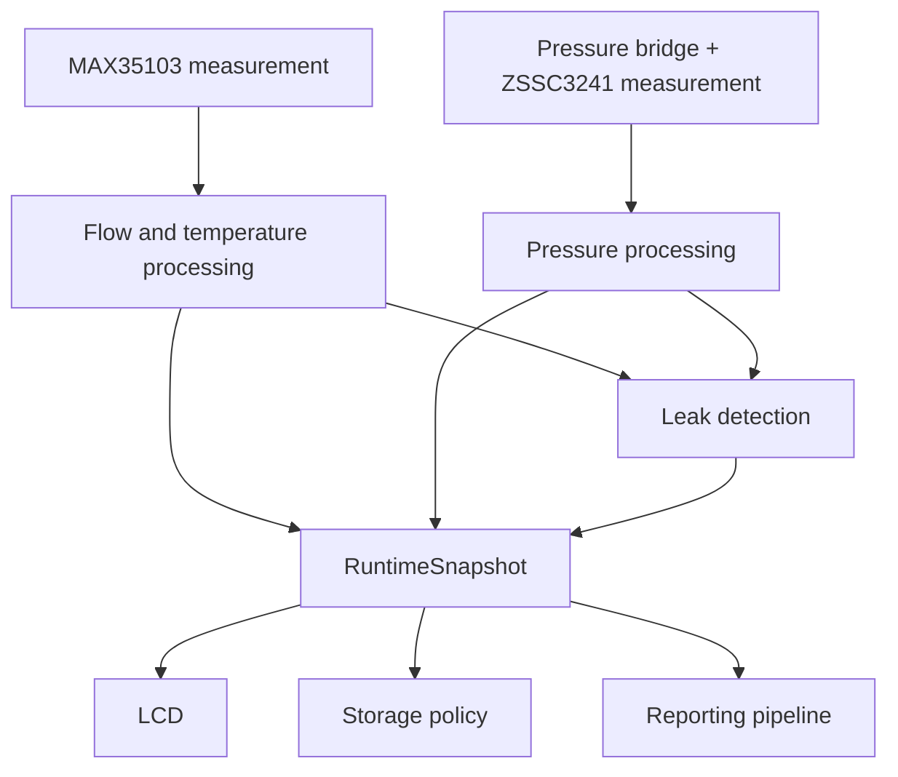
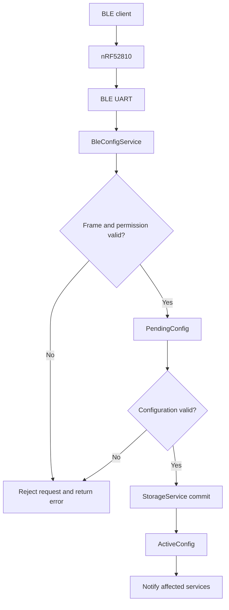
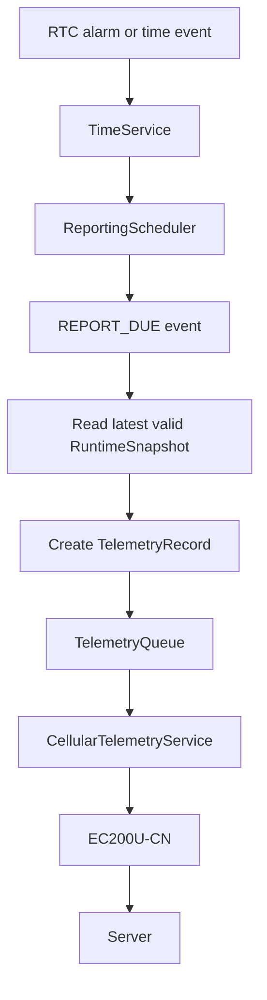

# 01 — System Overview

**Project:** Smart Water Flow and Pressure Monitor
**Document group:** `1.docs/00_overview`
**Document level:** System-level design
**Status:** Initial baseline

---

## 1. Mục tiêu

Tài liệu này mô tả tổng quan hệ thống **Smart Water Flow and Pressure Monitor** ở mức kiến trúc hệ thống. Mục tiêu là giúp người đọc hiểu:

* Thiết bị có nhiệm vụ gì.
* Hệ thống gồm những subsystem nào.
* Mỗi subsystem chịu trách nhiệm gì.
* Dữ liệu đo, dữ liệu cấu hình và dữ liệu báo cáo đi qua hệ thống như thế nào.
* Ranh giới giữa measurement, processing, storage, display và communication.
* Những quyết định hệ thống nào sẽ ràng buộc tài liệu hardware, firmware, communication và simulation ở các bước tiếp theo.

Đây là tài liệu thiết kế cấp hệ thống. Tài liệu không mô tả pin mapping, STM32 HAL API, UART frame chi tiết, AT command, BLE GATT UUID, server payload encoding hoặc firmware implementation cụ thể.

---

## 2. Mục tiêu của hệ thống

Hệ thống là một thiết bị giám sát nước có khả năng đo lưu lượng, nhiệt độ và áp suất; phát hiện dấu hiệu rò rỉ; hiển thị dữ liệu tại chỗ; nhận cấu hình cục bộ qua Bluetooth Low Energy; và gửi dữ liệu định kỳ lên server qua mạng 4G.

Các mục tiêu chính gồm:

1. Đo lưu lượng nước bằng nguyên lý siêu âm transit-time sử dụng MAX35103 và cặp ultrasonic transducer.
2. Đọc nhiệt độ từ measurement subsystem để phục vụ bù nhiệt, kiểm tra chất lượng phép đo và cung cấp dữ liệu giám sát.
3. Đo áp suất nước bằng cảm biến áp suất giao tiếp I2C.
4. Tính lưu lượng tức thời và tích lũy thể tích nước.
5. Phát hiện dấu hiệu rò rỉ dựa trên dữ liệu lưu lượng, trạng thái dòng chảy và dữ liệu áp suất khi policy yêu cầu.
6. Hiển thị dữ liệu đo và trạng thái thiết bị trên LCD.
7. Cho phép người dùng cấu hình thiết bị cục bộ qua BLE.
8. Gửi telemetry định kỳ lên server qua module 4G.
9. Hỗ trợ các chu kỳ báo cáo khác nhau theo khung thời gian trong ngày.
10. Lưu cấu hình và trạng thái quan trọng để hệ thống có thể khôi phục sau reset hoặc mất nguồn.
11. Vận hành theo mô hình event-driven và hỗ trợ low-power khi không có công việc cần xử lý.

---

## 3. Current System Baseline

Baseline hệ thống hiện tại được xác định như sau:

```text
Main MCU                 : STM32L433RCT6
Ultrasonic measurement  : MAX35103 + ultrasonic transducers
Temperature measurement : MAX35103 measurement subsystem
Pressure measurement    : Variant-selected resistive pressure bridge + ZSSC3241 signal conditioner over I2C
Persistent storage      : FM24CL04B fixed A/B partition on shared pressure/storage I2C
Local configuration     : nRF52810 custom BLE coprocessor connected through dedicated UART/AT
Remote telemetry        : Quectel EC200U-CN LTE Cat 1 bis modem connected through dedicated UART/AT
Timekeeping             : STM32 internal RTC
Local display           : LCD, model/interface TBD
Firmware execution      : Event-driven cooperative runtime; RTOS optional later
Power model              : Low-power capable; exact power source/budget TBD
```

Vai trò truyền thông trong baseline:

```text
BLE:
- Dùng để cấu hình và service cục bộ.
- Không phải kênh telemetry từ xa chính.

4G:
- Dùng để gửi telemetry từ thiết bị lên server.
- Có thể nhận response/time theo telemetry/time contract.
- OTA, remote configuration và generic remote command qua 4G không thuộc baseline theo `DEC-ARCH-008`.
```

ZSSC3241 đã được chọn làm signal conditioner cho pressure bridge. Theo `DEC-HW-001`, model/range/accuracy và ZSSC3241 settings không được hard-code trong logic chung: mỗi firmware variant chọn một cặp versioned `PressureSensorProfile` + `Zssc3241Profile`, mỗi thiết bị có `PressureCalibrationRecord` riêng, còn runtime chỉ thay đổi `PressureRuntimeConfig` trong allowlist/bounds. Giá trị cụ thể của từng variant vẫn cần hardware qualification nhưng kiến trúc profile không còn mở.

Production pressure acquisition dùng ZSSC3241 Sleep Mode one-shot do STM32 monotonic scheduler trigger; EOC hoặc bounded status polling hoàn tất bất đồng bộ. Measurement quality tách validity/freshness/acceptance/reason flags với default freshness age bằng `2 × active period`. Pressure trend thuộc MVP dưới dạng diagnostics/supporting evidence và không tự đổi hoặc clear leak state.

---

## 4. Chức năng chính của hệ thống

### 4.1. Ultrasonic flow measurement

MAX35103 phối hợp với cặp ultrasonic transducer để đo thời gian truyền sóng theo hai hướng. MCU đọc kết quả measurement, kiểm tra tính hợp lệ, tính lưu lượng và cập nhật thể tích tích lũy.

Measurement pipeline ở mức hệ thống:

```text
Ultrasonic transducers
  -> MAX35103
  -> Raw ultrasonic measurement
  -> Validation and quality evaluation
  -> Flow computation
  -> Calibration and temperature compensation
  -> Flow result
  -> Volume accumulation
```

### 4.2. Temperature measurement

Thông tin nhiệt độ từ measurement subsystem được sử dụng cho:

* Bù ảnh hưởng của nhiệt độ lên phép đo lưu lượng.
* Kiểm tra điều kiện vận hành của measurement subsystem.
* Đưa vào runtime snapshot và telemetry khi cần.

Nhiệt độ không được xem là bằng chứng duy nhất để kết luận rò rỉ.

### 4.3. Pressure measurement

Pressure bridge tạo tín hiệu cầu điện trở; ZSSC3241 thực hiện signal conditioning, digitization và sensor-specific correction theo hardware profile rồi giao tiếp với MCU qua I2C. Dữ liệu áp suất vẫn phải đi qua kiểm tra trạng thái, range, reference type, freshness và system processing trước khi được publish.

Pressure pipeline ở mức hệ thống:

```text
Variant-selected resistive pressure bridge
  -> ZSSC3241 signal conditioning and digitization
  -> I2C pressure/status data
  -> Raw pressure measurement
  -> Validation
  -> Filtering and calibration
  -> Pressure result
```

### 4.4. Leak detection

Hệ thống phân tích dữ liệu đã được kiểm tra để phát hiện dấu hiệu rò rỉ. Leak detection không được đọc trực tiếp MAX35103 hoặc pressure sensor; nó chỉ sử dụng dữ liệu đã được measurement pipeline publish.

Đầu vào tiềm năng:

* Lưu lượng tức thời.
* Thể tích tích lũy trong một khoảng thời gian.
* Thời gian dòng chảy liên tục.
* Lưu lượng xuất hiện trong khung giờ nhạy cảm.
* Xu hướng hoặc thay đổi bất thường của áp suất.
* Chất lượng và độ mới của dữ liệu đo.

Đầu ra của leak detection gồm trạng thái, mức độ và nguyên nhân phát hiện. Thuật toán, threshold và tiêu chí xác nhận rò rỉ sẽ được định nghĩa trong tài liệu nguyên lý và firmware sau khi yêu cầu sản phẩm được chốt.

### 4.5. Local display

LCD hiển thị dữ liệu và trạng thái cần thiết cho người dùng tại thiết bị, ví dụ:

* Lưu lượng hiện tại.
* Tổng thể tích.
* Nhiệt độ.
* Áp suất.
* Trạng thái rò rỉ.
* Trạng thái kết nối hoặc lỗi quan trọng.

LCD chỉ đọc dữ liệu đã publish từ `DataRepository` hoặc `RuntimeSnapshot`. LCD không truy cập trực tiếp measurement driver.

### 4.6. BLE configuration

BLE là kênh cấu hình và service cục bộ. nRF52810 chạy firmware do dự án phát triển và giao tiếp với STM32 qua UART riêng bằng custom AT control plane. nRF52810 sở hữu BLE stack/GATT/transport; STM32 vẫn sở hữu authorization, validation, persistent commit và `ActiveConfig`.

Các cấu hình dự kiến có thể thay đổi qua BLE gồm:

* Khung thời gian báo cáo.
* Chu kỳ báo cáo của từng khung thời gian.
* Ngưỡng phát hiện rò rỉ.
* Measurement interval nếu được cho phép.
* Thông tin kết nối 4G/server nếu policy cho phép.
* Thời gian hệ thống hoặc yêu cầu đồng bộ thời gian.
* Các cấu hình hiển thị và service khác.

BLE write không thay đổi trực tiếp cấu hình đang hoạt động hoặc ghi trực tiếp xuống persistent storage. Cấu hình phải đi qua quá trình validate và commit có kiểm soát.

### 4.7. 4G telemetry

Module 4G giao tiếp với MCU qua một UART riêng và được sử dụng để gửi telemetry lên server.

Dữ liệu báo cáo dự kiến gồm:

* Device identity.
* Timestamp và report sequence.
* Lưu lượng và thể tích.
* Nhiệt độ.
* Áp suất.
* Leak status.
* Measurement quality.
* Battery/power status nếu có.
* System status và error flags.

4G transmission không được truy cập trực tiếp measurement hardware và không được làm gián đoạn chu kỳ đo quan trọng.

### 4.8. Scheduled reporting

Hệ thống hỗ trợ chu kỳ báo cáo khác nhau theo khung thời gian trong ngày.

Baseline ban đầu:

```text
Number of reporting windows  : 2
ReportingWindow[0]           : Default 06:00, interval 15 minutes
ReportingWindow[1]           : Default 22:00, interval 5 minutes
Start-time validation       : 00:00..23:59, one-minute granularity, starts distinct
Window-duration validation  : Each derived window is at least 30 minutes
Interval validation         : Integer 5..60 minutes
Civil-time baseline         : Versioned fixed UTC offset; Vietnam profile = UTC+07:00
```

Hai reporting window không được gắn cố định với khái niệm ban ngày hoặc ban đêm. Người dùng cấu hình start time và report interval của từng window qua BLE. End boundary của một window được suy ra từ start time của window còn lại theo chu kỳ 24 giờ.

Theo `DEC-SCHED-003`, MVP chỉ tạo telemetry tại scheduled slot. Leak-state transition vẫn phải cập nhật `RuntimeSnapshot`, LCD và diagnostics ngay, nhưng không tự kích hoạt immediate telemetry. Default trên tạo khoảng 160 scheduled report/ngày và phải được xác nhận lại bằng power/data-budget validation.

Sau khi configuration được validate, persistent commit thành công và `ActiveConfig` version được thay thế, `ConfigRepository` gửi versioned apply request. `ReportingScheduler` áp dụng tại safe boundary, trả `APPLIED`/`DEFERRED`/`REJECTED` với matching version và chỉ tính lại `next_report_time` khi apply thành công. Việc thay đổi schedule không hủy telemetry transaction đang chạy và không tự động tạo report ngay lập tức.

`RtcDriver` cung cấp thời gian phần cứng và RTC alarm. `TimeService` quản lý độ tin cậy, timestamp và đồng bộ thời gian. `ReportingScheduler` áp dụng chính sách khung giờ và phát sự kiện khi đến hạn báo cáo.

Theo `DEC-SCHED-001`, thiết bị dự kiến đồng bộ time từ 4G/server mỗi 24 giờ và dùng STM32 RTC để chạy local giữa các lần sync. `max_time_sync_age` mặc định là 7 ngày và cấu hình được qua BLE. Khi age đạt ngưỡng hoặc RTC continuity không tin cậy, wall clock chuyển `INVALID` và scheduled telemetry dùng `DEFER_UNTIL_VALID`; khi time phục hồi, các slot đã lỡ dùng `SKIP_TO_NEXT` theo `DEC-SCHED-002`.

---

## 5. Kiến trúc subsystem

Hệ thống được chia thành các subsystem sau:

```text
Measurement Subsystem
- MAX35103
- Ultrasonic transducers
- Temperature measurement
- Resistive pressure bridge selected by product variant
- ZSSC3241 signal conditioner over I2C

Processing and Detection Subsystem
- Measurement validation
- Flow computation
- Pressure processing
- Calibration and compensation
- Volume accumulation
- Leak detection

Runtime Data Subsystem
- DataRepository
- Two-buffer RuntimeSnapshot publication
- Status and quality information

Time and Scheduling Subsystem
- RtcDriver
- TimeService
- ReportingScheduler

Configuration and Storage Subsystem
- ConfigRepository
- PendingConfig / ActiveConfig
- Versioned ConfigApplyRequest / ConfigApplyResult
- StorageService
- Persistent records
- Static RAM-only TelemetryQueue, 64 records

Shared Bus Infrastructure
- I2cBusManager owner context per physical I2C instance
- Logical transaction arbitration, timeout and recovery

Connectivity Subsystem
- BleConfigService
- CellularTelemetryService
- BLE UART driver
- 4G UART driver

Display Subsystem
- LcdService
- LCD driver

Power and Health Subsystem
- PowerManager
- Battery/power monitoring
- DiagnosticsService
- HealthMonitor
- Watchdog

Debug and Service Subsystem
- SWD/debug interface
- Factory/service procedures
- Calibration support
```

---

## 6. Vai trò của các thành phần chính

| Thành phần               | Vai trò chính                                                                                                           | Dữ liệu liên quan                                      |
| ------------------------ | ----------------------------------------------------------------------------------------------------------------------- | ------------------------------------------------------ |
| Ultrasonic transducers   | Phát và thu sóng siêu âm qua đường nước                                                                                 | Acoustic signal                                        |
| `MAX35103`               | Điều khiển phép đo ultrasonic ToF và cung cấp kết quả/status                                                            | Upstream/downstream ToF, temperature, status           |
| Pressure bridge          | Chuyển áp suất nước thành tín hiệu cầu điện trở; model/range được chọn theo firmware variant và cần qualification riêng | Bridge signal                                          |
| `ZSSC3241`               | Signal conditioning, digitization và sensor-specific correction                                                         | Conditioned pressure/status over I2C                   |
| `STM32L433RCT6`          | Điều phối measurement, processing, configuration, scheduling, display, storage và communication                         | Measurement, config, telemetry, status                 |
| `FM24CL04B`              | Lưu cấu hình và trạng thái persistent nhỏ, quan trọng                                                                   | Config, volume, calibration metadata, compact status   |
| nRF52810 BLE coprocessor | Cầu nối cấu hình/service cục bộ giữa client và MCU                                                                      | Custom AT command, application frame, response         |
| EC200U-CN modem          | Cung cấp LTE Cat 1 bis để gửi telemetry lên server                                                                      | AT transaction, URC, telemetry payload, network status |
| STM32 RTC                | Duy trì thời gian và tạo alarm/wakeup                                                                                   | Date/time, alarm event, wake reason                    |
| LCD                      | Hiển thị dữ liệu và trạng thái tại thiết bị                                                                             | RuntimeSnapshot view                                   |
| Power block              | Cấp nguồn, giám sát nguồn và hỗ trợ low-power                                                                           | Battery voltage, power state, fault status             |
| Debug/service interface  | Nạp firmware, bring-up, factory calibration và chẩn đoán                                                                | Debug/service data                                     |

---

## 7. Luồng dữ liệu tổng quát

### 7.1. Measurement và leak detection flow



### 7.2. BLE configuration flow



### 7.3. Scheduled telemetry flow



`CellularTelemetryService` dùng common transport adapter: MQTT QoS 1 hoặc HTTP POST với versioned JSON. Head record chỉ bị xóa sau matching `PUBACK` hoặc HTTP `2xx`; không response thì retry bất đồng bộ sau 30 giây, tối đa 3 lần liên tiếp.

---

## 8. Runtime data và persistent data

Hệ thống phân biệt rõ dữ liệu runtime và dữ liệu persistent.

| Dữ liệu                 |        Runtime |     Persistent | Ghi chú                                 |
| ----------------------- | -------------: | -------------: | --------------------------------------- |
| Lưu lượng tức thời      |             Có | Không bắt buộc | Publish qua snapshot                    |
| Nhiệt độ                |             Có | Không bắt buộc | Có timestamp và quality                 |
| Áp suất                 |             Có | Không bắt buộc | Có timestamp và quality                 |
| Tổng thể tích           |             Có |             Có | Phải khôi phục sau reset/mất nguồn      |
| Leak status hiện tại    |             Có |         Có thể | Tùy event/history policy                |
| Reporting schedule      |             Có |             Có | Cấu hình qua BLE                        |
| Active configuration    |             Có |             Có | Dùng lại sau boot                       |
| Pending configuration   |             Có |     Tùy policy | Không tự động trở thành active          |
| Telemetry chờ gửi       |             Có |     Có thể cần | Phụ thuộc offline retention requirement |
| Diagnostic counters     |             Có |         Có thể | Chỉ lưu counter quan trọng              |
| Raw measurement history | Không bắt buộc |          Không | Không phù hợp với F-RAM nhỏ             |

FM24CL04B dùng fixed A/B partition cho config, calibration, volume checkpoint và system metadata. Nó không chứa persistent telemetry queue trong MVP; nếu cần offline retention qua reset phải chọn backing khác trong `DEC-COM-004`.

Volume checkpoint được tạo theo versioned `VolumeCheckpointPolicy`: time interval hoặc uncheckpointed-volume threshold đến trước, có minimum spacing. Policy có thể cấu hình trong product-profile bounds mà không reset accumulated volume.

---

## 9. System boundary

### 9.1. Bên trong thiết bị

```text
- Ultrasonic and pressure sensing
- Measurement validation and processing
- Calibration and compensation
- Volume accumulation
- Leak detection
- Runtime snapshot publication
- Local LCD display
- BLE configuration handling
- Reporting schedule management
- 4G telemetry transmission
- Persistent state management
- Error, health and power management
```

### 9.2. Bên ngoài thiết bị

```text
- BLE mobile/PC configuration application
- 4G mobile network and operator infrastructure
- Remote server/cloud platform
- Data dashboard, alarm handling or analytics backend
- User and service technician
- Factory calibration equipment and procedures
```

Thiết bị chịu trách nhiệm tạo và gửi dữ liệu đo đáng tin cậy. Server chịu trách nhiệm lưu trữ dài hạn, hiển thị tập trung, phân tích cấp hệ thống và quản lý người dùng, trừ khi có yêu cầu khác.

---

## 10. Nguyên tắc thiết kế hệ thống

1. Measurement pipeline phải độc lập với BLE, 4G và LCD.
2. BLE configuration không được kích hoạt hoặc đọc trực tiếp measurement hardware.
3. 4G telemetry không được đọc trực tiếp MAX35103 hoặc pressure sensor.
4. LCD chỉ đọc dữ liệu đã publish từ `RuntimeSnapshot`.
5. `RuntimeSnapshot` phải nhất quán và có version/timestamp.
6. Flow, pressure và temperature phải có quality và freshness riêng vì chúng có thể được cập nhật ở chu kỳ khác nhau.
7. Mẫu đo không hợp lệ không được dùng để cập nhật volume hoặc xác nhận rò rỉ.
8. Leak detection phải sử dụng dữ liệu đã validate và phải cung cấp reason/status rõ ràng.
9. BLE write phải đi qua `PendingConfig` và configuration validation.
10. Persistent write phải đi qua `StorageService`, không thực hiện trực tiếp trong UART callback hoặc ISR.
11. `RtcDriver` chỉ quản lý RTC hardware; reporting policy thuộc `ReportingScheduler`.
12. `REPORT_DUE` chỉ tạo yêu cầu gửi; không thực hiện toàn bộ giao tiếp 4G theo kiểu blocking trong RTC callback.
13. BLE và 4G phải sử dụng hai communication context độc lập và ưu tiên hai UART riêng.
14. Measurement-critical event phải có ưu tiên cao hơn display refresh, BLE processing và 4G work không khẩn cấp.
15. Low-power chỉ được kích hoạt khi measurement, storage, BLE, 4G và reporting work không có blocker quan trọng.
16. Hệ thống phải tiếp tục đo và hiển thị khi 4G tạm thời mất kết nối.
17. Lỗi một communication subsystem không được tự động làm reset measurement subsystem nếu measurement vẫn hoạt động an toàn.
18. Debug, factory và service behavior phải được bật bằng điều kiện rõ ràng và không làm thay đổi production behavior ngoài ý muốn.
19. Flow measurement path là core product dependency. Trong production boot, flow path phải khởi tạo thành công và tạo được ít nhất một self-check hoặc measurement result hợp lệ trước khi hệ thống vào `NORMAL`.
20. Một flow fault tạm thời trong runtime được phép giữ `SystemMode=NORMAL` với measurement status `DEGRADED` trong bounded local recovery; volume và flow-dependent leak evidence không được update từ dữ liệu lỗi.
21. Khi local flow recovery hết giới hạn, hệ thống chuyển `RECOVERY`; chỉ chuyển `ERROR` khi coordinated recovery thất bại và không còn core flow operation an toàn.
22. OTA firmware update và remote configuration/command qua 4G không thuộc baseline; bổ sung chức năng này cần architecture/security review riêng.
23. ZSSC3241 và FM24CL04B dùng chung một physical I2C có một `I2cBusManager` owner; pressure transaction ưu tiên hơn storage và client không gọi HAL I2C hoặc tự recovery bus.
24. `RuntimeSnapshot` dùng hai buffer và atomic active-index swap.
25. Config apply phải phân biệt `APPLIED`, `DEFERRED` và `REJECTED` theo matching `config_version`.
26. Power protection chỉ dựa trên hardware reset/brownout; không có controlled shutdown path và persistent data phải an toàn trước reset bất ngờ.
27. FM24CL04B dùng fixed A/B map; `StorageService` là single writer, in-flight record bất biến và admission policy phụ thuộc record class.
28. Volume checkpoint policy là versioned/configurable; pending checkpoint dùng latest-wins và không emergency-flush khi brownout.
29. Pressure variant, ZSSC3241 profile và per-device calibration phải tương thích theo versioned manifest; mismatch không được tạo accepted production pressure.

---

## 11. Các quyết định còn mở

| ID             | Nội dung cần chốt                                                | Ảnh hưởng                                                                             |
| -------------- | ---------------------------------------------------------------- | ------------------------------------------------------------------------------------- |
| `OQ-002`       | GATT/security, custom AT framing và bản tin điện thoại–STM32     | Communication contract riêng; hardware/operating model đã giải quyết bởi `DEC-HW-002` |
| `OQ-003`       | EC200U-CN ordering/firmware/operator/band và power qualification | Release qualification; architecture đã giải quyết bởi `DEC-HW-003`                    |
| `OQ-007`       | LCD model, kích thước và interface                               | Hardware, driver và display policy                                                    |
| `OQ-008`       | Nguồn điện, pin và power budget                                  | Low-power policy và 4G transmission scheduling                                        |
| Đã giải quyết: |                                                                  |                                                                                       |

```text
OQ-011 -> DEC-ARCH-008
OQ-010 -> DEC-SYS-004
OQ-005 -> DEC-SCHED-004
OQ-006 -> DEC-LEAK-001 (profile configurable; exact numeric values require validation evidence)
OQ-001 -> DEC-HW-001 (firmware variant + per-device calibration + bounded runtime config)
OQ-002 -> DEC-HW-002 (nRF52810 custom firmware + dedicated UART/custom AT)
OQ-003 -> DEC-HW-003 (EC200U-CN + dedicated UART/RTS-CTS + internal stack)
OQ-004 -> DEC-COM-001/002/003 (MQTT QoS 1 or HTTP POST, transport response, non-blocking retry)
OQ-009 -> DEC-COM-004 (RAM FIFO 64 records, 24 h TTL, drop oldest)
```

---

## 12. Tài liệu liên quan

| Tài liệu                                  | Vai trò                                                                         |
| ----------------------------------------- | ------------------------------------------------------------------------------- |
| `README.md`                               | Chốt baseline, phạm vi và source-of-truth của bộ overview                       |
| `glossary.md`                             | Định nghĩa thuật ngữ và canonical module names                                  |
| `02_system_block_diagram.md`              | Mô tả block-level architecture và đường kết nối                                 |
| `03_operating_principle.md`               | Chi tiết hóa nguyên lý flow, pressure, leak detection và reporting              |
| `08_data_flow.md`                         | Source-of-truth cho measurement, configuration và telemetry data flow           |
| `10_system_interfaces.md`                 | Định nghĩa interface boundary giữa các component                                |
| `13_reporting_and_connectivity_policy.md` | Định nghĩa reporting window, interval, time validity, retry và offline behavior |
| `../02_hardware/`                         | Linh kiện, pin mapping, power, schematic và physical interface                  |
| `../03_firmware/`                         | Firmware architecture, service, driver, scheduler và internal FSM               |
| `../04_communication/`                    | BLE contract, 4G modem integration, server protocol và payload                  |
| `../08_simulation/`                       | Emulator, virtual time, fault injection và system test                          |

---

## 13. Kết luận

Smart Water Flow and Pressure Monitor là một thiết bị đo và giám sát nước độc lập, trong đó measurement, configuration, reporting, storage và display được tách thành các subsystem có ranh giới rõ ràng.

Luồng hệ thống tổng quát được tóm tắt như sau:

```text
Measure flow/temperature/pressure
  -> Validate and process
  -> Detect leak
  -> Publish RuntimeSnapshot
  -> Display locally
  -> Persist critical state
  -> Report on schedule through 4G
  -> Accept controlled configuration through BLE
  -> Return to idle/low-power when safe
```

Các tài liệu hardware, firmware, communication và simulation phải giữ nguyên các ranh giới và nguyên tắc được định nghĩa trong tài liệu này.
