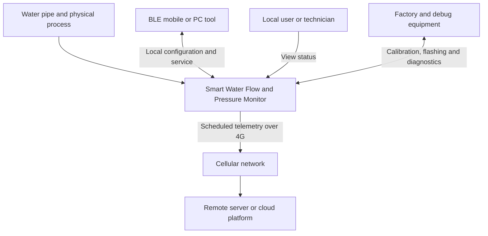
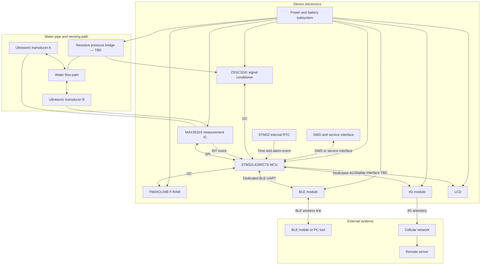
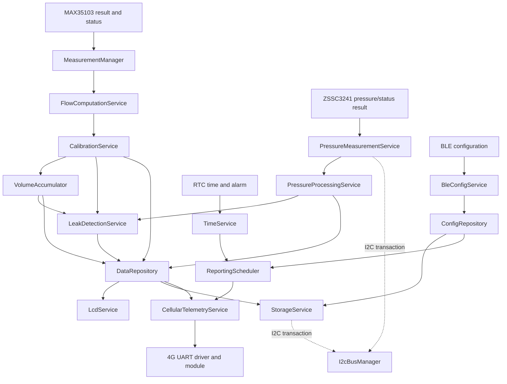

# 02 — System Block Diagram

**Project:** Smart Water Flow and Pressure Monitor
**Document group:** `1.docs/00_overview`
**Document level:** System-level design
**Status:** Initial baseline

---

## 1. Mục tiêu

Tài liệu này mô tả sơ đồ khối tổng quan của hệ thống **Smart Water Flow and Pressure Monitor** và các đường giao tiếp chính giữa những thành phần trong hệ thống.

Tài liệu giúp xác định:

* Các khối phần cứng và subsystem chính.
* Ranh giới giữa sensing, processing, storage, display và connectivity.
* Vai trò của MCU trong việc điều phối dữ liệu.
* Đường kết nối logic giữa thiết bị, BLE client và server.
* Mapping sơ bộ giữa system block và logical firmware service.

Sơ đồ trong tài liệu này không thay thế schematic, pin mapping hoặc cấu hình STM32CubeMX. Các mũi tên thể hiện quan hệ dữ liệu hoặc điều khiển ở mức hệ thống, không thể hiện đầy đủ tín hiệu điện hoặc timing của interface.

---

## 2. Current System Baseline

```text
Main MCU                 : STM32L433RCT6
Ultrasonic measurement  : MAX35103 + ultrasonic transducers
Temperature measurement : MAX35103 measurement subsystem
Pressure measurement    : Resistive pressure bridge TBD + ZSSC3241 signal conditioner over I2C
Persistent storage      : FM24CL04B F-RAM; extension TBD if required
Local configuration     : BLE module through dedicated UART, model TBD
Remote telemetry        : 4G module through dedicated UART, model TBD
Timekeeping             : STM32 internal RTC
Local display           : LCD, model/interface TBD
Power model              : Low-power capable; exact source and budget TBD
```

---

## 3. System Context Diagram

Sơ đồ context thể hiện thiết bị như một system boundary và các đối tượng bên ngoài có tương tác với thiết bị.



Ý nghĩa của system boundary:

* Thiết bị chịu trách nhiệm sensing, processing, leak detection, local display, configuration handling và telemetry generation.
* BLE client chỉ gửi cấu hình hoặc service command qua BLE interface đã định nghĩa.
* Cellular network là đường vận chuyển dữ liệu, không sở hữu measurement data.
* Server nhận telemetry và thực hiện lưu trữ dài hạn, hiển thị hoặc phân tích cấp hệ thống.
* Theo `DEC-ARCH-008`, không có OTA, remote-configuration hoặc generic remote-command block trong baseline; cellular downlink chỉ phục vụ response/time contract đã định nghĩa.
* Factory/debug equipment phục vụ bring-up, calibration và service, không phải một phần của normal production operation.

---

## 4. Physical System Block Diagram



### 4.1. Quy ước mũi tên

| Ký hiệu    | Ý nghĩa                                                    |
| ---------- | ---------------------------------------------------------- |
| `A --> B`  | Dữ liệu, event hoặc điều khiển chính đi từ A sang B        |
| `A <--> B` | Interface có trao đổi hai chiều                            |
| `A --- B`  | Quan hệ vật lý hoặc liên kết không nhấn mạnh hướng dữ liệu |

Các mũi tên `SPI`, `I2C` và `UART` chỉ thể hiện interface logic. Chi tiết pin, DMA, interrupt priority và electrical configuration thuộc `02_hardware` và `03_firmware`.

---

## 5. Logical Functional Block Diagram

Sơ đồ sau thể hiện cách các logical service trong MCU phối hợp. Đây không phải task diagram và không yêu cầu firmware phải sử dụng RTOS.



Các nguyên tắc thể hiện trong sơ đồ:

* Flow pipeline và pressure pipeline được xử lý độc lập trước khi chia sẻ dữ liệu.
* `LeakDetectionService` chỉ sử dụng kết quả đã được xử lý và kiểm tra.
* `DataRepository` là điểm publish dữ liệu runtime cho display, storage và telemetry.
* `DataRepository` dùng double-buffer `RuntimeSnapshot` và atomic active-index swap.
* BLE configuration đi qua `ConfigRepository` và `StorageService`.
* `ConfigRepository` nhận per-service `APPLIED`/`DEFERRED`/`REJECTED` theo matching config version.
* `I2cBusManager` là owner transaction/recovery cho mỗi physical I2C instance; physical mapping chung/tách vẫn là hardware binding.
* `ReportingScheduler` sử dụng thời gian từ `TimeService` và cấu hình từ `ConfigRepository`.
* 4G communication chỉ nhận telemetry đã được tạo từ runtime data, không đọc trực tiếp sensor.

---

## 6. Mô tả các system block

### 6.1. Water pipe and sensing path

Khối này gồm đường nước, cặp ultrasonic transducer và điểm đo áp suất.

Vai trò:

* Tạo physical process cần giám sát.
* Cho phép đo thời gian truyền siêu âm theo hai hướng.
* Cung cấp áp suất tại vị trí lắp đặt sensor.

Hình học ống, vị trí transducer, vị trí pressure sensor và đặc tính cơ khí thuộc tài liệu hardware/mechanical.

### 6.2. MAX35103 measurement IC

MAX35103 là boundary giữa ultrasonic analog/acoustic path và MCU.

Vai trò chính:

* Điều khiển quá trình phát và thu ultrasonic.
* Đo upstream/downstream time-of-flight.
* Cung cấp result, temperature-related measurement và status.
* Phát interrupt/event khi có kết quả hoặc trạng thái cần MCU xử lý.

MCU giao tiếp với MAX35103 qua SPI và nhận measurement event qua GPIO/EXTI.

### 6.3. Pressure bridge and ZSSC3241

Pressure bridge chuyển áp suất nước thành tín hiệu cầu điện trở. ZSSC3241 đã được chọn để conditioning, digitize và hiệu chỉnh sensor-specific, sau đó giao tiếp với MCU qua I2C.

Vai trò chính:

* Cung cấp conditioned pressure measurement và status qua ZSSC3241.
* Cung cấp diagnostic/configuration identity theo capability của ZSSC3241 profile.
* Bổ sung dữ liệu cho monitoring và leak detection policy.

Model pressure bridge, reference type, dải đo, độ chính xác, sample rate và ZSSC3241 calibration profile hiện là `TBD`.

### 6.4. STM32L433RCT6 MCU

MCU là bộ điều phối trung tâm của hệ thống.

Vai trò:

* Khởi tạo và self-check hệ thống.
* Điều phối flow và pressure measurement.
* Tính flow, volume và áp dụng calibration/compensation.
* Phát hiện dấu hiệu rò rỉ.
* Publish `RuntimeSnapshot`.
* Quản lý BLE configuration và 4G telemetry.
* Quản lý RTC, reporting schedule, LCD, storage và low-power.
* Phân loại lỗi và cung cấp diagnostic status.

### 6.5. Persistent storage

FM24CL04B F-RAM lưu các record nhỏ nhưng quan trọng:

* Active configuration.
* Reporting schedule.
* Volume state.
* Calibration metadata/profile nếu phù hợp storage budget.
* Diagnostic counter hoặc compact event record nếu policy yêu cầu.

Nếu thiết bị phải lưu nhiều telemetry record khi 4G offline, dung lượng FM24CL04B có thể không đủ. External nonvolatile storage hoặc storage của 4G module cần được đánh giá riêng.

### 6.6. BLE module

BLE module là communication bridge giữa BLE client và MCU.

Vai trò:

* Nhận configuration/service data từ điện thoại hoặc PC.
* Chuyển dữ liệu giữa BLE wireless link và UART của MCU.
* Trả configuration result hoặc status về client.

BLE module không sở hữu `ActiveConfig` và không được ghi trực tiếp F-RAM. MCU vẫn là authority cho validation, apply và persistent commit.

### 6.7. 4G module

4G module cung cấp kết nối cellular để gửi telemetry lên server.

Vai trò:

* Quản lý network registration và data connection theo lệnh của MCU hoặc module profile.
* Chuyển telemetry từ UART sang cellular network.
* Cung cấp modem/network status cho MCU.

4G module không sở hữu measurement pipeline. Giao thức server, payload, acknowledgement và retry policy sẽ được định nghĩa trong tài liệu communication.

### 6.8. RTC, TimeService and ReportingScheduler

STM32 internal RTC cung cấp hardware timekeeping, alarm và wakeup event.

Ranh giới trách nhiệm:

```text
RTC hardware / RtcDriver
  -> đọc, đặt thời gian và RTC alarm

TimeService
  -> timestamp, time validity, timezone và time synchronization

ReportingScheduler
  -> reporting window, report interval và thời điểm báo cáo tiếp theo
```

Reporting policy không được đặt trong RTC driver.

### 6.9. LCD

LCD hiển thị dữ liệu và trạng thái tại thiết bị.

LCD chỉ sử dụng dữ liệu từ `DataRepository` hoặc `RuntimeSnapshot`, ví dụ:

* Flow rate.
* Total volume.
* Temperature.
* Pressure.
* Leak status.
* Communication, battery hoặc error status.

LCD không được đọc sensor driver trực tiếp và không sở hữu measurement data.

### 6.10. Power subsystem

Power subsystem cấp nguồn và giám sát trạng thái nguồn cho toàn bộ thiết bị.

Yêu cầu cấp hệ thống:

* Hỗ trợ low-power khi không có công việc cần xử lý.
* Bảo đảm 4G transmit burst không làm sụt áp ảnh hưởng MCU hoặc measurement subsystem.
* Cung cấp battery/power status nếu phần cứng hỗ trợ.
* Cho phép PowerManager kiểm soát hoặc theo dõi các power domain cần thiết.

Power source, battery type, regulator và 4G power budget hiện là `TBD`.

### 6.11. External client and server

BLE client và server có vai trò khác nhau:

| External system         | Vai trò baseline                                         |
| ----------------------- | -------------------------------------------------------- |
| BLE mobile/PC tool      | Cấu hình, service và đọc status cục bộ nếu được cho phép |
| Cellular network        | Vận chuyển telemetry từ thiết bị đến server              |
| Remote server           | Nhận, lưu trữ, hiển thị hoặc phân tích telemetry         |
| Factory/debug equipment | Flashing, bring-up, calibration và diagnostic            |

Theo `DEC-ARCH-008`, remote configuration/command và OTA qua 4G không thuộc baseline hiện tại; bổ sung chúng cần architecture/security review và quyết định mới.

---

## 7. Main Interface Summary

Bảng này chỉ tóm tắt interface. `10_system_interfaces.md` là source-of-truth cho interface ID, direction, data ownership và constraints.

| Interface                | Thành phần                       | Giao thức/tín hiệu    | Vai trò                                |
| ------------------------ | -------------------------------- | --------------------- | -------------------------------------- |
| Ultrasonic analog path   | MAX35103 ↔ transducers           | Analog/acoustic       | Phát và thu ultrasonic                 |
| Measurement data/control | MCU ↔ MAX35103                   | SPI                   | Cấu hình và đọc result/status          |
| Measurement event        | MAX35103 → MCU                   | GPIO/EXTI             | Báo result ready hoặc status event     |
| Pressure measurement     | MCU ↔ ZSSC3241 ↔ pressure bridge | I2C + analog bridge   | Cấu hình và đọc pressure/status        |
| Persistent storage       | MCU ↔ FM24CL04B                  | I2C                   | Load/commit persistent records         |
| BLE local configuration  | MCU ↔ BLE module                 | Dedicated UART        | Cấu hình và service cục bộ             |
| BLE wireless link        | BLE module ↔ mobile/PC tool      | BLE                   | User/service interface                 |
| 4G modem interface       | MCU ↔ 4G module                  | Dedicated UART        | Modem control và telemetry transfer    |
| Cellular uplink          | 4G module → server               | Cellular network      | Gửi telemetry từ xa                    |
| Time and alarm           | RTC → MCU runtime                | Internal RTC/alarm    | Timekeeping, report schedule và wakeup |
| Display                  | MCU → LCD                        | TBD                   | Hiển thị runtime data/status           |
| Debug/service            | Debug tool ↔ MCU                 | SWD/service interface | Flashing, debug và factory support     |
| Power status/control     | Power subsystem ↔ MCU            | ADC/GPIO/control TBD  | Power monitoring và low-power policy   |

---

## 8. Data Ownership and Boundary Rules

| Dữ liệu hoặc chức năng            | Owner                             | Reader/consumer                                               |
| --------------------------------- | --------------------------------- | ------------------------------------------------------------- |
| Raw MAX35103 result               | `MeasurementManager`              | Flow processing pipeline                                      |
| Raw pressure result               | `PressureMeasurementService`      | `PressureProcessingService`                                   |
| Calibrated flow                   | `CalibrationService`              | `VolumeAccumulator`, `LeakDetectionService`, `DataRepository` |
| Calibrated pressure               | `PressureProcessingService`       | `LeakDetectionService`, `DataRepository`                      |
| Leak status                       | `LeakDetectionService`            | `DataRepository`                                              |
| Runtime snapshot                  | `DataRepository`                  | LCD, telemetry, storage, diagnostics                          |
| Active/pending config             | `ConfigRepository`                | Measurement, scheduler, connectivity, display                 |
| Persistent records                | `StorageService`                  | Boot/load and diagnostic recovery                             |
| Physical I2C transaction/recovery | `I2cBusManager` của từng instance | Pressure/storage device clients                               |
| System time                       | `TimeService`                     | Reporting, telemetry, diagnostics                             |
| Reporting policy                  | `ReportingScheduler`              | Application and telemetry service                             |
| BLE protocol session              | `BleConfigService`                | Config/command boundary                                       |
| Telemetry delivery session        | `CellularTelemetryService`        | 4G driver/module                                              |

Boundary rules:

1. External client không truy cập trực tiếp MAX35103, pressure sensor hoặc F-RAM.
2. BLE module không sở hữu cấu hình đang hoạt động.
3. 4G module không sở hữu `RuntimeSnapshot` hoặc leak detection result.
4. LCD không truy cập measurement driver.
5. `StorageService` là service duy nhất được phép commit persistent record.
6. `DataRepository` là boundary chia sẻ runtime data giữa measurement, LCD, storage và telemetry.
7. `ReportingScheduler` phát report event; nó không trực tiếp điều khiển UART 4G.
8. ISR và UART callback chỉ tạo event hoặc chuyển dữ liệu tối thiểu, không thực hiện processing nặng.
9. Pressure/storage service không gọi HAL I2C hoặc tự recovery shared bus.
10. OTA và remote configuration/command qua 4G không thuộc baseline.

---

## 9. Power and Scheduling Implications

Sơ đồ khối dẫn đến các ràng buộc sau:

* MAX35103 event, pressure sampling, RTC alarm, BLE RX và UART 4G có thể tạo event độc lập.
* Measurement-critical event phải được ưu tiên hơn LCD refresh và communication work không khẩn cấp.
* BLE và 4G cần hai UART context độc lập; ưu tiên sử dụng hai peripheral UART riêng.
* Cellular transmission có thể kéo dài hoặc retry, vì vậy không được thực hiện bằng blocking loop làm dừng measurement.
* PowerManager chỉ cho phép low-power khi measurement, storage, BLE, 4G và reporting không còn blocker quan trọng.
* RTC alarm là wake source chính cho scheduled reporting.
* Thiết bị phải tiếp tục measurement và LCD operation khi 4G tạm thời offline.
* OTA và remote configuration/command qua 4G là future scope; bổ sung chúng phải cập nhật system context, boot/storage/security block và interface contract.

---

## 10. Open Design Items

| ID       | Nội dung cần chốt                                        | Block bị ảnh hưởng              |
| -------- | -------------------------------------------------------- | ------------------------------- |
| `OQ-001` | Pressure bridge model/range/accuracy và ZSSC3241 profile | Pressure sensing and processing |
| `OQ-002` | BLE module và transparent UART/AT operating model        | BLE communication block         |
| `OQ-003` | 4G module, cellular technology và UART control model     | 4G and power blocks             |
| `OQ-004` | Server protocol và acknowledgement model                 | Cellular telemetry block        |
| `OQ-005` | LCD model và physical interface                          | Display block                   |
| `OQ-006` | Power source, battery và 4G peak-current budget          | Power subsystem                 |
| `OQ-007` | Offline telemetry retention requirement                  | Storage and telemetry queue     |
| `OQ-008` | Time synchronization source and priority                 | RTC and TimeService             |
| `OQ-009` | Leak detection algorithm and thresholds                  | Processing and detection block  |

---

## 11. Tài liệu liên quan

| Tài liệu                                  | Vai trò                                                           |
| ----------------------------------------- | ----------------------------------------------------------------- |
| `README.md`                               | Chốt baseline và phạm vi của system documentation                 |
| `glossary.md`                             | Chốt thuật ngữ và canonical module/service names                  |
| `01_system_overview.md`                   | Mô tả mục tiêu, chức năng và system boundary                      |
| `03_operating_principle.md`               | Chi tiết hóa nguyên lý flow, pressure và leak detection           |
| `08_data_flow.md`                         | Source-of-truth cho measurement/configuration/telemetry data flow |
| `10_system_interfaces.md`                 | Source-of-truth cho interface definition và constraints           |
| `11_firmware_implication.md`              | Mapping system block sang firmware module                         |
| `13_reporting_and_connectivity_policy.md` | Reporting window, time validity, retry và offline behavior        |
| `../02_hardware/`                         | Schematic, pin mapping, power tree và physical interface          |
| `../03_firmware/`                         | Driver, service, internal FSM, scheduling và HAL mapping          |
| `../04_communication/`                    | BLE protocol, 4G modem integration, server contract và payload    |
| `../08_simulation/`                       | Peripheral emulator, virtual time, fault injection và test        |

---

## 12. Kết luận

Kiến trúc hệ thống sử dụng STM32L433RCT6 làm boundary trung tâm giữa sensing, processing, storage, display và external communication.

Luồng kiến trúc chính được tóm tắt như sau:

```text
Ultrasonic and pressure sensing
  -> MCU processing and leak detection
  -> RuntimeSnapshot
  -> LCD / Storage / Scheduled telemetry

BLE client
  -> BLE module and UART
  -> Validated configuration
  -> ConfigRepository and StorageService

RTC
  -> TimeService and ReportingScheduler
  -> Telemetry event
  -> 4G module
  -> Remote server
```

Các tài liệu downstream phải giữ nguyên nguyên tắc: measurement không phụ thuộc communication, external interface không truy cập trực tiếp sensor/storage, và mọi dữ liệu chia sẻ phải đi qua service/repository có trách nhiệm rõ ràng.
