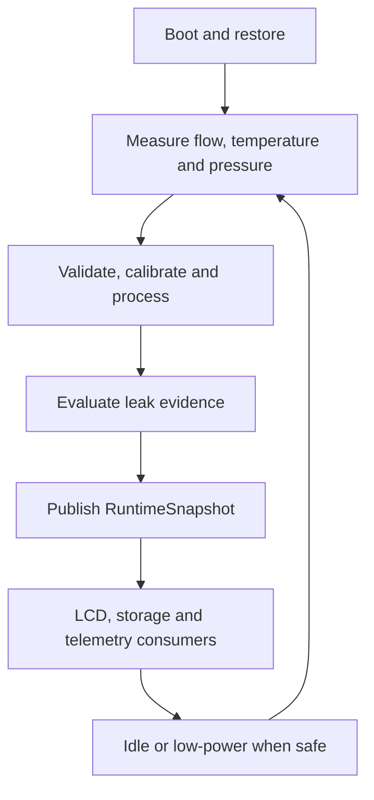
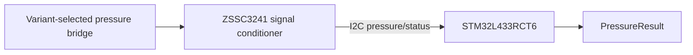
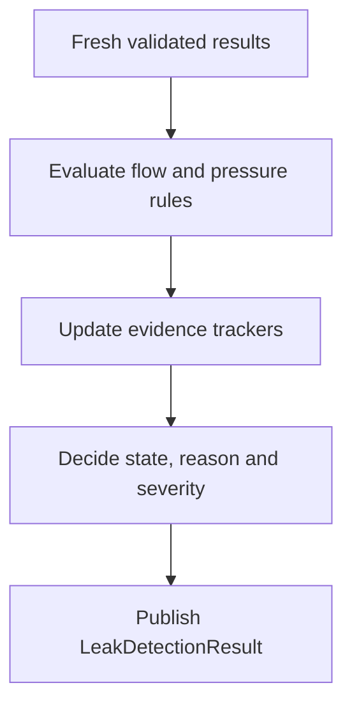
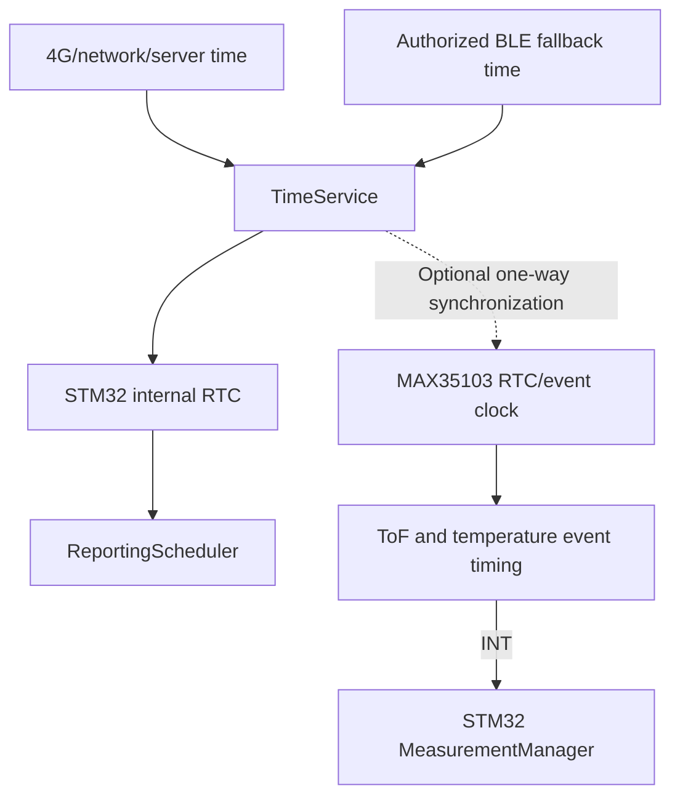
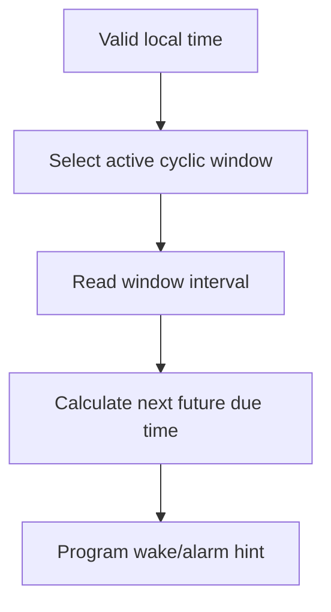
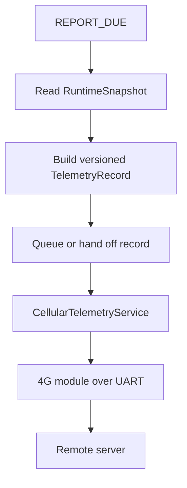
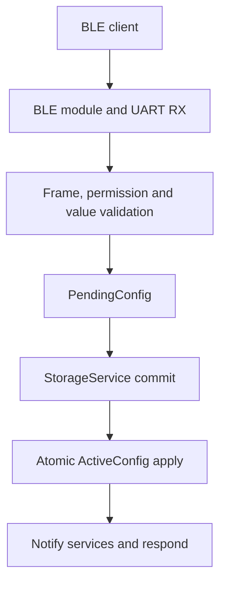

# 03 — System Operating Principle

**Project:** Smart Water Flow and Pressure Monitor
**Short name:** SWFPM
**Document group:** `1.docs/00_overview`
**Document level:** System-level behavior
**Status:** Defined baseline

---

## 1. Mục tiêu

Tài liệu này mô tả nguyên lý vận hành end-to-end của hệ thống **Smart Water Flow and Pressure Monitor**.

Mục tiêu là trả lời các câu hỏi:

* Thiết bị khởi động và khôi phục trạng thái như thế nào?
* Flow, temperature và pressure được đo, kiểm tra và publish như thế nào?
* Leak detection sử dụng các kết quả đo theo nguyên tắc nào?
* `RuntimeSnapshot` được tạo và phân phối cho LCD, storage và telemetry như thế nào?
* Hai reporting window được lựa chọn và tạo `REPORT_DUE` như thế nào?
* BLE configuration được validate, commit và apply như thế nào?
* 4G telemetry hoạt động độc lập với measurement như thế nào?
* Hệ thống xử lý time invalid, sensor fault, 4G offline và low-power như thế nào?

Tài liệu này mô tả behavior và responsibility ở cấp hệ thống. Công thức measurement, register, packet, pin và state-machine implementation thuộc tài liệu downstream.

---

## 2. Phạm vi

### 2.1. Thuộc phạm vi

```text
Boot and initialization principle
Measurement scheduling and processing
Ultrasonic flow and temperature pipeline
Pressure bridge and ZSSC3241 pipeline
Leak-detection evaluation boundary
RuntimeSnapshot publication
LCD and persistent-state consumers
RTC, TimeService and reporting schedule
BLE configuration lifecycle
4G telemetry generation and delivery boundary
Offline and degraded operation
Low-power entry and wake behavior
System event priority and fault isolation
```

### 2.2. Ngoài phạm vi

```text
Ultrasonic/pressure mathematical derivation
MAX35103 opcode and register implementation
ZSSC3241 register, NVM and calibration procedure
Pressure bridge sensor part number and analog range
STM32 HAL calls, pins, DMA and NVIC configuration
BLE GATT UUID and UART frame encoding
4G AT commands and server protocol
Telemetry payload byte layout
LCD segment/page implementation
Exact telemetry retention, retry and acknowledgement policy
Detailed firmware FSM and test cases
```

---

## 3. Source-of-Truth Boundary

| Nội dung                               | Source-of-truth                                                                                              |
| -------------------------------------- | ------------------------------------------------------------------------------------------------------------ |
| System baseline và scope               | `README.md`                                                                                                  |
| Canonical terms                        | `glossary.md`                                                                                                |
| System purpose và subsystem            | `01_system_overview.md`                                                                                      |
| Physical/logical blocks                | `02_system_block_diagram.md`                                                                                 |
| Operating principle cấp hệ thống       | Tài liệu này                                                                                                 |
| Physical/logical interfaces            | `10_system_interfaces.md`                                                                                    |
| Ultrasonic flow principle              | `../01_principle/01_ultrasonic_flow_measurement_principle.md`                                                |
| Temperature compensation               | `../01_principle/02_temperature_compensation_principle.md`                                                   |
| Pressure processing                    | `../01_principle/03_pressure_measurement_principle.md`                                                       |
| Leak algorithm/state/evidence          | `../01_principle/05_leak_detection_algorithm_baseline.md` và `06_leak_detection_state_and_evidence_model.md` |
| Reporting/connectivity policy chi tiết | `13_reporting_and_connectivity_policy.md`                                                                    |
| Main event/action flow                 | `04_main_operation_flow.md`                                                                                  |
| System sequences                       | `05_sequence_diagrams.md`                                                                                    |
| SystemMode/FSM                         | `06_system_fsm.md` và `07_operating_modes.md`                                                                |

Tài liệu này chỉ tóm tắt nguyên lý vật lý/thuật toán và dẫn chiếu sang `01_principle`; không định nghĩa lại threshold hoặc công thức production.

---

## 4. Current Operating Baseline

```text
Main controller             : STM32L433RCT6
Flow/temperature front end  : MAX35103 + ultrasonic transducers + RTD path
Pressure sensing element    : Resistive bridge pressure transducer, model TBD
Pressure signal conditioner : ZSSC3241, selected
Pressure MCU interface      : I2C baseline
Persistent storage          : FM24CL04B F-RAM
Local configuration         : BLE module over dedicated UART, model TBD
Remote telemetry            : 4G module over dedicated UART, model TBD
Timekeeping                 : STM32 internal RTC through HAL-backed RtcDriver
Local display               : LCD, model/interface TBD
Execution model             : Event-driven cooperative baseline
Reporting windows           : Exactly two configurable cyclic windows
```

ZSSC3241 là signal-conditioning IC cho resistive sensor, không phải pressure transducer hoàn chỉnh. Pressure range, reference type, bridge sensitivity và mechanical pressure port vẫn là `TBD` và thuộc hardware profile.

---

## 5. Overall System Operating Model



Các luồng BLE, RTC và 4G tạo event độc lập với measurement:

```text
BLE event -> validate/configure
RTC/time event -> reporting schedule evaluation
4G event -> telemetry delivery progression
Sensor event -> measurement processing
Storage event -> persistent commit progression
```

Không có external subsystem nào được phép thay đổi trực tiếp raw sensor, runtime snapshot hoặc persistent state.

---

## 6. Boot and Initialization Principle

### 6.1. Initialization order

```text
Reset/startup
  -> initialize clock, monotonic time and essential GPIO
  -> initialize storage access
  -> load and validate persistent configuration
  -> load calibration/profile metadata
  -> initialize TimeService from STM32 RTC state
  -> initialize MAX35103 measurement path
  -> initialize ZSSC3241 pressure path
  -> initialize BLE, 4G and LCD interfaces
  -> initialize repositories, schedulers and services
  -> run required self-checks
  -> verify core flow readiness
  -> enter NORMAL only when core flow readiness is satisfied
  -> otherwise enter bounded recovery, authorized SERVICE or ERROR according to result
```

### 6.2. Persistent configuration restore

At boot:

* `StorageService` reads versioned persistent records.
* Integrity/version/dependency validation occurs before apply.
* A valid record becomes `ActiveConfig`.
* If persistent config is invalid or absent, validated `DefaultConfig` is used and a diagnostic is published.
* No service reads partially restored configuration.

### 6.3. Measurement readiness

Device does not publish zero-valued fake measurements while sensors are not ready.

```text
Flow availability        = NOT_READY until first valid FlowResult
Temperature availability = NOT_READY until first valid TemperatureResult
Pressure availability    = NOT_READY until first valid PressureResult
Leak evaluation          = NOT_READY/UNAVAILABLE according to input quality
```

Trong production boot, `Flow availability = READY` là thành phần bắt buộc của `CORE_MEASUREMENT_READY`. Readiness yêu cầu MAX35103/flow path khởi tạo thành công và tạo được ít nhất một self-check hoặc measurement result hợp lệ trong boot session hiện tại. Pressure, BLE, 4G hoặc LCD availability không thay thế điều kiện này.

Nếu flow readiness chưa đạt sau bounded initialization recovery, hệ thống không phát `EVT_INIT_COMPLETED`; nó chuyển `RECOVERY`, authorized `SERVICE` hoặc `ERROR` theo classification và recovery result.

### 6.4. Time readiness

* `RtcDriver` wraps STM32 RTC operations through HAL-level implementation.
* `TimeService` decides whether RTC/wall-clock is valid.
* Monotonic time is available independently for timeout and evidence duration.
* Scheduled reporting remains suspended or not-ready while required wall-clock/local time is invalid.
* Measurement and flow-based leak evaluation continue when monotonic time is valid.

---

## 7. Measurement Coordination Principle

Measurement sources may operate at different intervals:

```text
Ultrasonic ToF interval    : configurable/profile-dependent
Temperature interval      : configurable/profile-dependent
Pressure interval         : configurable/profile-dependent
LCD refresh interval      : independent
Reporting interval        : independent and much slower in typical operation
```

### 7.1. Trigger sources

| Measurement    | Candidate trigger                        | Completion event                                 |
| -------------- | ---------------------------------------- | ------------------------------------------------ |
| Ultrasonic ToF | Periodic schedule/MAX event-timing       | MAX35103 INT/application event                   |
| Temperature    | MAX temperature or combined event-timing | MAX35103 INT/application event                   |
| Pressure       | STM32 monotonic pressure schedule        | ZSSC3241 EOC hoặc bounded status-poll completion |

### 7.2. Coordination rules

* Mỗi measurement stream có period cấu hình độc lập trong `ActiveConfig`; exact default/min/max thuộc product profile và phải được validation bằng hardware/power evidence.
* Deadline được quản lý bằng monotonic time. Wall-clock sync hoặc đổi UTC offset không được dịch chuyển measurement cadence.
* Production ToF/temperature acquisition của MAX35103 sử dụng `EVENT_TIMING`. `DIRECT` chỉ được mở trong authorized service/calibration/diagnostic context và kết quả không được update production volume, leak evidence hoặc telemetry.
* Measurement interval is not derived from telemetry interval.
* A slow 4G transaction must not delay critical measurement beyond its jitter budget.
* ISR/callback captures minimal event/status and schedules service work.
* Each result retains its own sample sequence, monotonic timestamp and quality.
* Consumers may see flow, temperature and pressure from different sample times and must evaluate freshness separately.
* Duplicate/out-of-order measurements do not update filters, volume or leak evidence.
* Mỗi result tách `validity`, `freshness`, `production_acceptance` và `reason_flags`; default maximum age của từng stream là `2 × active measurement period`.

---

## 8. Ultrasonic Flow Operating Principle

### 8.1. Acquisition

MAX35103 coordinates bidirectional ultrasonic launch/receive measurements and provides upstream/downstream ToF results, differential result, status and available acoustic-quality metadata.

```text
Ultrasonic transducers
  -> MAX35103 upstream/downstream ToF
  -> RawUltrasonicMeasurement
  -> transport/status/ToF/acoustic validation
  -> ValidatedUltrasonicMeasurement
```

### 8.2. Flow processing

```text
Validated upstream/downstream ToF
  -> differential/reciprocal-time feature
  -> zero-flow offset correction
  -> direction and deadband classification
  -> geometry/flow model
  -> temperature compensation and calibration
  -> FlowResult
```

System sign convention:

```text
Forward flow -> positive
Reverse flow -> negative
Valid near-zero flow -> ZERO direction
Invalid measurement -> UNKNOWN, never forced to zero
```

Detailed equations and MAX direction semantics belong to `../01_principle/01_ultrasonic_flow_measurement_principle.md`.

### 8.3. Volume accumulation

`VolumeAccumulator` updates volume only from accepted calibrated flow results.

Rules:

* Invalid/stale/duplicate flow does not update volume.
* Long measurement gaps are not bridged silently.
* Monotonic duration is used for integration.
* Wall-clock synchronization does not change integrated duration.
* Forward/reverse/net semantics follow the versioned data model.
* Critical volume state is checkpointed according to storage policy, not on every ISR.

---

## 9. Temperature Operating Principle

MAX35103 measures RC timing through configured RTD/reference-resistor channels. The MCU converts timing ratio to resistance and then to calibrated temperature.

```text
Water-coupled RTD and reference resistor
  -> MAX35103 temperature timing
  -> RawTemperatureMeasurement
  -> MeasurementManager port/status/reference validation
  -> CalibrationService resistance-ratio conversion
  -> CalibrationService RTD curve, calibration and filtering
  -> CalibrationService publishes TemperatureResult
```

Theo `DEC-ARCH-002`, `MeasurementManager` chỉ sở hữu acquisition và validation ban đầu của raw result. `CalibrationService` sở hữu temperature conversion/calibration, quality/freshness assignment và publication. `TemperatureResult` là immutable/versioned data object độc lập; flow compensation và các consumer khác không được sửa object này.

### 9.1. Compensation role

Temperature is paired causally with a flow sample using monotonic timestamps.

Candidate modes:

```text
FULL_COMPENSATION
HELD_TEMPERATURE_COMPENSATION
UNCOMPENSATED_DEGRADED
COMPENSATION_UNAVAILABLE
```

Theo `DEC-ARCH-003`, baseline chỉ chấp nhận production `FlowResult` khi `TemperatureResult` usable theo pairing, quality và calibration policy. `HELD_TEMPERATURE_COMPENSATION`, `UNCOMPENSATED_DEGRADED` và `COMPENSATION_UNAVAILABLE` có thể được giữ như trạng thái nội bộ/chẩn đoán, nhưng không tạo accepted production flow. Khi compensation không khả dụng, firmware publish `FlowResult` với `INVALID` hoặc `DEGRADED_NOT_ACCEPTED`; result này không update volume, không tạo flow-based leak evidence và không được trình bày như production telemetry hợp lệ.

Held-temperature hoặc uncompensated fallback chỉ được mở bằng policy được version hóa sau khi validation chứng minh error budget chấp nhận được. Một giá trị mặc định không bao giờ được trình bày như temperature measurement mới.

### 9.2. Boundary rules

* Temperature is not independent leak evidence.
* Temperature không usable bắt buộc làm production flow `INVALID` hoặc `DEGRADED_NOT_ACCEPTED` trong baseline.
* Temperature and flow result quality remain separate.
* Board/MCU temperature cannot replace water temperature without a validated thermal model.
* Compensation must not apply the same effect twice in the physical flow model and calibration table.

Detailed conversion and fallback semantics belong to `../01_principle/02_temperature_compensation_principle.md`.

---

## 10. Pressure Operating Principle

### 10.1. Pressure hardware chain



Responsibilities:

| Component                    | Responsibility                                                                                            |
| ---------------------------- | --------------------------------------------------------------------------------------------------------- |
| Pressure bridge              | Convert applied pressure into resistive bridge signal                                                     |
| ZSSC3241                     | Excitation/signal conditioning, digitization and sensor-specific correction according to hardware profile |
| `pressure_sensor_driver`     | I2C transaction and device-specific status/raw decode                                                     |
| `PressureMeasurementService` | Sampling, sequence and acquisition status                                                                 |
| `PressureProcessingService`  | System validation, canonical unit, filtering, freshness and result publication                            |

### 10.2. Processing pipeline

```text
Resistive pressure bridge
  -> ZSSC3241 conditioned/digital result
  -> RawPressureMeasurement
  -> I2C/device-status validation
  -> engineering-unit and reference-type validation
  -> device/system calibration boundary
  -> filtering, trend and freshness evaluation
  -> PressureResult in canonical Pa
```

Production acquisition dùng ZSSC3241 Sleep Mode và one-shot full measurement qua I2C. `PressureMeasurementService` release I2C bus trong conversion, chờ EOC nếu pin được route hoặc dùng monotonic timer với bounded status polling. Cyclic Mode không thuộc MVP; Command Mode chỉ dành cho calibration/service. Conversion timeout lấy từ worst-case profile cộng arbitration/jitter margin.

`DEC-HW-001` tách pressure configuration thành ba lớp: build-time `PressureSensorProfile` + `Zssc3241Profile`, persistent `PressureCalibrationRecord` theo từng thiết bị, và bounded `PressureRuntimeConfig`. Boot phải xác nhận compatible IDs/schema/CRC trước khi pressure result được phép đạt production acceptance; downstream consumer chỉ đọc canonical `PressureResult`.

### 10.3. Calibration boundary

ZSSC3241 may contain sensor-specific correction/configuration, but MCU-side processing must still:

* Validate configuration/profile identity.
* Detect invalid status and communication errors.
* Preserve explicit pressure reference type.
* Convert/represent pressure in canonical `Pa`.
* Avoid double-applying the same offset/gain correction.
* Carry calibration/config version in diagnostics where required.

The division between ZSSC3241 internal calibration and MCU calibration remains hardware/calibration-document responsibility.

### 10.4. Pressure variant qualification boundary

The following remain `TBD` without blocking system operating principle:

```text
Pressure bridge part number
Gauge/absolute reference type
Rated and overload range
Bridge sensitivity and excitation requirements
Accuracy and temperature behavior
Mechanical port/media compatibility
ZSSC3241 analog configuration and calibration coefficients
```

### 10.5. Failure behavior

* I2C/device fault makes pressure invalid/unavailable, never zero.
* Last pressure may remain visible with stale/error indication.
* Flow measurement and flow-only leak rules continue if otherwise valid.
* Pressure-only data cannot confirm leak in the MVP baseline.

Detailed pressure value/filter/trend semantics belong to `../01_principle/03_pressure_measurement_principle.md`.

---

## 11. Leak-Detection Operating Principle

Leak detection consumes only published processed results:

```text
FlowResult
VolumeState
PressureResult
Monotonic time
Validated LeakDetectionConfig
```

### 11.1. Evidence roles

| Evidence                    | MVP role                                           |
| --------------------------- | -------------------------------------------------- |
| Continuous forward flow     | Primary evidence                                   |
| High forward flow/burst     | Primary evidence                                   |
| Low/high pressure           | Diagnostic                                         |
| Pressure drop/trend         | MVP supporting/correlation evidence và diagnostics |
| Temperature                 | Flow-quality/telemetry context only                |
| Wall-clock/reporting window | Not a baseline leak-confirmation dependency        |

### 11.2. Evaluation flow



### 11.3. State and quality separation

Leak state:

```text
NORMAL
SUSPECTED
CONFIRMED
```

Evaluation availability:

```text
NOT_READY
ACTIVE
DEGRADED
UNAVAILABLE
```

Invalid/stale input does not automatically clear current leak state. Valid stable-clear evidence is required according to the state/evidence policy.

### 11.4. Core invariants

* Pressure alone does not transition to `CONFIRMED`.
* Pressure trend không tự tạo `SUSPECTED`/`CONFIRMED`, không clear leak state và không thay thế flow evidence.
* Invalid/stale sample is neither positive evidence nor clear evidence.
* RTC/wall-clock adjustment does not change evidence duration.
* 4G offline does not stop leak evaluation.
* Reporting interval does not define leak-evaluation interval.
* Leak service does not send telemetry or write LCD directly.
* Threshold, evidence duration, confirm/clear rule và hysteresis nằm trong versioned `LeakDetectionProfile`; exact numeric values chưa được coi là product requirement cho đến khi có validation evidence.
* Profile mới chỉ có hiệu lực sau validate và persistent commit. Khi apply thành công, evidence trackers cũ bị reset để không trộn evidence tạo bởi hai profile; kết quả mới mang `profile_version`.

---

## 12. RuntimeSnapshot Publication Principle

Theo `DEC-ARCH-006`, `DataRepository` publish `RuntimeSnapshot` bằng hai buffer: build hoàn chỉnh inactive buffer, gắn version/time metadata rồi atomic swap active index.

```text
Snapshot version
Publish timestamp
FlowResult and freshness
VolumeState
TemperatureResult and freshness
PressureResult and freshness
LeakDetectionResult
PowerStatus
ConnectivityStatus
ReportingStatus
SystemStatus and error flags
```

### 12.1. Publication triggers

Candidate triggers:

* New accepted `FlowResult`/`VolumeState`.
* New accepted `TemperatureResult`.
* New accepted `PressureResult`.
* Leak result/state/reason change.
* Connectivity/reporting/power/error status change.
* Config version transition requiring visible status.

### 12.2. Consistency rules

* Consumer never reads a partially updated object.
* Snapshot version changes after successful publication.
* Each measurement preserves its own sample timestamp/sequence.
* Snapshot publish time does not replace sensor sample time.
* Snapshot schema is not the same as telemetry schema.
* LCD, telemetry and diagnostics read snapshot/view interfaces, not sensor drivers.

---

## 13. Local Display Principle

```text
RuntimeSnapshot
  -> LcdService selects fields/status
  -> display model
  -> lcd_driver
  -> LCD
```

LCD may display:

* Flow rate and direction.
* Total volume.
* Temperature.
* Pressure.
* Leak state/reason summary.
* Time, connectivity, reporting and error status.

Rules:

* Invalid, unavailable and stale are distinct from zero.
* LCD does not compute/calibrate measurements.
* LCD does not own leak state.
* Refresh is lower priority than measurement-critical work.
* LCD fault does not stop measurement, storage or telemetry.
* Exact pages/segments/interface remain `TBD` until LCD is selected.

---

## 14. Persistent Storage Principle

`StorageService` is the only service allowed to commit persistent records.

Candidate persistent records:

```text
Active configuration
Reporting schedule
Calibration/profile metadata
Critical volume checkpoint
Compact diagnostic/recovery metadata
Telemetry queue records if future storage policy selects F-RAM/other backing
```

### 14.1. Commit flow

```text
Validated commit request
  -> encode versioned record
  -> write inactive A/B slot when applicable
  -> verify integrity/readback
  -> activate new valid record
  -> publish commit result
```

### 14.2. Storage rules

* No write occurs directly in UART, RTC or sensor ISR.
* Failed commit leaves previous valid record active.
* Configuration does not become active before required commit succeeds.
* Volume checkpoint policy balances loss window, endurance and scheduling.
* FM24CL04B capacity is not assumed sufficient for long offline telemetry retention.
* Telemetry retention/replacement policy remains a deferred 4G-offline decision.

---

## 15. Time, Clock and RTC Operating Principle

The system has three hardware/external clock sources but they do not have the same role:

```text
MAX35103 clocks       -> ultrasonic/temperature measurement and event timing
STM32 timebases       -> monotonic time and system wall-clock
4G/network/server time -> external synchronization authority
```

Baseline avoids making both MAX35103 RTC and STM32 RTC simultaneous system-time authorities.

### 15.1. Clock and time-source classification

| Source                        | Clock/time domain        | Baseline role                                                          |                            System-time authority? |
| ----------------------------- | ------------------------ | ---------------------------------------------------------------------- | ------------------------------------------------: |
| MAX35103 high-speed clock     | Measurement clock        | ToF and temperature timing conversion                                  |                                                No |
| MAX35103 32.768 kHz clock/RTC | Measurement event clock  | MAX event-timing sequence, measurement cadence and INT generation      |                                                No |
| STM32 monotonic timebase      | Monotonic clock          | Timeout, freshness, debounce, evidence duration and volume integration |                                Yes, for durations |
| STM32 internal RTC            | System wall-clock        | UTC/local time, timestamp, reporting schedule, alarm and wakeup        |                               Yes, for wall-clock |
| 4G/network/server time        | External time source     | Synchronize/correct STM32 system time                                  | Highest external authority, not an internal clock |
| BLE-provided service time     | External fallback source | Commissioning/service synchronization when authorized                  |                          Controlled fallback only |

### 15.2. Responsibility separation

```text
Max35103Driver / MeasurementManager
  -> configure and monitor MAX35103 measurement clocks/event timing
  -> receive measurement-completion INT
  -> expose MAX clock/event quality to measurement pipeline

RtcDriver
  -> STM32 HAL-backed RTC read/write/alarm operations

TimeService
  -> system wall-clock, validity, source, synchronization and local-time conversion

ReportingScheduler
  -> reporting windows, interval and next due time
```

`RtcDriver` is a firmware abstraction over STM32 RTC HAL functions; it is not a separate external RTC module.

### 15.3. Time architecture



Data/control direction is one way for baseline synchronization:

```text
Validated external time
  -> TimeService
  -> STM32 RTC
  -> optional MAX35103 RTC/event-time alignment if required
```

MAX35103 RTC does not overwrite STM32 system time in the baseline.

### 15.4. Time domains

| Time domain            | Owner/source                     | Use                                                                         |
| ---------------------- | -------------------------------- | --------------------------------------------------------------------------- |
| Measurement time       | MAX35103 high-speed clock        | Convert raw ToF/temperature timing and assess measurement quality           |
| Measurement event time | MAX35103 32.768 kHz/event timing | Trigger internal MAX measurement sequences                                  |
| Monotonic time         | STM32 platform timebase          | Timeout, debounce, leak evidence duration, freshness and volume integration |
| UTC/wall-clock         | `TimeService` + STM32 RTC        | Event/telemetry timestamp and reporting schedule                            |
| Local time             | Derived by `TimeService`         | Reporting-window selection and LCD presentation                             |

Clock domains must not be substituted silently. A MAX event counter or RTC timestamp is not automatically a valid STM32 wall-clock timestamp.

### 15.5. Measurement timestamping

MAX35103 measurement completion follows this baseline:

```text
MAX35103 event-timing sequence completes
  -> MAX35103 asserts INT
  -> STM32 captures monotonic event time
  -> MeasurementManager reads coherent MAX result/status
  -> TimeService supplies wall-clock timestamp if valid
  -> FlowResult / TemperatureResult
```

Measurement/result metadata should preserve:

```text
sample_monotonic_time
wall_clock_timestamp
timestamp_valid
MAX event/cycle sequence
MAX measurement-clock quality or calibration status
measurement_config_version
```

The wall-clock timestamp is assigned by the STM32 system-time domain. MAX35103 remains the authority only for its measurement timing and event sequence.

### 15.6. Time synchronization priority

Current baseline priority:

```text
1. Validated 4G/network/server-derived time
2. Authorized BLE-provided service time
3. Restored STM32 RTC time with retained validity/source-age metadata
```

Synchronization behavior:

1. Validate source, format, permitted range and trust state.
2. Update `TimeService` source/quality metadata.
3. Set or correct STM32 RTC through `RtcDriver`.
4. Recalculate local time, active reporting window and next report time.
5. Optionally align MAX35103 RTC/event timing in one direction if measurement scheduling requires it.
6. Do not modify monotonic timers or accumulated durations.

Thiết bị dự kiến sync 4G/server mỗi 24 giờ. Giữa các lần sync, STM32 RTC duy trì local wall clock. Theo `DEC-SCHED-001`, `max_time_sync_age` mặc định là 7 ngày (`604800 s`) và cấu hình được; khi `sync_age >= max_time_sync_age` hoặc RTC continuity không đáng tin cậy, wall clock chuyển `INVALID`. Exact authentication, config min/max, drift threshold và step-versus-slew policy thuộc `13_reporting_and_connectivity_policy.md` và tài liệu cấu hình chi tiết.

### 15.7. Invalid time behavior

* MAX35103 ToF/temperature measurement and event timing may continue if their local clocks/status are valid.
* STM32 monotonic algorithms continue.
* Flow, volume and flow-based leak evaluation continue when their inputs are valid.
* Wall-clock timestamps are marked invalid.
* Theo `DEC-SCHED-001 = DEFER_UNTIL_VALID`, reporting windows không được dùng để tạo scheduled record; reporting chuyển deferred/not-ready.
* When valid time is restored, scheduler applies `SKIP_TO_NEXT` to every expired slot and recalculates the next valid future report slot.
* Theo `DEC-SCHED-002`, không tạo backlog hoặc catch-up record cho các schedule slot đã quá hạn.

MAX35103 RTC being operational does not by itself make STM32 system wall-clock valid.

### 15.8. Clock adjustment behavior

* STM32 RTC correction does not change monotonic timers.
* Scheduler recalculates active window and next due time.
* A backward adjustment must not duplicate a report slot without deduplication policy.
* A forward adjustment applies `SKIP_TO_NEXT`: expired intervals do not create telemetry records, and only the next valid future slot is armed.
* Current/pending telemetry delivery is not cancelled solely by clock correction.
* MAX35103 measurement filters/cycle counters are not reset solely because STM32 wall-clock changes.
* If MAX event clock is explicitly resynchronized, firmware applies it at a safe measurement boundary and records a clock/config transition.

### 15.9. MAX35103 RTC fallback policy

Using MAX35103 RTC as a fallback source for STM32 system time is not part of the initial baseline.

Future enablement requires an ADR and validation for:

```text
RTC drift and accuracy comparison
Synchronization direction
Reset and power-domain asymmetry
Validity after STM32 or MAX35103 reset
Conflict-resolution and source-priority rules
Reporting duplicate/missed-slot prevention
Timestamp conversion and traceability
```

Until that decision is approved:

```text
MAX35103 RTC = measurement/event-timing clock
STM32 RTC    = system wall-clock
4G time      = highest external synchronization source
```

---

## 16. Two-Window Reporting Principle

### 16.1. Schedule model

```text
ReportingSchedule
  ReportingWindow[0]: start time + interval
  ReportingWindow[1]: start time + interval
```

Rules:

* Exactly two windows in the baseline.
* Start times are distinct local times within one 24-hour cycle.
* Each window end is the other window start.
* Windows are not permanently named day/night.
* Both start time and interval are configurable through BLE.
* Default `ReportingWindow[0]` là 06:00/15 phút; default `ReportingWindow[1]` là 22:00/5 phút.
* Start time có độ phân giải một phút trong `00:00..23:59`, hai start phải khác nhau và mỗi derived window phải dài ít nhất 30 phút.
* Interval là số phút nguyên trong `5..60`. Civil-time baseline dùng versioned fixed UTC offset; Vietnam profile mặc định `UTC+07:00`.

### 16.2. Window selection

At local time $t$:

1. Normalize both start times and $t$ to the same 24-hour domain.
2. Select the most recent start boundary at or before $t$, with cyclic wrap-around.
3. The selected window supplies the active report interval.

Example topology:



### 16.3. Next report behavior

Baseline behavior:

* Next due time is strictly in the future after schedule apply/time resync.
* Crossing a window boundary switches to the new interval.
* Schedule update does not generate an immediate report by default.
* MVP chỉ tạo record bởi scheduled due event; leak-state transition không tạo immediate telemetry.
* Schedule update does not cancel delivery already in progress.
* Exact phase anchoring and deduplication are finalized in `13_reporting_and_connectivity_policy.md`.

### 16.4. Due event

When a valid due time is reached:

```text
ReportingScheduler
  -> EVT_REPORT_DUE / REPORT_DUE
  -> application/telemetry builder
```

`REPORT_DUE` means a record should be generated. It does not mean queued, transmitted, acknowledged or deleted.

---

## 17. Telemetry Generation and 4G Delivery Principle



### 17.1. Record generation

Telemetry builder:

* Reads a consistent snapshot.
* Copies values with unit, quality and timestamp semantics defined by schema.
* Assigns schema version and report sequence.
* Records due/generation time validity.
* Does not expose in-memory struct layout as network contract.

### 17.2. Delivery separation

Delivery states are distinct:

```text
GENERATED
QUEUED
SENDING
DELIVERED/ACKNOWLEDGED if protocol supports
FAILED/RETRY_PENDING
```

The exact enum belongs to firmware/communication documents.

### 17.3. Offline behavior

When 4G/network/server is unavailable:

* Measurement, leak detection, LCD and critical storage continue.
* Connectivity status becomes offline/degraded.
* Delivery failure does not invalidate measurement data.
* Retry/backoff, acknowledgement, retention length and full-queue replacement remain `TBD` features under consideration.
* No document may assume infinite queue capacity.

### 17.4. Non-blocking rule

4G state progression must be asynchronous or bounded. Long modem/network waits cannot run inside RTC callback or block measurement event processing.

---

## 18. BLE Configuration Principle

BLE is the local configuration/service channel. The BLE module communicates with STM32 through an independent UART context.



### 18.1. Configurable categories

Candidate configuration includes:

```text
Reporting window start times and intervals
Leak thresholds/durations within authorized bounds
Measurement intervals where product policy permits
Time/timezone/service synchronization request
4G/server settings when authorized
LCD preferences
Diagnostics/service commands
```

Leak configuration được biểu diễn bằng một versioned profile gồm threshold, evidence duration, confirm/clear rule và hysteresis. Measurement period được cấu hình theo từng stream; reporting start/interval phải tuân thủ range của `DEC-SCHED-004`.

### 18.2. Validation layers

```text
Frame and length
Command/version
Authentication/permission
Type and unit
Per-field range
Cross-field dependency
Hardware/profile capability
Runtime safety/application boundary
Persistent encoding/version
```

### 18.3. Apply rules

* BLE module is transport, not configuration authority.
* UART callback does not modify `ActiveConfig`.
* Invalid config leaves active/persistent state unchanged.
* Required persistent commit completes before apply.
* Affected services receive one versioned config transition.
* Measurement/profile changes apply at safe cycle boundaries.
* Reporting changes recalculate next future due time.
* Leak profile change resets evidence trackers after successful apply and publishes the new `profile_version`; state re-evaluation starts from evidence collected under that version.

---

## 19. Configuration Update Effects

| Changed category          | Affected behavior                                             |
| ------------------------- | ------------------------------------------------------------- |
| Reporting start/interval  | Recalculate active window and next report                     |
| Timezone                  | Re-evaluate local window without changing monotonic timers    |
| Wall-clock/time sync      | Update validity/timestamp; recalculate schedule               |
| Flow measurement profile  | Finish/stop safe cycle, reset incompatible filter/history     |
| Temperature profile       | Reset pairing/filter; update compensation mode                |
| Pressure/ZSSC profile     | Reset pressure filter/trend; verify calibration compatibility |
| Leak thresholds/durations | Apply versioned config; handle trackers/state per leak policy |
| 4G settings               | Reconfigure connectivity state without stopping measurement   |
| LCD preferences           | Rebuild display model only                                    |

Configuration change does not retroactively alter historical volume, events or already generated telemetry records unless a dedicated migration policy exists.

---

## 20. Low-Power Operating Principle

### 20.1. Entry condition

`PowerManager` may enter low-power only when all critical blockers are clear:

```text
No measurement transaction in progress
No unprocessed sensor result
No persistent commit in progress
No BLE frame/response requiring immediate completion
No 4G critical transaction at unsafe interruption point
No telemetry build/queue atomic operation in progress
Next wake source/time is known
```

### 20.2. Wake sources

Candidate wake sources:

* STM32 RTC alarm/time event.
* MAX35103 INT.
* UART RX/module event if hardware permits.
* Pressure sample timer/platform event.
* Service/debug input where authorized.
* Power/reset condition.

### 20.3. Wake behavior

After wake:

1. Determine wake reason.
2. Restore required clock/power domains.
3. Process highest-priority pending event.
4. Re-evaluate sample/result freshness.
5. Re-arm next measurement/report wake hint.
6. Return to idle/low-power only after blockers clear.

Low-power mode must not make stale cached data appear fresh.

---

## 21. Fault Isolation and Degraded Operation

| Fault domain                   | Expected system behavior                                                                                                                                                                                       |
| ------------------------------ | -------------------------------------------------------------------------------------------------------------------------------------------------------------------------------------------------------------- |
| MAX35103/ultrasonic fault      | Flow invalid; no volume update; pressure/LCD/config/connectivity continue trong bounded local recovery. Hết local budget thì system recovery được yêu cầu; `ERROR` chỉ dùng khi coordinated recovery thất bại. |
| Temperature probe fault        | Compensation degraded/unavailable; flow follows explicit fallback policy                                                                                                                                       |
| Pressure bridge/ZSSC/I2C fault | Pressure invalid; flow-only leak evaluation continues                                                                                                                                                          |
| F-RAM/storage fault            | Runtime measurement continues; persistent update reports failure; previous valid state retained when possible                                                                                                  |
| BLE fault                      | Local configuration unavailable; active config and measurement continue                                                                                                                                        |
| 4G/network fault               | Telemetry offline; measurement, leak and LCD continue                                                                                                                                                          |
| LCD fault                      | Measurement, storage and telemetry continue                                                                                                                                                                    |
| RTC/time invalid               | Scheduled reporting suspended; monotonic measurement/leak continues                                                                                                                                            |
| Power critical                 | Protect persistent state and reduce nonessential work according to future power policy                                                                                                                         |

### 21.1. No cascading reset by default

A localized peripheral/communication fault does not reset the complete system unless recovery analysis shows the shared platform is unsafe or unrecoverable.

### 21.2. Invalid is not zero

The following are distinct:

```text
valid zero measurement
invalid measurement
stale last value
unavailable/not-yet-ready
```

This distinction must be preserved through snapshot, LCD and telemetry.

---

## 22. Event Priority Principle

When multiple events are pending, baseline priority is:

| Priority | Event class                         | Examples                                                      |
| -------: | ----------------------------------- | ------------------------------------------------------------- |
|        1 | Safety/power integrity              | Critical power, storage integrity, fatal platform condition   |
|        2 | Measurement-critical completion     | MAX result, pressure acquisition completion, timeout handling |
|        3 | Monotonic timing/deadline           | Measurement due, evidence timeout, required scheduler update  |
|        4 | Persistent commit atomic step       | Verify/switch active record                                   |
|        5 | BLE RX/config service               | Parse, validate, respond                                      |
|        6 | 4G telemetry progression            | Modem RX/TX, connection, delivery                             |
|        7 | LCD refresh/noncritical diagnostics | Presentation updates                                          |

Exact interrupt priorities belong to hardware/firmware documents. System priority expresses service importance, not direct NVIC numbers.

### 22.1. Fairness and bounded work

* Each event handler performs bounded work or advances one state-machine step.
* 4G/BLE parsing does not monopolize runtime.
* LCD refresh may be skipped/coalesced under load.
* Measurement events cannot starve configuration/storage indefinitely; firmware defines bounded queues/budgets.

---

## 23. Core Event Model

Candidate system events:

```text
EVT_SYSTEM_START
EVT_MAX_RESULT_READY
EVT_TEMPERATURE_RESULT_READY
EVT_PRESSURE_SAMPLE_DUE
EVT_PRESSURE_RESULT_READY
EVT_MEASUREMENT_PUBLISHED
EVT_LEAK_RESULT_CHANGED
EVT_RTC_ALARM
EVT_TIME_VALIDITY_CHANGED
EVT_REPORT_DUE
EVT_BLE_CONFIG_RECEIVED
EVT_CONFIG_COMMIT_REQUIRED
EVT_CONFIG_APPLY_STATUS
EVT_CONFIG_APPLIED
EVT_CELLULAR_TX_REQUESTED
EVT_CELLULAR_TX_COMPLETED
EVT_STORAGE_COMPLETED
EVT_POWER_STATE_CHANGED
EVT_ERROR_DETECTED
```

Events indicate facts/requests. They do not imply downstream success. For example:

```text
EVT_REPORT_DUE != telemetry delivered
EVT_CONFIG_COMMIT_REQUIRED != config committed
EVT_MAX_RESULT_READY != valid FlowResult
EVT_CELLULAR_TX_COMPLETED != server acknowledged unless protocol says so
```

---

## 24. Service Responsibility Summary

| Service                              | Main operating responsibility                                                                                                             |
| ------------------------------------ | ----------------------------------------------------------------------------------------------------------------------------------------- |
| `SystemManager`                      | Boot, self-check, high-level mode and recovery coordination                                                                               |
| `MeasurementManager`                 | MAX35103 measurement scheduling/result acquisition                                                                                        |
| `FlowComputationService`             | Validated ToF to processed flow model                                                                                                     |
| `CalibrationService`                 | Temperature conversion/calibration và owner của `TemperatureResult`; flow zero/calibration/temperature compensation và final `FlowResult` |
| `PressureMeasurementService`         | ZSSC3241 pressure acquisition scheduling                                                                                                  |
| `PressureProcessingService`          | Pressure validation, canonical conversion, filter/trend and `PressureResult`                                                              |
| `VolumeAccumulator`                  | Valid flow integration and volume state                                                                                                   |
| `LeakDetectionService`               | Evidence trackers, leak state/reason/severity                                                                                             |
| `DataRepository`                     | Double-buffered `RuntimeSnapshot` publication bằng atomic active-index swap                                                               |
| `ConfigRepository`                   | Default/pending/active config lifecycle                                                                                                   |
| `StorageService`                     | Persistent load/commit/integrity                                                                                                          |
| `TimeService`                        | Time, validity, source and local conversion                                                                                               |
| `ReportingScheduler`                 | Active reporting window and next due event                                                                                                |
| `BleConfigService`                   | BLE transport parsing, response and local config boundary                                                                                 |
| `CellularTelemetryService`           | 4G/modem/server delivery progression                                                                                                      |
| `LcdService`                         | Snapshot to display model                                                                                                                 |
| `PowerManager`                       | Power blockers, sleep/wake coordination                                                                                                   |
| `DiagnosticsService`/`HealthMonitor` | Fault/status/counter aggregation                                                                                                          |

No service should take ownership of data belonging to another service by directly modifying its internal state.

---

## 25. Operating Invariants

The following must hold in all modes:

1. Only processed/validated results enter leak detection.
2. Invalid or stale measurement is never silently converted to zero.
3. Volume updates only from accepted calibrated flow.
4. Pressure-only evidence cannot confirm leak in MVP.
5. Wall-clock changes do not alter monotonic duration/integration.
6. `RuntimeSnapshot` publication uses double buffer and atomic active-index swap.
7. LCD and telemetry never read sensor drivers directly.
8. BLE does not own active configuration or persistent storage.
9. 4G delivery does not block measurement indefinitely.
10. `REPORT_DUE` is separate from delivery success.
11. `RtcDriver`, `TimeService` and `ReportingScheduler` remain separate responsibilities.
12. Storage commit failure does not partially apply configuration.
13. A local peripheral fault is isolated when core operation remains safe.
14. Low-power entry requires all critical blockers clear.
15. Every result/config/record requiring traceability carries appropriate version/sequence metadata.
16. Production boot không vào `NORMAL` trước khi core flow path tạo được readiness evidence hợp lệ trong boot session hiện tại.
17. Runtime flow fault tạm thời giữ `SystemMode=NORMAL` với measurement status `DEGRADED`; volume và flow-dependent leak evidence bị tạm dừng cho đến khi có valid flow result mới.
18. `CalibrationService` là owner duy nhất của published `TemperatureResult`; `MeasurementManager` chỉ cung cấp validated raw temperature input và consumer chỉ đọc immutable result.

---

## 26. Normal Operating Cycle Example

```text
Wake because measurement is due
  -> trigger/read MAX35103 result
  -> validate ToF/temperature data
  -> compute and calibrate FlowResult/TemperatureResult
  -> request/read ZSSC3241 pressure result when due
  -> validate/filter/calibrate PressureResult
  -> update VolumeState from valid flow
  -> evaluate leak evidence/state
  -> publish RuntimeSnapshot
  -> refresh LCD when needed
  -> checkpoint critical state when policy requires
  -> evaluate reporting due/time events
  -> advance BLE/4G state machines if pending
  -> program next wake hints
  -> enter idle/low-power when safe
```

The implementation may interleave these actions by events; this sequence defines dependencies, not a blocking super-loop.

---

## 27. Special Operating Scenarios

### 27.1. Boot with invalid persistent config

```text
Integrity/version validation fails
  -> retain diagnostic
  -> use validated DefaultConfig
  -> initialize services
  -> operate in degraded/default-config status
```

### 27.2. Flow path not ready at production boot

```text
Initialize and verify MAX35103/flow path
  -> no valid readiness result
  -> keep SystemMode = INIT
  -> run bounded initialization recovery
  -> valid verification result: complete INIT and enter NORMAL
  -> coordinated recovery required: enter RECOVERY
  -> recovery failed without safe core flow operation: enter ERROR
  -> authorized service request: SERVICE according to service policy
```

Không publish zero flow giả và không dùng pressure availability để thay thế flow readiness.

### 27.3. Pressure subsystem unavailable

```text
ZSSC/I2C/bridge result invalid
  -> PressureResult unavailable
  -> snapshot shows pressure fault
  -> pressure evidence disabled
  -> valid flow leak rules continue
```

### 27.4. RTC invalid at startup

```text
Measurement and monotonic algorithms run
Scheduled reporting remains not-ready
4G attempts time synchronization according to connectivity policy
When time becomes valid -> recompute next future report
```

### 27.5. 4G offline at report due

```text
Generate/queue behavior follows selected offline policy
Mark delivery/connectivity failure
Continue measurement/leak/LCD
Retry/retention remains bounded and policy-driven
```

### 27.6. BLE schedule update

```text
Receive candidate schedule
  -> validate two distinct starts and interval bounds
  -> persist candidate
  -> atomically apply ActiveConfig
  -> scheduler recomputes active window/next future due
  -> return versioned response
```

### 27.7. Sensor result during 4G transmission

```text
Capture measurement event at higher priority
Process/read within deadline
Pause/advance modem work through bounded state machine
Do not discard measurement because UART 4G is active
```

---

## 28. Configuration and Hardware TBD Policy

Unknown part numbers do not block system-level operating behavior when their capability contract is defined.

### 28.1. Selected components

```text
STM32L433RCT6
MAX35103
ZSSC3241 signal conditioner
FM24CL04B F-RAM
```

### 28.2. Remaining hardware TBDs

```text
Pressure bridge sensor and range
BLE module/model/profile
4G module/model/profile
LCD model/interface
Power source/regulator/budget
RTD/reference-resistor implementation details
```

### 28.3. Change rule

When a TBD component is selected:

1. Update `02_hardware` component/interface document.
2. Check whether capability violates current IF/LIF contract.
3. Update overview only if system behavior/boundary changes.
4. Update firmware driver/communication contract.
5. Add or update validation evidence.
6. Create ADR if the selection changes baseline responsibility or protocol.

A part-number update alone should not rewrite system behavior when the existing capability contract remains valid.

---

## 29. Deferred Decisions

| ID          | Decision                      | Current operating treatment                        |
| ----------- | ----------------------------- | -------------------------------------------------- |
| `OQ-OP-002` | BLE module and security/GATT  | Local config UART capability assumed; protocol TBD |
| `OQ-OP-003` | 4G module and server protocol | Uplink capability assumed; AT/schema TBD           |
| `OQ-OP-004` | LCD model/interface           | Snapshot consumer behavior defined                 |
| `OQ-OP-005` | Power source/budget           | Low-power/blocker principle defined                |

Đã giải quyết: `OQ-OP-001 -> DEC-HW-001`. Exact value của từng sensor/ZSSC3241 variant vẫn là qualification input, không phải architecture decision mở.
| `OQ-OP-006` | Telemetry acknowledgement | Delivery success/removal deferred |
| `OQ-OP-007` | Offline queue capacity/retention | Bounded policy required; no value assumed |
| `OQ-OP-008` | Retry/backoff and full-queue replacement | Feature under consideration |

Deferred decisions must not be represented as completed requirements in downstream documents.

Đã giải quyết:

```text
OQ-OP-011 -> DEC-ARCH-003
OQ-OP-013 -> DEC-ARCH-008
OQ-OP-009 -> DEC-SCHED-003 (scheduled-only telemetry for MVP)
OQ-OP-010 -> DEC-SCHED-004
OQ-OP-012 -> DEC-LEAK-002 (MVP supporting evidence/diagnostics only)
```

Theo `DEC-ARCH-008`, OTA firmware update và remote configuration/generic command qua 4G không thuộc operating baseline. Cellular receive path chỉ xử lý response, acknowledgement và time input thuộc contract đã định nghĩa; không được route payload thành `PendingConfig` hoặc bootloader/image operation.

---

## 30. Downstream Requirements

### 30.1. Hardware

* Map selected components to IF-01 through IF-13.
* Define ZSSC3241, bridge, MAX35103, F-RAM, UART, LCD and power details.
* Demonstrate peak-current, bus-address and timing compatibility.
* Define interrupt/wake/power-domain behavior.

### 30.2. Firmware

* Implement bounded event/state-machine progression.
* Preserve ownership, quality, freshness and version semantics.
* Map callbacks/ISR to events, not complete business logic.
* Implement atomic snapshot/config/storage boundaries.

### 30.3. Communication

* Define BLE command/authentication/config contracts.
* Define 4G modem state machine, server schema and delivery semantics.
* Keep UART contexts/buffers independent.

### 30.4. Simulation and validation

* Emulate MAX35103, ZSSC3241/pressure result, time, storage, BLE and 4G faults.
* Use virtual monotonic/wall-clock time.
* Validate reporting-window wrap-around and time adjustment.
* Validate sensor fault isolation and non-blocking communication.

---

## 31. Completion Criteria

This operating principle is ready for downstream design when:

1. Measurement, processing and publication dependencies are accepted.
2. ZSSC3241 is correctly modeled as signal conditioner, with bridge sensor remaining TBD.
3. Leak evidence roles match `01_principle` documents.
4. RuntimeSnapshot, configuration and storage ownership are accepted.
5. RTC/TimeService/ReportingScheduler responsibilities are separated.
6. Two-window cyclic reporting behavior is accepted.
7. Time-invalid and clock-adjustment behavior is accepted.
8. BLE config lifecycle and 4G delivery boundary are accepted.
9. Offline queue/retry behavior remains explicitly deferred rather than invented.
10. Low-power blockers and event priorities are mapped downstream.
11. All remaining hardware/protocol unknowns have IDs and owning documents.

---

## 32. Kết luận

System operating principle is summarized as:

```text
Boot and restore validated state
  -> measure ultrasonic flow/temperature and ZSSC3241-conditioned pressure
  -> validate, calibrate, filter and evaluate freshness
  -> update volume and leak evidence
  -> publish double-buffered RuntimeSnapshot by atomic active-index swap
  -> display and checkpoint critical state
  -> evaluate two-window reporting schedule using valid local time
  -> generate and deliver telemetry through non-blocking 4G pipeline
  -> accept controlled BLE configuration through pending/commit/apply flow
  -> isolate local faults and enter low-power only when safe
```

The system behavior remains stable even while BLE, 4G, LCD and pressure-bridge part numbers are TBD. Selecting those components later should refine hardware and driver documents; it changes this overview only when the system capability contract or responsibility boundary changes.
