# 04 — Luồng vận hành chính của hệ thống

**Dự án:** Smart Water Flow and Pressure Monitor
**Tên viết tắt:** SWFPM
**Nhóm tài liệu:** `1.docs/00_overview`
**Cấp tài liệu:** Luồng hành vi cấp hệ thống
**Trạng thái:** Baseline đã định nghĩa

---

## 1. Mục tiêu

Tài liệu này mô tả luồng vận hành chính của hệ thống **Smart Water Flow and Pressure Monitor** theo quan hệ:

```text
Event
  -> kiểm tra điều kiện
  -> thực hiện action
  -> tạo hoặc cập nhật result
  -> phát event tiếp theo
```

Mục tiêu cụ thể:

* Mô tả thứ tự khởi động và khôi phục dữ liệu.
* Mô tả vòng xử lý event trong chế độ vận hành bình thường.
* Mô tả luồng đo flow, temperature và pressure.
* Mô tả luồng xử lý volume và leak detection.
* Mô tả cách publish `RuntimeSnapshot`.
* Mô tả luồng cấu hình qua BLE.
* Mô tả luồng đồng bộ thời gian và scheduled reporting.
* Mô tả luồng tạo, xếp hàng và gửi telemetry qua 4G.
* Mô tả cách hệ thống xử lý lỗi cục bộ, 4G offline và low-power.
* Làm đầu vào cho sequence diagram, system FSM, firmware architecture và simulation test.

Tài liệu không mô tả chi tiết toán học, register, packet hoặc code triển khai.

---

## 2. Phạm vi

### 2.1. Nội dung thuộc phạm vi

```text
Boot and initialization flow
Persistent restore flow
Self-check and readiness flow
Event-dispatch flow
Ultrasonic and temperature measurement flow
Pressure measurement flow
Flow processing and volume flow
Leak-evaluation flow
RuntimeSnapshot publication flow
BLE configuration flow
Time-synchronization flow
Two-window reporting flow
4G telemetry flow
Offline and retry boundary
Low-power entry and wake flow
Fault detection and recovery flow
```

### 2.2. Nội dung ngoài phạm vi

```text
MAX35103 opcode and register sequence
ZSSC3241 register and calibration sequence
STM32 HAL and peripheral configuration
BLE frame, GATT and command encoding
4G AT command and modem profile
Server protocol and telemetry byte layout
Exact retry, backoff and offline-retention values
Detailed state-transition table
Detailed test-case implementation
```

---

## 3. Quan hệ với các tài liệu khác

| Nội dung                      | Tài liệu nguồn                            |
| ----------------------------- | ----------------------------------------- |
| Baseline và phạm vi hệ thống  | `README.md`                               |
| Thuật ngữ chuẩn               | `glossary.md`                             |
| Mục tiêu và subsystem         | `01_system_overview.md`                   |
| Sơ đồ khối                    | `02_system_block_diagram.md`              |
| Nguyên lý vận hành            | `03_operating_principle.md`               |
| Luồng vận hành chính          | Tài liệu này                              |
| Sequence theo participant     | `05_sequence_diagrams.md`                 |
| State và transition           | `06_system_fsm.md`                        |
| Operating mode                | `07_operating_modes.md`                   |
| Data ownership và data path   | `08_data_flow.md`                         |
| Error taxonomy                | `09_error_handling_overview.md`           |
| Interface vật lý và logic     | `10_system_interfaces.md`                 |
| Chính sách reporting chi tiết | `13_reporting_and_connectivity_policy.md` |

Nguyên tắc phân tách:

* Tài liệu 03 giải thích hệ thống hoạt động theo nguyên lý nào.
* Tài liệu 04 mô tả event và action diễn ra theo thứ tự nào.
* Tài liệu 05 mô tả participant nào gửi thông điệp cho participant nào.
* Tài liệu 06 chốt state, guard và transition.

---

## 4. Baseline vận hành

```text
Main MCU                    : STM32L433RCT6
Ultrasonic/temperature      : MAX35103
Pressure signal conditioner : ZSSC3241
Pressure bridge             : TBD
Persistent storage          : FM24CL04B
Local configuration         : BLE over dedicated UART
Remote telemetry            : 4G over dedicated UART
System wall-clock           : STM32 internal RTC
Measurement event clock     : MAX35103 RTC/event timing
External time authority     : 4G/network/server time
Execution model             : Event-driven cooperative baseline
```

Những model BLE, 4G, LCD, pressure bridge và power source chưa được chọn không làm thay đổi luồng hành vi cấp hệ thống trong tài liệu này.

---

## 5. Quy ước mô tả luồng

### 5.1. Event

Event biểu diễn một sự kiện đã xảy ra hoặc một yêu cầu cần được xử lý.

Ví dụ:

```text
EVT_SYSTEM_START
EVT_MAX_RESULT_READY
EVT_PRESSURE_SAMPLE_DUE
EVT_REPORT_DUE
EVT_BLE_CONFIG_RECEIVED
```

Event không mặc định có nghĩa action liên quan đã thành công.

```text
EVT_REPORT_DUE != telemetry delivered
EVT_MAX_RESULT_READY != valid FlowResult
EVT_CONFIG_COMMIT_REQUIRED != config committed
```

### 5.2. Guard

Guard là điều kiện phải đúng trước khi action được thực hiện.

Ví dụ:

```text
StorageService is idle
Measurement result is coherent
System time is valid
No low-power blocker remains
```

### 5.3. Action

Action là bước xử lý có giới hạn thời gian hoặc một bước tiến trong state machine.

Action không được chạy vòng chờ không giới hạn.

### 5.4. Result

Result là data object hoặc trạng thái được tạo sau action:

```text
FlowResult
TemperatureResult
PressureResult
VolumeState
LeakDetectionResult
RuntimeSnapshot
TelemetryRecord
ActiveConfig
```

---

## 6. Luồng vận hành tổng thể

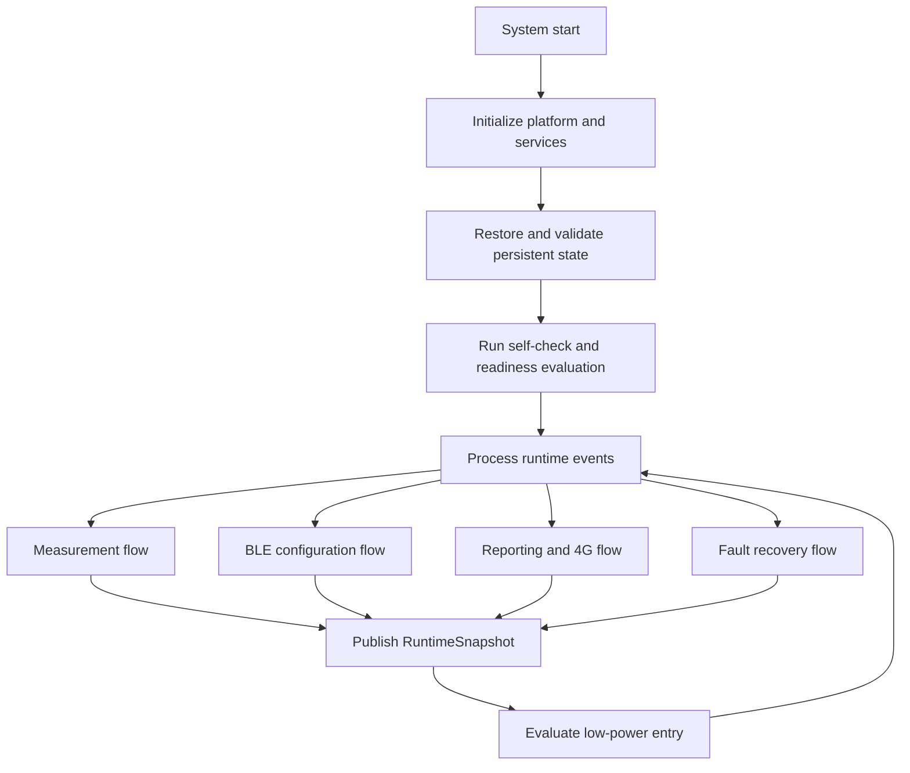
```mermaid
flowchart TD
    START["System start"] --> INIT["Initialize platform and services"]
    INIT --> RESTORE["Restore and validate persistent state"]
    RESTORE --> CHECK["Run self-check and readiness evaluation"]
    CHECK --> RUN["Process runtime events"]

    RUN --> MEASURE["Measurement flow"]
    RUN --> CONFIG["BLE configuration flow"]
    RUN --> REPORT["Reporting and 4G flow"]
    RUN --> RECOVERY["Fault recovery flow"]

    MEASURE --> PUBLISH["Publish RuntimeSnapshot"]
    CONFIG --> PUBLISH
    REPORT --> PUBLISH
    RECOVERY --> PUBLISH

    PUBLISH --> POWER["Evaluate low-power entry"]
    POWER --> RUN
```

Luồng tổng thể không phải một chuỗi blocking. Các nhánh measurement, BLE, reporting và recovery được kích hoạt bởi event độc lập và có thể xen kẽ nhau.

---

## 7. Luồng khởi động

### 7.1. Điểm bắt đầu

Trigger:

```text
Power-on reset
Software reset
Watchdog reset
Wake from a reset-like power state
```

### 7.2. Luồng khởi tạo

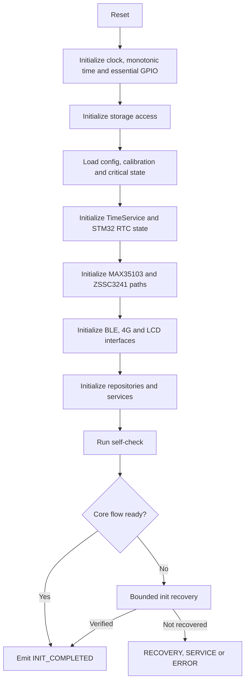
```mermaid
flowchart TD
    RESET["Reset"] --> PLATFORM["Initialize clock, monotonic time and essential GPIO"]
    PLATFORM --> STORAGE["Initialize storage access"]
    STORAGE --> LOAD["Load config, calibration and critical state"]
    LOAD --> TIME["Initialize TimeService and STM32 RTC state"]
    TIME --> SENSOR["Initialize MAX35103 and ZSSC3241 paths"]
    SENSOR --> IO["Initialize BLE, 4G and LCD interfaces"]
    IO --> SERVICES["Initialize repositories and services"]
    SERVICES --> SELF["Run self-check"]
    SELF --> FLOWREADY{"Core flow ready?"}
    FLOWREADY -->|"Yes"| READY["Emit INIT_COMPLETED"]
    FLOWREADY -->|"No"| RECOVER["Bounded init recovery"]
    RECOVER -->|"Verified"| READY
    RECOVER -->|"Not recovered"| ESCALATE["RECOVERY, SERVICE or ERROR"]
```

### 7.3. Nguyên tắc thứ tự

1. Monotonic time phải sẵn sàng trước các timeout và freshness check.
2. Storage phải được khởi tạo trước khi load `ActiveConfig` và calibration profile.
3. `TimeService` phải biết trạng thái RTC trước khi scheduler hoạt động.
4. Sensor driver phải nhận configuration đã validate.
5. `DataRepository` phải được khởi tạo trước khi publish status đầu tiên.
6. BLE, 4G và LCD không được làm chậm việc đưa measurement core về trạng thái sẵn sàng.
7. Production boot chỉ phát `EVT_INIT_COMPLETED` sau khi flow path khởi tạo thành công và tạo được ít nhất một readiness result hợp lệ trong boot session hiện tại.

---

## 8. Luồng khôi phục persistent data

### 8.1. Các record cần load

```text
System configuration
Reporting schedule
Flow/temperature/pressure calibration metadata
Critical volume checkpoint
Compact recovery and diagnostic metadata
```

### 8.2. Luồng load và validate

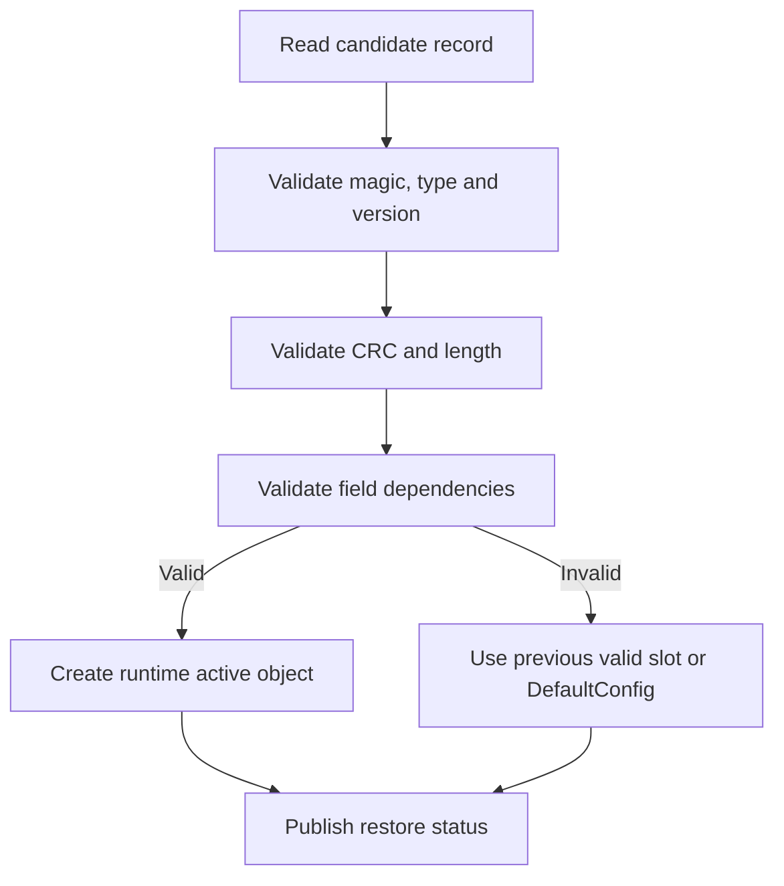
```mermaid
flowchart TD
    READ["Read candidate record"] --> HEADER["Validate magic, type and version"]
    HEADER --> INTEGRITY["Validate CRC and length"]
    INTEGRITY --> DEP["Validate field dependencies"]
    DEP -->|"Valid"| ACTIVE["Create runtime active object"]
    DEP -->|"Invalid"| FALLBACK["Use previous valid slot or DefaultConfig"]
    ACTIVE --> STATUS["Publish restore status"]
    FALLBACK --> STATUS
```

### 8.3. Kết quả khôi phục

| Trường hợp                            | Kết quả                                              |
| ------------------------------------- | ---------------------------------------------------- |
| Record hợp lệ                         | Load và apply theo đúng version                      |
| Active slot lỗi, inactive slot hợp lệ | Khôi phục slot hợp lệ mới nhất theo policy           |
| Cả hai slot lỗi                       | Dùng `DefaultConfig`, đánh dấu degraded              |
| Calibration không tương thích         | Không dùng profile; áp dụng fallback đã định nghĩa   |
| Volume checkpoint lỗi                 | Không tự tạo volume giả; công bố trạng thái recovery |

---

## 9. Luồng self-check và readiness

### 9.1. Self-check tối thiểu

```text
Persistent configuration validity
STM32 RTC and TimeService validity
MAX35103 initialization/status
ZSSC3241 communication/profile status
F-RAM communication
BLE UART initialization
4G UART/module availability
LCD initialization
Power and watchdog status
```

### 9.2. Đánh giá kết quả

```text
All required core checks pass
  -> NORMAL-ready candidate

Optional communication/display check fails
  -> DEGRADED/OFFLINE candidate, measurement continues

Flow measurement core not available
  -> keep SystemMode = INIT
  -> run bounded initialization recovery
  -> success: core-ready candidate
  -> failure: RECOVERY, authorized SERVICE or ERROR according to result

Time invalid
  -> measurement can run, scheduled reporting not ready
```

Self-check không được hiểu là mọi measurement đã có giá trị. Sensor result chỉ trở thành ready sau measurement hợp lệ đầu tiên.

Pressure, BLE, 4G hoặc LCD readiness không thay thế flow readiness trong production boot.

---

## 10. Vòng xử lý event runtime

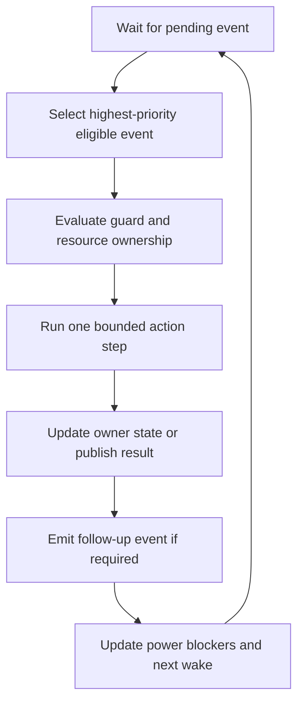
```mermaid
flowchart TD
    WAIT["Wait for pending event"] --> SELECT["Select highest-priority eligible event"]
    SELECT --> GUARD["Evaluate guard and resource ownership"]
    GUARD --> ACTION["Run one bounded action step"]
    ACTION --> UPDATE["Update owner state or publish result"]
    UPDATE --> EMIT["Emit follow-up event if required"]
    EMIT --> POWER["Update power blockers and next wake"]
    POWER --> WAIT
```

### 10.1. Nguyên tắc xử lý

* Một handler chỉ xử lý lượng công việc có giới hạn.
* Không chờ modem, sensor hoặc storage bằng vòng lặp vô hạn.
* Work dài được chia thành nhiều state/event.
* Owner của data object là nơi duy nhất được thay đổi object đó.
* Event mới được đưa vào queue hoặc pending set theo cơ chế firmware đã chọn.
* Event trùng có thể được coalescing nếu semantics cho phép.

### 10.2. Event đến trong lúc service bận

| Trường hợp                               | Hành vi baseline                                    |
| ---------------------------------------- | --------------------------------------------------- |
| Event sensor completion mới              | Ghi nhận counter/pending flag; xử lý theo deadline  |
| LCD refresh khi measurement bận          | Hoãn hoặc bỏ refresh trung gian                     |
| BLE RX khi parser bận                    | Lưu trong bounded RX buffer; phát overflow nếu đầy  |
| 4G RX/TX khi measurement cần xử lý       | Measurement được ưu tiên; modem state giữ nhất quán |
| Storage request mới khi commit đang chạy | Queue/coalesce/reject theo loại record              |

---

## 11. Luồng lập lịch measurement

### 11.1. Các measurement stream

```text
Ultrasonic ToF stream
Temperature stream
Pressure stream
```

Các stream có thể có chu kỳ khác nhau.

### 11.2. Luồng measurement due

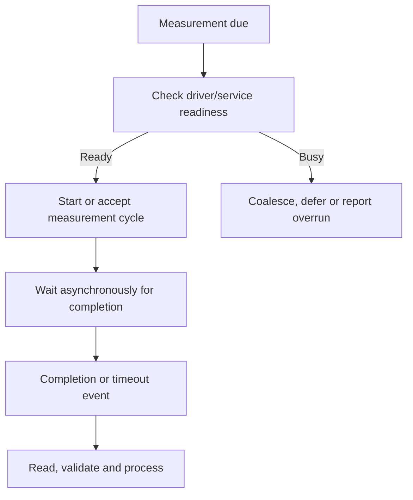
```mermaid
flowchart TD
    DUE["Measurement due"] --> READY["Check driver/service readiness"]
    READY -->|"Ready"| START["Start or accept measurement cycle"]
    READY -->|"Busy"| POLICY["Coalesce, defer or report overrun"]
    START --> WAIT["Wait asynchronously for completion"]
    WAIT --> COMPLETE["Completion or timeout event"]
    COMPLETE --> PROCESS["Read, validate and process"]
```

### 11.3. Ràng buộc

* Measurement schedule độc lập với reporting schedule.
* Chu kỳ measurement không thay đổi chỉ vì 4G offline.
* Service không start cycle mới nếu hardware đang ở trạng thái không tương thích.
* Missed/late measurement phải có diagnostic thay vì âm thầm bỏ qua.
* Timestamp lấy theo time domain đã định nghĩa trong tài liệu 03.

---

## 12. Luồng đo ultrasonic và temperature qua MAX35103

### 12.1. Trigger

```text
Periodic measurement due
MAX35103 event-timing completion
Initialization/diagnostic request
Safe configuration transition
```

### 12.2. Luồng xử lý

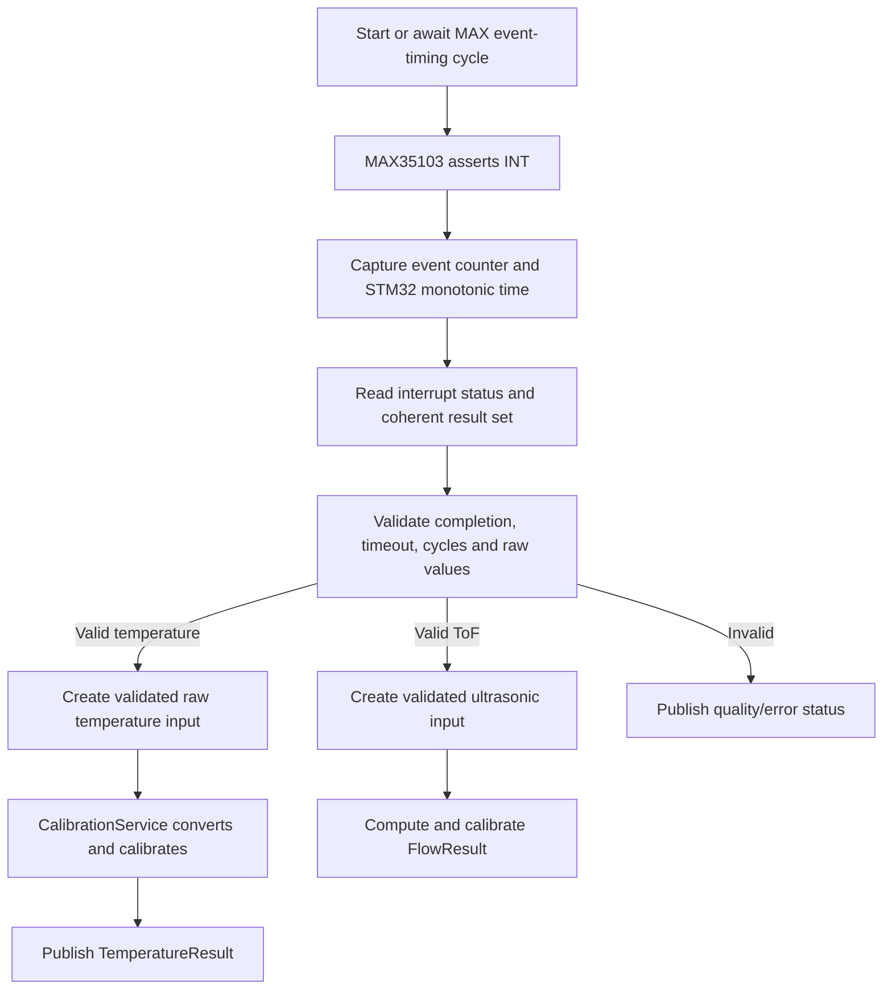
```mermaid
flowchart TD
    START["Start or await MAX event-timing cycle"] --> INT["MAX35103 asserts INT"]
    INT --> CAPTURE["Capture event counter and STM32 monotonic time"]
    CAPTURE --> STATUS["Read interrupt status and coherent result set"]
    STATUS --> VALIDATE["Validate completion, timeout, cycles and raw values"]
    VALIDATE -->|"Valid ToF"| FLOW["Create validated ultrasonic input"]
    VALIDATE -->|"Valid temperature"| TEMP["Create validated raw temperature input"]
    TEMP --> TCAL["CalibrationService converts and calibrates"]
    TCAL --> TRESULT["Publish TemperatureResult"]
    VALIDATE -->|"Invalid"| ERROR["Publish quality/error status"]
    FLOW --> COMPUTE["Compute and calibrate FlowResult"]
```

### 12.3. INT handler

INT/EXTI handler chỉ thực hiện:

```text
Capture interrupt occurrence
Capture minimal timestamp/counter
Set or enqueue EVT_MAX_RESULT_READY
Return
```

INT handler không được:

```text
Read all MAX registers
Compute flow
Update volume
Run leak detection
Write F-RAM
Send telemetry
```

### 12.4. Kết quả ToF không hợp lệ

```text
Invalid ToF
  -> no new valid FlowResult
  -> no volume integration
  -> no positive or clear leak evidence from that sample
  -> update quality and diagnostics
  -> keep SystemMode = NORMAL and mark measurement DEGRADED during bounded local recovery
  -> request system RECOVERY only after local recovery budget is exhausted
```

### 12.5. Kết quả temperature không hợp lệ

```text
Invalid temperature
  -> do not publish fake 0 °C
  -> classify compensation as unavailable
  -> publish FlowResult as INVALID or DEGRADED_NOT_ACCEPTED
  -> do not update volume
  -> do not create flow-based leak evidence
  -> do not mark the sample as valid production telemetry
  -> start bounded temperature/measurement recovery
```

Ownership boundary theo `DEC-ARCH-002`:

```text
MeasurementManager
  -> acquire MAX temperature timing/status
  -> validate raw port/reference/device status
  -> submit validated RawTemperatureMeasurement

CalibrationService
  -> convert timing ratio/resistance to temperature
  -> apply sensor curve, calibration and filtering
  -> assign quality, freshness and version metadata
  -> publish immutable TemperatureResult
```

`MeasurementManager` không publish final `TemperatureResult`; flow compensation, repository, LCD và telemetry chỉ đọc result do `CalibrationService` publish.

Theo `DEC-ARCH-003`, held-temperature và uncompensated modes chỉ là diagnostic/future-policy states trong baseline. Chúng không được chuyển thành accepted production `FlowResult` nếu chưa có validation và versioned fallback policy.

---

## 13. Luồng xử lý flow

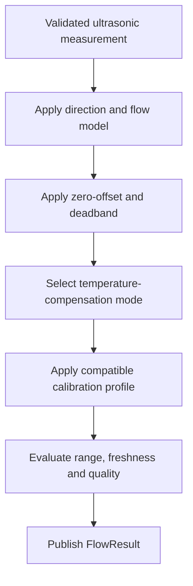
```mermaid
flowchart TD
    INPUT["Validated ultrasonic measurement"] --> MODEL["Apply direction and flow model"]
    MODEL --> ZERO["Apply zero-offset and deadband"]
    ZERO --> TEMP["Select temperature-compensation mode"]
    TEMP --> CAL["Apply compatible calibration profile"]
    CAL --> QUALITY["Evaluate range, freshness and quality"]
    QUALITY --> RESULT["Publish FlowResult"]
```

### 13.1. Guard đầu vào

```text
Ultrasonic result valid
Measurement/config version compatible
No duplicate or out-of-order sequence
Numeric/model inputs valid
Required calibration and usable TemperatureResult available
```

### 13.2. Kết quả

`FlowResult` phải chứa hoặc dẫn chiếu được:

```text
Signed flow rate
Flow direction
Validity and quality flags
Sample monotonic time
Wall-clock timestamp and validity
Measurement/model/calibration version
Temperature-compensation mode
Sample sequence
```

### 13.3. Phát event tiếp theo

Sau khi publish `FlowResult` hợp lệ:

```text
EVT_FLOW_RESULT_READY
  -> VolumeAccumulator
  -> LeakDetectionService
  -> DataRepository publication request
```

`INVALID` hoặc `DEGRADED_NOT_ACCEPTED` result vẫn được publish tới repository/diagnostics để phản ánh quality, nhưng không phát production-ready event tới `VolumeAccumulator` hoặc flow-based leak-evidence path.

---

## 14. Luồng đo pressure qua ZSSC3241

### 14.1. Trigger

```text
EVT_PRESSURE_SAMPLE_DUE
Initialization readiness check
Authorized diagnostic request
```

### 14.2. Luồng xử lý

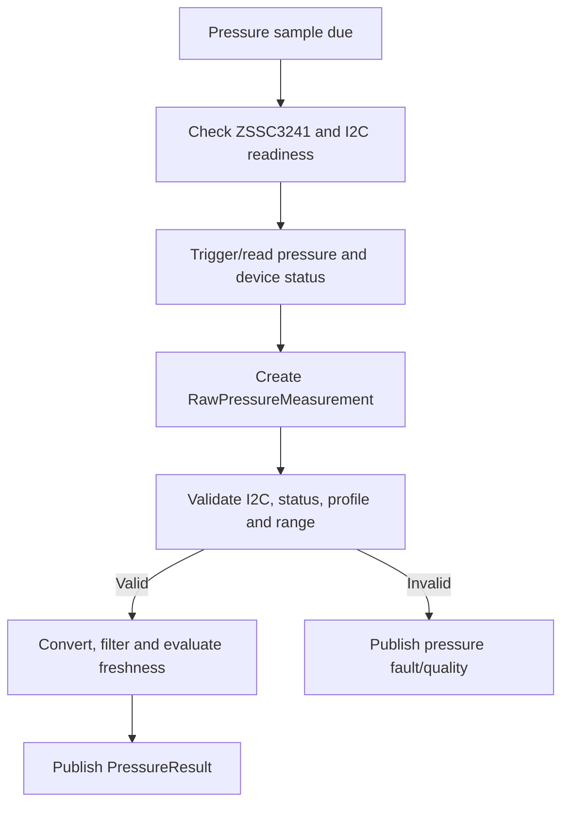
```mermaid
flowchart TD
    DUE["Pressure sample due"] --> READY["Check ZSSC3241 and I2C readiness"]
    READY --> ACQUIRE["Trigger/read pressure and device status"]
    ACQUIRE --> RAW["Create RawPressureMeasurement"]
    RAW --> VALIDATE["Validate I2C, status, profile and range"]
    VALIDATE -->|"Valid"| PROCESS["Convert, filter and evaluate freshness"]
    VALIDATE -->|"Invalid"| ERROR["Publish pressure fault/quality"]
    PROCESS --> RESULT["Publish PressureResult"]
```

### 14.3. Phân chia trách nhiệm

```text
Pressure bridge
  -> tạo tín hiệu cầu điện trở

ZSSC3241
  -> conditioning, digitization và sensor-specific correction

PressureMeasurementService
  -> điều phối acquisition, timestamp và sequence

PressureProcessingService
  -> validation cấp hệ thống, canonical Pa, filter, trend và freshness
```

### 14.4. Tránh bù hai lần

Trước khi apply MCU-side calibration:

1. Xác nhận `ZSSC3241 profile/version`.
2. Xác định correction nào đã được thực hiện trong ZSSC3241.
3. Chỉ apply correction còn lại thuộc system profile.
4. Gắn version/quality metadata phù hợp.

### 14.5. Pressure lỗi hoặc stale

```text
Pressure invalid/stale
  -> PressureResult unavailable/degraded
  -> pressure diagnostics/evidence paused or unavailable
  -> flow-only leak rules continue
  -> existing leak state is not cleared by invalid pressure
```

---

## 15. Luồng tích lũy volume

### 15.1. Guard

Volume chỉ được cập nhật khi:

```text
FlowResult.valid == true
FlowResult is accepted and not duplicate
Flow age is within integration policy
Delta monotonic time is valid and bounded
No incompatible config/calibration boundary is crossed
```

### 15.2. Luồng update

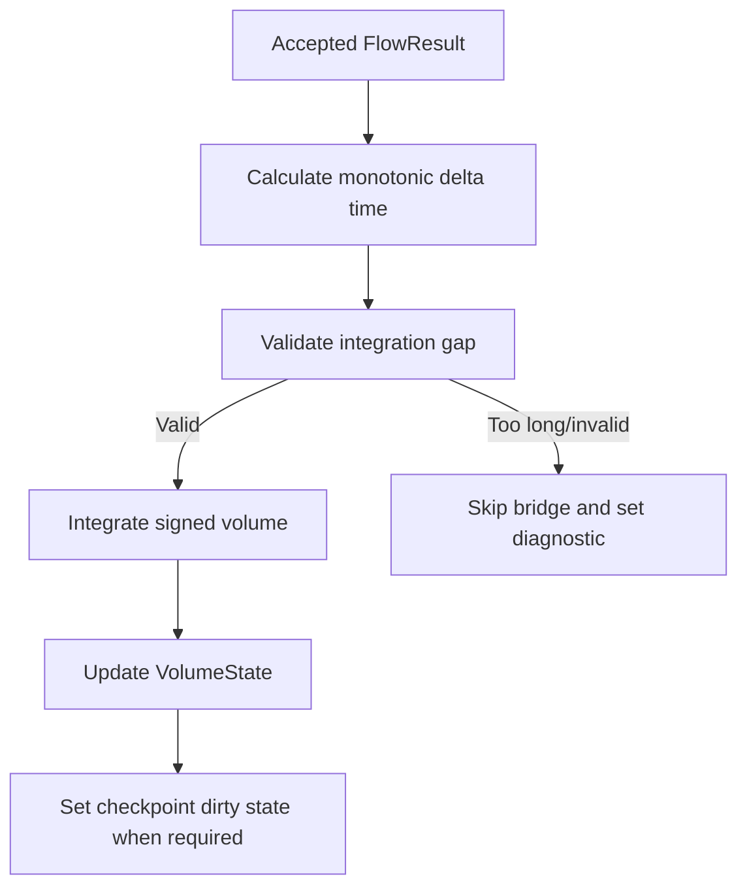
```mermaid
flowchart TD
    FLOW["Accepted FlowResult"] --> DT["Calculate monotonic delta time"]
    DT --> GAP["Validate integration gap"]
    GAP -->|"Valid"| INTEGRATE["Integrate signed volume"]
    GAP -->|"Too long/invalid"| SKIP["Skip bridge and set diagnostic"]
    INTEGRATE --> STATE["Update VolumeState"]
    STATE --> DIRTY["Set checkpoint dirty state when required"]
```

### 15.3. Quy tắc

* Không tích phân từ invalid/stale flow.
* Không dùng wall-clock làm `delta time`.
* Không bridge qua khoảng mất dữ liệu dài.
* Reset filter không đồng nghĩa reset volume.
* Calibration thay đổi không được sửa ngược volume đã tích lũy nếu chưa có migration policy.

---

## 16. Luồng leak detection

### 16.1. Trigger đánh giá

```text
New FlowResult
New PressureResult
Periodic monotonic evaluation tick
Measurement-quality change
Leak configuration applied
```

### 16.2. Luồng đánh giá

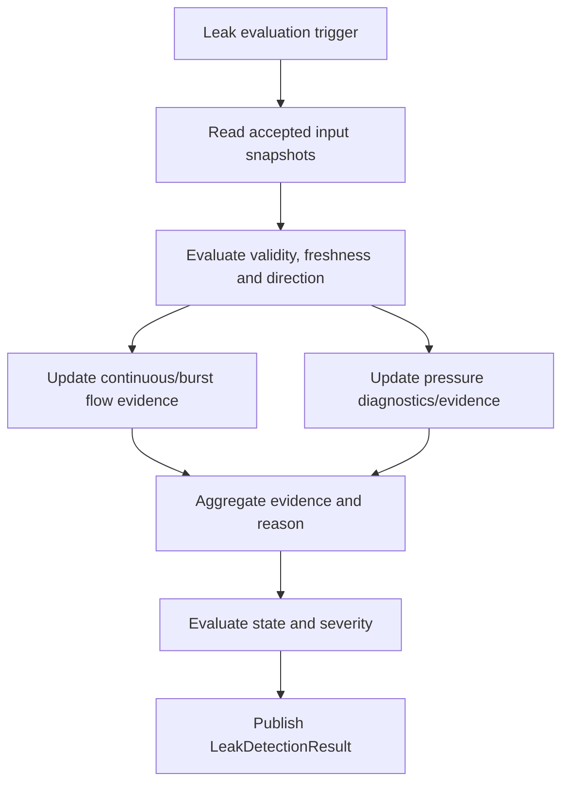
```mermaid
flowchart TD
    EVENT["Leak evaluation trigger"] --> INPUT["Read accepted input snapshots"]
    INPUT --> USABLE["Evaluate validity, freshness and direction"]
    USABLE --> FLOW["Update continuous/burst flow evidence"]
    USABLE --> PRESS["Update pressure diagnostics/evidence"]
    FLOW --> AGG["Aggregate evidence and reason"]
    PRESS --> AGG
    AGG --> STATE["Evaluate state and severity"]
    STATE --> RESULT["Publish LeakDetectionResult"]
```

### 16.3. Quy tắc evidence

```text
Continuous forward flow -> primary evidence
High forward flow       -> primary burst evidence
Pressure anomaly        -> diagnostic/supporting evidence
Temperature             -> flow-quality context
Invalid/stale sample    -> neither positive nor clear evidence
```

### 16.4. State-change event

Chỉ phát event quan trọng khi state/reason cần thông báo thay đổi:

```text
EVT_LEAK_RESULT_CHANGED
```

Event này cập nhật snapshot. Việc gửi ngay qua 4G hay chờ scheduled report vẫn là quyết định `TBD`.

---

## 17. Luồng publish RuntimeSnapshot

### 17.1. Trigger

```text
New measurement result
VolumeState update
LeakDetectionResult update
Connectivity/reporting status update
Power/error/config status update
```

### 17.2. Luồng publication

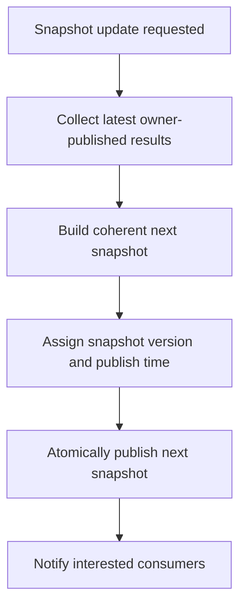
```mermaid
flowchart TD
    REQUEST["Snapshot update requested"] --> COLLECT["Collect latest owner-published results"]
    COLLECT --> BUILD["Build coherent next snapshot"]
    BUILD --> VERSION["Assign snapshot version and publish time"]
    VERSION --> SWAP["Atomically publish next snapshot"]
    SWAP --> NOTIFY["Notify interested consumers"]
```

### 17.3. Consumer

```text
LcdService
Telemetry builder
Storage/checkpoint policy
Diagnostics/service read
```

### 17.4. Ràng buộc

* Snapshot không thay thế sample timestamp.
* Consumer không đọc object đang được update dở.
* Telemetry schema không phụ thuộc trực tiếp vào memory layout của snapshot.
* Snapshot có thể chứa measurement với độ mới khác nhau; quality/freshness riêng phải được giữ.

---

## 18. Luồng cập nhật LCD

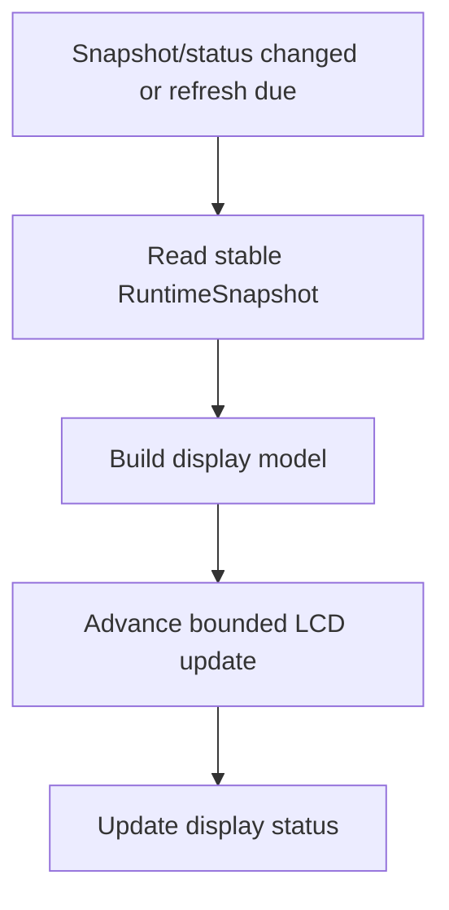
```mermaid
flowchart TD
    TRIGGER["Snapshot/status changed or refresh due"] --> READ["Read stable RuntimeSnapshot"]
    READ --> FORMAT["Build display model"]
    FORMAT --> WRITE["Advance bounded LCD update"]
    WRITE --> DONE["Update display status"]
```

Quy tắc:

* `invalid`, `stale`, `unavailable` và `zero` phải hiển thị khác nhau.
* LCD không tính flow, pressure hoặc leak state.
* Có thể bỏ qua/coalesce refresh trung gian khi runtime bận.
* LCD lỗi không chặn measurement, storage hoặc 4G.

---

## 19. Luồng checkpoint persistent state

### 19.1. Trigger checkpoint

Candidate trigger:

```text
Configuration commit
Calibration/profile update
Volume dirty threshold
Periodic critical-state checkpoint
Controlled shutdown/power warning
Explicit authorized service request
```

### 19.2. Luồng commit A/B

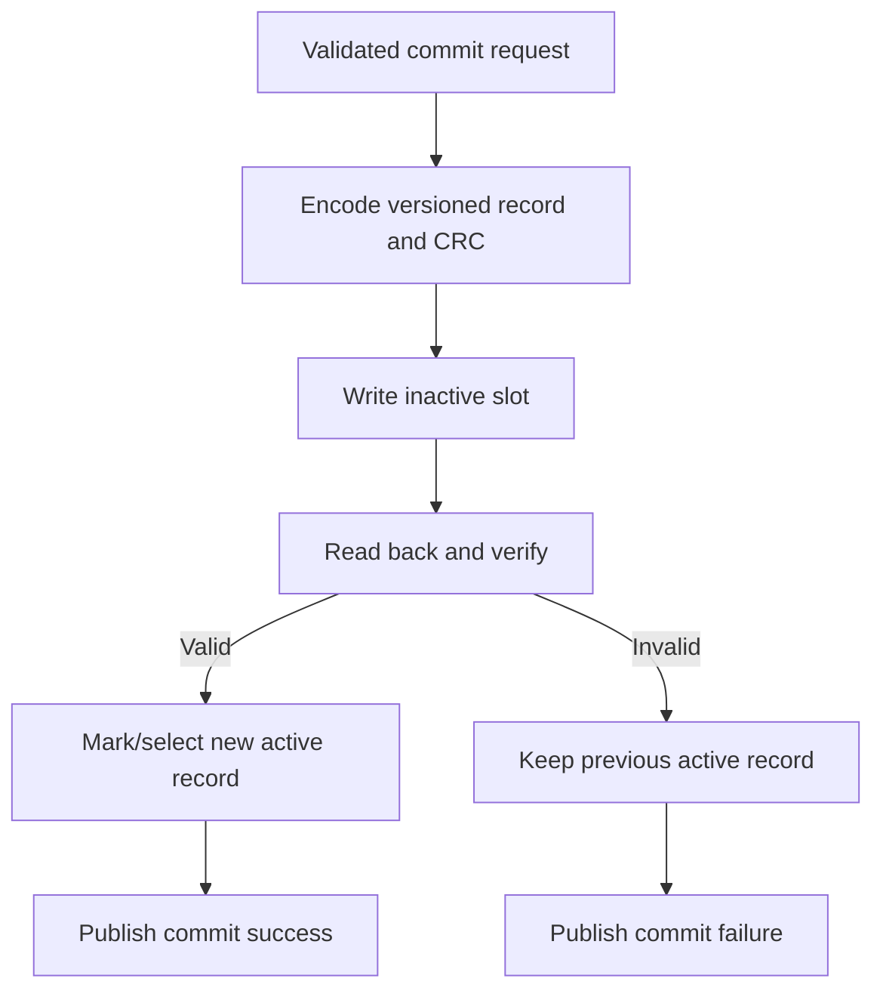
```mermaid
flowchart TD
    REQUEST["Validated commit request"] --> ENCODE["Encode versioned record and CRC"]
    ENCODE --> WRITE["Write inactive slot"]
    WRITE --> VERIFY["Read back and verify"]
    VERIFY -->|"Valid"| SWITCH["Mark/select new active record"]
    VERIFY -->|"Invalid"| FAIL["Keep previous active record"]
    SWITCH --> RESULT["Publish commit success"]
    FAIL --> RESULT2["Publish commit failure"]
```

### 19.3. Quy tắc

* Chỉ `StorageService` commit record.
* Callback/ISR không ghi trực tiếp F-RAM.
* Commit lỗi không làm mất slot hợp lệ cũ.
* Storage work được chia nhỏ nếu cần để không làm lỡ measurement.
* Telemetry history dài hạn không mặc định dùng FM24CL04B.

### 19.4. Logical I2C transaction boundary

Theo `DEC-ARCH-005`:

```text
PressureMeasurementService / zssc3241_driver
StorageService / fram_driver
  -> submit bounded I2cTransaction
  -> I2cBusManager owner context
  -> STM32 HAL I2C
  -> completion/error with bus recovery generation
```

* Mỗi physical I2C instance có đúng một `I2cBusManager` owner context.
* Service/driver không gọi HAL I2C trực tiếp và không tự reset shared bus.
* `I2cBusManager` serialize transaction, áp deadline/timeout và thực hiện bounded recovery.
* ZSSC3241 và F-RAM có thể map cùng hoặc khác physical instance; mapping thuộc hardware binding, không đổi logical service flow.

---

## 20. Luồng đồng bộ thời gian

### 20.1. Nguồn thời gian

```text
4G/network/server time -> ưu tiên cao nhất
Authorized BLE time    -> fallback/service source
Restored STM32 RTC     -> retained local source with validity metadata
MAX35103 RTC            -> measurement/event clock, không phải system wall-clock baseline
```

### 20.2. Luồng đồng bộ

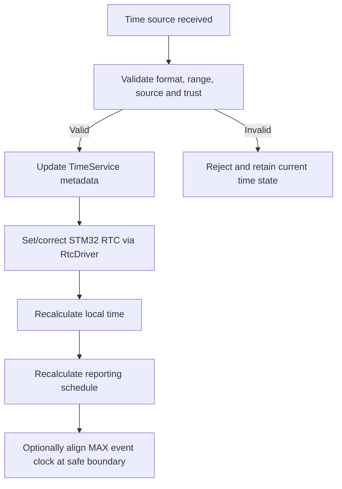
```mermaid
flowchart TD
    SOURCE["Time source received"] --> VALIDATE["Validate format, range, source and trust"]
    VALIDATE -->|"Valid"| UPDATE["Update TimeService metadata"]
    UPDATE --> RTC["Set/correct STM32 RTC via RtcDriver"]
    RTC --> LOCAL["Recalculate local time"]
    LOCAL --> SCHED["Recalculate reporting schedule"]
    SCHED --> OPTIONAL["Optionally align MAX event clock at safe boundary"]
    VALIDATE -->|"Invalid"| REJECT["Reject and retain current time state"]
```

### 20.3. Quy tắc

* Không thay đổi monotonic timer khi chỉnh RTC.
* Không sửa duration leak hoặc volume integration.
* MAX35103 RTC không tự overwrite STM32 RTC.
* Nếu đồng bộ MAX event clock, chỉ thực hiện một chiều và tại safe measurement boundary.
* Scheduler tính lại `next_report_time` sau khi system time thay đổi hợp lệ.

---

## 21. Luồng đánh giá reporting window

### 21.1. Điều kiện đầu vào

```text
System time valid
Local-time conversion valid
Exactly two valid reporting windows
Distinct start times
Valid interval for each window
```

### 21.2. Luồng lựa chọn window

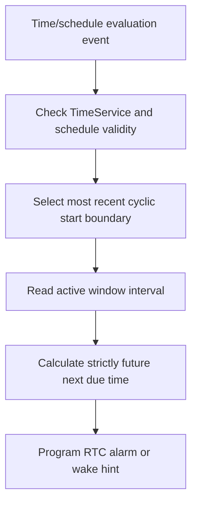
```mermaid
flowchart TD
    EVENT["Time/schedule evaluation event"] --> VALID["Check TimeService and schedule validity"]
    VALID --> SELECT["Select most recent cyclic start boundary"]
    SELECT --> INTERVAL["Read active window interval"]
    INTERVAL --> NEXT["Calculate strictly future next due time"]
    NEXT --> ALARM["Program RTC alarm or wake hint"]
```

### 21.3. Khi time invalid

```text
Time invalid
  -> reporting schedule NOT_READY
  -> do not evaluate local window
  -> do not create fake timestamp
  -> continue measurement and monotonic algorithms
```

### 21.4. Khi đổi schedule

* Không phát report ngay mặc định.
* Không hủy transaction 4G đang chạy.
* Tính lại active window và future due time.
* Không tạo toàn bộ các report đã bỏ lỡ.

---

## 22. Luồng REPORT_DUE và tạo telemetry

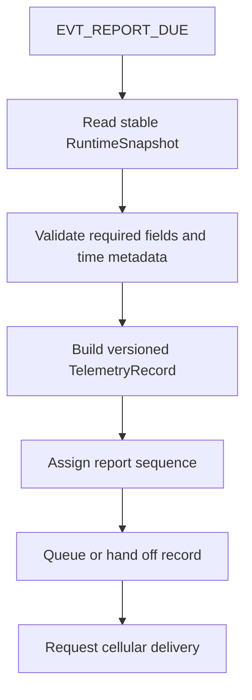
```mermaid
flowchart TD
    DUE["EVT_REPORT_DUE"] --> SNAP["Read stable RuntimeSnapshot"]
    SNAP --> VALIDATE["Validate required fields and time metadata"]
    VALIDATE --> BUILD["Build versioned TelemetryRecord"]
    BUILD --> SEQ["Assign report sequence"]
    SEQ --> QUEUE["Queue or hand off record"]
    QUEUE --> TX["Request cellular delivery"]
```

### 22.1. TelemetryRecord

Record dự kiến chứa:

```text
Device identity
Schema version
Report sequence
Generation/due timestamp and validity
Flow and volume
Temperature and pressure
Leak result
Measurement quality
Power, connectivity and system status
```

### 22.2. Phân biệt trạng thái

```text
REPORT_DUE
GENERATED
QUEUED
SENDING
DELIVERED or ACKNOWLEDGED
FAILED or RETRY_PENDING
```

Các trạng thái không được gộp thành một boolean `sent` nếu server protocol chưa chốt acknowledgement semantics.

---

## 23. Luồng gửi telemetry qua 4G

### 23.1. Luồng tổng quát

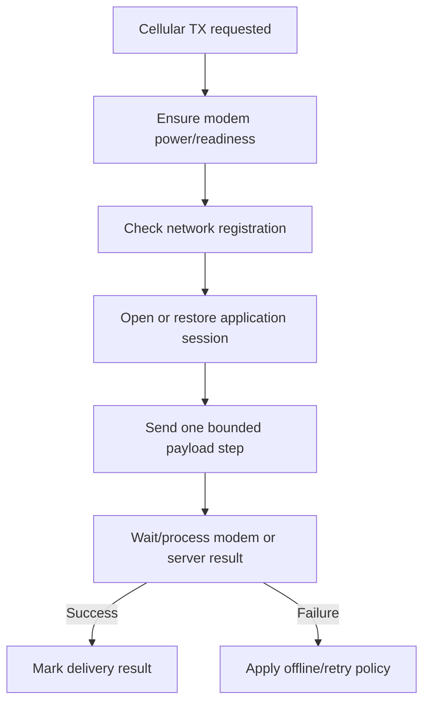
```mermaid
flowchart TD
    REQUEST["Cellular TX requested"] --> POWER["Ensure modem power/readiness"]
    POWER --> REGISTER["Check network registration"]
    REGISTER --> SESSION["Open or restore application session"]
    SESSION --> SEND["Send one bounded payload step"]
    SEND --> RESULT["Wait/process modem or server result"]
    RESULT -->|"Success"| COMPLETE["Mark delivery result"]
    RESULT -->|"Failure"| OFFLINE["Apply offline/retry policy"]
```

### 23.2. Nguyên tắc non-blocking

* Mỗi action chỉ tiến một bước trong modem state machine.
* Không chờ registration/socket/server bằng vòng lặp blocking.
* UART 4G có buffer/parser riêng với BLE.
* Sensor event có độ ưu tiên cao hơn modem work không khẩn cấp.
* Modem timeout dùng monotonic time.

### 23.3. Kết quả delivery

Việc coi delivery thành công phụ thuộc server protocol:

```text
UART TX completed
Modem accepted data
Network/session acknowledged
Server/application acknowledged
```

Tầng xác nhận cuối cùng vẫn là `TBD` và phải được chốt trong `04_communication` cùng tài liệu 13.

---

## 24. Luồng 4G offline

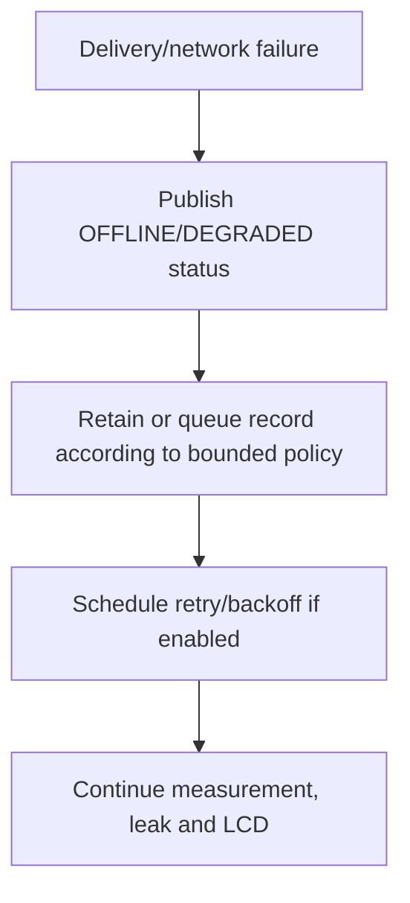
```mermaid
flowchart TD
    FAIL["Delivery/network failure"] --> STATUS["Publish OFFLINE/DEGRADED status"]
    STATUS --> RETAIN["Retain or queue record according to bounded policy"]
    RETAIN --> RETRY["Schedule retry/backoff if enabled"]
    RETRY --> CONTINUE["Continue measurement, leak and LCD"]
```

Những nội dung chưa được chốt:

```text
Maximum queued records
Storage backing
Retry count
Backoff function
Server acknowledgement
Full-queue replacement policy
Maximum offline retention time
```

Không được giả định queue vô hạn hoặc tự xóa record theo một chính sách chưa được phê duyệt.

---

## 25. Luồng cấu hình qua BLE

### 25.1. Luồng nhận request

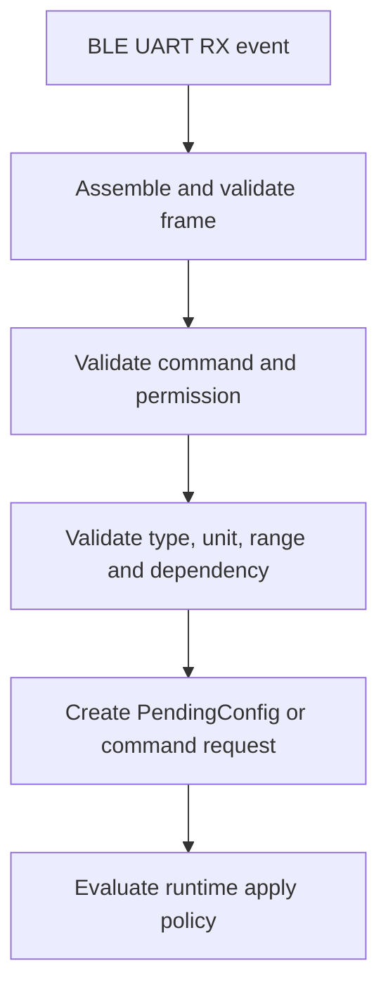
```mermaid
flowchart TD
    RX["BLE UART RX event"] --> FRAME["Assemble and validate frame"]
    FRAME --> AUTH["Validate command and permission"]
    AUTH --> VALUE["Validate type, unit, range and dependency"]
    VALUE --> PENDING["Create PendingConfig or command request"]
    PENDING --> POLICY["Evaluate runtime apply policy"]
```

### 25.2. Các tầng validation

```text
Transport framing
Protocol and command version
Authentication/authorization
Field type and unit
Value range
Cross-field dependency
Hardware capability
Runtime safety
Persistent schema compatibility
```

### 25.3. Request không hợp lệ

```text
Invalid request
  -> reject with reason/status
  -> do not change PendingConfig/ActiveConfig unexpectedly
  -> do not write F-RAM
  -> do not restart measurement
```

---

## 26. Luồng commit và apply configuration

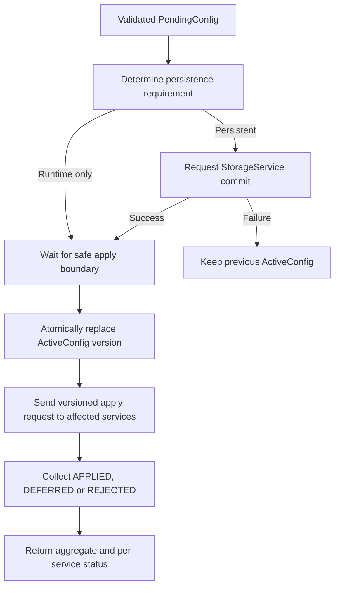
```mermaid
flowchart TD
    PENDING["Validated PendingConfig"] --> NEED["Determine persistence requirement"]
    NEED -->|"Persistent"| COMMIT["Request StorageService commit"]
    NEED -->|"Runtime only"| BOUNDARY["Wait for safe apply boundary"]
    COMMIT -->|"Success"| BOUNDARY
    COMMIT -->|"Failure"| REJECT["Keep previous ActiveConfig"]
    BOUNDARY --> ACTIVE["Atomically replace ActiveConfig version"]
    ACTIVE --> NOTIFY["Send versioned apply request to affected services"]
    NOTIFY --> COLLECT["Collect APPLIED, DEFERRED or REJECTED"]
    COLLECT --> RESPONSE["Return aggregate and per-service status"]
```

### 26.1. Thứ tự bắt buộc

Đối với config cần persistence:

```text
Validate
  -> commit
  -> verify
  -> apply
  -> notify
```

Không apply trước rồi mới phát hiện commit thất bại.

### 26.2. Apply acknowledgement

Theo `DEC-ARCH-007`, request tới mỗi affected service phải gồm:

```text
transaction_id
config_version
changed_field_mask
apply_policy
```

Service apply tại safe boundary và trả matching `transaction_id`/`config_version` cùng:

* `APPLIED`: matching version đã active trong service.
* `DEFERRED`: đã nhận nhưng chờ safe boundary; phải có reason và bounded completion policy.
* `REJECTED`: không thể apply; phải có reason và không được báo fully applied.

Persistent commit/`ActiveConfig` replacement thành công không đồng nghĩa mọi affected service đã `APPLIED`. BLE response phải phản ánh aggregate status và per-service failure/deferred state.

### 26.3. Ảnh hưởng theo loại config

| Loại config               | Action sau apply                                               |
| ------------------------- | -------------------------------------------------------------- |
| Reporting schedule        | Tính lại active window và `next_report_time`                   |
| Timezone                  | Tính lại local-time/window, không đổi monotonic timer          |
| Time sync                 | Update RTC/time validity và scheduler                          |
| MAX measurement profile   | Apply tại safe cycle boundary, reset history không tương thích |
| Temperature profile       | Reset filter/pairing cần thiết                                 |
| ZSSC3241/pressure profile | Verify compatibility, reset filter/trend                       |
| Leak parameters           | Xử lý evidence tracker/state theo leak policy                  |
| 4G settings               | Reconfigure connectivity state machine                         |
| LCD preference            | Rebuild display model                                          |

---

## 27. Luồng vào low-power

### 27.1. Đánh giá blocker

```mermaid
flowchart TD
    EVAL["Evaluate low-power request"] --> BLOCK["Collect blockers from active services"]
    BLOCK -->|"Any critical blocker"| IDLE["Remain active/idle and process work"]
    BLOCK -->|"No blocker"| WAKE["Calculate next wake source/time"]
    WAKE --> PREP["Prepare peripherals and power domains"]
    PREP --> SLEEP["Enter selected low-power state"]
```

### 27.2. Blocker điển hình

```text
MAX measurement in progress
Unread MAX/ZSSC result
I2C/SPI transaction in progress
Storage commit in progress
BLE response pending
4G transaction at unsafe interruption point
Telemetry record generation/queue update in progress
Unknown next wake source
```

### 27.3. Nguyên tắc

* `Idle` không đồng nghĩa hardware đã vào sleep.
* Power state cụ thể phụ thuộc hardware/power document.
* Không vào sleep nếu có thể làm mất sensor completion event.
* Last value không tự trở thành fresh sau khi wake.

---

## 28. Luồng wake-up

```mermaid
flowchart TD
    WAKE["Wake event"] --> RESTORE["Restore required clock and power domains"]
    RESTORE --> REASON["Determine wake reason"]
    REASON --> PENDING["Capture all pending hardware events"]
    PENDING --> PRIORITY["Select highest-priority event"]
    PRIORITY --> PROCESS["Resume event loop"]
    PROCESS --> REARM["Recalculate next wake hints"]
```

Candidate wake reason:

```text
STM32 RTC alarm
MAX35103 INT
UART RX/module event
Pressure sample timer
Power/reset condition
Authorized service/debug input
```

Nếu nhiều wake reason cùng tồn tại, firmware phải giữ đầy đủ pending state thay vì chỉ xử lý reason đầu tiên rồi xóa các reason còn lại.

---

## 29. Luồng phát hiện và phục hồi lỗi

### 29.1. Luồng chung

```mermaid
flowchart TD
    DETECT["Fault detected"] --> CLASS["Classify domain, severity and affected data"]
    CLASS --> ISOLATE["Isolate affected resource or result"]
    ISOLATE --> PUBLISH["Publish quality/error status"]
    PUBLISH --> RECOVER["Run bounded recovery step"]
    RECOVER --> CHECK["Re-evaluate readiness"]
    CHECK -->|"Recovered"| RESUME["Resume affected flow"]
    CHECK -->|"Not recovered"| DEGRADED["Remain degraded/offline/error"]
```

### 29.2. Recovery cục bộ

| Fault          | Recovery direction                                               |
| -------------- | ---------------------------------------------------------------- |
| MAX timeout    | Reject sample, clear/read status, restart safe cycle theo policy |
| RTD open/short | Disable fresh compensation, dùng explicit fallback               |
| ZSSC/I2C fault | Bus/device recovery có giới hạn; pressure unavailable            |
| F-RAM fault    | Giữ runtime state; không partial commit; báo storage fault       |
| BLE fault      | Reset/recover BLE context; active config không đổi               |
| 4G fault       | Chuyển offline/retry state; measurement tiếp tục                 |
| LCD fault      | Dừng/coalesce display update; core tiếp tục                      |
| RTC invalid    | Scheduled reporting not-ready; thử sync từ nguồn hợp lệ          |

### 29.3. Không reset dây chuyền mặc định

Peripheral fault không tự động reset toàn hệ thống nếu:

* Core measurement còn an toàn.
* Data ownership không bị hỏng.
* Có thể cô lập và phục hồi cục bộ.

Reset toàn hệ thống chỉ dùng khi platform/shared resource ở trạng thái không thể phục hồi an toàn.

---

## 30. Luồng khi nhiều event xảy ra đồng thời

### 30.1. Priority baseline

| Mức ưu tiên | Nhóm event                           | Ví dụ                                |
| ----------: | ------------------------------------ | ------------------------------------ |
|           1 | An toàn nguồn và data integrity      | Power critical, storage integrity    |
|           2 | Measurement completion/deadline      | MAX result, pressure result, timeout |
|           3 | Monotonic timer và evidence deadline | Measurement due, leak timer          |
|           4 | Bước atomic của storage/config       | Verify/switch active record          |
|           5 | BLE configuration                    | RX, parse, response                  |
|           6 | 4G telemetry                         | Modem/network delivery progression   |
|           7 | LCD và diagnostic không khẩn cấp     | Refresh, presentation                |

### 30.2. Ví dụ

Khi MAX35103 INT xảy ra trong lúc 4G đang chờ response:

```text
MAX INT captured
  -> EVT_MAX_RESULT_READY pending
  -> process measurement within deadline
  -> keep 4G state and timeout context
  -> resume 4G state-machine step
```

Khi BLE request đến trong lúc storage commit:

```text
Capture BLE RX into bounded buffer
  -> parse when eligible
  -> if request needs commit, wait/queue according to StorageService policy
  -> do not modify current in-flight record
```

---

## 31. Bảng mapping event và action chính

| Event                        | Guard chính                              | Action chính                                      | Result/event tiếp theo                |
| ---------------------------- | ---------------------------------------- | ------------------------------------------------- | ------------------------------------- |
| `EVT_SYSTEM_START`           | Platform initialized enough              | Load state, initialize services                   | Self-check event                      |
| `EVT_MAX_RESULT_READY`       | MAX result unread and coherent           | Read/validate ToF/temp                            | Flow/temp processing event            |
| `EVT_PRESSURE_SAMPLE_DUE`    | ZSSC/I2C ready                           | Start/read pressure sample                        | Pressure result event                 |
| `EVT_FLOW_RESULT_READY`      | Result accepted                          | Update volume, leak input, repository             | Snapshot update                       |
| `EVT_PRESSURE_RESULT_READY`  | Result accepted                          | Update pressure evidence/repository               | Snapshot update                       |
| `EVT_LEAK_RESULT_CHANGED`    | Meaningful state/reason change           | Publish leak result                               | Snapshot update/optional event report |
| `EVT_RTC_ALARM`              | Time service initialized                 | Evaluate schedule/wake reason                     | `EVT_REPORT_DUE` or next alarm        |
| `EVT_TIME_VALIDITY_CHANGED`  | New time state accepted                  | Recalculate reporting schedule                    | Reporting status update               |
| `EVT_REPORT_DUE`             | Time/schedule valid                      | Build telemetry record                            | Cellular TX request                   |
| `EVT_BLE_CONFIG_RECEIVED`    | Complete authorized frame                | Validate and create pending config                | Commit/apply/reject                   |
| `EVT_CONFIG_COMMIT_REQUIRED` | Storage available                        | Commit versioned record                           | Commit completed                      |
| `EVT_CONFIG_APPLY_STATUS`    | Matching transaction/config version      | Record `APPLIED`/`DEFERRED`/`REJECTED` and reason | Aggregate response/status update      |
| `EVT_CONFIG_APPLIED`         | All required affected services `APPLIED` | Publish fully-applied version                     | Snapshot/status update                |
| `EVT_CELLULAR_TX_REQUESTED`  | Record and modem context valid           | Advance modem delivery                            | Complete/failure/retry event          |
| `EVT_STORAGE_COMPLETED`      | Matching in-flight request               | Finalize record/config state                      | Apply/response event                  |
| `EVT_ERROR_DETECTED`         | Fault metadata available                 | Classify/isolate/recover                          | Status/recovery event                 |

Tên event cuối cùng phải thống nhất với `glossary.md` và firmware event definition.

---

## 32. Chu trình vận hành bình thường tham chiếu

```text
1. Thiết bị thức dậy do measurement/time event.
2. Platform khôi phục clock/power domain cần thiết.
3. Event có ưu tiên cao nhất được chọn.
4. MAX35103 hoặc ZSSC3241 measurement được xử lý nếu đến hạn.
5. FlowResult, TemperatureResult hoặc PressureResult được publish.
6. VolumeState được update từ valid FlowResult.
7. Leak evidence/state được đánh giá.
8. RuntimeSnapshot mới được publish.
9. LCD được refresh khi cần và có đủ thời gian.
10. Critical state được checkpoint khi policy yêu cầu.
11. ReportingScheduler phát REPORT_DUE nếu đến hạn.
12. TelemetryRecord được tạo và 4G state machine được tiến một bước.
13. BLE/config/recovery work đang pending được xử lý theo priority.
14. PowerManager tính next wake và kiểm tra blocker.
15. Hệ thống quay lại idle hoặc low-power khi an toàn.
```

Đây là thứ tự dependency tham chiếu. Event-driven implementation có thể xen kẽ các bước mà vẫn phải giữ data ownership và guard.

---

## 33. Các kịch bản đặc biệt

### 33.1. Boot với time invalid và 4G sẵn sàng

```text
Boot
  -> STM32 RTC marked invalid
  -> measurement starts using monotonic time
  -> scheduled reporting remains NOT_READY
  -> 4G obtains validated network/server time
  -> TimeService updates STM32 RTC
  -> ReportingScheduler calculates next future due
```

### 33.2. Boot với 4G offline nhưng STM32 RTC còn hợp lệ

```text
Restore RTC validity/source age
  -> evaluate reporting windows
  -> measurement and report generation may continue
  -> delivery remains offline
  -> retention behavior follows deferred offline policy
```

### 33.3. MAX35103 event clock hoạt động nhưng STM32 RTC invalid

```text
MAX measurement/event timing continues
  -> STM32 captures monotonic sample time
  -> FlowResult can remain valid
  -> wall-clock timestamp marked invalid
  -> scheduled reporting remains NOT_READY
```

### 33.4. Pressure subsystem lỗi

```text
PressureResult unavailable
  -> publish pressure fault
  -> pressure evidence disabled/degraded
  -> valid flow measurement and leak rules continue
```

### 33.5. Flow subsystem lỗi trong runtime

```text
Flow sample/path fault
  -> reject invalid result and keep last value stale/unavailable
  -> no volume update and no valid flow-dependent leak evidence
  -> SystemMode remains NORMAL
  -> MeasurementStatus = DEGRADED
  -> run bounded local recovery
  -> valid verification result: restore ACTIVE status
  -> local budget exhausted: EVT_SYSTEM_RECOVERY_REQUIRED
  -> coordinated recovery succeeds: NORMAL
  -> coordinated recovery fails without safe core flow operation: ERROR
```

### 33.6. Cập nhật reporting schedule qua BLE

```text
Receive candidate
  -> validate two starts and intervals
  -> persistent commit
  -> atomic apply
  -> recalculate active window and next future due
  -> return config version/result
```

### 33.7. 4G lỗi trong lúc có report mới

```text
Existing delivery remains failed/retry pending
New REPORT_DUE arrives
  -> generate/queue only if bounded policy permits
  -> otherwise apply future full-queue policy
  -> measurement remains unaffected
```

---

## 34. Các invariant của luồng vận hành

1. Invalid measurement không được chuyển thành zero measurement.
2. Volume chỉ update từ valid accepted `FlowResult`.
3. Pressure-only evidence không xác nhận leak trong baseline.
4. Wall-clock adjustment không sửa monotonic duration.
5. MAX35103 RTC không phải system wall-clock authority trong baseline.
6. `RuntimeSnapshot` phải dùng double buffer và atomic active-index swap.
7. LCD và telemetry không đọc sensor driver trực tiếp.
8. BLE callback không ghi F-RAM hoặc thay `ActiveConfig` trực tiếp.
9. Config cần persistence chỉ apply sau commit thành công.
10. `REPORT_DUE` không đồng nghĩa delivery thành công.
11. 4G offline không dừng measurement và leak detection.
12. Storage failure không làm partial apply configuration.
13. Low-power chỉ được vào khi không còn critical blocker.
14. Peripheral fault được cô lập nếu core vẫn an toàn.
15. Mọi long-running operation phải được chia thành bounded state/action.
16. Production boot không phát `EVT_INIT_COMPLETED` trước khi flow path có readiness evidence hợp lệ.
17. Runtime flow fault chỉ giữ `NORMAL + DEGRADED` trong bounded local recovery; hết local budget phải tạo deterministic system-recovery escalation.
18. `CalibrationService` là single writer/owner của `TemperatureResult`; acquisition callback hoặc `MeasurementManager` không được sửa final result sau publication.
19. Temperature compensation không khả dụng phải tạo `INVALID` hoặc `DEGRADED_NOT_ACCEPTED`; uncompensated result không được update volume, tạo flow-based leak evidence hoặc trở thành valid production telemetry.
20. Mỗi physical I2C instance có đúng một `I2cBusManager` owner; pressure/storage service không gọi HAL I2C hoặc tự recovery bus.
21. Config commit/`ActiveConfig` replacement không được đồng nhất với runtime apply; mỗi affected service phải trả matching version và `APPLIED`, `DEFERRED` hoặc `REJECTED`.
22. OTA và remote configuration/command qua 4G không được xuất hiện trong current operation flow.

---

## 35. Các quyết định còn mở

| ID            | Quyết định                                     | Ảnh hưởng luồng              |
| ------------- | ---------------------------------------------- | ---------------------------- |
| `OQ-FLOW-001` | Chu kỳ measurement của từng stream             | Timer, freshness và priority |
| `OQ-FLOW-002` | Direct/event-timing configuration của MAX35103 | MAX measurement flow         |
| `OQ-FLOW-003` | ZSSC3241 acquisition mode và conversion timing | Pressure flow                |
| `OQ-FLOW-004` | Default reporting start và interval bounds     | Reporting flow               |
| `OQ-FLOW-005` | Immediate telemetry khi leak state đổi         | Leak/report integration      |
| `OQ-FLOW-006` | Server acknowledgement level                   | Delivery completion          |
| `OQ-FLOW-007` | Retry/backoff                                  | Offline state progression    |
| `OQ-FLOW-008` | TelemetryQueue capacity/storage backing        | Queue/full behavior          |
| `OQ-FLOW-009` | Full-queue replacement policy                  | Data retention               |
| `OQ-FLOW-011` | Low-power state và wake-capable peripherals    | Sleep/wake flow              |
| `OQ-FLOW-012` | Reset/recovery limit cho từng peripheral       | Error flow                   |

Các quyết định này phải được giải quyết trong tài liệu owner tương ứng, không được tự chọn trong firmware implementation.

Đã giải quyết:

```text
OQ-FLOW-010 -> DEC-ARCH-003
```

---

## 36. Yêu cầu chuyển giao xuống firmware

Firmware phải:

* Có event definition thống nhất.
* Có bounded event queue/pending mechanism.
* Tách ISR/callback khỏi service processing.
* Định nghĩa guard và owner cho từng resource.
* Tách measurement, BLE, 4G, storage và LCD thành state context độc lập.
* Dùng monotonic time cho timeout, freshness và duration.
* Có double-buffered snapshot publication và atomic active-index swap.
* Có transactional config commit/apply.
* Có fault isolation và recovery counter.
* Có power blocker interface.
* Có test cho simultaneous-event ordering.

Tài liệu `11_firmware_implication.md` sẽ map các yêu cầu này sang module và scheduling cụ thể.

---

## 37. Yêu cầu chuyển giao xuống simulation và test

Simulation phải hỗ trợ:

```text
Virtual monotonic and wall-clock time
MAX35103 result/INT/timeout injection
Temperature result/open/short injection
ZSSC3241 pressure/status/I2C fault injection
F-RAM commit interruption
BLE frame/config injection
4G online/offline/delivery result injection
RTC correction forward/backward
Reporting-window wrap-around
Low-power wake-source injection
Concurrent event ordering
```

Test phải xác nhận các invariant trong mục 34 và trace tới requirement ID trong `12_system_traceability.md`.

---

## 38. Tiêu chí hoàn thành

Tài liệu này được xem là đủ làm baseline khi:

1. Luồng boot/restore/self-check được review.
2. Luồng measurement của MAX35103 và ZSSC3241 được chấp nhận.
3. Flow, volume, pressure và leak dependency đúng với `01_principle`.
4. Snapshot/storage ownership rõ ràng.
5. Time sync, reporting window và telemetry flow thống nhất với tài liệu 03.
6. BLE validate/commit/apply ordering được chấp nhận.
7. 4G offline không làm gián đoạn measurement.
8. Low-power blocker và wake flow được chấp nhận.
9. Event priority và simultaneous-event behavior được review.
10. Các quyết định chưa chốt được giữ bằng `OQ` rõ ràng.

---

## 39. Kết luận

Luồng vận hành chính của hệ thống được tóm tắt:

```text
Khởi động và khôi phục dữ liệu hợp lệ
  -> khởi tạo time, sensor, communication và service
  -> xử lý event theo priority và guard
  -> đo MAX35103 flow/temperature và ZSSC3241 pressure
  -> validate, calibrate và publish measurement result
  -> cập nhật volume và leak state
  -> publish RuntimeSnapshot nhất quán
  -> hiển thị và checkpoint critical state
  -> đánh giá reporting window bằng STM32 system time
  -> tạo và gửi telemetry qua 4G state machine không blocking
  -> nhận cấu hình BLE qua validate/commit/apply
  -> cô lập lỗi và vào low-power khi không còn blocker
```

Tài liệu này là cầu nối giữa nguyên lý vận hành trong `03_operating_principle.md` và các sequence/FSM/firmware document tiếp theo.
