# 05 — Sequence Diagram của hệ thống

**Dự án:** Smart Water Flow and Pressure Monitor
**Tên viết tắt:** SWFPM
**Nhóm tài liệu:** `1.docs/00_overview`
**Cấp tài liệu:** Tương tác cấp hệ thống
**Trạng thái:** Baseline đã định nghĩa

---

## 1. Mục tiêu

Tài liệu này mô tả thứ tự tương tác giữa các participant trong những use case quan trọng của hệ thống **Smart Water Flow and Pressure Monitor**.

Mục tiêu cụ thể:

* Xác định participant khởi tạo từng tương tác.
* Xác định message, event và data object đi qua mỗi boundary.
* Làm rõ bước nào đồng bộ, bước nào bất đồng bộ.
* Làm rõ thời điểm validate, commit, apply và publish.
* Làm rõ fault path và degraded behavior.
* Làm đầu vào cho system FSM, firmware module interface và integration test.

Sequence diagram trong tài liệu này mô tả ordering và responsibility. Nó không thay thế driver state machine, register transaction hoặc protocol packet specification.

---

## 2. Phạm vi

### 2.1. Nội dung thuộc phạm vi

```text
Boot and persistent restore
Measurement subsystem initialization
MAX35103 flow measurement
MAX35103 temperature measurement
ZSSC3241 pressure measurement
Volume and leak evaluation
RuntimeSnapshot and LCD update
BLE configuration request
Configuration commit and apply
4G time synchronization
Reporting due and telemetry generation
4G telemetry delivery
4G offline handling
Low-power entry and wake-up
Sensor and storage fault recovery
Concurrent measurement and communication events
```

### 2.2. Nội dung ngoài phạm vi

```text
MAX35103 SPI opcode/register byte sequence
ZSSC3241 I2C register byte sequence
BLE GATT and UART frame bytes
4G AT commands
Server payload encoding
STM32 interrupt and DMA implementation
Exact retry/backoff values
Complete system transition table
```

---

## 3. Tài liệu liên quan

| Nội dung                               | Tài liệu nguồn                            |
| -------------------------------------- | ----------------------------------------- |
| System baseline                        | `README.md`                               |
| Canonical participant/event/data names | `glossary.md`                             |
| System block                           | `02_system_block_diagram.md`              |
| Operating principle                    | `03_operating_principle.md`               |
| Event/action flow                      | `04_main_operation_flow.md`               |
| System FSM                             | `06_system_fsm.md`                        |
| Operating modes                        | `07_operating_modes.md`                   |
| Data ownership                         | `08_data_flow.md`                         |
| Interface boundary                     | `10_system_interfaces.md`                 |
| Reporting/connectivity policy          | `13_reporting_and_connectivity_policy.md` |

Nếu ordering trong sequence diagram mâu thuẫn với source-of-truth phía trên, tài liệu owner phải được review trước khi sửa implementation.

---

## 4. Quy ước sequence diagram

### 4.1. Loại message

| Ký hiệu Mermaid | Ý nghĩa sử dụng                                 |
| --------------- | ----------------------------------------------- |
| `->>`           | Request hoặc lời gọi cần participant nhận xử lý |
| `-->>`          | Response, callback hoặc event bất đồng bộ       |
| `alt`           | Các nhánh kết quả loại trừ nhau                 |
| `opt`           | Nhánh tùy chọn                                  |
| `loop`          | Hành vi lặp có giới hạn hoặc theo event         |

### 4.2. Quy tắc ordering

* ISR/callback chỉ capture event và trả về nhanh.
* Processing nặng xảy ra sau event dispatch.
* Persistent config phải commit thành công trước khi apply.
* Result phải validate trước khi publish.
* Consumer chỉ đọc result/snapshot đã publish.
* `REPORT_DUE` xảy ra trước telemetry generation và delivery.
* Timeout/duration sử dụng monotonic time.

### 4.3. Quy tắc participant

Mỗi sơ đồ chỉ chứa participant cần thiết cho use case đó. Driver, service và external actor được tách khi ranh giới trách nhiệm cần được thể hiện.

---

## 5. Danh mục participant

| Participant                  | Vai trò                                          |
| ---------------------------- | ------------------------------------------------ |
| `SystemManager`              | Boot, self-check và high-level recovery          |
| `AppEventLoop`               | Chọn và dispatch event runtime                   |
| `MeasurementManager`         | Điều phối MAX35103 measurement                   |
| `Max35103Driver`             | SPI, INT/status và MAX result acquisition        |
| `FlowComputationService`     | Validated ToF sang processed flow                |
| `CalibrationService`         | Flow calibration và temperature compensation     |
| `PressureMeasurementService` | Điều phối pressure sampling                      |
| `Zssc3241Driver`             | I2C acquisition/status của ZSSC3241              |
| `PressureProcessingService`  | Validate/filter/calibrate pressure result        |
| `VolumeAccumulator`          | Tích lũy volume từ valid flow                    |
| `LeakDetectionService`       | Evidence và leak state                           |
| `DataRepository`             | Publish `RuntimeSnapshot`                        |
| `ConfigRepository`           | `DefaultConfig`, `PendingConfig`, `ActiveConfig` |
| `StorageService`             | Persistent record load/commit                    |
| `TimeService`                | System time, validity và source                  |
| `RtcDriver`                  | STM32 RTC HAL boundary                           |
| `ReportingScheduler`         | Reporting window và next due                     |
| `BleConfigService`           | BLE config/service boundary                      |
| `CellularTelemetryService`   | 4G delivery state machine                        |
| `TelemetryQueue`             | Bounded pending-record boundary, policy TBD      |
| `LcdService`                 | Snapshot sang display model                      |
| `PowerManager`               | Low-power blocker và sleep/wake coordination     |

---

## 6. `SEQ-001` — Boot và khôi phục persistent state

### 6.1. Mục đích

Khôi phục configuration, calibration và critical state trước khi các service bắt đầu vận hành bằng dữ liệu runtime.

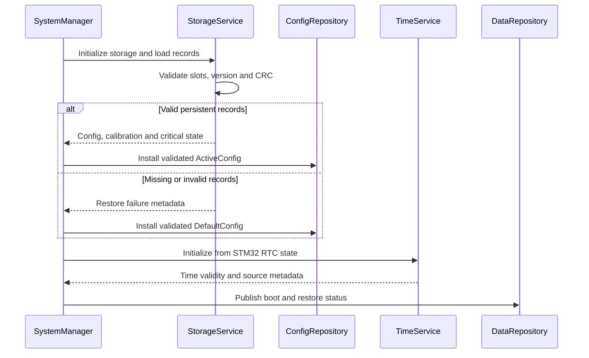
```mermaid
sequenceDiagram
    participant SM as SystemManager
    participant SS as StorageService
    participant CR as ConfigRepository
    participant TS as TimeService
    participant DR as DataRepository

    SM->>SS: Initialize storage and load records
    SS->>SS: Validate slots, version and CRC
    alt Valid persistent records
        SS-->>SM: Config, calibration and critical state
        SM->>CR: Install validated ActiveConfig
    else Missing or invalid records
        SS-->>SM: Restore failure metadata
        SM->>CR: Install validated DefaultConfig
    end
    SM->>TS: Initialize from STM32 RTC state
    TS-->>SM: Time validity and source metadata
    SM->>DR: Publish boot and restore status
```

### 6.2. Điều kiện sau sequence

* `ConfigRepository` có đúng một `ActiveConfig` hợp lệ.
* Record lỗi không được apply một phần.
* `TimeService` đã phân loại RTC valid/invalid.
* `DataRepository` có boot status nhưng chưa bắt buộc có measurement hợp lệ.

---

## 7. `SEQ-002` — Khởi tạo measurement subsystem

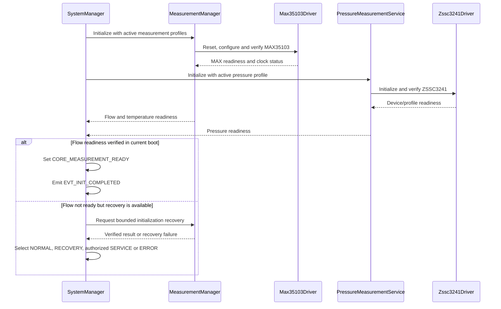
```mermaid
sequenceDiagram
    participant SM as SystemManager
    participant MM as MeasurementManager
    participant MAX as Max35103Driver
    participant PM as PressureMeasurementService
    participant ZSSC as Zssc3241Driver

    SM->>MM: Initialize with active measurement profiles
    MM->>MAX: Reset, configure and verify MAX35103
    MAX-->>MM: MAX readiness and clock status

    SM->>PM: Initialize with active pressure profile
    PM->>ZSSC: Initialize and verify ZSSC3241
    ZSSC-->>PM: Device/profile readiness

    MM-->>SM: Flow and temperature readiness
    PM-->>SM: Pressure readiness

    alt Flow readiness verified in current boot
        SM->>SM: Set CORE_MEASUREMENT_READY
        SM->>SM: Emit EVT_INIT_COMPLETED
    else Flow not ready but recovery is available
        SM->>MM: Request bounded initialization recovery
        MM-->>SM: Verified result or recovery failure
        SM->>SM: Select NORMAL, RECOVERY, authorized SERVICE or ERROR
    end
```

Flow path là core dependency và không được thay thế bằng pressure readiness. Nếu một optional subsystem như pressure, LCD hoặc communication lỗi, `SystemManager` có thể chọn degraded operation. Việc chọn `SystemMode` cụ thể thuộc `06_system_fsm.md` và `07_operating_modes.md`.

---

## 8. `SEQ-003` — Một chu kỳ đo flow qua MAX35103

### 8.1. Luồng thành công

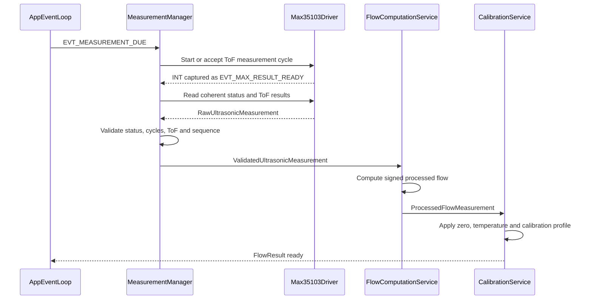
```mermaid
sequenceDiagram
    participant EL as AppEventLoop
    participant MM as MeasurementManager
    participant MAX as Max35103Driver
    participant FC as FlowComputationService
    participant CAL as CalibrationService

    EL->>MM: EVT_MEASUREMENT_DUE
    MM->>MAX: Start or accept ToF measurement cycle
    MAX-->>MM: INT captured as EVT_MAX_RESULT_READY
    MM->>MAX: Read coherent status and ToF results
    MAX-->>MM: RawUltrasonicMeasurement
    MM->>MM: Validate status, cycles, ToF and sequence
    MM->>FC: ValidatedUltrasonicMeasurement
    FC->>FC: Compute signed processed flow
    FC->>CAL: ProcessedFlowMeasurement
    CAL->>CAL: Apply zero, temperature and calibration profile
    CAL-->>EL: FlowResult ready
```

### 8.2. Điểm cần bảo đảm

* INT chỉ tạo event; SPI read và computation chạy ngoài ISR.
* ToF result phải coherent với status và config version.
* Sign convention giữ forward positive.
* Invalid ToF không được tạo valid zero-flow result.

---

## 9. `SEQ-004` — MAX35103 timeout hoặc ToF không hợp lệ

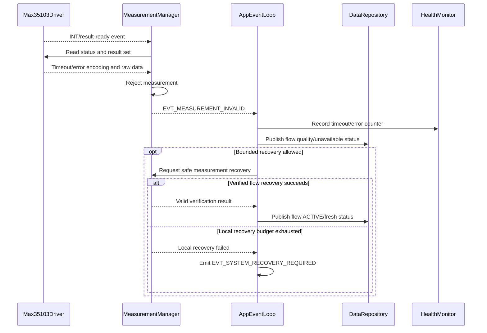
```mermaid
sequenceDiagram
    participant MAX as Max35103Driver
    participant MM as MeasurementManager
    participant EL as AppEventLoop
    participant DR as DataRepository
    participant HM as HealthMonitor

    MAX-->>MM: INT/result-ready event
    MM->>MAX: Read status and result set
    MAX-->>MM: Timeout/error encoding and raw data
    MM->>MM: Reject measurement
    MM-->>EL: EVT_MEASUREMENT_INVALID
    EL->>HM: Record timeout/error counter
    EL->>DR: Publish flow quality/unavailable status
    opt Bounded recovery allowed
        EL->>MM: Request safe measurement recovery
        alt Verified flow recovery succeeds
            MM-->>EL: Valid verification result
            EL->>DR: Publish flow ACTIVE/fresh status
        else Local recovery budget exhausted
            MM-->>EL: Local recovery failed
            EL->>EL: Emit EVT_SYSTEM_RECOVERY_REQUIRED
        end
    end
```

Không có message update `VolumeAccumulator` hoặc positive/clear leak evidence trong sequence này. Một runtime failure giữ `SystemMode=NORMAL` với measurement status `DEGRADED` trong lúc local recovery; system mode chỉ chuyển khi FSM xử lý escalation event.

---

## 10. `SEQ-005` — Đo temperature và tạo TemperatureResult

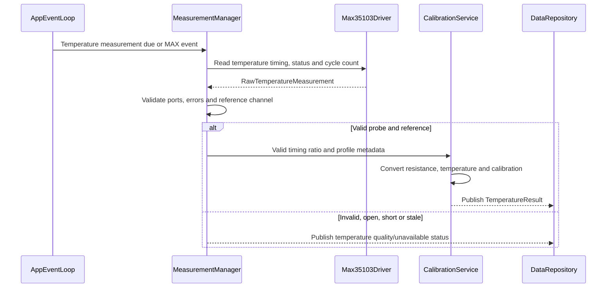
```mermaid
sequenceDiagram
    participant EL as AppEventLoop
    participant MM as MeasurementManager
    participant MAX as Max35103Driver
    participant CAL as CalibrationService
    participant DR as DataRepository

    EL->>MM: Temperature measurement due or MAX event
    MM->>MAX: Read temperature timing, status and cycle count
    MAX-->>MM: RawTemperatureMeasurement
    MM->>MM: Validate ports, errors and reference channel
    alt Valid probe and reference
        MM->>CAL: Valid timing ratio and profile metadata
        CAL->>CAL: Convert resistance, temperature and calibration
        CAL-->>DR: Publish TemperatureResult
    else Invalid, open, short or stale
        MM-->>DR: Publish temperature quality/unavailable status
    end
```

Theo `DEC-ARCH-002`, `CalibrationService` là owner bắt buộc của temperature conversion/calibration và final `TemperatureResult`. `MeasurementManager` chỉ acquire/validate raw MAX result rồi chuyển validated input; không có service owner độc lập khác cho final temperature result.

---

## 11. `SEQ-006` — Ghép temperature với flow

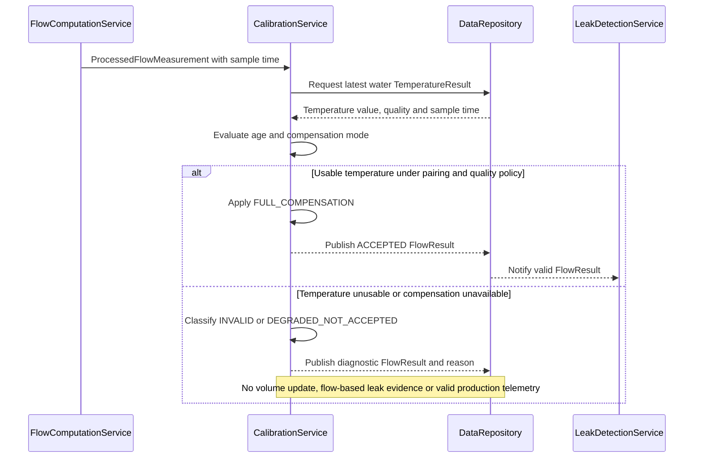
```mermaid
sequenceDiagram
    participant FC as FlowComputationService
    participant CAL as CalibrationService
    participant DR as DataRepository
    participant LD as LeakDetectionService

    FC->>CAL: ProcessedFlowMeasurement with sample time
    CAL->>DR: Request latest water TemperatureResult
    DR-->>CAL: Temperature value, quality and sample time
    CAL->>CAL: Evaluate age and compensation mode
    alt Usable temperature under pairing and quality policy
        CAL->>CAL: Apply FULL_COMPENSATION
        CAL-->>DR: Publish ACCEPTED FlowResult
        DR-->>LD: Notify valid FlowResult
    else Temperature unusable or compensation unavailable
        CAL->>CAL: Classify INVALID or DEGRADED_NOT_ACCEPTED
        CAL-->>DR: Publish diagnostic FlowResult and reason
        Note over CAL,DR: No volume update, flow-based leak evidence or valid production telemetry
    end
```

Theo `DEC-ARCH-003`, temperature mặc định, held-temperature chưa được validation hoặc uncompensated value không được sử dụng như measurement mới hợp lệ. Flow quality phải phản ánh compensation mode; fallback chỉ được mở sau validation và bằng policy được version hóa.

---

## 12. `SEQ-007` — Một chu kỳ đo pressure qua ZSSC3241

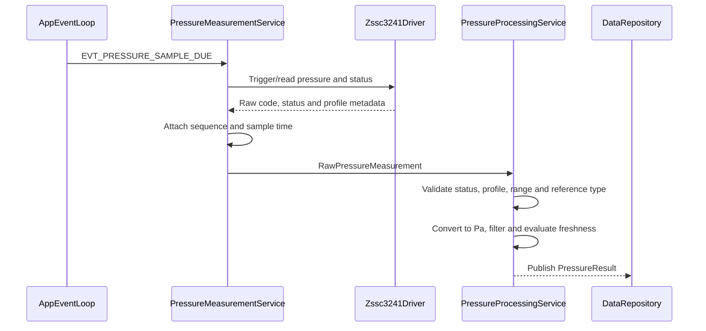
```mermaid
sequenceDiagram
    participant EL as AppEventLoop
    participant PM as PressureMeasurementService
    participant ZSSC as Zssc3241Driver
    participant PP as PressureProcessingService
    participant DR as DataRepository

    EL->>PM: EVT_PRESSURE_SAMPLE_DUE
    PM->>ZSSC: Trigger/read pressure and status
    ZSSC-->>PM: Raw code, status and profile metadata
    PM->>PM: Attach sequence and sample time
    PM->>PP: RawPressureMeasurement
    PP->>PP: Validate status, profile, range and reference type
    PP->>PP: Convert to Pa, filter and evaluate freshness
    PP-->>DR: Publish PressureResult
```

Sơ đồ không mô tả analog bridge transaction. Pressure bridge tạo tín hiệu analog và ZSSC3241 thực hiện signal conditioning/digitization trước I2C boundary.

---

## 13. `SEQ-008` — Pressure subsystem lỗi

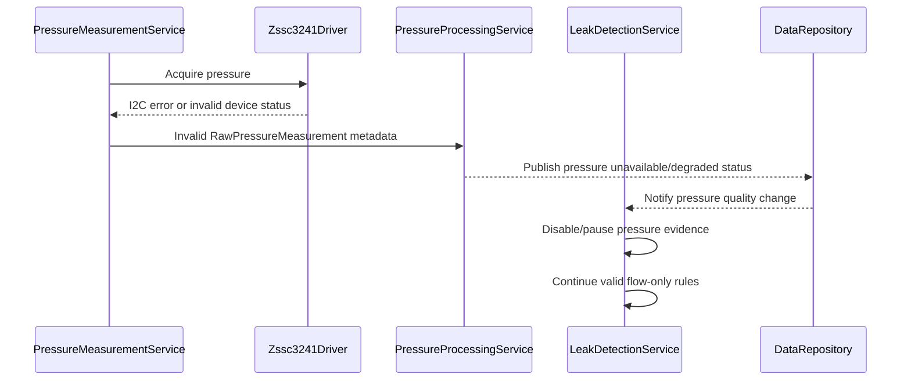
```mermaid
sequenceDiagram
    participant PM as PressureMeasurementService
    participant ZSSC as Zssc3241Driver
    participant PP as PressureProcessingService
    participant LD as LeakDetectionService
    participant DR as DataRepository

    PM->>ZSSC: Acquire pressure
    ZSSC-->>PM: I2C error or invalid device status
    PM->>PP: Invalid RawPressureMeasurement metadata
    PP-->>DR: Publish pressure unavailable/degraded status
    DR-->>LD: Notify pressure quality change
    LD->>LD: Disable/pause pressure evidence
    LD->>LD: Continue valid flow-only rules
```

Pressure lỗi không được clear leak state và không được làm flow measurement dừng.

---

## 14. `SEQ-009` — Cập nhật volume và leak result

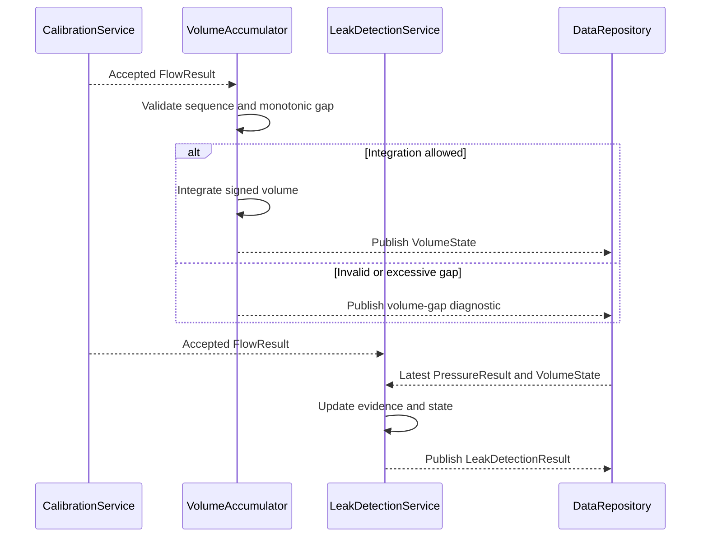
```mermaid
sequenceDiagram
    participant CAL as CalibrationService
    participant VA as VolumeAccumulator
    participant LD as LeakDetectionService
    participant DR as DataRepository

    CAL-->>VA: Accepted FlowResult
    VA->>VA: Validate sequence and monotonic gap
    alt Integration allowed
        VA->>VA: Integrate signed volume
        VA-->>DR: Publish VolumeState
    else Invalid or excessive gap
        VA-->>DR: Publish volume-gap diagnostic
    end

    CAL-->>LD: Accepted FlowResult
    DR-->>LD: Latest PressureResult and VolumeState
    LD->>LD: Update evidence and state
    LD-->>DR: Publish LeakDetectionResult
```

FlowResult phải được gửi theo semantics publish/notify, không phải cho phép consumer sửa object do `CalibrationService` sở hữu.

---

## 15. `SEQ-010` — Publish RuntimeSnapshot

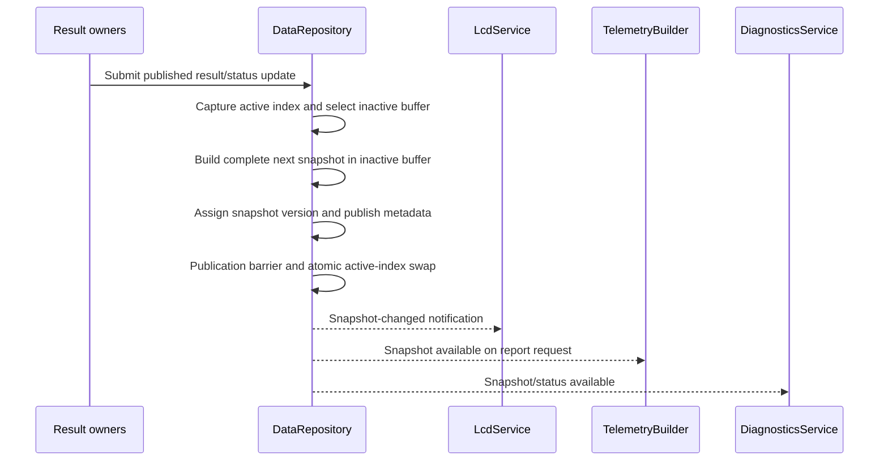
```mermaid
sequenceDiagram
    participant OWNER as Result owners
    participant DR as DataRepository
    participant LCD as LcdService
    participant TEL as TelemetryBuilder
    participant DIAG as DiagnosticsService

    OWNER->>DR: Submit published result/status update
    DR->>DR: Capture active index and select inactive buffer
    DR->>DR: Build complete next snapshot in inactive buffer
    DR->>DR: Assign snapshot version and publish metadata
    DR->>DR: Publication barrier and atomic active-index swap
    DR-->>LCD: Snapshot-changed notification
    DR-->>TEL: Snapshot available on report request
    DR-->>DIAG: Snapshot/status available
```

`Result owners` là participant logic đại diện cho các owner đã publish `TemperatureResult`, `FlowResult`, `PressureResult`, `VolumeState` hoặc `LeakDetectionResult`.

Theo `DEC-ARCH-006`, consumer capture active index một lần rồi đọc immutable buffer tương ứng. Writer không sửa active buffer và consumer không giữ reference qua publication tiếp theo nếu repository lifetime contract không bảo đảm.

---

## 16. `SEQ-011` — Cập nhật LCD

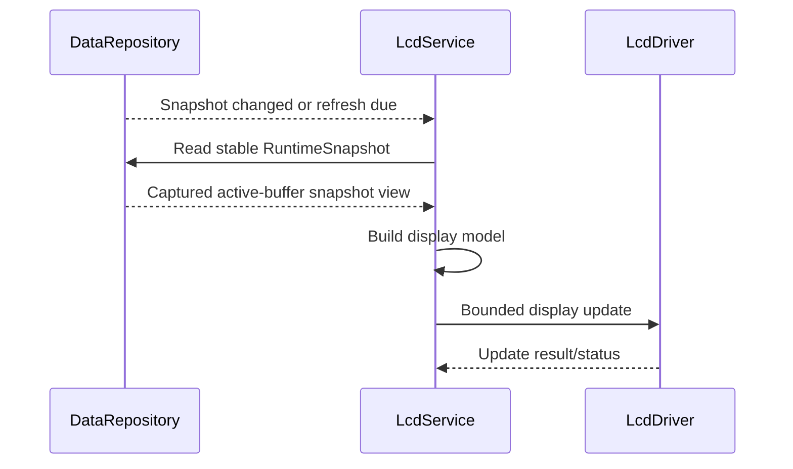
```mermaid
sequenceDiagram
    participant DR as DataRepository
    participant LCD as LcdService
    participant DRIVER as LcdDriver

    DR-->>LCD: Snapshot changed or refresh due
    LCD->>DR: Read stable RuntimeSnapshot
    DR-->>LCD: Captured active-buffer snapshot view
    LCD->>LCD: Build display model
    LCD->>DRIVER: Bounded display update
    DRIVER-->>LCD: Update result/status
```

LCD không gọi measurement driver và có thể coalesce refresh khi runtime bận.

---

## 17. `SEQ-012` — BLE nhận configuration request

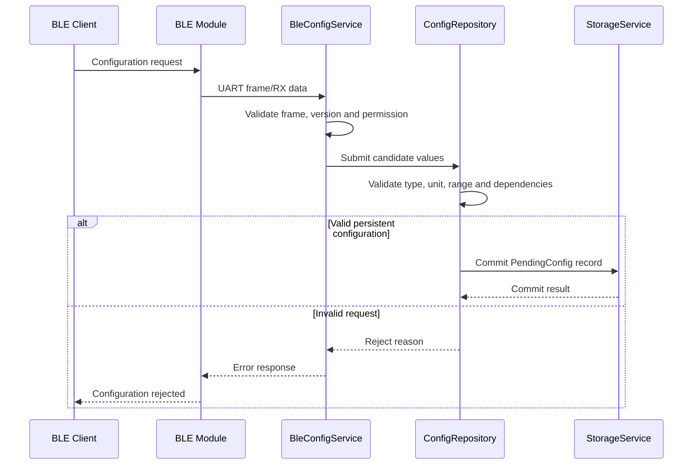
```mermaid
sequenceDiagram
    participant CLIENT as BLE Client
    participant MODULE as BLE Module
    participant BLE as BleConfigService
    participant CR as ConfigRepository
    participant SS as StorageService

    CLIENT->>MODULE: Configuration request
    MODULE->>BLE: UART frame/RX data
    BLE->>BLE: Validate frame, version and permission
    BLE->>CR: Submit candidate values
    CR->>CR: Validate type, unit, range and dependencies
    alt Valid persistent configuration
        CR->>SS: Commit PendingConfig record
        SS-->>CR: Commit result
    else Invalid request
        CR-->>BLE: Reject reason
        BLE-->>MODULE: Error response
        MODULE-->>CLIENT: Configuration rejected
    end
```

Sequence apply thành công được tách sang mục tiếp theo để làm rõ ranh giới commit/apply.

---

## 18. `SEQ-013` — Commit và apply configuration

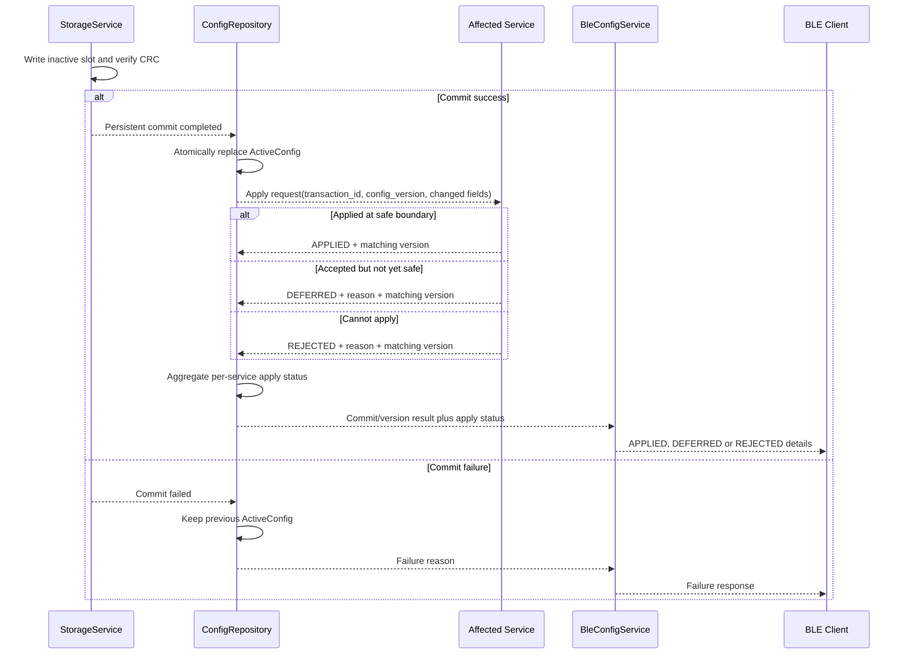
```mermaid
sequenceDiagram
    participant SS as StorageService
    participant CR as ConfigRepository
    participant TARGET as Affected Service
    participant BLE as BleConfigService
    participant CLIENT as BLE Client

    SS->>SS: Write inactive slot and verify CRC
    alt Commit success
        SS-->>CR: Persistent commit completed
        CR->>CR: Atomically replace ActiveConfig
        CR-->>TARGET: Apply request(transaction_id, config_version, changed fields)
        alt Applied at safe boundary
            TARGET-->>CR: APPLIED + matching version
        else Accepted but not yet safe
            TARGET-->>CR: DEFERRED + reason + matching version
        else Cannot apply
            TARGET-->>CR: REJECTED + reason + matching version
        end
        CR->>CR: Aggregate per-service apply status
        CR-->>BLE: Commit/version result plus apply status
        BLE-->>CLIENT: APPLIED, DEFERRED or REJECTED details
    else Commit failure
        SS-->>CR: Commit failed
        CR->>CR: Keep previous ActiveConfig
        CR-->>BLE: Failure reason
        BLE-->>CLIENT: Failure response
    end
```

### 18.1. Invariant

```text
Persistent config:
validate -> commit -> verify -> apply -> notify
```

Không được apply trước khi commit thành công.

Theo `DEC-ARCH-007`, persistent commit success không được báo như fully applied khi một required service còn `DEFERRED` hoặc `REJECTED`. Response có thể xác nhận committed `ActiveConfig` version đồng thời nêu rõ runtime apply chưa hoàn tất.

---

## 19. `SEQ-014` — Apply reporting schedule mới

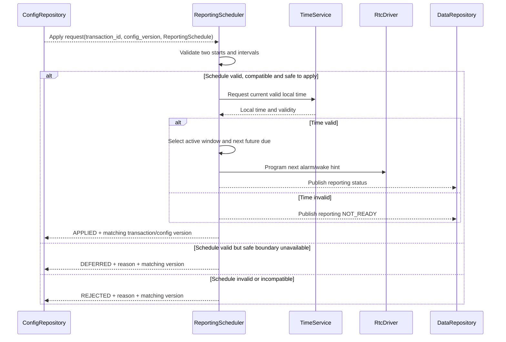
```mermaid
sequenceDiagram
    participant CR as ConfigRepository
    participant RS as ReportingScheduler
    participant TS as TimeService
    participant RTC as RtcDriver
    participant DR as DataRepository

    CR-->>RS: Apply request(transaction_id, config_version, ReportingSchedule)
    RS->>RS: Validate two starts and intervals
    alt Schedule valid, compatible and safe to apply
        RS->>TS: Request current valid local time
        TS-->>RS: Local time and validity
        alt Time valid
            RS->>RS: Select active window and next future due
            RS->>RTC: Program next alarm/wake hint
            RS-->>DR: Publish reporting status
        else Time invalid
            RS-->>DR: Publish reporting NOT_READY
        end
        RS-->>CR: APPLIED + matching transaction/config version
    else Schedule valid but safe boundary unavailable
        RS-->>CR: DEFERRED + reason + matching version
    else Schedule invalid or incompatible
        RS-->>CR: REJECTED + reason + matching version
    end
```

Schedule mới không phát report ngay mặc định và không hủy telemetry transaction đang chạy.

---

## 20. `SEQ-015` — Đồng bộ thời gian từ 4G

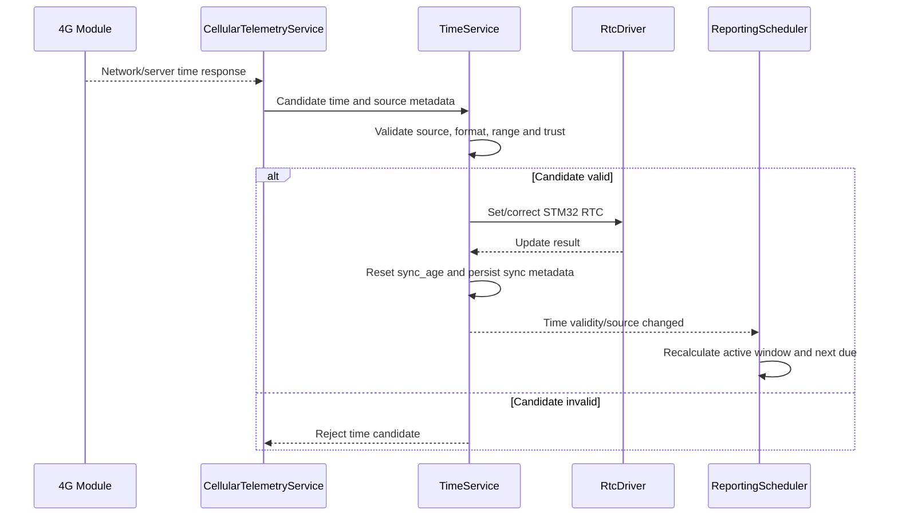
```mermaid
sequenceDiagram
    participant MODEM as 4G Module
    participant CELL as CellularTelemetryService
    participant TS as TimeService
    participant RTC as RtcDriver
    participant RS as ReportingScheduler

    MODEM-->>CELL: Network/server time response
    CELL->>TS: Candidate time and source metadata
    TS->>TS: Validate source, format, range and trust
    alt Candidate valid
        TS->>RTC: Set/correct STM32 RTC
        RTC-->>TS: Update result
        TS->>TS: Reset sync_age and persist sync metadata
        TS-->>RS: Time validity/source changed
        RS->>RS: Recalculate active window and next due
    else Candidate invalid
        TS-->>CELL: Reject time candidate
    end
```

4G cung cấp external time authority. STM32 RTC vẫn là system wall-clock runtime.

---

## 21. `SEQ-016` — Đồng bộ tùy chọn MAX35103 event clock

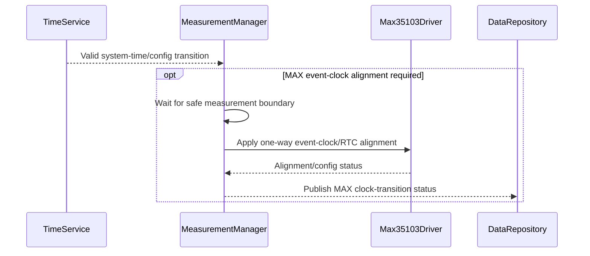
```mermaid
sequenceDiagram
    participant TS as TimeService
    participant MM as MeasurementManager
    participant MAX as Max35103Driver
    participant DR as DataRepository

    TS-->>MM: Valid system-time/config transition
    opt MAX event-clock alignment required
        MM->>MM: Wait for safe measurement boundary
        MM->>MAX: Apply one-way event-clock/RTC alignment
        MAX-->>MM: Alignment/config status
        MM-->>DR: Publish MAX clock-transition status
    end
```

MAX35103 RTC không gửi ngược để overwrite STM32 system time trong baseline.

---

## 22. `SEQ-017` — RTC alarm đến REPORT_DUE

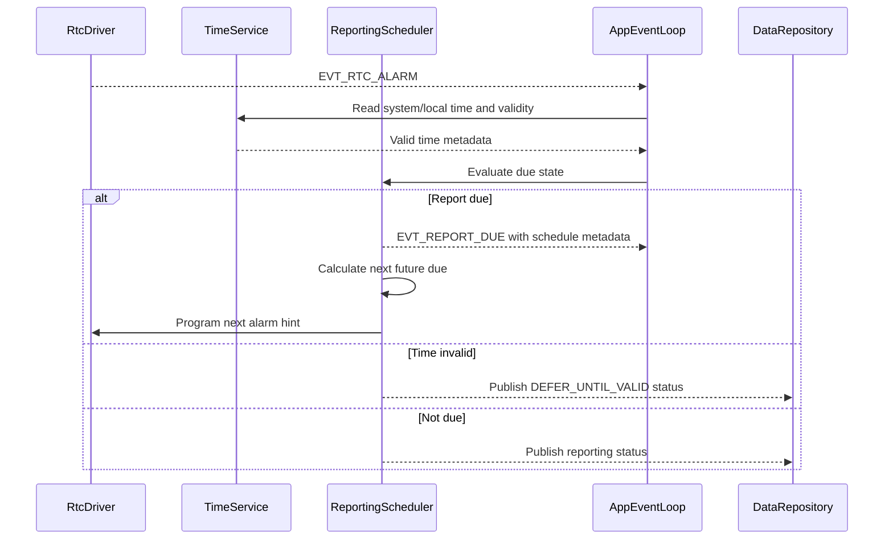
```mermaid
sequenceDiagram
    participant RTC as RtcDriver
    participant TS as TimeService
    participant RS as ReportingScheduler
    participant EL as AppEventLoop
    participant DR as DataRepository

    RTC-->>EL: EVT_RTC_ALARM
    EL->>TS: Read system/local time and validity
    TS-->>EL: Valid time metadata
    EL->>RS: Evaluate due state
    alt Report due
        RS-->>EL: EVT_REPORT_DUE with schedule metadata
        RS->>RS: Calculate next future due
        RS->>RTC: Program next alarm hint
    else Time invalid
        RS-->>DR: Publish DEFER_UNTIL_VALID status
    else Not due
        RS-->>DR: Publish reporting status
    end
```

RTC callback chỉ phát event. Reporting policy chạy ngoài callback.

---

## 23. `SEQ-018` — Tạo TelemetryRecord

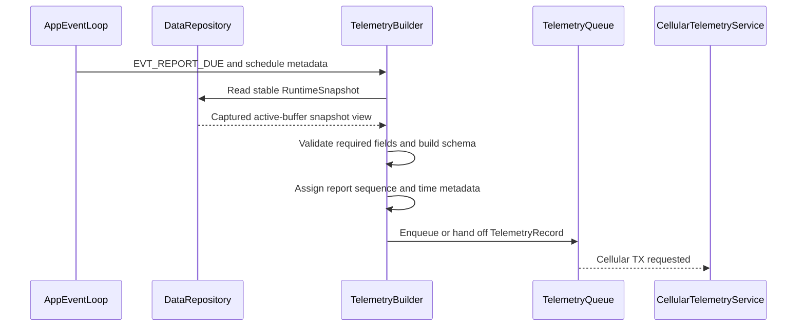
```mermaid
sequenceDiagram
    participant EL as AppEventLoop
    participant DR as DataRepository
    participant TB as TelemetryBuilder
    participant TQ as TelemetryQueue
    participant CELL as CellularTelemetryService

    EL->>TB: EVT_REPORT_DUE and schedule metadata
    TB->>DR: Read stable RuntimeSnapshot
    DR-->>TB: Captured active-buffer snapshot view
    TB->>TB: Validate required fields and build schema
    TB->>TB: Assign report sequence and time metadata
    TB->>TQ: Enqueue or hand off TelemetryRecord
    TQ-->>CELL: Cellular TX requested
```

`TelemetryQueue` có thể là logical boundary dù storage backing/capacity chưa chốt.

---

## 24. `SEQ-019` — Gửi telemetry qua 4G

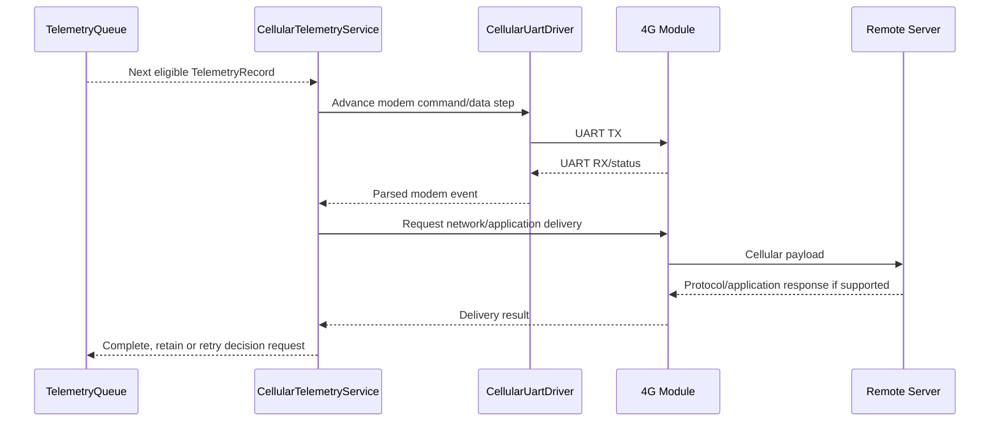
```mermaid
sequenceDiagram
    participant TQ as TelemetryQueue
    participant CELL as CellularTelemetryService
    participant UART as CellularUartDriver
    participant MODEM as 4G Module
    participant SERVER as Remote Server

    TQ-->>CELL: Next eligible TelemetryRecord
    CELL->>UART: Advance modem command/data step
    UART->>MODEM: UART TX
    MODEM-->>UART: UART RX/status
    UART-->>CELL: Parsed modem event
    CELL->>MODEM: Request network/application delivery
    MODEM->>SERVER: Cellular payload
    SERVER-->>MODEM: Protocol/application response if supported
    MODEM-->>CELL: Delivery result
    CELL-->>TQ: Complete, retain or retry decision request
```

Delivery success level và record removal policy chưa được chốt cho đến khi server protocol/acknowledgement được định nghĩa.

---

## 25. `SEQ-020` — 4G offline hoặc delivery thất bại

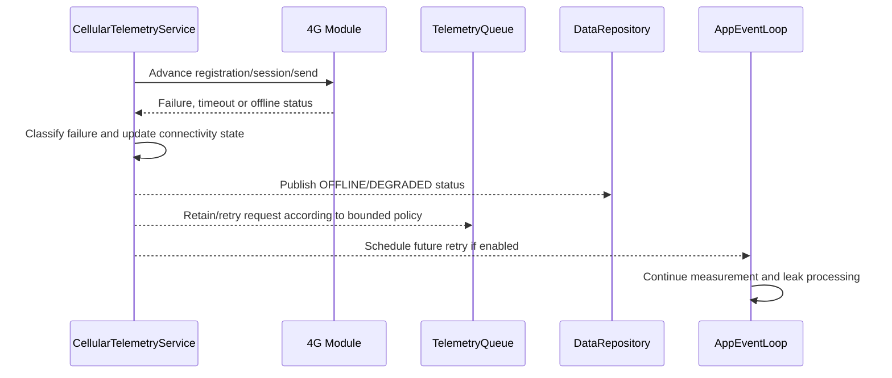
```mermaid
sequenceDiagram
    participant CELL as CellularTelemetryService
    participant MODEM as 4G Module
    participant TQ as TelemetryQueue
    participant DR as DataRepository
    participant EL as AppEventLoop

    CELL->>MODEM: Advance registration/session/send
    MODEM-->>CELL: Failure, timeout or offline status
    CELL->>CELL: Classify failure and update connectivity state
    CELL-->>DR: Publish OFFLINE/DEGRADED status
    CELL-->>TQ: Retain/retry request according to bounded policy
    CELL-->>EL: Schedule future retry if enabled
    EL->>EL: Continue measurement and leak processing
```

Queue capacity, retention time, backoff và full-queue replacement vẫn là `TBD`.

---

## 26. `SEQ-021` — Leak result thay đổi

```mermaid
sequenceDiagram
    participant LD as LeakDetectionService
    participant DR as DataRepository
    participant LCD as LcdService
    participant EL as AppEventLoop
    participant TB as TelemetryBuilder

    LD-->>DR: New LeakDetectionResult
    DR->>DR: Publish new RuntimeSnapshot version
    DR-->>LCD: Snapshot changed
    LD-->>EL: EVT_LEAK_RESULT_CHANGED
    opt Immediate event telemetry approved in future
        EL->>TB: Generate event TelemetryRecord
    end
```

Scheduled reporting là baseline. Immediate leak telemetry chỉ là optional future branch cho đến khi policy được phê duyệt.

---

## 27. `SEQ-022` — Vào low-power

```mermaid
sequenceDiagram
    participant EL as AppEventLoop
    participant PM as PowerManager
    participant MM as MeasurementManager
    participant CELL as CellularTelemetryService
    participant RTC as RtcDriver

    EL->>PM: Evaluate low-power entry
    PM->>MM: Query measurement blockers and next due
    MM-->>PM: Busy/idle and wake requirement
    PM->>CELL: Query cellular blockers
    CELL-->>PM: Safe/unsafe interruption state
    alt No critical blocker
        PM->>RTC: Program next alarm/wake hint
        PM-->>EL: Enter selected low-power state
    else Blocker exists
        PM-->>EL: Remain active/idle and process pending work
    end
```

Các service khác như storage/BLE cũng phải cung cấp blocker. Sơ đồ chỉ thể hiện hai blocker tiêu biểu để giữ số participant có giới hạn.

---

## 28. `SEQ-023` — Wake-up và dispatch event

```mermaid
sequenceDiagram
    participant HW as Wake Source
    participant PM as PowerManager
    participant EL as AppEventLoop
    participant TS as TimeService
    participant DR as DataRepository

    HW-->>PM: RTC, MAX INT, UART or timer wake
    PM->>PM: Restore required clock/power domains
    PM-->>EL: Wake reasons and pending flags
    EL->>EL: Select highest-priority event
    EL->>TS: Read required monotonic/wall-clock metadata
    TS-->>EL: Time and validity
    EL->>DR: Publish wake/power status when required
```

Nhiều wake reason đồng thời phải được giữ trong pending state; không được xóa các reason chưa xử lý.

---

## 29. `SEQ-024` — Storage commit bị gián đoạn hoặc verify thất bại

```mermaid
sequenceDiagram
    participant OWNER as Record Owner
    participant SS as StorageService
    participant FRAM as FramDriver
    participant CR as ConfigRepository
    participant DR as DataRepository

    OWNER->>SS: Commit validated persistent record
    SS->>FRAM: Write inactive slot
    FRAM-->>SS: Write result
    SS->>FRAM: Read back and verify
    FRAM-->>SS: Invalid readback or bus failure
    SS->>SS: Keep previous active slot
    SS-->>OWNER: Commit failed
    opt Record is configuration
        SS-->>CR: Do not apply PendingConfig
    end
    SS-->>DR: Publish storage fault/status
```

Sequence này bảo đảm config không được apply một phần và slot cũ vẫn là recovery candidate.

---

## 30. `SEQ-025` — Measurement event trong lúc 4G đang xử lý

```mermaid
sequenceDiagram
    participant MAX as MAX INT Handler
    participant EL as AppEventLoop
    participant MM as MeasurementManager
    participant CELL as CellularTelemetryService

    CELL-->>EL: Modem response pending/received
    MAX-->>EL: Capture EVT_MAX_RESULT_READY
    EL->>EL: Select measurement-critical event first
    EL->>MM: Process MAX result within deadline
    MM-->>EL: Flow/temperature processing events
    EL->>CELL: Resume bounded modem state step
```

4G state/context và timeout được giữ nguyên trong lúc measurement event được ưu tiên.

---

## 31. `SEQ-026` — BLE request trong lúc StorageService bận

```mermaid
sequenceDiagram
    participant CLIENT as BLE Client
    participant BLE as BleConfigService
    participant CR as ConfigRepository
    participant SS as StorageService

    CLIENT->>BLE: Configuration request
    BLE->>CR: Validated candidate
    CR->>SS: Request persistent commit
    alt Storage busy and queue permitted
        SS-->>CR: Request queued/pending
        CR-->>BLE: Accepted and pending status
        BLE-->>CLIENT: Pending response
    else Queue not permitted or full
        SS-->>CR: Busy/rejected
        CR-->>BLE: No ActiveConfig change
        BLE-->>CLIENT: Retry/busy response
    end
```

Exact policy queue/reject theo record type thuộc firmware/storage document.

---

## 32. `SEQ-027` — RTC điều chỉnh tiến hoặc lùi

```mermaid
sequenceDiagram
    participant SRC as Time Source
    participant TS as TimeService
    participant RTC as RtcDriver
    participant RS as ReportingScheduler
    participant DR as DataRepository

    SRC->>TS: Validated new wall-clock time
    TS->>RTC: Correct STM32 RTC
    RTC-->>TS: Correction completed
    TS-->>RS: Time changed with direction/delta metadata
    RS->>RS: Re-evaluate active window and next future slot
    RS->>RS: SKIP_TO_NEXT for every expired slot
    RS-->>DR: Publish updated time/reporting status
```

Không có message sửa monotonic timers, leak evidence duration hoặc volume integration state.

Theo `DEC-SCHED-002`, `SEQ-027` không tạo catch-up record cho slot đã quá hạn; scheduler chỉ arm slot hợp lệ tiếp theo trong tương lai.

---

## 33. Bảng trace sequence với use case

| Sequence ID         | Use case                     | Kết quả chính                                |
| ------------------- | ---------------------------- | -------------------------------------------- |
| `SEQ-001`           | Boot/restore                 | Active runtime state hoặc fallback hợp lệ    |
| `SEQ-002`           | Sensor initialization        | Measurement readiness                        |
| `SEQ-003`           | Valid ultrasonic measurement | `FlowResult`                                 |
| `SEQ-004`           | Invalid/timeout ToF          | Quality/fault status                         |
| `SEQ-005`           | Temperature measurement      | `TemperatureResult`                          |
| `SEQ-006`           | Temperature-flow pairing     | Compensated/degraded `FlowResult`            |
| `SEQ-007`           | Pressure measurement         | `PressureResult`                             |
| `SEQ-008`           | Pressure failure             | Degraded pressure evidence                   |
| `SEQ-009`           | Volume/leak update           | `VolumeState`, `LeakDetectionResult`         |
| `SEQ-010`           | Snapshot publish             | New `RuntimeSnapshot` version                |
| `SEQ-011`           | LCD refresh                  | Display status                               |
| `SEQ-012`–`SEQ-014` | BLE config lifecycle         | Committed/applied config or rejection        |
| `SEQ-015`–`SEQ-016` | Time/clock synchronization   | Valid system time and optional MAX alignment |
| `SEQ-017`–`SEQ-020` | Reporting/telemetry          | Record generation/delivery/offline status    |
| `SEQ-021`           | Leak-state change            | Snapshot/event update                        |
| `SEQ-022`–`SEQ-023` | Low-power/wake               | Safe sleep and event resume                  |
| `SEQ-024`           | Storage failure              | Previous record retained                     |
| `SEQ-025`–`SEQ-027` | Concurrent/time adjustment   | Deterministic priority and schedule behavior |

---

## 34. Các invariant thể hiện trong sequence

1. Persistent config commit xảy ra trước apply.
2. Sensor result validate trước processing/publish.
3. INT/callback không thực hiện business logic nặng.
4. Invalid result không cập nhật volume hoặc clear leak.
5. Pressure fault không dừng flow-only leak rule.
6. Snapshot publish trước khi LCD/telemetry đọc.
7. 4G time chỉ đồng bộ vào system-time authority qua `TimeService`.
8. MAX35103 RTC không overwrite STM32 RTC trong baseline.
9. `REPORT_DUE` xảy ra trước record generation và delivery.
10. 4G offline không dừng measurement.
11. Low-power chỉ xảy ra sau blocker evaluation.
12. Storage verify failure giữ record cũ.
13. Wall-clock correction không thay monotonic state.
14. Measurement event có thể ưu tiên hơn modem work không khẩn cấp.
15. Production boot chỉ hoàn tất `INIT` sau khi flow readiness được verify; một runtime flow fault không tự động chuyển `ERROR`.
16. `CalibrationService` publish `TemperatureResult`; `MeasurementManager` chỉ publish/chuyển validated raw temperature input.
17. Compensation không khả dụng chỉ publish `INVALID` hoặc `DEGRADED_NOT_ACCEPTED`; sequence không được gọi volume hoặc valid flow-based leak consumer cho result này.
18. Snapshot publication dùng inactive-buffer build và atomic active-index swap; consumer không được quan sát mixed-version snapshot.
19. Config apply acknowledgement phải correlate `transaction_id`/`config_version` và phân biệt `APPLIED`, `DEFERRED`, `REJECTED`.

---

## 35. Các quyết định còn mở

Đã giải quyết:

```text
OQ-SEQ-002 -> DEC-ARCH-002
OQ-SEQ-004 -> DEC-ARCH-007
OQ-SEQ-010 -> DEC-SCHED-002 (SKIP_TO_NEXT)
```

| ID           | Quyết định                                       | Sequence bị ảnh hưởng |
| ------------ | ------------------------------------------------ | --------------------- |
| `OQ-SEQ-001` | MAX direct mode hay event-timing mode production | `SEQ-003`–`SEQ-005`   |
| `OQ-SEQ-003` | ZSSC3241 trigger/read operating mode             | `SEQ-007`, `SEQ-008`  |
| `OQ-SEQ-005` | Immediate leak telemetry                         | `SEQ-021`             |
| `OQ-SEQ-006` | 4G/server acknowledgement level                  | `SEQ-019`             |
| `OQ-SEQ-007` | Retry/backoff và queue policy                    | `SEQ-020`             |
| `OQ-SEQ-008` | Low-power state và wake-capable peripheral       | `SEQ-022`, `SEQ-023`  |
| `OQ-SEQ-009` | Storage busy queue/reject theo record type       | `SEQ-026`             |

---

## 36. Yêu cầu chuyển giao xuống system FSM

`06_system_fsm.md` phải biểu diễn được tối thiểu:

```text
Boot and restore completion
Core readiness and degraded readiness
Measurement start/wait/result processing
Configuration receive/commit/apply
Reporting due and telemetry progression
Offline and recovery
Low-power entry and wake
Error isolation and recovery outcome
```

System FSM không cần đưa mọi driver phase thành `SystemMode`. Các phase SPI/I2C/UART chi tiết vẫn thuộc internal state machine.

---

## 37. Yêu cầu chuyển giao xuống firmware

Firmware phải cung cấp:

* Interface/message tương ứng với các boundary trong sequence.
* Correlation ID hoặc sequence khi có nhiều request đồng thời.
* Bounded timeout dùng monotonic time.
* Idempotent handling cho duplicate callback/event khi cần.
* Atomic result/config/snapshot publication.
* Clear success/failure response cho commit và delivery.
* Event queue hoặc pending flags không làm mất event critical.
* Test hook để inject từng response/error branch.

---

## 38. Yêu cầu chuyển giao xuống integration test

Mỗi sequence phải có ít nhất:

```text
Happy-path test
Timeout/error-path test
Duplicate/out-of-order test where applicable
Reset/config-change boundary test
Quality/result assertion
No-forbidden-side-effect assertion
```

Ví dụ `SEQ-008` phải xác nhận:

* Pressure quality chuyển unavailable/degraded.
* Flow-only detection vẫn chạy.
* Leak state không bị clear bằng pressure invalid.
* Snapshot chứa fault/status đúng.

---

## 39. Tiêu chí hoàn thành

Tài liệu được xem là đủ làm baseline khi:

1. Participant names thống nhất với glossary.
2. Boot, measurement, config, reporting, low-power và recovery đều có sequence.
3. Mỗi diagram không vượt quá năm participant.
4. Commit/apply và generate/deliver được tách rõ.
5. MAX/STM32/4G time roles đúng với tài liệu 03.
6. Pressure chain đúng `bridge → ZSSC3241 → MCU`.
7. Invalid/stale paths không tạo side effect bị cấm.
8. Concurrent-event priority có sequence minh họa.
9. Open decisions không bị trình bày như behavior đã chốt.
10. Sequence có thể map sang system FSM và integration test.

---

## 40. Kết luận

Sequence diagram trong tài liệu này chuyển luồng vận hành cấp hệ thống thành các tương tác rõ ràng giữa actor, service, driver và repository.

Chuỗi tương tác cốt lõi:

```text
Event or external request
  -> responsible service
  -> driver/repository boundary
  -> validation and bounded processing
  -> owner-published result
  -> RuntimeSnapshot or persistent record
  -> consumer notification or next event
```

Tài liệu tiếp theo `06_system_fsm.md` sẽ sử dụng các sequence này để chốt state, guard, action và transition cấp hệ thống.
