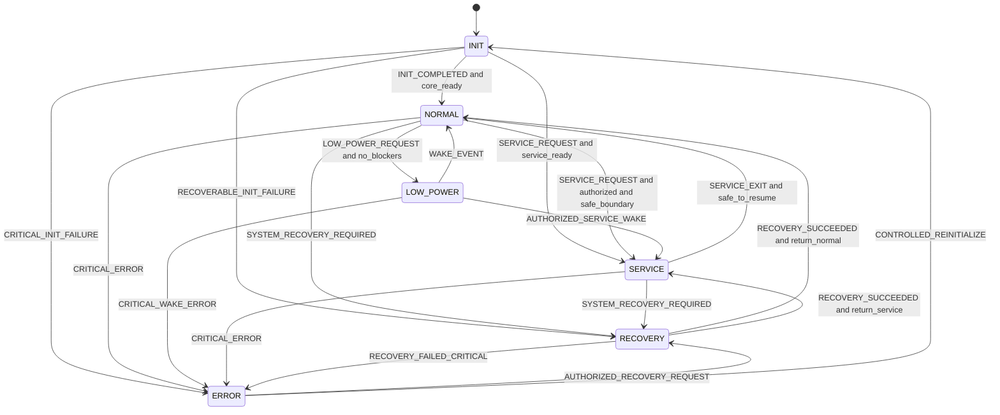
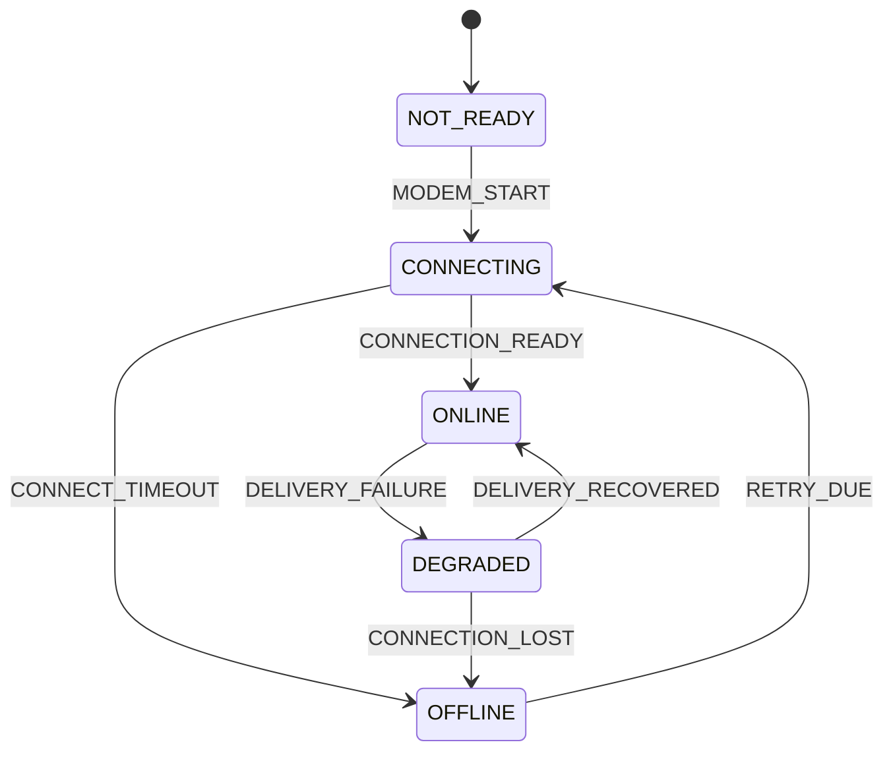

# 06 — System Finite State Machine

**Dự án:** Smart Water Flow and Pressure Monitor
**Tên viết tắt:** SWFPM
**Nhóm tài liệu:** `1.docs/00_overview`
**Cấp tài liệu:** State machine cấp hệ thống
**Trạng thái:** Baseline đã định nghĩa

---

## 1. Mục tiêu

Tài liệu này định nghĩa Finite State Machine cấp hệ thống cho **Smart Water Flow and Pressure Monitor**.

Mục tiêu cụ thể:

* Chốt tập `SystemMode` loại trừ nhau.
* Chốt event có thể làm thay đổi `SystemMode`.
* Định nghĩa guard, action và transition chính.
* Phân biệt system-level state với internal service state.
* Mô tả quan hệ giữa `SystemMode` và các status trực giao.
* Định nghĩa hành vi khi measurement, 4G, BLE, storage hoặc time gặp lỗi.
* Định nghĩa low-power entry, wake-up, service và recovery.
* Làm baseline cho firmware FSM table và model-based test.

FSM này không mô tả từng transaction SPI, I2C, UART hoặc từng phase của telemetry delivery.

---

## 2. Phạm vi

### 2.1. Nội dung thuộc phạm vi

```text
SystemMode definition
Initial and terminal behavior
System-level events
Transition guards and actions
Mode entry and exit actions
Recovery and error transitions
Service-mode authorization
Low-power entry and wake-up
Orthogonal connectivity/time/measurement status
Unhandled-event policy
Transition priority
FSM validation requirements
```

### 2.2. Nội dung ngoài phạm vi

```text
MeasurementPhase implementation
PressureMeasurementPhase implementation
BleConfigState and parser FSM
CellularConnectionState and AT-command FSM
TelemetryDeliveryState
StorageCommitState
MAX35103 internal event-timing state
ZSSC3241 conversion sequence
Exact RTOS task mapping
Exact NVIC priority
```

---

## 3. Tài liệu liên quan

| Nội dung                   | Tài liệu nguồn                  |
| -------------------------- | ------------------------------- |
| System baseline            | `README.md`                     |
| State/event thuật ngữ      | `glossary.md`                   |
| Operating principle        | `03_operating_principle.md`     |
| Main event/action flow     | `04_main_operation_flow.md`     |
| Participant ordering       | `05_sequence_diagrams.md`       |
| Operating mode semantics   | `07_operating_modes.md`         |
| Error severity và recovery | `09_error_handling_overview.md` |
| Firmware mapping           | `11_firmware_implication.md`    |

Nếu state transition thay đổi ordering đã chốt trong tài liệu 04 hoặc 05, phải review cả ba tài liệu trước khi sửa firmware.

---

## 4. Nguyên tắc thiết kế FSM

Các decision đã chốt không tạo thêm primary `SystemMode`: measurement period được lập lịch monotonic theo từng stream; MAX35103 dùng `EVENT_TIMING`; ZSSC3241 dùng Sleep Mode one-shot với asynchronous completion; quality/freshness là status trực giao; pressure trend chỉ là supporting flag; đổi leak profile reset evidence; và leak transition không phát immediate telemetry trong MVP.

### 4.1. SystemMode phải loại trừ nhau

Tại một thời điểm, thiết bị có đúng một primary `SystemMode`:

```text
INIT
NORMAL
LOW_POWER
SERVICE
RECOVERY
ERROR
```

### 4.2. Status trực giao không phải SystemMode

Những trạng thái sau được quản lý độc lập:

```text
ConnectivityStatus
TimeStatus
MeasurementStatus
StorageStatus
LeakState
ReportingStatus
PowerStatus
```

Ví dụ hợp lệ:

```text
SystemMode        = NORMAL
ConnectivityStatus = OFFLINE
TimeStatus         = VALID
MeasurementStatus  = ACTIVE
LeakState          = SUSPECTED
```

### 4.3. Không đưa internal phase lên SystemMode

Các phase sau không làm thay đổi primary mode:

```text
WAIT_MAX_RESULT
READ_PRESSURE
VALIDATE_FLOW
BLE_PARSE
STORAGE_VERIFY
MODEM_REGISTER
TELEMETRY_SEND
LCD_REFRESH
```

Chúng thuộc service/driver FSM riêng và chạy bên trong `NORMAL`, `SERVICE` hoặc `RECOVERY` khi được phép.

### 4.4. Transition phải deterministic

Với cùng:

```text
current SystemMode
event
guard context
```

FSM phải tạo cùng next mode và action set.

### 4.5. Không transition ngầm

Mọi thay đổi `SystemMode` phải:

* Có event/reason rõ ràng.
* Đi qua transition function duy nhất.
* Ghi previous mode và transition reason.
* Update mode timestamp bằng monotonic time.
* Publish mode/status khi transition hoàn tất.

---

## 5. Tập SystemMode

| Mode        | Ý nghĩa                                  |                Core measurement |                       BLE config |                  4G telemetry |                Low-power |
| ----------- | ---------------------------------------- | ------------------------------: | -------------------------------: | ----------------------------: | -----------------------: |
| `INIT`      | Khởi tạo, restore và self-check          |                     Chưa đầy đủ |               Chưa hoặc giới hạn |                          Chưa |                    Không |
| `NORMAL`    | Vận hành sản phẩm thông thường           |                              Có |                               Có |  Có nếu connectivity cho phép |        Có thể chuyển vào |
| `LOW_POWER` | Giảm năng lượng và chờ wake event        |   Không chạy active transaction |              Tùy wake capability | Không chạy active transaction |         Đang ở low-power |
| `SERVICE`   | Factory/service có kiểm soát             | Có thể giới hạn hoặc điều khiển |                    Có theo quyền |                    Tùy policy |           Không mặc định |
| `RECOVERY`  | Thực hiện phục hồi cấp hệ thống          |                Tùy fault domain |                  Có thể giới hạn |               Có thể giới hạn |                    Không |
| `ERROR`     | Critical condition, operation bị hạn chế |                 Chỉ safe action | Chỉ diagnostics/recovery command |       Best effort nếu an toàn | Không phải shutdown path |

---

## 6. Vì sao OFFLINE không phải primary SystemMode

4G offline không làm measurement, leak detection, LCD và local configuration dừng. Vì vậy `OFFLINE` thuộc `ConnectivityStatus`, không thuộc tập mode loại trừ.

```text
ConnectivityStatus:
NOT_READY
CONNECTING
ONLINE
OFFLINE
DEGRADED
```

Ví dụ:

| SystemMode  | ConnectivityStatus | Ý nghĩa                                          |
| ----------- | ------------------ | ------------------------------------------------ |
| `NORMAL`    | `ONLINE`           | Vận hành bình thường, có thể gửi telemetry       |
| `NORMAL`    | `OFFLINE`          | Measurement bình thường, telemetry chưa gửi được |
| `SERVICE`   | `OFFLINE`          | Local service hoạt động, 4G không khả dụng       |
| `LOW_POWER` | `OFFLINE`          | Thiết bị ngủ, connectivity trước đó offline      |
| `RECOVERY`  | `DEGRADED`         | Hệ thống phục hồi trong khi modem chưa ổn định   |

Nếu sản phẩm cần expose một nhãn tổng hợp `OFFLINE`, nhãn đó phải được derive từ `ConnectivityStatus`, không thay thế `SystemMode` nội bộ.

---

## 7. Sơ đồ FSM cấp hệ thống



Reset hardware/software đưa hệ thống về `INIT` bất kể mode trước reset.

---

## 8. Event cấp hệ thống

### 8.1. Event thay đổi SystemMode

```text
EVT_INIT_COMPLETED
EVT_RECOVERABLE_INIT_FAILURE
EVT_CRITICAL_INIT_FAILURE
EVT_LOW_POWER_REQUEST
EVT_WAKE
EVT_SERVICE_REQUEST
EVT_SERVICE_EXIT
EVT_SYSTEM_RECOVERY_REQUIRED
EVT_RECOVERY_SUCCEEDED
EVT_RECOVERY_FAILED
EVT_CRITICAL_ERROR
EVT_AUTHORIZED_RECOVERY_REQUEST
EVT_CONTROLLED_REINITIALIZE
```

### 8.2. Event không mặc định thay đổi SystemMode

```text
EVT_MAX_RESULT_READY
EVT_PRESSURE_SAMPLE_DUE
EVT_PRESSURE_RESULT_READY
EVT_REPORT_DUE
EVT_BLE_CONFIG_RECEIVED
EVT_CELLULAR_TX_COMPLETED
EVT_CONNECTIVITY_CHANGED
EVT_TIME_VALIDITY_CHANGED
EVT_LEAK_RESULT_CHANGED
EVT_STORAGE_COMPLETED
EVT_LCD_REFRESH_DUE
```

Các event này được dispatch tới service FSM tương ứng trong mode cho phép.

---

## 9. Guard cấp hệ thống

| Guard                     | Điều kiện logic                                                                                                                                                                      |
| ------------------------- | ------------------------------------------------------------------------------------------------------------------------------------------------------------------------------------ |
| `G_CORE_READY`            | Platform/data repository hợp lệ, không có critical blocker, và flow path đã khởi tạo thành công với ít nhất một valid self-check hoặc measurement result trong boot session hiện tại |
| `G_SERVICE_READY`         | Service/debug path sẵn sàng và policy cho phép vào service từ init                                                                                                                   |
| `G_NO_CRITICAL_BLOCKERS`  | Không còn transaction/commit/result critical cần xử lý trước sleep                                                                                                                   |
| `G_SERVICE_AUTHORIZED`    | Request đã qua authorization và permission policy                                                                                                                                    |
| `G_SAFE_SERVICE_BOUNDARY` | Không cắt ngang measurement/storage/config atomic operation                                                                                                                          |
| `G_SAFE_TO_RESUME_NORMAL` | Service operation kết thúc, runtime config/profile hợp lệ                                                                                                                            |
| `G_RECOVERY_CAN_RUN`      | Fault đã được phân loại và có recovery strategy an toàn                                                                                                                              |
| `G_RETURN_NORMAL`         | Mode trước recovery là normal hoặc default recovery target là normal                                                                                                                 |
| `G_RETURN_SERVICE`        | Recovery được yêu cầu trong service và service session còn hợp lệ                                                                                                                    |
| `G_REINITIALIZE_ALLOWED`  | Có authorized request và platform đủ an toàn để reinitialize                                                                                                                         |

Guard chỉ đọc context đã publish/owned hợp lệ; không tự thực hiện transaction dài.

---

## 10. Action cấp hệ thống

| Action                        | Mục đích                                                                  |
| ----------------------------- | ------------------------------------------------------------------------- |
| `A_ENTER_INIT`                | Reset runtime mode context và bắt đầu initialization flow                 |
| `A_START_NORMAL_SERVICES`     | Enable measurement scheduling, repository publication và runtime policies |
| `A_PREPARE_LOW_POWER`         | Thu thập blocker, program wake source và prepare power domains            |
| `A_RESUME_FROM_LOW_POWER`     | Restore clock/domain và capture wake reasons                              |
| `A_ENTER_SERVICE`             | Tạm dừng/giới hạn operation theo service policy và mở authorized session  |
| `A_EXIT_SERVICE`              | Đóng session, validate resulting config/profile và resume runtime         |
| `A_START_RECOVERY`            | Lưu recovery reason/context và chạy bounded recovery coordinator          |
| `A_ENTER_ERROR`               | Cô lập critical domain, hạn chế operation và publish critical status      |
| `A_PUBLISH_MODE_CHANGE`       | Publish mode, reason, sequence và timestamp                               |
| `A_REQUEST_CONTROLLED_REINIT` | Thực hiện reinitialization có kiểm soát                                   |

Action không được gọi trực tiếp driver transaction dài trong transition function. Action có thể phát event/request cho service thực hiện bất đồng bộ.

---

## 11. Mode INIT

### 11.1. Entry action

```text
A_ENTER_INIT
  -> mode = INIT
  -> clear volatile transition/recovery context
  -> initialize monotonic time and essential platform
  -> start boot/restore sequence
```

Persistent volume/config/calibration không bị xóa chỉ vì vào `INIT`.

### 11.2. Internal phases

Các phase sau thuộc `InitPhase`, không phải `SystemMode`:

```text
PLATFORM_INIT
STORAGE_INIT
PERSISTENT_RESTORE
TIME_INIT
MEASUREMENT_INIT
COMMUNICATION_INIT
SELF_CHECK
READINESS_EVALUATION
```

### 11.3. Exit criteria

| Kết quả                             | Event                          | Next mode  |
| ----------------------------------- | ------------------------------ | ---------- |
| Core ready                          | `EVT_INIT_COMPLETED`           | `NORMAL`   |
| Authorized service boot             | `EVT_SERVICE_REQUEST`          | `SERVICE`  |
| Recoverable shared failure          | `EVT_RECOVERABLE_INIT_FAILURE` | `RECOVERY` |
| Critical/unrecoverable init failure | `EVT_CRITICAL_INIT_FAILURE`    | `ERROR`    |

Optional subsystem như LCD hoặc 4G lỗi không mặc định làm init thất bại critical.

Flow path là core dependency theo `DEC-ARCH-001`. Pressure, BLE, 4G hoặc LCD readiness không thay thế `G_CORE_READY`. Nếu flow readiness chưa đạt, `EVT_INIT_COMPLETED` không được phát; bounded initialization recovery phải hoàn tất hoặc tạo event sang `RECOVERY`, authorized `SERVICE` hoặc `ERROR`.

---

## 12. Mode NORMAL

### 12.1. Ý nghĩa

`NORMAL` là mode vận hành sản phẩm thông thường. Các service FSM hoạt động độc lập bên trong mode này.

### 12.2. Operation được phép

```text
Flow/temperature/pressure measurement
Flow processing and volume accumulation
Leak evaluation
RuntimeSnapshot publication
LCD refresh
BLE local configuration
Reporting schedule evaluation
4G telemetry delivery
Persistent checkpoint
Local peripheral recovery
Low-power evaluation
```

### 12.3. Connectivity offline trong NORMAL

```text
EVT_CONNECTIVITY_CHANGED(OFFLINE)
  -> update ConnectivityStatus
  -> keep SystemMode = NORMAL
  -> continue measurement/leak/LCD
  -> apply bounded telemetry offline policy
```

### 12.4. Local fault trong NORMAL

Peripheral fault được xử lý bởi local service recovery khi:

* Không phá data integrity chung.
* Không làm platform unsafe.
* Có bounded recovery path.

Local recovery không cần transition sang `RECOVERY` cấp hệ thống.

Đối với flow path trong runtime:

```text
Transient flow fault
  -> keep SystemMode = NORMAL
  -> MeasurementStatus/FlowPathStatus = DEGRADED
  -> stop volume update and valid flow-dependent leak evidence
  -> run bounded local recovery
  -> success: restore ACTIVE status
  -> local budget exhausted: EVT_SYSTEM_RECOVERY_REQUIRED
```

Chỉ `RECOVERY` thất bại và không còn core flow operation an toàn mới dẫn tới `ERROR`.

### 12.5. Exit transitions

```text
Low-power request + no blockers -> LOW_POWER
Authorized service request      -> SERVICE
Shared/system recovery required -> RECOVERY
Critical system error           -> ERROR
```

---

## 13. Mode LOW_POWER

### 13.1. Entry guard

`G_NO_CRITICAL_BLOCKERS` yêu cầu tối thiểu:

```text
No measurement transaction in progress
No unread critical sensor result
No storage atomic step in progress
No BLE response at unsafe interruption point
No 4G operation at unsafe interruption point
Valid wake source/time configured
```

### 13.2. Entry actions

```text
Collect and preserve wake requirements
Program STM32 RTC alarm or other wake source
Prepare MAX35103 event timing if used
Quiesce selected peripherals
Enter selected hardware low-power state
```

### 13.3. Allowed processing

Trong low-power, CPU không xử lý normal event loop cho đến khi wake. Hardware wake sources có thể tiếp tục hoạt động theo hardware configuration.

### 13.4. Exit transitions

| Event                                     | Guard              | Next mode |
| ----------------------------------------- | ------------------ | --------- |
| `EVT_WAKE`                                | Wake reason hợp lệ | `NORMAL`  |
| `EVT_SERVICE_REQUEST` qua authorized wake | Authorized         | `SERVICE` |
| Critical wake/platform fault              | Critical           | `ERROR`   |

Sau wake, pending event được xử lý trong next mode; wake không đồng nghĩa measurement đã fresh.

---

## 14. Mode SERVICE

### 14.1. Mục đích

`SERVICE` phục vụ:

```text
Factory calibration
Authorized diagnostics
Hardware bring-up
Profile/configuration provisioning
Controlled measurement inspection
Firmware/service procedures allowed by product policy
```

### 14.2. Entry guard

* Request đã xác thực/ủy quyền.
* Measurement/storage đang ở safe boundary.
* Không có critical error ngăn service.
* Service profile tương thích hardware.

### 14.3. Entry action

* Tạo service session có version/permission.
* Quiesce production measurement scheduler tại safe boundary.
* Ngắt admission vào production volume, leak-evidence và scheduled-telemetry path.
* Bảo vệ current persistent state.
* Publish `SERVICE` mode và reason.

Theo `DEC-ARCH-004`, production measurement không chạy song song trong `SERVICE` baseline. Authorized profile chỉ được khởi tạo bounded `SERVICE_SAMPLE` hoặc `CALIBRATION_SAMPLE`; result phải giữ provenance tương ứng và chỉ đi vào service/calibration repository, diagnostics hoặc service display path.

### 14.4. Không được phép

* Bypass config validation.
* Ghi trực tiếp F-RAM ngoài `StorageService`.
* Apply calibration/profile chưa verify.
* Để debug command không giới hạn chạy trong production.
* Rời service khi atomic operation chưa hoàn tất hoặc rollback.

### 14.5. Exit

```text
Service completed
  -> close service session
  -> validate config/calibration results
  -> commit/apply or rollback
  -> ensure runtime readiness
  -> restore production scheduler at a safe boundary
  -> require a new PRODUCTION_SAMPLE before product-state update
  -> NORMAL
```

Shared recovery request chuyển sang `RECOVERY`; critical fault chuyển `ERROR`.

---

## 15. Mode RECOVERY

### 15.1. Khi nào dùng system-level RECOVERY

Chỉ transition sang `RECOVERY` khi cần điều phối nhiều service hoặc shared resource, ví dụ:

```text
Shared I2C bus remains wedged after local recovery
System configuration/profile consistency lost
Repeated measurement-subsystem failure exceeds local limit
Time/storage/platform state requires coordinated reinitialization
Power-domain recovery affects multiple components
```

Một lần 4G timeout hoặc pressure sample lỗi không đủ để chuyển system mode.

### 15.2. Entry action

```text
Save recovery reason and source mode
Freeze unsafe config/storage transitions
Publish RECOVERY status
Start bounded recovery plan
Keep safe unaffected services when permitted
```

### 15.3. Recovery result

| Kết quả                                                    | Next mode                                   |
| ---------------------------------------------------------- | ------------------------------------------- |
| Recovery thành công, source mode normal                    | `NORMAL`                                    |
| Recovery thành công, authorized service session còn hợp lệ | `SERVICE`                                   |
| Recovery thất bại nhưng có degraded-safe normal policy     | `NORMAL` với degraded status, nếu được phép |
| Recovery thất bại critical                                 | `ERROR`                                     |

### 15.4. Recovery limit

Recovery phải có:

* Số lần thử có giới hạn.
* Monotonic timeout.
* Escalation condition.
* Diagnostic counter/reason.
* Không lặp vô hạn giữa `RECOVERY` và `NORMAL`.

---

## 16. Mode ERROR

### 16.1. Khi nào vào ERROR

```text
Unsafe power/platform state
Critical persistent-data integrity failure without safe fallback
Repeated system recovery failure
Core measurement/platform corruption that prevents safe operation
Internal invariant violation affecting data ownership/integrity
```

### 16.2. Entry actions

* Dừng action có thể làm hỏng data/hardware.
* Giữ hoặc checkpoint critical state nếu an toàn.
* Disable unsafe scheduling/actuation path.
* Giữ watchdog/recovery diagnostics phù hợp.
* Publish error mode, reason và severity khi có thể.

### 16.3. Operation được phép

```text
Safe diagnostics
Authorized recovery command
Controlled reinitialization
Best-effort critical status reporting if safe
Hardware reset/brownout protection remains autonomous
```

### 16.4. Exit

Không transition trực tiếp `ERROR -> NORMAL`.

```text
ERROR -> RECOVERY -> NORMAL/SERVICE
or
ERROR -> INIT through controlled reinitialization
```

Theo `DEC-PWR-002`, brownout không tạo transition vào `ERROR` hoặc dedicated `SHUTDOWN`. Hardware reset có thể xảy ra từ bất kỳ mode nào và initial mode sau reset luôn là `INIT`. Firmware chỉ đọc reset flags/reason sau boot; không có pre-reset shutdown action được bảo đảm.

---

## 17. ConnectivityStatus trực giao

### 17.1. State đề xuất

```text
NOT_READY
CONNECTING
ONLINE
OFFLINE
DEGRADED
```

### 17.2. State diagram



Connectivity state machine thuộc `CellularTelemetryService`. Nó được tổng hợp vào `RuntimeSnapshot` nhưng không thay primary mode.

---

## 18. TimeStatus trực giao

```text
NOT_SET
INVALID
VALID_RTC
VALID_BLE_SYNCED
VALID_4G_SYNCED
STALE
```

### 18.1. Nguyên tắc

* 4G/network/server là external source có priority cao nhất.
* STM32 RTC giữ system wall-clock.
* MAX35103 RTC là measurement/event clock, không quyết định `TimeStatus` system baseline.
* Time invalid không đổi `SystemMode` nếu monotonic/core measurement vẫn hoạt động.
* Server sync dự kiến mỗi 24 giờ; STM32 RTC giữ `VALID_RTC`/holdover khi `sync_age < max_time_sync_age` và RTC continuity còn tin cậy.
* `STALE` biểu diễn việc đã lỡ nhịp sync mong muốn nhưng vẫn dưới maximum age; trạng thái này vẫn có thể dùng cho reporting với quality rõ ràng.
* `max_time_sync_age` mặc định 7 ngày và cấu hình được. Tại `sync_age >= max_time_sync_age`, `TimeStatus` chuyển `INVALID` và reporting dùng `DEFER_UNTIL_VALID`/`NOT_READY`.

---

## 19. MeasurementStatus trực giao

Candidate aggregate status:

```text
NOT_READY
ACTIVE
DEGRADED
UNAVAILABLE
```

Đây là trạng thái tổng hợp từ flow, temperature và pressure quality. Nó không thay thế quality riêng của từng result.

Ví dụ:

* Pressure unavailable nhưng flow valid: aggregate có thể `DEGRADED`, `SystemMode=NORMAL`.
* Flow core unavailable: aggregate `UNAVAILABLE`; system mode có thể `NORMAL` degraded, `RECOVERY` hoặc `ERROR` tùy product requirement.

---

## 20. LeakState không thuộc SystemMode

```text
NORMAL
SUSPECTED
CONFIRMED
```

Leak `NORMAL` không liên quan đến `SystemMode=NORMAL` dù trùng tên token. Trong firmware/data model nên dùng enum type riêng:

```text
SystemMode.SYSTEM_MODE_NORMAL
LeakState.LEAK_STATE_NORMAL
```

Leak state change chỉ update result/snapshot và optional telemetry event; không mặc định chuyển `SystemMode`.

---

## 21. Transition table — INIT

| ID           | Current | Event                          | Guard                                     | Action                                | Next       |
| ------------ | ------- | ------------------------------ | ----------------------------------------- | ------------------------------------- | ---------- |
| `TR-SYS-001` | `INIT`  | `EVT_INIT_COMPLETED`           | `G_CORE_READY`                            | `A_START_NORMAL_SERVICES`             | `NORMAL`   |
| `TR-SYS-002` | `INIT`  | `EVT_SERVICE_REQUEST`          | `G_SERVICE_READY && G_SERVICE_AUTHORIZED` | `A_ENTER_SERVICE`                     | `SERVICE`  |
| `TR-SYS-003` | `INIT`  | `EVT_RECOVERABLE_INIT_FAILURE` | `G_RECOVERY_CAN_RUN`                      | `A_START_RECOVERY`                    | `RECOVERY` |
| `TR-SYS-004` | `INIT`  | `EVT_CRITICAL_INIT_FAILURE`    | Critical fault                            | `A_ENTER_ERROR`                       | `ERROR`    |
| `TR-SYS-005` | `INIT`  | Normal runtime event           | Init not complete                         | Queue/coalesce/reject by event policy | `INIT`     |

---

## 22. Transition table — NORMAL

| ID           | Current  | Event                           | Guard                                             | Action                            | Next        |
| ------------ | -------- | ------------------------------- | ------------------------------------------------- | --------------------------------- | ----------- |
| `TR-SYS-010` | `NORMAL` | `EVT_LOW_POWER_REQUEST`         | `G_NO_CRITICAL_BLOCKERS`                          | `A_PREPARE_LOW_POWER`             | `LOW_POWER` |
| `TR-SYS-011` | `NORMAL` | `EVT_LOW_POWER_REQUEST`         | Blocker exists                                    | Remain active and process blocker | `NORMAL`    |
| `TR-SYS-012` | `NORMAL` | `EVT_SERVICE_REQUEST`           | `G_SERVICE_AUTHORIZED && G_SAFE_SERVICE_BOUNDARY` | `A_ENTER_SERVICE`                 | `SERVICE`   |
| `TR-SYS-013` | `NORMAL` | `EVT_SYSTEM_RECOVERY_REQUIRED`  | `G_RECOVERY_CAN_RUN`                              | `A_START_RECOVERY`                | `RECOVERY`  |
| `TR-SYS-014` | `NORMAL` | `EVT_CRITICAL_ERROR`            | Critical fault                                    | `A_ENTER_ERROR`                   | `ERROR`     |
| `TR-SYS-015` | `NORMAL` | `EVT_CONNECTIVITY_CHANGED`      | Any                                               | Update `ConnectivityStatus`       | `NORMAL`    |
| `TR-SYS-016` | `NORMAL` | Measurement/config/report event | Event allowed                                     | Dispatch to owner service         | `NORMAL`    |

---

## 23. Transition table — LOW_POWER

| ID           | Current     | Event                 | Guard                   | Action                                       | Next        |
| ------------ | ----------- | --------------------- | ----------------------- | -------------------------------------------- | ----------- |
| `TR-SYS-020` | `LOW_POWER` | `EVT_WAKE`            | Valid wake reason       | `A_RESUME_FROM_LOW_POWER`                    | `NORMAL`    |
| `TR-SYS-021` | `LOW_POWER` | `EVT_SERVICE_REQUEST` | Authorized service wake | `A_RESUME_FROM_LOW_POWER`, `A_ENTER_SERVICE` | `SERVICE`   |
| `TR-SYS-022` | `LOW_POWER` | Critical wake error   | Critical                | `A_ENTER_ERROR`                              | `ERROR`     |
| `TR-SYS-023` | `LOW_POWER` | Spurious/invalid wake | No valid pending work   | Record diagnostic and re-evaluate sleep      | `LOW_POWER` |

---

## 24. Transition table — SERVICE

| ID           | Current   | Event                          | Guard                     | Action                                      | Next       |
| ------------ | --------- | ------------------------------ | ------------------------- | ------------------------------------------- | ---------- |
| `TR-SYS-030` | `SERVICE` | `EVT_SERVICE_EXIT`             | `G_SAFE_TO_RESUME_NORMAL` | `A_EXIT_SERVICE`, `A_START_NORMAL_SERVICES` | `NORMAL`   |
| `TR-SYS-031` | `SERVICE` | `EVT_SYSTEM_RECOVERY_REQUIRED` | `G_RECOVERY_CAN_RUN`      | Save return mode, `A_START_RECOVERY`        | `RECOVERY` |
| `TR-SYS-032` | `SERVICE` | `EVT_CRITICAL_ERROR`           | Critical                  | `A_ENTER_ERROR`                             | `ERROR`    |
| `TR-SYS-033` | `SERVICE` | Unauthorized command           | Any                       | Reject and audit diagnostic                 | `SERVICE`  |

---

## 25. Transition table — RECOVERY

| ID           | Current    | Event                    | Guard                             | Action                                   | Next       |
| ------------ | ---------- | ------------------------ | --------------------------------- | ---------------------------------------- | ---------- |
| `TR-SYS-040` | `RECOVERY` | `EVT_RECOVERY_SUCCEEDED` | `G_RETURN_NORMAL`                 | Resume validated normal services         | `NORMAL`   |
| `TR-SYS-041` | `RECOVERY` | `EVT_RECOVERY_SUCCEEDED` | `G_RETURN_SERVICE`                | Restore authorized service context       | `SERVICE`  |
| `TR-SYS-042` | `RECOVERY` | `EVT_RECOVERY_FAILED`    | Critical/escalation limit reached | `A_ENTER_ERROR`                          | `ERROR`    |
| `TR-SYS-043` | `RECOVERY` | `EVT_CRITICAL_ERROR`     | Critical                          | `A_ENTER_ERROR`                          | `ERROR`    |
| `TR-SYS-044` | `RECOVERY` | Normal runtime event     | Recovery owns affected resource   | Defer/reject or process unaffected event | `RECOVERY` |

---

## 26. Transition table — ERROR

| ID           | Current | Event                             | Guard                     | Action                             | Next       |
| ------------ | ------- | --------------------------------- | ------------------------- | ---------------------------------- | ---------- |
| `TR-SYS-050` | `ERROR` | `EVT_AUTHORIZED_RECOVERY_REQUEST` | `G_RECOVERY_CAN_RUN`      | `A_START_RECOVERY`                 | `RECOVERY` |
| `TR-SYS-051` | `ERROR` | `EVT_CONTROLLED_REINITIALIZE`     | `G_REINITIALIZE_ALLOWED`  | `A_REQUEST_CONTROLLED_REINIT`      | `INIT`     |
| `TR-SYS-052` | `ERROR` | Normal measurement/report event   | Error restricts operation | Reject/defer and retain diagnostic | `ERROR`    |
| `TR-SYS-053` | `ERROR` | Safe diagnostic request           | Authorized                | Run bounded diagnostic             | `ERROR`    |

---

## 27. Entry và exit actions

| Mode        | Entry action bắt buộc                                    | Exit action bắt buộc                            |
| ----------- | -------------------------------------------------------- | ----------------------------------------------- |
| `INIT`      | Set mode, initialize boot context, publish init status   | Confirm readiness/result reason                 |
| `NORMAL`    | Enable normal scheduling, publish status                 | Quiesce operation affected by next mode         |
| `LOW_POWER` | Save wake context, prepare domains, enter sleep          | Restore clocks/domains and capture wake reason  |
| `SERVICE`   | Open authorized session, limit normal operation          | Close session, validate/commit/rollback results |
| `RECOVERY`  | Record fault/return mode, start bounded plan             | Record recovery outcome and clear owned context |
| `ERROR`     | Isolate critical path, restrict operation, publish error | Verify authorized recovery/reinit path          |

Mode change publication xảy ra sau khi entry action tối thiểu hoàn tất để consumer không thấy mode mới với context chưa khởi tạo.

---

## 28. Thứ tự transition khi nhiều event đồng thời

Priority cấp hệ thống:

```text
1. Critical power/platform/data-integrity event
2. Critical error/recovery escalation
3. Wake and measurement-critical event
4. Storage/config atomic completion
5. Service request/exit
6. Low-power request
7. Connectivity/reporting/presentation event
```

### 28.1. Ví dụ critical error và low-power request

```text
current = NORMAL
pending = EVT_CRITICAL_ERROR + EVT_LOW_POWER_REQUEST

process EVT_CRITICAL_ERROR first
-> next = ERROR
-> low-power request is no longer eligible
```

### 28.2. Ví dụ wake có nhiều reason

```text
current = LOW_POWER
wake reasons = MAX_INT + RTC_ALARM

transition once to NORMAL
preserve both pending service events
dispatch measurement event before reporting event
```

---

## 29. Unhandled-event policy

Mỗi `(mode, event)` không có transition explicit phải thuộc một trong các policy:

```text
IGNORE_SAFE
DEFER
REJECT_WITH_STATUS
DISPATCH_TO_INTERNAL_SERVICE
ESCALATE_DIAGNOSTIC
```

Không được mặc định mọi event lạ thành `ERROR` hoặc tự reset hệ thống.

### 29.1. Policy theo nhóm

| Nhóm event             | INIT                     | NORMAL        | LOW_POWER                | SERVICE             | RECOVERY                   | ERROR                     |
| ---------------------- | ------------------------ | ------------- | ------------------------ | ------------------- | -------------------------- | ------------------------- |
| Measurement completion | Defer/process init-owned | Dispatch      | Preserve as wake/pending | Theo service policy | Affected/unaffected policy | Reject/safe diagnostics   |
| BLE config             | Defer/reject             | Dispatch      | Wake-dependent           | Dispatch authorized | Limit                      | Diagnostics/recovery only |
| Reporting due          | Not ready/defer          | Dispatch      | Wake then dispatch       | Policy-dependent    | Usually defer              | Reject                    |
| Connectivity change    | Record                   | Update status | Preserve                 | Update status       | Update status              | Best effort               |
| LCD refresh            | Ignore/coalesce          | Dispatch      | Ignore                   | Dispatch if allowed | Ignore/coalesce            | Error display if safe     |

---

## 30. Event idempotency và duplicate handling

System transition function phải chịu được event duplicate khi có thể:

* Duplicate `EVT_WAKE` sau khi đã vào `NORMAL` không tạo transition mới.
* Duplicate connectivity status chỉ update sequence/counter nếu semantics yêu cầu.
* Duplicate service request trong `SERVICE` được reject hoặc trả current-session status.
* Duplicate recovery success sau khi rời `RECOVERY` bị ignore/diagnostic.
* Duplicate critical error trong `ERROR` cập nhật diagnostic, không re-enter mode vô hạn.

Mỗi transition thành công tăng `mode_transition_sequence` đúng một lần.

---

## 31. Mode transition record

Mỗi transition nên tạo metadata:

```text
previous_mode
new_mode
transition_event
transition_reason
mode_transition_sequence
transition_monotonic_time
wall_clock_timestamp
timestamp_valid
fault/config/service correlation ID when applicable
```

Record đầy đủ có thể chỉ tồn tại trong diagnostic log; `RuntimeSnapshot` có thể chứa bản tóm tắt.

---

## 32. Mode persistence và reset

`SystemMode` runtime không được khôi phục trực tiếp từ F-RAM sau reset.

```text
Any reset
  -> SystemMode = INIT
  -> load persistent config/calibration/critical state
  -> evaluate readiness again
```

Có thể lưu reset reason, previous mode và recovery counter để diagnostics, nhưng không bỏ qua `INIT` chỉ vì previous mode là `NORMAL`.

---

## 33. Watchdog interaction

### 33.1. Watchdog không phải state

Watchdog là cơ chế liveness/safety, không phải `SystemMode`.

### 33.2. Feed policy

Watchdog chỉ được refresh khi các điều kiện liveness đã chốt được thỏa mãn, ví dụ:

```text
Event loop progresses
Critical state machines are not stuck
No missed safety deadline
Required health checkpoints are satisfied
```

Không feed watchdog vô điều kiện trong timer ISR.

### 33.3. Sau watchdog reset

```text
Watchdog reset
  -> INIT
  -> read reset reason
  -> increment persistent/diagnostic reset counter when safe
  -> evaluate repeated-reset escalation policy
```

Repeated reset threshold và safe-mode strategy thuộc `09_error_handling_overview.md`/firmware policy.

---

## 34. Firmware data model đề xuất

```text
SystemFsmContext
  current_mode
  previous_mode
  return_mode_after_recovery
  transition_sequence
  mode_since_monotonic
  last_event
  last_reason
  pending_mode_request
  recovery_attempt_count
  service_session_id
```

Orthogonal statuses nằm trong owner context riêng và được tổng hợp vào `RuntimeSnapshot`; không nhét toàn bộ modem/sensor phase vào `SystemFsmContext`.

---

## 35. Firmware transition pattern đề xuất

Tài liệu không chốt code implementation, nhưng behavior nên tương đương table-driven FSM:

```c
typedef struct {
    SystemMode_t next_mode;
    SystemGuardFn_t guard;
    SystemActionFn_t action;
    const char *label;
} SystemTransition_t;

static const SystemTransition_t
s_system_fsm[SYSTEM_MODE_MAX][SYSTEM_EVENT_MAX];
```

Transition processing logical flow:

```text
Receive event
  -> validate mode/event range
  -> select transition entry
  -> evaluate guard
  -> execute bounded transition action/request
  -> update mode context atomically
  -> run/publish entry result
```

Guard/action signatures và error return thuộc firmware document.

---

## 36. Traceability từ sequence sang FSM

| Sequence             | FSM ảnh hưởng                                                     |
| -------------------- | ----------------------------------------------------------------- |
| `SEQ-001`, `SEQ-002` | `INIT -> NORMAL/SERVICE/RECOVERY/ERROR`                           |
| `SEQ-003`–`SEQ-011`  | Internal service events trong `NORMAL`                            |
| `SEQ-012`–`SEQ-014`  | Normal/service config processing; optional `NORMAL -> SERVICE`    |
| `SEQ-015`, `SEQ-016` | Time status update; không mặc định đổi mode                       |
| `SEQ-017`–`SEQ-021`  | Reporting/connectivity internal states trong `NORMAL`             |
| `SEQ-022`, `SEQ-023` | `NORMAL <-> LOW_POWER`                                            |
| `SEQ-024`            | Local storage error hoặc `NORMAL -> RECOVERY/ERROR` theo severity |
| `SEQ-025`, `SEQ-026` | Event priority; mode thường giữ nguyên                            |
| `SEQ-027`            | Time/reporting status update; mode giữ nguyên                     |

---

## 37. Requirement và invariant của FSM

| ID            | Requirement                                                                                                                                |
| ------------- | ------------------------------------------------------------------------------------------------------------------------------------------ |
| `REQ-FSM-001` | Sau reset, initial mode luôn là `INIT`.                                                                                                    |
| `REQ-FSM-002` | Tại một thời điểm chỉ có một primary `SystemMode`.                                                                                         |
| `REQ-FSM-003` | `OFFLINE` là connectivity status, không phải primary mode.                                                                                 |
| `REQ-FSM-004` | Local peripheral fault không tự động chuyển system mode nếu phục hồi cục bộ đủ.                                                            |
| `REQ-FSM-005` | Không vào `LOW_POWER` khi còn critical blocker.                                                                                            |
| `REQ-FSM-006` | `SERVICE` yêu cầu authorization và safe boundary.                                                                                          |
| `REQ-FSM-007` | `ERROR` không chuyển trực tiếp sang `NORMAL`.                                                                                              |
| `REQ-FSM-008` | `RECOVERY` có timeout, attempt limit và escalation.                                                                                        |
| `REQ-FSM-009` | System mode transition dùng monotonic timestamp.                                                                                           |
| `REQ-FSM-010` | Wall-clock invalid không làm FSM duration sai.                                                                                             |
| `REQ-FSM-011` | Mode transition được publish atomic/versioned.                                                                                             |
| `REQ-FSM-012` | Duplicate event không tạo duplicate transition side effect.                                                                                |
| `REQ-FSM-013` | Measurement/internal phase không được expose như `SystemMode`.                                                                             |
| `REQ-FSM-014` | Connectivity offline không dừng core measurement.                                                                                          |
| `REQ-FSM-015` | Watchdog reset quay lại `INIT` và giữ reset reason.                                                                                        |
| `REQ-FSM-016` | Production boot không chuyển `INIT -> NORMAL` trước khi flow path có valid readiness evidence trong boot session hiện tại.                 |
| `REQ-FSM-017` | Runtime flow fault tạm thời giữ `SystemMode=NORMAL` với measurement status `DEGRADED` trong bounded local recovery.                        |
| `REQ-FSM-018` | Local flow recovery hết budget phải phát `EVT_SYSTEM_RECOVERY_REQUIRED`; `ERROR` chỉ xảy ra sau critical hoặc failed coordinated recovery. |
| `REQ-FSM-019` | Entry vào `SERVICE` phải quiesce production measurement scheduler và production consumer admission tại safe boundary.                      |
| `REQ-FSM-020` | `SERVICE_SAMPLE`/`CALIBRATION_SAMPLE` không được tạo production volume, leak state/evidence hoặc scheduled production telemetry.           |
| `REQ-FSM-021` | Exit khỏi `SERVICE` chỉ resume product-state update sau khi production scheduler được restore và có production sample mới.                 |
| `REQ-FSM-022` | Baseline không được định nghĩa `SHUTDOWN` `SystemMode` hoặc brownout transition qua `ERROR`.                                               |
| `REQ-FSM-023` | Hardware brownout/reset từ bất kỳ mode nào phải khởi động lại tại `INIT` và capture reset reason từ available hardware flags.              |
| `REQ-FSM-024` | FSM không được yêu cầu emergency persistent write như điều kiện trước brownout reset.                                                      |

---

## 38. Kế hoạch kiểm thử FSM

### 38.1. Transition coverage

Mỗi `TR-SYS-*` cần test:

```text
Guard true -> expected next mode and action
Guard false -> mode unchanged and rejection/defer status
Entry/exit action result
Transition sequence increment exactly once
Published mode/reason consistency
```

### 38.2. Property/invariant test

```text
current_mode always within enum range
one primary mode at a time
no direct ERROR -> NORMAL
no LOW_POWER entry with blocker
no SERVICE entry without authorization
no production scheduler active in SERVICE baseline
no production side effect from service/calibration sample
connectivity changes do not alter primary mode
wall-clock jump does not alter mode duration
```

### 38.3. Scenario test

```text
Boot success
Boot flow path not ready; INIT does not complete
Boot flow initialization recovery succeeds/fails
Boot with optional 4G/LCD failure
Boot with recoverable shared-bus failure
Normal measurement while 4G offline
Runtime flow fault remains NORMAL + DEGRADED during local recovery
Local flow recovery exhausted to RECOVERY
Coordinated flow recovery failed to ERROR
Low-power request blocked by storage commit
Wake with MAX INT and RTC alarm together
Authorized service entry and clean exit
Service failure requiring recovery
Recovery success and return-mode behavior
Recovery limit exceeded to ERROR
Watchdog reset from each mode
Duplicate and out-of-order mode events
```

---

## 39. Các quyết định còn mở

Đã giải quyết:

```text
OQ-FSM-001 -> DEC-ARCH-001
OQ-FSM-002 -> DEC-ARCH-001
OQ-FSM-003 -> DEC-ARCH-004
OQ-FSM-010 -> DEC-PWR-002
```

| ID           | Quyết định                                                    | Ảnh hưởng              |
| ------------ | ------------------------------------------------------------- | ---------------------- |
| `OQ-FSM-004` | Service entry source và authorization mechanism?              | `G_SERVICE_AUTHORIZED` |
| `OQ-FSM-005` | Low-power state cụ thể và UART wake capability?               | `NORMAL <-> LOW_POWER` |
| `OQ-FSM-006` | System-level recovery attempt limit?                          | `RECOVERY -> ERROR`    |
| `OQ-FSM-007` | Degraded-safe return sau recovery failure có được phép không? | `RECOVERY -> NORMAL`   |
| `OQ-FSM-008` | Repeated watchdog reset threshold/safe mode?                  | Init/error escalation  |
| `OQ-FSM-009` | Có cần persistent compact mode-transition history không?      | Storage/diagnostics    |

---

## 40. Yêu cầu cập nhật glossary và downstream

Canonical separation sau tài liệu này:

```text
SystemMode:
  INIT, NORMAL, LOW_POWER, SERVICE, RECOVERY, ERROR

ConnectivityStatus:
  NOT_READY, CONNECTING, ONLINE, OFFLINE, DEGRADED

LeakState:
  NORMAL, SUSPECTED, CONFIRMED
```

`07_operating_modes.md` phải mô tả behavior chi tiết của từng primary mode và status combination. `11_firmware_implication.md` phải map system FSM sang application module mà không trộn internal service FSM.

---

## 41. Tiêu chí hoàn thành

FSM baseline được xem là đủ khi:

1. Tập primary mode được review.
2. `OFFLINE` được chấp nhận là connectivity status trực giao.
3. Mọi transition table có event, guard, action và next mode.
4. `INIT`, `NORMAL`, `LOW_POWER`, `SERVICE`, `RECOVERY`, `ERROR` có entry/exit semantics.
5. Local recovery và system recovery được phân biệt.
6. Service authorization và safe boundary được chấp nhận.
7. Low-power blocker/wake behavior thống nhất với tài liệu 04/05.
8. Watchdog/reset behavior được chấp nhận.
9. Requirements có test mapping.
10. Open questions blocking implementation được chốt hoặc deferred rõ ràng.

---

## 42. Kết luận

System FSM được tóm tắt:

```text
Reset
  -> INIT
  -> NORMAL when core ready
  -> LOW_POWER when no blocker
  -> SERVICE when authorized
  -> RECOVERY for coordinated recoverable failure
  -> ERROR for critical/unrecoverable condition
```

Connectivity, time, measurement, leak và reporting status chạy trực giao với primary mode. Cách tách này giúp hệ thống tiếp tục measurement khi 4G offline, tránh tạo tổ hợp state không cần thiết và cho phép firmware triển khai table-driven FSM rõ ràng.
