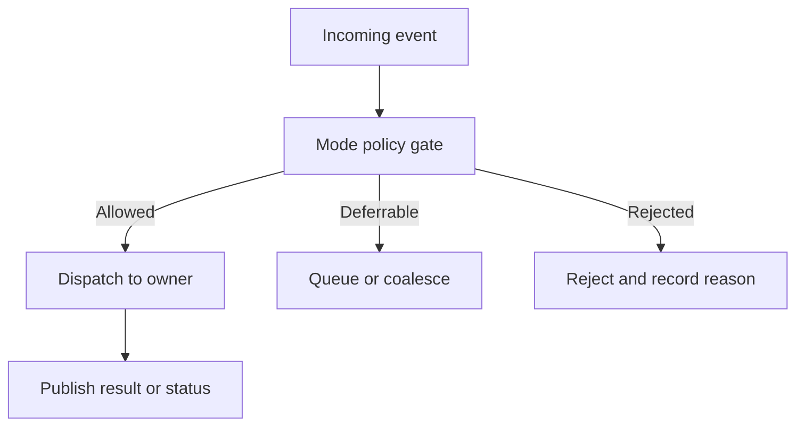

# 07 — Operating Modes

**Dự án:** Smart Water Flow and Pressure Monitor
**Tên viết tắt:** SWFPM
**Nhóm tài liệu:** `1.docs/00_overview`
**Cấp tài liệu:** Hành vi vận hành theo mode
**Trạng thái:** Baseline đã định nghĩa

---

## 1. Mục tiêu

Tài liệu này định nghĩa hành vi quan sát được của hệ thống trong từng `SystemMode` đã chốt tại `06_system_fsm.md`.

Mục tiêu cụ thể:

* Chuyển semantics của FSM thành operating contract cho firmware.
* Xác định service nào được chạy, giới hạn, tạm dừng hoặc từ chối trong từng mode.
* Xác định hành vi của measurement, leak detection, BLE, 4G, LCD, storage và time service.
* Chốt entry behavior, steady-state behavior và exit readiness của từng mode.
* Mô tả các tổ hợp giữa `SystemMode` và status trực giao.
* Làm nguồn cho firmware scheduling, error handling và system test.

Tài liệu này trả lời câu hỏi **hệ thống được phép làm gì trong một mode**. Tài liệu `06_system_fsm.md` trả lời câu hỏi **khi nào và vì sao hệ thống đổi mode**.

---

## 2. Phạm vi

### 2.1. Nội dung thuộc phạm vi

```text
INIT operating behavior
NORMAL operating behavior
LOW_POWER operating behavior
SERVICE operating behavior
RECOVERY operating behavior
ERROR operating behavior
Service availability by mode
Mode-specific event policy
Mode-specific data publication
Orthogonal-status combinations
Entry and exit readiness
Operating-mode requirements
Mode-oriented validation scenarios
```

### 2.2. Nội dung ngoài phạm vi

```text
SystemMode transition-table definition
Exact SPI/I2C/UART transaction sequence
MAX35103 register configuration
ZSSC3241 register configuration
BLE protocol frame format
4G modem AT-command FSM
Server payload schema
Exact low-power hardware state
Exact RTOS task/thread mapping
Detailed fault severity matrix
Detailed retry/backoff and offline queue policy
```

Các nội dung ngoài phạm vi được định nghĩa ở tài liệu hardware, driver, protocol, firmware hoặc policy tương ứng.

---

## 3. Tài liệu liên quan

| Nội dung                      | Tài liệu nguồn                            |
| ----------------------------- | ----------------------------------------- |
| System baseline               | `README.md`                               |
| Canonical terminology         | `glossary.md`                             |
| Operating principles          | `03_operating_principle.md`               |
| Event/action flow             | `04_main_operation_flow.md`               |
| Participant ordering          | `05_sequence_diagrams.md`                 |
| SystemMode và transition      | `06_system_fsm.md`                        |
| Data ownership và flow        | `08_data_flow.md`                         |
| Fault severity và recovery    | `09_error_handling_overview.md`           |
| Interface ownership           | `10_system_interfaces.md`                 |
| Firmware mapping              | `11_firmware_implication.md`              |
| Reporting/connectivity policy | `13_reporting_and_connectivity_policy.md` |

Nếu có xung đột, tập mode và transition trong `06_system_fsm.md` là nguồn chuẩn cho FSM; tài liệu này là nguồn chuẩn cho quyền hoạt động của service trong từng mode.

---

## 4. Operating-mode model

Baseline permission áp dụng cho mọi mode:

* `NORMAL`, `LOW_POWER` và bounded `RECOVERY` chỉ dùng MAX35103 `EVENT_TIMING` cho production acquisition.
* `DIRECT` chỉ được mở trong authorized `SERVICE` cho calibration/diagnostic; kết quả không update volume, leak evidence hoặc production telemetry.
* Measurement period theo từng stream là configurable và deadline dùng monotonic time.
* Production pressure dùng ZSSC3241 Sleep Mode one-shot; Cyclic Mode không thuộc MVP và Command Mode chỉ dùng trong authorized service/calibration.
* Result admission dùng canonical validity/freshness/acceptance/reason flags; pressure trend chỉ publish diagnostics/supporting evidence.
* Leak profile là versioned config; apply thành công reset evidence cũ.
* MVP chỉ phát telemetry theo scheduled slot; leak transition chỉ cập nhật local runtime view/diagnostics.

### 4.1. Primary mode

Tại một thời điểm chỉ có một primary `SystemMode`:

```text
INIT
NORMAL
LOW_POWER
SERVICE
RECOVERY
ERROR
```

### 4.2. Orthogonal status

Các status sau không thay thế `SystemMode`:

```text
ConnectivityStatus
TimeStatus
MeasurementStatus
StorageStatus
LeakState
ReportingStatus
PowerStatus
```

Ví dụ:

```text
SystemMode         = NORMAL
ConnectivityStatus = OFFLINE
TimeStatus         = VALID
MeasurementStatus  = DEGRADED
LeakState           = SUSPECTED
```

Tổ hợp trên có nghĩa thiết bị vẫn vận hành bình thường ở cấp hệ thống, nhưng 4G đang offline và chất lượng measurement bị suy giảm.

### 4.3. Internal phase

Các trạng thái như `WAIT_MAX_RESULT`, `PRESSURE_READ`, `BLE_PARSE`, `MODEM_REGISTER` hoặc `STORAGE_VERIFY` là internal phase của service. Chúng không được publish như `SystemMode`.

---

## 5. Baseline vận hành

Các quyết định sau áp dụng cho toàn bộ tài liệu:

1. Flow và temperature được đo qua MAX35103.
2. Pressure acquisition dùng ZSSC3241 qua I2C; pressure bridge cụ thể được chọn bởi firmware variant theo `DEC-HW-001`, với per-device calibration và bounded runtime configuration.
3. BLE dùng UART và phục vụ local configuration/service operation được cấp quyền.
4. 4G dùng UART và phục vụ time synchronization cùng telemetry delivery.
5. Hệ thống có hai reporting window cấu hình được; chúng không cố định là ngày và đêm.
6. Nguồn time từ 4G/server có độ ưu tiên cao nhất trong baseline hiện tại.
7. STM32 HAL time là platform timekeeping interface; MAX35103 có clock/event-timing domain riêng.
8. Mất 4G không làm dừng measurement, leak detection, LCD hoặc BLE configuration.
9. Retry, backoff, queue capacity và server ACK vẫn là policy cần xem xét.
10. Model cụ thể của BLE, 4G và LCD có thể tiếp tục là TBD mà không chặn operating-mode baseline. Pressure sensor model được bind theo firmware variant; một variant chưa qualify không được dùng cho accepted production pressure.

---

## 6. Phân loại service

Để xác định quyền hoạt động theo mode, logical service được chia thành năm nhóm.

| Nhóm            | Ý nghĩa                                             | Ví dụ                                                        |
| --------------- | --------------------------------------------------- | ------------------------------------------------------------ |
| `CORE`          | Cần cho tính toàn vẹn nền tảng hoặc dữ liệu cốt lõi | `SystemModeManager`, `TimeService`, `DataRepository`         |
| `MEASUREMENT`   | Thu thập và xử lý đại lượng đo                      | MAX measurement, pressure measurement, calibration           |
| `PRODUCT`       | Tạo chức năng sản phẩm                              | Volume, leak detection, reporting scheduler, LCD             |
| `COMMUNICATION` | Giao tiếp ngoài hệ thống                            | BLE, 4G, telemetry delivery                                  |
| `SUPPORT`       | Lưu trữ, diagnostic và recovery                     | `StorageService`, `DiagnosticsService`, recovery coordinator |

Phân loại này mô tả vai trò, không bắt buộc map một-một sang RTOS task.

---

## 7. Quy ước quyền hoạt động

| Ký hiệu           | Ý nghĩa                                                                        |
| ----------------- | ------------------------------------------------------------------------------ |
| `ACTIVE`          | Service chạy theo normal policy.                                               |
| `LIMITED`         | Chỉ chạy tập operation được mode cho phép.                                     |
| `QUIESCED`        | Không nhận work mới; work hiện tại đã kết thúc hoặc được đưa về safe boundary. |
| `WAKE_ONLY`       | Không active runtime; chỉ phần cứng/wake detector cần thiết còn hoạt động.     |
| `DIAGNOSTIC_ONLY` | Chỉ cho phép read/diagnostic hoặc recovery operation đã cấp quyền.             |
| `DISABLED`        | Không được chạy trong mode.                                                    |

`LIMITED` phải được cụ thể hóa bằng policy; không được hiểu là firmware có thể tùy ý chạy mọi command.

---

## 8. Global operating rules

Các quy tắc sau áp dụng trong mọi mode:

* Mọi thay đổi `SystemMode` đi qua `SystemModeManager`.
* Mỗi data object có đúng một owner chịu trách nhiệm update.
* Invalid data không được thay bằng giá trị zero hợp lệ.
* Duration, timeout và recovery limit dùng monotonic time.
* Wall-clock chỉ dùng khi cần calendar time, reporting window hoặc timestamp bên ngoài.
* Storage atomic commit không bị cắt giữa chừng bởi mode transition thông thường.
* Critical event có quyền ưu tiên hơn measurement, report và local configuration.
* Service không được feed watchdog nếu progress condition của service đó chưa đạt.
* Mode transition phải được publish sau khi entry action thiết yếu hoàn tất.
* Chưa có ACK không được coi telemetry đã được server xác nhận.

---

## 9. Event admission theo mode

Mọi event trước khi được dispatch phải qua mode gate.



Mode gate không thay thế guard của service. Event có thể được mode cho phép nhưng vẫn bị service từ chối do dữ liệu, authorization hoặc resource state không hợp lệ.

---

## 10. Mode `INIT`

### 10.1. Mục đích

`INIT` đưa platform và các subsystem về một baseline có thể đánh giá được sau reset hoặc controlled reinitialization.

### 10.2. Entry behavior

```text
Capture reset reason
Set SystemMode = INIT
Initialize monotonic time base
Initialize essential HAL/platform resources
Clear volatile operation context
Begin persistent restore and self-check
```

Vào `INIT` không được tự động xóa config, calibration, accumulated volume hoặc diagnostic history hợp lệ.

### 10.3. Trình tự vận hành

Trình tự logic đề xuất:

1. Platform và clock nền tảng.
2. Storage access.
3. Persistent-record restore và validation.
4. Time-service restore.
5. Measurement interface initialization.
6. BLE/4G/LCD initialization theo dependency.
7. Self-check.
8. Readiness evaluation.

Trình tự này là dependency order, không bắt buộc tất cả operation phải blocking hoặc chạy trong một task.

### 10.4. Service policy

| Service domain      | Policy trong `INIT`                                               |
| ------------------- | ----------------------------------------------------------------- |
| `SystemModeManager` | `ACTIVE`                                                          |
| Monotonic time/HAL  | `ACTIVE`                                                          |
| `StorageService`    | `ACTIVE` cho restore/validation                                   |
| `ConfigRepository`  | `LIMITED` cho load/default/fallback                               |
| Measurement         | `LIMITED` cho init/self-check; chưa publish normal result         |
| Leak detection      | `DISABLED` đến khi có input readiness                             |
| Reporting           | `DISABLED` đến khi time/config ready                              |
| BLE                 | `LIMITED` hoặc `DISABLED` tùy boot policy                         |
| 4G                  | `LIMITED` cho init/time acquisition nếu không chặn core readiness |
| LCD                 | `LIMITED` cho boot/readiness indication                           |
| Diagnostics         | `ACTIVE`                                                          |

### 10.5. Data publication

Trong `INIT`, hệ thống có thể publish:

```text
Boot progress
Reset reason
Configuration validity
Subsystem readiness
Time validity
Initialization fault
```

Không publish measurement mới như dữ liệu runtime hợp lệ trước khi acquisition và validation hoàn tất. Giá trị được restore phải có cờ `RESTORED` hoặc metadata tương đương nếu consumer có thể nhầm với sample fresh.

### 10.6. Readiness phân tầng

Readiness nên tách:

| Readiness                | Điều kiện tối thiểu                                                                                                           |
| ------------------------ | ----------------------------------------------------------------------------------------------------------------------------- |
| `PLATFORM_READY`         | MCU, monotonic time và event processing hoạt động                                                                             |
| `DATA_READY`             | Persistent record đã load hoặc fallback hợp lệ                                                                                |
| `CORE_MEASUREMENT_READY` | Flow path đã khởi tạo thành công và tạo được ít nhất một valid self-check hoặc measurement result trong boot session hiện tại |
| `TIME_READY`             | Time source đã khởi tạo; có thể `VALID` hoặc `INVALID` rõ ràng                                                                |
| `COMM_READY`             | BLE/4G driver đã đánh giá readiness, không nhất thiết online                                                                  |
| `SYSTEM_READY`           | Điều kiện cho `EVT_INIT_COMPLETED` đạt                                                                                        |

4G online và LCD available không mặc định là điều kiện bắt buộc của `SYSTEM_READY`.

Pressure, BLE, 4G và LCD readiness không thay thế flow readiness. Nếu flow path chưa đạt `CORE_MEASUREMENT_READY`, production boot không được chuyển sang `NORMAL`.

### 10.7. Exit readiness

* Sang `NORMAL` khi core readiness đạt và không còn critical init fault.
* Sang `SERVICE` khi boot-service request hợp lệ và service environment sẵn sàng.
* Sang `RECOVERY` khi lỗi có thể phục hồi cần điều phối cấp hệ thống.
* Sang `ERROR` khi platform/data integrity không có safe fallback.

---

## 11. Mode `NORMAL`

### 11.1. Mục đích

`NORMAL` là mode vận hành sản phẩm thông thường. Các service chạy event-driven và độc lập trong giới hạn data ownership, scheduling và resource arbitration.

### 11.2. Service policy

| Service domain                     | Policy trong `NORMAL`                                |
| ---------------------------------- | ---------------------------------------------------- |
| System/time/config/data repository | `ACTIVE`                                             |
| Flow/temperature measurement       | `ACTIVE`                                             |
| Pressure measurement               | `ACTIVE` hoặc degraded theo status                   |
| Volume accumulation                | `ACTIVE` khi flow result hợp lệ                      |
| Leak detection                     | `ACTIVE` khi evidence đủ; degrade khi input thiếu    |
| LCD                                | `ACTIVE` nếu available                               |
| BLE configuration                  | `ACTIVE` theo authorization/config policy            |
| Reporting scheduler                | `ACTIVE` khi schedule evaluable                      |
| 4G delivery                        | `ACTIVE` theo connectivity; không blocking core work |
| Storage                            | `ACTIVE` theo commit/checkpoint policy               |
| Diagnostics/local recovery         | `ACTIVE`                                             |

### 11.3. Normal operation loop

```text
Wait/receive event
  -> apply event priority
  -> pass mode gate
  -> dispatch to owner service
  -> validate/process result
  -> update owned data object
  -> publish event or RuntimeSnapshot
  -> evaluate pending work and low-power eligibility
```

Đây là logical loop; firmware có thể triển khai bằng super-loop, cooperative scheduler hoặc RTOS.

### 11.4. Measurement behavior

Trong `NORMAL`:

* MAX35103 measurement và ZSSC3241 pressure measurement được lập lịch độc lập.
* Measurement không bị chặn bởi 4G transmission dài.
* Result phải mang quality, timestamp và sequence/version.
* Volume chỉ tích lũy từ flow result hợp lệ theo policy.
* Leak evaluation dùng evidence hợp lệ; pressure missing làm giảm confidence chứ không tự động tạo leak.
* Sample stale/invalid phải được phản ánh vào `MeasurementStatus` và `RuntimeSnapshot`.
* Flow fault tạm thời giữ `SystemMode=NORMAL` với measurement/flow status `DEGRADED` trong bounded local recovery.
* Trong thời gian flow degraded, volume không update và leak evaluation không nhận valid flow-dependent evidence; pressure, BLE, 4G và LCD tiếp tục nếu không bị ảnh hưởng.

### 11.5. Reporting behavior

* `TimeService` cung cấp local time/validity; `ReportingScheduler` chọn reporting window dựa trên local time và config active.
* STM32 RTC được dùng giữa các lần server sync; `max_time_sync_age` mặc định 7 ngày và cấu hình được.
* Khi time invalid hoặc sync age đạt ngưỡng, scheduled reporting dùng `DEFER_UNTIL_VALID`; measurement và primary `SystemMode` không bị dừng chỉ vì condition này.
* Khi `EVT_REPORT_DUE`, telemetry record được tạo từ snapshot/version xác định.
* Delivery chạy tách khỏi record generation.
* Nếu 4G offline, `SystemMode` vẫn là `NORMAL`.
* Offline queue, retry, backoff và ACK dùng policy riêng; không được tự suy đoán trong mode implementation.

### 11.6. BLE behavior

BLE có thể:

```text
Read status/configuration
Submit validated configuration update
Configure two reporting windows and intervals
Initiate permitted diagnostic/service request
Receive explicit apply/reject response
```

Configuration update không được ghi thẳng vào active config. Nó phải qua parse, semantic validation, persistent commit và controlled apply.

### 11.7. Local fault behavior

Một peripheral fault không mặc định làm rời `NORMAL`.

```text
Fault detected
  -> mark affected status degraded/failed
  -> attempt bounded local recovery
  -> preserve unaffected services
  -> escalate only when shared or critical criteria are met
```

Riêng flow là core dependency: local flow recovery hết budget phải phát `EVT_SYSTEM_RECOVERY_REQUIRED`. Không giữ `NORMAL` degraded vô thời hạn khi core flow operation đã mất.

### 11.8. Exit readiness

* Chỉ vào `LOW_POWER` tại safe boundary và không có blocker.
* Chỉ vào `SERVICE` khi request được cấp quyền và current work đã an toàn.
* Vào `RECOVERY` khi local recovery không đủ hoặc shared state cần điều phối.
* Vào `ERROR` khi critical invariant hoặc safety/data-integrity condition bị phá vỡ.

---

## 12. `NORMAL` với connectivity status khác nhau

| ConnectivityStatus | Hành vi measurement | Hành vi telemetry                            | Hành vi BLE/LCD        |
| ------------------ | ------------------- | -------------------------------------------- | ---------------------- |
| `NOT_READY`        | Tiếp tục            | Chưa gửi; chờ connectivity init              | Tiếp tục nếu available |
| `CONNECTING`       | Tiếp tục            | Record có thể tạo; delivery chờ/đang connect | Tiếp tục               |
| `ONLINE`           | Tiếp tục            | Gửi theo delivery policy                     | Tiếp tục               |
| `DEGRADED`         | Tiếp tục            | Gửi có thể chậm/thất bại; ghi diagnostic     | Tiếp tục               |
| `OFFLINE`          | Tiếp tục            | Áp dụng offline policy TBD                   | Tiếp tục               |

`OFFLINE` không được dùng làm lý do reset modem liên tục, block event loop hoặc dừng leak detection.

---

## 13. `NORMAL` với time status khác nhau

| TimeStatus  | Measurement                     | Reporting schedule                                     | Telemetry timestamp           |
| ----------- | ------------------------------- | ------------------------------------------------------ | ----------------------------- |
| `VALID`     | Monotonic + wall-clock metadata | Đánh giá bình thường                                   | Valid wall-clock timestamp    |
| `ESTIMATED` | Tiếp tục                        | Theo policy cho estimated time                         | Đánh dấu estimated            |
| `INVALID`   | Tiếp tục bằng monotonic time    | Không giả định window; defer hoặc fallback theo policy | Đánh dấu invalid/unknown      |
| `SYNCING`   | Tiếp tục                        | Giữ schedule state nhất quán                           | Dùng current quality metadata |

Time invalid không làm mất sample. Tuy nhiên hệ thống không được gắn timestamp wall-clock giả cho sample hoặc telemetry.

---

## 14. Mode `LOW_POWER`

### 14.1. Mục đích

`LOW_POWER` giảm tiêu thụ năng lượng khi không có work cần CPU hoạt động ngay, đồng thời giữ khả năng wake đúng theo product requirement.

### 14.2. Entry prerequisites

Tối thiểu phải đạt:

```text
No measurement transaction at unsafe phase
No unread critical sensor result
No storage atomic commit in progress
No BLE response at unsafe interruption point
No 4G transaction at unsafe interruption point
Wake source configured and verified
Pending critical event = none
```

### 14.3. Entry behavior

1. Chặn admission của work không khẩn cấp mới.
2. Hoàn tất, hủy an toàn hoặc defer work đang chạy theo owner policy.
3. Chụp `PowerContext` và pending deadlines.
4. Chọn earliest required wake deadline.
5. Program STM32 RTC alarm hoặc wake source phù hợp.
6. Cấu hình MAX35103 event timing nếu product sử dụng chức năng này.
7. Quiesce UART, I2C, SPI, LCD và modem theo hardware capability.
8. Publish mode transition trước khi CPU vào hardware low-power state nếu logging path cho phép.

### 14.4. Service policy

| Service domain                  | Policy trong `LOW_POWER`                              |
| ------------------------------- | ----------------------------------------------------- |
| CPU event processing            | `QUIESCED`                                            |
| STM32 RTC/wake controller       | `WAKE_ONLY`                                           |
| MAX35103 event/interrupt source | `WAKE_ONLY` nếu được cấu hình                         |
| BLE UART                        | `WAKE_ONLY` hoặc `DISABLED`, TBD theo module/hardware |
| 4G UART/modem                   | `WAKE_ONLY` hoặc `DISABLED`, TBD theo policy          |
| Measurement processing          | `QUIESCED`                                            |
| Storage commit                  | `QUIESCED`                                            |
| LCD                             | `DISABLED` hoặc retained display tùy phần cứng        |
| Diagnostics                     | Chỉ wake reason capture                               |

### 14.5. Wake sources

Wake source có thể gồm:

```text
STM32 RTC alarm
MAX35103 interrupt/event
BLE UART/GPIO wake
4G UART/GPIO wake
External service input
Power supervision event
Watchdog/reset
```

Wake capability cụ thể phải được xác nhận trong hardware document; tài liệu overview chỉ định logical requirement.

### 14.6. Wake behavior

```text
Capture all asserted wake reasons
Restore essential clock/peripheral state
Validate monotonic/time continuity
Set SystemMode = NORMAL or SERVICE through FSM
Re-arm event processing
Dispatch wake reasons by priority
Re-evaluate stale data and deadlines
```

Nếu RTC alarm và MAX interrupt cùng xuất hiện, cả hai reason phải được giữ; xử lý một reason không được làm mất reason còn lại.

### 14.7. Reporting khi ngủ

* Reporting deadline phải tham gia lựa chọn wake time.
* Khi wake muộn, scheduler áp dụng `SKIP_TO_NEXT`: bỏ mọi slot đã quá hạn và chỉ arm slot hợp lệ tiếp theo trong tương lai.
* Wall-clock adjustment không được làm duration sleep hoặc timeout âm.
* Stable report-slot identity phải ngăn duplicate; không tạo catch-up record cho slot đã bỏ qua.

### 14.8. Exit

* Wake hợp lệ thông thường dẫn tới `NORMAL`.
* Authorized service wake có thể dẫn tới `SERVICE`.
* Critical wake/platform fault dẫn tới `ERROR`.

---

## 15. Mode `SERVICE`

### 15.1. Mục đích

`SERVICE` cung cấp môi trường có kiểm soát cho factory calibration, commissioning, diagnostics và maintenance operation được sản phẩm cho phép.

### 15.2. Service session

Mỗi lần vào `SERVICE` phải có `ServiceSession` tối thiểu gồm:

```text
session_id
entry_source
authorization_level
allowed_operations
start_monotonic_time
timeout
source_mode
pending_change_set
audit/diagnostic context
```

Exact authentication mechanism vẫn là TBD, nhưng không được mặc định mọi BLE connection đều có quyền service.

### 15.3. Service profile đề xuất

| Profile         | Mục đích             | Quyền điển hình                                       |
| --------------- | -------------------- | ----------------------------------------------------- |
| `COMMISSIONING` | Cấu hình khi lắp đặt | Device config, reporting window, connectivity profile |
| `DIAGNOSTIC`    | Kiểm tra trạng thái  | Read status, bounded test, logs/counters              |
| `CALIBRATION`   | Hiệu chuẩn           | Controlled measurement, calibration staging/commit    |
| `FACTORY`       | Bring-up sản xuất    | Hardware test theo allowlist                          |

Profile là đề xuất baseline; danh sách quyền chính thức cần tài liệu security/service riêng.

### 15.4. Entry behavior

1. Xác minh authorization và requested profile.
2. Chờ measurement/storage/communication đến safe boundary.
3. Snapshot active config và calibration references.
4. Tạo service session và timeout.
5. Quiesce production measurement scheduler và production consumer admission tại safe boundary.
6. Publish `SERVICE` mode cùng entry reason.

### 15.5. Service policy

| Service domain                  | Policy trong `SERVICE`                                                       |
| ------------------------------- | ---------------------------------------------------------------------------- |
| Mode/config/storage owner       | `ACTIVE` nhưng có transaction control                                        |
| Production measurement          | `QUIESCED` trong baseline                                                    |
| Service/calibration measurement | `LIMITED` theo authorized profile; bounded request only                      |
| Volume accumulation             | `QUIESCED`                                                                   |
| Leak detection                  | Production state/evidence `QUIESCED`; service result không tạo product alarm |
| Reporting scheduler             | Scheduled production reporting `QUIESCED`                                    |
| 4G delivery                     | `LIMITED`; không gửi test data như production telemetry                      |
| BLE                             | `ACTIVE` theo permission allowlist                                           |
| LCD                             | `ACTIVE` cho service/status nếu available                                    |
| Diagnostics                     | `ACTIVE` và bounded                                                          |
| Low-power                       | `DISABLED` mặc định trong active session                                     |

### 15.6. Measurement trong service

Measurement service có thể chạy manual/single-shot/diagnostic mode, nhưng result phải phân biệt:

```text
PRODUCTION_SAMPLE
SERVICE_SAMPLE
CALIBRATION_SAMPLE
```

`SERVICE_SAMPLE` hoặc `CALIBRATION_SAMPLE` không được tự động:

* Cộng vào billing/accumulated production volume.
* Làm thay đổi production leak state.
* Gửi như scheduled production telemetry.

Theo `DEC-ARCH-004`, `PRODUCTION_SAMPLE` không được tạo trong `SERVICE` baseline. Service/calibration sample phải mang provenance ngay từ lúc tạo và chỉ được phân phối tới consumer được service profile cho phép. Không được đổi provenance sau xử lý để đưa sample vào production path.

### 15.7. Configuration và calibration update

Mọi thay đổi phải dùng staged transaction:

```text
Receive
  -> authorize
  -> validate
  -> stage
  -> verify
  -> commit atomically
  -> apply at safe boundary
  -> acknowledge
```

Nếu commit/apply thất bại, giữ active version trước đó hoặc chuyển recovery theo severity; không để cấu hình nửa cũ nửa mới.

### 15.8. Exit behavior

1. Dừng nhận operation mới cho session.
2. Hoàn tất hoặc rollback pending change set.
3. Verify active config/calibration.
4. Restore production scheduling và data isolation.
5. Reinitialize affected service nếu cần.
6. Yêu cầu production sample mới; không bridge service sample vào volume/leak history.
7. Đánh giá runtime readiness.
8. Close session và record exit reason.
9. Chuyển `NORMAL`, `RECOVERY` hoặc `ERROR` qua FSM.

Service timeout không được tự động apply pending data chưa commit.

---

## 16. Mode `RECOVERY`

### 16.1. Mục đích

`RECOVERY` điều phối phục hồi có giới hạn khi fault vượt phạm vi local recovery hoặc ảnh hưởng shared resource/data consistency.

### 16.2. Recovery scope

Ví dụ hợp lệ:

```text
Shared I2C/SPI/UART resource requires coordinated reset
Repeated measurement failure exceeds local limit
Configuration/profile consistency requires restore
Storage/time/platform state requires multi-service reinitialization
Power-domain restart affects multiple components
```

Một pressure sample invalid, một modem timeout hoặc một LCD refresh failure không tự động yêu cầu `RECOVERY` cấp hệ thống.

### 16.3. Recovery plan

Mỗi plan cần:

```text
recovery_id
fault_domain
source_mode
affected_services
unaffected_services
ordered_steps
per-step timeout
overall timeout
attempt_count and limit
success criteria
escalation criteria
rollback/fallback rule
```

### 16.4. Entry behavior

* Capture fault context và source mode.
* Dừng admission tới affected resource.
* Đưa affected service về safe boundary.
* Bảo vệ persistent/config transaction.
* Giữ unaffected service nếu an toàn và hữu ích.
* Publish `RECOVERY` cùng recovery reason.
* Start recovery plan bằng monotonic timeout.

### 16.5. Service policy

| Service domain          | Policy trong `RECOVERY`                               |
| ----------------------- | ----------------------------------------------------- |
| Recovery coordinator    | `ACTIVE`                                              |
| Affected service        | `DIAGNOSTIC_ONLY` hoặc controlled reinit              |
| Unaffected core service | `LIMITED` nếu isolation được chứng minh               |
| Measurement             | `LIMITED` hoặc `QUIESCED` theo fault domain           |
| Leak detection          | `LIMITED`; không nâng state từ evidence không tin cậy |
| BLE                     | `LIMITED` cho status/authorized recovery command      |
| 4G                      | `LIMITED` cho status nếu safe                         |
| LCD                     | `LIMITED` cho recovery indication                     |
| Storage                 | `LIMITED`; chỉ operation cần cho restore/diagnostic   |

### 16.6. Data behavior

* Data cuối cùng hợp lệ có thể được giữ nhưng phải thể hiện freshness.
* Không phát sinh synthetic measurement để che khoảng trống.
* Snapshot trong recovery phải chứa mode, recovery reason và affected status.
* Volume không tích lũy từ flow input invalid hoặc diagnostic sample.
* Leak confidence phải giảm/hold theo evidence-quality model.

### 16.7. Success và escalation

Recovery chỉ thành công khi:

* Resource/service vượt self-check sau phục hồi.
* Data ownership và active configuration nhất quán.
* Event source được re-arm đúng.
* Không còn critical pending fault trong recovered domain.
* Return-mode readiness đạt.

Với recovery do flow fault, success criteria bắt buộc có một valid flow verification result; driver init trả `OK` nhưng chưa tạo được result hợp lệ không đủ để quay lại `NORMAL`.

Không được tạo vòng lặp vô hạn `NORMAL -> RECOVERY -> NORMAL`. Khi attempt/timeout limit đạt, hệ thống phải dùng degraded-safe policy đã chốt hoặc chuyển `ERROR`.

### 16.8. Exit

* Quay lại `NORMAL` nếu source operation là normal và readiness đạt.
* Quay lại `SERVICE` nếu session còn hợp lệ và policy cho phép.
* Chuyển `ERROR` nếu recovery thất bại critical.

---

## 17. Mode `ERROR`

### 17.1. Mục đích

`ERROR` giữ hệ thống ở trạng thái hạn chế khi không thể tiếp tục product operation an toàn hoặc bảo đảm data integrity.

### 17.2. Entry behavior

```text
Latch primary error reason
Capture previous mode and monotonic timestamp
Stop unsafe/new product operations
Preserve critical data if safe
Disable unsafe scheduling path
Publish or display error status when possible
Keep bounded diagnostic/recovery path
```

Entry action không được cố checkpoint nếu chính storage path đang ở trạng thái có thể làm hỏng dữ liệu.

### 17.3. Service policy

| Service domain         | Policy trong `ERROR`                                                      |
| ---------------------- | ------------------------------------------------------------------------- |
| `SystemModeManager`    | `ACTIVE`                                                                  |
| Diagnostics            | `DIAGNOSTIC_ONLY`                                                         |
| Measurement            | `DISABLED` hoặc bounded self-test nếu safe                                |
| Volume/leak processing | `QUIESCED`                                                                |
| BLE                    | `LIMITED` cho read status/authorized recovery                             |
| 4G                     | Best-effort critical status nếu safe; không retry vô hạn                  |
| LCD                    | `LIMITED` cho stable error indication                                     |
| Storage                | Chỉ safe read/recovery operation                                          |
| Low-power              | Không dùng như controlled shutdown; brownout/reset do hardware protection |

### 17.4. Error presentation

Nếu có LCD/BLE/4G path an toàn, error status nên chứa:

```text
error_code
severity
fault_domain
first_seen and latest_seen metadata
previous_mode
recovery_allowed
diagnostic_reference
time_quality
```

Không expose secret, credential hoặc raw memory nội bộ qua diagnostic interface.

### 17.5. Exit

Không cho phép `ERROR -> NORMAL` trực tiếp.

```text
ERROR -> RECOVERY -> NORMAL or SERVICE
ERROR -> INIT through controlled reinitialization
```

Controlled reinitialization phải giữ reset/error reason để boot diagnostics có thể xác định nguyên nhân trước đó.

---

## 18. Service-availability matrix

| Logical capability   | INIT            | NORMAL                 | LOW_POWER              | SERVICE                | RECOVERY              | ERROR                |
| -------------------- | --------------- | ---------------------- | ---------------------- | ---------------------- | --------------------- | -------------------- |
| Mode/event control   | Active          | Active                 | Wake-only              | Active                 | Active                | Active               |
| Timekeeping          | Init/restore    | Active                 | Wake/retain            | Active                 | Limited               | Limited              |
| MAX flow/temperature | Init/self-check | Active                 | Wake-only/disabled     | Controlled             | Limited               | Disabled/self-test   |
| ZSSC3241 pressure    | Init/self-check | Active                 | Disabled               | Controlled             | Limited               | Disabled/self-test   |
| Volume accumulation  | Restore only    | Active                 | Quiesced               | Quiesced by default    | Limited               | Quiesced             |
| Leak detection       | Disabled        | Active/degraded        | Quiesced               | Limited/test-isolated  | Limited/hold          | Quiesced             |
| RuntimeSnapshot      | Boot status     | Active                 | Last snapshot retained | Service-marked         | Recovery-marked       | Error-marked         |
| LCD                  | Boot status     | Active                 | Off/retain             | Service status         | Recovery status       | Error status         |
| BLE configuration    | Limited         | Active                 | Wake-only/TBD          | Profile-controlled     | Recovery/status only  | Recovery/status only |
| Reporting scheduler  | Disabled        | Active                 | Alarm/wake only        | Limited                | Limited               | Disabled             |
| 4G telemetry         | Init/time only  | Active by connectivity | Disabled/wake TBD      | Limited                | Limited               | Best effort if safe  |
| Persistent storage   | Restore         | Active                 | Quiesced               | Transaction-controlled | Restore/recovery only | Safe operation only  |
| Diagnostics          | Active          | Active                 | Wake capture           | Active                 | Active                | Active/limited       |

Các ô `Limited`, `Wake-only` và `TBD` phải được cụ thể hóa khi chọn module phần cứng và policy sản phẩm.

---

## 19. Data publication theo mode

| Mode        | Runtime data được publish                          | Bắt buộc đánh dấu                           |
| ----------- | -------------------------------------------------- | ------------------------------------------- |
| `INIT`      | Boot/readiness/restored data                       | `BOOTING`, restored/fallback quality        |
| `NORMAL`    | Measurement, volume, leak, connectivity, reporting | Freshness, quality, version                 |
| `LOW_POWER` | Last snapshot hoặc sleep status                    | Snapshot age, sleep entry metadata          |
| `SERVICE`   | Service/diagnostic result                          | Session/profile, non-production source      |
| `RECOVERY`  | Recovery progress và last valid data               | Recovery reason, affected domain, staleness |
| `ERROR`     | Latched error và safe diagnostic status            | Error code/severity, previous mode          |

Consumer không được diễn giải last-known value là fresh chỉ vì value vẫn có mặt trong snapshot.

---

## 20. Storage behavior theo mode

### 20.1. General rule

Mọi persistent update đi qua `StorageService`; không service nào được bypass A/B record, CRC/version hoặc verification policy.

### 20.2. Mode policy

| Mode        | Storage operation                                |
| ----------- | ------------------------------------------------ |
| `INIT`      | Load, validate, select active record, fallback   |
| `NORMAL`    | Scheduled checkpoint và atomic config commit     |
| `LOW_POWER` | Không bắt đầu commit; storage đã ở safe state    |
| `SERVICE`   | Staged/authorized config hoặc calibration commit |
| `RECOVERY`  | Restore/repair theo bounded plan                 |
| `ERROR`     | Chỉ operation được chứng minh an toàn            |

Mode request đến trong atomic write/verify phải chờ safe boundary. Brownout có thể reset bất ngờ và không phải mode request; storage integrity phải được bảo đảm bằng commit protocol, không bằng shutdown wait.

---

## 21. Time và clock behavior theo mode

| Mode        | STM32 time/HAL                   | 4G/server time              | MAX35103 clock/event timing          |
| ----------- | -------------------------------- | --------------------------- | ------------------------------------ |
| `INIT`      | Khởi tạo/restore                 | Có thể acquire/sync         | Init và đánh giá availability        |
| `NORMAL`    | System timekeeping               | Nguồn sync ưu tiên cao nhất | Measurement/event timing theo config |
| `LOW_POWER` | RTC/wake source                  | Thường inactive             | Có thể là wake/event source          |
| `SERVICE`   | Active                           | Tùy profile                 | Có thể inspect/config có kiểm soát   |
| `RECOVERY`  | Monotonic timeout bắt buộc       | Limited                     | Reinitialize khi thuộc fault domain  |
| `ERROR`     | Giữ duration/diagnostic nếu safe | Best effort                 | Không dùng nếu unsafe/untrusted      |

MAX35103 clock không mặc định là authoritative wall-clock cho reporting. Việc map event timing của MAX với system timestamp phải đi qua `TimeService`/measurement metadata đã định nghĩa.

---

## 22. LCD behavior theo mode

LCD là consumer của published state, không sở hữu measurement hoặc system mode.

| Mode        | Nội dung ưu tiên                                                   |
| ----------- | ------------------------------------------------------------------ |
| `INIT`      | Boot progress, readiness hoặc init fault                           |
| `NORMAL`    | Flow, pressure, temperature, volume, leak/connectivity/time status |
| `LOW_POWER` | Off, retained frame hoặc low-power icon theo hardware policy       |
| `SERVICE`   | Service profile/session và diagnostic result                       |
| `RECOVERY`  | Recovery status và affected domain                                 |
| `ERROR`     | Stable error code/status                                           |

LCD lỗi không mặc định làm hệ thống rời `NORMAL`.

---

## 23. BLE behavior theo mode

| Mode        | BLE operation mặc định                              |
| ----------- | --------------------------------------------------- |
| `INIT`      | Boot advertisement/status hoặc disabled, tùy policy |
| `NORMAL`    | Read/configuration request đã validate              |
| `LOW_POWER` | Wake-only hoặc disabled tùy UART/GPIO capability    |
| `SERVICE`   | Authorized commands theo profile                    |
| `RECOVERY`  | Status và bounded recovery command                  |
| `ERROR`     | Read error và authorized recovery/reinit command    |

BLE parser state không được dùng để thay đổi trực tiếp `SystemMode`; parser tạo event và FSM quyết định transition.

---

## 24. 4G behavior theo mode

| Mode        | 4G operation mặc định                                        |
| ----------- | ------------------------------------------------------------ |
| `INIT`      | Modem init và time acquisition, không chặn core boot vô hạn  |
| `NORMAL`    | Connectivity management, time sync, scheduled telemetry      |
| `LOW_POWER` | Quiesced/power-down/wake-only tùy module policy              |
| `SERVICE`   | Limited diagnostics/provisioning hoặc controlled send        |
| `RECOVERY`  | Chỉ khi modem/shared UART thuộc hoặc không cản recovery plan |
| `ERROR`     | Best-effort error status nếu operation an toàn               |

Modem command loop phải bounded. Mất network không được tạo tight retry loop hoặc chiếm độc quyền UART/event processing.

---

## 25. Leak-state behavior theo mode

`LeakState` chạy trực giao với `SystemMode` nhưng quyền đánh giá thay đổi theo mode.

| Mode        | Leak behavior                                                               |
| ----------- | --------------------------------------------------------------------------- |
| `INIT`      | Restore state/history nếu có; chưa đánh giá từ data chưa ready              |
| `NORMAL`    | Evaluate theo baseline algorithm và evidence quality                        |
| `LOW_POWER` | Giữ state; đánh giá sau wake khi data mới hợp lệ                            |
| `SERVICE`   | Production state giữ/isolated; test evidence không làm đổi production state |
| `RECOVERY`  | Hold hoặc giảm confidence; không confirm từ evidence degraded               |
| `ERROR`     | Giữ last known state với stale/error metadata                               |

`SystemMode.NORMAL` và `LeakState.NORMAL` là hai enum khác nhau, dù cùng dùng từ `NORMAL`.

---

## 26. Concurrent-event policy theo mode

### 26.1. Priority baseline

```text
Critical power/platform fault
SystemMode transition and recovery event
Unread sensor/result deadline
Storage atomic-step completion
BLE response safety point
Reporting/connectivity work
LCD refresh and background diagnostics
```

### 26.2. Ví dụ

| Current mode | Event đồng thời                          | Hành vi                                                   |
| ------------ | ---------------------------------------- | --------------------------------------------------------- |
| `NORMAL`     | MAX result + 4G TX complete              | Đọc sensor deadline trước; sau đó xử lý TX result         |
| `NORMAL`     | BLE config + storage busy                | Validate request; queue/reject commit theo storage policy |
| `NORMAL`     | Low-power request + report due           | Không sleep cho đến khi deadline được xử lý/defer an toàn |
| `LOW_POWER`  | RTC alarm + MAX interrupt                | Capture cả hai wake reason; dispatch theo priority        |
| `SERVICE`    | Exit request + atomic calibration commit | Chờ commit/rollback safe boundary                         |
| `RECOVERY`   | Normal report due + recovery step        | Recovery sở hữu affected resource; report defer/limited   |
| `ERROR`      | Normal measurement due                   | Reject/defer; không khởi chạy product measurement         |

---

## 27. Mode entry/exit checklist

### 27.1. Checklist chung trước transition

* Transition event và reason đã xác định.
* Guard đã đánh giá từ context nhất quán.
* Atomic resource owner đã được hỏi safe boundary.
* Pending result/interrupt có nguy cơ mất đã được capture.
* Previous mode và monotonic timestamp đã lưu.

### 27.2. Checklist sau entry

* `current_mode` update đúng một lần.
* Mode sequence/version tăng đúng một lần.
* Required entry action hoàn tất hoặc fault được escalate.
* Service admission policy mới đã có hiệu lực.
* Snapshot/status đã publish nhất quán.
* Watchdog progress contract đã đổi theo mode mới.

### 27.3. Checklist trước exit

* Exit criteria đạt.
* Pending mode-owned transaction đã hoàn tất/rollback/defer an toàn.
* Temporary permission/session không rò sang mode sau.
* Wake/recovery/service context được lưu hoặc xóa đúng lifecycle.

---

## 28. Watchdog và reset behavior

### 28.1. Watchdog progress theo mode

| Mode        | Progress condition ví dụ                                           |
| ----------- | ------------------------------------------------------------------ |
| `INIT`      | Init phase tiến triển trong timeout                                |
| `NORMAL`    | Event loop và critical service heartbeat tiến triển                |
| `LOW_POWER` | Hardware watchdog được cấu hình tương thích sleep policy           |
| `SERVICE`   | Session command/timeout manager không bị treo                      |
| `RECOVERY`  | Recovery step tiến triển và nằm trong attempt limit                |
| `ERROR`     | Diagnostic/error loop còn phản hồi hoặc reset policy được thực thi |

### 28.2. Sau reset

Mọi reset quay lại `INIT`. Firmware phải giữ reset reason và, nếu an toàn, previous mode/recovery reason. Không restore trực tiếp `NORMAL`, `SERVICE` hoặc `RECOVERY` chỉ từ persisted mode value.

Theo `DEC-PWR-002`, brownout reset cũng tuân theo rule này. Không có `SHUTDOWN` mode, không có emergency flush được bảo đảm và `ERROR` không phải trạng thái trung gian bắt buộc trước brownout.

---

## 29. Requirement của operating modes

| ID             | Requirement                                                                                                                                      |
| -------------- | ------------------------------------------------------------------------------------------------------------------------------------------------ |
| `REQ-MODE-001` | Tại một thời điểm hệ thống chỉ có một primary `SystemMode`.                                                                                      |
| `REQ-MODE-002` | Service admission phải được quyết định từ current mode và service guard.                                                                         |
| `REQ-MODE-003` | `INIT` không xóa persistent product data chỉ vì reset.                                                                                           |
| `REQ-MODE-004` | Optional 4G hoặc LCD failure không mặc định chặn `INIT -> NORMAL`.                                                                               |
| `REQ-MODE-005` | `NORMAL + OFFLINE` vẫn duy trì core measurement và leak processing.                                                                              |
| `REQ-MODE-006` | Measurement result phải giữ quality, freshness và source metadata trong mọi mode cho phép publish.                                               |
| `REQ-MODE-007` | `LOW_POWER` chỉ được vào khi mọi critical blocker đã clear.                                                                                      |
| `REQ-MODE-008` | Mọi asserted wake reason phải được capture trước khi dispatch.                                                                                   |
| `REQ-MODE-009` | Service/diagnostic sample không được làm thay đổi production volume hoặc leak state.                                                             |
| `REQ-MODE-010` | `SERVICE` phải có authorization, allowlist và bounded session.                                                                                   |
| `REQ-MODE-011` | Config/calibration update trong `SERVICE` phải transactional.                                                                                    |
| `REQ-MODE-012` | `RECOVERY` phải có ordered plan, timeout, attempt limit và success criteria.                                                                     |
| `REQ-MODE-013` | Unaffected service chỉ tiếp tục trong `RECOVERY` khi fault isolation được bảo đảm.                                                               |
| `REQ-MODE-014` | `ERROR` chỉ cho phép safe diagnostic, recovery hoặc controlled reinitialization.                                                                 |
| `REQ-MODE-015` | Không có transition trực tiếp `ERROR -> NORMAL`.                                                                                                 |
| `REQ-MODE-016` | Time invalid không làm mất measurement nhưng phải chặn timestamp wall-clock giả.                                                                 |
| `REQ-MODE-017` | Storage atomic operation không bị cắt bởi normal mode transition.                                                                                |
| `REQ-MODE-018` | LCD failure không mặc định làm thay đổi `SystemMode`.                                                                                            |
| `REQ-MODE-019` | 4G command/retry work không được block core event processing vô hạn.                                                                             |
| `REQ-MODE-020` | Watchdog reset phải quay lại `INIT` và giữ reset reason.                                                                                         |
| `REQ-MODE-021` | Production boot chỉ vào `NORMAL` sau khi flow path đạt `CORE_MEASUREMENT_READY` trong boot session hiện tại.                                     |
| `REQ-MODE-022` | Runtime flow fault tạm thời được giữ ở `NORMAL + DEGRADED` trong bounded local recovery; volume và valid flow-dependent leak evidence phải dừng. |
| `REQ-MODE-023` | Local flow recovery hết budget phải chuyển sang system recovery; không giữ `NORMAL` degraded vô thời hạn.                                        |
| `REQ-MODE-024` | Recovery do flow fault chỉ thành công sau một valid flow verification result.                                                                    |
| `REQ-MODE-025` | Production measurement scheduler phải `QUIESCED` trong `SERVICE` baseline.                                                                       |
| `REQ-MODE-026` | Chỉ authorized bounded `SERVICE_SAMPLE`/`CALIBRATION_SAMPLE` được phép chạy trong `SERVICE`.                                                     |
| `REQ-MODE-027` | Service/calibration sample không được update production volume, leak state/evidence hoặc scheduled production telemetry.                         |
| `REQ-MODE-028` | Sau khi thoát `SERVICE`, product state chỉ resume từ production sample mới.                                                                      |
| `REQ-MODE-029` | Baseline không có controlled `SHUTDOWN` mode hoặc power-off sequence.                                                                            |
| `REQ-MODE-030` | Brownout/reset từ mọi mode phải quay về `INIT` và không restore trực tiếp previous mode.                                                         |
| `REQ-MODE-031` | Firmware không được giả định đủ thời gian/năng lượng để checkpoint khi power critical.                                                           |

---

## 30. Traceability

### 30.1. Từ FSM

| FSM artifact              | Operating-mode mapping        |
| ------------------------- | ----------------------------- |
| `TR-SYS-001`–`TR-SYS-005` | `INIT` behavior và readiness  |
| `TR-SYS-010`–`TR-SYS-016` | `NORMAL` admission và exit    |
| `TR-SYS-020`–`TR-SYS-023` | Low-power entry/wake behavior |
| `TR-SYS-030`–`TR-SYS-033` | Service session lifecycle     |
| `TR-SYS-040`–`TR-SYS-044` | Coordinated recovery behavior |
| `TR-SYS-050`–`TR-SYS-053` | Error restrictions và exit    |

### 30.2. Từ sequence diagrams

| Sequence             | Mode behavior liên quan                                 |
| -------------------- | ------------------------------------------------------- |
| `SEQ-001`, `SEQ-002` | `INIT` restore, init và readiness                       |
| `SEQ-003`–`SEQ-011`  | `NORMAL` measurement/product pipeline                   |
| `SEQ-012`–`SEQ-014`  | `NORMAL` BLE config hoặc authorized `SERVICE` operation |
| `SEQ-015`, `SEQ-016` | Time/clock behavior trong `INIT`, `NORMAL`, `SERVICE`   |
| `SEQ-017`–`SEQ-020`  | Reporting và 4G trong `NORMAL`                          |
| `SEQ-021`            | Leak behavior theo mode                                 |
| `SEQ-022`, `SEQ-023` | `NORMAL <-> LOW_POWER`                                  |
| `SEQ-024`            | Storage fault, local recovery hoặc system recovery      |
| `SEQ-025`–`SEQ-027`  | Concurrent event và time-adjustment behavior            |

### 30.3. Downstream mapping

| Requirement group          | Tài liệu triển khai tiếp                  |
| -------------------------- | ----------------------------------------- |
| Service/data enable matrix | `11_firmware_implication.md`              |
| Fault severity/escalation  | `09_error_handling_overview.md`           |
| Wake-capable hardware      | Hardware/power documents                  |
| BLE authorization/profile  | BLE protocol/security documents           |
| 4G retry/offline/ACK       | `13_reporting_and_connectivity_policy.md` |
| Mode-oriented system test  | Test/validation document group            |

---

## 31. Kế hoạch kiểm thử

### 31.1. Mode-entry test

Với từng mode:

```text
Verify entry guard
Verify previous-mode and reason capture
Verify service admission policy
Verify required entry actions
Verify published mode/version
Verify watchdog progress contract
```

### 31.2. Permission-matrix test

Mỗi capability trong bảng mục 18 cần test ít nhất:

* Operation được phép chạy thành công trong mode phù hợp.
* Operation bị từ chối với reason ổn định trong mode cấm.
* `LIMITED` chỉ cho phép allowlist.
* Deferred event không bị mất hoặc lặp side effect.

### 31.3. Scenario test

```text
Boot với config hợp lệ và 4G offline
Boot với LCD unavailable
Boot flow path chưa ready và không phát INIT_COMPLETED
Boot flow recovery tạo valid verification result
Normal measurement trong lúc modem reconnect
Runtime flow fault giữ NORMAL + DEGRADED trong local recovery
Local flow recovery hết budget và chuyển RECOVERY
Time invalid nhưng measurement vẫn chạy
Low-power request bị chặn bởi storage commit
Wake đồng thời từ RTC và MAX35103
Authorized service calibration session
Service sample không cộng production volume
Service timeout với pending configuration
Shared-bus recovery thành công
Recovery vượt attempt limit
Critical error với storage path unsafe
Controlled reinitialize từ ERROR
Watchdog reset từ mỗi mode
```

### 31.4. Invariant test

```text
one primary SystemMode
no production side effect from service sample
no fake wall-clock timestamp
no sleep with critical blocker
no direct ERROR to NORMAL
no infinite recovery loop
no core-measurement stop caused only by OFFLINE
```

---

## 32. Các quyết định còn mở

Đã giải quyết:

```text
OQ-MODE-001 -> DEC-ARCH-001
OQ-MODE-002 -> DEC-ARCH-001
OQ-MODE-005 -> DEC-ARCH-004
OQ-MODE-011 -> DEC-PWR-002
OQ-MODE-013 -> DEC-SCHED-001 (DEFER_UNTIL_VALID)
OQ-MODE-014 -> DEC-SCHED-002 (SKIP_TO_NEXT)
```

| ID            | Quyết định                                              | Ảnh hưởng                 |
| ------------- | ------------------------------------------------------- | ------------------------- |
| `OQ-MODE-003` | BLE có sẵn trong `INIT` hay chỉ sau `NORMAL`?           | Commissioning/boot UX     |
| `OQ-MODE-004` | Service profile và authorization mechanism cụ thể?      | `SERVICE` security        |
| `OQ-MODE-006` | STM32 low-power state cụ thể?                           | Power, wake latency       |
| `OQ-MODE-007` | BLE và 4G module có UART/GPIO wake capability nào?      | `LOW_POWER` behavior      |
| `OQ-MODE-008` | LCD off hay retained trong low-power?                   | Power/display behavior    |
| `OQ-MODE-009` | System recovery attempt/timeout limit?                  | `RECOVERY -> ERROR`       |
| `OQ-MODE-010` | Có cho degraded-safe return sau recovery failure không? | Recovery success criteria |
| `OQ-MODE-012` | Offline queue, retry, backoff, overflow và server ACK?  | `NORMAL + OFFLINE`        |

Các quyết định TBD phải được giữ dưới dạng policy/configuration point; firmware không được hard-code assumption chưa được review.

---

## 33. Tiêu chí hoàn thành

Tài liệu được xem là đủ khi:

1. Sáu primary mode có operating contract rõ ràng.
2. Service-availability matrix được review.
3. `OFFLINE` được dùng như connectivity status, không như mode.
4. Data publication và freshness behavior được chấp nhận.
5. Service sample được tách khỏi production state.
6. Low-power blocker và wake requirements thống nhất với hardware direction.
7. Recovery plan và error restriction thống nhất với tài liệu 09.
8. Requirement `REQ-MODE-*` có downstream owner.
9. Open decision blocking firmware được chốt hoặc deferred rõ ràng.
10. Mode-oriented test scenarios được đưa vào validation plan.

---

## 34. Kết luận

Operating-mode baseline của hệ thống là:

```text
INIT      -> restore, initialize and evaluate readiness
NORMAL    -> run product measurement, leak, display and reporting
LOW_POWER -> quiesce active work and wait for validated wake sources
SERVICE   -> run authorized and isolated service operations
RECOVERY  -> execute bounded coordinated recovery
ERROR     -> restrict operation to safe diagnostics and recovery
```

`SystemMode` quyết định quyền hoạt động ở cấp hệ thống; status trực giao biểu diễn connectivity, time, measurement, storage, reporting, power và leak condition. Cách tách này cho phép hệ thống tiếp tục chức năng cốt lõi khi một subsystem optional bị suy giảm, đồng thời giữ transition và safety boundary rõ ràng cho firmware.
