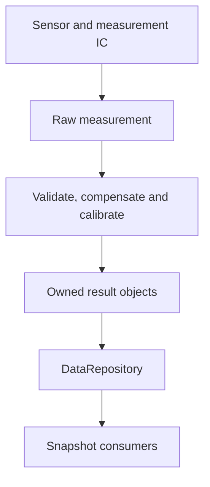
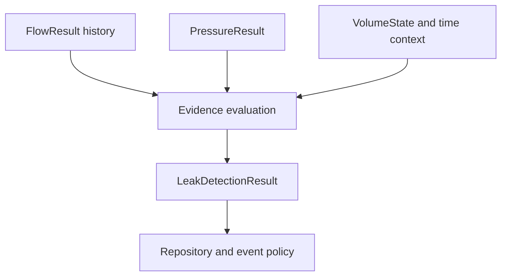
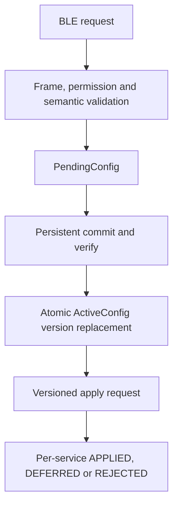
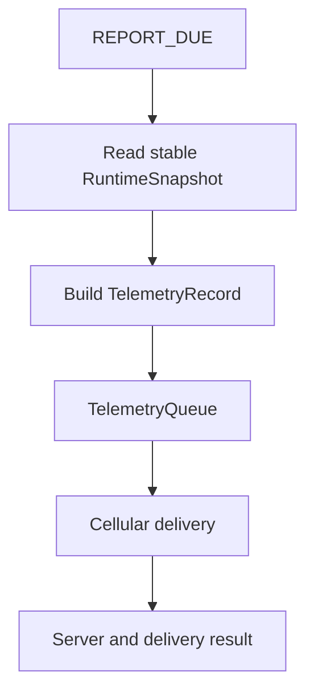

# 08 — System Data Flow

**Dự án:** Smart Water Flow and Pressure Monitor
**Tên viết tắt:** SWFPM
**Nhóm tài liệu:** `1.docs/00_overview`
**Cấp tài liệu:** Luồng dữ liệu và data ownership cấp hệ thống
**Trạng thái:** Baseline đã định nghĩa

---

## 1. Mục tiêu

Tài liệu này định nghĩa cách dữ liệu được tạo, kiểm tra, xử lý, sở hữu, publish, lưu trữ và truyền ra ngoài trong hệ thống **Smart Water Flow and Pressure Monitor**.

Mục tiêu cụ thể:

* Chốt các data object chính và owner duy nhất của từng object.
* Phân biệt raw data, processed result, runtime snapshot, persistent record và telemetry record.
* Định nghĩa metadata chung về quality, freshness, time, sequence, version và provenance.
* Mô tả measurement, configuration, telemetry, time và diagnostic data flow.
* Chốt atomicity boundary giữa producer và consumer.
* Ngăn BLE, 4G, LCD hoặc ISR truy cập trực tiếp dữ liệu ngoài ownership boundary.
* Làm baseline cho data structure, queue, repository, persistence và interface test.

Tài liệu này mô tả **dữ liệu đi đâu và ai được thay đổi dữ liệu**. Ordering chi tiết thuộc `05_sequence_diagrams.md`; quyền hoạt động theo mode thuộc `07_operating_modes.md`.

---

## 2. Phạm vi

### 2.1. Nội dung thuộc phạm vi

```text
Measurement data flow
Flow and temperature processing flow
Pressure data flow
Volume and leak-evidence flow
RuntimeSnapshot publication
LCD consumption flow
BLE configuration flow
Time synchronization data flow
Reporting and telemetry flow
Persistent-data flow
Diagnostic and status flow
Data ownership and consumer boundaries
Quality, freshness, timestamp and version metadata
Atomicity, queueing and consistency rules
Data-flow requirements and validation
```

### 2.2. Nội dung ngoài phạm vi

```text
Exact C structure layout and packing
Exact MAX35103 register/result format
Exact ZSSC3241 register/result format
BLE GATT characteristic and UART frame encoding
Telemetry JSON/CBOR/binary schema
Application protocol selection
Cryptographic algorithm and credential format
Exact F-RAM address map
Exact telemetry queue capacity
Exact retry, backoff, overflow and server-ACK policy
Database schema on remote server
```

Các field và data object trong tài liệu này là logical contract. Kích thước, alignment và wire encoding được định nghĩa ở tài liệu implementation/protocol tương ứng.

---

## 3. Tài liệu liên quan

| Nội dung                           | Tài liệu nguồn                            |
| ---------------------------------- | ----------------------------------------- |
| System baseline                    | `README.md`                               |
| Canonical data terms               | `glossary.md`                             |
| Measurement và reporting principle | `03_operating_principle.md`               |
| Event/action flow                  | `04_main_operation_flow.md`               |
| Ordering giữa participant          | `05_sequence_diagrams.md`                 |
| System FSM                         | `06_system_fsm.md`                        |
| Mode-specific permission           | `07_operating_modes.md`                   |
| Error severity/recovery            | `09_error_handling_overview.md`           |
| Physical và logical interface      | `10_system_interfaces.md`                 |
| Firmware mapping                   | `11_firmware_implication.md`              |
| Cross-document traceability        | `12_system_traceability.md`               |
| Reporting/connectivity policy      | `13_reporting_and_connectivity_policy.md` |

Nếu data owner hoặc logical interface thay đổi, phải review tối thiểu tài liệu 05, 08, 10 và 12 trước khi sửa firmware.

---

## 4. Data-layer model

Dữ liệu được phân thành sáu lớp logic.

| Layer               | Mục đích                                                | Ví dụ                                               |
| ------------------- | ------------------------------------------------------- | --------------------------------------------------- |
| `RAW`               | Dữ liệu vừa đọc từ device/driver                        | MAX result words, ZSSC3241 raw output               |
| `RESULT`            | Dữ liệu đã validate/process theo một measurement stream | `FlowResult`, `TemperatureResult`, `PressureResult` |
| `PRODUCT_STATE`     | Trạng thái tích lũy hoặc suy luận của sản phẩm          | `VolumeState`, `LeakDetectionResult`                |
| `RUNTIME_VIEW`      | Bản chụp nhất quán cho consumer                         | `RuntimeSnapshot`                                   |
| `PERSISTENT_RECORD` | Record giữ qua reset/mất nguồn                          | Config, calibration, volume checkpoint              |
| `EXTERNAL_RECORD`   | Contract gửi/nhận qua external interface                | BLE response, `TelemetryRecord`                     |

Không được sử dụng một struct duy nhất cho tất cả layer. Raw device layout, runtime layout, persistent layout và server schema có lifecycle/version khác nhau.

---

## 5. Nguyên tắc data flow

1. Mỗi mutable data object có đúng một owner.
2. Consumer nhận read-only copy/view hoặc event reference có lifecycle rõ ràng.
3. ISR chỉ capture minimal hardware event/data cần thiết; ISR không chạy product algorithm.
4. Raw data không đi trực tiếp tới LCD, telemetry hoặc leak detection.
5. Invalid data không được thay bằng zero hợp lệ.
6. Mỗi result phải mang quality và sample-time metadata.
7. Dữ liệu từ các stream khác sample time không được coi là đồng thời nếu không có pairing rule.
8. `RuntimeSnapshot` dùng double buffer và atomic active-index swap.
9. Persistent record phải có schema/version, sequence và integrity metadata.
10. Telemetry schema không phụ thuộc trực tiếp vào in-memory layout.
11. BLE module không sở hữu configuration; 4G module không sở hữu telemetry data.
12. Mode/status thay đổi phải được phản ánh bằng metadata thay vì xóa last-known value một cách mơ hồ.
13. Timeout và freshness dùng monotonic time; external timestamp dùng system wall-clock kèm time quality.
14. Duplicate event không được tạo duplicate volume increment, config commit hoặc telemetry record ngoài policy.

---

## 6. Canonical data objects

| Data object              | Layer                           | Producer                                        | Owner                        | Consumer chính                                             |
| ------------------------ | ------------------------------- | ----------------------------------------------- | ---------------------------- | ---------------------------------------------------------- |
| `MaxRawMeasurement`      | `RAW`                           | MAX driver/measurement manager                  | `MeasurementManager`         | Flow/temperature processing                                |
| `FlowPathStatus`         | Runtime status                  | `MeasurementManager`                            | `MeasurementManager`         | `SystemModeManager`, `DataRepository`, diagnostics         |
| `PressureRawMeasurement` | `RAW`                           | ZSSC3241 driver                                 | `PressureMeasurementService` | `PressureProcessingService`                                |
| `TemperatureResult`      | `RESULT`                        | `CalibrationService` từ validated raw MAX input | `CalibrationService`         | Flow compensation, repository, LCD, telemetry, diagnostics |
| `FlowResult`             | `RESULT`                        | `CalibrationService`                            | `CalibrationService`         | Volume, leak, repository                                   |
| `PressureResult`         | `RESULT`                        | `PressureProcessingService`                     | `PressureProcessingService`  | Leak, repository                                           |
| `VolumeState`            | `PRODUCT_STATE`                 | `VolumeAccumulator`                             | `VolumeAccumulator`          | Repository, storage                                        |
| `LeakDetectionResult`    | `PRODUCT_STATE`                 | `LeakDetectionService`                          | `LeakDetectionService`       | Repository, event/reporting                                |
| `RuntimeSnapshot`        | `RUNTIME_VIEW`                  | `DataRepository`                                | `DataRepository`             | LCD, telemetry, diagnostics, storage policy                |
| `DefaultConfig`          | Runtime definition              | Firmware/config definition                      | `ConfigRepository`           | Config validation/application                              |
| `PendingConfig`          | Runtime transaction             | `BleConfigService`/command path                 | `ConfigRepository`           | Validation, storage                                        |
| `ActiveConfig`           | Runtime state                   | `ConfigRepository`                              | `ConfigRepository`           | All configured services                                    |
| `ConfigurationRecord`    | `PERSISTENT_RECORD`             | `StorageService`                                | `StorageService`             | Boot restore                                               |
| `CalibrationRecord`      | `PERSISTENT_RECORD`             | `StorageService`                                | `StorageService`             | Calibration service                                        |
| `VolumeCheckpoint`       | `PERSISTENT_RECORD`             | `StorageService`                                | `StorageService`             | Volume restore                                             |
| `TimeState`              | Runtime state                   | `TimeService`                                   | `TimeService`                | Measurement, reporting, telemetry                          |
| `ReportingSchedule`      | Runtime configuration           | `ConfigRepository`                              | `ConfigRepository`           | `ReportingScheduler`                                       |
| `TelemetryRecord`        | `EXTERNAL_RECORD`               | Telemetry builder                               | Telemetry pipeline           | Queue, cellular service, server                            |
| `DeliveryResult`         | Runtime result                  | Cellular telemetry service                      | Cellular telemetry service   | Queue/status/diagnostics                                   |
| `ModeTransitionRecord`   | Diagnostic state                | `SystemModeManager`                             | `SystemModeManager`          | Repository, diagnostics                                    |
| `DiagnosticRecord`       | Diagnostic/persistent candidate | Diagnostic producer                             | `DiagnosticsService`         | BLE/service, storage, telemetry policy                     |

Owner trong bảng là logical owner. Tên module C cụ thể được quyết định tại `11_firmware_implication.md`.

---

## 7. Common result metadata

Mỗi measurement/product result nên có metadata tương đương các nhóm sau.

### 7.1. Identity và ordering

```text
source_id
sample_sequence
processing_sequence or result_version
configuration_version
calibration_version
```

* `sample_sequence` tăng theo measurement stream, không phải global system counter.
* `result_version` thay đổi khi owner publish một result mới.
* `configuration_version` cho biết config nào đã được dùng để tạo result.
* `calibration_version` cho biết calibration profile nào đã được dùng.

### 7.2. Time metadata

```text
sample_monotonic_time
completion_monotonic_time
wall_clock_timestamp
time_quality
```

`sample_monotonic_time` đại diện thời điểm đo hoặc thời điểm tham chiếu tốt nhất. `completion_monotonic_time` không được dùng thay sample time khi processing latency đáng kể.

Nếu wall-clock invalid:

```text
wall_clock_timestamp = absent/invalid by schema
time_quality = INVALID
sample_monotonic_time remains usable locally
```

### 7.3. Quality metadata

Baseline quality cần thể hiện tối thiểu:

```text
validity
freshness
source_status
processing_status
degraded_reason flags
```

Giá trị đề xuất ở cấp khái niệm:

| Field               | Ví dụ                                                  |
| ------------------- | ------------------------------------------------------ |
| `validity`          | `VALID`, `INVALID`, `UNAVAILABLE`                      |
| `freshness`         | `FRESH`, `STALE`, `UNKNOWN`                            |
| `source_status`     | `OK`, `TIMEOUT`, `CRC_ERROR`, `DEVICE_FAULT`           |
| `processing_status` | `COMPENSATED`, `UNCOMPENSATED`, `FILTERED`, `REJECTED` |

Exact enum thuộc firmware data model, nhưng semantics không được mâu thuẫn tài liệu này.

### 7.4. Provenance

Result phải phân biệt nguồn/lifecycle khi cần:

```text
LIVE_PRODUCTION
RESTORED
DEFAULTED
ESTIMATED
SERVICE_SAMPLE
CALIBRATION_SAMPLE
```

Theo `DEC-ARCH-004`, `SERVICE_SAMPLE` và `CALIBRATION_SAMPLE` không được tạo production volume, production leak state/evidence hoặc scheduled production telemetry. Production measurement scheduler được quiesce trong `SERVICE`; provenance phải được gắn khi tạo sample và không được đổi về `LIVE_PRODUCTION` ở downstream stage.

---

## 8. Measurement data flow tổng quát



Các consumer product như volume và leak detection có thể subscribe result event trực tiếp từ owner hoặc đọc stable object qua repository, nhưng không được sửa object do producer sở hữu.

---

## 9. MAX35103 raw-data flow

### 9.1. Producer boundary

MAX35103 driver chịu trách nhiệm:

```text
SPI transaction
Register/result-word access
Device status capture
INT acknowledgement according to device contract
Transport/device error reporting
```

Driver không chịu trách nhiệm tính flow, tích lũy volume hoặc đánh giá leak.

### 9.2. Raw object

`MaxRawMeasurement` tối thiểu cần biểu diễn:

```text
measurement kind
raw ToF/result words
raw temperature-related result when available
device status
capture/sample time
driver transaction status
measurement sequence
configuration reference
```

Exact register-word layout không được truyền ra ngoài driver/measurement boundary.

### 9.3. ISR boundary

MAX interrupt handler chỉ nên:

1. Capture interrupt source/time cần thiết.
2. Clear/disable source theo safe driver contract.
3. Phát `EVT_MAX_RESULT_READY` hoặc event tương đương.
4. Để normal execution context đọc đầy đủ result.

ISR không publish `FlowResult` và không cập nhật volume.

### 9.4. Invalid raw data

Khi SPI timeout, missing result, invalid device status hoặc incoherent read:

* Không tạo `FlowResult` hợp lệ từ raw data đó.
* Tăng diagnostic counter phù hợp.
* Publish quality/status change nếu consumer cần biết.
* Giữ last-known value cùng freshness tăng dần; không ghi đè bằng zero giả.
* Khởi động bounded local recovery theo error policy.

---

## 10. Temperature-result flow

### 10.1. Processing

```text
MAX raw temperature-related result
  -> MeasurementManager acquires and validates device/result status
  -> CalibrationService converts using selected measurement principle
  -> CalibrationService applies sensor curve/calibration/filtering
  -> CalibrationService assigns quality, time and version metadata
  -> CalibrationService publishes immutable TemperatureResult
```

`CalibrationService` là single writer/owner của `TemperatureResult`. `MeasurementManager` không giữ quyền sửa final result sau khi đã chuyển validated raw input. Consumer chỉ đọc result/version đã publish qua logical interface hoặc stable repository boundary.

### 10.2. Consumer

`TemperatureResult` được dùng cho:

* Flow compensation.
* `RuntimeSnapshot` và LCD.
* Telemetry khi schema yêu cầu.
* Diagnostics và calibration validation.

Temperature không mặc định là bằng chứng duy nhất để xác nhận leak.

### 10.3. Pairing với flow

Flow processing phải chọn temperature sample theo pairing rule:

```text
temperature validity is acceptable
temperature age <= configured maximum pairing age
temperature source/profile is compatible
temperature is not a service/calibration sample for production flow
```

Theo `DEC-ARCH-003`, nếu không có temperature usable thì production flow phải bị từ chối. Firmware vẫn có thể publish `FlowResult` với `INVALID` hoặc `DEGRADED_NOT_ACCEPTED` và compensation reason để phục vụ repository/diagnostics, nhưng không được dùng result đó cho volume, flow-based leak evidence hoặc valid production telemetry. Không được dùng sample stale hoặc giá trị mặc định như temperature measurement mới.

Held-temperature hoặc uncompensated fallback chỉ được bổ sung sau khi validation chứng minh error budget chấp nhận được; policy phải chỉ rõ phạm vi, maximum age, consumer permission và version.

---

## 11. Flow-result flow

### 11.1. Processing pipeline

```text
Validated MAX raw result
  -> ToF/delta processing
  -> temperature pairing/compensation
  -> zero-offset and calibration
  -> direction/range/plausibility validation
  -> FlowResult
```

### 11.2. Logical fields

`FlowResult` nên chứa tương đương:

```text
flow value and unit
direction
sample time
sample/result sequence
validity and freshness
compensation status
configuration version
calibration version
source/device status
```

Internal calculation precision có thể cao hơn telemetry/display precision.

### 11.3. Fan-out

Valid accepted `FlowResult` được phân phối tới:

| Consumer               | Mục đích                            |
| ---------------------- | ----------------------------------- |
| `VolumeAccumulator`    | Tích phân volume theo thời gian     |
| `LeakDetectionService` | Flow evidence và continuity history |
| `DataRepository`       | Publish runtime view                |
| Diagnostics            | Quality, range và fault counters    |

Consumer không được giữ mutable pointer cho phép sửa `FlowResult`.

### 11.4. Flow readiness và runtime fault

`FlowPathStatus` cần biểu diễn tối thiểu:

```text
NOT_READY
READY or ACTIVE
DEGRADED
RECOVERING
UNAVAILABLE
```

Trong production boot, `READY` chỉ được publish sau khi flow path đã khởi tạo và tạo được ít nhất một valid self-check hoặc measurement result trong boot session hiện tại. Trong runtime, fault tạm thời chuyển status sang `DEGRADED/RECOVERING`, giữ `SystemMode=NORMAL`, dừng volume và valid flow-dependent leak evidence. Hết local recovery budget tạo system-recovery escalation.

---

## 12. Pressure-data flow

### 12.1. Acquisition boundary

```text
Pressure bridge
  -> ZSSC3241 conditioning/conversion
  -> I2C driver read
  -> PressureRawMeasurement
  -> PressureProcessingService
  -> PressureResult
```

ZSSC3241 đã được chọn. Pressure bridge model, range, transfer function và accuracy vẫn là TBD; chúng phải đi vào hardware profile/calibration metadata thay vì hard-code rải rác.

### 12.2. Raw object

`PressureRawMeasurement` cần biểu diễn tối thiểu:

```text
raw output/count
device/status bits
conversion/sample time
transaction status
measurement sequence
hardware-profile reference
```

### 12.3. Processing

`PressureProcessingService` chịu trách nhiệm:

* Kiểm tra transaction/device status.
* Chuyển raw output sang engineering unit chuẩn, đề xuất Pa nội bộ.
* Áp dụng đúng một calibration/compensation path.
* Filter nếu được định nghĩa và ghi filter metadata.
* Đánh giá range, plausibility và freshness.
* Publish `PressureResult`.

Không được bù/calibrate hai lần ở ZSSC3241 profile và application layer mà không có contract rõ ràng.

### 12.4. Consumer

`PressureResult` được dùng bởi:

* `LeakDetectionService` như supporting evidence.
* `DataRepository`/LCD.
* Telemetry builder.
* Diagnostics.

Pressure invalid/stale làm leak evaluation degraded; không được tự động coi pressure bằng zero.

### 12.5. I2C transaction ownership

Theo `DEC-ARCH-005`, pressure và storage driver không sở hữu physical I2C peripheral:

```text
Zssc3241Driver / FramDriver
  -> immutable bounded I2cTransaction request
  -> I2cBusManager for selected physical instance
  -> HAL transfer
  -> correlated completion/error + recovery generation
```

Mỗi physical instance có một owner context và một serialized in-flight transaction policy. Physical mapping chung/tách bus là hardware binding; data-flow contract của `PressureMeasurementService` và `StorageService` không thay đổi.

---

## 13. Volume-state flow

### 13.1. Input guard

`VolumeAccumulator` chỉ chấp nhận `FlowResult` khi:

```text
validity accepted
freshness accepted
sample sequence not already consumed
time delta valid and bounded
provenance = LIVE_PRODUCTION
direction/policy accepted
```

### 13.2. Update

```text
Previous VolumeState
  + accepted FlowResult over valid delta time
  -> candidate accumulated volume
  -> range/overflow check
  -> new VolumeState version
  -> dirty/checkpoint policy
```

### 13.3. Duplicate protection

Owner phải lưu `last_consumed_flow_sequence` hoặc cơ chế tương đương. Retry event hoặc duplicate notification không được cộng volume lần thứ hai.

### 13.4. Persistence

`VolumeState` runtime không đồng nhất với `VolumeCheckpoint` persistent:

```text
VolumeState
  -> checkpoint trigger
  -> StorageService
  -> versioned VolumeCheckpoint
  -> verify
  -> active persistent slot
```

Exact checkpoint interval/threshold cần balancing giữa data-loss budget và storage policy.

---

## 14. Leak-evidence data flow



### 14.1. Input contract

Leak detection nhận:

```text
accepted flow samples/history
pressure result and quality
volume/change context
monotonic duration context
active leak configuration
system/mode/data-quality context
```

### 14.2. Output contract

`LeakDetectionResult` cần chứa:

```text
LeakState
severity
primary reason
supporting evidence flags
evaluation status
confidence/quality metadata
state-enter monotonic time
wall-clock time and quality when available
result version
configuration/algorithm version
```

### 14.3. State và evaluation quality

`LeakState` và evaluation quality là hai trục khác nhau. Ví dụ hợp lệ:

```text
LeakState = SUSPECTED
evaluation_status = DEGRADED
reason = CONTINUOUS_FLOW
pressure_evidence = UNAVAILABLE
```

Pressure unavailable không bắt buộc xóa state đã có, nhưng phải ảnh hưởng evidence/quality theo baseline algorithm.

### 14.4. Event generation

Chỉ owner phát `EVT_LEAK_STATE_CHANGED` khi state/version transition thỏa event policy. Snapshot refresh hoặc repeated evaluation cùng state không được mặc định tạo duplicate alarm telemetry.

---

## 15. DataRepository và RuntimeSnapshot

### 15.1. Vai trò

`DataRepository` là read boundary giữa result owner và các consumer không thuộc measurement pipeline.

Repository:

* Nhận result/status update từ owner.
* Giữ latest accepted object theo type.
* Đánh giá hoặc expose freshness metadata.
* Tạo `RuntimeSnapshot` nhất quán.
* Publish snapshot version/change event.

Repository không tự tính flow, pressure, volume hoặc leak state.

### 15.2. Snapshot content

`RuntimeSnapshot` dự kiến gồm:

```text
snapshot_schema_version
snapshot_version
publish_monotonic_time
publish_wall_clock_time and quality
SystemMode and orthogonal statuses
FlowResult
TemperatureResult
PressureResult
VolumeState
LeakDetectionResult
PowerStatus
ConnectivityStatus
ReportingStatus
active configuration version references
summary error/diagnostic flags
```

Mỗi nested result giữ sample time/quality riêng. `publish_wall_clock_time` không thay thế sensor sample time.

### 15.3. Double-buffer publication

Theo `DEC-ARCH-006`, `DataRepository` sở hữu đúng hai snapshot buffer:

```text
active_index = capture once
inactive_index = active_index XOR 1
writer builds complete snapshot in inactive buffer
writer assigns schema/version/publish metadata
writer executes required publication barrier
writer atomically swaps active_index
consumer captures active_index once and reads that immutable buffer
```

Writer không sửa active buffer. Consumer không được nhìn snapshot nửa cũ nửa mới hoặc giữ reference qua publication tiếp theo nếu lifetime contract không cho phép.

### 15.4. Publication trigger

Snapshot có thể được publish khi:

* Flow/temperature/pressure result mới được accepted.
* Volume hoặc leak state/version thay đổi.
* Connectivity/time/reporting/power status thay đổi.
* SystemMode hoặc significant error thay đổi.

Repository có thể coalesce nhiều update gần nhau nếu không làm mất event bắt buộc và vẫn giữ bounded publication latency.

### 15.5. Snapshot immutability

Sau publish, consumer chỉ đọc. LCD, telemetry builder hoặc diagnostics không được sửa nested field hoặc quality flag trong published snapshot.

---

## 16. LCD data flow

```text
RuntimeSnapshot published/change event
  -> LcdService reads stable snapshot
  -> select page/fields
  -> format and clamp display representation
  -> lcd_driver
  -> LCD hardware
```

Quy tắc:

* LCD không gọi sensor driver.
* LCD không sở hữu unit conversion dùng cho thuật toán; display conversion chỉ để trình bày.
* LCD refresh có thể coalesce và có priority thấp hơn unread sensor result.
* Display lỗi không sửa snapshot và không mặc định đổi `SystemMode`.
* Stale/invalid data phải có representation rõ ràng, không hiển thị như giá trị fresh hợp lệ.

---

## 17. Configuration data flow



### 17.1. Trust boundary

Byte nhận từ BLE là untrusted input. MCU phải kiểm tra:

```text
frame integrity and length
protocol/schema version
command identity
authorization
type and range
cross-field dependency
system/mode permission
resource and persistence feasibility
```

### 17.2. PendingConfig

`PendingConfig` là candidate transaction, không phải active state. Nó cần metadata tương đương:

```text
transaction_id
base_active_config_version
candidate schema version
changed field set
request source/session
validation result
creation monotonic time
apply policy
```

### 17.3. Commit/apply ordering

Với config cần persistence, baseline là:

```text
validate candidate
  -> create persistent record candidate
  -> write inactive slot
  -> verify integrity/content
  -> switch/select committed record
  -> atomically replace ActiveConfig
  -> send ConfigApplyRequest to affected services
  -> collect APPLIED / DEFERRED / REJECTED with matching version
  -> respond with commit result and aggregate/per-service apply status
```

Nếu commit thất bại, `ActiveConfig` và active persistent record cũ được giữ nguyên.

### 17.4. Apply-only hoặc deferred apply

Một số field có thể:

* Apply ngay tại safe boundary.
* Apply sau khi current transaction kết thúc.
* Yêu cầu service reinitialize.
* Yêu cầu controlled system reinitialize.

Field-level apply class phải được định nghĩa trong config specification; UART callback không tự quyết định.

Mỗi affected service nhận `ConfigApplyRequest` gồm `transaction_id`, `config_version` và changed-field mask, sau đó trả matching `ConfigApplyResult`:

```text
APPLIED  -> matching version active at service safe boundary
DEFERRED -> accepted, waiting for defined safe boundary; reason required
REJECTED -> cannot apply; reason required
```

`ConfigRepository` giữ per-service status và chỉ công bố fully applied khi tất cả required service đã `APPLIED`. Commit/`ActiveConfig` replacement success vẫn phải được phân biệt với runtime apply completion.

### 17.5. Response

BLE response nên tham chiếu:

```text
transaction_id
accepted/rejected status
reason code
active configuration version
pending/deferred state if applicable
```

Transport ACK không đồng nghĩa configuration đã commit/apply thành công.

---

## 18. ReportingSchedule data flow

`ReportingSchedule` gồm đúng hai window trong baseline hiện tại.

```text
BLE schedule candidate
  -> generic configuration flow
  -> new ActiveConfig version
  -> ReportingScheduler notification
  -> validate current local time/time quality
  -> recompute active window and next_report_time
  -> arm/update RTC alarm
  -> publish ReportingStatus
```

Mỗi window có start boundary và interval. End boundary của một window được suy ra từ start boundary của window còn lại trong chu kỳ 24 giờ.

Reporting schedule update không thay đổi `SystemMode`. Theo `DEC-SCHED-002`, khi apply schedule, wake muộn hoặc chỉnh wall clock làm một hay nhiều slot quá hạn, `ReportingScheduler` áp dụng `SKIP_TO_NEXT`: không tạo catch-up record và chỉ arm slot hợp lệ tiếp theo trong tương lai. Stable report-slot identity tiếp tục ngăn duplicate.

---

## 19. Time-synchronization data flow

### 19.1. Sources

Baseline hiện tại ưu tiên:

```text
4G/server time
  -> highest-priority synchronization source

STM32 RTC/system time
  -> retained platform timekeeping

MAX35103 clock/event timing
  -> measurement/event domain, not automatic reporting wall-clock authority
```

### 19.2. Sync flow

```text
Time sample from 4G/server
  -> validate source and plausibility
  -> compare with current TimeState
  -> classify step/slew/update action
  -> update STM32 RTC/system wall-clock
  -> update TimeState version and quality
  -> notify measurement/reporting/diagnostic consumers
  -> optionally align MAX35103 event timing when configured
```

### 19.3. TimeState

`TimeState` cần biểu diễn:

```text
wall-clock value
timezone/local-time configuration reference
time quality/validity
last synchronization source
last sync monotonic time
estimated uncertainty/age if supported
time-state version
```

### 19.4. Clock correction

Khi wall-clock nhảy tiến hoặc lùi:

* Monotonic durations không đổi.
* Measurement sample ordering dựa trên stream sequence/monotonic time.
* `ReportingScheduler` tính lại next report theo policy.
* Không tự động tạo record trùng chỉ vì wall-clock quay lại một slot cũ.

---

## 20. Telemetry data flow



### 20.1. Generation và delivery tách biệt

`REPORT_DUE` yêu cầu tạo record; nó không đồng nghĩa delivery thành công.

```text
Generation result != queue result != transport result != server acknowledgement
```

Mỗi bước phải có status riêng để tránh đánh dấu mất dữ liệu là thành công.

### 20.2. Snapshot selection

Telemetry builder phải đọc một stable snapshot và lưu `source_snapshot_version`. Builder không được đọc từng global variable tại các thời điểm khác nhau.

### 20.3. Logical TelemetryRecord

Record nên chứa tối thiểu:

```text
telemetry schema version
device identity reference/public identifier
report sequence
record creation time and time quality
source snapshot version
active configuration version
flow, volume, temperature and pressure values with quality
LeakDetectionResult summary
SystemMode and relevant statuses
power/connectivity/diagnostic summary
record flags such as scheduled/event/service prohibition
integrity metadata required by protocol
```

Telemetry builder map explicit field-by-field từ snapshot sang schema. Không serialize trực tiếp raw RAM struct.

### 20.4. Event telemetry

Nếu product chọn gửi leak-state change ngay, event record phải:

* Có record type khác hoặc event flag rõ ràng.
* Có report sequence riêng.
* Tham chiếu leak result version và source snapshot.
* Có deduplication key/semantics.
* Không thay đổi scheduled report slot trừ khi policy quy định.

Immediate leak telemetry vẫn là quyết định mở.

---

## 21. TelemetryQueue và delivery lifecycle

### 21.1. Logical record state

```text
GENERATED
QUEUED
ELIGIBLE
SENDING
DELIVERY_UNKNOWN
ACKNOWLEDGED or DELIVERED_BY_POLICY
RETRY_WAIT
EXPIRED or DROPPED_BY_POLICY
```

Các state trên là logical lifecycle, không phải `SystemMode`.

### 21.2. Queue metadata

Queue entry cần tương đương:

```text
report sequence
record type
creation monotonic/wall-clock time
attempt count
last attempt time/result
next eligible attempt time
ack/delivery state
retention/priority class
```

### 21.3. Ownership

* Telemetry builder sở hữu quá trình tạo immutable record.
* `TelemetryQueue` sở hữu lifecycle của queued entry.
* Cellular service sở hữu một delivery attempt.
* Queue/status owner cập nhật final lifecycle từ `DeliveryResult`.
* 4G module chỉ vận chuyển byte/connection; không tự đánh dấu server ACK.

### 21.4. Offline boundary

Khi `ConnectivityStatus = OFFLINE`:

* Measurement và snapshot publication tiếp tục.
* Reporting scheduler vẫn có thể tạo record nếu policy cho phép.
* Delivery không block core pipeline.
* Queue/retention áp dụng policy được chốt sau.
* Không được retry trong tight loop.

Exact capacity, persistent backing, overflow, expiry, backoff và ACK là `TBD` và thuộc `13_reporting_and_connectivity_policy.md`.

---

## 22. DeliveryResult data flow

```text
Modem/network/server response
  -> cellular driver/protocol parser
  -> classify transport/protocol result
  -> DeliveryResult
  -> TelemetryQueue lifecycle update
  -> ConnectivityStatus/ReportingStatus update
  -> diagnostics and RuntimeSnapshot publication
```

`DeliveryResult` cần phân biệt tối thiểu:

```text
transport success
transport failure
timeout
protocol rejection
server acknowledgement
unknown outcome
```

Nếu connection đóng sau khi gửi nhưng trước ACK, outcome có thể là `UNKNOWN`; firmware không được tự khẳng định server đã nhận.

---

## 23. Diagnostic và status data flow

### 23.1. Status owner

| Status               | Owner đề xuất                                         |
| -------------------- | ----------------------------------------------------- |
| `SystemMode`         | `SystemModeManager`                                   |
| `ConnectivityStatus` | Cellular connectivity owner                           |
| `TimeStatus`         | `TimeService`                                         |
| `MeasurementStatus`  | Measurement coordinator/repository policy             |
| `StorageStatus`      | `StorageService`                                      |
| `ReportingStatus`    | `ReportingScheduler`/telemetry pipeline theo subfield |
| `PowerStatus`        | `PowerManager`                                        |
| `LeakState`          | `LeakDetectionService`                                |

Một aggregate status có thể được repository tổng hợp, nhưng source sub-status vẫn có owner rõ ràng.

### 23.2. Fault event và diagnostic record

```text
Driver/service detects fault
  -> create bounded fault event
  -> owner updates local status/counter
  -> DiagnosticsService records normalized diagnostic
  -> severity/recovery policy evaluates escalation
  -> repository publishes relevant summary
```

Diagnostic record không được chứa credential, secret hoặc unbounded raw byte dump.

### 23.3. Counter semantics

Counter cần phân biệt:

```text
total occurrence count
consecutive failure count
recovery attempt count
first/last seen time
latched critical condition
```

Reset một consecutive counter sau success không được xóa total history nếu retention policy yêu cầu.

---

## 24. Persistent-data flow

### 24.1. Record classes

| Record              | Persistence expectation         | Ghi chú                              |
| ------------------- | ------------------------------- | ------------------------------------ |
| Configuration       | Bắt buộc                        | A/B + version + integrity            |
| Reporting schedule  | Thuộc configuration             | Hai window + timezone reference      |
| Calibration         | Bắt buộc                        | Hardware/profile/version binding     |
| Volume checkpoint   | Bắt buộc theo loss budget       | Monotonic sequence và integrity      |
| Leak state/history  | Tùy algorithm/product policy    | Không restore evidence sai thời gian |
| Time state          | Retained RTC + metadata khi cần | Validity phải được re-evaluate       |
| Compact diagnostics | Khuyến nghị có giới hạn         | Ring/bounded record                  |
| TelemetryQueue      | TBD                             | Phụ thuộc capacity/retention         |

### 24.2. Persistent record metadata

Mỗi record nên chứa:

```text
record type
schema version
payload length
record sequence/generation
payload
integrity check
commit marker/state when required
hardware/profile binding when required
```

### 24.3. Atomic commit

```text
Build candidate record
  -> write inactive slot
  -> read/verify
  -> mark/select as newest valid record
  -> expose commit success
```

Nguồn điện/reset giữa các bước không được làm mất cả active record cũ và candidate mới.

Theo `DEC-PWR-002`, đây là reset-safe persistence contract bắt buộc, không phải fallback sau khi emergency flush thất bại. Firmware không được bắt đầu thêm persistent write khi nhận low/critical indication chỉ để “save before shutdown”; brownout có thể reset tại bất kỳ bước nào và boot restore phải chọn newest compatible valid record.

### 24.4. Storage capacity boundary

FM24CL04B không tự động được xem là đủ cho persistent telemetry queue. Cần tính:

```text
record size
record count
offline retention target
write amplification
metadata overhead
other persistent allocations
```

trước khi chốt storage map.

---

## 25. Boot và restore data flow

```text
Reset
  -> StorageService scans slots/records
  -> validate type, version, length, sequence and integrity
  -> select newest compatible valid record
  -> install config/calibration/volume state through each owner
  -> mark provenance = RESTORED
  -> re-evaluate time and freshness
  -> publish boot/readiness snapshot
```

Quy tắc:

* Restore không bypass owner.
* Unknown/incompatible schema không được cast thành current struct.
* Invalid configuration dùng `DefaultConfig` hoặc safe fallback đã định nghĩa.
* Restored measurement value không được đánh dấu fresh nếu không còn trong freshness window.
* Persistent `SystemMode` không được dùng để bỏ qua `INIT`.

---

## 26. Data behavior theo SystemMode

| Mode        | Data production                                                                               | Data publication                                   | Persistence/external flow            |
| ----------- | --------------------------------------------------------------------------------------------- | -------------------------------------------------- | ------------------------------------ |
| `INIT`      | Restore và self-check data                                                                    | Boot/readiness snapshot                            | Load/validate; limited communication |
| `NORMAL`    | Production measurement/product state; flow có thể tạm `DEGRADED` trong bounded local recovery | Full runtime snapshot với `FlowPathStatus`/quality | Checkpoint, BLE config, telemetry    |
| `LOW_POWER` | Không active production; hardware event có thể chờ                                            | Last snapshot/sleep metadata                       | Không bắt đầu atomic commit          |
| `SERVICE`   | Service/calibration data tách biệt                                                            | Service-marked snapshot/result                     | Authorized transaction only          |
| `RECOVERY`  | Bounded diagnostic/recovery data                                                              | Recovery status + last valid data                  | Restore/repair/limited reporting     |
| `ERROR`     | Safe diagnostic only                                                                          | Error-marked status                                | Safe read/recovery/best effort only  |

`SERVICE_SAMPLE` và `CALIBRATION_SAMPLE` không được đi vào production volume/leak/telemetry path.

Khi chuyển `SERVICE -> NORMAL`, repository có thể giữ service-marked result cho diagnostics nhưng production state chỉ tiếp tục từ một `PRODUCTION_SAMPLE` mới. Không được dùng service sample để lấp measurement gap hoặc nối tiếp volume/leak history.

---

## 27. Concurrency và atomicity

### 27.1. Single writer

Mỗi object có một writer. Nhiều producer input được serialize hoặc merge bởi owner, không cho nhiều module ghi trực tiếp cùng object.

### 27.2. Producer-consumer handoff

Allowed pattern:

```text
immutable message copy
bounded queue entry
double-buffer publication
versioned repository read for non-snapshot objects
event carrying stable object identifier/version
```

Không allowed:

```text
shared mutable global without ownership
ISR and task editing same struct without protocol
consumer retaining pointer into reusable driver RX buffer
telemetry serializing snapshot while it is partially updated
```

### 27.3. Snapshot double-buffer protocol

`RuntimeSnapshot` không dùng versioned read/lock làm baseline. Writer chỉ build inactive buffer và atomic swap active index; consumer capture index đúng một lần cho mỗi logical read. Exact atomic primitive, memory barrier và reader-lifetime mechanism phụ thuộc MCU/compiler implementation nhưng không được thay đổi protocol hai buffer.

### 27.4. Queue overflow

Mỗi queue phải có explicit overflow behavior:

```text
reject newest
drop/replace coalescible older item
overwrite oldest only if policy permits
escalate fault
apply backpressure
```

Không được silently overwrite measurement result, config transaction hoặc unacknowledged telemetry record.

---

## 28. Freshness model

### 28.1. Per-stream freshness

Flow, pressure và temperature có sample rate khác nhau nên mỗi stream có:

```text
sample time
maximum accepted age
fresh/stale state
missing/unavailable state
```

Không dùng snapshot publish time làm freshness time cho mọi nested result.

### 28.2. Freshness transition

```text
New valid result -> FRESH
Age exceeds limit -> STALE
Source/processing invalid -> INVALID or UNAVAILABLE
New accepted result -> FRESH again
```

Freshness limit là configuration/algorithm parameter và phải dùng monotonic age calculation.

### 28.3. Consumer-specific acceptance

Một sample có thể đủ fresh cho LCD nhưng quá cũ cho leak pairing. Vì vậy result expose age/time; consumer áp dụng maximum age thuộc policy của mình thay vì owner thay đổi raw validity theo từng consumer.

---

## 29. Version model

Các version/sequence không được dùng lẫn:

| Identifier                   | Mục đích                                 |
| ---------------------------- | ---------------------------------------- |
| `sample_sequence`            | Ordering trong một measurement stream    |
| `result_version`             | Phiên bản latest result do owner publish |
| `snapshot_version`           | Phiên bản `RuntimeSnapshot`              |
| `config_version`             | Phiên bản `ActiveConfig`                 |
| `calibration_version`        | Phiên bản calibration profile            |
| `persistent_record_sequence` | Chọn newest valid persistent record      |
| `schema_version`             | Compatibility của persistent/wire format |
| `report_sequence`            | Trace/dedup telemetry record             |
| `mode_sequence`              | Ordering của `SystemMode` transition     |

Counter wrap phải được xử lý bằng comparison policy phù hợp với width; không dùng signed comparison ngây thơ nếu counter có thể wrap.

---

## 30. Event-to-data mapping

| Event                      | Input                   | Owner action             | Output/update                      |
| -------------------------- | ----------------------- | ------------------------ | ---------------------------------- |
| `EVT_MAX_RESULT_READY`     | MAX interrupt/status    | Read/validate raw result | Raw measurement hoặc quality fault |
| Flow processing complete   | Valid raw + temperature | Publish flow             | `FlowResult`                       |
| `EVT_PRESSURE_SAMPLE_DUE`  | Schedule/config         | Trigger/read/process     | `PressureResult`                   |
| New accepted flow          | `FlowResult`            | Integrate/evaluate       | `VolumeState`, leak evidence       |
| Leak evaluation change     | Evidence                | Publish result/event     | `LeakDetectionResult`              |
| Owner result/status update | Versioned object        | Assemble/publish         | `RuntimeSnapshot`                  |
| `EVT_BLE_CONFIG_RECEIVED`  | Untrusted request       | Validate/stage           | `PendingConfig` hoặc rejection     |
| Config commit complete     | Verified record         | Atomic apply             | `ActiveConfig` + notification      |
| 4G time sample             | External time           | Validate/sync            | `TimeState`                        |
| `EVT_REPORT_DUE`           | Stable snapshot         | Build/enqueue            | `TelemetryRecord`                  |
| Delivery completion        | Modem/protocol result   | Classify/update          | `DeliveryResult`, queue/status     |
| Mode transition            | FSM event               | Publish transition       | Mode/status snapshot update        |

---

## 31. Error visibility trong data flow

| Fault                     | Data behavior                                        |
| ------------------------- | ---------------------------------------------------- |
| Sensor timeout            | Không tạo valid result; update quality/counter       |
| Processing range failure  | Result rejected/invalid với reason                   |
| Stale input               | Giữ value và đánh dấu stale; consumer áp dụng policy |
| Snapshot contention       | Retry stable read; không dùng mixed version          |
| Config validation failure | Giữ active config; trả rejection reason              |
| Persistent verify failure | Giữ record/slot cũ; fault/recovery policy            |
| Time invalid              | Giữ monotonic ordering; wall-clock marked invalid    |
| Telemetry encode failure  | Record generation failure; không đánh dấu sent       |
| Queue full                | Explicit overflow policy; diagnostic visible         |
| Delivery timeout          | `DeliveryResult` timeout/unknown; retry policy       |
| LCD failure               | Snapshot không đổi; display status degraded          |

Error code phải mang fault domain và reason đủ để recovery owner quyết định, nhưng không được biến mọi local fault thành `SystemMode.ERROR`.

---

## 32. Trust và security boundaries

### 32.1. External input

Untrusted input gồm:

```text
BLE request bytes
4G unsolicited response
server/protocol response
external time sample
debug/service command
```

Mọi input phải kiểm tra length, type, version, range, authorization và lifecycle trước khi tạo internal object.

### 32.2. Sensitive data

Credential/secret:

* Không nằm trong `RuntimeSnapshot` chung.
* Không xuất hiện trong diagnostic dump hoặc LCD.
* Không gửi lại qua BLE read-status response.
* Được lưu bằng security/storage policy riêng.
* Chỉ truyền tới modem/protocol owner khi cần.

### 32.3. Device identity

Telemetry cần device identity, nhưng logical public identifier và credential không được coi là cùng một field hoặc cùng access policy.

---

## 33. Buffer và lifetime rules

### 33.1. Raw buffers

* Driver RX buffer có lifetime ngắn và thuộc driver.
* Nếu processing asynchronous, raw object phải được copy hoặc transfer ownership rõ ràng.
* ISR không trả pointer tới stack/local data.

### 33.2. Result objects

* Owner giữ latest immutable published result hoặc versioned buffer.
* Consumer không giữ reference qua lần publish tiếp theo nếu contract không bảo đảm lifetime.

### 33.3. Snapshot

* Snapshot có đúng hai buffer do `DataRepository` sở hữu.
* Writer chỉ sửa inactive buffer và chỉ swap active index sau khi toàn bộ payload/metadata hoàn tất.
* Buffer chỉ được tái sử dụng sau reader-safe condition theo firmware lifetime contract.

### 33.4. Telemetry record

* Queued record phải immutable trong suốt retry/delivery lifecycle.
* Mọi protocol retransmission của cùng record dùng cùng report identity; tạo record mới phải có report sequence mới.

### 33.5. Configuration transaction

* `PendingConfig` có transaction lifetime và timeout.
* Kết thúc success/reject/rollback phải giải phóng transaction context.
* Active config không được tham chiếu buffer BLE RX.

---

## 34. Abstract firmware data contracts

Các contract sau chỉ mang tính logical, không phải struct C cuối cùng.

### 34.1. Measurement result

```text
MeasurementResult<T>:
  value: T
  unit
  sample_sequence
  result_version
  sample_monotonic_time
  wall_clock_timestamp + time_quality
  validity + freshness
  source/processing flags
  config_version
  calibration_version
  provenance
```

### 34.2. Snapshot

```text
RuntimeSnapshot:
  schema_version
  snapshot_version
  publish time metadata
  mode and orthogonal statuses
  latest result objects
  product states
  active version references
  summary diagnostic flags
```

### 34.3. Persistent record

```text
PersistentRecord<T>:
  record_type
  schema_version
  payload_length
  sequence
  payload: T
  integrity metadata
  commit/slot metadata
```

### 34.4. Telemetry record

```text
TelemetryRecord:
  schema_version
  report_sequence
  record_type
  creation time + quality
  source_snapshot_version
  device public identity
  mapped measurement/product/status fields
  delivery-independent integrity metadata
```

---

## 35. Data-flow requirements

| ID             | Requirement                                                                                                                                             |
| -------------- | ------------------------------------------------------------------------------------------------------------------------------------------------------- |
| `REQ-DATA-001` | Mỗi mutable data object phải có đúng một owner.                                                                                                         |
| `REQ-DATA-002` | Raw device layout không được expose trực tiếp tới LCD, leak detection hoặc telemetry.                                                                   |
| `REQ-DATA-003` | ISR không được chạy product processing hoặc update volume.                                                                                              |
| `REQ-DATA-004` | Mỗi measurement result phải có validity, freshness, sample time và sequence/version metadata.                                                           |
| `REQ-DATA-005` | Invalid measurement không được thay bằng zero hợp lệ.                                                                                                   |
| `REQ-DATA-006` | Flow-temperature pairing phải kiểm tra age, quality và provenance.                                                                                      |
| `REQ-DATA-007` | Pressure invalid/stale phải làm evidence quality degraded thay vì tạo pressure zero.                                                                    |
| `REQ-DATA-008` | Volume chỉ update một lần cho mỗi accepted production `FlowResult`.                                                                                     |
| `REQ-DATA-009` | Service/calibration sample không được thay đổi production volume hoặc leak state.                                                                       |
| `REQ-DATA-010` | `RuntimeSnapshot` phải dùng double buffer với inactive-buffer build và atomic active-index swap.                                                        |
| `REQ-DATA-011` | Mỗi nested snapshot result phải giữ sample time/quality riêng.                                                                                          |
| `REQ-DATA-012` | Consumer không được sửa published snapshot hoặc result object.                                                                                          |
| `REQ-DATA-013` | LCD chỉ lấy product data từ stable snapshot/display model.                                                                                              |
| `REQ-DATA-014` | BLE input phải được validate và tạo `PendingConfig` trước khi apply.                                                                                    |
| `REQ-DATA-015` | Config cần persistence chỉ trở thành active sau commit/verify thành công.                                                                               |
| `REQ-DATA-016` | `ActiveConfig` replacement và notification phải gắn config version.                                                                                     |
| `REQ-DATA-017` | Wall-clock invalid không được làm mất monotonic ordering hoặc tạo timestamp giả.                                                                        |
| `REQ-DATA-018` | Telemetry phải được build từ một stable snapshot và lưu source snapshot version.                                                                        |
| `REQ-DATA-019` | In-memory snapshot layout không được serialize trực tiếp thành wire payload.                                                                            |
| `REQ-DATA-020` | Generation, queueing, transport và server acknowledgement phải có status phân biệt.                                                                     |
| `REQ-DATA-021` | Queued telemetry record phải immutable trong delivery lifecycle.                                                                                        |
| `REQ-DATA-022` | Queue overflow phải có explicit policy và diagnostic visibility.                                                                                        |
| `REQ-DATA-023` | Persistent record phải có type, schema version, sequence và integrity metadata.                                                                         |
| `REQ-DATA-024` | Reset giữa atomic commit không được phá cả active record cũ và candidate mới.                                                                           |
| `REQ-DATA-025` | Credential/secret không được xuất hiện trong shared snapshot, LCD hoặc general diagnostics.                                                             |
| `REQ-DATA-026` | Duplicate event không được tạo duplicate volume increment hoặc config side effect.                                                                      |
| `REQ-DATA-027` | Connectivity offline không được block measurement/snapshot pipeline.                                                                                    |
| `REQ-DATA-028` | Mode/status update phải được publish với version/order metadata thích hợp.                                                                              |
| `REQ-DATA-029` | Production boot chỉ publish flow-path ready sau một valid self-check hoặc measurement result trong boot session hiện tại.                               |
| `REQ-DATA-030` | Runtime flow fault phải publish `DEGRADED/RECOVERING`, giữ last value stale/unavailable và không tạo volume hoặc valid flow-dependent leak side effect. |
| `REQ-DATA-031` | Hết local flow recovery budget phải tạo stable escalation event/context cho system recovery.                                                            |
| `REQ-DATA-032` | `MeasurementManager` chỉ sở hữu acquisition và validation ban đầu của raw temperature-related result.                                                   |
| `REQ-DATA-033` | `CalibrationService` phải là single writer/owner của converted, calibrated và published `TemperatureResult`.                                            |
| `REQ-DATA-034` | Flow compensation, repository, LCD, telemetry và diagnostics chỉ được đọc immutable/versioned `TemperatureResult`.                                      |
| `REQ-DATA-035` | Không có `TemperatureResult` usable phải làm production `FlowResult` thành `INVALID` hoặc `DEGRADED_NOT_ACCEPTED`.                                      |
| `REQ-DATA-036` | `INVALID`/`DEGRADED_NOT_ACCEPTED` do compensation failure không được update volume hoặc tạo valid flow-based leak evidence.                             |
| `REQ-DATA-037` | Uncompensated hoặc unvalidated held-temperature result không được serialize như valid production telemetry.                                             |
| `REQ-DATA-038` | Mọi fallback tương lai phải có validation evidence, bounded applicability và versioned policy trước khi consumer được phép sử dụng.                     |
| `REQ-DATA-039` | Mọi service/calibration result phải được gắn provenance `SERVICE_SAMPLE` hoặc `CALIBRATION_SAMPLE` ngay khi tạo.                                        |
| `REQ-DATA-040` | Provenance của service/calibration sample không được đổi thành `LIVE_PRODUCTION` ở downstream stage.                                                    |
| `REQ-DATA-041` | Service/calibration sample không được update production volume, leak state/evidence hoặc scheduled production telemetry.                                |
| `REQ-DATA-042` | Sau `SERVICE`, production state chỉ được resume từ production sample mới; không bridge service sample qua mode boundary.                                |
| `REQ-DATA-043` | Mỗi physical I2C instance phải có đúng một `I2cBusManager` owner context.                                                                               |
| `REQ-DATA-044` | Pressure/storage driver phải submit bounded transaction qua `I2cBusManager` và không gọi HAL I2C hoặc recovery bus trực tiếp.                           |
| `REQ-DATA-045` | `RuntimeSnapshot` phải dùng đúng hai buffer; writer chỉ sửa inactive buffer rồi atomic swap active index.                                               |
| `REQ-DATA-046` | Snapshot consumer phải capture active index một lần và không giữ reference vượt lifetime contract.                                                      |
| `REQ-DATA-047` | Config apply request/result phải correlate `transaction_id` và `config_version`.                                                                        |
| `REQ-DATA-048` | Mỗi affected service phải trả `APPLIED`, `DEFERRED` hoặc `REJECTED` cùng reason khi cần.                                                                |
| `REQ-DATA-049` | Commit/`ActiveConfig` replacement success không được trình bày như fully applied nếu required service còn `DEFERRED` hoặc `REJECTED`.                   |
| `REQ-DATA-050` | Persistent record protocol phải chịu được hardware reset/brownout tại mọi commit phase mà vẫn giữ ít nhất previous valid record khi contract yêu cầu.   |
| `REQ-DATA-051` | Firmware không được phụ thuộc emergency flush hoặc controlled shutdown để bảo toàn configuration/calibration/volume record.                             |
| `REQ-DATA-052` | Boot restore sau brownout phải validate schema, sequence và integrity rồi chọn newest compatible valid record.                                          |

---

## 36. Traceability

### 36.1. Logical interface mapping

| Interface          | Data-flow mapping                                                                         |
| ------------------ | ----------------------------------------------------------------------------------------- |
| `LIF-01`           | MAX raw measurement tới flow processing                                                   |
| `LIF-02`           | `FlowResult` fan-out                                                                      |
| `LIF-13`           | `TemperatureResult` từ `CalibrationService` tới flow compensation và repository consumers |
| `LIF-03`           | `PressureResult` fan-out                                                                  |
| `LIF-04`           | `LeakDetectionResult` tới repository/event policy                                         |
| `LIF-05`           | Stable `RuntimeSnapshot` tới consumers                                                    |
| `LIF-06`           | BLE validated candidate tới `PendingConfig`                                               |
| `LIF-07`           | Config owner tới persistent commit                                                        |
| `LIF-14`           | Pressure/storage driver tới logical I2C bus owner                                         |
| `LIF-15`           | Config apply request/result với per-service versioned status                              |
| Telemetry boundary | Snapshot tới record, queue, cellular delivery                                             |

### 36.2. Sequence mapping

| Sequence             | Data object chính                                       |
| -------------------- | ------------------------------------------------------- |
| `SEQ-001`, `SEQ-002` | Persistent records, `ActiveConfig`, boot/readiness data |
| `SEQ-003`, `SEQ-004` | `MaxRawMeasurement`, `FlowResult`/quality               |
| `SEQ-005`, `SEQ-006` | `TemperatureResult`, compensated `FlowResult`           |
| `SEQ-007`, `SEQ-008` | `PressureRawMeasurement`, `PressureResult`              |
| `SEQ-009`            | `VolumeState`, `LeakDetectionResult`                    |
| `SEQ-010`, `SEQ-011` | `RuntimeSnapshot`, display model                        |
| `SEQ-012`–`SEQ-014`  | `PendingConfig`, persistent config, `ActiveConfig`      |
| `SEQ-015`, `SEQ-016` | `TimeState`, MAX timing alignment metadata              |
| `SEQ-017`–`SEQ-020`  | `TelemetryRecord`, queue entry, `DeliveryResult`        |
| `SEQ-021`            | Leak event record/snapshot update                       |
| `SEQ-022`, `SEQ-023` | Power/wake context và pending event data                |
| `SEQ-024`            | Persistent candidate/active record behavior             |
| `SEQ-025`–`SEQ-027`  | Queue arbitration, version và time-adjustment metadata  |

### 36.3. Downstream ownership

| Nội dung cần chi tiết hóa           | Tài liệu owner tiếp theo                  |
| ----------------------------------- | ----------------------------------------- |
| Fault code/severity/recovery data   | `09_error_handling_overview.md`           |
| Concrete internal API/queue mapping | `11_firmware_implication.md`              |
| Cross-requirement mapping           | `12_system_traceability.md`               |
| Telemetry lifecycle, retry, ACK     | `13_reporting_and_connectivity_policy.md` |
| Persistent record layout/map        | Storage/firmware detailed design          |
| BLE wire schema                     | BLE protocol document                     |
| Telemetry wire schema               | Server/communication protocol document    |

---

## 37. Kế hoạch kiểm thử

### 37.1. Ownership test

* Static review để mỗi object có một writer/owner.
* Mock consumer không thể sửa published object qua public API.
* Driver buffer không bị consumer dùng sau lifetime.

### 37.2. Metadata test

```text
valid sample carries correct sequence and time
invalid sample cannot appear as valid zero
stale transition occurs at configured monotonic age
wall-clock jump does not reorder sample sequence
config/calibration versions match processing context
service provenance blocks production side effects
flow-path READY requires valid readiness evidence in current boot
runtime flow degradation stops volume and valid flow-evidence side effects
local recovery exhaustion emits one stable system-recovery context
```

### 37.3. Snapshot consistency test

* Inject update trong lúc consumer read.
* Xác nhận consumer nhận toàn version cũ hoặc toàn version mới.
* Xác nhận nested sample timestamp không bị thay bằng publish timestamp.
* Xác nhận snapshot version tăng đúng một lần mỗi publication.

### 37.4. Configuration transaction test

```text
invalid BLE frame
unauthorized field
range/dependency failure
reset during inactive-slot write
verify failure
successful commit and atomic apply
duplicate transaction/request
deferred apply at safe boundary
```

### 37.5. Telemetry test

```text
record built from one stable snapshot
schema mapping independent of RAM layout
4G offline while measurement continues
transport success without server ACK
unknown delivery outcome
retry uses same record identity
queue overflow invokes explicit policy
event and scheduled record dedup behavior
```

### 37.6. Persistent-data test

* Corrupt active slot.
* Corrupt candidate slot.
* Reset ở từng commit phase.
* Unknown schema version.
* Sequence wrap boundary.
* Restore volume/config/calibration qua đúng owner.

---

## 38. Các quyết định còn mở

Đã giải quyết:

```text
OQ-DATA-003 -> DEC-ARCH-002
OQ-DATA-004 production-acceptance boundary -> DEC-ARCH-003
OQ-DATA-008 -> DEC-ARCH-006
OQ-DATA-017 -> DEC-SCHED-002 (SKIP_TO_NEXT)
```

| ID            | Quyết định                                             | Ảnh hưởng                      |
| ------------- | ------------------------------------------------------ | ------------------------------ |
| `OQ-DATA-001` | Exact quality enum và degraded-reason bitset?          | Tất cả result/schema           |
| `OQ-DATA-002` | Measurement period và freshness limit của từng stream? | Pairing, snapshot, leak        |
| `OQ-DATA-005` | Pressure bridge/profile và ZSSC3241 transfer function? | Raw-to-pressure mapping        |
| `OQ-DATA-006` | Volume checkpoint loss budget/interval?                | Persistence/write budget       |
| `OQ-DATA-007` | Có persist leak state/evidence history không?          | Boot continuity                |
| `OQ-DATA-009` | Snapshot coalescing latency tối đa?                    | LCD/telemetry/fault visibility |
| `OQ-DATA-010` | Exact persistent record layout và F-RAM map?           | Storage implementation         |
| `OQ-DATA-011` | Telemetry encoding và application protocol?            | Wire schema/size               |
| `OQ-DATA-012` | Telemetry queue capacity và persistent backing?        | Offline retention/storage      |
| `OQ-DATA-013` | Queue overflow/expiry/priority policy?                 | Data loss behavior             |
| `OQ-DATA-014` | Retry/backoff và server ACK semantics?                 | Delivery lifecycle             |
| `OQ-DATA-015` | Immediate leak-event telemetry có thuộc MVP không?     | Event record/dedup             |
| `OQ-DATA-016` | Time invalid thì tạo telemetry hay defer?              | Record time semantics          |
| `OQ-DATA-018` | Diagnostic retention và upload policy?                 | Storage/security               |

Những quyết định này phải được chốt ở tài liệu owner. Firmware prototype không được biến default thử nghiệm thành product requirement mà không cập nhật documentation.

---

## 39. Tiêu chí hoàn thành

Tài liệu được xem là đủ khi:

1. Canonical data objects và owner được review.
2. Raw, result, snapshot, persistent và external layers được tách rõ.
3. Metadata về sequence, version, time, quality và provenance được chấp nhận.
4. Measurement, configuration, telemetry, time và diagnostic flows có boundary rõ ràng.
5. Snapshot atomicity strategy được chọn hoặc giữ implementation choice có contract tương đương.
6. Service/calibration data được cách ly khỏi production side effect.
7. Persistent transaction và boot restore behavior được chấp nhận.
8. Telemetry policy TBD không bị hard-code vào data-flow baseline.
9. `REQ-DATA-*` có downstream owner và test mapping.
10. Open decision blocking implementation được chốt hoặc deferred rõ ràng.

---

## 40. Kết luận

Data flow cấp hệ thống được tóm tắt:

```text
Sensors and ICs
  -> owned raw measurements
  -> validated and versioned result objects
  -> volume and leak product state
  -> atomic RuntimeSnapshot
  -> LCD, telemetry, storage policy and diagnostics

BLE request
  -> validated PendingConfig
  -> verified persistent commit
  -> atomic ActiveConfig
  -> affected-service notification

REPORT_DUE
  -> stable snapshot
  -> immutable TelemetryRecord
  -> queue and delivery lifecycle
  -> explicit transport/server result
```

Việc giữ một owner cho mỗi object, metadata đầy đủ và boundary rõ giữa runtime, persistent và external schema giúp hệ thống tránh mixed-version data, duplicate side effect và coupling giữa measurement với BLE/4G/LCD. Đây là nền tảng để triển khai firmware module, queue, storage layout và protocol contract ở các tài liệu tiếp theo.
