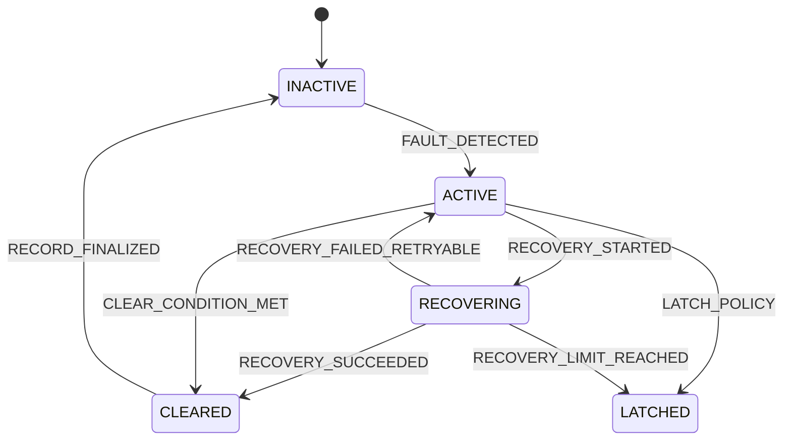
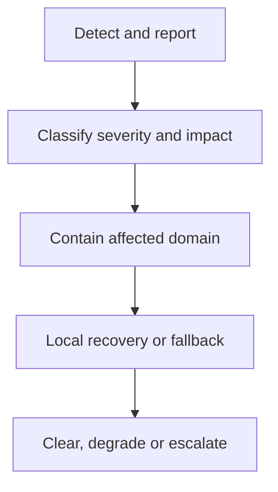
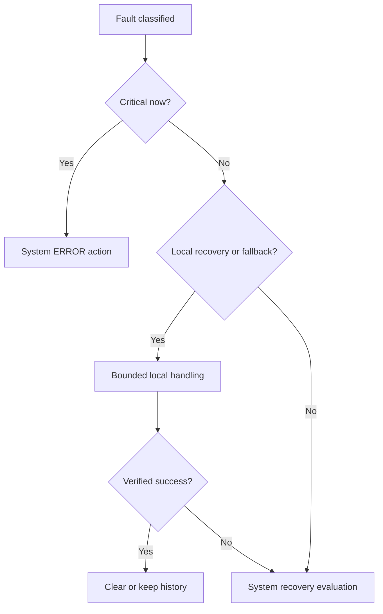

# 09 — Error Handling Overview

**Dự án:** Smart Water Flow and Pressure Monitor  
**Tên viết tắt:** SWFPM  
**Nhóm tài liệu:** `1.docs/00_overview`  
**Cấp tài liệu:** Error taxonomy, containment và recovery cấp hệ thống  
**Trạng thái:** Baseline đã định nghĩa  

---

## 1. Mục tiêu

Tài liệu này định nghĩa cách hệ thống phát hiện, phân loại, cô lập, công bố và phục hồi lỗi.

Mục tiêu cụ thể:

- Chốt fault taxonomy dùng chung giữa driver, service, repository và system FSM.
- Phân biệt severity, impact, recoverability và lifecycle của lỗi.
- Phân biệt invalid sample, degraded subsystem, local recovery, system recovery và `SystemMode.ERROR`.
- Chốt điều kiện escalation từ lỗi cục bộ lên `RECOVERY` hoặc `ERROR`.
- Xác định hành vi an toàn của measurement, storage, BLE, 4G, LCD, time và power khi có lỗi.
- Định nghĩa error/diagnostic record và quy tắc publish/clear/latch.
- Làm baseline cho fault injection, recovery test và firmware error manager.

Nguyên tắc trung tâm:

> Một fault chỉ được nâng lên cấp hệ thống khi phạm vi ảnh hưởng, data-integrity risk hoặc recovery result thực sự yêu cầu. Một sample invalid, LCD lỗi hoặc 4G offline không mặc định là `SystemMode.ERROR`.

---

## 2. Phạm vi

### 2.1. Nội dung thuộc phạm vi

```text
Fault taxonomy and dimensions
Severity and impact classification
Fault lifecycle
Error-code and diagnostic-record model
Local fault containment
Bounded retry and local recovery
System-level recovery and escalation
ERROR-mode entry direction
Subsystem fault behavior
Fault visibility through snapshot, LCD, BLE and telemetry
Watchdog/reset interaction
Fault-injection and validation requirements
```

### 2.2. Nội dung ngoài phạm vi

```text
Exact numeric error-code assignment
Exact retry count and timeout for each device
Exact power threshold and brownout circuit
Exact watchdog period and window
Exact BLE/4G module-specific recovery command
Exact server error-code mapping
Detailed bootloader and firmware-update recovery
Formal functional-safety certification
Manufacturing end-of-line test procedure
Field-service organization workflow
```

Exact threshold và retry budget được định nghĩa trong hardware/driver/policy document sau khi linh kiện và timing được chốt.

---

## 3. Tài liệu liên quan

| Nội dung | Tài liệu nguồn |
|---|---|
| Error terminology | `glossary.md` |
| Fault isolation principle | `03_operating_principle.md` |
| Event/action flow | `04_main_operation_flow.md` |
| Fault ordering | `05_sequence_diagrams.md` |
| `RECOVERY`/`ERROR` transition | `06_system_fsm.md` |
| Service permission trong fault mode | `07_operating_modes.md` |
| Invalid/stale/error data behavior | `08_data_flow.md` |
| Physical-interface fault visibility | `10_system_interfaces.md` |
| Firmware error manager mapping | `11_firmware_implication.md` |
| Requirement traceability | `12_system_traceability.md` |
| 4G retry/offline/ACK policy | `13_reporting_and_connectivity_policy.md` |

Tài liệu này là source-of-truth cho fault taxonomy, severity dimension, escalation direction và recovery boundary. FSM transition ID vẫn thuộc `06_system_fsm.md`.

---

## 4. Khái niệm nền tảng

### 4.1. Fault, error và failure

| Khái niệm | Ý nghĩa trong dự án |
|---|---|
| `Fault` | Điều kiện bất thường được phát hiện hoặc suy ra, ví dụ SPI timeout. |
| `Error state` | Trạng thái nội bộ/data không còn thỏa contract do fault gây ra, ví dụ flow result unavailable. |
| `Failure` | Chức năng quan sát được không đáp ứng requirement, ví dụ không thể đo flow trong thời gian cho phép. |
| `SystemMode.ERROR` | Primary mode hạn chế khi hệ thống không thể tiếp tục product operation an toàn hoặc bảo đảm data integrity. |

Không phải mọi fault đều tạo failure; không phải mọi failure cục bộ đều yêu cầu `SystemMode.ERROR`.

### 4.2. Fault và data quality

Measurement invalid hoặc stale trước hết là data-quality condition. Nó có thể trở thành recoverable fault nếu lặp lại hoặc cho thấy subsystem không hoạt động.

Ví dụ:

```text
One invalid pressure sample
  -> PressureResult invalid for that sample
  -> diagnostic counter increments
  -> SystemMode remains NORMAL

Repeated I2C timeout beyond local threshold
  -> pressure subsystem fault active
  -> bounded local recovery
  -> pressure remains unavailable/degraded
  -> escalate only if shared resource or product policy requires
```

---

## 5. Các chiều phân loại fault

Mỗi fault phải được mô tả bằng nhiều chiều độc lập. Không dùng một enum severity duy nhất để suy ra toàn bộ behavior.

```text
Fault identity
Fault domain
Severity
Functional impact
Recoverability
Lifecycle
Persistence/latching policy
Visibility policy
```

Ví dụ:

```text
domain         = PRESSURE
severity       = WARNING
impact         = DATA_QUALITY
recoverability = RECOVERABLE
lifecycle      = ACTIVE
```

và:

```text
domain         = STORAGE
severity       = CRITICAL
impact         = DATA_INTEGRITY
recoverability = UNRECOVERABLE_WITH_CURRENT_CONTEXT
lifecycle      = LATCHED
```

Hai fault có thể cùng severity nhưng cần recovery khác nhau.

---

## 6. Fault domain

| Domain | Phạm vi |
|---|---|
| `PLATFORM` | MCU, clock nền tảng, event loop, memory/invariant |
| `POWER` | Supply, battery, voltage sag, power-domain control |
| `TIME` | STM32 RTC, wall-clock validity, alarm/synchronization |
| `MAX_MEASUREMENT` | MAX35103 SPI, INT, ToF/temperature result |
| `PRESSURE_MEASUREMENT` | Pressure bridge, ZSSC3241, I2C, conversion |
| `MEASUREMENT_PROCESSING` | Compensation, calibration, range/plausibility |
| `VOLUME` | Integration, duplicate/overflow/state consistency |
| `LEAK_DETECTION` | Evidence/state algorithm consistency |
| `STORAGE` | F-RAM, record CRC/version, commit/restore |
| `CONFIGURATION` | Validation, dependency, apply/rollback |
| `BLE` | Module, UART, frame, session, authorization |
| `CELLULAR` | 4G module, UART, registration, data connection |
| `TELEMETRY` | Encode, queue, transport result, ACK lifecycle |
| `LCD` | Display interface, refresh và presentation |
| `SECURITY_SERVICE` | Unauthorized command, credential/access policy |
| `INTERNAL_INVARIANT` | Ownership, impossible state, corrupted control context |

`SERVER` response/error có thể được biểu diễn như subdomain của `TELEMETRY` hoặc external reason; exact code hierarchy được chốt ở protocol document.

---

## 7. Severity model

Severity mô tả mức nghiêm trọng hiện tại đối với product operation và data integrity, không mô tả số lần retry.

| Severity | Ý nghĩa | System action mặc định |
|---|---|---|
| `INFO` | Event đáng ghi nhận nhưng không làm suy giảm chức năng | Counter/log; không recovery |
| `WARNING` | Bất thường hoặc suy giảm nhẹ; chức năng chính vẫn tiếp tục | Publish status; local handling |
| `ERROR` | Một chức năng/subsystem không đáp ứng contract hoặc cần recovery | Contain và bounded recovery/fallback |
| `CRITICAL` | Không thể bảo đảm platform, data integrity hoặc safe product operation | System recovery hoặc `SystemMode.ERROR` |

### 7.1. Không đồng nhất severity với mode

`severity = ERROR` không có nghĩa `SystemMode = ERROR`.

Ví dụ:

```text
pressure subsystem unavailable
  severity = ERROR
  SystemMode = NORMAL
  MeasurementStatus = DEGRADED
```

`SystemMode.ERROR` chỉ dùng khi điều kiện critical hoặc recovery escalation thỏa FSM guard.

### 7.2. Severity có thể thay đổi

Một fault có thể escalation/de-escalation theo evidence:

```text
single timeout       -> WARNING
consecutive timeout  -> ERROR
shared bus corruption or exhausted system recovery -> CRITICAL
```

Threshold cụ thể thuộc fault policy của từng domain.

---

## 8. Functional-impact model

| Impact | Ý nghĩa |
|---|---|
| `NONE` | Chỉ diagnostic; không ảnh hưởng output |
| `DATA_QUALITY` | Một sample/result mất hoặc degraded |
| `FEATURE_UNAVAILABLE` | Một feature optional không hoạt động |
| `SUBSYSTEM_UNAVAILABLE` | Một subsystem không thể cung cấp chức năng |
| `DATA_INTEGRITY` | Persistent/runtime state có nguy cơ không nhất quán |
| `TIMING_INTEGRITY` | Deadline/time/order không còn bảo đảm |
| `SYSTEM_AVAILABILITY` | Core product operation không thể tiếp tục |
| `POWER_SAFETY` | Nguồn không đủ để tiếp tục operation an toàn |
| `SECURITY` | Request/access không thỏa trust/authorization policy |

Impact hỗ trợ containment. Ví dụ LCD fault có impact `FEATURE_UNAVAILABLE`; F-RAM corruption có thể là `DATA_INTEGRITY`.

---

## 9. Recoverability model

| Recoverability | Ý nghĩa |
|---|---|
| `TRANSIENT` | Có thể hết khi operation kế tiếp chạy lại; chưa cần re-init |
| `LOCAL_RECOVERABLE` | Owner subsystem có bounded retry/reset/re-init |
| `FALLBACK_AVAILABLE` | Có thể tiếp tục degraded bằng valid fallback |
| `SYSTEM_RECOVERY_REQUIRED` | Cần điều phối nhiều service/shared resource |
| `REINITIALIZE_REQUIRED` | Cần controlled reinitialize qua `INIT` |
| `UNRECOVERABLE_CURRENTLY` | Không có safe recovery trong runtime hiện tại |

Recoverability được đánh giá lại sau mỗi recovery attempt; không hard-code mọi timeout là retry vô hạn.

---

## 10. Fault lifecycle



### 10.1. State semantics

| Lifecycle | Ý nghĩa |
|---|---|
| `INACTIVE` | Fault condition không tồn tại |
| `ACTIVE` | Condition đang tồn tại/chưa được xử lý xong |
| `RECOVERING` | Recovery plan đang chạy |
| `CLEARED` | Condition đã hết; record có thể giữ history |
| `LATCHED` | Condition/history được giữ đến explicit clear/reset/service policy |

### 10.2. Active và latched tách biệt

Một fault có thể không còn active nhưng vẫn latched để diagnostics biết đã từng xảy ra. Runtime behavior phải dựa trên active condition và latching policy, không chỉ nhìn một boolean chung.

---

## 11. Fault-detection sources

| Nguồn | Ví dụ |
|---|---|
| Hardware status | MAX status, ZSSC status, power monitor |
| Transport/driver | SPI/I2C/UART timeout, NACK, framing error |
| Protocol parser | Length/version/CRC/response mismatch |
| Data validator | Range, plausibility, stale, incoherent result |
| Scheduler/time | Missed deadline, alarm failure, invalid wall-clock |
| Storage validator | CRC/schema/slot/verify failure |
| Service invariant | Duplicate ownership, impossible transition |
| External endpoint | Network reject, server response, authorization failure |
| Watchdog/reset reason | No progress, unexpected reset |
| Fault injection | Test-only controlled fault source |

Detector phải report fact/context; detector không tự ý quyết định system reset trừ hardware protection path được thiết kế riêng.

---

## 12. Fault report contract

Fault producer phát một `FaultReport` logical gồm tối thiểu:

```text
fault_code
fault_domain
detected severity
functional impact
recoverability hint
source component/interface
operation and phase
active SystemMode
monotonic detection time
wall-clock time and quality when available
related sample/result/config/report sequence
raw status summary bounded by schema
occurrence/consecutive context
```

`FaultReport` là input cho classification/diagnostics. Nó không phải raw memory dump và không chứa credential.

---

## 13. Error-code model

### 13.1. Logical composition

Error code nên có cấu trúc logic:

```text
domain + component/interface + condition
```

Ví dụ symbolic:

```text
ERR_MAX_SPI_TIMEOUT
ERR_MAX_RESULT_INVALID
ERR_PRESSURE_I2C_NACK
ERR_PRESSURE_OUT_OF_RANGE
ERR_STORAGE_RECORD_CRC
ERR_CONFIG_COMMIT_VERIFY
ERR_BLE_FRAME_INVALID
ERR_CELLULAR_MODEM_NO_RESPONSE
ERR_TELEMETRY_DELIVERY_UNKNOWN
ERR_TIME_INVALID
ERR_PLATFORM_INVARIANT
```

Exact numeric encoding là TBD. Symbolic name phải ổn định và không chứa severity nếu severity có thể thay đổi theo context.

### 13.2. Primary và contributing fault

Khi nhiều fault liên quan, diagnostic context cần phân biệt:

```text
primary_fault
contributing_faults
recovery_generated_faults
```

Ví dụ mất nguồn có thể là primary; storage write interruption là contributing result. Không ghi đè primary reason bằng lỗi phát sinh trong cleanup.

---

## 14. Diagnostic record

`DiagnosticRecord` mở rộng fault report để theo dõi lifecycle:

```text
diagnostic_id
fault identity/domain
current severity/impact/recoverability
lifecycle state
first_seen and latest_seen metadata
total_occurrence_count
consecutive_failure_count
recovery_attempt_count
last_recovery_result
active/latched flags
related object/version identifiers
clear reason and time
```

### 14.1. Bounded storage

- Diagnostic history phải bounded.
- Repeated identical fault nên tăng counter/coalesce thay vì tạo log vô hạn.
- Critical first occurrence và last recovery result cần ưu tiên retention.
- Không ghi F-RAM cho mọi sample timeout nếu gây write storm.

### 14.2. Time invalid

Monotonic ordering vẫn hợp lệ khi wall-clock invalid. Record phải mang `time_quality`; không tạo timestamp giả.

---

## 15. Error handling pipeline



Pipeline chi tiết:

1. Capture fault fact và context.
2. Mark affected data/status invalid, stale hoặc unavailable.
3. Cô lập resource/subsystem bị ảnh hưởng.
4. Giữ unaffected service tiếp tục nếu an toàn.
5. Chọn no-action, fallback, local recovery hoặc system escalation.
6. Chạy recovery bounded bằng monotonic timeout/attempt limit.
7. Verify recovery success bằng functional check.
8. Clear, latch, giữ degraded hoặc phát system event.
9. Publish diagnostic/status nhất quán.

---

## 16. Containment rules

### 16.1. Data containment

- Không publish invalid raw data như valid result.
- Không cộng volume từ duplicate/invalid flow.
- Không confirm leak từ evidence không đạt quality contract.
- Không apply config nếu commit/verify thất bại.
- Không đánh dấu telemetry delivered khi outcome chưa được xác nhận theo policy.

### 16.2. Resource containment

- Stop admission tới resource bị lỗi khi recovery cần exclusive access.
- Không reset shared I2C/UART/SPI resource mà chưa thông báo owner khác.
- Không power-cycle một domain nếu làm hỏng atomic storage/config transaction.
- ISR fault path chỉ capture/post event; cleanup chạy ở controlled context.

### 16.3. Scope containment

Một fault cục bộ không làm reset toàn hệ thống nếu:

```text
platform remains safe
data ownership remains consistent
fault domain can be isolated
unaffected services can meet their contracts
bounded local recovery/fallback exists
```

---

## 17. Retry policy

### 17.1. Bounded retry

Mọi retry phải có:

```text
attempt limit
per-attempt timeout
overall timeout or deadline
retry eligibility condition
delay/backoff when appropriate
success verification
failure escalation result
```

### 17.2. Retry không phải recovery đầy đủ

Retry lặp lại cùng operation chỉ phù hợp với transient fault. Nếu failure cho thấy device/bus state sai, cần re-init/reset/fallback thay vì retry vô hạn.

### 17.3. Không tight loop

4G offline, UART timeout hoặc sensor unavailable không được tạo loop chiếm CPU/power. Retry scheduling dùng timer/event và cho phép core measurement tiếp tục.

### 17.4. Retry side effect

- Retry read có thể tạo sample attempt mới nhưng không reuse identity mơ hồ.
- Retry config commit không được apply hai lần.
- Retry telemetry của cùng immutable record giữ cùng report identity.
- Duplicate recovery event không được chạy entry side effect nhiều lần.

---

## 18. Local recovery

### 18.1. Định nghĩa

Local recovery do owner subsystem điều phối và không thay đổi primary `SystemMode` khi fault được cô lập.

### 18.2. Ví dụ action

```text
clear status and retry once
reset parser/session
flush bounded RX state
reinitialize one peripheral
re-arm interrupt/alarm
switch to previous valid persistent slot
use valid fallback configuration
mark optional feature unavailable
```

### 18.3. Success criteria

Recovery success không chỉ là function call trả về `OK`. Phải xác minh:

- Interface/device phản hồi hợp lệ.
- Một operation kiểm tra hoàn tất trong timeout.
- Data/status nhất quán.
- Event/interrupt source được re-arm.
- Consecutive failure condition được reset theo policy.

### 18.4. Failure result

Khi local recovery hết budget:

```text
continue degraded if allowed
or
emit EVT_SYSTEM_RECOVERY_REQUIRED
or
emit EVT_CRITICAL_ERROR
```

Lựa chọn dựa trên impact và product requirement, không chỉ dựa vào số lần retry.

---

## 19. Degraded operation

### 19.1. Định nghĩa

Degraded operation là tổ hợp status cho biết một phần chức năng/data source không khả dụng trong khi `SystemMode` có thể vẫn là `NORMAL`.

Ví dụ:

```text
SystemMode = NORMAL
MeasurementStatus = DEGRADED
PressureResult = UNAVAILABLE
ConnectivityStatus = OFFLINE
```

### 19.2. Điều kiện cho phép

Chỉ tiếp tục degraded khi:

- Core platform/data integrity vẫn bảo đảm.
- Consumer biết quality/unavailable status.
- Không tạo misleading output.
- Feature phụ thuộc được disable hoặc degrade rõ ràng.
- Có diagnostic và recovery/recheck policy.

### 19.3. Không dùng degraded để che critical fault

Không được ở `NORMAL` degraded nếu core requirement hoặc safety/data-integrity invariant đã bị phá và không có safe fallback được review.

---

## 20. System-level recovery

### 20.1. Trigger

System recovery dùng khi:

```text
shared resource affects multiple services
local recovery budget exhausted and coordinated restart is viable
configuration/profile consistency lost
storage/time/platform state requires ordered multi-service action
power-domain recovery affects several components
repeated fault pattern crosses escalation policy
```

### 20.2. Transition

Owner phát `EVT_SYSTEM_RECOVERY_REQUIRED` cùng fault/recovery context. FSM đánh giá guard và chuyển `NORMAL` hoặc `SERVICE` sang `RECOVERY` theo `TR-SYS-013`, `TR-SYS-031` hoặc transition tương ứng.

### 20.3. RecoveryPlan

Mỗi plan gồm:

```text
recovery_id and triggering fault
source mode
affected and unaffected services
resource ownership/lock plan
ordered recovery steps
per-step and overall monotonic timeout
attempt count and limit
success/self-check criteria
rollback/fallback
escalation target
```

### 20.4. Success

Chỉ phát `EVT_RECOVERY_SUCCEEDED` khi:

- Functional self-check đạt.
- Active config và data ownership nhất quán.
- Pending interrupt/event state không bị mất.
- Affected statuses được update.
- Return-mode readiness đạt.

### 20.5. Failure

Recovery failure có thể:

- Retry plan nếu còn budget và điều kiện thay đổi phù hợp.
- Quay về degraded-safe `NORMAL` nếu policy được chốt.
- Chuyển `ERROR` khi critical hoặc limit đạt.

Không được lặp vô hạn `NORMAL -> RECOVERY -> NORMAL`.

---

## 21. Điều kiện vào `SystemMode.ERROR`

### 21.1. Direct critical entry

Ví dụ điều kiện có thể phát `EVT_CRITICAL_ERROR`:

```text
unsafe platform or power state
critical persistent-data integrity failure without valid fallback
internal invariant violation affecting ownership/control integrity
core platform corruption preventing bounded event processing
critical wake/clock condition preventing controlled operation
```

### 21.2. Escalated entry

```text
local recovery exhausted
  -> system recovery attempted
  -> recovery limit reached or success criteria fail
  -> critical impact remains
  -> ERROR
```

### 21.3. Không đủ điều kiện vào ERROR

Các trường hợp sau không mặc định vào `ERROR`:

```text
one invalid MAX or pressure sample
pressure subsystem unavailable with valid flow-only degraded policy
BLE unavailable
4G/network/server offline
LCD unavailable
wall-clock invalid while monotonic time works
one telemetry delivery timeout
one recoverable storage transaction failure with previous valid record retained
```

### 21.4. Entry behavior

- Latch primary critical reason.
- Capture previous mode và monotonic time.
- Stop unsafe product operation.
- Preserve critical state chỉ khi storage path an toàn.
- Giữ bounded diagnostic/recovery interface.
- Publish/display error summary nếu interface an toàn.

Không transition trực tiếp `ERROR -> NORMAL`.

---

## 22. Clear và latch policy

### 22.1. Clear condition

Fault chỉ clear khi condition được chứng minh đã hết, ví dụ:

```text
successful valid operation after recovery
fresh valid sample replaces unavailable state
verified persistent record selected
authorized session closed and parser reset
network/endpoint condition restored according to protocol
```

Timeout hết thời gian không tự động là clear.

### 22.2. Auto-clear

Phù hợp cho transient/recoverable condition có success evidence rõ ràng. Record history/counter vẫn có thể giữ.

### 22.3. Latched fault

Nên latch khi:

- Critical condition cần field/service review.
- Reset reason/watchdog evidence cần bảo toàn.
- Data-integrity fault không nên bị che bởi success tạm thời.
- Repeated fault threshold cần theo dõi qua operation.

### 22.4. Authorized clear

Authorized clear chỉ xóa latch/history flag theo permission; nó không được làm active hardware condition biến mất giả tạo. Nếu fault vẫn tồn tại, detector phải set active lại ngay.

---

## 23. MAX35103/ultrasonic fault behavior

| Fault | Immediate action | Local recovery | Escalation direction |
|---|---|---|---|
| SPI timeout | Bỏ sample, mark flow unavailable/invalid | Bounded retry/re-init SPI/MAX | Repeated/shared SPI issue → system recovery |
| Missing INT/result timeout | Close attempt, increment counter | Re-arm/check MAX config | Repeated measurement failure → degraded/recovery |
| Invalid device status | Reject result | Clear status/reconfigure | Persistent device fault → flow subsystem unavailable |
| Implausible ToF/flow | Reject/degrade sample | Check pairing/calibration/config | Algorithm/config consistency fault if systemic |
| Temperature invalid | Mark temperature invalid | Retry/re-read per policy | Flow degrade/reject theo compensation policy |

Khi flow invalid:

- Không update volume.
- Leak detection không dùng sample như evidence hợp lệ.
- Pressure, BLE, 4G và LCD status path tiếp tục nếu không bị ảnh hưởng.

Core-readiness requirement khi flow subsystem mất hoàn toàn vẫn là `OQ-FSM-001/002`.

---

## 24. Pressure/ZSSC3241 fault behavior

| Fault | Immediate action | Local recovery | System behavior |
|---|---|---|---|
| I2C NACK/timeout | Mark sample invalid | Retry/re-init transaction/device | Flow measurement tiếp tục |
| Device status fault | Reject raw result | Reconfigure/self-check | Pressure unavailable/degraded |
| Out-of-range/implausible | Reject hoặc flag | Verify profile/calibration | Không dùng làm valid leak evidence |
| Stale pressure | Mark stale | Schedule fresh sample | Leak evaluation degraded |
| Shared I2C stuck | Stop affected bus admission | Coordinated bus recovery | System `RECOVERY` nếu nhiều service bị ảnh hưởng |

Pressure unavailable không được thay bằng zero và không tự động xác nhận/xóa leak state.

---

## 25. Storage/configuration fault behavior

### 25.1. Persistent read/restore

| Fault | Behavior |
|---|---|
| One slot invalid | Chọn slot hợp lệ còn lại; warning/diagnostic |
| Both config slots invalid | Dùng `DefaultConfig` nếu safe fallback hợp lệ |
| Unknown schema | Không cast; dùng compatible migration/fallback |
| Calibration invalid | Không dùng calibration giả; feature readiness/degraded policy |
| Volume checkpoint invalid | Chọn previous valid record; flag integrity/data-loss status |

### 25.2. Commit

Nếu write/verify candidate thất bại:

- Giữ active record cũ.
- Không apply `PendingConfig`.
- Trả error reason cho requester.
- Chạy bounded storage recovery nếu phù hợp.
- Không retry vô hạn hoặc ghi đè active slot.

### 25.3. Critical boundary

Storage fault có thể critical khi không còn valid fallback cho data/config bắt buộc hoặc khi ownership/record selection không thể xác định nhất quán.

### 25.4. Config semantic fault

Invalid/unauthorized config request là rejected input, không phải system recovery fault. Repeated malicious/unauthorized request thuộc security diagnostic/rate-limit policy.

---

## 26. BLE fault behavior

| Fault | Behavior |
|---|---|
| UART overflow/framing | Drop/reset bounded parser state; report response nếu possible |
| Invalid frame/version/CRC | Reject request; giữ active config |
| Unauthorized command | Reject và audit bounded diagnostic |
| Module no response | Local module/UART recovery | 
| Session timeout | Close session; rollback uncommitted context |
| Repeated module failure | Mark BLE unavailable; measurement tiếp tục |

BLE failure không được:

- Xóa active config.
- Dừng measurement.
- Tự reset toàn hệ thống trừ shared platform fault đã được xác nhận.
- Apply buffer chưa validate.

---

## 27. 4G và telemetry fault behavior

### 27.1. Connectivity fault

Registration failure, network loss hoặc server unreachable làm `ConnectivityStatus` chuyển `OFFLINE`/`DEGRADED`, không đổi primary `SystemMode`.

### 27.2. Modem/UART fault

```text
timeout/parser error
  -> preserve delivery context
  -> bounded command/session recovery
  -> modem re-init/power-cycle only through owner policy
  -> update connectivity and diagnostic status
```

### 27.3. Delivery result

Phải phân biệt:

```text
transport failure
protocol reject
server acknowledgement
timeout
unknown outcome
```

Unknown không được đánh dấu delivered.

### 27.4. Queue fault

Queue full/record encode failure phải visible qua status/diagnostic và áp dụng explicit policy. Exact overflow, retention, retry, backoff và ACK thuộc tài liệu 13.

### 27.5. Escalation

4G fault chỉ yêu cầu system recovery nếu làm hỏng shared power/UART/platform resource hoặc local modem recovery gây ảnh hưởng đa subsystem. Offline kéo dài một mình không phải `SystemMode.ERROR`.

---

## 28. RTC/time fault behavior

| Fault | Data/system behavior |
|---|---|
| STM32 RTC invalid/lost backup | `TimeStatus = INVALID`; measurement dùng monotonic time |
| 4G time unavailable | Giữ RTC nếu còn valid; retry sync theo bounded policy |
| External time implausible | Reject sample; giữ current time state |
| RTC alarm failure | Re-arm/reconfigure; scheduler status degraded |
| Wall-clock step forward/back | Recompute schedule; giữ monotonic duration |
| MAX event clock unavailable | Degrade event-timing feature; direct measurement path theo policy |

Time invalid không được tạo wall-clock timestamp giả. Scheduled reporting defer/fallback behavior là policy cần chốt.

---

## 29. LCD fault behavior

- Mark display status warning/unavailable.
- Coalesce hoặc stop refresh attempt theo bounded retry policy.
- Không gọi measurement driver từ error path.
- Measurement, storage, BLE và telemetry tiếp tục.
- LCD không phải bắt buộc cho `INIT -> NORMAL` trong baseline.

Nếu LCD interface dùng shared bus, bus fault phải được phân loại theo shared-resource impact thay vì chỉ `LCD` domain.

---

## 30. Power fault behavior

### 30.1. Battery low

Thông thường là `WARNING`:

- Publish `PowerStatus`.
- Giảm operation không thiết yếu theo policy.
- Điều chỉnh 4G/LCD duty cycle nếu được chốt.
- Không giả định ngay là critical.

### 30.2. Battery critical/voltage sag

Có thể yêu cầu:

```text
stop new high-current operation
abort/defer modem transmission safely
protect only safe persistent transaction
enter reduced-power/shutdown path
latch reset/power reason
```

Không cố ghi persistent state nếu điện áp không đủ bảo đảm transaction.

### 30.3. 4G transmit interaction

Voltage sag trong 4G TX cần diagnostic correlation giữa power event và modem attempt. Không chỉ ghi modem timeout và bỏ mất primary power cause.

### 30.4. Open architecture

Critical power đi `ERROR`, dedicated shutdown flow hay hardware reset vẫn là TBD và cần chốt cùng power design.

---

## 31. Internal invariant fault

Ví dụ:

```text
invalid SystemMode enum
direct ERROR to NORMAL attempt
two owners write same protected state
snapshot publication protocol violated
impossible storage commit state
volume duplicate-consumption guard violated
queue/control memory corruption indication
```

Internal invariant ảnh hưởng control/data integrity thường có severity cao hơn peripheral timeout. Handler phải:

- Capture bounded context.
- Stop unsafe side effect.
- Không tiếp tục bằng giá trị giả.
- Chuyển system recovery hoặc critical error theo khả năng cô lập.

Assertion policy giữa debug và production thuộc firmware detailed design; production không được treo vô hạn mà không giữ diagnostic/reset reason.

---

## 32. Watchdog và reset

### 32.1. Watchdog là detector cuối

Watchdog phát hiện no-progress cấp platform/service, không thay thế timeout riêng của SPI, I2C, UART hoặc recovery plan.

### 32.2. Feed contract

Feed chỉ khi progress condition đạt, ví dụ:

```text
event loop advanced
critical scheduler alive
storage/recovery step progresses within deadline
no latched no-progress condition
```

Không feed watchdog vô điều kiện trong timer ISR.

### 32.3. Sau watchdog reset

```text
reset
  -> INIT
  -> capture watchdog reset reason
  -> increment retained reset counter if available
  -> inspect previous fault/recovery context
  -> evaluate repeated-reset policy
```

Không resume trực tiếp mode trước reset.

### 32.4. Reset loop

Repeated watchdog reset cần threshold và safe/service behavior. Exact threshold/retention là TBD; firmware phải tránh boot-reset loop vô hạn không có diagnostic visibility.

---

## 33. Boot-time fault handling

### 33.1. Optional subsystem failure

4G, BLE hoặc LCD init failure không mặc định chặn core boot. Hệ thống có thể vào `NORMAL` degraded khi core readiness đạt.

### 33.2. Recoverable shared failure

Shared bus/config/time/storage state cần ordered recovery phát `EVT_RECOVERABLE_INIT_FAILURE` và chuyển `INIT -> RECOVERY`.

### 33.3. Critical init failure

Platform/data integrity không có fallback phát `EVT_CRITICAL_INIT_FAILURE` và chuyển `INIT -> ERROR`.

### 33.4. Reset reason preservation

Boot snapshot/diagnostic phải giữ:

```text
reset source
previous mode if retained safely
previous primary fault/recovery id
boot attempt/repeated-reset count when available
```

---

## 34. Error visibility

### 34.1. RuntimeSnapshot

Snapshot chỉ mang summary cần cho product consumer:

```text
affected status
active/latched summary flags
primary error code/severity
data quality/freshness
recovery state/reference
```

Không nhồi toàn bộ diagnostic history vào snapshot.

### 34.2. LCD

- Hiển thị stable user/service-facing code hoặc biểu tượng.
- Không expose raw register, secret hoặc stack context.
- Ưu tiên critical status hơn normal page.
- Display failure không che fault khác trong repository.

### 34.3. BLE

- Unprivileged status chỉ trả summary được phép.
- Authorized service session có thể đọc diagnostic detail bounded.
- Clear/recovery command cần permission và explicit result.

### 34.4. Telemetry

- Gửi summary code/domain/severity/status theo schema.
- Critical event telemetry chỉ best-effort nếu 4G/power path an toàn.
- Không coi upload failure là lý do ghi log vô hạn.
- Credential/raw memory không được gửi.

---

## 35. Event model

| Event | Producer | Ý nghĩa |
|---|---|---|
| `EVT_ERROR_DETECTED` | Driver/service/validator | Fault report mới cần classification |
| `EVT_FAULT_STATUS_CHANGED` | Fault owner/diagnostics | Active/severity/lifecycle thay đổi |
| `EVT_LOCAL_RECOVERY_STARTED` | Subsystem owner | Local plan bắt đầu |
| `EVT_LOCAL_RECOVERY_COMPLETED` | Subsystem owner | Plan thành công/thất bại |
| `EVT_SYSTEM_RECOVERY_REQUIRED` | Classification/escalation owner | Cần coordinated recovery |
| `EVT_RECOVERY_SUCCEEDED` | Recovery coordinator | System plan đạt success criteria |
| `EVT_RECOVERY_FAILED` | Recovery coordinator | Plan fail/limit reached |
| `EVT_CRITICAL_ERROR` | Critical detector/coordinator | Điều kiện critical yêu cầu FSM action |
| `EVT_CONTROLLED_REINITIALIZE` | Authorized policy | Yêu cầu quay về `INIT` |

Event payload phải tham chiếu stable fault/recovery identity, không chỉ truyền boolean.

---

## 36. Fault-to-action decision



Diagram thể hiện decision direction; exact guard và transition vẫn thuộc FSM/fault policy table.

---

## 37. Baseline fault matrix

| Fault condition | Initial severity | Containment | Recovery owner | Default mode effect |
|---|---|---|---|---|
| One MAX invalid sample | `WARNING` | Reject sample | Measurement owner | Giữ `NORMAL` |
| Repeated MAX timeout | `ERROR` | Flow unavailable | Measurement owner | Degraded hoặc recovery |
| One pressure invalid sample | `WARNING` | Reject sample | Pressure owner | Giữ `NORMAL` |
| Pressure subsystem unavailable | `ERROR` | Remove pressure evidence | Pressure owner | `NORMAL` degraded |
| Shared I2C stuck | `ERROR/CRITICAL` theo scope | Stop bus admission | Recovery coordinator | `RECOVERY` nếu multi-service |
| One storage candidate verify fail | `ERROR` | Keep active record | Storage owner | Giữ mode/recovery tùy fault |
| No valid mandatory persistent fallback | `CRITICAL` | Stop unsafe apply | System | `ERROR` |
| Invalid BLE request | `WARNING`/security diagnostic | Reject request | BLE/config owner | Giữ mode |
| BLE module unavailable | `ERROR` feature-level | Mark BLE unavailable | BLE owner | `NORMAL` degraded |
| 4G/network offline | `WARNING/ERROR` feature-level | Preserve measurement | Cellular owner | `NORMAL + OFFLINE` |
| Delivery unknown | `WARNING` | Keep lifecycle explicit | Telemetry owner | Giữ mode |
| RTC invalid | `ERROR` time feature | No fake timestamp | Time owner | `NORMAL` degraded |
| LCD unavailable | `WARNING` | Stop/coalesce refresh | LCD owner | Giữ `NORMAL` |
| Battery low | `WARNING` | Reduce nonessential work | Power owner | Giữ mode/power policy |
| Battery critical | `CRITICAL` có thể | Stop unsafe work | Power/system | `ERROR`/shutdown TBD |
| Internal ownership invariant | `CRITICAL` | Stop side effect | System | `RECOVERY`/`ERROR` |
| Recovery limit reached | `CRITICAL` | Restrict operation | System | `ERROR` |

Initial severity là baseline; product threshold/context có thể nâng hoặc giảm theo policy được review.

---

## 38. Recovery ownership matrix

| Fault domain | Local owner | System escalation owner |
|---|---|---|
| MAX/flow measurement | `MeasurementManager` | Recovery coordinator/SystemModeManager |
| Pressure/ZSSC/I2C | Pressure service/bus owner | Recovery coordinator |
| Storage | `StorageService` | Recovery coordinator/SystemModeManager |
| Configuration | `ConfigRepository` | Recovery coordinator nếu consistency mất |
| BLE | `BleConfigService`/UART owner | System chỉ khi shared resource affected |
| 4G/telemetry | Cellular/telemetry owner | System chỉ khi shared power/UART affected |
| Time/RTC | `TimeService`/RTC driver | Recovery coordinator nếu scheduler/platform affected |
| LCD | `LcdService`/driver | System chỉ khi shared resource affected |
| Power | `PowerManager` | SystemModeManager/hardware protection |
| Internal invariant | Detecting owner + diagnostics | SystemModeManager |

Owner có thể request escalation nhưng chỉ FSM/system coordinator đổi primary mode.

---

## 39. Error prioritization

Khi nhiều fault đồng thời:

1. Power/platform/data-integrity critical condition.
2. Primary causal fault.
3. Measurement result/deadline cần capture để tránh mất context.
4. Atomic storage/config step cần kết thúc hoặc dừng an toàn.
5. Recovery-generated fault.
6. Communication/display diagnostic.

Ví dụ voltage sag làm modem reset:

```text
primary fault = POWER_VOLTAGE_SAG
contributing fault = CELLULAR_MODEM_RESET
delivery result = UNKNOWN/FAILED
```

Hệ thống không nên chỉ report modem timeout và bỏ qua nguồn gốc power.

---

## 40. Fault injection plan

### 40.1. Driver/interface injection

```text
SPI timeout and corrupt status
MAX interrupt missing/duplicate
I2C NACK, stuck bus and invalid pressure status
F-RAM read/write/verify failure
BLE UART overflow and invalid frame
4G UART timeout/unsolicited malformed response
RTC invalid/alarm failure
LCD no-response
power-low/critical event
```

### 40.2. Data/control injection

```text
stale and out-of-order result
duplicate FlowResult event
snapshot update contention
invalid config dependency
reset during persistent commit
telemetry queue full
delivery outcome unknown
wall-clock jump
recovery step timeout
repeated watchdog reset reason
```

### 40.3. Safety rules cho fault injection

- Test hook chỉ active trong authorized test build/session.
- Fault injection không bypass production authorization.
- Injected fault có explicit tag/provenance.
- Test hook không được tồn tại như unprotected production command.
- Reset/power tests phải dùng laboratory validation procedure phù hợp với hardware.

---

## 41. Kế hoạch kiểm thử

### 41.1. Classification test

Với mỗi fault code:

```text
domain mapping
initial severity and impact
recoverability
active/latch policy
status/data-quality effect
recovery owner
escalation event
visibility policy
```

### 41.2. Containment test

- MAX invalid không update volume.
- Pressure invalid không thành zero evidence.
- Config commit fail giữ active config.
- Telemetry unknown không thành acknowledged.
- LCD/BLE/4G fault không dừng measurement.
- Storage unsafe không bị forced checkpoint trong `ERROR`.

### 41.3. Recovery test

- Recovery success được verify bằng functional check.
- Attempt count và timeout bounded.
- Duplicate recovery event không lặp side effect.
- Shared resource recovery chặn admission đúng phạm vi.
- Unaffected service tiếp tục khi isolation cho phép.
- Recovery limit phát đúng escalation.

### 41.4. Lifecycle test

- Active → recovering → cleared.
- Active → latched.
- Cleared history còn counter/time.
- Authorized clear không che condition vẫn active.
- Repeated occurrence tăng counter thay vì log vô hạn.

### 41.5. Mode-transition test

```text
local fault remains NORMAL
shared recoverable fault enters RECOVERY
recovery success returns source mode
critical fault enters ERROR
no direct ERROR to NORMAL
controlled reinitialize enters INIT
watchdog reset enters INIT with reason retained
```

---

## 42. Error-handling requirements

| ID | Requirement |
|---|---|
| `REQ-ERR-001` | Fault classification phải tách domain, severity, impact, recoverability và lifecycle. |
| `REQ-ERR-002` | `severity = ERROR` không tự động đặt `SystemMode = ERROR`. |
| `REQ-ERR-003` | Mỗi fault report phải có stable fault identity, source và monotonic detection time. |
| `REQ-ERR-004` | Invalid measurement không được publish như valid zero. |
| `REQ-ERR-005` | Một local peripheral fault không được reset toàn hệ thống khi vẫn cô lập an toàn được. |
| `REQ-ERR-006` | Mọi retry/recovery phải có timeout và attempt limit. |
| `REQ-ERR-007` | Recovery success phải được xác minh bằng functional success criteria. |
| `REQ-ERR-008` | Retry/recovery duplicate event không được tạo duplicate side effect. |
| `REQ-ERR-009` | Local recovery không thay đổi primary mode khi không cần system coordination. |
| `REQ-ERR-010` | System recovery phải dùng ordered `RecoveryPlan` với affected/unaffected scope. |
| `REQ-ERR-011` | Recovery limit reached phải tạo deterministic escalation result. |
| `REQ-ERR-012` | Không được tạo vòng lặp recovery vô hạn. |
| `REQ-ERR-013` | `ERROR` không được transition trực tiếp sang `NORMAL`. |
| `REQ-ERR-014` | Primary fault phải được giữ khi cleanup/recovery tạo contributing fault. |
| `REQ-ERR-015` | Fault clear phải cần success/clear evidence, không chỉ timeout hết hạn. |
| `REQ-ERR-016` | Critical/reset reason phải được latch/retained theo policy. |
| `REQ-ERR-017` | Diagnostic history và repeated-fault logging phải bounded. |
| `REQ-ERR-018` | Fault/status publication phải giữ time quality khi wall-clock invalid. |
| `REQ-ERR-019` | Flow invalid không được update volume hoặc valid leak evidence. |
| `REQ-ERR-020` | Pressure unavailable phải degrade evidence quality và không trở thành pressure zero. |
| `REQ-ERR-021` | Storage candidate failure phải giữ previous valid active record khi có thể. |
| `REQ-ERR-022` | Invalid/unauthorized BLE request phải giữ `ActiveConfig` không đổi. |
| `REQ-ERR-023` | 4G offline không được dừng measurement, leak processing hoặc LCD. |
| `REQ-ERR-024` | Delivery outcome unknown không được đánh dấu server-acknowledged. |
| `REQ-ERR-025` | Time invalid không được tạo wall-clock timestamp giả. |
| `REQ-ERR-026` | LCD failure không mặc định thay đổi `SystemMode`. |
| `REQ-ERR-027` | Critical power handling không được cố ghi storage khi write integrity không bảo đảm. |
| `REQ-ERR-028` | Watchdog feed phải phụ thuộc progress condition. |
| `REQ-ERR-029` | Watchdog reset phải quay về `INIT` và giữ reset reason. |
| `REQ-ERR-030` | Fault injection hook phải bị giới hạn trong authorized test context. |
| `REQ-ERR-031` | Credential/secret không được xuất hiện trong general diagnostic record. |
| `REQ-ERR-032` | Consumer phải thấy active/degraded/unavailable status đủ để không dùng misleading data. |

---

## 43. Traceability

### 43.1. FSM mapping

| FSM artifact | Error-handling mapping |
|---|---|
| `TR-SYS-003` | Recoverable init failure → `RECOVERY` |
| `TR-SYS-004` | Critical init failure → `ERROR` |
| `TR-SYS-013` | Normal shared/system recovery request |
| `TR-SYS-014` | Normal critical error |
| `TR-SYS-031`, `TR-SYS-032` | Service recovery/critical error |
| `TR-SYS-040`–`TR-SYS-044` | Recovery success/failure/event policy |
| `TR-SYS-050`–`TR-SYS-053` | Error diagnostics, recovery và reinitialize |

### 43.2. Sequence/data mapping

| Source | Error-handling mapping |
|---|---|
| `SEQ-004` | MAX timeout/invalid result containment |
| `SEQ-008` | Pressure fault và degraded evidence |
| `SEQ-020` | 4G offline/delivery failure |
| `SEQ-024` | Storage commit interruption/verify failure |
| `SEQ-025`, `SEQ-026` | Priority/resource contention |
| `SEQ-027` | Time correction behavior |
| `REQ-DATA-004`–`REQ-DATA-009` | Measurement quality/side-effect containment |
| `REQ-DATA-020`–`REQ-DATA-024` | Telemetry/persistence error semantics |

### 43.3. Downstream mapping

| Nội dung | Tài liệu owner tiếp theo |
|---|---|
| Concrete error manager/recovery coordinator | `11_firmware_implication.md` |
| Requirement coverage | `12_system_traceability.md` |
| Cellular retry/ACK/offline policy | `13_reporting_and_connectivity_policy.md` |
| Numeric error-code registry | Firmware diagnostic specification |
| Device-specific recovery | Driver/hardware documents |
| Fault-injection implementation | Simulation/test documents |

---

## 44. Các quyết định còn mở

| ID | Quyết định | Ảnh hưởng |
|---|---|---|
| `OQ-ERR-001` | Exact numeric error-code encoding và registry owner? | Diagnostics/protocol |
| `OQ-ERR-002` | Consecutive-failure threshold của từng measurement stream? | Severity/escalation |
| `OQ-ERR-003` | Retry/re-init budget của MAX35103 và ZSSC3241? | Local recovery |
| `OQ-ERR-004` | Core flow unavailable có cho `NORMAL` degraded không? | Normal/recovery/error boundary |
| `OQ-ERR-005` | Shared I2C recovery sequence và bus ownership? | ZSSC/F-RAM/shared resource |
| `OQ-ERR-006` | System recovery attempt/overall timeout limit? | `RECOVERY -> ERROR` |
| `OQ-ERR-007` | Có cho degraded-safe return khi system recovery fail một phần? | Recovery success policy |
| `OQ-ERR-008` | Persistent diagnostic capacity/retention/coalescing? | F-RAM budget |
| `OQ-ERR-009` | Repeated watchdog-reset threshold và safe/service behavior? | Boot/reset loop |
| `OQ-ERR-010` | Battery-low/critical threshold và hysteresis? | Power fault severity |
| `OQ-ERR-011` | Critical power dùng `ERROR` hay dedicated shutdown state/flow? | System architecture |
| `OQ-ERR-012` | Time invalid reporting defer hay fallback? | Time/telemetry fault behavior |
| `OQ-ERR-013` | Telemetry retry, backoff, overflow và server ACK? | Delivery fault lifecycle |
| `OQ-ERR-014` | BLE/service authentication và authorized fault-clear permission? | Security/service |
| `OQ-ERR-015` | Event telemetry cho critical/leak fault có thuộc MVP? | Notification/dedup |
| `OQ-ERR-016` | Production assertion behavior và retained crash context? | Internal invariant diagnostics |

Các giá trị prototype phải được ghi là test default, không tự động trở thành product threshold.

---

## 45. Tiêu chí hoàn thành

Tài liệu được xem là đủ khi:

1. Fault dimension và severity semantics được review.
2. Local fault, degraded operation, system recovery và `ERROR` được phân biệt rõ.
3. Fault domain/owner và baseline matrix được chấp nhận.
4. Retry/recovery đều bounded và có success criteria.
5. Clear/latch/history policy được chấp nhận.
6. Measurement, storage, BLE, 4G, time, LCD và power fault behavior có direction rõ.
7. Watchdog/reset behavior thống nhất với FSM.
8. Error visibility không expose secret hoặc misleading data.
9. `REQ-ERR-*` có downstream owner và fault-injection mapping.
10. Open decision blocking implementation được chốt hoặc deferred rõ ràng.

---

## 46. Kết luận

Error-handling baseline được tóm tắt:

```text
Detect
  -> classify domain, severity, impact and recoverability
  -> mark affected data/status
  -> contain fault domain
  -> run bounded local recovery or fallback
  -> verify success
  -> clear/keep degraded/escalate
  -> coordinated RECOVERY when shared resources are affected
  -> ERROR only for critical or unrecoverable system conditions
```

Cách phân loại nhiều chiều giúp firmware không nhầm `error severity` với `SystemMode.ERROR`, duy trì measurement khi BLE/4G/LCD gặp lỗi và chỉ sử dụng system recovery khi fault thực sự vượt khỏi phạm vi owner cục bộ.
