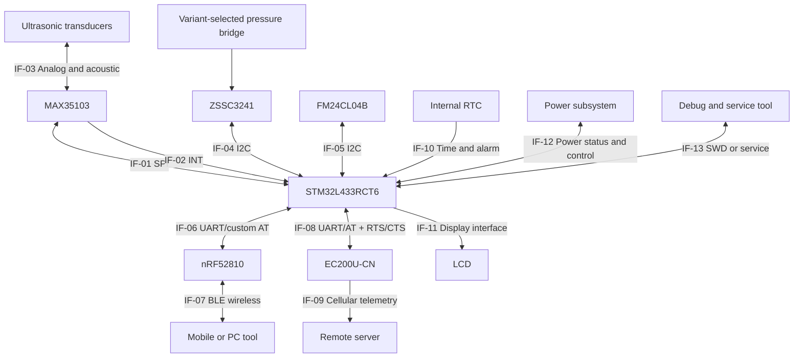
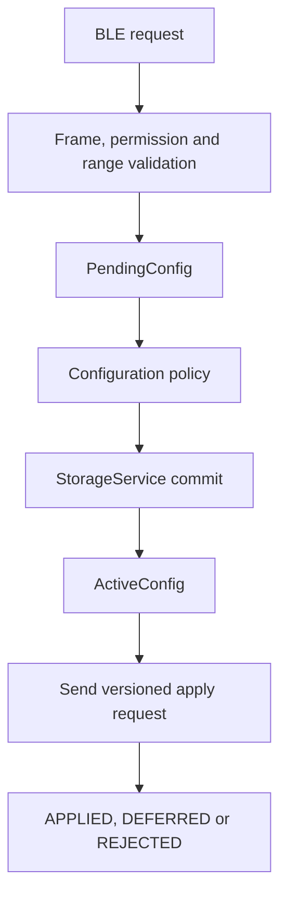
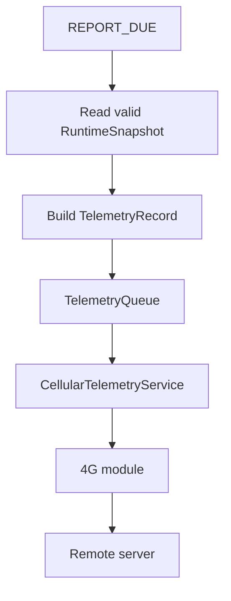

# 10 — System Interfaces

**Project:** Smart Water Flow and Pressure Monitor
**Document group:** `1.docs/00_overview`
**Document level:** System-level design
**Role:** Source-of-truth for system interface boundaries
**Status:** Initial baseline

---

## 1. Mục tiêu

Tài liệu này định nghĩa các interface chính giữa những thành phần của hệ thống **Smart Water Flow and Pressure Monitor**.

Mục tiêu gồm:

* Xác định hai thành phần tham gia mỗi interface.
* Xác định giao thức hoặc loại tín hiệu được sử dụng.
* Xác định hướng dữ liệu và vai trò của từng thành phần.
* Làm rõ data ownership tại mỗi interface boundary.
* Đặt ra các ràng buộc hệ thống mà hardware, firmware, communication và simulation phải tuân thủ.
* Ngăn external interface truy cập trực tiếp sensor, storage hoặc dữ liệu đang được cập nhật dở.

Tài liệu này mô tả interface ở mức hệ thống. Những nội dung sau không thuộc phạm vi tài liệu:

* Pin mapping và alternate function cụ thể.
* Cấu hình STM32CubeMX, DMA, NVIC hoặc clock.
* SPI/I2C/UART timing chi tiết.
* MAX35103 opcode/register implementation.
* Pressure sensor register map.
* BLE GATT service, UUID hoặc packet encoding.
* 4G AT command, socket state machine hoặc MQTT/HTTP implementation.
* LCD command set và frame-buffer implementation.
* STM32 HAL API cụ thể.

---

## 2. Interface Design Principles

Các nguyên tắc sau áp dụng cho mọi interface trong baseline:

1. STM32L433RCT6 là boundary trung tâm giữa sensing, storage, display và external communication.
2. External client không truy cập trực tiếp MAX35103, pressure sensor hoặc F-RAM.
3. BLE chỉ là kênh configuration/service; MCU vẫn là authority cho validation và apply configuration.
4. 4G chỉ là kênh telemetry uplink trong baseline hiện tại.
5. Theo `DEC-ARCH-008`, OTA và remote configuration/generic command qua 4G không thuộc baseline hiện tại.
6. nRF52810 và EC200U-CN sử dụng hai UART peripheral/context độc lập.
7. UART callback hoặc ISR chỉ thu nhận dữ liệu và phát event, không thực hiện processing nặng.
8. LCD chỉ đọc dữ liệu đã publish từ `RuntimeSnapshot`.
9. `StorageService` là service duy nhất được phép commit persistent records.
10. `ReportingScheduler` phát `REPORT_DUE`; nó không trực tiếp điều khiển UART 4G.
11. `RtcDriver` chỉ quản lý RTC hardware; time validity thuộc `TimeService` và reporting policy thuộc `ReportingScheduler`.
12. Mọi dữ liệu đi từ external interface vào hệ thống đều phải được xem là untrusted cho đến khi được validate.
13. Measurement-critical event không được bị block bởi BLE, 4G, LCD hoặc storage work không khẩn cấp.
14. Mỗi interface phải có timeout, error status và bounded retry policy tại tài liệu downstream tương ứng.

---

## 3. Interface Overview



---

## 4. Physical and External Interface Summary

| ID      | Interface                 | Thành phần                       | Giao thức/tín hiệu                     | Hướng chính              | Vai trò                                        | Trạng thái                                           |
| ------- | ------------------------- | -------------------------------- | -------------------------------------- | ------------------------ | ---------------------------------------------- | ---------------------------------------------------- |
| `IF-01` | MAX35103 control/data     | MCU ↔ MAX35103                   | SPI                                    | Hai chiều                | Cấu hình IC và đọc measurement result/status   | Defined                                              |
| `IF-02` | MAX35103 event            | MAX35103 → MCU                   | GPIO/EXTI                              | IC → MCU                 | Báo result ready hoặc status event             | Defined                                              |
| `IF-03` | Ultrasonic analog path    | MAX35103 ↔ transducers           | Analog/acoustic                        | Hai chiều                | Phát và thu ultrasonic                         | Defined                                              |
| `IF-04` | Pressure measurement      | MCU ↔ ZSSC3241 ↔ pressure bridge | I2C + analog bridge                    | Hai chiều/dữ liệu về MCU | Cấu hình và đọc pressure/status                | Variant/profile architecture defined by `DEC-HW-001` |
| `IF-05` | Persistent storage        | MCU ↔ FM24CL04B                  | I2C                                    | Hai chiều                | Load và commit persistent records              | Defined                                              |
| `IF-06` | BLE coprocessor interface | MCU ↔ nRF52810                   | Dedicated UART, custom AT, 115200 8N1  | Hai chiều                | Truyền configuration/service data              | Hardware defined; framing contract TBD               |
| `IF-07` | BLE wireless interface    | nRF52810 ↔ mobile/PC             | Custom BLE GATT                        | Hai chiều                | Local configuration và service                 | GATT/security contract TBD                           |
| `IF-08` | 4G modem interface        | MCU ↔ EC200U-CN                  | Dedicated UART/AT, 115200 8N1, RTS/CTS | Hai chiều                | Modem control, telemetry transfer và status    | Hardware/operating model defined                     |
| `IF-09` | Remote telemetry          | EC200U-CN → server               | LTE Cat 1 bis + application protocol   | Uplink baseline          | Gửi telemetry lên server                       | Server protocol TBD                                  |
| `IF-10` | Time and alarm            | Internal RTC → MCU runtime       | Internal RTC/alarm                     | RTC → runtime            | Timekeeping, timestamp và wakeup               | Defined conceptually                                 |
| `IF-11` | Local display             | MCU → LCD                        | TBD                                    | MCU → LCD                | Hiển thị runtime data/status                   | Model/interface TBD                                  |
| `IF-12` | Power status/control      | Power subsystem ↔ MCU            | Power rail, ADC, GPIO/control TBD      | Hai chiều tùy hardware   | Cấp nguồn, monitor và low-power control        | Hardware TBD                                         |
| `IF-13` | Debug/service             | Tool ↔ MCU                       | SWD/service UART TBD                   | Hai chiều                | Flashing, bring-up, calibration và diagnostics | Defined conceptually                                 |

---

## 5. Physical and External Interface Details

### 5.1. IF-01 — MCU ↔ MAX35103 SPI

| Thuộc tính     | Mô tả                                                                               |
| -------------- | ----------------------------------------------------------------------------------- |
| Thành phần     | STM32L433RCT6 và MAX35103                                                           |
| Interface      | SPI                                                                                 |
| Hướng dữ liệu  | MCU ghi configuration/control; MCU đọc result/status                                |
| Producer chính | MAX35103 đối với measurement result; MCU đối với control/configuration              |
| Consumer chính | `MeasurementManager` và MAX35103                                                    |
| Dữ liệu        | Opcode, register/configuration data, ToF result, temperature-related result, status |
| Trigger        | Initialization, measurement event, diagnostic/service request                       |
| Owner          | `MeasurementManager` thông qua `max35103_driver`                                    |

Ràng buộc:

* Chỉ MAX35103 driver được truy cập SPI transaction của IC.
* BLE, 4G, LCD và server không được truy cập trực tiếp IF-01.
* SPI transaction phải có timeout và status rõ ràng.
* Kết quả đọc từ IF-01 vẫn là raw measurement và phải đi qua validation trước khi publish.
* IF-01/IF-02 readiness đóng góp trực tiếp vào `CORE_MEASUREMENT_READY`. Production boot chỉ coi flow path ready sau khi interface/device init thành công và tạo được ít nhất một valid self-check hoặc measurement result trong boot session hiện tại.
* Chi tiết opcode, register và timing thuộc tài liệu MAX35103 driver/hardware.

### 5.2. IF-02 — MAX35103 INT → MCU

| Thuộc tính    | Mô tả                                                              |
| ------------- | ------------------------------------------------------------------ |
| Thành phần    | MAX35103 và STM32L433RCT6                                          |
| Interface     | GPIO interrupt/EXTI                                                |
| Hướng dữ liệu | MAX35103 → MCU                                                     |
| Dữ liệu       | Event notification: result ready, completion hoặc status condition |
| Trigger       | MAX35103 hardware event                                            |
| Owner         | ISR/EXTI adapter phát event cho `MeasurementManager`               |

Ràng buộc:

* ISR chỉ capture event/counter và post application event.
* Không đọc toàn bộ measurement result hoặc chạy leak detection trong ISR.
* Firmware phải phát hiện missed event, duplicate event hoặc overrun nếu có thể.
* IF-02 được ưu tiên cao hơn LCD refresh và communication work không khẩn cấp.

### 5.3. IF-03 — MAX35103 ↔ Ultrasonic Transducers

| Thuộc tính    | Mô tả                                                        |
| ------------- | ------------------------------------------------------------ |
| Thành phần    | MAX35103, analog front-end path và cặp ultrasonic transducer |
| Interface     | Analog pulse, receive signal và acoustic propagation         |
| Hướng dữ liệu | Hai chiều theo upstream/downstream measurement               |
| Dữ liệu       | Ultrasonic excitation và received acoustic signal            |
| Owner         | Hardware measurement subsystem                               |

Ràng buộc:

* Đây là physical measurement path, không phải digital software interface.
* MCU chỉ quan sát kết quả đã được MAX35103 cung cấp qua IF-01/IF-02.
* Schematic, matching network, transducer frequency và mechanical geometry thuộc tài liệu hardware.

### 5.4. IF-04 — MCU ↔ ZSSC3241 Pressure Subsystem

| Thuộc tính            | Mô tả                                                                                                      |
| --------------------- | ---------------------------------------------------------------------------------------------------------- |
| Thành phần            | STM32L433RCT6, ZSSC3241 và resistive pressure bridge                                                       |
| Interface             | I2C giữa MCU–ZSSC3241; analog bridge giữa transducer–ZSSC3241                                              |
| Hướng dữ liệu         | MCU trigger one-shot; ZSSC3241 cung cấp EOC/result-ready và conditioned pressure/status                    |
| Producer chính        | Pressure bridge + ZSSC3241 pressure subsystem                                                              |
| Consumer chính        | `PressureMeasurementService`                                                                               |
| Dữ liệu               | Conditioned pressure/raw code theo profile, device status, diagnostic và optional temperature-related data |
| Trigger               | STM32 monotonic pressure schedule; production Sleep Mode one-shot hoặc service diagnostic                  |
| Owner cấp service     | `PressureMeasurementService` thông qua `zssc3241_driver`/pressure subsystem driver                         |
| Owner transaction I2C | `I2cBusManager` của physical instance được hardware binding chọn                                           |

Ràng buộc:

* Dữ liệu đọc từ sensor phải qua range check, status validation, filtering và calibration.
* Production dùng Sleep Mode one-shot qua I2C; EOC là completion source ưu tiên nếu pin được route, nếu không dùng bounded status polling. Cyclic Mode không thuộc MVP.
* Driver phải release I2C bus trong conversion; timeout lấy từ worst-case profile cộng arbitration/jitter margin.
* ZSSC3241 đã được chọn; sensor model/reference/range và ZSSC settings được chọn theo build-time `ProductVariantManifest` liên kết `PressureSensorProfile` + `Zssc3241Profile`.
* Per-device correction nằm trong `PressureCalibrationRecord`; runtime chỉ được đổi allowlisted `PressureRuntimeConfig` trong validated bounds. Generic raw-register write không thuộc BLE/runtime configuration contract.
* Exact I2C address/register values/conversion time và acceptance limits của từng variant cần qualification trước release.
* `PressureMeasurementService`/`zssc3241_driver` gửi logical I2C transaction request; không gọi STM32 HAL I2C trực tiếp.
* Nếu ZSSC3241 dùng chung physical I2C bus với F-RAM, hardware phải bảo đảm địa chỉ không xung đột; `I2cBusManager` vẫn là owner duy nhất của arbitration, timeout và recovery.
* MCU phải tránh double-applying correction đã được ZSSC3241 calibration profile thực hiện.
* Leak detection không đọc trực tiếp IF-04 mà sử dụng `PressureResult` đã publish.

### 5.5. IF-05 — MCU ↔ FM24CL04B F-RAM

| Thuộc tính            | Mô tả                                                                                         |
| --------------------- | --------------------------------------------------------------------------------------------- |
| Thành phần            | STM32L433RCT6 và FM24CL04B                                                                    |
| Interface             | I2C                                                                                           |
| Hướng dữ liệu         | Hai chiều                                                                                     |
| Dữ liệu               | Config records, reporting schedule, volume state, calibration metadata và compact diagnostics |
| Trigger               | Boot/load, explicit config commit, periodic critical-state checkpoint hoặc recovery           |
| Owner cấp service     | `StorageService` thông qua `fram_driver`                                                      |
| Owner transaction I2C | `I2cBusManager` của physical instance được hardware binding chọn                              |

Ràng buộc:

* Không module nào ngoài `StorageService` được commit persistent record trực tiếp.
* `StorageService`/`fram_driver` gửi logical I2C transaction request; không gọi STM32 HAL I2C trực tiếp.
* BLE callback, RTC callback và measurement ISR không được ghi trực tiếp F-RAM.
* Persistent record phải có version, validity check và CRC; A/B slot được ưu tiên cho record quan trọng.
* Storage work phải bounded và không làm mất measurement event.
* FM24CL04B không mặc định được dùng làm telemetry history dài hạn.

### 5.6. IF-06 — MCU ↔ nRF52810 UART

| Thuộc tính    | Mô tả                                                           |
| ------------- | --------------------------------------------------------------- |
| Thành phần    | STM32L433RCT6 và nRF52810                                       |
| Interface     | Dedicated UART, `115200 8N1`, không RTS/CTS                     |
| Hướng dữ liệu | Hai chiều                                                       |
| Dữ liệu       | Configuration request, command, status response và service data |
| Trigger       | BLE client connection/request hoặc module status event          |
| Owner         | `BleConfigService` thông qua `ble_uart_driver`                  |

Ràng buộc:

* IF-06 phải có RX buffer và parser context độc lập với UART 4G.
* BLE frame phải được kiểm tra framing, length, command type, permission và value range.
* BLE write chỉ tạo `PendingConfig` hoặc command; không thay đổi persistent state trực tiếp.
* Cấu hình chỉ trở thành `ActiveConfig` sau validation và policy apply/commit thành công.
* UART ISR/DMA callback chỉ báo RX/TX event; parse và command processing chạy ngoài ISR.
* STM32 dùng custom AT command để điều khiển BLE; application frame phải bounded và có stop-and-wait/application ACK hoặc backpressure tương đương.
* RX dùng DMA/ring buffer; exact AT syntax, framing, CRC, fragmentation, timeout và versioning thuộc communication contract riêng.

### 5.7. IF-07 — BLE Module ↔ Mobile/PC Tool

| Thuộc tính       | Mô tả                                             |
| ---------------- | ------------------------------------------------- |
| Thành phần       | nRF52810 và mobile/PC configuration tool          |
| Interface        | Bluetooth Low Energy, custom GATT                 |
| Hướng dữ liệu    | Hai chiều                                         |
| Dữ liệu          | Configuration, command, device status và response |
| Vai trò thiết bị | Local configuration/service endpoint              |
| Vai trò client   | Configuration initiator và service UI             |

Ràng buộc:

* BLE là kênh cấu hình cục bộ trong baseline, không phải remote telemetry channel chính.
* GATT service, characteristic, packet format, pairing và authorization phải được định nghĩa trong `04_communication`.
* Dữ liệu từ client phải được validate lại tại MCU kể cả khi BLE module đã kiểm tra packet.
* Quyền thay đổi reporting schedule, threshold, time hoặc network settings phải có command policy rõ ràng.

### 5.8. IF-08 — MCU ↔ EC200U-CN UART

| Thuộc tính    | Mô tả                                                                     |
| ------------- | ------------------------------------------------------------------------- |
| Thành phần    | STM32L433RCT6 và Quectel EC200U-CN                                        |
| Interface     | Dedicated main UART, `115200 8N1`, RTS/CTS enabled                        |
| Hướng dữ liệu | Hai chiều                                                                 |
| Dữ liệu       | Modem control, network status, transport status và telemetry payload      |
| Trigger       | `REPORT_DUE`, retry event, modem status event hoặc service diagnostic     |
| Owner         | `CellularTelemetryService` thông qua `cellular_uart_driver`/modem adapter |

Ràng buộc:

* IF-08 phải có RX/TX buffer và parser/state context độc lập với BLE UART.
* UART communication phải non-blocking hoặc bounded; chờ modem/network không được dừng measurement pipeline.
* 4G module không đọc trực tiếp `DataRepository`; `CellularTelemetryService` tạo `TelemetryRecord` từ snapshot hợp lệ.
* Modem command response, URC và payload data phải được phân biệt rõ.
* STM32 dùng AT và TCP/IP stack bên trong EC200U-CN; PPP trên STM32 không thuộc MVP.
* Schematic route TX/RX/RTS/CTS/PWRKEY/RESET_N/STATUS và cân nhắc DTR/RI cho power/wake policy.
* PowerManager phải biết khi 4G transaction đang active để tránh low-power sai thời điểm.

### 5.9. IF-09 — 4G Module → Remote Server

| Thuộc tính     | Mô tả                                                                                                       |
| -------------- | ----------------------------------------------------------------------------------------------------------- |
| Thành phần     | Thiết bị qua 4G module, cellular network và remote server                                                   |
| Interface      | Cellular data connection + application protocol TBD                                                         |
| Hướng baseline | Device-to-server telemetry uplink                                                                           |
| Producer       | Thiết bị/`CellularTelemetryService`                                                                         |
| Consumer       | Remote server                                                                                               |
| Dữ liệu        | Device identity, timestamp, flow, volume, temperature, pressure, leak status, quality, power và diagnostics |
| Trigger        | Scheduled report hoặc critical event policy nếu được định nghĩa                                             |

Ràng buộc:

* Giao thức server có thể là MQTT, HTTPS hoặc TCP/application protocol; quyết định hiện là `TBD`.
* Payload phải có device identity, timestamp, report sequence và schema version.
* Cần định nghĩa rõ server acknowledgement, delivery result, retry/backoff và duplicate handling.
* Nếu gửi thất bại, telemetry record không được âm thầm mất nếu offline retention là requirement.
* Authentication, encryption/TLS, credential storage và provisioning phải được định nghĩa trong communication/security documents.
* Remote configuration/downlink command không thuộc baseline hiện tại.

### 5.10. IF-10 — Internal RTC → MCU Runtime

| Thuộc tính    | Mô tả                                                                 |
| ------------- | --------------------------------------------------------------------- |
| Thành phần    | STM32 internal RTC và firmware runtime                                |
| Interface     | Internal peripheral, RTC alarm/wakeup event                           |
| Hướng dữ liệu | RTC time/status → `RtcDriver`/`TimeService`; configuration → RTC      |
| Dữ liệu       | Date/time, alarm, wake reason và time-validity metadata               |
| Trigger       | Boot, time synchronization, alarm hoặc timestamp request              |
| Owner         | `RtcDriver` ở hardware boundary; `TimeService` ở system-time boundary |

Ràng buộc:

* `RtcDriver` chỉ bọc hardware operations; không chứa reporting-window policy.
* `TimeService` là source-of-truth cho system timestamp và time validity.
* `ReportingScheduler` tính thời điểm báo cáo tiếp theo và yêu cầu RTC alarm.
* RTC callback chỉ phát time/alarm event.
* 4G/server là nguồn sync ưu tiên cao nhất; STM32 RTC là local holdover; MAX35103 không phải reporting wall-clock authority.
* `TimeService` dùng `max_time_sync_age` cấu hình được, mặc định 7 ngày. Khi age đạt ngưỡng hoặc RTC continuity mất, reporting áp dụng `DEFER_UNTIL_VALID`.

### 5.11. IF-11 — MCU → LCD

| Thuộc tính     | Mô tả                                                                                 |
| -------------- | ------------------------------------------------------------------------------------- |
| Thành phần     | STM32L433RCT6 và LCD                                                                  |
| Interface      | TBD: GPIO, SPI, I2C hoặc LCD peripheral tùy phần cứng                                 |
| Hướng baseline | MCU → LCD                                                                             |
| Dữ liệu        | Flow, volume, temperature, pressure, leak status, connectivity, power và error status |
| Trigger        | Periodic refresh hoặc snapshot/status change event                                    |
| Owner          | `LcdService` thông qua `lcd_driver`                                                   |

Ràng buộc:

* LCD chỉ đọc `RuntimeSnapshot` hoặc display model đã tạo từ snapshot.
* LCD refresh không được gọi sensor driver hoặc block measurement.
* Display update có priority thấp hơn measurement-critical event.
* Model LCD, segment mapping, refresh rate và physical interface hiện là `TBD`.

### 5.12. IF-12 — Power Subsystem ↔ MCU

| Thuộc tính    | Mô tả                                                                       |
| ------------- | --------------------------------------------------------------------------- |
| Thành phần    | Battery/power input, regulator/power monitor và STM32L433RCT6               |
| Interface     | Power rail; ADC/GPIO/status/control tùy hardware                            |
| Hướng dữ liệu | Power status → MCU; optional enable/control → power domain                  |
| Dữ liệu       | Battery voltage, low/critical flag, power-good, wake reason và domain state |
| Owner         | `PowerManager` và power monitor driver                                      |

Ràng buộc:

* Power design phải chịu được peak current khi 4G transmit.
* PowerManager không cho phép sleep khi measurement, storage, BLE hoặc 4G transaction còn active.
* Theo `DEC-PWR-002`, hardware chỉ cung cấp reset/brownout protection; không có controlled shutdown/control guarantee.
* Firmware không được giả định đủ thời gian cho emergency persistent write; persistent integrity phải reset-safe ở mọi commit phase.
* Sau reset, firmware đọc available reset flags và khởi động qua `INIT`.
* Power fault phải được publish qua runtime status và telemetry khi có thể.
* Nguồn điện, battery, regulator và power-domain control hiện là `TBD`.

### 5.13. IF-13 — Debug and Service Interface

| Thuộc tính    | Mô tả                                                        |
| ------------- | ------------------------------------------------------------ |
| Thành phần    | Debug/factory tool và STM32L433RCT6                          |
| Interface     | SWD và optional service UART/connector                       |
| Hướng dữ liệu | Hai chiều                                                    |
| Dữ liệu       | Firmware flashing, debug, factory calibration và diagnostics |
| Trigger       | Development, factory hoặc authorized service procedure       |
| Owner         | Debug/service infrastructure                                 |

Ràng buộc:

* Debug/service mode phải được kích hoạt bằng điều kiện rõ ràng.
* Production firmware không được vô tình bật verbose debug hoặc unrestricted service command.
* Factory calibration data phải đi qua calibration/storage policy đã định nghĩa.
* Debug interface không được thay đổi normal measurement behavior ngoài ý muốn.

---

## 6. Internal Logical Interfaces

Ngoài physical interface, firmware cần các logical boundary để tránh gọi chéo trực tiếp giữa service.

| ID       | Logical interface              | Producer                               | Consumer                                                        | Dữ liệu/hành vi                                                                                          |
| -------- | ------------------------------ | -------------------------------------- | --------------------------------------------------------------- | -------------------------------------------------------------------------------------------------------- |
| `LIF-01` | Raw flow measurement           | `MeasurementManager`                   | Flow processing pipeline                                        | ToF, temperature-related result, status, timestamp                                                       |
| `LIF-02` | Processed flow result          | `CalibrationService`                   | `VolumeAccumulator`, `LeakDetectionService`, `DataRepository`   | Calibrated flow và quality                                                                               |
| `LIF-03` | Processed pressure result      | `PressureProcessingService`            | `LeakDetectionService`, `DataRepository`                        | Calibrated pressure và quality                                                                           |
| `LIF-04` | Leak detection result          | `LeakDetectionService`                 | `DataRepository`                                                | Leak state, severity, reason và timestamp                                                                |
| `LIF-05` | Runtime snapshot               | `DataRepository`                       | LCD, telemetry, storage và diagnostics                          | Double-buffered immutable runtime view; atomic active-index swap                                         |
| `LIF-06` | Pending configuration          | `BleConfigService`                     | `ConfigRepository`                                              | Validated candidate configuration                                                                        |
| `LIF-07` | Configuration commit request   | `ConfigRepository`/`CommandDispatcher` | `StorageService`                                                | Record type, version và commit request                                                                   |
| `LIF-08` | System time                    | `TimeService`                          | Measurement, scheduler, telemetry và diagnostics                | Timestamp, validity và time source                                                                       |
| `LIF-09` | Report due event               | `ReportingScheduler`                   | Application/`CellularTelemetryService`                          | Schedule ID, due time và reason                                                                          |
| `LIF-10` | Telemetry record               | Telemetry builder/service              | `TelemetryQueue`, `CellularTelemetryService`                    | Versioned server-facing record                                                                           |
| `LIF-11` | Display model                  | `LcdService`                           | LCD driver                                                      | Formatted display state                                                                                  |
| `LIF-12` | Power blockers                 | Active services                        | `PowerManager`                                                  | Busy/idle, next wake time và required power domain                                                       |
| `LIF-13` | Processed temperature result   | `CalibrationService`                   | Flow compensation, `DataRepository`, LCD/telemetry qua snapshot | Converted/calibrated temperature, quality, freshness, timestamp và version                               |
| `LIF-14` | I2C transaction request/result | Pressure/storage device drivers        | `I2cBusManager`                                                 | Bus identity, address, bounded transfer descriptor, deadline, completion/error và recovery generation    |
| `LIF-15` | Config apply request/result    | `ConfigRepository`                     | Affected services và ngược lại                                  | `transaction_id`, `config_version`, changed-field mask; `APPLIED`/`DEFERRED`/`REJECTED` + reason/version |

`LIF-13` chốt ownership theo `DEC-ARCH-002`: `MeasurementManager` chỉ chuyển validated raw temperature input; `CalibrationService` là single writer của immutable `TemperatureResult`.

`LIF-14` không quyết định ZSSC3241 và F-RAM chung hay tách physical I2C. Theo `DEC-ARCH-005`, mỗi physical instance có đúng một `I2cBusManager` context; service contract giữ nguyên khi hardware binding thay đổi.

`LIF-15` chốt acknowledgement theo `DEC-ARCH-007`. Persistent commit/`ActiveConfig` replacement và runtime apply là các milestone khác nhau; BLE response phải phản ánh per-service apply status thay vì coi notification là apply thành công.

### 6.1. RuntimeSnapshot boundary

`RuntimeSnapshot` là logical interface quan trọng nhất giữa measurement và consumers.

Snapshot dự kiến chứa:

```text
Snapshot version
Publish timestamp
Flow result and quality
Volume state
Temperature result and quality
Pressure result and quality
Leak state, severity and reason
Power status
Connectivity/reporting status
System status and error flags
```

Ràng buộc:

* Theo `DEC-ARCH-006`, snapshot dùng đúng hai buffer; writer hoàn tất inactive buffer rồi atomic swap active index.
* Consumer capture active index một lần cho mỗi read và không đọc buffer writer đang cập nhật.
* Flow, pressure và temperature cần timestamp/freshness riêng nếu sample rate khác nhau.
* Consumers không được đọc buffer đang được measurement pipeline cập nhật.
* LCD và telemetry có thể dùng các view khác nhau nhưng phải xuất phát từ cùng snapshot nhất quán.

### 6.2. Configuration boundary



Ràng buộc:

* `PendingConfig` và `ActiveConfig` là hai trạng thái khác nhau.
* Config invalid phải bị reject mà không thay đổi active/persistent state.
* Reporting schedule phải chứa đúng hai window có start time khác nhau.
* Start time phải nằm trong một ngày hợp lệ; report interval phải nằm trong giới hạn cấu hình cho phép.
* End boundary của mỗi window được suy ra từ start time của window còn lại theo chu kỳ 24 giờ.
* Thay đổi reporting schedule phải làm `ReportingScheduler` tính lại next report time.
* Schedule mới chỉ có hiệu lực sau validation và persistent commit thành công.
* Schedule update không hủy telemetry transaction đang chạy và không mặc định tạo report ngay lập tức.
* Thay đổi time configuration phải đi qua `TimeService`.
* Mỗi affected service phải trả matching `config_version` và một trong `APPLIED`, `DEFERRED` hoặc `REJECTED` cùng reason.
* BLE response phải phân biệt commit/active-version success với per-service runtime apply status.

### 6.3. Telemetry boundary



Ràng buộc:

* `REPORT_DUE` không đồng nghĩa telemetry đã được gửi thành công.
* Theo `DEC-ARCH-008`, IF-08/IF-09 không cung cấp OTA image, remote-config apply hoặc generic remote-command interface trong baseline.
* Cellular downlink chỉ được xử lý theo response/acknowledgement/time contract được định nghĩa; mở rộng phạm vi phải qua architecture/security review.
* Report generation, queueing và delivery phải có status riêng.
* Telemetry schema không được phụ thuộc trực tiếp vào layout của `RuntimeSnapshot` trong RAM.
* Delivery acknowledgement và record removal policy phải được chốt cùng server protocol.

---

## 7. Event and Priority Requirements

Nếu nhiều interface tạo event đồng thời, baseline priority ở mức hệ thống là:

| Priority | Event group                 | Ví dụ                                                 |
| -------: | --------------------------- | ----------------------------------------------------- |
|        1 | Critical power/system event | Brown-out warning, watchdog/critical health condition |
|        2 | Measurement-critical event  | MAX35103 INT, measurement deadline                    |
|        3 | Required data protection    | Mandatory volume/config commit                        |
|        4 | Pressure sampling           | Scheduled pressure conversion/read                    |
|        5 | RTC/report timing           | RTC alarm, `REPORT_DUE` generation                    |
|        6 | Communication processing    | BLE frame, 4G modem response, telemetry delivery      |
|        7 | Display and diagnostics     | LCD refresh, non-critical logging                     |
|        8 | Low-power transition        | Enter sleep when all blockers cleared                 |

Đây là system-level priority. NVIC priority, DMA channel và event-loop ordering chi tiết thuộc hardware/firmware documentation.

---

## 8. Interface Error Visibility

| Interface               | Lỗi điển hình                                                | System behavior tổng quát                                                                                                                                                                |
| ----------------------- | ------------------------------------------------------------ | ---------------------------------------------------------------------------------------------------------------------------------------------------------------------------------------- |
| `IF-01/02` MAX35103     | SPI timeout, missing INT, invalid status                     | Bỏ sample, set quality/error; runtime giữ `NORMAL + DEGRADED` trong bounded local recovery; hết budget → system recovery. Production boot không vào `NORMAL` trước valid flow readiness. |
| `IF-04` Pressure I2C    | NACK, timeout, invalid range, stale data                     | Mark pressure invalid/stale; không dùng cho leak decision yêu cầu pressure                                                                                                               |
| `IF-05` F-RAM           | I2C timeout, CRC invalid, slot invalid                       | Fallback slot/default; không retry vô hạn                                                                                                                                                |
| `IF-06/07` BLE          | UART overflow, invalid frame, unauthorized command           | Reject request, reset parser/session nếu cần, giữ ActiveConfig                                                                                                                           |
| `IF-08` 4G UART         | Timeout, parser error, modem not responding                  | Bounded recovery/re-init; giữ telemetry pending nếu policy yêu cầu                                                                                                                       |
| `IF-09` Cellular/server | Registration failure, network loss, transport/server failure | Offline/retry/backoff; measurement tiếp tục hoạt động                                                                                                                                    |
| `IF-10` RTC             | Invalid time, lost backup domain, alarm failure              | Set time-invalid status; dùng fallback policy, yêu cầu sync                                                                                                                              |
| `IF-11` LCD             | No response, update failure                                  | Set display warning; measurement và telemetry tiếp tục                                                                                                                                   |
| `IF-12` Power           | Battery low/critical, voltage sag                            | Reduce non-critical work, protect persistent state, report status                                                                                                                        |
| `IF-13` Debug/service   | Invalid service command                                      | Reject and report; không thay đổi production state ngoài policy                                                                                                                          |

Mỗi lỗi phải map đến error/status taxonomy trong `09_error_handling_overview.md` và test/fault injection tương ứng trong `08_simulation`.

---

## 9. Security and Trust Boundaries

Các trust boundary chính:

```text
BLE client
  -> untrusted external configuration input

Cellular network and server connection
  -> external transport and remote endpoint

Debug/service connector
  -> privileged maintenance boundary
```

Yêu cầu cấp hệ thống:

* BLE command phải có permission/authorization policy phù hợp.
* Dữ liệu BLE phải được validate tại MCU.
* 4G/server connection cần device identity và endpoint authentication policy.
* Credential không được expose qua LCD, telemetry thông thường hoặc unprivileged BLE command.
* Debug/service access phải được giới hạn trong production.
* Firmware phải phân biệt communication error với authentication/authorization failure.

Chi tiết pairing, bonding, key storage, TLS/certificate và credential provisioning thuộc communication/security documentation sau khi module và server protocol được chọn.

---

## 10. Interface Configuration Ownership

| Configuration group                                                 |                     Cấu hình qua BLE? | Persistent? | Owner runtime                |
| ------------------------------------------------------------------- | ------------------------------------: | ----------: | ---------------------------- |
| `ReportingWindow[0]` start/interval, default 06:00/15 phút          | Có; start 1 phút, interval 5..60 phút |          Có | `ReportingScheduler`         |
| `ReportingWindow[1]` start/interval, default 22:00/5 phút           | Có; start 1 phút, interval 5..60 phút |          Có | `ReportingScheduler`         |
| Versioned leak profile: threshold/evidence/confirm/clear/hysteresis |            Có trong authorized bounds |          Có | `LeakDetectionService`       |
| Measurement period theo từng stream                                 |       Có trong product-profile bounds |          Có | `MeasurementManager`         |
| Measurement interval                                                |               Có, nếu policy cho phép |          Có | `MeasurementManager`         |
| Pressure sample interval                                            |               Có, nếu policy cho phép |          Có | `PressureMeasurementService` |
| System time/timezone                                                |                                    Có |      Có thể | `TimeService`                |
| `max_time_sync_age` — mặc định 7 ngày                               |                                    Có |          Có | `TimeService`                |
| 4G/server settings                                                  |              TBD theo security policy |          Có | `CellularTelemetryService`   |
| LCD settings                                                        |                                Có thể |      Có thể | `LcdService`                 |
| Factory calibration                                                 |            Chỉ service/factory policy |          Có | `CalibrationService`         |

BLE chỉ vận chuyển configuration request. Logical service tương ứng mới là owner của behavior sau khi configuration được validate và apply.

---

## 11. Source-of-Truth Mapping

| Nội dung                                         | Source-of-truth                           |
| ------------------------------------------------ | ----------------------------------------- |
| System baseline và chức năng                     | `README.md`, `01_system_overview.md`      |
| Block-level architecture                         | `02_system_block_diagram.md`              |
| Interface ID, direction và boundary              | `10_system_interfaces.md`                 |
| Flow/pressure/leak operating principle           | `03_operating_principle.md`               |
| Runtime/config/telemetry data flow               | `08_data_flow.md`                         |
| Reporting window và offline policy               | `13_reporting_and_connectivity_policy.md` |
| Hardware pin, bus instance và electrical setting | `../02_hardware/`                         |
| Driver, HAL, DMA, ISR và internal FSM            | `../03_firmware/`                         |
| BLE frame/GATT và 4G/server protocol             | `../04_communication/`                    |
| Interface emulator và fault-injection tests      | `../08_simulation/`                       |

Downstream documentation không được thay đổi interface role hoặc data ownership mà không cập nhật tài liệu này và `12_system_traceability.md`.

---

## 12. Open Interface Questions

| ID          | Câu hỏi                                                                                                                                             | Interface bị ảnh hưởng     |
| ----------- | --------------------------------------------------------------------------------------------------------------------------------------------------- | -------------------------- |
| `OQ-002-HW` | ZSSC3241 và F-RAM dùng chung hay tách physical I2C instance? Logical ownership đã chốt bởi `DEC-ARCH-005`; physical mapping vẫn thuộc `DEC-HW-006`. | `IF-04`, `IF-05`, `LIF-14` |
| `OQ-004`    | BLE pairing, authorization và configuration command format là gì?                                                                                   | `IF-07`                    |
| `OQ-007`    | Server protocol, payload schema và acknowledgement model là gì?                                                                                     | `IF-09`                    |
| `OQ-009`    | LCD model và interface vật lý là gì?                                                                                                                | `IF-11`                    |
| `OQ-010`    | Power source và peak-current budget cho 4G là bao nhiêu?                                                                                            | `IF-12`                    |
| `OQ-011`    | Có service UART riêng ngoài SWD hay không?                                                                                                          | `IF-13`                    |
| `OQ-012`    | Offline telemetry cần được giữ bao lâu và ở bộ nhớ nào?                                                                                             | `LIF-10`, `IF-05`, `IF-09` |

Đã giải quyết:

```text
OQ-002 logical ownership/recovery boundary -> DEC-ARCH-005
OQ-001 -> DEC-HW-001 (firmware variant + per-device calibration + bounded runtime config)
OQ-008 -> DEC-SYS-004 (4G/server is highest-priority wall-clock source)
OQ-013 -> DEC-SCHED-004
OQ-003 -> DEC-HW-002 (nRF52810 + custom UART/AT; detailed protocol deferred)
OQ-005/OQ-006 -> DEC-HW-003 (EC200U-CN + UART/AT 115200 8N1 + RTS/CTS)
```

---

## 13. Maintenance Rules

Khi thêm hoặc sửa interface:

```text
[ ] Interface đã có ID duy nhất chưa?
[ ] Producer và consumer đã rõ chưa?
[ ] Data ownership đã rõ chưa?
[ ] Direction có phù hợp với baseline không?
[ ] ISR/callback behavior có được giới hạn không?
[ ] Timeout, error và retry responsibility thuộc module nào?
[ ] Thay đổi có ảnh hưởng source-of-truth downstream không?
[ ] Có cần cập nhật system block diagram không?
[ ] Có cần thêm system requirement và simulation test không?
[ ] Có làm thay đổi power, security hoặc low-power boundary không?
```

Nếu interface role thay đổi, phải cập nhật tối thiểu:

```text
02_system_block_diagram.md
10_system_interfaces.md
11_firmware_implication.md
12_system_traceability.md
```

Nếu thay đổi external protocol hoặc payload, phải cập nhật thêm `04_communication` và test simulation tương ứng.

---

## 14. Kết luận

Hệ thống sử dụng STM32L433RCT6 làm boundary duy nhất giữa measurement hardware, persistent storage, LCD và external communication.

Các interface chính được tổ chức theo nguyên tắc:

```text
MAX35103 and pressure sensor
  -> driver and measurement services
  -> validated results
  -> DataRepository and RuntimeSnapshot
  -> LCD, storage and telemetry consumers

BLE client
  -> BLE module and dedicated UART
  -> BleConfigService
  -> PendingConfig and validation
  -> ActiveConfig and StorageService

RTC
  -> TimeService and ReportingScheduler
  -> REPORT_DUE
  -> TelemetryRecord and TelemetryQueue
  -> 4G module through dedicated UART
  -> Remote server
```

Việc giữ interface boundary và data ownership rõ ràng giúp measurement tiếp tục hoạt động độc lập khi BLE, 4G, LCD hoặc server gặp lỗi; đồng thời tạo nền tảng để triển khai driver, firmware, communication contract và simulation test ở các tài liệu tiếp theo.
