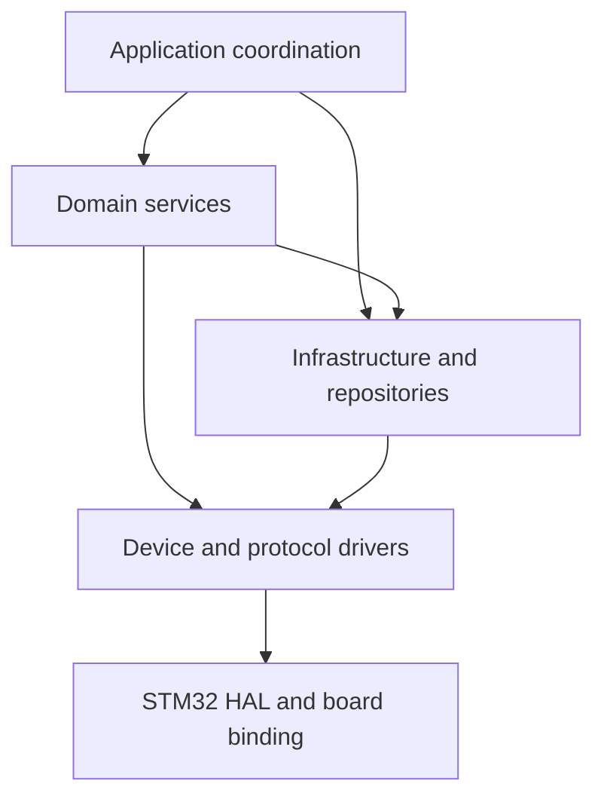
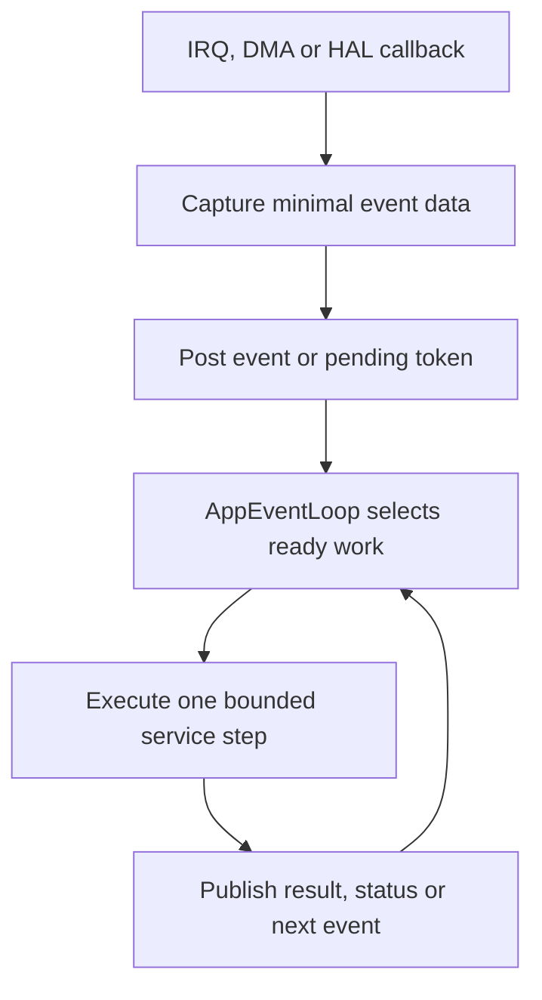
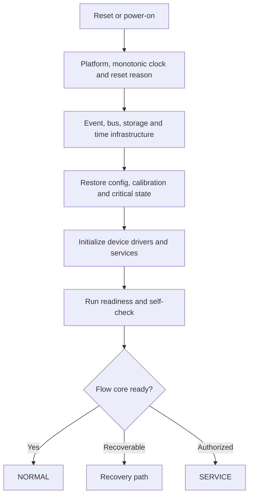
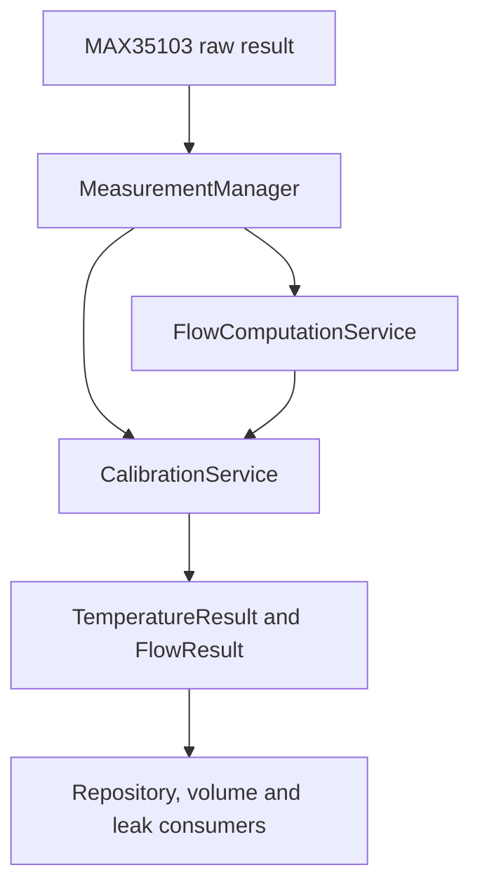
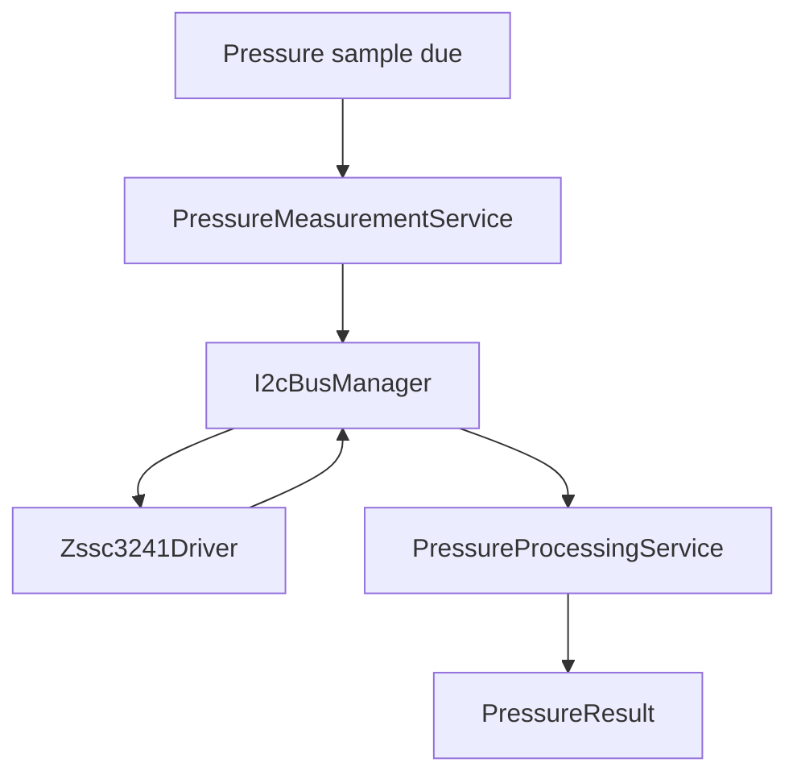
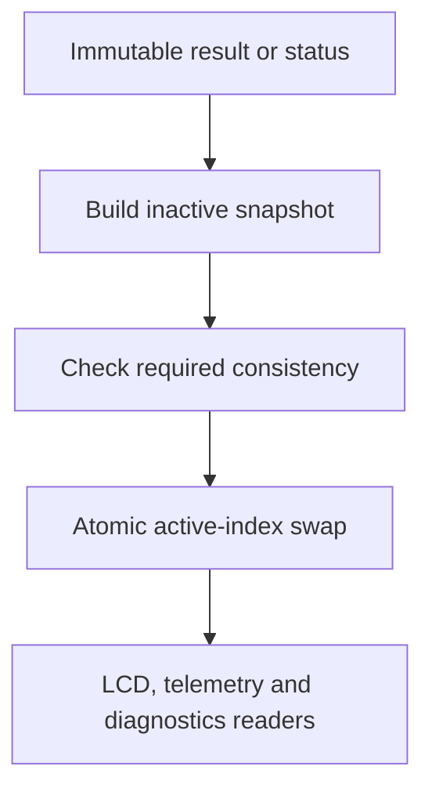
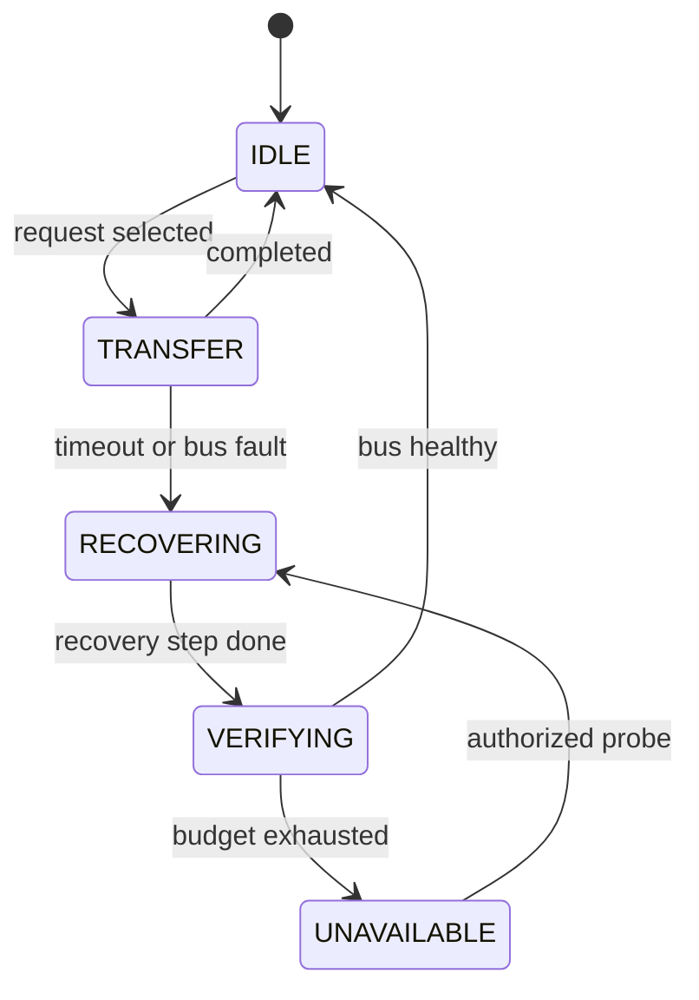
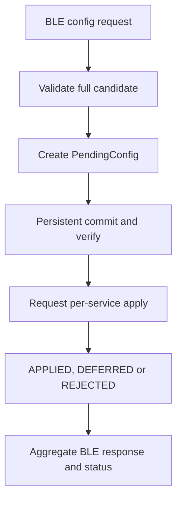
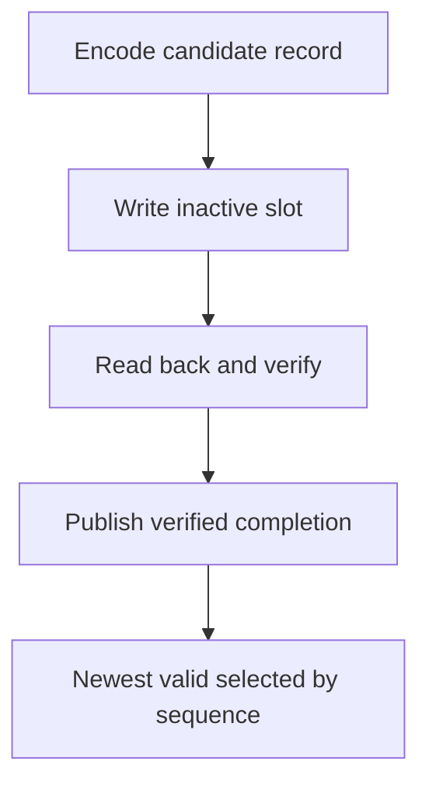

# 11 — Firmware Implication

**Document type:** Firmware architecture implication
**Document level:** System-to-firmware design
**Project:** Smart Water Flow and Pressure Monitor
**Short name:** SWFPM
**Status:** Initial baseline
**Language:** Vietnamese; canonical identifier và diagram label có thể dùng tiếng Anh

---

## 1. Mục đích

Tài liệu này chuyển các system decision, operating flow, state model, data ownership và interface contract trong tài liệu 00–10 thành kiến trúc firmware có thể triển khai.

Tài liệu trả lời:

* Firmware được chia thành những layer và module logic nào.
* Module nào sở hữu peripheral, transaction, data object và mutable state.
* ISR/callback chuyển thành application event như thế nào.
* Main execution context ưu tiên và dispatch công việc ra sao.
* Module nào cần internal state machine.
* Measurement, configuration, storage, reporting và recovery được nối qua contract nào.
* Các hardware/protocol `TBD` được cô lập ở đâu để không làm thay đổi architecture.
* Firmware implementation và test phải thỏa requirement nào.

Tài liệu không định nghĩa lại product behavior đã thuộc tài liệu 01–10.

---

## 2. Phạm vi

### 2.1. Trong phạm vi

```text
Firmware layering
Logical module responsibility
Dependency direction
Execution and event model
ISR/callback boundary
Internal service state
Data and buffer ownership
Double-buffer RuntimeSnapshot publication
Logical I2C arbitration and recovery
Configuration commit/apply acknowledgement
Boot, readiness and reset behavior
Local versus system recovery
Power blocker and brownout implications
Hardware-binding isolation
Test hook and firmware requirement
```

### 2.2. Ngoài phạm vi

```text
STM32 pin mapping and CubeMX configuration
Register-level MAX35103/ZSSC3241 sequence
Exact interrupt priority number
Exact event queue capacity
Exact timing, retry and recovery count
BLE frame/GATT UUID/command byte encoding
4G AT command and server protocol
LCD segment/page implementation
Pressure bridge transfer function
Leak threshold and production tuning value
Exact storage encoder implementation and migration code
OTA, bootloader update and remote 4G configuration
```

Các nội dung ngoài phạm vi phải được triển khai trong hardware, driver, communication hoặc test document tương ứng mà không thay đổi ownership và logical interface đã chốt.

---

## 3. Source-of-truth và thứ tự ưu tiên

| Nội dung                             | Source-of-truth                      |
| ------------------------------------ | ------------------------------------ |
| Baseline, scope và document map      | `README.md`                          |
| Canonical terminology và module name | `glossary.md`                        |
| Decision, OQ và implementation gate  | `00_open_questions_and_decisions.md` |
| System purpose và subsystem          | `01_system_overview.md`              |
| Physical/logical block               | `02_system_block_diagram.md`         |
| Operating principle                  | `03_operating_principle.md`          |
| Main operation flow                  | `04_main_operation_flow.md`          |
| Use-case sequence                    | `05_sequence_diagrams.md`            |
| Primary `SystemMode` FSM             | `06_system_fsm.md`                   |
| Mode permission/behavior             | `07_operating_modes.md`              |
| Data object, ownership và lifecycle  | `08_data_flow.md`                    |
| Error, containment và recovery       | `09_error_handling_overview.md`      |
| Physical/external/logical interface  | `10_system_interfaces.md`            |

Nếu tài liệu này mâu thuẫn với các source-of-truth trên, firmware không được tự chọn một behavior mới. Cần sửa tài liệu owner hoặc tạo decision/ADR phù hợp.

---

## 4. Architecture decision chi phối firmware

| Decision       | Firmware implication bắt buộc                                                                                                                               |
| -------------- | ----------------------------------------------------------------------------------------------------------------------------------------------------------- |
| `DEC-ARCH-001` | Flow path là core measurement; boot cần flow readiness evidence trước `NORMAL`; runtime flow fault dùng bounded local recovery trước system recovery.       |
| `DEC-ARCH-002` | `MeasurementManager` chỉ acquire/validate raw temperature input; `CalibrationService` convert/calibrate và là single writer của `TemperatureResult`.        |
| `DEC-ARCH-003` | Không có uncompensated production flow; compensation unavailable tạo `INVALID` hoặc `DEGRADED_NOT_ACCEPTED` và chặn volume/flow-based leak/valid telemetry. |
| `DEC-ARCH-004` | `SERVICE` quiesce production scheduler; chỉ bounded `SERVICE_SAMPLE`/`CALIBRATION_SAMPLE` và không có production side effect.                               |
| `DEC-ARCH-005` | Mỗi physical I2C instance có một `I2cBusManager` owner; client không gọi HAL I2C hoặc tự recovery bus.                                                      |
| `DEC-ARCH-006` | `RuntimeSnapshot` dùng đúng hai buffer; inactive-buffer build và atomic active-index swap.                                                                  |
| `DEC-ARCH-007` | Config commit khác runtime apply; affected service trả `APPLIED`, `DEFERRED` hoặc `REJECTED` với matching transaction/version.                              |
| `DEC-ARCH-008` | Không triển khai OTA, bootloader update, remote config hoặc generic remote command qua 4G.                                                                  |
| `DEC-PWR-002`  | Không có `SHUTDOWN` mode/controlled shutdown; brownout/reset đi thẳng về `INIT`; persistence phải reset-safe mà không cần emergency flush.                  |
| `DEC-HW-006`   | ZSSC3241 và FM24CL04B dùng chung physical I2C; `I2cBusManager` ưu tiên pressure hơn storage.                                                                |
| `DEC-DATA-001` | `VolumeCheckpointPolicy` versioned/configurable; trigger theo time hoặc volume, có minimum spacing.                                                         |
| `DEC-DATA-004` | FM24CL04B dùng fixed A/B partition với explicit encoding, sequence và CRC32.                                                                                |
| `DEC-DATA-005` | Một immutable commit in-flight; admission/coalescing phụ thuộc record class.                                                                                |

### 4.1. Decision chưa chốt và cách cô lập

| Nhóm TBD                                                         | Firmware treatment hiện tại                                                                  |
| ---------------------------------------------------------------- | -------------------------------------------------------------------------------------------- |
| nRF52810/EC200U-CN protocol and qualification details; LCD model | Driver/adapter port + hardware profile; service không phụ thuộc part number                  |
| Pressure sensor/ZSSC3241 variant                                 | `ProductVariantManifest` + `PressureSensorProfile` + `Zssc3241Profile` + calibration binding |
| Shared-I2C electrical/timing qualification                       | Board profile bind cả hai client vào một `I2cBusManager` instance                            |
| Measurement period/freshness                                     | Versioned runtime config/policy                                                              |
| Retry/timeout/count                                              | Bounded policy object; không hard-code rải rác                                               |
| Telemetry queue/offline/ACK                                      | Queue/transport interface với policy TBD; không giả delivery success                         |
| Battery threshold/hysteresis                                     | Power hardware profile; `DEC-PWR-001`                                                        |
| Numeric error code                                               | Symbolic fault identity trước; encoding adapter sau                                          |

---

## 5. Firmware architecture overview



### 5.1. Layer contract

| Layer                    | Trách nhiệm                                                  | Không được làm                                          |
| ------------------------ | ------------------------------------------------------------ | ------------------------------------------------------- |
| Application coordination | Boot, primary mode, event dispatch, recovery coordination    | Tự đọc register thiết bị hoặc sở hữu measurement result |
| Domain service           | Product processing và use-case policy                        | Gọi HAL trực tiếp hoặc sửa object của owner khác        |
| Infrastructure           | Bus, time, storage, repository, event, watchdog              | Tự định nghĩa product algorithm                         |
| Driver                   | Device/protocol transaction, raw status, callback adaptation | Update volume/leak/config hoặc block vô hạn             |
| HAL/board binding        | Peripheral instance, pin, clock, DMA/IRQ binding             | Chứa business rule hoặc product policy                  |

### 5.2. Dependency rule

Allowed:

```text
application -> service/infrastructure
service -> infrastructure/driver port
infrastructure -> driver port
driver -> HAL/board binding
```

Không allowed:

```text
HAL callback -> product algorithm
driver -> high-level service command
LCD/telemetry -> sensor driver
BLE module -> ActiveConfig or persistent record
consumer -> mutable owner object
service client -> shared I2C HAL/recovery
```

---

## 6. Module inventory

### 6.1. Application coordination

| Module                | Vai trò                                                                                 |
| --------------------- | --------------------------------------------------------------------------------------- |
| `SystemManager`       | Boot sequence, initialization dependency, readiness aggregation và high-level lifecycle |
| `SystemModeManager`   | Single writer của primary `SystemMode` và transition record                             |
| `AppEventLoop`        | Chọn, dispatch và giới hạn một application work step                                    |
| `RecoveryCoordinator` | Ordered system-level recovery plan và return-mode decision                              |
| `DiagnosticsService`  | Fault/status counter, bounded history và diagnostic publication                         |
| `WatchdogSupervisor`  | Đánh giá progress contract trước khi feed watchdog                                      |

### 6.2. Measurement và product processing

| Module                       | Vai trò                                                                                                                       |
| ---------------------------- | ----------------------------------------------------------------------------------------------------------------------------- |
| `MeasurementManager`         | Schedule/acquire MAX35103 result; validate device/raw status; phát validated input                                            |
| `FlowComputationService`     | Validated ToF/delta sang `ProcessedFlowMeasurement`                                                                           |
| `CalibrationService`         | Temperature conversion/calibration, temperature compensation, flow calibration; owner của `TemperatureResult` và `FlowResult` |
| `PressureMeasurementService` | Schedule và acquire pressure result qua `Zssc3241Driver`                                                                      |
| `PressureProcessingService`  | Validate, convert, calibrate, filter và publish `PressureResult`                                                              |
| `VolumeAccumulator`          | Single writer của `VolumeState` từ accepted production `FlowResult`                                                           |
| `LeakDetectionService`       | Evidence tracker và single writer của `LeakDetectionResult`                                                                   |

### 6.3. Runtime data, configuration và storage

| Module             | Vai trò                                                                                |
| ------------------ | -------------------------------------------------------------------------------------- |
| `DataRepository`   | Nhận immutable result/status và publish double-buffer `RuntimeSnapshot`                |
| `ConfigRepository` | Owner của `DefaultConfig`, `PendingConfig`, `ActiveConfig` và per-service apply status |
| `StorageService`   | Owner của persistent record restore/commit/verify/select                               |
| `I2cBusManager`    | Owner của arbitration, timeout và recovery cho một physical I2C instance               |
| `AppEventQueue`    | Bounded event handoff; overflow policy theo event class                                |
| `MonotonicClock`   | Timeout, duration, ordering và deadline không phụ thuộc wall clock                     |

### 6.4. Time, reporting, communication và display

| Module                     | Vai trò                                                                                                      |
| -------------------------- | ------------------------------------------------------------------------------------------------------------ |
| `TimeService`              | System wall clock, validity, timezone/local conversion, time-source priority và configurable sync-age policy |
| `ReportingScheduler`       | Hai reporting window, next due và RTC alarm request                                                          |
| `BleConfigService`         | BLE session/frame/permission boundary và config/command request                                              |
| `TelemetryBuilder`         | Stable snapshot sang server-facing `TelemetryRecord`                                                         |
| `TelemetryQueue`           | Bounded pending record lifecycle; exact backing/policy TBD                                                   |
| `CellularTelemetryService` | 4G connectivity/delivery internal state machine                                                              |
| `LcdService`               | Stable snapshot sang display model và bounded refresh                                                        |
| `PowerManager`             | Power blocker, idle/low-power admission và wake requirement                                                  |

### 6.5. Driver và adapter

| Driver/adapter       | Owned boundary                                                   |
| -------------------- | ---------------------------------------------------------------- |
| `Max35103Driver`     | MAX35103 SPI transaction, status/result acquisition, INT adapter |
| `Zssc3241Driver`     | ZSSC3241 request/response qua logical I2C transaction port       |
| `FramDriver`         | FM24CL04B byte/page transaction qua logical I2C transaction port |
| `BleUartDriver`      | BLE UART RX/TX buffer và callback adaptation                     |
| `CellularUartDriver` | 4G UART RX/TX buffer và callback adaptation                      |
| `RtcDriver`          | STM32 RTC HAL, alarm, set/read và status                         |
| `LcdDriver`          | LCD physical update transaction                                  |
| `PowerMonitorDriver` | ADC/GPIO/power-good/reset flag adapter nếu hardware hỗ trợ       |

---

## 7. Module responsibility contract

Mỗi firmware module phải có design record hoặc header contract tối thiểu:

```text
Purpose
Owned mutable state
Public input
Published output
Allowed dependencies
Internal states
Timeout/deadline owner
Local recovery owner
Escalation event
Initialization/readiness criteria
Forbidden side effects
Test hook
```

### 7.1. Single-writer rule

| Object/resource                         | Single writer/owner                |
| --------------------------------------- | ---------------------------------- |
| `SystemMode`                            | `SystemModeManager`                |
| `TemperatureResult`                     | `CalibrationService`               |
| `FlowResult`                            | `CalibrationService`               |
| `PressureResult`                        | `PressureProcessingService`        |
| `VolumeState`                           | `VolumeAccumulator`                |
| `LeakDetectionResult`                   | `LeakDetectionService`             |
| `RuntimeSnapshot` và active index       | `DataRepository`                   |
| `ActiveConfig` và apply-status registry | `ConfigRepository`                 |
| Persistent record commit state          | `StorageService`                   |
| System time state                       | `TimeService`                      |
| Reporting schedule state                | `ReportingScheduler`               |
| Physical I2C instance state             | `I2cBusManager` instance tương ứng |
| Cellular delivery context               | `CellularTelemetryService`         |

### 7.2. Consumer rule

Consumer:

* Chỉ đọc immutable result hoặc stable snapshot.
* Không giữ pointer/reference vượt lifetime contract.
* Kiểm tra validity, freshness, provenance và version trước side effect.
* Không thay quality flag để “sửa” dữ liệu của owner.
* Không dùng last-known value như fresh value nếu metadata không cho phép.

---

## 8. Execution model

Baseline là event-driven cooperative runtime. RTOS có thể được bổ sung sau nhưng không được thay đổi logical ownership, event contract hoặc recovery boundary.



### 8.1. Bounded step

Một service step phải:

* Có work amount hữu hạn.
* Không polling/blocking chờ device/network.
* Trả về khi đã start transaction, xử lý một completion hoặc hoàn thành một state transition.
* Dùng monotonic deadline cho wait/timeout.
* Giữ internal context để tiếp tục ở event sau.
* Không feed watchdog chỉ vì loop vẫn chạy nếu không có useful progress.

### 8.2. Optional RTOS mapping

Nếu dùng RTOS:

* `AppEventLoop` có thể map thành một hoặc nhiều task có ownership rõ.
* Queue/mutex không thay đổi single-writer rule.
* Driver callback vẫn không chạy business logic.
* Không tạo shared mutable global chỉ vì có mutex.
* Priority inversion và ISR-to-task handoff phải được phân tích trong firmware detailed design.

---

## 9. Event contract

### 9.1. Logical event envelope

```text
event_id
source_id
monotonic_timestamp
correlation_id or sequence
source_generation
payload kind
payload copy or stable object reference
priority class
```

Exact C layout và queue implementation thuộc firmware detailed design.

### 9.2. Canonical event group

| Nhóm            | Event tiêu biểu                                                                                          |
| --------------- | -------------------------------------------------------------------------------------------------------- |
| Platform        | `EVT_SYSTEM_START`, wake/reset reason, watchdog progress                                                 |
| MAX measurement | `EVT_MAX_RESULT_READY`, measurement due/timeout                                                          |
| Pressure        | `EVT_PRESSURE_SAMPLE_DUE`, `EVT_PRESSURE_RESULT_READY`                                                   |
| Product result  | `EVT_FLOW_RESULT_READY`, leak state changed                                                              |
| Time/reporting  | `EVT_RTC_ALARM`, `EVT_REPORT_DUE`, time validity changed                                                 |
| Configuration   | `EVT_BLE_CONFIG_RECEIVED`, `EVT_CONFIG_COMMIT_REQUIRED`, `EVT_CONFIG_APPLY_STATUS`, `EVT_CONFIG_APPLIED` |
| Storage         | Commit completion/failure với matching request identity                                                  |
| Cellular        | `EVT_CELLULAR_TX_REQUESTED`, completed, failed hoặc outcome unknown                                      |
| Display         | `EVT_LCD_REFRESH_DUE`                                                                                    |
| Recovery/error  | `EVT_ERROR_DETECTED`, `EVT_SYSTEM_RECOVERY_REQUIRED`, recovery result                                    |

### 9.3. Event identity và idempotency

* Duplicate event không được tạo duplicate volume increment, config apply hoặc record enqueue.
* Completion phải khớp correlation ID và source generation.
* Completion cũ sau driver/bus recovery phải bị reject.
* Coalescible event như LCD refresh có thể merge.
* Critical completion hoặc unread measurement result không được silently overwrite.

---

## 10. Logical priority model

| Priority class            | Work                                                                 |
| ------------------------- | -------------------------------------------------------------------- |
| `P0_PLATFORM_CRITICAL`    | Platform/reset integrity, watchdog escalation, critical invariant    |
| `P1_MEASUREMENT_DEADLINE` | MAX INT/result, unread sensor result, measurement timeout/completion |
| `P2_PRODUCT_PROCESSING`   | Flow/temperature/pressure processing, volume, leak evaluation        |
| `P3_ATOMIC_STATE`         | Storage/config atomic phase completion, time/schedule update         |
| `P4_COMMUNICATION`        | BLE request step, cellular command/delivery step                     |
| `P5_PRESENTATION`         | LCD refresh, noncritical diagnostic export                           |

Đây là logical ordering, không phải numeric NVIC/RTOS priority.

### 10.1. Fairness

* Cellular reconnect không được chiếm loop vô hạn.
* LCD refresh có thể coalesce.
* BLE parser xử lý bounded bytes/frame step.
* Storage write/verify phải chia phase nếu driver transaction dài.
* Low-priority work vẫn cần bounded starvation policy.

---

## 11. ISR, DMA và callback boundary

### 11.1. ISR/callback được phép

```text
Read/capture minimal hardware status
Capture timestamp/counter
Close low-level transfer state
Move bounded bytes or update ring index
Set pending flag or enqueue compact event
Return
```

### 11.2. ISR/callback bị cấm

```text
Compute flow, pressure or temperature
Update volume or leak evidence
Build RuntimeSnapshot or telemetry
Parse complete BLE/4G business command
Commit F-RAM record
Apply configuration
Run I2C bus recovery outside bus owner
Change primary SystemMode directly
Wait for another peripheral or network result
```

### 11.3. Interrupt-source adapter

| Source           | Callback output                                                                  |
| ---------------- | -------------------------------------------------------------------------------- |
| MAX35103 INT     | Pending/result-ready event kèm minimal counter/time                              |
| RTC alarm        | Alarm event; `ReportingScheduler` quyết định có `REPORT_DUE` hay không           |
| UART RX/DMA      | RX availability/token; parser chạy ngoài callback                                |
| I2C completion   | Matching transaction result tới `I2cBusManager`                                  |
| LCD completion   | Update completion/status tới `LcdService`                                        |
| Power/reset flag | Được đọc khi boot hoặc event nếu hardware cung cấp; không bảo đảm trước brownout |

---

## 12. Initialization và readiness architecture



### 12.1. Initialization order

1. Capture hardware reset reason trước khi clear flags.
2. Khởi tạo essential platform clock, monotonic time và event mechanism.
3. Khởi tạo physical bus owner context và driver binding.
4. Khởi tạo `StorageService` và restore record qua integrity validation.
5. Cài `ActiveConfig`, calibration/profile và critical state qua đúng owner.
6. Khởi tạo `TimeService`/RTC state.
7. Khởi tạo MAX35103/pressure/communication/display service.
8. Khởi tạo repository, scheduler và status publication.
9. Chạy self-check/readiness.
10. Chỉ phát init-complete khi `CORE_MEASUREMENT_READY` hợp lệ.

### 12.2. Flow readiness evidence

Production boot chỉ coi flow path ready khi boot session hiện tại có:

```text
MAX/SPI/INT path initialized
compatible config/calibration available
measurement path self-check or valid result
no blocking core fault
readiness version/reason published
```

Restored last-known flow không thay thế readiness evidence mới.

### 12.3. Brownout/reset

Theo `DEC-PWR-002`:

* Không có pre-reset shutdown sequence được bảo đảm.
* Brownout/reset từ mọi mode quay về `INIT`.
* Boot đọc available reset flags và restore newest compatible valid record.
* Không restore trực tiếp previous `SystemMode`.
* Không phụ thuộc emergency storage flush.

---

## 13. Flow và temperature measurement pipeline



### 13.1. Trách nhiệm theo phase

| Phase                              | Owner                    | Output                                                                         |
| ---------------------------------- | ------------------------ | ------------------------------------------------------------------------------ |
| Schedule/acquire                   | `MeasurementManager`     | Measurement request và raw device result                                       |
| Raw validation                     | `MeasurementManager`     | Validated temperature/ToF input hoặc rejection reason                          |
| Base flow computation              | `FlowComputationService` | `ProcessedFlowMeasurement` chưa được dùng trực tiếp cho production side effect |
| Temperature conversion/calibration | `CalibrationService`     | Immutable `TemperatureResult`                                                  |
| Compensation và flow calibration   | `CalibrationService`     | Immutable `FlowResult`                                                         |
| Result admission                   | Consumer tương ứng       | Accept/reject theo validity, freshness, provenance và version                  |

Production acquisition dùng MAX35103 event-timing mode theo `DEC-MEAS-002`. STM32 cấu hình event-timing profile, nhận completion qua INT/event rồi đọc coherent result/status. Direct command chỉ được expose qua authorized service/calibration/diagnostic path và mọi result phải mang non-production provenance.

Flow, temperature và pressure period là các field độc lập trong `ActiveConfig` theo `DEC-MEAS-001`. Scheduler dùng monotonic deadline/generation; reporting interval không được dùng thay measurement period.

### 13.2. Measurement attempt context

Mỗi lần đo cần một context logic:

```text
measurement_sequence
request_monotonic_time
config_version
calibration_version
source_generation
production_or_service_purpose
raw_result_status
deadline
```

Context được dùng để reject:

* Result đến muộn sau timeout hoặc recovery.
* Raw flow và temperature không cùng measurement attempt.
* Result được tính với config/calibration đã không còn tương thích.
* `SERVICE_SAMPLE` đi vào production consumer.
* Duplicate completion đã được xử lý.

### 13.3. Runtime flow fault

Khi flow result không hợp lệ:

1. Không update `VolumeState`.
2. Không đưa sample vào flow-based leak evidence.
3. Publish status/fault và degraded reason.
4. `MeasurementManager` hoặc driver owner thực hiện bounded local retry/re-init.
5. Nếu flow path phục hồi trong recovery budget, hệ thống có thể tiếp tục `NORMAL` với diagnostic degraded history.
6. Nếu hết budget, phát `EVT_SYSTEM_RECOVERY_REQUIRED`.
7. `RecoveryCoordinator` chạy ordered recovery; thất bại vượt system budget có thể dẫn tới `ERROR`.

Budget cụ thể là policy TBD, nhưng không được retry vô hạn.

---

## 14. Temperature ownership và compensation guard

Theo `DEC-ARCH-002`:

* `MeasurementManager` sở hữu acquisition và raw validation, không sở hữu temperature engineering value.
* `CalibrationService` là single writer của `TemperatureResult`.
* `TemperatureResult` là data object độc lập, immutable sau publish.
* `FlowResult` phải tham chiếu hoặc ghi lại compatible temperature/calibration evidence đã dùng.

### 14.1. Pairing contract

`CalibrationService` chỉ tạo compensated production `FlowResult` khi:

```text
raw flow input is valid
TemperatureResult is valid
measurement sequence is compatible
configuration version is compatible
calibration version is compatible
freshness requirement is satisfied
provenance is LIVE_PRODUCTION
```

Nếu thiếu compensation evidence, output phải là `INVALID` hoặc `DEGRADED_NOT_ACCEPTED` theo `DEC-ARCH-003`. Không được lặng lẽ dùng:

* Hằng số nhiệt độ mặc định.
* Temperature sample quá hạn.
* Sample từ `SERVICE`.
* Last-known value không có policy và metadata hợp lệ.
* Uncompensated base flow như production `FlowResult`.

---

## 15. Pressure measurement pipeline



### 15.1. Trách nhiệm

| Module                       | Trách nhiệm                                                                 |
| ---------------------------- | --------------------------------------------------------------------------- |
| `PressureMeasurementService` | Deadline, request identity, acquisition state và timeout                    |
| `I2cBusManager`              | Arbitration, transaction completion, timeout và physical bus recovery       |
| `Zssc3241Driver`             | ZSSC3241 command/status/raw response interpretation                         |
| `PressureProcessingService`  | Transfer-function binding, calibration, filtering, range/quality validation |

### 15.2. Pressure result contract

`PressureResult` tối thiểu cần:

```text
pressure engineering value
validity and quality
monotonic acquisition time
wall-clock time if valid
freshness/deadline metadata
source generation
hardware-profile version
calibration version
provenance
fault/status reason
```

Pressure fault không tự làm invalid flow/temperature. Leak algorithm quyết định degraded behavior theo evidence model; repository vẫn publish pressure status để telemetry/LCD/diagnostics phản ánh đúng.

---

## 16. Production và service sample isolation

Mọi measurement/result phải có provenance:

| Provenance           | Production side effect                                                                  |
| -------------------- | --------------------------------------------------------------------------------------- |
| `LIVE_PRODUCTION`    | Được xem xét sau validity/freshness/version guard                                       |
| `SERVICE_SAMPLE`     | Không volume, không production leak evidence, không normal telemetry payload            |
| `CALIBRATION_SAMPLE` | Chỉ calibration workflow được phép dùng                                                 |
| `RESTORED`           | Dùng làm historical/continuity state theo policy; không được giả là fresh sensor result |
| `DEFAULTED`          | Chỉ dùng nơi source document cho phép; không biến thành valid measured value            |
| `ESTIMATED`          | Chỉ dùng khi algorithm contract định nghĩa rõ; phải giữ quality marker                  |

### 16.1. Enter SERVICE

Khi transition vào `SERVICE`:

1. Ngăn production scheduler tạo request mới.
2. Chờ hoặc cancel transaction đang chạy theo safe boundary của owner.
3. Mark mọi completion cũ bằng generation để reject nếu không còn hợp lệ.
4. Cho phép bounded diagnostic/calibration request có purpose rõ.
5. Giữ reporting/config/display chỉ theo permission matrix của `07_operating_modes.md`.

### 16.2. Exit SERVICE

Khi rời `SERVICE`:

* Clear service-only transient context.
* Re-arm production scheduler.
* Yêu cầu production sample mới trước khi khôi phục production flow admission.
* Không dùng sample vừa đo trong `SERVICE` để “mồi” volume/leak/reporting.

---

## 17. Volume và leak consumer guard

### 17.1. Volume admission

`VolumeAccumulator` chỉ update khi tất cả điều kiện sau đúng:

```text
FlowResult.validity == VALID
FlowResult.provenance == LIVE_PRODUCTION
FlowResult is fresh for the integration interval
measurement_sequence was not consumed before
config/calibration version is accepted
system mode permits production update
```

Update phải idempotent theo measurement sequence. Duplicate event không được cộng thể tích lần hai.

### 17.2. Leak evidence admission

Theo `DEC-LEAK-001`, `LeakDetectionService`:

* Nhận only accepted production flow/pressure evidence.
* Giữ quality và missing-evidence reason, không thay thế bằng số 0.
* Có state/evidence model theo tài liệu principle.
* Publish state change và supporting status; không trực tiếp gửi 4G hoặc ghi LCD.
* Không xác nhận leak chỉ từ lỗi cảm biến hay missing sample.
* Sở hữu versioned leak profile gồm threshold, evidence/window duration, confirm duration, clear duration và hysteresis.
* Chỉ apply profile sau validation và persistent commit; khi active profile version đổi phải reset evidence đang tích lũy và publish transition reason.
* Exact numeric default/range thuộc product validation profile, không hard-code trong driver.

---

## 18. DataRepository và RuntimeSnapshot

`DataRepository` là điểm hợp nhất immutable result/status thành một consistent read model. Nó không sở hữu thuật toán đo, volume, leak, schedule hoặc communication.

### 18.1. Double-buffer publication



Theo `DEC-ARCH-006`:

* Có đúng `snapshots[2]` và một `active_index`.
* Writer chỉ sửa inactive buffer.
* Sau khi build xong, writer thực hiện atomic swap.
* Reader capture active index một lần rồi chỉ đọc buffer đó trong read operation.
* Writer không sửa active buffer.
* Không publish pointer tới temporary owner object trong snapshot.

### 18.2. Snapshot generation

Mỗi snapshot cần:

```text
snapshot_generation
build_monotonic_time
wall-clock time and validity
system mode and orthogonal status
flow result or explicit unavailable status
temperature result or explicit unavailable status
pressure result or explicit unavailable status
volume state
leak state/evidence summary
reporting status
power status
configuration/calibration versions
fault/degraded summary
```

`snapshot_generation` tăng sau mỗi successful publication. Consumer có thể phát hiện không đổi/stale nhưng không được tự suy diễn freshness chỉ từ generation.

### 18.3. Atomicity implementation

Exact primitive có thể là:

* Atomic integer phù hợp MCU/toolchain.
* Critical section rất ngắn quanh active-index load/store.

Không được giữ critical section trong toàn bộ snapshot build hoặc read dài.

---

## 19. I2cBusManager architecture

Mỗi physical I2C instance có đúng một `I2cBusManager`.

### 19.1. Client boundary

Client gửi logical transaction:

```text
client_id
device_id
operation
tx/rx buffer contract
length
deadline
correlation_id
source_generation
completion target
priority class
```

Client không:

* Gọi `HAL_I2C_*` trực tiếp.
* Reset/de-init peripheral.
* Toggle SCL/SDA recovery.
* Clear bus error của transaction khác.
* Giữ transaction buffer ngoài lifetime contract.

### 19.2. Internal state



Bus manager:

* Serialize transaction.
* Match HAL completion với active transaction/generation.
* Dùng monotonic deadline.
* Chạy bounded recovery.
* Hoàn tất request đúng một lần với explicit outcome.
* Publish bus health/status.
* Escalate khi physical instance unavailable vượt policy.

### 19.3. Multi-client fairness

Pressure và F-RAM có thể dùng cùng hoặc khác physical instance. Board binding quyết định mapping, nhưng mỗi instance vẫn có:

* Priority/deadline policy.
* Không cho storage commit làm mất measurement deadline.
* Bounded starvation.
* Recovery ảnh hưởng toàn instance được báo cho mọi affected client.

---

## 20. Configuration architecture

BLE là configuration channel duy nhất trong baseline. 4G không nhận remote config theo `DEC-ARCH-008`.

### 20.1. Config lifecycle



### 20.2. PendingConfig

`PendingConfig` phải chứa:

```text
transaction_id
candidate_config_version
base_active_version
candidate values
validation result
persistent commit state
affected service set
per-service apply status
created monotonic time
requested source and permission context
```

### 20.3. Commit và apply là hai phase khác nhau

Theo `DEC-ARCH-007`:

1. Validate toàn bộ candidate.
2. Commit reset-safe persistent record.
3. Verify record.
4. Chỉ khi commit thành công mới gửi apply request.
5. Mỗi affected service trả:

| Status     | Ý nghĩa                                                              |
| ---------- | -------------------------------------------------------------------- |
| `APPLIED`  | Version đã có hiệu lực trong runtime                                 |
| `DEFERRED` | Candidate hợp lệ và committed, nhưng chờ safe boundary               |
| `REJECTED` | Service không thể nhận candidate; cần reason và active-version truth |

Completion phải match `transaction_id` và `candidate_config_version`.

### 20.4. Safe-boundary example

| Config domain                     | Apply boundary đề xuất                                                                                     |
| --------------------------------- | ---------------------------------------------------------------------------------------------------------- |
| Reporting windows/interval        | Sau schedule recomputation atomic; áp dụng ngay khi không xử lý cùng alarm event                           |
| Measurement period                | Sau current measurement attempt kết thúc/cancel an toàn                                                    |
| Leak profile                      | Sau current evidence evaluation step; atomic switch sang profile version mới và reset accumulated evidence |
| Time/timezone/`max_time_sync_age` | Sau `TimeService` update; reevaluate validity và scheduler recompute trong cùng coordinated transaction    |
| Calibration                       | Ngoài active production calculation; có thể yêu cầu `SERVICE`                                              |
| Hardware profile                  | Boot hoặc authorized `SERVICE`; thường `DEFERRED`/restart-required                                         |

### 20.5. BLE response truth

BLE response không được trả “success” chung chung khi mới parse hoặc mới commit. Response cần phân biệt:

```text
request rejected before commit
commit failed
committed and applied
committed and deferred
committed but runtime apply rejected
```

---

## 21. Persistent storage architecture

`StorageService` là single owner của reset-safe record lifecycle. `FramDriver` chỉ thực hiện transaction vật lý.

### 21.1. Persistent record envelope

```text
record_type
schema_version
payload_length
sequence_or_generation
compatibility identity
payload
CRC32
```

Address/slot size đã chốt bởi `DEC-DATA-004`; exact encoder function và migration code thuộc storage detailed design.

### 21.1.1. FM24CL04B partition

| Slot pair    |       Address |          Size |
| ------------ | ------------: | ------------: |
| `CONFIG_A/B` | `0x000–0x07F` | 64 B mỗi slot |
| `CALIB_A/B`  | `0x080–0x13F` | 96 B mỗi slot |
| `VOLUME_A/B` | `0x140–0x19F` | 48 B mỗi slot |
| `SYSTEM_A/B` | `0x1A0–0x1DF` | 32 B mỗi slot |
| Reserved     | `0x1E0–0x1FF` |          32 B |

Encoder không serialize raw C struct/padding. Static/build checks phải chứng minh encoded record vừa slot. FM24CL04B không chứa persistent telemetry queue trong MVP.

### 21.2. Reset-safe commit



Implementation phải bảo đảm reset tại bất kỳ phase nào vẫn cho phép boot chọn newest compatible valid record hoặc fallback rõ ràng.

### 21.3. Restore rule

Boot:

1. Đọc candidate slot/header.
2. Validate schema, length, compatibility, sequence và CRC32.
3. Chọn newest valid record bằng generation rule chống wrap/ambiguity đã định nghĩa.
4. Nếu không có record hợp lệ, dùng safe defaults/commissioning behavior theo owner document.
5. Publish restore source/status; không che giấu fallback.

### 21.4. Brownout implication

Không có emergency flush. Vì vậy:

* Critical state chỉ được coi persisted sau verified commit.
* Volume/config transaction cần checkpoint strategy riêng.
* RAM-only “dirty” data có thể mất khi reset; risk/bounds phải được định nghĩa trong storage policy.
* Không tạo shutdown handler giả định MCU còn đủ thời gian ghi.

### 21.5. Admission và checkpoint

`StorageService` giữ một immutable record in-flight. Config/calibration có một pending request mỗi type; volume có one-slot latest-wins mailbox; system metadata coalesce theo type; diagnostics best-effort với drop counter. API admission trả `ACCEPTED`, `COALESCED`, `BUSY` hoặc `REJECTED`, tách khỏi asynchronous commit completion.

`VolumeCheckpointPolicy` chứa `max_interval_s`, `max_uncheckpointed_volume` và `min_spacing_s`. Policy update phải qua config validation/commit/apply và không reset accumulated volume.

---

## 22. Time và reporting firmware architecture

### 22.1. Hai time domain

| Time domain    | Owner            | Dùng cho                                                 |
| -------------- | ---------------- | -------------------------------------------------------- |
| Monotonic time | `MonotonicClock` | Timeout, duration, ordering, retry/backoff, freshness    |
| Wall clock     | `TimeService`    | Timestamp người dùng/server, reporting window, RTC alarm |

Wall-clock correction không được làm negative duration hoặc phá timeout vì timeout dùng monotonic time.

### 22.2. Time-source priority

`TimeService`:

* Nhận source candidate cùng quality/freshness.
* Ưu tiên 4G/server time theo system decision hiện tại.
* STM32 RTC giữ wall clock giữa các lần đồng bộ.
* MAX35103 time/counter chỉ là device-local measurement timing/reference, không phải authority cho system wall clock.
* Yêu cầu sync server theo nhịp vận hành 24 giờ; failed daily sync không tự làm time invalid khi RTC holdover còn trong ngưỡng.
* Tính `sync_age` từ retained last-successful-sync metadata và RTC continuity.
* Dùng `max_time_sync_age` persistent/configurable, mặc định 7 ngày; tại `sync_age >= max_time_sync_age` publish `INVALID`.
* Publish `time_valid`, active source, last-sync status/age, configured max age và generation.

### 22.3. ReportingScheduler

Scheduler sở hữu:

```text
two configurable reporting windows
window boundaries
interval of each window
timezone/local-time interpretation
active schedule version
next_report_time
last_report_due identity
time-validity dependency
```

Default/range theo `DEC-SCHED-004`: W0 `06:00/15 min`, W1 `22:00/5 min`, start resolution một phút, mỗi window tối thiểu 30 phút, interval 5–60 phút và versioned fixed UTC offset (`UTC+07:00` cho deployment baseline Việt Nam).

Khi config hoặc wall clock thay đổi:

1. Nhận matching update event.
2. Recompute active window và next due từ committed schedule.
3. Loại bỏ stale RTC alarm bằng schedule generation.
4. Program alarm qua `RtcDriver`.
5. Publish schedule status.

RTC alarm chỉ là wake/deadline notification. `ReportingScheduler` mới quyết định report có thật sự due.

Theo `DEC-SCHED-001`, scheduler không phát `REPORT_DUE` khi `time_valid=false`; nó publish `DEFER_UNTIL_VALID`. Khi time valid trở lại, scheduler áp dụng `SKIP_TO_NEXT` theo `DEC-SCHED-002`.

Theo `DEC-SCHED-003`, MVP không enqueue immediate production telemetry khi leak state đổi. Leak state vẫn được publish tới repository/LCD/diagnostics; scheduled record kế tiếp lấy state mới nhất.

### 22.4. Report identity

Mỗi report due cần stable identity để tránh duplicate:

```text
schedule_version
due_wall_time
due_sequence
snapshot_generation_used
```

Wall-clock adjustment, duplicate alarm hoặc wake event không được enqueue cùng report hai lần.

---

## 23. BLE, 4G và LCD firmware boundary

### 23.1. BLE

`BleConfigService`:

* Parse bounded frame bên ngoài ISR.
* Validate session/permission và command class.
* Chuyển config candidate tới `ConfigRepository`.
* Chuyển time-setting request tới `TimeService` qua controlled command.
* Đọc stable snapshot/status cho query.
* Không ghi trực tiếp `ActiveConfig`, RTC register, F-RAM hoặc sensor register.

### 23.2. 4G

`CellularTelemetryService`:

* Chỉ gửi telemetry/diagnostic theo approved product interface.
* Không cung cấp OTA, bootloader update, remote config hoặc generic remote command.
* Có non-blocking internal state machine.
* Phân biệt delivery outcome: confirmed, failed, timeout hoặc unknown nếu protocol chưa định nghĩa ACK.
* Không block measurement/repository khi offline.

Document 13 đã định nghĩa lifecycle, invariant, option và proposed direction cho offline retention, queue, ACK, retry và backoff. Exact production decision vẫn `OPEN/DEFERRED`; code phải giữ policy/transport adapter thay vì hard-code proposal.

### 23.3. LCD

`LcdService`:

* Chỉ đọc stable `RuntimeSnapshot`.
* Build display model trong bounded step.
* Coalesce refresh khi cần.
* Không đọc trực tiếp sensor/driver.
* Không làm measurement deadline trễ.
* Khi data invalid/stale, hiển thị status phù hợp thay vì giữ số cũ như hiện tại.

---

## 24. Internal service state machine

Internal phase không phải primary `SystemMode`. Một service có thể ở phase `WAIT_RESULT` trong khi hệ thống vẫn ở `NORMAL`.

| Module                       | Internal state tối thiểu                                                               |
| ---------------------------- | -------------------------------------------------------------------------------------- |
| `MeasurementManager`         | `IDLE`, `SCHEDULED`, `WAIT_RESULT`, `PROCESSING`, `LOCAL_RECOVERY`, `UNAVAILABLE`      |
| `PressureMeasurementService` | `IDLE`, `WAIT_BUS`, `WAIT_RESULT`, `PROCESSING`, `BACKOFF`                             |
| `I2cBusManager`              | `IDLE`, `TRANSFER`, `RECOVERING`, `VERIFYING`, `UNAVAILABLE`                           |
| `StorageService`             | `IDLE`, `ENCODING`, `WRITING`, `READBACK`, `VERIFYING`, `FINALIZING`, `FAILED`         |
| `ConfigRepository`           | `IDLE`, `VALIDATING`, `COMMITTING`, `APPLYING`, `PARTIAL`, `COMPLETE`, `REJECTED`      |
| `CellularTelemetryService`   | `NOT_READY`, `CONNECTING`, `ONLINE`, `SENDING`, `WAIT_RESULT`, `OFFLINE`, `RECOVERING` |
| `ReportingScheduler`         | `NOT_READY`, `ARMED`, `DUE_PENDING`, `RECOMPUTING`                                     |
| `LcdService`                 | `IDLE`, `BUILD_MODEL`, `UPDATING`                                                      |

### 24.1. Internal transition contract

Mỗi transition nội bộ cần:

```text
trigger
guard
side effect
deadline
next state
completion event
fault and escalation outcome
```

Transition không được tự đổi primary mode. Nó phát status/fault/recovery request cho `SystemModeManager` hoặc `RecoveryCoordinator`.

---

## 25. Mapping với SystemMode

| `SystemMode` | Firmware implication                                                                                                                           |
| ------------ | ---------------------------------------------------------------------------------------------------------------------------------------------- |
| `INIT`       | Restore, initialize, self-check; production side effect chưa được admission; cần flow readiness evidence mới                                   |
| `NORMAL`     | Production measurement, volume/leak, reporting và display hoạt động theo config; peripheral fault có thể degraded trong bounded local recovery |
| `LOW_POWER`  | Chỉ vào khi không có blocker; wake source/deadline đã arm; service step không active                                                           |
| `SERVICE`    | Production measurement quiesced; bounded service/calibration sample; production side effect bị chặn bằng provenance                            |
| `RECOVERY`   | `RecoveryCoordinator` chạy ordered plan; application work không liên quan bị hạn chế                                                           |
| `ERROR`      | Safe degraded/error behavior; không tự restart loop vô hạn; chỉ recovery path được định nghĩa hoặc reset                                       |

### 25.1. Orthogonal status

Các trạng thái sau không tạo primary mode mới:

```text
cellular online/offline
BLE connected/disconnected
time valid/invalid
pressure available/unavailable
storage healthy/degraded
LCD available/unavailable
battery status
```

Ví dụ `NORMAL + CELLULAR_OFFLINE` vẫn là `NORMAL` nếu core flow path và invariant cho phép.

### 25.2. Mode transition API

Chỉ `SystemModeManager` được commit transition. Request tối thiểu:

```text
requested_mode
reason
requester
correlation_id
monotonic_time
supporting health/readiness evidence
```

Manager kiểm tra transition table, guard và blocker trước khi publish new mode generation.

---

## 26. Error containment và recovery architecture

### 26.1. Ba tầng recovery

| Tầng                 | Owner                 | Ví dụ                                                                                   |
| -------------------- | --------------------- | --------------------------------------------------------------------------------------- |
| Driver/service local | Module phát hiện lỗi  | Retry transaction, clear local parser, re-read result                                   |
| Shared resource      | Resource owner        | `I2cBusManager` abort/re-init/verify physical bus                                       |
| System               | `RecoveryCoordinator` | Ordered re-init subsystem, re-check core readiness, quyết định return mode hoặc `ERROR` |

Module không được bỏ qua tầng owner. Ví dụ ZSSC3241 client không tự reset shared I2C bus.

### 26.2. Fault report

Fault report logic cần:

```text
fault_id
source
severity
monotonic_time
wall-clock time if valid
operation and correlation_id
source_generation
local recovery count/outcome
affected capability
recommended escalation
diagnostic context
```

Numeric encoding TBD, nhưng symbolic identity và ownership phải ổn định.

### 26.3. Recovery generation

Khi driver/resource được reinitialize:

* Tăng `source_generation`.
* Cancel/complete pending request với explicit failure.
* Reject callback/completion thuộc generation cũ.
* Re-establish readiness trước khi nhận production work.
* Không tự coi last-known result là recovery success.

### 26.4. System recovery plan

`RecoveryCoordinator` thực hiện từng bounded step:

1. Ghi nhận recovery reason và affected capability.
2. Quiesce affected request producer.
3. Cancel/close active operation qua đúng owner.
4. Reinitialize resource/service theo dependency order.
5. Verify readiness bằng evidence mới.
6. Resume producer hoặc request mode transition.
7. Nếu hết budget, request `ERROR`.

Exact plan/budget theo fault class là policy TBD.

---

## 27. Power, low-power và watchdog

### 27.1. Power blocker

`PowerManager` không quyết định độc lập dựa trên “event queue empty”. Nó tổng hợp blocker:

```text
measurement transaction active or result unread
I2C transaction/recovery active
storage commit/verify active
config apply transaction active
BLE/cellular frame transaction active
LCD update active if hardware requires completion
recovery step active
critical event pending
next monotonic or RTC deadline not safely armed
```

### 27.2. LOW_POWER entry

Điều kiện tối thiểu:

* Primary mode cho phép.
* Không có blocker.
* Wake source và next deadline được cài đúng generation.
* Peripheral owner đã chuẩn bị low-power state.
* Không có unpublished critical result.

Sau wake, mỗi owner xác nhận peripheral state; không giả transaction cũ còn hợp lệ.

### 27.3. Brownout/reset-only

Theo `DEC-PWR-002`:

* Không có emergency-save state machine.
* Không thêm `SHUTDOWN`.
* Brownout hardware reset/protection là boundary.
* Firmware chỉ capture reset reason khi boot nếu MCU/hardware cung cấp.
* Persistent protocol phải an toàn với reset tại mọi phase.

### 27.4. Watchdog progress contract

`WatchdogSupervisor` chỉ feed khi required owners chứng minh progress:

```text
event loop heartbeat advanced
no critical service exceeded deadline without escalation
bus/storage recovery step is progressing or bounded
core measurement producer is not silently stalled
watchdog policy for current SystemMode is satisfied
```

Watchdog không thay thế timeout và recovery ở từng module.

---

## 28. Buffer và memory ownership

| Buffer/object              | Owner/writer                        | Reader                         | Lifetime/overflow rule                                               |
| -------------------------- | ----------------------------------- | ------------------------------ | -------------------------------------------------------------------- |
| `AppEventQueue` slot       | Queue producer + queue owner        | `AppEventLoop`                 | Bounded; policy theo criticality; critical event không silently drop |
| MAX raw result             | `Max35103Driver`/request context    | `MeasurementManager`           | Đến khi matching completion consumed/cancelled                       |
| BLE RX ring                | `BleUartDriver`                     | `BleConfigService` parser      | Bounded; framing resync và overflow fault                            |
| Cellular RX ring           | `CellularUartDriver`                | `CellularTelemetryService`     | Bounded; parser state/generation reset khi recovery                  |
| I2C transaction descriptor | `I2cBusManager`                     | Active client completion       | Valid đến exactly-one completion                                     |
| I2C TX/RX payload          | Theo transaction contract           | Driver/client                  | Copy hoặc caller-owned stable buffer phải được chọn rõ               |
| `snapshots[2]`             | `DataRepository`                    | LCD/telemetry/diagnostics      | Static lifetime; inactive build, atomic swap                         |
| `PendingConfig`            | `ConfigRepository`                  | Affected services/status query | Đến aggregate terminal state và response retention                   |
| `TelemetryRecord`          | `TelemetryBuilder`/`TelemetryQueue` | Cellular service               | Đến confirmed/drop policy outcome; policy TBD                        |
| Persistent encode buffer   | `StorageService`                    | `FramDriver`                   | Đến write/readback/verify phase hoàn tất                             |

### 28.1. Allocation baseline

* Ưu tiên static hoặc statically bounded allocation cho production firmware.
* Không phụ thuộc unbounded heap growth.
* Queue/buffer size là compile-time/hardware profile constant hoặc bounded configuration.
* Overflow phải có explicit counter/status/recovery rule.
* Large payload phải tránh copy nhiều lần, nhưng zero-copy chỉ dùng khi lifetime contract được chứng minh.

---

## 29. Hardware binding và TBD isolation

### 29.1. Binding layer

`board_config`/`peripheral_binding` map:

```text
logical UART role -> STM32 UART instance, DMA and IRQ
logical I2C bus -> STM32 I2C instance, timing and recovery capability
MAX35103 -> SPI instance, chip select and INT
RTC -> STM32 RTC HAL capability
LCD -> physical driver and update interface
power monitor -> ADC/GPIO/reset flags
```

Domain service chỉ biết logical port/interface.

### 29.2. Device profile

Model-specific constant nằm trong:

| Profile                     | Nội dung                                                                                           |
| --------------------------- | -------------------------------------------------------------------------------------------------- |
| `Max35103Profile`           | Device conversion/timing/config binding                                                            |
| `ProductVariantManifest`    | Build/variant identity và compatible profile/calibration schema tuple                              |
| `PressureSensorProfile`     | Sensor model, reference type, bridge topology, range, overpressure, temperature/accuracy limits    |
| `Zssc3241Profile`           | Matching analog-front-end/register configuration, capability và conversion timing                  |
| `PressureCalibrationRecord` | Per-device sensor binding, zero/gain/temperature correction, counter, schema và CRC                |
| `PressureRuntimeConfig`     | Chỉ các operational field được allowlist cùng product-profile bounds                               |
| `Nrf52810BleProfile`        | Custom AT/GATT capability, UART 115200 8N1, bounded framing/backpressure; protocol version binding |
| `Ec200uModemProfile`        | EC200U-CN AT/URC capability, UART 115200 8N1 + RTS/CTS, internal TCP/IP stack và pin/power binding |
| `LcdHardwareProfile`        | Layout/segment/page capability                                                                     |
| `PowerHardwareProfile`      | Threshold/hysteresis/reset capability                                                              |

Không đặt part-specific number trong application policy.

### 29.3. Compile-time validation

Build cần fail hoặc cảnh báo nghiêm trọng khi:

* Hai logical bus owner bind sai cùng physical instance mà không dùng chung `I2cBusManager`.
* Required driver/profile thiếu.
* Buffer nhỏ hơn minimum frame/record contract.
* Production profile bật forbidden OTA/remote-command implementation.
* `ProductVariantManifest`, pressure sensor profile, ZSSC3241 profile và calibration identity/schema không tương thích.
* Runtime pressure config chứa field ngoài allowlist hoặc vượt product-profile bounds.

---

## 30. Cấu trúc source tree đề xuất

```text
firmware/
├── app/
│   ├── system_manager/
│   ├── system_mode/
│   ├── event_loop/
│   └── recovery/
├── domain/
│   ├── measurement/
│   ├── calibration/
│   ├── pressure/
│   ├── volume/
│   ├── leak_detection/
│   ├── reporting/
│   └── power/
├── services/
│   ├── time/
│   ├── configuration/
│   ├── storage/
│   ├── telemetry/
│   ├── ble/
│   ├── cellular/
│   └── display/
├── infrastructure/
│   ├── event/
│   ├── data_repository/
│   ├── i2c_bus_manager/
│   ├── monotonic_clock/
│   ├── diagnostics/
│   └── watchdog/
├── drivers/
│   ├── max35103/
│   ├── zssc3241/
│   ├── fram/
│   ├── ble_uart/
│   ├── cellular_uart/
│   ├── rtc/
│   └── lcd/
├── platform/
│   ├── stm32_hal_adapters/
│   ├── board/
│   └── device_profiles/
├── include/
│   └── contracts/
└── tests/
    ├── unit/
    ├── component/
    ├── integration/
    ├── fault_injection/
    └── simulation/
```

Đây là logical layout đề xuất. Repo có thể đổi tên thư mục nhưng phải giữ dependency direction và ownership.

---

## 31. Build và runtime profile

| Profile        | Mục đích                         | Ràng buộc                                                                  |
| -------------- | -------------------------------- | -------------------------------------------------------------------------- |
| `PRODUCTION`   | Product firmware                 | Không fault injection, unrestricted debug, OTA hoặc generic remote command |
| `SERVICE`      | Authorized diagnosis/calibration | Giữ production side-effect guard; thêm command có permission               |
| `FACTORY_TEST` | Board/device test                | Có test fixture port; không được dùng làm field production image           |
| `SIMULATION`   | Host/test environment            | Fake driver, virtual time, deterministic event injection                   |

Behavior safety-critical/product invariant không được tắt chỉ bằng compile flag ngoài profile được kiểm soát.

---

## 32. Testability và fault injection implication

Firmware interface cần hỗ trợ:

* Virtual monotonic/wall clock để test timeout, window boundary và time correction.
* Fake MAX35103 result/timeout/stale interrupt.
* Fake ZSSC3241 result và I2C arbitration/recovery fault.
* Reset injection ở mọi storage commit phase.
* Config apply response `APPLIED`/`DEFERRED`/`REJECTED`.
* Duplicate/out-of-order/stale-generation completion.
* Snapshot reader/writer interleaving.
* Simultaneous report due, BLE config và measurement result.
* Cellular outcome confirmed/failed/timeout/unknown.
* Event queue pressure/overflow theo class.
* Brownout/reset reason restore path.
* Watchdog progress stall.
* `SERVICE_SAMPLE` attempted admission vào production consumer.

Test hook phải được compile out hoặc khóa trong `PRODUCTION` khi có thể làm thay đổi product behavior.

---

## 33. Firmware requirements

Các requirement sau là normative baseline. Từ “phải” tương đương `SHALL`.

### 33.1. Architecture và ownership

| ID           | Requirement                                                                                                                                   |
| ------------ | --------------------------------------------------------------------------------------------------------------------------------------------- |
| `REQ-FW-001` | Firmware phải tách application coordination, domain service, infrastructure, driver và HAL/board binding theo dependency direction tại mục 5. |
| `REQ-FW-002` | Mỗi mutable domain object và physical resource phải có đúng một owner/single writer đã công bố.                                               |
| `REQ-FW-003` | Domain service không được gọi STM32 HAL trực tiếp.                                                                                            |
| `REQ-FW-004` | Driver không được update volume, leak state, active configuration hoặc primary `SystemMode`.                                                  |
| `REQ-FW-005` | Consumer phải đọc immutable result hoặc stable snapshot và kiểm tra validity/freshness/provenance/version trước side effect.                  |
| `REQ-FW-006` | Hardware model, pin/bus binding và protocol encoding TBD phải được cô lập trong profile/driver/adapter.                                       |
| `REQ-FW-007` | Numeric timeout, retry và recovery budget không được hard-code phân tán; chúng phải thuộc bounded policy/profile.                             |
| `REQ-FW-008` | Firmware phải giữ symbolic fault identity độc lập với numeric encoding TBD.                                                                   |

### 33.2. Execution, event và callback

| ID           | Requirement                                                                                                                                                                     |
| ------------ | ------------------------------------------------------------------------------------------------------------------------------------------------------------------------------- |
| `REQ-FW-009` | Runtime production phải xử lý device/network operation bằng non-blocking bounded step.                                                                                          |
| `REQ-FW-010` | ISR/DMA/HAL callback chỉ được capture minimal status/data và phát pending token/event.                                                                                          |
| `REQ-FW-011` | ISR/DMA/HAL callback không được chạy product processing, storage commit, config apply hoặc system mode transition.                                                              |
| `REQ-FW-012` | Mọi asynchronous request/completion phải có identity đủ để reject duplicate, late hoặc stale-generation result.                                                                 |
| `REQ-FW-013` | Mỗi asynchronous request phải kết thúc đúng một lần bằng explicit outcome.                                                                                                      |
| `REQ-FW-014` | Per-stream configurable measurement period, timeout, duration, retry và freshness deadline phải dùng monotonic scheduler/time; stale generation không được tạo duplicate cycle. |
| `REQ-FW-015` | Event queue và RX buffer phải bounded, có overflow policy/counter và không silently drop critical completion.                                                                   |
| `REQ-FW-016` | LCD, BLE parser, cellular reconnect và storage phase không được monopolize event loop.                                                                                          |
| `REQ-FW-017` | Watchdog chỉ được feed khi progress contract của current mode được thỏa.                                                                                                        |

### 33.3. Measurement, calibration và product processing

| ID           | Requirement                                                                                                                                                                                                                                                                                                                                 |
| ------------ | ------------------------------------------------------------------------------------------------------------------------------------------------------------------------------------------------------------------------------------------------------------------------------------------------------------------------------------------- |
| `REQ-FW-018` | Boot session phải có flow readiness evidence mới trước khi request `NORMAL`.                                                                                                                                                                                                                                                                |
| `REQ-FW-019` | Restored/last-known flow không được thay thế readiness evidence của boot hiện tại.                                                                                                                                                                                                                                                          |
| `REQ-FW-020` | `MeasurementManager` phải dùng MAX35103 event-timing cho production acquisition/raw validation; direct mode chỉ cho authorized non-production purpose và không được publish engineering `TemperatureResult`.                                                                                                                                |
| `REQ-FW-021` | `CalibrationService` phải là single writer của immutable `TemperatureResult`.                                                                                                                                                                                                                                                               |
| `REQ-FW-022` | `CalibrationService` phải chỉ tạo accepted production `FlowResult` khi flow/temperature input cùng compatible measurement/config/calibration context.                                                                                                                                                                                       |
| `REQ-FW-023` | Firmware không được dùng uncompensated flow cho volume, flow-based leak evidence hoặc valid production telemetry.                                                                                                                                                                                                                           |
| `REQ-FW-024` | Compensation unavailable phải tạo explicit `INVALID` hoặc `DEGRADED_NOT_ACCEPTED` reason.                                                                                                                                                                                                                                                   |
| `REQ-FW-025` | Runtime flow fault phải chặn volume/leak admission và chạy bounded local recovery trước system recovery request.                                                                                                                                                                                                                            |
| `REQ-FW-026` | Theo `DEC-HW-001`, `PressureProcessingService` chỉ được publish accepted production `PressureResult` khi `ProductVariantManifest`, `PressureSensorProfile`, `Zssc3241Profile`, per-device calibration và runtime-config version tương thích; result phải mang validity, freshness, provenance, profile/calibration version và fault reason. |
| `REQ-FW-027` | Theo `DEC-MEAS-003`, production pressure dùng ZSSC3241 Sleep Mode one-shot qua I2C; driver phải release bus trong conversion và hoàn tất qua EOC hoặc bounded status polling với monotonic timeout.                                                                                                                                         |
| `REQ-FW-028` | Theo `DEC-MEAS-004`, mọi production result phải mang canonical validity/freshness/acceptance/reason flags; default maximum age bằng `2 × active period`. Pressure fault không được invalid unrelated stream.                                                                                                                                |
| `REQ-FW-029` | `SERVICE_SAMPLE` và `CALIBRATION_SAMPLE` không được tạo volume, production leak evidence hoặc normal telemetry measurement.                                                                                                                                                                                                                 |
| `REQ-FW-030` | Rời `SERVICE` phải yêu cầu production sample mới trước khi khôi phục production admission.                                                                                                                                                                                                                                                  |
| `REQ-FW-031` | `VolumeAccumulator` phải idempotent theo accepted measurement identity.                                                                                                                                                                                                                                                                     |
| `REQ-FW-032` | Theo `DEC-LEAK-001` và `DEC-LEAK-002`, `LeakDetectionService` phải dùng versioned configurable profile; pressure trend chỉ tạo diagnostics/supporting flags, không tự đổi/clear leak state; profile change reset accumulated evidence.                                                                                                      |

### 33.4. Repository, snapshot và I2C

| ID           | Requirement                                                                                                                             |
| ------------ | --------------------------------------------------------------------------------------------------------------------------------------- |
| `REQ-FW-033` | `DataRepository` phải publish `RuntimeSnapshot` bằng đúng hai static buffer và atomic active-index swap.                                |
| `REQ-FW-034` | Snapshot writer chỉ được sửa inactive buffer; reader phải capture active index một lần cho mỗi read operation.                          |
| `REQ-FW-035` | Snapshot phải mang generation, build time, wall-clock validity, system/orthogonal status, result quality và config/calibration version. |
| `REQ-FW-036` | Snapshot không được chứa dangling pointer/reference tới temporary owner object.                                                         |
| `REQ-FW-037` | Mỗi physical I2C instance phải có đúng một `I2cBusManager` owner.                                                                       |
| `REQ-FW-038` | Pressure/storage client không được gọi HAL I2C hoặc tự recovery physical bus.                                                           |
| `REQ-FW-039` | `I2cBusManager` phải serialize transaction, enforce deadline, match generation và complete request đúng một lần.                        |
| `REQ-FW-040` | I2C recovery phải bounded, verify bus health và publish unavailable/escalation khi hết budget.                                          |
| `REQ-FW-041` | I2C scheduling phải bảo vệ measurement deadline và có bounded starvation cho client khác.                                               |

### 33.5. Configuration, persistence, time và reporting

| ID           | Requirement                                                                                                                                                                                                           |
| ------------ | --------------------------------------------------------------------------------------------------------------------------------------------------------------------------------------------------------------------- |
| `REQ-FW-042` | BLE configuration phải tạo full validated `PendingConfig` trước persistent commit.                                                                                                                                    |
| `REQ-FW-043` | Runtime apply không được bắt đầu trước khi candidate record commit và verify thành công.                                                                                                                              |
| `REQ-FW-044` | Mỗi affected service phải trả `APPLIED`, `DEFERRED` hoặc `REJECTED` cùng matching transaction/config version và reason khi cần.                                                                                       |
| `REQ-FW-045` | BLE response phải phân biệt validation failure, commit failure, applied, deferred và runtime rejection.                                                                                                               |
| `REQ-FW-046` | `ConfigRepository` phải là owner của active/pending config và per-service apply status.                                                                                                                               |
| `REQ-FW-047` | `StorageService` phải dùng reset-safe commit/verify/select protocol không phụ thuộc emergency flush.                                                                                                                  |
| `REQ-FW-048` | Boot chỉ được restore newest compatible record có schema, length, sequence và CRC32 hợp lệ; không phụ thuộc global active-slot pointer.                                                                               |
| `REQ-FW-049` | Persistent restore fallback phải được publish với source/status rõ ràng.                                                                                                                                              |
| `REQ-FW-050` | `TimeService` phải tách monotonic time khỏi wall clock; publish validity/source/generation/sync-age; dùng `max_time_sync_age` cấu hình được với default 7 ngày và chuyển invalid tại `sync_age >= max_time_sync_age`. |
| `REQ-FW-051` | 4G/server time phải có priority cao hơn STM32 RTC khi source candidate hợp lệ theo policy.                                                                                                                            |
| `REQ-FW-052` | MAX35103 time/counter không được dùng làm system wall-clock authority.                                                                                                                                                |
| `REQ-FW-053` | `ReportingScheduler` phải hỗ trợ đúng hai window với default W0 `06:00/15 min`, W1 `22:00/5 min`, minimum window 30 phút, interval 5–60 phút, versioned fixed UTC offset và `DEFER_UNTIL_VALID`.                      |
| `REQ-FW-054` | Schedule/time update phải invalidate stale RTC alarm, áp dụng `SKIP_TO_NEXT` cho mọi slot đã quá hạn và recompute next valid future due bằng schedule generation mới.                                                 |
| `REQ-FW-055` | Duplicate RTC alarm/wall-clock correction không được enqueue cùng report identity nhiều lần; MVP không được enqueue immediate telemetry chỉ vì leak state đổi.                                                        |

### 33.6. Mode, recovery và power

| ID           | Requirement                                                                                                                            |
| ------------ | -------------------------------------------------------------------------------------------------------------------------------------- |
| `REQ-FW-056` | `SystemModeManager` phải là single writer của primary `SystemMode` và kiểm tra transition guard.                                       |
| `REQ-FW-057` | Connectivity, time validity, pressure/storage/LCD availability và battery status phải là orthogonal status, không tự tạo primary mode. |
| `REQ-FW-058` | `SERVICE` phải quiesce production measurement scheduler và enforce production side-effect guard.                                       |
| `REQ-FW-059` | Shared-resource fault phải được recovery qua resource owner trước system escalation.                                                   |
| `REQ-FW-060` | Reinitialize driver/resource phải tăng generation và reject completion thuộc generation cũ.                                            |
| `REQ-FW-061` | `RecoveryCoordinator` phải thực hiện ordered bounded recovery và verify readiness mới trước resume.                                    |
| `REQ-FW-062` | Hết recovery budget phải dẫn tới explicit escalation/`ERROR`, không retry vô hạn.                                                      |
| `REQ-FW-063` | `LOW_POWER` chỉ được vào khi không còn blocker và wake/deadline đã arm an toàn.                                                        |
| `REQ-FW-064` | Firmware không được triển khai `SHUTDOWN` hoặc giả định pre-brownout save sequence được bảo đảm.                                       |
| `REQ-FW-065` | Reset/brownout từ mọi mode phải boot lại qua `INIT` và không restore trực tiếp previous mode.                                          |

### 33.7. Communication, build và verification

| ID           | Requirement                                                                                                          |
| ------------ | -------------------------------------------------------------------------------------------------------------------- |
| `REQ-FW-066` | BLE service không được ghi trực tiếp sensor register, RTC HAL, F-RAM hoặc `ActiveConfig`.                            |
| `REQ-FW-067` | Cellular service không được block measurement/runtime processing khi offline.                                        |
| `REQ-FW-068` | Production firmware không được chứa OTA, bootloader update, remote configuration hoặc generic remote command qua 4G. |
| `REQ-FW-069` | LCD và telemetry phải đọc stable `RuntimeSnapshot`, không đọc sensor driver trực tiếp.                               |
| `REQ-FW-070` | Production build phải loại bỏ/khóa test hook có thể thay đổi product behavior.                                       |
| `REQ-FW-071` | Firmware test phải bao phủ duplicate/out-of-order/stale completion và concurrent event ordering.                     |
| `REQ-FW-072` | Storage test phải inject reset tại mọi commit phase và chứng minh restore chọn record hợp lệ.                        |
| `REQ-FW-073` | Test phải chứng minh service/calibration sample không đi vào production consumer.                                    |
| `REQ-FW-074` | Test phải chứng minh double-buffer snapshot không bị partial/torn read trong supported concurrency model.            |

---

## 34. Traceability

### 34.1. Decision tới firmware requirement

| Decision                                       | Section    | Requirement chính                                                    |
| ---------------------------------------------- | ---------- | -------------------------------------------------------------------- |
| `DEC-ARCH-001`                                 | 12, 13, 26 | `REQ-FW-018`, `REQ-FW-019`, `REQ-FW-025`, `REQ-FW-061`, `REQ-FW-062` |
| `DEC-ARCH-002`                                 | 13, 14     | `REQ-FW-020`, `REQ-FW-021`, `REQ-FW-022`                             |
| `DEC-ARCH-003`                                 | 14, 17     | `REQ-FW-023`, `REQ-FW-024`                                           |
| `DEC-ARCH-004`                                 | 16, 25     | `REQ-FW-029`, `REQ-FW-030`, `REQ-FW-058`, `REQ-FW-073`               |
| `DEC-ARCH-005`                                 | 19         | `REQ-FW-037`–`REQ-FW-041`                                            |
| `DEC-ARCH-006`                                 | 18         | `REQ-FW-033`–`REQ-FW-036`, `REQ-FW-074`                              |
| `DEC-ARCH-007`                                 | 20         | `REQ-FW-042`–`REQ-FW-046`                                            |
| `DEC-ARCH-008`                                 | 23, 31     | `REQ-FW-068`                                                         |
| `DEC-PWR-002`                                  | 12, 21, 27 | `REQ-FW-047`, `REQ-FW-064`, `REQ-FW-065`, `REQ-FW-072`               |
| `DEC-HW-006`                                   | 19, 21     | `REQ-FW-037`–`REQ-FW-041`, `REQ-FW-047`–`REQ-FW-049`                 |
| `DEC-DATA-001`, `DEC-DATA-004`, `DEC-DATA-005` | 21         | `REQ-FW-047`–`REQ-FW-049`; storage detailed requirements/tests       |

### 34.2. Logical interface tới module

| LIF      | Firmware producer/owner             | Firmware consumer                                               |
| -------- | ----------------------------------- | --------------------------------------------------------------- |
| `LIF-01` | `MeasurementManager`                | `FlowComputationService`, `CalibrationService`                  |
| `LIF-02` | `CalibrationService`                | `VolumeAccumulator`, `LeakDetectionService`, `DataRepository`   |
| `LIF-03` | `PressureProcessingService`         | `LeakDetectionService`, `DataRepository`                        |
| `LIF-04` | `LeakDetectionService`              | `DataRepository`                                                |
| `LIF-05` | `DataRepository`                    | LCD, telemetry, storage/diagnostics policy                      |
| `LIF-06` | `BleConfigService`                  | `ConfigRepository`                                              |
| `LIF-07` | `ConfigRepository`                  | `StorageService`                                                |
| `LIF-08` | `TimeService`                       | Measurement metadata, scheduler, snapshot/telemetry/diagnostics |
| `LIF-09` | `ReportingScheduler`                | Application/telemetry pipeline                                  |
| `LIF-10` | `TelemetryBuilder`                  | `TelemetryQueue`, `CellularTelemetryService`                    |
| `LIF-11` | `LcdService`                        | `LcdDriver`                                                     |
| `LIF-12` | Active resource owners              | `PowerManager`                                                  |
| `LIF-13` | `CalibrationService`                | Flow compensation, `DataRepository`                             |
| `LIF-14` | Pressure/storage device driver      | `I2cBusManager` và matching client                              |
| `LIF-15` | `ConfigRepository`/affected service | Affected service/`ConfigRepository`                             |

### 34.3. Sequence và mode coverage

| Source behavior                       | Firmware section |
| ------------------------------------- | ---------------- |
| Boot/init/readiness sequence          | 12, 25, 26       |
| Production flow/pressure processing   | 13–17            |
| BLE configuration sequence            | 20, 21, 23       |
| Scheduled telemetry sequence          | 22, 23           |
| I2C contention/recovery               | 19, 24, 26       |
| SERVICE entry/sample/exit             | 16, 25           |
| Reset/brownout recovery               | 12, 21, 27       |
| Primary system FSM và mode permission | 24, 25           |

---

## 35. Open decisions và TBD còn lại

Các mục sau chưa chặn architecture baseline nhưng phải được đóng trước detailed implementation/production release tương ứng:

| TBD/OQ                                                           | Firmware isolation hiện tại                                                                                   | Gate đề xuất                                |
| ---------------------------------------------------------------- | ------------------------------------------------------------------------------------------------------------- | ------------------------------------------- |
| nRF52810 GATT/security/custom AT/application-message framing     | `Nrf52810BleProfile` + communication adapter                                                                  | Trước BLE protocol implementation freeze    |
| EC200U-CN ordering/firmware/operator/band/power qualification    | `Ec200uModemProfile` + board/release evidence                                                                 | Trước modem production sign-off             |
| LCD model và framing                                             | Driver/profile port                                                                                           | Trước display driver detailed design        |
| Sensor/ZSSC3241 variant numeric values và qualification evidence | `ProductVariantManifest` + `PressureSensorProfile` + `Zssc3241Profile`; architecture đã chốt bởi `DEC-HW-001` | Trước release mỗi pressure firmware variant |
| Shared-I2C pull-up/timing/address/HIL qualification              | Board binding đã chốt; cần evidence                                                                           | Trước schematic/CubeMX release              |
| Measurement period, timeout, freshness                           | Versioned policy/config                                                                                       | Trước integration timing test               |
| Leak threshold/timer/state parameter                             | Algorithm policy                                                                                              | Trước leak validation campaign              |
| Telemetry queue depth, retention, ACK/retry/backoff              | Policy boundary tại `13_reporting_and_connectivity_policy.md`; exact decision còn mở                          | Trước server/offline integration            |
| Service authentication/authorization                             | BLE/service permission port                                                                                   | Trước service command exposure              |
| Numeric `VolumeCheckpointPolicy` defaults/bounds                 | Product profile; architecture đã chốt                                                                         | Trước endurance/data-loss qualification     |
| Error code encoding và exact recovery budgets                    | Diagnostic/recovery policy                                                                                    | Trước production diagnostic protocol        |
| Battery threshold/hysteresis, `DEC-PWR-001`                      | `PowerHardwareProfile`                                                                                        | Trước low-battery behavior qualification    |
| Exact NVIC/RTOS priority và queue/buffer size                    | Platform detailed design                                                                                      | Trước real-time verification                |

Nếu một TBD làm thay đổi ownership, primary mode, persistent atomicity, production data admission hoặc external protocol behavior, phải mở decision/ADR trước khi code.

---

## 36. Completion criteria cho firmware architecture

Tài liệu này được coi đủ để chuyển sang detailed design khi:

* [ ] Mọi module production có responsibility contract và owner rõ.
* [ ] Header/interface model cho `LIF-01`–`LIF-15` được phê duyệt.
* [ ] Event identity, generation và exactly-one completion rule được map vào type design.
* [ ] Internal FSM của measurement, I2C, storage, config và cellular được review.
* [ ] Double-buffer snapshot algorithm được chứng minh với concurrency model cụ thể.
* [ ] Storage reset-safe commit được chọn và test strategy được xác định.
* [ ] Mode permission và power blocker được map thành guard có test.
* [ ] Hardware binding/profile không làm domain service phụ thuộc part number.
* [x] `REQ-FW-001`–`REQ-FW-074` có verification method và owner trong `12_system_traceability.md`.
* [ ] Tất cả TBD chặn driver/protocol/timing implementation được gán owner và gate.

---

## 37. Kết luận

Firmware baseline của SWFPM là event-driven, ownership-oriented và reset-safe:

* Flow là core measurement và cần readiness evidence mới.
* Temperature engineering result thuộc `CalibrationService`; production flow luôn cần compensation hợp lệ.
* Pressure và storage dùng logical I2C arbitration qua owner của physical instance.
* `SERVICE` tách khỏi production bằng scheduler quiescence và provenance guard.
* Runtime data được publish bằng double-buffer snapshot.
* Configuration tách persistent commit khỏi runtime apply acknowledgement.
* Recovery có giới hạn và theo đúng resource owner.
* Brownout dựa vào hardware reset/protection; firmware không có shutdown giả định.
* 4G chỉ phục vụ telemetry, không mở OTA hoặc remote configuration.

Các communication details, qualification values, timing và policy còn TBD có thể được hoàn thiện trong tài liệu sau mà không phá vỡ architecture contract này. nRF52810 và EC200U-CN không còn là model phần cứng mở.
