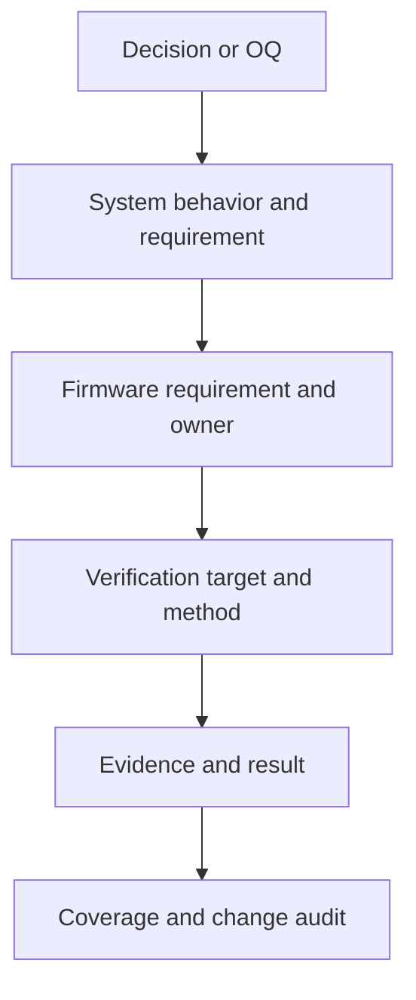

# 12 — System Traceability

**Document type:** Requirement and design traceability
**Document level:** System-to-firmware verification baseline
**Project:** Smart Water Flow and Pressure Monitor
**Short name:** SWFPM
**Status:** Initial baseline
**Language:** Vietnamese; canonical identifier và verification code có thể dùng tiếng Anh

---

## 1. Mục đích

Tài liệu này thiết lập traceability hai chiều giữa:

```text
Decision and open question
System behavior, sequence and interface
FSM, mode, data and error requirement
Firmware requirement
Implementation owner
Verification method and evidence
```

Mục tiêu:

* Chứng minh mỗi firmware requirement có nguồn và lý do rõ ràng.
* Chứng minh mỗi system requirement có downstream owner hoặc explicit deferred disposition.
* Phát hiện requirement bị bỏ sót, orphan, trùng nghĩa hoặc mâu thuẫn.
* Chỉ ra requirement nào đã đủ để triển khai và requirement nào còn phụ thuộc decision/TBD.
* Làm đầu vào cho firmware detailed design, hardware design, communication specification và validation plan.
* Không đánh dấu requirement là verified khi chưa có test/review evidence.

Tài liệu này không thay thế nội dung normative trong tài liệu nguồn.

---

## 2. Phạm vi

### 2.1. Trong phạm vi

* `DEC-SYS-*`, `DEC-ARCH-*` và `DEC-PWR-002` đã chốt.
* Open/deferred decision có ảnh hưởng tới implementation hoặc verification.
* `SEQ-001`–`SEQ-027`.
* `TR-SYS-*` trong system FSM.
* `IF-01`–`IF-13` và `LIF-01`–`LIF-15`.
* `REQ-FSM-001`–`REQ-FSM-024`.
* `REQ-MODE-001`–`REQ-MODE-031`.
* `REQ-DATA-001`–`REQ-DATA-052`.
* `REQ-ERR-001`–`REQ-ERR-045`.
* `REQ-FW-001`–`REQ-FW-074`.
* `REQ-RCP-001`–`REQ-RCP-056`.
* Verification method, owner, target document và evidence rule.

### 2.2. Ngoài phạm vi

* Test procedure cấp register/pin.
* Exact test vector và acceptance threshold chưa được quyết định.
* Schematic net-level trace.
* BLE packet/GATT, 4G/server payload và AT-command test case chi tiết.
* Leak algorithm numeric validation result.
* Production qualification report.
* Chứng nhận pháp lý hoặc metrology certification.

Các nội dung ngoài phạm vi phải bổ sung downstream trace link, không được tự đổi system behavior.

---

## 3. Source-of-truth và precedence

| Nội dung                                          | Source-of-truth                           |
| ------------------------------------------------- | ----------------------------------------- |
| Scope, baseline và document status                | `README.md`                               |
| Canonical term và identifier                      | `glossary.md`                             |
| Decision, OQ, gate và status                      | `00_open_questions_and_decisions.md`      |
| System purpose và boundary                        | `01_system_overview.md`                   |
| Physical/logical architecture                     | `02_system_block_diagram.md`              |
| Operating principle                               | `03_operating_principle.md`               |
| Main use-case flow                                | `04_main_operation_flow.md`               |
| Interaction sequence                              | `05_sequence_diagrams.md`                 |
| Primary FSM và transition                         | `06_system_fsm.md`                        |
| Permission/behavior theo mode                     | `07_operating_modes.md`                   |
| Data object, ownership và lifecycle               | `08_data_flow.md`                         |
| Fault, containment và recovery                    | `09_error_handling_overview.md`           |
| Physical/external/logical interface               | `10_system_interfaces.md`                 |
| Firmware architecture và requirement              | `11_firmware_implication.md`              |
| Reporting/time/connectivity policy và requirement | `13_reporting_and_connectivity_policy.md` |

Nếu ma trận này mâu thuẫn với nội dung normative của source owner:

1. Không sửa nghĩa requirement ngay trong ma trận.
2. Mở issue/decision hoặc sửa source owner.
3. Sau khi source được duyệt, cập nhật trace link và impact.

---

## 4. Traceability model



### 4.1. Link semantics

| Link          | Ý nghĩa                                                              |
| ------------- | -------------------------------------------------------------------- |
| `DERIVES`     | Requirement con được suy ra từ decision/requirement cha              |
| `REFINES`     | Downstream requirement thêm chi tiết nhưng không đổi ý nghĩa cha     |
| `REALIZES`    | Module/interface là nơi thực hiện requirement                        |
| `VERIFIES`    | Test/review/analysis tạo evidence cho requirement                    |
| `CONSTRAINS`  | Decision/TBD giới hạn implementation hoặc acceptance                 |
| `DEFERRED_TO` | Phần behavior chưa chốt được chuyển tới tài liệu/decision owner khác |
| `SUPERSEDES`  | Source mới thay thế source cũ qua approved change                    |

Một link không tự chứng minh implementation đúng. Chỉ `VERIFIES` kèm evidence được review mới cho phép đổi status thành `VERIFIED`.

---

## 5. Identifier và status model

### 5.1. Identifier family

| Family       | Owner                                  | Vai trò                                                           |
| ------------ | -------------------------------------- | ----------------------------------------------------------------- |
| `DEC-*`      | Decision registry                      | Chốt hoặc trì hoãn lựa chọn                                       |
| `OQ-*`       | Tài liệu nguồn/registry                | Câu hỏi cần resolution                                            |
| `SEQ-*`      | Sequence document                      | Scenario interaction                                              |
| `TR-SYS-*`   | FSM document                           | Primary mode transition                                           |
| `IF-*`       | Interface document                     | Physical/external interface                                       |
| `LIF-*`      | Interface document                     | Logical data/service interface                                    |
| `REQ-FSM-*`  | FSM document                           | FSM invariant/transition requirement                              |
| `REQ-MODE-*` | Operating modes document               | Mode permission/behavior requirement                              |
| `REQ-DATA-*` | Data-flow document                     | Ownership/data lifecycle requirement                              |
| `REQ-ERR-*`  | Error document                         | Fault/recovery requirement                                        |
| `REQ-FW-*`   | Firmware implication document          | Implementable firmware architecture requirement                   |
| `REQ-RCP-*`  | Reporting/connectivity policy document | Time, schedule, telemetry, offline và delivery-policy requirement |
| `VER-*`      | Tài liệu này                           | Verification target group; không phải requirement                 |

Không tạo `REQ-SYS-*` trong baseline này vì system behavior đã được định danh trong bốn họ `REQ-FSM/MODE/DATA/ERR`. Nếu cần một canonical system-requirement layer mới, phải có migration plan thay vì sao chép requirement hiện tại.

### 5.2. Requirement lifecycle status

| Status        | Ý nghĩa                                                       |
| ------------- | ------------------------------------------------------------- |
| `DEFINED`     | Normative text và owner đã tồn tại                            |
| `DEFERRED`    | Behavior/value được chuyển tới decision/tài liệu khác         |
| `BLOCKED`     | Không thể thiết kế/verify do thiếu decision bắt buộc          |
| `PLANNED`     | Verification target/method đã có nhưng chưa có evidence       |
| `IMPLEMENTED` | Có implementation reference nhưng chưa đủ evidence            |
| `VERIFIED`    | Evidence đã pass và được review                               |
| `FAILED`      | Evidence cho thấy implementation không đạt requirement        |
| `OBSOLETE`    | Chỉ dùng sau approved supersession; ID không được tái sử dụng |

Baseline hiện tại chỉ xác nhận `DEFINED` và `PLANNED`. Tài liệu này không tuyên bố implementation đã `IMPLEMENTED` hoặc `VERIFIED`.

---

## 6. Coverage snapshot

| Artifact                    | Số lượng | Coverage trong tài liệu 12                        |
| --------------------------- | -------: | ------------------------------------------------- |
| Decided baseline            |       34 | Decision-to-requirement mapping                   |
| Open/deferred decision      |       19 | Dependency/gate mapping                           |
| Sequence                    |       27 | Scenario-to-requirement mapping                   |
| Primary FSM transition      |       29 | Transition verification package                   |
| Physical/external interface |       13 | Interface-to-requirement mapping                  |
| Logical interface           |       15 | Producer/consumer and requirement mapping         |
| `REQ-FSM-*`                 |       24 | Forward coverage                                  |
| `REQ-MODE-*`                |       31 | Forward coverage                                  |
| `REQ-DATA-*`                |       52 | Forward coverage                                  |
| `REQ-ERR-*`                 |       45 | Forward coverage                                  |
| `REQ-FW-*`                  |       74 | Individual reverse trace                          |
| `REQ-RCP-*`                 |       56 | Policy requirement và verification-group coverage |
| Tổng requirement có ID      |      282 | Không có orphan family ở baseline                 |

Count là structural coverage, không phải verification pass rate.

---

## 7. Decided baseline traceability

| Decision        | System asset                                               | Firmware requirement                                                   | Verification target                                                              |
| --------------- | ---------------------------------------------------------- | ---------------------------------------------------------------------- | -------------------------------------------------------------------------------- |
| `DEC-SYS-001`   | `IF-06`–`IF-09`; `SEQ-012`, `SEQ-015`, `SEQ-019`           | `REQ-FW-066`–`REQ-FW-069`                                              | `VER-COMM`, `VER-ARCH`                                                           |
| `DEC-SYS-002`   | `IF-04`; `SEQ-007`–`SEQ-008`; `LIF-03`, `LIF-14`           | `REQ-FW-026`–`REQ-FW-027`, `REQ-FW-037`–`REQ-FW-041`                   | `VER-PRESSURE`, `VER-I2C`                                                        |
| `DEC-SYS-003`   | `SEQ-014`, `SEQ-017`; `LIF-09`                             | `REQ-FW-053`–`REQ-FW-055`                                              | `VER-TIME`                                                                       |
| `DEC-SYS-004`   | `SEQ-015`; `IF-08`, `IF-10`; `LIF-08`                      | `REQ-FW-050`–`REQ-FW-052`                                              | `VER-TIME`, `VER-COMM`                                                           |
| `DEC-SYS-005`   | `TR-SYS-015`; `REQ-FSM-003/014`                            | `REQ-FW-057`, `REQ-FW-067`                                             | `VER-MODE`, `VER-COMM`                                                           |
| `DEC-SYS-006`   | `SEQ-003`, `SEQ-015`–`SEQ-017`; `LIF-08`                   | `REQ-FW-014`, `REQ-FW-050`–`REQ-FW-052`                                | `VER-TIME`                                                                       |
| `DEC-SYS-007`   | `TR-SYS-*`; `REQ-FSM-*`, `REQ-MODE-*`                      | `REQ-FW-056`–`REQ-FW-065`                                              | `VER-MODE`, `VER-RECOVERY`                                                       |
| `DEC-SYS-008`   | `SEQ-019`–`SEQ-020`; `LIF-10`                              | `REQ-FW-007`, `REQ-FW-015`, `REQ-FW-067`, `REQ-RCP-041`–`REQ-RCP-052`  | `VER-COMM`; policy model defined trong document 13, production decisions pending |
| `DEC-ARCH-001`  | `SEQ-002`–`SEQ-004`; flow readiness requirements           | `REQ-FW-018`–`REQ-FW-019`, `REQ-FW-025`, `REQ-FW-061`–`REQ-FW-062`     | `VER-MEAS`, `VER-RECOVERY`                                                       |
| `DEC-ARCH-002`  | `SEQ-005`–`SEQ-006`; `LIF-13`                              | `REQ-FW-020`–`REQ-FW-022`                                              | `VER-MEAS`                                                                       |
| `DEC-ARCH-003`  | `SEQ-006`; flow admission requirements                     | `REQ-FW-022`–`REQ-FW-024`, `REQ-FW-031`–`REQ-FW-032`                   | `VER-MEAS`, `VER-DATA`                                                           |
| `DEC-ARCH-004`  | `TR-SYS-012/030`; `SEQ-009`                                | `REQ-FW-029`–`REQ-FW-030`, `REQ-FW-058`, `REQ-FW-073`                  | `VER-SERVICE`                                                                    |
| `DEC-ARCH-005`  | `IF-04`–`IF-05`; `LIF-14`                                  | `REQ-FW-037`–`REQ-FW-041`, `REQ-FW-059`–`REQ-FW-060`                   | `VER-I2C`                                                                        |
| `DEC-ARCH-006`  | `SEQ-010`–`SEQ-011`; `LIF-05`                              | `REQ-FW-033`–`REQ-FW-036`, `REQ-FW-074`                                | `VER-SNAPSHOT`                                                                   |
| `DEC-ARCH-007`  | `SEQ-012`–`SEQ-014`; `LIF-06`, `LIF-07`, `LIF-15`          | `REQ-FW-042`–`REQ-FW-046`                                              | `VER-CONFIG`                                                                     |
| `DEC-ARCH-008`  | `IF-08`–`IF-09`                                            | `REQ-FW-068`                                                           | `VER-ARCH`, `VER-BUILD`                                                          |
| `DEC-PWR-002`   | `REQ-FSM-022`–`REQ-FSM-024`; `REQ-MODE-029`–`REQ-MODE-031` | `REQ-FW-047`–`REQ-FW-049`, `REQ-FW-064`–`REQ-FW-065`, `REQ-FW-072`     | `VER-STORAGE`, `VER-POWER`                                                       |
| `DEC-MEAS-001`  | Measurement schedule/config flows                          | `REQ-FW-014`; product-profile validation                               | `VER-MEAS`, `VER-CONFIG`                                                         |
| `DEC-MEAS-002`  | `SEQ-003`–`SEQ-005`; MAX acquisition mode                  | `REQ-FW-020`, `REQ-FW-029`                                             | `VER-MEAS`, `VER-SERVICE`                                                        |
| `DEC-MEAS-003`  | `SEQ-007`–`SEQ-008`; ZSSC acquisition mode                 | `REQ-FW-027`; pressure acquisition FSM                                 | `VER-PRESSURE`, `VER-I2C`                                                        |
| `DEC-MEAS-004`  | Result quality/freshness/admission contract                | `REQ-FW-005`, `REQ-FW-026`, `REQ-FW-028`                               | `VER-MEAS`, `VER-DATA`                                                           |
| `DEC-LEAK-001`  | Leak evidence/state/profile behavior                       | `REQ-FW-032`; profile/config transaction                               | `VER-LEAK`, `VER-CONFIG`                                                         |
| `DEC-LEAK-002`  | Pressure trend supporting-only behavior                    | `REQ-FW-032`; pressure/leak correlation tests                          | `VER-LEAK`, `VER-PRESSURE`                                                       |
| `DEC-SCHED-001` | `SEQ-015`, `SEQ-017`; time-validity/holdover behavior      | `REQ-FW-050`, `REQ-FW-053`, `REQ-RCP-002`, `REQ-RCP-017`–`REQ-RCP-018` | `VER-TIME`, `VER-CONFIG`                                                         |
| `DEC-SCHED-002` | `SEQ-027`; missed-slot và wall-clock-adjustment behavior   | `REQ-FW-054`, `REQ-RCP-011`–`REQ-RCP-013`, `REQ-RCP-056`               | `VER-TIME`                                                                       |
| `DEC-SCHED-003` | `SEQ-021`; leak-state publication/telemetry trigger        | `REQ-FW-055`, `REQ-RCP-020`, `REQ-RCP-030`                             | `VER-COMM`, `VER-LEAK`                                                           |
| `DEC-SCHED-004` | `SEQ-014`, `SEQ-017`; schedule config/default/boundary     | `REQ-FW-053`–`REQ-FW-054`, `REQ-RCP-006`–`REQ-RCP-016`                 | `VER-TIME`, `VER-CONFIG`                                                         |

---

## 8. Physical và external interface traceability

| Interface                          | Firmware boundary                     | Requirement chính                                                               | Verification target                  |
| ---------------------------------- | ------------------------------------- | ------------------------------------------------------------------------------- | ------------------------------------ |
| `IF-01` MAX35103 SPI               | `Max35103Driver`                      | `REQ-FW-009`–`REQ-FW-014`, `REQ-FW-018`–`REQ-FW-025`                            | `VER-MEAS`                           |
| `IF-02` MAX35103 INT               | IRQ adapter/`AppEventQueue`           | `REQ-FW-010`–`REQ-FW-015`, `REQ-FW-025`                                         | `VER-EVENT`, `VER-MEAS`              |
| `IF-03` Ultrasonic transducer path | Hardware profile + flow pipeline      | `REQ-FW-006`, `REQ-FW-018`–`REQ-FW-025`                                         | Hardware validation + `VER-MEAS`     |
| `IF-04` ZSSC3241 I2C               | `Zssc3241Driver`/`I2cBusManager`      | `REQ-FW-026`–`REQ-FW-027`, `REQ-FW-037`–`REQ-FW-041`                            | `VER-PRESSURE`, `VER-I2C`            |
| `IF-05` F-RAM I2C                  | `FramDriver`/`StorageService`         | `REQ-FW-037`–`REQ-FW-041`, `REQ-FW-047`–`REQ-FW-049`, `REQ-FW-072`              | `VER-I2C`, `VER-STORAGE`             |
| `IF-06` BLE UART                   | `BleUartDriver`/`BleConfigService`    | `REQ-FW-009`–`REQ-FW-016`, `REQ-FW-042`–`REQ-FW-046`, `REQ-FW-066`              | `VER-COMM`, `VER-CONFIG`             |
| `IF-07` BLE client                 | Command/permission adapter            | `REQ-FW-042`–`REQ-FW-046`, `REQ-FW-066`, `REQ-FW-070`                           | `VER-CONFIG`, `VER-SECURITY`         |
| `IF-08` 4G UART                    | `CellularUartDriver`/cellular service | `REQ-FW-009`–`REQ-FW-016`, `REQ-FW-050`–`REQ-FW-052`, `REQ-FW-067`–`REQ-FW-068` | `VER-COMM`, `VER-TIME`               |
| `IF-09` Server                     | Telemetry protocol adapter            | `REQ-FW-055`, `REQ-FW-067`–`REQ-FW-069`                                         | `VER-COMM`; policy một phần deferred |
| `IF-10` STM32 RTC                  | `RtcDriver`/`TimeService`             | `REQ-FW-050`–`REQ-FW-055`                                                       | `VER-TIME`                           |
| `IF-11` LCD                        | `LcdService`/`LcdDriver`              | `REQ-FW-016`, `REQ-FW-035`, `REQ-FW-069`                                        | `VER-DISPLAY`, `VER-SNAPSHOT`        |
| `IF-12` Power                      | `PowerManager`/platform reset         | `REQ-FW-017`, `REQ-FW-063`–`REQ-FW-065`                                         | `VER-POWER`                          |
| `IF-13` Debug/service              | Service/build profile                 | `REQ-FW-029`–`REQ-FW-030`, `REQ-FW-058`, `REQ-FW-070`, `REQ-FW-073`             | `VER-SERVICE`, `VER-BUILD`           |

---

## 9. Logical interface traceability

| LIF      | Producer/owner                         | Firmware requirement                                                | Verification target         |
| -------- | -------------------------------------- | ------------------------------------------------------------------- | --------------------------- |
| `LIF-01` | `MeasurementManager`                   | `REQ-FW-018`–`REQ-FW-020`, `REQ-FW-022`, `REQ-FW-025`, `REQ-FW-028` | `VER-MEAS`                  |
| `LIF-02` | `CalibrationService`                   | `REQ-FW-021`–`REQ-FW-025`, `REQ-FW-031`                             | `VER-MEAS`, `VER-DATA`      |
| `LIF-03` | `PressureProcessingService`            | `REQ-FW-026`–`REQ-FW-028`, `REQ-FW-032`                             | `VER-PRESSURE`              |
| `LIF-04` | `LeakDetectionService`                 | `REQ-FW-032`, `REQ-FW-035`                                          | `VER-LEAK`                  |
| `LIF-05` | `DataRepository`                       | `REQ-FW-033`–`REQ-FW-036`, `REQ-FW-069`, `REQ-FW-074`               | `VER-SNAPSHOT`              |
| `LIF-06` | `BleConfigService`                     | `REQ-FW-042`, `REQ-FW-045`, `REQ-FW-066`                            | `VER-CONFIG`                |
| `LIF-07` | `ConfigRepository`                     | `REQ-FW-043`, `REQ-FW-046`–`REQ-FW-049`                             | `VER-CONFIG`, `VER-STORAGE` |
| `LIF-08` | `TimeService`                          | `REQ-FW-014`, `REQ-FW-050`–`REQ-FW-052`                             | `VER-TIME`                  |
| `LIF-09` | `ReportingScheduler`                   | `REQ-FW-053`–`REQ-FW-055`                                           | `VER-TIME`                  |
| `LIF-10` | `TelemetryBuilder`                     | `REQ-FW-035`, `REQ-FW-055`, `REQ-FW-067`–`REQ-FW-069`               | `VER-COMM`                  |
| `LIF-11` | `LcdService`                           | `REQ-FW-035`, `REQ-FW-069`                                          | `VER-DISPLAY`               |
| `LIF-12` | Active resource owner                  | `REQ-FW-063`–`REQ-FW-065`                                           | `VER-POWER`                 |
| `LIF-13` | `CalibrationService`                   | `REQ-FW-020`–`REQ-FW-024`                                           | `VER-MEAS`                  |
| `LIF-14` | `I2cBusManager`                        | `REQ-FW-037`–`REQ-FW-041`, `REQ-FW-059`–`REQ-FW-060`                | `VER-I2C`                   |
| `LIF-15` | `ConfigRepository` và affected service | `REQ-FW-042`–`REQ-FW-046`                                           | `VER-CONFIG`                |

---

## 10. Sequence và FSM transition coverage

### 10.1. Sequence coverage

| Sequence            | Requirement coverage                                                             | Verification target        |
| ------------------- | -------------------------------------------------------------------------------- | -------------------------- |
| `SEQ-001`–`SEQ-002` | `REQ-FW-018`–`REQ-FW-019`, `REQ-FW-047`–`REQ-FW-049`, `REQ-FW-056`, `REQ-FW-065` | `VER-BOOT`, `VER-STORAGE`  |
| `SEQ-003`–`SEQ-006` | `REQ-FW-018`–`REQ-FW-025`, `REQ-FW-028`, `REQ-FW-031`                            | `VER-MEAS`                 |
| `SEQ-007`–`SEQ-008` | `REQ-FW-026`–`REQ-FW-028`, `REQ-FW-032`, `REQ-FW-037`–`REQ-FW-041`               | `VER-PRESSURE`, `VER-I2C`  |
| `SEQ-009`–`SEQ-011` | `REQ-FW-031`–`REQ-FW-036`, `REQ-FW-069`, `REQ-FW-074`                            | `VER-DATA`, `VER-SNAPSHOT` |
| `SEQ-012`–`SEQ-014` | `REQ-FW-042`–`REQ-FW-046`, `REQ-FW-053`–`REQ-FW-055`, `REQ-FW-066`               | `VER-CONFIG`, `VER-TIME`   |
| `SEQ-015`–`SEQ-017` | `REQ-FW-014`, `REQ-FW-050`–`REQ-FW-055`                                          | `VER-TIME`                 |
| `SEQ-018`–`SEQ-020` | `REQ-FW-015`, `REQ-FW-035`, `REQ-FW-055`, `REQ-FW-067`–`REQ-FW-069`              | `VER-COMM`                 |
| `SEQ-021`           | `REQ-FW-032`, `REQ-FW-035`, `REQ-FW-069`                                         | `VER-LEAK`, `VER-SNAPSHOT` |
| `SEQ-022`–`SEQ-023` | `REQ-FW-014`, `REQ-FW-057`, `REQ-FW-063`                                         | `VER-POWER`, `VER-MODE`    |
| `SEQ-024`           | `REQ-FW-047`–`REQ-FW-049`, `REQ-FW-072`                                          | `VER-STORAGE`              |
| `SEQ-025`–`SEQ-027` | `REQ-FW-009`–`REQ-FW-016`, `REQ-FW-054`–`REQ-FW-055`, `REQ-FW-067`, `REQ-FW-071` | `VER-EVENT`, `VER-TIME`    |

### 10.2. FSM transition package

| Transition group          | Requirement coverage                                            | Verification                                |
| ------------------------- | --------------------------------------------------------------- | ------------------------------------------- |
| `TR-SYS-001`–`TR-SYS-005` | Init/readiness/service/recovery guards                          | Model-based transition test + boot scenario |
| `TR-SYS-010`–`TR-SYS-016` | Normal dispatch, low-power, service, recovery và offline status | Guard/action/next-mode test                 |
| `TR-SYS-020`–`TR-SYS-023` | Wake reason và low-power behavior                               | Platform integration + scenario test        |
| `TR-SYS-030`–`TR-SYS-033` | SERVICE exit/recovery/error/authorization                       | Service isolation + authorization test      |
| `TR-SYS-040`–`TR-SYS-044` | Recovery success/failure/affected scope                         | Fault injection + ordered-plan test         |
| `TR-SYS-050`–`TR-SYS-053` | ERROR recovery/reinitialize/diagnostic restriction              | Negative transition + permission test       |

Mỗi transition phải có test cho valid path, failed guard và side-effect idempotency. Brownout/reset là platform restart tới `INIT`, không được thêm transition qua `ERROR` hoặc `SHUTDOWN`.

---

## 11. Forward trace của system requirement

### 11.1. FSM requirement

| Source requirement          | Downstream realization                                                            | Disposition                                        |
| --------------------------- | --------------------------------------------------------------------------------- | -------------------------------------------------- |
| `REQ-FSM-001`–`REQ-FSM-003` | `REQ-FW-056`, `REQ-FW-057`, `REQ-FW-065`                                          | `REFINES`                                          |
| `REQ-FSM-004`–`REQ-FSM-008` | `REQ-FW-025`, `REQ-FW-059`–`REQ-FW-063`                                           | `REFINES`                                          |
| `REQ-FSM-009`–`REQ-FSM-015` | `REQ-FW-012`, `REQ-FW-014`, `REQ-FW-050`, `REQ-FW-056`–`REQ-FW-057`, `REQ-FW-065` | `REFINES`; transition atomicity kiểm tra trực tiếp |
| `REQ-FSM-016`–`REQ-FSM-018` | `REQ-FW-018`–`REQ-FW-019`, `REQ-FW-025`, `REQ-FW-061`–`REQ-FW-062`                | `REFINES`                                          |
| `REQ-FSM-019`–`REQ-FSM-021` | `REQ-FW-029`–`REQ-FW-030`, `REQ-FW-058`, `REQ-FW-073`                             | `REFINES`                                          |
| `REQ-FSM-022`–`REQ-FSM-024` | `REQ-FW-047`, `REQ-FW-064`–`REQ-FW-065`, `REQ-FW-072`                             | `REFINES`                                          |

### 11.2. Operating-mode requirement

| Source requirement            | Downstream realization                                                                                                      | Disposition                                 |
| ----------------------------- | --------------------------------------------------------------------------------------------------------------------------- | ------------------------------------------- |
| `REQ-MODE-001`–`REQ-MODE-006` | `REQ-FW-002`, `REQ-FW-005`, `REQ-FW-018`, `REQ-FW-026`, `REQ-FW-056`–`REQ-FW-057`, `REQ-FW-067`                             | `REFINES`                                   |
| `REQ-MODE-007`–`REQ-MODE-008` | `REQ-FW-063`; wake-reason capture thuộc `PowerManager`/platform contract                                                    | `REFINES + DIRECT`                          |
| `REQ-MODE-009`–`REQ-MODE-015` | `REQ-FW-029`–`REQ-FW-030`, `REQ-FW-056`, `REQ-FW-058`, `REQ-FW-061`–`REQ-FW-062`, `REQ-FW-073`                              | `REFINES`; authorization kiểm tra trực tiếp |
| `REQ-MODE-016`–`REQ-MODE-020` | `REQ-FW-014`, `REQ-FW-016`–`REQ-FW-017`, `REQ-FW-047`, `REQ-FW-050`, `REQ-FW-057`, `REQ-FW-065`, `REQ-FW-067`, `REQ-FW-069` | `REFINES`                                   |
| `REQ-MODE-021`–`REQ-MODE-024` | `REQ-FW-018`–`REQ-FW-019`, `REQ-FW-025`, `REQ-FW-061`–`REQ-FW-062`                                                          | `REFINES`                                   |
| `REQ-MODE-025`–`REQ-MODE-028` | `REQ-FW-029`–`REQ-FW-030`, `REQ-FW-058`, `REQ-FW-073`                                                                       | `REFINES`                                   |
| `REQ-MODE-029`–`REQ-MODE-031` | `REQ-FW-047`, `REQ-FW-064`–`REQ-FW-065`, `REQ-FW-072`                                                                       | `REFINES`                                   |

### 11.3. Data-flow requirement

| Source requirement            | Downstream realization                                                                                                      | Disposition                                                                            |
| ----------------------------- | --------------------------------------------------------------------------------------------------------------------------- | -------------------------------------------------------------------------------------- |
| `REQ-DATA-001`–`REQ-DATA-009` | `REQ-FW-002`–`REQ-FW-005`, `REQ-FW-020`–`REQ-FW-032`, `REQ-FW-073`                                                          | `REFINES`                                                                              |
| `REQ-DATA-010`–`REQ-DATA-013` | `REQ-FW-033`–`REQ-FW-036`, `REQ-FW-069`, `REQ-FW-074`                                                                       | `REFINES`                                                                              |
| `REQ-DATA-014`–`REQ-DATA-016` | `REQ-FW-042`–`REQ-FW-046`                                                                                                   | `REFINES`                                                                              |
| `REQ-DATA-017`–`REQ-DATA-022` | `REQ-FW-014`–`REQ-FW-015`, `REQ-FW-035`, `REQ-FW-050`, `REQ-FW-055`, `REQ-FW-067`–`REQ-FW-069`, `REQ-RCP-001`–`REQ-RCP-048` | `REFINES`; document 13 định nghĩa invariant/options, exact ACK/queue decision vẫn open |
| `REQ-DATA-023`–`REQ-DATA-028` | `REQ-FW-012`, `REQ-FW-031`, `REQ-FW-035`, `REQ-FW-047`–`REQ-FW-049`, `REQ-FW-056`, `REQ-FW-067`                             | `REFINES`; secret exclusion là `DIRECT`                                                |
| `REQ-DATA-029`–`REQ-DATA-038` | `REQ-FW-018`–`REQ-FW-025`, `REQ-FW-031`–`REQ-FW-032`                                                                        | `REFINES`                                                                              |
| `REQ-DATA-039`–`REQ-DATA-042` | `REQ-FW-028`–`REQ-FW-030`, `REQ-FW-058`, `REQ-FW-073`                                                                       | `REFINES`                                                                              |
| `REQ-DATA-043`–`REQ-DATA-049` | `REQ-FW-033`–`REQ-FW-046`, `REQ-FW-059`–`REQ-FW-060`, `REQ-FW-074`                                                          | `REFINES`                                                                              |
| `REQ-DATA-050`–`REQ-DATA-052` | `REQ-FW-047`–`REQ-FW-049`, `REQ-FW-064`–`REQ-FW-065`, `REQ-FW-072`                                                          | `REFINES`                                                                              |

### 11.4. Error-handling requirement

| Source requirement          | Downstream realization                                                                                      | Disposition                                                     |
| --------------------------- | ----------------------------------------------------------------------------------------------------------- | --------------------------------------------------------------- |
| `REQ-ERR-001`–`REQ-ERR-005` | `REQ-FW-008`, `REQ-FW-026`–`REQ-FW-027`, `REQ-FW-032`, `REQ-FW-057`, `REQ-FW-059`                           | `REFINES + DIRECT` fault taxonomy                               |
| `REQ-ERR-006`–`REQ-ERR-018` | `REQ-FW-007`–`REQ-FW-008`, `REQ-FW-012`–`REQ-FW-017`, `REQ-FW-050`, `REQ-FW-056`, `REQ-FW-059`–`REQ-FW-065` | `REFINES`; lifecycle/primary-fault retention kiểm tra trực tiếp |
| `REQ-ERR-019`–`REQ-ERR-026` | `REQ-FW-023`–`REQ-FW-032`, `REQ-FW-045`, `REQ-FW-050`, `REQ-FW-057`, `REQ-FW-067`–`REQ-FW-069`              | `REFINES`; delivery ACK một phần deferred                       |
| `REQ-ERR-027`–`REQ-ERR-032` | `REQ-FW-015`, `REQ-FW-017`, `REQ-FW-035`, `REQ-FW-064`–`REQ-FW-065`, `REQ-FW-069`–`REQ-FW-070`              | `REFINES + DIRECT` diagnostic security                          |
| `REQ-ERR-033`–`REQ-ERR-038` | `REQ-FW-018`–`REQ-FW-025`, `REQ-FW-031`–`REQ-FW-032`                                                        | `REFINES`                                                       |
| `REQ-ERR-039`–`REQ-ERR-042` | `REQ-FW-037`–`REQ-FW-041`, `REQ-FW-059`–`REQ-FW-060`, `REQ-FW-071`                                          | `REFINES`                                                       |
| `REQ-ERR-043`–`REQ-ERR-045` | `REQ-FW-047`–`REQ-FW-049`, `REQ-FW-064`–`REQ-FW-065`, `REQ-FW-072`                                          | `REFINES`                                                       |

### 11.5. Direct system constraint không có dedicated REQ-FW child

Các requirement sau vẫn có downstream owner và verification; chúng không phải orphan:

| Source requirement                           | Direct owner                                                  | Verification                                                                    |
| -------------------------------------------- | ------------------------------------------------------------- | ------------------------------------------------------------------------------- |
| `REQ-FSM-007`, `REQ-MODE-015`, `REQ-ERR-013` | `SystemModeManager` transition table                          | Static transition inspection + negative model test                              |
| `REQ-FSM-011`, `REQ-FSM-012`                 | `SystemModeManager`/event contract                            | Atomic publication review + duplicate-event test                                |
| `REQ-MODE-008`                               | `PowerManager`/platform wake adapter                          | Wake-cause injection and capture test                                           |
| `REQ-MODE-010`, `REQ-ERR-022`                | Service/BLE authorization boundary                            | Permission/allowlist negative test                                              |
| `REQ-DATA-025`, `REQ-ERR-031`                | `DiagnosticsService`, snapshot, LCD và telemetry schema owner | Secret/credential field inspection and redaction test                           |
| `REQ-ERR-001`–`REQ-ERR-003`                  | Fault model/`DiagnosticsService`                              | Type/schema inspection + fault-report unit test                                 |
| `REQ-ERR-014`–`REQ-ERR-018`                  | `DiagnosticsService`/`RecoveryCoordinator`                    | Fault lifecycle, primary-cause and time-quality tests                           |
| `REQ-DATA-020`–`REQ-DATA-022`, `REQ-ERR-024` | `TelemetryQueue`/communication policy                         | `REQ-RCP-019`, `REQ-RCP-037`–`REQ-RCP-048`; exact ACK/retention choice vẫn open |

### 11.6. Reporting and connectivity requirement

| Source requirement                         | Downstream realization                               | Verification                               |
| ------------------------------------------ | ---------------------------------------------------- | ------------------------------------------ |
| `REQ-RCP-001`–`REQ-RCP-018`, `REQ-RCP-056` | `TimeService`, `ReportingScheduler`, `RtcDriver`     | `VER-TIME`, `VER-CONFIG`                   |
| `REQ-RCP-019`–`REQ-RCP-030`                | `TelemetryBuilder`, `DataRepository`, schema adapter | `VER-COMM`, `VER-SNAPSHOT`, `VER-SECURITY` |
| `REQ-RCP-031`–`REQ-RCP-040`                | `CellularTelemetryService`, protocol adapter         | `VER-COMM`, `VER-SECURITY`                 |
| `REQ-RCP-041`–`REQ-RCP-048`                | `TelemetryQueue`, retry/power policy                 | `VER-COMM`, `VER-POWER`, `VER-STORAGE`     |
| `REQ-RCP-049`–`REQ-RCP-055`                | `BleConfigService`, build/security/test owners       | `VER-CONFIG`, `VER-BUILD`, `VER-SECURITY`  |

---

## 12. Reverse trace cho từng firmware requirement

### 12.1. Verification method code

| Code  | Phương pháp                                             |
| ----- | ------------------------------------------------------- |
| `R`   | Review/analysis của design, contract hoặc policy        |
| `SA`  | Static analysis, dependency/lint hoặc source inspection |
| `UT`  | Unit test                                               |
| `CT`  | Component/driver test                                   |
| `IT`  | Integration test                                        |
| `MBT` | Model-based/state-transition test                       |
| `FI`  | Controlled fault injection                              |
| `HIL` | Hardware-in-the-loop test                               |
| `PCT` | Power-cycle/reset-interruption test                     |
| `SEC` | Permission/security/forbidden-path test                 |
| `BT`  | Build/profile verification                              |

Status mặc định của mọi row trong mục 12 là `PLANNED` cho tới khi evidence ID và result được ghi nhận.

### 12.2. Architecture và ownership — REQ-FW-001 đến REQ-FW-008

| Firmware requirement | Parent source                                                               | Implementation owner              | Method      |
| -------------------- | --------------------------------------------------------------------------- | --------------------------------- | ----------- |
| `REQ-FW-001`         | 01 `12; 02 logical architecture; 10 interface boundary                      | Firmware architecture/build owner | `R, SA`     |
| `REQ-FW-002`         | `REQ-DATA-001`, `REQ-FSM-002`, `REQ-MODE-001`                               | Module owners/architecture owner  | `R, SA`     |
| `REQ-FW-003`         | `DEC-ARCH-005`; `REQ-DATA-043`–`REQ-DATA-044`                               | Domain-service owners             | `SA, BT`    |
| `REQ-FW-004`         | `REQ-DATA-001`, `REQ-DATA-003`, `REQ-DATA-008`–`REQ-DATA-009`               | Driver/domain owners              | `SA, UT`    |
| `REQ-FW-005`         | `REQ-DATA-004`–`REQ-DATA-007`, `REQ-DATA-011`–`REQ-DATA-012`, `REQ-ERR-032` | All result consumers              | `R, UT, IT` |
| `REQ-FW-006`         | `DEC-HW-001`–`DEC-HW-008`; document 10 hardware/profile boundary            | Platform/profile owner            | `R, SA, BT` |
| `REQ-FW-007`         | `REQ-FSM-008`, `REQ-MODE-012`, `REQ-ERR-006`, `REQ-ERR-011`–`REQ-ERR-012`   | Policy/recovery owners            | `R, SA, FI` |
| `REQ-FW-008`         | `REQ-ERR-001`–`REQ-ERR-003`; `DEC-ERR-005`                                  | Fault model/`DiagnosticsService`  | `R, UT`     |

### 12.3. Execution, event và callback — REQ-FW-009 đến REQ-FW-017

| Firmware requirement | Parent source                                                                     | Implementation owner                            | Method             |
| -------------------- | --------------------------------------------------------------------------------- | ----------------------------------------------- | ------------------ |
| `REQ-FW-009`         | `REQ-MODE-019`, `REQ-DATA-027`, `REQ-ERR-023`; `IF-01`, `IF-04`, `IF-06`, `IF-08` | `AppEventLoop` và async service owners          | `R, IT, HIL`       |
| `REQ-FW-010`         | `REQ-DATA-003`; `IF-02` callback boundary                                         | Driver IRQ/DMA adapter owners                   | `SA, CT`           |
| `REQ-FW-011`         | `REQ-DATA-003`, `REQ-DATA-008`–`REQ-DATA-009`                                     | Driver IRQ/DMA adapter owners                   | `SA, CT`           |
| `REQ-FW-012`         | `REQ-FSM-012`, `REQ-DATA-026`, `REQ-ERR-008`, `REQ-ERR-042`                       | Event/request owners                            | `UT, IT, FI`       |
| `REQ-FW-013`         | `REQ-DATA-026`, `REQ-ERR-008`, `LIF-14`, `LIF-15`                                 | Async operation owners                          | `UT, IT, FI`       |
| `REQ-FW-014`         | `DEC-MEAS-001`; `REQ-FSM-009`–`REQ-FSM-010`, `REQ-DATA-017`, `REQ-ERR-018`        | `MonotonicClock`/deadline owners                | `UT, MBT`          |
| `REQ-FW-015`         | `REQ-DATA-022`, `REQ-ERR-017`; interface buffering rules                          | Queue/RX-buffer owners                          | `R, UT, stress IT` |
| `REQ-FW-016`         | `REQ-MODE-019`, `REQ-DATA-027`, `REQ-ERR-023`; priority rules                     | `AppEventLoop`, LCD/BLE/cellular/storage owners | `IT, HIL`          |
| `REQ-FW-017`         | `REQ-ERR-028`                                                                     | `WatchdogSupervisor`                            | `UT, FI, HIL`      |

### 12.4. Measurement và product processing — REQ-FW-018 đến REQ-FW-032

| Firmware requirement | Parent source                                                                                                                          | Implementation owner                         | Method           |
| -------------------- | -------------------------------------------------------------------------------------------------------------------------------------- | -------------------------------------------- | ---------------- |
| `REQ-FW-018`         | `DEC-ARCH-001`; `REQ-FSM-016`, `REQ-MODE-021`, `REQ-DATA-029`, `REQ-ERR-033`                                                           | `SystemManager`/`MeasurementManager`         | `MBT, IT, HIL`   |
| `REQ-FW-019`         | `REQ-FSM-016`, `REQ-DATA-029`, `REQ-ERR-033`                                                                                           | `SystemManager`/data restore path            | `IT, PCT`        |
| `REQ-FW-020`         | `DEC-ARCH-002`, `DEC-MEAS-002`; `REQ-DATA-032`; `SEQ-003`–`SEQ-005`                                                                    | `MeasurementManager`                         | `R, SA, UT, HIL` |
| `REQ-FW-021`         | `DEC-ARCH-002`; `REQ-DATA-033`–`REQ-DATA-034`                                                                                          | `CalibrationService`                         | `R, SA, UT`      |
| `REQ-FW-022`         | `REQ-DATA-006`, `REQ-DATA-034`–`REQ-DATA-035`                                                                                          | `CalibrationService`                         | `UT, IT`         |
| `REQ-FW-023`         | `DEC-ARCH-003`; `REQ-DATA-035`–`REQ-DATA-038`, `REQ-ERR-036`–`REQ-ERR-038`                                                             | `CalibrationService` và production consumers | `UT, IT, FI`     |
| `REQ-FW-024`         | `REQ-DATA-035`, `REQ-ERR-036`                                                                                                          | `CalibrationService`                         | `UT, IT`         |
| `REQ-FW-025`         | `DEC-ARCH-001`; `REQ-FSM-017`–`REQ-FSM-018`, `REQ-MODE-022`–`REQ-MODE-024`, `REQ-DATA-030`–`REQ-DATA-031`, `REQ-ERR-034`–`REQ-ERR-035` | `MeasurementManager`/`RecoveryCoordinator`   | `MBT, FI, HIL`   |
| `REQ-FW-026`         | `REQ-DATA-004`, `REQ-DATA-007`; `LIF-03`                                                                                               | `PressureProcessingService`                  | `UT, CT, HIL`    |
| `REQ-FW-027`         | `REQ-DATA-007`, `REQ-ERR-020`                                                                                                          | Pressure/flow result owners                  | `UT, IT, FI`     |
| `REQ-FW-028`         | `REQ-DATA-004`, `REQ-DATA-039`–`REQ-DATA-042`                                                                                          | Measurement/result owners                    | `R, UT, IT`      |
| `REQ-FW-029`         | `DEC-ARCH-004`; `REQ-FSM-019`–`REQ-FSM-020`, `REQ-MODE-025`–`REQ-MODE-027`, `REQ-DATA-039`–`REQ-DATA-041`                              | Measurement/product consumer owners          | `MBT, IT, FI`    |
| `REQ-FW-030`         | `REQ-FSM-021`, `REQ-MODE-028`, `REQ-DATA-042`                                                                                          | `MeasurementManager`/mode transition actions | `MBT, IT`        |
| `REQ-FW-031`         | `REQ-DATA-008`, `REQ-DATA-026`, `REQ-ERR-008`                                                                                          | `VolumeAccumulator`                          | `UT, IT`         |
| `REQ-FW-032`         | `DEC-LEAK-001`; `REQ-DATA-005`, `REQ-DATA-007`, `REQ-ERR-020`, `REQ-ERR-032`                                                           | `LeakDetectionService`                       | `UT, FI, SIM`    |

### 12.5. Repository, snapshot và I2C — REQ-FW-033 đến REQ-FW-041

| Firmware requirement | Parent source                                                                 | Implementation owner                | Method             |
| -------------------- | ----------------------------------------------------------------------------- | ----------------------------------- | ------------------ |
| `REQ-FW-033`         | `DEC-ARCH-006`; `REQ-DATA-010`, `REQ-DATA-045`                                | `DataRepository`                    | `R, SA, stress IT` |
| `REQ-FW-034`         | `REQ-DATA-010`, `REQ-DATA-045`–`REQ-DATA-046`                                 | `DataRepository` và readers         | `SA, stress IT`    |
| `REQ-FW-035`         | `REQ-DATA-004`, `REQ-DATA-011`, `REQ-DATA-017`, `REQ-DATA-028`, `REQ-ERR-018` | `DataRepository`                    | `UT, IT`           |
| `REQ-FW-036`         | `REQ-DATA-012`, `REQ-DATA-046`                                                | `DataRepository`/snapshot consumers | `SA, stress IT`    |
| `REQ-FW-037`         | `DEC-ARCH-005`; `REQ-DATA-043`, `REQ-ERR-039`                                 | `I2cBusManager`/board binding       | `SA, BT, HIL`      |
| `REQ-FW-038`         | `REQ-DATA-044`, `REQ-ERR-040`                                                 | Pressure/storage driver owners      | `SA, BT`           |
| `REQ-FW-039`         | `REQ-DATA-044`, `REQ-ERR-041`–`REQ-ERR-042`; `LIF-14`                         | `I2cBusManager`                     | `UT, CT, HIL`      |
| `REQ-FW-040`         | `REQ-ERR-006`–`REQ-ERR-007`, `REQ-ERR-011`–`REQ-ERR-012`, `REQ-ERR-041`       | `I2cBusManager`                     | `FI, HIL`          |
| `REQ-FW-041`         | 10 event priority; shared I2C contention behavior                             | `I2cBusManager` scheduler           | `CT, stress HIL`   |

---

### 12.6. Configuration, persistence, time và reporting — REQ-FW-042 đến REQ-FW-055

| Firmware requirement | Parent source                                                                                                                          | Implementation owner                    | Method             |
| -------------------- | -------------------------------------------------------------------------------------------------------------------------------------- | --------------------------------------- | ------------------ |
| `REQ-FW-042`         | `REQ-DATA-014`; `LIF-06`                                                                                                               | `BleConfigService`/`ConfigRepository`   | `UT, IT, SEC`      |
| `REQ-FW-043`         | `REQ-DATA-015`; `LIF-07`                                                                                                               | `ConfigRepository`/`StorageService`     | `UT, IT, PCT`      |
| `REQ-FW-044`         | `DEC-ARCH-007`; `REQ-DATA-047`–`REQ-DATA-048`; `LIF-15`                                                                                | `ConfigRepository` và affected services | `UT, IT`           |
| `REQ-FW-045`         | `REQ-DATA-049`, `REQ-ERR-022`; `SEQ-012`–`SEQ-014`                                                                                     | `BleConfigService`/`ConfigRepository`   | `IT, negative SEC` |
| `REQ-FW-046`         | `REQ-DATA-001`, `REQ-DATA-014`–`REQ-DATA-016`                                                                                          | `ConfigRepository`                      | `R, SA, UT`        |
| `REQ-FW-047`         | `DEC-PWR-002`; `REQ-DATA-023`–`REQ-DATA-024`, `REQ-DATA-050`–`REQ-DATA-051`, `REQ-ERR-021`, `REQ-ERR-027`, `REQ-ERR-043`–`REQ-ERR-044` | `StorageService`                        | `R, PCT, HIL`      |
| `REQ-FW-048`         | `REQ-DATA-023`, `REQ-DATA-052`, `REQ-ERR-045`, `REQ-MODE-003`                                                                          | `StorageService`/boot restore           | `UT, PCT`          |
| `REQ-FW-049`         | `REQ-DATA-023`, `REQ-ERR-021`, `REQ-ERR-032`                                                                                           | `StorageService`/`DiagnosticsService`   | `UT, IT, PCT`      |
| `REQ-FW-050`         | `DEC-SYS-006`, `DEC-SCHED-001`; `REQ-FSM-009`–`REQ-FSM-010`, `REQ-MODE-016`, `REQ-DATA-017`, `REQ-ERR-018`, `REQ-ERR-025`              | `MonotonicClock`/`TimeService`          | `UT, MBT, HIL`     |
| `REQ-FW-051`         | `DEC-SYS-004`; `SEQ-015`                                                                                                               | `TimeService`                           | `UT, IT`           |
| `REQ-FW-052`         | `DEC-SYS-006`; `SEQ-016`                                                                                                               | `TimeService`/MAX timing adapter        | `R, UT`            |
| `REQ-FW-053`         | `DEC-SYS-003`, `DEC-SCHED-001`, `DEC-SCHED-004`; `LIF-09`; reporting-window/time-invalid behavior                                      | `ReportingScheduler`/`ConfigRepository` | `UT, IT`           |
| `REQ-FW-054`         | `SEQ-014`, `SEQ-017`, `SEQ-027`; `DEC-SCHED-002`                                                                                       | `ReportingScheduler`/`RtcDriver`        | `UT, MBT, HIL`     |
| `REQ-FW-055`         | `DEC-SCHED-003`; `REQ-FSM-012`, `REQ-DATA-026`; `SEQ-017`, `SEQ-021`, `SEQ-027`                                                        | `ReportingScheduler`/`TelemetryQueue`   | `UT, MBT`          |

### 12.7. Mode, recovery và power — REQ-FW-056 đến REQ-FW-065

| Firmware requirement | Parent source                                                                                                           | Implementation owner                      | Method          |
| -------------------- | ----------------------------------------------------------------------------------------------------------------------- | ----------------------------------------- | --------------- |
| `REQ-FW-056`         | `REQ-FSM-002`, `REQ-FSM-011`, `REQ-MODE-001`; `TR-SYS-*`                                                                | `SystemModeManager`                       | `R, SA, MBT`    |
| `REQ-FW-057`         | `DEC-SYS-005`, `DEC-SYS-007`; `REQ-FSM-003`, `REQ-FSM-013`–`REQ-FSM-014`, `REQ-MODE-005`, `REQ-MODE-018`                | `SystemModeManager`/status owners         | `MBT, IT, FI`   |
| `REQ-FW-058`         | `DEC-ARCH-004`; `REQ-FSM-019`–`REQ-FSM-021`, `REQ-MODE-025`–`REQ-MODE-028`                                              | `SystemModeManager`/measurement scheduler | `MBT, IT`       |
| `REQ-FW-059`         | `REQ-FSM-004`, `REQ-ERR-005`, `REQ-ERR-009`–`REQ-ERR-010`, `REQ-ERR-039`–`REQ-ERR-041`                                  | Resource owners/`RecoveryCoordinator`     | `R, FI, HIL`    |
| `REQ-FW-060`         | `REQ-ERR-041`–`REQ-ERR-042`                                                                                             | Driver/resource owners                    | `UT, FI, HIL`   |
| `REQ-FW-061`         | `REQ-FSM-008`, `REQ-FSM-018`, `REQ-MODE-012`, `REQ-MODE-024`, `REQ-ERR-007`, `REQ-ERR-010`, `REQ-ERR-035`               | `RecoveryCoordinator`                     | `MBT, FI, HIL`  |
| `REQ-FW-062`         | `REQ-FSM-008`, `REQ-FSM-018`, `REQ-MODE-012`, `REQ-MODE-023`, `REQ-ERR-006`, `REQ-ERR-011`–`REQ-ERR-012`                | `RecoveryCoordinator`/`SystemModeManager` | `MBT, FI`       |
| `REQ-FW-063`         | `REQ-FSM-005`, `REQ-MODE-007`; `LIF-12`                                                                                 | `PowerManager`                            | `UT, IT, HIL`   |
| `REQ-FW-064`         | `DEC-PWR-002`; `REQ-FSM-022`, `REQ-FSM-024`, `REQ-MODE-029`, `REQ-MODE-031`, `REQ-ERR-043`–`REQ-ERR-044`                | `PowerManager`/platform/storage design    | `R, SA, PCT`    |
| `REQ-FW-065`         | `REQ-FSM-001`, `REQ-FSM-015`, `REQ-FSM-023`, `REQ-MODE-020`, `REQ-MODE-030`, `REQ-ERR-029`, `REQ-ERR-043`–`REQ-ERR-045` | Platform boot/`SystemManager`             | `PCT, HIL, MBT` |

### 12.8. Communication, build và verification — REQ-FW-066 đến REQ-FW-074

| Firmware requirement | Parent source                                                                                                                             | Implementation owner                      | Method          |
| -------------------- | ----------------------------------------------------------------------------------------------------------------------------------------- | ----------------------------------------- | --------------- |
| `REQ-FW-066`         | `DEC-SYS-001`; `REQ-DATA-014`–`REQ-DATA-016`, `REQ-ERR-022`; `IF-06`, `IF-07`                                                             | `BleConfigService`                        | `SA, IT, SEC`   |
| `REQ-FW-067`         | `DEC-SYS-005`; `REQ-FSM-014`, `REQ-MODE-005`, `REQ-MODE-019`, `REQ-DATA-027`, `REQ-ERR-023`                                               | `CellularTelemetryService`/`AppEventLoop` | `IT, FI, HIL`   |
| `REQ-FW-068`         | `DEC-ARCH-008`; `IF-08`, `IF-09` scope                                                                                                    | Cellular/communication build owner        | `SA, SEC, BT`   |
| `REQ-FW-069`         | `REQ-DATA-013`, `REQ-DATA-018`–`REQ-DATA-019`, `REQ-ERR-026`, `REQ-ERR-032`; `LIF-05`, `LIF-10`, `LIF-11`                                 | `LcdService`/`TelemetryBuilder`           | `SA, IT`        |
| `REQ-FW-070`         | `REQ-ERR-030`; production/service build boundary                                                                                          | Build owner/service test-hook owners      | `SA, SEC, BT`   |
| `REQ-FW-071`         | `REQ-FSM-012`, `REQ-DATA-026`, `REQ-ERR-008`, `REQ-ERR-042`                                                                               | Integration/simulation test owner         | `IT, FI, MBT`   |
| `REQ-FW-072`         | `REQ-DATA-024`, `REQ-DATA-050`–`REQ-DATA-052`, `REQ-ERR-021`, `REQ-ERR-045`                                                               | Storage/power validation owner            | `PCT, HIL`      |
| `REQ-FW-073`         | `DEC-ARCH-004`; `REQ-FSM-020`–`REQ-FSM-021`, `REQ-MODE-009`, `REQ-MODE-027`–`REQ-MODE-028`, `REQ-DATA-009`, `REQ-DATA-039`–`REQ-DATA-042` | Service/measurement validation owner      | `IT, FI, MBT`   |
| `REQ-FW-074`         | `DEC-ARCH-006`; `REQ-DATA-010`, `REQ-DATA-045`–`REQ-DATA-046`                                                                             | Snapshot/concurrency test owner           | `SA, stress IT` |

---

## 13. Verification target architecture

| Target         | Phạm vi                                         | Primary owner                 | Evidence tối thiểu                                               |
| -------------- | ----------------------------------------------- | ----------------------------- | ---------------------------------------------------------------- |
| `VER-ARCH`     | Layering, dependency, owner, forbidden path     | Firmware architect            | Review record, dependency/static-analysis report                 |
| `VER-BOOT`     | Reset, restore, readiness và init ordering      | System/firmware integration   | Boot scenario log, readiness evidence                            |
| `VER-EVENT`    | ISR handoff, priority, duplicate/stale event    | Runtime/event owner           | Unit/integration timing và event-order report                    |
| `VER-MEAS`     | MAX flow, temperature pairing/compensation      | Measurement/calibration owner | Unit vector, component test, HIL result                          |
| `VER-PRESSURE` | ZSSC3241 acquisition/processing/quality         | Pressure owner                | Driver/component/HIL result                                      |
| `VER-LEAK`     | Evidence admission/state/profile behavior       | Algorithm validation owner    | Dataset/scenario result; numeric profile cần validation evidence |
| `VER-DATA`     | Volume/provenance/result admission              | Data/product-processing owner | Unit/integration result                                          |
| `VER-SNAPSHOT` | Double buffer và consumer consistency           | `DataRepository` owner        | Concurrency/static-analysis report                               |
| `VER-I2C`      | Arbitration, timeout, recovery/generation       | I2C/platform owner            | Component, contention và fault-injection report                  |
| `VER-CONFIG`   | Validate, commit, apply status và BLE truth     | Configuration owner           | Transaction/negative/permission test                             |
| `VER-STORAGE`  | Reset-safe commit, restore và fallback          | Storage owner                 | Reset-at-every-phase matrix                                      |
| `VER-TIME`     | Clock domain, source priority, window/dedup     | Time/reporting owner          | Virtual-time/model/HIL RTC result                                |
| `VER-MODE`     | Primary mode, guard và orthogonal status        | `SystemModeManager` owner     | Model-based transition report                                    |
| `VER-RECOVERY` | Local/shared/system recovery và escalation      | Recovery owner                | Fault-injection/recovery-plan report                             |
| `VER-POWER`    | Blocker, sleep/wake, reset/brownout             | Power/platform owner          | HIL power/reset test                                             |
| `VER-SERVICE`  | Authorization, quiescence, provenance isolation | Service/mode owner            | Permission and isolation test                                    |
| `VER-COMM`     | BLE/4G non-blocking, telemetry lifecycle        | Communication owner           | Parser/transport/offline integration result                      |
| `VER-DISPLAY`  | Snapshot-to-display và failure isolation        | Display owner                 | Component/integration result                                     |
| `VER-SECURITY` | Permission, secret exclusion, forbidden command | Security/communication owner  | Negative test and schema inspection                              |
| `VER-BUILD`    | Production/service/factory/simulation profile   | Build/release owner           | Build manifest, symbol/dependency scan                           |

### 13.1. Evidence record

Mỗi evidence record cần:

```text
evidence_id
verification_target
requirement_ids
test_or_review_version
implementation/build version
hardware/profile version if applicable
configuration/calibration version if applicable
method
environment
result: PASS | FAIL | BLOCKED
artifact location
reviewer and review date
known limitation
```

Đề xuất format ID: `EVID-<TARGET>-<NNN>`. Ví dụ chỉ mang tính format: `EVID-I2C-001`.

### 13.2. Một evidence cho nhiều requirement

Một test có thể verify nhiều requirement nếu:

* Mỗi requirement được liệt kê rõ.
* Test có assertion riêng hoặc evidence đủ để kết luận từng requirement.
* Failure của một assertion không bị che bởi overall test pass.
* Hardware/config/build version được giữ.

Một requirement có thể cần nhiều evidence method; chỉ một unit test không đủ cho requirement cần HIL hoặc reset interruption.

---

## 14. Open/deferred decision và qualification dependency

| Decision group                                             | Affected requirement/target                                                                        | Blocking point                                                                                                                        |
| ---------------------------------------------------------- | -------------------------------------------------------------------------------------------------- | ------------------------------------------------------------------------------------------------------------------------------------- |
| `DEC-HW-001` (`DECIDED`)                                   | `REQ-FW-006`, `REQ-FW-026`–`REQ-FW-028`; `VER-PRESSURE`, `VER-BUILD`                               | Architecture không còn block; mỗi product variant vẫn cần manifest/profile/calibration compatibility và HIL acceptance                |
| `DEC-HW-002` (`DECIDED`)                                   | `REQ-FW-006`, `REQ-FW-066`–`REQ-FW-068`; `IF-06`, `IF-07`                                          | nRF52810/custom UART-AT architecture closed; GATT/security/framing/message contract and integration evidence remain                   |
| `DEC-HW-003` (`DECIDED`)                                   | `REQ-FW-006`, `REQ-FW-069`–`REQ-FW-070`; `IF-08`, `IF-09`                                          | EC200U-CN/UART-RTS-CTS/internal-stack architecture closed; operator/band/firmware/power qualification and server protocol remain      |
| `DEC-HW-004`                                               | `REQ-FW-006`, display/interface requirements                                                       | LCD driver/profile detailed design                                                                                                    |
| `DEC-HW-005`, `DEC-PWR-001`                                | `REQ-FW-063`–`REQ-FW-065`; `VER-POWER`                                                             | Power budget, battery behavior và qualification                                                                                       |
| `DEC-HW-006` (`DECIDED`)                                   | `REQ-FW-037`–`REQ-FW-041`; `IF-04`, `IF-05`, `LIF-14`                                              | Shared physical I2C binding closed; board address/pull-up/timing và contention HIL evidence remain                                    |
| `DEC-HW-007`                                               | `REQ-FW-063`                                                                                       | Exact STM32 low-power/wake implementation                                                                                             |
| `DEC-HW-008`                                               | `REQ-FW-070`; `VER-SERVICE`                                                                        | Physical service interface                                                                                                            |
| `DEC-COM-001`–`DEC-COM-004`                                | `REQ-FW-015`, `REQ-FW-055`, `REQ-FW-067`–`REQ-FW-069`, `REQ-RCP-019`–`REQ-RCP-055`                 | Policy boundary đã defined; protocol/ACK/numeric/queue choice vẫn block production                                                    |
| `DEC-DATA-001`, `DEC-DATA-004`, `DEC-DATA-005` (`DECIDED`) | `REQ-DATA-023`–`REQ-DATA-024`, `REQ-FW-037`–`REQ-FW-049`; `VER-STORAGE`, `VER-CONFIG`, `VER-POWER` | Configurable checkpoint, fixed F-RAM map và per-class storage admission closed; numeric profile bounds/implementation evidence remain |
| `DEC-DATA-002`, `DEC-DATA-003`                             | Leak-history persistence và snapshot coalescing requirements                                       | Exact persistence/latency behavior remains open                                                                                       |
| `DEC-DIAG-001`, `DEC-ERR-005`                              | `REQ-FW-008`, `REQ-FW-015`                                                                         | Numeric encoding/retention; symbolic model vẫn implement được                                                                         |
| `DEC-ERR-001`–`DEC-ERR-004`                                | `REQ-FW-007`, `REQ-FW-017`, `REQ-FW-025`, `REQ-FW-040`, `REQ-FW-059`–`REQ-FW-065`                  | Exact recovery/watchdog budgets                                                                                                       |
| `DEC-SVC-001`, `DEC-MODE-001`                              | `REQ-FW-029`–`REQ-FW-030`, `REQ-FW-058`, `REQ-FW-066`, `REQ-FW-070`, `REQ-FW-073`                  | Service admission và INIT BLE permission                                                                                              |

### 14.1. Baseline disposition

* Các open/deferred decision trên không làm mất hiệu lực logical architecture; `DEC-HW-001` đã chốt architecture nhưng verification có thể còn blocked theo từng variant.
* Requirement chứa exact behavior/value chưa chốt giữ `DEFINED` nhưng verification có thể `BLOCKED` một phần.
* Test cho invariant đã chốt vẫn được triển khai trước, ví dụ no-uncompensated flow, no duplicate volume và reset-safe record.
* Prototype default không được dùng làm production acceptance threshold nếu decision còn mở.

---

## 15. Trace gap và deferred register

| Gap ID   | Nội dung                                                                             | Disposition                                                                                                | Owner/target                         |
| -------- | ------------------------------------------------------------------------------------ | ---------------------------------------------------------------------------------------------------------- | ------------------------------------ |
| `TG-001` | ACK, retry, backoff, retention, overflow và queue backing chưa chốt                  | Option/invariant/proposal đã defined trong document 13; decision vẫn `OPEN/DEFERRED`                       | Communication/system owner           |
| `TG-002` | Server protocol, payload encoding và credential provisioning chưa chốt               | `BLOCKED` cho production communication                                                                     | Communication/security docs          |
| `TG-003` | Leak profile numeric defaults/ranges chưa có dataset evidence                        | Decision/config transaction đã chốt; `BLOCKED` chỉ cho numeric production acceptance                       | Algorithm validation/product profile |
| `TG-004` | Chưa có numeric profile và qualification evidence cho từng pressure firmware variant | `DEC-HW-001` đã chốt kiến trúc; `BLOCKED` chỉ cho engineering-unit/HIL acceptance của variant chưa qualify | Product profile/hardware validation  |
| `TG-005` | Battery threshold, hysteresis và exact low-power state chưa chốt                     | `BLOCKED` cho power qualification                                                                          | `DEC-PWR-001`, `DEC-HW-007`          |
| `TG-006` | Service authorization/profile/clear permission chưa chốt chi tiết                    | `BLOCKED` cho production service exposure                                                                  | `DEC-SVC-001`                        |
| `TG-007` | Numeric error code và diagnostic retention chưa chốt                                 | `DEFERRED`; symbolic fault model vẫn dùng được                                                             | `DEC-ERR-005`, `DEC-DIAG-001`        |
| `TG-008` | Chưa có implementation/test evidence                                                 | Mọi `VER-*` vẫn `PLANNED`                                                                                  | Firmware/hardware/test phases        |

Không gap nào ở trên cho phép downstream code tự chọn production policy ngoài profile/TBD abstraction.

---

## 16. Change-impact trace

| Thay đổi                             | Bắt buộc review/update                                                       |
| ------------------------------------ | ---------------------------------------------------------------------------- |
| Decision đổi status hoặc nội dung    | Registry, affected source, requirement links, verification blocker           |
| SystemMode/transition thay đổi       | 06, 07, 09, 11, `TR-SYS-*` coverage và `VER-MODE`                            |
| Result ownership/provenance thay đổi | 08, 10, 11, `LIF-*`, FW reverse matrix và data tests                         |
| Hardware model/bus binding thay đổi  | 02, 10, hardware profile, driver trace và HIL target                         |
| BLE/4G role hoặc protocol thay đổi   | 01–05, 08–11, document 13, security/communication verification               |
| Reporting-window semantics thay đổi  | 01, 03–05, 08, 10–13 và virtual-time tests                                   |
| Persistent record thay đổi           | 08–11, storage trace, reset-interruption matrix                              |
| Recovery policy thay đổi             | 06, 07, 09, 11, `VER-RECOVERY` và fault-injection matrix                     |
| Requirement text thay đổi            | Source version, downstream links, evidence applicability và regression scope |

Evidence cũ chỉ còn applicable nếu implementation, hardware/profile, configuration và requirement version nằm trong declared compatibility scope.

---

## 17. Maintenance và audit rules

### 17.1. Khi thêm requirement

1. Tạo ID trong source owner phù hợp.
2. Ghi parent decision/behavior/interface.
3. Gán downstream implementation owner.
4. Gán ít nhất một `VER-*` và method.
5. Xác định open decision có block hay không.
6. Cập nhật forward và reverse trace.
7. Không đánh dấu `VERIFIED` trước khi có evidence.

### 17.2. Khi xóa hoặc đổi nghĩa

* Không tái sử dụng ID.
* Đổi nghĩa kiến trúc phải qua decision/ADR.
* Requirement bị thay thế chuyển `OBSOLETE` và trỏ `SUPERSEDES`.
* Evidence cũ phải được đánh giá lại; không tự động kế thừa.

### 17.3. Audit tự động đề xuất

CI/document script nên kiểm tra:

```text
No duplicate requirement ID
No missing number inside declared baseline range
Every REQ-FW appears exactly once in reverse-trace rows
Every VER target is declared
Every decided baseline has downstream link
Every deferred item has owner and target document/decision
No VERIFIED status without evidence_id
No obsolete ID reused
No forbidden OTA/remote-config requirement introduced without decision
```

### 17.4. Review cadence

Review traceability khi:

* Một GATE-B/GATE-C decision được đóng.
* Thêm/sửa system requirement.
* Firmware detailed design freeze.
* Hardware schematic/profile freeze.
* Server/BLE protocol freeze.
* Trước integration test và production release review.

---

## 18. Completion criteria

Tài liệu traceability được coi đủ cho baseline khi:

* [x] Toàn bộ 282 requirement có family owner.
* [x] `REQ-FW-001`–`REQ-FW-074` có reverse trace, owner và planned method.
* [x] `REQ-RCP-001`–`REQ-RCP-056` có downstream owner và verification-group mapping.
* [x] 34 decided baseline có downstream mapping.
* [x] `IF-01`–`IF-13` và `LIF-01`–`LIF-15` có verification target.
* [x] `SEQ-001`–`SEQ-027` và toàn bộ `TR-SYS-*` có verification package.
* [x] Direct system constraint không có dedicated firmware child được chỉ rõ.
* [x] Open/deferred decision có blocking point và owner.
* [ ] Detailed test-case ID được tạo trong validation/simulation documents.
* [ ] Implementation reference được gắn sau khi source code tồn tại.
* [ ] Evidence record được review trước khi đổi requirement sang `VERIFIED`.

---

## 19. Kết luận

Baseline traceability của SWFPM giữ một chuỗi kiểm chứng rõ ràng từ decision tới behavior, requirement, firmware owner và verification target.

Tài liệu này xác nhận:

* Không cần tạo thêm họ `REQ-SYS-*` ở giai đoạn hiện tại.
* 74 firmware requirement đều có parent source, owner và phương pháp kiểm tra dự kiến.
* 56 reporting/connectivity requirement có policy owner và verification group.
* System constraint không có dedicated firmware child vẫn có direct owner/verification.
* Các policy chưa biết không bị giả định là đã quyết định.
* Không requirement nào được coi là verified khi chưa có evidence.

Bước tiếp theo là review gói proposed decision trong document 13, sau đó tạo detailed verification/test-case ID cho các `VER-*` không còn bị block.
