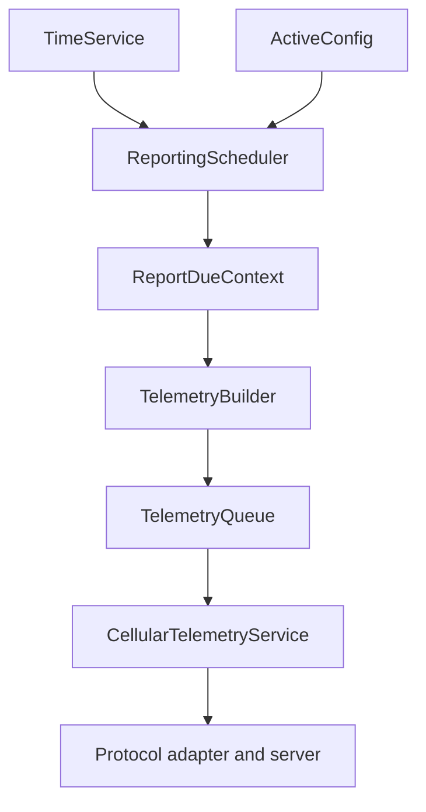
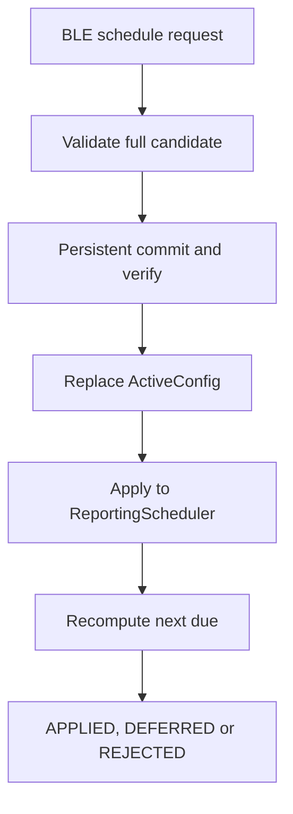
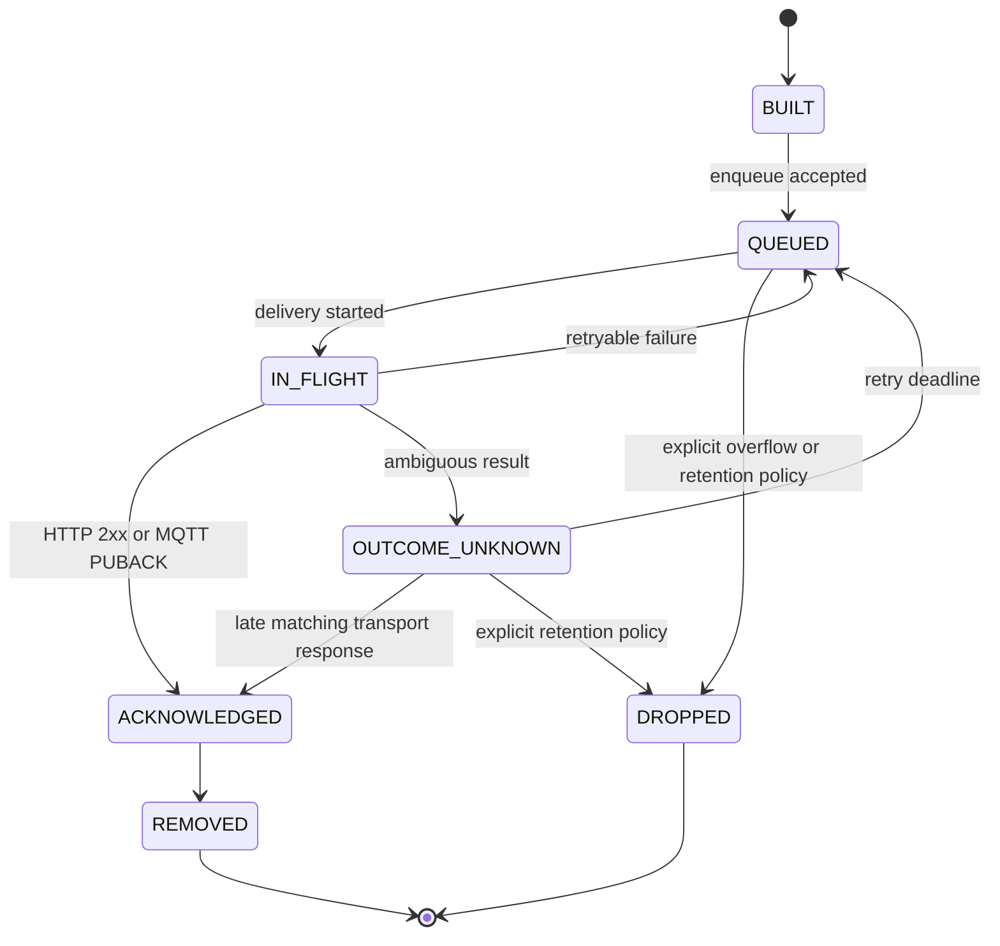
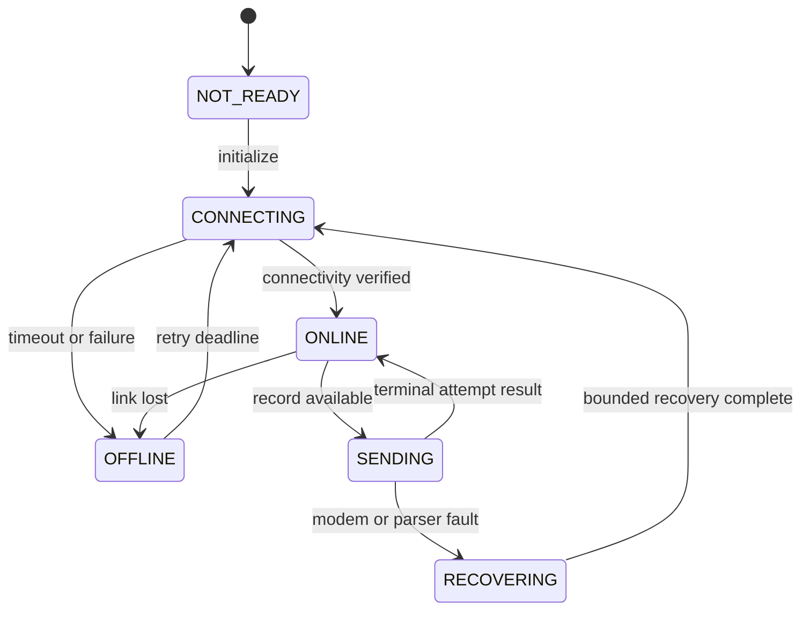

# 13 — Reporting and Connectivity Policy

**Document type:** Reporting, time and connectivity policy
**Document level:** System behavior and downstream implementation policy
**Project:** Smart Water Flow and Pressure Monitor
**Short name:** SWFPM
**Status:** Initial baseline with proposed decisions
**Language:** Vietnamese; canonical state, field và diagram label có thể dùng tiếng Anh

---

## 1. Mục đích

Tài liệu này định nghĩa policy cho:

* Hai reporting window cấu hình qua BLE.
* Cách tính report slot và `next_report_time`.
* Quan hệ giữa wall clock, STM32 RTC và 4G/server time.
* Telemetry trigger, record, queue và delivery lifecycle.
* Connectivity status và cellular internal state.
* Hành vi khi 4G offline, timeout hoặc delivery outcome không rõ.
* Retry/backoff, queue overflow và server acknowledgement boundary.
* Ranh giới BLE configuration và 4G telemetry.
* Những policy đã chốt và những quyết định vẫn cần phê duyệt.

Tài liệu cung cấp logical contract để firmware, communication, server và test có thể phát triển song song mà không hard-code model modem hoặc protocol chưa chọn.

---

## 2. Phạm vi

### 2.1. Trong phạm vi

```text
Time source priority and validity
Two-window schedule model
Report-slot identity and deduplication
Schedule update behavior
Time-jump and RTC alarm handling
Telemetry trigger and record metadata
Queue and delivery lifecycle
Connectivity state and non-blocking behavior
Offline, retry, backoff and overflow policy boundary
ACK abstraction
BLE reporting configuration
Security and forbidden 4G scope
Policy requirements and verification
```

### 2.2. Ngoài phạm vi

```text
Exact EC200U-CN ordering code, modem firmware, operator/band qualification
Detailed EC200U-CN AT command sequence and URC table
Detailed MQTT topic, HTTP URL/header and JSON field mapping
TLS library and credential provisioning detail
Exact binary/JSON/CBOR payload
Server database/API implementation
Automatic MQTT/HTTP failover
Persistent telemetry queue beyond MVP
SIM/APN/operator provisioning
Immediate emergency/leak alert service
OTA, bootloader update, remote configuration or generic downlink command
```

Các nội dung ngoài phạm vi phải tuân thủ invariant trong tài liệu này.

---

## 3. Source-of-truth

| Nội dung                                    | Source-of-truth                             |
| ------------------------------------------- | ------------------------------------------- |
| System baseline và document status          | `README.md`                                 |
| Decision/OQ status                          | `00_open_questions_and_decisions.md`        |
| Reporting/time/telemetry principle          | `03_operating_principle.md`                 |
| Main reporting/offline/BLE flow             | `04_main_operation_flow.md`                 |
| Detailed interaction sequence               | `05_sequence_diagrams.md`                   |
| Primary mode và offline status              | `06_system_fsm.md`, `07_operating_modes.md` |
| Telemetry/config data lifecycle             | `08_data_flow.md`                           |
| Communication failure/recovery              | `09_error_handling_overview.md`             |
| BLE/4G/RTC logical interface                | `10_system_interfaces.md`                   |
| Firmware module/queue/scheduler implication | `11_firmware_implication.md`                |
| Requirement và verification trace           | `12_system_traceability.md`                 |

Tài liệu 13 là source-of-truth cho reporting/connectivity policy chi tiết. Nó không thay đổi system mode, data ownership hoặc interface role đã chốt.

---

## 4. Policy status model

| Status     | Ý nghĩa                                                                         |
| ---------- | ------------------------------------------------------------------------------- |
| `DECIDED`  | Đã được chốt trong decision registry; downstream phải tuân thủ                  |
| `BASELINE` | Constraint đã được các tài liệu nguồn thống nhất; không phụ thuộc numeric value |
| `PROPOSED` | Khuyến nghị để review; chưa được coi là quyết định đã duyệt                     |
| `DEFERRED` | Chưa thể chốt do thiếu hardware/protocol/capacity requirement                   |
| `TBD`      | Giá trị hoặc implementation detail chưa biết                                    |

### 4.1. Rule

* `PROPOSED` không được trình bày như production requirement đã duyệt.
* `TBD` không được thay bằng magic number trong code.
* Invariant `BASELINE` vẫn áp dụng dù exact policy còn mở.
* Production release bị block nếu policy ảnh hưởng data loss, delivery truth hoặc server interoperability chưa được chốt.

---

## 5. Baseline và decision state

| Chủ đề                       | Trạng thái                  | Policy hiện tại                                                        |
| ---------------------------- | --------------------------- | ---------------------------------------------------------------------- |
| BLE/4G role                  | `DECIDED` — `DEC-SYS-001`   | BLE cấu hình cục bộ; 4G đồng bộ time/gửi telemetry                     |
| Hai reporting window         | `DECIDED` — `DEC-SYS-003`   | Đúng hai window, mỗi window có start và interval độc lập               |
| Time source priority         | `DECIDED` — `DEC-SYS-004`   | 4G/network/server cao hơn STM32 RTC khi source hợp lệ                  |
| Offline là status            | `DECIDED` — `DEC-SYS-005`   | `OFFLINE` không phải primary `SystemMode`                              |
| Ba time/clock role           | `DECIDED` — `DEC-SYS-006`   | MAX timing, STM32 timekeeping và 4G sync tách biệt                     |
| Offline policy               | `DECIDED` — `DEC-SYS-008`   | Exact policy không thuộc overview; được mô hình hóa tại tài liệu 13    |
| OTA/remote config            | `DECIDED` — `DEC-ARCH-008`  | Bị loại khỏi baseline 4G                                               |
| Time-invalid report behavior | `DECIDED` — `DEC-SCHED-001` | `DEFER_UNTIL_VALID`; không tạo scheduled report khi wall clock invalid |
| Missed/duplicate slot        | `DECIDED` — `DEC-SCHED-002` | `SKIP_TO_NEXT`; không tạo catch-up cho slot quá hạn                    |
| Immediate leak telemetry     | `DECIDED` — `DEC-SCHED-003` | MVP scheduled-only; leak state vẫn cập nhật local state ngay           |
| Default/min/max              | `DECIDED` — `DEC-SCHED-004` | W0 06:00/15 min; W1 22:00/5 min; interval 5–60 min                     |
| Server protocol/encoding     | `DECIDED` — `DEC-COM-001`   | Common adapter; MQTT QoS 1 hoặc HTTP POST; versioned JSON              |
| ACK semantics                | `DECIDED` — `DEC-COM-002`   | MQTT `PUBACK` hoặc HTTP `2xx`                                          |
| Retry/backoff                | `DECIDED` — `DEC-COM-003`   | Non-blocking fixed 30 s; tối đa 3 consecutive retry                    |
| Queue/retention/overflow     | `DECIDED` — `DEC-COM-004`   | Static RAM FIFO 64; 24 h TTL; drop oldest on full                      |

---

## 6. Reporting và connectivity architecture



### 6.1. Ownership

| State/object                         | Owner                          |
| ------------------------------------ | ------------------------------ |
| Wall-clock state và time quality     | `TimeService`                  |
| Reporting window và next due         | `ReportingScheduler`           |
| Reporting config transaction         | `ConfigRepository`             |
| `RuntimeSnapshot`                    | `DataRepository`               |
| `TelemetryRecord` construction       | `TelemetryBuilder`             |
| Pending record lifecycle             | `TelemetryQueue`               |
| Cellular connection/delivery context | `CellularTelemetryService`     |
| Wire encoding/protocol/ACK parsing   | Communication protocol adapter |

Không module nào vừa sở hữu schedule, queue và modem state.

---

## 7. Time model

### 7.1. Time domain

| Domain                 | Owner                 | Dùng cho                                        |
| ---------------------- | --------------------- | ----------------------------------------------- |
| Monotonic time         | `MonotonicClock`      | Timeout, deadline, retry/backoff, age, ordering |
| System wall clock      | `TimeService`         | Reporting window, external timestamp            |
| STM32 RTC              | `RtcDriver`           | Retained wall clock và wake/alarm               |
| MAX35103 timing        | MAX measurement path  | Measurement/event timing metadata               |
| 4G/network/server time | Cellular/time adapter | Highest-priority synchronization candidate      |

MAX35103 time/counter không phải authority cho reporting wall clock.

### 7.2. Time quality

`TimeService` phải publish tối thiểu:

```text
time_valid
time_quality
active_source
wall_time
monotonic_observation_time
last_sync_result
time_generation
timezone_or_local_offset_version
last_successful_sync_time
sync_age
max_time_sync_age
```

Logical quality đề xuất:

| Quality          | Ý nghĩa                                                 |
| ---------------- | ------------------------------------------------------- |
| `INVALID`        | Không có wall time đủ tin cậy                           |
| `RTC_HOLDOVER`   | STM32 RTC còn hợp lệ và `sync_age < max_time_sync_age`  |
| `NETWORK_SYNCED` | Đã validate và apply 4G/network/server time             |
| `DEGRADED`       | Đã lỡ nhịp sync mong muốn nhưng chưa đạt ngưỡng invalid |

Thiết bị dự kiến yêu cầu đồng bộ 4G/server mỗi 24 giờ. Nếu lần đồng bộ hằng ngày thất bại, STM32 RTC tiếp tục làm local wall clock trong holdover. `max_time_sync_age` mặc định là 7 ngày (`604800 s`) và có thể cấu hình qua BLE. Khi `sync_age >= max_time_sync_age`, hoặc RTC continuity không còn đáng tin cậy, `TimeService` chuyển wall clock sang `INVALID`.

### 7.3. Source priority và validation

1. Candidate 4G/server time được validate format, range, freshness và plausibility.
2. Candidate hợp lệ cập nhật `TimeService` và STM32 RTC qua controlled transaction.
3. STM32 RTC làm holdover khi 4G không khả dụng.
4. BLE time set chỉ được phép theo authorization/config policy và không vượt source priority một cách im lặng.
5. Candidate invalid bị reject, không làm hỏng current valid time.
6. Mỗi lần sync server thành công phải reset `sync_age` và lưu metadata cần thiết để đánh giá holdover sau reset.
7. Thay đổi `max_time_sync_age` chỉ active sau validation, persistent commit và controlled apply; `TimeService` phải đánh giá lại validity ngay theo giá trị mới.

---

## 8. ReportingWindow model

### 8.1. Logical configuration

```text
ReportingSchedule
  schedule_version
  local_time_basis
  window[0].start_time
  window[0].interval
  window[1].start_time
  window[1].interval
```

### 8.2. Invariant

* Có đúng hai window.
* Hai `start_time` phải khác nhau.
* Mỗi start time nằm trong `00:00`–`23:59` local time với độ phân giải một phút.
* Mỗi window dài tối thiểu 30 phút theo cyclic boundary.
* Mỗi interval là số nguyên phút trong khoảng 5–60 phút.
* Window không có semantic cố định “day” hoặc “night”.
* End boundary của một window là start boundary của window còn lại theo chu kỳ 24 giờ.
* Window dùng interval riêng.

### 8.3. Boundary convention

Baseline dùng half-open interval:

```text
[window_start, next_window_start)
```

Tại đúng boundary, window mới có hiệu lực. Convention này loại bỏ việc một timestamp thuộc đồng thời hai window.

### 8.4. Local-time basis

Schedule được đánh giá trên local time do `TimeService` cung cấp. Baseline dùng versioned fixed UTC offset, không dùng daylight-saving rule trong MVP. Deployment baseline Việt Nam dùng `UTC+07:00`; offset vẫn là configuration field có validation/version.

### 8.5. Default schedule

| Window      |   Start | Interval | Effective range               |
| ----------- | ------: | -------: | ----------------------------- |
| `Window[0]` | `06:00` |  15 phút | `[06:00, 22:00)`              |
| `Window[1]` | `22:00` |   5 phút | `[22:00, 06:00)` ngày kế tiếp |

Default này tạo khoảng 160 scheduled record/ngày. Communication/power validation phải xác nhận session strategy và energy/data budget; việc đó không thay đổi schedule semantics.

---

## 9. Report slot và next-due algorithm

### 9.1. Slot anchoring

Mỗi window được anchor tại start boundary:

```text
slot_due(n) = window_start + n * window_interval
```

Chỉ slot có `slot_due` nằm trong half-open window mới hợp lệ. Thuật toán không lấy “thời điểm gửi xong + interval”, vì cách đó tạo drift.

### 9.2. ReportSlotIdentity

```text
schedule_version
window_id
slot_due_wall_time
slot_ordinal
time_generation_at_evaluation
```

Stable identity dùng tối thiểu:

```text
schedule_version + window_id + slot_due_wall_time
```

`time_generation` hỗ trợ reject alarm cũ nhưng không được làm cùng slot tạo thành record mới lần hai.

### 9.3. Next due

`ReportingScheduler`:

1. Xác định active window theo local wall time.
2. Tính slot đầu tiên lớn hơn current evaluation time, trừ khi current time đúng một due boundary chưa xử lý.
3. Cắt candidate tại next window boundary.
4. Nếu candidate vượt boundary, tính lại từ start của window tiếp theo.
5. Program STM32 RTC alarm với `schedule_generation`.
6. Publish `next_report_time` và status.

RTC alarm chỉ là notification/wake source. Scheduler phải xác minh slot bằng current config/time generation.

---

## 10. Schedule update qua BLE



### 10.1. Validation

Candidate phải kiểm tra:

* Đúng hai window.
* Start time hợp lệ và khác nhau.
* Interval hợp lệ.
* Local-time basis/timezone field hợp lệ.
* Schema/config version.
* Permission và request identity.
* Không overflow khi chuyển sang internal time representation.

### 10.2. Apply behavior

* Schedule chỉ active sau commit/verify thành công.
* Apply tại safe boundary của scheduler.
* Apply thành công tăng `schedule_version`/generation.
* Stale RTC alarm của version cũ bị reject.
* `next_report_time` được recompute ngay sau apply.
* Update không hủy cellular transaction đang chạy.
* Update không mặc định tạo report tức thời.
* BLE response phải phản ánh `APPLIED`, `DEFERRED` hoặc `REJECTED` đúng sự thật.

---

## 11. Time-invalid và time-adjustment policy

### 11.1. Invariant đã chốt

Khi wall clock invalid:

* Monotonic acquisition, timeout và ordering vẫn hoạt động.
* Measurement, leak detection, LCD và BLE không bị dừng chỉ vì time invalid.
* Không tạo wall-clock timestamp giả.
* Không gắn record với report slot calendar không thể xác định.
* Reporting status phải cho biết time-invalid/deferred condition.

### 11.2. Time-invalid reporting decision

`DEC-SCHED-001` đã `DECIDED`.

| Option              | Behavior                                               | Trade-off                                   |
| ------------------- | ------------------------------------------------------ | ------------------------------------------- |
| `DEFER_UNTIL_VALID` | Không tạo normal scheduled record; giữ deferred status | Delivery trễ nhưng timestamp/slot truth rõ  |
| `SEND_UNSYNCED`     | Tạo record có monotonic time và `time_quality=INVALID` | Server phải hỗ trợ unsynced schema/ordering |
| `DROP_SLOT`         | Không tạo record và không catch-up                     | Đơn giản nhưng có data gap                  |

**Selected decision:** `DEFER_UNTIL_VALID`. Khi wall clock invalid, `ReportingScheduler` không tạo normal scheduled record và publish explicit deferred/not-ready status. Khi time phục hồi, `DEC-SCHED-002` buộc scheduler áp dụng `SKIP_TO_NEXT`: không tạo recovery/catch-up report cho slot đã bỏ lỡ và chỉ arm slot hợp lệ tiếp theo trong tương lai.

Time validity dùng `max_time_sync_age` cấu hình được, mặc định 7 ngày. Nhịp sync server mong muốn là mỗi 24 giờ; mất một hoặc nhiều lần sync không tự làm time invalid nếu STM32 RTC continuity vẫn tin cậy và age chưa đạt ngưỡng.

### 11.3. Wall-clock adjustment

Khi time được chỉnh tiến/lùi:

1. `TimeService` tăng `time_generation`.
2. `ReportingScheduler` invalidate alarm/generation cũ.
3. Dùng report-slot identity để chống gửi trùng.
4. Recompute current window và next due.
5. Không chạy retry/backoff bằng wall clock.
6. Theo `DEC-SCHED-002`, mọi slot đã quá hạn dùng `SKIP_TO_NEXT`; không tạo catch-up burst.

### 11.4. Missed-slot option

`DEC-SCHED-002` đã `DECIDED`.

| Option            | Behavior                                          |
| ----------------- | ------------------------------------------------- |
| `SKIP_TO_NEXT`    | Bỏ slot quá hạn, schedule slot tương lai gần nhất |
| `SINGLE_CATCH_UP` | Tạo tối đa một record catch-up từ latest snapshot |
| `REPLAY_ALL`      | Tạo record cho mọi slot đã bỏ lỡ                  |

**Selected decision:** `SKIP_TO_NEXT` cho scheduled snapshot telemetry. Khi time phục hồi, wake muộn hoặc wall clock nhảy tiến, mọi slot đã quá hạn bị bỏ qua; scheduler chỉ arm slot hợp lệ tiếp theo trong tương lai. Không tạo `SINGLE_CATCH_UP` hoặc `REPLAY_ALL`.

---

## 12. Telemetry trigger policy

### 12.1. Trigger baseline

Baseline production trigger là:

```text
REPORT_DUE from ReportingScheduler
```

`REPORT_DUE` mang `ReportSlotIdentity` nhưng không có nghĩa record đã build, queue hoặc gửi thành công.

### 12.2. Leak-state change

`DEC-SCHED-003` đã `DECIDED`.

**Selected decision:** MVP dùng scheduled-only telemetry. Leak-state change cập nhật `RuntimeSnapshot`, LCD và diagnostics ngay nhưng không tự tạo immediate production telemetry. Scheduled record kế tiếp mang leak state mới nhất.

Nếu sau này cần immediate leak report:

* Dùng `report_reason=LEAK_STATE_CHANGE`.
* Có dedup/rate-limit riêng.
* Không giả là scheduled slot.
* Không dùng `SERVICE_SAMPLE`/`CALIBRATION_SAMPLE`.
* Được trace tới server priority/ACK/retention policy.

### 12.3. Other trigger

Không tự thêm trigger từ:

* BLE connect/disconnect.
* LCD refresh.
* Mỗi measurement sample.
* 4G reconnect.
* Service/calibration sample.
* Generic server request.

Critical diagnostic upload nếu có thuộc decision riêng.

---

## 13. TelemetryRecord contract

### 13.1. Record identity

Mỗi record cần stable identity:

```text
device_id
record_sequence
schema_version
report_reason
```

Retry giữ nguyên toàn bộ logical payload, đặc biệt `record_sequence`, captured timestamp và cumulative volume. `record_id` có thể được thêm trong detailed schema nhưng application-level dedup không phải MVP requirement.

### 13.2. Schedule context

Scheduled record cần:

```text
schedule_version
window_id
slot_due_wall_time
slot_ordinal or equivalent
report_due_identity
```

Non-scheduled record nếu được bổ sung phải dùng reason/context khác, không giả slot.

### 13.3. Snapshot and time context

```text
source_snapshot_generation
snapshot_build_monotonic_time
record_build_monotonic_time
wall_clock_time if valid
time_quality
time_source
time_generation
local_time_basis_version
```

### 13.4. Product data

Logical payload có thể chứa:

```text
flow value, quality, freshness and provenance
temperature value, quality, freshness and provenance
pressure value, quality, freshness and provenance
volume state
leak state and bounded evidence summary
system mode
connectivity/reporting/power status
configuration and calibration version
bounded diagnostic summary
```

Field không available phải có explicit status hoặc omission rule trong schema. Không encode invalid data thành valid zero.

### 13.5. Isolation

* Build từ một stable `RuntimeSnapshot`.
* Không serialize trực tiếp in-memory snapshot layout.
* `TelemetryRecord` immutable sau khi queue.
* Không chứa credential, key, token, APN secret hoặc raw unrestricted diagnostic memory.
* Service/calibration sample không trở thành normal production telemetry.

---

## 14. Telemetry lifecycle



### 14.1. State contract

| State             | Ý nghĩa                                                    |
| ----------------- | ---------------------------------------------------------- |
| `BUILT`           | Record đã encode logical content, chưa thuộc queue         |
| `QUEUED`          | Queue sở hữu immutable record                              |
| `IN_FLIGHT`       | Một delivery attempt đang active                           |
| `ACKNOWLEDGED`    | Delivery success theo approved acknowledgement contract    |
| `OUTCOME_UNKNOWN` | Không đủ evidence để kết luận success/failure              |
| `DROPPED`         | Record bị loại bởi explicit policy; phải có reason/counter |
| `REMOVED`         | Record được giải phóng sau terminal rule                   |

### 14.2. Exactly-one active attempt

* Một record không có đồng thời hai active attempt trừ khi transport design chứng minh idempotency và decision cho phép.
* Completion phải match active attempt/HTTP transaction hoặc MQTT packet identifier và connection generation.
* Completion cũ sau modem recovery bị reject.
* Timeout không tự động có nghĩa server chưa nhận; có thể là `OUTCOME_UNKNOWN`.
* `OUTCOME_UNKNOWN` rời state khi late transport response, retry deadline hoặc explicit retention/drop policy cung cấp disposition.

---

## 15. Connectivity model

### 15.1. Orthogonal status

`ConnectivityStatus` đề xuất:

| Status       | Ý nghĩa                                                                        |
| ------------ | ------------------------------------------------------------------------------ |
| `NOT_READY`  | Driver/profile chưa initialized                                                |
| `CONNECTING` | Đang thực hiện bounded bring-up/registration                                   |
| `ONLINE`     | Có path đủ điều kiện cho delivery attempt                                      |
| `OFFLINE`    | Không có usable network/server path                                            |
| `DEGRADED`   | Có một phần capability nhưng quality/reliability không đạt preferred condition |

Status này trực giao với `SystemMode`.

### 15.2. Internal cellular state



Internal state không được expose như primary `SystemMode`.

### 15.3. Offline invariant

4G offline không được:

* Dừng MAX35103/pressure measurement.
* Dừng volume/leak processing.
* Chặn snapshot/LCD/BLE configuration.
* Gây tight reconnect loop.
* Chiếm event loop vô hạn.
* Tự chuyển primary mode sang `ERROR` nếu lỗi vẫn cô lập trong cellular subsystem.

---

## 16. Delivery outcome và ACK boundary

### 16.1. Outcome taxonomy

```text
ACKNOWLEDGED
REJECTED_BY_SERVER
TRANSPORT_FAILED
TIMEOUT
OUTCOME_UNKNOWN
CANCELLED
```

Outcome phải tách khỏi connectivity status. Có thể `ONLINE` nhưng server reject payload.

### 16.2. Transport response đã chốt

Theo `DEC-COM-002`:

| Adapter    | Terminal success evidence                      |
| ---------- | ---------------------------------------------- |
| MQTT QoS 1 | `PUBACK` khớp active publish packet identifier |
| HTTP POST  | Bất kỳ HTTP `2xx` response hợp lệ              |

* Chỉ terminal success mới remove head record.
* Không có response trước timeout là `OUTCOME_UNKNOWN` và đi vào retry policy.
* HTTP `408`, `429`, `5xx`, timeout và connection loss là retryable.
* HTTP `4xx` khác là rejected/non-retryable và tạo diagnostic.
* Application-level ACK và server deduplication không thuộc MVP. ACK bị mất có thể làm retry tạo duplicate; payload giữ timestamp/sequence/cumulative volume để backend có thể xử lý về sau.

### 16.3. Server rejection

Server rejection cần phân biệt:

* Schema/version unsupported.
* Authentication/authorization failure.
* Payload validation failure.
* Duplicate already accepted.
* Temporary server condition.

Exact code mapping thuộc communication protocol document.

---

## 17. TelemetryQueue policy

### 17.1. Baseline invariant

`TelemetryQueue` phải:

* Bounded.
* Có owner duy nhất.
* Giữ immutable record.
* Có explicit enqueue/dequeue/drop outcome.
* Giữ record identity qua retry.
* Có diagnostic counter cho full/drop/retry/unknown.
* Không block measurement pipeline.
* Không giả persistent nếu backing chỉ là RAM.

### 17.2. Backing option

`DEC-COM-004` đã `DECIDED` cho MVP.

| Option                | Ưu điểm                                                          | Rủi ro                                                          |
| --------------------- | ---------------------------------------------------------------- | --------------------------------------------------------------- |
| RAM-only              | `SELECTED`: static FIFO 64 record                                | Mất pending record khi reset/brownout                           |
| FM24CL04B F-RAM       | `EXCLUDED` cho persistent telemetry trong MVP bởi `DEC-DATA-004` | Fixed map đã dành cho config/calibration/volume/system metadata |
| Modem-managed storage | Có thể giảm MCU storage                                          | Phụ thuộc module/protocol và ownership                          |
| External NVM          | Có capacity riêng                                                | Tăng hardware/BOM/driver                                        |

MVP không dùng modem-managed storage, external NVM hoặc reserved bytes của fixed FM24CL04B map. Persistent queue là future architecture/storage decision.

### 17.3. Queue ordering

Ordering là oldest eligible record first, đúng một record `IN_FLIGHT`. Scheduled record là immutable. Future priority class không thuộc MVP.

* Priority không được starve record thường vô hạn.
* Retry-backoff record không được block mọi record khác nếu protocol cho phép.
* In-flight record không bị mutate/coalesce.

---

## 18. Retry và backoff policy

### 18.1. Baseline

Mọi retry:

* Dùng monotonic deadline.
* Non-blocking và event/timer driven.
* Có attempt limit hoặc escalation/backoff terminal state.
* Có reason và attempt identity.
* Không tạo record mới.
* Không feed watchdog thay cho useful progress.

### 18.2. Fixed retry đã chốt

Theo `DEC-COM-003`:

```text
retry_delay            = 30 seconds
max_consecutive_retry  = 3
timer source           = monotonic deadline/event
```

Sau 3 resend attempt liên tiếp, record vẫn ở head queue nhưng service dừng retry liên tiếp và thử lại tại connectivity/reporting opportunity tiếp theo. `WAIT_RESPONSE`/`RETRY_WAIT` là internal state; không dùng `HAL_Delay`, busy-wait hoặc block `AppEventLoop`.

### 18.3. Retry classification

| Outcome                             | Retry disposition đề xuất                      |
| ----------------------------------- | ---------------------------------------------- |
| Modem busy/temporary network        | Retryable after backoff                        |
| Registration unavailable            | Reconnect policy                               |
| Transport timeout                   | Retryable hoặc unknown theo protocol           |
| Authentication failure              | Không tight retry; require provisioning action |
| Schema/payload rejected             | Không retry cùng payload vô hạn                |
| MQTT `PUBACK`/HTTP response missing | `OUTCOME_UNKNOWN`; retry sau 30 s              |

---

## 19. Queue overflow và retention

### 19.1. Capacity, retention và overflow đã chốt

```text
capacity       = 64 immutable TelemetryRecord
backing        = static RAM
maximum age    = 24 hours
overflow       = drop oldest non-in-flight record
active attempt = exactly one
```

Expired/overflow record phải tăng `telemetry_drop_count` và giữ bounded loss reason/time metadata. Record `IN_FLIGHT` không bị drop hoặc mutate. Queue mất khi reset/brownout là accepted MVP limitation.

---

## 20. Reconnect và queue interaction

1. `OFFLINE` không làm record biến mất.
2. Reconnect deadline độc lập với report due.
3. Report mới có thể enqueue khi offline nếu queue policy cho phép.
4. Queue full dùng explicit overflow policy.
5. Khi online, service chọn eligible record theo ordering/backoff.
6. Chỉ một bounded delivery step chạy mỗi event-loop dispatch.
7. Measurement event có logical priority cao hơn noncritical modem work.
8. Modem recovery tăng connection generation và reject stale completion.

---

## 21. BLE configuration boundary

### 21.1. Reporting field

BLE có thể cấu hình:

```text
window[0].start_time
window[0].interval
window[1].start_time
window[1].interval
local time basis or UTC offset if supported
manual time set if authorized
max_time_sync_age, default 604800 seconds
```

Reporting schedule phải áp dụng default/range của `DEC-SCHED-004`: W0 `06:00/15 min`, W1 `22:00/5 min`, start resolution một phút, minimum window 30 phút và interval 5–60 phút. `max_time_sync_age` phải có product-profile validation range; exact min/max của field này có thể được chốt trong detailed configuration contract mà không thay đổi `DEC-SCHED-001`.

### 21.2. Connectivity field

APN, server endpoint hoặc provisioning data nếu được hỗ trợ phải:

* Có schema và permission riêng.
* Đi qua `PendingConfig`, validation, persistent commit và apply.
* Không xuất hiện trong shared snapshot/LCD/general diagnostics.
* Không được echo secret trong BLE response.
* Không được thay đổi từ generic 4G downlink.

Exact credential provisioning thuộc communication/security document.

### 21.3. Command outcome

BLE response cần phân biệt:

```text
INVALID_REQUEST
UNAUTHORIZED
COMMIT_FAILED
APPLIED
DEFERRED
REJECTED_BY_SERVICE
```

Response mang `transaction_id`, candidate/active version và bounded reason.

---

## 22. Security và 4G scope

### 22.1. Allowed downlink

4G inbound data chỉ được xử lý theo approved contract:

* Transport/application response.
* Delivery acknowledgement.
* Validated time synchronization response.
* Protocol session control cần thiết.

### 22.2. Forbidden baseline

4G không được cung cấp:

```text
OTA image/update
bootloader update command
remote configuration apply
generic remote command
raw sensor/register access
debug shell
service-mode entry
credential readback
```

Bổ sung scope cần architecture và security review, decision mới, authentication/authorization, anti-replay và change-impact update.

### 22.3. Credential handling

* Credential không nằm trong `RuntimeSnapshot`/`TelemetryRecord`/LCD/general diagnostics.
* Log chỉ ghi secret reference/status, không ghi value.
* Production build không mở unprotected provisioning/debug path.
* Exact secure storage/TLS/provisioning còn TBD.

---

## 23. Power và concurrency policy

### 23.1. Power blocker

Các condition sau có thể block `LOW_POWER`:

```text
cellular command or TX transaction active
UART frame completion required
telemetry queue mutation in atomic phase
schedule/time update in atomic phase
RTC alarm not safely programmed
critical completion event pending
```

Offline/retry-wait một mình không block low-power nếu wake deadline đã arm và modem power policy cho phép.

### 23.2. Simultaneous event

| Event combination                | Policy                                                              |
| -------------------------------- | ------------------------------------------------------------------- |
| MAX result + 4G completion       | Xử lý measurement-critical result trước                             |
| RTC alarm + MAX INT              | Capture cả hai; measurement event có priority cao hơn build/send    |
| BLE schedule update + report due | Correlate config/schedule generation; không mất hoặc duplicate slot |
| Queue full + new report due      | Áp dụng explicit overflow outcome; measurement vẫn tiếp tục         |
| Time sync + retry deadline       | Apply time qua `TimeService`; retry deadline vẫn monotonic          |
| Low-power request + active TX    | Defer sleep đến safe boundary hoặc cancel theo owner contract       |

### 23.3. Modem power policy

EC200U-CN và UART/AT operating model đã chốt bởi `DEC-HW-003`. Theo `DEC-HW-007`, modem dùng USART thường và không là STOP 2 wake source; active cellular work là power blocker. Exact modem sleep/power-off/reconnect strategy vẫn phụ thuộc nguồn và peak-current budget của `DEC-HW-005`.

---

## 24. Status, diagnostics và counter

### 24.1. ReportingStatus

Logical status đề xuất:

```text
NOT_READY
ARMED
DUE_PENDING
DEFERRED_TIME_INVALID
BUILD_FAILED
QUEUED
QUEUE_FULL
```

Đây là status trực giao, không phải `SystemMode`.

### 24.2. DeliveryStatus

```text
IDLE
CONNECTING
IN_FLIGHT
BACKOFF
OFFLINE
DEGRADED
```

### 24.3. Bounded counters

Nên có:

```text
report_due_count
record_build_success_count
record_build_failure_count
enqueue_success_count
queue_full_count
record_drop_count by reason
delivery_attempt_count
delivery_ack_count
delivery_reject_count
delivery_timeout_count
delivery_unknown_count
reconnect_count
stale_completion_count
duplicate_slot_suppressed_count
time_invalid_defer_count
```

Counter overflow/wrap semantics phải được định nghĩa trong detailed data design.

---

## 25. Decision package

Các row dưới đây phân biệt decision đã chốt và proposal còn chờ review.

| Decision        | Policy state                                                                                              | Lý do                                                           | Cần xác nhận                                        |
| --------------- | --------------------------------------------------------------------------------------------------------- | --------------------------------------------------------------- | --------------------------------------------------- |
| `DEC-SCHED-001` | `DECIDED: DEFER_UNTIL_VALID`; default `max_time_sync_age = 7 days`, configurable                          | Không tạo timestamp/slot giả; cho phép RTC holdover có giới hạn | Exact config min/max thuộc detailed config contract |
| `DEC-SCHED-002` | `DECIDED: SKIP_TO_NEXT`, không catch-up                                                                   | Dễ dedup, tránh burst/nghẽn queue                               | —                                                   |
| `DEC-SCHED-003` | `DECIDED: scheduled-only` cho MVP                                                                         | Giữ scope và queue đơn giản; local leak visibility vẫn tức thời | —                                                   |
| `DEC-SCHED-004` | `DECIDED:` W0 `06:00/15 min`, W1 `22:00/5 min`; interval 5–60 min; minimum window 30 min; UTC+07 baseline | Cấu hình rõ, deterministic boundary                             | Power/data budget cần validation                    |
| `DEC-COM-001`   | `DECIDED:` common adapter; MQTT QoS 1 hoặc HTTP POST; versioned JSON                                      | Tách application record khỏi protocol implementation            | Detailed topic/URL/header/schema                    |
| `DEC-COM-002`   | `DECIDED:` MQTT `PUBACK` hoặc HTTP `2xx`                                                                  | Simple transport-level completion cho MVP                       | Duplicate là accepted limitation                    |
| `DEC-COM-003`   | `DECIDED:` non-blocking 30 s fixed retry, max 3 consecutive                                               | Dễ kiểm thử, không block measurement                            | Detailed response timeout per adapter               |
| `DEC-COM-004`   | `DECIDED:` RAM FIFO 64, 24 h TTL, drop oldest                                                             | Đơn giản, không dùng F-RAM/NVM                                  | RAM sizing verification                             |

### 25.1. Decision order

Khuyến nghị review theo thứ tự:

1. `DEC-COM-001`–`DEC-COM-004` đã được chốt cho MVP.
2. Tiếp theo cần viết detailed JSON/topic/URL/credential contract và adapter state tests.
3. Persistent queue, application ACK/dedup và automatic protocol failover là future scope.

---

## 26. Reporting and connectivity requirements

Các requirement dưới đây là normative baseline ở mức invariant/architecture. Chúng không làm `PROPOSED` option trở thành `DECIDED`.

### 26.1. Time và reporting schedule

| ID            | Requirement                                                                                                                                                                                                |
| ------------- | ---------------------------------------------------------------------------------------------------------------------------------------------------------------------------------------------------------- |
| `REQ-RCP-001` | Timeout, retry, backoff và duration phải dùng monotonic time; reporting window phải dùng system wall clock.                                                                                                |
| `REQ-RCP-002` | `TimeService` phải publish wall-time validity, quality, active source, time generation, last successful sync và current/configured sync-age metadata.                                                      |
| `REQ-RCP-003` | 4G/network/server time candidate hợp lệ phải có priority cao hơn STM32 RTC holdover.                                                                                                                       |
| `REQ-RCP-004` | MAX35103 timing không được dùng làm reporting wall-clock authority.                                                                                                                                        |
| `REQ-RCP-005` | Invalid time candidate không được làm mất current valid time.                                                                                                                                              |
| `REQ-RCP-006` | Reporting schedule phải chứa đúng hai configurable window.                                                                                                                                                 |
| `REQ-RCP-007` | Hai start boundary phải khác nhau; start có độ phân giải một phút; mỗi window dài tối thiểu 30 phút; interval phải là integer 5–60 phút.                                                                   |
| `REQ-RCP-008` | Window không được gán semantic cố định là ngày/đêm; end boundary được suy ra từ start của window còn lại.                                                                                                  |
| `REQ-RCP-009` | Boundary phải có convention không chồng lấn; baseline dùng half-open interval.                                                                                                                             |
| `REQ-RCP-010` | Report slot phải được anchor theo window start, không theo thời điểm delivery hoàn tất.                                                                                                                    |
| `REQ-RCP-011` | Mỗi scheduled slot phải có stable identity chứa schedule version, window và due time.                                                                                                                      |
| `REQ-RCP-012` | Duplicate RTC alarm/time adjustment không được tạo nhiều record cho cùng slot identity.                                                                                                                    |
| `REQ-RCP-013` | RTC alarm chỉ là notification; scheduler phải revalidate time/config generation trước `REPORT_DUE`.                                                                                                        |
| `REQ-RCP-014` | Schedule mới chỉ active sau validation, persistent commit/verify và controlled apply.                                                                                                                      |
| `REQ-RCP-015` | Schedule apply phải invalidate stale alarm và recompute `next_report_time`.                                                                                                                                |
| `REQ-RCP-016` | Schedule update không được mặc định tạo immediate report hoặc hủy active cellular transaction.                                                                                                             |
| `REQ-RCP-017` | Wall-clock invalid không được tạo timestamp hoặc calendar slot giả; reporting phải publish explicit time-invalid disposition.                                                                              |
| `REQ-RCP-018` | Time-invalid policy phải là `DEFER_UNTIL_VALID`; `max_time_sync_age` mặc định 7 ngày và cấu hình được. Khi `sync_age >= max_time_sync_age`, scheduled reporting phải defer cho tới khi time valid trở lại. |
| `REQ-RCP-056` | Missed-slot policy phải là `SKIP_TO_NEXT`: slot đã quá hạn không tạo catch-up record; scheduler chỉ chọn slot hợp lệ tiếp theo trong tương lai.                                                            |

### 26.2. Telemetry trigger và record

| ID            | Requirement                                                                                                                                          |
| ------------- | ---------------------------------------------------------------------------------------------------------------------------------------------------- |
| `REQ-RCP-019` | `REPORT_DUE` phải được phân biệt với record build, queue, delivery attempt và acknowledgement.                                                       |
| `REQ-RCP-020` | MVP telemetry trigger phải là scheduled report; leak-state change không được tự tạo immediate production telemetry record.                           |
| `REQ-RCP-021` | Telemetry phải được build từ một stable `RuntimeSnapshot` và lưu source snapshot generation.                                                         |
| `REQ-RCP-022` | Wire schema không được serialize trực tiếp từ in-memory snapshot layout.                                                                             |
| `REQ-RCP-023` | Mỗi telemetry record phải có stable sequence, captured timestamp, schema version và report reason; `record_id` là field mở rộng tùy detailed schema. |
| `REQ-RCP-024` | Retry cùng logical record phải giữ nguyên sequence, captured timestamp và immutable payload.                                                         |
| `REQ-RCP-025` | Record phải immutable sau khi `TelemetryQueue` nhận ownership.                                                                                       |
| `REQ-RCP-026` | Scheduled record phải mang schedule/slot context và time quality/source.                                                                             |
| `REQ-RCP-027` | Measurement field phải giữ validity, freshness và provenance; invalid value không được encode như valid zero.                                        |
| `REQ-RCP-028` | `SERVICE_SAMPLE`/`CALIBRATION_SAMPLE` không được xuất hiện như normal production telemetry.                                                          |
| `REQ-RCP-029` | Credential/secret không được xuất hiện trong telemetry, shared snapshot, LCD hoặc general diagnostics.                                               |
| `REQ-RCP-030` | Future non-scheduled record chỉ được bổ sung bằng approved decision/version mới, distinct reason/dedup policy và không giả scheduled slot.           |

### 26.3. Connectivity và delivery

| ID            | Requirement                                                                                                             |
| ------------- | ----------------------------------------------------------------------------------------------------------------------- |
| `REQ-RCP-031` | `ConnectivityStatus` phải trực giao với primary `SystemMode`.                                                           |
| `REQ-RCP-032` | 4G offline không được dừng measurement, volume, leak, LCD hoặc BLE configuration.                                       |
| `REQ-RCP-033` | Cellular connect/send/recovery phải non-blocking và thực hiện bằng bounded step.                                        |
| `REQ-RCP-034` | BLE và 4G phải có UART buffer, parser, session và recovery context độc lập.                                             |
| `REQ-RCP-035` | 4G baseline không được cung cấp OTA, bootloader update, remote config, generic command hoặc debug shell.                |
| `REQ-RCP-036` | Modem/reconnect recovery phải tăng generation và reject stale completion.                                               |
| `REQ-RCP-037` | Delivery outcome phải phân biệt acknowledged, rejected, transport failed, timeout, unknown và cancelled khi applicable. |
| `REQ-RCP-038` | `OUTCOME_UNKNOWN` không được đánh dấu `ACKNOWLEDGED`.                                                                   |
| `REQ-RCP-039` | Server rejection phải được phân biệt với connectivity offline/transport failure.                                        |
| `REQ-RCP-040` | Protocol encoding và ACK parsing phải nằm sau versioned communication adapter boundary.                                 |

### 26.4. Queue, retry và power

| ID            | Requirement                                                                                                                 |
| ------------- | --------------------------------------------------------------------------------------------------------------------------- |
| `REQ-RCP-041` | `TelemetryQueue` phải bounded và có exactly-one owner.                                                                      |
| `REQ-RCP-042` | Enqueue, dequeue, drop và overflow phải có explicit outcome/counter; record không được silently mất.                        |
| `REQ-RCP-043` | Queue backing/reset-survival claim phải đúng với implementation đã chọn.                                                    |
| `REQ-RCP-044` | Retry/backoff phải bounded, monotonic-timer driven và không tạo record mới.                                                 |
| `REQ-RCP-045` | Offline/reconnect không được tạo tight retry loop hoặc monopolize event loop.                                               |
| `REQ-RCP-046` | Queue ordering/priority phải có bounded starvation policy.                                                                  |
| `REQ-RCP-047` | Active modem/UART/atomic queue transaction phải được phản ánh trong power blocker.                                          |
| `REQ-RCP-048` | Production implementation phải đúng RAM queue 64 record, TTL 24 giờ, drop-oldest và non-blocking retry 30 giây × 3 đã chốt. |

### 26.5. Configuration, security và verification

| ID            | Requirement                                                                                                                    |
| ------------- | ------------------------------------------------------------------------------------------------------------------------------ |
| `REQ-RCP-049` | BLE reporting/connectivity config phải đi qua permission, full validation, `PendingConfig`, commit/verify và controlled apply. |
| `REQ-RCP-050` | BLE response phải phân biệt invalid, unauthorized, commit failure, applied, deferred và rejected outcome.                      |
| `REQ-RCP-051` | Reporting, queue, retry, ACK và protocol policy phải versioned hoặc build/profile identifiable.                                |
| `REQ-RCP-052` | Production communication phải trace và tuân thủ approved disposition của `DEC-COM-001`–`DEC-COM-004`.                          |
| `REQ-RCP-053` | Time/scheduler test phải dùng controllable wall/monotonic clock và bao phủ boundary, jump, duplicate và invalid-time case.     |
| `REQ-RCP-054` | Connectivity test phải bao phủ offline, timeout, stale completion, ambiguous outcome, queue full và recovery concurrency.      |
| `REQ-RCP-055` | Production build phải kiểm tra forbidden OTA/remote-command/debug capability không được link hoặc expose.                      |

---

## 27. Verification plan

| Verification group  | Requirement                                                             | Method                                    |
| ------------------- | ----------------------------------------------------------------------- | ----------------------------------------- |
| Window validation   | `REQ-RCP-006`–`REQ-RCP-009`, `REQ-RCP-014`–`REQ-RCP-016`                | Unit + config transaction test            |
| Slot calculation    | `REQ-RCP-010`–`REQ-RCP-013`                                             | Property/model test với virtual time      |
| Time invalid/jump   | `REQ-RCP-001`–`REQ-RCP-005`, `REQ-RCP-017`–`REQ-RCP-018`, `REQ-RCP-056` | Virtual time + RTC integration            |
| Record schema       | `REQ-RCP-019`–`REQ-RCP-030`                                             | Schema inspection + unit/integration      |
| Offline isolation   | `REQ-RCP-031`–`REQ-RCP-036`                                             | Fault injection + concurrency integration |
| ACK/outcome         | `REQ-RCP-037`–`REQ-RCP-040`                                             | Protocol adapter test                     |
| Queue/overflow      | `REQ-RCP-041`–`REQ-RCP-048`                                             | Capacity, reset, overflow và stress test  |
| BLE config/security | `REQ-RCP-049`–`REQ-RCP-052`, `REQ-RCP-055`                              | Negative permission + build inspection    |
| Policy regression   | `REQ-RCP-053`–`REQ-RCP-054`                                             | Simulation/HIL scenario suite             |

### 27.1. Required scenario

```text
Window boundary exactly at start
Window interval not dividing window length
BLE schedule update just before due
Stale RTC alarm after schedule change
Wall clock jumps forward across slots
Wall clock moves backward over processed slot
Time invalid at due and later recovered
Daily server sync missed while RTC age remains below 7-day default
Sync age reaches configured boundary exactly
BLE reduces or increases max_time_sync_age around current age
RTC alarm and MAX interrupt simultaneous
4G offline while reports continue
Queue full at report due
Timeout after server may have received record
ACK duplicated or delayed
Modem recovery with stale UART completion
Reset with RAM-only versus persistent queue
Unauthorized BLE connectivity change
Production image scanned for forbidden capability
```

---

## 28. Traceability

### 28.1. Decision trace

| Decision        | Policy section | Requirement                                                              |
| --------------- | -------------- | ------------------------------------------------------------------------ |
| `DEC-SYS-001`   | 6, 21, 22      | `REQ-RCP-034`–`REQ-RCP-035`, `REQ-RCP-049`–`REQ-RCP-050`                 |
| `DEC-SYS-003`   | 8–10           | `REQ-RCP-006`–`REQ-RCP-016`                                              |
| `DEC-SYS-004`   | 7              | `REQ-RCP-002`–`REQ-RCP-005`                                              |
| `DEC-SYS-005`   | 15             | `REQ-RCP-031`–`REQ-RCP-032`                                              |
| `DEC-SYS-006`   | 7, 11          | `REQ-RCP-001`–`REQ-RCP-005`, `REQ-RCP-017`                               |
| `DEC-SYS-008`   | 17–20, 25      | `REQ-RCP-041`–`REQ-RCP-048`, `REQ-RCP-052`                               |
| `DEC-ARCH-007`  | 10, 21         | `REQ-RCP-014`–`REQ-RCP-016`, `REQ-RCP-049`–`REQ-RCP-050`                 |
| `DEC-ARCH-008`  | 22             | `REQ-RCP-035`, `REQ-RCP-055`                                             |
| `DEC-SCHED-001` | 11.2, 25       | `REQ-RCP-017`–`REQ-RCP-018`                                              |
| `DEC-SCHED-002` | 9, 11.4, 25    | `REQ-RCP-011`–`REQ-RCP-013`, `REQ-RCP-056`                               |
| `DEC-SCHED-003` | 12.2, 25       | `REQ-RCP-020`, `REQ-RCP-030`                                             |
| `DEC-SCHED-004` | 8, 21, 25      | `REQ-RCP-006`–`REQ-RCP-009`, `REQ-RCP-014`–`REQ-RCP-016`                 |
| `DEC-COM-001`   | 13, 16, 25     | `REQ-RCP-022`–`REQ-RCP-023`, `REQ-RCP-040`, `REQ-RCP-052`                |
| `DEC-COM-002`   | 14, 16, 25     | `REQ-RCP-037`–`REQ-RCP-040`, `REQ-RCP-052`                               |
| `DEC-COM-003`   | 18, 25         | `REQ-RCP-044`–`REQ-RCP-045`, `REQ-RCP-048`, `REQ-RCP-052`                |
| `DEC-COM-004`   | 17, 19, 25     | `REQ-RCP-041`–`REQ-RCP-043`, `REQ-RCP-046`, `REQ-RCP-048`, `REQ-RCP-052` |
| `DEC-DATA-004`  | 17.2           | FM24CL04B excluded as persistent telemetry backing for MVP               |

### 28.2. Upstream requirement trace

| Upstream                                                     | RCP requirement                                           |
| ------------------------------------------------------------ | --------------------------------------------------------- |
| `REQ-DATA-014`–`REQ-DATA-016`, `REQ-DATA-047`–`REQ-DATA-049` | `REQ-RCP-014`–`REQ-RCP-016`, `REQ-RCP-049`–`REQ-RCP-050`  |
| `REQ-DATA-017`                                               | `REQ-RCP-001`–`REQ-RCP-005`, `REQ-RCP-017`                |
| `REQ-DATA-018`–`REQ-DATA-019`                                | `REQ-RCP-021`–`REQ-RCP-022`, `REQ-RCP-026`                |
| `REQ-DATA-020`–`REQ-DATA-022`                                | `REQ-RCP-019`, `REQ-RCP-037`–`REQ-RCP-048`                |
| `REQ-DATA-025`                                               | `REQ-RCP-029`                                             |
| `REQ-DATA-027`                                               | `REQ-RCP-031`–`REQ-RCP-033`                               |
| `REQ-ERR-018`, `REQ-ERR-025`                                 | `REQ-RCP-002`, `REQ-RCP-017`                              |
| `REQ-ERR-022`                                                | `REQ-RCP-049`–`REQ-RCP-050`                               |
| `REQ-ERR-023`–`REQ-ERR-024`                                  | `REQ-RCP-031`–`REQ-RCP-040`                               |
| `REQ-ERR-031`                                                | `REQ-RCP-029`                                             |
| `REQ-FW-014`–`REQ-FW-015`                                    | `REQ-RCP-001`, `REQ-RCP-033`, `REQ-RCP-041`–`REQ-RCP-046` |
| `REQ-FW-035`, `REQ-FW-050`–`REQ-FW-055`                      | `REQ-RCP-001`–`REQ-RCP-019`, `REQ-RCP-021`, `REQ-RCP-026` |
| `REQ-FW-067`–`REQ-FW-069`                                    | `REQ-RCP-021`–`REQ-RCP-040`                               |

### 28.3. Sequence/interface trace

| Asset               | Policy coverage                             |
| ------------------- | ------------------------------------------- |
| `SEQ-012`–`SEQ-014` | BLE schedule/config transaction             |
| `SEQ-015`–`SEQ-017` | Time sync, RTC alarm và report due          |
| `SEQ-018`–`SEQ-020` | Record build, delivery và offline           |
| `SEQ-021`           | Immediate leak telemetry decision boundary  |
| `SEQ-022`–`SEQ-023` | RTC/modem wake và power blocker             |
| `SEQ-025`–`SEQ-027` | Concurrency, time adjustment và dedup       |
| `IF-06`–`IF-07`     | BLE config/security boundary                |
| `IF-08`–`IF-09`     | Cellular UART/server protocol boundary      |
| `IF-10`             | STM32 RTC/time boundary                     |
| `LIF-05`            | Stable snapshot                             |
| `LIF-06`, `LIF-15`  | Pending config/apply status                 |
| `LIF-08`–`LIF-10`   | System time, report due và telemetry record |
| `LIF-12`            | Power blocker                               |

---

## 29. Remaining TBD và production gate

| Gate item                                 | Status                                                  | Chặn                                                                                                                    |
| ----------------------------------------- | ------------------------------------------------------- | ----------------------------------------------------------------------------------------------------------------------- |
| `DEC-SCHED-001` time-invalid policy       | `DECIDED` — `DEFER_UNTIL_VALID`, default max age 7 ngày | Không còn block; cần implementation/test và config-range definition                                                     |
| `DEC-SCHED-002` missed/catch-up policy    | `DECIDED` — `SKIP_TO_NEXT`                              | Không còn block; cần implementation/test                                                                                |
| `DEC-SCHED-003` immediate leak report     | `DECIDED` — scheduled-only MVP                          | Không còn block; event telemetry là future scope                                                                        |
| `DEC-SCHED-004` defaults/min/max/timezone | `DECIDED`                                               | Không còn block; cần power/data-budget evidence                                                                         |
| `DEC-COM-001` MQTT/HTTP + JSON            | `DECIDED`                                               | Detailed adapter/schema implementation and test remain                                                                  |
| `DEC-COM-002` transport response          | `DECIDED`                                               | MQTT PUBACK/HTTP 2xx behavior must be verified                                                                          |
| `DEC-COM-003` fixed retry                 | `DECIDED`                                               | Monotonic, non-blocking 30 s × 3 behavior must be verified                                                              |
| `DEC-COM-004` RAM queue                   | `DECIDED`                                               | 64-record RAM sizing, TTL/overflow/reset-loss tests remain                                                              |
| `DEC-HW-003` EC200U-CN modem profile      | `DECIDED`                                               | Architecture không còn block; exact AT sequence, firmware/operator/band và power qualification vẫn là release artifacts |
| `DEC-HW-007` STOP 2/wake matrix           | `DECIDED`                                               | nRF LPUART1 wakes; cellular active blocks STOP 2                                                                        |
| `DEC-HW-005` source/4G peak budget        | `OPEN`                                                  | Modem power strategy và power qualification                                                                             |
| Credential/TLS/provisioning               | `TBD`                                                   | Production security                                                                                                     |

### 29.1. Gate rule

Production server delivery chỉ được sign-off sau detailed MQTT/HTTP adapter, JSON schema, security/provisioning và queue/retry tests; bốn communication decision không còn là blocker mở.

---

## 30. Completion criteria

Tài liệu 13 được coi là baseline hoàn chỉnh khi:

* [x] Hai-window model và boundary convention được định nghĩa.
* [x] Slot identity, dedup và schedule-update behavior được định nghĩa.
* [x] Time source/quality và time-adjustment invariant được định nghĩa.
* [x] Telemetry record/lifecycle/connectivity state được định nghĩa.
* [x] Offline/queue/retry/ACK option và invariant được mô hình hóa.
* [x] BLE/4G security scope được giữ.
* [x] `REQ-RCP-001`–`REQ-RCP-056` có verification group.
* [x] Communication decision được phản ánh đúng trạng thái `DECIDED`.
* [x] `DEC-SCHED-001` được chốt là `DEFER_UNTIL_VALID`, với `max_time_sync_age` mặc định 7 ngày và cấu hình được.
* [x] `DEC-SCHED-002` được chốt là `SKIP_TO_NEXT`.
* [x] `DEC-SCHED-003` được chốt là scheduled-only cho MVP.
* [x] `DEC-SCHED-004` có default, boundary, interval range và time basis đã duyệt.
* [x] `DEC-COM-001`–`DEC-COM-004` được owner phê duyệt cho MVP.
* [ ] Modem/server/security detailed documents được triển khai.
* [ ] Queue sizing và offline retention được chứng minh bằng requirement/capacity analysis.

---

## 31. Kết luận

Policy baseline tách rõ bốn milestone:

```text
Report slot due
Telemetry record built
Record queued or attempted
Delivery acknowledged
```

Thiết kế này bảo đảm measurement không phụ thuộc 4G và retry không block event loop. MQTT QoS 1/HTTP POST cùng transport-level response, fixed retry và RAM queue đã đủ cho MVP; duplicate do mất response và queue loss khi reset là hạn chế đã biết. Detailed adapter/schema/security/test documents phải hiện thực hóa policy mà không mở rộng scope sang application ACK, persistent queue hoặc automatic failover.

Bước tiếp theo là triển khai detailed MQTT/HTTP adapter, JSON schema, topic/URL/header/credential và verification contract theo `DEC-COM-001`–`DEC-COM-004`.
