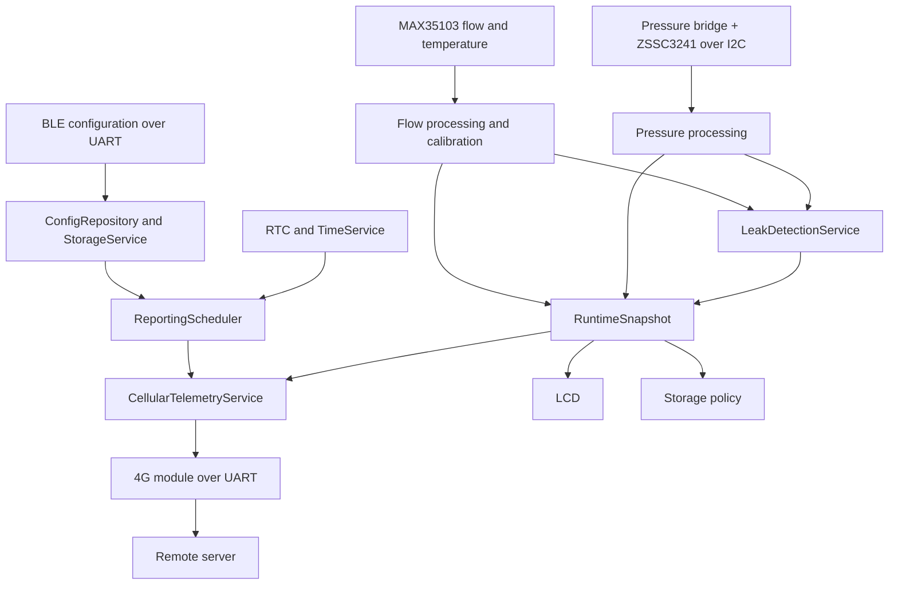
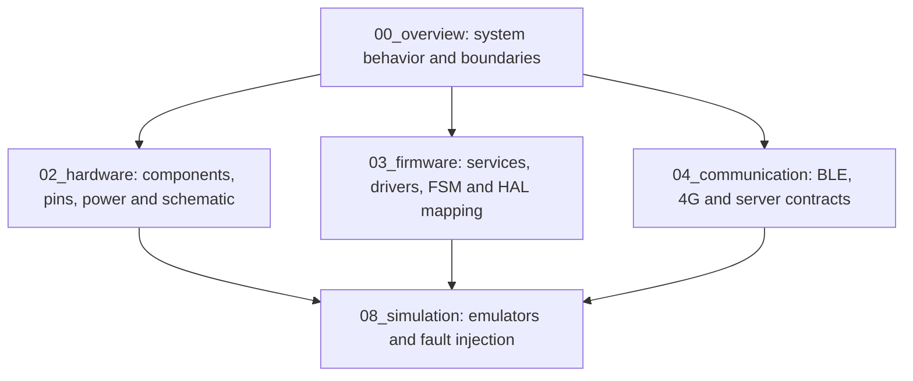

# System Design Documentation — Smart Water Flow and Pressure Monitor

**Document group:** `1.docs/00_overview`
**Document level:** System-level design
**Project:** Smart Water Flow and Pressure Monitor
**Short name:** SWFPM
**Current status:** Foundation baseline in progress

---

## 1. Mục tiêu của bộ tài liệu

Bộ tài liệu `1.docs/00_overview` mô tả thiết kế tổng quan của hệ thống **Smart Water Flow and Pressure Monitor**.

Hệ thống có nhiệm vụ đo lưu lượng, nhiệt độ và áp suất nước; phát hiện dấu hiệu rò rỉ; hiển thị dữ liệu tại thiết bị; nhận cấu hình cục bộ qua Bluetooth Low Energy; và gửi telemetry định kỳ lên server qua mạng 4G.

Bộ tài liệu này dùng để:

* Giải thích thiết bị làm gì và không làm gì.
* Chốt baseline phần cứng và communication role.
* Mô tả các subsystem và ranh giới trách nhiệm.
* Mô tả nguyên lý hoạt động, data flow và operating flow.
* Chốt SystemMode, error taxonomy và interface boundary.
* Chuyển các quyết định hệ thống thành firmware implication.
* Liên kết system requirements với hardware, firmware, communication và simulation.

`00_overview` là điểm bắt đầu trước khi đi sâu vào schematic, STM32 HAL, BLE protocol, 4G modem, server payload hoặc test implementation.

---

## 2. Current System Baseline

Baseline hiện tại của hệ thống là:

```text
Main MCU                 : STM32L433RCT6
Ultrasonic measurement  : MAX35103 + ultrasonic transducers
Temperature measurement : MAX35103 measurement subsystem
Pressure measurement    : Variant-selected resistive pressure bridge + ZSSC3241 signal conditioner over I2C
Persistent storage      : FM24CL04B F-RAM; extension TBD if required
Local configuration     : BLE module through dedicated UART, model TBD
Remote telemetry        : 4G module through dedicated UART, model TBD
Timekeeping             : STM32 internal RTC
Local display           : LCD, model/interface TBD
Firmware execution      : Event-driven cooperative runtime; RTOS optional later
Power model              : Low-power capable; exact source and budget TBD
```

Pressure production acquisition dùng ZSSC3241 Sleep Mode với one-shot request qua I2C; STM32 monotonic scheduler sở hữu cadence. EOC được ưu tiên nếu phần cứng route pin, nếu không dùng bounded status polling. Measurement result tách `validity`, `freshness`, `production_acceptance` và `reason_flags`; freshness mặc định là `2 × active period`. Pressure trend thuộc MVP dưới dạng diagnostics/supporting evidence và không tự thay đổi leak state.

Theo `DEC-HW-001`, pressure subsystem dùng một codebase chung nhưng tạo nhiều firmware variant. Build-time `ProductVariantManifest` liên kết `PressureSensorProfile` với `Zssc3241Profile`; mỗi thiết bị có `PressureCalibrationRecord` riêng; runtime chỉ thay đổi `PressureRuntimeConfig` theo allowlist và validated bounds. Sensor identity, bridge topology và raw ZSSC3241 register profile không phải generic runtime configuration.

### 2.1. Communication roles

| Kênh | Vai trò baseline                                                                | Không thuộc vai trò baseline                          |
| ---- | ------------------------------------------------------------------------------- | ----------------------------------------------------- |
| BLE  | Local configuration, service và đọc status cục bộ nếu được cho phép             | Remote telemetry chính                                |
| 4G   | Gửi telemetry từ thiết bị lên remote server và nhận response/time theo contract | OTA, remote configuration và generic downlink command |
| LCD  | Hiển thị runtime data và status tại thiết bị                                    | Measurement data ownership                            |

BLE module và 4G module kết nối MCU qua hai UART context độc lập. Thiết kế ưu tiên hai peripheral UART riêng.

### 2.2. Reporting baseline

```text
Number of reporting windows      : 2
ReportingWindow[0]                : Default start 06:00; default interval 15 minutes
ReportingWindow[1]                : Default start 22:00; default interval 5 minutes
Window end boundary              : Derived from the next window start time
Start-time validation            : 00:00..23:59, one-minute granularity, starts distinct
Window-duration validation       : Each derived window is at least 30 minutes
Interval validation              : Integer 5..60 minutes
Civil-time baseline              : Versioned fixed UTC offset; Vietnam profile = UTC+07:00
```

Hai reporting window không mang ý nghĩa cố định là ban ngày hoặc ban đêm. Mỗi window có start time và report interval độc lập. End boundary của một window chính là start time của window còn lại theo chu kỳ 24 giờ.

Người dùng có thể thay đổi start time và interval của cả hai window qua BLE trong validation range trên. Reporting configuration chỉ có hiệu lực sau khi validation và persistent commit thành công. MVP chỉ tạo telemetry theo scheduled slot; thay đổi leak state chỉ cập nhật snapshot, LCD và diagnostics cục bộ, không tạo immediate telemetry.

---

## 3. System Purpose

Hệ thống cung cấp các chức năng chính:

1. Đo ultrasonic transit-time bằng MAX35103.
2. Tính lưu lượng tức thời và tích lũy thể tích.
3. Đo và sử dụng nhiệt độ cho compensation, diagnostics và telemetry.
4. Đo áp suất nước bằng pressure sensor giao tiếp I2C.
5. Phân tích flow, volume, time và pressure để phát hiện dấu hiệu rò rỉ.
6. Publish runtime data thành `RuntimeSnapshot` nhất quán.
7. Hiển thị flow, volume, temperature, pressure, leak status và system status trên LCD.
8. Nhận configuration/service request qua BLE.
9. Quản lý system time và scheduled reporting bằng RTC, `TimeService` và `ReportingScheduler`.
10. Tạo và gửi `TelemetryRecord` lên server qua 4G.
11. Lưu configuration và critical state qua `StorageService`.
12. Hoạt động theo event-driven model và hỗ trợ low-power.

---

## 4. System Architecture Overview



Kiến trúc được chia thành các subsystem:

```text
Measurement Subsystem
Processing and Detection Subsystem
Runtime Data Subsystem
Time and Scheduling Subsystem
Configuration and Storage Subsystem
Connectivity Subsystem
Display Subsystem
Power and Health Subsystem
Debug and Service Subsystem
```

---

## 5. Core Data Paths

### 5.1. Measurement and leak detection

```text
MAX35103
  -> RawUltrasonicMeasurement
  -> validation
  -> FlowComputationService
  -> CalibrationService
  -> FlowResult
  -> VolumeAccumulator

Pressure bridge + ZSSC3241
  -> RawPressureMeasurement
  -> validation/filter/calibration
  -> PressureResult

FlowResult + VolumeState + PressureResult + Time
  -> LeakDetectionService
  -> LeakDetectionResult
  -> DataRepository
  -> RuntimeSnapshot
```

### 5.2. BLE configuration

```text
BLE client
  -> BLE module
  -> dedicated BLE UART
  -> BleConfigService
  -> frame, permission and range validation
  -> PendingConfig
  -> configuration policy
  -> StorageService commit if required
  -> ActiveConfig
  -> notify affected services
```

### 5.3. Scheduled telemetry

```text
RTC alarm or time event
  -> RtcDriver
  -> TimeService
  -> ReportingScheduler
  -> REPORT_DUE
  -> read valid RuntimeSnapshot
  -> build TelemetryRecord
  -> TelemetryQueue
  -> CellularTelemetryService
  -> 4G module
  -> remote server
```

`REPORT_DUE` chỉ có nghĩa báo cáo đã đến hạn được tạo. Nó không có nghĩa record đã được server nhận thành công.

---

## 6. Core Design Rules

Các quy tắc sau là ràng buộc cấp hệ thống và phải được giữ nhất quán trong hardware, firmware, communication và simulation:

1. Measurement pipeline không phụ thuộc BLE, 4G hoặc LCD.
2. BLE không truy cập trực tiếp MAX35103, pressure sensor hoặc F-RAM.
3. 4G không đọc trực tiếp measurement hardware.
4. LCD chỉ đọc `RuntimeSnapshot` hoặc display model tạo từ snapshot.
5. `DataRepository` là boundary chia sẻ runtime data.
6. `RuntimeSnapshot` phải atomic hoặc versioned.
7. Flow, pressure và temperature phải có timestamp, quality và freshness riêng.
8. Measurement invalid hoặc stale không được dùng để cập nhật volume hoặc xác nhận leak rule yêu cầu dữ liệu đó.
9. `LeakDetectionService` chỉ sử dụng processed/validated results.
10. BLE write phải đi qua `PendingConfig` và configuration validation.
11. `StorageService` là service duy nhất được commit persistent records.
12. UART/RTC callback và ISR chỉ capture data/event tối thiểu, không chạy processing nặng.
13. BLE và 4G sử dụng buffer, parser và connection state độc lập.
14. `RtcDriver` chỉ quản lý RTC hardware.
15. `TimeService` quản lý system time, validity, timezone và synchronization.
16. `ReportingScheduler` quản lý reporting window, interval và next report time.
17. Server time dự kiến được đồng bộ mỗi 24 giờ; STM32 RTC giữ local time giữa các lần sync. `max_time_sync_age` mặc định 7 ngày và cấu hình được qua BLE.
18. Khi time invalid, scheduled telemetry dùng `DEFER_UNTIL_VALID`; khi time phục hồi, slot đã lỡ dùng `SKIP_TO_NEXT`.
19. `ReportingScheduler` không trực tiếp thực hiện 4G transaction.
20. 4G communication phải non-blocking hoặc bounded để không chặn measurement.
21. Thiết bị phải tiếp tục measurement và LCD operation khi 4G offline.
22. Low-power chỉ được kích hoạt khi không còn measurement, storage, BLE, 4G hoặc reporting blocker quan trọng.
23. Lỗi communication không tự động reset measurement subsystem nếu measurement vẫn vận hành an toàn.
24. External input phải được xem là untrusted cho đến khi validation và authorization hoàn tất.

---

## 7. Scope of `00_overview`

### 7.1. Nội dung thuộc phạm vi

```text
System purpose and baseline
System architecture and subsystem boundaries
Ultrasonic, pressure and leak-detection roles
Main operating flow and sequence
SystemMode and operating modes
Runtime/configuration/telemetry data flow
Reporting schedule behavior
System interface definitions
Error taxonomy and recovery direction
Firmware implications
Cross-document traceability
Canonical terminology and naming
```

### 7.2. Nội dung ngoài phạm vi

```text
Schematic and PCB implementation
Exact pin mapping and STM32 alternate function
STM32CubeMX configuration
HAL function and driver code
MAX35103 register/opcode implementation
Pressure sensor register implementation
BLE GATT UUID and packet encoding
4G AT command and modem-specific state machine
MQTT/HTTP/TCP payload encoding
Server/backend implementation
Simulation emulator implementation
Detailed test case implementation
OTA and remote 4G configuration unless added to baseline
```

---

## 8. Documentation Structure

```text
1.docs/00_overview/
├── README.md
├── glossary.md
├── 00_open_questions_and_decisions.md
├── 01_system_overview.md
├── 02_system_block_diagram.md
├── 03_operating_principle.md
├── 04_main_operation_flow.md
├── 05_sequence_diagrams.md
├── 06_system_fsm.md
├── 07_operating_modes.md
├── 08_data_flow.md
├── 09_error_handling_overview.md
├── 10_system_interfaces.md
├── 11_firmware_implication.md
├── 12_system_traceability.md
├── 13_reporting_and_connectivity_policy.md
└── SYSTEM_DESIGN_COMPLETE.md
```

---

## 9. Documentation Map and Status

| Tài liệu                                  | Vai trò                                                                                            | Trạng thái |
| ----------------------------------------- | -------------------------------------------------------------------------------------------------- | ---------- |
| `README.md`                               | Baseline, scope, source-of-truth và maintenance rules                                              | Defined    |
| `glossary.md`                             | Canonical terminology, naming và service/file mapping                                              | Defined    |
| `00_open_questions_and_decisions.md`      | Decision registry, OQ consolidation và implementation gates                                        | Active     |
| `01_system_overview.md`                   | System purpose, chức năng, subsystem và boundary                                                   | Defined    |
| `02_system_block_diagram.md`              | Context, physical block và logical block diagrams                                                  | Defined    |
| `03_operating_principle.md`               | Flow, pressure, leak detection và reporting principle                                              | Defined    |
| `04_main_operation_flow.md`               | Boot, measurement, BLE config, reporting và low-power flow                                         | Defined    |
| `05_sequence_diagrams.md`                 | Sequence cho các use case quan trọng                                                               | Defined    |
| `06_system_fsm.md`                        | SystemMode và transition cấp hệ thống                                                              | Defined    |
| `07_operating_modes.md`                   | Quyền hoạt động và behavior chi tiết theo từng SystemMode                                          | Defined    |
| `08_data_flow.md`                         | Data object, ownership, metadata và measurement/configuration/telemetry flow                       | Defined    |
| `09_error_handling_overview.md`           | Fault taxonomy, containment, degraded behavior và recovery escalation                              | Defined    |
| `10_system_interfaces.md`                 | Physical/external/logical interface và ownership                                                   | Defined    |
| `11_firmware_implication.md`              | System decision sang firmware architecture, ownership, execution, recovery và requirement          | Defined    |
| `12_system_traceability.md`               | Decision, behavior, interface, requirement, firmware owner và verification mapping                 | Defined    |
| `13_reporting_and_connectivity_policy.md` | Time window, slot/dedup, telemetry lifecycle, offline/ACK/retry/queue policy và proposed decisions | Defined    |
| `SYSTEM_DESIGN_COMPLETE.md`               | Completion checklist và design review result                                                       | Planned    |

`Defined` trong bảng chỉ có nghĩa tài liệu baseline đã được tạo. Nó chưa có nghĩa toàn bộ system design đã hoàn thành hoặc mọi open question đã được đóng.

---

## 10. Source-of-Truth Matrix

| Nội dung                                              | Source-of-truth                           | Downstream document phải làm gì                                  |
| ----------------------------------------------------- | ----------------------------------------- | ---------------------------------------------------------------- |
| System baseline và scope                              | `README.md`                               | Bám theo baseline hoặc tạo ADR khi thay đổi                      |
| Thuật ngữ và canonical names                          | `glossary.md`                             | Sử dụng đúng tên hoặc cập nhật glossary trước                    |
| Open question, decision status và implementation gate | `00_open_questions_and_decisions.md`      | Không tự chọn assumption ngoài decision registry                 |
| System purpose và subsystem                           | `01_system_overview.md`                   | Chi tiết hóa mà không đổi responsibility                         |
| Block architecture                                    | `02_system_block_diagram.md`              | Map block sang hardware/firmware implementation                  |
| Operating principle                                   | `03_operating_principle.md`               | Firmware implement; simulation validate                          |
| Main system flow                                      | `04_main_operation_flow.md`               | Firmware map sang event/action flow                              |
| System sequence                                       | `05_sequence_diagrams.md`                 | Communication/firmware bảo đảm đúng ordering                     |
| SystemMode/FSM                                        | `06_system_fsm.md`                        | Firmware map sang internal phases                                |
| Operating mode                                        | `07_operating_modes.md`                   | Power/communication/service policy bám theo                      |
| Runtime/config/telemetry flow                         | `08_data_flow.md`                         | Data model và tests không định nghĩa lại pipeline                |
| Error taxonomy                                        | `09_error_handling_overview.md`           | Firmware detect/recover; communication encode; simulation inject |
| Interface ID và ownership                             | `10_system_interfaces.md`                 | Hardware/firmware/communication triển khai đúng boundary         |
| Firmware module implication                           | `11_firmware_implication.md`              | Firmware architecture dùng làm implementation baseline           |
| System requirement mapping                            | `12_system_traceability.md`               | Mọi requirement phải có implementation/test mapping              |
| Reporting/connectivity policy                         | `13_reporting_and_connectivity_policy.md` | Scheduler, telemetry và simulation dùng cùng policy              |

---

## 11. Relationship with Other Documentation Groups



Vai trò từng nhóm:

* `00_overview` mô tả hệ thống cần hoạt động như thế nào.
* `02_hardware` mô tả phần cứng thực hiện các system interfaces như thế nào.
* `03_firmware` mô tả service, driver, scheduler và internal state thực hiện system behavior như thế nào.
* `04_communication` mô tả BLE configuration contract, 4G modem integration và server-facing telemetry contract.
* `08_simulation` kiểm chứng system/firmware/communication behavior bằng emulator và deterministic tests.

---

## 12. Naming Summary

Logical service dùng `PascalCase`:

```text
MeasurementManager
FlowComputationService
PressureMeasurementService
PressureProcessingService
CalibrationService
VolumeAccumulator
LeakDetectionService
DataRepository
ConfigRepository
StorageService
TimeService
ReportingScheduler
BleConfigService
CellularTelemetryService
LcdService
PowerManager
DiagnosticsService
HealthMonitor
```

Firmware file/module dùng `lower_snake_case`:

```text
measurement_manager.c
pressure_measurement_service.c
leak_detection_service.c
data_repository.c
reporting_scheduler.c
ble_config_service.c
cellular_telemetry_service.c
```

Application event dùng `EVT_UPPER_SNAKE_CASE`:

```text
EVT_MAX_RESULT_READY
EVT_PRESSURE_SAMPLE_DUE
EVT_RTC_ALARM
EVT_REPORT_DUE
EVT_BLE_CONFIG_RECEIVED
EVT_CELLULAR_TX_COMPLETED
EVT_LEAK_DETECTED
```

Không dùng hậu tố `Task` ở system-level khi RTOS chưa được chốt.

---

## 13. SystemMode and Internal State Rule

Cần phân biệt:

| Khái niệm                 | Mức               | Ví dụ                                                         |
| ------------------------- | ----------------- | ------------------------------------------------------------- |
| `SystemMode`              | System-level      | `INIT`, `NORMAL`, `LOW_POWER`, `SERVICE`, `RECOVERY`, `ERROR` |
| `MeasurementPhase`        | Firmware internal | Wait result, read, validate, process, publish                 |
| `BleConfigState`          | Firmware internal | RX, parse, validate, respond                                  |
| `CellularConnectionState` | Firmware internal | Power, register, connect, send, recover                       |
| `TelemetryDeliveryState`  | Firmware internal | Generate, queue, send, acknowledge, retry                     |
| `StorageCommitState`      | Firmware internal | Validate, write inactive slot, verify, switch active          |

Reporting window không phải `SystemMode`:

```text
ReportingWindow[0]
ReportingWindow[1]
```

Hai reporting window chỉ quyết định report interval tại một local time cụ thể. Chúng không thay đổi `SystemMode` và không đại diện cho khái niệm ngày/đêm cố định.

---

## 14. Data Ownership Summary

| Data                  | Owner                        | Consumer                                       |
| --------------------- | ---------------------------- | ---------------------------------------------- |
| Raw MAX35103 result   | `MeasurementManager`         | Flow processing pipeline                       |
| Raw pressure result   | `PressureMeasurementService` | `PressureProcessingService`                    |
| Calibrated flow       | `CalibrationService`         | Volume, leak detection, repository             |
| Calibrated pressure   | `PressureProcessingService`  | Leak detection, repository                     |
| Volume state          | `VolumeAccumulator`          | Repository, storage                            |
| Leak result           | `LeakDetectionService`       | Repository                                     |
| Runtime snapshot      | `DataRepository`             | LCD, telemetry, storage, diagnostics           |
| Active/pending config | `ConfigRepository`           | Measurement, scheduling, connectivity, display |
| Persistent records    | `StorageService`             | Boot/load/recovery                             |
| System time           | `TimeService`                | Measurement, reporting, telemetry, diagnostics |
| Reporting schedule    | `ReportingScheduler`         | Application/telemetry                          |
| BLE session           | `BleConfigService`           | Configuration boundary                         |
| Telemetry delivery    | `CellularTelemetryService`   | 4G module/server interface                     |

---

## 15. Interface Summary

| ID range          | Nội dung                                  | Source-of-truth           |
| ----------------- | ----------------------------------------- | ------------------------- |
| `IF-01`–`IF-03`   | MAX35103, INT và ultrasonic physical path | `10_system_interfaces.md` |
| `IF-04`           | ZSSC3241 pressure subsystem I2C           | `10_system_interfaces.md` |
| `IF-05`           | F-RAM I2C                                 | `10_system_interfaces.md` |
| `IF-06`–`IF-07`   | BLE UART và BLE wireless                  | `10_system_interfaces.md` |
| `IF-08`–`IF-09`   | 4G UART và remote telemetry               | `10_system_interfaces.md` |
| `IF-10`           | RTC/time/alarm boundary                   | `10_system_interfaces.md` |
| `IF-11`           | LCD interface                             | `10_system_interfaces.md` |
| `IF-12`           | Power status/control                      | `10_system_interfaces.md` |
| `IF-13`           | Debug/service                             | `10_system_interfaces.md` |
| `LIF-01`–`LIF-15` | Logical data/service boundaries           | `10_system_interfaces.md` |

---

## 16. Current Open Decisions and Qualification Gaps

Các nhóm quyết định quan trọng chưa chốt:

| Nhóm                           | Nội dung                                                                                                                                              |
| ------------------------------ | ----------------------------------------------------------------------------------------------------------------------------------------------------- |
| Pressure variant qualification | Model/range/accuracy, ZSSC3241 register values, conversion timing và acceptance evidence của từng variant; kiến trúc profile đã chốt bởi `DEC-HW-001` |
| BLE                            | Module model, transparent UART/AT mode, GATT và security policy                                                                                       |
| 4G                             | Module model, cellular technology, UART flow control và modem profile                                                                                 |
| Server                         | MQTT/HTTPS/TCP, payload schema, acknowledgement và retry policy                                                                                       |
| Measurement                    | Exact default/min/max period, conversion timeout và jitter của từng product profile; acquisition/quality/freshness semantics đã chốt                  |
| Leak detection                 | Exact numeric profile defaults/ranges và validation evidence; profile fields/version/reset behavior đã chốt                                           |
| LCD                            | Model, physical interface và display content/pages                                                                                                    |
| Storage                        | Telemetry offline retention và storage backing                                                                                                        |
| Power                          | Power source, battery budget và 4G peak-current handling                                                                                              |
| Security                       | BLE authorization, device identity, credentials và endpoint authentication                                                                            |
| Future scope                   | OTA và remote configuration qua 4G                                                                                                                    |

Trạng thái chi tiết, OQ trùng lặp và implementation gate được quản lý trong `00_open_questions_and_decisions.md`. Open question phải được giữ ở trạng thái `OPEN`, `PROPOSED` hoặc `DEFERRED` cho đến khi có quyết định chính thức; không tự suy đoán model/protocol trong downstream documentation.

---

## 17. Recommended Reading Order

Đọc theo thứ tự:

```text
1. README.md
2. glossary.md
3. 00_open_questions_and_decisions.md
4. 01_system_overview.md
5. 02_system_block_diagram.md
6. 10_system_interfaces.md
7. 03_operating_principle.md
8. 13_reporting_and_connectivity_policy.md
9. 08_data_flow.md
10. 04_main_operation_flow.md
11. 05_sequence_diagrams.md
12. 06_system_fsm.md
13. 07_operating_modes.md
14. 09_error_handling_overview.md
15. 11_firmware_implication.md
16. 12_system_traceability.md
17. SYSTEM_DESIGN_COMPLETE.md
```

Năm tài liệu đầu tiên tạo foundation checkpoint. Các tài liệu behavior, FSM, error và implementation mapping chỉ nên được hoàn thiện sau khi foundation được review.

---

## 18. Maintenance Rules

Khi thay đổi tài liệu:

* Nếu đổi baseline hoặc scope, cập nhật `README.md` và `12_system_traceability.md`.
* Nếu thêm hoặc đóng OQ/decision, cập nhật `00_open_questions_and_decisions.md` và các source OQ liên quan.
* Nếu đổi tên service/data/event, cập nhật `glossary.md` trước.
* Nếu thêm/xóa system block, cập nhật `01_system_overview.md`, `02_system_block_diagram.md` và `10_system_interfaces.md`.
* Nếu đổi interface role/direction/ownership, cập nhật `10_system_interfaces.md` và downstream docs.
* Nếu đổi leak detection principle, cập nhật `03_operating_principle.md`, `08_data_flow.md`, `09_error_handling_overview.md` và tests.
* Nếu đổi reporting schedule behavior, cập nhật `13_reporting_and_connectivity_policy.md`, `07_operating_modes.md` và `08_data_flow.md`.
* Nếu đổi BLE/4G external contract, cập nhật `04_communication` trước khi đổi firmware binding.
* Nếu thêm requirement, thêm requirement ID và mapping trong `12_system_traceability.md`.
* Nếu thêm simulation test, map test case với requirement tương ứng.
* Nếu một `OQ` được chốt, chuyển kết quả thành requirement hoặc ADR và cập nhật các tài liệu bị ảnh hưởng.

---

## 19. Foundation Review Checklist

Foundation checkpoint chỉ được coi là đạt khi:

```text
[ ] Baseline hardware và communication roles nhất quán.
[ ] Không còn RS485/Modbus trong current baseline.
[ ] BLE chỉ được mô tả là local configuration/service.
[ ] 4G chỉ được mô tả là telemetry uplink trong baseline.
[ ] ZSSC3241 được ghi là signal conditioner đã chọn; pressure sensor/ZSSC3241 dùng build-time variant profile, calibration theo thiết bị và runtime config có giới hạn theo `DEC-HW-001`.
[ ] MAX35103 được gọi đúng là measurement IC.
[ ] Flow path được xác định là core measurement: production boot chỉ vào `NORMAL` sau valid flow readiness; runtime fault dùng bounded `NORMAL + DEGRADED` trước system recovery.
[ ] `CalibrationService` là owner của temperature conversion/calibration và immutable `TemperatureResult`; `MeasurementManager` chỉ acquire/validate raw input.
[ ] Uncompensated flow không được chấp nhận cho production; temperature không usable tạo `INVALID` hoặc `DEGRADED_NOT_ACCEPTED` và không update volume/flow-based leak evidence.
[ ] `SERVICE` quiesce production measurement; chỉ bounded `SERVICE_SAMPLE`/`CALIBRATION_SAMPLE` được phép và không tạo production side effect.
[ ] Mỗi physical I2C instance có một `I2cBusManager` owner; pressure/storage service không gọi HAL I2C trực tiếp.
[ ] `RuntimeSnapshot` dùng double buffer và atomic active-index swap.
[ ] Config apply response phân biệt `APPLIED`, `DEFERRED` và `REJECTED` theo matching `config_version`.
[ ] OTA và remote configuration/command qua 4G không thuộc baseline hiện tại.
[ ] Power protection chỉ dựa trên hardware reset/brownout; không có controlled shutdown hoặc emergency storage flush assumption.
[ ] RTC, TimeService và ReportingScheduler được tách responsibility.
[ ] `DEC-SCHED-001 = DEFER_UNTIL_VALID`; `max_time_sync_age` mặc định 7 ngày và cấu hình được.
[ ] `DEC-SCHED-002 = SKIP_TO_NEXT`; không tạo catch-up report cho slot đã lỡ.
[ ] `ReportingWindow[0]` và `ReportingWindow[1]` không bị gắn với khái niệm ngày/đêm cố định.
[ ] Start time và interval của cả hai reporting window có thể cấu hình qua BLE.
[ ] End boundary của mỗi window được suy ra từ start time của window còn lại.
[ ] LCD chỉ đọc RuntimeSnapshot.
[ ] Physical/external interface có IF ID.
[ ] Logical boundary có LIF ID.
[ ] Data owner được xác định.
[ ] Canonical service names giống nhau giữa các tài liệu.
[ ] Open questions không bị trình bày như quyết định đã chốt.
```

---

## 20. Document Group Completion Criteria

`00_overview` chỉ được đánh dấu hoàn thành khi:

1. Tất cả tài liệu trong documentation map đã được tạo và review.
2. Baseline không mâu thuẫn giữa README, overview, block diagram và interfaces.
3. Flow, pressure, leak detection và reporting behavior có requirement rõ ràng.
4. SystemMode tách khỏi internal firmware state.
5. Error taxonomy có severity và recovery direction.
6. Mọi system requirement có firmware/communication/simulation mapping.
7. Các open question blocking implementation đã được đóng hoặc ghi rõ deferred decision.
8. `SYSTEM_DESIGN_COMPLETE.md` ghi lại review result và remaining risks.

---

## 21. Kết luận

`1.docs/00_overview` là source-of-truth cho system behavior và interface boundaries của Smart Water Flow and Pressure Monitor.

Thiết kế tổng quát được tóm tắt như sau:

```text
Measure flow, temperature and pressure
  -> validate and process
  -> detect leak condition
  -> publish RuntimeSnapshot
  -> display locally
  -> persist critical state
  -> report on configurable schedule through 4G
  -> accept controlled configuration through BLE
  -> enter low-power when all critical work is idle
```

Hardware, firmware, communication và simulation documentation phải chi tiết hóa thiết kế này mà không thay đổi baseline, ownership hoặc interface responsibility nếu chưa có requirement/ADR mới.
