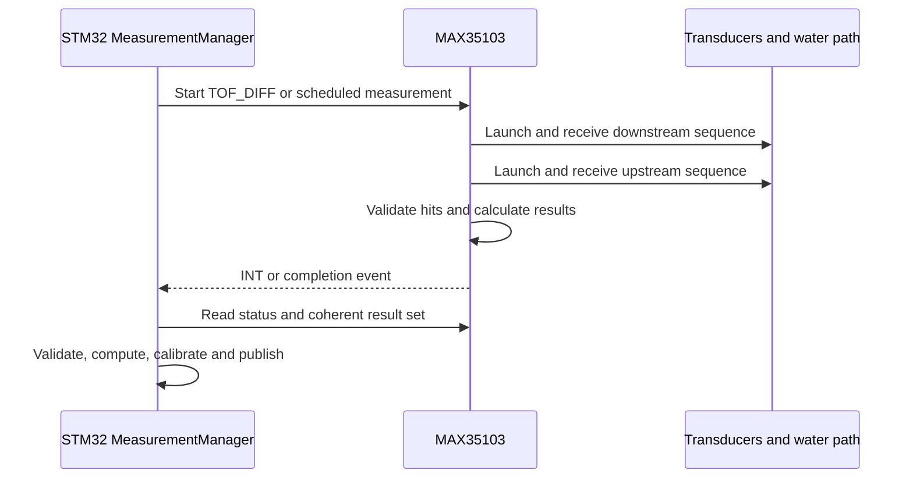

# 01 — Ultrasonic Flow Measurement Principle

**Project:** Smart Water Flow and Pressure Monitor  
**Short name:** SWFPM  
**Document group:** `1.docs/01_principle`  
**Document level:** Measurement and physical principle  
**Status:** Proposed baseline  

---

## 1. Mục tiêu

Tài liệu này định nghĩa nguyên lý đo lưu lượng nước bằng ultrasonic transit-time cho hệ thống **Smart Water Flow and Pressure Monitor** sử dụng MAX35103 và một cặp ultrasonic transducer.

Mục tiêu gồm:

- Giải thích quan hệ giữa upstream/downstream Time-of-Flight (`ToF`) và vận tốc dòng nước.
- Chốt sign convention cho `ToF`, flow direction và flow rate.
- Phân biệt raw MAX35103 result, validated measurement, processed flow và calibrated `FlowResult`.
- Định nghĩa validation, zero-flow correction, filtering, calibration và quality.
- Định nghĩa boundary giữa flow computation, temperature compensation và volume accumulation.
- Làm cơ sở cho MAX35103 driver, firmware service, calibration, simulation và validation.

Tài liệu này không giả định hình học spool body, transducer model, pipe diameter hoặc calibration coefficient khi các thông số đó chưa được chốt.

---

## 2. Phạm vi

### 2.1. Thuộc phạm vi

```text
Transit-time measurement principle
MAX35103 upstream/downstream measurement semantics
Flow direction and sign convention
ToF fixed-point conversion boundary
Raw measurement contract
Measurement validity and quality
Differential transit-time processing
Fluid/path velocity model
Volumetric flow model
Zero-flow offset correction
Filtering and averaging boundary
Flow calibration principle
Temperature-compensation boundary
FlowResult contract
Volume-integration boundary
Fault and recovery behavior
Characterization and validation requirements
```

### 2.2. Ngoài phạm vi

```text
Exact MAX35103 register values for production
SPI transaction implementation and STM32 HAL calls
Schematic, PCB layout and analog component values
Transducer/spool-body part number and mechanical drawing
Production launch pulse, threshold and hit configuration
Production flow range and accuracy class
Final temperature-compensation equation
BLE configuration packet encoding
4G telemetry payload encoding
Leak-detection thresholds
Billing/certification claim
```

Register-level details thuộc MAX35103 driver document. Mechanical constants và operating limits thuộc hardware document. Temperature model chi tiết thuộc `02_temperature_compensation_principle.md`.

---

## 3. Tài liệu liên quan và source-of-truth

| Nội dung | Source-of-truth |
|---|---|
| System purpose và measurement boundary | `../00_overview/01_system_overview.md` |
| SPI/INT/acoustic interface boundary | `../00_overview/10_system_interfaces.md` |
| Canonical terms và data objects | `../00_overview/glossary.md` |
| Temperature compensation | `02_temperature_compensation_principle.md` |
| Pressure processing | `03_pressure_measurement_principle.md` |
| Leak algorithm input contract | `05_leak_detection_algorithm_baseline.md` |
| Algorithm validation strategy | `07_algorithm_validation_plan.md` |
| MAX35103 behavior/register format | Official MAX35103 datasheet |
| Production geometry/calibration | Future hardware and calibration documents |

Nếu có mâu thuẫn:

1. MAX35103 datasheet quyết định IC command, result format và status semantics.
2. Tài liệu này quyết định physical/processing semantics và `FlowResult` contract.
3. Hardware profile quyết định geometry và operating range.
4. Calibration profile quyết định production correction.

---

## 4. Design Baseline

```text
Measurement IC          : MAX35103
Host MCU                : STM32L433RCT6
Acoustic elements       : Two ultrasonic transducers
Measurement principle   : Bidirectional transit time
MCU interface           : 4-wire SPI + interrupt/event signal
Primary raw quantities  : AVGUP, AVGDN, TOF_DIFF, status/quality metadata
Canonical logical flow  : signed volumetric flow rate in m^3/s
Forward sign            : positive
Reverse sign            : negative
Published object        : FlowResult
Volume source           : valid calibrated FlowResult only
```

MAX35103 là time-to-digital measurement IC có analog front end; nó không phải flow sensor hoàn chỉnh và không trực tiếp tạo production-calibrated flow rate. Datasheet xác nhận IC đo hai hướng ToF, cung cấp automatic differential ToF và giao tiếp 4-wire SPI. [MAX35103 datasheet](https://www.analog.com/media/en/technical-documentation/data-sheets/max35103.pdf)

---

## 5. Physical Principle

### 5.1. Transit time

Hai transducer được đặt sao cho ultrasonic signal truyền theo một acoustic path qua nước.

Khi nước đứng yên:

$$
t_{up} \approx t_{down}
$$

Khi nước chảy theo hướng thuận:

```text
Downstream acoustic propagation is aided by flow.
Upstream acoustic propagation is opposed by flow.
```

Do đó:

$$
t_{up} > t_{down}
$$

và differential transit time được định nghĩa:

$$
\Delta t = t_{up} - t_{down}
$$

Với quy ước dự án:

```text
delta_t > 0 -> forward-flow candidate
delta_t < 0 -> reverse-flow candidate
delta_t near zero -> zero/deadband candidate
```

### 5.2. Straight acoustic-path model

Với acoustic path hiệu dụng $L$, tốc độ âm $c$, flow-path velocity đại diện $v_p$ và góc $\theta$ giữa acoustic path với trục dòng chảy:

$$
t_{down} = \frac{L}{c + v_p\cos\theta}
$$

$$
t_{up} = \frac{L}{c - v_p\cos\theta}
$$

Từ hai phương trình:

$$
v_p = \frac{L}{2\cos\theta}
\left(
\frac{1}{t_{down}} - \frac{1}{t_{up}}
\right)
$$

hay tương đương:

$$
v_p = \frac{L}{2\cos\theta}
\frac{t_{up}-t_{down}}{t_{up}t_{down}}
$$

Phương trình reciprocal-time là model lý tưởng được ưu tiên khi cả $t_{up}$ và $t_{down}$ hợp lệ.

### 5.3. Small-flow approximation

Khi $|v_p\cos\theta| \ll c$:

$$
\Delta t \approx \frac{2Lv_p\cos\theta}{c^2}
$$

và:

$$
v_p \approx \frac{c^2\Delta t}{2L\cos\theta}
$$

Approximation này cho thấy ảnh hưởng của sound speed/temperature. Tuy nhiên firmware không được tự chọn giữa exact reciprocal-time và approximation mà không có model version và validation.

### 5.4. Model limits

Spool body thực có thể có reflector, non-flow acoustic segment, velocity profile không đều, transducer delay và mechanical tolerance. Vì vậy:

- $L$ không nhất thiết chỉ là khoảng cách thẳng giữa hai transducer.
- $v_p$ không nhất thiết bằng mean axial velocity.
- Một geometry/hydraulic correction factor là cần thiết.
- Calibration thực tế là bắt buộc để đạt accuracy production.

Analog Devices cũng lưu ý turbulence, spool-body mechanics và transducer mismatch làm flow response phi tuyến, đặc biệt ở low flow, và khuyến nghị multipoint calibration với reference flow. [ADI flow-calibration article](https://www.analog.com/en/resources/technical-articles/calibration-of-water-flow-rate-in-an-ultrasonic-flow-meter-using-the-max35101.html)

---

## 6. MAX35103 Direction Semantics

Theo MAX35103 datasheet:

- `TOF_UP`: launch từ `LAUNCH_UP`, nối với downstream transducer, và receive tại upstream transducer qua `STOP_UP`.
- `TOF_DN`: launch từ `LAUNCH_DN`, nối với upstream transducer, và receive tại downstream transducer qua `STOP_DN`.
- `TOF_DIFF = AVGUP - AVGDN`.

### 6.1. Physical naming

Baseline installation naming:

```text
Transducer A = physical upstream transducer for forward direction
Transducer B = physical downstream transducer for forward direction

TOF_DN: A -> B
TOF_UP: B -> A
```

### 6.2. Project sign convention

```text
t_up    = converted AVGUP
t_down  = converted AVGDN
delta_t = t_up - t_down

forward flow -> delta_t > 0 -> flow_rate > 0
reverse flow -> delta_t < 0 -> flow_rate < 0
```

### 6.3. Installation/profile requirement

Hardware profile phải khai báo:

```text
transducer_a_role
transducer_b_role
max35103_launch_up_mapping
max35103_launch_dn_mapping
forward_flow_physical_direction
flow_sign_multiplier = +1 or -1
```

`flow_sign_multiplier` chỉ dùng để normalize một wiring/mechanical mapping đã biết. Nó không được dùng để che lỗi lắp đặt không xác định.

### 6.4. Commissioning sign test

Khi có controlled forward reference flow:

1. Đo `AVGUP`, `AVGDN` và `TOF_DIFF`.
2. Xác nhận `TOF_DIFF` có sign theo profile.
3. Xác nhận computed flow dương.
4. Lặp lại ở zero flow và nếu có thể ở controlled reverse flow.

Không cho phép volume production trước khi direction mapping được xác nhận.

---

## 7. MAX35103 Measurement Sequence Boundary

MAX35103 có thể launch pulse train, enable receive path sau delay, detect selected acoustic waves/hits, tính các result và báo completion. IC hỗ trợ individual ToF direction, differential ToF và event-timing operation. [MAX35103 datasheet](https://www.analog.com/media/en/technical-documentation/data-sheets/max35103.pdf)



Principle-level rules:

- INT/callback chỉ tạo event; processing nặng chạy ngoài ISR.
- Status phải được đọc cùng measurement result theo coherent sequence.
- Result register read phải tuân thủ driver snapshot rule.
- Một completion event không tự động có nghĩa measurement valid.
- Event-timing average phải đi cùng cycle count/range metadata.

---

## 8. ToF Numeric Representation

### 8.1. MAX35103 result format boundary

MAX35103 result registers dùng integer và fractional portions dựa trên period của high-speed clock; differential result dùng signed two's-complement fixed-point representation. Chi tiết byte order/register address thuộc driver, không thuộc application service. [MAX35103 datasheet](https://www.analog.com/media/en/technical-documentation/data-sheets/max35103.pdf)

### 8.2. Generic conversion

Với integer part $I$, fractional part $F$, fractional width $N$ và measured/validated high-speed clock period $T_{clk}$:

$$
t = \left(I + \frac{F}{2^N}\right)T_{clk}
$$

Signed differential phải được sign-extend trên toàn fixed-point word trước khi scale.

### 8.3. Recommended internal representation

```text
Raw register fields        : exact unsigned/signed register words
Converted absolute ToF     : integer picoseconds or wider fixed-point
Converted differential ToF : signed integer picoseconds or wider fixed-point
Flow intermediate          : widened integer/fixed-point or validated float
```

Không hard-code `T_clk = 250 ns` chỉ vì nominal oscillator là 4 MHz. Driver/profile phải dùng clock-calibration result hoặc documented clock model khi accuracy yêu cầu.

### 8.4. Numeric safety

- Ghép integer/fraction trước khi rounding nếu có thể.
- Sign-extend differential trước arithmetic shift/division.
- Dùng widened multiplication cho $t_{up}t_{down}$.
- Kiểm tra division-by-zero và denominator range.
- Chứng minh intermediate không overflow tại minimum/maximum ToF.
- Rounding policy phải deterministic và có golden vectors.

---

## 9. `RawUltrasonicMeasurement` Contract

| Field | Kiểu logic | Ý nghĩa | Bắt buộc |
|---|---|---|---:|
| `avg_up_raw` | Fixed-point raw | MAX average upstream hits | Có |
| `avg_down_raw` | Fixed-point raw | MAX average downstream hits | Có |
| `tof_diff_raw` | Signed fixed-point raw | MAX `AVGUP - AVGDN` | Khuyến nghị/có khi mode hỗ trợ |
| `hit_values_up` | Array | Individual upstream hit times | Optional diagnostics |
| `hit_values_down` | Array | Individual downstream hit times | Optional diagnostics |
| `wave_ratio_up` | Raw/decoded | Upstream waveform ratio metadata | Nếu mode/config expose |
| `wave_ratio_down` | Raw/decoded | Downstream waveform ratio metadata | Nếu mode/config expose |
| `tof_range` | Raw/decoded | Range/spread metadata từ event timing | Nếu dùng event timing |
| `tof_cycle_count` | Count | Valid error-free cycles accumulated | Nếu dùng event timing |
| `interrupt_status` | Bit field | Completion/error status | Có |
| `clock_calibration` | Raw/processed | Clock-period basis/version | Khuyến nghị |
| `temperature_raw_ref` | Reference/field | Temperature measurement liên quan | Optional |
| `measurement_config_version` | Identifier | Active MAX/geometry config | Có |
| `sample_sequence` | Unsigned counter | Measurement stream sequence | Có |
| `sample_monotonic_time` | Monotonic time | Measurement completion/reference time | Có |
| `wall_clock_timestamp` | UTC timestamp | Timestamp nếu TimeService valid | Optional |
| `timestamp_valid` | Boolean | Wall-clock validity | Có |

`RawUltrasonicMeasurement` không phải `FlowResult` và không được dùng trực tiếp cho volume, LCD hoặc leak detection.

---

## 10. Measurement Validation

### 10.1. Validation layers

| Layer | Kiểm tra | Failure behavior |
|---|---|---|
| SPI transport | Transaction complete, length/coherency valid | Reject sample |
| IC status | Completion đúng event, không timeout/blocking error | Reject/degrade |
| Cycle validity | Required valid cycle count đạt yêu cầu | Reject/not ready |
| Raw format | Reserved/invalid/saturated encoding absent | Reject |
| ToF range | Absolute ToF within configured physical window | Reject |
| Pair consistency | Up/down belong to same measurement set | Reject |
| Difference consistency | Host difference agrees with MAX result within quantization tolerance | Reject/diagnostic |
| Hit/wave quality | Hit spread/wave ratios satisfy characterized limits | Reject/degrade |
| Temporal | Sequence/time order and age valid | Reject duplicate/out-of-order/stale |
| Profile | Config, geometry and calibration compatible | Reject/degrade |

### 10.2. IC completion/status

MAX35103 status distinguishes ToF completion, event-timing completion and timeout. Datasheet states event-timing completion indicates relevant differential/average result registers are valid; driver phải preserve this semantic. [MAX35103 datasheet](https://www.analog.com/media/en/technical-documentation/data-sheets/max35103.pdf)

Rules:

- Timeout sample không được coi là zero flow.
- Completion bit sai mode không được dùng cho requested cycle.
- Status read có self-clearing behavior phải được driver quản lý để không mất event.
- Power-on/reset/init event phải invalidate in-flight measurement.

### 10.3. Absolute ToF window

Với known geometry và plausible sound-speed range:

```text
tof_absolute_min <= t_up <= tof_absolute_max
tof_absolute_min <= t_down <= tof_absolute_max
```

Range phải có margin cho temperature, manufacturing tolerance và valid flow range; không copy arbitrary range từ một spool body khác.

### 10.4. Differential consistency

Host recomputation:

$$
\Delta t_{host} = t_{up} - t_{down}
$$

Check:

$$
|\Delta t_{host} - \Delta t_{MAX}| \le \epsilon_{quantization}
$$

Tolerance phải bao gồm only documented representation/rounding differences. Mismatch lớn cho thấy register coherency, sign-extension hoặc conversion error.

### 10.5. Hit consistency

Khi individual hits được đọc:

- Hit ordering phải phù hợp selected wave sequence.
- Missing hit hoặc timeout làm cycle invalid theo active profile.
- Spread giữa hit-derived differential values phải trong characterized bound.
- Upstream/downstream hit count phải phù hợp config.

### 10.6. Bubble and acoustic attenuation

Bubble có thể làm suy hao signal, khiến early wave không vượt threshold và measurement bị dịch sang wave sau; kết quả có thể trở nên không ổn định. [ADI “Dealing with Bubbles”](https://www.analog.com/en/resources/design-notes/dealing-with-bubbles.html)

Do đó candidate bubble/poor-acoustic-quality evidence gồm:

```text
Timeout or missing hits
Sudden ToF jump close to an acoustic period
Wave-ratio anomaly
Hit spread increase
Rapid alternation between stable ToF clusters
```

Không tự động “compensate bubble” bằng cách sửa ToF nếu detection method chưa được characterize và validation. Baseline ưu tiên reject/degrade measurement và phát diagnostic.

---

## 11. `ValidatedUltrasonicMeasurement` Contract

| Field | Ý nghĩa |
|---|---|
| `tof_up_ps` | Validated upstream average ToF |
| `tof_down_ps` | Validated downstream average ToF |
| `delta_t_ps` | Signed `tof_up - tof_down` |
| `valid` | Không có blocking validation condition |
| `quality_flags` | Blocking/advisory metadata |
| `sample_sequence` | Sequence nguồn |
| `sample_monotonic_time` | Measurement time |
| `timestamp_valid` | Wall-clock validity |
| `measurement_config_version` | MAX/measurement profile version |
| `clock_model_version` | Clock conversion basis |
| `temperature_reference` | Link/value cho temperature compensation nếu có |

Invalid raw input không được tạo validated value bằng sentinel hoặc clamp.

---

## 12. Flow Computation Model

### 12.1. Preferred reciprocal-time input

Với validated $t_{up}$ và $t_{down}$:

$$
R_t = \frac{t_{up}-t_{down}}{t_{up}t_{down}}
$$

$R_t$ có đơn vị `1/s` và giữ sign của flow.

Geometry model:

$$
v_{path} = K_v R_t
$$

Với ideal straight path:

$$
K_v = \frac{L}{2\cos\theta}
$$

Trong spool thực, $K_v$ là geometry-model parameter, chưa phải final production calibration.

### 12.2. Mean axial velocity

$$
v_{mean} = K_h(v_{path}, Re, T, geometry)\,v_{path}
$$

Trong MVP embedded implementation, $K_h$ có thể được biểu diễn bằng calibration table thay vì explicit Reynolds-number model.

### 12.3. Volumetric flow rate

$$
Q_{raw} = A_{effective}\,v_{mean}
$$

Với circular bore lý tưởng:

$$
A = \frac{\pi D^2}{4}
$$

Tuy nhiên production implementation nên gộp geometry/hydraulic terms thành characterized model:

$$
Q_{model}=K_Q\frac{t_{up}-t_{down}}{t_{up}t_{down}}
$$

Trong đó $K_Q$ có dimension phù hợp và thuộc spool-body profile.

### 12.4. Model versioning

Flow computation config phải khai báo:

```text
flow_model_type
geometry_profile_id
acoustic_path_length
path_angle_or_geometry_factor
effective_area_or_combined_KQ
flow_sign_multiplier
numeric_scale/version
```

Không thay model type mà vẫn giữ calibration table cũ nếu compatibility chưa được chứng minh.

---

## 13. Flow Direction and Zero Deadband

### 13.1. Direction before calibration

```text
delta_t_corrected > +deadband -> FORWARD
delta_t_corrected < -deadband -> REVERSE
otherwise                       -> ZERO
```

### 13.2. Why deadband is required

Ở zero flow thực, transducer mismatch, electronics, geometry và noise có thể tạo nonzero differential offset. Nếu không có deadband, direction có thể chattering quanh zero.

### 13.3. Direction enum

```text
FORWARD
REVERSE
ZERO
UNKNOWN
```

`UNKNOWN` dùng khi measurement invalid hoặc direction mapping chưa được commission. Nó không tương đương `ZERO`.

### 13.4. Leak integration

Baseline leak algorithm:

- Chỉ forward `FlowResult` eligible cho primary continuous/burst leak rules.
- Reverse flow tạo diagnostic riêng.
- ZERO valid có thể là clear evidence.
- UNKNOWN không tạo progress hoặc clear evidence.

---

## 14. Zero-Flow Offset Correction

### 14.1. Differential offset

Tại controlled zero flow:

$$
\Delta t_0 = \operatorname{estimate}(t_{up}-t_{down})
$$

Corrected differential:

$$
\Delta t_c = \Delta t - \Delta t_0
$$

Nếu computation dùng reciprocal-time, offset có thể được áp dụng ở $R_t$ domain khi calibration chứng minh phù hợp:

$$
R_{t,c}=R_t-R_{t,0}
$$

Không áp dụng offset đồng thời ở cả hai domain.

### 14.2. Zero calibration conditions

Zero calibration chỉ hợp lệ khi:

```text
Reference confirms no flow
Pipe is completely filled
Acoustic quality is stable
Temperature is measured/recorded
Sufficient valid samples are collected
No bubble/air diagnostic is active
Device installation is final
```

### 14.3. Runtime auto-zero

Runtime auto-zero không thuộc baseline mặc định vì hệ thống không luôn biết chắc flow thực bằng zero. Nếu future version enable auto-zero:

- Cần independent no-flow evidence.
- Update phải bounded và slow.
- Không học offset trong suspected/confirmed leak.
- Mọi change phải traceable/versioned.

### 14.4. Zero offset versus leak threshold

```text
zero offset correction -> removes systematic bias
zero deadband          -> prevents direction chatter
leak flow threshold    -> determines algorithm evidence
```

Ba parameter này không được dùng thay thế nhau.

---

## 15. Averaging and Filtering

### 15.1. Measurement levels

MAX35103 có thể average selected hits/cycles; host có thể tiếp tục filter across published measurement cycles. Hai mức phải tách rõ:

```text
Within-cycle/hit average -> MAX35103 configuration/result
Across-cycle filter      -> MCU flow-processing policy
```

### 15.2. Candidate processing chain

```text
Validated ToF pair
  -> differential/reciprocal feature
  -> optional isolated-outlier rejection
  -> zero-offset correction
  -> flow-model conversion
  -> calibration/temperature compensation
  -> optional flow smoothing for presentation/algorithm
```

### 15.3. Robust outlier rejection

Candidate methods:

- Median over a short odd-size window.
- Deviation from rolling robust center.
- Hit-spread/range gate before host filter.

Outlier rejection phải preserve real flow steps và burst events. Không dùng threshold không có characterization.

### 15.4. First-order IIR candidate

$$
Q_f[n]=Q_f[n-1]+\alpha_n(Q_{in}[n]-Q_f[n-1])
$$

$$
\alpha_n=1-e^{-\Delta t_n/\tau_Q}
$$

Filter invalid/duplicate sample behavior:

```text
Invalid or duplicate sample -> do not update
First valid sample          -> initialize from input
Long gap                    -> reinitialize or use explicit recovery policy
Config/model change         -> reset filter if history incompatible
```

### 15.5. Consumer-specific signals

Có thể cần hai output:

```text
flow_rate_fast -> leak/burst detection and diagnostics
flow_rate_smooth -> LCD/telemetry presentation
```

Nếu expose cả hai, `FlowResult`/data model phải đặt tên và filter metadata rõ ràng. Volume chỉ tích phân signal đã được chỉ định và validation; không được thay đổi signal nguồn âm thầm.

---

## 16. Temperature-Compensation Boundary

Temperature ảnh hưởng:

- Sound speed trong nước.
- Transducer/spool-body dimensions và delay.
- Flow profile/viscosity.
- Zero offset và calibration residual.

Nếu dùng reciprocal-time ideal model, sound-speed term có thể cancel về mặt lý thuyết; điều đó không loại bỏ temperature dependence của hệ thống thực.

Boundary:

```text
This document:
  defines ToF/flow features and where compensation is applied

02_temperature_compensation_principle.md:
  defines temperature source, validity, model and fallback
```

Temperature invalid behavior:

- Không mặc định thay bằng một nhiệt độ giả.
- Có thể dùng last valid/fallback only nếu policy và max age được chốt.
- Gắn quality flag và compensation mode.
- Nếu accuracy không còn đáp ứng requirement, degrade hoặc invalidate flow theo product policy.

---

## 17. Flow Calibration Principle

### 17.1. Need for calibration

Theoretical geometry alone không bù đầy đủ:

```text
Transducer non-reciprocity
Spool-body manufacturing tolerance
Flow-profile nonuniformity
Low-flow nonlinearity
Temperature-dependent residual
Electronics/acoustic threshold behavior
Installation effects
```

### 17.2. Baseline calibration model

Sau zero correction và physical model:

$$
Q_{cal}=G(Q_{model},T,profile)\,Q_{model}+O_Q
$$

Trong đó $G$ có thể là scalar hoặc interpolated gain table.

### 17.3. Piecewise-linear gain interpolation

Với measured/model flow $x$ nằm giữa $x_i$ và $x_{i+1}$:

$$
g(x)=g_i+
\frac{x-x_i}{x_{i+1}-x_i}(g_{i+1}-g_i)
$$

$$
Q_{cal}=x\,g(x)
$$

ADI mô tả phương pháp gain-table và linear interpolation cho ultrasonic water-meter calibration; số điểm calibration phải được chọn theo requirement/dataset của chính spool body, không copy nguyên một ví dụ. [ADI flow-calibration article](https://www.analog.com/en/resources/technical-articles/calibration-of-water-flow-rate-in-an-ultrasonic-flow-meter-using-the-max35101.html)

### 17.4. Forward and reverse calibration

- Forward và reverse có thể cần profile riêng.
- Không giả định một gain table đối xứng nếu chưa validate.
- Nếu reverse accuracy không thuộc requirement, vẫn phải xác định diagnostic range và quality.

### 17.5. Extrapolation policy

Ngoài calibration range:

```text
Reject as out of calibrated range
or clamp gain at boundary with degraded flag
or use explicitly validated extrapolation
```

Policy phải được chốt; silent extrapolation không được phép.

### 17.6. Calibration profile metadata

```text
profile_version
device/spool/transducer identity binding
geometry_profile_id
flow_model_version
direction
canonical unit and numeric scale
zero-offset data
calibration knots/gains
temperature range and compensation version
reference instrument identity
calibration timestamp
integrity/CRC
```

---

## 18. Canonical Units and Numeric Model

### 18.1. Logical units

```text
Time                    : second (s), internal high-resolution integer recommended
Path/mean velocity      : meter per second (m/s)
Volumetric flow rate    : cubic meter per second (m^3/s)
Volume                  : cubic meter (m^3)
Differential ToF        : signed
Forward flow/volume     : positive
Reverse flow/volume     : negative or separate accumulator by data model
```

### 18.2. Runtime representation

Logical SI unit không bắt buộc firmware dùng floating point. Concrete representation phải chọn sau khi chốt:

```text
Minimum detectable flow
Maximum rated/overload flow
Required resolution
Maximum accumulation lifetime
CPU cost
Telemetry scale
```

Candidate runtime encodings:

- Signed fixed-point SI.
- Signed integer micro-/nano-volume per second.
- Signed integer volume-per-hour scale.

Encoding cuối cùng phải có unit suffix hoặc schema metadata và golden conversion tests.

### 18.3. Display units

LCD/telemetry có thể trình bày `L/h`, `L/min` hoặc `m³/h`; conversion nằm ở presentation/protocol boundary. Threshold configuration phải serialize bằng canonical defined unit, không phụ thuộc LCD preference.

---

## 19. `ProcessedFlowMeasurement` Contract

| Field | Ý nghĩa |
|---|---|
| `model_flow_rate` | Flow sau physical/geometry model, trước final calibration |
| `flow_direction` | FORWARD/REVERSE/ZERO/UNKNOWN |
| `corrected_delta_t` | Differential after zero correction |
| `valid` | Computation validity |
| `quality_flags` | ToF/model quality |
| `sample_sequence` | Source measurement sequence |
| `sample_monotonic_time` | Sample time |
| `flow_model_version` | Model/geometry version |
| `temperature_reference` | Temperature/compensation input metadata |

`ProcessedFlowMeasurement` không phải consumer-facing result cuối cùng.

---

## 20. `FlowResult` Contract

| Field | Kiểu logic | Ý nghĩa | Bắt buộc |
|---|---|---|---:|
| `flow_rate` | Signed canonical numeric | Calibrated flow rate | Có |
| `flow_unit_scale` | Schema/profile | Runtime encoding scale | Có ở schema level |
| `flow_direction` | Enum | FORWARD/REVERSE/ZERO/UNKNOWN | Có |
| `valid` | Boolean | Measurement/computation validity | Có |
| `quality_flags` | Bit field | Blocking/advisory flags | Có |
| `sample_monotonic_time` | Monotonic time | Measurement time | Có |
| `publish_monotonic_time` | Monotonic time | Result publish time | Khuyến nghị |
| `wall_clock_timestamp` | UTC | Timestamp nếu valid | Optional |
| `timestamp_valid` | Boolean | Wall-clock validity | Có |
| `sample_sequence` | Unsigned counter | Source sequence | Có |
| `measurement_config_version` | Identifier | MAX configuration | Khuyến nghị |
| `flow_model_version` | Identifier | Geometry/computation model | Có |
| `calibration_version` | Identifier | Applied calibration | Có |
| `compensation_version/mode` | Identifier/enum | Temperature compensation | Khuyến nghị |
| `fast_flow_rate` | Signed numeric | Optional less-smoothed signal | Optional |

Rules:

- Invalid không được encode bằng `flow_rate = 0`.
- `ZERO` chỉ hợp lệ khi valid measurement nằm trong characterized deadband.
- Consumer phải kiểm tra freshness độc lập.
- Result được publish atomically qua `DataRepository`.

---

## 21. Measurement Quality Model

### 21.1. Proposed quality flags

| Flag | Class | Ý nghĩa |
|---|---|---|
| `FLOW_SPI_ERROR` | Blocking | SPI transaction/coherency failure |
| `FLOW_MAX_TIMEOUT` | Blocking | MAX ToF timeout |
| `FLOW_MAX_NOT_READY` | Blocking | Requested result chưa hoàn tất |
| `FLOW_CYCLE_COUNT_INSUFFICIENT` | Blocking/degraded | Không đủ valid cycles |
| `FLOW_TOF_OUT_OF_RANGE` | Blocking | Absolute ToF outside valid window |
| `FLOW_TOF_DIFF_MISMATCH` | Blocking | Host/MAX differential mismatch |
| `FLOW_HIT_INCONSISTENT` | Blocking/degraded | Hit spread/order anomaly |
| `FLOW_ACOUSTIC_QUALITY_LOW` | Degraded/blocking | Wave/acoustic evidence poor |
| `FLOW_BUBBLE_SUSPECTED` | Advisory/degraded | Pattern consistent with attenuation/bubble |
| `FLOW_CLOCK_MODEL_INVALID` | Blocking | ToF scale invalid |
| `FLOW_GEOMETRY_PROFILE_INVALID` | Blocking | Missing/incompatible geometry |
| `FLOW_CALIBRATION_DEFAULT` | Advisory/degraded | Identity/default calibration |
| `FLOW_CALIBRATION_INVALID` | Blocking | Corrupt/incompatible calibration |
| `FLOW_TEMPERATURE_INVALID` | Degraded/blocking by policy | Compensation input unavailable |
| `FLOW_OUT_OF_CALIBRATED_RANGE` | Degraded/blocking by policy | Extrapolation boundary |
| `FLOW_DUPLICATE` | Rejected/advisory | Duplicate sequence |
| `FLOW_OUT_OF_ORDER` | Rejected/advisory | Old sample |
| `FLOW_STALE` | Blocking for live evidence | Result age exceeded |
| `FLOW_FILTER_REINITIALIZED` | Advisory | Filter reset after gap/config change |

### 21.2. Valid versus fresh

```text
valid = no blocking acquisition/ToF/model/calibration condition
fresh = valid AND age <= maximum_flow_data_age
```

### 21.3. Quality propagation

- Blocking raw flag làm downstream result invalid.
- Advisory flag được preserve nếu relevant.
- Calibration/compensation flag phải xuất hiện trong final `FlowResult`.
- LCD/telemetry có thể map flags sang summary, nhưng diagnostics giữ nguyên cause.

---

## 22. Freshness and Gap Handling

Flow age:

$$
age_Q=t_{now,mono}-t_{sample,mono}
$$

Usable condition:

```text
flow.valid == true
AND age_Q <= maximum_flow_data_age
AND no blocking quality flag
AND sequence is accepted
```

Gap behavior:

| Gap | Processing behavior |
|---|---|
| Short expected jitter | Update using actual monotonic interval |
| Invalid/duplicate sample | Do not update filter or volume |
| Gap over filter limit | Reset/reinitialize filter |
| Gap over freshness limit | Last result becomes stale |
| Gap over volume integration limit | Do not bridge volume across gap |

Wall-clock adjustment không ảnh hưởng age hoặc integration duration.

---

## 23. Volume-Accumulation Boundary

### 23.1. Responsibility

`VolumeAccumulator` nhận valid calibrated `FlowResult`; MAX35103/flow computation không sở hữu total volume source-of-truth.

### 23.2. Integration

Zero-order hold candidate:

$$
\Delta V_n=Q_n\Delta t_n
$$

Trapezoidal candidate:

$$
\Delta V_n=\frac{Q_{n-1}+Q_n}{2}\Delta t_n
$$

Method phải được chọn theo sample model và validation. Không dùng trapezoid qua invalid/gap/config boundary.

### 23.3. Directional volume

Candidate state:

```text
forward_volume += max(delta_volume, 0)
reverse_volume += abs(min(delta_volume, 0))
net_volume      = forward_volume - reverse_volume
```

Data model cuối cùng phải chốt forward/reverse/net semantics và overflow behavior.

### 23.4. Invalid flow

- Không tích phân invalid/stale result.
- Không coi invalid là zero interval.
- Không bridge long data gap.
- Ghi measurement-gap diagnostic nếu volume continuity bị ảnh hưởng.

---

## 24. Configuration Parameters

### 24.1. Measurement profile

| Parameter | Unit | Ý nghĩa | Status |
|---|---|---|---|
| `tof_measurement_interval_ms` | ms | Measurement period | TBD |
| `tof_measurement_mode` | Enum | Direct/event-timing mode | TBD |
| `tof_cycles_per_result` | Count | Cycles accumulated | TBD |
| `tof_absolute_min_ps` | ps | Minimum valid absolute ToF | Geometry-dependent |
| `tof_absolute_max_ps` | ps | Maximum valid absolute ToF | Geometry-dependent |
| `tof_diff_consistency_tolerance_ps` | ps | Host/MAX cross-check tolerance | Representation-dependent |
| `maximum_flow_data_age_ms` | ms | Freshness limit | TBD |

Launch frequency, pulse count, receive delay, thresholds, hit selection và comparator settings thuộc sensor/driver profile, dù chúng ảnh hưởng quality.

### 24.2. Flow model

| Parameter | Unit | Ý nghĩa | Status |
|---|---|---|---|
| `geometry_profile_id` | ID | Spool-body geometry | TBD |
| `flow_model_type` | Enum | Reciprocal-time/validated alternative | Proposed reciprocal-time |
| `flow_sign_multiplier` | ±1 | Normalize installation mapping | Commissioning-dependent |
| `zero_offset` | ToF or reciprocal domain | Zero systematic correction | Calibration-derived |
| `zero_deadband` | Same domain | Valid zero classification | Characterization-derived |
| `minimum_flow_rate` | Canonical flow | Valid/calibrated range lower bound | TBD |
| `maximum_flow_rate` | Canonical flow | Valid/calibrated range upper bound | TBD |

### 24.3. Filtering and integration

| Parameter | Unit | Ý nghĩa | Status |
|---|---|---|---|
| `flow_outlier_filter_enabled` | Boolean | Robust outlier stage | TBD |
| `flow_filter_time_constant_ms` | ms | Host IIR time constant | TBD |
| `flow_filter_reset_gap_ms` | ms | Reset gap | TBD |
| `maximum_volume_integration_gap_ms` | ms | Gap không được bridge | TBD |
| `volume_integration_method` | Enum | ZOH/trapezoid | TBD |

### 24.4. Dependencies

```text
tof_absolute_min_ps < tof_absolute_max_ps
maximum_flow_data_age_ms >= expected interval + jitter budget
filter time constant compatible with burst detection latency
flow_filter_reset_gap_ms >= expected interval
maximum_volume_integration_gap_ms is bounded
zero deadband > characterized zero noise bound
calibration/model/profile IDs are compatible
minimum_flow_rate < maximum_flow_rate
```

Invalid candidate config phải bị reject atomically.

---

## 25. Configuration Change Behavior

Khi measurement/geometry/model config thay đổi:

1. Validate complete candidate.
2. Stop hoặc finish in-flight cycle theo safe boundary.
3. Apply immutable version mới.
4. Reinitialize MAX35103 nếu required.
5. Reset ToF/flow filter history.
6. Reset unconfirmed leak evidence theo algorithm policy.
7. Giữ persistent volume; không reinterpret history.
8. Publish config/version transition diagnostic.

Calibration profile change:

- Không sửa volume đã tích lũy trừ khi có explicit migration policy.
- Result tiếp theo mang calibration version mới.
- Trend/filter state reset nếu output discontinuity có thể xảy ra.

---

## 26. Startup, Recovery and Fault Behavior

### 26.1. Startup

```text
Load validated MAX/geometry/calibration profiles
  -> initialize SPI and MAX35103
  -> verify initialization/status
  -> perform clock calibration as required
  -> start first ToF measurement
  -> receive completion
  -> validate coherent result
  -> initialize processing/filter state
  -> publish first FlowResult
```

Trước first valid result:

```text
flow availability = NOT_READY/UNAVAILABLE
flow direction    = UNKNOWN
volume update     = disabled
```

### 26.2. Timeout/acoustic failure

- Reject sample.
- Không update flow filter hoặc volume.
- Increment diagnostic counter.
- Retry bounded theo measurement policy.
- Không reset toàn hệ thống nếu localized recovery đủ.
- Pressure/BLE/4G/LCD subsystems tiếp tục theo independent policy.

### 26.3. MAX reset/power-on event

- Invalidate in-flight context.
- Reapply validated configuration.
- Reconfirm clock/profile status.
- Reset processing history incompatible with new sequence.
- Không clear persistent total volume.

### 26.4. RTC invalid

- Measurement tiếp tục bằng monotonic time.
- Flow/volume integration tiếp tục nếu monotonic duration valid.
- Wall-clock timestamp marked invalid.
- Reporting behavior thuộc reporting policy.

---

## 27. Scheduling and Power Implications

- MAX INT/EXTI handler chỉ capture event và schedule work.
- SPI read không được block BLE/4G loop theo cách làm mất measurement deadline.
- Measurement-critical work ưu tiên hơn LCD refresh và nonurgent telemetry.
- Event timing có thể giảm MCU intervention nhưng configuration/quality phải được validate.
- Low-power entry phải xét MAX measurement in progress và pending result read.
- Measurement interval độc lập reporting interval.
- Sample interval phải đáp ứng leak-detection latency, accuracy và power budget.

Datasheet mô tả event-timing operation nhằm giảm host activity; việc dùng mode này vẫn cần đo power/latency trên hardware thực. [MAX35103 datasheet](https://www.analog.com/media/en/technical-documentation/data-sheets/max35103.pdf)

---

## 28. Characterization and Calibration Plan

### 28.1. Static/no-flow characterization

Thu thập theo temperature/installation condition:

```text
AVGUP, AVGDN and TOF_DIFF
individual hits/wave ratios when available
zero differential distribution
clock calibration result
timeout/error rate
temperature
acoustic/bubble condition marker
```

Mục tiêu:

- Zero offset.
- Zero noise/deadband.
- Warm-up/startup stability.
- Long-term drift.
- Direction chatter rate.

### 28.2. Flow calibration

Tại mỗi reference flow point:

```text
Wait for stable flow
Record reference flow and uncertainty
Record synchronized raw/validated ToF
Record temperature and pressure context
Compute model flow
Fit calibration without using validation holdout
Evaluate residual on held-out/repeated data
```

Calibration points phải tập trung đủ ở low-flow region nhưng vẫn cover full required range và transition regions.

### 28.3. Dynamic characterization

```text
Flow step up/down
Short draw and burst
Forward-to-zero
Reverse-to-zero
Pump/valve transient
Bubble/partial-fill condition where controlled and safe
Measurement gaps and MAX timeout
Temperature transition
```

Mục tiêu là đo filter latency, false invalid, recovery time và impact tới leak evidence.

### 28.4. Reference and traceability

- Reference flow instrument accuracy/uncertainty phải phù hợp target requirement.
- Mọi nước đi qua device under test cũng phải đi qua reference setup.
- Flow phải ổn định trong static calibration point.
- Ghi reference identity/calibration validity.
- Ghi firmware, configuration, geometry và calibration version.

---

## 29. Validation Metrics

Flow error:

$$
e_i=Q_{device,i}-Q_{reference,i}
$$

Relative error khi reference đủ xa zero:

$$
e_{rel,i}=\frac{Q_{device,i}-Q_{reference,i}}{Q_{reference,i}}\times100\%
$$

Ngoài ra đánh giá:

```text
Zero-flow mean and standard deviation
Minimum reliably detectable flow
Maximum absolute/relative error by flow band
Repeatability
Forward/reverse asymmetry
Temperature residual
Timeout/invalid-sample rate
Bubble/attenuation detection rate
Step-response latency
Volume integration error
False continuous-flow evidence contribution
```

Không dùng relative error tại hoặc quá gần zero; dùng absolute flow/volume error và false-nonzero rate.

---

## 30. Validation Requirements

| ID | Requirement | Evidence |
|---|---|---|
| `PR-UF-001` | MAX `TOF_DIFF` decode đúng signed fixed-point | Datasheet golden vectors |
| `PR-UF-002` | `delta_t = t_up - t_down` nhất quán | Host/MAX cross-check test |
| `PR-UF-003` | Controlled forward flow tạo positive result | Commissioning test |
| `PR-UF-004` | Controlled reverse flow không tạo forward leak evidence | Integration test |
| `PR-UF-005` | Timeout không tạo zero/valid flow | Fault injection |
| `PR-UF-006` | Invalid/duplicate sample không update filter/volume | Sequence test |
| `PR-UF-007` | Reciprocal-time computation đúng golden model | Unit/property test |
| `PR-UF-008` | Numeric boundary không overflow/divide-by-zero | Boundary/static analysis |
| `PR-UF-009` | Zero correction và deadband tách biệt | Calibration/unit test |
| `PR-UF-010` | Zero valid tạo stable ZERO direction | Zero-flow dataset |
| `PR-UF-011` | Calibration interpolation đúng knot/boundary | Golden-vector test |
| `PR-UF-012` | Invalid calibration/profile không được dùng | Config fault test |
| `PR-UF-013` | Filter reset đúng sau long gap/config change | Virtual-time test |
| `PR-UF-014` | Wall-clock jump không đổi flow duration/volume dt | RTC adjustment test |
| `PR-UF-015` | Long gap không được bridge volume | Integration test |
| `PR-UF-016` | Bubble/acoustic anomaly không âm thầm thành valid large flow | Hardware/dataset test |
| `PR-UF-017` | Pressure/BLE/4G work không phá measurement deadline | Scheduling test |
| `PR-UF-018` | Snapshot giữ value/quality/version nhất quán | Concurrency test |
| `PR-UF-019` | Temperature invalid behavior đúng fallback policy | Compensation test |
| `PR-UF-020` | Accuracy/latency đạt requirement đã chốt | Hardware validation report |

---

## 31. Sensor/Spool Selection Requirements

Hardware candidate phải cung cấp/chốt:

```text
Spool nominal diameter and effective area
Acoustic path geometry and reflector arrangement
Transducer center frequency and tolerance
Transducer reciprocity and temperature behavior
Water/media compatibility
Operating pressure and temperature range
Expected minimum/maximum flow
Acoustic attenuation and bubble sensitivity
Mechanical installation direction
MAX35103 launch/stop mapping
Manufacturing/calibration strategy
```

Một MAX35103 configuration từ evaluation kit không được xem là production profile cho spool body khác.

---

## 32. Open Questions

| ID | Câu hỏi cần chốt | Ảnh hưởng |
|---|---|---|
| `OQ-UF-001` | Spool body/transducer model và geometry? | ToF window, K-factor và MAX config |
| `OQ-UF-002` | Required flow range và accuracy? | Numeric type, calibration và validation |
| `OQ-UF-003` | Minimum detectable/leak-relevant flow? | Deadband và leak threshold |
| `OQ-UF-004` | Direct command hay event-timing mode? | Scheduling, power và data contract |
| `OQ-UF-005` | Required measurement interval? | Freshness, filter và power |
| `OQ-UF-006` | Host cần đọc individual hits/wave ratios production không? | SPI load và quality detection |
| `OQ-UF-007` | Canonical runtime integer scale cho flow/volume? | Data model, BLE/telemetry và overflow |
| `OQ-UF-008` | Reciprocal-time model có phù hợp spool geometry? | Computation/calibration model |
| `OQ-UF-009` | Zero calibration factory hay commissioning? | Tooling/storage |
| `OQ-UF-010` | Runtime auto-zero có bị cấm hay future option? | Leak safety và drift |
| `OQ-UF-011` | Forward/reverse dùng chung calibration profile? | Accuracy và storage |
| `OQ-UF-012` | Temperature fallback policy? | Flow validity/quality |
| `OQ-UF-013` | Leak detection dùng fast hay smooth flow? | Latency/false positive |
| `OQ-UF-014` | Volume dùng ZOH hay trapezoidal integration? | Volume accuracy |
| `OQ-UF-015` | Bubble/partial-fill diagnostic thuộc MVP? | Quality flags và test scope |
| `OQ-UF-016` | Product có yêu cầu metrology/billing certification? | Full architecture và process |

---

## 33. Implementation Handoff

### 33.1. Hardware documents phải bổ sung

- Spool/transducer part numbers và geometry.
- MAX35103 analog network và clock sources.
- Launch/stop physical mapping.
- Operating flow/temperature/pressure limits.
- Mechanical installation direction.

### 33.2. Driver documents phải bổ sung

- MAX35103 opcode/register map.
- Initialization and measurement state machine.
- SPI mode/timing and coherent read.
- Fixed-point decode and sign extension.
- Interrupt/status clear behavior.
- Clock calibration and error mapping.

### 33.3. Firmware design phải bổ sung

- Concrete numeric types and scale.
- Flow computation implementation.
- Filter state and scheduling.
- Configuration/profile storage/versioning.
- Quality enum mapping.
- Volume integration method.

### 33.4. Simulation/test phải bổ sung

- Datasheet-format decode vectors.
- Synthetic ToF/flow model vectors.
- Zero/noise/outlier/gap datasets.
- Calibration interpolation tests.
- Recorded hardware data and reference flow.
- Leak-algorithm integration scenarios.

---

## 34. Completion Criteria

Tài liệu nguyên lý được xem là sẵn sàng cho downstream implementation khi:

1. Direction/wiring/sign convention được review và commissioning test định nghĩa.
2. Spool geometry và transducer profile được chọn hoặc giữ TBD rõ ràng.
3. MAX result decode/clock model có golden vectors.
4. Flow model type và numeric representation được chốt.
5. Zero calibration/deadband policy được chốt.
6. Temperature compensation/fallback được chốt trong tài liệu 02.
7. Calibration range, points và extrapolation policy được chốt.
8. Fast/smooth signal ownership được chốt.
9. Volume integration method và gap policy được chốt.
10. Quality flags map sang firmware error taxonomy.
11. Validation requirements có test mapping.
12. Hardware accuracy/latency evidence đáp ứng product requirement.

---

## 35. References

Nguồn chính thức được dùng để xây baseline:

1. [Analog Devices — MAX35103 datasheet](https://www.analog.com/media/en/technical-documentation/data-sheets/max35103.pdf): IC architecture, ToF direction, measurement sequence, result/status semantics và fixed-point format.
2. [Analog Devices — Calibration of Water Flow Rate in an Ultrasonic Flow Meter](https://www.analog.com/en/resources/technical-articles/calibration-of-water-flow-rate-in-an-ultrasonic-flow-meter-using-the-max35101.html): transit-time flow principle và multipoint flow calibration.
3. [Analog Devices — Configuring the MAX35101 as an Ultrasonic Water Meter](https://www.analog.com/en/resources/app-notes/configuring-the-max35101-timetodigital-converter-as-an-ultrasonic-water-meter.html): measurement sequence và physical flow explanation; MAX35103-specific register behavior vẫn phải theo MAX35103 datasheet.
4. [Analog Devices — Dealing with Bubbles](https://www.analog.com/en/resources/design-notes/dealing-with-bubbles.html): acoustic attenuation, early-wave misidentification và bubble-related measurement instability.

Không dùng số liệu từ application example làm production threshold/profile nếu chưa được xác nhận trên hardware của dự án.

---

## 36. Kết luận

Flow pipeline của SWFPM được tóm tắt:

```text
Ultrasonic transducers and water path
  -> MAX35103 bidirectional ToF measurement
  -> RawUltrasonicMeasurement
  -> status, ToF, hit and temporal validation
  -> ValidatedUltrasonicMeasurement
  -> signed reciprocal-time/geometry flow model
  -> zero correction and direction/deadband
  -> calibration and temperature compensation
  -> FlowResult with quality and version metadata
  -> VolumeAccumulator, leak detection, RuntimeSnapshot
```

Nguyên tắc cốt lõi:

- `TOF_DIFF = AVGUP - AVGDN`; forward flow được chuẩn hóa thành positive.
- MAX35103 result là raw measurement, chưa phải calibrated flow.
- Invalid/timeout/acoustic-fault sample không được hiểu là zero.
- Geometry model và production calibration phải tách biệt.
- Zero offset, zero deadband và leak threshold là ba khái niệm khác nhau.
- Duration, freshness và volume integration dùng monotonic time.
- Volume chỉ cập nhật từ valid calibrated flow và không bridge long gap.
- Mọi constant production phải có nguồn từ datasheet, hardware profile, calibration hoặc validation evidence.
