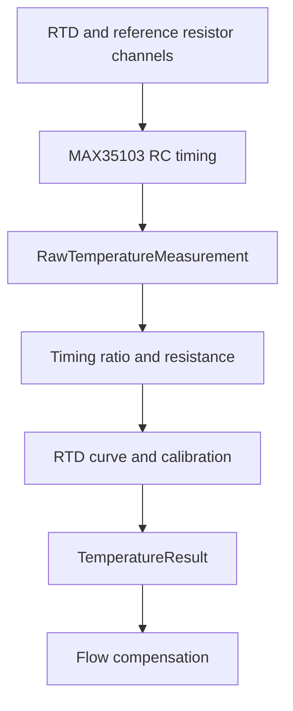
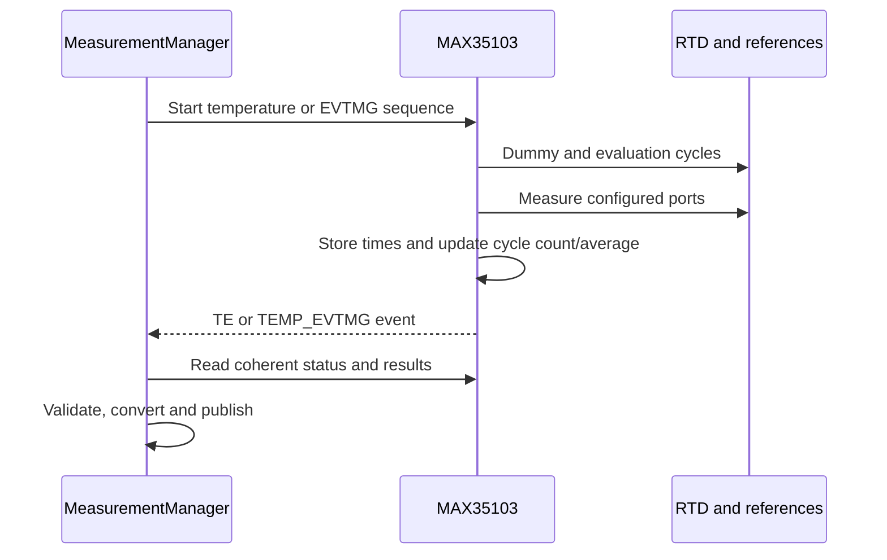
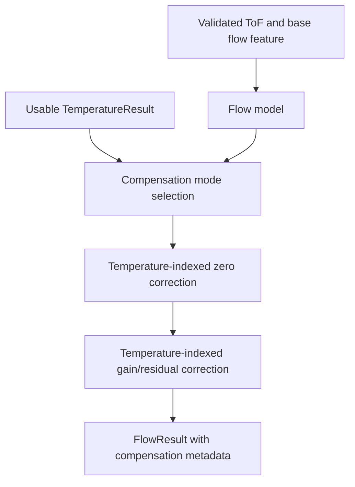

# 02 — Temperature Measurement and Compensation Principle

**Project:** Smart Water Flow and Pressure Monitor  
**Short name:** SWFPM  
**Document group:** `1.docs/01_principle`  
**Document level:** Measurement and compensation principle  
**Status:** Proposed baseline  

---

## 1. Mục tiêu

Tài liệu này định nghĩa nguyên lý đo nhiệt độ qua MAX35103 và cách sử dụng nhiệt độ để bù sai lệch cho ultrasonic flow measurement trong hệ thống **Smart Water Flow and Pressure Monitor**.

Mục tiêu gồm:

- Xác định temperature source và ranh giới trách nhiệm giữa MAX35103, MCU và flow processing.
- Mô tả chuỗi chuyển đổi từ raw RC timing sang RTD resistance và temperature.
- Định nghĩa validation, calibration, filtering, freshness và quality của `TemperatureResult`.
- Định nghĩa cách ghép một temperature result với một flow measurement.
- Phân biệt sound-speed compensation, zero-offset compensation và flow-calibration compensation.
- Định nghĩa behavior khi temperature invalid, stale hoặc unavailable.
- Làm cơ sở cho hardware selection, MAX35103 driver, firmware, simulation và validation.

Tài liệu không tạo hệ số temperature compensation production khi RTD, reference resistor, spool body và calibration dataset chưa được chốt.

---

## 2. Phạm vi

### 2.1. Thuộc phạm vi

```text
MAX35103 RTD timing principle
Temperature-port and reference-resistor semantics
Raw temperature measurement contract
Timing-ratio to resistance conversion
RTD resistance-to-temperature conversion
Temperature calibration and filtering
Temperature validity, freshness and quality
Flow/temperature time alignment
Temperature-compensation model categories
Compensation mode and fallback policy
TemperatureResult contract
FlowResult quality propagation
Characterization and validation requirements
```

### 2.2. Ngoài phạm vi

```text
Exact MAX35103 temperature register configuration
SPI transaction and STM32 HAL implementation
RTD part number, placement and mechanical mounting
Reference-resistor and capacitor BOM values
PCB leakage, guarding and layout implementation
Production temperature range and accuracy target
Final sound-speed polynomial/table coefficients
Production flow-compensation coefficients
Pressure-sensor internal temperature compensation
LCD page and telemetry encoding details
Heat-energy calculation
```

Nếu pressure sensor có internal temperature channel, channel đó thuộc pressure-sensor profile và không tự động thay thế MAX35103 RTD temperature.

---

## 3. Tài liệu liên quan và source-of-truth

| Nội dung | Source-of-truth |
|---|---|
| System measurement purpose | `../00_overview/01_system_overview.md` |
| MAX35103 SPI/INT boundary | `../00_overview/10_system_interfaces.md` |
| Canonical terms và objects | `../00_overview/glossary.md` |
| ToF, flow model và calibration boundary | `01_ultrasonic_flow_measurement_principle.md` |
| Pressure processing | `03_pressure_measurement_principle.md` |
| Leak algorithm input behavior | `05_leak_detection_algorithm_baseline.md` |
| Validation strategy | `07_algorithm_validation_plan.md` |
| MAX temperature operation/register semantics | Official MAX35103 datasheet |
| RTD curve/tolerance | Selected RTD datasheet/profile |
| Production compensation | Device/spool calibration profile |

Nếu có mâu thuẫn:

1. MAX35103 datasheet quyết định temperature command, result format và error encoding.
2. RTD/reference component documents quyết định resistance/temperature characteristics.
3. Tài liệu này quyết định processing semantics và compensation boundary.
4. Calibration profile quyết định coefficient production.

---

## 4. Design Baseline

```text
Measurement IC              : MAX35103
Temperature technology      : Platinum RTD measurement through RC timing
Supported RTD family by IC  : PT1000/PT500
Number of IC ports          : Up to four 2-wire temperature ports
Recommended project source  : Water-coupled RTD channel, exact port/model TBD
Reference method            : Ratiometric timing against precision reference resistor
Canonical logical unit      : degree Celsius (°C)
Recommended runtime encoding: signed millidegree Celsius (m°C)
Published object            : TemperatureResult
Primary role                : Flow compensation, quality diagnostics and telemetry
Leak role                   : Context only; never primary leak evidence
```

MAX35103 supports up to four 2-wire PT1000/PT500 probes and measures temperature through RC timing; the host derives actual temperature from ratiometric measurements. [MAX35103 datasheet](https://www.analog.com/media/en/technical-documentation/data-sheets/max35103.pdf)

---

## 5. Why Temperature Matters

Temperature can affect ultrasonic flow measurement through several mechanisms:

```text
Sound speed in water
Fluid viscosity and velocity profile
Spool-body and acoustic-path dimensions
Transducer delay and sensitivity
Electronics/acoustic threshold behavior
Zero-flow differential offset
Calibration gain/residual
```

### 5.1. Sound-speed effect

For a simplified small-flow transit-time model:

$$
v \approx \frac{c(T)^2\Delta t}{2L\cos\theta}
$$

Therefore, a model using this approximation needs temperature-dependent sound speed $c(T)$.

NIST measurements confirm that sound speed in distilled water varies materially with temperature across the liquid-water range. [NIST — Speed of Sound in Water by a Direct Method](https://nvlpubs.nist.gov/nistpubs/jres/59/jresv59n4p249_A1b.pdf)

### 5.2. Reciprocal-time model nuance

For the ideal straight-path reciprocal-time model:

$$
v = \frac{L}{2\cos\theta}
\left(\frac{1}{t_{down}}-\frac{1}{t_{up}}\right)
$$

the explicit sound-speed term cancels. This does not mean the real meter is temperature-independent because geometry, transducers, flow profile, zero offset and calibration still vary with temperature.

### 5.3. Compensation is model-specific

The system must not always apply a generic $c(T)$ multiplier. Compensation depends on active `flow_model_type`:

| Flow model | Temperature use |
|---|---|
| Sound-speed approximation | Explicit $c(T)$ required |
| Ideal reciprocal-time | No explicit $c(T)$ term; residual correction may remain |
| Empirical/K-factor model | Temperature-indexed zero/gain table as characterized |
| Multipoint calibrated model | Temperature may select/interpolate calibration surface |

---

## 6. Temperature Measurement Principle in MAX35103

MAX35103 measures the timing of an RC circuit connected to `T1`–`T4` and `TC`. It can execute dummy/preamble cycles to reduce capacitor dielectric-absorption effects, perform coarse evaluation cycles, then perform real temperature-port measurements. [MAX35103 datasheet](https://www.analog.com/media/en/technical-documentation/data-sheets/max35103.pdf)



### 6.1. Ratiometric property

For a common timing capacitor and threshold, the discharge/charge time is proportional to resistance under the configured measurement method:

$$
t_x \propto R_x C
$$

If a probe and reference resistor are measured using compatible paths:

$$
\frac{t_{probe}}{t_{ref}} \approx \frac{R_{RTD}}{R_{REF}}
$$

Thus:

$$
R_{RTD} = R_{REF}\frac{t_{probe}}{t_{ref}}
$$

MAX35103 documentation gives the example mapping `T1/T3 = RRTD1/RREF` and `T2/T4 = RRTD2/RREF` when T3/T4 connect to the corresponding reference resistor. Actual channel mapping must be defined by hardware profile. [MAX35103 datasheet](https://www.analog.com/media/en/technical-documentation/data-sheets/max35103.pdf)

### 6.2. Benefits and limits of ratio measurement

Ratiometric conversion reduces dependence on absolute capacitor value and nominal timing-clock scale when both channels share the same conditions. It does not automatically remove:

- Reference-resistor tolerance/drift.
- RTD tolerance and lead resistance.
- Switch/path resistance mismatch.
- PCB leakage.
- Thermal gradients and probe mounting error.
- Timing quantization and channel mismatch.
- Self-heating or rapid temperature changes.

---

## 7. Channel and Probe Semantics

### 7.1. Logical roles

Each configured temperature port must have one explicit role:

```text
WATER_TEMPERATURE
BODY_TEMPERATURE
AMBIENT_TEMPERATURE
REFERENCE_RESISTOR
UNUSED
```

Baseline requires exactly one selected `WATER_TEMPERATURE` source for flow compensation unless a future multi-probe fusion requirement is approved.

### 7.2. Example mapping

```text
T1 -> water RTD
T3 -> reference resistor for T1
T2 -> optional body/second RTD
T4 -> reference resistor for T2
```

This is an example, not a production wiring decision.

### 7.3. Probe identity

Temperature profile must define:

```text
port_role
rtd_type and nominal_R0
rtd_curve/profile ID
reference_port
reference_resistance
lead-wire model
calibration profile ID
valid temperature range
installation location
```

### 7.4. Water temperature versus board temperature

Flow compensation must use a probe thermally coupled to the water/path being measured. MCU internal temperature or board temperature cannot substitute without an experimentally validated thermal model.

---

## 8. MAX35103 Acquisition Sequence Boundary



MAX35103 can perform standalone temperature measurements, temperature-only event timing, or combined ToF/temperature event timing. Event timing maintains valid-cycle counts and does not add errored measurements to average results. [MAX35103 datasheet](https://www.analog.com/media/en/technical-documentation/data-sheets/max35103.pdf)

Principle rules:

- Completion event does not alone prove every required channel valid.
- Status, cycle count and all selected port results form one coherent measurement set.
- ISR only captures/posts event.
- Temperature result timestamp represents actual acquisition window, not read completion only.
- Combined ToF/temperature sequence does not guarantee identical sample instants; alignment metadata remains required.

---

## 9. `RawTemperatureMeasurement` Contract

| Field | Type | Meaning | Required |
|---|---|---|---:|
| `port_times_raw[]` | Fixed-point raw array | Timing result for configured ports | Yes |
| `port_average_times_raw[]` | Fixed-point raw array | Event-timing average if used | Optional/mode-dependent |
| `temperature_cycle_count` | Count | Valid error-free cycles accumulated | Event-timing mode |
| `interrupt_status` | Bit field | TE/TEMP_EVTMG/timeout and related status | Yes |
| `port_enable_mask` | Bit mask | Ports expected in this set | Yes |
| `temperature_profile_id` | Identifier | Channel/RTD/reference mapping | Yes |
| `measurement_config_version` | Identifier | MAX acquisition config | Yes |
| `sample_sequence` | Counter | Temperature stream sequence | Yes |
| `acquisition_start_monotonic` | Monotonic time | Start of sequence | Recommended |
| `sample_monotonic_time` | Monotonic time | Representative sample time | Yes |
| `wall_clock_timestamp` | UTC | Timestamp when TimeService valid | Optional |
| `timestamp_valid` | Boolean | Wall-clock validity | Yes |

Raw timing is not temperature and must never be published as `TemperatureResult`.

---

## 10. Raw Timing Decode

MAX35103 temperature result registers contain integer and fractional portions measured in high-speed clock periods. Driver must preserve the exact fixed-point value before ratio calculation. [MAX35103 datasheet](https://www.analog.com/media/en/technical-documentation/data-sheets/max35103.pdf)

Generic decode:

$$
N_t = I\cdot2^{16}+F
$$

For ratiometric conversion using equal scale:

$$
\frac{t_{probe}}{t_{ref}}=
\frac{N_{probe}}{N_{ref}}
$$

Clock period cancels from the ratio if both values share the same valid timing basis.

Numeric rules:

- Keep combined numerator/denominator as widened integers.
- Validate denominator before division.
- Avoid premature rounding of each time.
- Use deterministic fixed-point or validated floating-point ratio.
- Record scale/profile version.
- Include golden vectors at minimum, maximum and near-unity ratio.

---

## 11. Error Encoding and Validation

MAX35103 can indicate short-circuit temperature probes with zero result and open-circuit/other temperature errors with all-ones result/status behavior; event-timing cycle count only increments for error-free temperature cycles. Driver must interpret these encodings before numeric conversion. [MAX35103 datasheet](https://www.analog.com/media/en/technical-documentation/data-sheets/max35103.pdf)

### 11.1. Validation layers

| Layer | Check | Failure behavior |
|---|---|---|
| SPI/coherency | Complete coherent result set | Reject |
| Completion | Correct TE/TEMP_EVTMG event | Reject/not ready |
| IC error encoding | No short/open/general error code | Reject and classify |
| Cycle count | Minimum error-free cycles met | Reject/degrade |
| Port mapping | Required probe/reference ports present | Reject |
| Raw range | Timing code within configured range | Reject |
| Denominator | Reference timing nonzero/valid | Reject |
| Ratio | Ratio within profile plausibility range | Reject |
| Resistance | Resistance in RTD/profile range | Reject |
| Temperature | Converted temperature in physical/application range | Reject or diagnostic |
| Temporal | Sequence/time/freshness valid | Reject duplicate/out-of-order/stale |
| Profile | RTD/reference/calibration versions compatible | Reject |

### 11.2. Short/open classification

```text
short indication -> TEMPERATURE_PROBE_SHORT
open indication  -> TEMPERATURE_PROBE_OPEN
all-port error   -> TEMPERATURE_MEASUREMENT_ERROR
```

Zero raw timing is never interpreted as `0 °C`.

### 11.3. Reference-channel validation

- Reference channel must be valid in the same coherent set/average context.
- Reference resistance/profile must match physical BOM.
- Reference ratio drift outside characterized limit generates diagnostic.
- Probe value cannot be recovered if reference timing is invalid.

### 11.4. Duplicate and out-of-order

- Duplicate sequence does not update filter or compensation state twice.
- Out-of-order result is rejected from live pipeline.
- Old valid result can remain in repository but becomes stale by monotonic age.

---

## 12. Timing Ratio to RTD Resistance

For each probe/reference pair:

$$
r_t=\frac{N_{probe}}{N_{ref}}
$$

Ideal resistance:

$$
R_{meas}=r_tR_{REF}
$$

With a characterized path correction:

$$
R_{RTD}=G_R\cdot R_{meas}+O_R
$$

where:

- $R_{REF}$ is calibrated/reference resistance.
- $G_R$ captures gain/path mismatch.
- $O_R$ captures residual path/lead offset when justified.

### 12.1. Two-wire lead resistance

For a 2-wire RTD:

$$
R_{meas}=R_{RTD}+R_{lead1}+R_{lead2}+R_{path}
$$

Lead resistance can appear as positive temperature bias. Compensation requires either:

- Controlled, repeatable wiring and factory calibration.
- Characterized lead/path offset.
- A different sensing topology in future hardware.

Do not assume two-wire lead resistance is zero.

### 12.2. Reference resistor

Reference resistance used in computation should come from:

```text
calibrated measured value preferred
or tolerance-bounded nominal value with quality/uncertainty policy
```

Its temperature coefficient and board thermal environment contribute to uncertainty.

---

## 13. RTD Resistance-to-Temperature Conversion

### 13.1. RTD curve model

For a platinum RTD profile, a Callendar–Van Dusen style model may be represented as:

For $T\ge0\,°C$:

$$
R(T)=R_0(1+AT+BT^2)
$$

For $T<0\,°C$:

$$
R(T)=R_0\left[1+AT+BT^2+C(T-100)T^3\right]
$$

Coefficients $A$, $B$, $C$ and $R_0$ must come from the selected RTD standard/profile or individual calibration, not from an unversioned constant in application code.

### 13.2. Conversion approaches

| Approach | Advantages | Risks/requirements |
|---|---|---|
| Lookup table + interpolation | Deterministic, simple fixed point | Table accuracy and memory |
| Analytic inversion for nonnegative range | Compact | Numeric stability/rounding |
| Iterative solution | General | Runtime and convergence proof |
| Device-specific calibration table | Corrects full path | Needs calibration data/versioning |

MAX35103 datasheet explicitly describes host conversion from timing ratio to resistance and temperature lookup/interpolation. [MAX35103 datasheet](https://www.analog.com/media/en/technical-documentation/data-sheets/max35103.pdf)

### 13.3. Baseline recommendation

Use a versioned resistance-to-temperature lookup table with monotonic linear interpolation unless fixed-point analytic inversion is proven simpler and equally accurate for the required range.

For adjacent table points $(R_i,T_i)$ and $(R_{i+1},T_{i+1})$:

$$
T=T_i+
\frac{R-R_i}{R_{i+1}-R_i}(T_{i+1}-T_i)
$$

Requirements:

- Resistance knots strictly increasing.
- Temperature knots consistent and within profile range.
- No silent extrapolation.
- Boundary and rounding tests.

---

## 14. Canonical Unit and Numeric Representation

### 14.1. Logical unit

Temperature measurement and compensation use degree Celsius (`°C`) because RTD curves and water-meter operating requirements are commonly expressed relative to Celsius.

Temperature differences in `°C` and kelvin have equal numeric magnitude, but absolute Celsius and kelvin values must not be mixed.

### 14.2. Runtime encoding

Baseline recommendation:

```text
temperature_mdeg_c : signed integer millidegree Celsius
```

Examples:

```text
0 °C      -> 0 m°C
25 °C     -> 25000 m°C
-5.25 °C  -> -5250 m°C
```

Do not use an integer sentinel such as minimum value to mean invalid; validity is a separate field.

### 14.3. Intermediate arithmetic

- Use widened integer/fixed point for resistance ratio.
- State rounding mode for °C-to-m°C.
- Bound all table/index operations.
- Verify negative-temperature conversion if supported.
- Avoid unitless coefficients; include input/output unit metadata.

---

## 15. Temperature Calibration

### 15.1. Calibration layers

```text
Component/profile conversion
  -> reference-resistor correction
  -> channel/lead resistance correction
  -> temperature calibration correction
```

### 15.2. Linear temperature correction

After RTD conversion:

$$
T_{cal}=G_TT_{rtd}+O_T
$$

Identity:

$$
G_T=1,\qquad O_T=0
$$

### 15.3. Multipoint correction

If residual is nonlinear, use piecewise-linear error/correction profile over temperature. Profile must be monotonic enough not to produce nonphysical temperature reversal.

### 15.4. Calibration metadata

```text
profile_version
probe/port/reference identity binding
RTD curve version and R0
measured reference resistance
lead/path correction
temperature correction coefficients/knots
calibration range
reference thermometer identity
calibration timestamp
firmware/model compatibility
integrity/CRC
```

### 15.5. Invalid profile behavior

- Never use corrupt/incompatible coefficients.
- Identity fallback only if sensor/profile tolerance still meets degraded requirement.
- Set explicit `TEMPERATURE_CALIBRATION_DEFAULT` or invalid flag.
- Propagate impact to flow compensation mode.

---

## 16. Filtering and Thermal Dynamics

### 16.1. Measurement noise versus thermal lag

Digital filtering reduces electrical/timing noise. It cannot remove physical thermal lag between water and RTD element.

Observed temperature can be modeled approximately:

$$
\tau_{th}\frac{dT_{probe}}{dt}+T_{probe}=T_{water}
$$

where $\tau_{th}$ depends on probe, mounting, flow and thermal contact.

### 16.2. IIR filter candidate

$$
T_f[n]=T_f[n-1]+\alpha_n(T_{cal}[n]-T_f[n-1])
$$

$$
\alpha_n=1-e^{-\Delta t_n/\tau_T}
$$

Rules:

```text
first valid sample -> initialize
invalid/duplicate  -> do not update
long gap           -> reinitialize or explicit recovery
profile change     -> reset incompatible history
```

### 16.3. Rate plausibility

Optional check:

$$
\left|\frac{T_n-T_{n-1}}{\Delta t}\right|
\le r_{T,max}
$$

`r_T,max` must come from test-rig thermal-step characterization. A rapid real water-temperature change must not be rejected solely because a guessed threshold is low.

### 16.4. Filter ownership

- `TemperatureResult.temperature_mdeg_c` is calibrated/filtered application temperature.
- Optional `unfiltered_temperature_mdeg_c` supports diagnostics.
- Compensation model must specify which signal it consumes.
- LCD smoothing must not alter compensation source silently.

---

## 17. Freshness and Time Alignment

### 17.1. Temperature age

$$
age_T=t_{flow,mono}-t_{temperature,mono}
$$

For real-time compensation, use the newest valid temperature at or before the flow sample unless a synchronized combined sequence provides a better defined pairing.

### 17.2. Pairing rule

Baseline causal pairing:

```text
temperature.valid == true
AND temperature.sample_time <= flow.sample_time + allowed_sync_tolerance
AND abs(flow.sample_time - temperature.sample_time) <= maximum_temperature_age_for_flow
AND no blocking temperature quality flag
```

Do not use a future temperature sample to retroactively change already published runtime flow unless an offline reprocessing workflow explicitly supports it.

### 17.3. Combined EVTMG sequence

Combined ToF and temperature event timing improves scheduling association but measurements still occur sequentially. The result set should retain separate sample times or a bounded acquisition-window timestamp.

### 17.4. Interpolation

Offline analysis may interpolate between bracketing valid temperature samples. Runtime interpolation that waits for a future sample adds latency and is not baseline.

### 17.5. Freshness categories

```text
VALID_FRESH
VALID_HELD
VALID_STALE
INVALID
UNAVAILABLE
```

`VALID_HELD` means a previous valid sample is reused under explicit bounded fallback, not that a new temperature measurement occurred.

---

## 18. `TemperatureResult` Contract

| Field | Type | Meaning | Required |
|---|---|---|---:|
| `temperature_mdeg_c` | Signed integer | Calibrated/filtered temperature | Yes |
| `valid` | Boolean | Measurement/conversion validity | Yes |
| `quality_flags` | Bit field | Blocking/advisory quality | Yes |
| `source_role` | Enum | WATER/BODY/AMBIENT | Yes |
| `source_port` | Identifier | MAX temperature port | Recommended |
| `sample_monotonic_time` | Monotonic time | Measurement time | Yes |
| `publish_monotonic_time` | Monotonic time | Result completion time | Recommended |
| `wall_clock_timestamp` | UTC | Timestamp when valid | Optional |
| `timestamp_valid` | Boolean | Wall-clock validity | Yes |
| `sample_sequence` | Counter | Temperature stream sequence | Yes |
| `temperature_profile_id` | Identifier | RTD/reference mapping | Yes |
| `calibration_version` | Identifier | Applied calibration | Recommended |
| `unfiltered_temperature_mdeg_c` | Signed integer | Pre-filter diagnostics | Optional |
| `resistance_milliohm` | Integer | Converted RTD resistance | Optional diagnostics |

Rules:

- Invalid temperature does not become `0 °C`.
- `source_role` must be water-coupled to qualify for flow compensation.
- Freshness is evaluated at consumer time.
- Result is published atomically through `DataRepository`.

---

## 19. Quality Model

### 19.1. Proposed quality flags

| Flag | Class | Meaning |
|---|---|---|
| `TEMPERATURE_SPI_ERROR` | Blocking | SPI/coherency error |
| `TEMPERATURE_NOT_READY` | Blocking for sample | Wrong/incomplete event |
| `TEMPERATURE_MAX_TIMEOUT` | Blocking | MAX timeout/general error |
| `TEMPERATURE_PROBE_SHORT` | Blocking | Short-circuit indication |
| `TEMPERATURE_PROBE_OPEN` | Blocking | Open-circuit indication |
| `TEMPERATURE_CYCLE_COUNT_INSUFFICIENT` | Blocking/degraded | Too few valid cycles |
| `TEMPERATURE_REFERENCE_INVALID` | Blocking | Reference timing/profile invalid |
| `TEMPERATURE_RATIO_OUT_OF_RANGE` | Blocking | Timing/resistance ratio implausible |
| `TEMPERATURE_OUT_OF_PHYSICAL_RANGE` | Blocking | Outside probe physical range |
| `TEMPERATURE_OUT_OF_EXPECTED_RANGE` | Advisory/degraded | Outside application expected range |
| `TEMPERATURE_RATE_IMPLAUSIBLE` | Advisory/degraded | Characterized rate limit exceeded |
| `TEMPERATURE_CALIBRATION_DEFAULT` | Advisory/degraded | Identity/default profile |
| `TEMPERATURE_CALIBRATION_INVALID` | Blocking | Incompatible/corrupt profile |
| `TEMPERATURE_STALE` | Blocking for fresh compensation | Age exceeded |
| `TEMPERATURE_HELD` | Advisory/degraded | Bounded last-valid fallback used |
| `TEMPERATURE_DUPLICATE` | Rejected/advisory | Duplicate sequence |
| `TEMPERATURE_OUT_OF_ORDER` | Rejected/advisory | Old sample |
| `TEMPERATURE_FILTER_REINITIALIZED` | Advisory | Filter reset |
| `TEMPERATURE_SOURCE_MISMATCH` | Blocking for compensation | Non-water source selected |

### 19.2. Validity and usability

```text
measurement_valid = no blocking acquisition/conversion/calibration condition
compensation_usable = measurement_valid
                      AND fresh/allowed-held
                      AND source_role == WATER_TEMPERATURE
```

---

## 20. Compensation Architecture



Compensation stages must be explicit and versioned. Avoid applying the same physical effect twice in sound-speed model and empirical calibration.

---

## 21. Compensation Model Categories

### 21.1. Model A — Explicit sound speed

If active flow equation uses $c(T)$:

$$
c=c(T,pressure,composition)
$$

and:

$$
Q_{base}=f(\Delta t,c(T),geometry)
$$

For MVP water application, a temperature-only lookup may be sufficient only after pressure/composition sensitivity is shown negligible for required accuracy.

Do not copy a pure-distilled-water polynomial blindly for treated water and a different pressure range without uncertainty assessment.

### 21.2. Model B — Temperature-indexed zero offset

For differential/reciprocal feature $R_t$:

$$
R_{t,c}=R_t-Z(T)
$$

where $Z(T)$ is zero-flow offset characterized over temperature.

### 21.3. Model C — Temperature-indexed gain

$$
Q_{comp}=G(Q_{base},T)Q_{base}
$$

$G$ can be a 1D function of temperature for a limited flow band or a 2D surface over flow and temperature.

### 21.4. Model D — Additive residual correction

$$
Q_{comp}=Q_{base}+E(Q_{base},T)
$$

This can model signed residual but requires careful monotonicity and zero behavior.

### 21.5. Baseline recommendation

For the reciprocal-time flow model:

```text
1. Apply temperature-indexed zero-offset correction if evidence requires.
2. Apply versioned flow/temperature calibration gain surface.
3. Do not apply explicit c(T) unless the selected flow model requires it.
```

Exact production choice remains `TBD` pending spool/RTD characterization.

---

## 22. Compensation Table and Interpolation

### 22.1. One-dimensional interpolation

For temperature knots $T_i$, $T_{i+1}$:

$$
C(T)=C_i+
\frac{T-T_i}{T_{i+1}-T_i}(C_{i+1}-C_i)
$$

### 22.2. Two-dimensional surface

For flow and temperature dependent correction, bilinear interpolation may be used over a rectangular cell:

$$
C(Q,T)=
(1-u)(1-v)C_{00}+u(1-v)C_{10}+(1-u)vC_{01}+uvC_{11}
$$

where $u$ and $v$ are normalized positions inside the flow-temperature cell.

### 22.3. Table rules

- Temperature knots strictly increasing.
- Flow knots ordered separately for forward/reverse if needed.
- All coefficients have explicit unit/scale.
- No holes in supported operating domain.
- Extrapolation policy explicit.
- Table integrity/version checked before apply.
- Interpolation arithmetic overflow/rounding tested.
- Monotonic/continuity constraints validated where required.

### 22.4. Extrapolation

Outside calibrated temperature range:

```text
invalidate compensation
or clamp boundary with degraded flag
or use separately validated extrapolation
```

Silent extrapolation is prohibited.

---

## 23. Compensation Modes

Proposed enum:

```text
FULL_COMPENSATION
HELD_TEMPERATURE_COMPENSATION
UNCOMPENSATED_DEGRADED
COMPENSATION_UNAVAILABLE
```

| Mode | Temperature state | Flow behavior |
|---|---|---|
| `FULL_COMPENSATION` | Fresh valid water temperature | Apply normal profile |
| `HELD_TEMPERATURE_COMPENSATION` | Last valid within bounded hold age | Apply using held value; degraded flag |
| `UNCOMPENSATED_DEGRADED` | No usable temperature but base flow allowed by product policy | Publish base flow with degraded quality |
| `COMPENSATION_UNAVAILABLE` | Compensation required for validity | Flow invalid/unavailable |

The selected product policy must state whether uncorrected flow is allowed for monitoring/leak detection and whether it is prohibited for billing/metrology use.

---

## 24. Invalid and Stale Temperature Policy

### 24.1. Decision sequence

```text
If fresh valid water temperature exists:
  use FULL_COMPENSATION
Else if last valid value age <= maximum_temperature_hold_age:
  use HELD_TEMPERATURE_COMPENSATION
Else if base-flow degraded operation is explicitly allowed:
  use UNCOMPENSATED_DEGRADED
Else:
  use COMPENSATION_UNAVAILABLE and invalidate flow
```

### 24.2. Safety rules

- Never substitute a default temperature and label it fresh/valid.
- Never extend held temperature indefinitely.
- Do not clear leak state using invalid flow caused by temperature failure.
- Degraded flow may continue leak evaluation only if algorithm policy explicitly accepts its quality.
- Do not update temperature-indexed adaptive state while source invalid.

### 24.3. Recovery

When valid temperature returns:

- Validate source/profile continuity.
- Reinitialize filter if long gap.
- Switch compensation mode at a defined sample boundary.
- Avoid unbounded flow discontinuity; flag transition for diagnostics.
- Do not retroactively alter volume/history unless offline reprocessing exists.

---

## 25. Impact on `FlowResult`

`FlowResult` should expose:

```text
compensation_mode
temperature_sample_sequence/reference
temperature_age_at_flow_sample
temperature_profile/calibration version
flow compensation profile version
quality flags
```

Candidate flow quality propagation:

| Temperature condition | Flow quality |
|---|---|
| Fresh and valid | Normal unless other flow issue |
| Held within bound | `FLOW_TEMPERATURE_HELD`, degraded |
| Stale/unavailable but uncorrected allowed | `FLOW_TEMPERATURE_INVALID`, degraded |
| Required compensation unavailable | Flow invalid |
| Profile mismatch | Flow invalid |
| Outside calibrated range with boundary clamp allowed | Degraded/out-of-range flag |

`TemperatureResult.valid` and `FlowResult.valid` remain separate decisions.

---

## 26. Leak-Detection Boundary

Temperature is not primary leak evidence.

```text
TemperatureResult
  -> affects FlowResult compensation and quality
  -> can be included as telemetry context
  -> cannot independently set leak SUSPECTED/CONFIRMED
```

Rules:

- Temperature anomaly alone does not create leak reason.
- Temperature invalid may degrade flow evidence depending flow quality policy.
- Leak algorithm consumes only final `FlowResult`, not raw RTD timing.
- Wall-clock time-of-day is unrelated to temperature compensation timing.

---

## 27. Configuration Parameters

### 27.1. Acquisition

| Parameter | Unit | Meaning | Status |
|---|---|---|---|
| `temperature_measurement_interval_ms` | ms | Temperature sampling period | TBD |
| `temperature_measurement_mode` | Enum | Direct/EVTMG1/EVTMG3 | TBD |
| `temperature_cycles_per_result` | Count | Valid cycles averaged | TBD |
| `temperature_required_ports` | Mask | Probe/reference ports | Hardware-profile dependent |
| `temperature_profile_id` | ID | Port/RTD/reference mapping | TBD |

MAX dummy cycles, port-cycle timing and order are sensor/driver-profile parameters and must be tuned from datasheet/hardware validation.

### 27.2. Validation/filter

| Parameter | Unit | Meaning | Status |
|---|---|---|---|
| `temperature_physical_min_mdeg_c` | m°C | Hard conversion bound | RTD/profile dependent |
| `temperature_physical_max_mdeg_c` | m°C | Hard conversion bound | RTD/profile dependent |
| `temperature_expected_min_mdeg_c` | m°C | Application range | TBD |
| `temperature_expected_max_mdeg_c` | m°C | Application range | TBD |
| `temperature_filter_time_constant_ms` | ms | IIR time constant | TBD |
| `temperature_filter_reset_gap_ms` | ms | Gap reset threshold | TBD |
| `maximum_temperature_rate_mdeg_c_s` | m°C/s | Optional plausibility rate | Disabled until characterized |

### 27.3. Pairing/fallback

| Parameter | Unit | Meaning | Status |
|---|---|---|---|
| `maximum_temperature_age_for_flow_ms` | ms | Fresh pairing age | TBD |
| `maximum_temperature_hold_age_ms` | ms | Bounded last-valid reuse | TBD |
| `temperature_flow_sync_tolerance_ms` | ms | Allowed sequence timing tolerance | TBD |
| `allow_uncompensated_degraded_flow` | Boolean | Base-flow fallback | Product decision TBD |

### 27.4. Dependencies

```text
temperature measurement interval > conversion/sequence duration
maximum fresh age >= expected interval + jitter
maximum hold age >= maximum fresh age
filter reset gap >= expected interval
physical_min < expected_min < expected_max < physical_max where applicable
probe and reference ports are distinct and enabled
RTD profile matches nominal R0 and reference resistor
compensation table covers required flow-temperature domain
```

Candidate config violating dependencies is rejected atomically.

---

## 28. Configuration Change Behavior

When acquisition/RTD/reference profile changes:

1. Validate complete candidate.
2. Finish or halt in-flight sequence at safe boundary.
3. Apply immutable version.
4. Reinitialize MAX35103 if required.
5. Reset temperature filter/history.
6. Invalidate previous pairing context.
7. Reset temperature-dependent unconfirmed flow/leak evidence if required.
8. Publish profile transition diagnostic.

When only compensation table changes:

- Do not reinterpret already accumulated volume.
- New `FlowResult` carries new compensation version.
- Reset flow filter if output discontinuity/history incompatibility exists.
- Keep temperature measurement history only if its measurement semantics are unchanged.

---

## 29. Startup, Recovery and Fault Behavior

### 29.1. Startup

```text
Load validated port/RTD/reference/calibration profiles
  -> initialize MAX35103 temperature configuration
  -> trigger/await temperature sequence
  -> read coherent timing/status/cycle count
  -> validate probe and reference channels
  -> convert ratio to resistance and temperature
  -> initialize filter
  -> publish first TemperatureResult
  -> enable full flow compensation
```

Before first valid temperature, use fallback policy; do not report `0 °C`.

### 29.2. Probe open/short

- Reject affected channel.
- Preserve explicit fault classification.
- Do not update temperature filter.
- Apply bounded held/uncompensated/invalid flow policy.
- Retry according to schedule; avoid rapid retry causing unnecessary power/self-heating.

### 29.3. MAX reset

- Invalidate in-flight sequence.
- Reapply profile.
- Reset temperature cycle/filter context.
- Last result becomes held/stale according to monotonic age; it is not automatically fresh after reset.

### 29.4. RTC invalid

- Temperature measurement, age and compensation continue using monotonic time.
- Wall-clock timestamp marked invalid.
- No impact on compensation duration/alignment.

---

## 30. Power, Self-Heating and Scheduling

- Temperature measurement can run slower than ToF if thermal dynamics permit.
- Measurement interval must come from freshness/error/power trade-off, not telemetry interval.
- Dummy/evaluation cycles and averaging affect power and latency.
- Excessive measurement activity may increase RTD self-heating; characterize actual probe/path.
- MAX event timing can reduce MCU wakeups but requires cycle-count/status validation.
- Temperature and ToF work share MAX/SPI resources and must have coherent scheduling.
- LCD/4G/BLE work must not prevent required temperature refresh.
- Low-power entry must account for active MAX sequence and pending result read.

Datasheet describes dummy cycles specifically to mitigate capacitor dielectric absorption without unnecessarily self-heating RTDs, reinforcing that acquisition configuration is part of measurement quality. [MAX35103 datasheet](https://www.analog.com/media/en/technical-documentation/data-sheets/max35103.pdf)

---

## 31. Characterization Plan

### 31.1. Temperature measurement characterization

At controlled reference temperatures collect:

```text
Raw probe/reference timing
Timing ratio and calculated resistance
Converted/calibrated temperature
Reference thermometer temperature
MAX status and cycle count
Board/water temperature context
Measurement interval and averaging config
Device/probe/reference identity
```

Evaluate:

- Offset/gain/nonlinearity.
- Repeatability/noise.
- Channel/reference mismatch.
- Lead-resistance effect.
- Self-heating versus sample interval.
- Filter response.
- Open/short detection and recovery.

### 31.2. Thermal response characterization

Controlled water-temperature step tests should determine:

```text
probe time constant versus flow rate
mounting lag
filter-added latency
temperature/flow sample misalignment error
maximum valid held-age under realistic dynamics
```

### 31.3. Flow compensation characterization

Collect a grid across:

```text
multiple stable temperatures
multiple forward flow rates including low flow
zero-flow points at each temperature
reverse flow if required
pressure context when relevant
```

Separate data into calibration/tuning and held-out validation. Do not evaluate final error only on points used to fit the table.

### 31.4. Reference instruments

- Temperature reference uncertainty must support target device accuracy.
- Flow reference must satisfy flow calibration requirement.
- Both streams need synchronized monotonic/ground-truth timestamps.
- Record calibration validity and setup conditions.

---

## 32. Validation Metrics

Temperature error:

$$
e_T=T_{device}-T_{reference}
$$

Flow residual by temperature:

$$
e_Q(Q,T)=Q_{device}(Q,T)-Q_{reference}(Q,T)
$$

Candidate metrics:

```text
Temperature MAE/RMSE/max absolute error
Temperature repeatability
Thermal step response time
Reference-ratio drift
Open/short detection latency
Invalid temperature rate
Compensated flow error by temperature and flow band
Zero-flow bias versus temperature
Held-temperature fallback error versus age
Flow discontinuity at compensation-mode transitions
False leak-evidence contribution under thermal transients
```

Acceptance limits remain TBD until product accuracy and hardware are selected.

---

## 33. Validation Requirements

| ID | Requirement | Evidence |
|---|---|---|
| `PR-TC-001` | Raw timing fixed-point decode correct | Datasheet golden vectors |
| `PR-TC-002` | Probe/reference ratio preserves precision | Numeric unit/property tests |
| `PR-TC-003` | Zero/all-ones error encodings never become temperature | Fault vectors |
| `PR-TC-004` | Open and short probes classified correctly | Driver/hardware fault test |
| `PR-TC-005` | Invalid reference invalidates paired probe | Unit/integration test |
| `PR-TC-006` | Cycle count insufficient result rejected/degraded | Event-timing test |
| `PR-TC-007` | RTD table interpolation correct at knots/boundaries | Golden-vector test |
| `PR-TC-008` | Negative temperature conversion correct if supported | Boundary vectors |
| `PR-TC-009` | Calibration identity does not alter result beyond rounding | Property test |
| `PR-TC-010` | Profile mismatch/corruption cannot be used | Config fault test |
| `PR-TC-011` | Duplicate/invalid sample does not update filter | Sequence test |
| `PR-TC-012` | Filter resets after long gap/profile change | Virtual-time test |
| `PR-TC-013` | Flow pairs only with permitted-age water temperature | Alignment tests |
| `PR-TC-014` | Wall-clock jump does not affect age/alignment | RTC adjustment test |
| `PR-TC-015` | Held mode expires at bounded monotonic age | Fallback test |
| `PR-TC-016` | Default temperature is never reported as fresh | Invariant/property test |
| `PR-TC-017` | Compensation mode/quality propagates to FlowResult | Integration test |
| `PR-TC-018` | Compensation table interpolation/extrapolation deterministic | Golden/boundary test |
| `PR-TC-019` | Compensation is not applied twice | Model traceability review/test |
| `PR-TC-020` | Temperature alone cannot create leak state | Leak invariant test |
| `PR-TC-021` | Self-heating/thermal lag characterized | Hardware report |
| `PR-TC-022` | Compensated flow accuracy meets requirement over domain | Held-out hardware validation |

---

## 34. Hardware Selection Requirements

RTD/reference design must define:

```text
RTD type, nominal R0, class/tolerance and curve
water/media compatibility and isolation
thermal response time and mounting
two-wire lead length/resistance control
operating temperature range
reference resistor value, tolerance and tempco
timing capacitor value/type/tolerance/dielectric behavior
MAX port mapping
PCB leakage/layout constraints
factory calibration strategy
```

Do not choose PT500/PT1000 only because MAX35103 supports it; complete error, power, lead resistance and mechanical analysis is required.

---

## 35. Open Questions

| ID | Question | Impact |
|---|---|---|
| `OQ-TC-001` | RTD model/type/class and nominal resistance? | Curve, accuracy and hardware |
| `OQ-TC-002` | Which MAX port is water temperature? | Channel contract |
| `OQ-TC-003` | Reference resistor value/tolerance/calibration? | Resistance accuracy |
| `OQ-TC-004` | Probe mounting and thermal time constant? | Alignment and fallback |
| `OQ-TC-005` | Required temperature range/accuracy? | RTD/profile and validation |
| `OQ-TC-006` | Temperature sample interval and averaging count? | Freshness, power, self-heating |
| `OQ-TC-007` | Direct command, EVTMG1 or EVTMG3? | Scheduling and pairing |
| `OQ-TC-008` | RTD LUT or analytic conversion implementation? | Firmware and tests |
| `OQ-TC-009` | Two-wire lead correction factory-specific? | Calibration/storage |
| `OQ-TC-010` | Flow model uses explicit sound speed or reciprocal-time residual correction? | Compensation architecture |
| `OQ-TC-011` | Required compensation surface dimensions/knots? | Calibration memory/data |
| `OQ-TC-012` | Maximum fresh and held temperature ages? | Flow quality/leak behavior |
| `OQ-TC-013` | Is uncompensated degraded flow allowed? | Availability and metrology |
| `OQ-TC-014` | Leak detection uses degraded/held-temperature FlowResult? | Algorithm quality gate |
| `OQ-TC-015` | Body/ambient temperature channels needed? | Hardware and telemetry |
| `OQ-TC-016` | Does product require certified/billing accuracy? | Process and fallback constraints |

---

## 36. Implementation Handoff

### 36.1. Hardware documents must add

- RTD/reference/capacitor BOM and topology.
- Port mapping and physical placement.
- Thermal/mechanical coupling.
- Lead resistance/layout/error budget.
- Operating limits.

### 36.2. Driver documents must add

- MAX temperature register/configuration details.
- Direct/event-timing state machine.
- Coherent result/status read.
- Error encoding and cycle-count mapping.
- Fixed-point timing decode.

### 36.3. Firmware design must add

- Concrete raw/result structs.
- Ratio/resistance/RTD conversion numeric types.
- Filter and freshness implementation.
- Flow-pairing and compensation mode state.
- Profile persistence/version migration.
- Quality/error enum mapping.

### 36.4. Simulation/test must add

- Timing-ratio/resistance golden vectors.
- RTD curve/interpolation vectors.
- Noise, drift, open/short and data-gap datasets.
- Thermal-lag model/scenarios.
- Flow-temperature calibration surface tests.
- Fallback and leak-quality integration cases.

---

## 37. Completion Criteria

The temperature/compensation principle is ready for downstream implementation when:

1. RTD, reference resistor, channel mapping and installation are selected.
2. Canonical `m°C` runtime representation is accepted or replaced by an ADR.
3. Raw timing/error/cycle-count decode has golden vectors.
4. RTD curve/profile and conversion method are versioned.
5. Temperature calibration and reference-resistor policy are defined.
6. Sample interval, filter and thermal lag are characterized.
7. Flow/temperature pairing and maximum age are fixed.
8. Active flow model identifies required compensation stages.
9. Compensation table/surface and extrapolation policy are defined.
10. Held/uncompensated/invalid fallback policy is approved.
11. Quality propagation to `FlowResult` and leak evaluation is tested.
12. Held-out hardware validation meets product requirements.

---

## 38. References

1. [Analog Devices — MAX35103 datasheet](https://www.analog.com/media/en/technical-documentation/data-sheets/max35103.pdf): RTD support, RC timing operation, ratiometric conversion, event timing, cycle count and error semantics.
2. [Analog Devices — MAX35103 product page](https://www.analog.com/en/products/max35103.html): product-level temperature measurement capabilities.
3. [Analog Devices — Configuring the MAX35101 as an Ultrasonic Water Meter](https://www.analog.com/en/resources/app-notes/configuring-the-max35101-timetodigital-converter-as-an-ultrasonic-water-meter.html): relationship between water temperature, sound speed and transit-time flow; MAX35103-specific behavior still follows its datasheet.
4. [NIST — Speed of Sound in Water by a Direct Method](https://nvlpubs.nist.gov/nistpubs/jres/59/jresv59n4p249_A1b.pdf): measured temperature dependence of sound speed in distilled water.

No application example coefficient is a production value without validation on the project hardware and water/pressure domain.

---

## 39. Kết luận

Temperature pipeline is summarized as:

```text
Water-coupled RTD and precision reference resistor
  -> MAX35103 RC timing measurement
  -> RawTemperatureMeasurement
  -> status/error/cycle/port validation
  -> probe/reference timing ratio
  -> RTD resistance and curve conversion
  -> temperature calibration and filtering
  -> TemperatureResult in m°C with quality/freshness
  -> causal pairing with flow sample
  -> model-specific zero/gain/sound-speed compensation
  -> FlowResult with compensation mode and traceability
```

Core principles:

- MAX35103 raw temperature-port result is time, not degrees Celsius.
- Probe/reference ratio must be validated before RTD conversion.
- Zero/all-ones error encodings are faults, never `0 °C`.
- Temperature source for flow compensation must be water-coupled and fresh or explicitly held.
- Reciprocal-time flow does not automatically eliminate real-system temperature effects.
- Sound-speed, zero-offset and gain compensation are distinct and must not be double-applied.
- Invalid/stale temperature never becomes an invisible default.
- All production coefficients require component data, calibration and held-out validation evidence.
