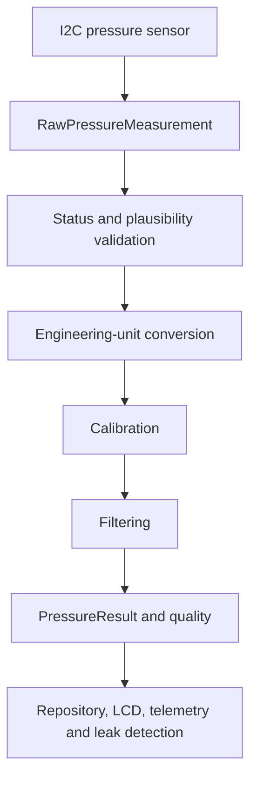
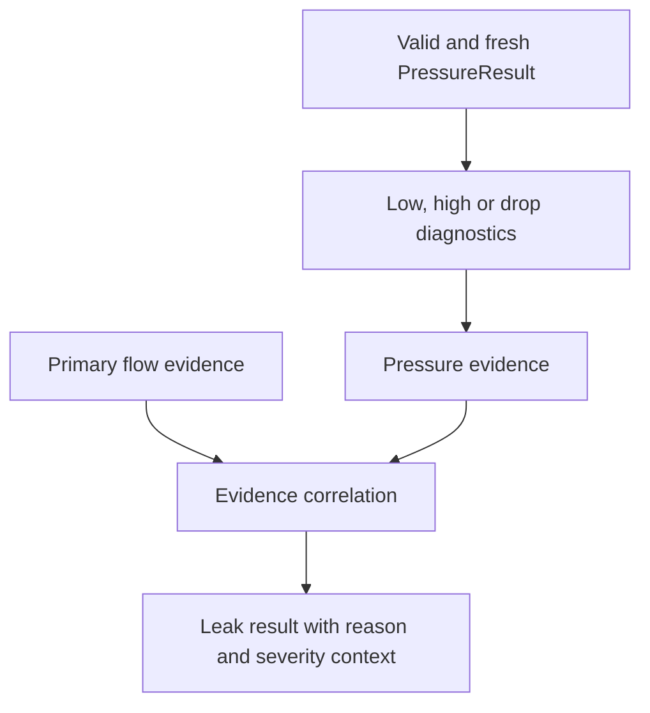

# 03 — Pressure Measurement Principle

**Project:** Smart Water Flow and Pressure Monitor  
**Short name:** SWFPM  
**Document group:** `1.docs/01_principle`  
**Document level:** Measurement and processing principle  
**Status:** Proposed baseline  

---

## 1. Mục tiêu

Tài liệu này định nghĩa nguyên lý đo và xử lý áp suất cho hệ thống **Smart Water Flow and Pressure Monitor**.

Mục tiêu gồm:

- Xác định đại lượng áp suất mà hệ thống cần đo.
- Tách rõ raw sensor data, converted value, calibrated value và published result.
- Định nghĩa validation, filtering, calibration, quality và freshness.
- Định nghĩa cách tính pressure trend và pressure anomaly ở mức nguyên lý.
- Định nghĩa contract của `RawPressureMeasurement` và `PressureResult`.
- Làm rõ vai trò của pressure trong diagnostics và leak detection.
- Giữ phần nguyên lý độc lập với model pressure sensor cụ thể.
- Tạo baseline cho hardware selection, firmware implementation và validation.

Model pressure sensor, measurement range, accuracy, sample rate và transfer function hiện vẫn là `TBD`. Vì vậy tài liệu không đưa ra threshold hoặc hệ số calibration không có evidence.

---

## 2. Phạm vi

### 2.1. Thuộc phạm vi

```text
Pressure measurand and reference type
I2C measurement semantics at principle level
Raw data and sensor-status handling
Conversion to engineering unit
Range and plausibility validation
Offset/gain calibration
Spike rejection and low-pass filtering
Sample timestamp, sequence and freshness
Pressure quality model
Absolute pressure threshold evaluation
Pressure trend and pressure-drop evaluation
PressureResult contract
Leak-detection integration boundary
Calibration and characterization requirements
```

### 2.2. Ngoài phạm vi

```text
Pressure sensor part number and schematic
I2C address and register map
STM32 HAL function calls
GPIO, DMA, interrupt and bus timing configuration
Exact production sample interval
Production pressure thresholds
Pipe pressure rating and installation procedure
Mechanical port and sealing design
BLE configuration packet encoding
4G telemetry payload encoding
LCD page implementation
Pressure-signature machine learning
```

Các nội dung hardware-specific phải được định nghĩa sau khi chọn sensor. Các nội dung firmware-specific phải tham chiếu tài liệu này thay vì định nghĩa lại pressure semantics.

---

## 3. Tài liệu liên quan và source-of-truth

| Nội dung | Source-of-truth |
|---|---|
| System purpose và pressure boundary | `../00_overview/01_system_overview.md` |
| I2C pressure interface boundary | `../00_overview/10_system_interfaces.md` |
| Canonical names và data objects | `../00_overview/glossary.md` |
| Leak rule và pressure evidence | `05_leak_detection_algorithm_baseline.md` |
| Leak state/evidence semantics | `06_leak_detection_state_and_evidence_model.md` |
| Dataset và validation strategy | `07_algorithm_validation_plan.md` |
| Sensor range, accuracy và electrical limits | Future pressure-sensor hardware document |
| Register conversion/status | Future pressure-sensor driver document |

Nếu có mâu thuẫn:

1. Datasheet của sensor đã chọn quyết định electrical limit, raw format và transfer function.
2. Tài liệu này quyết định processing semantics và `PressureResult` contract.
3. Leak documents quyết định cách pressure evidence ảnh hưởng leak state.

---

## 4. Design Baseline

Baseline hiện tại:

```text
Pressure source       : Digital pressure sensor
Physical interface    : I2C
Sensor model          : TBD
Target fluid          : Water
Target pressure type  : Gauge pressure preferred
Canonical logical unit: pascal (Pa)
Display unit          : Configurable conversion, not source-of-truth
Processing owner      : PressureProcessingService
Published object      : PressureResult
Leak role             : Diagnostic and supporting evidence
```

Các quyết định nền tảng:

1. `PressureResult` dùng pressure đã validate, calibration và filter; không expose raw count như runtime pressure chính thức.
2. Giá trị canonical được biểu diễn theo pascal để bám SI và tránh mơ hồ giữa bar, kPa và psi.
3. Display hoặc telemetry có thể đổi đơn vị, nhưng không thay đổi giá trị source-of-truth.
4. Pressure invalid/stale không được giả định bằng `0 Pa`.
5. Pressure-only evidence không xác nhận leak trong MVP.
6. Threshold production chỉ được chốt sau hardware characterization.

---

## 5. Đại lượng cần đo

### 5.1. Pressure definition

Áp suất là lực pháp tuyến trên một đơn vị diện tích:

$$
p = \frac{F}{A}
$$

Trong đó:

- $p$: pressure, đơn vị pascal (`Pa`).
- $F$: lực pháp tuyến, đơn vị newton (`N`).
- $A$: diện tích, đơn vị mét vuông (`m^2`).

Quan hệ đơn vị phục vụ hiển thị hoặc import/export:

$$
1\ \text{kPa} = 1000\ \text{Pa}
$$

$$
1\ \text{bar} = 100000\ \text{Pa}
$$

Việc hỗ trợ `psi` chỉ nên thực hiện tại presentation/serialization boundary và phải dùng conversion constant được kiểm thử.

### 5.2. Gauge, absolute và differential pressure

| Loại | Ý nghĩa | Khả năng dùng trong dự án |
|---|---|---|
| Gauge pressure | So với áp suất khí quyển cục bộ | Mục tiêu ưu tiên cho pressure đường ống |
| Absolute pressure | So với chân không tuyệt đối | Chỉ dùng trực tiếp nếu system requirement yêu cầu |
| Differential pressure | Chênh lệch giữa hai port | Không thuộc baseline single-sensor hiện tại |

Nếu sensor chỉ đo absolute pressure:

$$
p_{gauge} = p_{absolute} - p_{ambient}
$$

Hệ thống chỉ được công bố `gauge pressure` từ sensor absolute khi có nguồn `p_ambient` hợp lệ và uncertainty tổng được chấp nhận. Nếu không, result phải giữ đúng pressure reference type của sensor.

### 5.3. Pressure reference metadata

Sensor profile phải khai báo tối thiểu:

```text
pressure_reference_type = GAUGE | ABSOLUTE | DIFFERENTIAL
canonical_unit          = Pa
physical_min_pa
physical_max_pa
rated_operating_min_pa
rated_operating_max_pa
```

Không được so sánh threshold gauge với result absolute hoặc ngược lại.

---

## 6. Overall Pressure Pipeline



Logical sequence:

```text
Trigger sample
  -> acquire raw value and sensor status
  -> attach monotonic time and sequence
  -> validate communication and sensor status
  -> validate raw-domain plausibility
  -> convert to Pa using sensor transfer function
  -> apply calibration profile
  -> validate engineering-domain range
  -> reject isolated spikes when configured
  -> apply low-pass filter when configured
  -> evaluate freshness and quality
  -> calculate optional trend features
  -> publish PressureResult atomically
```

Không publish một intermediate value như `PressureResult` nếu pipeline chưa hoàn tất.

---

## 7. Responsibility Boundary

### 7.1. `PressureMeasurementService`

Chịu trách nhiệm:

- Điều phối sampling theo schedule.
- Gọi pressure-sensor driver.
- Thu raw pressure, raw temperature/status nếu sensor hỗ trợ.
- Ghi acquisition status, monotonic timestamp và sequence.
- Tạo `RawPressureMeasurement`.

Không chịu trách nhiệm:

- Chọn leak state.
- Áp dụng pressure threshold của leak algorithm.
- Chuyển đổi đơn vị hiển thị.
- Publish trực tiếp telemetry.

### 7.2. `PressureProcessingService`

Chịu trách nhiệm:

- Validate raw measurement.
- Convert raw data sang Pa.
- Áp dụng calibration và filter.
- Tính quality, freshness và trend feature.
- Publish `PressureResult`.

### 7.3. Consumer boundary

| Consumer | Được sử dụng | Không được sử dụng |
|---|---|---|
| `LeakDetectionService` | Valid/fresh `PressureResult`, trend và quality | I2C register hoặc raw count |
| `DataRepository` | Completed `PressureResult` | Intermediate filter state |
| LCD | Snapshot pressure và quality | Sensor driver |
| Telemetry | Snapshot pressure, unit metadata và quality | Live I2C read |
| Diagnostics | Raw/error counters qua diagnostic contract | Thay đổi calibration không qua validation |

---

## 8. Acquisition Model

### 8.1. Sampling trigger

Pressure sampling có thể được trigger bởi:

```text
Periodic measurement schedule
Startup/initialization sequence
Diagnostic or calibration session
Explicit measurement request through internal service
```

BLE, LCD và 4G không được trực tiếp điều khiển I2C transaction. Một external request chỉ có thể tạo validated internal request thông qua service boundary.

### 8.2. Sample timing

Mỗi sample phải có:

| Field | Ý nghĩa |
|---|---|
| `sample_sequence` | Sequence tăng đơn điệu theo measurement stream |
| `acquisition_start_monotonic` | Thời điểm bắt đầu acquisition nếu cần diagnostics |
| `sample_monotonic_time` | Thời điểm đại diện cho measurement |
| `wall_clock_timestamp` | Timestamp UTC nếu TimeService valid |
| `timestamp_valid` | Validity của wall-clock timestamp |

`sample_monotonic_time` nên đại diện cho thời điểm conversion hoàn thành hoặc thời điểm sensor xác nhận sample, tùy sensor operating mode. Quy ước cụ thể phải được driver document ghi rõ.

Duration, stale timeout và trend window luôn sử dụng monotonic time.

### 8.3. Duplicate và out-of-order

- Duplicate `sample_sequence` không được cập nhật filter hoặc trend hai lần.
- Out-of-order sample không được đưa ngược vào live filter state.
- Cả hai trường hợp phải tăng diagnostic counter phù hợp.
- Offline analysis có thể sắp xếp lại dataset, nhưng runtime pipeline không được âm thầm làm vậy.

### 8.4. Sampling interval

Sampling interval phải đáp ứng đồng thời:

```text
Sensor conversion time
I2C bus utilization
Expected pressure dynamics
Leak pressure-evidence window
Power budget
CPU and RAM budget
Freshness requirement
```

Không được chọn sample rate chỉ dựa trên reporting interval. Measurement có thể nhanh hơn telemetry và LCD refresh.

---

## 9. `RawPressureMeasurement` Contract

Logical fields:

| Field | Kiểu logic | Ý nghĩa | Bắt buộc |
|---|---|---|---:|
| `raw_pressure` | Sensor-defined integer/bytes | Raw pressure code | Có |
| `raw_temperature` | Sensor-defined | Raw temperature nếu sensor cung cấp | Không |
| `sensor_status` | Bit field/enum | Status từ sensor | Có nếu sensor hỗ trợ |
| `communication_status` | Enum | Kết quả I2C transaction | Có |
| `sample_monotonic_time` | Monotonic tick/time | Thời điểm sample | Có |
| `wall_clock_timestamp` | UTC timestamp | Timestamp khi time valid | Không bắt buộc |
| `timestamp_valid` | Boolean | Wall-clock có hợp lệ hay không | Có |
| `sample_sequence` | Unsigned counter | Sequence của measurement stream | Có |
| `sensor_profile_id` | Identifier | Profile conversion/calibration compatibility | Khuyến nghị |

`RawPressureMeasurement` chưa phải pressure result dùng cho application.

### 9.1. Communication status candidates

```text
OK
TIMEOUT
ADDRESS_NACK
DATA_NACK
BUS_ERROR
ARBITRATION_LOST
CRC_ERROR
SHORT_READ
DRIVER_NOT_READY
```

Danh sách firmware cuối cùng có thể khác theo STM32 HAL và sensor, nhưng phải map được về nhóm lỗi có ý nghĩa tương đương.

---

## 10. Sensor Transfer Function

### 10.1. Generic conversion

Sensor profile phải cung cấp hàm chuyển đổi:

$$
p_{sensor} = f(C_p, C_t, S)
$$

Trong đó:

- $C_p$: raw pressure code.
- $C_t$: raw temperature code nếu cần compensation.
- $S$: sensor profile/trim data.
- $p_{sensor}$: pressure trước device-level calibration, theo Pa.

Không được giả định mọi digital pressure sensor có linear transfer function giống nhau.

### 10.2. Linear transfer function candidate

Nếu datasheet xác nhận linear mapping:

$$
p_{sensor} = p_{min} +
\frac{C_p-C_{min}}{C_{max}-C_{min}}
(p_{max}-p_{min})
$$

Các biến phải lấy từ datasheet/profile của đúng sensor variant.

### 10.3. Ratiometric hoặc compensated digital sensor

- Với digital compensated sensor, không tự áp dụng lại compensation mà sensor đã thực hiện.
- Với sensor cần host-side temperature compensation, công thức và coefficient phải thuộc sensor-specific profile.
- Factory trim data phải được kiểm tra integrity nếu sensor expose.
- Conversion overflow và division-by-zero phải được xử lý như configuration/profile error.

### 10.4. Numeric representation

Baseline đề xuất:

```text
Canonical runtime pressure : signed integer Pa
Intermediate calculation   : widened integer, fixed-point or validated floating point
Serialized threshold       : integer Pa
Display conversion         : performed at presentation boundary
```

Lý do dùng integer Pa:

- Đơn vị SI rõ ràng.
- Tránh so sánh float không nhất quán trong configuration.
- Dễ serialize và trace test vector.
- Dải pressure nước thông dụng vẫn phù hợp với integer có độ rộng thích hợp.

Data type cuối cùng phải được chọn sau khi biết sensor range và margin; phép tính intermediate phải chứng minh không overflow.

---

## 11. Validation Model

Validation được thực hiện theo thứ tự từ transport đến physical plausibility.

### 11.1. Layered validation

| Layer | Kiểm tra | Failure result |
|---|---|---|
| Transport | I2C transaction hoàn tất, đủ byte | Invalid/unavailable |
| Integrity | CRC/checksum nếu sensor hỗ trợ | Invalid |
| Sensor status | Ready, diagnostic, saturation | Invalid hoặc degraded theo datasheet |
| Raw domain | Raw code không thuộc reserved/invalid region | Invalid |
| Conversion | Profile tồn tại, phép tính hữu hạn/không overflow | Invalid |
| Physical domain | Giá trị trong physical/rated range | Invalid hoặc out-of-range diagnostic |
| Temporal | Sequence và sample time hợp lệ | Duplicate/out-of-order/stale |

### 11.2. Range categories

Phải phân biệt:

```text
Sensor physical range
Rated operating range
Application expected range
Configured diagnostic range
Leak-evidence threshold range
```

Ý nghĩa:

- Ngoài sensor physical range: result invalid hoặc saturated.
- Trong physical range nhưng ngoài rated operating range: result không được tin cậy theo production accuracy.
- Trong rated range nhưng ngoài application expected range: result có thể valid nhưng có diagnostic flag.
- Vượt low/high diagnostic threshold: tạo pressure evidence sau debounce; không tự làm measurement invalid.

### 11.3. Plausibility checks

Candidate checks:

- Value không nằm trong reserved code.
- Giá trị không vượt sensor/profile range.
- Rate-of-change không vượt physical plausibility limit đã được characterization.
- Sensor status không báo internal fault.
- Không lặp một giá trị chính xác quá lâu khi điều kiện hệ thống cho thấy phải thay đổi, nếu stuck-detection được enable.

Rate-of-change hoặc stuck detection không được enable với threshold tùy ý; cần dataset và tránh đánh dấu nhầm pressure ổn định bình thường.

---

## 12. Calibration Principle

### 12.1. Mục tiêu

Calibration bù sai lệch có tính hệ thống giữa sensor/device và reference instrument. Calibration không phải filtering.

### 12.2. Baseline linear calibration

Sau sensor transfer function:

$$
p_{cal} = G_p \cdot p_{sensor} + O_p
$$

Trong đó:

- $G_p$: gain calibration coefficient.
- $O_p$: offset theo Pa.
- $p_{cal}$: calibrated pressure.

Identity profile:

$$
G_p = 1,\qquad O_p = 0
$$

### 12.3. Multi-point calibration

Nếu linear residual không đáp ứng accuracy requirement, có thể dùng piecewise-linear profile:

$$
p_{cal}=p_i+
\frac{p_{sensor}-x_i}{x_{i+1}-x_i}
(p_{i+1}-p_i)
$$

với $p_{sensor}$ nằm giữa hai calibration knot $x_i$ và $x_{i+1}$.

Multi-point calibration chỉ được chọn khi:

- Reference data cho thấy cần thiết.
- Knot ordering và range được validate.
- RAM/flash và computation budget phù hợp.
- Extrapolation policy được xác định.

### 12.4. Calibration profile metadata

```text
profile_version
sensor_model_or_profile_id
sensor_serial_or_device_binding if required
pressure_reference_type
canonical_unit = Pa
gain/offset or calibration points
calibration_temperature_range if applicable
reference_instrument_id
calibration_timestamp
validity/integrity field
```

### 12.5. Invalid calibration behavior

Nếu calibration profile missing, corrupt hoặc incompatible:

1. Không dùng coefficient tùy ý.
2. Có thể dùng identity profile chỉ khi product policy cho phép.
3. Gắn `CALIBRATION_DEFAULT` hoặc `CALIBRATION_INVALID` phù hợp.
4. Nếu accuracy không còn đáp ứng requirement, `PressureResult` phải degraded hoặc invalid.

Policy identity fallback phải được chốt sau khi biết sensor factory calibration.

---

## 13. Filtering Principle

### 13.1. Mục tiêu

Filtering giảm noise không mong muốn nhưng không được che mất pressure change cần cho diagnostics/leak correlation.

Phải cân bằng:

```text
Noise suppression
Step-response latency
Peak preservation
CPU/RAM cost
Irregular sample interval
Fault behavior after data gaps
```

### 13.2. Proposed filter chain

```text
Calibrated sample
  -> optional isolated-spike rejection
  -> optional first-order low-pass filter
  -> filtered pressure
```

Không dùng moving average dài làm baseline mặc định vì nó tạo latency và cần buffer lớn hơn. Việc lựa chọn filter cuối cùng phụ thuộc characterization.

### 13.3. Median-of-three spike rejection

Nếu sampling đều và application có isolated spike:

$$
p_{median}[n]=\operatorname{median}
\left(p[n-2],p[n-1],p[n]\right)
$$

Đặc tính:

- Loại tốt single-sample impulse.
- Tạo ít nhất một mức latency theo implementation.
- Không phù hợp nếu pressure transient thực chỉ tồn tại rất ngắn.

Median stage là optional và phải được validation bằng pressure step/spike dataset.

### 13.4. First-order IIR low-pass

$$
p_f[n] = p_f[n-1] + \alpha_n\left(p_{in}[n]-p_f[n-1]\right)
$$

Với sample interval thay đổi:

$$
\alpha_n = 1-e^{-\Delta t_n/\tau}
$$

Trong đó:

- $\Delta t_n$: monotonic interval giữa hai sample hợp lệ.
- $\tau$: filter time constant.
- $0 < \alpha_n \le 1$.

Nếu firmware tránh exponential runtime, có thể dùng precomputed coefficient hoặc approximation đã được kiểm chứng cho các interval hợp lệ.

### 13.5. Filter initialization và gap behavior

Proposed behavior:

```text
First valid sample:
  filtered = calibrated sample

Duplicate/invalid sample:
  do not update filter

Short valid interval:
  update with alpha derived from delta time

Gap greater than filter_reset_gap:
  reinitialize from next valid calibrated sample
  set FILTER_REINITIALIZED advisory flag
```

Không tiếp tục filter qua một gap dài như thể dữ liệu liên tục.

### 13.6. Raw versus filtered result

`PressureResult` nên giữ tối thiểu calibrated/filtered pressure chính thức. Có thể giữ thêm unfiltered calibrated pressure cho diagnostics nếu resource cho phép.

Leak rules phải ghi rõ sử dụng:

- filtered pressure cho low/high persistent diagnostics;
- unfiltered hoặc lightly filtered pressure cho pressure-drop feature nếu validation chứng minh cần thiết.

Không được trộn hai signal mà không có field/metadata phân biệt.

---

## 14. Freshness and Availability

### 14.1. Pressure age

Tại thời điểm evaluation:

$$
age_p = t_{now,mono} - t_{sample,mono}
$$

Pressure usable cho leak evaluation khi:

```text
pressure_result.valid == true
AND age_p <= maximum_pressure_data_age
AND no blocking quality flag
```

### 14.2. State categories

| Category | Ý nghĩa |
|---|---|
| `VALID_FRESH` | Valid và age trong giới hạn |
| `VALID_STALE` | Value từng valid nhưng quá cũ để dùng |
| `INVALID` | Sample/process failure |
| `UNAVAILABLE` | Chưa có sample hoặc sensor/communication không khả dụng |

Stale là thuộc tính tại thời điểm consume, không nhất thiết là lỗi của sample lúc được tạo.

### 14.3. Relationship to sample interval

Phải đảm bảo:

```text
maximum_pressure_data_age >= expected_pressure_sample_interval + jitter_budget
```

Giá trị quá lớn làm algorithm sử dụng pressure cũ; giá trị quá nhỏ tạo false stale do jitter bình thường. Cả hai parameter phải được kiểm chứng cùng nhau.

---

## 15. Quality Model

### 15.1. Quality dimensions

Pressure quality gồm các dimension độc lập:

```text
Communication integrity
Sensor self-status
Range/plausibility
Calibration status
Filter status
Temporal freshness
Pressure reference type
```

Một boolean `valid` không đủ để giải thích nguyên nhân degraded; `quality_flags` phải đi kèm.

### 15.2. Proposed quality flags

| Flag | Class | Ý nghĩa |
|---|---|---|
| `PRESSURE_COMM_ERROR` | Blocking | I2C/transport failure |
| `PRESSURE_INTEGRITY_ERROR` | Blocking | CRC/checksum failure |
| `PRESSURE_SENSOR_FAULT` | Blocking | Sensor self-diagnostic fault |
| `PRESSURE_NOT_READY` | Blocking for sample | Conversion chưa sẵn sàng |
| `PRESSURE_RAW_INVALID` | Blocking | Reserved/invalid raw code |
| `PRESSURE_CONVERSION_ERROR` | Blocking | Profile/numeric conversion failure |
| `PRESSURE_OUT_OF_PHYSICAL_RANGE` | Blocking | Ngoài physical capability |
| `PRESSURE_OUT_OF_EXPECTED_RANGE` | Advisory/diagnostic | Ngoài application expected range |
| `PRESSURE_STALE` | Blocking for live evidence | Age vượt giới hạn |
| `PRESSURE_DUPLICATE` | Advisory/rejected | Duplicate sequence |
| `PRESSURE_OUT_OF_ORDER` | Advisory/rejected | Sample cũ hơn stream hiện tại |
| `PRESSURE_CALIBRATION_DEFAULT` | Advisory or degraded | Dùng identity/default profile |
| `PRESSURE_CALIBRATION_INVALID` | Blocking/degraded | Profile không hợp lệ |
| `PRESSURE_FILTER_REINITIALIZED` | Advisory | Filter reset sau startup/gap |
| `PRESSURE_REFERENCE_MISMATCH` | Blocking | Threshold/reference type không tương thích |

Blocking/advisory classification cuối cùng phải được chốt trong firmware error taxonomy.

### 15.3. Validity rule

```text
valid = no blocking acquisition, conversion, range or calibration condition
```

`valid == true` không đồng nghĩa `fresh == true`; freshness được đánh giá theo consumer time.

---

## 16. `PressureResult` Contract

| Field | Kiểu logic | Ý nghĩa | Bắt buộc |
|---|---|---|---:|
| `pressure_pa` | Signed integer | Calibrated/filtered canonical pressure | Có |
| `pressure_reference_type` | Enum | Gauge, absolute hoặc differential | Có |
| `valid` | Boolean | Processing validity | Có |
| `quality_flags` | Bit field | Blocking/advisory quality | Có |
| `sample_monotonic_time` | Monotonic time | Thời điểm sample nguồn | Có |
| `publish_monotonic_time` | Monotonic time | Thời điểm result hoàn tất | Khuyến nghị |
| `wall_clock_timestamp` | UTC | Timestamp khi TimeService valid | Không bắt buộc |
| `timestamp_valid` | Boolean | Wall-clock validity | Có |
| `sample_sequence` | Unsigned counter | Sequence nguồn | Có |
| `calibration_version` | Identifier | Calibration profile đang áp dụng | Khuyến nghị |
| `processing_config_version` | Identifier | Filter/validation config version | Khuyến nghị |
| `unfiltered_pressure_pa` | Signed integer | Calibrated value trước smoothing | Optional diagnostics |
| `trend_pa_per_second` | Signed numeric | Estimated trend nếu feature valid | Optional |
| `trend_valid` | Boolean | Trend window có đủ dữ liệu | Có nếu expose trend |

Quy tắc:

- `pressure_pa` không được mang giá trị sentinel để biểu diễn invalid.
- Consumer phải kiểm tra `valid`, freshness và relevant quality flags.
- `pressure_reference_type` phải đi cùng value khi system có khả năng dùng nhiều loại reference.
- `PressureResult` phải được publish atomically qua `DataRepository`/snapshot boundary.

---

## 17. Pressure Trend Principle

### 17.1. Mục tiêu

Trend mô tả hướng và tốc độ thay đổi pressure trong một monotonic window. Trend không đồng nghĩa leak.

### 17.2. Endpoint pressure drop

Baseline đơn giản:

$$
\Delta p_{drop} = p(t_{start}) - p(t_{end})
$$

Pressure-drop candidate khi:

```text
delta_pressure_drop >= pressure_drop_threshold
AND window_duration within configured tolerance
AND endpoint samples valid and fresh
```

Endpoint method nhạy với noise và single spike, vì vậy chỉ nên dùng sau filtering hoặc robust endpoint selection.

### 17.3. Rate of change

$$
r_p = \frac{p(t_2)-p(t_1)}{t_2-t_1}
$$

Đơn vị canonical:

```text
Pa/s
```

Negative $r_p$ biểu diễn pressure giảm theo quy ước này.

### 17.4. Windowed linear regression

Khi có ít nhất số sample tối thiểu trong window, slope có thể ước lượng bằng:

$$
\hat{r}_p =
\frac{\sum_i (t_i-\bar{t})(p_i-\bar{p})}
{\sum_i (t_i-\bar{t})^2}
$$

Ưu điểm:

- Ít phụ thuộc một endpoint hơn.
- Có thể chịu noise tốt hơn.
- Cung cấp slope trực tiếp.

Chi phí:

- Cần buffer/accumulator và numeric-range analysis.
- Cần đủ sample hợp lệ.
- Phải xử lý irregular interval và window expiry.

MVP có thể bắt đầu bằng endpoint/filtered method; regression chỉ được enable khi resource và validation cho phép.

### 17.5. Trend-window validity

Trend chỉ valid nếu:

```text
sample_count >= minimum_pressure_trend_samples
AND window_span >= minimum_pressure_trend_span
AND every used sample is valid
AND gaps <= maximum_pressure_trend_gap
AND pressure reference type/config version is consistent
```

Calibration hoặc filter config thay đổi giữa window phải reset trend context.

---

## 18. Pressure Diagnostics

### 18.1. Low pressure

```text
PressureResult usable
AND pressure_pa <= pressure_low_threshold_pa
for pressure_low_duration
```

Low pressure có thể do supply condition, valve, pump, demand lớn, sensor/install issue hoặc leak. Vì vậy nó là diagnostic, không phải leak confirmation độc lập.

### 18.2. High pressure

```text
PressureResult usable
AND pressure_pa >= pressure_high_threshold_pa
for pressure_high_duration
```

High pressure chủ yếu phản ánh system health/stress hoặc control condition. Nó không được map trực tiếp thành leak.

### 18.3. Hysteresis và clear

Để tránh chattering:

```text
Low-pressure enter : pressure <= low_enter
Low-pressure clear : pressure >= low_clear
Requirement        : low_enter < low_clear

High-pressure enter: pressure >= high_enter
High-pressure clear: pressure <= high_clear
Requirement        : high_clear < high_enter
```

Clear phải duy trì trong `pressure_evidence_clear_duration` nếu leak baseline yêu cầu debounce.

### 18.4. Pressure drop

Pressure-drop evidence chỉ active khi:

- Trend feature enabled.
- Window valid.
- Drop/slope vượt configured threshold.
- Condition duy trì theo debounce policy nếu được yêu cầu.
- Không có blocking quality flag.

Pressure spike ngắn hơn debounce không được tạo persistent pressure evidence.

---

## 19. Leak-Detection Integration

Pressure có hai vai trò:

1. Pressure diagnostics độc lập với leak state.
2. Supporting evidence/correlation cho flow-based leak detection.



Baseline invariants:

```text
Pressure-only evidence cannot transition leak state to CONFIRMED.
Pressure invalid/stale does not stop flow-only rules.
Pressure invalid/stale cannot clear an existing leak state.
Pressure correlation may enrich reason/severity.
Flow remains the primary embedded-MVP evidence.
```

### 19.1. Correlation window

Flow và pressure evidence được xem là correlated khi event time theo monotonic clock nằm trong `correlation_window` đã cấu hình.

Không so sánh wall-clock timestamps để tính correlation duration vì time synchronization có thể làm clock nhảy.

### 19.2. Interpretation limits

Một pressure drop không chứng minh vị trí hoặc nguyên nhân leak. Pressure phụ thuộc:

- Supply pressure.
- Pump/PRV behavior.
- Valve operation.
- Simultaneous water demand.
- Pipe topology và sensor location.
- Sensor bandwidth, filter và sample rate.

Telemetry/UI phải dùng wording như `pressure anomaly` hoặc `pressure-correlated leak evidence`, không trình bày pressure-only diagnostic như kết luận leak chắc chắn.

---

## 20. Configuration Parameters

### 20.1. Acquisition and freshness

| Parameter | Unit | Ý nghĩa | Status |
|---|---|---|---|
| `pressure_sample_interval_ms` | ms | Chu kỳ sampling | TBD |
| `pressure_conversion_timeout_ms` | ms | Timeout conversion/read | Sensor-dependent |
| `maximum_pressure_data_age_ms` | ms | Age tối đa cho live evidence | TBD |
| `pressure_filter_reset_gap_ms` | ms | Gap làm reset filter | TBD |

### 20.2. Validation and filter

| Parameter | Unit | Ý nghĩa | Status |
|---|---|---|---|
| `application_pressure_min_pa` | Pa | Expected minimum | TBD/profile |
| `application_pressure_max_pa` | Pa | Expected maximum | TBD/profile |
| `pressure_spike_filter_enabled` | Boolean | Enable robust spike stage | Default TBD |
| `pressure_filter_time_constant_ms` | ms | IIR time constant | TBD |
| `pressure_max_plausible_rate_pa_s` | Pa/s | Optional plausibility limit | Disabled until characterized |

### 20.3. Diagnostics and trend

| Parameter | Unit | Ý nghĩa | Status |
|---|---|---|---|
| `pressure_low_enter_pa` | Pa | Low-pressure entry | TBD/configurable |
| `pressure_low_clear_pa` | Pa | Low-pressure clear | TBD/configurable |
| `pressure_high_enter_pa` | Pa | High-pressure entry | TBD/configurable |
| `pressure_high_clear_pa` | Pa | High-pressure clear | TBD/configurable |
| `pressure_low_duration_ms` | ms | Low-pressure debounce | TBD/configurable |
| `pressure_high_duration_ms` | ms | High-pressure debounce | TBD/configurable |
| `pressure_drop_threshold_pa` | Pa | Drop trong window | TBD/configurable |
| `pressure_drop_window_ms` | ms | Trend window | TBD/configurable |
| `minimum_pressure_trend_samples` | Count | Minimum sample count | TBD |
| `maximum_pressure_trend_gap_ms` | ms | Maximum gap trong window | TBD |
| `pressure_evidence_clear_duration_ms` | ms | Stable clear duration | TBD/configurable |

### 20.4. Parameter relationships

```text
pressure_sample_interval_ms > sensor conversion time and scheduling margin
maximum_pressure_data_age_ms >= pressure_sample_interval_ms + jitter budget
pressure_filter_time_constant_ms compatible with pressure_drop_window_ms
application_pressure_min_pa < application_pressure_max_pa
pressure_low_enter_pa < pressure_low_clear_pa
pressure_low_clear_pa < pressure_high_clear_pa
pressure_high_clear_pa < pressure_high_enter_pa
minimum_pressure_trend_samples >= 2
pressure_drop_window_ms >= span of minimum required samples
all configured thresholds match PressureResult reference type
```

Configuration vi phạm dependency phải bị reject atomically; không được apply từng field một phần.

---

## 21. Configuration Change Behavior

Khi pressure processing config thay đổi:

1. Validate toàn bộ candidate profile.
2. Tạo immutable config version mới.
3. Apply tại processing boundary xác định.
4. Reset filter/trend state nếu coefficient, unit, reference hoặc sample interval ảnh hưởng history.
5. Gắn config version vào result tiếp theo.
6. Không reinterpret result cũ bằng config mới.

Khi chỉ thay diagnostic threshold:

- Measurement/filter state có thể giữ nếu signal semantics không đổi.
- Pressure evidence tracker phải reevaluate/reset theo policy trong leak algorithm.
- Thay đổi không được retroactively tạo event ở quá khứ.

---

## 22. Startup, Recovery and Fault Behavior

### 22.1. Startup

```text
Load validated sensor profile
  -> initialize I2C/driver
  -> read identity/status if supported
  -> start conversion/sampling
  -> acquire first valid sample
  -> initialize filter
  -> publish PressureResult
```

Trước first valid sample, pressure status là `UNAVAILABLE`, không phải `0 Pa`.

### 22.2. I2C failure

Khi transaction lỗi:

- Không update value/filter/trend bằng buffer không hoàn chỉnh.
- Publish diagnostic status/counter phù hợp.
- Giữ last result để hiển thị lịch sử nếu cần nhưng đánh giá stale theo current time.
- Retry phải bounded và không block flow measurement.
- Bus recovery thuộc driver/interface policy.

### 22.3. Sensor reset hoặc replacement

- Sensor reset làm invalid conversion-in-progress.
- Sau reset phải xác nhận profile/identity nếu sensor hỗ trợ.
- Sensor/profile mismatch không được dùng calibration cũ.
- Filter/trend context phải reset.

### 22.4. RTC invalid

- Pressure sampling và filtering tiếp tục bằng monotonic time.
- `timestamp_valid = false`.
- Không gán wall-clock timestamp giả.
- Leak pressure evidence vẫn hoạt động nếu monotonic time và pressure data hợp lệ.

---

## 23. Power and Scheduling Implications

- Pressure conversion/read không được thực hiện trong long blocking loop.
- I2C work cần phối hợp với F-RAM nếu dùng chung bus.
- Shared I2C bus phải có serialization, timeout và ownership rõ ràng.
- Low-power entry phải xét sensor conversion-in-progress và pending I2C transaction.
- Sau wakeup, sample age phải được đánh giá trước khi dùng last result.
- Reporting window không quyết định pressure sampling trực tiếp.
- LCD refresh và 4G transfer không được làm pressure sample mất deadline ngoài jitter budget.

Nếu sensor hỗ trợ sleep/one-shot mode, hardware/firmware document phải đánh giá trade-off giữa power, wake latency và measurement freshness.

---

## 24. Data Publication and Consumers

`PressureProcessingService` publish complete result vào `DataRepository`.

```text
PressureResult
  -> RuntimeSnapshot
      -> LCD presentation
      -> Telemetry snapshot generation
      -> LeakDetectionService input/event
      -> Diagnostics/service read
```

Snapshot phải giữ consistency:

- Pressure value và pressure quality cùng version.
- Timestamp/sequence đi cùng đúng sample.
- Không đọc một phần result đang update.
- Consumer có thể nhận pressure và flow từ các sample time khác nhau; mỗi result giữ freshness riêng.

### 24.1. LCD

- Hiển thị unit do presentation policy chọn.
- Hiển thị unavailable/stale/error khác với zero pressure.
- Không tự tính leak state từ pressure.

### 24.2. Telemetry

Telemetry nên chứa:

```text
pressure_pa or explicitly versioned pressure field
pressure_reference_type
sample timestamp and timestamp validity
quality/status summary
sample/config version when required for diagnostics
```

Nếu payload dùng kPa/bar để tiết kiệm dung lượng, scale và rounding phải được protocol định nghĩa rõ.

---

## 25. Characterization and Calibration Plan

Sau khi chọn sensor, cần characterize tối thiểu:

| Test group | Cần xác định |
|---|---|
| Zero/reference | Offset và repeatability |
| Multi-point static | Gain, linearity và residual |
| Pressure step | Response time và filter latency |
| Stable pressure | Noise distribution và resolution hữu ích |
| Temperature sweep if applicable | Temperature dependence |
| Supply variation | Sensitivity nếu relevant |
| I2C fault | Timeout, short read, reset/recovery |
| Long duration | Drift và stuck behavior |
| Cross-device | Unit-to-unit calibration spread |

Reference instrument phải có accuracy/uncertainty phù hợp hơn device under test và còn calibration validity.

### 25.1. Dataset fields

```text
reference_pressure_pa
raw_pressure_code
converted_pressure_pa
calibrated_pressure_pa
filtered_pressure_pa
sensor status
temperature if available
monotonic timestamp
sample sequence
sensor/device ID
firmware and config version
test condition and ground-truth marker
```

### 25.2. Metrics

Candidate metrics:

$$
e_i = p_{device,i} - p_{reference,i}
$$

$$
MAE = \frac{1}{N}\sum_{i=1}^{N}|e_i|
$$

$$
RMSE = \sqrt{\frac{1}{N}\sum_{i=1}^{N}e_i^2}
$$

Ngoài ra cần đánh giá:

- Maximum absolute error.
- Repeatability.
- Hysteresis nếu test setup cho phép.
- Step-response rise/settling time.
- Filter-induced delay.
- False pressure anomaly rate.
- Stale/fault-detection latency.

Acceptance limit vẫn là TBD cho đến khi product requirement và sensor selection được chốt.

---

## 26. Validation Requirements

| ID | Requirement | Validation evidence |
|---|---|---|
| `PR-PM-001` | I2C failure không tạo valid pressure | Driver/service fault injection |
| `PR-PM-002` | Reserved/invalid raw code bị reject | Unit test theo sensor profile |
| `PR-PM-003` | Conversion sang Pa đúng transfer function | Golden-vector test |
| `PR-PM-004` | Calibration identity không đổi result ngoài rounding | Unit/property test |
| `PR-PM-005` | Calibration profile mismatch không được dùng | Configuration test |
| `PR-PM-006` | Invalid/duplicate sample không update filter | Sequence test |
| `PR-PM-007` | Filter reset đúng sau long gap | Virtual-time test |
| `PR-PM-008` | Freshness dùng monotonic time | RTC-jump test |
| `PR-PM-009` | Stale pressure không usable cho evidence | Integration test |
| `PR-PM-010` | Pressure-only không xác nhận leak | Leak invariant test |
| `PR-PM-011` | Threshold/reference mismatch bị reject | Config validation test |
| `PR-PM-012` | Low/high diagnostics có hysteresis/debounce | Boundary test |
| `PR-PM-013` | Trend invalid khi insufficient sample/gap | Trend-window test |
| `PR-PM-014` | Numeric conversion không overflow | Static analysis/boundary vector |
| `PR-PM-015` | Snapshot giữ value/quality/timestamp nhất quán | Concurrency/integration test |
| `PR-PM-016` | Filter đáp ứng noise/latency requirement | Hardware characterization |

Các test này phải được mapping vào `07_algorithm_validation_plan.md` và downstream test specification.

---

## 27. Sensor-Selection Requirements Derived from Principle

Sensor candidate phải được đánh giá tối thiểu theo:

```text
Pressure reference type
Rated pressure range and overload limit
Accuracy, resolution, repeatability and drift
Water/media compatibility
Operating temperature
Digital transfer function and status reporting
Conversion time and maximum sample rate
I2C voltage, address and bus behavior
CRC or integrity support
Power modes and consumption
Mechanical port and sealing compatibility
Factory calibration and traceability
Availability and lifecycle
```

Không chọn sensor chỉ vì có I2C. Mechanical/media compatibility và pressure rating là điều kiện bắt buộc của hardware design.

---

## 28. Open Questions

| ID | Câu hỏi cần chốt | Ảnh hưởng |
|---|---|---|
| `OQ-PM-001` | Pressure sensor model là gì? | Transfer function, status và driver |
| `OQ-PM-002` | Required pressure range và overload rating? | Sensor selection và numeric type |
| `OQ-PM-003` | Required accuracy/resolution? | Sensor, calibration và acceptance |
| `OQ-PM-004` | Gauge hay absolute sensor? | Reference semantics và thresholds |
| `OQ-PM-005` | Required pressure sample interval? | Freshness, trend và power |
| `OQ-PM-006` | Sensor có integrated temperature compensation không? | Conversion/profile |
| `OQ-PM-007` | Identity calibration fallback có được phép? | Availability và quality |
| `OQ-PM-008` | Median spike stage có cần enable? | Transient preservation và latency |
| `OQ-PM-009` | Filter time constant production là bao nhiêu? | Noise và detection latency |
| `OQ-PM-010` | Pressure trend thuộc MVP hay chỉ research? | RAM, algorithm và test scope |
| `OQ-PM-011` | Low/high pressure thresholds do ai cấu hình? | BLE/configuration contract |
| `OQ-PM-012` | Pressure calibration thực hiện tại factory hay field? | Tooling và storage |
| `OQ-PM-013` | I2C bus có dùng chung với F-RAM không? | Scheduling và recovery |
| `OQ-PM-014` | Telemetry cần unfiltered pressure/trend không? | Payload và diagnostics |
| `OQ-PM-015` | Error/quality flag serialization mapping là gì? | Firmware/protocol compatibility |

Không câu hỏi nào ở trên cho phép implementation tự chọn threshold production không có review/evidence.

---

## 29. Implementation Handoff

### 29.1. Hardware document phải bổ sung

- Sensor part number/variant.
- Pressure reference type và range.
- Mechanical/media compatibility.
- I2C electrical connection/address.
- Power, decoupling và protection.
- Operating/overpressure limits.

### 29.2. Driver document phải bổ sung

- Register map và commands.
- Conversion/start/read state machine.
- Raw byte order và sign/bit layout.
- Status/CRC mapping.
- Timeout và recovery.
- Sensor profile constants.

### 29.3. Firmware design phải bổ sung

- Concrete data types.
- Scheduling and shared-bus arbitration.
- Fixed-point/float implementation choice.
- Filter/trend state storage.
- Quality/error enum mapping.
- Config persistence/version migration.
- Unit/integration tests.

### 29.4. Simulation/test phải bổ sung

- Golden conversion vectors.
- Noise, spike, step và drift datasets.
- Fault/duplicate/stale/out-of-order cases.
- Calibration and numeric-boundary tests.
- Pressure/leak correlation scenarios.

---

## 30. Completion Criteria

Pressure principle baseline được xem là sẵn sàng cho downstream design khi:

1. Canonical unit và pressure-reference semantics được review.
2. Raw/result contract và ownership được thống nhất.
3. Validation layers và quality flags được mapping vào firmware taxonomy.
4. Sensor model/range/accuracy được chọn hoặc giữ TBD rõ ràng.
5. Conversion profile có datasheet source cho sensor đã chọn.
6. Calibration fallback policy được chốt.
7. Sample interval, freshness và filter parameters có rationale.
8. Pressure trend MVP scope được quyết định.
9. Low/high/drop thresholds có source từ requirement hoặc characterization.
10. Validation requirements có test mapping và evidence.

---

## 31. Kết luận

Pressure measurement pipeline của SWFPM được tóm tắt như sau:

```text
I2C pressure sensor
  -> RawPressureMeasurement
  -> communication/status/raw validation
  -> conversion to canonical Pa
  -> device calibration
  -> optional spike rejection and low-pass filtering
  -> freshness, quality and optional trend evaluation
  -> PressureResult
  -> RuntimeSnapshot, LCD, telemetry and leak evidence
```

Nguyên tắc cốt lõi:

- Canonical pressure dùng `Pa`; display unit chỉ là presentation.
- Gauge/absolute reference phải explicit và tương thích với threshold.
- Invalid hoặc stale pressure không được hiểu là zero.
- Filter phải giảm noise mà không che pressure event cần phát hiện.
- Duration và trend window dùng monotonic time.
- Pressure hỗ trợ diagnostics và enrich flow-based leak evidence; pressure một mình không xác nhận leak trong MVP.
- Mọi range, threshold và coefficient production phải đến từ sensor datasheet, product requirement hoặc hardware characterization có traceability.
