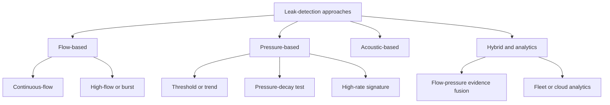
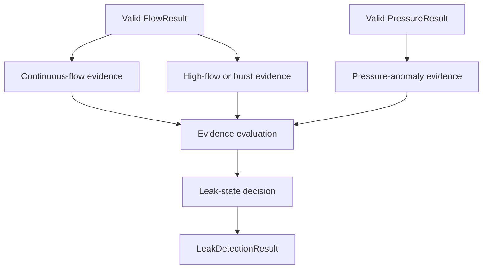

# 04 — Leak-Detection Product Research

**Project:** Smart Water Flow and Pressure Monitor  
**Document group:** `1.docs/01_principle`  
**Document level:** Product research and algorithm feasibility  
**Status:** Research baseline  
**Purpose:** Phân tích các nguyên lý leak detection đã được triển khai trong sản phẩm thực tế và đánh giá khả năng áp dụng cho baseline MAX35103 + pressure sensor I2C + STM32L433RCT6.  

---

## 1. Mục tiêu

Tài liệu này nghiên cứu các phương pháp phát hiện rò rỉ nước đang được sử dụng trong sản phẩm smart meter, smart water monitor và water-network monitoring thương mại.

Mục tiêu chính:

- Xác định những nhóm nguyên lý leak detection đã được triển khai thực tế.
- Phân biệt capability được nhà sản xuất công bố với chi tiết thuật toán proprietary không được công bố.
- Phân tích dữ liệu đầu vào, sensor, sample rate và điều kiện vận hành cần thiết cho từng phương pháp.
- Đánh giá mức phù hợp với phần cứng baseline của dự án.
- Đề xuất hướng thuật toán cho MVP mà không tạo threshold hoặc performance claim chưa có evidence.
- Xác định các hướng future cần hardware, dataset hoặc cloud analytics bổ sung.

Tài liệu này không chốt state transition hoặc threshold cuối cùng. Các quyết định đó thuộc:

```text
05_leak_detection_algorithm_baseline.md
06_leak_detection_state_and_evidence_model.md
07_algorithm_validation_plan.md
```

---

## 2. Câu hỏi nghiên cứu

Tài liệu cần trả lời:

1. Sản phẩm thực tế sử dụng flow, pressure, acoustic hoặc kết hợp các nguồn dữ liệu nào?
2. Phương pháp nào có thể chạy trực tiếp trên MCU với measurement rate vừa phải?
3. Phương pháp nào yêu cầu pressure waveform tần số cao, valve cô lập đường ống hoặc cloud analytics?
4. MAX35103 có thể hỗ trợ acoustic leak detection giống sản phẩm thương mại hay không?
5. Pressure sensor I2C trong baseline có thể dùng để phát hiện leak ở mức nào?
6. Hướng MVP nào dễ giải thích, dễ test và ít phụ thuộc proprietary model nhất?
7. Những nguyên nhân false positive quan trọng cần đưa vào validation plan là gì?

---

## 3. Phạm vi và giới hạn nghiên cứu

### 3.1. Thuộc phạm vi

```text
Continuous-flow detection
High-flow and burst detection
Pressure threshold and pressure-trend detection
Pressure-loss or pressure-decay test
High-frequency pressure-signature analysis
Acoustic leak detection
Flow-pressure evidence combination
Embedded versus cloud analytics partition
False-positive mitigation
Hardware and sample-rate feasibility
```

### 3.2. Ngoài phạm vi

```text
Reverse engineering proprietary algorithms
Sao chép threshold thương mại làm threshold sản phẩm
Thiết kế shutoff valve hoặc actuator
Thiết kế cloud backend hoàn chỉnh
Leak localization trên network topology
Chứng nhận độ chính xác hoặc metrology
Chốt leak-state enum và transition cuối cùng
```

### 3.3. Giới hạn của nguồn công khai

Tài liệu nhà sản xuất thường công bố capability và nguyên lý tổng quát nhưng không công bố đầy đủ:

- Feature extraction.
- Threshold nội bộ.
- Filter và debounce logic.
- Training dataset.
- Confidence model.
- False-positive suppression.
- State-transition details.

Vì vậy, mọi phần không được nguồn chính thức mô tả phải được ghi là `Engineering inference`, `Open Question` hoặc `TBD`.

---

## 4. Research Methodology

### 4.1. Mức độ evidence

| Mức | Ý nghĩa |
|---|---|
| `Verified Product Behavior` | Hành vi/capability được nhà sản xuất mô tả trực tiếp trong product page, manual hoặc help center. |
| `Source-Backed Principle` | Nguyên lý kỹ thuật được mô tả nhưng không có đủ chi tiết để tái tạo thuật toán. |
| `Engineering Inference` | Nhận xét suy ra từ source và kiến trúc dự án; phải ghi rõ là inference. |
| `Proposed Design` | Thiết kế do dự án đề xuất, chưa phải hành vi sản phẩm tham khảo. |
| `Open Question` | Chưa đủ dữ liệu hoặc cần quyết định/hardware test. |

### 4.2. Tiêu chí đánh giá sản phẩm

Mỗi sản phẩm/phương pháp được đánh giá theo:

```text
Input sensors
Published principle
Sampling requirement
Need for shutoff/isolation
Embedded compute requirement
Cloud dependency
Explainability
False-positive risk
Compatibility with project hardware
Evidence limitation
```

### 4.3. Quy tắc sử dụng threshold tham khảo

Threshold do nhà sản xuất công bố chỉ dùng để hiểu sensitivity hoặc test model của sản phẩm đó.

Không được áp dụng trực tiếp vì khác biệt về:

- Pipe diameter và material.
- Sensor accuracy và noise.
- Installation position.
- Hydraulic condition.
- Sample rate.
- Filtering.
- Product use case.

---

## 5. Phân loại các phương pháp leak detection



---

## 6. Product Research — Kamstrup flowIQ

### 6.1. Product family

Nguồn chính thức:

- [Kamstrup flowIQ 2200](https://www.kamstrup.com/en-en/product-centre/flowiq-2200)
- [Kamstrup flowIQ 3200](https://www.kamstrup.com/en-en/product-centre/flowiq-3200)
- [Kamstrup flowIQ 2100](https://www.kamstrup.com/en-us/water-solutions/flowiq-2100-amr)
- [Kamstrup acoustic leak-detection solution](https://www.kamstrup.com/en-us/water-solutions/solutions/ald)

### 6.2. Published behavior

Kamstrup mô tả hai lớp capability:

1. Ultrasonic meter đo consumption và cung cấp intelligent alarms như leak, burst, reverse flow hoặc dry meter tùy product family.
2. flowIQ 2200/3200 tích hợp acoustic leak detection để nhận biết noise pattern khác thường do leak/burst tạo ra.

Đối với flowIQ 2200/3200, tài liệu hãng cho biết hệ thống ghi nhận noise pattern bằng ultrasonic sensors và báo cáo giá trị noise thấp nhất trong khoảng 24 giờ. Mục tiêu là giảm ảnh hưởng của tiếng ồn nền như giao thông hoặc sử dụng nước bình thường. Nếu mức noise thấp nhất vẫn cao, installation được xem là có nguy cơ leak/burst cao.

### 6.3. Principle classification

```text
Primary measurement : Ultrasonic flow
Leak method         : Acoustic/noise monitoring
Aggregation         : Minimum noise value over long observation window
Analytics           : Device measurement + platform visualization/analysis
```

### 6.4. Important insight

Việc sử dụng minimum noise thay vì average/maximum cho thấy một chiến lược quan trọng:

```text
Normal usage/background noise thường có khoảng yên tĩnh.
Leak liên tục có thể duy trì noise floor cao ngay cả trong khoảng yên tĩnh nhất.
```

Đây là `Source-Backed Principle`; threshold và signal-processing chain cụ thể không được công bố.

### 6.5. Applicability to this project

Khả năng áp dụng trực tiếp hiện là `Unconfirmed`.

Các câu hỏi cần giải quyết:

- MAX35103 có cung cấp raw waveform, amplitude, noise metric hoặc comparator information đủ dùng không?
- Measurement transducers và analog path có thể hoạt động như acoustic noise logger không?
- Có thể đo noise trong thời gian dài mà không ảnh hưởng power budget không?
- Background noise và pump/valve activity trong target installation có đặc điểm gì?
- Có cần cloud/platform để so sánh spatially giữa nhiều meter không?

Kết luận tạm thời:

```text
Acoustic leak detection = research/future option
Không thuộc embedded MVP cho đến khi có hardware feasibility test
```

---

## 7. Product Research — Badger Meter Platforms

### 7.1. Sources

- [Badger Meter continuous-flow alert discussion](https://www.badgermeter.com/en-gb/blog/how-modern-technology-and-data-analytics-are-enabling-total-visibility-of-water-use/)
- [Badger Meter residential water monitoring](https://www.badgermeter.com/markets/customer-water-usage/residential-water/)
- [Badger Meter pressure and leak monitoring](https://www.badgermeter.com/products/pressure-and-leak-monitoring/)
- [PIPEMINDER-ONE Acoustic](https://www.badgermeter.com/products/pressure-and-leak-monitoring/leak-detection/pipeminder-one-acoustic/)
- [Badger Meter interval-data deployment example](https://www.badgermeter.com/case-studies/limestone-transforms-water-management-with-blueedge/)

### 7.2. Continuous-flow and interval analytics

Badger Meter mô tả platform có thể đặt alert condition cho continuous flow và sử dụng interval consumption data để phát hiện bất thường/leak sớm.

Principle công khai:

```text
Flow/consumption is observed over repeated intervals.
Persistent non-zero flow or abnormal usage condition triggers an alert.
```

Threshold, duration và customer-specific policy không được công bố đầy đủ.

### 7.3. Pressure and acoustic network monitoring

PIPEMINDER-ONE Acoustic kết hợp acoustic và pressure monitoring. Tài liệu hãng mô tả:

- Automatic acoustic leak alarms.
- High-resolution pressure logging.
- Pressure transient analysis và event alarms.
- Cellular communication và platform analytics.

Tài liệu product page nêu pressure data có thể được lấy ở 128 samples/second cho pressure-transient insight. Đây là một kiến trúc khác đáng kể so với pressure monitoring chậm để gửi telemetry định kỳ.

### 7.4. Applicability to this project

Continuous-flow analytics phù hợp cao với MVP vì dự án đã có `FlowResult` và monotonic duration.

```text
Compatibility          : High
Required new hardware  : None beyond reliable flow measurement
Compute complexity     : Low
Explainability         : High
Main risk              : False positive from legitimate continuous use
```

Pressure-transient analytics ở sample rate cao chưa thể đưa vào baseline vì pressure sensor model và maximum sample rate chưa chốt.

```text
Slow pressure threshold/trend : Candidate for MVP
128 Hz transient analytics    : Research/future until hardware is selected
```

---

## 8. Product Research — Phyn

### 8.1. Sources

- [Phyn technology overview](https://phyn.com/pages/technology)
- [Phyn Plumbing Check](https://helpcenter.phyn.com/help/what-is-plumbing-check-and-how-does-it-work)
- [Phyn leak-alert overview](https://helpcenter.phyn.com/help/understanding-leak-alerts)

### 8.2. High-frequency pressure signatures

Phyn mô tả công nghệ sử dụng high-definition pressure sensing ở 240 samples/second để quan sát pressure signature của plumbing fixtures và sử dụng self-learning/AI để nhận biết water-use behavior.

Principle classification:

```text
Input             : High-rate pressure waveform
Feature           : Fixture/activity pressure signatures
Algorithm         : Proprietary machine-learning model
Compute partition : Device + product/cloud ecosystem, detail not public
```

### 8.3. Scheduled pressure-loss checks

Phyn Plumbing Check quan sát pressure loss trong một khoảng test. Product documentation mô tả standard và extended checks với thời gian/threshold khác nhau, đồng thời scheduled checks thường chạy khi khả năng sử dụng nước thấp.

Điểm quan trọng:

- Pressure loss được đánh giá trong một controlled observation period.
- Nếu có water use trong lúc test, test có thể bị gián đoạn hoặc không còn hợp lệ.
- Khoảng test dài hơn giúp tăng khả năng phát hiện leak nhỏ hơn.

Các threshold product-specific không được chuyển trực tiếp sang dự án.

### 8.4. Applicability to this project

High-frequency signature classification chưa phù hợp cho MVP:

```text
Pressure sensor sample rate : TBD
RAM/compute budget          : Limited embedded MCU baseline
Training dataset            : Not available
Proprietary feature model   : Not public
```

Pressure-loss check chỉ có ý nghĩa nếu hydraulic condition trong test đủ kiểm soát. Dự án hiện không có shutoff valve trong baseline, vì vậy pressure decay có thể bị ảnh hưởng bởi normal supply pressure và legitimate water usage.

Kết luận:

```text
Pressure threshold/trend warning : Candidate
Controlled pressure-loss test    : Not baseline without isolation condition
Pressure-signature ML            : Future research
```

---

## 9. Product Research — Moen Flo

### 9.1. Sources

- [Moen Flo product and monitoring overview](https://solutions.moen.com/Smart_Water_Security_Products/Help_Center/Flo_Smart_Water_Monitor_and_Shutoff)
- [Moen MicroLeak Test principle](https://solutions.moen.com/Smart_Water_Security_Products/Help_Center/Flo_by_Moen_app/Get_to_Know_Your_Device%3A_MicroLeak_Test)
- [Moen automatic MicroLeak Test](https://solutions.moen.com/Smart_Water_Security_Products/Help_Center/Flo_by_Moen_app/Flo_by_Moen_Automatic_Health_Test)
- [Moen app/device measurement description](https://solutions.moen.com/Smart_Water_Security_Products/Help_Center/Setup/Using_the_Flo_by_Moen_App)

### 9.2. Published behavior

Moen Flo monitors flow rate, water pressure và temperature. Sản phẩm hỗ trợ continuous monitoring, proprietary usage learning và daily MicroLeak/Health Test.

MicroLeak Test hoạt động bằng cách đóng shutoff valve để cô lập plumbing system khỏi nguồn cấp, sau đó theo dõi pressure stability trong vài phút. Nếu pressure giảm đáng kể, sản phẩm báo khả năng có leak/drip.

### 9.3. Principle classification

```text
Normal monitoring : Flow + pressure + temperature
Microleak test    : Valve-isolated pressure-decay test
Learning          : Proprietary usage-pattern model
Actuation         : Integrated shutoff valve
```

### 9.4. Applicability to this project

Pressure-decay test của Moen có độ nhạy cao vì đường ống được cô lập bằng valve. Dự án hiện không có actuator/valve trong baseline.

Do đó:

```text
Không thể giả định pressure decay trong hệ thống mở tương đương test đã cô lập.
Không đưa MicroLeak-style test vào MVP khi chưa có isolation mechanism.
Flow/pressure trend concepts vẫn có thể tham khảo ở mức principle.
```

Đây là ví dụ rõ ràng cho việc cùng dùng pressure sensor nhưng điều kiện hydraulic khác nhau sẽ tạo ra thuật toán khác nhau.

---

## 10. Cross-Product Comparison

| Product/solution | Input chính | Principle công khai | Valve/isolation | Sample-rate implication | Cloud dependency | Phù hợp MVP hiện tại |
|---|---|---|---:|---|---|---|
| Kamstrup flowIQ 2200/3200 | Ultrasonic flow + acoustic noise | Long-window minimum noise and elevated noise-floor indication | Không được mô tả như requirement | Acoustic sampling capability required | Analytics platform hỗ trợ visualization/localization | Chưa xác nhận |
| Kamstrup flowIQ 2100/3100 family | Ultrasonic flow/consumption | Intelligent leak/burst alarms; detail proprietary | Không | Meter-specific | Remote-reading ecosystem | Flow-rule concept phù hợp |
| Badger Meter interval analytics | Flow/consumption interval | Continuous-flow/abnormal-use alert | Không | Low/medium interval rate | Platform analytics | Cao cho flow-based MVP |
| PIPEMINDER-ONE Acoustic | Acoustic + pressure | Acoustic correlation + high-rate pressure transient analytics | Không | Pressure up to high-rate logging | Platform-centric | Future/network use case |
| Phyn | High-rate pressure | Pressure signatures + scheduled pressure-loss checks | Product-specific test condition | 240 samples/second published | Proprietary learning ecosystem | Future research |
| Moen Flo | Flow + pressure + temperature | Continuous monitoring + valve-isolated pressure-decay test | Có | Product-specific | Proprietary learning/service | Pressure-decay not applicable without valve |

---

## 11. Method-by-Method Feasibility

### 11.1. Continuous-flow detection

Principle:

```text
Non-zero flow persists longer than an allowed duration.
```

Proposed evidence form:

```text
abs(flow) >= continuous_flow_threshold
for continuous_flow_duration
```

Assessment:

| Thuộc tính | Đánh giá |
|---|---|
| Hardware compatibility | High |
| Processing cost | Low |
| Explainability | High |
| Detect slow persistent leak | Potentially good if flow resolution is sufficient |
| False-positive risk | Medium/high without context |
| MVP recommendation | Include |

False-positive examples:

- Irrigation.
- Filter regeneration.
- Toilet refill problem versus intentional continuous use.
- Long shower or filling tank/pool.
- Industrial/process flow that is expected to be continuous.

### 11.2. High-flow/burst detection

Principle:

```text
Flow exceeds a high threshold for a bounded confirmation period.
```

Assessment:

| Thuộc tính | Đánh giá |
|---|---|
| Hardware compatibility | High |
| Processing cost | Low |
| Explainability | High |
| Response speed | Fast relative to long continuous-flow rule |
| False-positive risk | Depends on legitimate peak usage |
| MVP recommendation | Include |

### 11.3. Pressure absolute-threshold detection

Principle:

```text
Pressure below/above valid operating threshold for a duration.
```

Assessment:

| Thuộc tính | Đánh giá |
|---|---|
| Hardware compatibility | Likely, sensor model pending |
| Processing cost | Low |
| Leak specificity | Low when used alone |
| Diagnostic value | High for low/high-pressure warning |
| MVP recommendation | Include as pressure warning/evidence |

Low pressure alone không chứng minh leak vì có thể do:

- Utility supply variation.
- Pump/PRV behavior.
- Nhiều legitimate consumers hoạt động đồng thời.
- Sensor/install fault.

### 11.4. Pressure rate-of-change/trend

Principle:

```text
dP/dt or pressure change over a window exceeds a threshold.
```

Assessment:

| Thuộc tính | Đánh giá |
|---|---|
| Hardware compatibility | Depends on sample rate/noise |
| Processing cost | Low/medium |
| Diagnostic value | Useful for burst/transient evidence |
| False-positive risk | Pump/valve/normal demand transients |
| MVP recommendation | Candidate after sensor characterization |

### 11.5. Pressure-decay test

Principle:

```text
Observe pressure stability during a controlled no-use or isolated interval.
```

Assessment:

| Thuộc tính | Đánh giá |
|---|---|
| Hardware compatibility | Sensor may support it |
| Hydraulic requirement | Controlled no-use/isolation |
| Current valve support | None in baseline |
| False-positive risk | High in an open/uncontrolled system |
| MVP recommendation | Exclude unless isolation condition is added |

### 11.6. Acoustic noise-floor detection

Principle:

```text
Leak creates persistent acoustic energy/noise.
Long observation isolates a sustained noise floor from intermittent background activity.
```

Assessment:

| Thuộc tính | Đánh giá |
|---|---|
| Hardware compatibility | Unknown |
| MAX35103 data availability | Must be verified |
| Processing cost | Unknown |
| Calibration/install sensitivity | High |
| MVP recommendation | Research only |

### 11.7. High-frequency pressure-signature classification

Principle:

```text
Pressure waveform contains signatures of fixtures, usage and leak events.
Features/model classify the activity.
```

Assessment:

| Thuộc tính | Đánh giá |
|---|---|
| Pressure sample-rate requirement | High |
| Training dataset | Required |
| MCU/RAM budget | Must be evaluated |
| Explainability | Lower than rule-based MVP |
| MVP recommendation | Future |

---

## 12. Applicability Matrix for Project Baseline

| Method | MAX35103 flow | Pressure I2C | Extra hardware | Cloud required | Feasibility | Proposed scope |
|---|---:|---:|---|---:|---|---|
| Continuous flow | Yes | No | No | No | High | MVP |
| High flow/burst | Yes | Optional | No | No | High | MVP |
| Low/high pressure warning | No | Yes | No | No | High after sensor selection | MVP diagnostic |
| Pressure trend/rate | Optional flow context | Yes | No | No | Medium | MVP candidate |
| Flow-pressure fusion | Yes | Yes | No | No | Medium/high | MVP after characterization |
| Pressure-decay test | Optional | Yes | Isolation/valve or proven no-use period | No | Low with current baseline | Deferred |
| Acoustic noise floor | Possibly | No | Capability unclear | Optional | Unknown | Research |
| Pressure-signature ML | Optional | High-rate sensor required | Possibly | Often useful | Low currently | Future |
| Fleet correlation/localization | Multiple devices | Optional | Network topology/data | Yes | Outside embedded scope | Future cloud |

---

## 13. Recommended MVP Direction

### 13.1. Recommendation

Research kết luận nên bắt đầu với một embedded rule-based model:

```text
1. Continuous-flow evidence
2. High-flow/burst evidence
3. Pressure warning/anomaly evidence
4. Optional flow-pressure evidence combination
```

Lý do:

- Dùng được measurement data đã có.
- Không yêu cầu valve hoặc sensor tần số cao ngay từ đầu.
- Có thể giải thích nguyên nhân tạo alarm.
- Có thể triển khai deterministic trên STM32.
- Dễ tạo simulation dataset và acceptance test.
- Threshold có thể tune sau hardware characterization.

### 13.2. Initial role of pressure

Pressure nên có hai vai trò ban đầu:

```text
Role A: Independent pressure diagnostics
Role B: Supporting evidence for burst/leak classification
```

Không nên yêu cầu pressure làm điều kiện bắt buộc cho mọi leak rule, vì pressure sensor invalid/stale sẽ vô hiệu hóa toàn bộ leak detection.

### 13.3. Proposed evidence model



### 13.4. Candidate state direction

```text
NORMAL
SUSPECTED
CONFIRMED
```

State và measurement quality phải tách rời:

```text
Leak state       : NORMAL / SUSPECTED / CONFIRMED
Flow quality     : VALID / INVALID / STALE
Pressure quality : VALID / INVALID / STALE
```

State semantics và transition cuối cùng sẽ được định nghĩa trong `06_leak_detection_state_and_evidence_model.md`.

---

## 14. Candidate Rule Semantics

Các rule sau chỉ mô tả semantics, chưa chốt threshold.

### 14.1. Continuous-flow evidence

```text
Given:
- FlowResult is valid and fresh
- Absolute flow is above continuous_flow_threshold

When:
- Condition persists for continuous_flow_suspect_duration

Then:
- Create continuous-flow evidence
- Candidate transition to SUSPECTED
```

### 14.2. High-flow/burst evidence

```text
Given:
- FlowResult is valid and fresh
- Absolute flow exceeds burst_flow_threshold

When:
- Condition persists for burst_confirm_duration

Then:
- Create high-severity burst evidence
- Allow faster escalation than continuous-flow rule
```

### 14.3. Pressure-anomaly evidence

```text
Given:
- PressureResult is valid and fresh

When:
- Pressure is outside allowed range
  or pressure change over a window exceeds a configured threshold

Then:
- Create pressure-anomaly evidence
- Publish pressure warning
- Support leak/burst classification if flow evidence also exists
```

### 14.4. Evidence clearing

```text
Evidence is cleared only after its clear condition remains stable
for a configured clear duration.
```

Current leak state có thể auto-clear sau stable recovery, trong khi event history/counter vẫn được giữ để reporting. Policy cuối cùng thuộc state/evidence document.

---

## 15. False-Positive Analysis

### 15.1. Continuous-flow false positives

| Scenario | Vì sao dễ nhầm | Mitigation candidate |
|---|---|---|
| Irrigation | Flow kéo dài hợp lệ | Configurable threshold/duration; usage profile future |
| Filling tank/pool | Flow liên tục lâu | Service/suppression command hoặc higher confirm duration |
| Long shower/process use | Legitimate continuous flow | Separate suspected/confirmed state và user context |
| Filter regeneration | Flow theo chu kỳ | Known schedule/profile future |
| Toilet refill defect | Có thể thật sự là leak/waste | Continuous-flow rule phù hợp nhưng cần severity phù hợp |

### 15.2. Burst-rule false positives

| Scenario | Vì sao dễ nhầm | Mitigation candidate |
|---|---|---|
| Multiple fixtures active | Total flow cao | Duration, pressure evidence và device-specific threshold |
| Fire/industrial demand | High flow có chủ ý | Operating profile/service policy |
| Sensor spike | Sample đơn lẻ | Debounce, plausibility và minimum duration |

### 15.3. Pressure-rule false positives

| Scenario | Vì sao dễ nhầm | Mitigation candidate |
|---|---|---|
| Utility supply variation | Pressure giảm không do leak tại thiết bị | Flow correlation và longer trend window |
| Pump cycling | Pressure thay đổi định kỳ | Pattern filtering và pump-aware configuration future |
| PRV behavior | High/low pressure transient | Separate pressure diagnostic from leak confirmation |
| Valve operation | Rapid pressure change | Duration/debounce và flow context |
| Sensor/I2C fault | Invalid reading | Quality check; không tạo leak evidence từ invalid data |

---

## 16. Important Separation: Reporting Window vs Leak Evaluation

Hai `ReportingWindow` chỉ điều khiển thời điểm gửi telemetry. Chúng không được dùng ngầm làm thời gian đánh giá leak.

```text
ReportingWindow
  -> communication/reporting schedule

Leak evidence window
  -> measurement/algorithm duration
```

Nếu sau này cần rule theo thời điểm sử dụng nước thấp, phải định nghĩa một cấu hình riêng, ví dụ:

```text
LeakEvaluationWindow
QuietUsageWindow
```

Không tái sử dụng `ReportingWindow[0]`/`ReportingWindow[1]` làm leak schedule nếu chưa có requirement rõ ràng.

---

## 17. Hardware and Data Gaps

### 17.1. Flow measurement gaps

```text
Minimum reliable flow
Noise around zero flow
Zero-flow offset stability
Sample interval
Flow latency
Invalid/empty-pipe behavior
Reverse-flow behavior
```

Continuous-flow threshold không được đặt thấp hơn minimum reliable flow đã được xác nhận.

### 17.2. Pressure measurement gaps

```text
Sensor model
Pressure range
Accuracy and resolution
Maximum sample rate
Conversion time
Sensor noise
Temperature dependence
I2C error/status model
Installation location
```

### 17.3. Acoustic feasibility gaps

```text
MAX35103 observable signal metrics
Raw/amplitude/noise availability
Transducer sensitivity to leak noise
Sampling power cost
Background-noise dataset
Required analog changes
```

### 17.4. System-context gaps

```text
Pipe diameter and material
Residential versus industrial usage
Expected normal continuous flow
Pump/PRV presence
Allowed false-positive rate
Required detection latency
Required leak-size sensitivity
```

---

## 18. Resource Implications

| Method | CPU | RAM | Storage | Power | Complexity |
|---|---:|---:|---:|---:|---|
| Continuous-flow rule | Low | Low | Low | Low | Low |
| Burst rule | Low | Low | Low | Low | Low |
| Pressure threshold | Low | Low | Low | Low | Low |
| Pressure trend window | Low/medium | Low/medium | Low | Depends on sample rate | Medium |
| Acoustic long-window metric | TBD | Medium | Medium | Potentially significant | High |
| Pressure-signature ML | High | High | Dataset/model required | High sample cost | High |
| Cloud fleet analytics | Device low, cloud high | Device low | Network/cloud | Communication cost | High system complexity |

Rule-based MVP phù hợp hơn với simulation-first và resource-constrained firmware baseline.

---

## 19. Proposed Research Conclusions

| ID | Kết luận | Confidence |
|---|---|---|
| `RC-001` | Continuous-flow detection là hướng MVP phù hợp nhất để phát hiện leak nhỏ kéo dài. | High |
| `RC-002` | High-flow/burst detection nên là rule riêng với threshold/duration khác continuous-flow. | High |
| `RC-003` | Pressure absolute threshold hữu ích cho diagnostics nhưng không đủ đặc hiệu để xác nhận leak một mình. | High |
| `RC-004` | Pressure trend/rate có thể hỗ trợ burst detection sau khi chọn và characterize sensor. | Medium |
| `RC-005` | Pressure-decay test không phù hợp với baseline hiện tại nếu không có isolation/valve hoặc proven no-use condition. | High |
| `RC-006` | Acoustic leak detection cần MAX35103/hardware feasibility study trước khi đưa vào baseline. | High |
| `RC-007` | High-rate pressure-signature ML không phù hợp cho MVP khi chưa có sensor, dataset và resource budget. | High |
| `RC-008` | Embedded leak state phải giải thích được reason/evidence và tách khỏi measurement quality. | High |
| `RC-009` | Reporting window và leak-evidence window phải là hai configuration concepts độc lập. | High |
| `RC-010` | Threshold thương mại không được sao chép trực tiếp; dự án cần test rig/dataset riêng. | High |

---

## 20. Recommended Scope Decision

Đề xuất cho architecture decision tiếp theo:

```text
MVP baseline:
- Continuous-flow rule
- High-flow/burst rule
- Pressure low/high warning
- Optional pressure-trend evidence
- NORMAL/SUSPECTED/CONFIRMED direction
- Configurable parameters with validated ranges
- Deterministic embedded implementation

Deferred:
- Persistent offline analytics
- Controlled pressure-decay test
- Acoustic leak detection
- High-frequency pressure-signature ML
- Cloud fleet correlation/localization
```

Quyết định này chưa phải ADR cuối cùng. Nó phải được chuyển thành `05_leak_detection_algorithm_baseline.md` với input/output, rule semantics, parameter table và acceptance scenarios.

---

## 21. Required Follow-Up Work

### 21.1. Documentation

```text
05_leak_detection_algorithm_baseline.md
06_leak_detection_state_and_evidence_model.md
07_algorithm_validation_plan.md
03_pressure_measurement_principle.md
```

### 21.2. Hardware characterization

```text
Measure zero-flow noise and drift
Determine minimum reliable flow
Characterize pressure sensor noise/sample rate
Record normal-use and abnormal-flow scenarios
Evaluate pressure response during flow changes
Inspect MAX35103 signal/diagnostic capability
```

### 21.3. Simulation datasets

```text
Zero-flow baseline
Intermittent normal usage
Long legitimate continuous use
Small continuous leak
Large sustained leak
Sudden burst/high-flow event
Pressure drop without leak
Flow plus pressure-drop event
Sensor invalid and stale data
Clock adjustment while evidence timer is active
```

---

## 22. Open Questions

| ID | Câu hỏi | Blocking? |
|---|---|---:|
| `OQ-LR-001` | Minimum reliable flow và zero-flow noise của measurement path là bao nhiêu? | Yes for threshold |
| `OQ-LR-002` | Flow sample interval và leak-evaluation interval là bao nhiêu? | Yes for duration model |
| `OQ-LR-003` | Pressure sensor model và maximum reliable sample rate là gì? | Yes for pressure trend |
| `OQ-LR-004` | Pressure chỉ tạo warning hay có thể xác nhận burst khi đi cùng flow evidence? | Yes for fusion |
| `OQ-LR-005` | Target installation là residential, commercial hay distribution network? | Yes for false-positive model |
| `OQ-LR-006` | Detection latency yêu cầu cho leak nhỏ và burst là bao nhiêu? | Yes for acceptance criteria |
| `OQ-LR-007` | Current leak state auto-clear hay cần acknowledgement/latch? | Yes for state model |
| `OQ-LR-008` | Có cần phân biệt leak, burst, unusual usage và pressure anomaly thành các alarm riêng không? | Yes for data model |
| `OQ-LR-009` | MAX35103 expose metric nào có thể dùng cho acoustic research? | No for rule-based MVP |
| `OQ-LR-010` | Có test rig/dataset thực tế để tune threshold không? | Yes for production readiness |

---

## 23. Source Register

| Source ID | Nhà cung cấp | Tài liệu | Nội dung sử dụng |
|---|---|---|---|
| `SRC-KAM-001` | Kamstrup | [flowIQ 2200](https://www.kamstrup.com/en-en/product-centre/flowiq-2200) | Acoustic noise pattern và minimum over 24 hours |
| `SRC-KAM-002` | Kamstrup | [flowIQ 3200](https://www.kamstrup.com/en-en/product-centre/flowiq-3200) | Acoustic leak-detection principle |
| `SRC-KAM-003` | Kamstrup | [flowIQ 2100](https://www.kamstrup.com/en-us/water-solutions/flowiq-2100-amr) | Leak/burst intelligent-alarm capability |
| `SRC-BAD-001` | Badger Meter | [Continuous-flow alert discussion](https://www.badgermeter.com/en-gb/blog/how-modern-technology-and-data-analytics-are-enabling-total-visibility-of-water-use/) | Continuous-flow alert principle |
| `SRC-BAD-002` | Badger Meter | [PIPEMINDER-ONE Acoustic](https://www.badgermeter.com/products/pressure-and-leak-monitoring/leak-detection/pipeminder-one-acoustic/) | Acoustic + high-rate pressure monitoring |
| `SRC-BAD-003` | Badger Meter | [BlueEdge interval-data deployment](https://www.badgermeter.com/case-studies/limestone-transforms-water-management-with-blueedge/) | Interval data and alert/analytics use |
| `SRC-PHYN-001` | Phyn | [Technology overview](https://phyn.com/pages/technology) | 240 Hz high-definition pressure sensing |
| `SRC-PHYN-002` | Phyn | [Plumbing Check](https://helpcenter.phyn.com/help/what-is-plumbing-check-and-how-does-it-work) | Scheduled pressure-loss check principle |
| `SRC-MOEN-001` | Moen | [Flo monitoring overview](https://solutions.moen.com/Smart_Water_Security_Products/Help_Center/Flo_Smart_Water_Monitor_and_Shutoff) | Flow, pressure, temperature and daily health tests |
| `SRC-MOEN-002` | Moen | [MicroLeak Test](https://solutions.moen.com/Smart_Water_Security_Products/Help_Center/Flo_by_Moen_app/Get_to_Know_Your_Device%3A_MicroLeak_Test) | Valve-isolated pressure stability test |
| `SRC-MOEN-003` | Moen | [Automatic MicroLeak Test](https://solutions.moen.com/Smart_Water_Security_Products/Help_Center/Flo_by_Moen_app/Flo_by_Moen_Automatic_Health_Test) | Scheduled test behavior and limitations |

Nguồn cần được kiểm tra lại khi product documentation thay đổi. Mọi claim mới phải bổ sung vào source register.

---

## 24. Maintenance Rules

Khi cập nhật tài liệu:

- Thêm sản phẩm mới phải ghi source chính thức và mức evidence.
- Không thay đổi `RC-xxx` thành requirement nếu chưa có design review.
- Nếu phát hiện hardware không hỗ trợ một phương pháp, chuyển phương pháp đó sang deferred/future và cập nhật README.
- Nếu chọn leak algorithm MVP, cập nhật `05_leak_detection_algorithm_baseline.md` thay vì mở rộng tài liệu research thành implementation spec.
- Nếu thêm threshold, phải ghi rõ nguồn hoặc đánh dấu project-tuned parameter.
- Nếu thêm pressure/acoustic data requirement, cập nhật hardware và simulation traceability.
- Nếu sản phẩm tham khảo dùng valve/cloud/high-rate sensor khác baseline, phải giữ ghi chú giới hạn áp dụng.

---

## 25. Kết luận

Các sản phẩm thương mại cho thấy leak detection không phải một thuật toán duy nhất:

```text
Smart meter analytics
  -> continuous-flow and high-flow alarms

Pressure-monitoring products
  -> pressure threshold, trend, signature or controlled pressure-loss tests

Acoustic products
  -> persistent leak-noise monitoring and long-window filtering

Advanced platforms
  -> multi-sensor and cloud/fleet analytics
```

Với baseline hiện tại, hướng phù hợp nhất cho MVP là rule-based detection dựa trên continuous flow, high-flow/burst và pressure evidence ở mức đơn giản. Pressure-decay test cần điều kiện isolation; acoustic detection cần feasibility study; pressure-signature ML cần sample rate, dataset và compute budget chưa có.

Kết quả nghiên cứu này phải được chuyển thành algorithm contract trong:

```text
05_leak_detection_algorithm_baseline.md
```

Tài liệu tiếp theo phải chốt input, output, rule semantics, parameter category và behavior khi measurement invalid/stale mà không tự tạo threshold chưa được kiểm chứng.