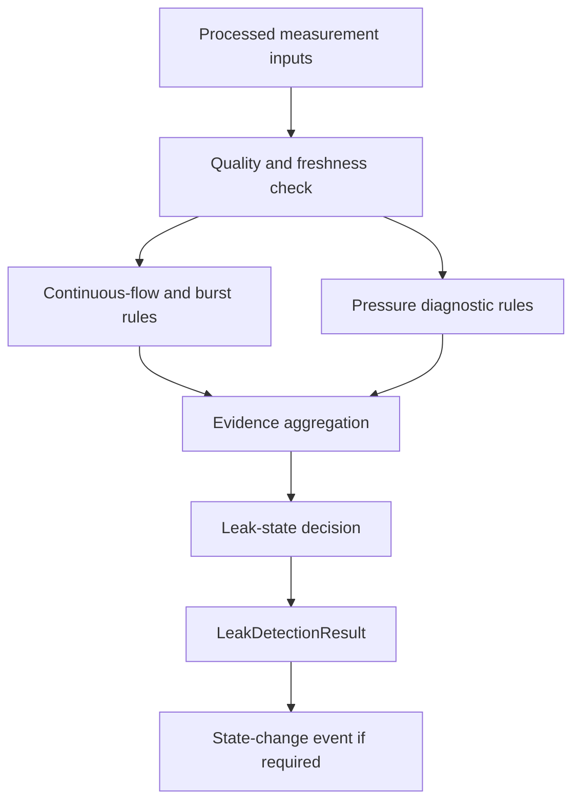
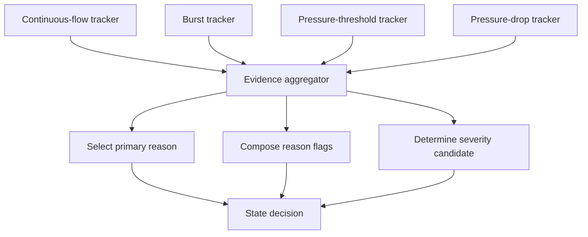
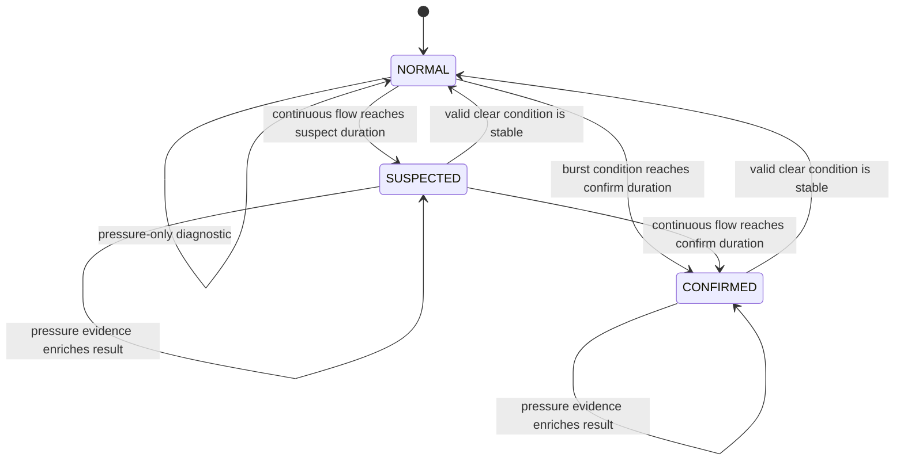

# 05 — Leak-Detection Algorithm Baseline

**Project:** Smart Water Flow and Pressure Monitor  
**Document group:** `1.docs/01_principle`  
**Document level:** Algorithm contract and MVP design  
**Status:** Proposed MVP baseline  
**Algorithm family:** Deterministic rule-based leak detection  

---

## 1. Mục tiêu

Tài liệu này chuyển kết quả nghiên cứu sản phẩm trong `04_leak_detection_product_research.md` thành một algorithm contract có thể triển khai và kiểm thử cho MVP.

Tài liệu chốt:

- Input và output của leak-detection algorithm.
- Các rule thuộc MVP.
- Cách đánh giá measurement validity và freshness.
- Cách theo dõi duration bằng monotonic time.
- Vai trò của flow, pressure và volume.
- Cách tạo evidence, reason và severity.
- State-transition direction ở mức thuật toán.
- Cách xử lý invalid/stale measurement.
- Nhóm configuration parameter và validation dependency.
- Acceptance scenarios cần được kiểm chứng trong simulation.

Tài liệu không tạo các giá trị threshold giả. Mọi parameter chưa được xác nhận bằng hardware characterization hoặc dataset phải giữ trạng thái `TBD/configurable`.

---

## 2. Cơ sở lựa chọn thuật toán

Kết quả nghiên cứu trong `04_leak_detection_product_research.md` cho thấy:

- Continuous-flow detection phù hợp với ultrasonic flow result và dễ triển khai deterministic.
- High-flow/burst detection cần rule và duration riêng để có phản ứng nhanh hơn.
- Pressure threshold/trend hữu ích cho diagnostics và supporting evidence nhưng không đủ đặc hiệu để xác nhận leak khi đứng một mình.
- Pressure-decay test cần isolation/valve hoặc controlled no-use condition mà baseline hiện không có.
- Acoustic detection chưa được xác nhận khả thi với MAX35103/hardware hiện tại.
- High-frequency pressure-signature ML cần sensor, sample rate, dataset và resource budget chưa có.

Do đó MVP chọn:

```text
Rule 1: Continuous-flow detection
Rule 2: High-flow/burst detection
Rule 3: Pressure anomaly detection
Rule 4: Flow-pressure evidence enrichment
```

Rule 4 chỉ bổ sung reason/severity trong baseline đầu tiên. Pressure một mình không chuyển leak state sang `CONFIRMED`.

---

## 3. Scope

### 3.1. Thuộc MVP baseline

```text
Forward continuous-flow evidence
Forward high-flow/burst evidence
Low/high-pressure warning
Pressure-drop/trend evidence when supported
Flow-pressure correlated evidence
NORMAL / SUSPECTED / CONFIRMED state direction
Hysteresis and duration-based debounce
Invalid/stale-input handling
Configurable parameter model
Deterministic event generation
```

### 3.2. Deferred/future

```text
Acoustic noise-floor detection
High-frequency pressure-signature classification
Machine-learning usage classification
Controlled pressure-decay test
Automatic shutoff valve control
Cloud/fleet leak localization
User-behavior learning
Time-of-day leak learning
```

---

## 4. Design Principles

1. Leak detection chỉ sử dụng processed/validated results, không đọc MAX35103 hoặc pressure sensor driver trực tiếp.
2. Flow là evidence chính của embedded MVP.
3. Pressure là diagnostic và supporting evidence, không phải điều kiện bắt buộc cho mọi leak rule.
4. Duration dùng monotonic time, không dùng RTC wall-clock.
5. Wall-clock time chỉ dùng để đóng timestamp cho event khi `TimeService` báo thời gian hợp lệ.
6. Measurement invalid không được hiểu là zero flow hoặc normal pressure.
7. Measurement stale không được tiếp tục tích lũy evidence vô hạn.
8. Một sample spike không được tạo leak/burst alarm; mọi rule cần debounce hoặc minimum duration.
9. Detection threshold và clear threshold phải tách nhau để tạo hysteresis.
10. Reporting schedule không tác động tới leak-evaluation schedule.
11. Algorithm phải deterministic, bounded và không cấp phát động trong runtime.
12. Output phải giải thích được rule/evidence nào tạo ra trạng thái.
13. `CONFIRMED` nghĩa là algorithm đã thỏa confirmation policy, không thay thế việc kiểm tra thực địa.
14. Thay đổi configuration phải atomic và có version.
15. Algorithm không tự ghi F-RAM, gửi 4G hoặc cập nhật LCD trực tiếp.

---

## 5. High-Level Algorithm



Algorithm update flow:

```text
Receive new processed measurement or evaluation tick
  -> read consistent input snapshot
  -> validate input quality and age
  -> update flow evidence trackers
  -> update pressure evidence trackers
  -> combine evidence flags
  -> evaluate state transition
  -> publish LeakDetectionResult
  -> emit state-change event only when state/reason changes
```

---

## 6. Input Contract

### 6.1. Flow input

Algorithm nhận `FlowResult` đã được calibration và publish bởi measurement pipeline.

Logical fields:

| Field | Ý nghĩa | Bắt buộc |
|---|---|---:|
| `flow_rate` | Flow rate có dấu theo direction convention | Có |
| `flow_direction` | Forward, reverse hoặc zero/unknown | Có |
| `measurement_timestamp` | Thời điểm measurement được tạo | Có nếu time valid |
| `monotonic_sample_time` | Monotonic time của sample | Có |
| `valid` | Measurement đã qua validation | Có |
| `quality_flags` | Status/quality của flow result | Có |
| `sample_sequence` | Sequence dùng phát hiện duplicate/missed sample | Khuyến nghị |

Baseline leak rules sử dụng forward flow. Reverse flow được xử lý bởi reverse-flow diagnostic riêng và không tự động được xem là leak evidence.

### 6.2. Pressure input

Algorithm nhận `PressureResult` đã validate, filter và calibration.

| Field | Ý nghĩa | Bắt buộc |
|---|---|---:|
| `pressure` | Áp suất theo canonical engineering unit | Có |
| `measurement_timestamp` | Wall-clock timestamp nếu hợp lệ | Có nếu time valid |
| `monotonic_sample_time` | Monotonic time của sample | Có |
| `valid` | Pressure result hợp lệ | Có |
| `quality_flags` | Sensor/status/filter quality | Có |
| `sample_sequence` | Sequence của pressure sample | Khuyến nghị |

Pressure input là optional đối với continuous-flow và burst rule. Pressure invalid/stale không được làm flow-based detection ngừng hoàn toàn.

### 6.3. Volume input

`VolumeState` có thể được dùng để:

- Cross-check accumulated consumption trong evidence window.
- Tính leaked-volume estimate ở future version.
- Ghi context vào event/telemetry.

MVP không dùng volume một mình để xác nhận leak vì volume không thể hiện trực tiếp flow continuity nếu sample interval không đủ chi tiết.

### 6.4. Time input

| Time source | Vai trò |
|---|---|
| Monotonic time | Evidence duration, debounce, timeout và clear duration |
| Wall-clock/UTC | Event timestamp khi time valid |
| Local time | Không dùng trong MVP leak rule |

RTC invalid không làm leak detection dừng nếu monotonic time vẫn hoạt động.

### 6.5. Configuration input

Algorithm sử dụng một immutable `LeakDetectionConfig` snapshot có version.

```text
LeakDetectionConfig
  -> validated before apply
  -> atomically replaced
  -> identified by config_version
```

---

## 7. Output Contract

Algorithm publish `LeakDetectionResult`.

| Field | Ý nghĩa |
|---|---|
| `state` | `NORMAL`, `SUSPECTED` hoặc `CONFIRMED` direction |
| `primary_reason` | Reason chính dẫn đến state hiện tại |
| `reason_flags` | Tập evidence/reason đang active |
| `severity` | Mức độ tổng hợp của condition |
| `state_since_monotonic` | Thời điểm monotonic state hiện tại bắt đầu |
| `event_timestamp` | Wall-clock timestamp nếu time valid |
| `timestamp_valid` | Cho biết `event_timestamp` có đáng tin cậy không |
| `flow_quality` | Quality/freshness của flow evidence |
| `pressure_quality` | Quality/freshness của pressure evidence |
| `flow_evidence_duration` | Thời gian flow evidence đã liên tục active |
| `pressure_evidence_duration` | Thời gian pressure evidence active nếu dùng |
| `config_version` | Version configuration dùng để đánh giá |
| `algorithm_version` | Version của algorithm contract |
| `state_change_sequence` | Sequence tăng khi state/reason quan trọng thay đổi |

`LeakDetectionResult` được publish vào `DataRepository`/`RuntimeSnapshot`. Algorithm không gửi telemetry hoặc điều khiển LCD trực tiếp.

---

## 8. Evidence and Reason Model

### 8.1. Candidate evidence flags

```text
EVIDENCE_NONE
EVIDENCE_CONTINUOUS_FLOW
EVIDENCE_HIGH_FLOW
EVIDENCE_LOW_PRESSURE
EVIDENCE_HIGH_PRESSURE
EVIDENCE_PRESSURE_DROP
EVIDENCE_FLOW_PRESSURE_CORRELATED
EVIDENCE_FLOW_DATA_DEGRADED
EVIDENCE_PRESSURE_DATA_DEGRADED
```

Tên enum chính thức sẽ được chốt trong `06_leak_detection_state_and_evidence_model.md`.

### 8.2. Candidate primary reasons

```text
LEAK_REASON_NONE
LEAK_REASON_CONTINUOUS_FLOW
LEAK_REASON_HIGH_FLOW_BURST
LEAK_REASON_FLOW_PRESSURE_CORRELATED
```

Low/high pressure without flow evidence là pressure diagnostic, không mặc định trở thành `LEAK_REASON_*`.

### 8.3. Evidence ownership

| Evidence | Owner logic | State impact MVP |
|---|---|---|
| Continuous flow | Leak algorithm flow tracker | `NORMAL → SUSPECTED → CONFIRMED` theo duration |
| High flow/burst | Leak algorithm burst tracker | Có thể `NORMAL → CONFIRMED` sau burst debounce |
| Low/high pressure | Pressure diagnostic tracker | Không xác nhận leak một mình |
| Pressure drop | Pressure trend tracker | Bổ sung reason/severity khi có flow evidence |
| Flow-pressure correlation | Evidence aggregator | Tăng độ mạnh của explanation/severity; không thay threshold flow trong baseline đầu tiên |

---

## 9. Input Quality and Freshness

### 9.1. Flow usability

Flow được xem là usable nếu:

```text
flow.valid == true
AND flow age <= maximum_flow_data_age
AND no blocking flow-quality flag
AND sample sequence is not an unhandled duplicate
```

### 9.2. Pressure usability

Pressure được xem là usable nếu:

```text
pressure.valid == true
AND pressure age <= maximum_pressure_data_age
AND no blocking pressure-quality flag
```

### 9.3. Invalid sample behavior

Invalid sample:

- Không được tính là evidence true.
- Không được tính là clear condition.
- Không tự động chuyển leak state về `NORMAL`.
- Không tiếp tục evidence timer như thể measurement hợp lệ.
- Tăng diagnostic counter phù hợp.

### 9.4. Short data gap

Một data gap ngắn không nên làm mất toàn bộ evidence ngay lập tức.

Proposed behavior:

```text
If data gap <= maximum_evidence_gap:
  pause evidence progression
  keep candidate start time/context

If data gap > maximum_evidence_gap:
  reset unconfirmed evidence tracker
  keep confirmed event/history according to state policy
```

`maximum_evidence_gap` phải liên quan đến measurement interval và được validate.

### 9.5. Confirmed state with invalid data

Nếu state đang `CONFIRMED` và flow trở thành invalid/stale:

- Không auto-clear state.
- Đánh dấu result quality degraded.
- Chờ valid clear evidence hoặc explicit recovery policy.
- Không tăng leaked-volume estimate bằng invalid flow.

---

## 10. Flow Direction Policy

Baseline:

```text
Forward positive flow -> eligible for leak rules
Zero/deadband flow     -> clear candidate if valid
Reverse flow           -> separate diagnostic, not leak evidence
Unknown direction      -> invalid for leak progression
```

Nếu project sau này cần phát hiện reverse-flow leak, phải có requirement riêng và không dùng `abs(flow)` một cách mặc định.

Flow direction convention phải được chốt trong ultrasonic/flow principle và data model.

---

## 11. Rule 1 — Continuous-Flow Detection

### 11.1. Mục tiêu

Phát hiện flow nhỏ hoặc trung bình nhưng tồn tại liên tục lâu hơn behavior bình thường.

### 11.2. Entry condition

```text
flow is usable
AND direction == FORWARD
AND flow_rate >= continuous_flow_threshold
AND flow_rate < burst_flow_threshold
```

Điều kiện `< burst_flow_threshold` dùng để phân loại reason. Nếu flow vượt burst threshold, burst rule xử lý với timing nhanh hơn.

### 11.3. Suspected condition

```text
continuous-flow entry condition remains true
for continuous_flow_suspect_duration
```

Kết quả:

```text
activate EVIDENCE_CONTINUOUS_FLOW
candidate state = SUSPECTED
primary reason = CONTINUOUS_FLOW
```

### 11.4. Confirmation condition

```text
continuous-flow entry condition remains true
for continuous_flow_confirm_duration
```

Ràng buộc:

```text
continuous_flow_confirm_duration
  >= continuous_flow_suspect_duration
```

Kết quả:

```text
state = CONFIRMED
primary reason = CONTINUOUS_FLOW
```

### 11.5. Clear condition

Hysteresis dùng threshold riêng:

```text
valid forward flow <= continuous_flow_clear_threshold
for continuous_flow_clear_duration
```

Ràng buộc:

```text
continuous_flow_clear_threshold
  < continuous_flow_threshold
```

Intermediate flow nằm giữa clear threshold và detection threshold giữ tracker ổn định theo policy được chốt trong state document; nó không được làm state dao động liên tục.

### 11.6. False-positive controls

- Minimum suspect duration.
- Separate confirmed duration.
- Hysteresis threshold.
- Sample freshness requirement.
- Optional suppression/service mode future.
- Application-specific configuration profile future.

---

## 12. Rule 2 — High-Flow/Burst Detection

### 12.1. Mục tiêu

Phát hiện flow rất lớn có khả năng liên quan đến burst, open pipe hoặc abnormal high-use condition.

### 12.2. Entry condition

```text
flow is usable
AND direction == FORWARD
AND flow_rate >= burst_flow_threshold
```

### 12.3. Confirmation condition

```text
burst entry condition remains true
for burst_confirm_duration
```

Kết quả baseline:

```text
state = CONFIRMED
primary reason = HIGH_FLOW_BURST
severity = high candidate
```

`burst_confirm_duration` vẫn phải lớn hơn zero để loại sample spike và transient ngắn.

### 12.4. Pressure enrichment

Nếu pressure usable và đồng thời có low-pressure hoặc pressure-drop evidence:

```text
add EVIDENCE_FLOW_PRESSURE_CORRELATED
add pressure-related reason flags
retain HIGH_FLOW_BURST as primary reason
```

Pressure enrichment không được bỏ qua flow debounce hoặc làm một invalid flow sample trở thành confirmed burst.

### 12.5. Clear condition

```text
valid flow <= burst_clear_threshold
for burst_clear_duration
```

Ràng buộc:

```text
burst_clear_threshold < burst_flow_threshold
```

Nếu flow giảm khỏi burst range nhưng vẫn trên continuous-flow threshold, state có thể chuyển sang continuous-flow tracking thay vì clear ngay. Transition chi tiết thuộc state/evidence document.

---

## 13. Rule 3 — Pressure Anomaly Detection

### 13.1. Mục tiêu

Tạo pressure diagnostic và supporting evidence cho leak/burst evaluation.

### 13.2. Low-pressure evidence

```text
pressure is usable
AND pressure <= pressure_low_threshold
for pressure_low_duration
```

Kết quả:

```text
pressure warning active
EVIDENCE_LOW_PRESSURE active
no leak confirmation by itself
```

### 13.3. High-pressure evidence

```text
pressure is usable
AND pressure >= pressure_high_threshold
for pressure_high_duration
```

High pressure chủ yếu là health/pressure diagnostic. Nó không phải bằng chứng leak trực tiếp.

### 13.4. Pressure-drop evidence

Nếu sensor/sample rate cho phép:

```text
pressure_drop = pressure_at_window_start - current_pressure

pressure_drop >= pressure_drop_threshold
within pressure_drop_window
```

Kết quả:

```text
EVIDENCE_PRESSURE_DROP active
support burst/leak explanation when flow evidence is present
```

Exact filter, rate-of-change equation và window implementation phụ thuộc `03_pressure_measurement_principle.md`.

### 13.5. Pressure-only behavior

Pressure anomaly khi không có flow evidence:

```text
publish pressure diagnostic
retain leak state unless another leak rule is satisfied
```

Điều này giảm false positive do utility pressure variation, pump, PRV hoặc normal multi-fixture use.

---

## 14. Rule 4 — Flow-Pressure Evidence Enrichment

### 14.1. Mục tiêu

Cho biết flow anomaly và pressure anomaly xuất hiện đồng thời/gần nhau.

### 14.2. Correlation condition

```text
flow evidence is active
AND pressure evidence is active and fresh
AND evidence timestamps are within correlation_window
```

Kết quả:

```text
activate EVIDENCE_FLOW_PRESSURE_CORRELATED
increase explanation strength/severity according to policy
do not replace primary flow reason
```

### 14.3. Baseline limitation

Trong version MVP đầu tiên:

- Pressure correlation không tự động giảm continuous-flow confirmation duration.
- Pressure correlation không xác nhận leak nếu flow evidence chưa đạt minimum validity/duration.
- Sau hardware validation, một ADR có thể cho phép pressure-assisted fast confirmation.

---

## 15. Evidence Aggregation

Evidence aggregator nhận output của các rule nhưng không tính lại raw measurement.



Primary-reason precedence đề xuất:

```text
HIGH_FLOW_BURST
  > CONTINUOUS_FLOW
  > NONE
```

Pressure reason là supporting flag trong MVP.

---

## 16. State-Transition Direction

State chi tiết thuộc `06_leak_detection_state_and_evidence_model.md`. Algorithm baseline sử dụng transition direction sau:



Rules:

- Invalid/stale data không phải clear event.
- Pressure-only evidence không chuyển leak state trong MVP.
- Current state có thể auto-clear sau valid stable-clear duration.
- Event history, counter hoặc last confirmed event không bị xóa khi current state clear.
- `CONFIRMED` chỉ là algorithm confirmation.

---

## 17. Severity Direction

Severity enum chính thức thuộc state/evidence document. Proposed mapping:

| Condition | Severity candidate |
|---|---|
| Normal | None |
| Continuous flow suspected | Low/medium |
| Continuous flow confirmed | Medium |
| Burst confirmed | High |
| Flow + pressure correlated | Same or one policy-defined level higher, capped |
| Pressure-only anomaly | Pressure diagnostic severity, separate from leak severity |

Không tạo numeric confidence score trong MVP nếu chưa có statistical calibration. Reason flags và deterministic state dễ giải thích hơn một confidence value không được kiểm chứng.

---

## 18. Parameter Model

### 18.1. Flow parameters

| Parameter | Logical unit | Ý nghĩa | Status |
|---|---|---|---|
| `continuous_flow_threshold` | Flow unit | Ngưỡng bắt đầu continuous-flow evidence | TBD/configurable |
| `continuous_flow_clear_threshold` | Flow unit | Ngưỡng clear có hysteresis | TBD/configurable |
| `continuous_flow_suspect_duration` | Seconds | Duration trước `SUSPECTED` | TBD/configurable |
| `continuous_flow_confirm_duration` | Seconds | Duration trước `CONFIRMED` | TBD/configurable |
| `continuous_flow_clear_duration` | Seconds | Duration clear ổn định | TBD/configurable |
| `burst_flow_threshold` | Flow unit | Ngưỡng high-flow/burst | TBD/configurable |
| `burst_clear_threshold` | Flow unit | Ngưỡng thoát burst range | TBD/configurable |
| `burst_confirm_duration` | Seconds | Debounce/confirmation burst | TBD/configurable |
| `burst_clear_duration` | Seconds | Duration clear burst | TBD/configurable |

### 18.2. Pressure parameters

| Parameter | Logical unit | Ý nghĩa | Status |
|---|---|---|---|
| `pressure_low_threshold` | Pressure unit | Low-pressure warning threshold | TBD/configurable |
| `pressure_high_threshold` | Pressure unit | High-pressure warning threshold | TBD/configurable |
| `pressure_low_duration` | Seconds | Low-pressure debounce | TBD/configurable |
| `pressure_high_duration` | Seconds | High-pressure debounce | TBD/configurable |
| `pressure_drop_threshold` | Pressure unit | Minimum drop trong trend window | TBD/configurable |
| `pressure_drop_window` | Seconds | Window đánh giá pressure drop | TBD/configurable |
| `pressure_evidence_clear_duration` | Seconds | Clear duration cho pressure evidence | TBD/configurable |
| `pressure_assist_enabled` | Boolean | Cho phép pressure enrichment | Default TBD |

### 18.3. Quality/time parameters

| Parameter | Logical unit | Ý nghĩa | Status |
|---|---|---|---|
| `maximum_flow_data_age` | Seconds/ms | Flow age tối đa được dùng | TBD/configurable |
| `maximum_pressure_data_age` | Seconds/ms | Pressure age tối đa được dùng | TBD/configurable |
| `maximum_evidence_gap` | Seconds/ms | Gap tối đa được pause tracker | TBD/configurable |
| `correlation_window` | Seconds/ms | Khoảng gần nhau của flow/pressure evidence | TBD/configurable |

### 18.4. Parameter dependencies

Configuration validation phải bảo đảm tối thiểu:

```text
continuous_flow_clear_threshold < continuous_flow_threshold
continuous_flow_threshold < burst_flow_threshold
burst_clear_threshold < burst_flow_threshold
continuous_flow_suspect_duration <= continuous_flow_confirm_duration
all duration values > 0
maximum_flow_data_age >= expected_flow_sample_interval
maximum_pressure_data_age >= expected_pressure_sample_interval
maximum_evidence_gap is bounded
pressure_low_threshold < pressure_high_threshold
```

Canonical flow/pressure unit phải được chốt trước khi serialize configuration.

---

## 19. Configuration Apply Policy

Leak parameters được cập nhật qua configuration pipeline:

```text
BLE request
  -> PendingConfig
  -> type/range/dependency validation
  -> persistent commit
  -> ActiveConfig
  -> atomic LeakDetectionConfig update
```

Khi config version thay đổi:

- Apply tại algorithm evaluation boundary, không giữa một update.
- Reset unconfirmed evidence timers để tránh trộn hai parameter set.
- Không xóa event history/counter.
- Không âm thầm clear một confirmed current state chỉ vì threshold đổi.
- Confirmed state tiếp tục cho đến khi có valid clear evidence theo config mới hoặc service policy.
- Publish `config_version` trong `LeakDetectionResult`.
- Tăng config-change diagnostic counter nếu cần.

---

## 20. Evaluation Timing

Algorithm có thể được đánh giá khi:

```text
New FlowResult published
New PressureResult published
Periodic leak-evaluation tick
Configuration applied
Measurement-quality state changed
```

Rules:

- Flow duration chỉ tiến khi flow evidence dựa trên sample usable và không vượt maximum gap.
- Pressure update không được làm flow duration được cộng hai lần.
- Duration tính từ monotonic timestamps, không đếm số sample.
- Duplicate sample sequence không được đánh giá như sample mới.
- Periodic tick chỉ kiểm tra timeout/freshness/state; không tạo measurement giả.

---

## 21. Pseudocode-Level Behavior

Đây là behavioral pseudocode, không phải firmware implementation bắt buộc:

```text
function EvaluateLeak(inputs, config, now_monotonic):
    flow_status     = EvaluateFlowUsability(inputs.flow, config, now_monotonic)
    pressure_status = EvaluatePressureUsability(inputs.pressure, config, now_monotonic)

    UpdateContinuousFlowTracker(flow_status, inputs.flow, config, now_monotonic)
    UpdateBurstTracker(flow_status, inputs.flow, config, now_monotonic)
    UpdatePressureTrackers(pressure_status, inputs.pressure, config, now_monotonic)

    evidence = AggregateEvidence(trackers, config, now_monotonic)
    next_state = DecideState(current_state, evidence, config, now_monotonic)

    result = BuildLeakDetectionResult(
        next_state,
        evidence,
        input_quality,
        config_version,
        algorithm_version)

    if state or important reason changed:
        PostStateChangeEvent(result)

    PublishResult(result)
```

Implementation C cụ thể thuộc `03_firmware`.

---

## 22. Arithmetic and Resource Requirements

Algorithm phải:

- Có execution time bounded.
- Không dùng dynamic allocation trong evaluation path.
- Sử dụng integer/fixed-point representation phù hợp nếu tránh floating point.
- Dùng saturating duration/counter hoặc overflow-safe timestamp subtraction.
- Không lưu toàn bộ history khi chỉ cần start time/running duration.
- Pressure trend buffer phải có size compile-time hoặc bounded config.
- Không block measurement, BLE hoặc 4G service.
- Không thực hiện persistent write trong evaluation function.

Minimum runtime state dự kiến:

```text
Current leak state
Current primary reason and reason flags
Continuous-flow tracker start/active state
Burst tracker start/active state
Pressure-low/high tracker
Optional pressure-trend window
Clear-condition tracker
Last processed flow/pressure sequence
Current config version
State-change sequence
Diagnostic counters
```

---

## 23. Reporting and Communication Independence

Leak evaluation và telemetry reporting là hai pipeline độc lập:

```text
Measurement update
  -> leak evaluation
  -> LeakDetectionResult
  -> RuntimeSnapshot

RTC/report schedule
  -> REPORT_DUE
  -> read RuntimeSnapshot
  -> TelemetryRecord
```

Quy tắc:

- Reporting window không thay đổi leak threshold/duration.
- Không chờ report interval mới chạy leak detection.
- Leak state change có thể tạo event; event có được gửi ngay hay chờ scheduled report thuộc communication policy.
- 4G offline không làm leak algorithm ngừng hoạt động.
- BLE chỉ thay đổi parameter qua configuration pipeline.

---

## 24. Diagnostic Counters

Candidate counters:

```text
leak_eval_count
continuous_evidence_start_count
burst_evidence_count
pressure_anomaly_count
flow_invalid_eval_count
pressure_invalid_eval_count
flow_stale_count
pressure_stale_count
evidence_gap_reset_count
leak_suspected_transition_count
leak_confirmed_transition_count
leak_clear_transition_count
config_apply_count
```

Counter width, persistence và exposure thuộc firmware/data-model documents.

---

## 25. Acceptance Scenarios

### 25.1. Zero-flow normal condition

```text
Given valid flow remains below clear threshold
When algorithm runs for longer than all suspect durations
Then leak state remains NORMAL
And no continuous/burst evidence is active
```

### 25.2. Intermittent legitimate use

```text
Given forward flow rises above continuous threshold
But returns below clear threshold before suspect duration
When clear condition remains stable
Then pending continuous-flow evidence is cleared
And state remains NORMAL
```

### 25.3. Continuous-flow suspected

```text
Given valid forward flow stays above continuous threshold
When suspect duration is reached but confirm duration is not reached
Then state becomes SUSPECTED
And primary reason is CONTINUOUS_FLOW
```

### 25.4. Continuous-flow confirmed

```text
Given valid forward flow remains above continuous threshold
When confirm duration is reached
Then state becomes CONFIRMED
And primary reason is CONTINUOUS_FLOW
```

### 25.5. Burst confirmation

```text
Given valid forward flow exceeds burst threshold
When burst confirm duration is reached
Then state becomes CONFIRMED
And primary reason is HIGH_FLOW_BURST
```

### 25.6. Pressure anomaly only

```text
Given pressure is valid and below pressure-low threshold
And no flow evidence is active
When pressure debounce duration is reached
Then pressure diagnostic becomes active
But leak state does not become CONFIRMED
```

### 25.7. Flow-pressure correlation

```text
Given flow evidence is active
And a valid pressure-drop evidence occurs within correlation window
When evidence is aggregated
Then FLOW_PRESSURE_CORRELATED flag is set
And primary flow reason remains unchanged
```

### 25.8. Invalid flow sample

```text
Given a flow evidence timer is running
When an invalid flow sample arrives
Then invalid sample is not counted as evidence or clear
And tracker follows maximum-evidence-gap policy
```

### 25.9. Stale pressure during continuous flow

```text
Given continuous-flow rule is active
And pressure data becomes stale
When algorithm evaluates inputs
Then flow-based detection continues
And pressure evidence is marked unavailable/degraded
```

### 25.10. RTC invalid

```text
Given RTC/wall-clock time is invalid
And monotonic time is valid
When continuous or burst condition occurs
Then leak detection continues normally
And event timestamp is marked invalid
```

### 25.11. Stable clear

```text
Given state is SUSPECTED or CONFIRMED
When valid flow remains below clear threshold for clear duration
Then current state returns to NORMAL
And historical transition counter/event is retained
```

### 25.12. Configuration update

```text
Given unconfirmed evidence is active
When a valid new LeakDetectionConfig is committed and applied
Then unconfirmed trackers reset at an evaluation boundary
And result reports the new config version
```

---

## 26. Required Simulation Datasets

```text
DS-LEAK-001  Stable zero flow with noise near zero
DS-LEAK-002  Intermittent normal household/process usage
DS-LEAK-003  Long legitimate continuous usage
DS-LEAK-004  Small continuous leak candidate
DS-LEAK-005  Medium sustained leak candidate
DS-LEAK-006  Sudden burst/high-flow condition
DS-LEAK-007  Flow spike shorter than burst debounce
DS-LEAK-008  Low pressure without abnormal flow
DS-LEAK-009  Pressure drop with continuous flow
DS-LEAK-010  Pressure drop with burst flow
DS-LEAK-011  Invalid/stale flow samples during evidence
DS-LEAK-012  Invalid/stale pressure during flow evidence
DS-LEAK-013  Reverse-flow scenario
DS-LEAK-014  Configuration change during suspected state
DS-LEAK-015  Monotonic timer wrap/long-duration case
```

Dataset value ranges phải dựa trên selected hardware và test rig; danh sách này chỉ định scenario semantics.

---

## 27. Requirement Candidates

| ID | Requirement candidate |
|---|---|
| `PR-LD-001` | Algorithm chỉ sử dụng validated/processed measurement results. |
| `PR-LD-002` | Continuous-flow rule phải dùng threshold, suspect duration, confirm duration và clear hysteresis. |
| `PR-LD-003` | Burst rule phải có threshold và non-zero debounce duration riêng. |
| `PR-LD-004` | Pressure anomaly một mình không được xác nhận leak trong MVP. |
| `PR-LD-005` | Pressure evidence phải được bỏ qua khi invalid/stale mà không vô hiệu hóa flow-only rule. |
| `PR-LD-006` | Evidence duration phải sử dụng monotonic time. |
| `PR-LD-007` | Invalid sample không được tính là evidence hoặc clear condition. |
| `PR-LD-008` | Reporting schedule không được điều khiển leak-evaluation interval. |
| `PR-LD-009` | Algorithm output phải chứa state, reason, severity, quality và config/algorithm version. |
| `PR-LD-010` | Configuration phải được validate và apply atomic. |
| `PR-LD-011` | Algorithm evaluation phải bounded và không dynamic allocation. |
| `PR-LD-012` | Mọi state transition phải có deterministic acceptance scenario. |

Các requirement candidate sẽ được map sang `SR/FW/TC` trong traceability documents.

---

## 28. Open Questions

| ID | Câu hỏi | Ảnh hưởng |
|---|---|---|
| `OQ-LA-001` | Canonical flow và pressure unit là gì? | Parameter/data serialization |
| `OQ-LA-002` | Minimum reliable forward flow là bao nhiêu? | Continuous threshold lower bound |
| `OQ-LA-003` | Maximum expected legitimate flow là bao nhiêu? | Burst threshold |
| `OQ-LA-004` | Flow sample interval và allowed sample jitter là bao nhiêu? | Freshness/gap/duration |
| `OQ-LA-005` | Pressure sensor model, noise và sample rate là gì? | Pressure threshold/trend |
| `OQ-LA-006` | Pressure trend có thuộc MVP ngay hay chỉ absolute warning? | Rule 3 scope |
| `OQ-LA-007` | Confirmed current state auto-clear hay cần latch/ack? | State model |
| `OQ-LA-008` | Có cần suppression/service override cho legitimate continuous use không? | False-positive mitigation |
| `OQ-LA-009` | Event state change có yêu cầu immediate 4G report không? | Communication policy |
| `OQ-LA-010` | Parameter nào được phép cấu hình qua BLE và permission level là gì? | Communication/security |
| `OQ-LA-011` | Leak severity mapping chính thức là gì? | LCD/telemetry data model |
| `OQ-LA-012` | Có cần estimated leaked volume không? | Volume/event model |

---

## 29. Relationship to Other Documents

| Tài liệu | Quan hệ |
|---|---|
| `README.md` | Scope và documentation map của nhóm principle |
| `03_pressure_measurement_principle.md` | Pressure validation, filtering và trend equation |
| `04_leak_detection_product_research.md` | Evidence và rationale cho lựa chọn MVP |
| `06_leak_detection_state_and_evidence_model.md` | Chốt enum, transition, severity, reason và latch/clear policy |
| `07_algorithm_validation_plan.md` | Dataset, golden model và acceptance tests |
| `../00_overview/glossary.md` | Canonical terms và data object names |
| `../00_overview/08_data_flow.md` | Data ownership và pipeline integration |
| `../00_overview/09_error_handling_overview.md` | Error/quality mapping |
| `../00_overview/13_reporting_and_connectivity_policy.md` | Event delivery policy, không điều khiển leak evaluation |
| `../03_firmware/` | C implementation, service API, timer và integration |
| `../08_simulation/` | Emulator, datasets, golden model và fault injection |

---

## 30. Maintenance Rules

- Không thay threshold `TBD` bằng số cụ thể nếu chưa có source hoặc hardware/dataset rationale.
- Khi đổi rule semantics, cập nhật acceptance scenarios và validation plan.
- Khi đổi state/reason enum, cập nhật state/evidence document, glossary, LCD, BLE và telemetry data model.
- Khi pressure sensor được chọn, cập nhật pressure parameter range và freshness constraint.
- Khi measurement interval thay đổi, review maximum age, maximum gap và all duration behavior.
- Khi thêm suppression/learning/ML, phải có ADR và validation dataset riêng.
- Khi thêm acoustic method, không gộp vào rule-based baseline nếu chưa có hardware feasibility.
- Mọi algorithm version thay đổi behavior phải tăng `algorithm_version`.

---

## 31. Completion Criteria

Algorithm baseline được xem là sẵn sàng chuyển sang firmware design khi:

1. Flow/pressure canonical units được chốt.
2. Sensor sample interval và freshness requirement được chốt.
3. Mỗi parameter có valid range và default source hoặc ghi rõ product-profile input.
4. State/reason/severity model được chốt trong document 06.
5. Invalid/stale/gap behavior được unit-testable.
6. Rule conflict và primary-reason precedence được chốt.
7. Configuration apply behavior được chốt.
8. Acceptance scenarios có dataset/golden-model mapping.
9. Resource budget phù hợp STM32L433RCT6.
10. Traceability map từ requirement tới firmware/test được tạo.

---

## 32. Kết luận

MVP leak-detection algorithm sử dụng flow làm evidence chính và pressure làm diagnostic/supporting evidence:

```text
Valid forward flow
  -> continuous-flow tracker
  -> high-flow/burst tracker

Valid pressure
  -> low/high-pressure tracker
  -> optional pressure-drop tracker

All evidence
  -> reason/severity aggregation
  -> NORMAL / SUSPECTED / CONFIRMED decision
  -> LeakDetectionResult
```

Continuous-flow rule phát hiện condition kéo dài. Burst rule phản ứng nhanh hơn với high-flow condition. Pressure-only anomaly không xác nhận leak trong MVP, nhưng cung cấp diagnostic và correlated evidence khi flow anomaly đồng thời tồn tại.

Tài liệu tiếp theo phải chốt chi tiết state, evidence lifetime, reason precedence, severity và latch/clear behavior:

```text
06_leak_detection_state_and_evidence_model.md
```
