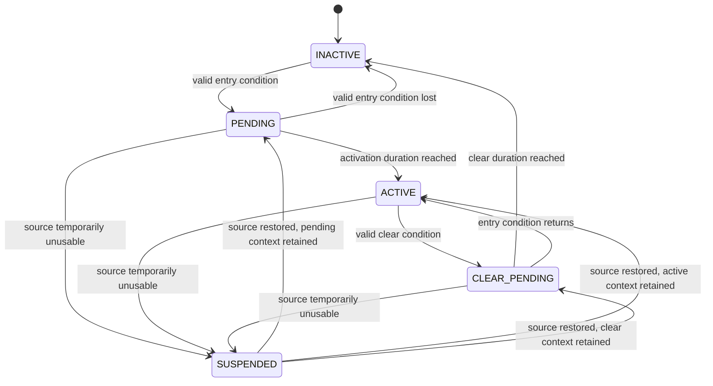
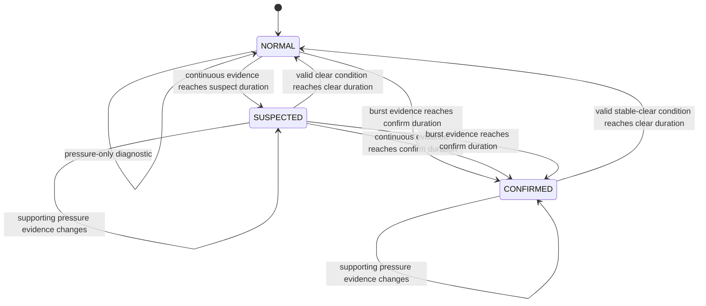

# 06 — Leak-Detection State and Evidence Model

**Project:** Smart Water Flow and Pressure Monitor  
**Document group:** `1.docs/01_principle`  
**Document level:** State, evidence and event contract  
**Status:** Proposed MVP baseline  

---

## 1. Mục tiêu

Tài liệu này định nghĩa state model và evidence model cho thuật toán leak detection được chọn trong `05_leak_detection_algorithm_baseline.md`.

Tài liệu chốt:

- `LeakState` và ý nghĩa của từng state.
- `LeakEvaluationStatus` để tách khả năng đánh giá khỏi leak state.
- Evidence type, evidence phase và evidence lifetime.
- State-transition conditions.
- Primary reason và reason-flag precedence.
- Leak severity và pressure diagnostic severity.
- Clear, latch và event-history policy.
- Hành vi khi flow/pressure invalid hoặc stale.
- Event generation và idempotence.
- Data contract cho `LeakDetectionResult`.
- Mapping dự kiến sang LCD, BLE, telemetry và diagnostics.

Threshold và duration số học tiếp tục giữ `TBD/configurable`. Tài liệu này chốt semantics, không chốt giá trị calibration cuối cùng.

---

## 2. Design Goals

State/evidence model phải:

1. Phân biệt rõ trạng thái leak với trạng thái sensor/data quality.
2. Không xem pressure anomaly một mình là confirmed leak trong MVP.
3. Cho phép continuous-flow và burst rule có timing khác nhau.
4. Không auto-clear leak chỉ vì sensor bị invalid hoặc mất dữ liệu.
5. Sử dụng monotonic time cho duration và debounce.
6. Tạo event đúng một lần cho mỗi transition quan trọng.
7. Giải thích được state bằng primary reason và evidence flags.
8. Cho phép LCD, BLE và telemetry đọc cùng một semantic model.
9. Không phụ thuộc reporting interval hoặc 4G connectivity.
10. Có thể triển khai deterministic với fixed memory trên STM32L433RCT6.

---

## 3. Separation of Concerns

Model tách ba khái niệm:

```text
LeakState
  -> kết luận hiện tại của leak algorithm

LeakEvaluationStatus
  -> algorithm hiện có đủ dữ liệu để đánh giá hay không

EvidenceTracker
  -> từng điều kiện flow/pressure đang phát triển như thế nào
```

Ví dụ:

```text
LeakState            = CONFIRMED
LeakEvaluationStatus = DEGRADED
Reason               = CONTINUOUS_FLOW
PressureQuality      = STALE
```

Nghĩa là leak đã được algorithm xác nhận từ flow, nhưng pressure hiện không còn đủ mới để hỗ trợ đánh giá.

---

## 4. LeakState Model

### 4.1. Canonical states

```text
LEAK_STATE_NORMAL
LEAK_STATE_SUSPECTED
LEAK_STATE_CONFIRMED
```

### 4.2. State definitions

| State | Định nghĩa | Điều không được suy ra |
|---|---|---|
| `NORMAL` | Không có flow-based evidence nào đã đạt suspect/confirm condition; hoặc valid clear condition đã hoàn tất. | Không có nghĩa mọi sensor đều valid. |
| `SUSPECTED` | Continuous-flow evidence đã đạt suspect duration nhưng chưa đạt confirm duration. | Không có nghĩa leak đã được kiểm tra thực địa. |
| `CONFIRMED` | Continuous-flow evidence đạt confirm duration hoặc burst evidence đạt burst confirm condition. | Không có nghĩa vị trí/nguyên nhân vật lý đã được xác định chắc chắn. |

`CONFIRMED` là **algorithm-confirmed condition**, không phải physical inspection result.

### 4.3. Initial state

Sau boot/reset:

```text
LeakState            = NORMAL
LeakEvaluationStatus = NOT_READY
```

Consumer phải đọc cả hai field. `NORMAL + NOT_READY` không được hiển thị như một kết luận “không có rò rỉ” đã được kiểm chứng.

---

## 5. LeakEvaluationStatus Model

### 5.1. Canonical statuses

```text
LEAK_EVAL_NOT_READY
LEAK_EVAL_ACTIVE
LEAK_EVAL_DEGRADED
LEAK_EVAL_UNAVAILABLE
```

### 5.2. Status definitions

| Status | Định nghĩa |
|---|---|
| `NOT_READY` | Algorithm chưa nhận đủ valid flow context sau boot/config reset. |
| `ACTIVE` | Flow data đủ valid/fresh để đánh giá toàn bộ flow-based rules; pressure được dùng nếu available. |
| `DEGRADED` | Flow vẫn usable nhưng pressure hoặc supporting input khác invalid/stale/unavailable. |
| `UNAVAILABLE` | Flow không usable quá giới hạn; algorithm không thể progress hoặc clear leak state. |

### 5.3. Evaluation-status precedence

```text
Flow unavailable/stale beyond allowed gap
  -> UNAVAILABLE

Flow usable, pressure unavailable/stale
  -> DEGRADED

Flow usable, pressure usable or pressure assist disabled
  -> ACTIVE

No initial valid flow context
  -> NOT_READY
```

Pressure unavailable không làm status `UNAVAILABLE` vì flow-only rules vẫn thuộc MVP.

---

## 6. Evidence Types

### 6.1. Canonical evidence types

```text
LEAK_EVIDENCE_CONTINUOUS_FLOW
LEAK_EVIDENCE_HIGH_FLOW
LEAK_EVIDENCE_LOW_PRESSURE
LEAK_EVIDENCE_HIGH_PRESSURE
LEAK_EVIDENCE_PRESSURE_DROP
LEAK_EVIDENCE_FLOW_PRESSURE_CORRELATED
```

### 6.2. Evidence roles

| Evidence | Nguồn | Vai trò state MVP |
|---|---|---|
| `CONTINUOUS_FLOW` | Valid forward flow vượt continuous threshold | Có thể tạo `SUSPECTED` và `CONFIRMED` theo duration |
| `HIGH_FLOW` | Valid forward flow vượt burst threshold | Có thể tạo `CONFIRMED` sau burst debounce |
| `LOW_PRESSURE` | Valid pressure dưới low threshold | Diagnostic/supporting evidence |
| `HIGH_PRESSURE` | Valid pressure trên high threshold | Pressure diagnostic, không phải leak evidence chính |
| `PRESSURE_DROP` | Valid pressure giảm vượt threshold trong trend window | Supporting evidence cho flow anomaly |
| `FLOW_PRESSURE_CORRELATED` | Flow evidence và pressure evidence gần nhau | Enrichment flag và severity context |

### 6.3. Data-quality flags are not leak evidence

Các trạng thái sau không phải evidence type:

```text
FLOW_INVALID
FLOW_STALE
PRESSURE_INVALID
PRESSURE_STALE
TIME_INVALID
```

Chúng thuộc measurement/evaluation quality và được publish riêng.

---

## 7. EvidencePhase Model

Mỗi evidence tracker sử dụng phase:

```text
EVIDENCE_INACTIVE
EVIDENCE_PENDING
EVIDENCE_ACTIVE
EVIDENCE_CLEAR_PENDING
EVIDENCE_SUSPENDED
```

### 7.1. Phase definitions

| Phase | Định nghĩa |
|---|---|
| `INACTIVE` | Entry condition không active và không có timer đang chạy. |
| `PENDING` | Entry condition đang true nhưng chưa đạt activation duration. |
| `ACTIVE` | Evidence đã đạt activation duration. |
| `CLEAR_PENDING` | Clear condition đang true nhưng chưa đạt clear duration. |
| `SUSPENDED` | Tracker không thể progress/clear do source data invalid/stale trong short-gap policy. |

### 7.2. Generic evidence-tracker FSM



Nếu unusable gap vượt `maximum_evidence_gap`, unconfirmed tracker context được reset. Confirmed leak state không được auto-clear vì gap.

---

## 8. EvidenceTracker Data Model

Logical fields:

| Field | Ý nghĩa |
|---|---|
| `type` | Evidence type |
| `phase` | Current evidence phase |
| `source_quality` | Quality/freshness của input source |
| `entry_start_monotonic` | Thời điểm entry condition bắt đầu |
| `active_since_monotonic` | Thời điểm evidence trở thành active |
| `clear_start_monotonic` | Thời điểm clear condition bắt đầu |
| `last_valid_sample_monotonic` | Thời điểm source sample hợp lệ gần nhất |
| `last_source_sequence` | Sequence sample đã xử lý gần nhất |
| `accumulated_duration` | Duration logic nếu implementation không dùng start subtraction trực tiếp |
| `suspended_from_phase` | Phase cần phục hồi sau short gap |
| `activation_count` | Diagnostic count tùy implementation |

Evidence tracker phải bounded và không giữ toàn bộ measurement history nếu rule chỉ cần duration.

Pressure-drop tracker có thể cần một bounded history/window riêng được định nghĩa trong pressure principle.

---

## 9. Primary Reason Model

### 9.1. Canonical primary reasons

```text
LEAK_REASON_NONE
LEAK_REASON_CONTINUOUS_FLOW
LEAK_REASON_HIGH_FLOW_BURST
```

`FLOW_PRESSURE_CORRELATED` là supporting flag, không thay thế primary flow reason trong MVP.

### 9.2. Reason precedence

```text
HIGH_FLOW_BURST
  > CONTINUOUS_FLOW
  > NONE
```

Nếu burst evidence active trong khi continuous-flow evidence cũng active:

```text
primary_reason = HIGH_FLOW_BURST
reason_flags include CONTINUOUS_FLOW and HIGH_FLOW
```

Khi burst condition kết thúc nhưng flow vẫn nằm trên continuous threshold, state không clear chỉ vì primary reason burst không còn active. Continuous-flow tracker tiếp tục quyết định state/clear path.

---

## 10. Reason Flags

Candidate bit flags:

```text
LEAK_REASON_FLAG_CONTINUOUS_FLOW
LEAK_REASON_FLAG_HIGH_FLOW
LEAK_REASON_FLAG_LOW_PRESSURE
LEAK_REASON_FLAG_HIGH_PRESSURE
LEAK_REASON_FLAG_PRESSURE_DROP
LEAK_REASON_FLAG_FLOW_PRESSURE_CORRELATED
LEAK_REASON_FLAG_FLOW_QUALITY_DEGRADED
LEAK_REASON_FLAG_PRESSURE_QUALITY_DEGRADED
LEAK_REASON_FLAG_TIME_INVALID
```

Reason flags mô tả context hiện tại. Event history phải lưu snapshot của reason flags tại thời điểm transition để context không bị mất khi current flags thay đổi.

---

## 11. Severity Model

### 11.1. Canonical leak severity

```text
LEAK_SEVERITY_NONE
LEAK_SEVERITY_LOW
LEAK_SEVERITY_MEDIUM
LEAK_SEVERITY_HIGH
```

### 11.2. Baseline mapping

| State/reason | Leak severity |
|---|---|
| `NORMAL` | `NONE` |
| `SUSPECTED + CONTINUOUS_FLOW` | `LOW` |
| `CONFIRMED + CONTINUOUS_FLOW` | `MEDIUM` |
| `CONFIRMED + HIGH_FLOW_BURST` | `HIGH` |

### 11.3. Pressure enrichment

Pressure correlation có thể bổ sung context nhưng baseline đầu tiên không thay đổi state transition.

Proposed severity rule:

```text
If leak state is SUSPECTED or CONFIRMED
AND FLOW_PRESSURE_CORRELATED is active
Then severity may be elevated by one level
But never above HIGH
```

Việc enable severity elevation phải là policy rõ ràng; nếu chưa chốt, chỉ publish correlation flag và giữ baseline severity.

### 11.4. Pressure diagnostic severity

Pressure diagnostic severity phải là field/diagnostic riêng, không ghi đè leak severity khi leak state `NORMAL`.

---

## 12. High-Level State Machine



---

## 13. State-Transition Table

| ID | From | Guard/event | Action | To |
|---|---|---|---|---|
| `LT-001` | Initial | System/algorithm init | Reset runtime trackers; evaluation `NOT_READY` | `NORMAL` |
| `LT-002` | `NORMAL` | Continuous evidence reaches suspect duration | Set primary reason continuous; create suspected event | `SUSPECTED` |
| `LT-003` | `NORMAL` | Burst evidence reaches confirm duration | Set burst reason/severity; create confirmed event | `CONFIRMED` |
| `LT-004` | `SUSPECTED` | Continuous evidence reaches confirm duration | Promote severity; create confirmed event | `CONFIRMED` |
| `LT-005` | `SUSPECTED` | Burst evidence reaches confirm duration | Replace primary reason with burst; create confirmed event | `CONFIRMED` |
| `LT-006` | `SUSPECTED` | Valid clear condition reaches clear duration | Create cleared event; retain history/counter | `NORMAL` |
| `LT-007` | `CONFIRMED` | Valid stable-clear condition reaches clear duration | Create cleared event; retain confirmed history/counter | `NORMAL` |
| `LT-008` | Any | Pressure-only evidence changes | Update diagnostic/reason flags only | Same state |
| `LT-009` | Any | Source temporarily unusable | Update evaluation status; suspend relevant trackers | Same state |
| `LT-010` | Any | Configuration version changes | Reset unconfirmed trackers; preserve event history | State per config-apply policy |

---

## 14. NORMAL State Behavior

`NORMAL` means no flow evidence has reached a state-changing threshold.

Entry actions:

- Clear current primary leak reason.
- Set leak severity `NONE`.
- Preserve pressure diagnostic flags separately.
- Preserve last confirmed event and counters.
- Publish state-change sequence when entering from suspected/confirmed.

While `NORMAL`:

- Continuous tracker may be `INACTIVE` or `PENDING`.
- Burst tracker may be `INACTIVE` or `PENDING`.
- Pressure evidence may be active without changing leak state.
- Evaluation status may be `NOT_READY`, `ACTIVE`, `DEGRADED` hoặc `UNAVAILABLE`.

Consumer must not show `NORMAL` as reliable when evaluation status is `NOT_READY` or `UNAVAILABLE`.

---

## 15. SUSPECTED State Behavior

`SUSPECTED` is entered only by continuous-flow evidence in MVP.

Entry condition:

```text
Continuous-flow entry condition remains true
until continuous_flow_suspect_duration
```

Entry actions:

- Set state `SUSPECTED`.
- Set primary reason `CONTINUOUS_FLOW`.
- Set severity `LOW`.
- Capture state start monotonic time.
- Capture wall-clock timestamp if valid.
- Increment state-change sequence.
- Create one suspected transition event.

While `SUSPECTED`:

- Continuous tracker progresses toward confirm duration.
- Burst evidence may escalate directly to `CONFIRMED`.
- Pressure evidence enriches flags/context only.
- Invalid/stale flow suspends progress; it does not clear state.
- Valid clear flow starts clear timer.

Exit:

- To `CONFIRMED` on continuous confirm or burst confirm.
- To `NORMAL` only after valid clear condition reaches clear duration.

---

## 16. CONFIRMED State Behavior

`CONFIRMED` is entered by:

```text
Continuous-flow confirm duration reached
OR burst confirm duration reached
```

Entry actions:

- Set primary reason based on reason precedence.
- Set severity `MEDIUM` for continuous flow or `HIGH` for burst.
- Capture state start monotonic time.
- Capture wall-clock timestamp if valid.
- Increment state-change sequence.
- Increment confirmed-event counter.
- Create exactly one confirmed transition event.

While `CONFIRMED`:

- Update current reason flags and quality.
- Do not repeatedly create confirmed event on every sample.
- Pressure correlation may enrich severity/context.
- Invalid/stale flow does not clear state.
- Flow returning below burst threshold but remaining above continuous threshold keeps leak condition active.
- Clear timer starts only from valid stable clear flow.

Exit:

- Current state returns to `NORMAL` after valid clear condition reaches required duration.
- Confirmed event history/counter remains available.

---

## 17. Clear Policy

### 17.1. Current-state auto-clear

MVP baseline chọn:

```text
Current LeakState auto-clears after valid stable-clear evidence.
Historical event/counter is retained.
```

Không yêu cầu user/server acknowledgement để current state trở về `NORMAL`.

### 17.2. Valid clear condition

Clear chỉ được đánh giá khi flow usable:

```text
direction is FORWARD or valid ZERO state
AND flow_rate <= continuous_flow_clear_threshold
AND condition remains true for clear duration
```

Reverse, unknown, invalid hoặc stale flow không phải clear evidence.

### 17.3. Clear durations

```text
SUSPECTED clear
  -> continuous_flow_clear_duration

CONFIRMED clear
  -> confirmed_leak_clear_duration
```

Nếu project không muốn thêm parameter mới, `confirmed_leak_clear_duration` có thể map với `continuous_flow_clear_duration`; mapping phải được chốt trong configuration model.

### 17.4. Burst-to-continuous fallback

Khi burst condition kết thúc nhưng continuous-flow condition vẫn true:

- Không clear `CONFIRMED`.
- Remove active burst evidence sau burst clear policy.
- Continuous evidence tiếp tục.
- Primary reason có thể giữ `HIGH_FLOW_BURST` cho current event context hoặc chuyển về continuous reason theo reason-update policy.

Baseline đề xuất giữ event primary reason là burst trong historical event, nhưng current primary reason có thể chuyển thành continuous flow nếu burst evidence đã clear.

---

## 18. Latch and History Policy

Tách ba lớp:

```text
Current state
  -> auto-clear theo valid clear condition

Last confirmed event
  -> giữ snapshot của confirmed transition gần nhất

Confirmed event counter/history
  -> giữ theo storage/diagnostic policy
```

### 18.1. LastLeakEvent

Logical fields:

```text
event_sequence
event_type
state_from
state_to
primary_reason
reason_flags
severity
event_timestamp
timestamp_valid
monotonic_event_time
flow_value
pressure_value if usable
flow_quality
pressure_quality
config_version
algorithm_version
```

### 18.2. Persistence

MVP algorithm không tự ghi persistent storage.

`StorageService` có thể lưu:

- Confirmed event counter.
- Last confirmed event compact record.
- Last clear event nếu storage budget cho phép.

Suspected runtime timer/evidence tracker không bắt buộc persist qua reboot.

### 18.3. Reboot behavior

Proposed baseline:

```text
After reboot:
- Current state starts NORMAL + NOT_READY
- Runtime evidence timers reset
- Last confirmed event/counter may be restored separately
- New valid data must re-establish current leak state
```

Điều này tránh phục hồi một runtime state cũ như thể condition vẫn đang active, đồng thời không làm mất lịch sử confirmed event.

---

## 19. Event Model

### 19.1. Logical event types

```text
LEAK_EVENT_SUSPECTED
LEAK_EVENT_CONFIRMED
LEAK_EVENT_CLEARED
LEAK_EVENT_REASON_CHANGED
LEAK_EVENT_EVALUATION_DEGRADED
LEAK_EVENT_EVALUATION_RESTORED
```

Tên application event `EVT_*` cụ thể thuộc firmware document.

### 19.2. Event emission rules

- Emit suspected event once when entering `SUSPECTED`.
- Emit confirmed event once when entering `CONFIRMED`.
- Emit cleared event once when leaving suspected/confirmed to `NORMAL`.
- Do not re-emit confirmed event for every sample while state remains confirmed.
- Reason-changed event chỉ được emit nếu primary reason hoặc policy-significant reason flag thay đổi.
- Evaluation degraded/restored event phải rate-limit/debounce để tránh event storm.

### 19.3. Idempotence

Mỗi state-change event có `event_sequence`.

Consumers dùng sequence để:

- Không xử lý duplicate event hai lần.
- Map event sang telemetry/storage.
- Phát hiện missed event nếu cần.

---

## 20. Invalid and Stale Data Behavior

### 20.1. Flow invalid/stale

| Current state | Behavior |
|---|---|
| `NORMAL` | Evaluation `NOT_READY/UNAVAILABLE`; không tạo evidence mới |
| `SUSPECTED` | Giữ state; suspend tracker; không confirm hoặc clear |
| `CONFIRMED` | Giữ state; mark degraded/unavailable; không clear |

Nếu gap vượt `maximum_evidence_gap`:

- Reset unconfirmed evidence duration context.
- `SUSPECTED` vẫn giữ cho đến khi valid data cho phép confirm hoặc clear; không dùng invalid gap như clear.
- Firmware có thể tạo evaluation-unavailable warning.

### 20.2. Pressure invalid/stale

- Clear active pressure evidence theo unusable policy, không theo valid hydraulic clear.
- Set pressure-quality-degraded flag.
- Flow-based state progression vẫn tiếp tục.
- Evaluation status chuyển `DEGRADED`, không phải `UNAVAILABLE`.
- Không tạo flow-pressure correlation mới.

### 20.3. Time invalid

- State/evidence duration tiếp tục bằng monotonic time.
- Wall-clock event timestamp đánh dấu invalid.
- Add `TIME_INVALID` context flag.
- Không thay leak state.

---

## 21. Evidence Lifetime and Expiry

| Evidence | Activation lifetime | Clear/expiry policy |
|---|---|---|
| Continuous flow | Trong khi valid entry condition tiếp tục | Valid flow dưới clear threshold đủ duration |
| High flow | Trong khi burst entry condition tiếp tục | Valid flow dưới burst-clear threshold đủ duration |
| Low/high pressure | Trong khi pressure condition active | Valid pressure trở lại range đủ clear duration |
| Pressure drop | Bounded trend/correlation lifetime | Expire sau correlation/hold window |
| Flow-pressure correlated | Chỉ khi flow và pressure evidence overlap/nearby | Expire khi một evidence mất hoặc correlation window hết |

Evidence expired không tự động xóa historical event flags đã lưu trong `LastLeakEvent`.

---

## 22. State and Reason Update Precedence

Mỗi evaluation cycle thực hiện theo thứ tự:

```text
1. Update input quality/freshness
2. Update flow evidence trackers
3. Update pressure evidence trackers
4. Build active evidence flags
5. Select primary reason
6. Determine state transition
7. Determine severity
8. Build result
9. Emit event if transition/significant reason change
10. Publish result
```

State transition precedence:

```text
Valid clear completion
  is evaluated only after checking active burst/continuous evidence.

Burst confirm
  takes precedence over continuous suspect/confirm reason.

Pressure-only evidence
  never overrides flow-based state.
```

---

## 23. LeakDetectionResult Contract

Logical model:

```text
LeakDetectionResult
├── state
├── evaluation_status
├── severity
├── primary_reason
├── reason_flags
├── active_evidence_flags
├── state_since_monotonic
├── state_timestamp
├── state_timestamp_valid
├── flow_evidence_duration
├── pressure_evidence_duration
├── flow_quality
├── pressure_quality
├── last_state_change_sequence
├── last_confirmed_event_sequence
├── config_version
└── algorithm_version
```

Contract rules:

- Result phải self-consistent trong một snapshot.
- `NORMAL` phải có leak severity `NONE` nhưng có thể có pressure diagnostic riêng.
- `SUSPECTED` phải có primary reason continuous flow.
- `CONFIRMED` phải có primary flow reason.
- Pressure-only reason flags không được tạo `CONFIRMED`.
- `evaluation_status` luôn được publish cùng `state`.
- State timestamp có validity flag riêng.

---

## 24. LCD Mapping

LCD behavior chi tiết thuộc display document. Mapping cấp nguyên lý:

| Leak state/evaluation | Display meaning đề xuất |
|---|---|
| `NORMAL + ACTIVE` | No active leak indication |
| `NORMAL + NOT_READY` | Leak evaluation initializing/not ready |
| `NORMAL + UNAVAILABLE` | Leak evaluation unavailable |
| `SUSPECTED` | Possible continuous leak |
| `CONFIRMED + CONTINUOUS_FLOW` | Continuous leak alarm |
| `CONFIRMED + HIGH_FLOW_BURST` | High-flow/burst alarm |
| Any + `DEGRADED` | Show data-quality/degraded indicator |

LCD không được tự suy luận state từ flow/pressure.

---

## 25. BLE Mapping

BLE có thể expose:

```text
Current leak state
Evaluation status
Primary reason
Reason flags
Severity
State age/timestamp
Last confirmed event summary
Diagnostic counters
Leak configuration with permission policy
```

BLE client không được trực tiếp set current leak state. Chỉ service/factory command có policy rõ ràng mới được clear history/counter hoặc reset evaluation context.

---

## 26. Telemetry Mapping

Scheduled telemetry nên chứa tối thiểu:

```text
leak_state
leak_evaluation_status
leak_severity
leak_primary_reason
leak_reason_flags
last_state_change_sequence
state_timestamp and validity
flow/pressure quality summary
```

State-change event có được gửi immediate hay chờ scheduled report thuộc `13_reporting_and_connectivity_policy.md` và hiện chưa chốt.

4G offline không thay đổi state/evidence semantics.

---

## 27. Configuration-Change Behavior

Khi `LeakDetectionConfig` version thay đổi:

```text
1. Finish current evaluation atomically
2. Apply new validated config at next evaluation boundary
3. Reset unconfirmed evidence trackers
4. Keep current confirmed state and event history
5. Require valid clear evidence under new config to clear confirmed state
6. Publish new config_version
```

Nếu state là `SUSPECTED` khi config đổi:

- Reset pending/active continuous timer.
- Giữ state `SUSPECTED` với evaluation context marked re-evaluating.
- Valid data theo config mới phải xác nhận hoặc clear state.

Không thay state chỉ dựa trên việc threshold/config vừa thay đổi mà chưa có measurement evidence mới.

---

## 28. State Invariants

Các invariant bắt buộc:

```text
INV-001: NORMAL implies leak severity NONE.
INV-002: SUSPECTED implies primary reason CONTINUOUS_FLOW.
INV-003: CONFIRMED implies primary reason CONTINUOUS_FLOW or HIGH_FLOW_BURST.
INV-004: Pressure-only evidence cannot produce CONFIRMED.
INV-005: Invalid/stale data cannot be a clear condition.
INV-006: Every state transition increments state-change sequence exactly once.
INV-007: Repeated evaluation with unchanged inputs is idempotent.
INV-008: Duration uses monotonic time only.
INV-009: Evaluation status is independent from leak state.
INV-010: Historical confirmed-event data survives current-state clear according to storage policy.
INV-011: ReportingWindow does not affect evidence timers.
INV-012: Configuration version in result matches parameters used for the decision.
```

---

## 29. Transition Acceptance Scenarios

### 29.1. Startup

```text
Given algorithm has just initialized
Then state is NORMAL
And evaluation status is NOT_READY
And no no-leak conclusion is considered verified yet
```

### 29.2. First valid flow

```text
Given state is NORMAL + NOT_READY
When a valid fresh flow sample is accepted
Then evaluation becomes ACTIVE or DEGRADED
And state remains NORMAL unless a rule duration later completes
```

### 29.3. Continuous flow to suspected

```text
Given continuous-flow condition remains valid
When suspect duration is reached
Then state transitions NORMAL -> SUSPECTED exactly once
```

### 29.4. Continuous flow to confirmed

```text
Given state is SUSPECTED
When continuous confirm duration is reached
Then state transitions SUSPECTED -> CONFIRMED exactly once
```

### 29.5. Burst direct confirmation

```text
Given state is NORMAL
When burst condition remains valid through burst debounce
Then state transitions NORMAL -> CONFIRMED
And primary reason is HIGH_FLOW_BURST
```

### 29.6. Pressure-only anomaly

```text
Given state is NORMAL
When low-pressure evidence becomes active without flow evidence
Then state remains NORMAL
And pressure diagnostic is published
```

### 29.7. Suspected state with flow gap

```text
Given state is SUSPECTED
When flow becomes invalid/stale
Then state remains SUSPECTED
And evaluation becomes UNAVAILABLE
And no clear/confirm transition occurs
```

### 29.8. Confirmed state with pressure stale

```text
Given state is CONFIRMED from flow evidence
When pressure becomes stale
Then state remains CONFIRMED
And evaluation becomes DEGRADED
And pressure-correlation evidence is unavailable
```

### 29.9. Stable clear

```text
Given state is SUSPECTED or CONFIRMED
When valid flow remains below clear threshold for required clear duration
Then state transitions to NORMAL exactly once
And historical confirmed event/counter remains retained
```

### 29.10. Burst falls to continuous flow

```text
Given state is CONFIRMED with HIGH_FLOW_BURST reason
When burst evidence clears but continuous-flow condition remains active
Then state does not clear
And current reason may transition to CONTINUOUS_FLOW by reason policy
```

### 29.11. Repeated unchanged evaluation

```text
Given state and evidence are unchanged
When algorithm evaluates the same source sequences again
Then no duplicate transition event is emitted
```

### 29.12. RTC invalid

```text
Given monotonic time is valid and wall-clock time invalid
When leak transition occurs
Then transition still occurs
And event timestamp is marked invalid
```

---

## 30. Test Matrix

| Test ID | Initial state | Input/evidence | Expected state | Expected evaluation |
|---|---|---|---|---|
| `TC-LS-001` | Init | No valid flow yet | `NORMAL` | `NOT_READY` |
| `TC-LS-002` | `NORMAL` | Valid zero flow | `NORMAL` | `ACTIVE/DEGRADED` |
| `TC-LS-003` | `NORMAL` | Continuous flow < suspect duration | `NORMAL` | Active |
| `TC-LS-004` | `NORMAL` | Continuous flow reaches suspect duration | `SUSPECTED` | Active |
| `TC-LS-005` | `SUSPECTED` | Continuous flow reaches confirm duration | `CONFIRMED` | Active |
| `TC-LS-006` | `NORMAL` | Burst reaches debounce | `CONFIRMED` | Active |
| `TC-LS-007` | `NORMAL` | Pressure-only low | `NORMAL` | Active/degraded |
| `TC-LS-008` | `SUSPECTED` | Flow invalid | `SUSPECTED` | `UNAVAILABLE` |
| `TC-LS-009` | `CONFIRMED` | Pressure stale, flow valid | `CONFIRMED` | `DEGRADED` |
| `TC-LS-010` | `CONFIRMED` | Valid stable clear | `NORMAL` | Active |
| `TC-LS-011` | `CONFIRMED` burst | Flow becomes continuous-only | `CONFIRMED` | Active |
| `TC-LS-012` | Any | Duplicate source sequence | Unchanged | Unchanged |
| `TC-LS-013` | `SUSPECTED` | Config version changes | `SUSPECTED` | Re-evaluating/degraded |
| `TC-LS-014` | `CONFIRMED` | Reboot + restored history | `NORMAL` current | `NOT_READY` + history retained |
| `TC-LS-015` | Any | Wall-clock invalid, monotonic valid | Rule-dependent | Timestamp invalid only |

---

## 31. Requirement Candidates

| ID | Requirement candidate |
|---|---|
| `PR-LS-001` | Leak state phải gồm `NORMAL`, `SUSPECTED`, `CONFIRMED`. |
| `PR-LS-002` | Evaluation status phải tách khỏi leak state. |
| `PR-LS-003` | Pressure-only evidence không được tạo confirmed leak trong MVP. |
| `PR-LS-004` | Invalid/stale flow không được clear suspected/confirmed state. |
| `PR-LS-005` | Current state phải auto-clear sau valid stable-clear evidence. |
| `PR-LS-006` | Confirmed event history/counter phải được giữ sau current-state clear theo storage policy. |
| `PR-LS-007` | State-change event phải idempotent và có sequence. |
| `PR-LS-008` | Leak duration phải dùng monotonic time. |
| `PR-LS-009` | Result phải chứa state, evaluation status, severity, reason, evidence, quality và version. |
| `PR-LS-010` | State transition phải tuân theo reason precedence. |
| `PR-LS-011` | Reboot không được phục hồi runtime evidence timer như vẫn đang active. |
| `PR-LS-012` | Reporting schedule và connectivity không được thay đổi state/evidence timing. |

---

## 32. Open Questions

| ID | Câu hỏi | Ảnh hưởng |
|---|---|---|
| `OQ-LS-001` | `confirmed_leak_clear_duration` là parameter riêng hay dùng chung continuous clear duration? | Clear policy/config |
| `OQ-LS-002` | Sau burst clear nhưng continuous flow còn active, current primary reason đổi ngay hay giữ burst tới khi state clear? | Reason history/LCD |
| `OQ-LS-003` | Pressure correlation có được nâng severity một level trong MVP không? | Severity mapping |
| `OQ-LS-004` | Suspected state khi config đổi có cần reason flag `RE_EVALUATING` không? | Result model |
| `OQ-LS-005` | Last confirmed event có bắt buộc persist không? | Storage budget |
| `OQ-LS-006` | Immediate telemetry khi state confirmed có thuộc baseline không? | Reporting/connectivity policy |
| `OQ-LS-007` | Có cần user-configurable suppression window cho legitimate continuous use không? | False-positive handling |
| `OQ-LS-008` | Pressure diagnostic severity enum có dùng chung severity type hay tách riêng? | Data model |
| `OQ-LS-009` | Event history lưu tối đa bao nhiêu record? | Persistent storage |
| `OQ-LS-010` | `NORMAL + UNAVAILABLE` được hiển thị trên LCD bằng symbol/status nào? | Display design |

---

## 33. Relationship to Other Documents

| Tài liệu | Quan hệ |
|---|---|
| `04_leak_detection_product_research.md` | Rationale và product evidence |
| `05_leak_detection_algorithm_baseline.md` | Input/output, rules và parameter model |
| `07_algorithm_validation_plan.md` | Dataset, golden model và acceptance execution |
| `../00_overview/glossary.md` | Canonical leak terms |
| `../00_overview/08_data_flow.md` | RuntimeSnapshot và data ownership |
| `../00_overview/09_error_handling_overview.md` | Quality/error mapping |
| `../00_overview/13_reporting_and_connectivity_policy.md` | Event delivery policy |
| `../03_firmware/` | C enums, state machine, event dispatch và persistence binding |
| `../04_communication/` | BLE/telemetry encoding của state/reason/severity |
| `../08_simulation/` | Unit, integration và fault-injection tests |

---

## 34. Maintenance Rules

- Khi thêm state mới, phải cập nhật transition table, invariants, tests, glossary, LCD và telemetry mapping.
- Không thêm `UNKNOWN` vào `LeakState` để thay thế evaluation quality; dùng `LeakEvaluationStatus`.
- Khi đổi reason precedence, cập nhật LastLeakEvent semantics và acceptance scenarios.
- Khi đổi auto-clear/latch policy, cập nhật storage và communication behavior.
- Khi thêm pressure-assisted confirmation, phải có hardware evidence, ADR và false-positive tests.
- Khi đổi event model, giữ idempotence và state-change sequence.
- Khi thêm persistence, không phục hồi monotonic timer qua reboot.
- Mọi behavior change phải tăng `algorithm_version` hoặc state-model version phù hợp.

---

## 35. Completion Criteria

State/evidence model sẵn sàng triển khai khi:

1. State, evaluation status, evidence phase và reason enums được review.
2. Mọi transition có guard/action/acceptance scenario.
3. Clear/latch/reboot policy được chốt.
4. Severity mapping được chốt.
5. Invalid/stale/gap behavior không còn mâu thuẫn.
6. Result contract được map sang RuntimeSnapshot.
7. LCD, BLE và telemetry mappings sử dụng cùng semantics.
8. Configuration-change behavior được unit-testable.
9. State invariants có test tương ứng.
10. Open questions blocking firmware đã được đóng hoặc deferred rõ ràng.

---

## 36. Kết luận

MVP tách leak state khỏi evaluation quality:

```text
LeakState
  -> NORMAL / SUSPECTED / CONFIRMED

LeakEvaluationStatus
  -> NOT_READY / ACTIVE / DEGRADED / UNAVAILABLE

EvidenceTracker
  -> INACTIVE / PENDING / ACTIVE / CLEAR_PENDING / SUSPENDED
```

Flow evidence quyết định state. Pressure evidence cung cấp diagnostic và correlation context nhưng không xác nhận leak một mình. Invalid/stale data không được dùng để clear state. Current state tự clear sau valid stable-clear evidence, trong khi confirmed event history/counter được giữ theo storage policy.

Tài liệu tiếp theo phải chuyển model này thành dataset, golden model và test mapping:

```text
07_algorithm_validation_plan.md
```
