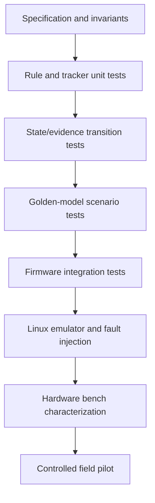
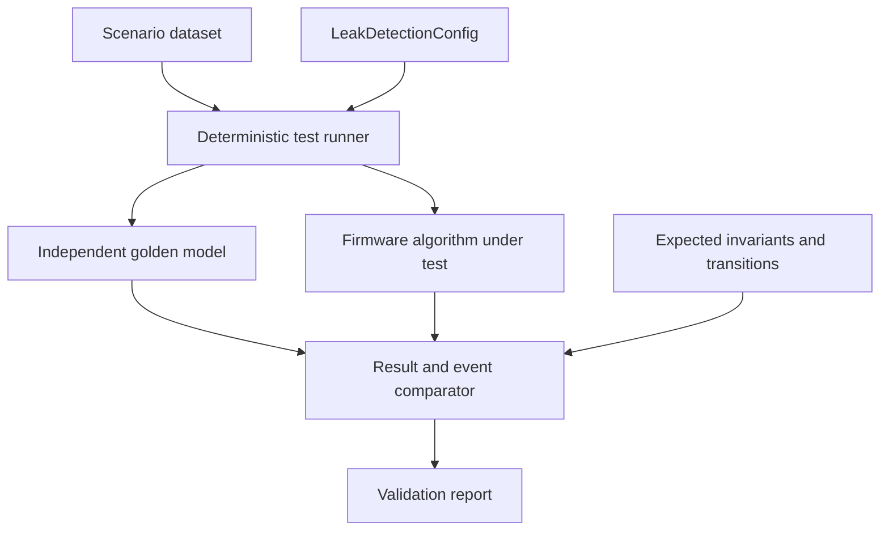
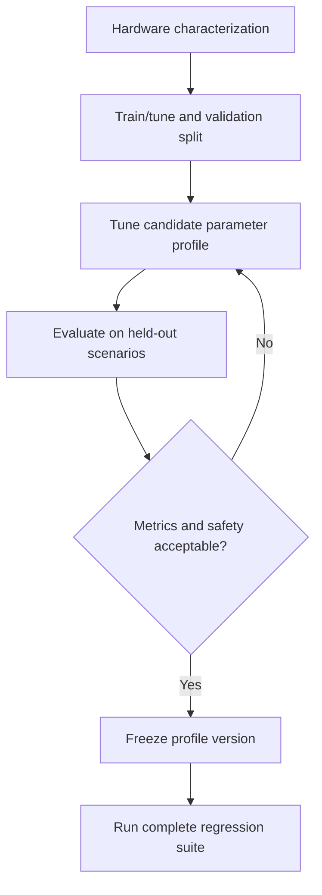

# 07 — Leak-Detection Algorithm Validation Plan

**Project:** Smart Water Flow and Pressure Monitor  
**Document group:** `1.docs/01_principle`  
**Document level:** Algorithm validation and test planning  
**Status:** Proposed validation baseline  
**Target:** Rule-based leak-detection MVP  

---

## 1. Mục tiêu

Tài liệu này định nghĩa chiến lược kiểm chứng thuật toán leak detection được mô tả trong:

```text
05_leak_detection_algorithm_baseline.md
06_leak_detection_state_and_evidence_model.md
```

Mục tiêu chính:

- Chứng minh từng rule hoạt động đúng theo configuration và monotonic duration.
- Chứng minh state/evidence transitions đúng, deterministic và idempotent.
- Kiểm tra behavior tại threshold/duration boundary.
- Kiểm tra invalid, stale, duplicate, missing và out-of-order measurement.
- Đánh giá false positive, false negative và detection latency.
- Kiểm tra config update, reboot, time invalid và timer wrap behavior.
- Xây golden model độc lập để đối chiếu firmware implementation.
- Xác định dataset cần thiết từ synthetic data, emulator, test rig và field pilot.
- Liên kết algorithm requirements với test case và acceptance evidence.

Tài liệu này không chốt threshold production. Threshold chưa được hardware/dataset validation phải giữ `TBD/configurable`.

---

## 2. Validation Scope

### 2.1. Thuộc phạm vi

```text
Continuous-flow rule
High-flow/burst rule
Pressure low/high diagnostics
Pressure-drop evidence when enabled
Flow-pressure correlation
EvidenceTracker phases
LeakState transitions
LeakEvaluationStatus transitions
Severity and reason precedence
Invalid/stale/gap behavior
Configuration update behavior
Event idempotence and sequence
Monotonic-time behavior
Runtime result consistency
Resource and timing measurements
False-positive/false-negative evaluation
```

### 2.2. Ngoài phạm vi hiện tại

```text
Acoustic leak detection
Pressure-signature machine learning
Automatic valve shutoff
Cloud/fleet leak localization
Production threshold certification
Regulatory or metrology certification
Full 4G delivery and server validation
```

4G/telemetry tests chỉ kiểm tra rằng leak result/event được publish đúng boundary; protocol delivery thuộc communication/simulation documents.

---

## 3. Source-of-Truth Inputs

| Nội dung | Source-of-truth |
|---|---|
| Product research and feasibility | `04_leak_detection_product_research.md` |
| Rule semantics and parameter model | `05_leak_detection_algorithm_baseline.md` |
| State, evidence, severity and event semantics | `06_leak_detection_state_and_evidence_model.md` |
| Canonical terminology | `../00_overview/glossary.md` |
| Runtime data ownership | `../00_overview/08_data_flow.md` khi được tạo |
| Error taxonomy | `../00_overview/09_error_handling_overview.md` khi được tạo |
| Firmware implementation | `../03_firmware/` |
| Emulator and integration tests | `../08_simulation/` |

Nếu test expectation khác source-of-truth, sửa specification hoặc ghi architecture decision trước khi sửa expected result.

---

## 4. Validation Objectives

### 4.1. Functional correctness

- Rule active/inactive đúng theo threshold, duration và input quality.
- Primary reason và reason flags đúng precedence.
- Pressure-only evidence không tạo confirmed leak.
- Current state clear đúng khi có valid stable-clear evidence.
- Historical event/counter không bị mất khi current state clear.

### 4.2. Temporal correctness

- Duration dùng monotonic time, không dùng sample count.
- Boundary ngay trước, đúng tại và sau duration cho kết quả đúng.
- Short data gap pause tracker theo policy.
- Long data gap không tạo confirm/clear giả.
- RTC wall-clock adjustment không làm thay đổi evidence duration.

### 4.3. Robustness

- Invalid/stale measurement không tạo evidence mới.
- Duplicate sample không tạo duplicate transition.
- Missing/out-of-order sample được phát hiện hoặc bỏ qua theo policy.
- Configuration update không trộn parameter version.
- Timer/counter overflow được xử lý an toàn.

### 4.4. Detection performance

- Detection latency được đo cho từng leak class.
- False-positive rate được đánh giá trên normal-use scenarios.
- False-negative rate được đánh giá trên leak/burst scenarios.
- Pressure evidence có cải thiện classification mà không tăng false positive ngoài giới hạn yêu cầu.

### 4.5. Resource behavior

- Evaluation time bounded.
- Memory/state bounded.
- Không dynamic allocation trong evaluation path.
- Không block measurement hoặc communication event loop.

---

## 5. Validation Strategy



### 5.1. Level V0 — Specification review

Kiểm tra:

- Rule semantics không mâu thuẫn.
- Parameter dependency đầy đủ.
- State transition có guard/action rõ.
- Invariant có thể kiểm thử.
- Open question blocking được nhận diện.

### 5.2. Level V1 — Pure algorithm unit tests

Test các function/state tracker độc lập với HAL, sensor và communication.

### 5.3. Level V2 — Golden-model tests

Chạy cùng dataset qua:

```text
Reference golden model
Firmware C implementation
```

So sánh state, evidence, reason, severity, event sequence và timestamps.

### 5.4. Level V3 — Firmware integration

Kiểm tra integration với:

- `DataRepository`.
- `TimeService`/monotonic clock.
- `ConfigRepository`.
- Application event loop.
- Diagnostics/event publication.

### 5.5. Level V4 — Linux simulation

Inject measurement, sensor faults, timing variation và configuration events qua emulator/driver abstraction.

### 5.6. Level V5 — Hardware bench

Characterize measurement noise, minimum reliable flow, pressure response và sample timing trên hardware thực trong môi trường thử nghiệm được kiểm soát và tuân thủ quy trình an toàn của phòng lab.

### 5.7. Level V6 — Controlled field pilot

Thu thập normal-use/leak-like datasets, đánh giá false alarms và tune product profiles trước production release.

---

## 6. Test Architecture



### 6.1. Components

| Component | Trách nhiệm |
|---|---|
| Scenario dataset | Cung cấp timed measurement/config/fault sequence |
| Deterministic runner | Điều khiển virtual monotonic time và event order |
| Golden model | Reference implementation độc lập |
| Firmware DUT | C implementation dùng trong production/simulation |
| Comparator | So sánh output per-step và transition events |
| Invariant checker | Kiểm tra invariant không phụ thuộc exact expected trace |
| Report generator | Tổng hợp pass/fail, latency, coverage và metrics |

---

## 7. Independence of the Golden Model

Golden model phải độc lập đủ để tránh lặp lại cùng bug của firmware.

Yêu cầu:

- Có thể triển khai bằng Python hoặc ngôn ngữ host phù hợp.
- Không copy nguyên control-flow từ C implementation.
- Dùng specification/state table làm nguồn.
- Dùng kiểu số đủ chính xác và conversion rõ ràng.
- Có unit tests riêng cho golden model.
- Version golden model và configuration schema.
- Ghi lại source commit/version trong validation report.

Không xem golden model là đúng tuyệt đối nếu nó mâu thuẫn specification. Khi mismatch:

```text
1. Kiểm tra dataset/schema
2. Kiểm tra specification
3. Kiểm tra golden model
4. Kiểm tra firmware DUT
5. Ghi decision và regression test
```

---

## 8. Dataset Schema

Mỗi scenario là sequence record theo monotonic time.

### 8.1. Scenario metadata

```text
scenario_id
scenario_version
description
category
config_profile
expected_primary_rule
random_seed if generated
source_type: synthetic / emulator / bench / field
source_reference
```

### 8.2. Sample/event record

| Field | Ý nghĩa |
|---|---|
| `monotonic_time` | Thời điểm event trong scenario |
| `wall_clock_time` | Optional UTC timestamp |
| `wall_clock_valid` | Validity của wall-clock |
| `event_type` | Flow sample, pressure sample, config update, tick, reboot, fault |
| `flow_value` | Flow value nếu event có flow |
| `flow_direction` | Forward/reverse/zero/unknown |
| `flow_valid` | Flow validity |
| `flow_quality_flags` | Quality flags |
| `flow_sequence` | Flow sample sequence |
| `pressure_value` | Pressure value nếu event có pressure |
| `pressure_valid` | Pressure validity |
| `pressure_quality_flags` | Pressure quality flags |
| `pressure_sequence` | Pressure sample sequence |
| `config_version` | Config version active hoặc update request |
| `fault_injection` | Optional fault directive |

### 8.3. Expected record

```text
expected_leak_state
expected_evaluation_status
expected_primary_reason
expected_reason_flags
expected_evidence_phases
expected_severity
expected_state_change_sequence
expected_event_type
expected_timestamp_validity
expected_invariant_results
```

Exact intermediate expected values có thể bỏ trống khi scenario chỉ kiểm tra invariants hoặc final state.

---

## 9. Parameterized Threshold Testing

Vì threshold production chưa chốt, test dùng giá trị tương đối với config đang chạy.

Ví dụ:

```text
Q_clear       = configured clear threshold
Q_cont        = configured continuous threshold
Q_burst       = configured burst threshold

Test values:
Q_cont - epsilon
Q_cont
Q_cont + epsilon
Q_burst - epsilon
Q_burst
Q_burst + epsilon
```

Duration boundary:

```text
T_required - one_tick
T_required
T_required + one_tick
```

Pressure boundary tương tự:

```text
P_low - epsilon
P_low
P_low + epsilon
P_high - epsilon
P_high
P_high + epsilon
```

`epsilon` phải tương ứng least-significant unit của canonical fixed-point representation, không dùng số tùy ý.

---

## 10. Unit-Test Groups

### 10.1. Configuration validation

Test:

- Clear threshold nhỏ hơn detection threshold.
- Continuous threshold nhỏ hơn burst threshold.
- Suspect duration không lớn hơn confirm duration.
- Duration khác zero và không overflow.
- Maximum data age phù hợp expected sample interval.
- Pressure low threshold nhỏ hơn pressure high threshold.
- Unsupported/invalid config bị reject mà không đổi active version.

### 10.2. Flow usability

Test:

- Valid fresh forward flow usable.
- Invalid flow unusable.
- Stale flow unusable.
- Duplicate sequence không được xử lý lại.
- Reverse/unknown direction không tạo leak evidence.
- Zero/deadband flow được dùng làm clear condition khi valid.

### 10.3. Pressure usability

Test:

- Valid fresh pressure usable.
- Invalid/stale pressure không tạo evidence.
- Pressure unavailable không dừng flow-only rule.
- Duplicate pressure sequence bị bỏ qua.

### 10.4. Continuous-flow tracker

Test mọi phase:

```text
INACTIVE -> PENDING
PENDING -> ACTIVE
PENDING -> INACTIVE
ACTIVE -> CLEAR_PENDING
CLEAR_PENDING -> INACTIVE
CLEAR_PENDING -> ACTIVE
ACTIVE/PENDING/CLEAR_PENDING -> SUSPENDED
SUSPENDED -> previous phase
```

### 10.5. Burst tracker

Test:

- Spike ngắn hơn debounce không active.
- Condition đúng bằng threshold active theo comparison semantics.
- Confirm duration tạo active evidence đúng một lần.
- Burst clear threshold tạo hysteresis.
- Burst giảm xuống continuous range không clear toàn bộ leak state.

### 10.6. Pressure trackers

Test:

- Low-pressure debounce.
- High-pressure debounce.
- Pressure return-to-range clear.
- Pressure-drop window nếu enabled.
- Pressure evidence expiry/correlation window.

### 10.7. Evidence aggregation

Test:

- Burst reason precedence trên continuous reason.
- Pressure correlation chỉ thêm supporting flag.
- Pressure-only không tạo primary leak reason.
- Evidence flags clear/expire đúng.

### 10.8. Result builder

Test:

- Result fields self-consistent.
- Config/algorithm version đúng.
- Timestamp validity đúng.
- State/severity/reason invariants đúng.
- Same input tạo cùng output.

---

## 11. State-Transition Coverage

Mọi transition trong document 06 phải có test trực tiếp.

| Transition | Test ID | Mục tiêu |
|---|---|---|
| `LT-001` Init → Normal/not-ready | `TC-LS-001` | Initial semantics |
| `LT-002` Normal → Suspected | `TC-LS-004` | Continuous suspect duration |
| `LT-003` Normal → Confirmed | `TC-LS-006` | Burst direct confirmation |
| `LT-004` Suspected → Confirmed | `TC-LS-005` | Continuous confirmation |
| `LT-005` Suspected → Confirmed burst | `TC-VAL-STATE-005` | Burst precedence |
| `LT-006` Suspected → Normal | `TC-VAL-STATE-006` | Valid stable clear |
| `LT-007` Confirmed → Normal | `TC-LS-010` | Confirmed auto-clear/history retention |
| `LT-008` Pressure-only same state | `TC-LS-007` | No pressure-only leak transition |
| `LT-009` Temporary unusable data | `TC-LS-008`, `TC-LS-009` | Suspend/degraded behavior |
| `LT-010` Config version change | `TC-LS-013` | Atomic apply and tracker reset |

State-transition coverage requirement:

```text
Every defined transition must execute in at least one positive test.
Every forbidden transition must have at least one negative/invariant test.
```

---

## 12. Evidence-Phase Coverage

| Evidence phase transition | Required test |
|---|---|
| `INACTIVE → PENDING` | Entry condition begins |
| `PENDING → ACTIVE` | Activation duration boundary |
| `PENDING → INACTIVE` | Condition ends early |
| `ACTIVE → CLEAR_PENDING` | Clear condition begins |
| `CLEAR_PENDING → INACTIVE` | Clear duration boundary |
| `CLEAR_PENDING → ACTIVE` | Condition returns before clear completes |
| Any active phase → `SUSPENDED` | Short invalid/stale gap |
| `SUSPENDED → previous phase` | Source restored inside gap limit |
| `SUSPENDED → reset context` | Gap exceeds maximum evidence gap |

Mỗi evidence type phải test phase transition phù hợp với role của nó.

---

## 13. Scenario Dataset Catalogue

### 13.1. Normal-use datasets

| Dataset ID | Nội dung | Expected result |
|---|---|---|
| `DS-NORMAL-001` | Stable zero flow with measurement noise | Remain normal |
| `DS-NORMAL-002` | Short intermittent usage | No suspected state |
| `DS-NORMAL-003` | Multiple legitimate bursts shorter than debounce | No confirmed burst |
| `DS-NORMAL-004` | Long legitimate continuous use | Reveals false-positive risk/profile need |
| `DS-NORMAL-005` | Pressure variation without abnormal flow | Pressure diagnostic only |
| `DS-NORMAL-006` | Pump/PRV-like pressure cycles | No pressure-only leak confirmation |
| `DS-NORMAL-007` | Reverse flow | Reverse diagnostic, no leak evidence |

### 13.2. Leak/burst datasets

| Dataset ID | Nội dung | Expected result |
|---|---|---|
| `DS-LEAK-001` | Small continuous flow above threshold | Normal → suspected → confirmed |
| `DS-LEAK-002` | Continuous flow stops before suspect duration | Remain normal |
| `DS-LEAK-003` | Continuous flow clears after suspected | Suspected → normal |
| `DS-LEAK-004` | Continuous flow clears after confirmed | Confirmed → normal; history retained |
| `DS-BURST-001` | High flow longer than burst debounce | Direct confirmed burst |
| `DS-BURST-002` | One-sample high-flow spike | No burst confirmation |
| `DS-BURST-003` | Burst then continuous flow | Remain confirmed; reason policy checked |
| `DS-BURST-004` | Burst plus pressure drop | Correlated evidence active |

### 13.3. Pressure datasets

| Dataset ID | Nội dung | Expected result |
|---|---|---|
| `DS-PRESS-001` | Low pressure without flow anomaly | Diagnostic only |
| `DS-PRESS-002` | High pressure without flow anomaly | Diagnostic only |
| `DS-PRESS-003` | Pressure drop with continuous flow | Correlation flag |
| `DS-PRESS-004` | Pressure drop with burst | Correlation flag + burst primary reason |
| `DS-PRESS-005` | Pressure spike shorter than debounce | No persistent pressure evidence |
| `DS-PRESS-006` | Pressure stale while flow valid | Evaluation degraded; flow rule continues |

### 13.4. Data-quality datasets

| Dataset ID | Nội dung | Expected result |
|---|---|---|
| `DS-QUALITY-001` | Invalid flow during normal | Evaluation unavailable; no transition |
| `DS-QUALITY-002` | Invalid flow during suspected | State retained; no confirm/clear |
| `DS-QUALITY-003` | Invalid flow during confirmed | State retained; no clear |
| `DS-QUALITY-004` | Short flow gap inside max gap | Tracker suspended/resumed |
| `DS-QUALITY-005` | Long flow gap beyond max gap | Unconfirmed tracker reset; no false clear |
| `DS-QUALITY-006` | Duplicate flow sequence | Idempotent/no duplicate event |
| `DS-QUALITY-007` | Out-of-order sample | Reject or flag by policy |
| `DS-QUALITY-008` | Pressure invalid during correlation | Correlation unavailable; flow state retained |

### 13.5. Time/config/system datasets

| Dataset ID | Nội dung | Expected result |
|---|---|---|
| `DS-TIME-001` | Wall-clock invalid, monotonic valid | Detection works; timestamp invalid |
| `DS-TIME-002` | Wall-clock jumps forward | Evidence duration unchanged |
| `DS-TIME-003` | Wall-clock jumps backward | Evidence duration unchanged; no duplicate transition |
| `DS-TIME-004` | Monotonic counter near wrap | Overflow-safe duration behavior |
| `DS-CONFIG-001` | Config update during normal pending evidence | Tracker reset at boundary |
| `DS-CONFIG-002` | Config update during suspected | State held/re-evaluated by policy |
| `DS-CONFIG-003` | Config update during confirmed | State retained until valid clear |
| `DS-REBOOT-001` | Reboot after confirmed event | Current normal/not-ready; history restored if persistent |
| `DS-REPORT-001` | Different reporting intervals | Leak trace unchanged |
| `DS-4G-001` | 4G offline throughout leak scenario | Leak trace unchanged |

---

## 14. Invariant Validation

Mọi invariant trong document 06 phải được chạy sau mỗi evaluation step.

| Invariant | Checker behavior |
|---|---|
| `INV-001` Normal → severity none | Fail immediately if violated |
| `INV-002` Suspected → continuous reason | Fail immediately if violated |
| `INV-003` Confirmed → flow-based primary reason | Fail immediately if violated |
| `INV-004` Pressure-only cannot confirm | Generate pressure-only sequences/property tests |
| `INV-005` Invalid/stale cannot clear | Inject invalid gaps in suspected/confirmed |
| `INV-006` One sequence increment per transition | Count transitions and sequence delta |
| `INV-007` Repeated input idempotent | Replay same sample/event |
| `INV-008` Duration uses monotonic time | Shift wall-clock only |
| `INV-009` Evaluation status independent | Generate all state/status combinations allowed |
| `INV-010` History retained after clear | Confirm then clear and inspect history |
| `INV-011` Reporting does not affect timers | Run identical trace with different report events |
| `INV-012` Result config version matches decision | Update config at evaluation boundary |

---

## 15. Property-Based and Metamorphic Tests

Ngoài example tests, sử dụng generated sequences để kiểm tra properties.

### 15.1. Determinism

```text
Same initial state + same config + same event trace
→ identical outputs and event sequences
```

### 15.2. Wall-clock independence

```text
Same monotonic trace + different wall-clock offsets/jumps
→ identical leak state/evidence trace
→ only wall-clock timestamps differ
```

### 15.3. Reporting independence

```text
Same measurement trace + different REPORT_DUE events
→ identical leak state/evidence trace
```

### 15.4. Pressure-only safety

```text
No flow evidence + arbitrary valid pressure-anomaly sequence
→ state never becomes CONFIRMED
```

### 15.5. Invalid-sample safety

```text
Replacing a valid clear sample with invalid/stale sample
→ cannot cause earlier clear transition
```

### 15.6. Duplicate idempotence

```text
Insert duplicate sample sequence into a trace
→ no additional transition/event
```

### 15.7. Duration monotonicity

```text
Increasing a true-condition duration while keeping all else equal
→ cannot delay a transition that already occurred at a shorter valid threshold crossing
```

### 15.8. Hysteresis stability

```text
Flow oscillates between clear and detection thresholds
→ state does not chatter between normal and suspected/confirmed
```

Generated tests phải có fixed random seed được ghi trong report để tái lập failure.

---

## 16. Fault-Injection Plan

| Fault ID | Fault | Injection point | Expected behavior |
|---|---|---|---|
| `FI-LD-001` | MAX/flow sample invalid | FlowResult input | No progress/clear; status unavailable |
| `FI-LD-002` | Flow sample stale | Virtual time | Suspend/reset tracker by gap policy |
| `FI-LD-003` | Pressure I2C failure | PressureResult input | Evaluation degraded; flow rules continue |
| `FI-LD-004` | Pressure stuck value | Pressure emulator | Diagnostic/data-quality detection if supported |
| `FI-LD-005` | Duplicate sequence | Input adapter | Ignore duplicate |
| `FI-LD-006` | Out-of-order sequence | Input adapter | Reject/diagnostic by policy |
| `FI-LD-007` | RTC invalid | TimeService | Monotonic detection continues |
| `FI-LD-008` | Wall-clock jump | TimeService | No duration/state change caused by jump |
| `FI-LD-009` | Config CRC/default fallback | ConfigRepository | Use validated active/default config only |
| `FI-LD-010` | Config update mid-evaluation | Event ordering | Apply next atomic boundary |
| `FI-LD-011` | 4G offline | Connectivity emulator | No effect on leak evaluation |
| `FI-LD-012` | LCD failure | Display emulator | No effect on leak evaluation |

---

## 17. False-Positive Validation

False positive là algorithm tạo suspected/confirmed leak trong scenario được xác nhận là normal use theo ground truth.

### 17.1. Required normal-use classes

```text
Short faucet use
Long shower/process use
Irrigation
Tank or pool filling
Toilet refill
Filter regeneration
Multiple simultaneous fixtures
Pump/PRV pressure variation
Normal supply-pressure changes
Reverse flow or hydraulic transient
```

### 17.2. Metrics

```text
False-positive event count
False-positive confirmed count
False-positive duration
False-positive rate per operating hour/day
Reason distribution
Scenario-specific false-positive rate
```

Target limits là product requirements và hiện `TBD`.

### 17.3. Review rule

Mỗi false positive phải được phân loại:

```text
Threshold/profile issue
Measurement-quality issue
Algorithm/state issue
Missing application context
Ground-truth uncertainty
```

Không tune threshold để sửa một case nếu làm tăng false negative ở leak class khác mà chưa đánh giá trade-off.

---

## 18. False-Negative Validation

False negative là algorithm không tạo required state/alarm trong scenario có leak/burst ground truth.

### 18.1. Required leak classes

```text
Small continuous leak above reliable flow limit
Medium continuous leak
Large continuous leak
Sudden burst/high flow
Intermittent leak pattern if included in requirement
Leak with normal pressure
Leak with pressure drop
Leak while pressure sensor unavailable
```

### 18.2. Metrics

```text
Missed suspected transitions
Missed confirmed transitions
Detection rate per leak class
Detection latency distribution
Minimum detected flow by configuration profile
Reason-classification accuracy
```

Không yêu cầu detection dưới minimum reliable flow của measurement system nếu hardware chưa chứng minh khả năng đó.

---

## 19. Detection-Latency Validation

Định nghĩa:

```text
latency_suspected = suspected_transition_time - ground_truth_start_time
latency_confirmed = confirmed_transition_time - ground_truth_start_time
```

Expected rule-based bound:

```text
Continuous suspected latency
  ≈ suspect duration + sample/update tolerance

Continuous confirmed latency
  ≈ confirm duration + sample/update tolerance

Burst confirmed latency
  ≈ burst debounce duration + sample/update tolerance
```

Validation phải đo:

- Best/typical/worst observed latency.
- Impact của sample interval và jitter.
- Impact của short invalid gaps.
- Impact của event-loop load.

Maximum permitted latency hiện `TBD` và phải trở thành system requirement trước production.

---

## 20. Pressure-Evidence Evaluation

Pressure validation phải trả lời hai câu hỏi riêng:

1. Pressure diagnostics có đúng không?
2. Correlation flag có hỗ trợ flow event mà không tạo leak confirmation giả không?

Test combinations:

| Flow evidence | Pressure evidence | Expected leak behavior |
|---|---|---|
| None | None | Normal |
| None | Low/high pressure | Normal + pressure diagnostic |
| None | Pressure drop | Normal + pressure diagnostic |
| Continuous | None | Flow-only state progression |
| Continuous | Pressure drop | Same state progression + correlation flag |
| Burst | None | Burst confirmation |
| Burst | Pressure drop | Burst confirmation + correlation flag |
| Continuous/burst | Pressure invalid/stale | Flow progression + degraded evaluation |

Pressure correlation benefit chỉ được chấp nhận nếu test cho thấy reason/severity information tốt hơn mà không phá state invariants.

---

## 21. Configuration Validation Tests

### 21.1. Boundary values

Test minimum, maximum và one-step-outside cho mọi parameter.

### 21.2. Dependency violations

```text
clear threshold >= detection threshold
continuous threshold >= burst threshold
suspect duration > confirm duration
maximum age < sample interval
pressure low >= pressure high
zero duration
duration/counter overflow
```

Expected:

```text
Reject PendingConfig
Keep previous ActiveConfig/version
Return deterministic error reason
Do not alter evidence/state
```

### 21.3. Apply semantics

Test config update trong:

- Normal/inactive.
- Normal/pending evidence.
- Suspected.
- Confirmed.
- Invalid/stale input.

Kiểm tra result không bao giờ chứa state decision từ config A nhưng `config_version` của config B.

---

## 22. Reboot and Persistence Tests

### 22.1. Reboot in normal state

Expected:

```text
Current state = NORMAL
Evaluation status = NOT_READY
Runtime trackers reset
```

### 22.2. Reboot in suspected state

Expected baseline:

```text
Suspected runtime timer not restored
Current state starts NORMAL + NOT_READY
New data must re-establish suspicion
```

### 22.3. Reboot after confirmed event

Expected:

```text
Current state starts NORMAL + NOT_READY
Last confirmed event/counter restored if storage policy enabled
No confirmed runtime state is assumed without new evidence
```

### 22.4. Corrupt persistent event record

Expected:

- Fallback/CRC policy handles record.
- Current algorithm still initializes safely.
- Diagnostic error is published.
- No false confirmed state is created.

---

## 23. Timer and Overflow Tests

Test:

- Monotonic timestamp subtraction near wrap.
- Maximum duration parameter.
- Long-running active evidence.
- State-change sequence wrap policy.
- Sample-sequence wrap policy.
- Wall-clock before/after synchronization.

Implementation phải dùng overflow-safe comparison/subtraction phù hợp timer width.

Không fast-forward bằng vòng lặp dài; virtual time phải cho phép jump deterministic tới boundary cần test.

---

## 24. Concurrency and Event-Order Tests

Test event cùng timestamp hoặc gần nhau:

```text
Flow sample + pressure sample
Flow sample + RTC sync
Flow sample + config update
Flow sample + REPORT_DUE
Leak transition + 4G TX active
Leak transition + storage commit
```

Yêu cầu:

- Có event-order policy deterministic.
- Measurement snapshot được đọc nhất quán.
- Config apply tại boundary rõ ràng.
- REPORT_DUE không thay đổi leak trace.
- 4G/LCD/storage không block algorithm evaluation quá deadline.

---

## 25. Runtime Result Consistency Tests

Sau mỗi publish kiểm tra:

```text
state and severity consistent
state and primary reason consistent
reason flags include primary reason evidence
evaluation status consistent with input quality
state timestamp validity correct
config version matches decision
algorithm version present
state-change sequence monotonic
confirmed-event sequence not lost after clear
```

Test reader snapshot concurrency để bảo đảm consumer không thấy nửa result cũ/nửa result mới.

---

## 26. Code-Coverage Expectations

Coverage target số học được chốt trong firmware/CI policy. Tối thiểu cần:

- Statement/branch coverage report.
- Mọi state transition được execute.
- Mọi evidence phase transition được execute.
- Mọi config rejection branch được execute.
- Mọi invalid/stale path được execute.
- Event no-change/idempotent branch được execute.
- Overflow/wrap handling được execute.

Coverage cao không thay thế scenario/requirement coverage.

---

## 27. Static and Dynamic Analysis

Host/simulation build nên chạy:

```text
Compiler warnings as errors
Static analysis
Undefined-behavior sanitizer when supported
Address sanitizer for host integration when supported
Integer conversion/overflow review
Stack and memory analysis
```

Embedded build cần kiểm tra:

```text
No dynamic allocation in evaluation path
Bounded stack usage
Bounded execution path
No blocking I/O
No direct HAL/storage/communication call from pure algorithm
```

---

## 28. Performance and Resource Validation

### 28.1. Execution time

Đo:

- Average evaluation time.
- Maximum observed evaluation time.
- Time theo enabled rule profile.
- Time khi state transition/event build xảy ra.

Acceptance budget hiện `TBD` và phải nhỏ hơn available processing deadline sau khi firmware scheduling được chốt.

### 28.2. Memory

Đo:

- Algorithm context size.
- Pressure trend buffer size.
- Stack high-water mark.
- Dataset/test-only memory tách khỏi production memory.

### 28.3. Event load

Kiểm tra:

- Không emit event mỗi sample khi state không đổi.
- Degraded/restored events được debounce/rate-limit.
- Diagnostic counters không overflow sớm.

---

## 29. Hardware Characterization Plan

Hardware characterization phải cung cấp dữ liệu để chốt parameter range, không chỉ kiểm tra firmware pass/fail.

### 29.1. Flow characterization

Đo:

```text
Zero-flow noise distribution
Zero-flow offset drift
Minimum reliable forward flow
Repeatability at low flow
Flow step response
Flow sample interval and jitter
Empty-pipe/bubble/weak-signal behavior
Reverse-flow behavior
```

### 29.2. Pressure characterization

Đo:

```text
Sensor noise and resolution
Offset/gain error
Temperature sensitivity
Maximum reliable sample rate
Conversion latency and jitter
Pressure step response
Pump/valve/normal-use transients
I2C fault behavior
```

### 29.3. Combined characterization

Thu thập đồng bộ:

```text
FlowResult
PressureResult
Ground-truth event marker
Monotonic time
System/config metadata
```

Test rig/hardware operation phải theo quy trình an toàn và giới hạn áp suất/lưu lượng của thiết bị phòng lab.

---

## 30. Ground-Truth Requirements

Mỗi bench/field dataset phải có ground truth đủ tin cậy:

```text
Known valve/event command time
Reference flow measurement when available
Reference pressure measurement when available
Known leak/orifice/test condition identifier
Operator annotation
Sensor synchronization information
Calibration/version metadata
```

Dataset thiếu ground truth có thể dùng cho exploratory analysis nhưng không được dùng một mình để tuyên bố detection accuracy.

---

## 31. Threshold-Tuning Process



Rules:

- Không tune và báo cáo accuracy trên cùng toàn bộ dataset.
- Mỗi profile có version và target application.
- Threshold không universal nếu pipe/application khác nhau.
- Thay parameter phải chạy lại regression suite.
- Field pilot data không được ghi đè benchmark history.

---

## 32. Validation Metrics

### 32.1. Classification metrics

```text
True positive
False positive
True negative
False negative
Sensitivity/recall
Specificity
Precision
False-alarm rate per operating time
```

### 32.2. Timing metrics

```text
Suspected detection latency
Confirmed detection latency
Clear latency
Maximum evaluation execution time
Missed evaluation deadline count
```

### 32.3. Robustness metrics

```text
Duplicate-event count
Invariant violation count
State chatter count
Invalid/stale safety failures
Config-version mismatch count
Golden-model mismatch count
```

Target values hiện `TBD` và cần product/system requirements.

---

## 33. Traceability Matrix

### 33.1. Algorithm requirements

| Requirement | Validation group |
|---|---|
| `PR-LD-001` Processed inputs only | Input contract/unit/integration tests |
| `PR-LD-002` Continuous rule/hysteresis | Continuous tracker boundary tests |
| `PR-LD-003` Burst debounce | Burst spike and duration tests |
| `PR-LD-004` Pressure-only cannot confirm | Pressure-only property tests |
| `PR-LD-005` Pressure stale does not disable flow | Degraded-input scenarios |
| `PR-LD-006` Monotonic duration | Wall-clock metamorphic tests |
| `PR-LD-007` Invalid sample not evidence/clear | Fault injection and invariants |
| `PR-LD-008` Reporting independence | Reporting metamorphic tests |
| `PR-LD-009` Complete result contract | Result consistency tests |
| `PR-LD-010` Atomic config apply | Config version/order tests |
| `PR-LD-011` Bounded/no allocation | Static/resource tests |
| `PR-LD-012` Deterministic transitions | State coverage and golden tests |

### 33.2. State-model requirements

| Requirement | Validation group |
|---|---|
| `PR-LS-001` Three leak states | State enum/transition coverage |
| `PR-LS-002` Evaluation status separate | State/status combination tests |
| `PR-LS-003` Pressure-only cannot confirm | Property/invariant tests |
| `PR-LS-004` Invalid flow cannot clear | Invalid-gap scenarios |
| `PR-LS-005` Auto-clear after valid stable clear | Clear-duration tests |
| `PR-LS-006` History retained | Clear/reboot/persistence tests |
| `PR-LS-007` Idempotent sequenced events | Duplicate/replay tests |
| `PR-LS-008` Monotonic duration | Clock-jump tests |
| `PR-LS-009` Complete state result | Result contract tests |
| `PR-LS-010` Reason precedence | Burst+continuous combination tests |
| `PR-LS-011` No runtime timer restore | Reboot tests |
| `PR-LS-012` Reporting/connectivity independence | Metamorphic integration tests |

---

## 34. CI Validation Gates

Proposed CI gates:

```text
Gate 1: Build with warnings-as-errors
Gate 2: Pure unit tests pass
Gate 3: State/evidence transition coverage complete
Gate 4: All invariants pass
Gate 5: Golden-model comparison has zero unexplained mismatch
Gate 6: Sanitizer/static-analysis critical findings = 0
Gate 7: Deterministic replay hash/result identical
Gate 8: Performance/resource budget pass when budget is defined
Gate 9: Requirement-to-test mapping complete
```

Field accuracy metrics không nên trở thành CI gate cho mỗi code commit nếu dataset lớn/nhạy; có thể chạy scheduled validation job với versioned report.

---

## 35. Validation Phases and Exit Criteria

### Phase A — Specification and synthetic validation

Exit criteria:

- All rule/state unit tests pass.
- All invariants pass.
- Golden model and DUT match synthetic scenarios.
- No unresolved semantic conflict.

### Phase B — Emulator integration

Exit criteria:

- MAX/pressure/time/config fault injection works.
- Event loop integration deterministic.
- Snapshot publication consistent.
- Reporting/4G activity does not affect leak trace.

### Phase C — Hardware characterization

Exit criteria:

- Minimum reliable flow established.
- Pressure noise/sample rate characterized.
- Parameter valid ranges justified.
- Bench datasets versioned with ground truth.

### Phase D — Controlled pilot

Exit criteria:

- False-positive/false-negative targets defined and evaluated.
- Detection latency target evaluated.
- Product profile version frozen or revised.
- Known limitations documented.

### Phase E — Production readiness

Exit criteria:

- Complete traceability.
- Regression suite frozen/versioned.
- Resource budget passes target firmware.
- Remaining risks accepted through design review.

---

## 36. Validation Report Template

Mỗi validation run nên ghi:

```text
Report ID and date
Firmware commit/version
Golden-model version
Algorithm version
Config/profile version
Dataset versions and source
Target/platform
Test list and result
Golden mismatches
Invariant violations
Coverage summary
Performance/resource summary
Detection metrics
Known failures and waived items
Reviewer/approval status
```

Không ghi “100% validated” nếu còn threshold, hardware hoặc field metrics chưa được chốt.

---

## 37. Open Questions

| ID | Câu hỏi | Ảnh hưởng |
|---|---|---|
| `OQ-VAL-001` | Canonical units/fixed-point resolution là gì? | Boundary/epsilon tests |
| `OQ-VAL-002` | Flow/pressure sample interval và jitter budget là bao nhiêu? | Freshness/latency |
| `OQ-VAL-003` | False-positive target theo operating hour/day là bao nhiêu? | Product acceptance |
| `OQ-VAL-004` | Detection-rate target cho từng leak class là bao nhiêu? | Product acceptance |
| `OQ-VAL-005` | Maximum suspected/confirmed latency là bao nhiêu? | Duration/profile design |
| `OQ-VAL-006` | Coverage target và static-analysis toolchain là gì? | CI gates |
| `OQ-VAL-007` | WCET/stack/RAM budget của algorithm là bao nhiêu? | Embedded acceptance |
| `OQ-VAL-008` | Pressure trend có thuộc MVP không? | Dataset/test scope |
| `OQ-VAL-009` | Test rig/reference instruments nào được sử dụng? | Ground truth |
| `OQ-VAL-010` | Field dataset được lưu, anonymize và version như thế nào? | Reproducibility/governance |
| `OQ-VAL-011` | Last confirmed event persistence có thuộc acceptance không? | Reboot/storage tests |
| `OQ-VAL-012` | Immediate event telemetry có cần validation trong phase này không? | Communication integration |

---

## 38. Maintenance Rules

- Mỗi behavior change trong document 05/06 phải thêm hoặc sửa regression test.
- Mỗi fixed bug phải có test tái tạo failure trước khi đóng.
- Dataset schema change phải tăng version và có migration/conversion note.
- Không sửa expected output chỉ để làm test pass nếu specification chưa đổi.
- Threshold/profile change phải chạy lại held-out validation và full regression.
- Random/generated test phải lưu seed khi fail.
- Hardware/field dataset phải giữ metadata và ground truth.
- Mismatch được waive phải có rationale, owner và expiry/review point.
- Validation report phải ghi rõ các phần chưa thực hiện.

---

## 39. Completion Criteria

Validation plan được xem là triển khai đầy đủ khi:

1. Dataset schema và expected-output schema được chốt.
2. Golden model độc lập được triển khai và unit-test.
3. Mọi rule/evidence/state transition có test.
4. Mọi invariant có checker tự động.
5. Invalid/stale/duplicate/gap/time/config scenarios có coverage.
6. Requirement-to-test traceability hoàn chỉnh.
7. Linux simulation chạy deterministic.
8. Hardware characterization cung cấp parameter bounds.
9. False-positive/false-negative/latency targets được system requirement hóa.
10. CI gates và validation report được tự động hóa ở mức phù hợp.

---

## 40. Kết luận

Validation strategy sử dụng nhiều tầng:

```text
Specification and invariants
  -> pure unit tests
  -> state/evidence transition tests
  -> independent golden-model comparison
  -> firmware integration
  -> Linux emulator and fault injection
  -> hardware characterization
  -> controlled field pilot
```

Synthetic tests dùng threshold-relative values để kiểm tra semantics mà không tạo số liệu giả. Hardware/field data được dùng sau đó để chốt threshold, false-alarm target và detection latency.

Nguyên tắc quan trọng nhất:

```text
No production claim without source-backed parameters,
ground-truth datasets and traceable validation evidence.
```
