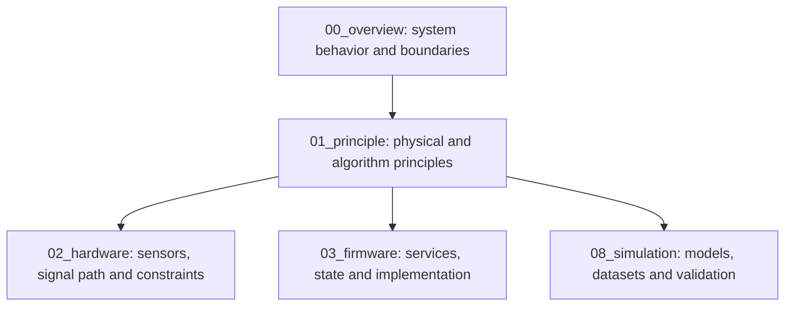
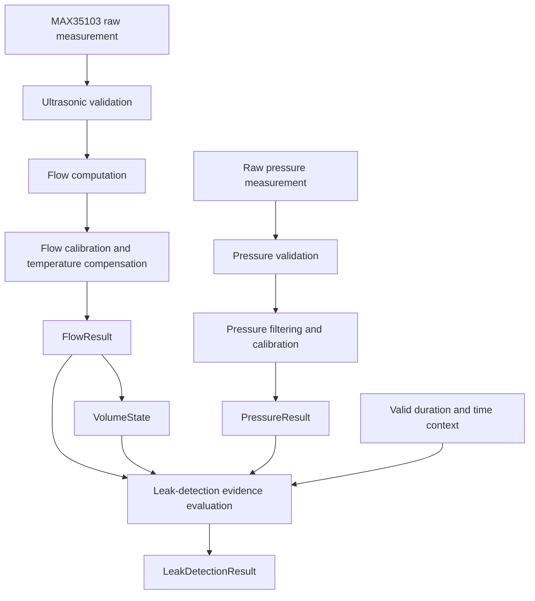

# Measurement and Leak-Detection Principles — Smart Water Flow and Pressure Monitor

**Document group:** `1.docs/01_principle`  
**Document level:** Measurement, physical principle and algorithm design  
**Project:** Smart Water Flow and Pressure Monitor  
**Short name:** SWFPM  
**Current status:** Principle research baseline in progress  

---

## 1. Mục tiêu của bộ tài liệu

Bộ tài liệu `1.docs/01_principle` mô tả các nguyên lý vật lý, mô hình dữ liệu đo và nguyên tắc thuật toán được sử dụng trong hệ thống **Smart Water Flow and Pressure Monitor**.

Nhóm tài liệu này tập trung vào bốn câu hỏi chính:

1. Hệ thống đo lưu lượng bằng nguyên lý ultrasonic transit-time như thế nào?
2. Nhiệt độ được sử dụng để compensation và đánh giá chất lượng measurement như thế nào?
3. Áp suất được đo, validate, filter và calibration như thế nào?
4. Hệ thống có thể sử dụng flow, volume, time và pressure để phát hiện dấu hiệu rò rỉ như thế nào?

Bộ tài liệu dùng để:

- Giải thích cơ sở vật lý và toán học của measurement pipeline.
- Phân biệt raw measurement, validated result và calibrated result.
- Nghiên cứu các nguyên lý leak detection đã được sử dụng trong sản phẩm thực tế.
- Lựa chọn thuật toán leak detection phù hợp với STM32L433RCT6, MAX35103 và pressure sensor I2C.
- Định nghĩa state, evidence và quality model cho leak detection.
- Làm cơ sở cho firmware architecture, simulation model và validation test.

---

## 2. Vị trí của `01_principle` trong hệ thống tài liệu



Vai trò từng nhóm:

- `00_overview` mô tả hệ thống cần làm gì và các subsystem tương tác như thế nào.
- `01_principle` mô tả vì sao measurement/algorithm hoạt động và dữ liệu phải đi qua những bước nào.
- `02_hardware` mô tả phần cứng cụ thể để thực hiện các nguyên lý đó.
- `03_firmware` mô tả firmware triển khai measurement và leak-detection logic như thế nào.
- `08_simulation` kiểm chứng công thức, state transition và fault behavior bằng test data có kiểm soát.

`00_overview/03_operating_principle.md` chỉ nên trình bày bản tóm tắt cấp hệ thống và dẫn chiếu tới các tài liệu chi tiết trong nhóm này.

---

## 3. Current Measurement Baseline

```text
Main MCU                 : STM32L433RCT6
Ultrasonic measurement  : MAX35103 + ultrasonic transducers
Flow principle          : Ultrasonic transit-time
Temperature source      : MAX35103 measurement subsystem
Pressure measurement    : I2C pressure sensor, model TBD
Flow calibration        : Calibration profile and temperature compensation
Volume                  : Accumulated from valid calibrated flow
Leak detection          : Research and algorithm baseline not yet finalized
```

Baseline leak-detection direction:

```text
MVP candidates:
- Continuous-flow detection
- High-flow or burst detection
- Pressure-anomaly detection
- Flow-pressure evidence combination

Research/future candidates:
- Acoustic leak detection
- High-frequency pressure-signature analysis
- Machine-learning classification
- Fleet/cloud correlation and localization
```

Các hướng research/future không được xem là chức năng đã cam kết cho đến khi feasibility, hardware capability và validation requirement được chốt.

---

## 4. Phạm vi của `01_principle`

### 4.1. Nội dung thuộc phạm vi

```text
Ultrasonic transit-time principle
Upstream/downstream ToF relationship
Flow velocity and volumetric flow model
Temperature compensation principle
Measurement validity and quality
Pressure measurement and calibration principle
Pressure trend and anomaly definition
Volume accumulation principle
Leak-detection product research
Continuous-flow and burst-detection rules
Pressure evidence and data-fusion principle
Leak state, severity and reason model
Algorithm parameter and validation strategy
```

### 4.2. Nội dung ngoài phạm vi

```text
MAX35103 SPI opcode and register implementation
Pressure sensor register map
STM32 HAL API and driver code
Exact pin mapping, clock, DMA and NVIC
BLE configuration packet or GATT UUID
4G AT command and server payload encoding
Reporting-window implementation
Telemetry offline-retention policy
LCD implementation
Production cloud analytics implementation
```

Reporting schedule, RTC synchronization, 4G delivery và offline behavior thuộc `00_overview/13_reporting_and_connectivity_policy.md` và `04_communication`, không thuộc source-of-truth của nhóm nguyên lý đo.

---

## 5. Documentation Structure

```text
1.docs/01_principle/
├── README.md
├── 01_ultrasonic_flow_measurement_principle.md
├── 02_temperature_compensation_principle.md
├── 03_pressure_measurement_principle.md
├── 04_leak_detection_product_research.md
├── 05_leak_detection_algorithm_baseline.md
├── 06_leak_detection_state_and_evidence_model.md
└── 07_algorithm_validation_plan.md
```

---

## 6. Document Map and Status

| Tài liệu | Vai trò | Trạng thái |
|---|---|---|
| `README.md` | Scope, baseline, source-of-truth và research rules | Defined |
| `01_ultrasonic_flow_measurement_principle.md` | Transit-time, ToF, flow velocity và volumetric flow | Planned |
| `02_temperature_compensation_principle.md` | Temperature validity, compensation và quality impact | Planned |
| `03_pressure_measurement_principle.md` | Pressure acquisition, validation, filtering, calibration và trend | Planned |
| `04_leak_detection_product_research.md` | Nghiên cứu nguyên lý từ sản phẩm thương mại và tài liệu hãng | Planned |
| `05_leak_detection_algorithm_baseline.md` | Chọn rule/algorithm thuộc MVP và parameter model | Planned |
| `06_leak_detection_state_and_evidence_model.md` | Leak states, transition, severity, reason, evidence và clear policy | Planned |
| `07_algorithm_validation_plan.md` | Dataset, golden model, test case và acceptance criteria | Planned |

`Defined` chỉ có nghĩa tài liệu baseline đã được tạo. Nó không có nghĩa mọi công thức, threshold hoặc thuật toán đã được kiểm chứng trên hardware thực.

---

## 7. Source-of-Truth Matrix

| Nội dung | Source-of-truth | Downstream documents phải làm gì |
|---|---|---|
| Ultrasonic transit-time model | `01_ultrasonic_flow_measurement_principle.md` | Firmware implement; simulation kiểm chứng công thức |
| Temperature compensation | `02_temperature_compensation_principle.md` | Calibration service áp dụng; test bằng reference data |
| Pressure processing principle | `03_pressure_measurement_principle.md` | Driver/service triển khai theo sensor capability |
| Commercial leak-detection approaches | `04_leak_detection_product_research.md` | Dùng làm evidence, không sao chép proprietary algorithm |
| MVP leak-detection algorithm | `05_leak_detection_algorithm_baseline.md` | Firmware và simulation dùng cùng rule/parameter semantics |
| Leak state and evidence | `06_leak_detection_state_and_evidence_model.md` | Data model, LCD, BLE và telemetry dùng cùng enum/meaning |
| Algorithm validation | `07_algorithm_validation_plan.md` | Simulation/test mapping phải bám test scenarios |
| System-level summary | `../00_overview/03_operating_principle.md` | Chỉ tóm tắt và dẫn chiếu sang nhóm này |

---

## 8. Overall Measurement and Detection Model



Các data object chính:

```text
RawUltrasonicMeasurement
ValidatedUltrasonicMeasurement
ProcessedFlowMeasurement
FlowResult
TemperatureResult
RawPressureMeasurement
PressureResult
VolumeState
LeakDetectionResult
```

Tên và ý nghĩa của các data object phải thống nhất với `00_overview/glossary.md`.

---

## 9. Ultrasonic Flow Principle Boundary

Ultrasonic pipeline có trách nhiệm chuyển kết quả MAX35103 thành flow result có thể sử dụng.

```text
Upstream ToF + Downstream ToF + status + temperature
  -> status and range validation
  -> differential transit-time calculation
  -> flow velocity model
  -> volumetric flow model
  -> zero-flow correction
  -> temperature compensation
  -> calibration profile
  -> FlowResult + quality flags
```

Nguyên tắc:

- MAX35103 result vẫn là raw/measurement-IC result, chưa phải flow chính thức.
- Không cộng volume từ measurement invalid.
- Flow equation, unit và sign convention phải có source rõ ràng.
- Calibration không được gọi lẫn với filtering.
- Temperature invalid phải làm giảm quality hoặc kích hoạt fallback policy đã định nghĩa.
- Hardware-specific register/opcode không được đưa vào tài liệu nguyên lý.

---

## 10. Pressure Principle Boundary

Pressure pipeline có trách nhiệm chuyển raw sensor output thành `PressureResult` đáng tin cậy.

```text
Raw pressure + sensor status + timestamp
  -> communication/status validation
  -> range check
  -> conversion to engineering unit
  -> offset/gain calibration
  -> filtering
  -> freshness evaluation
  -> PressureResult + quality flags
```

Tài liệu pressure principle phải trả lời:

- Đơn vị chuẩn của raw và processed pressure là gì?
- Range hợp lệ và out-of-range policy là gì?
- Filter nào phù hợp với sample rate và leak-detection rule?
- Pressure data cũ bao lâu thì được xem là stale?
- Pressure anomaly được định nghĩa theo absolute threshold, rate-of-change hay trend window?
- Sensor temperature, status hoặc diagnostic được sử dụng như thế nào nếu sensor hỗ trợ?

Model pressure sensor hiện là `TBD`, do đó tài liệu nguyên lý phải tách phần generic khỏi sensor-specific conversion.

---

## 11. Leak-Detection Research Scope

Product research phải đánh giá tối thiểu bốn nhóm nguyên lý:

| Nhóm | Dữ liệu đầu vào | Khả năng cho MVP | Rủi ro/chưa rõ |
|---|---|---|---|
| Continuous-flow detection | Flow và duration | Cao | False positive do sử dụng nước liên tục |
| High-flow/burst detection | Flow, duration và optional pressure | Cao | Threshold phụ thuộc pipe/application |
| Pressure-drop/anomaly detection | Pressure, trend và time window | Trung bình | Cần sensor/sample-rate phù hợp |
| Acoustic leak detection | Acoustic/noise information | Chưa chốt | Chưa xác nhận MAX35103 expose đủ data |
| Pressure-signature classification | High-rate pressure waveform | Future | Sample rate, RAM, compute và training data |
| Fleet/cloud correlation | Nhiều device và network topology | Future | Thuộc cloud analytics, không phải embedded MVP |

Nghiên cứu sản phẩm thực tế phải dùng tài liệu chính thức của nhà sản xuất, datasheet, manual, paper hoặc patent phù hợp. Không suy ra thuật toán proprietary chỉ từ nội dung marketing.

---

## 12. Proposed MVP Leak-Detection Direction

Hướng MVP ban đầu để nghiên cứu và kiểm chứng:

```text
Rule 1: Continuous-flow evidence
Rule 2: High-flow or burst evidence
Rule 3: Pressure-anomaly evidence
Rule 4: Combined flow-pressure evidence
```

State model đề xuất để đánh giá:

```text
NORMAL
SUSPECTED
CONFIRMED
```

Measurement validity phải tách khỏi leak state:

```text
FLOW_VALID / FLOW_INVALID / FLOW_STALE
PRESSURE_VALID / PRESSURE_INVALID / PRESSURE_STALE
TIME_VALID / TIME_INVALID
```

Các nội dung trên là research baseline, chưa phải requirement cuối cùng. `05_leak_detection_algorithm_baseline.md` và `06_leak_detection_state_and_evidence_model.md` sẽ chốt semantics chính thức sau khi hoàn thành product research.

---

## 13. Algorithm Parameter Categories

Các parameter dự kiến cần nghiên cứu:

```text
continuous_flow_threshold
continuous_flow_suspect_duration
continuous_flow_confirm_duration
burst_flow_threshold
burst_confirm_duration
pressure_low_threshold
pressure_drop_rate_threshold
pressure_evidence_duration
leak_clear_threshold
leak_clear_duration
maximum_flow_data_age
maximum_pressure_data_age
```

Quy tắc parameter:

- Parameter phải có unit, valid range và default source.
- Parameter chưa được kiểm chứng phải ghi `TBD`, không tạo số liệu giả.
- Threshold cần có rationale từ measurement capability, product research hoặc experimental data.
- Parameter có thể configurable nhưng configuration permission phải thuộc communication/configuration policy.
- Không để parameter của một pipe/application trở thành universal constant nếu chưa có evidence.

---

## 14. Measurement Quality and Freshness

Mỗi result phải phân biệt:

```text
Valid but fresh
Valid but stale
Invalid due to sensor/status
Invalid due to range
Unavailable due to communication/timeout
```

Leak detection chỉ sử dụng evidence đáp ứng quality requirement của rule tương ứng.

Ví dụ:

- Continuous-flow rule yêu cầu flow valid và duration được theo dõi bằng monotonic time.
- Pressure-confirmation rule yêu cầu pressure valid và không stale.
- Pressure invalid không bắt buộc làm mất continuous-flow evidence, nhưng kết quả phải ghi thiếu pressure evidence.
- Time-of-day-related rule không được chạy khi wall-clock time invalid.

Quality flag và error taxonomy chi tiết thuộc `00_overview/09_error_handling_overview.md` và firmware data model.

---

## 15. Time Semantics for Algorithms

Thuật toán cần phân biệt:

| Loại thời gian | Mục đích |
|---|---|
| Monotonic time | Timeout, duration, evidence window và debounce |
| Wall-clock/UTC time | Timestamp, reporting và optional time-of-day rule |
| Local time | Hiển thị và reporting-window evaluation |

Leak duration không nên phụ thuộc trực tiếp vào wall-clock time vì time synchronization có thể làm thời gian nhảy tiến hoặc lùi.

```text
Leak evidence duration -> monotonic time
Leak event timestamp   -> TimeService wall-clock time when valid
```

---

## 16. Research and Evidence Rules

Mỗi tài liệu research/algorithm phải phân biệt rõ:

```text
Verified fact
Source-backed product behavior
Engineering inference
Proposed design
Open question
Future option
```

Quy tắc nguồn:

- Ưu tiên datasheet, product manual, application note, standard và research paper.
- Product marketing chỉ dùng để xác nhận capability tổng quan, không dùng để suy ra chi tiết thuật toán không được công bố.
- Mọi công thức cần định nghĩa symbol, unit và assumption.
- Mọi threshold cần reference hoặc trạng thái `TBD`.
- Nếu một sản phẩm sử dụng sensor/sample rate khác, phải ghi rõ giới hạn khi áp dụng cho dự án.
- Không sao chép nguyên văn dài từ tài liệu có bản quyền; sử dụng phân tích và diễn giải có dẫn nguồn.

---

## 17. Separation of Responsibilities

| Responsibility | Thuộc nhóm tài liệu nào? |
|---|---|
| Physical measurement equation | `01_principle` |
| Leak-detection rule/state/evidence | `01_principle` |
| Sensor model, pin, power và electrical constraint | `02_hardware` |
| Driver API, HAL, event loop và internal state | `03_firmware` |
| BLE configuration field và permission | `04_communication` |
| 4G/server telemetry contract | `04_communication` |
| Reporting-window and RTC synchronization policy | `00_overview/13_reporting_and_connectivity_policy.md` |
| Emulator, dataset, fault injection và test | `08_simulation` |

Nguyên tắc không gọi chéo:

- `LeakDetectionService` không đọc trực tiếp MAX35103 hoặc pressure sensor driver.
- `VolumeAccumulator` chỉ nhận valid calibrated flow.
- LCD/telemetry không tính lại flow hoặc leak state.
- BLE chỉ cấu hình parameter; nó không thực hiện leak-detection algorithm.
- Server có thể phân tích bổ sung nhưng không thay đổi embedded leak state nếu chưa có remote-command architecture.

---

## 18. Recommended Reading and Implementation Order

```text
1. README.md
2. 01_ultrasonic_flow_measurement_principle.md
3. 02_temperature_compensation_principle.md
4. 03_pressure_measurement_principle.md
5. 04_leak_detection_product_research.md
6. 05_leak_detection_algorithm_baseline.md
7. 06_leak_detection_state_and_evidence_model.md
8. 07_algorithm_validation_plan.md
```

Sau khi nhóm này ổn định:

```text
00_overview/03_operating_principle.md
  -> tóm tắt principle cấp hệ thống

00_overview/08_data_flow.md
  -> chốt data-object flow và ownership

03_firmware/
  -> map algorithm sang service/state/API

08_simulation/
  -> triển khai golden model, dataset và test scenarios
```

---

## 19. Current Open Questions

| ID | Câu hỏi | Ảnh hưởng |
|---|---|---|
| `OQ-PR-001` | MAX35103 cung cấp những quality/signal metrics nào ngoài ToF và status? | Ultrasonic validation và acoustic feasibility |
| `OQ-PR-002` | Pressure sensor model, range, accuracy và maximum sample rate là gì? | Pressure processing và anomaly detection |
| `OQ-PR-003` | Flow sample interval và pressure sample interval là bao nhiêu? | Evidence window, freshness và power |
| `OQ-PR-004` | Continuous-flow threshold và duration được xác định từ đâu? | MVP algorithm và calibration |
| `OQ-PR-005` | Pressure chỉ tạo warning hay được dùng để xác nhận leak? | Evidence fusion và state transition |
| `OQ-PR-006` | Có yêu cầu phân biệt leak nhỏ, burst và normal continuous usage không? | Leak reason/severity model |
| `OQ-PR-007` | Leak current state tự clear hay cần acknowledgement/latch policy? | State model, LCD và telemetry |
| `OQ-PR-008` | Acoustic detection có khả thi với hardware baseline hiện tại không? | Future algorithm/hardware scope |
| `OQ-PR-009` | Dataset thực tế hoặc test rig nào được dùng để tune threshold? | Validation plan |
| `OQ-PR-010` | Đơn vị chuẩn cho flow, volume, temperature và pressure là gì? | Data model và formula validation |

---

## 20. Maintenance Rules

Khi thay đổi nguyên lý hoặc thuật toán:

- Nếu đổi flow equation hoặc sign convention, cập nhật ultrasonic principle, glossary và golden-model tests.
- Nếu đổi temperature compensation, cập nhật calibration documentation và validation dataset.
- Nếu chọn pressure sensor mới, cập nhật pressure principle và hardware constraints nhưng giữ generic processing boundary nếu có thể.
- Nếu thêm leak rule, cập nhật algorithm baseline, state/evidence model và validation plan.
- Nếu đổi leak state/enum, cập nhật glossary, overview, LCD, BLE, telemetry và traceability.
- Nếu threshold từ `TBD` thành default chính thức, thêm source/rationale và acceptance test.
- Nếu acoustic/ML được đưa vào baseline, phải có ADR, hardware feasibility và resource budget.
- Nếu thêm test case, map test case với rule/state/requirement tương ứng.

---

## 21. Completion Criteria

Nhóm `01_principle` chỉ được đánh dấu hoàn thành khi:

1. Flow equation, symbol, unit và assumption được định nghĩa rõ.
2. Temperature compensation có input, output và fallback policy.
3. Pressure processing có validation, calibration, filtering và freshness model.
4. Product research phân biệt capability thực tế và proprietary detail chưa biết.
5. MVP leak algorithm được chọn và có rationale.
6. Leak state, severity, reason, transition và clear policy được định nghĩa.
7. Mọi algorithm parameter có unit, valid range và source hoặc trạng thái `TBD`.
8. Invalid/stale measurement behavior được định nghĩa.
9. Validation plan có normal, leak, burst, pressure anomaly và false-positive scenarios.
10. System overview, firmware implication và simulation traceability có mapping tương ứng.

---

## 22. Kết luận

`1.docs/01_principle` là source-of-truth cho nguyên lý measurement và leak-detection algorithm của Smart Water Flow and Pressure Monitor.

Pipeline tổng quát được tóm tắt như sau:

```text
MAX35103 and ultrasonic transducers
  -> validated ToF and temperature
  -> flow computation and calibration
  -> FlowResult and VolumeState

I2C pressure sensor
  -> validated and calibrated pressure
  -> PressureResult

FlowResult + VolumeState + PressureResult + monotonic duration
  -> leak evidence evaluation
  -> leak state transition
  -> LeakDetectionResult
```

Các tài liệu hardware, firmware và simulation phải triển khai hoặc kiểm chứng các nguyên lý được chốt trong nhóm này mà không thay đổi meaning của data object, state hoặc evidence rule nếu chưa có requirement/ADR mới.
