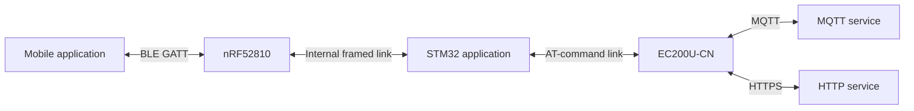
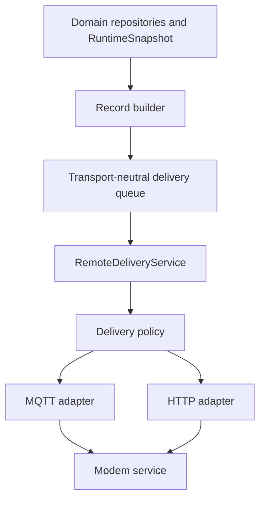
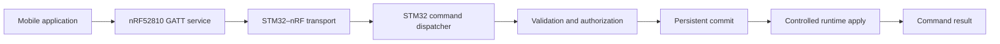
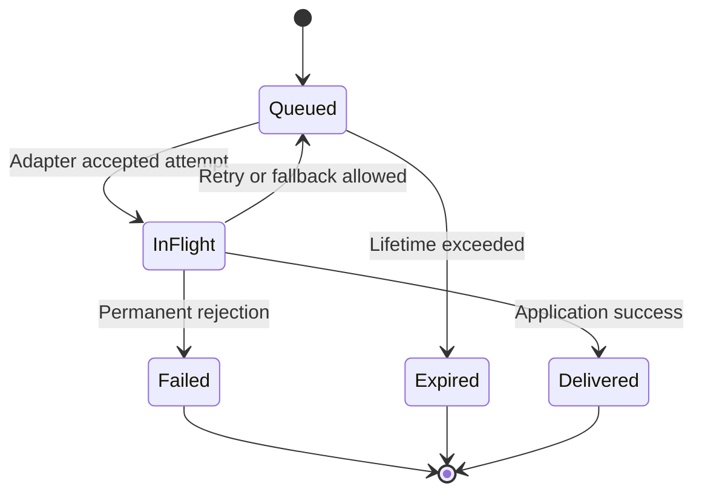

# Communication Architecture

> **Document ID:** COMM-ARCH-000
> **Status:** Draft
> **Baseline:** MQTT and HTTP remote delivery, BLE local service, cooperative event-driven firmware
> **Applies to:** STM32L433RCT6 production firmware, Linux simulation, nRF52810 BLE firmware, EC200U-CN integration, mobile application, and remote services

## 1. Purpose

This document defines the communication architecture of the Smart Water Flow and Pressure Monitor.

It establishes:

* communication actors and trust boundaries;
* responsibilities of MQTT, HTTP, BLE, and internal links;
* the transport-neutral remote-delivery architecture;
* ownership of queues, connection state, protocol state, and delivery state;
* integration with the cooperative event loop, scheduler, repositories, storage, and power manager;
* expected behavior during offline operation, retry, fallback, reboot, and recovery;
* portable interfaces required by Linux simulation and STM32 deployment;
* and architectural decisions that must be resolved by later contract documents.

This document does not define final MQTT topics, HTTP endpoints, BLE UUIDs, byte-level internal frames, credential values, or exact timeout constants. Those belong to the specialized documents referenced in Section 20.

## 2. Scope

### 2.1 In scope

* Local communication through nRF52810 BLE.
* Remote data delivery through MQTT and HTTP over EC200U-CN.
* Approved remote-command ingress where later contracts permit it.
* STM32–nRF52810 and STM32–EC200U-CN internal communication.
* Telemetry, event, status, diagnostic, command, and configuration flows.
* Offline queueing, delivery state, deduplication, retry, and recovery boundaries.
* Linux fakes and deterministic communication simulation.

### 2.2 Out of scope

* Measurement and calibration algorithms.
* Flow, pressure, temperature, volume, and leak-detection calculations.
* Complete EC200U-CN AT-command reference.
* Complete nRF52810 SoftDevice or BLE-stack configuration.
* Cloud deployment topology and production credentials.
* Mobile application user-interface design.
* OTA unless accepted by a separate project decision.
* Unrestricted configuration through cellular channels for the current MVP.

## 3. System baseline

The communication design assumes the following product baseline:

| Area                | Baseline                                                                              |
| ------------------- | ------------------------------------------------------------------------------------- |
| Main controller     | STM32L433RCT6                                                                         |
| Local connectivity  | nRF52810 BLE coprocessor with separate firmware                                       |
| Remote connectivity | EC200U-CN LTE Cat 1 bis modem                                                         |
| Remote protocols    | MQTT and HTTP/HTTPS                                                                   |
| Runtime model       | Cooperative, event-driven, non-preemptive application runtime                         |
| Time base           | Monotonic scheduling plus RTC wall-clock time where valid                             |
| Data publication    | Stable `RuntimeSnapshot` and immutable communication records                          |
| Persistent storage  | FM24CL04B F-RAM with bounded capacity                                                 |
| Reporting baseline  | Scheduled reporting; exceptional events may request earlier delivery if policy allows |
| Validation          | Deterministic Linux simulation before STM32 bring-up                                  |

Communication availability is not a prerequisite for measurement, volume accumulation, leak evaluation, local display, or critical-state persistence.

## 4. Communication actors

| Actor                  | Responsibility                                                                                                  | Does not own                                                                            |
| ---------------------- | --------------------------------------------------------------------------------------------------------------- | --------------------------------------------------------------------------------------- |
| STM32 application core | Produces domain records, schedules reporting, validates commands, owns delivery policy and final delivery state | BLE radio procedures, cellular protocol internals, cloud processing                     |
| nRF52810 firmware      | BLE advertising, connection, GATT operations, security procedures, and translation to the STM32 internal link   | Product configuration validity, measurement algorithms, persistent configuration commit |
| EC200U-CN modem        | Cellular registration, PDP/network context, TLS/network transport, and vendor-supported MQTT/HTTP operations    | Product delivery policy, telemetry record lifecycle, domain semantics                   |
| Mobile application     | Local commissioning, approved configuration, service, and diagnostics                                           | Direct mutation of unvalidated runtime state                                            |
| MQTT broker/service    | MQTT session, routing, subscription, and publish transport                                                      | Automatic proof that application processing completed                                   |
| HTTP service           | Request authentication, telemetry/event/status ingestion, idempotency, and response semantics                   | Device-side queue ownership and retry policy                                            |
| Remote application     | Processes records and issues approved commands                                                                  | Direct access to hardware drivers or repositories                                       |

## 5. Context architecture



There are four different contracts and they shall not be conflated:

1. Mobile application ↔ nRF52810 BLE GATT contract.
2. STM32 ↔ nRF52810 internal transport contract.
3. STM32 ↔ EC200U-CN modem-control contract.
4. Device ↔ remote service MQTT or HTTP application contract.

## 6. Architectural principles

The implementation shall follow these principles:

1. Domain logic remains independent of MQTT, HTTP, BLE, AT commands, and STM32 HAL.
2. MQTT and HTTP are peer remote-delivery adapters behind one transport-neutral delivery service.
3. The reporting scheduler submits records for delivery; it does not call MQTT or HTTP directly.
4. The telemetry queue stores application records, not encoded MQTT packets or HTTP requests.
5. A record retains one stable `record_id` across retries, reconnects, reboot recovery, and channel changes.
6. Protocol adapters own protocol transactions but do not own final product-level delivery policy.
7. Communication processing is non-blocking or explicitly bounded.
8. ISR and low-level callbacks perform minimal capture and publish events for deferred processing.
9. Invalid and stale measurement quality is preserved across every protocol mapping.
10. Configuration success is reported only after validation and required persistent/runtime operations complete.
11. Retry and queue growth are bounded.
12. Transport acknowledgement and application acceptance are modeled separately when they differ.
13. Duplicate delivery is expected and handled explicitly.
14. Vendor-specific APIs remain below portable protocol and service interfaces.
15. Measurement operation continues during local or remote communication failure.

## 7. Logical architecture



### 7.1 Domain repositories

Own authoritative runtime and persistent domain state. Communication modules receive stable copies or immutable records and shall not retain pointers to mutable producer-owned objects beyond documented lifetimes.

### 7.2 Record builder

Maps domain data to protocol-independent records such as:

* `TelemetryRecord`;
* `EventRecord`;
* `DeviceStatusRecord`;
* `DiagnosticRecord`;
* `CommandResultRecord`.

It assigns common metadata including record type, schema version, `record_id`, creation time, expiration, priority, and quality flags.

### 7.3 Transport-neutral delivery queue

Owns records waiting for remote delivery. It shall not encode broker topics, HTTP headers, AT commands, or other transport-specific material.

### 7.4 `RemoteDeliveryService`

Owns the application-level delivery workflow:

* selects an eligible channel according to policy;
* starts one bounded adapter transaction;
* receives normalized adapter results;
* updates record delivery state;
* schedules retry or fallback;
* releases successfully delivered or expired records;
* publishes status and diagnostic events.

### 7.5 Delivery policy

Determines whether MQTT, HTTP, fallback, or limited parallel delivery is allowed for a record class. The detailed policy belongs to `05_remote_delivery_policy.md`.

The architecture supports these modes without choosing one silently:

* fixed MQTT;
* fixed HTTP;
* configurable primary channel;
* primary channel with bounded fallback;
* parallel delivery for explicitly approved critical record classes.

The MVP default mode remains an open decision until recorded and accepted.

### 7.6 MQTT adapter

Owns MQTT-specific connection, session, topic mapping, publish/subscribe, QoS, retained-message handling, and normalized result reporting.

### 7.7 HTTP adapter

Owns HTTP-specific endpoint mapping, request construction, single/batch upload, headers, response parsing, status interpretation, idempotency, partial acceptance, and normalized result reporting.

### 7.8 Modem service

Serializes access to EC200U-CN, owns modem readiness and network lifecycle, parses AT responses and unsolicited indications, and exposes bounded operations to MQTT and HTTP adapters.

The modem service does not decide which application record should be delivered next.

## 8. Local BLE architecture



The nRF52810 owns BLE link procedures. The STM32 owns product semantics.

A BLE write shall not directly modify measurement, configuration, or calibration state. It produces a bounded request that is validated and dispatched by the STM32 application.

For persistent configuration, the logical success path is:

```text
receive request
    -> authenticate and authorize
    -> validate fields and cross-field constraints
    -> commit persistent record when required
    -> apply at an allowed runtime boundary
    -> return final result
```

The exact GATT and internal-frame mappings are defined separately.

## 9. Remote outbound data flow

### 9.1 Scheduled telemetry

```text
reporting deadline
    -> read stable RuntimeSnapshot
    -> build TelemetryRecord
    -> enqueue record
    -> RemoteDeliveryService selects eligible channel
    -> MQTT publish or HTTP upload
    -> normalized adapter result
    -> update delivery state
    -> remove, retry, fallback, or expire record
```

The reporting deadline and delivery attempt are separate concepts. A record may be created on schedule while delivery occurs later because the modem is unavailable, another operation owns it, or backoff is active.

### 9.2 Events and diagnostics

Leak, health, fault, and diagnostic events may create higher-priority records. Priority affects queue selection but shall not create an unbounded preemption or retry loop.

### 9.3 HTTP batching

HTTP may combine compatible records into a bounded batch. Batch formation shall not change individual `record_id`, expiration, priority, or delivery result. Partial acceptance shall be mapped back to each record.

### 9.4 Cross-channel delivery

If policy moves a record from MQTT to HTTP or from HTTP to MQTT:

* the common payload semantics remain unchanged;
* the stable `record_id` remains unchanged;
* protocol-specific envelopes may change;
* the previous attempt result is retained for diagnostics;
* the device and server shall apply documented deduplication rules.

## 10. Remote inbound command flow

Remote command support is limited to command classes accepted by the project scope.

```text
MQTT subscription or approved HTTP response
    -> protocol validation
    -> common CommandRequest
    -> authentication and authorization
    -> duplicate detection
    -> command dispatcher
    -> domain validation
    -> optional persistent commit
    -> controlled runtime apply
    -> CommandResultRecord
    -> remote delivery
```

An MQTT broker acknowledgement or HTTP transport success does not mean the command was accepted by the device. Product-level command results require an explicit application response.

HTTP server-initiated commands are not assumed. If HTTP commands are required, the detailed design must define polling, long polling, response piggybacking, or another bounded mechanism.

## 11. Delivery record lifecycle

The conceptual lifecycle is:



This diagram defines semantics, not mandatory C enum names.

### 11.1 Delivery success

A record is `Delivered` only when the selected protocol contract defines sufficient evidence of remote acceptance:

* MQTT may require more than a transport QoS acknowledgement when business processing confirmation is needed.
* HTTP success depends on the endpoint contract and may be per record for a batch.

### 11.2 Retryable result

A temporary network, session, broker, server, rate-limit, or timeout result may return a record to `Queued` with bounded retry metadata.

### 11.3 Permanent failure

Authentication rejection, unsupported schema, invalid payload, or another documented non-retryable error moves the record to a terminal failure path and emits diagnostics.

### 11.4 Expiration

Records shall not remain indefinitely. Expiration behavior depends on record class and is defined by the common data contract and delivery policy.

## 12. Queue architecture

The queue shall support at least:

* bounded capacity;
* stable record identity;
* record type and priority;
* creation and expiration metadata;
* delivery-attempt metadata;
* safe peek/reserve/complete semantics;
* deterministic overflow behavior;
* recovery after transient adapter failure.

The architecture distinguishes:

| Queue/state               | Purpose                                                             |
| ------------------------- | ------------------------------------------------------------------- |
| Event queue               | Short-lived internal runtime events                                 |
| Delivery queue            | Application records waiting for remote delivery                     |
| Driver buffers            | Temporary bytes owned by UART, BLE, MQTT, HTTP, or modem operations |
| Persistent critical state | Bounded records that must survive reset according to storage policy |

These shall not share ownership implicitly.

Whether the full delivery queue, only critical records, or only queue metadata survives reboot is an open decision constrained by F-RAM capacity.

## 13. Scheduler and event-loop integration

The cooperative runtime requires every communication service to make bounded progress.

### 13.1 Scheduler responsibilities

The scheduler may publish events for:

* report due;
* connection maintenance due;
* retry deadline reached;
* session keep-alive due;
* BLE commissioning timeout;
* modem recovery deadline.

It does not execute network transactions directly.

### 13.2 Event-loop responsibilities

The event loop dispatches communication events to bounded service functions. A service may start an asynchronous platform operation and return. Completion, timeout, or failure re-enters through a later event.

### 13.3 Callback and ISR boundary

UART, GPIO, timer, modem, and BLE callbacks shall:

* capture minimal completion or byte-availability information;
* avoid domain validation and policy decisions;
* avoid unbounded parsing;
* publish or schedule a bounded application event.

### 13.4 Required event categories

Exact identifiers belong to the firmware event catalog, but the architecture requires categories equivalent to:

* record queued;
* delivery requested;
* channel available/unavailable;
* MQTT connected/disconnected/publish complete;
* HTTP response/timeout/partial result;
* delivery retry/fallback/terminal result;
* modem ready/network lost/recovery complete;
* BLE connected/disconnected/request received;
* internal-link frame/error/timeout.

## 14. Ownership and concurrency

| Resource                  | Single owner                       | Access rule                                                                    |
| ------------------------- | ---------------------------------- | ------------------------------------------------------------------------------ |
| Delivery queue            | Remote-delivery repository/service | Other modules submit records through an interface                              |
| Record delivery state     | `RemoteDeliveryService`            | Adapters return normalized results; they do not finalize records independently |
| MQTT session state        | MQTT adapter                       | Queried through status interface; not mutated externally                       |
| HTTP transaction state    | HTTP adapter                       | One bounded transaction context per supported concurrency policy               |
| EC200U modem state        | Modem service                      | MQTT and HTTP request operations through serialized service interfaces         |
| BLE connection/GATT state | nRF52810 firmware                  | STM32 receives normalized link events and requests                             |
| STM32–nRF frame parser    | Internal-link driver/protocol      | Application consumes validated messages only                                   |
| Product configuration     | Config repository/service          | BLE or remote commands submit validated change requests                        |

The MVP shall not assume concurrent independent use of EC200U-CN by MQTT and HTTP unless the modem integration contract proves it safe. A serialized modem-operation model is the default architectural assumption.

## 15. Persistence and reboot recovery

Persistent communication state shall be minimized because F-RAM capacity is limited.

Candidates for persistence include:

* delivery configuration;
* stable sequence or record-identity seed when required;
* critical undelivered events;
* bounded queue checkpoint metadata;
* credential references or protected credential material according to security policy;
* last known reporting state when needed to prevent unintended duplication or loss.

On reboot:

1. validate persistent communication records using their storage contract;
2. restore only accepted versions and CRC-valid content;
3. rebuild runtime connection state as disconnected;
4. retain stable IDs for recovered records;
5. reconnect according to policy;
6. resume delivery without assuming the previous in-flight attempt failed before remote acceptance;
7. rely on idempotency and deduplication where acknowledgement may have been lost.

## 16. Power-management integration

Communication may keep the MCU, nRF52810, or EC200U-CN awake only through explicit bounded power leases or equivalent ownership.

Before entering low power, the power manager shall consider:

* active modem or internal-link transaction;
* pending driver completion;
* scheduled retry or keep-alive deadline;
* BLE connection and commissioning policy;
* queue priority and maximum delivery delay;
* modem shutdown sequence.

A queued record alone does not necessarily prohibit sleep. The delivery policy and next eligible deadline determine wake behavior.

Loss of communication shall not cause continuous wake/retry cycles. Backoff must allow low-power residency where product requirements permit it.

## 17. Security boundaries

The architecture requires:

* authenticated and encrypted remote communication;
* explicit BLE pairing/authorization policy for protected operations;
* device identity separated from protocol-session identifiers;
* credentials accessed through controlled configuration/storage interfaces;
* no secret values in logs, telemetry, test vectors, or normalized traces;
* command authorization before domain execution;
* replay and duplicate protection for state-changing commands;
* certificate, token, and credential failure reported without exposing secrets.

Detailed mechanisms belong to `03_security_and_identity.md` and protocol-specific security documents.

## 18. Configuration model

Communication configuration is divided into:

| Class                         | Examples                                                           | Expected mutability        |
| ----------------------------- | ------------------------------------------------------------------ | -------------------------- |
| Firmware variant              | Supported modem, supported transports, compiled feature set        | Build time                 |
| Provisioned identity/security | Device identity, credential material, certificate trust            | Factory/service controlled |
| Runtime communication policy  | Preferred channel, fallback enabled, report interval within limits | Validated and bounded      |
| Deployment parameters         | Broker profile, server profile, APN or network profile             | Provisioned configuration  |
| Session state                 | Connection, retry counter, current transaction                     | Volatile runtime           |

Configuration changes shall follow the config repository and persistent A/B commit policy when persistence is required. The communication module shall not write F-RAM directly outside the storage contract.

## 19. Fault isolation and recovery

Failures are isolated by layer:

| Failure                      | Owning layer                   | Expected response                                           |
| ---------------------------- | ------------------------------ | ----------------------------------------------------------- |
| Invalid domain record        | Record builder/common contract | Reject before transport encoding                            |
| Delivery queue full          | Delivery repository/policy     | Apply deterministic overflow and diagnostic policy          |
| MQTT session failure         | MQTT adapter                   | Normalize result and request reconnect/retry evaluation     |
| HTTP timeout or server error | HTTP adapter                   | Normalize per-request/per-record result                     |
| Cellular network loss        | Modem service                  | Mark remote channels unavailable and start bounded recovery |
| BLE malformed request        | BLE/nRF/internal-link boundary | Reject without domain mutation                              |
| Internal frame CRC error     | Internal-link protocol         | Drop/NACK according to contract and count diagnostics       |
| Persistent-state corruption  | Storage/repository layer       | Reject invalid record and use defined fallback/default      |

One adapter failure shall not corrupt queue contents or domain repositories. A modem fault may make both MQTT and HTTP unavailable, but their protocol state and diagnostics remain distinguishable.

## 20. Document dependencies

### 20.1 Communication documents

| Document                               | Architectural detail delegated to it                                                                             |
| -------------------------------------- | ---------------------------------------------------------------------------------------------------------------- |
| `01_common_data_contract.md`           | Record models, fields, units, scaling, identity, timestamps, quality, and serialization                          |
| `02_protocol_versioning.md`            | Compatibility, evolution, unsupported versions, and migration                                                    |
| `03_security_and_identity.md`          | Identity, authentication, authorization, credential lifecycle, and trust                                         |
| `04_error_retry_and_timeout_policy.md` | Timeout classes, retry limits, backoff, queue overflow, expiration, and error taxonomy                           |
| `05_remote_delivery_policy.md`         | Channel selection, primary/fallback/parallel rules, health, retry budget, deduplication, and recovery-to-primary |
| `mqtt/*`                               | MQTT connection, session, topics, messages, and tests                                                            |
| `http/*`                               | HTTP API, delivery/batching, messages, and tests                                                                 |
| `ble/*`                                | BLE GATT, commands, security, and tests                                                                          |
| `internal_links/*`                     | STM32–nRF52810 framing and STM32–EC200U integration                                                              |

### 20.2 External project documents

This document depends on the normative project sources for:

* product scope and accepted decisions;
* firmware architecture and source-tree mapping;
* runtime FSM and event catalog;
* scheduler and timing semantics;
* data ownership and `RuntimeSnapshot` publication;
* persistent storage and F-RAM limits;
* power-management and low-power entry rules;
* hardware pin mapping and module power/reset behavior;
* Linux simulation and deterministic fault injection.

Conflicts shall be resolved through the decision registry rather than silently copied into this document.

## 21. Portable interfaces

Exact C APIs belong to firmware design and implementation plans. Architecturally, the portable core requires interfaces equivalent to:

```c
typedef enum {
    REMOTE_CHANNEL_MQTT,
    REMOTE_CHANNEL_HTTP
} RemoteChannel;

typedef enum {
    DELIVERY_RESULT_ACCEPTED,
    DELIVERY_RESULT_RETRYABLE,
    DELIVERY_RESULT_PERMANENT_FAILURE,
    DELIVERY_RESULT_PARTIAL
} DeliveryResultCode;
```

Required capability boundaries include:

* submit/query/remove delivery records;
* query channel capability and health;
* start/cancel/poll bounded MQTT or HTTP operation;
* receive normalized per-record delivery results;
* start modem power/network/session operations;
* send/receive validated nRF52810 internal messages;
* obtain monotonic time and valid wall-clock time;
* persist/recover bounded communication state.

These examples constrain responsibilities, not final names or ABI.

## 22. Linux simulation requirements

The Linux backend shall support deterministic fakes for:

* modem power and network registration;
* MQTT connect, disconnect, publish, acknowledgement, duplicate, and reconnect;
* HTTP success, timeout, authentication failure, server error, duplicate, and partial batch acceptance;
* channel availability and primary/fallback transitions;
* queue capacity, overflow, priority, expiration, and reboot recovery;
* lost acknowledgement after remote acceptance;
* nRF52810 link startup, frames, malformed input, CRC error, timeout, and reset;
* BLE request, validation result, disconnect, and interrupted configuration transaction.

Normalized traces shall use logical identifiers and deterministic time. They shall not contain credentials or unstable platform-specific values.

## 23. Architectural invariants

The following invariants are mandatory:

1. A communication adapter cannot mutate measurement results.
2. A record has at most one owner responsible for its delivery state.
3. A record keeps one stable `record_id` across all permitted delivery attempts.
4. An adapter cannot delete a queued record merely because a transport acknowledgement occurred unless the application contract defines that acknowledgement as sufficient.
5. A protocol failure cannot leave the modem permanently owned by an abandoned transaction.
6. A callback or ISR cannot perform an unbounded protocol workflow.
7. A configuration command cannot report success before required validation and commit complete.
8. Invalid persistent communication state cannot be applied at boot.
9. Queue growth and retry frequency remain bounded during an extended outage.
10. MQTT and HTTP mappings preserve the semantic meaning and quality of the common record.
11. Replacing Linux transport adapters with STM32 adapters does not change domain or wire-contract semantics.

## 24. Open decisions

The following decisions must be resolved before the affected implementation becomes normative:

| Decision                         | Options or question                                                | Blocking impact                              |
| -------------------------------- | ------------------------------------------------------------------ | -------------------------------------------- |
| Remote channel mode              | Fixed, runtime configurable, primary/fallback, or limited parallel | Delivery policy and configuration contract   |
| MVP default channel              | MQTT or HTTP                                                       | Default configuration and acceptance tests   |
| Fallback trigger                 | Failure count, elapsed time, channel state, or combined rule       | Retry and delivery state machine             |
| Recovery to primary              | Immediate, stable-health window, or next reporting cycle           | Duplicate risk and modem use                 |
| Cross-channel deduplication      | Stable `record_id`, idempotency key, server ledger                 | HTTP/MQTT contracts and backend requirements |
| Queue persistence                | Volatile, critical-only, or bounded full queue                     | F-RAM allocation and reboot behavior         |
| HTTP batching                    | Disabled, count-based, size-based, or time-based                   | Memory, latency, power, and API contract     |
| MQTT application acknowledgement | Required for which record classes                                  | Delivery success semantics                   |
| HTTP partial success             | Response representation and retry subset                           | Batch lifecycle and test vectors             |
| Remote commands                  | Allowed command classes and channels                               | Security and command contracts               |
| BLE delivery configuration       | Which channel settings are locally writable                        | BLE GATT/command and persistence contracts   |
| Modem concurrency                | Serialized MQTT/HTTP operations or proven concurrent support       | Modem service design                         |

Until accepted, implementations shall not invent values that would make these wire-visible or persistence-visible decisions irreversible.

## 25. Definition of ready

This architecture may move from `Draft` to `Proposed` when:

* all actors and ownership boundaries are reviewed;
* MQTT and HTTP remote-delivery roles are accepted;
* the default channel-selection model is recorded;
* queue persistence constraints are compatible with F-RAM capacity;
* modem concurrency and power assumptions are confirmed;
* common record identity and deduplication direction are accepted;
* required firmware events and service boundaries are mapped;
* open issues that would change source-tree or wire contracts are explicitly tracked;
* and Linux simulation scenarios cover the critical state and failure flows.

Implementation of the foundation may begin only where unresolved decisions do not change the public data contract, persistent layout, or remote wire behavior.
