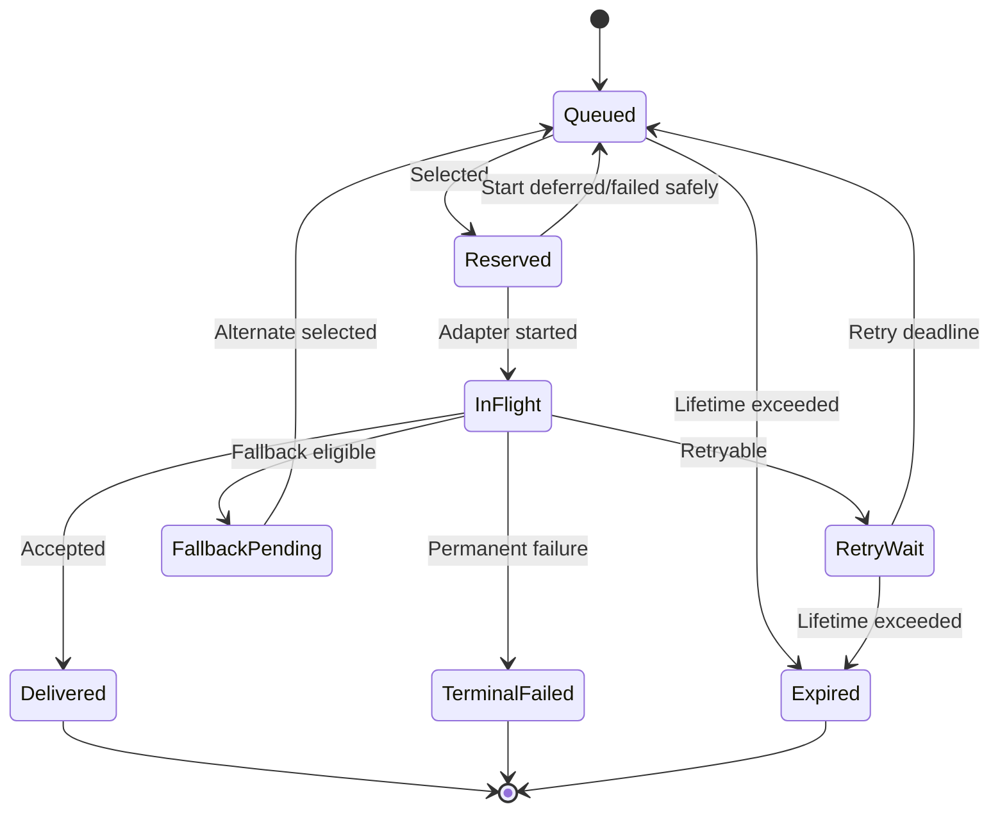

# Remote Delivery Policy

| Metadata | Value |
|---|---|
| Document ID | `COMM-DELIVERY-005` |
| Status | `Proposed` |
| Baseline | MQTT-preferred automatic delivery with bounded HTTP fallback and no default parallel delivery |
| Applies to | RemoteDeliveryService, delivery queue, MQTT adapter, HTTP adapter, EC200U-CN modem service, scheduler, storage, power manager, Linux simulation, and remote ingestion services |

## 1. Purpose

This document defines how transport-neutral application records are selected, queued, delivered, retried, moved between MQTT and HTTP, acknowledged, deduplicated, expired, and finalized.

It specifies:

- supported remote-delivery modes;
- the proposed MVP default channel policy;
- record lifecycle and ownership;
- MQTT/HTTP eligibility and selection;
- failure attribution and fallback triggers;
- recovery to the preferred channel;
- duplicate and idempotency requirements;
- priority, fairness, queue, batching, power, and persistence behavior;
- normalized events, diagnostics, and deterministic tests;
- and acceptance gates for implementation.

This document does not define MQTT topics, HTTP endpoints, payload encoding, credentials, exact AT commands, or final hardware-qualified timeouts. It consumes the contracts defined by the common data, versioning, security, and error/retry documents.

## 2. Design objectives

The remote-delivery policy shall:

1. keep application records independent of MQTT and HTTP;
2. provide deterministic channel selection;
3. prefer the configured channel without creating an availability single point of failure;
4. permit bounded fallback only when it can preserve semantics and security;
5. prevent uncontrolled parallel/duplicate delivery;
6. preserve stable `(device_id, record_id)` across every attempt;
7. distinguish record failure, channel failure, network failure, and security/configuration failure;
8. bound retry, queue growth, modem use, wake time, and data usage;
9. continue local measurement during all remote-delivery failures;
10. support deterministic Linux simulation and later hardware qualification.

## 3. Inputs and dependencies

| Input document/service | Policy dependency |
|---|---|
| `00_communication_architecture.md` | Ownership and transport-neutral service boundaries |
| `01_common_data_contract.md` | Record type, identity, priority, lifetime, quality, and delivery result |
| `02_protocol_versioning.md` | Channel/schema compatibility and capability negotiation |
| `03_security_and_identity.md` | Channel authentication, authorization, credential, and security-blocked state |
| `04_error_retry_and_timeout_policy.md` | Error classification, deadlines, retry budget, backoff, circuit state, and timeout values |
| MQTT documents | MQTT capability, acceptance, session, and receipt semantics |
| HTTP documents | HTTP API, idempotency, batching, partial-result, and status semantics |
| Modem integration | EC200U concurrency, network state, TLS/session operations, and recovery |
| Storage/power documents | Queue persistence, F-RAM budget, wake and power-lease policy |

If an input contract cannot preserve a record's meaning or identity on a channel, that channel is ineligible for that record.

## 4. Normative terminology

| Term | Meaning |
|---|---|
| Preferred channel | Channel selected first by current configuration/policy |
| Alternate channel | Other enabled remote channel eligible for fallback |
| Active channel | Channel currently attempting or selected to deliver a record |
| Fallback | Moving the same immutable record to an alternate eligible channel after policy conditions are met |
| Failback | Returning new eligible delivery work to the preferred channel after recovery |
| Parallel delivery | Simultaneous or intentionally duplicated delivery of one record through both channels |
| Probe | Bounded operation used to evaluate whether a channel has recovered |
| Channel eligibility | Whether channel capability, health, security, configuration, version, and record rules permit an attempt |
| Delivery cycle | Sequence of attempts for one record until delivered, failed, expired, or deferred beyond current service window |
| Urgent window | Bounded interval in which high/critical records may use shorter backoff |
| Acceptance | Evidence sufficient to mark a record delivered according to channel/application contract |

## 5. Supported delivery modes

### 5.1 `MQTT_ONLY`

- MQTT is the only eligible remote-delivery channel.
- HTTP may remain available for non-delivery operations if separately configured.
- MQTT failure queues or terminates records according to retry/lifetime policy; it does not fall back.

### 5.2 `HTTP_ONLY`

- HTTP is the only eligible remote-delivery channel.
- MQTT may remain available for approved command/session operations if separately configured.
- HTTP failure queues or terminates records according to retry/lifetime policy; it does not fall back.

### 5.3 `AUTO_MQTT_PREFERRED`

- MQTT is attempted first when eligible.
- HTTP is the alternate delivery channel.
- Policy may fall back to HTTP after attributable MQTT failure or MQTT incompatibility.
- New records return to MQTT only after recovery criteria are satisfied.

### 5.4 `AUTO_HTTP_PREFERRED`

- HTTP is attempted first when eligible.
- MQTT is the alternate channel.
- Symmetric fallback rules apply where protocol semantics allow.

### 5.5 `PARALLEL_SELECTED_CLASSES`

- Only explicitly allowlisted record classes are delivered through both channels.
- Each copy uses the same `record_id` and immutable semantic payload.
- The policy defines whether one or both acceptances are required.
- This mode is outside the proposed MVP baseline.

## 6. Proposed MVP baseline

This document proposes:

| Policy item | Proposed value |
|---|---|
| Default mode | `AUTO_MQTT_PREFERRED` |
| Preferred channel | MQTT |
| Alternate channel | HTTP |
| Parallel delivery | Disabled |
| Telemetry fallback | Enabled when HTTP supports the same schema/record class |
| Event fallback | Enabled for approved event classes |
| Status fallback | Enabled |
| Diagnostic fallback | Enabled only for allowlisted bounded diagnostics |
| Command-result fallback | Originating/required response channel first; alternate only with an explicit correlation contract |
| Recovery to MQTT | Stable recovery/probe plus safe record boundary |
| Cross-channel identity | Preserve `(device_id, record_id)` |
| Shared modem model | Serialized MQTT/HTTP operations unless concurrency is proven |

These values remain `Proposed` until accepted in the project decision registry.

## 7. Configuration model

### 7.1 `RemoteDeliveryConfig`

| Field | Type | Proposed meaning |
|---|---|---|
| `mode` | `RemoteDeliveryMode` | One supported mode from Section 5 |
| `mqtt_enabled` | `bool` | MQTT adapter may be considered |
| `http_enabled` | `bool` | HTTP adapter may be considered |
| `fallback_enabled` | `bool` | Alternate channel may be selected |
| `parallel_class_mask` | bounded flags | Record classes eligible for intentional parallel delivery; zero for MVP |
| `fallback_failure_threshold` | bounded integer | Consecutive attributable failures before normal fallback |
| `preferred_probe_interval_ms` | bounded duration | Minimum interval between preferred-channel probes |
| `preferred_stable_successes` | bounded integer | Success evidence required before failback |
| `urgent_window_ms` | bounded duration | Short-backoff window for high/critical records |
| `config_revision` | `uint32` | Active configuration revision |

### 7.2 Configuration invariants

1. At least one channel shall be enabled for remote delivery unless delivery is explicitly disabled by product mode.
2. `MQTT_ONLY` requires MQTT enabled.
3. `HTTP_ONLY` requires HTTP enabled.
4. Auto modes require preferred channel enabled; fallback also requires alternate enabled.
5. Parallel class mask shall be zero unless parallel mode is accepted.
6. Values are bounded by firmware validation ranges.
7. Security credentials/endpoints are configured through protected configuration, not this policy object directly.
8. Persistent changes follow A/B commit and controlled runtime-apply rules.

## 8. Record classes and eligibility

### 8.1 Proposed class policy

| Record class | MQTT | HTTP | Fallback | Parallel MVP | Notes |
|---|---:|---:|---:|---:|---|
| Scheduled telemetry | Yes | Yes | Yes | No | Same common semantic record |
| Leak transition event | Yes | Yes | Yes | No | High/critical priority; stable ID |
| Device status | Yes | Yes | Yes | No | May be coalesced before reservation |
| Diagnostic record | Yes | Yes | Conditional | No | Allowlisted and bounded |
| Command result | Yes | Conditional | Conditional | No | Must preserve request correlation |
| Configuration result | Yes | Conditional | Conditional | No | Must not expose sensitive values |

### 8.2 Eligibility predicate

A channel is eligible for a record only if all are true:

```text
channel enabled
AND channel supports record type
AND channel supports semantic schema version
AND channel mapping preserves required fields
AND security identity/credential state valid
AND endpoint/topic/configuration valid
AND channel circuit permits attempt/probe
AND shared modem/network state permits or can be recovered
AND record not expired
AND attempt/fallback budget remains
AND no conflicting in-flight ownership
```

### 8.3 Ineligibility reasons

Ineligibility is reported with a normalized reason:

```text
DISABLED
UNSUPPORTED_RECORD_TYPE
UNSUPPORTED_SCHEMA
SECURITY_BLOCKED
CONFIG_BLOCKED
CHANNEL_OPEN
NETWORK_UNAVAILABLE
MODEM_BUSY
RECORD_EXPIRED
BUDGET_EXHAUSTED
POWER_DEFERRED
```

Temporary ineligibility does not equal permanent record failure.

## 9. Delivery queue ownership

`RemoteDeliveryService` is the single owner of final application-level delivery state. The queue/repository owns record bytes and reservation state under service control.

Protocol adapters shall not:

- remove records;
- change priority/lifetime;
- change semantic payload;
- generate replacement `record_id`;
- independently start alternate-channel delivery;
- mark final delivery success outside normalized result reporting.

## 10. Record lifecycle



These names define semantics and do not require identical C enum names.

### 10.1 Reservation

Reservation prevents:

- concurrent MQTT and HTTP attempts for the same record;
- eviction/coalescing of in-flight data;
- duplicate event-loop selection;
- batch ownership ambiguity.

Reservation has a generation/attempt ID and bounded deadline. Abandoned reservations are recovered deterministically.

### 10.2 Terminal states

| State | Meaning |
|---|---|
| `Delivered` | Sufficient remote application acceptance obtained |
| `TerminalFailed` | Unchanged record cannot/shall not be retried |
| `Expired` | Record lifetime ended before acceptance |

Terminal removal, persistent audit, and diagnostic requirements depend on record class.

## 11. Channel-selection algorithm

At each eligible service turn:

1. Expire/account records whose lifetime ended.
2. Select the highest-priority eligible record using fairness rules.
3. Determine preferred and alternate channel from active config.
4. Evaluate record-specific channel eligibility.
5. If current/pinned channel remains eligible, use it.
6. Otherwise select preferred channel if healthy/eligible.
7. Otherwise select alternate channel if fallback is enabled and safe.
8. If neither is eligible, calculate the earliest meaningful re-evaluation deadline.
9. Reserve the record/batch.
10. Start exactly one bounded adapter operation.

The selection algorithm shall be a pure/testable policy function where practical. Starting hardware/network work is a separate action.

## 12. Record channel affinity

A record may have temporary channel affinity:

- newly queued record: no affinity;
- attempt started: pinned to active channel until terminal result/cleanup;
- retryable same-channel failure: affinity retained until retry threshold/policy transition;
- fallback selected: affinity changes to alternate channel;
- recovered record after reboot: no active transaction, but last-attempt metadata retained;
- parallel mode: explicit per-channel substate required; not used by MVP.

Affinity prevents oscillation after every isolated failure.

## 13. Failure attribution

Fallback depends on attributable cause.

| Failure cause | Record effect | Channel effect | Fallback consideration |
|---|---|---|---|
| Invalid common record | Permanent record failure | None | No |
| Unsupported MQTT mapping, HTTP supported | Keep record | MQTT incompatible for record | Yes |
| MQTT broker unavailable | Retryable | MQTT degraded/open | Yes after threshold/urgent rule |
| HTTP server unavailable | Retryable | HTTP degraded/open | Yes in HTTP-preferred mode |
| Cellular network unavailable | Defer | Both unavailable through shared dependency | No useful immediate fallback |
| Shared modem fault | Defer/recover | Both unavailable | No until modem recovery |
| MQTT credential rejected, HTTP credential independently valid | Security block MQTT | MQTT blocked | Conditional |
| Shared device credential revoked | Security blocked | Both potentially blocked | No normal fallback |
| Record expired | Expired | None | No |
| Target schema unsupported | Keep/fail according to available channels | Target ineligible | Only other compatible channel |

## 14. Proposed fallback triggers

### 14.1 Normal-priority records

Fallback may be considered when any is true:

- preferred channel reaches three consecutive attributable retryable failures;
- preferred channel circuit enters `OPEN`;
- preferred channel is configuration/version/capability-ineligible for this record but alternate is eligible;
- preferred channel is unavailable past its bounded establishment budget;
- server explicitly indicates a retry delay longer than the policy's alternate-channel threshold and alternate delivery is allowed.

### 14.2 High/critical records

During the urgent window, fallback may be considered after:

- one complete preferred-channel attempt fails with a fallback-eligible error;
- preferred channel is already degraded/open;
- preferred channel prerequisites cannot complete inside the record's urgent budget.

Security, shared network/modem, invalid record, and expiry exclusions still apply.

### 14.3 No ping-pong rule

After fallback, the same record remains on the alternate channel until:

- delivered;
- alternate becomes ineligible and a controlled re-evaluation selects otherwise;
- record expires/fails;
- or an explicit policy generation/config revision changes.

It shall not switch channels after every individual failure.

## 15. Proposed fallback sequence

```text
preferred attempt fails
  -> normalize and attribute error
  -> clean up transaction/session ownership
  -> update preferred channel health
  -> evaluate retry budget and fallback threshold
  -> verify alternate capability/security/config/version
  -> preserve original record and record_id
  -> schedule alternate attempt using applicable backoff
  -> start alternate adapter
  -> map result to same record lifecycle
```

Fallback is a new attempt, not a new record.

## 16. Shared modem/network dependency

MQTT and HTTP are logically independent channels but share EC200U-CN and cellular connectivity.

The service shall distinguish:

```text
MQTT-specific failure
HTTP-specific failure
TLS/endpoint-specific failure
shared cellular network failure
shared modem component failure
shared credential/security failure
```

Switching MQTT to HTTP is not useful while the modem has no registered/data network. In that condition, one owner recovers the shared dependency and both channels remain unavailable.

The proposed MVP serializes MQTT and HTTP modem operations. Parallel modem operations require hardware evidence and a new accepted decision.

## 17. HTTP batching policy

HTTP batching is subordinate to record lifecycle.

### 17.1 Batch eligibility

Records may share a batch only when compatible in:

- endpoint and API version;
- semantic schema/batch rules;
- authentication principal;
- priority and delivery deadline;
- record class policy;
- maximum count and encoded size;
- idempotency and response semantics.

### 17.2 Proposed batch formation

- Critical records are sent without waiting for normal batch fill.
- High-priority events may batch only with compatible high-priority records already available.
- Normal telemetry may batch by count, size, or maximum waiting time.
- Reserved batch records cannot be evicted/coalesced.
- Each record retains independent `record_id`, lifetime, and result.

### 17.3 Partial result

For partial HTTP acceptance:

- accepted records become `Delivered`;
- retryable records return to `RetryWait`/queue;
- permanent failures become `TerminalFailed`;
- missing/ambiguous entries follow the HTTP contract's safe idempotent retry rule;
- retry subset does not rebuild accepted records.

Exact batch limits are defined in `http/http_delivery_and_batching.md`.

## 18. MQTT delivery policy

### 18.1 Connection/session reuse

The MQTT adapter may reuse a healthy authenticated session according to power/session policy. The delivery service treats session readiness as channel state, not final delivery evidence.

### 18.2 Acceptance

MQTT delivery is complete only when the record class's contract defines sufficient acceptance:

- transport send completion may be insufficient;
- QoS acknowledgement may be sufficient for selected telemetry only if accepted by project decision;
- command/configuration results may require application receipt/correlation;
- lost receipt uses same-record retry/deduplication.

### 18.3 Queue independence

Broker/session queues do not replace the device application delivery queue unless a separate accepted contract proves equivalent persistence, expiry, identity, and acknowledgement behavior.

## 19. HTTP delivery policy

### 19.1 Acceptance

HTTP delivery is complete according to endpoint-specific response semantics, not merely receipt of any `2xx` status.

Response must define, as applicable:

- accepted/already accepted;
- per-record batch result;
- permanent validation rejection;
- retryable server condition;
- remote receipt/correlation ID;
- bounded retry hint.

### 19.2 Idempotency

Single-record upload idempotency is based on `(device_id, record_id)` or an exact derived idempotency key.

Batch request identity does not replace individual record identity. Retrying a subset preserves each original `record_id`.

## 20. Cross-channel deduplication

Remote ingestion shall converge MQTT and HTTP copies into one logical record.

Rules:

1. Deduplication key is `(device_id, record_id)`.
2. Same key and same canonical semantic payload is duplicate/already accepted.
3. Same key and different payload is a contract/security diagnostic violation.
4. Protocol metadata such as MQTT packet ID or HTTP request ID does not change application identity.
5. Deduplication retention shall cover maximum record lifetime plus maximum delayed delivery/migration margin.
6. Remote response should distinguish already accepted where feasible.
7. Device retry/fallback does not alter creation/sample timestamps.

## 21. Parallel-delivery policy

Parallel delivery is disabled in the proposed MVP.

Reasons:

- doubles cellular data and energy for the same logical record;
- increases ambiguity when only one channel acknowledges;
- requires two sub-attempt states and combined completion policy;
- increases backend deduplication and audit complexity;
- may violate serialized EC200U modem ownership.

If enabled later, each allowlisted record class shall define:

- whether first acceptance or both acceptances complete the record;
- cancellation behavior after first acceptance;
- per-channel attempt state;
- data/power budget;
- duplicate and audit behavior;
- timeout and terminal-failure combination.

## 22. Recovery to preferred channel

Failback shall be conservative to avoid oscillation.

### 22.1 Proposed recovery criteria

MQTT becomes preferred again after all are true:

- MQTT configuration and security state valid;
- shared modem/network healthy;
- MQTT circuit probe succeeds;
- at least two consecutive accepted probe/normal operations or one successful connection plus one accepted record;
- minimum preferred-channel probe interval observed;
- no active alternate transaction is interrupted;
- switch occurs at a record boundary.

### 22.2 Existing fallback records

Records already pinned/reserved for HTTP should finish on HTTP. New records use recovered MQTT after policy transition. Moving all queued fallback records back immediately is not the default.

### 22.3 Failed probe

A failed MQTT probe:

- updates MQTT health;
- schedules next bounded probe with backoff;
- does not interrupt healthy HTTP delivery;
- does not consume a queued record unless record delivery was intentionally used as the probe.

## 23. Priority and fairness

### 23.1 Selection order

Proposed order:

1. Expire/account invalid-lifetime records.
2. Critical records.
3. High-priority records.
4. Normal records.
5. Background records.

Within priority, use deterministic oldest-eligible order unless record-class policy specifies otherwise.

### 23.2 Fairness

Proposed fairness:

- after at most four consecutive critical/high selections, attempt one eligible normal record;
- fairness does not delay a critical record beyond its accepted deadline;
- blocked head record does not prevent selecting another eligible record;
- repeated failure of one record cannot permanently block the queue.

The final burst value requires queue/load simulation.

## 24. Urgent event policy

Leak transition and explicitly critical events may request an urgent delivery window.

During the urgent window:

- shorter backoff applies within the accepted retry budget;
- fallback threshold may be lower;
- modem wake may be requested earlier;
- batching delay is minimized;
- priority remains subject to security/config/version eligibility.

After the urgent window, the record remains queued at its priority but follows normal outage backoff. Urgency shall not create continuous retry during a long outage.

## 25. Queue overflow interaction

Remote-delivery policy applies the overflow order from `04_error_retry_and_timeout_policy.md`:

```text
coalesce allowed class
  -> remove expired
  -> evict oldest lowest-priority eligible record if allowed
  -> reject new record
  -> publish bounded diagnostic/counter
```

Proposed class behavior:

| Class | Coalesce | Evict for higher priority | Persistent loss audit |
|---|---:|---:|---:|
| Periodic status | Yes, latest wins before reservation | Yes | Counter sufficient |
| Periodic telemetry | Conditional by retention policy | Conditional | Counter/summary required |
| Repeated diagnostic | Yes by code/context with count | Conditional | Counter required |
| Leak transition event | No | No by lower class | Required |
| Command/config result | No | No by lower class | Required |
| Security event | Only if catalog explicitly permits | No by lower class | Required |

## 26. Record expiration and loss accounting

When a record expires or terminates permanently:

- remove it only through the owning delivery repository/service;
- increment type/priority/outcome counters;
- emit a bounded diagnostic if required;
- preserve a compact persistent audit marker for critical classes if storage policy requires;
- do not create an identical replacement record automatically;
- future scheduled telemetry is a new record with new identity.

Expiration does not mark either channel successful or failed by itself.

## 27. Persistence and reboot

### 27.1 Proposed persistence tiers

| Tier | Record classes | Proposed behavior |
|---|---|---|
| Volatile | Ordinary periodic status/telemetry if product loss policy permits | Queue in RAM; loss accounted after reset where possible |
| Critical persistent subset | Leak transitions, command/config results, selected security/system events | Persist bounded record or audit state |
| Configuration | Delivery mode, channel enable, thresholds within allowed range | Persist using config A/B contract |

FM24CL04B capacity is limited; full persistent queue support requires explicit size allocation.

### 27.2 Reboot recovery

On reboot:

1. Validate persisted records/configuration.
2. Restore records with original `record_id` and payload.
3. Clear all volatile in-flight adapter/session ownership.
4. Mark recovered in-flight outcome as unknown.
5. Re-evaluate expiry, idempotency, security, version, and channel eligibility.
6. Apply startup jitter/backoff.
7. Resume delivery without assuming prior remote rejection.

## 28. Configuration update behavior

When delivery policy changes:

- validate full new configuration;
- commit persistent revision when required;
- apply at a safe boundary;
- do not interrupt an accepted in-flight transaction unless security requires cancellation;
- increment policy generation;
- re-evaluate queued records after current transaction cleanup;
- preserve all record identities;
- publish bounded configuration result/status.

Disabling a channel does not delete records currently associated with it. Records return to policy evaluation after safe cleanup.

## 29. Security interaction

### 29.1 Channel-specific security block

Fallback may be allowed when one channel has a channel-specific security/configuration failure and the alternate has an independently valid trust path.

Example: MQTT authorization profile invalid while HTTPS device authentication remains valid and backend accepts the record.

### 29.2 Shared security block

Fallback is prohibited when:

- shared device credential revoked;
- trusted time/security prerequisite invalid for both channels;
- common trust anchor invalid for both endpoints;
- device identity/provisioning state invalid;
- policy would downgrade to an insecure transport.

### 29.3 Sensitive records

Diagnostics/config results shall never include credentials. Alternate channel mapping must preserve authorization and privacy classification.

## 30. Power-management policy

The delivery service requests bounded power leases for:

- modem boot/network setup;
- MQTT/HTTP session/transaction;
- cleanup and controlled modem shutdown;
- urgent delivery window where allowed.

Queued records do not hold a permanent lease.

During extended outage:

- retry deadlines permit sleep;
- preferred probes are rate-limited;
- HTTP fallback does not repeatedly power-cycle the same unavailable modem/network;
- critical urgency degrades to bounded normal backoff after urgent window.

## 31. Data-usage policy

The service shall account for:

- attempts and accepted bytes per channel;
- retry/fallback duplicate bytes;
- HTTP header/TLS/session overhead where measurable;
- batch efficiency;
- rejected/expired records;
- parallel delivery if ever enabled.

Remote policy shall not optimize cellular data by weakening security, dropping required quality metadata, or changing semantic records.

## 32. Command and result routing

### 32.1 Command ingress

Commands are authorized and deduplicated independently of delivery mode. Channel selection does not grant authority.

### 32.2 Result routing

Proposed order:

1. Return result through the originating protocol's required response path when contract supports it.
2. If asynchronous result record is required, enqueue transport-neutral `CommandResultRecord`.
3. Alternate-channel fallback is allowed only if the remote service can correlate `command_id` and `record_id` across channels.
4. Do not expose a result on a channel/principal lacking authorization.

## 33. Event-loop and scheduler integration

Required event categories include:

```text
DELIVERY_RECORD_QUEUED
DELIVERY_WORK_DUE
DELIVERY_ATTEMPT_STARTED
DELIVERY_ATTEMPT_RESULT
DELIVERY_RETRY_DUE
DELIVERY_FALLBACK_SELECTED
DELIVERY_RECORD_ACCEPTED
DELIVERY_RECORD_FAILED
DELIVERY_RECORD_EXPIRED
CHANNEL_HEALTH_CHANGED
PREFERRED_CHANNEL_PROBE_DUE
DELIVERY_POLICY_CHANGED
```

Events carry bounded IDs/status, not full secret-bearing protocol objects.

The service performs bounded work per event-loop turn and never recursively starts a fallback transaction inside adapter completion cleanup.

## 34. Reference policy pseudocode

```c
DeliveryDecision RemoteDelivery_Evaluate(
    const DeliveryRecordMeta *record,
    const RemoteDeliveryConfig *config,
    const ChannelStatus *mqtt,
    const ChannelStatus *http,
    uint64_t now_ms)
{
    if (Record_IsExpired(record, now_ms)) {
        return DELIVERY_DECISION_EXPIRE;
    }

    RemoteChannel preferred = SelectPreferred(config);
    RemoteChannel alternate = SelectAlternate(config);

    if (Channel_IsEligible(preferred, record, config)) {
        return Decision_Attempt(preferred);
    }

    if (config->fallback_enabled &&
        Record_AllowsFallback(record) &&
        Channel_IsEligible(alternate, record, config)) {
        return Decision_Attempt(alternate);
    }

    return Decision_Defer(NextEligibilityDeadline(record, mqtt, http));
}
```

This constrains responsibility, not final API names. Actual logic must include affinity, thresholds, retry budget, policy generation, reservation, and security/version eligibility.

## 35. Diagnostics and counters

Minimum observability:

- active delivery mode and config revision;
- preferred and active channel;
- channel health/circuit state;
- queue depth, capacity, high-water mark;
- records accepted by type/channel;
- attempts/retries per channel;
- fallback count MQTT→HTTP and HTTP→MQTT;
- preferred-channel probes and failback count;
- cross-channel duplicate/already-accepted count;
- permanent failure and expiry count by record type;
- queue coalesce/evict/reject count;
- urgent-window start/exhaustion count;
- last normalized failure per channel;
- current blocked reason and next eligible deadline.

Counters saturate and contain no secrets.

## 36. Deterministic Linux scenarios

Simulation shall cover:

1. MQTT healthy; all normal records use MQTT.
2. MQTT fails below threshold; same-channel retry, no fallback.
3. MQTT reaches threshold; HTTP fallback delivers same `record_id`.
4. Shared network unavailable; no useless MQTT↔HTTP switching.
5. MQTT security blocked, independently valid HTTP fallback.
6. Shared credential revoked; both channels blocked.
7. HTTP fallback accepts after MQTT remote acceptance but lost receipt; backend deduplicates.
8. HTTP partial batch result; only retryable subset returns to queue.
9. HTTP `413`; deterministic split where allowed.
10. MQTT recovers; probe succeeds; new records fail back at safe boundary.
11. Probe fails while HTTP continues uninterrupted.
12. Critical event uses urgent fallback then degrades to normal backoff.
13. Queue full; deterministic coalesce/expire/evict/reject.
14. Record expires while both channels unavailable.
15. Reboot with outcome-unknown persistent record; same-ID retry.
16. Policy revision changes preferred channel during in-flight transaction.
17. Unsupported HTTP schema prevents fallback.
18. Parallel mode rejected/disabled in MVP config.
19. Repeated deterministic runs produce byte-identical trace.

## 37. Hardware and backend validation

Before acceptance, verify:

- EC200U serialized MQTT/HTTP switching cost and required session cleanup;
- MQTT session recovery and publish/application-receipt behavior;
- HTTP idempotency and already-accepted response;
- HTTP partial batch response and retry subset;
- backend cross-channel deduplication retention;
- modem/network failure attribution;
- power/data cost of preferred probes and fallback;
- timeout/failure thresholds under weak/no network;
- queue/storage capacity for proposed persistence tiers;
- security credentials and authorization for both channels;
- no data corruption/identity change during fallback and reboot.

## 38. Acceptance criteria

The policy is acceptable when:

- the same record can be delivered through MQTT or HTTP without semantic change;
- one owner controls record state and reservations;
- MQTT failure does not cause immediate unbounded HTTP attempts;
- shared network/modem failures do not cause channel ping-pong;
- fallback preserves stable identity and deduplicates remotely;
- failback does not interrupt in-flight alternate delivery;
- record retry, lifetime, queue, wake, and modem-reset budgets are bounded;
- security/config/version incompatibility is handled explicitly;
- partial HTTP success maps per record;
- power and storage constraints are satisfied;
- deterministic simulation covers every lifecycle transition.

## 39. Policy invariants

1. `RemoteDeliveryService` is the sole owner of final record delivery state.
2. MQTT and HTTP adapters never delete application records directly.
3. One record has at most one active attempt in MVP mode.
4. Fallback preserves `device_id`, `record_id`, payload, timestamps, and quality.
5. Shared modem/network failure does not trigger pointless channel switching.
6. Security failure cannot downgrade delivery to an insecure channel.
7. Record failure does not automatically mark a channel unhealthy.
8. Channel failure does not mutate or rebuild the record.
9. Parallel delivery remains disabled unless explicitly accepted by record class.
10. Recovered preferred channel is used only after stability criteria and at a safe boundary.
11. Queue growth, retry, probe, fallback, wake, and reset rates are bounded.
12. Local measurement continues while remote delivery is blocked.

## 40. Initial proposed decisions

| ID | Proposed decision |
|---|---|
| `COMM-DEL-001` | Use `AUTO_MQTT_PREFERRED` as the MVP default mode |
| `COMM-DEL-002` | Use HTTP as bounded alternate delivery channel for compatible records |
| `COMM-DEL-003` | Disable parallel delivery for MVP |
| `COMM-DEL-004` | Preserve one immutable application record and stable `record_id` across fallback |
| `COMM-DEL-005` | Use three consecutive attributable failures as normal fallback threshold |
| `COMM-DEL-006` | Allow high/critical fallback after one complete fallback-eligible preferred attempt during urgent window |
| `COMM-DEL-007` | Do not switch channels for shared modem/network failure until shared dependency recovers |
| `COMM-DEL-008` | Serialize MQTT and HTTP modem operations unless concurrency is proven |
| `COMM-DEL-009` | Require preferred-channel probe and stable success before failback |
| `COMM-DEL-010` | Finish already-pinned HTTP records before using recovered MQTT for new work |
| `COMM-DEL-011` | Require backend deduplication by `(device_id, record_id)` across MQTT and HTTP |
| `COMM-DEL-012` | Persist only critical delivery subset until F-RAM allocation proves a larger queue feasible |
| `COMM-DEL-013` | Use bounded priority fairness with proposed high-priority burst of four |
| `COMM-DEL-014` | Require per-record HTTP batch outcomes |

## 41. Open decisions

| Decision | Question | Blocking impact |
|---|---|---|
| Default mode approval | Confirm MQTT-preferred automatic fallback or choose another mode | Firmware defaults and tests |
| Record-class fallback | Exact event/diagnostic/result classes eligible | Message catalogs and retention |
| Fallback threshold | Confirm count/time/health combination | State machine and simulation |
| Urgent window | Duration and allowed record classes | Power and reporting requirements |
| Probe interval/stability | Final probe interval and success count | Failback and data/power cost |
| Queue capacity | RAM count/bytes and persistent critical subset | Firmware/storage layout |
| Record lifetimes | Per-class expiry | Queue and loss accounting |
| Fairness burst | Confirm proposed value four | Queue scheduling |
| HTTP batch limits | Count, bytes, wait time, class mixing | HTTP delivery/batching |
| MQTT acceptance | QoS versus application receipt by record class | Delivery completion |
| Command-result fallback | Cross-channel correlation/authorization | MQTT/HTTP message contracts |
| Backend dedupe retention | Required retention duration | Remote service storage |
| HTTP→MQTT fallback | Required for `AUTO_HTTP_PREFERRED` in MVP or future only | Test scope |
| Persistent audit | Which terminal failures/losses survive reboot | F-RAM allocation |

## 42. Definition of ready

This document may move from `Proposed` to `Accepted` when:

- default delivery mode is accepted in the decision registry;
- fallback-eligible record classes are enumerated;
- fallback, urgent-window, probe, and failback thresholds are accepted;
- MQTT application-acceptance semantics are defined;
- HTTP idempotency, batch, partial-result, and already-accepted semantics are defined;
- backend cross-channel deduplication is confirmed;
- queue capacity, record lifetimes, overflow, and persistence tier fit memory/F-RAM constraints;
- EC200U MQTT/HTTP serialization and switching behavior are validated;
- power/data budgets are reviewed;
- all lifecycle, failure, reboot, and policy-change scenarios pass deterministic Linux tests;
- and no unresolved path can create parallel ownership, infinite ping-pong, unbounded retry, or silent record loss.
