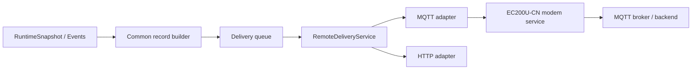

# MQTT Communication Contract

| Metadata | Value |
|---|---|
| Document ID | `COMM-MQTT-INDEX` |
| Status | `Proposed` |
| Baseline | MQTT remote delivery integrated through transport-neutral `RemoteDeliveryService` |
| Applies to | STM32 firmware, Linux simulation, EC200U-CN modem integration, MQTT broker/backend, and remote application services |

## 1. Purpose

This directory defines the MQTT application and integration contract for the Smart Water Flow and Pressure Monitor.

The MQTT documents specify:

- MQTT connection and session lifecycle;
- broker, TLS, authentication, and client identity requirements;
- topic namespace and publish/subscribe ownership;
- telemetry, event, status, diagnostic, command, and result messages;
- QoS, retained-message, Last Will, Keep Alive, and acknowledgement policy;
- mapping from transport-neutral common records to MQTT payloads;
- duplicate, retry, reconnect, offline, fallback, and recovery behavior;
- and deterministic test vectors for firmware, simulator, broker, and backend integration.

This README defines scope, boundaries, terminology, document ownership, and reading order. It does not define the final field-by-field payload or topic list.

## 2. MQTT role in the system

MQTT is a remote application protocol operating over the EC200U-CN cellular connection.

In the proposed MVP delivery policy:

- MQTT is the preferred remote-delivery channel;
- HTTP is an alternate delivery channel for compatible records;
- one application record has at most one active delivery attempt;
- fallback preserves the original `(device_id, record_id)` and immutable semantic payload;
- parallel MQTT/HTTP delivery is disabled by default;
- MQTT failure does not stop local measurement or persistence of critical state.



MQTT is an adapter behind `RemoteDeliveryService`; it is not the owner of the delivery queue or final record lifecycle.

## 3. Scope

### 3.1 In scope

- MQTT protocol/application-version selection.
- Broker connection and session lifecycle.
- TLS and device authentication references.
- Client identity and session configuration.
- Topic namespace.
- Publish and subscribe responsibilities.
- QoS and retained-message policy.
- Last Will and device-presence/status policy.
- Common-record payload mapping.
- Remote command ingress and command-result egress where approved.
- Application acknowledgement where transport acknowledgement is insufficient.
- Reconnect, retransmission, duplicate, and session-recovery behavior.
- EC200U-CN integration boundary.
- Linux simulation and broker/backend interoperability tests.

### 3.2 Out of scope

- Measurement, volume, pressure, temperature, leak, and calibration algorithms.
- Ownership and construction of `RuntimeSnapshot`.
- HTTP endpoint and batch-upload design.
- BLE GATT and local commissioning.
- STM32–nRF52810 internal framing.
- Complete EC200U-CN AT-command documentation.
- Cloud deployment topology and broker administration procedure.
- Production secrets, private keys, passwords, or certificates.
- OTA unless accepted through a separate project decision.

## 4. Normative dependencies

The MQTT documents depend on:

| Document | MQTT dependency |
|---|---|
| `../00_communication_architecture.md` | Actors, ownership, runtime, modem, and protocol-adapter boundaries |
| `../01_common_data_contract.md` | Record models, identity, fields, units, quality, commands, and delivery results |
| `../02_protocol_versioning.md` | Schema/protocol compatibility and version negotiation |
| `../03_security_and_identity.md` | TLS, server validation, device credentials, authorization, and replay protection |
| `../04_error_retry_and_timeout_policy.md` | Timeout, retry, backoff, error classification, and channel health |
| `../05_remote_delivery_policy.md` | MQTT preference, fallback eligibility, failback, record lifecycle, and deduplication |
| `../internal_links/stm32_ec200u_integration.md` | Modem lifecycle, AT ownership, MQTT operation, and recovery |

If a MQTT document conflicts with a common semantic definition, the common data contract owns the data meaning and the MQTT document owns only its MQTT mapping.

## 5. Directory structure

```text
mqtt/
├── README.md
├── mqtt_connection_and_session.md
├── mqtt_topic_namespace.md
├── mqtt_message_catalog.md
└── mqtt_test_vectors.md
```

## 6. Document ownership

| Document | Normative responsibility |
|---|---|
| `README.md` | MQTT scope, role, boundaries, document map, and development order |
| `mqtt_connection_and_session.md` | Protocol version, broker connection, TLS/session, Keep Alive, Last Will, reconnect, and session restoration |
| `mqtt_topic_namespace.md` | Topic hierarchy, topic versioning, direction, ownership, QoS/retain defaults, and authorization boundary |
| `mqtt_message_catalog.md` | Field-by-field MQTT payload mapping, trigger, acknowledgement, duplicate, and command/result semantics |
| `mqtt_test_vectors.md` | Canonical positive/negative payloads, session scenarios, duplicate/retry/fallback, and interoperability tests |

### 6.1 What does not belong in README

The following changes shall be made in their normative owner:

| Change | Owning document |
|---|---|
| Add/change semantic measurement field | `../01_common_data_contract.md` first |
| Map common field into MQTT payload | `mqtt_message_catalog.md` |
| Change topic path | `mqtt_topic_namespace.md` |
| Change QoS/retain by topic/message | Topic namespace and/or message catalog |
| Change broker/session/Keep Alive | `mqtt_connection_and_session.md` |
| Change MQTT/HTTP fallback | `../05_remote_delivery_policy.md` |
| Change timeout/backoff classification | `../04_error_retry_and_timeout_policy.md` |
| Change credential/TLS policy | `../03_security_and_identity.md` |

## 7. Recommended reading and implementation order

Read the common foundation first:

1. `../00_communication_architecture.md`
2. `../01_common_data_contract.md`
3. `../02_protocol_versioning.md`
4. `../03_security_and_identity.md`
5. `../04_error_retry_and_timeout_policy.md`
6. `../05_remote_delivery_policy.md`

Then develop MQTT contracts in this order:

1. `mqtt_connection_and_session.md`
2. `mqtt_topic_namespace.md`
3. `mqtt_message_catalog.md`
4. `mqtt_test_vectors.md`

Implementation shall not begin from example payloads alone. Session, topic, message, acknowledgement, security, and test contracts must be sufficiently defined first.

## 8. MQTT actors and responsibilities

| Actor | Responsibility |
|---|---|
| Record builder | Creates immutable protocol-independent records |
| Delivery queue | Stores records and reservation metadata |
| `RemoteDeliveryService` | Selects MQTT, starts attempts, interprets normalized results, owns final delivery state |
| MQTT adapter | Owns MQTT connection/session and maps records to topics/payloads |
| Modem service | Owns EC200U-CN power, network, AT-command serialization, and normalized modem operations |
| MQTT broker | Authenticates/authorizes client and routes published/subscribed messages |
| Remote ingestion service | Validates schema, deduplicates records, stores/processes data, and emits application receipts if required |
| Remote command service | Publishes approved commands and consumes command results |

## 9. Proposed MQTT data flows

### 9.1 Outbound record flow

```text
CommonRecordEnvelope
    -> delivery queue reservation
    -> MQTT eligibility check
    -> topic selection
    -> MQTT payload encoding
    -> modem/MQTT publish operation
    -> MQTT transport result
    -> optional application receipt
    -> normalized DeliveryAttemptResult
    -> RemoteDeliveryService finalizes/retries/falls back
```

### 9.2 Inbound command flow

```text
broker subscription message
    -> topic authorization/context validation
    -> payload size and syntax validation
    -> schema/version validation
    -> CommandRequest
    -> authentication/authorization and replay check
    -> command dispatcher
    -> domain validation and controlled apply
    -> CommandResultRecord
    -> MQTT response/result delivery
```

MQTT receive does not directly mutate repositories or hardware state.

## 10. Proposed record coverage

| Common record | MQTT direction | Proposed MVP |
|---|---|---:|
| `TelemetryRecord` | Device → service | Yes |
| `EventRecord` | Device → service | Yes |
| `DeviceStatusRecord` | Device → service | Yes |
| `DiagnosticRecord` | Device → service | Conditional allowlist |
| `CommandRequest` | Service → device | Conditional approved command set |
| `CommandResultRecord` | Device → service | Yes when commands enabled |
| `ConfigurationResultRecord` | Device → service | Yes when corresponding configuration path enabled |

The detailed message list and field mapping belong to `mqtt_message_catalog.md`.

## 11. MQTT acknowledgement layers

MQTT delivery uses distinct acknowledgement layers:

| Layer | Evidence | Meaning |
|---|---|---|
| Modem/UART | AT/modem operation completed | Modem accepted/completed a local operation |
| MQTT transport | QoS-dependent protocol acknowledgement | Broker-level MQTT delivery evidence |
| Remote application | Explicit receipt/result when defined | Backend accepted/processed the application record |

These shall not be treated as interchangeable.

For each message type, `mqtt_message_catalog.md` shall state which layer is sufficient to mark the application record `Delivered`.

## 12. Stable identity and duplicates

### 12.1 Application identity

The deduplication key is:

```text
(device_id, record_id)
```

Rules:

- retry preserves `record_id`;
- reconnect preserves `record_id`;
- MQTT→HTTP fallback preserves `record_id`;
- MQTT Packet Identifier does not replace `record_id`;
- same ID with different semantic payload is a contract violation;
- remote ingestion shall recognize already-accepted records.

### 12.2 Command identity

Inbound commands use `command_id`, not outbound `record_id`, to prevent duplicate execution. Command results reference the original `command_id` and receive their own outbound record identity when queued as records.

## 13. MQTT and HTTP relationship

In `AUTO_MQTT_PREFERRED` mode:

1. MQTT is selected when eligible and healthy.
2. MQTT-specific failure updates MQTT channel health.
3. Shared cellular/modem failure makes both MQTT and HTTP unavailable; it does not trigger immediate channel switching.
4. Compatible records may fall back to HTTP after delivery-policy conditions are met.
5. Existing MQTT attempt cleanup completes before HTTP starts.
6. Backend deduplicates cross-channel delivery using common identity.
7. MQTT is used again only after preferred-channel recovery/failback criteria.

The MQTT adapter shall not start HTTP fallback itself.

## 14. Session and connection boundary

`mqtt_connection_and_session.md` shall define:

- selected MQTT protocol version;
- broker address/profile source;
- port and TLS mode;
- client identity and authentication reference;
- clean-start/session-expiry behavior;
- Keep Alive;
- Last Will;
- subscription establishment/restoration;
- reconnect and backoff;
- session invalidation after modem reset or configuration change;
- conditions for declaring MQTT `READY`.

The adapter shall not report `READY` before required authentication, session, and subscription state is valid.

## 15. Topic boundary

`mqtt_topic_namespace.md` shall define every topic pattern with:

- stable name/purpose;
- direction;
- publisher and subscriber;
- device/product namespace;
- protocol/topic version;
- associated common record/message;
- QoS;
- retained flag;
- authorization rule;
- maximum publish frequency where needed;
- deprecation/migration behavior.

Topic strings shall not become hidden substitutes for fields that belong in the common data contract unless topic routing requires them.

## 16. Payload boundary

`mqtt_message_catalog.md` shall define for each message:

- message name and version;
- topic reference;
- trigger and preconditions;
- common-record source;
- field mapping and encoding;
- required/optional fields;
- integer and `uint64` representation;
- maximum size;
- QoS/retain and acceptance rule;
- duplicate and expiry behavior;
- valid and invalid examples.

MQTT payload documents do not redefine measurement algorithms, units, validity, or quality flags owned by the common data/domain contracts.

## 17. Security boundary

The MQTT baseline requires:

- authenticated encrypted production connection;
- server identity validation;
- per-device authentication scheme selected by security contract;
- least-privilege publish/subscribe authorization;
- prevention of one device accessing another device's namespace;
- secret redaction from logs and traces;
- command version, authorization, expiry, replay, and duplicate validation;
- no automatic downgrade to an insecure connection profile.

Exact credentials and TLS configuration are deployment data and shall not appear in these documents.

## 18. Error and recovery boundary

The MQTT adapter normalizes failures such as:

- network unavailable;
- TLS/server validation failed;
- authentication/authorization rejected;
- broker unavailable;
- connect/session timeout;
- publish timeout;
- subscription failure;
- unsupported topic/payload contract;
- application receipt rejection;
- modem reset/disconnect.

`RemoteDeliveryService` decides retry, fallback, terminal failure, or defer using the shared reliability and delivery policy.

## 19. Retained-message policy

Retained messages require explicit per-topic approval.

Proposed baseline:

- ordinary telemetry is not retained;
- command topics are not retained by default;
- device presence/status may use retained data only when stale/expiry semantics are explicit;
- Last Will is distinct from retained application status;
- a retained inbound command shall never execute without version, authorization, identity, expiry, and duplicate checks.

Final values belong to the topic/message documents.

## 20. Last Will policy

If enabled, Last Will shall:

- use an explicitly authorized status topic;
- contain bounded non-secret status information;
- indicate unexpected connection loss rather than definitive device failure;
- include schema/version where payload is structured;
- have documented QoS and retained behavior;
- be reconciled with normal online/status publication after reconnect.

Last Will is broker-published session evidence and is not generated from `RuntimeSnapshot` at disconnect time.

## 21. Offline and reconnect behavior

When MQTT is unavailable:

- application records remain in the transport-neutral queue subject to lifetime/capacity policy;
- the MQTT adapter owns only session/attempt state;
- backoff uses monotonic deadlines;
- repeated reconnect does not create new records;
- shared network/modem recovery has one owner;
- HTTP fallback is requested only through delivery policy;
- queued data does not keep the modem awake indefinitely.

After reconnect:

- session/subscriptions are reconciled;
- retained inbound messages are revalidated;
- records are selected through normal queue policy;
- duplicates retain the same application identity;
- recovery does not bypass priority or expiry checks.

## 22. Configuration ownership

Candidate MQTT configuration includes:

- enable/disable state;
- broker profile reference;
- port/TLS profile reference;
- client/credential reference;
- Keep Alive/session settings within allowed ranges;
- topic-contract version;
- application schema version produced;
- command-subscription enable state;
- diagnostic verbosity/allowlist within product policy.

Configuration shall be validated, persistently committed where required, and applied at a safe boundary. Production secrets are provisioned through protected security workflow, not ordinary MQTT configuration.

## 23. Power and modem ownership

- MQTT requests a bounded modem/power operation through the modem service.
- The MQTT adapter does not directly toggle modem power/reset GPIO outside the platform/modem contract.
- Active session policy balances Keep Alive, reconnect cost, reporting schedule, and low-power requirements.
- A queued record alone does not hold a permanent power lease.
- During extended outage, reconnect backoff permits low-power residency.
- HTTP and MQTT operations are serialized for MVP unless EC200U-CN concurrency is proven.

## 24. Implementation mapping

The intended dependency direction is:

```text
Common records and delivery queue
    -> RemoteDeliveryService
    -> MQTT adapter/service
    -> modem service interface
    -> Linux fake or STM32 EC200U adapter
```

Suggested portable responsibilities:

- `MqttAdapter_Init()` initializes volatile adapter state;
- `MqttAdapter_RequestConnect()` starts bounded connection/session work;
- `MqttAdapter_Publish()` starts one bounded publish attempt;
- `MqttAdapter_HandleEvent()` advances state from normalized modem events;
- `MqttAdapter_GetStatus()` reports capability/session/channel state;
- normalized completion returns `DeliveryAttemptResult` to the delivery service.

Names are illustrative, not final ABI.

## 25. Linux simulation scope

The MQTT fake shall support deterministic injection of:

- broker available/unavailable;
- TLS/authentication success and failure;
- clean/new and restored session;
- connect timeout;
- subscription success/failure;
- publish success by QoS;
- lost/delayed/duplicate acknowledgement;
- broker disconnect during publish;
- retained and duplicate command delivery;
- application receipt success/rejection/timeout;
- MQTT failure followed by HTTP fallback;
- MQTT recovery probe and failback;
- modem reset and stale completion.

No production credential shall appear in simulation fixtures or traces.

## 26. Minimum test groups

| Test group | Purpose |
|---|---|
| Connection/session | Validate lifecycle, timeout, reconnect, restore, Keep Alive |
| Topic authorization | Validate direction, namespace, and device isolation |
| Payload/schema | Validate mappings, bounds, unknown fields, versions, and quality |
| QoS/acceptance | Distinguish transport and application completion |
| Duplicate/retry | Preserve record/command identity and avoid repeated side effects |
| Offline/recovery | Queue, backoff, modem reset, reconnect, and low power |
| Fallback/failback | MQTT→HTTP transition and safe return to MQTT |
| Security | TLS/auth failure, unauthorized topic/command, secret redaction |
| Compatibility | Old/new schema, topic, and session combinations |

Canonical cases are defined in `mqtt_test_vectors.md`.

## 27. MQTT invariants

1. MQTT does not own or modify measurement-domain data.
2. MQTT does not own final record lifecycle.
3. One semantic record keeps one stable `record_id` across MQTT attempts and HTTP fallback.
4. MQTT Packet Identifier is not application identity.
5. MQTT ACK meaning is documented per message and is not automatically application acceptance.
6. Unknown or unauthorized commands cause no domain side effects.
7. Topic, payload, security, and session versions are validated before protected processing.
8. Session restoration does not bypass subscription or retained-message validation.
9. MQTT failure remains bounded and does not stop local measurement.
10. Secrets are absent from topics, payloads, logs, and test vectors unless a protected protocol explicitly requires a non-secret credential identifier.

## 28. Initial proposed decisions

| ID | Proposed decision |
|---|---|
| `COMM-MQTT-001` | Use MQTT as preferred remote-delivery channel in proposed MVP auto mode |
| `COMM-MQTT-002` | Keep MQTT behind transport-neutral `RemoteDeliveryService` |
| `COMM-MQTT-003` | Store common application records rather than encoded MQTT packets in the delivery queue |
| `COMM-MQTT-004` | Preserve stable `(device_id, record_id)` across retry, reconnect, and HTTP fallback |
| `COMM-MQTT-005` | Disable retained telemetry and retained commands by default |
| `COMM-MQTT-006` | Require explicit per-message definition of transport versus application acceptance |
| `COMM-MQTT-007` | Require authenticated encrypted production MQTT with least-privilege topic authorization |
| `COMM-MQTT-008` | Serialize MQTT and HTTP modem operations for MVP until concurrency is proven |
| `COMM-MQTT-009` | Route fallback/failback decisions through remote-delivery policy, not MQTT adapter |
| `COMM-MQTT-010` | Use deterministic MQTT fake and canonical interoperability test vectors before hardware integration |

## 29. Open decisions

| Decision | Question | Owning follow-up document |
|---|---|---|
| MQTT protocol version | MQTT 3.1.1 or MQTT 5 based on EC200U/backend support | `mqtt_connection_and_session.md` |
| Session policy | Clean start, persistent session, and expiry behavior | `mqtt_connection_and_session.md` |
| Keep Alive | Final value/range and power tradeoff | `mqtt_connection_and_session.md` |
| Last Will | Topic, payload, QoS, retain, and reconciliation | Connection/session and message catalog |
| Topic versioning | Versioned path, payload-only version, or combined rule | `mqtt_topic_namespace.md` |
| Topic tree | Final device/product/topic hierarchy | `mqtt_topic_namespace.md` |
| Payload encoding | JSON, CBOR, or accepted mapping | `mqtt_message_catalog.md` |
| `uint64` representation | Decimal string or verified numeric representation | `mqtt_message_catalog.md` |
| QoS per message | Telemetry/event/status/command/result QoS | Topic and message documents |
| Application receipts | Required record classes and receipt topic/schema | `mqtt_message_catalog.md` |
| Remote commands | Allowed command set and authorization | Message catalog and security contract |
| Broker limits | Payload, inflight, rate, session, retained limits | Connection/session and validation |

## 30. Definition of ready

This README may move from `Proposed` to `Accepted` when:

- MQTT role and boundaries are accepted;
- MQTT protocol version and EC200U/backend capability are selected;
- connection/session policy is defined;
- topic namespace and authorization are complete;
- message catalog maps every supported common record/command;
- QoS, retained, Last Will, and application acceptance are explicit;
- MQTT/HTTP fallback behavior matches remote-delivery policy;
- security configuration is validated against the selected broker/backend;
- canonical positive, negative, duplicate, reconnect, and compatibility tests exist;
- and no open decision changes an already implemented wire-visible contract without versioning.
