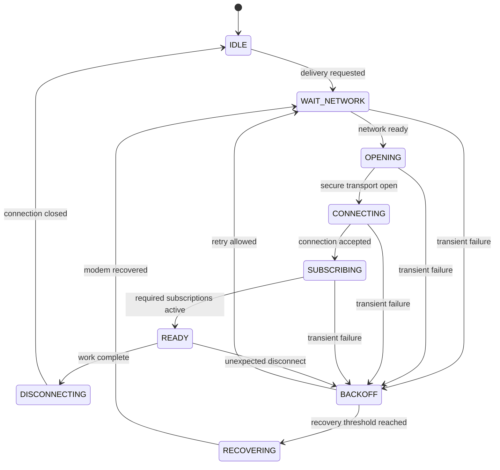

# MQTT Connection and Session

| Metadata | Value |
| --- | --- |
| Document ID | COMM-MQTT-CONN-001 |
| Status | Proposed |
| Baseline | MQTT connection and session behavior for remote delivery |
| Applies to | STM32 firmware, EC200U integration, Linux simulation, MQTT broker, and remote services |

## 1. Purpose

This document defines how a device establishes, maintains, and closes an MQTT connection. It also defines the conditions under which MQTT publishing and subscribing are allowed, and how the system recovers from network, broker, modem, and session failures.

Topic names and application payloads are outside this document. They are defined in:

- [mqtt_topic_namespace.md](mqtt_topic_namespace.md)
- [mqtt_message_catalog.md](mqtt_message_catalog.md)
- [../01_common_data_contract.md](../01_common_data_contract.md)
- [../05_remote_delivery_policy.md](../05_remote_delivery_policy.md)

## 2. Scope

This document covers:

- MQTT protocol version and transport security;
- broker and client configuration;
- connection and disconnection lifecycle;
- MQTT session behavior;
- subscriptions and readiness criteria;
- Keep Alive and Last Will behavior;
- reconnect, backoff, and recovery;
- interaction with the EC200U modem;
- connection-related observability and test requirements.

It does not define:

- topic strings;
- telemetry, event, acknowledgement, or command schemas;
- HTTP fallback rules;
- BLE connection behavior;
- internal STM32-to-EC200U frame encoding.

## 3. Normative language

The terms **MUST**, **MUST NOT**, **SHOULD**, **SHOULD NOT**, and **MAY** express requirement strength.

Requirements marked **Proposed** are the project baseline until verified against the selected broker, SIM/network configuration, and the exact EC200U-CN firmware revision.

## 4. Roles and ownership

| Component | Responsibility |
| --- | --- |
| RemoteDeliveryService | Selects MQTT as the active remote channel and requests delivery of queued records |
| MQTT transport | Owns the MQTT state machine, connection readiness, publish requests, subscriptions, and MQTT result mapping |
| EC200U integration | Owns modem commands, asynchronous modem responses, data-context state, and modem recovery |
| DataRepository | Stores application records; it does not own MQTT session state |
| Remote service | Authenticates the device, receives publications, and publishes permitted commands or acknowledgements |

Only one component MUST own the active MQTT operation. MQTT and HTTP modem operations MUST be serialized unless concurrent operation is explicitly validated for the deployed modem firmware.

## 5. Proposed MVP profile

| Parameter | Proposed value | Notes |
| --- | --- | --- |
| MQTT version | MQTT 3.1.1 | Must be confirmed on the deployed EC200U-CN firmware |
| Transport | MQTT over TLS | Plaintext MQTT is prohibited outside an isolated development environment |
| Broker host and port | Provisioned configuration | Must not be hard-coded into application logic |
| Client ID | Stable value derived from `device_id` | Identifier, not a secret |
| Authentication | Device-scoped credentials | Exact mechanism depends on broker provisioning |
| Clean Session | `1` | Device resubscribes after every successful connection |
| Keep Alive | 60 seconds | Tunable after field measurement |
| Default publish QoS | QoS 1 | Final per-message choice belongs in the message catalog |
| Subscription QoS | QoS 1 maximum | Broker may grant a lower QoS |
| In-flight publish limit | 1 | Simplifies modem ownership, retries, and acknowledgement correlation |
| Last Will | Enabled when a presence topic is supported | QoS 1; retained use requires an explicit stale-state policy |
| Graceful disconnect | Required when the modem and network are responsive | May be skipped during forced recovery |

MQTT 5.0 features MUST NOT be used in the MVP contract unless support is proven for the modem firmware, broker, and remote service. A future migration must follow [../02_protocol_versioning.md](../02_protocol_versioning.md).

## 6. Configuration contract

The MQTT transport MUST obtain configuration from a provisioning or configuration layer. It MUST NOT embed production credentials in source code, logs, test vectors, or documentation.

Minimum configuration fields:

| Field | Required | Validation |
| --- | --- | --- |
| `enabled` | Yes | Boolean |
| `broker_host` | Yes | Non-empty hostname or approved IP address |
| `broker_port` | Yes | `1..65535`; normally the configured TLS listener |
| `client_id` | Yes | Non-empty, stable, broker-compatible length and character set |
| `username` | Broker-dependent | Must not be logged in full |
| `credential_ref` | Broker-dependent | Reference to protected credential storage, not the secret value |
| `tls_profile` | Yes | Identifies trust anchors, validation mode, and optional client identity |
| `keep_alive_s` | Yes | Proposed baseline: `60` |
| `clean_session` | Yes | Proposed MVP value: `true` |
| `connect_timeout_ms` | Yes | Must align with the common timeout policy |
| `publish_timeout_ms` | Yes | Must align with the common timeout policy |
| `last_will_enabled` | Yes | Boolean |

Invalid or incomplete configuration MUST place the transport in `CONFIG_BLOCKED`. It MUST NOT continuously retry until the configuration changes.

## 7. Client identity

The MQTT Client ID MUST uniquely identify one logical device within the broker namespace. It SHOULD be deterministically derived from the stable `device_id`, for example:

```text
swfpm-<device_id>
```

The final format and maximum length MUST be validated against broker and modem restrictions.

The Client ID:

- MUST remain stable across normal restarts;
- MUST NOT contain a password, token, IMSI, or other secret;
- MUST NOT be reused by two active physical devices;
- MAY change only as part of an explicit reprovisioning or identity replacement process.

If the broker disconnects an older connection because the same Client ID reconnects, the event MUST be recorded as a possible duplicate-identity or stale-session condition.

## 8. TLS and authentication prerequisites

Before opening an MQTT session:

1. the modem MUST be operational;
2. network registration and the required packet-data context MUST be available;
3. the device clock MUST be sufficiently valid for certificate validation, when required by the TLS profile;
4. the broker address, TLS profile, Client ID, and required credentials MUST be valid;
5. no conflicting modem operation may own the modem interface.

The TLS requirements, credential lifecycle, and device identity model are defined in [../03_security_and_identity.md](../03_security_and_identity.md).

Certificate validation MUST NOT be disabled in production. A certificate, authentication, or authorization failure MUST enter `SECURITY_BLOCKED` after the configured bounded attempt policy. It MUST NOT trigger an unlimited fast reconnect loop.

## 9. Connection state machine

| State | Meaning |
| --- | --- |
| `DISABLED` | MQTT is disabled by configuration or delivery policy |
| `IDLE` | MQTT is enabled but no connection is currently required |
| `WAIT_NETWORK` | Waiting for modem readiness, network registration, or data context |
| `OPENING` | Opening the broker transport connection and performing TLS setup |
| `CONNECTING` | MQTT CONNECT has been issued; waiting for the connection result |
| `SUBSCRIBING` | Required subscriptions are being restored |
| `READY` | Required session setup is complete; publishing is allowed |
| `DISCONNECTING` | Graceful MQTT disconnect and transport close are in progress |
| `BACKOFF` | Waiting before another connection attempt |
| `RECOVERING` | Recovering the modem or clearing inconsistent transport state |
| `CONFIG_BLOCKED` | Configuration is invalid or incomplete |
| `SECURITY_BLOCKED` | Security validation or authentication prevents connection |

Allowed high-level transitions:



`CONFIG_BLOCKED`, `SECURITY_BLOCKED`, and `DISABLED` are omitted from the diagram for readability. They may be entered from any pre-ready state when their corresponding condition is detected.

## 10. Connection establishment sequence

The transport MUST perform connection establishment in this order:

1. Acquire exclusive ownership of the required modem operation.
2. Validate MQTT and TLS configuration.
3. Confirm modem readiness, network registration, and packet-data context.
4. Configure or select the intended TLS profile.
5. Open the network connection to the configured broker endpoint.
6. Send MQTT CONNECT with the configured Client ID, authentication data, Clean Session flag, Keep Alive, and optional Last Will.
7. Wait for a successful broker connection result.
8. Subscribe to every currently required subscription.
9. Mark the transport `READY` only after all mandatory subscriptions are acknowledged.
10. Allow publish operations.

If no subscriptions are required for the active product configuration, the transport MAY transition directly from `CONNECTING` to `READY` after a successful connection result.

## 11. Session policy

### 11.1 Clean Session

The proposed MVP uses MQTT 3.1.1 with `Clean Session = 1`. Therefore:

- the client MUST recreate required subscriptions after each connection;
- the implementation MUST NOT depend on broker-stored session state;
- commands published only while the device is offline may be missed unless the command design explicitly provides a server-side pending-command mechanism;
- retained messages MUST NOT be used as a substitute for a command queue without a separate safety and staleness policy.

Persistent sessions MAY be introduced later if offline command delivery is required. That change must define session expiry expectations, duplicate handling, stale command rejection, broker resource limits, and migration behavior.

### 11.2 Session validity

The local MQTT session MUST be considered invalid after any of these events:

- modem reset or power cycle;
- loss or recreation of the packet-data context;
- broker transport closure;
- failed Keep Alive supervision;
- change to broker endpoint, Client ID, credential, or TLS profile;
- ambiguous modem state that cannot prove an active MQTT connection.

The transport MUST reconnect instead of assuming that the old session remains valid.

## 12. Subscription readiness

Subscriptions MUST be derived from the approved topic namespace and enabled features. The connection document does not define the topic strings.

For each connection:

- mandatory subscriptions MUST be submitted only after the broker accepts the connection;
- subscription acknowledgements MUST be correlated with the active connection generation;
- `READY` MUST NOT be declared while a mandatory subscription is unacknowledged or rejected;
- an optional subscription failure MAY be reported without blocking telemetry, if that behavior is explicitly configured;
- the granted QoS MUST be recorded when it is lower than requested.

An incoming command MUST pass identity, authorization, schema, version, freshness, and replay checks before execution.

## 13. Keep Alive policy

The proposed Keep Alive value is 60 seconds while an MQTT connection is active. The final value SHOULD be tuned using modem, carrier, broker, power, and latency measurements.

The implementation MUST:

- configure the negotiated MQTT Keep Alive behavior supported by the modem;
- treat an indicated keepalive or network loss as a broken session;
- avoid keeping MQTT connected when the delivery policy explicitly permits disconnecting to save power;
- avoid application timers that conflict with a Keep Alive mechanism already owned by the modem firmware.

The device MAY disconnect after completing its delivery batch when no immediate subscription or command requirement justifies an idle connection.

## 14. Last Will policy

When device presence reporting is enabled, the CONNECT request SHOULD include a Last Will representing an unexpected disconnect.

Proposed properties:

| Property | Proposed value |
| --- | --- |
| Topic | Presence/status topic defined by the topic namespace |
| QoS | 1 |
| Retain | Allowed only when stale-state semantics are defined |
| Payload | Versioned status message indicating unexpected offline state |

The device SHOULD publish a normal online status only after reaching `READY`. Before a planned disconnect, it SHOULD publish the corresponding planned/offline status when required by the presence contract, then disconnect gracefully.

A Last Will indicates an ungraceful MQTT disconnection; it is not proof of device failure, power loss, or loss of measurement data.

## 15. Publish eligibility and in-flight ownership

A publish MAY start only when:

- the transport state is `READY`;
- the active connection generation is still valid;
- the MQTT transport owns the modem operation;
- no previous publish is awaiting a terminal result;
- the selected record remains eligible under the remote delivery policy.

The MVP supports one in-flight publish at a time. Each operation MUST retain enough local context to correlate the modem result with:

- connection generation;
- local operation ID;
- `device_id` and `record_id`;
- topic class;
- requested QoS;
- attempt number.

A transport acknowledgement does not by itself prove application-level processing. Where end-to-end confirmation is required, the message catalog MUST define an application acknowledgement correlated by `(device_id, record_id)`.

## 16. Graceful disconnection

The client SHOULD disconnect gracefully when:

- all selected records have reached a terminal outcome for the current delivery cycle;
- the delivery channel changes from MQTT to HTTP;
- configuration or credentials are about to change;
- the system enters a planned low-power or shutdown state;
- continued idle connectivity is not required.

The sequence is:

1. Stop accepting new MQTT operations.
2. Wait for the current in-flight operation until its bounded timeout.
3. Publish planned presence state if required.
4. Request MQTT disconnect.
5. Close the broker transport if required by the modem interface.
6. Release modem ownership and enter `IDLE`.

If the modem is unresponsive or the session is already invalid, the implementation MAY skip graceful MQTT steps and enter bounded modem recovery.

## 17. Reconnect and recovery

Reconnect behavior MUST follow [../04_error_retry_and_timeout_policy.md](../04_error_retry_and_timeout_policy.md). The MQTT transport MUST NOT implement an independent unbounded retry loop.

Transient failures include:

- temporary loss of registration or packet-data context;
- broker connection timeout;
- temporary DNS or routing failure;
- unexpected broker or socket closure;
- temporary broker unavailability.

Non-transient or blocked failures include:

- invalid broker configuration;
- certificate validation failure;
- rejected or expired credentials;
- unauthorized Client ID or topic access;
- unsupported MQTT configuration.

After repeated transient failures, the recovery policy MAY escalate through:

1. close the MQTT transport;
2. recreate the packet-data context;
3. restart the modem integration state machine;
4. reset or power-cycle the modem, subject to platform policy;
5. allow `RemoteDeliveryService` to select HTTP fallback.

Recovery MUST preserve the queued application record. It MUST NOT create a new `record_id` merely because the transport reconnects or changes channel.

## 18. Timeout ownership

Timeout constants and retry budgets are centrally defined in [../04_error_retry_and_timeout_policy.md](../04_error_retry_and_timeout_policy.md). This transport consumes, but does not redefine, those policies.

At minimum, bounded timers MUST exist for:

- network readiness;
- broker/TLS opening;
- MQTT connection result;
- each subscription result;
- each publish terminal result;
- graceful disconnect;
- modem recovery.

The proposed initial MQTT connection timeout is 60 seconds and the proposed publish result timeout is 30 seconds. These are integration baselines, not guaranteed modem timings, and MUST be validated on the deployed carrier and EC200U-CN firmware.

## 19. Asynchronous modem response handling

The EC200U integration may report asynchronous results after the initiating call returns. Therefore:

- every active connection MUST have a monotonically changing local generation ID;
- late results from an older generation MUST NOT make the new session `READY`;
- a publish result MUST match the active operation context;
- unexpected or malformed modem responses MUST be logged as sanitized diagnostics and mapped to a bounded recovery path;
- modem command strings, URC formats, and firmware-specific result codes belong in [../internal_links/stm32_ec200u_integration.md](../internal_links/stm32_ec200u_integration.md).

## 20. Error mapping

| Failure class | Example outcome | Required action |
| --- | --- | --- |
| Configuration | Missing broker host | Enter `CONFIG_BLOCKED` |
| Security | Certificate or authentication rejected | Enter `SECURITY_BLOCKED`; require credential/configuration remediation |
| Authorization | Topic access rejected | Stop the affected operation; report policy/configuration fault |
| Transient network | Timeout or unexpected disconnect | Preserve record; enter bounded backoff |
| Broker busy/unavailable | Connection temporarily rejected | Preserve record; retry according to policy |
| Modem inconsistent | State cannot be confirmed | Invalidate session and enter `RECOVERING` |
| Application payload | Schema/version rejected | Do not reconnect blindly; route to application-level handling |

The implementation SHOULD preserve the original modem or broker reason code internally while exposing a transport-neutral error class to `RemoteDeliveryService`.

## 21. Observability

The following events SHOULD be observable without revealing secrets:

- connection attempt started and completed;
- state transition and connection generation;
- broker connection result class;
- TLS/authentication failure class;
- subscription requested, accepted, or rejected;
- unexpected disconnect and reconnect schedule;
- graceful disconnect result;
- modem recovery level;
- selected delivery channel and fallback decision.

Logs MUST NOT contain passwords, tokens, private keys, full credential material, or unredacted sensitive modem identifiers.

## 22. Power and scheduling considerations

MQTT connectivity SHOULD follow the active delivery and power policy rather than remaining connected by default.

The implementation MUST explicitly choose between:

- **batch connection**: connect, publish queued records, optionally receive pending work, and disconnect; or
- **maintained connection**: remain connected for low-latency subscriptions and commands.

The proposed MVP uses batch connection unless a product requirement demands continuous command reception. Switching modes requires measurements of energy consumption, carrier behavior, reconnect cost, command latency, and broker session load.

## 23. Verification requirements

The implementation is not conformant until tests cover at least:

1. successful TLS and MQTT connection;
2. rejected credentials and rejected certificate;
3. network unavailable before connection;
4. broker timeout and bounded reconnect backoff;
5. required subscription accepted and rejected;
6. successful QoS 1 publication;
7. disconnect before publish acknowledgement;
8. stale asynchronous result from an earlier connection generation;
9. graceful disconnect after a completed delivery batch;
10. modem reset during an active session;
11. duplicate Client ID behavior;
12. MQTT failure followed by policy-controlled HTTP fallback;
13. restoration of queued records without changing `record_id`;
14. sanitized logs that contain no credential material.

Concrete test inputs and expected outputs belong in [mqtt_test_vectors.md](mqtt_test_vectors.md).

## 24. Validation gates and open decisions

The following items remain **Proposed** until integration validation is complete:

- exact MQTT versions supported by the deployed EC200U-CN firmware;
- maximum Client ID length and accepted characters;
- supported TLS versions, cipher suites, certificate store limits, and time requirements;
- broker hostname, port, authentication mechanism, and ACL model;
- final Keep Alive and timeout values;
- Last Will topic, payload, and retained behavior;
- whether continuous subscriptions are required;
- modem behavior for simultaneous HTTP and MQTT contexts;
- exact asynchronous result and recovery behavior for the selected firmware revision.

When these values are confirmed, this document SHOULD move from `Proposed` to `Approved` through project review.

## 25. References

- [OASIS MQTT Version 3.1.1 specification](https://docs.oasis-open.org/mqtt/mqtt/v3.1.1/os/mqtt-v3.1.1-os.html)
- [OASIS MQTT Version 5.0 specification](https://docs.oasis-open.org/mqtt/mqtt/v5.0/mqtt-v5.0.html)
- Quectel ECx00U/EGx00U MQTT Application Note applicable to the EC200U family; the exact deployed modem firmware remains the authoritative capability boundary.
- [../00_communication_architecture.md](../00_communication_architecture.md)
- [../02_protocol_versioning.md](../02_protocol_versioning.md)
- [../03_security_and_identity.md](../03_security_and_identity.md)
- [../04_error_retry_and_timeout_policy.md](../04_error_retry_and_timeout_policy.md)
- [../05_remote_delivery_policy.md](../05_remote_delivery_policy.md)
