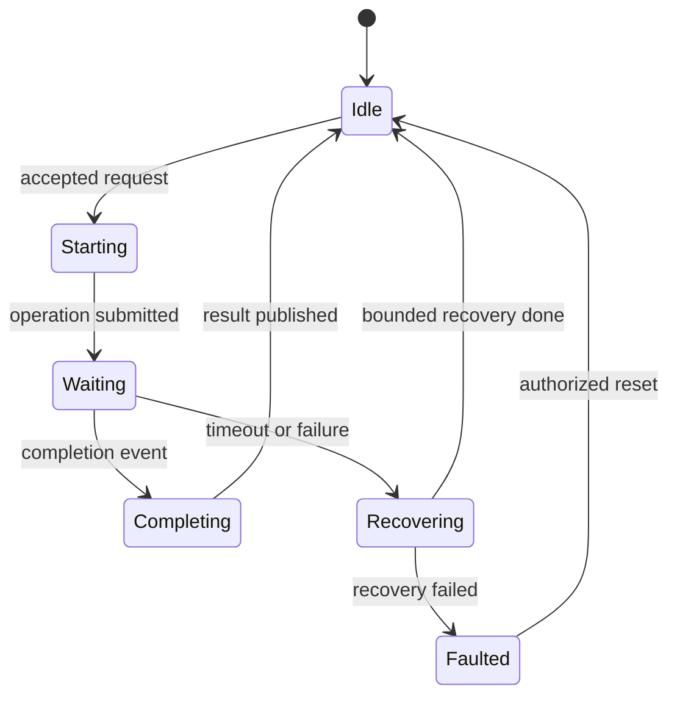
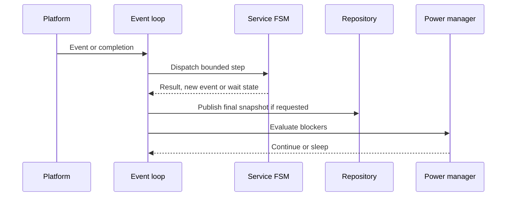

# Firmware Runtime Decision

## 1. Mục đích

Tài liệu này chốt runtime model nền tảng cho firmware của **Smart Water Flow and Pressure Monitor**.

Runtime chính thức của MVP là:

> **Bare-metal single-thread cooperative event loop, kết hợp event queue/event flags và nhiều service FSM nhỏ; RTOS chỉ là khả năng mở rộng về sau.**

Mục tiêu của quyết định:

* cho phép cùng application/service code chạy trên Linux và STM32L433RCT6;
* giữ core logic độc lập POSIX, STM32 HAL và RTOS;
* bảo đảm measurement, configuration, storage và communication không block lẫn nhau;
* cung cấp execution model deterministic cho test và fault injection;
* làm rõ ranh giới ISR/callback, driver, service và application;
* hỗ trợ STOP 2 khi không còn runnable work hoặc blocker;
* cho phép chuyển sang RTOS sau này mà không viết lại core algorithm.

Tài liệu này sở hữu runtime invariant. Event ID, transition matrix, module architecture và platform API chi tiết thuộc các tài liệu chuyên biệt.

---

## 2. Phạm vi

### 2.1. Trong phạm vi

Tài liệu quyết định:

* execution model của firmware MVP;
* vai trò của main event loop;
* quan hệ giữa event, scheduler và service FSM;
* cooperative scheduling và non-blocking rule;
* ISR/callback boundary;
* asynchronous driver completion model;
* priority class ở mức runtime;
* fairness và work-budget principle;
* monotonic time và wall-clock separation;
* snapshot publication boundary;
* config apply safe boundary;
* low-power admission;
* Linux và STM32 mapping;
* điều kiện xem xét chuyển sang RTOS;
* acceptance criteria của runtime.

### 2.2. Đối tượng áp dụng

Runtime contract áp dụng cho Application FSM, các logical service, repository, bus manager, device driver và platform adapter. Các tên service chính gồm:

* `MeasurementManager`;
* `FlowComputationService`;
* `PressureMeasurementService`;
* `CalibrationService`;
* `LeakDetectionService`;
* `VolumeAccumulator`;
* `DataRepository`;
* `ConfigRepository`;
* `StorageService`;
* `BleConfigService`;
* `CellularTelemetryService`;
* `LcdService`;
* `TimeService`;
* `ReportingScheduler`;
* `PowerManager`;
* `HealthMonitor`;
* `I2cBusManager`.

---

## 3. Source-of-truth và tài liệu liên quan

| Nội dung                                   | Source-of-truth                          |
| ------------------------------------------ | ---------------------------------------- |
| System mode và transition cấp hệ thống     | `06_system_fsm.md`                       |
| Operating policy                           | `07_operating_modes.md`                  |
| Main operation flow                        | `04_main_operation_flow.md`              |
| Runtime data flow                          | `08_data_flow.md`                        |
| Decision status                            | `00_open_questions_and_decisions.md`     |
| Firmware runtime model                     | Tài liệu này                             |
| Firmware layer và module dependency        | `01_firmware_architecture.md`            |
| Event catalog, queue và scheduler chi tiết | `02_event_model_and_scheduler.md`        |
| System FSM-to-firmware binding             | `03_system_fsm_binding.md`               |
| Data ownership và snapshot contract        | `04_data_model_and_ownership.md`         |
| Platform API                               | `50_platform_abstraction.md`             |
| ISR, DMA và callback rule chi tiết         | `53_interrupt_dma_and_callback_rules.md` |
| Emulator, virtual time và scenario         | Nhóm `08_simulation`                     |

Nếu tài liệu này mâu thuẫn với system decision đã accepted, phải cập nhật decision registry trước khi đổi runtime contract.

---

## 4. Requirement/decision được hiện thực

### 4.1. Decision mapping

| Decision        | Ảnh hưởng tới runtime                                                              |
| --------------- | ---------------------------------------------------------------------------------- |
| `DEC-MEAS-001`  | Measurement period configurable; deadline dùng monotonic scheduler                 |
| `DEC-MEAS-002`  | MAX35103 production path chạy event-timing mode                                    |
| `DEC-MEAS-003`  | ZSSC3241 dùng one-shot Sleep Mode và asynchronous completion                       |
| `DEC-MEAS-004`  | Quality/freshness được đánh giá theo period, không dựa vào wall clock              |
| `DEC-ARCH-004`  | SERVICE sample không được gây production side effect                               |
| `DEC-ARCH-005`  | Shared I2C do một logical `I2cBusManager` sở hữu                                   |
| `DEC-ARCH-006`  | Runtime snapshot được publish theo strategy đã chốt                                |
| `DEC-ARCH-007`  | Config apply có versioned acknowledgement tại safe boundary                        |
| `DEC-SCHED-001` | Wall-clock invalid dùng `DEFER_UNTIL_VALID`                                        |
| `DEC-SCHED-002` | Missed/duplicate report slot dùng `SKIP_TO_NEXT`                                   |
| `DEC-SCHED-003` | MVP dùng scheduled-only telemetry                                                  |
| `DEC-HW-006`    | ZSSC3241 và FM24CL04B dùng chung physical I2C owner context                        |
| `DEC-HW-007`    | STM32L433RCT6 dùng STOP 2; wake matrix theo RTC/MAX INT/LPUART1                    |
| `DEC-DATA-003`  | Một accepted source event tạo tối đa một final snapshot trong cùng event-loop turn |

### 4.2. Runtime requirements

| ID              | Requirement                                                              |
| --------------- | ------------------------------------------------------------------------ |
| `FW-RT-REQ-001` | Core firmware phải chạy được trong một thread duy nhất                   |
| `FW-RT-REQ-002` | ISR/callback không được thực hiện business logic hoặc transaction dài    |
| `FW-RT-REQ-003` | Service step phải bounded và trả quyền điều khiển về event loop          |
| `FW-RT-REQ-004` | Timeout, duration và deadline phải dùng monotonic time                   |
| `FW-RT-REQ-005` | Wall-clock adjustment không được đổi measurement deadline đang hoạt động |
| `FW-RT-REQ-006` | Operation có khả năng chờ phải dùng submit/completion/timeout model      |
| `FW-RT-REQ-007` | Measurement result/deadline không được bị background work làm starve     |
| `FW-RT-REQ-008` | Event-loop turn phải có finite work budget                               |
| `FW-RT-REQ-009` | Chỉ vào low-power khi không còn runnable work và blocker                 |
| `FW-RT-REQ-010` | Linux và STM32 giữ cùng service behavior và event-ordering contract      |
| `FW-RT-REQ-011` | Snapshot publication phải atomic đối với consumer                        |
| `FW-RT-REQ-012` | Config apply phải có matching version và chạy tại safe boundary          |
| `FW-RT-REQ-013` | Event loss/overflow không được im lặng với critical/completion event     |
| `FW-RT-REQ-014` | Recovery step phải bounded hoặc được chia thành nhiều runtime step       |

---

## 5. Trách nhiệm

### 5.1. Main event loop

Main event loop chịu trách nhiệm:

1. thu thập event từ ISR mailbox, driver completion, scheduler và service;
2. chuẩn hóa event metadata;
3. chọn runnable work theo priority và fairness policy;
4. gọi một bounded step của application/service FSM;
5. ghi nhận event hoặc work mới được tạo;
6. publish final runtime data khi turn yêu cầu;
7. cập nhật health/liveness evidence;
8. kiểm tra low-power blocker;
9. sleep hoặc tiếp tục turn tiếp theo.

Mô hình khái niệm:

```c
for (;;) {
    Platform_Poll();
    AppEventLoop_CollectEvents();
    AppEventLoop_RunReadyWork();
    DataRepository_PublishIfRequested();
    HealthMonitor_RecordProgress();
    PowerManager_TryEnterLowPower();
}
```

Pseudocode trên mô tả behavior, không chốt tên API.

### 5.2. Scheduler

Scheduler:

* quản lý monotonic deadline;
* phát due event, không tự chạy business action;
* reschedule periodic deadline theo anchor/policy;
* tránh drift do lấy “completion time + period” khi policy yêu cầu fixed cadence;
* phân biệt measurement schedule với wall-clock reporting schedule;
* xử lý missed deadline theo policy của từng event class;
* không gọi trực tiếp sensor hoặc communication driver.

### 5.3. Service FSM

Mỗi logical service:

* sở hữu state nội bộ;
* nhận event/request qua public interface;
* thực hiện tối đa một bounded step mỗi lần được dispatch;
* submit asynchronous operation khi cần I/O;
* chuyển sang trạng thái chờ completion/timeout;
* không busy-wait;
* không giữ quyền điều khiển để đợi peripheral;
* publish result hoặc event khi step hoàn tất;
* báo busy/rejected/deferred rõ ràng khi không nhận thêm request.

### 5.4. Driver và platform adapter

Driver/platform:

* chuyển logical request thành peripheral operation;
* capture completion, error và timeout;
* không chứa application policy;
* không gọi tùy ý vào service từ ISR;
* phát completion event hoặc cập nhật mailbox rồi đánh thức event loop;
* bảo đảm mỗi accepted request có đúng một terminal outcome:
  `COMPLETED`, `FAILED`, `TIMED_OUT` hoặc `CANCELLED`.

---

## 6. Ngoài phạm vi

Tài liệu này không quyết định:

* event ID đầy đủ và exact queue size;
* transition table chi tiết của system FSM;
* public API chi tiết của từng service;
* exact timeout của từng peripheral;
* exact Linux socket protocol;
* STM32 pin/DMA mapping;
* BLE frame, telemetry payload hoặc modem AT command;
* thuật toán flow, calibration hoặc leak;
* exact watchdog timeout;
* RTOS task count, priority hoặc stack size của runtime tương lai.

Các giá trị trên phải nằm trong tài liệu chuyên biệt và dẫn chiếu runtime invariant tại đây.

---

## 7. Interface và dependency

### 7.1. Runtime dependency

```text
ISR / platform completion
  -> event ingress
  -> event queue or event flags
  -> application dispatcher
  -> service FSM step
  -> driver request
  -> platform asynchronous operation
```

### 7.2. Interface category

| Interface          | Hướng                               | Quy tắc                          |
| ------------------ | ----------------------------------- | -------------------------------- |
| Event ingress      | Platform/ISR → event loop           | Bounded, không block             |
| Service request    | Application → service               | Validate admission và trả status |
| Driver request     | Service → driver                    | Submit, không chờ completion     |
| Driver completion  | Driver/platform → event loop        | Một terminal event cho request   |
| Repository publish | Owner service → repository          | Atomic final publication         |
| Config apply       | ConfigRepository → affected service | Versioned request/result         |
| Power blocker      | Service → PowerManager              | Acquire/release có owner         |
| Health progress    | Event loop/service → HealthMonitor  | Chỉ ghi evidence bounded         |

### 7.3. Dependency prohibition

Không được phép:

* gọi STM32 HAL từ application/service;
* gọi POSIX/socket API từ application/service;
* gọi blocking delay trong service;
* parse BLE/4G protocol trong UART ISR;
* tính flow, leak hoặc calibration trong ISR;
* ghi F-RAM trong callback;
* để BLE, 4G hoặc LCD gọi trực tiếp measurement driver;
* sửa `RuntimeSnapshot` đã publish;
* dùng wall clock cho peripheral timeout;
* dùng polling loop không có bounded iteration/yield.

---

## 8. Data model và đơn vị

### 8.1. Runtime event envelope

Event envelope tối thiểu về mặt logic:

| Field                 | Ý nghĩa                                      | Đơn vị/quy tắc                           |
| --------------------- | -------------------------------------------- | ---------------------------------------- |
| `event_id`            | Loại event                                   | Enum/versioned catalog                   |
| `source`              | Nguồn tạo                                    | Platform/driver/service/application      |
| `priority_class`      | Nhóm ưu tiên                                 | Không phải RTOS priority                 |
| `sequence`            | Thứ tự nguồn hoặc global order               | Monotonic counter                        |
| `monotonic_timestamp` | Thời điểm event được capture                 | µs hoặc ms theo platform contract        |
| `correlation_id`      | Liên kết request/completion                  | Không tái sử dụng khi request còn active |
| `payload`             | Dữ liệu nhỏ hoặc reference tới owned mailbox | Không có lifetime mơ hồ                  |

Exact C layout thuộc `02_event_model_and_scheduler.md`.

### 8.2. Runtime service context

Mỗi service context tối thiểu có:

* current state;
* active request/correlation ID nếu có;
* monotonic deadline nếu đang chờ;
* pending event/request state;
* last terminal result;
* diagnostic counter;
* liveness/progress marker khi áp dụng.

### 8.3. Time domains

| Time domain            | Dùng cho                                                                 | Không dùng cho            |
| ---------------------- | ------------------------------------------------------------------------ | ------------------------- |
| Monotonic time         | Timeout, duration, retry, measurement period, freshness age, work budget | Calendar window           |
| Wall clock/RTC         | Timestamp, reporting window, time sync age, calendar policy              | Peripheral timeout        |
| Virtual monotonic time | Deterministic Linux test                                                 | Production calendar truth |

Internal unit và conversion rule phải được chốt trong platform/data-model document. Conversion không được gây wrap hoặc signed/unsigned ambiguity.

---

## 9. State machine hoặc sequence

### 9.1. Runtime service pattern



Đây là pattern, không bắt buộc mọi service dùng cùng tên state.

### 9.2. Event-loop turn



### 9.3. Top-level system mode

System mode được sở hữu bởi `06_system_fsm.md`:

```text
INIT
NORMAL
LOW_POWER
SERVICE
RECOVERY
ERROR
```

Runtime không tự tạo mode khác làm thay đổi system semantics. Service FSM chạy bên trong mode được system policy cho phép.

---

## 10. Timing, timeout và non-blocking behavior

### 10.1. Non-blocking invariant

Function được gọi từ event loop phải:

* hoàn tất trong bounded execution time; hoặc
* chia công việc thành step và reschedule; hoặc
* submit asynchronous I/O rồi return.

Các hành vi bị cấm:

```text
while (!device_ready) { }
HAL_Delay(...)
sleep(...)
blocking socket read/write
wait for UART response in callback
retry-until-success loop
parse an unbounded input stream in one turn
process an unbounded queue in one turn
```

### 10.2. Asynchronous operation

Mỗi operation có khả năng chờ phải có:

1. admission result;
2. correlation ID;
3. submit timestamp;
4. monotonic deadline;
5. completion/error path;
6. timeout path;
7. cancellation/recovery rule;
8. terminal result chỉ phát một lần.

### 10.3. Priority class

Priority chi tiết thuộc event model document. Runtime giữ thứ tự nguyên tắc:

1. critical integrity/fault event;
2. measurement completion, interrupt và deadline-sensitive event;
3. completion cần giải phóng shared resource;
4. config apply, time và report scheduling event;
5. storage, telemetry, display và diagnostic background work.

Priority không được gây starvation. Event loop phải có fairness/budget rule cho work thấp hơn khi không vi phạm deadline cao hơn.

### 10.4. Event-loop work budget

Mỗi turn có finite budget theo một hoặc nhiều tiêu chí:

* số event;
* số service step;
* monotonic execution budget;
* byte/item budget cho parser hoặc queue.

Khi budget hết:

* service giữ state;
* work còn lại được requeue hoặc đánh dấu ready;
* event loop chuyển sang turn tiếp theo;
* không drop work im lặng.

Exact numeric budget là `NEEDS_VERIFICATION`.

### 10.5. Periodic scheduling

Measurement schedule:

* lấy monotonic anchor;
* period lấy từ validated `ActiveConfig`;
* thay đổi period chỉ apply tại safe boundary;
* không trigger hai measurement trùng nhau nếu service còn busy, trừ khi policy chuyên biệt cho phép;
* missed period phải tạo diagnostic;
* không burst catch-up tùy ý.

Reporting schedule:

* dựa trên wall clock hợp lệ;
* khi wall clock invalid dùng `DEFER_UNTIL_VALID`;
* slot đã lỡ dùng `SKIP_TO_NEXT`;
* thay đổi schedule không hủy telemetry transaction in-flight;
* scheduled slot tạo record, không đồng nghĩa gửi xong.

### 10.6. Snapshot publication

Theo `DEC-DATA-003`:

* một accepted source event tạo tối đa một final snapshot;
* publication xảy ra cuối event-loop turn tương ứng;
* intermediate state không được publish;
* snapshot đã publish là immutable;
* consumer đọc snapshot consistent/versioned;
* không dùng arbitrary time debounce để trì hoãn publication.

---

## 11. Configuration

### 11.1. Runtime-configurable behavior

Runtime có thể nhận validated configuration cho:

* per-stream measurement period;
* reporting window và interval;
* maximum time-sync age;
* leak profile;
* bounded pressure runtime fields;
* retry/recovery field được allowlist;
* display/service field nếu communication contract cho phép.

### 11.2. Apply contract

```text
PendingConfig
  -> validation
  -> persistent commit when required
  -> ActiveConfig version replacement
  -> ConfigApplyRequest(version, transaction, changed mask)
  -> service safe-boundary evaluation
  -> APPLIED / DEFERRED / REJECTED
```

Runtime rules:

* callback không đổi `ActiveConfig` trực tiếp;
* service không apply nhầm config version;
* `DEFERRED` phải giữ reason và retry condition;
* `REJECTED` không được báo thành fully applied;
* config mới không cắt ngang atomic measurement/storage/telemetry transaction;
* profile change tuân thủ invalidated-evidence policy tương ứng.

### 11.3. Compile-time runtime parameters

Các tham số sau có thể là build profile nhưng phải versioned:

* event queue capacity;
* maximum service count;
* work budget;
* static buffer capacity;
* feature enable;
* product variant;
* safe default timeout bounds.

Không hard-code giá trị product-specific trong business logic chung.

---

## 12. Error detection và recovery

### 12.1. Runtime error categories

| Error                              | Runtime response                                                       |
| ---------------------------------- | ---------------------------------------------------------------------- |
| Event queue pressure/overflow      | Preserve critical evidence, increment diagnostic, escalate theo policy |
| Duplicate completion               | Reject duplicate, record invariant violation                           |
| Completion không có active request | Record stale/unmatched completion                                      |
| Service step vượt budget           | Health fault, defer work và escalate nếu lặp lại                       |
| Monotonic time discontinuity       | Platform/runtime critical diagnostic                                   |
| Deadline missed                    | Terminal timeout hoặc missed-schedule policy                           |
| Shared bus busy                    | Queue/defer/reject theo bus admission                                  |
| Bus/peripheral fault               | Bounded recovery, không retry vô hạn                                   |
| Config version mismatch            | Reject result và giữ active version consistent                         |
| Low-power blocker leak             | Không sleep, tạo health diagnostic                                     |
| Wake/resume failure                | Recovery hoặc ERROR theo severity                                      |

### 12.2. Recovery invariant

Recovery phải:

* có maximum attempt hoặc duration;
* không chạy vòng lặp vô hạn;
* bảo toàn ownership;
* kết thúc bằng terminal status;
* publish diagnostic reason;
* không biến SERVICE/CALIBRATION sample thành production sample;
* không clear critical fault khi source vẫn active;
* không feed watchdog nếu runtime không tạo progress hợp lệ.

### 12.3. Event overflow

Runtime không được drop im lặng:

* critical error;
* peripheral completion;
* measurement result/timeout;
* config transaction terminal result;
* storage commit terminal result.

Coalescing chỉ dùng cho level-like event khi event model xác nhận an toàn. Edge/completion event cần sequence/counter hoặc dedicated mailbox.

---

## 13. Linux simulation mapping

### 13.1. Execution model

Linux build giữ core firmware single-thread cooperative:

```text
firmware_linux process
  -> portable application/services/drivers
  -> platform/linux adapters
  -> emulator transport or in-process fake
```

Core firmware không phụ thuộc:

* `pthread`;
* POSIX signal;
* socket descriptor;
* `select`, `poll` hoặc `epoll`;
* host wall-clock API.

Các cơ chế này có thể dùng bên trong `platform/linux`, nhưng chỉ được chuyển thành platform event/completion contract.

### 13.2. Deterministic time

Linux test phải hỗ trợ:

* real monotonic mode cho manual run;
* virtual monotonic mode cho deterministic test;
* advance time không cần sleep thực;
* inject completion, timeout và fault;
* tái lập cùng event ordering từ cùng scenario/seed.

Wall-clock và monotonic simulation phải tách biệt để test time adjustment không làm sai measurement deadline.

### 13.3. Linux idle

Khi không có runnable work:

* real-time mode có thể chờ platform event với bounded timeout;
* virtual-time mode advance tới event/deadline kế tiếp;
* core không gọi `sleep()` trực tiếp;
* wake event đi qua cùng event ingress contract.

### 13.4. Equivalence

Contract test phải có khả năng chạy cho:

* platform fake/in-process backend;
* Linux emulator backend;
* STM32 backend khi board test khả dụng.

Cùng input sequence phải tạo cùng logical service state/result, trừ metadata được phép khác nhau.

---

## 14. STM32 mapping

### 14.1. Main loop

```c
int main(void)
{
    Platform_Init();
    App_Init();

    for (;;) {
        AppEventLoop_RunOnce();
        PowerManager_TryEnterLowPower();
    }
}
```

Tên API chưa được chốt tại đây.

### 14.2. Interrupt và callback

STM32 ISR/HAL callback chỉ được:

* đọc/capture status cần thiết;
* lưu byte count hoặc completion reason;
* increment counter, set flag hoặc push bounded event;
* clear hardware interrupt theo driver contract;
* đánh thức main loop.

ISR không được:

* parse BLE/4G frame;
* thực hiện flow/calibration/leak algorithm;
* update `RuntimeSnapshot` hoàn chỉnh;
* ghi F-RAM;
* chạy config transaction;
* gọi modem transaction dài;
* feed watchdog như bằng chứng duy nhất.

### 14.3. Critical section

Critical section chỉ bảo vệ:

* ISR-to-main event ingress;
* atomic index/counter nhỏ;
* shared completion mailbox tối thiểu.

Không giữ interrupt disabled qua SPI/I2C/UART transaction, CRC dài, parser, snapshot construction hoặc payload generation.

### 14.4. STOP 2

Theo `DEC-HW-007`, runtime chỉ vào STOP 2 khi:

* không có ready event;
* không có active measurement completion cần xử lý;
* không có shared-bus transaction;
* không có storage commit;
* không có UART RX/TX transaction cần giữ;
* không có config apply critical section;
* wake source đã được program;
* platform/power domain báo safe.

Wake matrix baseline gồm RTC, MAX INT và LPUART1. Exact register/HAL sequence thuộc STM32 platform và low-power document.

---

## 15. Test và acceptance criteria

### 15.1. Unit test

| Test ID        | Scenario                          | Expected                                 |
| -------------- | --------------------------------- | ---------------------------------------- |
| `FW-RT-UT-001` | Một event bình thường             | Đúng service nhận event một lần          |
| `FW-RT-UT-002` | Service submit async operation    | Event loop không block                   |
| `FW-RT-UT-003` | Completion đúng correlation       | Request kết thúc đúng một lần            |
| `FW-RT-UT-004` | Duplicate completion              | Bị từ chối và có diagnostic              |
| `FW-RT-UT-005` | Timeout                           | Terminal timeout theo monotonic deadline |
| `FW-RT-UT-006` | Wall clock thay đổi               | Measurement deadline không đổi           |
| `FW-RT-UT-007` | Work vượt budget                  | Work tiếp tục ở turn sau                 |
| `FW-RT-UT-008` | High/low priority cùng ready      | High được ưu tiên, low không starvation  |
| `FW-RT-UT-009` | Config apply khi busy             | `DEFERRED` đúng version                  |
| `FW-RT-UT-010` | Source event cập nhật nhiều field | Chỉ một final snapshot được publish      |

### 15.2. Integration test

| Test ID        | Scenario                           | Expected                                       |
| -------------- | ---------------------------------- | ---------------------------------------------- |
| `FW-RT-IT-001` | MAX35103 event timing + INT        | Measurement hoàn tất không blocking            |
| `FW-RT-IT-002` | ZSSC3241 one-shot + completion     | Pressure hoàn tất qua async path               |
| `FW-RT-IT-003` | ZSSC3241 và F-RAM tranh shared I2C | Arbitration deterministic                      |
| `FW-RT-IT-004` | BLE frame khi measurement active   | Measurement không missed                       |
| `FW-RT-IT-005` | 4G timeout/retry                   | Measurement scheduler tiếp tục                 |
| `FW-RT-IT-006` | Storage commit đang chạy           | Low-power bị block đúng                        |
| `FW-RT-IT-007` | Wall clock invalid                 | Reporting defer, measurement vẫn chạy          |
| `FW-RT-IT-008` | Virtual time advance               | Deterministic, không sleep thực                |
| `FW-RT-IT-009` | Event queue pressure               | Critical/completion evidence không mất im lặng |
| `FW-RT-IT-010` | Wake từ STOP 2 model               | Wake reason xử lý một lần                      |

### 15.3. Acceptance criteria

Runtime decision được đáp ứng khi:

* application chạy trong một host thread;
* không có blocking API trong application/service path;
* mọi peripheral wait path có completion và timeout;
* measurement tiếp tục đúng policy khi BLE/4G/storage bận;
* wall-clock adjustment không ảnh hưởng monotonic deadline;
* snapshot publication atomic và đúng turn;
* config apply có matching versioned result;
* low-power chỉ xảy ra khi blocker set rỗng;
* Linux virtual-time tests deterministic;
* STM32 callbacks chỉ phát event/completion;
* runtime invariant có traceability tới test.

---

## 16. Traceability

| Runtime requirement | Decision/system source         | Thiết kế chi tiết         | Verification                  |
| ------------------- | ------------------------------ | ------------------------- | ----------------------------- |
| `FW-RT-REQ-001`     | Firmware baseline              | Architecture/platform     | Host single-thread test       |
| `FW-RT-REQ-002`     | Event-driven implication       | Interrupt/callback rules  | Static review + callback test |
| `FW-RT-REQ-003`     | Cooperative runtime            | Event model               | Work-budget tests             |
| `FW-RT-REQ-004`     | `DEC-MEAS-001`                 | Scheduler/platform time   | Clock-domain tests            |
| `FW-RT-REQ-005`     | `DEC-MEAS-001`                 | TimeService/scheduler     | Wall-clock jump test          |
| `FW-RT-REQ-006`     | `DEC-MEAS-003`                 | Driver/platform contracts | Completion/timeout tests      |
| `FW-RT-REQ-007`     | Measurement priority           | Event priority policy     | Load/starvation test          |
| `FW-RT-REQ-008`     | Cooperative runtime            | Scheduler/event loop      | Budget exhaustion test        |
| `FW-RT-REQ-009`     | `DEC-HW-007`                   | Power manager             | Blocker matrix test           |
| `FW-RT-REQ-010`     | Simulation-first baseline      | Linux/STM32 platform      | Contract test suite           |
| `FW-RT-REQ-011`     | `DEC-ARCH-006`, `DEC-DATA-003` | Repository/snapshot       | Atomic publication tests      |
| `FW-RT-REQ-012`     | `DEC-ARCH-007`                 | Config management         | Version/safe-boundary tests   |
| `FW-RT-REQ-013`     | Error/data integrity policy    | Event model/diagnostics   | Overflow/fault injection      |
| `FW-RT-REQ-014`     | Recovery policy                | Reliability documents     | Repeated-fault test           |

Traceability tới source file, function và CI test sẽ được quản lý trong `95_firmware_traceability.md`.

---

## 17. Open issues / NEEDS_VERIFICATION

| ID             | Nội dung                                 | Ảnh hưởng            | Gate/owner                          |
| -------------- | ---------------------------------------- | -------------------- | ----------------------------------- |
| `FW-RT-OQ-001` | Exact event queue capacity               | RAM, overflow        | Implementation/test                 |
| `FW-RT-OQ-002` | Exact per-turn event/service/time budget | Latency/fairness     | Linux profiling + STM32 measurement |
| `FW-RT-OQ-003` | Maximum service-step execution time      | Watchdog/deadline    | STM32 timing verification           |
| `FW-RT-OQ-004` | Exact priority class/event mapping       | Scheduling           | Event-model document                |
| `FW-RT-OQ-005` | Exact coalescing policy                  | Event integrity      | Event model + fault tests           |
| `FW-RT-OQ-006` | Exact peripheral timeout bounds          | Recovery latency     | Driver/hardware qualification       |
| `FW-RT-OQ-007` | Linux real-time wait implementation      | Host efficiency      | Linux platform                      |
| `FW-RT-OQ-008` | Exact STOP 2 entry/resume latency        | Power/deadline       | Board verification                  |
| `FW-RT-OQ-009` | LCD hardware/interface decision          | Display runtime load | `DEC-HW-004`                        |
| `FW-RT-OQ-010` | Power source và 4G peak-current budget   | Low-power policy     | `DEC-HW-005`                        |
| `FW-RT-OQ-011` | RTOS migration trigger thresholds        | Future architecture  | Deferred                            |

Các mục này không chặn Linux runtime skeleton nếu code dùng configurable bounds và không hard-code giả định product chưa xác nhận.

### 17.1. Điều kiện xem xét RTOS

RTOS chỉ được xem xét khi có bằng chứng ít nhất một vấn đề sau không thể giải quyết hợp lý bằng cooperative runtime:

* verified latency/deadline không đạt dù service đã được chia nhỏ;
* concurrency requirement thật sự cần preemption;
* third-party stack bắt buộc dùng RTOS primitives;
* số independent communication flow làm cooperative FSM không còn bảo trì được;
* memory/timing analysis chứng minh RTOS phù hợp hơn;
* product requirement mới yêu cầu scheduling semantics khác.

Chuyển RTOS phải có ADR mới. Không đưa RTOS API vào core algorithm, repository contract hoặc portable driver interface trước decision đó.

---

## 18. Revision history

| Version | Date       | Change                                                         | Author   |
| ------- | ---------- | -------------------------------------------------------------- | -------- |
| 0.1     | 2026-07-14 | Initial cooperative runtime decision and verification contract | Firmware |
