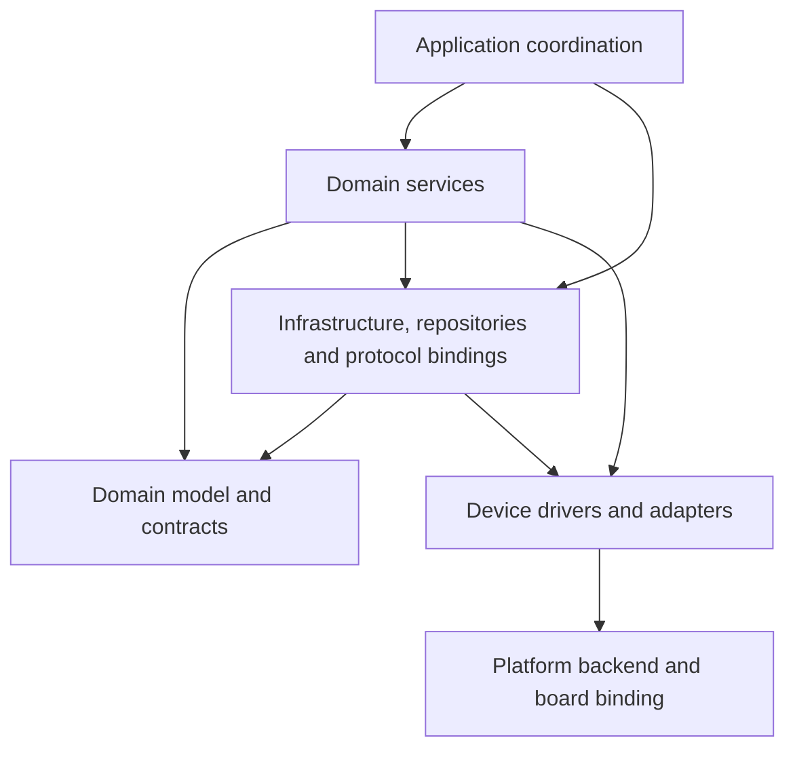
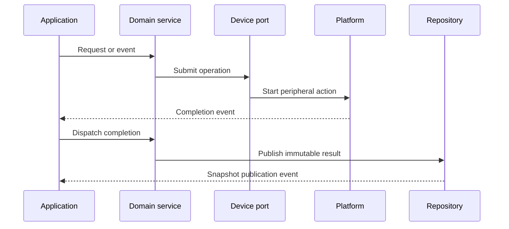
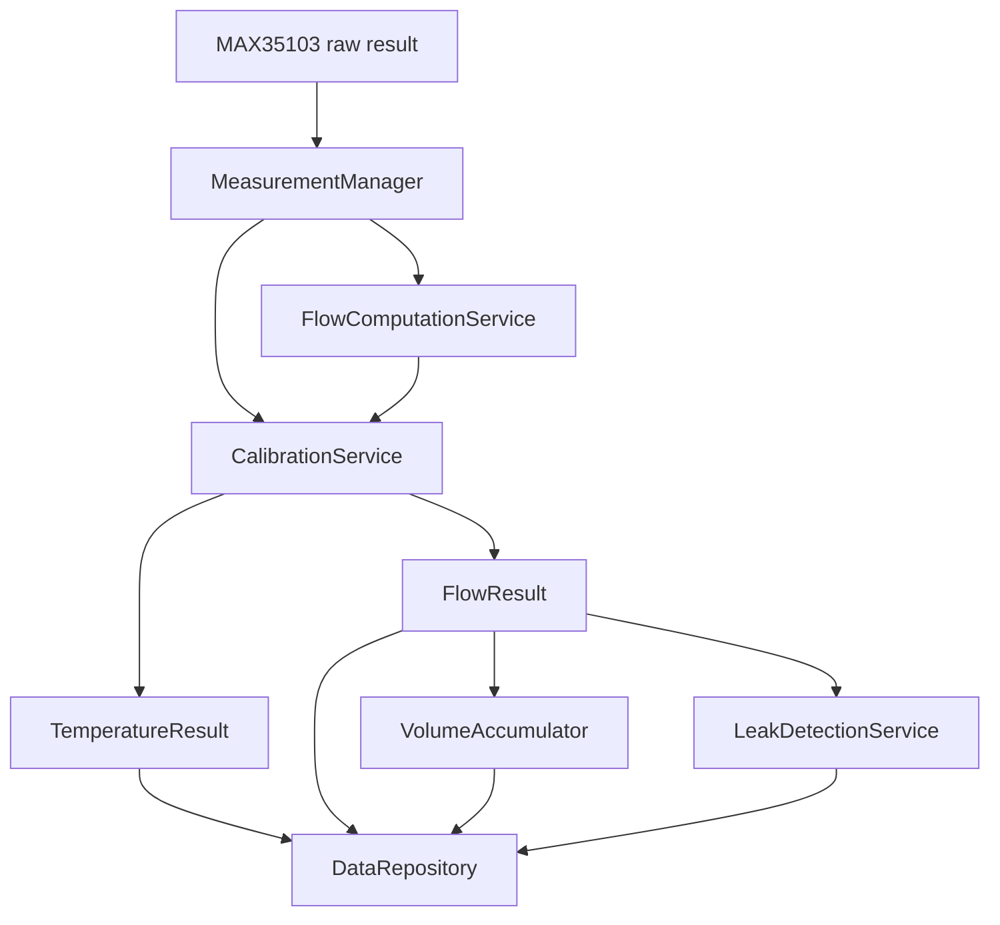
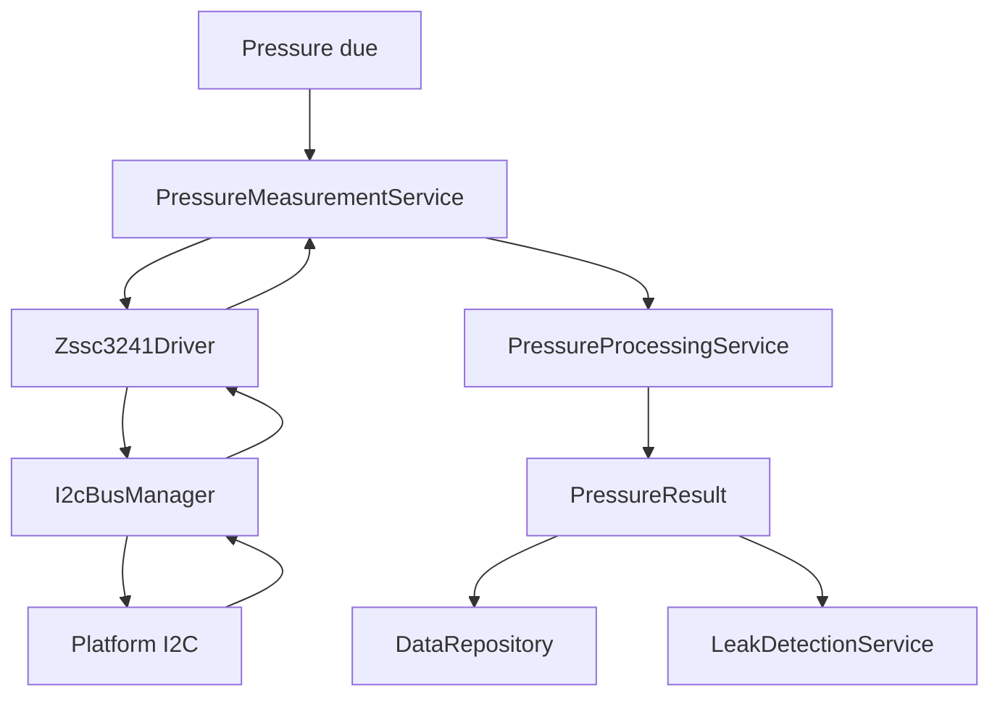
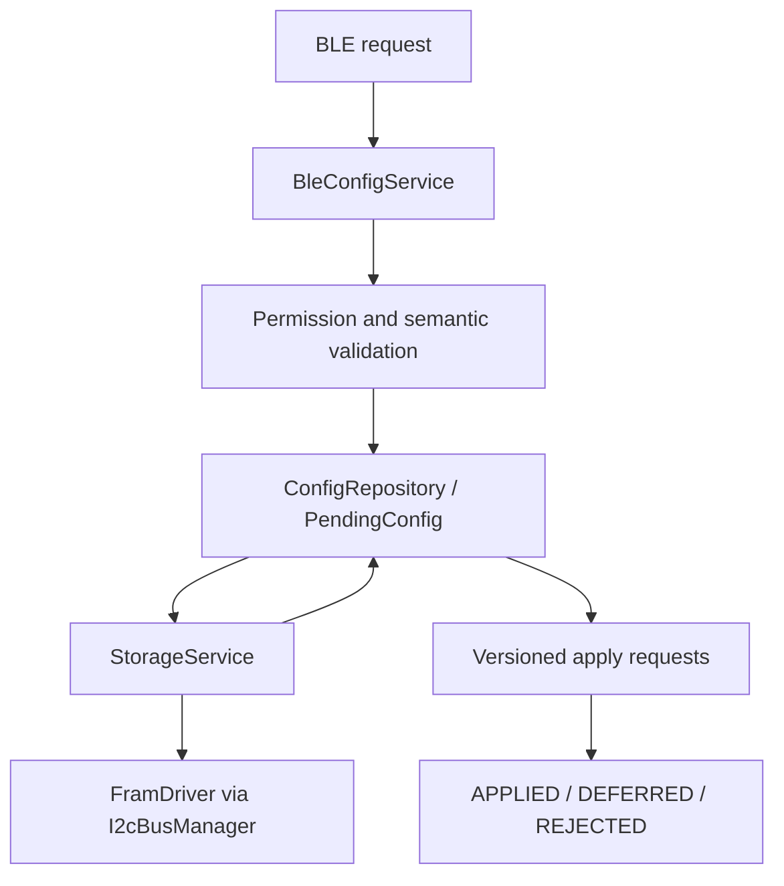
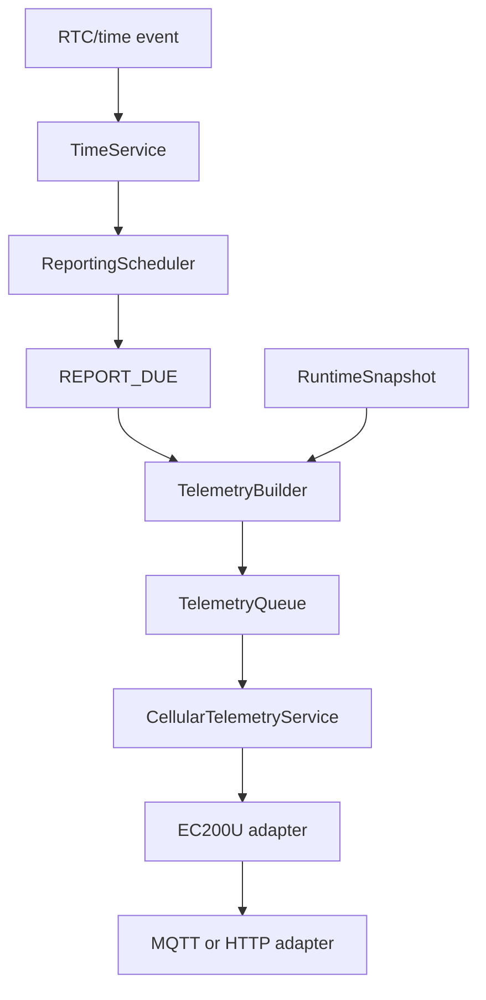
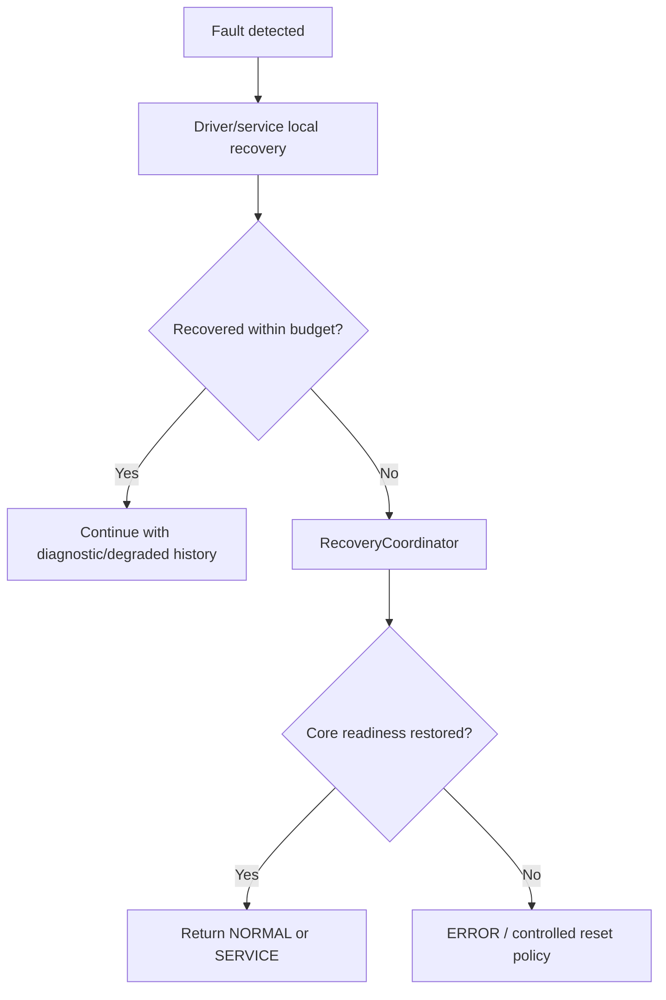
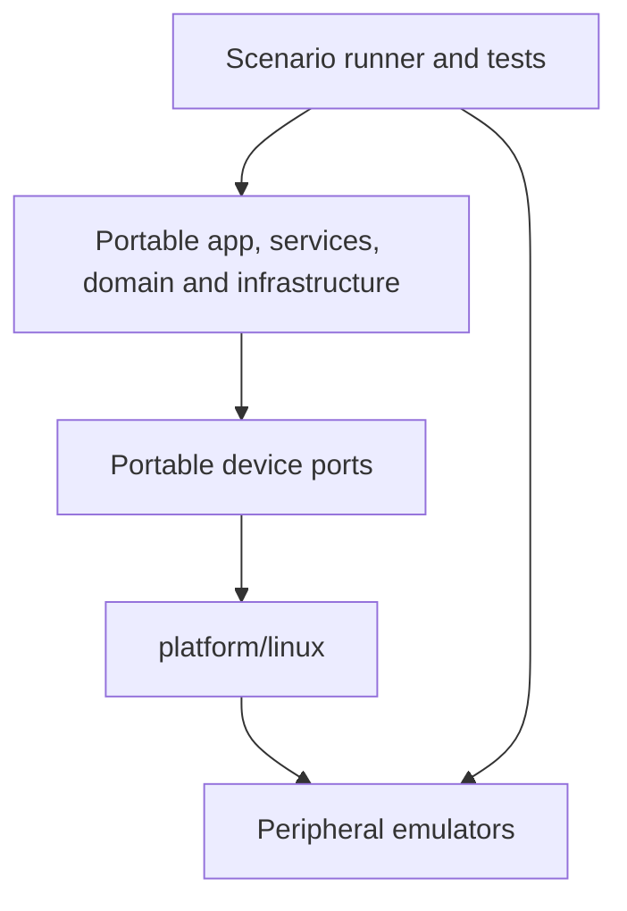
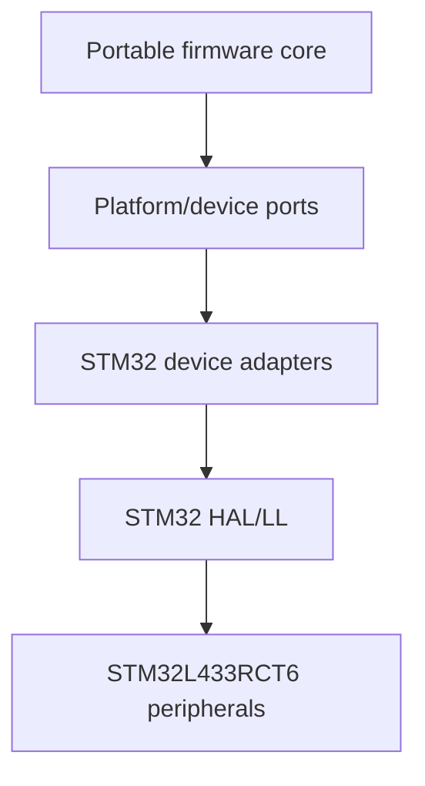

# Firmware Architecture

## 1. Mục đích

Tài liệu này định nghĩa kiến trúc logic chính thức của firmware **Smart Water Flow and Pressure Monitor**.

Tài liệu chuyển system design thành:

- các layer firmware;
- module inventory;
- responsibility và forbidden responsibility;
- dependency direction;
- resource/data ownership;
- logical port và adapter boundary;
- luồng measurement, configuration, storage, telemetry và display;
- error/recovery boundary;
- cấu trúc source code mục tiêu;
- Linux và STM32 architecture mapping;
- architecture acceptance criteria.

Kiến trúc được thiết kế để application, domain service và phần lớn driver logic có thể build không thay đổi trên Linux và STM32. Chỉ platform/backend và hardware binding được thay thế.

---

## 2. Phạm vi

### 2.1. Trong phạm vi

Tài liệu sở hữu:

- firmware layering;
- logical module và tên canonical;
- module responsibility;
- allowed/forbidden dependency;
- single-writer ownership;
- port/adapter contract ở mức kiến trúc;
- application/service/infrastructure/driver/platform boundary;
- high-level initialization dependency;
- high-level processing/data flow;
- isolation của product variant và hardware TBD;
- source-tree mapping;
- architecture-level verification.

### 2.2. Đối tượng áp dụng

Áp dụng cho:

- production firmware STM32;
- Linux-hosted firmware simulation;
- unit/integration/system test;
- device emulator adapter;
- factory/service build nếu tái sử dụng core module;
- future RTOS port nếu có ADR mới.

---

## 3. Source-of-truth và tài liệu liên quan

| Nội dung | Source-of-truth |
|---|---|
| Product/system behavior | Nhóm system overview |
| System mode và transition | `06_system_fsm.md` |
| Data lifecycle và system ownership | `08_data_flow.md` |
| External/physical interface | `10_system_interfaces.md` |
| System-to-firmware implication | `11_firmware_implication.md` |
| Decision status | `00_open_questions_and_decisions.md` |
| Runtime execution invariant | `00_runtime_decision.md` |
| Firmware architecture/module/dependency | Tài liệu này |
| Event/scheduler contract | `02_event_model_and_scheduler.md` |
| Firmware FSM binding | `03_system_fsm_binding.md` |
| C data model và ownership chi tiết | `04_data_model_and_ownership.md` |
| Platform API | `50_platform_abstraction.md` |
| Protocol/payload schema | Nhóm `04_communication` |
| Emulator/scenario contract | Nhóm `08_simulation` |

Tài liệu này không được định nghĩa lại behavior thuộc owner khác. Khi cần, nó chỉ xác định module nào hiện thực behavior và interface nào mang dữ liệu.

---

## 4. Requirement/decision được hiện thực

### 4.1. Architecture decision

| Decision | Architecture consequence |
|---|---|
| `DEC-ARCH-001` | Flow path là core; boot cần flow readiness evidence trước `NORMAL` |
| `DEC-ARCH-002` | `CalibrationService` là single writer của `TemperatureResult` |
| `DEC-ARCH-003` | Không cho uncompensated production flow |
| `DEC-ARCH-004` | `SERVICE` quiesce production path; service/calibration sample có provenance riêng |
| `DEC-ARCH-005` | Mỗi physical I2C có đúng một `I2cBusManager` owner |
| `DEC-ARCH-006` | `DataRepository` sở hữu đúng hai snapshot buffer và atomic active-index swap |
| `DEC-ARCH-007` | Config commit và runtime apply là hai milestone riêng |
| `DEC-ARCH-008` | Không có OTA, remote config hoặc generic 4G command trong baseline |
| `DEC-HW-001` | Pressure chain dùng versioned variant/profile/calibration/config architecture |
| `DEC-HW-006` | ZSSC3241 và FM24CL04B dùng chung physical I2C owner context |
| `DEC-HW-007` | STOP 2 và wake matrix được cô lập sau power/platform boundary |
| `DEC-DATA-003` | Mỗi accepted source event publish tối đa một final snapshot trong cùng turn |
| `DEC-DATA-004/005` | Storage dùng fixed A/B record, explicit encoding và một immutable commit in-flight |
| `DEC-COM-001` | Telemetry transport nằm sau common interface |
| `DEC-COM-002/003` | ACK/retry là asynchronous service behavior |
| `DEC-COM-004` | Telemetry queue là static RAM FIFO, một record in-flight |

### 4.2. Architecture requirements

| ID | Requirement |
|---|---|
| `FW-ARCH-REQ-001` | Dependency phải đi từ layer cao xuống port/layer thấp |
| `FW-ARCH-REQ-002` | Application/service không phụ thuộc POSIX, STM32 HAL hoặc RTOS |
| `FW-ARCH-REQ-003` | Mỗi mutable domain object/resource có một owner duy nhất |
| `FW-ARCH-REQ-004` | Consumer chỉ đọc immutable result hoặc stable snapshot |
| `FW-ARCH-REQ-005` | External input phải đi qua transport, parser/binding, validation rồi mới tới domain |
| `FW-ARCH-REQ-006` | Communication/display không truy cập sensor driver trực tiếp |
| `FW-ARCH-REQ-007` | Persistent state chỉ được thay đổi qua `StorageService` |
| `FW-ARCH-REQ-008` | Shared physical I2C chỉ được điều khiển qua `I2cBusManager` |
| `FW-ARCH-REQ-009` | Hardware/model-specific value phải nằm trong profile/binding, không rải trong service |
| `FW-ARCH-REQ-010` | Driver không chứa product algorithm hoặc policy |
| `FW-ARCH-REQ-011` | Linux và STM32 phải implement cùng logical ports |
| `FW-ARCH-REQ-012` | Module có public contract, private state và explicit initialization |
| `FW-ARCH-REQ-013` | Architecture phải cho phép fake/mock từng port độc lập |
| `FW-ARCH-REQ-014` | Service/calibration data không được nhiễm production state |
| `FW-ARCH-REQ-015` | Recovery ownership phải được phân cấp local và system-level |
| `FW-ARCH-REQ-016` | Source tree và build target phải enforce dependency rule |

---

## 5. Trách nhiệm

### 5.1. Kiến trúc tổng thể

Firmware sử dụng sáu layer logic:



`Domain model` chứa type/contract dùng chung nhưng không gọi ngược service. `Infrastructure` hiện thực repository, queue, bus, time và protocol binding. Device driver phụ thuộc platform port; không phụ thuộc application.

### 5.2. Layer contract

| Layer | Trách nhiệm | Không được làm |
|---|---|---|
| Application coordination | Boot, system mode, event dispatch, command/recovery coordination | Đọc register, tính flow, sở hữu sensor result |
| Domain services | Measurement/processing/use-case policy | Gọi HAL/POSIX, sửa state của owner khác |
| Domain model/contracts | Immutable type, enum, unit, ID, public port contract | Chứa I/O, global mutable state hoặc scheduling |
| Infrastructure/binding | Repository, bus, storage, queue, time, protocol/data binding | Tự định nghĩa product algorithm |
| Driver/adapter | Device/protocol transaction, raw status, callback adaptation | Update volume/leak/config hoặc block chờ |
| Platform/backend | SPI/I2C/UART/GPIO/time/power primitives và board binding | Chứa business rule hoặc product policy |

### 5.3. Application coordination modules

| Module | Trách nhiệm | Output chính |
|---|---|---|
| `SystemManager` | Boot sequence, init dependency và readiness aggregation | Init/readiness result |
| `SystemModeManager` | Single writer của primary `SystemMode` | Mode transition record |
| `AppEventLoop` | Thu thập/dispatch bounded work | Runtime progress |
| `CommandDispatcher` | Route command đã parse/authorize/validate | Application request/event |
| `RecoveryCoordinator` | Ordered system recovery và return-mode decision | Recovery result |
| `DiagnosticsService` | Structured error/status counter và bounded history | Diagnostic status |
| `WatchdogSupervisor` | Đánh giá progress contract trước khi feed watchdog | Watchdog decision |

### 5.4. Measurement và product services

| Module | Trách nhiệm | Không sở hữu |
|---|---|---|
| `MeasurementManager` | MAX35103 scheduling, acquisition, raw status/ToF validation | Final temperature/flow |
| `FlowComputationService` | ToF/delta thành processed base flow | Calibration, volume |
| `CalibrationService` | Temperature conversion/calibration, compensation và final flow calibration | Sensor transport |
| `PressureMeasurementService` | Pressure one-shot scheduling/acquisition context | Final engineering pressure |
| `PressureProcessingService` | Pressure conversion, calibration, filtering, quality | I2C peripheral |
| `VolumeAccumulator` | Tích lũy accepted production flow, duplicate protection | Persistent commit |
| `LeakDetectionService` | Evidence tracker và leak state/result | Raw sensor access |

### 5.5. Data, configuration và storage

| Module | Trách nhiệm |
|---|---|
| `DataRepository` | Nhận immutable results/status và publish double-buffer snapshot |
| `ConfigRepository` | Owner `DefaultConfig`, `PendingConfig`, `ActiveConfig` và apply-status registry |
| `StorageService` | Restore, encode/decode, commit, verify và select persistent record |
| `I2cBusManager` | Arbitration, admission, timeout, cancellation và recovery của physical I2C |
| `AppEventQueue` | Bounded event handoff theo event-class overflow policy |
| `MonotonicClock` | Deadline, duration và ordering độc lập wall clock |

### 5.6. Time, connectivity và presentation

| Module | Trách nhiệm |
|---|---|
| `TimeService` | Wall clock, validity, time source, timezone và sync-age policy |
| `ReportingScheduler` | Reporting window, report slot, next due và RTC alarm request |
| `BleConfigService` | BLE session/frame/permission boundary và config/service request |
| `TelemetryBuilder` | Snapshot ổn định thành versioned `TelemetryRecord` |
| `TelemetryQueue` | Static immutable RAM FIFO và one-in-flight ownership |
| `CellularTelemetryService` | Modem/network/transport delivery state machine |
| `LcdService` | Snapshot thành display view model và bounded refresh |
| `PowerManager` | Power blocker, low-power admission, wake requirement và resume coordination |

### 5.7. Driver và adapter

| Driver/adapter | Boundary sở hữu |
|---|---|
| `Max35103Driver` | SPI transaction, command/register/result/status và INT adaptation |
| `Zssc3241Driver` | ZSSC3241 command/status/raw response qua logical I2C port |
| `FramDriver` | FM24CL04B byte transaction qua logical I2C port |
| `BleUartDriver` | BLE UART RX/TX buffer và callback adaptation |
| `CellularUartDriver` | 4G UART RX/TX buffer và callback adaptation |
| `Nrf52810AtAdapter` | Custom AT/control-plane framing phía STM32 |
| `Ec200uModemAdapter` | Modem AT/URC/transport transaction |
| `RtcDriver` | RTC set/read/alarm/status operation |
| `LcdDriver` | Physical segment/update transaction |
| `PowerMonitorDriver` | ADC/GPIO/power/reset status nếu hardware hỗ trợ |

---

## 6. Ngoài phạm vi

Tài liệu này không chốt:

- exact C function signature;
- exact event ID/layout/queue capacity;
- exact module state enum;
- pin, alternate function, DMA channel hoặc NVIC number;
- register-level MAX35103/ZSSC3241 sequence;
- BLE GATT, custom AT byte encoding hoặc framing;
- EC200U-CN AT sequence và telemetry JSON schema;
- LCD segment mapping;
- exact storage byte offsets;
- numeric timeout/retry/recovery bounds;
- calibration formula và leak threshold;
- linker script, startup code hoặc CubeMX setup;
- RTOS task topology;
- OTA/bootloader architecture.

Các nội dung này thuộc tài liệu chuyên biệt và không được phá vỡ layer/ownership contract đã chốt ở đây.

---

## 7. Interface và dependency

### 7.1. Allowed dependency

```text
app -> services
app -> infrastructure public interfaces
services -> domain contracts
services -> infrastructure public interfaces
services -> driver/device ports
infrastructure -> domain contracts
infrastructure -> driver/platform ports
drivers -> platform interfaces
platform backend -> OS/HAL/vendor library
```

### 7.2. Forbidden dependency

```text
domain -> service/infrastructure/driver/platform
platform -> application/service
driver -> application/business service
BLE/4G/LCD -> measurement driver
consumer -> mutable owner context
service -> physical I2C HAL
ISR/callback -> product algorithm
Linux adapter -> STM32 HAL
STM32 adapter -> POSIX API
```

### 7.3. Dependency matrix

| Caller \\ Callee | Domain | Service | Infrastructure | Driver | Platform |
|---|---:|---:|---:|---:|---:|
| Application | Có | Có | Có, public API | Không trực tiếp | Không |
| Service | Có | Chỉ qua defined interface/event | Có | Qua device port | Không |
| Infrastructure | Có | Không gọi business service | N/A | Qua backend port | Hạn chế qua port |
| Driver | Có, raw type | Không | Chỉ transaction port cần thiết | Không gọi chéo tùy ý | Có |
| Platform | Primitive type | Không | Không | Callback/mailbox boundary | N/A |

### 7.4. Logical ports

| Port | Client | Provider |
|---|---|---|
| `MeasurementDevicePort` | `MeasurementManager` | `Max35103Driver` |
| `PressureDevicePort` | `PressureMeasurementService` | `Zssc3241Driver` |
| `I2cTransactionPort` | ZSSC3241/F-RAM driver | `I2cBusManager` |
| `PersistentStoragePort` | `StorageService` | `FramDriver` |
| `BleTransportPort` | `BleConfigService` | BLE AT/UART adapter |
| `CellularModemPort` | `CellularTelemetryService` | EC200U adapter |
| `TelemetryTransport` | Cellular service | MQTT hoặc HTTP adapter theo build profile |
| `RtcPort` | `TimeService`/scheduler | `RtcDriver` |
| `DisplayPort` | `LcdService` | `LcdDriver` |
| `PowerPlatformPort` | `PowerManager` | Platform/power adapter |
| `MonotonicTimePort` | Scheduler/service | Linux hoặc STM32 time backend |

Port contract phải:

- có init/readiness;
- có request admission status;
- có correlation/request identity;
- có completion/error/timeout;
- không expose vendor handle lên service;
- mock/fake được trong unit test;
- giữ semantics tương đương trên Linux và STM32.

### 7.5. Public/private boundary

Mỗi module:

- chỉ export public header trong thư mục `include` hoặc public include set;
- giữ context và helper trong source/private header;
- không cho module khác sửa trực tiếp context;
- không export raw mutable pointer nếu không có lifetime/ownership contract;
- dùng canonical domain type thay vì duplicate struct riêng.

---

## 8. Data model và đơn vị

### 8.1. Single-writer ownership

| Object/resource | Owner duy nhất |
|---|---|
| `SystemMode` | `SystemModeManager` |
| Raw MAX attempt context | `MeasurementManager` |
| `TemperatureResult` | `CalibrationService` |
| `FlowResult` | `CalibrationService` |
| Pressure acquisition context | `PressureMeasurementService` |
| `PressureResult` | `PressureProcessingService` |
| `VolumeState` | `VolumeAccumulator` |
| `LeakDetectionResult` | `LeakDetectionService` |
| `RuntimeSnapshot` và active index | `DataRepository` |
| `PendingConfig`, `ActiveConfig`, apply status | `ConfigRepository` |
| Persistent commit context | `StorageService` |
| Physical I2C state | `I2cBusManager` instance |
| System wall-clock state | `TimeService` |
| Reporting schedule state | `ReportingScheduler` |
| Telemetry queue indices/record lifecycle | `TelemetryQueue` |
| Cellular transaction context | `CellularTelemetryService` |
| Power blocker registry | `PowerManager` |

### 8.2. Consumer contract

Consumer:

- chỉ đọc immutable result hoặc stable snapshot;
- capture version/index đúng contract;
- không giữ reference vượt lifetime;
- kiểm tra validity, freshness, provenance và version trước side effect;
- không thay quality flag của owner;
- không coi last-known value là fresh nếu metadata không cho phép;
- chống duplicate bằng sequence/correlation ID khi side effect không idempotent.

### 8.3. Canonical unit

Kiến trúc yêu cầu domain object dùng canonical unit:

| Quantity | Canonical logical unit |
|---|---|
| Monotonic duration/time | µs hoặc ms theo platform/data-model contract |
| Wall-clock timestamp | Versioned UTC representation + validity |
| Pressure | Pa |
| Volumetric flow | m³/s |
| Volume | m³ |
| Temperature | °C hoặc fixed-point equivalent có scale rõ |
| Raw ToF | ps hoặc native count kèm explicit conversion |

Display và telemetry có thể scale khác nhưng phải chuyển ở binding/presentation layer, không thay canonical domain meaning.

### 8.4. Purpose, origin và provenance

Measurement/result phải phân biệt ba chiều độc lập:

```text
MeasurementPurpose -> BOOT_SELF_CHECK / PRODUCTION / SERVICE / CALIBRATION / DIAGNOSTIC / RECOVERY_VERIFY
DataOrigin          -> LIVE_DEVICE / SIMULATED_DEVICE / REPLAYED_FIXTURE
DataProvenance      -> MEASURED / RESTORED / DEFAULTED / ESTIMATED
```

Chỉ result đã accepted với `purpose=PRODUCTION`, `origin=LIVE_DEVICE` và `provenance=MEASURED` mới được phép cập nhật production volume, production leak evidence và scheduled production telemetry.

---

## 9. State machine hoặc sequence

### 9.1. Architecture interaction



### 9.2. Flow và temperature pipeline



Architecture guard:

- `MeasurementManager` chỉ acquire/validate raw result;
- `CalibrationService` sở hữu final temperature và flow;
- thiếu compatible usable temperature thì flow không được accepted production;
- duplicate/stale/service result không đi vào production consumer.

### 9.3. Pressure pipeline



ZSSC3241 và F-RAM request cùng đi qua một bus owner. Pressure có priority cao hơn background storage theo system interface decision.

### 9.4. Configuration pipeline



BLE transport ACK không đồng nghĩa configuration đã commit hoặc apply.

### 9.5. Telemetry pipeline



Telemetry schema không được phụ thuộc trực tiếp layout C của `RuntimeSnapshot`.

---

## 10. Timing, timeout và non-blocking behavior

Architecture áp dụng toàn bộ invariant của `00_runtime_decision.md`.

### 10.1. Module timing rule

Mỗi module phải chỉ rõ:

- deadline owner;
- timeout owner;
- retry owner;
- maximum in-flight request;
- safe cancellation boundary;
- local recovery boundary;
- escalation event.

### 10.2. Non-blocking I/O

Driver/service I/O dùng:

```text
request
  -> admission
  -> submit
  -> wait state
  -> correlated completion/error
  -> result publication
```

Không dùng busy-wait, blocking delay, synchronous network wait hoặc retry-until-success.

### 10.3. Priority architecture

Logical order:

1. platform/integrity fault;
2. measurement deadline/result;
3. product processing;
4. atomic storage/config/time phase;
5. communication;
6. display/non-critical diagnostics;
7. low-power transition.

Exact event mapping thuộc `02_event_model_and_scheduler.md`; NVIC/DMA priority thuộc hardware/platform document.

### 10.4. Slow consumer isolation

- LCD refresh coalesce được;
- BLE parser xử lý bounded frame/byte budget;
- cellular reconnect/delivery chia thành state-machine step;
- storage write/verify chia phase;
- telemetry retry dùng monotonic event;
- consumer chậm không giữ snapshot writer hoặc sensor resource.

---

## 11. Configuration

### 11.1. Configuration hierarchy

```text
ProductVariantManifest
  -> board/peripheral binding
  -> PressureSensorProfile
  -> Zssc3241Profile
  -> immutable product bounds

DeviceCalibrationRecord
  -> per-device correction

ActiveConfig
  -> bounded runtime-configurable values
```

### 11.2. Product variant isolation

Product/model-specific data phải nằm trong:

- variant manifest;
- board profile;
- device profile;
- calibration record;
- validated runtime config;
- protocol/payload binding.

Không đặt rải rác trong:

- application FSM;
- measurement service;
- leak algorithm core;
- generic driver;
- Linux/STM32 platform API.

### 11.3. Feature/build selection

Build profile được phép chọn:

- product variant;
- MQTT hoặc HTTP telemetry adapter;
- Linux hoặc STM32 platform backend;
- fake/emulator/real device binding;
- diagnostic verbosity;
- factory/service feature set.

Build selection không được tạo hai implementation cùng sở hữu một resource trong cùng target.

### 11.4. Runtime config apply

`ConfigRepository`:

1. sở hữu candidate transaction;
2. validate type/range/dependency/version;
3. yêu cầu persistent commit khi cần;
4. atomically thay `ActiveConfig`;
5. gửi apply request tới affected service;
6. tổng hợp matching result.

Affected service chỉ apply tại safe boundary và không đọc mutable candidate trực tiếp.

---

## 12. Error detection và recovery

### 12.1. Recovery hierarchy



### 12.2. Local owner

| Fault domain | Local recovery owner |
|---|---|
| MAX35103 transaction/result | `Max35103Driver` + `MeasurementManager` |
| ZSSC3241 transaction | `Zssc3241Driver`/`PressureMeasurementService` |
| Physical I2C | `I2cBusManager` |
| F-RAM record/commit | `StorageService` |
| BLE transport/session | BLE driver/`BleConfigService` |
| Modem/network/delivery | `CellularTelemetryService` |
| RTC/time validity | `RtcDriver`/`TimeService` |
| LCD | `LcdDriver`/`LcdService` |
| System-wide readiness | `RecoveryCoordinator` |

Client không tự recovery resource do owner khác sở hữu.

### 12.3. Failure containment

- pressure fault không tự làm invalid flow;
- LCD fault không dừng measurement/telemetry;
- 4G fault không dừng measurement;
- BLE fault không thay `ActiveConfig`;
- storage fault giữ active record/config cũ khi có thể;
- flow fault dừng volume và flow-based leak evidence;
- invalid/stale data không được thay bằng zero giả;
- failure phải visible qua status/diagnostic.

### 12.4. Structured error

Architecture dùng structured numeric error registry. Presentation string/server mapping nằm ở adapter, không làm domain code phụ thuộc UI/protocol.

---

## 13. Linux simulation mapping

### 13.1. Linux architecture



### 13.2. Reuse boundary

Không thay đổi giữa Linux và STM32:

- domain types;
- application FSM;
- service logic;
- repositories;
- algorithm;
- config/storage policy;
- protocol-neutral queue;
- error/recovery policy;
- public device-port semantics.

Linux-specific:

- host monotonic/virtual clock implementation;
- emulator connection;
- file/process/log adapter nếu test yêu cầu;
- host event wait;
- fault injection hooks.

### 13.3. Emulator isolation

Emulator protocol không đi vào generic driver/service. Linux backend hoặc emulator adapter chuyển transport message thành cùng device-port request/completion dùng bởi STM32 binding.

### 13.4. Test seam

Mỗi port có thể bind tới:

- deterministic fake;
- in-process emulator;
- external emulator;
- real STM32 peripheral backend.

Core test không cần biết backend cụ thể.

---

## 14. STM32 mapping

### 14.1. STM32 architecture



### 14.2. Peripheral mapping

| Logical boundary | STM32 implementation |
|---|---|
| MAX device port | SPI + GPIO CE/RST + EXTI INT |
| Shared I2C port | I2C owner context + DMA/IT/polling as qualified |
| BLE transport | Dedicated LPUART/UART + RX buffering |
| Cellular modem | Dedicated UART + RTS/CTS + RX/TX buffering |
| Time | Timer/LPTIM monotonic source + internal RTC |
| LCD | STM32 LCD peripheral/driver theo hardware binding |
| Storage | FM24CL04B driver qua I2C manager |
| Low power | STOP 2, wake-source programming và resume |
| Watchdog | IWDG/platform watchdog adapter |

Exact instance/pin/DMA mapping thuộc hardware/platform document.

### 14.3. Vendor isolation

STM32 HAL handle và callback type:

- chỉ xuất hiện trong `platform/stm32`, BSP hoặc STM32 driver adapter;
- không xuất hiện trong domain/service public header;
- được chuyển thành canonical status/event;
- không quyết định business recovery policy trong ISR.

---

## 15. Test và acceptance criteria

### 15.1. Architecture conformance test

| Test ID | Kiểm tra | Expected |
|---|---|---|
| `FW-ARCH-UT-001` | Build portable core không link POSIX/HAL | Build thành công |
| `FW-ARCH-UT-002` | Bind fake device ports | Service chạy không cần hardware |
| `FW-ARCH-UT-003` | Consumer cố sửa immutable result | API không cho phép hoặc test phát hiện |
| `FW-ARCH-UT-004` | Duplicate flow result | Volume chỉ update một lần |
| `FW-ARCH-UT-005` | Service sample đi vào production path | Bị reject theo provenance |
| `FW-ARCH-UT-006` | Config commit thành công nhưng service busy | Apply status là `DEFERRED` |
| `FW-ARCH-UT-007` | Snapshot writer/reader xen kẽ | Không mixed-version snapshot |
| `FW-ARCH-UT-008` | Shared I2C pressure/storage request | Một owner serialize và ưu tiên đúng |
| `FW-ARCH-UT-009` | 4G/LCD failure | Measurement path tiếp tục |
| `FW-ARCH-UT-010` | Missing temperature compensation | Flow không accepted production |

### 15.2. Integration test

| Test ID | Scenario | Expected |
|---|---|---|
| `FW-ARCH-IT-001` | Linux MAX emulator end-to-end | Flow pipeline đúng ownership |
| `FW-ARCH-IT-002` | Linux ZSSC3241 + F-RAM contention | Bus contract deterministic |
| `FW-ARCH-IT-003` | BLE config transaction | Pending/commit/active/apply tách biệt |
| `FW-ARCH-IT-004` | Scheduled telemetry | Snapshot → record → queue → ACK đúng |
| `FW-ARCH-IT-005` | Flow transient fault | Local recovery trước system recovery |
| `FW-ARCH-IT-006` | SERVICE sample | Không update volume/leak/production telemetry |
| `FW-ARCH-IT-007` | Linux và STM32 port contract | Cùng logical outcome |
| `FW-ARCH-IT-008` | Reset giữa storage commit | Restore record cũ hoặc record mới hợp lệ |

### 15.3. Static/build checks

Nên có:

- include dependency check;
- forbidden symbol check cho POSIX/HAL trong core;
- one-provider-per-port link check;
- public header compile test;
- size/alignment assertion cho persistent/wire type;
- variant manifest completeness check;
- architecture rule checklist trong review.

### 15.4. Acceptance criteria

Architecture được accepted khi:

- mọi module có responsibility và owner rõ;
- dependency matrix không có vòng không được phép;
- portable core build trên Linux không cần STM32 HAL;
- STM32 build không kéo POSIX dependency;
- service có thể test bằng fake port;
- measurement/config/storage/telemetry flow có integration test;
- double-buffer snapshot đúng `DEC-ARCH-006`;
- shared I2C đúng `DEC-ARCH-005`/`DEC-HW-006`;
- config apply đúng `DEC-ARCH-007`;
- SERVICE isolation đúng `DEC-ARCH-004`;
- không có OTA/remote generic command ngoài baseline;
- open hardware detail được cô lập sau profile/adapter.

---

## 16. Traceability

| Architecture requirement | Design element | Verification |
|---|---|---|
| `FW-ARCH-REQ-001` | Layer/dependency rule | Include/build dependency check |
| `FW-ARCH-REQ-002` | Platform isolation | Forbidden symbol test |
| `FW-ARCH-REQ-003` | Ownership matrix | Code review + owner tests |
| `FW-ARCH-REQ-004` | Immutable result/snapshot | Repository/consumer tests |
| `FW-ARCH-REQ-005` | Transport/binding/validation path | BLE/telemetry integration |
| `FW-ARCH-REQ-006` | Repository boundary | Failure-isolation tests |
| `FW-ARCH-REQ-007` | `StorageService` owner | Storage call-path check |
| `FW-ARCH-REQ-008` | `I2cBusManager` owner | Shared-bus integration |
| `FW-ARCH-REQ-009` | Variant/profile structure | Manifest/profile validation |
| `FW-ARCH-REQ-010` | Driver contract | Driver unit test |
| `FW-ARCH-REQ-011` | Common ports | Cross-backend contract test |
| `FW-ARCH-REQ-012` | Module public/private boundary | Header compile test |
| `FW-ARCH-REQ-013` | Port-based injection | Fake-port unit tests |
| `FW-ARCH-REQ-014` | Provenance guard | SERVICE/CALIBRATION tests |
| `FW-ARCH-REQ-015` | Recovery hierarchy | Fault-injection tests |
| `FW-ARCH-REQ-016` | Source/build structure | CMake/CI architecture checks |

Traceability tới source file và concrete test target sẽ được mở rộng trong `95_firmware_traceability.md`.

---

## 17. Open issues / NEEDS_VERIFICATION

| ID | Nội dung | Architecture treatment hiện tại | Owner/gate |
|---|---|---|---|
| `FW-ARCH-OQ-001` | LCD physical model/interface | Giữ `DisplayPort` + `LcdDriver` abstraction | `DEC-HW-004` |
| `FW-ARCH-OQ-002` | Power source và 4G peak budget | Giữ `PowerManager`/profile boundary | `DEC-HW-005` |
| `FW-ARCH-OQ-003` | Optional service UART | Không đưa vào core architecture | `DEC-HW-008` |
| `FW-ARCH-OQ-004` | Exact BLE GATT/AT/frame | Cô lập trong adapter/binding | Communication docs |
| `FW-ARCH-OQ-005` | Exact EC200U AT/JSON/TLS | Cô lập modem/transport/payload adapter | Communication/security |
| `FW-ARCH-OQ-006` | Exact I2C electrical/timing qualification | Một logical owner, configurable binding | Hardware validation |
| `FW-ARCH-OQ-007` | Exact event/buffer capacity | Static configurable capacity | Runtime/event/test |
| `FW-ARCH-OQ-008` | Exact timeout/recovery bounds | Versioned recovery policy | Hardware/test |
| `FW-ARCH-OQ-009` | Final directory/target naming | Giữ layer/module boundaries | Build strategy |
| `FW-ARCH-OQ-010` | Persistent telemetry qua reset | Không thuộc MVP; queue RAM-only | Future storage ADR |
| `FW-ARCH-OQ-011` | RTOS migration | Port/event/owner contract không đổi | Future ADR |

Các open issue không chặn Linux vertical slice nếu implementation chỉ phụ thuộc port và không hard-code chi tiết chưa chốt.

### 17.1. Source-tree mapping đề xuất

Đây là source-tree mapping duy nhất của bộ tài liệu firmware. Tài liệu module downstream chỉ được ánh xạ responsibility/module vào các directory bên dưới và không được định nghĩa cây thay thế.

```text
2.firmware/
├── CMakeLists.txt
├── cmake/
├── config/
│   ├── product_config.h
│   └── variants/
├── src/
│   ├── app/
│   ├── domain/
│   ├── services/
│   │   ├── measurement/
│   │   ├── processing/
│   │   ├── calibration/
│   │   ├── leak/
│   │   ├── storage/
│   │   ├── configuration/
│   │   ├── connectivity/
│   │   ├── display/
│   │   └── power/
│   ├── infrastructure/
│   │   ├── repositories/
│   │   ├── event/
│   │   ├── bus/
│   │   ├── time/
│   │   └── queues/
│   ├── protocols/
│   │   ├── ble/
│   │   ├── telemetry/
│   │   └── storage/
│   ├── drivers/
│   └── platform/
│       ├── include/
│       ├── linux/
│       └── stm32/
└── tests/
    ├── unit/
    ├── contract/
    ├── integration/
    └── system/
```

Mỗi functional directory nên tự khai báo CMake target. Root `CMakeLists.txt` chỉ điều phối project, platform selection và top-level test target.

---

## 18. Revision history

| Version | Date | Change | Author |
|---|---|---|---|
| 0.1 | 2026-07-14 | Initial layered firmware architecture, module ownership and port contracts | Firmware |
| 0.2 | 2026-07-14 | Xác nhận source tree duy nhất và đồng bộ purpose/origin/provenance model | Firmware |
