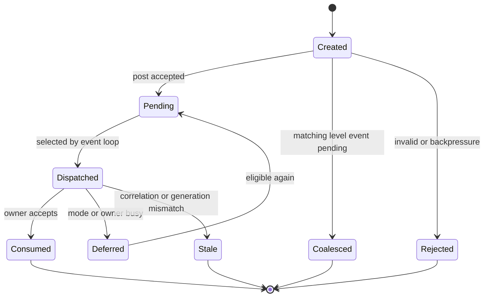
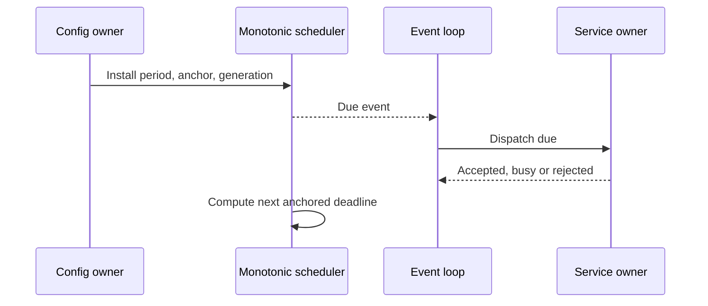
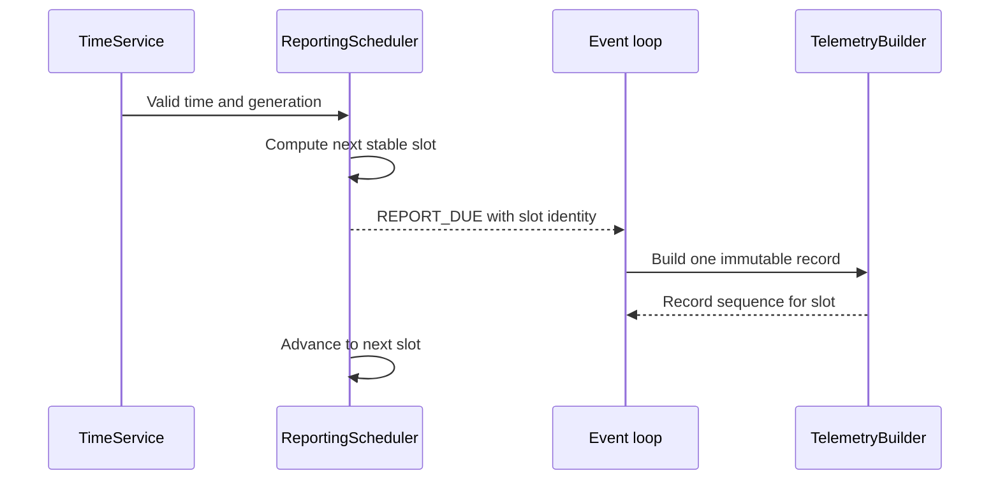
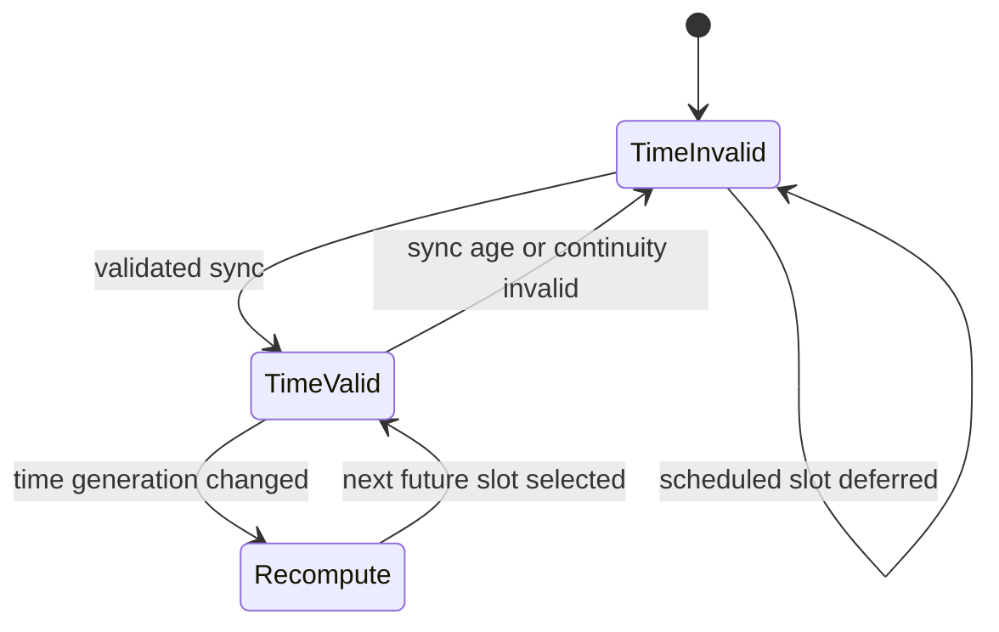

# Event Model and Scheduler

## 1. Mục đích

Tài liệu này định nghĩa event model và scheduling contract chính thức của firmware.

Mục tiêu:

- chuyển interrupt, callback, deadline và service result thành event nhất quán;
- cung cấp event delivery deterministic cho cooperative runtime;
- bảo vệ measurement-critical work khỏi communication/display background work;
- quy định event identity, ordering, coalescing, idempotency và overflow;
- tách monotonic scheduling khỏi wall-clock reporting;
- định nghĩa cadence cho MAX35103 và ZSSC3241;
- chống report slot trùng hoặc catch-up sai sau time jump/reset;
- hỗ trợ Linux virtual time và STM32 low-power wake;
- tạo contract có thể kiểm thử trước khi triển khai queue/scheduler cụ thể.

Tài liệu này sở hữu logical event catalog, delivery semantics và scheduler policy. Exact C layout, queue capacity và peripheral timer implementation có thể thay đổi nếu vẫn giữ contract này.

---

## 2. Phạm vi

### 2.1. Trong phạm vi

- event envelope;
- event source và destination;
- event class;
- priority và same-priority ordering;
- queued, coalesced, flag và mailbox delivery;
- correlation/generation;
- duplicate và stale-event handling;
- queue overflow/backpressure;
- event-loop dispatch budget;
- monotonic one-shot và periodic job;
- MAX35103 event-timing supervision;
- ZSSC3241 one-shot scheduling;
- data freshness deadline;
- retry scheduling;
- wall-clock reporting window/slot;
- time invalid, time jump và missed-slot policy;
- low-power wake scheduling;
- Linux virtual-time mapping;
- STM32 RTC/timer mapping;
- test và acceptance criteria.

### 2.2. Đối tượng áp dụng

Áp dụng cho:

- `AppEventLoop`;
- `AppEventQueue`;
- `MonotonicScheduler`;
- `TimeService`;
- `ReportingScheduler`;
- `MeasurementManager`;
- `PressureMeasurementService`;
- `ConfigRepository`;
- `StorageService`;
- `I2cBusManager`;
- `CellularTelemetryService`;
- `LcdService`;
- `PowerManager`;
- `RecoveryCoordinator`;
- device/platform completion adapter.

---

## 3. Source-of-truth và tài liệu liên quan

| Nội dung | Source-of-truth |
|---|---|
| Cooperative runtime invariant | `00_runtime_decision.md` |
| Module/owner/dependency | `01_firmware_architecture.md` |
| System mode transition | `06_system_fsm.md` |
| Event model và scheduler policy | Tài liệu này |
| FSM-event binding | `03_system_fsm_binding.md` |
| Data type và ownership | `04_data_model_and_ownership.md` |
| Measurement sequence | `10_measurement_cycle.md` |
| Reporting policy | `13_reporting_and_connectivity_policy.md` |
| Platform time/interrupt API | `50_platform_abstraction.md` |
| Simulation/virtual-time protocol | Nhóm `08_simulation` |

Event name trong tài liệu system được giữ làm canonical khi đã tồn tại. Internal event có thể được bổ sung nhưng không được thay đổi system behavior.

---

## 4. Requirement/decision được hiện thực

### 4.1. Decision mapping

| Decision | Scheduler/event consequence |
|---|---|
| `DEC-MEAS-001` | Flow, temperature và pressure period configurable; dùng monotonic scheduler |
| `DEC-MEAS-002` | MAX35103 production dùng event-timing; direct command chỉ service/calibration/diagnostic |
| `DEC-MEAS-003` | ZSSC3241 dùng Sleep Mode one-shot; EOC hoặc bounded polling |
| `DEC-MEAS-004` | Tách validity/freshness/acceptance/reason; default max age = `2 × active period` |
| `DEC-SCHED-001` | Time invalid dùng `DEFER_UNTIL_VALID`; max sync age default 7 ngày |
| `DEC-SCHED-002` | Missed/duplicate report slot dùng `SKIP_TO_NEXT` |
| `DEC-SCHED-003` | MVP chỉ tạo scheduled telemetry |
| `DEC-SCHED-004` | Hai reporting window, default/range/timezone đã chốt |
| `DEC-ARCH-004` | SERVICE quiesce production measurement schedule |
| `DEC-ARCH-005` | Shared I2C có một owner; completion mang correlation/generation |
| `DEC-ARCH-006` | Snapshot publication event theo double-buffer contract |
| `DEC-ARCH-007` | Config apply event/result mang transaction và config version |
| `DEC-DATA-003` | Một accepted source event tạo tối đa một final snapshot trong cùng turn |
| `DEC-COM-003` | Telemetry retry dùng monotonic event sau 30 giây, tối đa 3 lần liên tiếp |
| `DEC-HW-007` | Low-power wake baseline: RTC, MAX INT và LPUART1 |

### 4.2. Event/scheduler requirements

| ID | Requirement |
|---|---|
| `FW-EVT-REQ-001` | Mọi queued event có identity, source, priority và monotonic capture time |
| `FW-EVT-REQ-002` | Completion event phải mang correlation ID và source generation |
| `FW-EVT-REQ-003` | Priority cao được xử lý trước nhưng priority thấp không bị starvation vô hạn |
| `FW-EVT-REQ-004` | Critical/completion event không được silently dropped hoặc unsafe coalesced |
| `FW-EVT-REQ-005` | Coalescing chỉ dùng cho event có semantics level/latest-state |
| `FW-EVT-REQ-006` | Duplicate event không tạo duplicate side effect |
| `FW-EVT-REQ-007` | Queue overflow phải visible và có deterministic response |
| `FW-EVT-REQ-008` | Timeout, retry, duration và measurement cadence dùng monotonic time |
| `FW-EVT-REQ-009` | Wall-clock adjustment không đổi monotonic deadline đang active |
| `FW-EVT-REQ-010` | Periodic schedule dùng anchor để tránh drift |
| `FW-EVT-REQ-011` | MAX35103 result được nhận từ event-timing INT và có supervision deadline |
| `FW-EVT-REQ-012` | Pressure due khởi động đúng một one-shot attempt tại một thời điểm |
| `FW-EVT-REQ-013` | Report slot có stable identity và không tạo duplicate record |
| `FW-EVT-REQ-014` | Time invalid không tạo scheduled record |
| `FW-EVT-REQ-015` | Missed slot không burst catch-up; scheduler nhảy tới slot kế tiếp |
| `FW-EVT-REQ-016` | Config schedule apply chỉ có hiệu lực tại safe boundary và đúng version |
| `FW-EVT-REQ-017` | Scheduler cung cấp next deadline cho PowerManager |
| `FW-EVT-REQ-018` | Linux virtual-time run phải deterministic |
| `FW-EVT-REQ-019` | Event-loop turn có finite dispatch budget |
| `FW-EVT-REQ-020` | ISR event ingress phải bounded và không chạy scheduler policy |

---

## 5. Trách nhiệm

### 5.1. `AppEventQueue`

`AppEventQueue`:

- nhận event từ main context và ISR ingress;
- bảo toàn event metadata;
- cung cấp event theo logical priority và FIFO/sequence trong cùng class;
- quản lý delivery class;
- theo dõi high-watermark, overflow và drop/coalesce counter;
- không quyết định product transition;
- không gọi service khi đang ở ISR;
- không cấp mutable payload có lifetime mơ hồ.

### 5.2. `AppEventLoop`

`AppEventLoop`:

- thu thập pending flags/mailbox/queue;
- chọn event eligible theo mode, priority và fairness;
- dispatch một bounded service/application step;
- theo dõi per-turn budget;
- từ chối/defer/coalesce event theo policy;
- yêu cầu final snapshot publication khi cần;
- kiểm tra runnable work trước low-power.

### 5.3. `MonotonicScheduler`

`MonotonicScheduler`:

- sở hữu monotonic job table;
- quản lý one-shot và periodic deadline;
- phát due event, không thực hiện business action;
- reschedule theo anchor, generation và missed-deadline policy;
- cung cấp earliest deadline;
- hỗ trợ cancel/replace bằng generation;
- không dùng wall clock.

### 5.4. `TimeService`

`TimeService`:

- sở hữu wall-clock value/validity/source/generation;
- validate time sync input;
- cập nhật RTC;
- phát time-validity/time-generation event;
- không sở hữu reporting-window policy;
- không dùng wall clock làm peripheral timeout.

### 5.5. `ReportingScheduler`

`ReportingScheduler`:

- sở hữu active reporting schedule version;
- validate/apply đúng hai reporting window;
- tính stable report slot;
- tạo `REPORT_DUE` khi wall clock valid;
- chống duplicate bằng `ReportSlotIdentity`;
- xử lý time invalid/jump/missed slot theo decision;
- yêu cầu RTC alarm/wake;
- không build hoặc gửi telemetry.

### 5.6. Service owner

Service nhận due/completion event và chịu trách nhiệm:

- kiểm tra event identity/generation;
- kiểm tra current state;
- reject stale/duplicate event;
- thực hiện bounded step;
- phát result/terminal event;
- cập nhật diagnostic;
- không tự sửa global scheduler state ngoài public API.

---

## 6. Ngoài phạm vi

Tài liệu không chốt:

- exact C enum numeric value;
- exact struct packing;
- queue capacity;
- exact timer peripheral;
- NVIC priority number;
- exact flow/temperature/pressure period default/range chưa qualification;
- exact MAX35103 register/event-timing configuration;
- exact ZSSC3241 conversion time;
- exact ISR implementation;
- exact RTC register/alarm implementation;
- telemetry JSON/message encoding;
- exact event persistence;
- RTOS queue/task priority.

Các nội dung này phải giữ logical semantics tại đây.

---

## 7. Interface và dependency

### 7.1. Logical event envelope

```c
typedef struct {
    AppEventId_t id;
    AppEventSource_t source;
    AppEventPriority_t priority;
    AppEventDelivery_t delivery;
    uint32_t sequence;
    uint32_t correlation_id;
    uint32_t source_generation;
    uint64_t monotonic_timestamp_us;
    AppEventPayload_t payload;
} AppEvent_t;
```

Đây là logical shape; exact layout thuộc implementation. Không persist hoặc gửi wire-format bằng cách copy trực tiếp struct này.

### 7.2. Event ingress

Logical APIs:

```c
EventPostResult_t AppEvent_Post(const AppEvent_t *event);
EventPostResult_t AppEvent_PostFromIsr(const AppEvent_t *event);
bool AppEvent_TryGet(AppEvent_t *event_out);
```

API thực tế có thể khác tên nhưng phải giữ:

- bounded call;
- explicit result;
- ISR-safe variant;
- no hidden blocking;
- overflow visible.

### 7.3. Scheduler interface

Logical contract:

```c
ScheduleResult_t Scheduler_ScheduleOneShot(
    const SchedulerJob_t *job);

ScheduleResult_t Scheduler_SchedulePeriodic(
    const SchedulerJob_t *job);

ScheduleResult_t Scheduler_Cancel(
    SchedulerJobId_t job_id,
    uint32_t expected_generation);

void Scheduler_DispatchDue(uint64_t now_us);
bool Scheduler_GetNextDeadline(uint64_t *deadline_us);
```

Exact API thuộc implementation document.

### 7.4. Dependency

```text
Platform time/ISR
  -> event ingress
  -> AppEventQueue
  -> AppEventLoop
  -> SystemModeManager or service owner

ActiveConfig
  -> MonotonicScheduler / ReportingScheduler
  -> due event
  -> service owner
```

Scheduler không gọi device driver trực tiếp. Driver không tự tạo product cadence ngoài contract của owner service.

---

## 8. Data model và đơn vị

### 8.1. Event field

| Field | Type/meaning | Rule |
|---|---|---|
| `id` | Canonical event type | Versioned enum/catalog |
| `source` | Producer identity | Không suy ra từ payload |
| `priority` | Logical priority class | Không phải NVIC priority |
| `delivery` | Queue/flag/mailbox/coalesced | Fixed theo event catalog |
| `sequence` | Producer/global order | Monotonic modulo-safe |
| `correlation_id` | Request/completion identity | Required cho transaction |
| `source_generation` | Driver/service recovery generation | Reject stale completion |
| `monotonic_timestamp` | Capture time | Canonical µs hoặc platform-defined tick converted safely |
| `payload` | Small value/copy/stable reference | Explicit lifetime |

### 8.2. Delivery class

| Class | Semantics | Ví dụ |
|---|---|---|
| `DELIVERY_EDGE` | Mỗi occurrence có ý nghĩa | Command, state transition request |
| `DELIVERY_COMPLETION` | Terminal outcome của request | SPI/I2C/UART/storage completion |
| `DELIVERY_LEVEL` | Current condition; có thể coalesce | Connectivity changed, refresh requested |
| `DELIVERY_DEADLINE` | Job due theo generation | Pressure due, retry due |
| `DELIVERY_MAILBOX` | Payload lớn nằm trong owner mailbox | RX frame available, sensor result ready |

### 8.3. Scheduler job

| Field | Meaning |
|---|---|
| `job_id` | Stable job identity |
| `owner` | Module nhận due event |
| `event_id` | Event phát khi due |
| `time_domain` | Monotonic; reporting calendar thuộc scheduler riêng |
| `deadline_us` | Next absolute monotonic deadline |
| `anchor_us` | Periodic cadence anchor |
| `period_us` | 0 với one-shot |
| `generation` | Invalidates old due/cancel/completion |
| `mode_mask` | Mode được phép dispatch |
| `miss_policy` | Skip, signal-once hoặc owner-specific |
| `priority` | Due-event priority |
| `pending` | Due event đã phát nhưng chưa được owner consume |

### 8.4. Report slot identity

`ReportSlotIdentity` tối thiểu:

```text
reporting_schedule_version
time_generation
window_id
slot_due_utc_or_canonical_time
```

Identity phải ổn định qua retry. `report_sequence` và `TelemetryRecord` chỉ được tạo một lần cho một accepted slot identity.

### 8.5. Time unit

- monotonic internal time: unsigned 64-bit µs hoặc equivalent có conversion kiểm chứng;
- reporting start time: minute-of-day `0..1439`;
- reporting interval: whole minutes;
- wall-clock canonical: UTC + fixed-offset/version metadata;
- freshness age: monotonic duration;
- timeout/retry: monotonic duration.

Arithmetic phải dùng wrap-safe comparison nếu hardware counter nhỏ hơn 64-bit.

---

## 9. State machine hoặc sequence

### 9.1. Event lifecycle



### 9.2. Periodic job



### 9.3. Report scheduling



### 9.4. Time invalid/recovery



---

## 10. Timing, timeout và non-blocking behavior

### 10.1. Hai time domain

| Domain | Owner | Dùng cho |
|---|---|---|
| Monotonic | Platform + `MonotonicScheduler` | Measurement, timeout, retry, freshness, work budget |
| Wall clock | RTC + `TimeService` | Timestamp, timezone, reporting window/slot |

Wall-clock step, sync hoặc timezone change:

- tăng `time_generation`;
- không sửa monotonic job;
- invalidate RTC alarm/report calculation cũ;
- yêu cầu `ReportingScheduler` recompute;
- không tạo catch-up burst.

### 10.2. Periodic anchor

Periodic deadline:

```text
deadline(n) = anchor + n × period
```

Không dùng mặc định:

```text
next_deadline = completion_time + period
```

vì gây drift. Nếu now đã qua nhiều deadline:

- tạo tối đa một due indication nếu miss policy yêu cầu;
- ghi missed-count/diagnostic;
- chọn deadline đầu tiên lớn hơn now;
- không phát burst event cho mọi period đã lỡ.

### 10.3. Measurement period

Flow, temperature và pressure:

- có period cấu hình độc lập;
- period chỉ apply sau validation;
- apply tại safe boundary;
- giữ config version/generation;
- freshness default maximum age là `2 × active period`;
- exact default/range là `NEEDS_VERIFICATION` theo product/hardware validation.

### 10.4. MAX35103 event-timing mode

Production behavior:

1. validated config/profile xác định MAX event-timing cadence;
2. `MeasurementManager`/driver cấu hình hardware;
3. MAX35103 thực hiện measurement theo event-timing;
4. INT adapter capture source/time/counter;
5. phát `EVT_MAX_RESULT_READY`;
6. normal context đọc coherent result/status;
7. phát validated processing input;
8. supervision deadline phát timeout/recovery nếu result không đến.

Không phát direct measurement command cho mỗi production sample. Direct command chỉ dùng trong authorized service/calibration/diagnostic context và mang non-production provenance.

Khi period/config đổi:

- quiesce hoặc hoàn tất attempt hiện tại theo safe-boundary rule;
- increment measurement generation;
- reconfigure event-timing profile;
- reject completion thuộc generation cũ;
- restart supervision.

### 10.5. ZSSC3241 one-shot schedule

Pressure behavior:

1. `EVT_PRESSURE_SAMPLE_DUE`;
2. nếu service idle, tạo attempt identity;
3. submit one-shot trigger qua shared I2C;
4. chờ EOC hoặc schedule bounded poll;
5. đọc status/raw result;
6. terminal completion hoặc timeout;
7. processing/publish result;
8. anchored schedule tiến tới period kế tiếp.

Nếu due khi pressure service busy:

- không tạo overlapping conversion;
- increment missed/busy diagnostic;
- áp dụng one-pending/latest-due policy nếu được chốt;
- không burst catch-up;
- exact busy policy là `NEEDS_VERIFICATION`.

### 10.6. Retry schedule

Retry không dùng blocking delay. Ví dụ telemetry:

```text
delivery failed retryable
  -> schedule monotonic one-shot +30 s
  -> return event loop
  -> EVT_TELEMETRY_RETRY_DUE
  -> next bounded delivery attempt
```

Tối đa 3 lần liên tiếp theo `DEC-COM-003`; terminal outcome được publish sau khi hết budget.

### 10.7. Event-loop budget

Mỗi turn có finite:

- event dispatch count;
- service-step count;
- execution-time budget;
- parser byte/frame budget.

Exact value là `NEEDS_VERIFICATION`. Hết budget phải giữ pending work cho turn sau, không spin tiếp.

---

## 11. Configuration

### 11.1. Measurement schedule config

Mỗi stream config tối thiểu:

```text
enabled
period
maximum_freshness_age
apply_class
version
```

Validation:

- period trong product bounds;
- non-zero khi enabled;
- conversion/processing worst-case nhỏ hơn operational constraint;
- freshness age tương thích period;
- shared bus load khả thi;
- change không cắt ngang attempt atomic.

### 11.2. Reporting schedule baseline

Baseline có đúng hai window:

| Field | Window 0 | Window 1 |
|---|---:|---:|
| Default start | 06:00 | 22:00 |
| Default interval | 15 phút | 5 phút |

Validation:

| Rule | Giá trị |
|---|---|
| Start range | `00:00..23:59` |
| Granularity | 1 phút |
| Start distinct | Bắt buộc |
| Derived window duration | Tối thiểu 30 phút |
| Interval | Số nguyên `5..60` phút |
| Timezone baseline | Versioned fixed UTC offset; VN profile `UTC+07:00` |

End boundary của mỗi window được suy ra từ start của window còn lại theo chu kỳ 24 giờ.

Default schedule tạo:

```text
06:00..22:00 at 15 min = 64 slots
22:00..06:00 at 5 min  = 96 slots
Total                   = 160 slots/day
```

Con số này phải được kiểm chứng với power/data budget nhưng không thay đổi scheduling semantics.

### 11.3. Reporting apply

Sau commit và `ActiveConfig` replacement:

1. `ConfigRepository` gửi apply request có transaction/config version;
2. `ReportingScheduler` chờ safe boundary;
3. validate matching version;
4. thay active schedule;
5. increment schedule generation;
6. recompute next future slot;
7. trả `APPLIED`, `DEFERRED` hoặc `REJECTED`.

Schedule update:

- không hủy telemetry transaction in-flight;
- không tự tạo immediate report;
- không tái tạo slot đã accepted;
- không apply từ UART callback.

### 11.4. Time validity config

- network/server sync ưu tiên;
- max sync age default 7 ngày và cấu hình được;
- age/continuity invalid chuyển time state sang invalid;
- reporting dùng `DEFER_UNTIL_VALID`;
- measurement monotonic schedule tiếp tục.

---

## 12. Error detection và recovery

### 12.1. Event ingress result

| Result | Meaning |
|---|---|
| `POSTED` | Event được lưu để dispatch |
| `COALESCED` | Event level/deadline đã có pending equivalent |
| `BACKPRESSURE` | Producer phải giữ/retry theo contract |
| `REJECTED_INVALID` | Metadata/payload/mode không hợp lệ |
| `OVERFLOW_ESCALATED` | Không thể lưu critical event; emergency evidence đã set |

### 12.2. Overflow policy theo class

| Event class | Khi capacity không đủ |
|---|---|
| P0 critical | Set dedicated emergency flag/counter, wake loop, escalate; không silent drop |
| P1 measurement/completion | Dùng reserved slot/mailbox/counter; nếu vẫn thất bại, recovery required |
| Transaction terminal | Giữ owner mailbox + ready flag; không overwrite unmatched result |
| Config/command | Backpressure hoặc reject request có response |
| Communication RX | Ring-buffer overflow diagnostic, parser/session recovery |
| LCD refresh | Coalesce latest request |
| Non-critical diagnostic export | Có thể drop với drop counter |
| Low-power request | Coalesce; critical work luôn thắng |

Exact reserved capacity thuộc implementation/test.

### 12.3. Stale/duplicate detection

Event bị stale khi:

- source generation không còn active;
- correlation ID không khớp request;
- scheduler job generation đã bị cancel/replace;
- mode không còn cho phép;
- config version đã superseded;
- report slot identity đã accepted;
- completion đã được consume.

Stale event không tạo side effect; counter/diagnostic được cập nhật theo class.

### 12.4. Queue corruption/invariant

Queue index corruption, impossible priority hoặc invalid payload lifetime là internal invariant fault. Runtime phải:

- capture structured diagnostic;
- ngăn unsafe dispatch;
- chuyển bounded recovery hoặc critical path;
- không tiếp tục bằng cách đoán payload.

### 12.5. Scheduler error

Phải phát hiện:

- deadline overflow;
- invalid period;
- time going backward trong monotonic domain;
- duplicate job ID/generation;
- unsupported miss policy;
- RTC alarm không program được;
- time generation mismatch;
- slot calculation không hội tụ.

---

## 13. Linux simulation mapping

### 13.1. Virtual monotonic clock

Linux test backend cung cấp:

```text
Now()
AdvanceTo(t)
AdvanceBy(delta)
NextExternalEventTime()
```

Core scheduler chỉ dùng platform time port, không gọi `clock_gettime` hoặc `sleep` trực tiếp.

### 13.2. Deterministic dispatch

Với cùng:

- initial state;
- config/profile version;
- event sequence;
- virtual timestamps;
- emulator scenario/seed;

kết quả phải có cùng event order, owner state và terminal result.

Same-timestamp tie-break:

1. priority class;
2. event source/sequence ordering đã chốt;
3. FIFO insertion order nếu còn bằng nhau.

Exact tie-break key phải cố định trong implementation và test.

### 13.3. Virtual idle

Khi queue rỗng:

1. lấy earliest scheduler deadline;
2. lấy earliest emulator/external event;
3. advance virtual time tới giá trị nhỏ hơn;
4. inject due/completion;
5. tiếp tục event loop.

Không sleep thực trong deterministic test.

### 13.4. Scenario hooks

Test có thể inject:

- MAX INT đúng hạn/mất/trùng;
- ZSSC EOC chậm/mất;
- I2C completion generation cũ;
- wall-clock step forward/backward;
- time invalid/valid;
- queue pressure;
- RTC alarm trùng;
- BLE burst;
- modem timeout/retry;
- spurious wake.

Hook chỉ đi qua platform/event contract, không sửa trực tiếp private service state trừ unit test chuyên biệt.

---

## 14. STM32 mapping

### 14.1. Event ingress

STM32 có thể dùng kết hợp:

- bounded ring queue cho edge event;
- volatile/atomic pending flags cho level event;
- dedicated completion mailbox;
- monotonic counter/sequence cho interrupt source;
- critical reserved flag cho overflow escalation.

Implementation phải giữ delivery semantics, không bắt buộc mọi event nằm trong một queue vật lý.

### 14.2. Time source

| Need | STM32 source |
|---|---|
| Short/normal monotonic deadline | Timer/LPTIM/SysTick-derived timebase đã qualification |
| Long low-power wake | RTC alarm/wakeup |
| Calendar/reporting | Internal RTC qua `TimeService` |
| MAX completion | EXTI INT |
| BLE wake | LPUART1 wake |

Monotonic continuity qua STOP 2 phải được thiết kế/kiểm chứng. Nếu timebase dừng, platform phải reconstruct elapsed time từ retained/wake source theo contract.

### 14.3. ISR rule

ISR:

- capture minimal status/time/counter;
- update mailbox/flag/queue bounded;
- clear source;
- return.

ISR không:

- tính report slot;
- chạy scheduler loop;
- parse BLE/modem;
- đọc toàn bộ MAX result;
- trigger storage commit;
- apply config.

### 14.4. Low-power integration

`PowerManager` chỉ yêu cầu STOP 2 khi:

- không có ready event;
- không có completion mailbox chưa xử lý;
- không có critical blocker;
- earliest wake deadline đã program;
- wake source hợp lệ;
- scheduler state consistent.

Sau wake:

1. platform capture wake reason;
2. restore timebase/clock;
3. post `EVT_WAKE` và source-specific event;
4. scheduler dispatch due job;
5. không coi wake là fresh measurement.

---

## 15. Test và acceptance criteria

### 15.1. Event unit test

| Test ID | Scenario | Expected |
|---|---|---|
| `FW-EVT-UT-001` | Same-priority events | FIFO/sequence order |
| `FW-EVT-UT-002` | Critical + low-power pending | Critical xử lý trước |
| `FW-EVT-UT-003` | Duplicate completion | Một terminal side effect |
| `FW-EVT-UT-004` | Generation cũ | Event stale bị reject |
| `FW-EVT-UT-005` | Repeated LCD refresh | Coalesced |
| `FW-EVT-UT-006` | Queue full + command | Backpressure/reject visible |
| `FW-EVT-UT-007` | Queue full + critical | Emergency escalation visible |
| `FW-EVT-UT-008` | Low priority dưới sustained load | Không starvation vượt bound |
| `FW-EVT-UT-009` | Invalid payload lifetime/type | Reject/invariant diagnostic |
| `FW-EVT-UT-010` | Per-turn budget hết | Pending work giữ cho turn sau |

### 15.2. Monotonic scheduler test

| Test ID | Scenario | Expected |
|---|---|---|
| `FW-SCH-UT-001` | One-shot deadline | Due đúng một lần |
| `FW-SCH-UT-002` | Periodic normal | Deadline bám anchor |
| `FW-SCH-UT-003` | Handler chạy chậm | Không drift theo completion |
| `FW-SCH-UT-004` | Lỡ nhiều period | Không burst catch-up |
| `FW-SCH-UT-005` | Cancel generation cũ | Old due không dispatch |
| `FW-SCH-UT-006` | Wall-clock jump | Monotonic job không đổi |
| `FW-SCH-UT-007` | Counter wrap boundary | Comparison đúng |
| `FW-SCH-UT-008` | Invalid period | Reject trước install |
| `FW-SCH-UT-009` | Earliest deadline | PowerManager nhận đúng |
| `FW-SCH-UT-010` | Virtual time | Không sleep thực, deterministic |

### 15.3. Measurement scheduler test

| Test ID | Scenario | Expected |
|---|---|---|
| `FW-MSCH-IT-001` | MAX event-timing INT | Result-ready đúng generation |
| `FW-MSCH-IT-002` | MAX missing INT | Supervision timeout/recovery |
| `FW-MSCH-IT-003` | Reconfigure MAX period | Old completion stale |
| `FW-MSCH-IT-004` | Pressure due idle | Một one-shot attempt |
| `FW-MSCH-IT-005` | Pressure due busy | Không overlapping/burst |
| `FW-MSCH-IT-006` | EOC mất | Poll/timeout bounded |
| `FW-MSCH-IT-007` | Measurement config apply | Apply tại safe boundary |
| `FW-MSCH-IT-008` | SERVICE entry | Production jobs quiesced |

### 15.4. Reporting scheduler test

| Test ID | Scenario | Expected |
|---|---|---|
| `FW-RSCH-UT-001` | Default schedule | 160 slot/ngày |
| `FW-RSCH-UT-002` | Window qua midnight | Slot đúng window |
| `FW-RSCH-UT-003` | Start trùng | Config reject |
| `FW-RSCH-UT-004` | Window <30 phút | Config reject |
| `FW-RSCH-UT-005` | Interval ngoài 5..60 | Config reject |
| `FW-RSCH-UT-006` | Time invalid | Không tạo record |
| `FW-RSCH-UT-007` | Time phục hồi | Skip tới next future slot |
| `FW-RSCH-UT-008` | RTC alarm duplicate | Một slot/record |
| `FW-RSCH-UT-009` | Time step backward | Không duplicate accepted slot |
| `FW-RSCH-UT-010` | Schedule update in-flight telemetry | Không hủy transaction, không immediate report |
| `FW-RSCH-UT-011` | Leak state changed | Snapshot/LCD update, không immediate telemetry |
| `FW-RSCH-UT-012` | Time generation đổi | Alarm/slot cũ invalidated |

### 15.5. Acceptance criteria

Tài liệu được hiện thực khi:

- event envelope và catalog có implementation mapping;
- P0/P1/completion không silently drop;
- coalescing chỉ dùng cho event catalog cho phép;
- duplicate/stale completion không tạo side effect;
- same input/time tạo deterministic event order;
- measurement period dùng monotonic anchor;
- MAX event-timing supervision hoạt động;
- pressure one-shot không overlap;
- wall-clock jump không ảnh hưởng monotonic measurement;
- report slot không duplicate/catch-up burst;
- time invalid policy đúng decision;
- scheduler cung cấp next wake;
- queue/scheduler có diagnostic và fault tests.

---

## 16. Traceability

| Requirement | Design section | Verification |
|---|---|---|
| `FW-EVT-REQ-001/002` | Event envelope | Event metadata tests |
| `FW-EVT-REQ-003` | Priority/fairness | Load/starvation test |
| `FW-EVT-REQ-004/005` | Delivery/overflow | Queue pressure tests |
| `FW-EVT-REQ-006` | Correlation/idempotency | Duplicate tests |
| `FW-EVT-REQ-007` | Overflow response | Fault injection |
| `FW-EVT-REQ-008/009` | Time-domain separation | Clock-jump tests |
| `FW-EVT-REQ-010` | Anchored periodic schedule | Drift test |
| `FW-EVT-REQ-011` | MAX event timing | Emulator integration |
| `FW-EVT-REQ-012` | Pressure one-shot | ZSSC emulator integration |
| `FW-EVT-REQ-013` | Slot identity | Duplicate-slot tests |
| `FW-EVT-REQ-014/015` | Invalid/missed policy | Reporting tests |
| `FW-EVT-REQ-016` | Versioned safe apply | Config tests |
| `FW-EVT-REQ-017` | Next deadline | Low-power tests |
| `FW-EVT-REQ-018` | Virtual time | Determinism test |
| `FW-EVT-REQ-019` | Dispatch budget | Budget exhaustion test |
| `FW-EVT-REQ-020` | ISR ingress | Static review/callback test |

Detailed source/test mapping sẽ nằm trong `95_firmware_traceability.md`.

---

## 17. Open issues / NEEDS_VERIFICATION

| ID | Nội dung | Direction hiện tại | Owner/gate |
|---|---|---|---|
| `FW-EVT-OQ-001` | Exact event enum value/range | Grouped stable enum | Implementation |
| `FW-EVT-OQ-002` | Queue capacity/reserved capacity | Static build profile | RAM/load test |
| `FW-EVT-OQ-003` | Exact fairness/starvation bound | Finite per-class budget | Profiling |
| `FW-EVT-OQ-004` | Per-turn dispatch/time budget | Configured build bound | Linux/STM32 timing |
| `FW-EVT-OQ-005` | Same-timestamp source tie-break | Fixed deterministic key | Implementation/test |
| `FW-EVT-OQ-006` | Exact flow/temperature/pressure period bounds | Validated config profile | Product validation |
| `FW-EVT-OQ-007` | Exact MAX supervision timeout | Versioned device profile | Hardware/emulator |
| `FW-EVT-OQ-008` | Exact ZSSC conversion/poll timeout | Versioned device profile | Hardware qualification |
| `FW-EVT-OQ-009` | Pressure-due-while-busy policy | No overlap/no burst | Measurement document |
| `FW-EVT-OQ-010` | Monotonic continuity qua STOP 2 | Platform reconstruction contract | Board verification |
| `FW-EVT-OQ-011` | RTC alarm resolution/latency | Abstract behind `RtcPort` | Board verification |
| `FW-EVT-OQ-012` | Event payload storage strategy | Small copy + owner mailbox | Implementation |
| `FW-EVT-OQ-013` | Exact parser byte budget | Bounded per turn | BLE/4G integration |

Các mục chưa chốt không chặn Linux scheduler skeleton nếu được expose qua config/profile và có deterministic defaults chỉ dành cho test.

### 17.1. Canonical event catalog

Catalog dưới đây là logical baseline; exact numeric enum thuộc implementation.

#### System/mode events

```text
EVT_SYSTEM_START
EVT_INIT_COMPLETED
EVT_RECOVERABLE_INIT_FAILURE
EVT_CRITICAL_INIT_FAILURE
EVT_LOW_POWER_REQUEST
EVT_WAKE
EVT_SERVICE_REQUEST
EVT_SERVICE_EXIT
EVT_SYSTEM_RECOVERY_REQUIRED
EVT_RECOVERY_SUCCEEDED
EVT_RECOVERY_FAILED
EVT_CRITICAL_ERROR
EVT_AUTHORIZED_RECOVERY_REQUEST
EVT_CONTROLLED_REINITIALIZE
```

#### Measurement events

```text
EVT_MAX_RESULT_READY
EVT_MAX_RESULT_TIMEOUT
EVT_FLOW_PROCESSING_COMPLETED
EVT_TEMPERATURE_RESULT_READY
EVT_FLOW_RESULT_READY
EVT_PRESSURE_SAMPLE_DUE
EVT_PRESSURE_EOC
EVT_PRESSURE_POLL_DUE
EVT_PRESSURE_TIMEOUT
EVT_PRESSURE_RESULT_READY
EVT_MEASUREMENT_STATUS_CHANGED
```

#### Product/data events

```text
EVT_VOLUME_UPDATED
EVT_VOLUME_CHECKPOINT_REQUIRED
EVT_LEAK_RESULT_UPDATED
EVT_LEAK_STATE_CHANGED
EVT_SNAPSHOT_PUBLISH_REQUESTED
EVT_SNAPSHOT_PUBLISHED
```

#### Configuration/storage events

```text
EVT_CONFIG_CANDIDATE_READY
EVT_CONFIG_COMMIT_REQUIRED
EVT_CONFIG_COMMIT_COMPLETED
EVT_CONFIG_COMMIT_FAILED
EVT_CONFIG_APPLY_REQUESTED
EVT_CONFIG_APPLY_RESULT
EVT_STORAGE_COMMIT_REQUESTED
EVT_STORAGE_COMMIT_COMPLETED
EVT_STORAGE_COMMIT_FAILED
EVT_I2C_TRANSACTION_COMPLETED
EVT_I2C_TRANSACTION_FAILED
```

#### Time/reporting events

```text
EVT_RTC_ALARM
EVT_TIME_SYNC_RECEIVED
EVT_TIME_VALIDITY_CHANGED
EVT_TIME_GENERATION_CHANGED
EVT_REPORT_DUE
```

#### BLE/cellular events

```text
EVT_BLE_RX_AVAILABLE
EVT_BLE_REQUEST_READY
EVT_BLE_TX_COMPLETED
EVT_CELLULAR_RX_AVAILABLE
EVT_CELLULAR_STEP_DUE
EVT_CONNECTIVITY_CHANGED
EVT_TELEMETRY_RECORD_ENQUEUED
EVT_TELEMETRY_RETRY_DUE
EVT_TELEMETRY_DELIVERY_CONFIRMED
EVT_TELEMETRY_DELIVERY_FAILED
```

#### Display/power/health events

```text
EVT_LCD_REFRESH_REQUESTED
EVT_LCD_UPDATE_COMPLETED
EVT_LCD_UPDATE_FAILED
EVT_POWER_STATUS_CHANGED
EVT_HEALTH_CHECK_DUE
EVT_WATCHDOG_PROGRESS_REQUIRED
```

Mỗi event phải được bổ sung mapping owner, priority, delivery, payload và mode permission trước khi code enum được freeze.

---

## 18. Revision history

| Version | Date | Change | Author |
|---|---|---|---|
| 0.1 | 2026-07-14 | Initial event delivery, monotonic scheduling and reporting-slot contract | Firmware |
