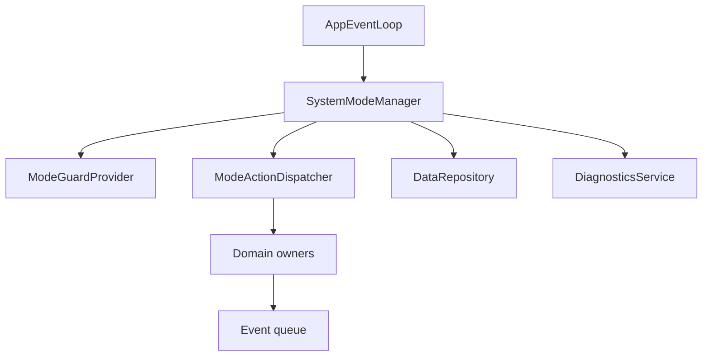
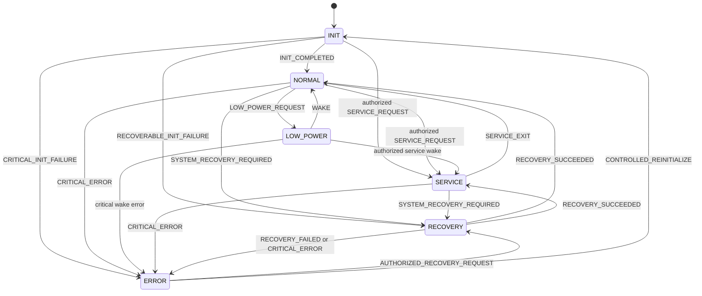
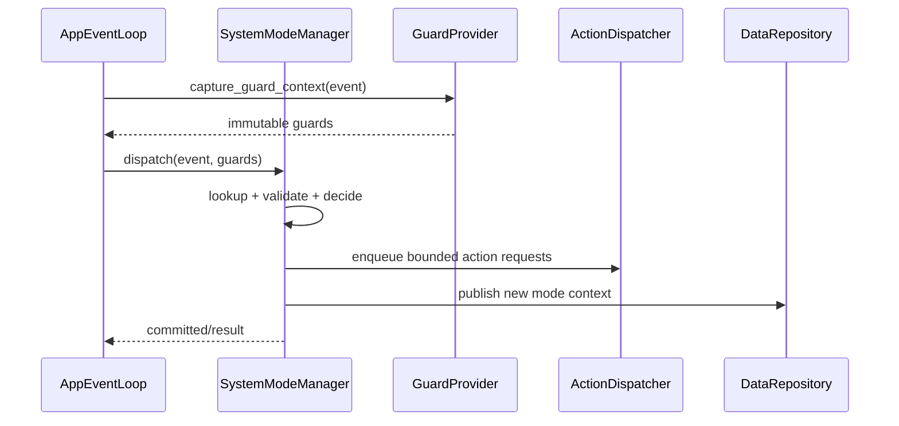

---

document_id: FW-CORE-004
title: System FSM Binding
status: DRAFT
version: 0.1
owner: Firmware
last_updated: 2026-07-14
source_of_truth: true
related_decisions:

- DEC-ARCH-001
- DEC-ARCH-004
- DEC-ARCH-005
- DEC-ARCH-006
- DEC-ARCH-007
- DEC-DATA-003
- DEC-ERR-001
- DEC-ERR-002
- DEC-ERR-003
- DEC-ERR-004
- DEC-HW-007
- DEC-PWR-002
- DEC-SVC-001
related_documents:
- ../README.md
- 00_runtime_decision.md
- 01_firmware_architecture.md
- 02_event_model_and_scheduler.md
- 04_data_model_and_ownership.md
- ../../00_overview/04_main_operation_flow.md
- ../../00_overview/05_sequence_diagrams.md
- ../../00_overview/06_system_fsm.md
- ../../00_overview/07_operating_modes.md
- ../../00_overview/08_data_flow.md
- ../../00_overview/09_error_handling_overview.md
- ../../00_overview/11_firmware_implication.md
- ../40_reliability/40_error_detection_and_recovery.md
- ../40_reliability/43_low_power_mode.md
- ../40_reliability/44_boot_and_self_check.md
- ../50_platform/50_platform_abstraction.md
- ../50_platform/53_interrupt_dma_and_callback_rules.md

---

# System FSM Binding

## 0. Trạng thái triển khai tại firmware baseline

- Firmware baseline: `4044414a7610d53b24c10814c12eaa09864e949e`
- Implementation status: **PARTIAL**
- Đã có trong code: System FSM, mode guard and unit tests exist.
- Chưa hoàn tất: Boot/self-check, watchdog reset reason, full low-power and all facade side effects are not fully bound.
- Quy ước đọc: các mục requirement/contract bên dưới là thiết kế chuẩn; chỉ những capability được liệt kê “Đã có trong code” mới được xem là đã triển khai.


## 1. Mục đích

Tài liệu này định nghĩa cách hiện thực `SystemMode` FSM cấp hệ thống trong firmware, bao gồm:

* Binding từ state, event, guard và action trong `06_system_fsm.md` sang module và API firmware.
* Quyền sở hữu và cơ chế commit primary `SystemMode`.
* Bảng transition có thể triển khai theo table-driven FSM.
* Quy tắc entry/exit, publication và side effect của mỗi mode.
* Cách internal service FSM hoạt động trong từng mode mà không làm thay đổi primary mode trái phép.
* Xử lý event bị từ chối, defer, duplicate, stale hoặc không được định nghĩa.
* Mapping tương đương giữa Linux simulation và STM32.
* Test oracle cho transition, guard, action và invariant.

Mục tiêu cuối cùng là cùng một FSM core và cùng một bộ test vector chạy được trên Linux trước khi bind sang STM32.

Các từ khóa `MUST`, `MUST NOT`, `SHOULD`, `MAY` lần lượt được hiểu là bắt buộc, cấm, khuyến nghị và tùy chọn.

---

## 2. Phạm vi

### 2.1. Trong phạm vi

* Sáu primary mode: `INIT`, `NORMAL`, `LOW_POWER`, `SERVICE`, `RECOVERY`, `ERROR`.
* Event cấp hệ thống có thể thay đổi mode.
* Guard evaluation và transition priority.
* Entry/exit request, transition record và mode publication.
* Admission policy cho service/domain theo mode.
* Reset, brownout, watchdog và controlled reinitialization ở góc nhìn FSM.
* Binding với `SystemManager`, `SystemModeManager`, `RecoveryCoordinator`, `PowerManager`, service modules và platform backend.
* Linux deterministic simulation, fault injection và model-based test.

### 2.2. Điều kiện áp dụng

Tài liệu áp dụng cho:

* Linux simulation backend.
* STM32L433 production firmware.
* Factory/debug build khi dùng cùng FSM core.
* Các product variant dùng cùng tập `SystemMode` baseline.

---

## 3. Source-of-truth và tài liệu liên quan

### 3.1. Thứ tự ưu tiên

| Ưu tiên | Tài liệu                             | Nội dung sở hữu                                                   |
| ------: | ------------------------------------ | ----------------------------------------------------------------- |
|       1 | `00_open_questions_and_decisions.md` | Decision đã chốt                                                  |
|       2 | `06_system_fsm.md`                   | State, event, guard, action, transition và invariant cấp hệ thống |
|       3 | `07_operating_modes.md`              | Capability và behavior chi tiết theo mode                         |
|       4 | `09_error_handling_overview.md`      | Fault containment, recovery và escalation                         |
|       5 | `11_firmware_implication.md`         | Module, ownership và firmware constraint                          |
|       6 | Tài liệu này                         | Binding có thể triển khai và kiểm thử                             |
|       7 | Tài liệu module downstream           | Internal FSM và implementation detail                             |

Nếu binding trong tài liệu này mâu thuẫn với `06_system_fsm.md`, không được sửa code để tự chọn behavior khác. Phải cập nhật tài liệu owner hoặc tạo decision được review.

### 3.2. Quan hệ với event model

`02_event_model_and_scheduler.md` sở hữu event envelope, priority queue, generation, correlation, delivery class và duplicate/stale policy. Tài liệu này chỉ định nghĩa cách `SystemModeManager` tiêu thụ các event đó.

### 3.3. Quan hệ với internal FSM

Các state như `WAIT_RESULT`, `PROCESSING`, `BACKOFF`, `VERIFYING`, `SENDING` và `LOCAL_RECOVERY` thuộc internal service FSM. Chúng không được thêm vào `SystemMode`.

---

## 4. Requirement/decision được hiện thực

| ID               | Requirement firmware                                                                                                          |
| ---------------- | ----------------------------------------------------------------------------------------------------------------------------- |
| `FW-FSM-REQ-001` | Sau mọi reset, primary mode đầu tiên MUST là `INIT`; không restore trực tiếp mode trước reset.                                |
| `FW-FSM-REQ-002` | Tại một thời điểm MUST có đúng một primary `SystemMode` hợp lệ.                                                               |
| `FW-FSM-REQ-003` | `SystemModeManager` MUST là single writer duy nhất của primary mode và transition sequence.                                   |
| `FW-FSM-REQ-004` | Mọi mode change MUST đi qua một transition function dùng bảng transition canonical.                                           |
| `FW-FSM-REQ-005` | Transition MUST deterministic theo current mode, event và immutable guard context.                                            |
| `FW-FSM-REQ-006` | Guard MUST là phép đánh giá bounded, không blocking và không trực tiếp chạy driver transaction.                               |
| `FW-FSM-REQ-007` | Transition action MUST phát request bất đồng bộ; không chờ SPI/I2C/UART/storage/network completion trong transition function. |
| `FW-FSM-REQ-008` | Một transition thành công MUST tăng `mode_transition_sequence` đúng một lần và publish atomic mode context.                   |
| `FW-FSM-REQ-009` | Duplicate hoặc stale event MUST NOT lặp lại entry/exit side effect.                                                           |
| `FW-FSM-REQ-010` | Connectivity, time, measurement, storage, leak, reporting, display và power status MUST trực giao với primary mode.           |
| `FW-FSM-REQ-011` | `NORMAL -> LOW_POWER` chỉ hợp lệ khi không còn blocker và wake source đã chuẩn bị được.                                       |
| `FW-FSM-REQ-012` | `SERVICE` chỉ được vào sau authorization và safe boundary; production scheduler/consumer admission MUST bị quiesce.           |
| `FW-FSM-REQ-013` | `SERVICE_SAMPLE` và `CALIBRATION_SAMPLE` MUST NOT tạo production volume, leak evidence hoặc scheduled production telemetry.   |
| `FW-FSM-REQ-014` | Exit `SERVICE` chỉ resume product update sau valid production sample mới.                                                     |
| `FW-FSM-REQ-015` | Local peripheral fault MUST ở internal recovery nếu được cô lập; không tự đổi primary mode.                                   |
| `FW-FSM-REQ-016` | System recovery MUST có ordered steps, monotonic deadlines, attempt limit, success evidence và escalation.                    |
| `FW-FSM-REQ-017` | `ERROR -> NORMAL` trực tiếp MUST bị cấm.                                                                                      |
| `FW-FSM-REQ-018` | Brownout/reset không tạo `SHUTDOWN` mode và không yêu cầu emergency persistent write.                                         |
| `FW-FSM-REQ-019` | Event không có transition explicit MUST nhận một policy xác định; không được mặc định reset hoặc vào `ERROR`.                 |
| `FW-FSM-REQ-020` | Critical event MUST thắng low-power, service, reporting và presentation event khi cùng pending.                               |
| `FW-FSM-REQ-021` | Wall-clock invalid/jump MUST NOT làm sai duration, timeout hoặc transition timestamp monotonic.                               |
| `FW-FSM-REQ-022` | Linux và STM32 MUST dùng cùng enum, transition table, guard semantics và test vector.                                         |
| `FW-FSM-REQ-023` | Invalid enum, forbidden transition hoặc ownership violation MUST tạo invariant fault có bounded outcome.                      |
| `FW-FSM-REQ-024` | Transition trace MUST chứa đủ dữ liệu để truy nguyên event, requester, reason, guard result và mode generation.               |

---

## 5. Trách nhiệm

### 5.1. Module ownership

| Module                  | Trách nhiệm                                                                         |
| ----------------------- | ----------------------------------------------------------------------------------- |
| `SystemManager`         | Boot orchestration, readiness aggregation, phát init result event                   |
| `SystemModeManager`     | Single writer, evaluate transition, commit/publish mode, maintain transition record |
| `AppEventLoop`          | Chọn event theo priority/fairness và gọi FSM một work step                          |
| `ModeGuardProvider`     | Chụp immutable guard context từ các owner/status repository                         |
| `ModeActionDispatcher`  | Chuyển action token thành bounded async request tới owner module                    |
| `RecoveryCoordinator`   | Thực hiện system recovery plan và phát recovery result event                        |
| `PowerManager`          | Tổng hợp blocker, prepare wake source và báo readiness cho low-power                |
| `ServiceSessionManager` | Authorization, role, inactivity timeout và service session lifecycle                |
| `DataRepository`        | Publish stable snapshot có mode/status generation                                   |
| `DiagnosticsService`    | Transition/fault counter và bounded history                                         |
| `WatchdogSupervisor`    | Kiểm tra progress contract theo mode                                                |
| Platform backend        | Monotonic clock, reset reason, low-power primitive và wake reason                   |

### 5.2. Quyền thay đổi mode

Module khác chỉ được gửi event/request. Các API kiểu sau bị cấm ngoài `SystemModeManager`:

```text
global_system_mode = ...
runtime_snapshot.mode = ...
force_mode(...)
restore_previous_mode_after_reset(...)
```

### 5.3. Ranh giới trách nhiệm

* Event producer chịu trách nhiệm cung cấp event payload/generation/correlation hợp lệ.
* Guard owner chịu trách nhiệm publish evidence; guard evaluator không đi đọc hardware trực tiếp.
* Action owner chịu trách nhiệm hoàn tất async operation và phát completion/failure event.
* `SystemModeManager` chịu trách nhiệm quyết định mode, không chịu trách nhiệm thực hiện transaction dài.

---

## 6. Ngoài phạm vi

* Phase chi tiết của MAX35103, ZSSC3241, BLE parser, modem AT, storage commit và LCD update.
* Exact RTOS task/thread mapping.
* Exact NVIC interrupt priority.
* Numeric timeout/retry cụ thể của từng driver.
* Encoding persistent log và telemetry payload.
* Authentication cryptography của service command.
* Bootloader/firmware update FSM.
* Hardware schematic và register-level low-power sequence.

Các mục này thuộc tài liệu module tương ứng nhưng MUST tuân thủ admission và ownership trong tài liệu này.

---

## 7. Interface và dependency

### 7.1. Logical API

```c
typedef enum {
    SYSTEM_MODE_INIT = 0,
    SYSTEM_MODE_NORMAL,
    SYSTEM_MODE_LOW_POWER,
    SYSTEM_MODE_SERVICE,
    SYSTEM_MODE_RECOVERY,
    SYSTEM_MODE_ERROR,
    SYSTEM_MODE_COUNT
} SystemMode;

typedef struct {
    SystemMode current_mode;
    uint32_t mode_generation;
    uint64_t transition_sequence;
    uint64_t entered_at_monotonic_us;
    uint32_t reason_code;
    uint32_t source_event_id;
    uint64_t correlation_id;
} SystemModeContext;

FsmDispatchResult system_fsm_dispatch(
    SystemModeManager *manager,
    const AppEvent *event,
    const ModeGuardContext *guards);

SystemModeContext system_fsm_snapshot(const SystemModeManager *manager);
```

Kiểu dữ liệu cụ thể có thể thay đổi, nhưng semantics và ownership không được thay đổi.

### 7.2. Input contract

`system_fsm_dispatch()` nhận:

* Event đã được event loop chọn.
* Event envelope còn hợp lệ theo source generation.
* Guard context immutable, được chụp trong cùng event-loop turn.
* Current mode context do manager sở hữu.

### 7.3. Output contract

Kết quả dispatch phải phân biệt tối thiểu:

```text
TRANSITION_COMMITTED
HANDLED_NO_TRANSITION
DEFERRED
REJECTED
IGNORED_SAFE
STALE_EVENT
INVARIANT_FAULT
```

### 7.4. Dependency direction



`SystemModeManager` không phụ thuộc trực tiếp vào STM32 HAL hoặc Linux OS API. Platform-dependent behavior đi qua port interface.

### 7.5. Port interface tối thiểu

```c
typedef struct {
    uint64_t (*monotonic_now_us)(void *ctx);
    void (*request_controlled_reinit)(void *ctx, uint32_t reason);
    void (*publish_mode_changed)(void *ctx, const SystemModeContext *mode);
    void (*report_invariant_fault)(void *ctx, uint32_t code);
    void *ctx;
} SystemFsmPort;
```

---

## 8. Data model và đơn vị

### 8.1. Primary mode

| Giá trị     | Ý nghĩa                                                       |
| ----------- | ------------------------------------------------------------- |
| `INIT`      | Boot, restore, initialize, self-check và readiness evaluation |
| `NORMAL`    | Production operation bình thường hoặc degraded có kiểm soát   |
| `LOW_POWER` | CPU/peripheral quiesced và chờ hardware wake source           |
| `SERVICE`   | Authorized factory/service/calibration operation              |
| `RECOVERY`  | Ordered system-level recovery                                 |
| `ERROR`     | Critical restricted operation                                 |

### 8.2. Orthogonal status

Các type sau MUST tách enum và owner khỏi `SystemMode`:

```text
ConnectivityStatus
TimeStatus
MeasurementStatus
StorageStatus
LeakState
ReportingStatus
DisplayStatus
PowerStatus
```

Ví dụ hợp lệ:

```text
SystemMode = NORMAL
ConnectivityStatus = OFFLINE
MeasurementStatus = ACTIVE
LeakState = SUSPECTED
```

### 8.3. Guard context

```c
typedef struct {
    bool core_ready;
    bool flow_readiness_evidence_valid;
    bool service_ready;
    bool service_authorized;
    bool safe_service_boundary;
    bool safe_to_resume_normal;
    bool critical_blocker_present;
    bool wake_sources_armed;
    bool recovery_can_run;
    bool return_normal;
    bool return_service;
    bool reinitialize_allowed;
    uint32_t blocker_mask;
    uint32_t readiness_generation;
    uint32_t service_session_generation;
    uint32_t recovery_generation;
} ModeGuardContext;
```

Guard context phải là snapshot nhất quán; không được trộn field từ nhiều generation không tương thích.

### 8.4. Transition record

| Field                 | Đơn vị/semantics                       |
| --------------------- | -------------------------------------- |
| `previous_mode`       | Enum                                   |
| `new_mode`            | Enum                                   |
| `event_id`            | Canonical event ID                     |
| `reason_code`         | Structured reason/fault ID             |
| `requester`           | Module ID                              |
| `correlation_id`      | Event/recovery/service correlation     |
| `transition_sequence` | Tăng đơn điệu, +1 mỗi commit           |
| `mode_generation`     | Tăng khi mode context mới được publish |
| `monotonic_time_us`   | Microsecond; duration authoritative    |
| `wall_time`           | Optional                               |
| `wall_time_valid`     | Không suy diễn từ giá trị timestamp    |
| `guard_snapshot_id`   | ID/version của evidence đã dùng        |
| `action_mask`         | Các action token được admission        |

### 8.5. Không lưu primary mode để resume

Có thể persist previous mode/reason cho diagnostics, nhưng giá trị đó không phải boot target. Sau reset:

```text
current_mode = INIT
```

---

## 9. State machine hoặc sequence

### 9.1. FSM canonical



### 9.2. Transition processing sequence



Action request được enqueue trước hoặc cùng transaction logic với publication theo implementation, nhưng consumer không được thấy mode mới với required entry context chưa được khởi tạo. Exact atomicity mechanism phải được test.

### 9.3. Bảng transition binding — INIT

| ID           | Event                          | Guard                                     | Action binding                        | Next       |
| ------------ | ------------------------------ | ----------------------------------------- | ------------------------------------- | ---------- |
| `TR-SYS-001` | `EVT_INIT_COMPLETED`           | `G_CORE_READY`                            | `START_NORMAL_SERVICES`               | `NORMAL`   |
| `TR-SYS-002` | `EVT_SERVICE_REQUEST`          | `G_SERVICE_READY && G_SERVICE_AUTHORIZED` | `ENTER_SERVICE`                       | `SERVICE`  |
| `TR-SYS-003` | `EVT_RECOVERABLE_INIT_FAILURE` | `G_RECOVERY_CAN_RUN`                      | `START_RECOVERY`                      | `RECOVERY` |
| `TR-SYS-004` | `EVT_CRITICAL_INIT_FAILURE`    | Critical fault                            | `ENTER_ERROR`                         | `ERROR`    |
| `TR-SYS-005` | Normal runtime event           | Init incomplete                           | Defer/coalesce/reject by event policy | `INIT`     |

`G_CORE_READY` bắt buộc có valid flow readiness evidence trong boot session hiện tại. Optional 4G/LCD failure không mặc định chặn transition.

### 9.4. Bảng transition binding — NORMAL

| ID           | Event                           | Guard                                  | Action binding                                  | Next        |
| ------------ | ------------------------------- | -------------------------------------- | ----------------------------------------------- | ----------- |
| `TR-SYS-010` | `EVT_LOW_POWER_REQUEST`         | `G_NO_CRITICAL_BLOCKERS` và wake ready | `PREPARE_LOW_POWER`                             | `LOW_POWER` |
| `TR-SYS-011` | `EVT_LOW_POWER_REQUEST`         | Có blocker                             | Ghi blocker; giữ service chạy tới safe boundary | `NORMAL`    |
| `TR-SYS-012` | `EVT_SERVICE_REQUEST`           | Authorized và safe boundary            | `ENTER_SERVICE`                                 | `SERVICE`   |
| `TR-SYS-013` | `EVT_SYSTEM_RECOVERY_REQUIRED`  | `G_RECOVERY_CAN_RUN`                   | `START_RECOVERY`                                | `RECOVERY`  |
| `TR-SYS-014` | `EVT_CRITICAL_ERROR`            | Critical fault                         | `ENTER_ERROR`                                   | `ERROR`     |
| `TR-SYS-015` | `EVT_CONNECTIVITY_CHANGED`      | Any                                    | Dispatch status owner; no mode commit           | `NORMAL`    |
| `TR-SYS-016` | Measurement/config/report event | Allowed by mode admission              | Dispatch owner service                          | `NORMAL`    |

### 9.5. Bảng transition binding — LOW_POWER

| ID           | Event                 | Guard                        | Action binding                           | Next        |
| ------------ | --------------------- | ---------------------------- | ---------------------------------------- | ----------- |
| `TR-SYS-020` | `EVT_WAKE`            | Valid wake reason            | `RESUME_FROM_LOW_POWER`                  | `NORMAL`    |
| `TR-SYS-021` | `EVT_SERVICE_REQUEST` | Authorized service wake      | `RESUME_FROM_LOW_POWER`, `ENTER_SERVICE` | `SERVICE`   |
| `TR-SYS-022` | Critical wake error   | Critical                     | `ENTER_ERROR`                            | `ERROR`     |
| `TR-SYS-023` | Spurious/invalid wake | Không có pending work hợp lệ | Diagnostic và re-evaluate sleep          | `LOW_POWER` |

Một wake event có thể chứa nhiều reason bit. FSM chỉ transition một lần, sau đó event loop dispatch pending measurement-critical event trước reporting event.

### 9.6. Bảng transition binding — SERVICE

| ID           | Event                          | Guard                     | Action binding                          | Next       |
| ------------ | ------------------------------ | ------------------------- | --------------------------------------- | ---------- |
| `TR-SYS-030` | `EVT_SERVICE_EXIT`             | `G_SAFE_TO_RESUME_NORMAL` | `EXIT_SERVICE`, `START_NORMAL_SERVICES` | `NORMAL`   |
| `TR-SYS-031` | `EVT_SYSTEM_RECOVERY_REQUIRED` | `G_RECOVERY_CAN_RUN`      | Save return mode, `START_RECOVERY`      | `RECOVERY` |
| `TR-SYS-032` | `EVT_CRITICAL_ERROR`           | Critical                  | `ENTER_ERROR`                           | `ERROR`    |
| `TR-SYS-033` | Unauthorized command           | Any                       | Reject, audit, keep session unchanged   | `SERVICE`  |

`TR-SYS-030` chỉ admission production consumer sau khi config/profile được validate và scheduler được restore. Product-state update vẫn phải đợi production sample mới.

### 9.7. Bảng transition binding — RECOVERY

| ID           | Event                    | Guard                           | Action binding                                        | Next       |
| ------------ | ------------------------ | ------------------------------- | ----------------------------------------------------- | ---------- |
| `TR-SYS-040` | `EVT_RECOVERY_SUCCEEDED` | `G_RETURN_NORMAL`               | Resume validated normal services                      | `NORMAL`   |
| `TR-SYS-041` | `EVT_RECOVERY_SUCCEEDED` | `G_RETURN_SERVICE`              | Restore valid authorized session                      | `SERVICE`  |
| `TR-SYS-042` | `EVT_RECOVERY_FAILED`    | Critical/limit reached          | `ENTER_ERROR`                                         | `ERROR`    |
| `TR-SYS-043` | `EVT_CRITICAL_ERROR`     | Critical                        | `ENTER_ERROR`                                         | `ERROR`    |
| `TR-SYS-044` | Normal runtime event     | Recovery owns affected resource | Defer/reject affected; optionally dispatch unaffected | `RECOVERY` |

Recovery success phải dựa trên fresh functional evidence. Driver init trả `OK` không đủ nếu readiness requirement cần valid measurement result.

### 9.8. Bảng transition binding — ERROR

| ID           | Event                             | Guard                    | Action binding                    | Next                    |
| ------------ | --------------------------------- | ------------------------ | --------------------------------- | ----------------------- |
| `TR-SYS-050` | `EVT_AUTHORIZED_RECOVERY_REQUEST` | `G_RECOVERY_CAN_RUN`     | `START_RECOVERY`                  | `RECOVERY`              |
| `TR-SYS-051` | `EVT_CONTROLLED_REINITIALIZE`     | `G_REINITIALIZE_ALLOWED` | `REQUEST_CONTROLLED_REINIT`       | `INIT` sau reset/reinit |
| `TR-SYS-052` | Normal measurement/report event   | Restricted               | Reject/defer và retain diagnostic | `ERROR`                 |
| `TR-SYS-053` | Safe diagnostic request           | Authorized               | Bounded diagnostic                | `ERROR`                 |

### 9.9. Entry/exit action

| Mode        | Entry action tối thiểu                                            | Exit condition/action                                          |
| ----------- | ----------------------------------------------------------------- | -------------------------------------------------------------- |
| `INIT`      | Reset volatile mode context, start boot flow, publish booting     | Readiness/failure result xác định                              |
| `NORMAL`    | Enable production schedule/admission, publish mode                | Quiesce domain bị ảnh hưởng bởi next mode                      |
| `LOW_POWER` | Preserve wake context, quiesce service, enter platform sleep      | Restore clock/domain, capture all wake reasons                 |
| `SERVICE`   | Open authorized session, quiesce production path                  | Validate/apply hoặc rollback, close/retain session theo result |
| `RECOVERY`  | Capture reason/source mode, freeze affected admission, start plan | Verify outcome và clear recovery-owned context                 |
| `ERROR`     | Latch reason, isolate unsafe operation, retain diagnostic path    | Chỉ authorized recovery hoặc controlled reinit                 |

### 9.10. Mode admission matrix

| Capability                 | INIT                 | NORMAL          | LOW_POWER       | SERVICE                | RECOVERY        | ERROR               |
| -------------------------- | -------------------- | --------------- | --------------- | ---------------------- | --------------- | ------------------- |
| Mode/event control         | Active               | Active          | Wake-only       | Active                 | Active          | Active              |
| Production measurement     | Self-check only      | Active          | Quiesced/wake   | Quiesced               | Limited         | Disabled            |
| Service/calibration sample | Disabled/limited     | Disabled        | Disabled        | Authorized             | Diagnostic only | Safe self-test only |
| Volume accumulation        | Restore only         | Active          | Quiesced        | Quiesced               | Limited/hold    | Quiesced            |
| Leak detection             | Disabled             | Active/degraded | Quiesced        | Test-isolated          | Hold/limited    | Quiesced            |
| BLE                        | Limited              | Active          | Wake-dependent  | Authorized             | Status/recovery | Status/recovery     |
| Reporting/4G               | Not production-ready | Active          | Alarm/wake only | Limited                | Limited         | Best effort if safe |
| Storage                    | Restore              | Active          | No new commit   | Transaction-controlled | Restore/repair  | Safe operation only |
| Diagnostics                | Active               | Active          | Wake capture    | Active                 | Active          | Active/limited      |

---

## 10. Timing, timeout và non-blocking behavior

### 10.1. Transition execution budget

Transition function chỉ được:

* Lookup table.
* Validate enum/event/generation.
* Evaluate immutable guards.
* Update bounded in-memory context.
* Enqueue bounded action request.
* Publish transition result.

Không được:

* Busy-wait.
* Sleep/delay.
* Poll peripheral.
* Chờ storage/network response.
* Chạy recovery loop.
* Thực hiện blocking log flush.

### 10.2. Time domain

* `monotonic_time_us` là authoritative cho mode duration, timeout và recovery budget.
* Wall clock chỉ phục vụ presentation/audit khi `timestamp_valid=true`.
* Wall-clock jump không tạo transition và không reset monotonic deadline.

### 10.3. Async action completion

Action dài được tách thành request/completion:

```text
FSM commit request/action token
  -> owner starts asynchronous work
  -> owner posts completion/failure event
  -> event loop dispatches next step
```

### 10.4. Service timeout

Service inactivity timeout do `ServiceSessionManager` lập lịch monotonic. Timeout tạo event đóng/thoát session theo policy; callback timer không tự commit mode.

### 10.5. Recovery timeout

Mỗi recovery plan có per-step deadline, overall deadline và attempt limit. Timeout tạo `EVT_RECOVERY_FAILED` hoặc step-failure event; không retry vô hạn trong cùng dispatch turn.

### 10.6. Low-power race

Ngay trước platform sleep, implementation phải kiểm tra atomically hoặc theo critical-section contract:

* Không có blocker mới.
* Wake source đã arm.
* Không có high-priority event pending mà sleep sẽ làm mất.

Nếu check cuối thất bại, hủy entry và trở lại event loop mà không giả vờ đã ở `LOW_POWER`.

---

## 11. Configuration

### 11.1. Configurable policy

| Nhóm        | Ví dụ                                                         |
| ----------- | ------------------------------------------------------------- |
| Recovery    | Per-domain attempt limit, step timeout, overall timeout       |
| Service     | Allowed roles, inactivity timeout, command allowlist          |
| Watchdog    | Progress window, repeated-reset threshold/window              |
| Low-power   | Eligible wake sources, blocker policy, minimum idle residency |
| Diagnostics | Transition history capacity, rate limit                       |

### 11.2. Không configurable

Các invariant sau không được thay đổi bằng runtime config:

* Tập sáu primary mode baseline.
* `ERROR -> NORMAL` bị cấm.
* Reset luôn vào `INIT`.
* Single writer ownership.
* Service/calibration sample không tạo production side effect.
* Critical event priority cao hơn low-power/reporting.

### 11.3. Validation

Policy config phải có schema version, bounds, integrity check và safe default. Invalid config không được làm transition table thay đổi tùy ý.

---

## 12. Error detection và recovery

### 12.1. FSM invariant fault

Phải detect tối thiểu:

* Current/next mode ngoài enum.
* Transition ID trùng hoặc table không deterministic.
* Forbidden `ERROR -> NORMAL`.
* Commit bởi non-owner.
* Transition sequence rollback/duplicate.
* Mode publication không khớp internal context.
* Entry action generation không khớp mode generation.
* Stale recovery/service completion được nhận như current.

### 12.2. Guard false

Guard false không mặc định là fault. Kết quả phải là một trong:

```text
remain current mode
defer until evidence changes
reject with status
record blocker/diagnostic
```

### 12.3. Unhandled-event policy

Mỗi `(mode, event_group)` phải map rõ một policy:

```text
IGNORE_SAFE
DEFER
REJECT_WITH_STATUS
DISPATCH_TO_INTERNAL_SERVICE
ESCALATE_DIAGNOSTIC
```

| Event group            | INIT             | NORMAL        | LOW_POWER          | SERVICE        | RECOVERY        | ERROR                 |
| ---------------------- | ---------------- | ------------- | ------------------ | -------------- | --------------- | --------------------- |
| Measurement completion | Init-owned/defer | Dispatch      | Preserve/wake      | Service policy | Affected policy | Reject/diagnostic     |
| BLE config             | Defer/reject     | Dispatch      | Wake-dependent     | Authorized     | Limited         | Recovery/status only  |
| Reporting due          | Defer            | Dispatch      | Wake then dispatch | Limited        | Usually defer   | Reject                |
| Connectivity change    | Record           | Update status | Preserve           | Update status  | Update status   | Best effort           |
| LCD refresh            | Coalesce         | Dispatch      | Ignore             | Allowed        | Coalesce        | Error display if safe |

Unknown numeric event ID phải tạo diagnostic; không được index ngoài table hoặc tự reset.

### 12.4. Duplicate và stale handling

* Duplicate `EVT_WAKE` sau khi đã rời `LOW_POWER`: ignore/diagnostic.
* Duplicate service request trong `SERVICE`: trả current-session status hoặc reject.
* Duplicate recovery success sau khi rời `RECOVERY`: stale, không transition.
* Duplicate critical error trong `ERROR`: update diagnostic, không re-run entry action.
* Completion có source/session/recovery generation cũ: reject stale.

### 12.5. Recovery tầng

| Tầng                 | Owner                 | Mode impact                                              |
| -------------------- | --------------------- | -------------------------------------------------------- |
| Local service/driver | Service owner         | Giữ current mode nếu cô lập được                         |
| Shared resource      | Resource owner        | Giữ mode hoặc yêu cầu system recovery nếu ảnh hưởng rộng |
| System               | `RecoveryCoordinator` | `RECOVERY`                                               |

### 12.6. Critical outcome

Khi FSM core không còn đáng tin cậy, handler phải capture bounded context và để watchdog/controlled reset đưa hệ thống về `INIT`. Không được feed watchdog vô điều kiện để giữ một FSM đã corrupt.

---

## 13. Linux simulation mapping

### 13.1. Component mapping

| Firmware abstraction | Linux implementation                                                       |
| -------------------- | -------------------------------------------------------------------------- |
| `SystemModeManager`  | Pure C/C++ module, không syscall trong transition core                     |
| Event queue          | Deterministic in-memory queue                                              |
| Monotonic clock      | Virtual clock mặc định; `clock_gettime(CLOCK_MONOTONIC)` cho realtime mode |
| Reset                | Recreate runtime context và inject reset reason                            |
| Low-power            | Simulator state + advance virtual time tới wake event                      |
| Diagnostics          | Structured in-memory/JSON trace                                            |
| Platform action      | Fake/adapter phát completion event theo scenario                           |

### 13.2. Virtual-time rule

Test mặc định không dùng `sleep()`. Harness điều khiển:

```text
advance_to(deadline)
inject(event)
run_one_turn()
run_until_idle(max_steps)
```

### 13.3. Scenario format gợi ý

```yaml
initial_reset_reason: POWER_ON
steps:
  - inject: EVT_INIT_COMPLETED
    guards:
      core_ready: true
      flow_readiness_evidence_valid: true
    expect_mode: NORMAL
  - inject: EVT_LOW_POWER_REQUEST
    guards:
      critical_blocker_present: true
    expect_mode: NORMAL
```

Format cuối cùng là implementation detail, nhưng scenario phải độc lập platform.

### 13.4. Fault injection

Linux backend phải inject được:

* Guard evidence stale/inconsistent.
* Duplicate/out-of-order event.
* Simultaneous critical và low-power request.
* Recovery timeout/limit.
* Spurious wake và multi-reason wake.
* Service authorization/session expiry.
* Wall-clock jump trong khi monotonic time tiếp tục.
* Watchdog/reset từ mỗi mode.

### 13.5. Trace comparison

Mỗi scenario tạo normalized trace:

```text
step, event, previous_mode, guard_result,
transition_id, action_mask, next_mode,
sequence, dispatch_result
```

Trace Linux là oracle để so với STM32 host-captured test khi cùng input vector.

---

## 14. STM32 mapping

### 14.1. Execution context

* ISR/callback chỉ capture wake/peripheral reason và post event.
* `SystemModeManager` chạy trong application owner context.
* Không commit mode trong ISR, HAL callback hoặc driver callback.

### 14.2. Reset mapping

Power-on, software reset, watchdog reset và brownout đều khởi tạo mode `INIT`. Platform adapter đọc available reset flags và đưa vào boot diagnostic context.

### 14.3. Low-power mapping

Baseline dùng STM32L433 `STOP 2`; wake sources đã chốt gồm RTC, MAX INT và LPUART1. `PowerManager` chuẩn bị peripheral/clock/wake source, còn FSM chỉ admission transition khi guard đạt.

### 14.4. Controlled reinitialize

`TR-SYS-051` có thể map sang platform reset hoặc ordered reinitialization theo quyết định implementation. Dù dùng cách nào, observable lifecycle phải quay qua `INIT`, giữ reset/reinit reason và chạy readiness lại.

### 14.5. Publication atomicity

Có thể dùng một trong:

* Critical section ngắn khi swap immutable context.
* Double-buffer + generation/index.
* Atomic pointer/index phù hợp MCU/compiler.

Không khóa interrupt trong thời gian chạy action dài.

### 14.6. Memory

Transition table nên `const`/read-only. Event payload và transition trace có capacity bounded; không dùng dynamic allocation không kiểm soát trong production path.

---

## 15. Test và acceptance criteria

### 15.1. Unit test transition table

Mỗi `TR-SYS-*` phải có test:

* Guard true tạo đúng next mode/action.
* Guard false giữ mode và trả đúng dispatch result.
* Sequence/generation tăng đúng một lần khi commit.
* Không tăng sequence khi không transition.
* Published context khớp internal context.

### 15.2. Invariant/property test

```text
mode always in enum range
exactly one primary mode
reset always enters INIT
no direct ERROR to NORMAL
no LOW_POWER entry with blocker
no SERVICE entry without authorization and safe boundary
no production scheduler active in SERVICE baseline
no production side effect from non-production provenance
connectivity change does not alter SystemMode
wall-clock jump does not alter monotonic duration
duplicate/stale event does not duplicate entry side effect
```

### 15.3. Priority test

Pending event priority phải cho kết quả:

1. Critical power/platform/data-integrity.
2. Critical error/recovery escalation.
3. Wake và measurement-critical.
4. Storage/config atomic completion.
5. Service request/exit.
6. Low-power request.
7. Connectivity/reporting/presentation.

Ví dụ `EVT_CRITICAL_ERROR + EVT_LOW_POWER_REQUEST` trong `NORMAL` phải vào `ERROR`; low-power request sau đó không còn eligible.

### 15.4. Scenario test tối thiểu

* Boot success với fresh flow readiness evidence.
* Boot thiếu flow readiness: không vào `NORMAL`.
* Optional 4G/LCD lỗi nhưng core ready.
* Recoverable init failure tới `RECOVERY`.
* Critical init failure tới `ERROR`.
* Runtime flow fault: `NORMAL + DEGRADED`, local recovery trước escalation.
* Local recovery hết budget tới `RECOVERY`.
* Recovery success về `NORMAL` và về `SERVICE`.
* Recovery limit critical tới `ERROR`.
* Low-power request bị storage/config blocker chặn.
* Wake đồng thời MAX INT và RTC alarm.
* Spurious wake giữ/re-enter low-power đúng policy.
* Authorized service entry và clean exit.
* Unauthorized service request bị reject.
* Service sample không làm tăng volume/leak evidence.
* Watchdog/brownout reset từ mọi mode về `INIT`.
* Duplicate/out-of-order/stale event.
* Connectivity offline giữ `NORMAL`.
* Forbidden `ERROR -> NORMAL` tạo invariant/rejection.

### 15.5. Table validation tại build/test

Validator phải chứng minh:

* Transition ID duy nhất.
* Không có hai row cùng `(mode,event)` và overlapping guard gây nondeterminism.
* Current/next mode hợp lệ.
* Forbidden edge không tồn tại.
* Mọi system event có handler/policy ở mọi mode.
* Mọi action token có dispatcher binding.

### 15.6. Acceptance criteria

Tài liệu được xem là hiện thực đúng khi:

1. Cùng transition core build và chạy trên Linux/STM32.
2. 100% canonical `TR-SYS-*` có test guard true/false phù hợp.
3. Tất cả invariant/property test đạt.
4. Không có direct write primary mode ngoài owner.
5. Trace của cross-platform golden scenarios tương đương sau normalization.
6. Fault injection không tạo deadlock, busy-wait hoặc retry vô hạn.

---

## 16. Traceability

### 16.1. Requirement mapping

| Firmware requirement   | Source                                                         |
| ---------------------- | -------------------------------------------------------------- |
| `FW-FSM-REQ-001`–`004` | `REQ-FSM-001`, `002`, `011`; `REQ-FW-056`                      |
| `FW-FSM-REQ-005`–`009` | FSM deterministic/no implicit transition; `REQ-FSM-009`, `012` |
| `FW-FSM-REQ-010`       | `REQ-FSM-003`, `013`, `014`; `REQ-FW-057`                      |
| `FW-FSM-REQ-011`       | `REQ-FSM-005`; `DEC-HW-007`                                    |
| `FW-FSM-REQ-012`–`014` | `REQ-FSM-006`, `019`–`021`; `DEC-ARCH-004`; `DEC-SVC-001`      |
| `FW-FSM-REQ-015`–`016` | `REQ-FSM-004`, `008`, `017`, `018`; `REQ-FW-059`–`062`         |
| `FW-FSM-REQ-017`       | `REQ-FSM-007`                                                  |
| `FW-FSM-REQ-018`       | `REQ-FSM-022`–`024`; `DEC-PWR-002`                             |
| `FW-FSM-REQ-019`       | `06_system_fsm.md` unhandled-event policy                      |
| `FW-FSM-REQ-020`       | `06_system_fsm.md` transition priority                         |
| `FW-FSM-REQ-021`       | `REQ-FSM-009`, `010`                                           |
| `FW-FSM-REQ-022`       | `00_runtime_decision.md`; `01_firmware_architecture.md`        |
| `FW-FSM-REQ-023`–`024` | `09_error_handling_overview.md`; transition record contract    |

### 16.2. Downstream ownership

| Nội dung                           | Tài liệu downstream                      |
| ---------------------------------- | ---------------------------------------- |
| Event envelope/priority/generation | `02_event_model_and_scheduler.md`        |
| Mode/status object ownership       | `04_data_model_and_ownership.md`         |
| Measurement admission/provenance   | `10_measurement_cycle.md`                |
| Recovery implementation            | `40_error_detection_and_recovery.md`     |
| Low-power blockers/wake            | `43_low_power_mode.md`                   |
| Init/readiness                     | `44_boot_and_self_check.md`              |
| Linux backend                      | `51_linux_platform_backend.md`           |
| STM32 backend                      | `52_stm32_platform_backend.md`           |
| ISR/callback rules                 | `53_interrupt_dma_and_callback_rules.md` |
| Cross-platform test                | `92_firmware_test_strategy.md`           |

### 16.3. Transition coverage IDs

Test case nên dùng tên ổn định:

```text
TC_FSM_TR_SYS_001_GUARD_TRUE
TC_FSM_TR_SYS_001_GUARD_FALSE
...
TC_FSM_TR_SYS_053_AUTHORIZED
TC_FSM_TR_SYS_053_UNAUTHORIZED
```

---

## 17. Open issues / NEEDS_VERIFICATION

| ID              | Vấn đề                                                                            | Trạng thái/ảnh hưởng                                            |
| --------------- | --------------------------------------------------------------------------------- | --------------------------------------------------------------- |
| `FW-FSM-OQ-001` | Có persist compact transition history hay chỉ bounded volatile log?               | Kế thừa `OQ-FSM-009`; không block FSM core                      |
| `FW-FSM-OQ-002` | Exact capacity và retention của transition trace?                                 | Cần chốt trong diagnostics/storage docs                         |
| `FW-FSM-OQ-003` | Exact atomic publication primitive trên STM32/compiler toolchain?                 | Cần verify trong platform backend                               |
| `FW-FSM-OQ-004` | `TR-SYS-051` dùng full MCU reset hay ordered in-process reinit cho production?    | Cần platform/reliability review; observable path vẫn qua `INIT` |
| `FW-FSM-OQ-005` | Chính sách re-enter sleep sau spurious wake có minimum awake residency bao nhiêu? | Cần energy/low-power validation                                 |
| `FW-FSM-OQ-006` | Capability nào được phép tiếp tục trong từng recovery domain?                     | Cần recovery plan matrix theo fault domain                      |
| `FW-FSM-OQ-007` | Có cần generated transition table từ machine-readable spec không?                 | Khuyến nghị để giảm drift, chưa block MVP                       |
| `FW-FSM-OQ-008` | Exact numeric execution budget cho một FSM dispatch turn?                         | Cần đo trên STM32 và Linux CI                                   |
| `FW-FSM-OQ-009` | Hình thức cross-platform trace normalization và golden-file versioning?           | Cần chốt trong test strategy                                    |

Mọi mục chưa chốt phải giữ trong config/port/adapter hoặc test policy. Không được hard-code ngầm behavior có ảnh hưởng product semantics.

---

## 18. Revision history

| Version | Date       | Thay đổi                                                                                                                        |
| ------- | ---------- | ------------------------------------------------------------------------------------------------------------------------------- |
| 0.1     | 2026-07-14 | Initial firmware binding cho canonical System FSM, transition table, mode admission, Linux/STM32 mapping và acceptance criteria |


