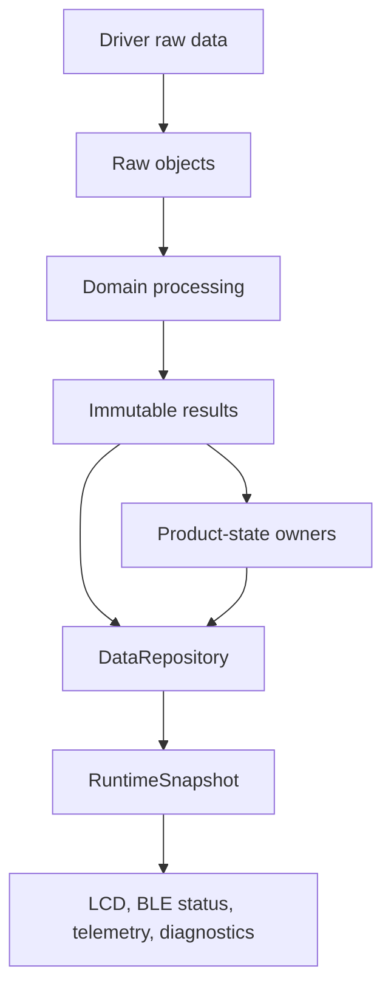
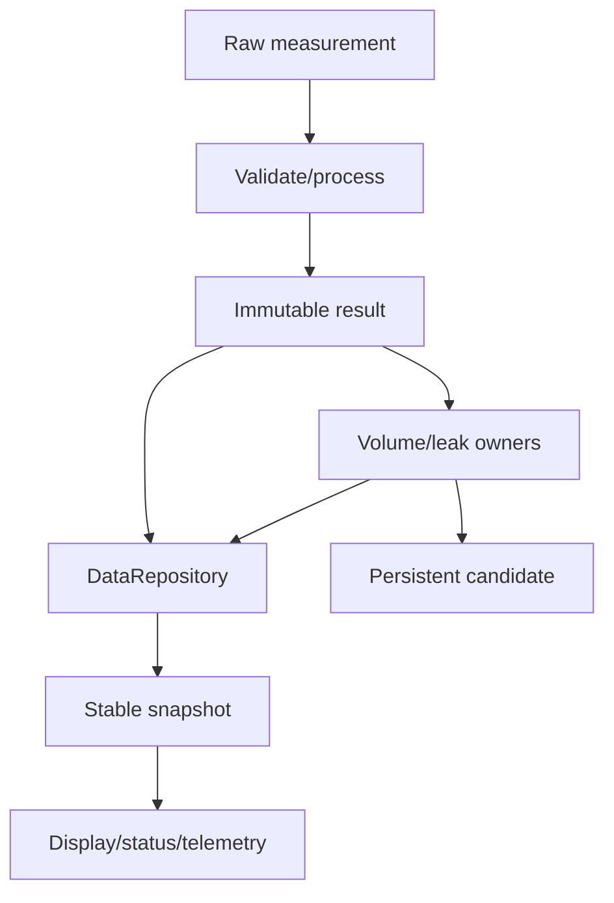
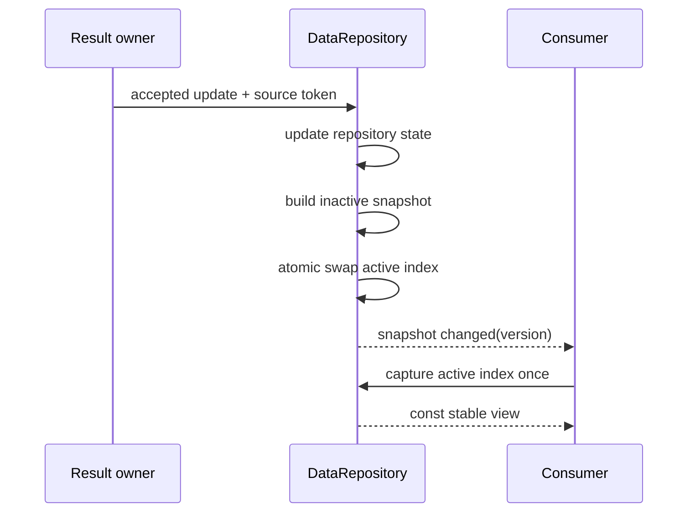
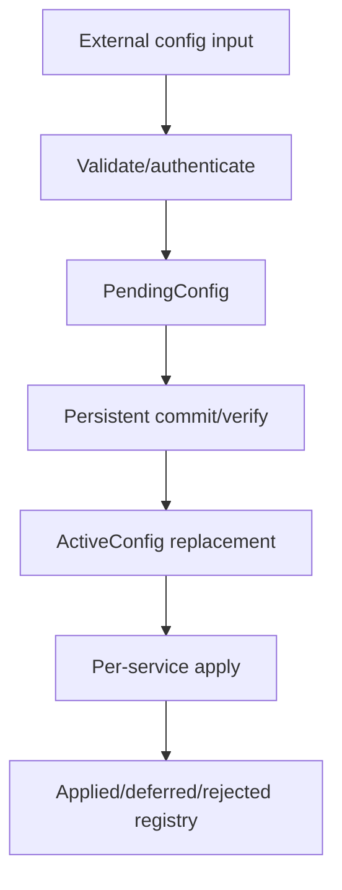

# Data Model and Ownership

## 0. Trạng thái triển khai tại firmware baseline

- Firmware baseline: `4044414a7610d53b24c10814c12eaa09864e949e`
- Implementation status: **IMPLEMENTED SNAPSHOT CORE / PARTIAL PRODUCT MODEL**
- Đã có trong code: Double-buffer DataRepository, snapshot copy and RepoWriteTxn typed writers exist.
- Chưa hoàn tất: Not every normative metadata/acceptance/config lifecycle requirement is implemented end-to-end.
- Quy ước đọc: các mục requirement/contract bên dưới là thiết kế chuẩn; chỉ những capability được liệt kê “Đã có trong code” mới được xem là đã triển khai.


## 1. Mục đích

Tài liệu này định nghĩa data contract cốt lõi của firmware:

- Các lớp dữ liệu và canonical runtime object.
- Owner/single writer của từng mutable object và physical resource liên quan.
- Đơn vị, representation, version, sequence, time, quality và provenance metadata.
- Lifecycle từ raw measurement tới result, product state, snapshot, persistent record và external record.
- Quy tắc immutable publication, copy/transfer ownership, buffer lifetime và concurrency.
- `RuntimeSnapshot` double-buffer protocol.
- Contract giữa `DefaultConfig`, `PendingConfig`, `ActiveConfig` và persistent configuration.
- Quy tắc chống duplicate side effect cho volume, config và telemetry.
- Mapping cùng semantics trên Linux và STM32.

Tài liệu là source-of-truth cho public C data type và ownership boundary. Layout persistent/wire phải có schema riêng và không được serialize trực tiếp từ runtime struct.

---

## 2. Phạm vi

### 2.1. Trong phạm vi

- Raw measurement envelope cho MAX35103 và ZSSC3241.
- `TemperatureResult`, `FlowResult`, `PressureResult`.
- `VolumeState`, `LeakDetectionResult`.
- `SystemModeContext`, orthogonal status và `TimeState` references trong snapshot.
- `RuntimeSnapshot` và repository publication protocol.
- Config, calibration, storage request, telemetry record và delivery result ở mức logical contract.
- Ownership của I2C transaction, event payload và queues khi liên quan trực tiếp tới data lifetime.
- Internal unit và numeric-safety rule.

### 2.2. Đối tượng áp dụng

- Pure firmware core dùng chung.
- Linux simulation/test backend.
- STM32L433 production backend.
- Factory/service build dùng cùng public model.

---

## 3. Source-of-truth và tài liệu liên quan

### 3.1. Thứ tự ưu tiên

| Ưu tiên | Nguồn | Nội dung sở hữu |
|---:|---|---|
| 1 | Decision registry | Decision đã chốt |
| 2 | `08_data_flow.md` | Canonical logical object, lifecycle và requirements |
| 3 | `11_firmware_implication.md` | Module, port và ownership architecture |
| 4 | `01_firmware_architecture.md` | Layer/dependency/single-writer boundary |
| 5 | Tài liệu này | Concrete firmware type, unit, lifetime và API contract |
| 6 | Tài liệu downstream | Algorithm, storage, wire schema và module implementation |

Nếu product requirement thay đổi semantics của field, phải cập nhật source owner và traceability trước khi sửa struct.

### 3.2. Phân lớp dữ liệu

| Layer | Ý nghĩa | Ví dụ |
|---|---|---|
| `RAW` | Dữ liệu gần device/driver | `MaxRawMeasurement`, `PressureRawMeasurement` |
| `RESULT` | Dữ liệu đã validate/process theo stream | `TemperatureResult`, `FlowResult`, `PressureResult` |
| `PRODUCT_STATE` | Tích lũy/suy luận | `VolumeState`, `LeakDetectionResult` |
| `RUNTIME_VIEW` | Stable consumer view | `RuntimeSnapshot` |
| `PERSISTENT_RECORD` | Giữ qua reset | Config, calibration, volume checkpoint |
| `EXTERNAL_RECORD` | BLE/telemetry protocol contract | `TelemetryRecord`, response frame |

Không dùng một struct cho nhiều layer vì layout, lifecycle, version và trust boundary khác nhau.

---

## 4. Requirement/decision được hiện thực

| ID | Requirement firmware |
|---|---|
| `FW-DATA-REQ-001` | Mỗi mutable domain object MUST có đúng một owner/single writer. |
| `FW-DATA-REQ-002` | Driver raw layout MUST NOT được expose trực tiếp tới LCD, leak, telemetry hoặc storage schema. |
| `FW-DATA-REQ-003` | Published result và snapshot MUST immutable đối với consumer. |
| `FW-DATA-REQ-004` | Measurement result MUST có identity, sample time, quality, acceptance, version và provenance metadata. |
| `FW-DATA-REQ-005` | Invalid/unavailable data MUST NOT được thay bằng zero hợp lệ. |
| `FW-DATA-REQ-006` | Freshness MUST tính từ sample monotonic time theo từng stream, không từ snapshot publish time. |
| `FW-DATA-REQ-007` | Baseline stale threshold MUST là `2 × active stream period`, trừ validated versioned policy khác. |
| `FW-DATA-REQ-008` | Production acceptance MUST tách khỏi validity và freshness. |
| `FW-DATA-REQ-009` | Provenance MUST được gắn lúc tạo result và không được nâng từ non-production thành production downstream. |
| `FW-DATA-REQ-010` | Flow-temperature pairing MUST kiểm tra age, quality, provenance và compatible version. |
| `FW-DATA-REQ-011` | Không có usable temperature MUST làm production flow không được accepted. |
| `FW-DATA-REQ-012` | Volume MUST update tối đa một lần cho mỗi accepted production flow sample. |
| `FW-DATA-REQ-013` | Leak evidence MUST chỉ dùng input được acceptance policy cho phép. |
| `FW-DATA-REQ-014` | Leak state/evidence MUST NOT persist trong MVP; boot/reset khởi tạo `UNKNOWN/NOT_EVALUATED`. |
| `FW-DATA-REQ-015` | `RuntimeSnapshot` MUST dùng đúng hai buffer; writer chỉ build inactive buffer rồi atomic swap active index. |
| `FW-DATA-REQ-016` | Mỗi accepted source event MUST publish tối đa một final snapshot trong cùng event-loop turn; không time debounce. |
| `FW-DATA-REQ-017` | Snapshot consumer MUST capture active index một lần cho một logical read và tuân thủ lifetime contract. |
| `FW-DATA-REQ-018` | Nested result trong snapshot MUST giữ sample time/quality/version riêng. |
| `FW-DATA-REQ-019` | BLE/external config input MUST validate trước khi tạo `PendingConfig`. |
| `FW-DATA-REQ-020` | Persistent config chỉ thay `ActiveConfig` sau commit và verify thành công. |
| `FW-DATA-REQ-021` | Config apply MUST correlate `transaction_id`/`config_version` và per-service apply result. |
| `FW-DATA-REQ-022` | Persistent record MUST tách khỏi runtime struct và có type/schema/sequence/integrity metadata. |
| `FW-DATA-REQ-023` | Telemetry MUST được build từ một stable snapshot và giữ `source_snapshot_version`. |
| `FW-DATA-REQ-024` | Queued/in-flight telemetry record MUST immutable. |
| `FW-DATA-REQ-025` | Duplicate event MUST NOT tạo duplicate volume increment, config commit hoặc report record. |
| `FW-DATA-REQ-026` | Credential/secret MUST NOT xuất hiện trong shared snapshot, LCD hoặc general diagnostic dump. |
| `FW-DATA-REQ-027` | ISR/callback MUST NOT publish product result hoặc sửa product state. |
| `FW-DATA-REQ-028` | Queue/buffer overflow MUST có explicit policy và diagnostic visibility. |
| `FW-DATA-REQ-029` | Reset/brownout MUST NOT phụ thuộc emergency flush để bảo toàn config/calibration/volume record. |
| `FW-DATA-REQ-030` | Linux và STM32 MUST dùng cùng logical type semantics, unit và ownership tests. |

---

## 5. Trách nhiệm

### 5.1. Canonical ownership matrix

| Object/resource | Producer | Single writer/owner | Consumer chính |
|---|---|---|---|
| `MaxRawMeasurement` | MAX driver adapter | `MeasurementManager` | `CalibrationService` |
| `FlowPathStatus` | Measurement pipeline | `MeasurementManager` | FSM, repository, diagnostics |
| `PressureRawMeasurement` | ZSSC3241 driver adapter | `PressureMeasurementService` | `PressureProcessingService` |
| `TemperatureResult` | Calibration pipeline | `CalibrationService` | Flow compensation, repository |
| `FlowResult` | Flow/calibration pipeline | `CalibrationService` | Volume, leak, repository |
| `PressureResult` | Pressure pipeline | `PressureProcessingService` | Leak, repository |
| `VolumeState` | Volume algorithm | `VolumeAccumulator` | Repository, storage policy |
| `LeakDetectionResult` | Leak algorithm | `LeakDetectionService` | Repository, diagnostics |
| `RuntimeSnapshot` + active index | Result/status updates | `DataRepository` | LCD, telemetry, BLE status, diagnostics |
| `SystemModeContext` | FSM | `SystemModeManager` | Repository, all policy consumers |
| `TimeState` | Time sources | `TimeService` | Scheduler, repository, telemetry |
| `DefaultConfig` | Build/product profile | `ConfigRepository` | Validation/restore |
| `PendingConfig` | Validated command path | `ConfigRepository` | Storage/apply transaction |
| `ActiveConfig` + apply registry | Commit/apply results | `ConfigRepository` | Configured services |
| Persistent candidate/in-flight buffer | Object snapshot/request | `StorageService` | F-RAM driver |
| `TelemetryRecord` | Telemetry builder | `TelemetryQueue` sau admission | Cellular delivery |
| `DeliveryResult` | Cellular/protocol adapter | `CellularTelemetryService` | Queue/status/diagnostics |
| Physical I2C instance | Client requests | `I2cBusManager` | ZSSC3241/F-RAM clients |
| Physical SPI/MAX transaction | Measurement request | MAX/measurement owner context | MAX driver/HAL adapter |
| Diagnostic registry/history | All modules via report API | `DiagnosticsService` | Service/status/retention policy |

### 5.2. Owner contract

Owner MUST:

- Là nơi duy nhất sửa authoritative instance/version.
- Validate input và generation trước update.
- Tạo version/sequence mới theo contract.
- Publish immutable copy/view/event.
- Chịu trách nhiệm duplicate protection.
- Định nghĩa bounded overflow/backpressure behavior.

### 5.3. Consumer contract

Consumer MUST:

- Chỉ nhận `const` view/copy hoặc stable handle.
- Kiểm tra validity, freshness, acceptance, provenance và version trước side effect.
- Không cast bỏ `const` hoặc giữ pointer quá lifetime.
- Không sửa reason/quality của object do owner khác publish.
- Không dùng last-known value như fresh chỉ vì field còn tồn tại.

---

## 6. Ngoài phạm vi

- Exact MAX35103/ZSSC3241 register-word layout.
- Exact filter/calibration/leak algorithm.
- Exact F-RAM byte encoding và CRC polynomial.
- Exact BLE GATT/application wire schema.
- Exact telemetry JSON/CBOR schema.
- Database/server-side model.
- Compiler-specific atomic primitive và memory barrier implementation.
- Product-specific sensor range, resolution và fixed-point error budget chưa qualification.

Các tài liệu downstream được phép chi tiết hóa nhưng không được phá ownership, unit và lifecycle contract.

---

## 7. Interface và dependency

### 7.1. Publication API pattern

```c
typedef struct DataRepository DataRepository;

DataPublishResult data_repository_accept_flow(
    DataRepository *repo,
    const FlowResult *result,
    SourceEventToken source_event);

SnapshotReadHandle data_repository_snapshot_acquire(
    const DataRepository *repo);

const RuntimeSnapshot *snapshot_read_ptr(
    const SnapshotReadHandle *handle);

void data_repository_snapshot_release(
    SnapshotReadHandle *handle);
```

API concrete có thể thay đổi, nhưng read handle phải enforce capture-once và lifetime contract.

### 7.2. Owner-to-owner handoff

Allowed:

```text
immutable value copy
bounded queue entry
explicit ownership transfer
stable object ID + version
double-buffer read handle
```

Forbidden:

```text
shared mutable global
raw driver RX pointer retained asynchronously
ISR and event loop editing same product object
consumer writes producer-owned struct
serialize partially updated snapshot
```

### 7.3. Event reference

Event không nên chứa mutable pointer không có lifetime. Nếu payload lớn, event mang:

```text
object_type
object_version
owner_generation
slot/handle ID
correlation_id
```

Owner phải bảo đảm handle còn hợp lệ tới lúc event được consume hoặc consumer nhận immutable copy.

### 7.4. Layer dependency



Consumer ngoài measurement pipeline không được bypass repository để đọc raw device layout.

---

## 8. Data model và đơn vị

### 8.1. Canonical scalar units

| Quantity | Canonical internal unit | Suggested C type | Ghi chú |
|---|---|---|---|
| Monotonic time/duration | microsecond (`us`) | `uint64_t` | Authoritative cho age/timeout/order |
| Wall-clock time | Unix second + optional subsecond | `int64_t` + quality | Chỉ valid khi flag hợp lệ |
| Temperature | milli-degree Celsius (`m°C`) | `int32_t` | Display/wire conversion ở boundary |
| Pressure | pascal (`Pa`) | `int32_t` hoặc validated wider intermediate | Range phải được profile-check |
| Flow rate | microlitre/second (`uL/s`) | `int64_t` signed | Signed để biểu diễn direction |
| Volume | microlitre (`uL`) | `uint64_t` hoặc signed split theo policy | Accumulation có overflow guard |
| Ratio/confidence | permille (`0..1000`) | `uint16_t` | Không dùng float wire-dependent |
| Sequence/version | dimensionless | fixed-width unsigned | Wrap-aware comparison |

Các type trên là API baseline. Product-profile bounds và algorithm error budget phải xác nhận rằng representation đủ range/resolution; intermediate calculation MAY rộng hơn.

### 8.2. Numeric rules

- Không dùng implicit unit conversion.
- Function/type/field name phải thể hiện unit khi có nguy cơ mơ hồ, ví dụ `pressure_pa`, `flow_ul_per_s`.
- Integer multiply/divide phải kiểm tra overflow và rounding policy.
- Display precision không được làm giảm internal precision.
- Runtime struct không phụ thuộc padding/endianness cho persistence hoặc wire.
- NaN/sentinel numeric không thay cho explicit validity.

### 8.3. Common metadata

```c
typedef enum {
    DATA_VALID,
    DATA_INVALID,
    DATA_UNAVAILABLE
} DataValidity;

typedef enum {
    DATA_FRESH,
    DATA_STALE,
    DATA_FRESHNESS_UNKNOWN
} DataFreshness;

typedef enum {
    DATA_ACCEPTED,
    DATA_DEGRADED_NOT_ACCEPTED,
    DATA_REJECTED
} ProductionAcceptance;

typedef enum {
    PROVENANCE_MEASURED,
    PROVENANCE_RESTORED,
    PROVENANCE_DEFAULTED,
    PROVENANCE_ESTIMATED
} DataProvenance;

typedef enum {
    MEAS_PURPOSE_BOOT_SELF_CHECK,
    MEAS_PURPOSE_PRODUCTION,
    MEAS_PURPOSE_SERVICE,
    MEAS_PURPOSE_CALIBRATION,
    MEAS_PURPOSE_DIAGNOSTIC,
    MEAS_PURPOSE_RECOVERY_VERIFY
} MeasurementPurpose;

typedef enum {
    DATA_ORIGIN_LIVE_DEVICE,
    DATA_ORIGIN_SIMULATED_DEVICE,
    DATA_ORIGIN_REPLAYED_FIXTURE
} DataOrigin;

typedef struct {
    uint32_t variant_id;
    uint32_t manifest_version;
    uint32_t binding_id;
    uint32_t binding_version;
    uint32_t binding_generation;
} MeasurementBindingReference;

typedef struct {
    uint32_t source_id;
    uint32_t source_generation;
    uint64_t sample_sequence;
    uint64_t result_version;
    uint64_t sample_monotonic_us;
    uint64_t completion_monotonic_us;
    int64_t wall_time_s;
    uint32_t config_version;
    uint32_t calibration_version;
    MeasurementBindingReference binding;
    uint32_t reason_flags;
    DataValidity validity;
    DataFreshness freshness;
    ProductionAcceptance acceptance;
    MeasurementPurpose purpose;
    DataOrigin origin;
    DataProvenance provenance;
    TimeQuality time_quality;
} ResultMetadata;
```

Exact field width là ABI decision cần static assertions; logical semantics là bắt buộc.

Ba chiều metadata không được dùng thay thế nhau:

- `purpose` trả lời **vì sao** measurement được tạo và là guard chính cho product side effect;
- `origin` trả lời input đến từ live device, simulator hay replay fixture;
- `provenance` trả lời value được đo trực tiếp, restore, default hay estimate.

Chỉ result có `purpose == MEAS_PURPOSE_PRODUCTION`, `origin == DATA_ORIGIN_LIVE_DEVICE` và `provenance == PROVENANCE_MEASURED` mới có thể được xét `DATA_ACCEPTED` cho production. Boot self-check và recovery verification có thể tạo readiness evidence nhưng không tự tạo volume/leak/telemetry side effect.

`MeasurementBindingReference` là compact common reference của toàn bộ compatible active binding. `binding_id`/`binding_version` xác định tuple manifest + sensor/device profiles; `binding_generation` invalidates result sau khi active binding bị thay thế. Component profile IDs/versions chi tiết vẫn nằm trong attempt/raw diagnostic context, không lặp tùy ý trong từng canonical result.

### 8.4. Raw objects

```c
typedef struct {
    uint64_t sample_sequence;
    uint64_t capture_monotonic_us;
    uint32_t source_generation;
    uint32_t config_version;
    MaxMeasurementKind kind;
    MaxDeviceStatus device_status;
    TransportStatus transport_status;
    MaxRawWords words;
} MaxRawMeasurement;

typedef struct {
    uint64_t sample_sequence;
    uint64_t sample_monotonic_us;
    uint32_t source_generation;
    uint32_t profile_version;
    uint32_t config_version;
    int32_t raw_count;
    uint32_t device_status_bits;
    TransportStatus transport_status;
} PressureRawMeasurement;
```

`MaxRawWords` và device bit layout không được đi ra ngoài driver/acquisition boundary.

### 8.5. Measurement results

```c
typedef struct {
    ResultMetadata meta;
    int32_t temperature_mdeg_c;
    uint32_t processing_flags;
} TemperatureResult;

typedef struct {
    ResultMetadata meta;
    int64_t flow_ul_per_s;
    FlowDirection direction;
    uint32_t compensation_flags;
    uint32_t processing_flags;
    uint64_t paired_temperature_sequence;
} FlowResult;

typedef struct {
    ResultMetadata meta;
    int32_t pressure_pa;
    uint32_t processing_flags;
} PressureResult;
```

Value field có thể giữ last-known value khi stale/invalid để diagnostics, nhưng consumer bắt buộc đọc metadata trước.

`PressureResult` không có `profile_version` riêng. Flow, temperature và pressure đều dùng `meta.binding`; cách này loại bỏ ambiguity giữa pressure-sensor profile, ZSSC profile và combined binding version.

### 8.6. Product state

```c
typedef struct {
    uint64_t state_version;
    uint64_t total_volume_ul;
    uint64_t last_consumed_flow_sequence;
    uint64_t updated_monotonic_us;
    uint64_t checkpointed_volume_ul;
    uint64_t checkpoint_sequence;
    uint32_t config_version;
    uint32_t flags;
} VolumeState;

typedef struct {
    uint64_t result_version;
    LeakState state;
    LeakEvaluationStatus evaluation_status;
    uint16_t confidence_permille;
    uint32_t reason_flags;
    uint32_t evidence_flags;
    uint64_t state_entered_monotonic_us;
    uint64_t latest_evidence_monotonic_us;
    uint32_t profile_version;
    uint32_t config_version;
} LeakDetectionResult;
```

Leak runtime evidence/history không persist trong MVP.

### 8.7. Runtime snapshot

```c
typedef struct {
    uint32_t schema_version;
    uint64_t snapshot_version;
    uint64_t publish_monotonic_us;
    int64_t publish_wall_time_s;
    TimeQuality publish_time_quality;

    SystemModeContext mode;
    OrthogonalStatusSet statuses;
    TemperatureResult temperature;
    FlowResult flow;
    PressureResult pressure;
    VolumeState volume;
    LeakDetectionResult leak;

    uint32_t active_config_version;
    uint32_t active_calibration_version;
    uint32_t diagnostic_summary_flags;
} RuntimeSnapshot;
```

Snapshot schema version mô tả runtime logical composition, không phải persistent/wire schema.

### 8.8. Config objects

```text
DefaultConfig:
  build/product safe defaults

PendingConfig:
  transaction_id
  requested base config version
  validated candidate
  requester/authorization context
  validation result

ActiveConfig:
  config_version
  immutable validated values
  persistent record reference
  per-service apply status/version
```

### 8.9. Persistent record envelope

```text
record_type
schema_version
payload_length
record_sequence
payload bytes encoded explicitly
integrity metadata
slot/commit metadata
```

Không `memcpy()` runtime struct trực tiếp xuống F-RAM như format ổn định.

### 8.10. Telemetry record

```text
wire_schema_version
report_sequence
record_type
creation time + quality
source_snapshot_version
device public identity
explicitly mapped fields
delivery-independent integrity metadata
```

Credential không thuộc record payload chung.

---

## 9. State machine hoặc sequence

### 9.1. Data lifecycle



### 9.2. Result publication

1. Owner nhận immutable raw/input và validate generation.
2. Owner build complete candidate trong private storage.
3. Owner xác định metadata, acceptance và reason.
4. Owner tăng result version.
5. Owner publish immutable result/event.
6. Repository/product consumer xử lý trong owner context của họ.

Không publish object ở trạng thái partially initialized.

### 9.3. Snapshot double-buffer sequence



### 9.4. One final snapshot per event turn

Một source event có thể tạo nhiều internal updates, ví dụ flow result rồi volume/leak update. Repository phải publish tối đa một snapshot cuối sau khi các synchronous accepted consequences trong turn hoàn tất.

```text
EVT_FLOW_RESULT
  -> accept FlowResult
  -> maybe update VolumeState
  -> maybe update LeakDetectionResult
  -> build one final inactive snapshot
  -> atomic swap once
```

Không dùng millisecond debounce window.

### 9.5. Config lifecycle



Commit thành công không được trình bày là fully applied nếu required service còn `DEFERRED` hoặc `REJECTED`.

### 9.6. Volume duplicate guard

```text
if flow.sample_sequence <= last_consumed_flow_sequence by wrap-aware policy:
    reject duplicate/stale
else if flow.meta not accepted live production:
    reject input
else:
    integrate once
    persist new last_consumed_flow_sequence in VolumeState runtime
```

### 9.7. Service boundary

`SERVICE_SAMPLE`/`CALIBRATION_SAMPLE` có repository/diagnostic path riêng hoặc được giữ với provenance rõ ràng. Chúng không được bridge vào production volume/leak/reporting. Sau `SERVICE -> NORMAL`, phải có production sample mới trước product-state update.

---

## 10. Timing, timeout và non-blocking behavior

### 10.1. Sample time và completion time

- `sample_monotonic_us` đại diện thời điểm đo tốt nhất.
- `completion_monotonic_us` đại diện lúc processing/result hoàn tất.
- Không dùng completion time thay sample time khi latency đáng kể.

### 10.2. Freshness

```text
age_us = monotonic_now_us - sample_monotonic_us
maximum_age_us = 2 * active_stream_period_us

age_us < maximum_age_us  -> FRESH
age_us >= maximum_age_us -> STALE
```

Phép trừ phải dùng wrap-safe/width-safe policy. Consumer-specific pairing age có thể chặt hơn generic freshness.

### 10.3. Non-blocking publication

Result/snapshot publication không được:

- Chờ storage write.
- Chờ LCD refresh.
- Chờ modem/server ACK.
- Busy-wait consumer release ngoài bounded lifetime protocol.

### 10.4. Persistent/telemetry decoupling

Owner tạo immutable request/record rồi submit async. Runtime state không bị khóa trong suốt I/O transaction.

### 10.5. Wall-clock changes

Wall-clock invalid hoặc step forward/back không thay sample ordering, freshness age, timeout hoặc volume delta. External timestamp phải kèm `TimeQuality`.

---

## 11. Configuration

### 11.1. Version binding

Mỗi result giữ `config_version` dùng khi sample/processing bắt đầu. Apply config mới không được retroactively sửa metadata của result cũ.

### 11.2. Per-stream policy

Config sở hữu tối thiểu:

- Measurement period.
- Maximum pairing/evidence age nếu khác baseline.
- Range/plausibility bounds.
- Calibration/profile references.
- Volume checkpoint policy.
- Leak detection profile/version.

### 11.3. Apply result

Mỗi affected service trả:

```text
APPLIED
DEFERRED
REJECTED
```

kèm `transaction_id`, target `config_version` và reason.

### 11.4. Product variant boundary

Physical pressure bridge/reference/range và ZSSC3241 settings thuộc immutable variant profile. Runtime config chỉ thay allowlisted operational field; generic raw-register config bị cấm trong production.

### 11.5. Volume checkpoint policy

`VolumeCheckpointPolicy` versioned gồm:

```text
max_interval_s
max_uncheckpointed_volume_ul
min_spacing_s
```

Policy change không reset accumulated volume và chỉ active sau validate/commit/apply contract.

---

## 12. Error detection và recovery

### 12.1. Data invariant fault

Detect tối thiểu:

- Non-owner write.
- Published object version không tăng đúng policy.
- Invalid enum/metadata combination.
- `ACCEPTED` nhưng validity/freshness/provenance không phù hợp.
- Snapshot active index ngoài `{0,1}`.
- Writer sửa active snapshot buffer.
- Consumer giữ pointer quá lifetime.
- Duplicate volume consumption.
- Config version/apply transaction mismatch.
- Telemetry record bị sửa khi queued/in-flight.
- Numeric overflow hoặc unit mismatch detected.

### 12.2. Invalid sample

Khi sample invalid/unavailable:

- Không tạo valid zero.
- Có thể giữ last-known numeric value với metadata stale/invalid.
- Publish reason/status nếu product consumer cần biết.
- Không update volume hoặc valid leak evidence.

### 12.3. Snapshot contention/lifetime violation

Baseline hai buffer yêu cầu reader lifetime bounded. Nếu implementation không thể bảo đảm writer không tái sử dụng buffer khi reader còn giữ reference, phải thêm protocol pin/copy/critical section được review mà vẫn giữ đúng hai-buffer publication semantics.

### 12.4. Persistent failure

Write/verify failure giữ active record cũ. Reset tại mọi commit phase phải cho phép restore ít nhất previous valid record theo record contract.

### 12.5. Overflow

| Resource | Baseline behavior |
|---|---|
| Measurement completion | Không silently drop; escalate/retain hardware completion theo event policy |
| Config/calibration pending | Tối đa một pending mỗi type; request tiếp theo `BUSY` |
| Volume checkpoint | Latest-wins pending mailbox; không sửa in-flight record |
| Diagnostic queue | Bounded drop/coalesce + drop counter |
| Telemetry queue | Explicit retention/overflow policy; in-flight immutable |

### 12.6. Recovery generation

Sau driver/resource reinit, tăng generation và reject raw/completion thuộc generation cũ. Last-known result không tự chứng minh recovery thành công.

---

## 13. Linux simulation mapping

### 13.1. Representation

Linux dùng cùng public headers và fixed-width integer types. Không thay canonical integer unit bằng `double` trong domain contract; test/oracle MAY dùng high-precision reference để so sai số.

### 13.2. Atomic snapshot backend

Linux backend phải mô phỏng đúng:

- Hai snapshot buffer.
- Writer-only inactive buffer.
- Atomic active-index swap.
- Capture-once reader handle.

Threaded stress test có thể dùng C atomics; deterministic event-loop test vẫn phải kiểm tra protocol logic.

### 13.3. Test fixtures

Fixture builder phải tạo được:

- Valid/invalid/stale/unavailable result.
- Mọi provenance.
- Version/generation mismatch.
- Counter gần wrap.
- Numeric min/max/overflow candidate.
- Mixed sample times trong cùng snapshot.

### 13.4. Serialization boundary

Linux JSON/debug output là adapter mapping field-by-field, không dump raw bytes của C struct.

### 13.5. Sanitizer/static analysis

CI nên chạy address/undefined/thread sanitizer phù hợp để bắt use-after-lifetime, overflow undefined behavior và race trong optional threaded backend.

---

## 14. STM32 mapping

### 14.1. Fixed-width types

Dùng `<stdint.h>`, compile-time assertions cho size/range cần thiết và explicit conversion tại driver/wire boundary.

### 14.2. Snapshot atomicity

Active index có thể dùng C atomic, compiler intrinsic hoặc critical section ngắn đã verify. Memory ordering phải bảo đảm toàn bộ inactive buffer visible trước khi active index đổi.

### 14.3. ISR boundary

ISR chỉ capture minimal source/time/status và post event. Product object owner chạy trong normal application context.

### 14.4. DMA/driver buffer

DMA/RX buffer thuộc driver. Nếu processing kéo dài qua lần reuse tiếp theo, phải copy raw object hoặc transfer ownership bằng pool/slot generation.

### 14.5. Memory budget

Hai full `RuntimeSnapshot` buffer và queues phải có static bounded capacity. Build phải report/verify `sizeof` và RAM budget theo variant.

### 14.6. Persistence

Storage encoder/decoder map explicit fields và endian; không phụ thuộc struct packing. F-RAM A/B slot mapping thuộc `DEC-DATA-004` và detailed storage document.

---

## 15. Test và acceptance criteria

### 15.1. Ownership tests

- Static ownership table có đúng một writer mỗi object/resource.
- Public header chỉ expose `const` view cho consumer.
- Mock consumer không thể update authoritative object qua API.
- ISR/callback test không tạo product-state mutation.

### 15.2. Metadata tests

```text
valid sample carries correct time/sequence/version
invalid sample cannot appear as accepted zero
stale transition occurs exactly at age >= maximum_age
wall-clock invalid leaves monotonic ordering usable
service provenance cannot become live production
config/calibration version remains bound to source result
```

### 15.3. Numeric/unit tests

- Boundary min/max cho temperature, pressure, flow, volume.
- Signed flow direction.
- Multiply/divide overflow và rounding.
- Accumulation overflow guard.
- Unit conversion round-trip trong declared tolerance.
- Fixed-point result so với high-precision reference vector.

### 15.4. Snapshot tests

- Writer chỉ sửa inactive buffer.
- Snapshot swap atomic; consumer không thấy mixed version.
- Consumer capture active index một lần.
- Mỗi accepted source event publish `0..1` final snapshot trong same turn.
- Nested sample times không bị thay bằng publish time.
- Stress reader/writer không phát hiện partial object hoặc lifetime fault.

### 15.5. Duplicate/idempotency tests

- Duplicate flow event không tăng volume hai lần.
- Duplicate config completion không replace active version hai lần.
- Duplicate report-due slot không tạo extra record ngoài slot policy.
- Stale owner generation bị reject.

### 15.6. Config/persistence tests

- Invalid external input không tạo `PendingConfig` hợp lệ.
- Commit failure giữ `ActiveConfig` cũ.
- Apply `DEFERRED/REJECTED` được thể hiện chính xác.
- Brownout/reset injection tại mọi commit phase restore newest compatible valid record.
- Runtime struct padding change không thay persistent decoder behavior.

### 15.7. Acceptance criteria

Tài liệu được hiện thực đúng khi:

1. Tất cả public objects có owner, unit, version và lifetime rõ ràng.
2. Không có mutable cross-owner pointer trong public API.
3. Snapshot double-buffer tests và concurrency tests đạt.
4. Production side-effect guards đạt với mọi non-production provenance.
5. Numeric error/range được chứng minh phù hợp ít nhất một qualified product profile.
6. Linux/STM32 dùng chung contract headers và golden vectors.
7. Persistent/wire encoder không phụ thuộc in-memory layout.

---

## 16. Traceability

### 16.1. Requirement mapping

| Firmware requirement | Source |
|---|---|
| `FW-DATA-REQ-001`–`003` | `REQ-DATA-001`, `002`, `012`; `DEC-ARCH-006/007` |
| `FW-DATA-REQ-004`–`008` | `REQ-DATA-004`–`007`, `011`, `017`; `DEC-MEAS-004` |
| `FW-DATA-REQ-009`–`011` | `REQ-DATA-006`, `035`–`042`; `DEC-ARCH-003/004` |
| `FW-DATA-REQ-012`–`014` | `REQ-DATA-008`, `009`, `026`; `DEC-DATA-002` |
| `FW-DATA-REQ-015`–`018` | `REQ-DATA-010`, `011`, `045`, `046`; `DEC-DATA-003` |
| `FW-DATA-REQ-019`–`021` | `REQ-DATA-014`–`016`, `047`–`049` |
| `FW-DATA-REQ-022` | `REQ-DATA-023`, `024`, `050`–`052`; `DEC-DATA-004/005` |
| `FW-DATA-REQ-023`–`025` | `REQ-DATA-018`–`022`, `026`; `DEC-SCHED-003` |
| `FW-DATA-REQ-026` | `REQ-DATA-025` |
| `FW-DATA-REQ-027`–`030` | `REQ-DATA-003`, `022`, `027`; runtime/platform decisions |

### 16.2. Downstream ownership

| Nội dung | Tài liệu downstream |
|---|---|
| Snapshot API/layout details | `20_runtime_snapshot.md` |
| Config transaction/apply | `21_config_management.md` |
| Persistent encoding/map | `22_persistent_storage.md` |
| Telemetry FIFO/lifecycle | `23_telemetry_queue.md` |
| Measurement object production | `10_measurement_cycle.md` |
| Signal numeric precision | `13_signal_processing.md` |
| Flow unit/error budget | `14_flow_computation.md` |
| Leak evidence model | `17_leak_detection.md` |
| Volume integration/checkpoint | `18_volume_accumulation.md` |
| Linux/STM32 atomics | Platform backend documents |

### 16.3. Static trace annotations

Public type/API nên annotate requirement ID trong source comment hoặc generated trace manifest, tránh ghi requirement rải rác trong algorithm implementation.

---

## 17. Open issues / NEEDS_VERIFICATION

| ID | Vấn đề | Ảnh hưởng |
|---|---|---|
| `FW-DATA-OQ-001` | Xác nhận `int32_t Pa`, `int64_t uL/s`, `uint64_t uL` đủ range/resolution cho mọi product variant | Numeric profile qualification |
| `FW-DATA-OQ-002` | Chốt rounding/saturation policy cho từng fixed-point conversion | Signal/flow computation |
| `FW-DATA-OQ-003` | Chốt exact width và wrap policy cho sample/result/snapshot sequence | ABI/long-duration test |
| `FW-DATA-OQ-004` | Chốt reader-lifetime primitive cụ thể cho snapshot trên STM32 | Atomicity implementation |
| `FW-DATA-OQ-005` | Chốt maximum `sizeof(RuntimeSnapshot)` và RAM budget | Variant/build strategy |
| `FW-DATA-OQ-006` | Chốt persistent CRC/integrity algorithm và explicit encoding | Storage design |
| `FW-DATA-OQ-007` | Chốt exact diagnostic retention/coalescing/upload policy | Kế thừa `DEC-DIAG-001` open |
| `FW-DATA-OQ-008` | Chốt liệu reverse-flow volume dùng signed net total, separate counters hay policy khác | Volume/product requirement |
| `FW-DATA-OQ-009` | Chốt exact confidence representation/semantics cho leak | Leak algorithm validation |
| `FW-DATA-OQ-010` | Chốt runtime snapshot schema evolution policy giữa firmware variants | Compatibility/testing |

Các mục trên phải được cô lập trong profile, encoder, adapter hoặc downstream algorithm. Không được thay đổi ownership và acceptance invariant để giải quyết tạm thời.

---

## 18. Revision history

| Version | Date | Thay đổi |
|---|---|---|
| 0.1 | 2026-07-14 | Initial canonical firmware data model, units, ownership, lifecycle, snapshot protocol và Linux/STM32 mapping |
| 0.2 | 2026-07-14 | Chốt MeasurementPurpose/DataOrigin/DataProvenance và common MeasurementBindingReference; bỏ PressureResult.profile_version riêng |


