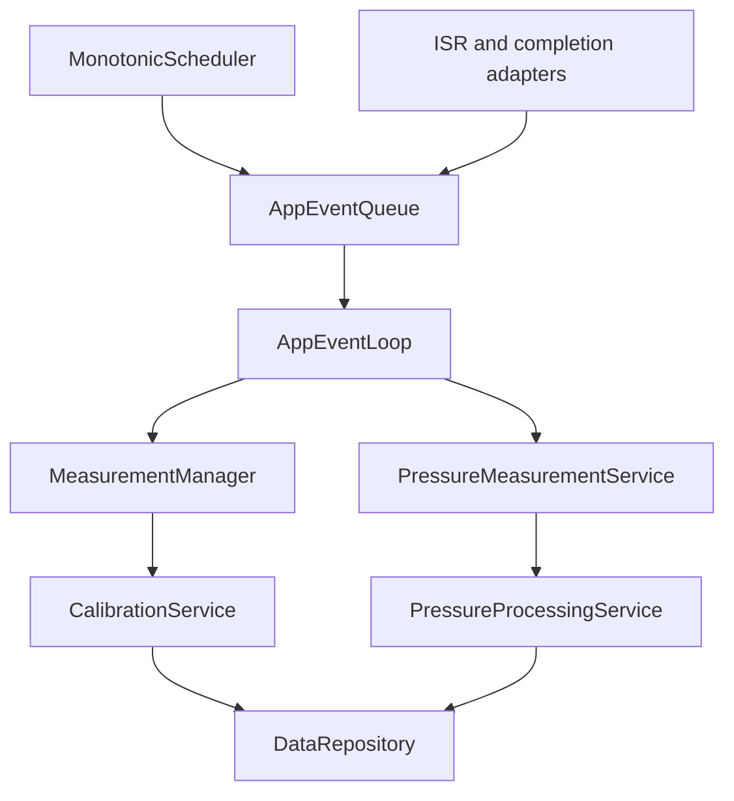
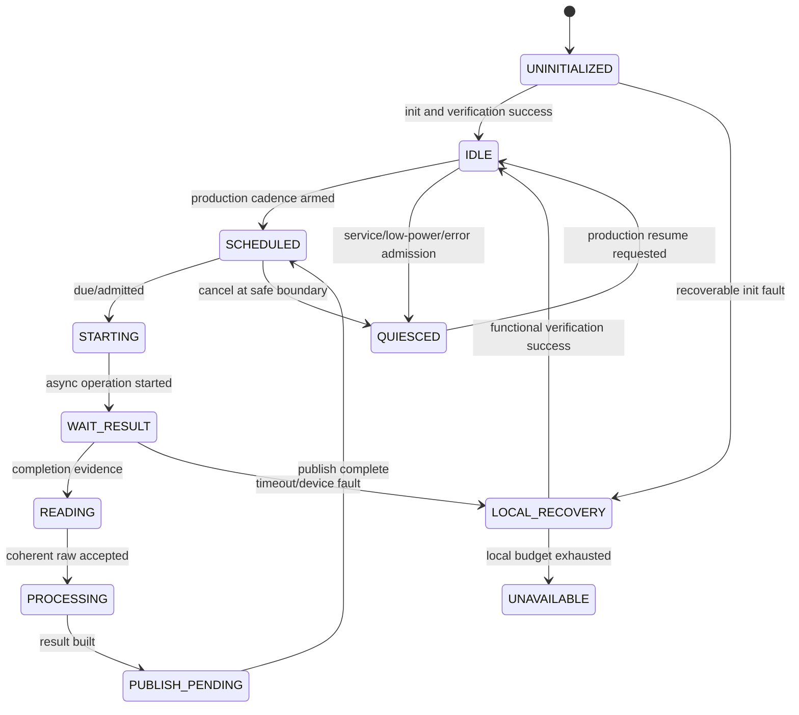
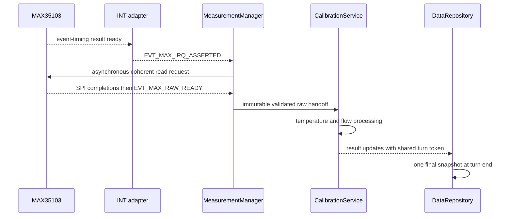
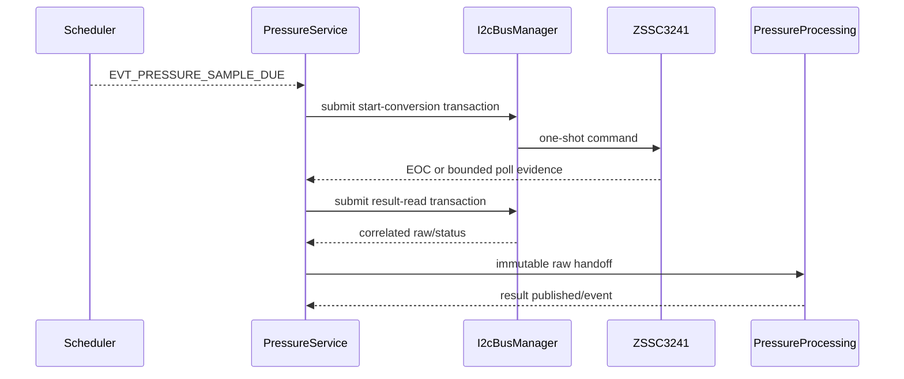

# Measurement Cycle

## 0. Trạng thái triển khai tại firmware baseline

- Firmware baseline: `4044414a7610d53b24c10814c12eaa09864e949e`
- Implementation status: **IMPLEMENTED GENERIC FRAMEWORK / PARTIAL PRODUCTION PIPELINE**
- Đã có trong code: MeasurementManager registry, on_event/compute interface and shared transaction are implemented.
- Chưa hoàn tất: Built-in MAX/ZSSC registrations only provide on_event callbacks; raw-ready-to-processing compute services are not wired into AppComposition.
- Quy ước đọc: các mục requirement/contract bên dưới là thiết kế chuẩn; chỉ những capability được liệt kê “Đã có trong code” mới được xem là đã triển khai.


## 1. Mục đích

Tài liệu này định nghĩa lifecycle và orchestration contract chung cho các measurement stream của firmware:

- Flow/temperature acquisition từ MAX35103.
- Pressure acquisition từ ZSSC3241.
- Production, service, calibration và diagnostic measurement context.
- Scheduler/event binding, attempt identity, generation và correlation.
- Admission theo `SystemMode`.
- Handoff từ raw measurement tới result owner và `DataRepository`.
- Timeout, cancellation, duplicate, stale completion và recovery escalation.
- Readiness evidence cho `INIT -> NORMAL`.
- Mapping tương đương giữa Linux simulation và STM32.

Tài liệu không ép MAX35103 và ZSSC3241 dùng cùng device-level phase. Nó chỉ định nghĩa contract chung mà các stream owner phải tuân theo.

Các từ khóa `MUST`, `MUST NOT`, `SHOULD`, `MAY` lần lượt có nghĩa bắt buộc, cấm, khuyến nghị và tùy chọn.

---

## 2. Phạm vi

### 2.1. Trong phạm vi

- Measurement admission và lifecycle chung.
- Per-stream schedule và attempt context.
- Production MAX event-timing supervision.
- Pressure one-shot schedule orchestration.
- Raw/result publication boundary.
- Provenance và mode-boundary behavior.
- Flow-path readiness và aggregate measurement status.
- Local recovery interface và system escalation.
- Core-code binding với Phase 1 implementation.
- Test oracle cho Linux simulator và STM32 port.

### 2.2. Measurement streams

| Stream | Source | Production trigger | Final result owner |
|---|---|---|---|
| Temperature | MAX35103 raw result | MAX event-timing result | `CalibrationService` |
| Flow | MAX35103 raw result + usable temperature | MAX event-timing result | `CalibrationService` |
| Pressure | ZSSC3241 one-shot | Monotonic scheduler | `PressureProcessingService` |

### 2.3. Build contexts

Contract áp dụng cho:

- Linux simulation.
- STM32 production firmware.
- Factory/service build dùng cùng domain types.
- Calibration procedure được authorization.

---

## 3. Source-of-truth và tài liệu liên quan

### 3.1. Thứ tự ưu tiên

| Ưu tiên | Tài liệu | Nội dung sở hữu |
|---:|---|---|
| 1 | Decision registry | Decision đã chốt |
| 2 | `02_event_model_and_scheduler.md` | Event envelope, queue, priority, scheduler semantics |
| 3 | `03_system_fsm_binding.md` | Mode admission và transition |
| 4 | `04_data_model_and_ownership.md` | Object, metadata, unit, owner, snapshot |
| 5 | Tài liệu này | Measurement lifecycle và cross-stream orchestration |
| 6 | `11`/`12` | Device integration và internal transaction FSM |
| 7 | `13`–`18` | Algorithm, calibration, leak và volume side effect |

### 3.2. Decision baseline

| Decision | Binding trong measurement cycle |
|---|---|
| `DEC-MEAS-001` | Period theo từng stream; monotonic scheduler |
| `DEC-MEAS-002` | MAX production dùng `EVENT_TIMING`; direct chỉ service/calibration/diagnostic |
| `DEC-MEAS-003` | ZSSC3241 Sleep Mode one-shot; EOC hoặc bounded polling |
| `DEC-MEAS-004` | Validity, freshness, acceptance và reason tách biệt; stale mặc định `2 × period` |
| `DEC-ARCH-001` | Flow path là core readiness dependency |
| `DEC-ARCH-002` | `CalibrationService` là owner của published `TemperatureResult` |
| `DEC-ARCH-003` | Không có usable temperature thì production flow không accepted |
| `DEC-ARCH-004` | `SERVICE` quiesce production path; provenance không-production bị cô lập |
| `DEC-DATA-003` | Tối đa một final snapshot mỗi accepted source-event turn |

### 3.3. Current-code baseline đã kiểm tra

Repository `whoisLePhuc/smart-water-flow-pressure-monitor`, branch `main`, folder `3.firmware` hiện có:

- `AppEvent` với priority, delivery, correlation và source generation.
- `SchedulerJob` với anchored deadline và job generation.
- `SystemModeManager`/`ModeGuardContext`.
- `DataRepository`/`SourceEventToken` và final snapshot publication cuối turn.
- Canonical measurement event IDs trong `data_model.h`.

Mục 7.8 ghi rõ các extension cần thiết khi triển khai measurement; tài liệu không giả định chúng đã tồn tại.

---

## 4. Requirement/decision được hiện thực

| ID | Requirement firmware |
|---|---|
| `FW-MEAS-REQ-001` | Mỗi measurement stream MUST có đúng một acquisition owner và tối đa một active production attempt, trừ khi device integration document cho phép rõ ràng. |
| `FW-MEAS-REQ-002` | Measurement cadence, deadline, timeout, retry và age MUST dùng monotonic time. |
| `FW-MEAS-REQ-003` | Wall-clock adjustment MUST NOT thay đổi active measurement deadline hoặc sample ordering. |
| `FW-MEAS-REQ-004` | MAX35103 production MUST dùng event-timing; direct measurement MUST chỉ dùng authorized non-production context. |
| `FW-MEAS-REQ-005` | Pressure production MUST dùng scheduler-driven Sleep Mode one-shot và asynchronous completion. |
| `FW-MEAS-REQ-006` | Mỗi attempt MUST có stream, attempt ID, correlation ID, source generation, config/profile/calibration version và provenance. |
| `FW-MEAS-REQ-007` | Completion MUST match stream, correlation và source generation trước khi được nhận. |
| `FW-MEAS-REQ-008` | Duplicate hoặc stale completion MUST NOT publish duplicate raw/result/snapshot side effect. |
| `FW-MEAS-REQ-009` | ISR/HAL callback MUST chỉ capture bounded evidence và post event; không chạy processing hoặc product update. |
| `FW-MEAS-REQ-010` | Raw device object MUST immutable sau handoff và không được expose tới snapshot consumer. |
| `FW-MEAS-REQ-011` | Result owner MUST gắn validity, freshness, acceptance, reason, sample time, version và provenance. |
| `FW-MEAS-REQ-012` | Invalid/unavailable sample MUST NOT được thay bằng valid zero. |
| `FW-MEAS-REQ-013` | Production flow MUST chỉ accepted khi raw input và paired temperature đáp ứng quality/age/provenance/version rule. |
| `FW-MEAS-REQ-014` | Service/calibration result MUST giữ provenance ban đầu và MUST NOT update production volume, leak evidence hoặc scheduled telemetry. |
| `FW-MEAS-REQ-015` | Entry `SERVICE` MUST quiesce production admission tại safe boundary; không bắt đầu production attempt mới. |
| `FW-MEAS-REQ-016` | Exit `SERVICE` MUST yêu cầu production sample mới trước khi resume product-state update. |
| `FW-MEAS-REQ-017` | Measurement completion và deadline event MUST có priority cao hơn communication/display background event. |
| `FW-MEAS-REQ-018` | Busy stream MUST apply explicit skip/defer/reject policy; không khởi tạo attempt chồng lấn ngầm. |
| `FW-MEAS-REQ-019` | Timeout MUST đóng attempt bằng terminal outcome, cancel/re-arm owner state và không block event loop. |
| `FW-MEAS-REQ-020` | Local recovery MUST bounded, generation-aware và có functional verification trước khi báo success. |
| `FW-MEAS-REQ-021` | Hết local flow recovery budget MUST phát stable `EVT_SYSTEM_RECOVERY_REQUIRED` context. |
| `FW-MEAS-REQ-022` | Flow-path readiness chỉ valid sau fresh self-check hoặc valid measurement evidence trong boot session hiện tại. |
| `FW-MEAS-REQ-023` | Driver initialization return `OK` một mình MUST NOT được coi là readiness evidence. |
| `FW-MEAS-REQ-024` | Pressure unavailable MUST cho phép flow path tiếp tục theo degraded policy; không tự tạo pressure zero. |
| `FW-MEAS-REQ-025` | Một accepted source event MUST tạo tối đa một final snapshot trong cùng event-loop turn. |
| `FW-MEAS-REQ-026` | Result version, sample sequence, attempt ID, scheduler job generation và mode generation MUST giữ semantics riêng. |
| `FW-MEAS-REQ-027` | Configuration replacement MUST NOT cắt ngang active attempt; apply ở safe boundary và attempt cũ giữ version cũ. |
| `FW-MEAS-REQ-028` | Low-power entry MUST bị chặn khi measurement transaction active hoặc unread critical result tồn tại. |
| `FW-MEAS-REQ-029` | Linux và STM32 MUST dùng cùng lifecycle state, event semantics, metadata và golden test vectors. |
| `FW-MEAS-REQ-030` | Mọi numeric timing/range chưa qualification MUST nằm trong versioned profile/config và được đánh dấu `NEEDS_VERIFICATION`. |

---

## 5. Trách nhiệm

### 5.1. Module ownership

| Module | Trách nhiệm |
|---|---|
| `MeasurementManager` | MAX acquisition lifecycle, raw validation ban đầu, flow-path status và local recovery coordination |
| `Max35103Driver` | SPI/register/INT/device-status access; không tính flow/product state |
| `CalibrationService` | Convert/calibrate temperature và flow; single writer của `TemperatureResult`/`FlowResult` |
| `PressureMeasurementService` | Pressure cadence, one-shot acquisition, attempt state và raw handoff |
| `Zssc3241Driver` | Device command/status/result encoding qua logical I2C transaction |
| `PressureProcessingService` | Convert/calibrate/filter pressure; single writer của `PressureResult` |
| `MonotonicScheduler` | Due/timeout job; không sở hữu measurement state |
| `I2cBusManager` | Single owner physical I2C transaction và bus recovery generation |
| `DataRepository` | Latest accepted objects và atomic final snapshot publication |
| `VolumeAccumulator` | Production flow consumption và duplicate guard |
| `LeakDetectionService` | Accepted evidence/history và leak result |
| `ModeGuardProvider` | Capture readiness/blocker evidence đã publish |
| `RecoveryCoordinator` | System-level ordered recovery sau escalation |

### 5.2. Không có global measurement writer

Không tạo một module duy nhất được quyền sửa mọi measurement object. Ownership tách theo pipeline:

```text
MAX raw acquisition        -> MeasurementManager
Temperature/flow result    -> CalibrationService
Pressure raw acquisition   -> PressureMeasurementService
Pressure result            -> PressureProcessingService
```

### 5.3. Scheduler không phải measurement owner

Scheduler chỉ phát due event với job/generation. Stream owner quyết định admission, bắt đầu transaction và xử lý busy/missed policy.

### 5.4. Driver boundary

Driver MUST NOT:

- Đổi `SystemMode`.
- Update `RuntimeSnapshot`.
- Tích lũy volume.
- Đánh giá leak.
- Chọn production acceptance.
- Tự reset shared bus ngoài resource-owner contract.

---

## 6. Ngoài phạm vi

- Exact MAX35103 opcode/register/event-timing values.
- Exact ZSSC3241 register/status/EEPROM configuration.
- Flow formula, filter, fixed-point precision và calibration lookup.
- Pressure bridge transfer function cụ thể.
- Leak detection algorithm.
- Volume integration/checkpoint algorithm.
- Exact product-profile periods/timeouts/ranges.
- Exact HAL SPI/I2C/GPIO/DMA implementation.
- Persistent/wire encoding.

Các mục này thuộc tài liệu downstream và MUST giữ lifecycle/ownership contract tại đây.

---

## 7. Interface và dependency

### 7.1. Stream identity

```c
typedef enum {
    MEAS_STREAM_MAX_FLOW_TEMPERATURE,
    MEAS_STREAM_PRESSURE,
    MEAS_STREAM_COUNT
} MeasurementStreamId;

typedef enum {
    MEAS_PURPOSE_BOOT_SELF_CHECK,
    MEAS_PURPOSE_PRODUCTION,
    MEAS_PURPOSE_SERVICE,
    MEAS_PURPOSE_CALIBRATION,
    MEAS_PURPOSE_DIAGNOSTIC,
    MEAS_PURPOSE_RECOVERY_VERIFY
} MeasurementPurpose;
```

`MeasurementPurpose` trả lời vì sao attempt được tạo và được copy nguyên vẹn tới `ResultMetadata`. Nó không phải provenance và không được suy lại ở downstream.

### 7.2. Attempt context

```c
typedef struct {
    MeasurementStreamId stream_id;
    MeasurementPurpose purpose;
    uint32_t attempt_id;
    uint32_t correlation_id;
    uint32_t source_generation;
    uint32_t mode_generation;
    uint32_t config_version;
    uint32_t calibration_version;
    MeasurementBindingReference binding;
    uint64_t requested_monotonic_us;
    uint64_t sample_reference_monotonic_us;
    uint64_t completion_deadline_us;
    DataOrigin origin;
    DataProvenance provenance;
} MeasurementAttemptContext;
```

Attempt ID chỉ ordering attempt của stream owner; không thay sample sequence hoặc result version.

### 7.3. Stream status

```c
typedef enum {
    MEAS_STREAM_NOT_READY,
    MEAS_STREAM_IDLE,
    MEAS_STREAM_ACTIVE,
    MEAS_STREAM_DEGRADED,
    MEAS_STREAM_RECOVERING,
    MEAS_STREAM_UNAVAILABLE,
    MEAS_STREAM_QUIESCED
} MeasurementStreamStatus;

typedef struct {
    MeasurementStreamStatus status;
    uint32_t source_generation;
    uint32_t active_attempt_id;
    uint32_t consecutive_failure_count;
    uint32_t reason_flags;
    uint64_t status_changed_monotonic_us;
    bool readiness_evidence_valid;
    uint32_t readiness_generation;
} MeasurementStreamHealth;
```

Aggregate `MeasurementStatus` trong snapshot được derive từ các stream health; nó không thay thế status riêng từng stream.

### 7.4. Logical stream-owner API

```c
MeasurementRequestResult measurement_request(
    MeasurementStreamId stream,
    MeasurementPurpose purpose,
    const MeasurementRequest *request);

MeasurementStepResult measurement_handle_event(
    MeasurementStreamId stream,
    const AppEvent *event,
    SourceEventToken *turn_token);

MeasurementCancelResult measurement_quiesce(
    MeasurementStreamId stream,
    MeasurementQuiesceReason reason);

MeasurementStreamHealth measurement_get_health(
    MeasurementStreamId stream);
```

Concrete APIs có thể tách theo owner (`measurement_manager_*`, `pressure_measurement_*`) nhưng semantics phải tương đương.

### 7.5. Result publication

Owner result publish immutable object và version event:

```text
CalibrationService
  -> TemperatureResult / FlowResult
  -> EVT_TEMPERATURE_RESULT_READY / EVT_FLOW_RESULT_READY

PressureProcessingService
  -> PressureResult
  -> EVT_PRESSURE_RESULT_READY
```

Event nên mang stable object ID/version hoặc owner mailbox reference; không mang pointer vào reusable driver buffer.

### 7.6. Scheduler binding

Logical job IDs cần tồn tại, ví dụ:

```text
JOB_PRESSURE_PERIODIC_DUE
JOB_PRESSURE_EOC_POLL
JOB_PRESSURE_ATTEMPT_TIMEOUT
JOB_MAX_RESULT_SUPERVISION_TIMEOUT
JOB_SERVICE_ATTEMPT_TIMEOUT
JOB_MEASUREMENT_RECOVERY_STEP
```

Exact numeric ID nằm trong implementation header; mỗi job có owner và generation rõ ràng.

### 7.7. Canonical measurement event binding

| Event ID | Producer | Consumer/ý nghĩa |
|---|---|---|
| `EVT_MAX_IRQ_ASSERTED` | MAX INT adapter | MAX owner bắt đầu drain/read; chưa có raw result |
| `EVT_MAX_SPI_COMPLETED` / `EVT_MAX_SPI_FAILED` | SPI adapter | MAX driver advance/terminate một correlated transport step |
| `EVT_MAX_RAW_READY` | MAX driver | Measurement/processing nhận coherent immutable raw mailbox |
| `EVT_MAX_RESULT_TIMEOUT` | Scheduler/supervisor | Đóng MAX wait attempt hoặc detect missing result |
| `EVT_FLOW_PROCESSING_COMPLETED` | Processing/calibration | Internal pipeline completion |
| `EVT_TEMPERATURE_RESULT_READY` | `CalibrationService` | Repository/consumer notification |
| `EVT_FLOW_RESULT_READY` | `CalibrationService` | Volume/leak/repository fan-out |
| `EVT_PRESSURE_SAMPLE_DUE` | Scheduler | Pressure stream admission/start |
| `EVT_I2C_TRANSACTION_COMPLETED` / `EVT_I2C_TRANSACTION_FAILED` | `I2cBusManager` | Registered client nhận terminal shared-bus transaction |
| `EVT_PRESSURE_EOC_ASSERTED` | GPIO adapter | Pressure conversion completion evidence; result chưa được đọc |
| `EVT_PRESSURE_POLL_DUE` | Scheduler | Bounded EOC/status poll step |
| `EVT_PRESSURE_RAW_READY` | ZSSC driver/acquisition owner | Pressure processing nhận coherent immutable raw mailbox |
| `EVT_PRESSURE_TIMEOUT` | Scheduler | Terminal pressure timeout |
| `EVT_PRESSURE_RESULT_READY` | Pressure processing owner | Leak/repository notification |
| `EVT_MEASUREMENT_STATUS_CHANGED` | Stream owner | Health/readiness/status publication |

Không cần generic `EVT_MEASUREMENT_DUE` cho MAX production vì cadence nằm trong MAX event-timing hardware.
`EVT_MAX_RESULT_READY`, `EVT_PRESSURE_EOC` và pressure-specific I²C completion names là legacy/non-canonical.

### 7.8. Current-code binding và extension bắt buộc cho Phase 2

| Current code | Dùng lại | Extension/correction cần có |
|---|---|---|
| `AppEvent` | ID, priority, delivery, correlation, generation, timestamp | Phân biệt sensor `source_generation` với FSM `mode_generation` |
| `app_event_loop.c` | Bounded turn và final snapshot publish | MUST NOT ghi đè `event.source_generation` bằng current FSM generation; dispatch domain handlers ngoài FSM |
| `SchedulerJob` | Job ID, anchor, period, generation, priority | Thêm/hiện thực acknowledgement hoặc pending-clear contract sau event consumption |
| `SourceEventToken` | One-final-snapshot intent | Token phải lấy actual event sequence/turn identity và được chia sẻ cho mọi consequence trong cùng source-event turn |
| `DataRepository` | Double buffer và publish cuối turn | Cho phép publish invalid/unavailable latest result với metadata khi policy yêu cầu; production side effect vẫn dùng acceptance guard |
| `ModeGuardProvider` | Guard context contract | Đọc real flow readiness/measurement blocker evidence thay safe defaults Phase 1 |
| `AppEventLoop` | FSM dispatch | Thêm handler registry/dispatch cho measurement owner, action dispatch và scheduler due ingestion |

Ba khái niệm generation MUST tách biệt:

```text
mode_generation       -> SystemMode context
source_generation     -> driver/stream lifecycle
scheduler_generation  -> job cancel/replace lifecycle
```

### 7.9. Dependency direction



Processing/service code phụ thuộc logical ports, không phụ thuộc Linux hoặc STM32 HAL trực tiếp.

---

## 8. Data model và đơn vị

### 8.1. Identity model

| Identifier | Owner | Semantics |
|---|---|---|
| `attempt_id` | Stream owner | Mỗi acquisition attempt |
| `correlation_id` | Request initiator/owner | Ghép request với terminal completion |
| `source_generation` | Driver/stream owner | Invalidates stale completion sau reinit |
| `scheduler_generation` | Scheduler job owner | Invalidates due event sau cancel/replace |
| `sample_sequence` | Measurement stream | Ordering sample đã capture |
| `result_version` | Result owner | Ordering immutable published result |
| `mode_generation` | FSM | Mode context tại admission |
| `config_version` | Config repository | Config dùng cho attempt/result |

Không so sánh hoặc thay thế các identifier này cho nhau.

### 8.2. Time model

| Field | Đơn vị | Ý nghĩa |
|---|---|---|
| Request/start/deadline | `uint64_t us` monotonic | Attempt lifecycle |
| Sample reference time | `uint64_t us` monotonic | Freshness và pairing |
| Completion time | `uint64_t us` monotonic | Processing latency/diagnostics |
| Wall-clock time | Unix seconds + `TimeQuality` | External timestamp khi valid |

### 8.3. Purpose, origin và provenance mapping

| Purpose | Origin baseline | Provenance baseline | Production side effect |
|---|---|---|---|
| `BOOT_SELF_CHECK` | Live device hoặc simulated/replay trong test | `MEASURED` | Chỉ readiness; không volume/leak/telemetry |
| `PRODUCTION` | Phải `LIVE_DEVICE` trong production build | `MEASURED` | Có thể admission sau full quality checks |
| `SERVICE` | Theo authorized session | `MEASURED` | Cấm production side effect |
| `CALIBRATION` | Theo authorized calibration session | `MEASURED` | Cấm production side effect |
| `DIAGNOSTIC` | Live/simulated/replay | `MEASURED` hoặc `ESTIMATED` | Diagnostic only |
| `RECOVERY_VERIFY` | Live device trong production | `MEASURED` | Readiness evidence only; cần một production attempt mới sau resume |

`purpose` là intent, `origin` là nguồn input, còn `provenance` là cách value được tạo. Downstream không được chuyển service/diagnostic result thành production bằng cách sửa metadata.

### 8.4. Acceptance condition

Một production measurement chỉ `DATA_ACCEPTED` khi:

```text
validity == DATA_VALID
freshness == DATA_FRESH
purpose == MEAS_PURPOSE_PRODUCTION
origin == DATA_ORIGIN_LIVE_DEVICE
provenance == PROVENANCE_MEASURED
source_generation is current
config/calibration versions and meta.binding are compatible/current
no blocking source or processing reason flag
purpose and SystemMode admission are compatible
```

### 8.5. Raw handoff

Raw object giữ ít nhất:

```text
attempt/correlation identity
sample sequence
source generation
sample/reference monotonic time
device and transport status
config/calibration version and common binding reference
raw device data
provenance/purpose context
```

### 8.6. Status và last-known value

Khi attempt thất bại:

- Không tạo valid zero.
- Có thể giữ last-known numeric value trong latest result/snapshot.
- Metadata chuyển invalid/stale/unavailable với reason.
- Consumer production từ chối theo acceptance.

### 8.7. Unit ownership

Raw unit thuộc device integration. Engineering result unit thuộc `04_data_model_and_ownership.md`:

- Temperature: `m°C`.
- Flow: signed `uL/s`.
- Pressure: `Pa`.
- Time: monotonic `us`.

---

## 9. State machine hoặc sequence

### 9.1. Generic lifecycle state

```text
UNINITIALIZED
IDLE
SCHEDULED
STARTING
WAIT_RESULT
READING
PROCESSING
PUBLISH_PENDING
LOCAL_RECOVERY
UNAVAILABLE
QUIESCED
```

Device integration được phép bỏ/đổi tên internal state, nhưng observable transition và terminal outcome phải tương đương.

### 9.2. Generic lifecycle diagram



### 9.3. MAX production cycle



Production firmware không phát direct MAX measurement command cho mỗi cadence.

### 9.4. Pressure production cycle



### 9.5. Busy/due behavior

Khi pressure due trong lúc previous pressure attempt active:

```text
do not start overlapping attempt
increment missed/busy counter
keep anchored schedule
SKIP_TO_NEXT baseline
do not burst catch-up
```

MAX result-ready trong lúc unread previous result là device-critical condition; exact overwrite/drain policy thuộc `11_max35103_integration.md`, không áp dụng silent skip.

### 9.6. Timeout sequence

```text
timeout event
  -> validate job/correlation/source generation
  -> if attempt no longer current: ignore stale
  -> close current attempt exactly once
  -> publish unavailable/degraded status/result as required
  -> increment failure counter
  -> start bounded local recovery or schedule next eligible cadence
  -> escalate only when policy threshold reached
```

### 9.7. Service entry/exit

```text
NORMAL -> SERVICE request
  -> stop production admission
  -> wait/cancel active attempt at safe boundary
  -> mark streams QUIESCED
  -> allow bounded authorized service/calibration attempt

SERVICE -> NORMAL
  -> validate active profile/config
  -> restore production event timing/schedule
  -> increment relevant generation
  -> require new production sample
  -> allow product-state update only from that sample onward
```

### 9.8. Snapshot turn

Temperature, flow, volume và leak consequences của cùng accepted MAX source event phải dùng một shared `SourceEventToken`; repository publish một final snapshot sau bounded synchronous consequences của turn.

---

## 10. Timing, timeout và non-blocking behavior

### 10.1. Per-stream period

Period lấy từ validated `ActiveConfig`, có min/max theo product profile. Apply period mới:

- Không thay active attempt deadline.
- Re-anchor/re-arm scheduler/event-timing tại safe boundary.
- Tăng config/job generation phù hợp.
- Không burst catch-up.

### 10.2. Anchored schedule

Pressure periodic schedule giữ anchor:

```text
deadline_n = anchor + n × period
```

Missed/duplicate slot dùng `SKIP_TO_NEXT`. Không set deadline mới bằng `now + period` nếu việc đó tạo drift không được định nghĩa.

### 10.3. MAX supervision

MAX production cadence thuộc hardware event-timing. MCU scheduler MAY quản lý:

- Missing-result supervision deadline.
- Recovery/re-arm deadline.
- Health observation deadline.

Nó không thay hardware event-timing bằng software direct trigger trong production.

### 10.4. Pressure timeout

Pressure one-shot có:

- Bus admission deadline nếu cần.
- Conversion deadline.
- EOC polling interval/budget khi không dùng interrupt.
- Result-read deadline.
- Overall attempt deadline.

Exact values thuộc profile và `12_pressure_measurement_zssc3241.md`.

### 10.5. Non-blocking rule

Không operation nào được:

- Busy-wait EOC/INT.
- Poll device trong unbounded loop.
- Sleep/delay event loop.
- Chờ SPI/I2C completion đồng bộ không bounded.
- Chạy retry loop toàn bộ trong một turn.

### 10.6. Work budget

Một event-loop turn chỉ thực hiện bounded service steps. Processing dài phải chia step hoặc chứng minh WCET phù hợp. `max_exec_us` Phase 1 hiện chưa chốt và vẫn `NEEDS_VERIFICATION`.

### 10.7. Freshness

Baseline:

```text
maximum_data_age_us = 2 × active_measurement_period_us
age >= maximum_data_age_us -> STALE
```

Pairing/evidence policy có thể dùng maximum age nhỏ hơn và versioned riêng.

---

## 11. Configuration

### 11.1. Common measurement config

```text
stream enable
production period
freshness maximum age or baseline selection
attempt timeout policy
local retry/reinit budget reference
profile/calibration reference
range/plausibility policy reference
```

### 11.2. MAX-specific configuration owner

Event-timing, clock, channel và device settings thuộc `Max35103Profile`/device integration. Runtime chỉ thay field allowlisted và validated.

### 11.3. Pressure-specific configuration owner

Bridge identity/range/reference và ZSSC3241 hardware settings thuộc variant profiles. Runtime config chỉ gồm operational field được allowlist.

### 11.4. Apply semantics

Measurement service trả:

```text
APPLIED        -> no active attempt conflict; new version armed
DEFERRED       -> wait safe boundary/current attempt terminal
REJECTED       -> invalid/incompatible/unsafe candidate
```

kèm transaction ID, target config version và reason.

### 11.5. Disable stream

Disable request không được làm mất unread completion hoặc cắt transaction atomic. Owner quiesce ở safe boundary, cancel jobs bằng expected generation và publish `QUIESCED/DISABLED` status.

---

## 12. Error detection và recovery

### 12.1. Fault classes

| Fault | Immediate data behavior | Recovery owner |
|---|---|---|
| Due while busy | No overlap; counter/skip policy | Stream owner |
| Completion correlation mismatch | Reject stale/unexpected | Stream owner |
| Source generation mismatch | Reject stale | Stream owner |
| Device/transport timeout | Close attempt; unavailable/degraded | Driver/service local |
| Invalid raw/device status | Reject raw; reason metadata | Processing/service local |
| Shared I2C stuck | Stop admission; cancel current transaction | `I2cBusManager` |
| Repeated core flow failure | Stop volume/flow leak evidence | Measurement + system recovery |
| Profile/calibration mismatch | Block production acceptance | Profile/config owner |
| Internal ownership/invariant fault | Stop unsafe side effect | System recovery/error policy |

### 12.2. Terminal attempt outcome

Mỗi accepted attempt phải kết thúc đúng một lần bằng một trong:

```text
SUCCEEDED_RAW_HANDOFF
REJECTED_RAW
TIMED_OUT
CANCELLED
DEVICE_UNAVAILABLE
SUPERSEDED_BY_GENERATION
```

Duplicate terminal event chỉ update diagnostic nếu cần, không chạy side effect lại.

### 12.3. Local recovery

Local recovery có:

- Attempt/recovery ID.
- Source generation increment khi reinit invalidates old completion.
- Per-step/overall monotonic deadline.
- Attempt limit từ validated policy.
- Functional verification.
- Success/failure event và diagnostic counter.

### 12.4. Flow recovery escalation

Transient flow fault giữ:

```text
SystemMode = NORMAL
FlowPathStatus = DEGRADED or RECOVERING
```

Trong lúc đó:

- Không update volume từ invalid flow.
- Không dùng flow làm valid leak evidence.
- Pressure/BLE/4G/LCD status path tiếp tục nếu không bị ảnh hưởng.

Hết local budget phát `EVT_SYSTEM_RECOVERY_REQUIRED`. Chỉ failed coordinated recovery/critical invariant mới dẫn `ERROR`.

### 12.5. Pressure degraded behavior

Pressure failure không tự làm flow path mất readiness. Publish pressure unavailable/stale; leak evaluation degraded/insufficient evidence; không dùng zero thay thế.

### 12.6. Queue overflow

Measurement completion/deadline dùng reserved capacity. Nếu critical completion vẫn không post được:

- Latch emergency/overflow condition.
- Preserve hardware result evidence nếu device contract cho phép.
- Yêu cầu recovery/diagnostic.
- Không silently drop và tiếp tục như success.

---

## 13. Linux simulation mapping

### 13.1. Components

| Logical component | Linux implementation |
|---|---|
| Monotonic time | Existing `virtual_clock.c` |
| Scheduler | Existing `monotonic_scheduler.c` với virtual time |
| MAX event timing | Deterministic emulator phát result-ready event |
| ZSSC one-shot | Emulator state + I2C transaction completion/EOC |
| ISR ingress | Adapter gọi `app_event_queue_post()`/simulated ISR post |
| Processing | Pure C service hoặc controlled stub trước algorithm docs |
| Fault injection | Scenario-controlled status, timeout, mismatch, queue pressure |

### 13.2. Virtual-time operation

Test không dùng real `sleep()`:

```text
AdvanceTo(deadline)
DispatchSchedulerDue()
RunOneTurn()
InjectDeviceCompletion()
RunUntilIdle(max_steps)
```

### 13.3. Emulator contract

Emulator phải cấu hình được:

- Completion latency.
- Raw values/status.
- Missing interrupt/EOC.
- Transport failure.
- Duplicate completion.
- Late completion sau timeout/reinit.
- Source generation.
- Deterministic sequence.

### 13.4. Stub processing boundary

Trước khi `13`–`15` hoàn thành, simulator MAY dùng deterministic processing stub, nhưng output phải:

- Gắn `ESTIMATED` hoặc test-only provenance/flag rõ ràng nếu không phải validated production algorithm.
- Không được dùng làm production truth.
- Giữ đúng owner/version/event contract.

### 13.5. Golden trace

```text
virtual time
event ID/sequence
stream/attempt/correlation/source generation
state before/after
terminal outcome
result version/acceptance/provenance
snapshot version
diagnostic/recovery action
```

---

## 14. STM32 mapping

### 14.1. MAX35103

- PC13/MAX INT adapter chỉ capture source/time và post `EVT_MAX_IRQ_ASSERTED`.
- SPI1 transaction chạy qua MAX driver/port trong owner context.
- Event-timing được arm theo profile.
- STOP 2 wake reason giữ MAX INT bit để dispatch sau clock restore.

Exact binding thuộc `11_max35103_integration.md`.

### 14.2. ZSSC3241

- Pressure due từ monotonic scheduler/RTC-wake context.
- Start/read đi qua `I2cBusManager` dùng shared physical I2C instance.
- EOC dùng GPIO event nếu hardware route tồn tại; nếu không, scheduler-driven bounded polling.
- Không preempt active F-RAM transaction; priority áp dụng admission kế tiếp.

### 14.3. Callback rules

SPI/I2C/GPIO callback không:

- Sửa result object.
- Đổi `SystemMode`.
- Gọi calibration/flow/leak algorithm.
- Publish snapshot.

Callback post correlated completion và return.

### 14.4. Static memory

Attempt context, raw mailbox/pool, event payload và queues dùng bounded static capacity. Không giữ pointer vào DMA/RX buffer sau khi driver được phép reuse.

### 14.5. Low-power

Active transaction, unread MAX result, required EOC/result read hoặc recovery step là blocker. Wake không tự đồng nghĩa sample mới/fresh.

---

## 15. Test và acceptance criteria

### 15.1. Unit tests — lifecycle

- Init success/failure.
- Idle → active → result → publish → idle/scheduled.
- Due while busy không tạo overlap.
- Timeout tạo một terminal outcome.
- Cancel/quiesce tại safe boundary.
- Invalid transition tạo invariant/diagnostic.

### 15.2. Identity/generation tests

```text
matching correlation + generation -> accept
wrong correlation -> reject
old source generation -> stale
old scheduler generation -> stale due event
duplicate completion -> no duplicate result
mode generation change does not overwrite source generation
```

### 15.3. Provenance tests

- Production result có `LIVE_PRODUCTION` khi đủ điều kiện.
- Direct MAX service sample có `SERVICE_SAMPLE`.
- Calibration sample có `CALIBRATION_SAMPLE`.
- Downstream không nâng provenance.
- Service/calibration sample không update volume/leak/scheduled telemetry.
- Sau service cần production sample mới.

### 15.4. Scheduler/time tests

- Pressure anchored periodic due.
- Missed slot skip-to-next, không burst.
- Wall-clock jump không đổi measurement deadline.
- Period apply ở safe boundary.
- Freshness stale đúng tại `age >= 2 × period`.
- MAX production không bị software direct-trigger theo cadence.

### 15.5. Snapshot tests

- Một MAX event có temperature + flow + downstream updates nhưng chỉ một final snapshot.
- Pressure event publish tối đa một final snapshot.
- Invalid/unavailable status visible theo repository policy.
- Nested sample time không bị thay bằng snapshot publish time.

### 15.6. Error/recovery tests

- MAX missing INT/result timeout.
- Pressure EOC timeout.
- I2C busy/failure/recovery generation.
- Queue overflow critical measurement event.
- Local recovery success cần functional result.
- Local flow budget exhausted tạo system recovery request.
- Pressure unavailable giữ flow production hoạt động.

### 15.7. Mode tests

| Mode | Expected measurement behavior |
|---|---|
| `INIT` | Self-check/readiness only; no production side effect |
| `NORMAL` | Production streams active theo config |
| `LOW_POWER` | CPU transaction quiesced; wake source only |
| `SERVICE` | Production quiesced; authorized non-production attempt |
| `RECOVERY` | Affected stream controlled verify/reinit only |
| `ERROR` | Disabled hoặc bounded safe diagnostic/self-test |

### 15.8. Acceptance criteria

Tài liệu được hiện thực đúng khi:

1. MAX và pressure emulator cùng chạy qua event loop bằng contract này.
2. Không có overlapping attempt ngoài explicit device policy.
3. Tất cả completion được correlate và generation-check.
4. Production/non-production side effect tests đạt.
5. Readiness không dựa chỉ vào init return code.
6. Snapshot-per-turn invariant đạt.
7. Fault injection không tạo busy-wait, deadlock hoặc retry vô hạn.
8. Cùng golden scenarios chạy trên Linux và STM32 HIL/adapter tests.

---

## 16. Traceability

### 16.1. Requirement mapping

| Firmware requirement | Source |
|---|---|
| `FW-MEAS-REQ-001`–`003` | `DEC-MEAS-001`; `FW-EVT-REQ-008`; runtime scheduling contract |
| `FW-MEAS-REQ-004` | `DEC-MEAS-002` |
| `FW-MEAS-REQ-005` | `DEC-MEAS-003` |
| `FW-MEAS-REQ-006`–`010` | Event envelope/generation; `REQ-DATA-002/003/026` |
| `FW-MEAS-REQ-011`–`013` | `DEC-MEAS-004`; `DEC-ARCH-003`; data metadata contract |
| `FW-MEAS-REQ-014`–`016` | `DEC-ARCH-004`; `REQ-FSM-019`–`021` |
| `FW-MEAS-REQ-017`–`019` | Event priority, non-blocking và scheduler miss policy |
| `FW-MEAS-REQ-020`–`024` | `DEC-ARCH-001`; error/recovery and readiness contract |
| `FW-MEAS-REQ-025` | `DEC-DATA-003` |
| `FW-MEAS-REQ-026`–`030` | Core data/version, config, low-power and platform contracts |

### 16.2. Event traceability

| Event group | Owner document |
|---|---|
| MAX ready/timeout | `11_max35103_integration.md` |
| Pressure due/EOC/poll/timeout | `12_pressure_measurement_zssc3241.md` |
| Temperature/flow/pressure result | `13`–`15` and this lifecycle contract |
| Volume/leak consequence | `17`/`18` |
| Snapshot publication | `20_runtime_snapshot.md` |
| Recovery escalation | `40_error_detection_and_recovery.md` |

### 16.3. Implementation mapping

| Canonical layer/module | Mapping |
|---|---|
| Domain model/contracts | Events, result metadata/types and common binding reference |
| Infrastructure/event | Measurement event envelope/priority and scheduler jobs |
| Application coordination | Turn dispatch/final publication and domain handler extension |
| Infrastructure/repositories | Result acceptance/snapshot publication policy |
| Application mode guard | Real readiness/blocker evidence |
| Services/measurement | Stream owners and processing adapters |
| Platform/Linux | Emulator/virtual-time bindings |

Exact path phải theo source tree duy nhất trong `01_firmware_architecture.md` section 17.1.

### 16.4. Suggested test IDs

```text
TC_MEAS_MAX_PRODUCTION_EVENT_TIMING
TC_MEAS_PRESSURE_PERIODIC_ONE_SHOT
TC_MEAS_DUE_WHILE_BUSY_SKIP
TC_MEAS_DUPLICATE_COMPLETION
TC_MEAS_STALE_SOURCE_GENERATION
TC_MEAS_SERVICE_PROVENANCE_ISOLATION
TC_MEAS_ONE_SNAPSHOT_PER_TURN
TC_MEAS_FLOW_READINESS_EVIDENCE
TC_MEAS_LOCAL_TO_SYSTEM_RECOVERY
```

---

## 17. Open issues / NEEDS_VERIFICATION

| ID | Vấn đề | Ảnh hưởng |
|---|---|---|
| `FW-MEAS-OQ-001` | Exact default/min/max period cho từng stream | Product profile/timing |
| `FW-MEAS-OQ-002` | Exact MAX missing-result supervision timeout | MAX integration/qualification |
| `FW-MEAS-OQ-003` | ZSSC3241 dùng EOC GPIO hay bounded polling trên hardware variant cụ thể | Hardware/profile binding |
| `FW-MEAS-OQ-004` | Exact pressure conversion/poll/overall timeout | ZSSC integration |
| `FW-MEAS-OQ-005` | Raw mailbox/pool capacity và lifetime | RAM/event integration |
| `FW-MEAS-OQ-006` | Có bổ sung provenance riêng cho boot self-check/diagnostic không | Data-model/schema review |
| `FW-MEAS-OQ-007` | Exact event-loop `max_exec_us` và processing WCET | Linux profiling/STM32 measurement |
| `FW-MEAS-OQ-008` | Repository có lưu latest invalid flow result hay tách diagnostic result store | Current-code/data visibility alignment |
| `FW-MEAS-OQ-009` | Exact flow local retry/reinit budget | Error policy/qualification |
| `FW-MEAS-OQ-010` | Exact pressure busy/missed counter threshold trước degraded status | Product policy |
| `FW-MEAS-OQ-011` | Scheduler pending acknowledgement API sau event consumption | Phase 1 scheduler integration |
| `FW-MEAS-OQ-012` | SourceEventToken exact turn identity và event-sequence propagation | Snapshot-per-turn correctness |
| `FW-MEAS-OQ-013` | Exact policy cho unread MAX result khi event mới tới | MAX device contract |
| `FW-MEAS-OQ-014` | Boot readiness dùng self-check sample hay full production sample đầu tiên | Boot/test policy |

Các mục chưa chốt phải nằm trong versioned profile/config/adapter hoặc explicit implementation issue. Không hard-code như product truth.

---

## 18. Revision history

| Version | Date | Thay đổi |
|---|---|---|
| 0.1 | 2026-07-14 | Initial common measurement lifecycle, current Phase 1 code binding, MAX/pressure orchestration, provenance, recovery và Linux/STM32 test contract |
| 0.2 | 2026-07-14 | Chốt canonical MAX/ZSSC event catalog; tách MeasurementPurpose, DataOrigin và DataProvenance; dùng common binding reference |


