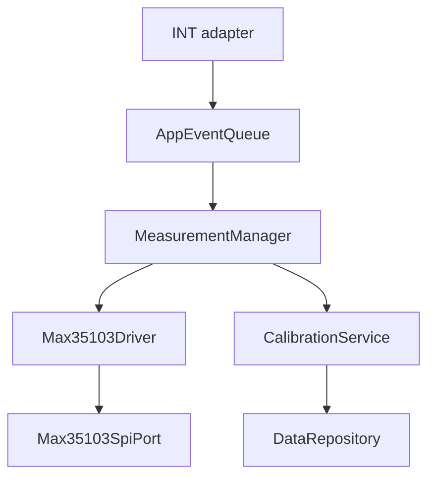
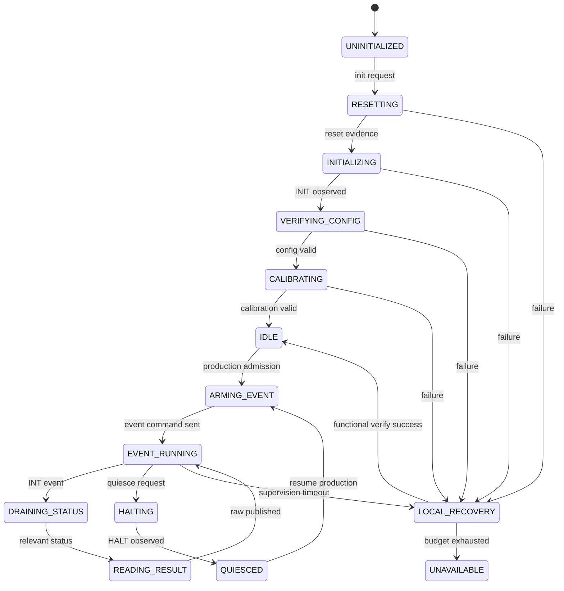
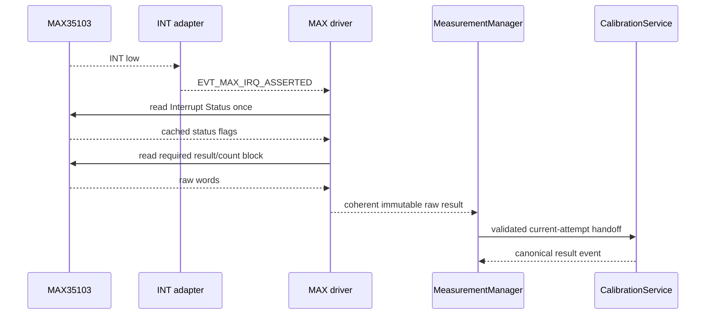

# MAX35103 Integration

## 1. Mục đích

Tài liệu này định nghĩa contract tích hợp MAX35103 vào firmware của Smart Water Flow and Pressure Monitor, bao gồm:

- Ranh giới giữa SPI transport, MAX35103 driver, `MeasurementManager` và các service xử lý.
- Khởi tạo, kiểm tra cấu hình, calibration clock và vận hành event-timing.
- Quy tắc xử lý chân `INT`, Interrupt Status tự xóa và coherent result snapshot.
- Raw data model cho TOF/temperature cùng quality evidence.
- State machine không blocking cho command, result read, halt và recovery.
- Profile binding theo product variant.
- Mapping tương đương giữa Linux emulator và STM32L433.
- Error taxonomy, local recovery và acceptance criteria.

MAX35103 là owner phần cứng của acoustic time measurement. Nó không trả volumetric flow trực tiếp. Firmware phía MCU vẫn chịu trách nhiệm:

```text
raw timing evidence
  -> validate
  -> convert raw representation
  -> signal processing
  -> calibration/compensation
  -> canonical TemperatureResult + FlowResult
```

Các từ khóa `MUST`, `MUST NOT`, `SHOULD` và `MAY` lần lượt có nghĩa bắt buộc, cấm, khuyến nghị và tùy chọn.

---

## 2. Phạm vi

### 2.1. Trong phạm vi

- SPI command/register transaction contract.
- `RST`, `CE` và `INT` control/ingress.
- MAX35103 initialization và device verification.
- Configuration register-image apply/readback contract.
- Manual clock calibration và automatic calibration policy boundary.
- Production event-timing mode.
- Authorized direct measurement cho boot/service/calibration/diagnostic.
- Result/status read ordering và immutable raw handoff.
- Timeout, halt, reinitialize và bounded local recovery.
- Driver/service API và module ownership.
- Linux deterministic emulator.
- STM32 SPI/GPIO/EXTI mapping.
- Test, release gate và traceability.

### 2.2. Operational contexts

| Context | MAX operation | Production side effect |
|---|---|---|
| Boot self-check | Initialization, status/config verification, optional bounded direct measurement | Readiness only |
| Production | Profile-selected event-timing mode | Allowed only after downstream acceptance |
| Service | Direct or event-timing diagnostic operation | Forbidden |
| Calibration | Controlled direct/event sequence | Forbidden until a new production sample after resume |
| Recovery verify | Bounded functional measurement | Readiness evidence only |
| Linux simulation | Same logical command/state/result contract | Test policy |

### 2.3. Product baseline

- Production cadence nằm trong MAX35103 event-timing engine theo `DEC-MEAS-002`.
- MCU dùng MAX `INT` làm completion evidence và dùng monotonic scheduler để supervision.
- Direct `TOF_DIFF` không được dùng làm software-periodic production loop.
- Product variant chọn một immutable `Max35103Profile` tương thích với ultrasonic sensor/geometry profile.

---

## 3. Source-of-truth và tài liệu liên quan

### 3.1. Thứ tự ưu tiên

| Ưu tiên | Nguồn | Nội dung sở hữu |
|---:|---|---|
| 1 | MAX35103 official datasheet/errata | Electrical, SPI timing, opcode, register và device behavior |
| 2 | Project decision registry | Mode, ownership, readiness và production policy |
| 3 | `10_measurement_cycle.md` | Common attempt/event/result lifecycle |
| 4 | `16_sensor_profile_and_variant.md` | Variant/profile/version/compatibility contract |
| 5 | Tài liệu này | MAX-specific integration và transaction state machine |
| 6 | `13`–`15` | Processing, flow computation và product calibration |
| 7 | Implementation/tests | Hiện thực; không được tự thay source-of-truth |

Nếu implementation note mâu thuẫn với datasheet, phải mở issue/decision và kiểm tra lại. Không sửa behavior bằng suy đoán rồi coi đó là production truth.

### 3.2. Component references đã kiểm tra

Tài liệu được xây dựng dựa trên các component note đã review với MAX35103 Rev 2:

- `MAX35103_Technical_Summary(1).md`.
- `MAX35103_SPI_Command_Notes(1).md`.
- `MAX35103_Register_Notes(1).md`.

Các note này là implementation aid, không thay datasheet cho electrical/timing limit.

### 3.3. Decision binding

| Decision | Binding |
|---|---|
| `DEC-MEAS-002` | Production dùng event-timing; direct command chỉ cho context được phép |
| `DEC-MEAS-004` | Validity, freshness, acceptance và reason tách biệt |
| `DEC-ARCH-001` | Flow path là core readiness dependency |
| `DEC-ARCH-002` | `CalibrationService` sở hữu canonical temperature result |
| `DEC-ARCH-003` | Không có usable temperature thì production flow không accepted |
| `DEC-ARCH-004` | Service/calibration sample không update product state |
| `DEC-HW-001` | MAX register/timing image thuộc immutable product profile |
| `DEC-DATA-003` | Một accepted source-event turn tạo tối đa một final snapshot |

### 3.4. Current-code baseline

Repository `whoisLePhuc/smart-water-flow-pressure-monitor`, branch `main`, hiện có core Phase 1:

- C11/CMake Linux build.
- `AppEvent`, queue và bounded event loop.
- Monotonic scheduler/virtual clock.
- System FSM và mode guard contract.
- `DataRepository`/atomic snapshot.
- `EVT_MAX_RESULT_READY` và `EVT_MAX_RESULT_TIMEOUT` trong event catalog.

Chưa có MAX35103 driver, measurement manager, SPI port hoặc emulator trong code đã kiểm tra. Mục 7.14 định nghĩa extension phải triển khai; tài liệu không giả định các module đó đã tồn tại.

---

## 4. Requirement/decision được hiện thực

| ID | Requirement firmware |
|---|---|
| `FW-MAX-REQ-001` | MAX35103 MUST có đúng một driver instance owner cho mỗi physical device. |
| `FW-MAX-REQ-002` | Mọi SPI access tới MAX35103 MUST đi qua `Max35103Driver`; module khác không thao tác `CE` hoặc opcode trực tiếp. |
| `FW-MAX-REQ-003` | SPI port MUST cấu hình MSB-first, `CPOL=0`, `CPHA=1` và frequency không vượt giới hạn theo điện áp/profile. |
| `FW-MAX-REQ-004` | Driver MUST giữ command/register constant trong MAX-specific header, không làm rò register field vào domain/application layer. |
| `FW-MAX-REQ-005` | Production measurement MUST dùng profile-selected event-timing command; software periodic direct command MUST NOT thay thế nó. |
| `FW-MAX-REQ-006` | Direct command MUST chỉ được admission cho boot self-check, service, calibration, diagnostic hoặc recovery verification. |
| `FW-MAX-REQ-007` | `INT` ISR MUST chỉ capture bounded evidence/time và post event; ISR không đọc SPI hoặc xử lý kết quả. |
| `FW-MAX-REQ-008` | Interrupt Status MUST có đúng một software owner vì register tự xóa khi đọc. |
| `FW-MAX-REQ-009` | Một status snapshot MUST được cache và fan-out; consumer khác MUST NOT đọc lại status để tìm riêng flag của mình. |
| `FW-MAX-REQ-010` | Sau status read, driver MUST re-check active-low `INT` level hoặc equivalent latched evidence để không mất nguồn interrupt đến đồng thời. |
| `FW-MAX-REQ-011` | Result block MUST được đọc và publish cùng status/cycle-count evidence thuộc cùng logical completion. |
| `FW-MAX-REQ-012` | Error sentinel, timeout flag và valid-cycle count MUST được kiểm tra trước numeric conversion. |
| `FW-MAX-REQ-013` | Event average với valid cycle count bằng zero MUST NOT được dùng. |
| `FW-MAX-REQ-014` | Failed cycles bị MAX loại khỏi average MUST được phản ánh bằng requested/valid cycle evidence; không giả định hai count luôn bằng nhau. |
| `FW-MAX-REQ-015` | TOF differential words MUST được join/sign-extend theo signed fixed-point contract trước scaling. |
| `FW-MAX-REQ-016` | Raw driver result MUST immutable sau handoff và chứa attempt/correlation/source-generation/profile/config context. |
| `FW-MAX-REQ-017` | Driver MUST NOT tính volumetric flow, leak hoặc volume accumulation. |
| `FW-MAX-REQ-018` | Driver MUST NOT quyết định `DATA_ACCEPTED`; nó chỉ cung cấp transport/device validity evidence. |
| `FW-MAX-REQ-019` | MAX configuration MUST đến từ validated `Max35103Profile`; không dùng scattered magic register values. |
| `FW-MAX-REQ-020` | Reserved bits MUST được ghi theo datasheet; register image MUST được mask/validate trước write. |
| `FW-MAX-REQ-021` | Configuration apply MUST có readback/verification policy và không tự write configuration flash ở mỗi boot. |
| `FW-MAX-REQ-022` | `Initialize`/configuration-flash semantics MUST được thể hiện rõ; volatile changes không được giả định sống qua initialize/reset. |
| `FW-MAX-REQ-023` | HALT MUST được xử lý asynchronous; command completion không được giả định xảy ra ngay sau khi phát lệnh. |
| `FW-MAX-REQ-024` | Active event engine MUST được halt/quiesce tại safe boundary trước config/profile replacement hoặc service ownership transfer. |
| `FW-MAX-REQ-025` | Mọi command/result/recovery deadline MUST dùng monotonic time và có finite timeout. |
| `FW-MAX-REQ-026` | Driver/service MUST NOT busy-wait `INT`, HALT, INIT, CAL hoặc FLASH completion. |
| `FW-MAX-REQ-027` | Duplicate/stale INT/completion MUST NOT tạo duplicate raw result hoặc downstream side effect. |
| `FW-MAX-REQ-028` | Timeout MUST đóng logical operation đúng một lần và invalidate late completion bằng correlation/source generation. |
| `FW-MAX-REQ-029` | Local recovery MUST bounded, increment source generation khi reinit và cần functional verification. |
| `FW-MAX-REQ-030` | Hết local recovery budget MUST phát measurement health/escalation event với stable reason. |
| `FW-MAX-REQ-031` | Flow readiness chỉ valid sau config/device verification và fresh functional evidence trong boot generation hiện tại. |
| `FW-MAX-REQ-032` | Driver init return success một mình MUST NOT là flow readiness evidence. |
| `FW-MAX-REQ-033` | Linux emulator MUST dùng cùng opcode/register/status/result semantics cần thiết cho service test và deterministic virtual time. |
| `FW-MAX-REQ-034` | STM32 và Linux MUST dùng cùng public driver/service types, state transitions, quality flags và golden vectors. |
| `FW-MAX-REQ-035` | Numeric timing/register/clock values chưa qualification MUST nằm trong profile và mang `NEEDS_VERIFICATION`. |
| `FW-MAX-REQ-036` | Datasheet ambiguity MUST bị cô lập sau named API/flag và bị chặn khỏi production release tới khi được xác minh. |
| `FW-MAX-REQ-037` | MAX internal RTC/watchdog/user flash MUST NOT trở thành system service mặc định nếu chưa có decision và owner riêng. |
| `FW-MAX-REQ-038` | INT/transport queue overflow MUST tạo latched diagnostic/recovery evidence; không silently drop. |
| `FW-MAX-REQ-039` | Event-timing re-arm sau service/recovery MUST yêu cầu một production sample mới trước product-state update. |
| `FW-MAX-REQ-040` | Known physical flow-direction test MUST xác nhận mapping dấu trước production qualification. |

---

## 5. Trách nhiệm

### 5.1. Module ownership

| Module | Trách nhiệm | Không sở hữu |
|---|---|---|
| `Max35103SpiPort` | CE/SPI transfer completion, transport timeout/error | Opcode meaning, retry policy |
| `Max35103Driver` | Command/register encoding, config apply, status/result read FSM | Product cadence, flow formula |
| `Max35103IrqAdapter` | Capture INT evidence/time và event ingress | SPI/status read |
| `MeasurementManager` | Admission, attempt, event-timing lifecycle, supervision, raw handoff, local recovery | Flow/calibration equation |
| `CalibrationService` | Temperature conversion/compensation và canonical flow/temperature result | Physical SPI/device state |
| `MonotonicScheduler` | Supervision/recovery/deadline jobs | MAX cadence |
| `Max35103ProfileOwner` | Immutable qualified device/register/timing profile | Per-device calibration coefficients |
| `DataRepository` | Canonical result/snapshot publication | Raw MAX register image |
| `HealthMonitor` | Observe counters/status và request escalation | Direct device reset |

### 5.2. Single status owner

`Max35103Driver` là owner duy nhất đọc Interrupt Status. Một read tạo `Max35103StatusSnapshot`; snapshot này được dùng để:

- Xác định operation hoàn thành.
- Chọn result block cần đọc.
- Ghi nhận timeout/error/POR/INIT/HALT/CAL/FLASH evidence.
- Fan-out software completion mà không đọc status lần hai.

### 5.3. Cadence owner

Trong production, MAX event engine sở hữu acoustic cadence. `MeasurementManager` sở hữu:

- Arm/re-arm policy.
- Missing-result supervision.
- Result consumption.
- Quiesce/recovery.

Scheduler không phát direct TOF command mỗi period.

### 5.4. Separation from algorithm

Driver chỉ trả raw timing/diagnostic evidence. Các nội dung sau thuộc downstream:

- Flow sign policy sau hardware sign verification.
- Zero offset.
- Geometry equation.
- Sound-speed/fluid-property compensation.
- Meter factor/table.
- Outlier/filter policy.
- Accepted production decision.

---

## 6. Ngoài phạm vi

- Exact hydraulic flow equation và fixed-point implementation.
- Exact temperature RTD conversion/interpolation.
- Factory acoustic calibration procedure.
- Leak detection và volume accumulation.
- Schematic/PCB electrical design ngoài firmware pin contract.
- Analog comparator/transducer tuning procedure chi tiết.
- MAX35103 user-flash allocation cho application data.
- MAX RTC/calendar làm system wall clock.
- MAX watchdog làm system watchdog.
- Generic raw-register service command cho production.
- Exact qualified register values cho từng meter variant.
- Vendor ambiguity resolution chưa có evidence.

---

## 7. Interface và dependency

### 7.1. Dependency direction



Không module ở bên dưới được gọi ngược lên repository, FSM hoặc product policy.

### 7.2. SPI port

```c
typedef enum {
    MAX_SPI_PORT_OK,
    MAX_SPI_PORT_BUSY,
    MAX_SPI_PORT_TIMEOUT,
    MAX_SPI_PORT_IO_ERROR,
    MAX_SPI_PORT_CANCELLED
} MaxSpiPortResult;

typedef struct {
    void *context;
    MaxSpiPortResult (*start_transfer)(
        void *context,
        const uint8_t *tx,
        uint8_t *rx,
        uint16_t length,
        uint32_t correlation_id);
    bool (*is_busy)(void *context);
    void (*set_ce)(void *context, bool active);
} Max35103SpiPort;
```

Port MAY dùng synchronous bounded transfer cho transaction rất ngắn nếu WCET được chứng minh, nhưng public service lifecycle vẫn event-driven. Baseline STM32 nên hỗ trợ interrupt/DMA completion adapter để không block event loop.

### 7.3. SPI transaction classes

| Transaction | Wire intent | Logical payload |
|---|---|---|
| Command | Gửi command opcode | Opcode only |
| Register read | Gửi read opcode, nhận one 16-bit word | 8-bit opcode + 16-bit data |
| Register write | Gửi write opcode và one 16-bit value | 8-bit opcode + 16-bit data |
| Flash access | Dedicated command/address/data sequence | MAX-specific bounded sub-FSM |

Mỗi logical transaction phải giữ `CE` theo timing của datasheet. Driver không giả định có thể ghép arbitrary register thành một burst nếu datasheet không định nghĩa burst đó.

### 7.4. Command catalog boundary

Driver cần named command API cho ít nhất:

```text
reset/initialize
TOF_UP
TOF_DOWN
TOF_DIFF
temperature
calibrate
EVTMG1
EVTMG2
EVTMG3
HALT
configuration flash transfer/recall operations when enabled
```

Numeric opcode nằm trong `max35103_registers.h`; higher layer dùng enum/named API.

### 7.5. Driver public API

```c
typedef struct Max35103Driver Max35103Driver;

typedef enum {
    MAX_REQUEST_ACCEPTED,
    MAX_REQUEST_BUSY,
    MAX_REQUEST_INVALID_ARGUMENT,
    MAX_REQUEST_NOT_READY,
    MAX_REQUEST_NOT_ALLOWED,
    MAX_REQUEST_PROFILE_INVALID,
    MAX_REQUEST_PORT_ERROR
} MaxRequestResult;

MaxRequestResult max35103_driver_init(
    Max35103Driver *driver,
    const Max35103SpiPort *port,
    const Max35103PlatformPins *pins,
    const Max35103Profile *profile);

MaxRequestResult max35103_start_initialize(
    Max35103Driver *driver,
    const MaxOperationContext *operation);

MaxRequestResult max35103_start_event_timing(
    Max35103Driver *driver,
    MaxEventMode mode,
    const MaxOperationContext *operation);

MaxRequestResult max35103_start_direct_measurement(
    Max35103Driver *driver,
    MaxDirectCommand command,
    const MaxOperationContext *operation);

MaxRequestResult max35103_request_halt(
    Max35103Driver *driver,
    const MaxOperationContext *operation);

MaxDriverStepResult max35103_handle_event(
    Max35103Driver *driver,
    const AppEvent *event);
```

### 7.6. Operation context

```c
typedef struct {
    uint32_t operation_id;
    uint32_t correlation_id;
    uint32_t source_generation;
    uint32_t mode_generation;
    uint32_t profile_version;
    uint32_t config_version;
    uint32_t calibration_version;
    MeasurementPurpose purpose;
    DataProvenance provenance;
    uint64_t requested_monotonic_us;
    uint64_t deadline_monotonic_us;
} MaxOperationContext;
```

Driver copy context vào active operation; không giữ pointer tới mutable request buffer.

### 7.7. Status snapshot

```c
typedef struct {
    uint16_t raw_status;
    uint32_t irq_sequence;
    uint32_t source_generation;
    uint64_t irq_observed_monotonic_us;
    uint64_t status_read_monotonic_us;
    bool int_level_still_active;
} Max35103StatusSnapshot;
```

`raw_status` được decode thành named flags. Reserved bits không được dùng làm feature detection.

### 7.8. Raw TOF sample

```c
typedef struct {
    MaxOperationContext operation;
    Max35103StatusSnapshot status;

    uint64_t raw_sample_sequence;
    uint64_t completion_monotonic_us;

    uint16_t avg_up_int;
    uint16_t avg_up_frac;
    uint16_t avg_down_int;
    uint16_t avg_down_frac;
    uint16_t tof_diff_int;
    uint16_t tof_diff_frac;
    uint16_t tof_diff_avg_int;
    uint16_t tof_diff_avg_frac;

    uint16_t wave_ratio_up;
    uint16_t wave_ratio_down;
    uint8_t valid_cycle_count;
    uint8_t tof_range_raw;
    uint8_t requested_cycle_count;

    uint32_t evidence_flags;
    uint32_t transport_flags;
    DataValidity device_validity;
} Max35103RawTofSample;
```

Fields không cần cho selected profile MAY bị compile/config omit, nhưng coherent validity evidence là bắt buộc.

### 7.9. Raw temperature sample

```c
#define MAX35103_TEMP_PORT_COUNT 4u

typedef struct {
    MaxOperationContext operation;
    Max35103StatusSnapshot status;
    uint64_t raw_sample_sequence;
    uint64_t completion_monotonic_us;
    uint16_t time_int[MAX35103_TEMP_PORT_COUNT];
    uint16_t time_frac[MAX35103_TEMP_PORT_COUNT];
    uint8_t measured_port_mask;
    uint8_t valid_cycle_count;
    uint8_t requested_cycle_count;
    uint32_t evidence_flags;
    DataValidity device_validity;
} Max35103RawTemperatureSample;
```

Driver không convert RTD timing thành `m°C`; conversion thuộc `CalibrationService`/temperature processing contract.

### 7.10. Combined event result

Một `EVTMG1` completion có thể chứa cả TOF và temperature evidence. Nên dùng một immutable envelope:

```c
typedef struct {
    MaxOperationContext operation;
    Max35103StatusSnapshot status;
    bool has_tof;
    bool has_temperature;
    Max35103RawTofSample tof;
    Max35103RawTemperatureSample temperature;
} Max35103RawEventResult;
```

Handoff phải atomic ở logical level: consumer không thấy half-updated result.

### 7.11. Driver completion mailbox

Queue event không mang toàn bộ raw block. Recommended pattern:

```text
driver writes immutable mailbox slot
  -> assigns object ID/version
  -> posts completion event with ID/version
  -> consumer claims/copies object
  -> slot released after acknowledgement
```

Không post pointer tới reusable DMA/driver buffer.

### 7.12. Event binding

| Event | Producer | Consumer | Ý nghĩa |
|---|---|---|---|
| `EVT_MAX_IRQ_ASSERTED` | IRQ adapter | MAX driver/manager | INT evidence cần drain; đề xuất bổ sung |
| `EVT_MAX_SPI_COMPLETED` | SPI adapter | MAX driver | One transport step completed; đề xuất bổ sung |
| `EVT_MAX_SPI_FAILED` | SPI adapter | MAX driver | Transport terminal error; đề xuất bổ sung |
| `EVT_MAX_RESULT_READY` | MAX driver/manager | Processing pipeline | Coherent raw result ready |
| `EVT_MAX_RESULT_TIMEOUT` | Scheduler | Measurement manager | Supervision/operation timeout |
| `EVT_MEASUREMENT_STATUS_CHANGED` | Measurement manager | Health/repository/guards | Flow-path status/readiness change |

Phase 1 chỉ có hai event cuối trong catalog. Không nên dùng `EVT_MAX_RESULT_READY` vừa cho raw hardware INT vừa cho validated raw mailbox completion; phải tách ingress và domain completion để tránh ambiguity.

### 7.13. Scheduler jobs

```text
JOB_MAX_OPERATION_TIMEOUT
JOB_MAX_MISSING_RESULT_SUPERVISION
JOB_MAX_HALT_TIMEOUT
JOB_MAX_RECOVERY_STEP
JOB_MAX_RECOVERY_VERIFY_TIMEOUT
```

Job event phải mang job generation và correlation; stale timeout sau completion bị bỏ qua.

### 7.14. Current-code extension

| Current code | Dùng lại | Extension/correction |
|---|---|---|
| `AppEventQueue` | Priority/delivery/correlation ingress | Reserved critical capacity cho INT/SPI completion |
| `AppEventLoop` | Bounded turns | Domain handler registry; không chỉ dispatch FSM |
| `SchedulerJob` | Monotonic deadline/generation | MAX operation/supervision jobs |
| `data_model.h` | Canonical event/result metadata | Thêm MAX ingress/transport IDs và profile binding reference |
| `DataRepository` | Final snapshot publication | Chỉ nhận canonical processed results, không raw MAX block |
| `ModeGuardContext` | Flow readiness field | Bind real measurement evidence thay constant `true` |
| Linux platform | Virtual clock/runtime | Thêm SPI/INT emulator adapter |

`app_event_loop.c` hiện ghi đè `event.source_generation` bằng FSM mode generation. Trước khi tích hợp MAX, phải tách `source_generation` và `mode_generation`; nếu không late IRQ/recovery filtering sẽ sai.

### 7.15. Source-tree layout đề xuất

```text
3.firmware/
├── include/
│   ├── drivers/max35103/
│   │   ├── max35103_driver.h
│   │   ├── max35103_registers.h
│   │   ├── max35103_types.h
│   │   └── max35103_port.h
│   └── measurement/
│       ├── measurement_manager.h
│       └── max35103_profile.h
├── src/
│   ├── drivers/max35103/
│   │   ├── max35103_driver.c
│   │   ├── max35103_transport.c
│   │   ├── max35103_config.c
│   │   └── max35103_result.c
│   └── measurement/
│       └── measurement_manager.c
├── src/platform/linux/
│   └── max35103_sim_port.c
├── src/platform/stm32/
│   └── max35103_stm32_port.c
└── tests/
    ├── unit/test_max35103_*.c
    └── integration/test_max_measurement_cycle.c
```

Không cần tách file quá nhỏ ngay từ đầu; boundary transport/config/result/manager phải giữ dù implementation ban đầu gộp hợp lý.

---

## 8. Data model và đơn vị

### 8.1. Raw representation

| Data | Representation | Unit/semantics |
|---|---|---|
| Absolute TOF integer | `uint16_t` | 4 MHz clock periods, nonnegative valid domain |
| Absolute TOF fraction | `uint16_t` | 1/65536 of clock period |
| TOF differential | joined `int32_t Q16` | Signed count of 4 MHz periods |
| Wave ratio | raw `uint16_t` | Device diagnostic; interpretation profile/versioned |
| TOF range | raw `uint8_t` | Event spread diagnostic; not flow |
| Cycle count | `uint8_t` | Valid error-free cycles accumulated |
| Monotonic time | `uint64_t` | microseconds |

Nominal 4 MHz implies one integer period là 250 ns và one fractional count xấp xỉ 3.814 ps. Production conversion không hard-code nominal clock nếu active calibration/scaling policy yêu cầu calibrated factor.

### 8.2. Differential join

```c
static inline int32_t max35103_join_diff_q16(
    uint16_t integer_word,
    uint16_t fraction_word)
{
    return (int32_t)(((uint32_t)integer_word << 16) |
                     (uint32_t)fraction_word);
}
```

Cast sang signed chỉ sau khi ghép đủ 32 bit. Không sign-extend riêng integer word rồi shift theo cách làm mất fractional semantics.

### 8.3. Scaling boundary

Một và chỉ một scaling policy được active:

```text
CAL_USE enabled in MAX
  -> device result already uses internal calibration path
  -> MCU must not apply the same clock gain again

CAL_USE disabled
  -> MCU conversion uses explicit captured calibration factor
  -> raw/result metadata records policy/version
```

Không double-compensate calibration.

### 8.4. Error sentinel precedence

Validation order:

1. Transport completed and length valid.
2. Status snapshot decoded.
3. Required result words all read.
4. Error sentinel checked.
5. Valid cycle count checked.
6. Field/range plausibility checked.
7. Numeric join/scaling.
8. Downstream quality/acceptance.

Không convert sentinel thành very-large numeric rồi để generic range filter xử lý.

### 8.5. Sample reference time

MAX event engine thực hiện measurement trước khi MCU đọc result. Baseline metadata:

- `irq_observed_monotonic_us`: best available completion evidence.
- `status_read_monotonic_us`: transport observation time.
- `completion_monotonic_us`: coherent raw block ready time.
- `sample_reference_monotonic_us`: derived theo documented event profile, hoặc dùng IRQ time với explicit uncertainty flag.

Exact reconstruction của per-cycle sample time cần profile/event-position semantics và vẫn `NEEDS_VERIFICATION`.

### 8.6. Identity/version fields

Mỗi raw result giữ:

```text
operation/attempt ID
correlation ID
source generation
mode generation
raw sample sequence
profile version
config version
calibration version
result/mailbox version
purpose/provenance
```

Các version có semantics riêng, không dùng thay nhau.

### 8.7. Evidence flags

Đề xuất flag catalog:

```text
MAX_EVIDENCE_STATUS_TOF_COMPLETE
MAX_EVIDENCE_STATUS_TEMP_COMPLETE
MAX_EVIDENCE_EVENT_TOF_COMPLETE
MAX_EVIDENCE_EVENT_TEMP_COMPLETE
MAX_EVIDENCE_TIMEOUT
MAX_EVIDENCE_SENTINEL
MAX_EVIDENCE_ZERO_VALID_CYCLES
MAX_EVIDENCE_PARTIAL_VALID_CYCLES
MAX_EVIDENCE_RANGE_HIGH
MAX_EVIDENCE_WAVE_RATIO_OUTSIDE_PROFILE
MAX_EVIDENCE_POR_OBSERVED
MAX_EVIDENCE_PROFILE_MISMATCH
MAX_EVIDENCE_LATE_COMPLETION
MAX_EVIDENCE_DUPLICATE_IRQ
MAX_EVIDENCE_SAMPLE_TIME_ESTIMATED
```

Bit values nằm trong versioned public header và có serialization/test.

### 8.8. Validity versus acceptance

| Layer | Quyết định |
|---|---|
| SPI port | Transaction success/failure |
| Driver | Device/result structurally valid or invalid |
| Measurement manager | Current attempt/generation, complete raw envelope |
| Processing/calibration | Physical/algorithm quality |
| Result owner | Validity, freshness, acceptance, reason |

Device-valid không đồng nghĩa production-accepted.

### 8.9. Flow sign

`TOF_DIFF = AVGUP - AVGDN` theo device convention. Mapping `positive -> forward` phụ thuộc PCB/transducer/acoustic-path binding. `Max35103Profile` hoặc compatible ultrasonic profile phải chứa sign convention đã được chứng minh bằng known-direction test.

---

## 9. State machine hoặc sequence

### 9.1. Driver state

```c
typedef enum {
    MAX_STATE_UNINITIALIZED,
    MAX_STATE_RESETTING,
    MAX_STATE_WAIT_POR,
    MAX_STATE_INITIALIZING,
    MAX_STATE_VERIFYING_CONFIG,
    MAX_STATE_CALIBRATING,
    MAX_STATE_IDLE,
    MAX_STATE_ARMING_EVENT,
    MAX_STATE_EVENT_RUNNING,
    MAX_STATE_DRAINING_STATUS,
    MAX_STATE_READING_RESULT,
    MAX_STATE_HALTING,
    MAX_STATE_LOCAL_RECOVERY,
    MAX_STATE_UNAVAILABLE,
    MAX_STATE_QUIESCED
} Max35103State;
```

Transport sub-state có thể tách riêng để driver state không phụ thuộc DMA detail.

### 9.2. Main state machine



### 9.3. Boot sequence

```text
validate Max35103Profile and variant binding
  -> initialize SPI/GPIO/IRQ port in safe state
  -> assert/deassert RST per qualified timing
  -> drain/read status and observe POR as applicable
  -> issue Initialize
  -> wait asynchronously for INIT/status evidence
  -> verify required configuration registers/fingerprint
  -> if mismatch: apply allowed volatile config or enter provisioning policy
  -> optional manual clock calibration
  -> run bounded functional direct measurement/self-check
  -> publish readiness evidence
  -> arm selected production event-timing mode
```

Exact reset/clock/initialize delay nằm trong profile.

### 9.4. Production result sequence



### 9.5. INT drain loop

```text
IRQ evidence accepted
  -> if drain already active: coalesce/latch pending evidence
  -> read status exactly once for this drain step
  -> cache status
  -> schedule/read every result group required by cached flags
  -> publish terminal completion(s)
  -> sample INT level
  -> if still low or pending IRQ latched: schedule another bounded drain step
  -> otherwise return EVENT_RUNNING/IDLE
```

Loop được chia qua bounded events; không `while(INT == low)` vô hạn trong một turn.

### 9.6. Event-timing mode selection

Profile chọn một trong:

| Mode | Device sequence intent | Use case |
|---|---|---|
| `EVTMG1` | TOF differential + temperature sequence | Combined production path |
| `EVTMG2` | TOF differential sequence | Flow cadence when temperature has separate qualified cadence |
| `EVTMG3` | Temperature sequence | Separate temperature operation/service |

Baseline product nên ưu tiên một profile có usable temperature evidence phù hợp flow acceptance. Không hard-code EVTMG1 nếu qualification chọn EVTMG2 + separately scheduled temperature.

### 9.7. HALT/quiesce sequence

```text
quiesce request
  -> stop admission of new direct operations
  -> issue HALT once if event engine active
  -> arm HALT timeout
  -> continue accepting/draining result of operation already in progress
  -> observe HALT status
  -> freeze/reject nonproduction crossover according to purpose/generation
  -> increment source generation if ownership/config boundary changes
  -> enter QUIESCED
```

HALT không tức thời; MAX hoàn tất active TOF/temperature operation trước khi báo HALT.

### 9.8. Configuration replacement

```text
candidate profile/config validated
  -> request production quiesce
  -> await HALT safe boundary
  -> snapshot old active binding
  -> apply/register verify new image
  -> calibrate/functional verify
  -> on success install new binding generation
  -> re-arm event timing
  -> require fresh production sample
  -> on failure restore old valid binding or mark unavailable
```

### 9.9. Timeout and late completion

```text
timeout event
  -> match correlation + source + scheduler generation
  -> close operation once
  -> increment failure counters
  -> invalidate operation or source generation
  -> begin bounded recovery
late INT/SPI completion
  -> classify STALE/SUPERSEDED
  -> drain hardware if needed without publishing old sample
```

### 9.10. Recovery sequence

```text
transport/device failure
  -> try bounded status drain/HALT if safe
  -> deassert CE and reset SPI port state
  -> hardware reset MAX
  -> increment source generation
  -> initialize
  -> verify config/profile
  -> calibrate when policy requires
  -> functional direct measurement
  -> re-arm production event timing
  -> wait for fresh production result
  -> publish recovery success/readiness
```

Success không được báo ngay sau reset/init nếu chưa có functional evidence.

---

## 10. Timing, timeout và non-blocking behavior

### 10.1. Clock/SPI constraints

Baseline component facts:

- SPI mode 1: `CPOL=0`, `CPHA=1`, MSB first.
- Maximum SCK phụ thuộc VCC; component notes ghi 20 MHz khi VCC từ 3.0 V và 10 MHz tại 2.3 V.
- MAX timebase dùng 4 MHz high-speed clock và 32.768 kHz reference/RTC path.

Product profile phải chọn conservative qualified SCK và không suy ra VCC runtime nếu board rail cố định.

### 10.2. Deadline classes

| Deadline | Owner | Khi hết hạn |
|---|---|---|
| SPI transaction | Driver/port | Abort step, transport error |
| Reset settle/POR observe | Driver | Init fault/recovery |
| Initialize completion | Driver | Init timeout |
| Calibration completion | Driver/manager | Calibration fault |
| Event arm | Driver | Start fault |
| Missing production result | Measurement manager | Degraded/recovery |
| Status/result drain | Driver | Preserve diagnostic, recover |
| HALT completion | Driver/manager | Forced reset policy |
| Overall local recovery | Measurement manager | System escalation |

Exact values là profile/qualification fields.

### 10.3. Event-timing interval

Event interval được encode bởi device fields (`TDF`, `TMF`, `8XS`, sequence counts). Runtime period request phải qua typed converter/validator:

```text
requested logical cadence
  -> supported exact device encoding
  -> profile bounds/capability validation
  -> register image
  -> readback verification
```

Không silently round tới cadence khác. Nếu rounding được cho phép, API phải trả actual cadence và config version phải lưu actual encoded value.

### 10.4. Missing-result supervision

Supervision deadline phải derive từ:

```text
event interval
+ requested sequence duration
+ oscillator/measurement worst-case
+ interrupt/transport/event-loop budget
+ qualified margin
```

Không dùng một arbitrary fixed timeout cho mọi profile.

### 10.5. Result-read budget

Driver đọc tối thiểu fields cần cho selected profile. Một coherent result có thể cần nhiều register transactions; driver chia thành deterministic steps với:

- Maximum transaction count.
- Maximum retries.
- Per-step timeout.
- Overall drain timeout.
- Bounded event-loop work.

### 10.6. Non-blocking rules

Firmware MUST NOT:

- Delay/busy-wait sau reset/command.
- Poll status trong unbounded loop.
- Read SPI trong EXTI callback.
- Chờ HALT bằng `while`.
- Retry toàn bộ init nhiều lần trong một turn.
- Dùng `sleep()` trong Linux deterministic tests.

### 10.7. ISR budget

INT ISR chỉ thực hiện constant-time actions:

```text
capture pin/source identity
capture monotonic timestamp if ISR-safe
increment/latch IRQ sequence
post/coalesce critical event
return
```

### 10.8. Freshness

Freshness thuộc canonical result owner. Baseline `10_measurement_cycle.md`:

```text
maximum_data_age_us = 2 × active measurement period
```

MAX driver chỉ cung cấp sample/completion time và uncertainty evidence.

---

## 11. Configuration

### 11.1. Max35103Profile

Logical profile:

```c
typedef struct {
    uint32_t profile_id;
    uint32_t schema_version;
    uint32_t profile_version;
    uint32_t compatible_ultrasonic_profile_id;

    uint32_t spi_clock_hz;
    MaxEventMode production_event_mode;
    MaxClockCalibrationPolicy calibration_policy;
    MaxConfigPersistencePolicy persistence_policy;

    uint16_t tof1;
    uint16_t tof2;
    uint16_t tof3;
    uint16_t tof4;
    uint16_t tof5;
    uint16_t tof6;
    uint16_t tof7;
    uint16_t event_timing_1;
    uint16_t event_timing_2;
    uint16_t tof_measurement_delay;
    uint16_t calibration_control;

    uint32_t init_timeout_us;
    uint32_t calibration_timeout_us;
    uint32_t halt_timeout_us;
    uint32_t result_read_timeout_us;
    uint32_t missing_result_timeout_us;
    uint8_t max_local_recovery_attempts;

    MaxRawQualityBounds quality_bounds;
    uint32_t qualification_reference_id;
    uint32_t content_integrity;
} Max35103Profile;
```

Persistent/runtime encoded layout không nhất thiết giống C struct.

### 11.2. Register image validation

Build/runtime validator kiểm tra:

- Reserved bits.
- Reserved/unsupported encoding.
- Pulse divider và hit/wave ordering.
- Measurement delay versus timeout relationship.
- Event mode/cycle/interrupt consistency.
- Calibration policy consistency (`CAL_USE` versus MCU scaling).
- SCK versus board supply capability.
- Compatible ultrasonic profile.
- Timeout/resource bounds.
- Qualification status.

### 11.3. Volatile versus configuration flash

Hai policy hợp lệ phải được chọn rõ:

| Policy | Boot behavior |
|---|---|
| Provisioned MAX flash | `Initialize` recalls a qualified flash image; firmware readback/fingerprint verifies it |
| Firmware-applied volatile image | Firmware writes register image after initialize/reset and verifies it; loss after reset is expected |

Không write MAX flash mỗi boot. Flash programming chỉ qua authorized provisioning/update flow có completion verification và endurance policy.

### 11.4. Runtime allowlist

Runtime config MAY chọn trong qualified profile bounds:

- Supported cadence encoding.
- Supported result/interrupt cadence policy.
- Qualified filter/quality threshold reference.
- Bounded supervision/recovery policy.

Runtime config MUST NOT thay:

- Sensor/device identity.
- Arbitrary register/bitfield.
- Unqualified pulse/hit/comparator configuration.
- Clock/electrical assumption.
- Compatibility/CRC/qualification check.

### 11.5. Safe apply

Config apply chỉ sau:

1. Parse/schema validation.
2. Immutable product bounds validation.
3. Persistent commit/verify nếu required.
4. HALT safe boundary.
5. Register write/readback.
6. Functional verification.
7. Atomic active-binding generation update.

### 11.6. Datasheet ambiguity isolation

Các ambiguity đã biết phải có named guard:

- Special Control arm-flag write opcode.
- Exact nondefault `CAL_PERIOD` count semantics.
- Conflicting examples về STOP/hit encoding.

Không expose generic workaround. Feature liên quan bị disabled trong production profile tới khi vendor clarification hoặc controlled bench evidence được lưu.

---

## 12. Error detection và recovery

### 12.1. Error taxonomy

| Category | Ví dụ | Baseline response |
|---|---|---|
| Port | SPI busy/timeout/I/O error | Close step, bounded retry/recover |
| Protocol | Wrong length, invalid opcode path, impossible state | Internal fault/recover |
| Device status | Timeout, POR unexpectedly observed | Invalidate sample, reverify/reinit |
| Result | Sentinel, zero valid cycles, partial cycles | Invalid/degraded raw evidence |
| Quality | TOF range/wave ratio outside profile | Downstream reject/degrade |
| Timing | Missing INT/result, HALT timeout | Local recovery |
| Configuration | Readback mismatch/reserved encoding | Block readiness; correct binding/provision |
| Profile | Incompatible/unqualified profile | Block production flow |
| Queue | Critical ingress cannot post | Latch overflow; recovery/escalation |
| Invariant | Duplicate owner, impossible transition, mutable published raw | Critical internal error |

### 12.2. Sentinel rules

Driver must recognize at least:

- Generic invalid TOF result word pattern.
- Failed differential result sentinel pair.
- Invalid/open temperature timing sentinel.
- Temperature short indication.
- Zero valid event cycle count.

Exact patterns are declared and unit-tested from the reviewed register notes; no comparison is spread across services.

### 12.3. Partial cycles

Nếu `valid_cycle_count < requested_cycle_count` nhưng lớn hơn zero:

- Raw sample MAY remain device-valid.
- Set partial-cycle evidence.
- Processing/quality policy decides degraded/rejected/accepted based on qualified minimum.
- Never rewrite count thành requested count.

### 12.4. Unexpected POR

`POR` observed ngoài boot/reset flow nghĩa là device configuration may have been lost or recalled from flash. Response:

```text
invalidate active readiness
  -> stop product acceptance
  -> increment source generation
  -> initialize and verify full profile
  -> calibrate/functional verify
  -> re-arm and await fresh production sample
```

### 12.5. Missing INT

Missing-result supervision không mặc định chứng minh device chưa đo. Recovery first preserves evidence:

- Inspect/latch INT level.
- Attempt bounded status read if transport is healthy.
- Classify lost edge, pin fault, disabled `INT_EN`, device stall hoặc queue loss.
- Drain a completed result if current and coherent.
- Reset only when bounded diagnostic path fails or policy requires.

### 12.6. Duplicate IRQ

IRQ coalescing is allowed while a drain is active. Duplicate event:

- Không tạo operation mới.
- Không read/publish same result twice.
- Có thể trigger one additional INT-level recheck.
- Update diagnostic counter.

### 12.7. Local recovery budget

Recovery policy includes:

```text
maximum attempts
per-step deadline
overall deadline
backoff or next eligible time
source-generation increment rule
required functional verification
escalation reason
```

Không endless reset loop.

### 12.8. System effect

Trong transient recovery:

- `SystemMode` MAY vẫn `NORMAL`.
- Measurement status chuyển `DEGRADED`/`RECOVERING`.
- Không update volume/leak từ invalid flow.
- Pressure/communication/display status vẫn tiếp tục nếu độc lập.

Hết local budget phát `EVT_SYSTEM_RECOVERY_REQUIRED`; Recovery Coordinator quyết định system transition.

### 12.9. Diagnostic counters

Ít nhất:

```text
irq_count
irq_coalesced_count
status_read_count
spi_error_count
device_timeout_count
sentinel_count
zero_cycle_count
partial_cycle_count
missing_result_count
unexpected_por_count
config_mismatch_count
halt_timeout_count
recovery_attempt_count
recovery_success_count
stale_completion_count
critical_ingress_overflow_count
```

Counters phải saturating hoặc defined rollover; không ảnh hưởng control flow vì overflow.

---

## 13. Linux simulation mapping

### 13.1. Emulator layers

| Layer | Linux component |
|---|---|
| SPI wire/CE | `max35103_sim_port.c` |
| Device registers/status | `max35103_emulator.c` |
| Event timing | Virtual-time scheduled device events |
| INT line | Active-low simulated GPIO + event ingress |
| Driver | Same portable C driver as STM32 |
| Measurement manager | Same service code |
| Fault injection | Scenario/fixture API |

Không bypass driver bằng cách post `EVT_MAX_RESULT_READY` trực tiếp trong integration test, trừ unit test của downstream consumer.

### 13.2. Emulator state

Emulator should model:

```text
reset/POR
configuration registers
command acceptance/busy
initialize completion
manual calibration completion
event-timing running/halt pending
result registers and cycle counts
self-clearing interrupt status
active-low INT level
configuration flash image if selected by test
```

### 13.3. Virtual time

```text
Issue command
AdvanceTo(device completion time)
Device sets result/status and INT low
Run event loop turn
Advance through SPI completions
Run until idle with max-step bound
Assert raw/result/health trace
```

Không dùng real `sleep()` hoặc wall-clock timeout trong deterministic tests.

### 13.4. Fault injection

Required scenarios:

- SPI start failure/timeout.
- Missing INT edge while line remains low.
- INT event dropped/coalesced.
- Multiple status bits in one snapshot.
- Status read self-clears flags.
- New status arriving during drain.
- Invalid differential sentinel.
- Zero/partial valid cycle count.
- Event timing continues after failed cycle.
- HALT delayed until active operation completes.
- Unexpected POR.
- Config readback mismatch.
- Late completion after reset/source-generation change.
- Queue critical-capacity exhaustion.

### 13.5. Deterministic raw fixtures

Fixtures store raw register words, not only final flow. Include:

```text
positive/negative/zero TOF_DIFF Q16
signed boundary cases
AVGUP/AVGDN pairs
wave ratios
TOF range
requested/valid cycle counts
temperature timing ports
status flag combinations
profile/config/calibration versions
```

### 13.6. Trace output

Golden trace:

```text
virtual timestamp
MAX state before/after
command/register transaction
IRQ/status snapshot sequence
operation/correlation/source generation
raw mailbox version
terminal outcome/evidence flags
health/readiness transition
canonical result and snapshot version
```

---

## 14. STM32 mapping

### 14.1. Pin/peripheral baseline

| Signal | STM32L433 pin/peripheral | Firmware use |
|---|---|---|
| `MAX_NSS`/`CE` | `PA4`, GPIO output | Explicit chip enable |
| `MAX_SCK` | `PA5`, SPI1 SCK | SPI clock |
| `MAX_MISO` | `PA6`, SPI1 MISO | MAX DOUT |
| `MAX_MOSI` | `PA7`, SPI1 MOSI | MAX DIN |
| `MAX_RST` | `PB0`, GPIO output | Active-low reset |
| `MAX_INT` | `PC13`, EXTI input | Active-low open-drain completion ingress |

Pin map phải được xác nhận với final schematic/CubeMX artifact trước hardware release.

### 14.2. GPIO electrical behavior

- `INT` là active-low open-drain và cần pull-up theo hardware design.
- `RST` active-low; boot default phải giữ device ở safe deterministic state theo qualified sequence.
- `CE` idle/inactive level được set trước enabling SPI transactions.
- GPIO interrupt phải xử lý possibility line vẫn low khi EXTI edge đã bị miss/masked.

### 14.3. SPI configuration

STM32 SPI1 port:

```text
master
full duplex
8-bit frame for byte-oriented transfer buffer
MSB first
CPOL low
CPHA second edge (mode 1)
software-controlled CE
prescaler such that SCK <= qualified profile limit
```

HAL-specific names có thể khác, nhưng wire behavior phải giống Linux port contract.

### 14.4. IRQ adapter

EXTI callback:

```text
read/capture EXTI source
capture monotonic timestamp
latch IRQ sequence/pending bit
post critical event through ISR-safe ingress
return
```

Không gọi HAL SPI transmit/receive trong callback.

### 14.5. SPI completion

DMA hoặc interrupt completion callback:

- Deasserts/finishes CE only according to port state.
- Captures transfer result/correlation.
- Posts `EVT_MAX_SPI_COMPLETED`/failed.
- Does not advance multiple driver states in ISR.

### 14.6. Low power

Trước STOP mode:

- Không có SPI transfer active.
- MAX event engine state và wake policy đã biết.
- `MAX_INT` là armed wake source nếu product design dùng nó.
- Pending low INT phải được drain hoặc preserved.

Sau wake:

- Restore MCU clock/SPI before transaction.
- Inspect wake source/INT level.
- Dispatch pending MAX event.
- Không reinitialize MAX chỉ vì MCU woke unless evidence requires it.

### 14.7. Resource use

- Register profile in `const` flash.
- One small transport buffer sized for maximum bounded transaction.
- Immutable raw mailbox with static capacity.
- No heap allocation in driver/service baseline.
- Static assertions for buffer/register table count.

---

## 15. Test và acceptance criteria

### 15.1. Register/encoding unit tests

- Read/write opcode and transaction byte order.
- Mode 1 port configuration contract.
- Every register mask/shift.
- Reserved-bit rejection.
- TOF differential positive/negative/zero join.
- Sentinel detected before conversion.
- Requested versus valid cycle count.
- Register-image validator rejects unsupported combinations.

### 15.2. Driver state tests

```text
init success -> IDLE
init timeout -> LOCAL_RECOVERY
config mismatch -> readiness blocked
event arm -> EVENT_RUNNING
INT -> one status read -> required result reads -> raw publish
duplicate IRQ -> no duplicate result
HALT delayed -> remains HALTING until status
HALT timeout -> recovery
unexpected POR -> readiness invalidated/reinit
late SPI completion -> stale/no side effect
```

### 15.3. Interrupt/status tests

- Status register is read by one owner.
- Status snapshot is cached before fan-out.
- Multiple flags are all handled from one snapshot.
- Read self-clears current flags.
- New flag during drain causes later INT/recheck.
- INT remains low triggers bounded additional drain.
- Queue/coalescing does not lose required result evidence.

### 15.4. Result tests

- Valid direct/event differential sample preserves raw words and evidence.
- Zero valid cycles rejected.
- Partial cycles set explicit evidence.
- Transport success plus device sentinel is still invalid.
- Wave ratio/range are diagnostics, not flow.
- Sample identity/profile/config/calibration metadata retained.
- Raw object immutable after publication.

### 15.5. Event-timing tests

- Production uses selected EVTMG mode.
- No scheduler-driven direct production command.
- Event engine continues per device behavior after invalid cycle.
- Missing-result supervision detects stall/lost ingress.
- Cadence config maps to exact supported encoding.
- Re-arm after config/recovery increments generation and requires fresh result.

### 15.6. Recovery tests

- SPI fault uses bounded attempts.
- Reset increments source generation.
- Old IRQ/completion ignored after reset.
- Init alone does not restore readiness.
- Functional verify required.
- Recovery budget exhaustion emits stable escalation.
- Other independent services remain operable during local degradation.

### 15.7. Provenance/service tests

- Service/calibration direct measurement is admitted only in authorized context.
- Nonproduction raw/result keeps provenance.
- Nonproduction result cannot update volume/leak/scheduled telemetry.
- Exit service halts/reconfigures/re-arms safely.
- First new production result is required before product-state resume.

### 15.8. Cross-platform tests

Same profile and raw fixture produce identical:

- Register image validation.
- State transition trace.
- Status/sentinel decoding.
- Signed raw conversion.
- Evidence flags.
- Attempt/generation behavior.

on Linux and STM32 HIL within defined timestamp tolerance.

### 15.9. Hardware bring-up acceptance

1. Verify power, reset, CE, SPI and INT electrical behavior.
2. Confirm SPI mode/byte order using known register read/write and logic analyzer.
3. Observe POR/INIT/status workflow.
4. Verify complete qualified register image by readback.
5. Run manual calibration and validate result/status.
6. Run direct UP/DOWN/DIFF diagnostic sequence.
7. Arm production event mode and observe stable INT/result cadence.
8. Test timeout/sentinel behavior and zero/partial cycle handling.
9. Test HALT, reset and reinitialize recovery.
10. Confirm known physical direction maps to expected flow sign.
11. Measure ISR, SPI drain, processing and event-loop latency.
12. Verify low-power wake and pending INT behavior.

### 15.10. Production release gate

MAX integration is release-ready only when:

- Selected profile is compatible and fully qualified.
- No critical register/timing field remains unverified.
- Datasheet ambiguity used by profile has evidence/resolution.
- Register image/config persistence policy is documented and tested.
- Flow direction mapping is verified physically.
- Supervision/recovery thresholds are derived and measured.
- Linux unit/integration, STM32 HIL và metrology qualification pass.
- Error injection proves no invalid sample updates product state.

---

## 16. Traceability

### 16.1. Requirement mapping

| Firmware requirements | Source |
|---|---|
| `FW-MAX-REQ-001`–`004` | Firmware architecture/driver ownership; MAX SPI contract |
| `FW-MAX-REQ-005`–`006` | `DEC-MEAS-002`; `FW-MEAS-010` production/service lifecycle |
| `FW-MAX-REQ-007`–`010` | Interrupt/callback rules; self-clearing status behavior |
| `FW-MAX-REQ-011`–`016` | MAX result/status/cycle-count encoding; data ownership |
| `FW-MAX-REQ-017`–`018` | Driver/domain separation; canonical result contract |
| `FW-MAX-REQ-019`–`024` | `DEC-HW-001`; profile/configuration/HALT behavior |
| `FW-MAX-REQ-025`–`030` | Monotonic scheduler; non-blocking recovery contract |
| `FW-MAX-REQ-031`–`032` | `DEC-ARCH-001`; flow readiness evidence |
| `FW-MAX-REQ-033`–`034` | Linux/STM32 portability and deterministic simulation |
| `FW-MAX-REQ-035`–`040` | Qualification, ambiguity isolation, diagnostics and direction verification |

### 16.2. Upstream/downstream mapping

| Artifact/contract | Owner document |
|---|---|
| Common attempt lifecycle | `10_measurement_cycle.md` |
| MAX driver/transaction/result | Tài liệu này |
| Raw signal plausibility/filter | `13_signal_processing.md` |
| Geometry/flow equation/sign policy | `14_flow_computation.md` |
| Temperature/zero/meter calibration | `15_calibration_algorithm.md` |
| MAX profile/variant binding | `16_sensor_profile_and_variant.md` |
| Canonical result/snapshot | `04_data_model_and_ownership.md` |
| Recovery escalation | `40_error_detection_and_recovery.md` |
| ISR/DMA callback | `53_interrupt_dma_and_callback_rules.md` |

### 16.3. Suggested implementation files

```text
3.firmware/include/drivers/max35103/max35103_driver.h
3.firmware/include/drivers/max35103/max35103_registers.h
3.firmware/include/drivers/max35103/max35103_types.h
3.firmware/include/drivers/max35103/max35103_port.h
3.firmware/include/measurement/max35103_profile.h
3.firmware/include/measurement/measurement_manager.h
3.firmware/src/drivers/max35103/max35103_driver.c
3.firmware/src/drivers/max35103/max35103_transport.c
3.firmware/src/drivers/max35103/max35103_config.c
3.firmware/src/drivers/max35103/max35103_result.c
3.firmware/src/measurement/measurement_manager.c
3.firmware/src/platform/linux/max35103_sim_port.c
3.firmware/src/platform/stm32/max35103_stm32_port.c
```

### 16.4. Suggested test IDs

```text
TC_MAX_SPI_MODE_AND_BYTE_ORDER
TC_MAX_REGISTER_IMAGE_RESERVED_BITS
TC_MAX_DIFF_SIGN_EXTENSION
TC_MAX_SENTINEL_BEFORE_CONVERSION
TC_MAX_STATUS_SINGLE_OWNER
TC_MAX_IRQ_COALESCE_AND_REDRAIN
TC_MAX_ZERO_VALID_CYCLE_REJECT
TC_MAX_PARTIAL_CYCLE_EVIDENCE
TC_MAX_EVENT_TIMING_PRODUCTION
TC_MAX_HALT_ASYNCHRONOUS
TC_MAX_UNEXPECTED_POR_RECOVERY
TC_MAX_LATE_COMPLETION_AFTER_RESET
TC_MAX_SERVICE_PROVENANCE_ISOLATION
TC_MAX_LINUX_STM32_GOLDEN_TRACE
```

### 16.5. Current GitHub binding

| GitHub artifact | Status relative to this document |
|---|---|
| `3.firmware/CMakeLists.txt` | Core/Linux/tests only; add driver/measurement/platform targets |
| `3.firmware/include/core/data_model.h` | MAX result-ready/timeout IDs exist; add ingress/transport IDs and binding metadata |
| `3.firmware/src/core/app_event_loop.c` | Add domain dispatch and correct generation handling |
| `3.firmware/src/platform/linux/*` | Reuse virtual time; add MAX simulator port/emulator |
| `3.firmware/tests/*` | Extend with driver, event timing, recovery and E2E measurement tests |

---

## 17. Open issues / NEEDS_VERIFICATION

| ID | Vấn đề cần xác minh | Ảnh hưởng |
|---|---|---|
| `FW-MAX-OQ-001` | Exact production register image cho first product variant | Build/profile/release |
| `FW-MAX-OQ-002` | EVTMG1 hay EVTMG2 + separate temperature cadence cho production | Event/result pipeline |
| `FW-MAX-OQ-003` | Exact TDF/TMF/TDM/TMM/8XS cadence và sequence counts | Timing/power/quality |
| `FW-MAX-OQ-004` | Exact DPL/PL/STOP/T2WV/HITxWV/DLY/comparator offsets | Acoustic qualification |
| `FW-MAX-OQ-005` | Exact `CLK_S` and reset/initialize settle/timeout values | Boot/recovery |
| `FW-MAX-OQ-006` | `CAL_USE` policy và clock scaling owner | Avoid double calibration |
| `FW-MAX-OQ-007` | Exact nondefault `CAL_PERIOD` semantics from vendor/bench | Calibration accuracy |
| `FW-MAX-OQ-008` | Special Control arm-flag write opcode ambiguity | RTC/tamper feature; keep disabled |
| `FW-MAX-OQ-009` | Production uses provisioned MAX flash or firmware-applied volatile image | Provisioning/boot/endurance |
| `FW-MAX-OQ-010` | Required readback/fingerprint register set after initialize | Readiness evidence |
| `FW-MAX-OQ-011` | Exact raw register subset required for production quality model | SPI latency/RAM |
| `FW-MAX-OQ-012` | Wave ratio và TOF range qualified thresholds | Signal quality |
| `FW-MAX-OQ-013` | Minimum valid cycles accepted when partial sequence occurs | Acceptance/accuracy |
| `FW-MAX-OQ-014` | Exact sample-reference timestamp reconstruction for event average | Pairing/freshness |
| `FW-MAX-OQ-015` | Missing-result supervision formula/margin per profile | Recovery latency |
| `FW-MAX-OQ-016` | SPI DMA versus interrupt/polled bounded transfer on STM32 | WCET/complexity |
| `FW-MAX-OQ-017` | PC13 EXTI/wake behavior and external pull-up on final board | Low power/reliability |
| `FW-MAX-OQ-018` | INT drain rule under simultaneous/new status events verified on hardware | Lost-event prevention |
| `FW-MAX-OQ-019` | Known physical direction sign for final PCB/transducer wiring | Forward/reverse result |
| `FW-MAX-OQ-020` | Recovery limits/backoff và health escalation threshold | Reliability |
| `FW-MAX-OQ-021` | MAX RTC/watchdog/user flash features remain unused or get separate ADR | Ownership/scope |
| `FW-MAX-OQ-022` | Exact raw mailbox capacity and overwrite/backpressure behavior | Memory/queue safety |
| `FW-MAX-OQ-023` | Device revision identification/compatibility evidence available at boot | Variant validation |
| `FW-MAX-OQ-024` | MAX event timing current/power budget measured on final hardware | Battery/low power |

Các mục này không ngăn triển khai portable driver, emulator, state machine và unit tests. Chúng chặn production qualification của các feature/numeric value tương ứng.

---

## 18. Revision history

| Version | Date | Thay đổi |
|---|---|---|
| 0.1 | 2026-07-14 | Initial MAX35103 driver/service boundary, SPI/INT/status contract, event-timing lifecycle, profile/configuration, recovery, Linux emulator, STM32 mapping and test traceability |
