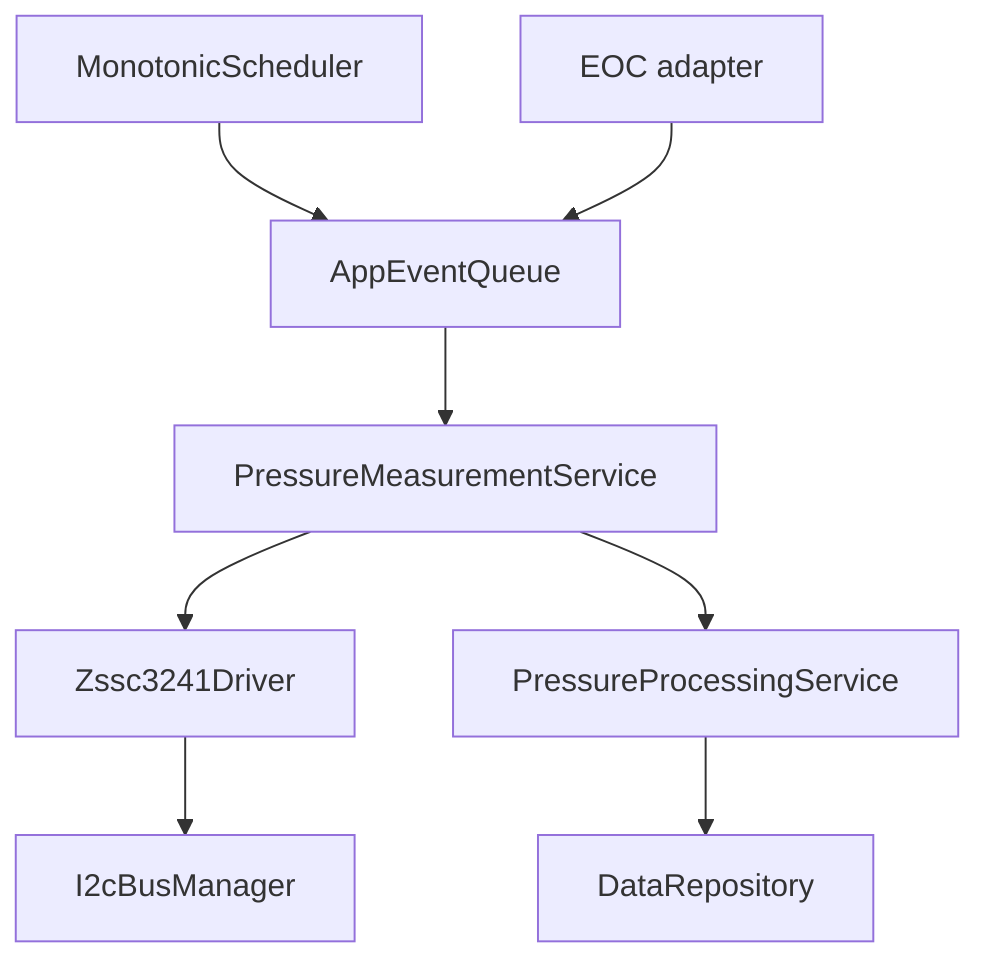
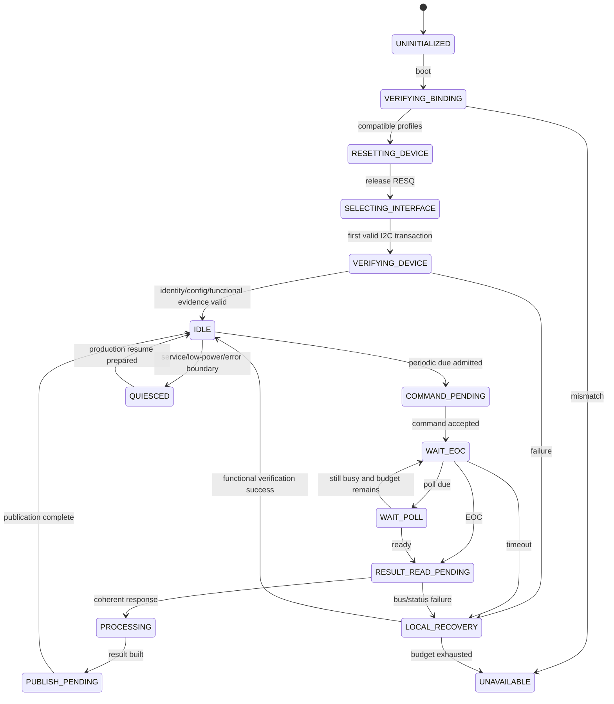
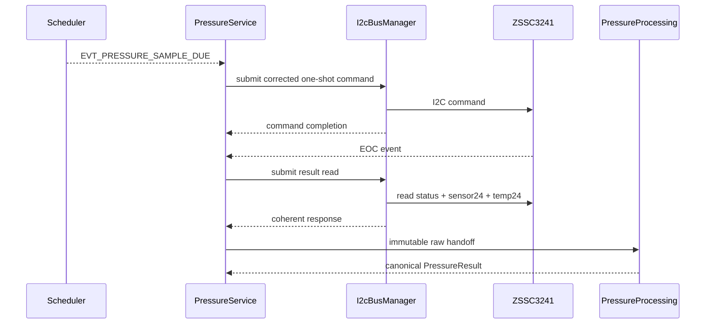

# Pressure Measurement with ZSSC3241

## 0. Trạng thái triển khai tại firmware baseline

- Firmware baseline: `4044414a7610d53b24c10814c12eaa09864e949e`
- Implementation status: **PARTIAL DRIVER SKELETON + ALGORITHM**
- Đã có trong code: Driver state/events, pressure processing service, profile validation, Linux peer and tests exist.
- Chưa hoàn tất: I2C submission/completion, raw payload parsing and registration of the pressure compute service in AppComposition are incomplete.
- Quy ước đọc: các mục requirement/contract bên dưới là thiết kế chuẩn; chỉ những capability được liệt kê “Đã có trong code” mới được xem là đã triển khai.


## 1. Mục đích

Tài liệu này định nghĩa contract firmware để đo áp suất bằng cảm biến cầu điện trở kết nối qua ZSSC3241, bao gồm:

- Ranh giới giữa cảm biến áp suất, ZSSC3241, shared I²C bus, driver và pressure services.
- Production Sleep Mode one-shot theo `DEC-MEAS-003`.
- EOC interrupt hoặc bounded status polling.
- Status/result parsing và immutable raw handoff.
- Mapping corrected 24-bit code sang `Pa`.
- Liên kết product variant, pressure sensor profile, ZSSC profile và calibration record.
- Quản lý NVM ZSSC3241, factory calibration và field trim.
- Error detection, shared-bus recovery và degraded pressure behavior.
- Linux simulation và STM32 mapping.
- Test oracle, acceptance criteria và traceability.

ZSSC3241 là sensor signal conditioner, không phải phần tử cảm biến áp suất độc lập. Product pressure path là:

```text
physical pressure
  -> resistive bridge sensor
  -> ZSSC3241 AFE/ADC/SSC correction
  -> corrected digital code + status
  -> MCU validation/unit conversion/field trim/filter
  -> canonical PressureResult
```

Các từ khóa `MUST`, `MUST NOT`, `SHOULD` và `MAY` lần lượt có nghĩa bắt buộc, cấm, khuyến nghị và tùy chọn.

---

## 2. Phạm vi

### 2.1. Trong phạm vi

- I²C baseline và startup interface-selection contract.
- Shared bus ownership với F-RAM.
- `RESQ` reset và EOC ingress.
- Sleep Mode one-shot corrected measurement.
- Command Mode cho boot, factory/service/calibration và diagnostics.
- Bounded EOC polling fallback.
- Status byte, diagnostic evidence và 24-bit result parsing.
- Pressure code-to-Pa transfer mapping.
- Factory NVM image identity/verification.
- Field trim binding và prevention of double compensation.
- Measurement FSM, timeout, retry và recovery.
- Pressure availability/freshness/acceptance.
- Linux emulator, fault injection và STM32 port.

### 2.2. Operational contexts

| Context | ZSSC3241 mode/operation | Production effect |
|---|---|---|
| Boot self-check | Command Mode verification/diagnostic/functional measurement | Readiness/diagnostic only |
| Production | Sleep Mode one-shot corrected measurement | Pressure result may be accepted |
| Service | Authorized Command Mode operation | No production state update |
| Factory calibration | Command Mode raw/corrected/NVM workflow | Manufacturing only |
| Field adjustment | Production measurement + bounded MCU-side trim | Controlled and auditable |
| Recovery verify | Reset/interface select/config verify/functional measurement | Readiness only |
| Linux simulation | Same logical command/result/state contract | Deterministic test |

### 2.3. Product baseline

- I²C is the baseline digital interface.
- ZSSC3241 shares one physical I²C bus with FM24CL04B through one `I2cBusManager` according to `DEC-HW-006`.
- Production pressure is scheduler-driven Sleep Mode one-shot.
- EOC is preferred when routed and qualified; otherwise monotonic bounded polling is used.
- Corrected sensor code is converted to canonical signed `Pa` by `PressureProcessingService`.
- Pressure failure is degraded operation and does not by itself invalidate ultrasonic flow readiness.

---

## 3. Source-of-truth và tài liệu liên quan

### 3.1. Thứ tự ưu tiên

| Priority | Source | Ownership |
|---:|---|---|
| 1 | Official ZSSC3241 datasheet/errata/application notes | Electrical, command, status, timing, NVM behavior |
| 2 | Pressure sensor datasheet and product qualification | Range, type, bridge, excitation, limits, accuracy |
| 3 | Project decision registry | Mode, shared bus, variant/calibration policy |
| 4 | `10_measurement_cycle.md` | Common attempt/scheduler/event lifecycle |
| 5 | `16_sensor_profile_and_variant.md` | Profile/binding/compatibility/version rules |
| 6 | This document | ZSSC-specific driver/service contract |
| 7 | `13`, `15`, `17` | Filtering/calibration/leak use |
| 8 | Implementation/tests | Realization; not a replacement for source truth |

### 3.2. Component references checked

The following project references were reviewed:

- `ZSSC3241_Technical_Summary.md`.
- `ZSSC3241_Pressure_Measurement_and_Calibration_Guide.md`.

They are implementation guides. Exact bit fields and timing for production must be confirmed against the official component revision used by the product.

### 3.3. Decision binding

| Decision | Binding in this document |
|---|---|
| `DEC-MEAS-001` | Pressure period is configurable and driven by monotonic scheduler |
| `DEC-MEAS-003` | Sleep Mode one-shot; EOC or bounded polling |
| `DEC-MEAS-004` | Validity, freshness, acceptance and reason remain separate |
| `DEC-HW-001` | Variant + immutable sensor/ZSSC profiles + device calibration + bounded runtime config |
| `DEC-HW-006` | ZSSC3241 and F-RAM share I²C through one bus owner |
| `DEC-ARCH-004` | Service/calibration result is isolated from production state |
| `DEC-DATA-003` | At most one final snapshot per accepted source-event turn |

### 3.4. Current-code baseline

The checked GitHub `main` branch currently contains Phase 1 core:

- `AppEventQueue` and bounded `AppEventLoop`.
- Monotonic scheduler and Linux virtual clock.
- System FSM/guard context.
- `DataRepository` and canonical `PressureResult` with `pressure_pa` plus common `ResultMetadata.binding`.
- Phase 1 pressure event IDs are extended/replaced by the canonical catalog in section 7.12.

The checked code does not yet contain `I2cBusManager`, ZSSC3241 driver, pressure services or emulator. Section 7.15 defines required extensions and does not claim they already exist.

---

## 4. Requirement/decision được hiện thực

| ID | Firmware requirement |
|---|---|
| `FW-PRESS-REQ-001` | The pressure path MUST bind exactly one compatible pressure-sensor profile and one ZSSC3241 profile for the selected product variant. |
| `FW-PRESS-REQ-002` | ZSSC3241 is a signal conditioner; firmware MUST NOT infer pressure range/type from the conditioner alone. |
| `FW-PRESS-REQ-003` | Production pressure acquisition MUST use scheduler-driven Sleep Mode one-shot. |
| `FW-PRESS-REQ-004` | Command/Cyclic/raw operations MUST be restricted to explicitly authorized boot, service, factory, calibration or diagnostic contexts. |
| `FW-PRESS-REQ-005` | Every physical I²C transaction MUST be submitted through the single `I2cBusManager`. |
| `FW-PRESS-REQ-006` | ZSSC driver MUST NOT directly reset or bit-bang the shared bus; shared-bus recovery belongs to the bus manager. |
| `FW-PRESS-REQ-007` | I²C transactions are non-preemptive once started; priority applies before admission, not mid-frame. |
| `FW-PRESS-REQ-008` | One pressure attempt MUST have unique attempt/correlation/source/bus-generation context. |
| `FW-PRESS-REQ-009` | A new periodic due event MUST NOT start an overlapping pressure conversion. |
| `FW-PRESS-REQ-010` | EOC ISR/callback MUST only capture bounded evidence and post an event; it MUST NOT perform I²C or processing. |
| `FW-PRESS-REQ-011` | When EOC is unavailable, polling MUST be scheduler-driven, bounded and use a finite overall deadline. |
| `FW-PRESS-REQ-012` | Fixed blocking delay followed by an unconditional read MUST NOT be used in production. |
| `FW-PRESS-REQ-013` | Status MUST be parsed for every corrected measurement response before numeric acceptance. |
| `FW-PRESS-REQ-014` | Busy/not-ready response MUST NOT be interpreted as a valid zero-pressure sample. |
| `FW-PRESS-REQ-015` | Memory error, connection fault or math saturation MUST produce explicit evidence and prevent accepted pressure according to fatality policy. |
| `FW-PRESS-REQ-016` | Result length, byte order and 24-bit field bounds MUST be validated before handoff. |
| `FW-PRESS-REQ-017` | Sleep Mode result consumption semantics MUST have one owner and no duplicate read/publish. |
| `FW-PRESS-REQ-018` | Driver output MUST be an immutable raw/corrected-code envelope containing status and attempt metadata. |
| `FW-PRESS-REQ-019` | Driver MUST NOT convert pressure to Pa, apply field trim, detect leak or publish snapshot. |
| `FW-PRESS-REQ-020` | `PressureProcessingService` MUST be the single writer of canonical `PressureResult`. |
| `FW-PRESS-REQ-021` | Code-to-Pa conversion MUST use explicit profile transfer mapping and overflow-safe integer arithmetic. |
| `FW-PRESS-REQ-022` | Result MUST carry variant/profile/config/calibration versions captured at attempt start. |
| `FW-PRESS-REQ-023` | Pressure sensor temperature MUST NOT be silently substituted for MAX35103 water temperature or vice versa. |
| `FW-PRESS-REQ-024` | Factory calibration coefficients in ZSSC NVM and MCU field trim MUST have distinct ownership; the same compensation MUST NOT be applied twice. |
| `FW-PRESS-REQ-025` | Normal production firmware MUST treat ZSSC NVM as read-only. |
| `FW-PRESS-REQ-026` | NVM writes/lock/checksum operations MUST require factory authorization, stable power, readback, reset and verification. |
| `FW-PRESS-REQ-027` | NVM write success MUST NOT be inferred from I²C ACK alone. |
| `FW-PRESS-REQ-028` | Boot MUST verify expected interface, mode, customer/device identity, NVM/config fingerprint and compatible calibration binding before production admission. |
| `FW-PRESS-REQ-029` | First valid interface transaction after reset MUST deterministically select I²C; alternate-interface pins MUST remain inactive. |
| `FW-PRESS-REQ-030` | All deadlines, age and retry timing MUST use monotonic time. |
| `FW-PRESS-REQ-031` | Timeout MUST terminate an attempt once; late EOC/bus completion MUST be filtered by generation/correlation. |
| `FW-PRESS-REQ-032` | Local retry/reset MUST be bounded and must require functional verification before success. |
| `FW-PRESS-REQ-033` | Shared-bus recovery MUST increment bus generation and invalidate stale completion for every affected client. |
| `FW-PRESS-REQ-034` | Pressure unavailable MUST preserve last-known numeric value only with invalid/stale/unavailable metadata; it MUST NOT fabricate zero. |
| `FW-PRESS-REQ-035` | Pressure failure MUST NOT by itself block valid ultrasonic flow production. |
| `FW-PRESS-REQ-036` | Leak/trend/display/telemetry consumers MUST use canonical pressure validity/freshness/acceptance, not raw code. |
| `FW-PRESS-REQ-037` | Linux emulator MUST model I²C contention, one-shot latency, EOC/status, read-once result and reset/interface selection deterministically. |
| `FW-PRESS-REQ-038` | Linux and STM32 MUST use the same driver/service types, state transitions, profiles and golden fixtures. |
| `FW-PRESS-REQ-039` | Numeric range, address, timing, transfer mapping and diagnostic thresholds not qualified MUST remain `NEEDS_VERIFICATION`. |
| `FW-PRESS-REQ-040` | Queue/bus resource exhaustion MUST create explicit diagnostics and terminal outcome; it MUST NOT silently drop an attempt. |
| `FW-PRESS-REQ-041` | Configuration/profile/field-trim apply MUST wait for a pressure safe boundary and MUST NOT mutate an active attempt. |
| `FW-PRESS-REQ-042` | After reset, service exit or binding change, a fresh production sample MUST be required before pressure-dependent product state resumes. |

---

## 5. Trách nhiệm

### 5.1. Ownership table

| Module | Responsibility | Does not own |
|---|---|---|
| `I2cBusManager` | Physical bus arbitration, transaction execution, timeout and bus recovery generation | ZSSC commands/pressure policy |
| `Zssc3241I2cPort` | Typed adapter from driver transaction to bus-manager request | Shared bus scheduling policy |
| `Zssc3241Driver` | Command encoding, response/status parsing, reset/interface/config verification | Period, Pa conversion, leak |
| `Zssc3241EocAdapter` | Capture EOC evidence/time and event ingress | I²C read |
| `PressureMeasurementService` | Periodic admission, attempt FSM, EOC/poll/timeout, retry and raw handoff | Engineering conversion/filter |
| `PressureProcessingService` | Code-to-Pa, field trim, range/quality/filter and canonical `PressureResult` | Device NVM/bus state |
| `PressureProfileOwner` | Immutable sensor/ZSSC/transfer/qualification profiles | Per-attempt mutable state |
| `CalibrationRepository` | Compatible calibration metadata and optional field trim record | Direct NVM programming in production |
| `DataRepository` | Canonical pressure/snapshot publication | Raw I²C frame |
| `HealthMonitor` | Counters/status/escalation observation | Physical bus reset |

### 5.2. One shared-bus owner

Only `I2cBusManager` may:

- Start/stop physical transactions.
- Track current slave/transaction.
- Handle bus-busy/stuck-line recovery.
- Reset/reinitialize I²C peripheral.
- Increment shared bus generation.
- Notify all affected clients.

ZSSC driver may request device reset through its device port, but must not independently manipulate SCL/SDA.

### 5.3. One result owner

`PressureProcessingService` is the only writer of `PressureResult`. The driver publishes device evidence; measurement service owns attempt; processing owns engineering result.

### 5.4. NVM ownership

| Data | Authoritative location/owner |
|---|---|
| ZSSC AFE/SSC coefficients | ZSSC NVM, created by factory tool/process |
| Expected NVM image identity/digest | Product/calibration record and manufacturing database |
| Product sensor/ZSSC compatibility | Compiled variant/profile binding |
| Field zero/small gain trim | Controlled F-RAM calibration record when enabled |
| Active result metadata | Firmware runtime objects |

The MCU must not unknowingly maintain and apply a second full SSC calibration model over an already-corrected ZSSC output.

---

## 6. Ngoài phạm vi

- Selecting the final pressure sensor model and mechanical pressure port.
- Exact bridge schematic/layout, ESD/surge and analog error budget.
- Complete factory calibration station/software implementation.
- Exact ZSSC NVM coefficient fixed-point generation algorithm.
- Exact leak detection algorithm.
- Final filter coefficients and transient-pressure classification.
- Analog output, current loop and OWI operation.
- Production Cyclic Mode unless a future ADR replaces Sleep Mode baseline.
- Generic production NVM/register editor.
- Final I²C/EOC/RESQ pin numbers until schematic/CubeMX binding is verified.
- Final accuracy, overpressure, burst and regulatory limits.

---

## 7. Interface và dependency

### 7.1. Dependency direction



Storage/F-RAM is another client of `I2cBusManager`; it is not called by the ZSSC driver.

### 7.2. I²C transaction port

```c
typedef enum {
    I2C_CLIENT_ZSSC3241,
    I2C_CLIENT_FRAM,
    I2C_CLIENT_COUNT
} I2cClientId;

typedef struct {
    I2cClientId client_id;
    uint8_t slave_address_7bit;
    const uint8_t *tx_data;
    uint16_t tx_length;
    uint8_t *rx_data;
    uint16_t rx_length;
    uint32_t transaction_id;
    uint32_t correlation_id;
    uint32_t client_generation;
    uint32_t bus_generation;
    uint64_t admission_deadline_us;
    uint64_t completion_deadline_us;
    uint8_t priority;
} I2cTransactionRequest;
```

Bus manager copies/owns request state after acceptance. Caller buffers must satisfy the port lifetime contract; reusable stack buffers must not outlive the initiating call.

### 7.3. Bus manager completion

```c
typedef struct {
    uint32_t transaction_id;
    uint32_t correlation_id;
    uint32_t client_generation;
    uint32_t bus_generation;
    I2cTransactionStatus status;
    uint16_t transferred_length;
    uint64_t completed_monotonic_us;
} I2cTransactionCompletion;
```

Completion is accepted only if transaction, correlation, client generation and bus generation all match.

### 7.4. Shared-bus arbitration

Baseline rules:

- An admitted physical transaction runs to completion without preemption.
- Critical measurement result read may have higher admission priority than background F-RAM commit chunks.
- A transaction already active is not aborted only because a higher-priority request arrived.
- Storage writes should be chunked/bounded so they do not violate pressure deadline.
- Bus-manager scheduling must avoid indefinite starvation of either client.
- Low-power entry is blocked while transaction/recovery is active.

Exact priority and maximum storage chunk duration require measured WCET.

### 7.5. Driver public API

```c
typedef struct Zssc3241Driver Zssc3241Driver;

typedef enum {
    ZSSC_REQUEST_ACCEPTED,
    ZSSC_REQUEST_BUSY,
    ZSSC_REQUEST_NOT_READY,
    ZSSC_REQUEST_NOT_ALLOWED,
    ZSSC_REQUEST_INVALID_ARGUMENT,
    ZSSC_REQUEST_PROFILE_INVALID,
    ZSSC_REQUEST_BUS_REJECTED
} ZsscRequestResult;

ZsscRequestResult zssc3241_init(
    Zssc3241Driver *driver,
    const Zssc3241Port *port,
    const Zssc3241Profile *profile);

ZsscRequestResult zssc3241_start_corrected_measurement(
    Zssc3241Driver *driver,
    const PressureAttemptContext *attempt);

ZsscRequestResult zssc3241_request_status_poll(
    Zssc3241Driver *driver,
    const PressureAttemptContext *attempt);

ZsscRequestResult zssc3241_start_result_read(
    Zssc3241Driver *driver,
    const PressureAttemptContext *attempt);

ZsscDriverStepResult zssc3241_handle_event(
    Zssc3241Driver *driver,
    const AppEvent *event);
```

Factory-only NVM/raw APIs live behind a separate build/authorization interface, not the normal production driver surface.

### 7.6. Pressure attempt context

```c
typedef struct {
    uint32_t attempt_id;
    uint32_t correlation_id;
    uint32_t source_generation;
    uint32_t mode_generation;
    uint32_t bus_generation;
    uint32_t scheduler_generation;
    uint32_t variant_id;
    uint32_t pressure_sensor_profile_version;
    uint32_t zssc_profile_version;
    uint32_t calibration_version;
    uint32_t config_version;
    MeasurementBindingReference binding;
    MeasurementPurpose purpose;
    DataOrigin origin;
    DataProvenance provenance;
    uint64_t requested_monotonic_us;
    uint64_t conversion_deadline_us;
    uint64_t overall_deadline_us;
} PressureAttemptContext;
```

### 7.7. Status model

```c
typedef enum {
    ZSSC_MODE_COMMAND = 0,
    ZSSC_MODE_CYCLIC,
    ZSSC_MODE_SLEEP,
    ZSSC_MODE_RESERVED
} Zssc3241Mode;

typedef struct {
    uint8_t raw_status;
    bool powered_or_initialized;
    bool busy;
    Zssc3241Mode mode;
    bool memory_error;
    bool connection_fault;
    bool math_saturation;
    uint32_t evidence_flags;
} Zssc3241Status;
```

The exact meaning/polarity of every bit must be unit-tested against the selected datasheet revision. Reserved mode/bit combinations are protocol errors.

### 7.8. Raw corrected measurement

```c
typedef struct {
    PressureAttemptContext attempt;
    Zssc3241Status status;
    uint64_t raw_sample_sequence;
    uint64_t eoc_observed_monotonic_us;
    uint64_t completion_monotonic_us;
    uint32_t corrected_sensor_code_u24;
    uint32_t corrected_temperature_code_u24;
    uint16_t diagnostic_detail;
    uint32_t evidence_flags;
    uint32_t transport_flags;
    DataValidity device_validity;
} Zssc3241RawCorrectedSample;
```

The driver masks/stores 24-bit values in `uint32_t`; upper bits must be zero after parsing.

### 7.9. Result mailbox

```text
driver completes coherent response
  -> writes immutable mailbox slot
  -> assigns raw object ID/version
  -> posts internal raw-ready event
  -> PressureMeasurementService validates current attempt
  -> PressureProcessingService copies/claims sample
  -> acknowledgement releases slot
```

Queue events must not carry pointers to reusable bus RX buffers.

### 7.10. Pressure processing API

```c
PressureProcessResult pressure_process_sample(
    const Zssc3241RawCorrectedSample *raw,
    const ActivePressureBinding *binding,
    PressureResult *result_out);
```

Processing validates that the active binding is the same version tuple captured by the attempt. A newer active binding does not rewrite an old sample.

### 7.11. Code-to-Pa transfer mapping

```c
typedef struct {
    uint32_t code_min;
    uint32_t code_max;
    int32_t pressure_min_pa;
    int32_t pressure_max_pa;
} PressureTransferMapping;

bool pressure_code_to_pa(
    uint32_t code,
    const PressureTransferMapping *map,
    int32_t *pressure_pa_out);
```

Mapping is product/calibration evidence, not a ZSSC universal default.

### 7.12. Events

| Event | Producer | Consumer/purpose |
|---|---|---|
| `EVT_PRESSURE_SAMPLE_DUE` | Scheduler | Admit/start one-shot attempt |
| `EVT_I2C_TRANSACTION_COMPLETED` | I²C bus manager | Canonical generic terminal completion; payload identifies ZSSC client/transaction/generations |
| `EVT_I2C_TRANSACTION_FAILED` | I²C bus manager | Canonical generic terminal failure; payload identifies ZSSC client/transaction/generations |
| `EVT_PRESSURE_EOC_ASSERTED` | EOC adapter | Canonical GPIO completion evidence; request result read |
| `EVT_PRESSURE_POLL_DUE` | Scheduler | Bounded status/result-ready check |
| `EVT_PRESSURE_RAW_READY` | Driver/measurement service | Canonical immutable coherent raw sample ready |
| `EVT_PRESSURE_TIMEOUT` | Scheduler | Attempt terminal timeout |
| `EVT_PRESSURE_RESULT_READY` | Processing service | Canonical result ready |
| `EVT_MEASUREMENT_STATUS_CHANGED` | Pressure service | Health/freshness/readiness update |

`EVT_PRESSURE_EOC`, `EVT_PRESSURE_COMMAND_COMPLETED`, `EVT_PRESSURE_I2C_COMPLETED` và `EVT_PRESSURE_I2C_FAILED` là legacy/non-canonical names. Driver advance command/result sub-state trực tiếp từ generic correlated I²C completion; không cần thêm một application event trung gian.

### 7.13. Scheduler jobs

```text
JOB_PRESSURE_PERIODIC_DUE
JOB_PRESSURE_EOC_POLL
JOB_PRESSURE_CONVERSION_TIMEOUT
JOB_PRESSURE_RESULT_READ_TIMEOUT
JOB_PRESSURE_OVERALL_TIMEOUT
JOB_PRESSURE_RECOVERY_STEP
JOB_PRESSURE_RECOVERY_VERIFY_TIMEOUT
```

Only periodic due is repeating/anchored. Poll and timeout jobs are one-shot and attempt-correlated.

### 7.14. Bus-recovery notification

```c
typedef struct {
    uint32_t old_bus_generation;
    uint32_t new_bus_generation;
    I2cRecoveryReason reason;
    uint64_t recovered_monotonic_us;
    bool physical_bus_restored;
} I2cBusRecoveryEvent;
```

Every client invalidates completion from the old generation. Physical bus restored does not imply ZSSC device/profile readiness; the pressure service must reverify as required.

### 7.15. Current-code extensions

| Current code | Reuse | Required extension/correction |
|---|---|---|
| `AppEventQueue` | Priority/correlation/delivery | ISR-safe EOC and bus-completion ingress; reserved capacity |
| `AppEventLoop` | Bounded turns and final publish | Domain handler dispatch outside FSM |
| `SchedulerJob` | Monotonic anchored/one-shot jobs | Pressure due/poll/timeout/recovery jobs |
| `data_model.h` | Pressure event IDs and `PressureResult` | Raw/internal event types and combined binding semantics |
| `PressureResult.meta.binding` | Canonical common field | Combined active variant/profile binding reference captured at attempt start |
| `DataRepository` | Atomic snapshot | Accept only canonical processed pressure result |
| `ModeGuardContext` | System admission | Pressure is optional/degraded, not core flow readiness |
| Linux platform | Virtual clock | Add shared I²C manager/emulator and EOC adapter |

As with MAX integration, `source_generation`, `mode_generation`, `scheduler_generation` and `bus_generation` must remain distinct.

### 7.16. Source-tree mapping

Source tree duy nhất thuộc `00_core/01_firmware_architecture.md`, section 17.1. Tài liệu này chỉ ánh xạ module:

| Canonical layer/directory | Pressure module |
|---|---|
| `services/measurement` | Pressure acquisition và processing services |
| `infrastructure/bus` | Shared `I2cBusManager` |
| `drivers/zssc3241` | Driver, protocol/status decoder và public device port |
| `config/variants` | Pressure sensor/ZSSC immutable profiles |
| `platform/linux` | Shared-I²C simulator, EOC adapter và ZSSC emulator |
| `platform/stm32` | STM32 I²C/GPIO/EXTI adapter |
| `tests/unit`, `tests/integration` | Protocol/FSM/shared-bus/processing tests |

Không được dùng section này để tạo source tree thứ hai. Factory-only implementation không được link vào normal production nếu build/service authorization không yêu cầu.

---

## 8. Data model và đơn vị

### 8.1. Raw digital fields

| Field | Representation | Semantics |
|---|---|---|
| Status | `uint8_t` | Busy/mode/memory/connection/math evidence |
| Corrected sensor code | Unsigned 24-bit in `uint32_t` | ZSSC-calibrated output mapping |
| Corrected temperature code | Unsigned 24-bit in `uint32_t` | Sensor compensation channel; not automatically water temperature |
| Diagnostic detail | `uint16_t` | Connection/memory/math/hardware evidence |
| Pressure | `int32_t` | Pa |
| Pressure-sensor temperature | `int32_t` when converted | m°C |
| Time/deadline | `uint64_t` | Monotonic microseconds |

### 8.2. Status-byte baseline

Component notes describe the logical status fields:

| Bits | Logical meaning |
|---:|---|
| 7 | Reserved |
| 6 | Power/initialization status |
| 5 | Busy |
| 4:3 | Command/Cyclic/Sleep/reserved mode |
| 2 | Memory error |
| 1 | Connection-check fault |
| 0 | Math saturation |

The final constants must be generated/verified from the official register table. Reserved value or impossible mode is invalid protocol evidence.

### 8.3. 24-bit parse

```c
static inline uint32_t zssc_u24_be(
    uint8_t msb,
    uint8_t mid,
    uint8_t lsb)
{
    return ((uint32_t)msb << 16) |
           ((uint32_t)mid << 8) |
           (uint32_t)lsb;
}
```

Actual response byte order must be confirmed by datasheet/vector tests; the helper name must encode the chosen wire order.

### 8.4. Code-to-Pa equation

For calibrated endpoints:

```text
P = P_min + (C - C_min) * (P_max - P_min) / (C_max - C_min)
```

Implementation requirements:

- Validate `C_max > C_min`.
- Use `int64_t` for products/intermediate span.
- Define rounding for positive and negative pressure ranges.
- Check final `int32_t` bounds.
- Separate outside-mapping code from qualified overrange policy.
- Unit test min/mid/max and negative/gauge/absolute variants.

### 8.5. Pressure type

`PressureSensorProfile` defines:

```text
gauge
absolute
differential
```

Firmware must not add/subtract atmosphere unless a dedicated conversion requirement and valid atmospheric source exist. Canonical `pressure_pa` retains the sensor's declared reference type in metadata/profile binding.

### 8.6. Factory correction versus field trim

Baseline pipeline:

```text
ZSSC corrected code
  -> qualified code-to-Pa mapping
  -> optional bounded field gain/offset trim
  -> plausibility/filter
  -> PressureResult
```

Field trim example:

```text
P_final = round(P_mapped * gain_trim_q / gain_scale) + offset_trim_pa
```

Allowed trim range is restricted by immutable sensor/profile bounds. Field trim is not a replacement for missing/invalid factory NVM calibration.

### 8.7. Temperature distinction

At least two distinct temperature concepts exist:

| Source | Purpose |
|---|---|
| ZSSC sensor/die/bridge temperature | Pressure-bridge correction/diagnostic |
| MAX35103 RTD/water temperature | Ultrasonic flow compensation |

They may have different physical location, dynamics, calibration and freshness. No automatic substitution is permitted.

### 8.8. Metadata/version tuple

Every raw/final pressure result must be traceable to:

```text
variant ID/version
pressure sensor profile ID/version
ZSSC profile ID/version
ZSSC NVM/calibration identity/version
field trim calibration version
runtime config version
source generation
bus generation
attempt/sample/result sequence
purpose/provenance
```

### 8.9. Pressure reason flags

Suggested catalog:

```text
PRESS_REASON_BUSY
PRESS_REASON_EOC_TIMEOUT
PRESS_REASON_POLL_BUDGET_EXHAUSTED
PRESS_REASON_I2C_REJECTED
PRESS_REASON_I2C_TIMEOUT
PRESS_REASON_I2C_NACK
PRESS_REASON_BUS_GENERATION_CHANGED
PRESS_REASON_RESPONSE_LENGTH
PRESS_REASON_RESERVED_STATUS
PRESS_REASON_WRONG_MODE
PRESS_REASON_MEMORY_ERROR
PRESS_REASON_CONNECTION_FAULT
PRESS_REASON_MATH_SATURATION
PRESS_REASON_CODE_OUTSIDE_MAPPING
PRESS_REASON_PRESSURE_OUTSIDE_PROFILE
PRESS_REASON_TEMPERATURE_OUTSIDE_CALIBRATION
PRESS_REASON_PROFILE_MISMATCH
PRESS_REASON_CALIBRATION_MISMATCH
PRESS_REASON_LATE_COMPLETION
PRESS_REASON_DUPLICATE_EOC
PRESS_REASON_STALE
```

Bit assignments are versioned and tested.

### 8.10. Last-known value semantics

On acquisition failure:

- The latest numeric pressure may remain visible for diagnostics/display continuity.
- Metadata becomes invalid/stale/unavailable with explicit reason.
- `acceptance` is not `DATA_ACCEPTED`.
- Leak/trend/control consumers reject it.
- Zero is not inserted unless a valid sensor measurement actually maps to 0 Pa.

---

## 9. State machine hoặc sequence

### 9.1. Pressure service state

```c
typedef enum {
    PRESS_STATE_UNINITIALIZED,
    PRESS_STATE_VERIFYING_BINDING,
    PRESS_STATE_RESETTING_DEVICE,
    PRESS_STATE_SELECTING_INTERFACE,
    PRESS_STATE_VERIFYING_DEVICE,
    PRESS_STATE_IDLE,
    PRESS_STATE_COMMAND_PENDING,
    PRESS_STATE_WAIT_EOC,
    PRESS_STATE_WAIT_POLL,
    PRESS_STATE_RESULT_READ_PENDING,
    PRESS_STATE_PROCESSING,
    PRESS_STATE_PUBLISH_PENDING,
    PRESS_STATE_LOCAL_RECOVERY,
    PRESS_STATE_UNAVAILABLE,
    PRESS_STATE_QUIESCED
} PressureMeasurementState;
```

### 9.2. Main FSM



### 9.3. Boot sequence

```text
validate product manifest + sensor/ZSSC/calibration/config tuple
  -> initialize shared I2C manager
  -> ensure alternate interface-select pins remain inactive
  -> assert/release RESQ according to profile
  -> wait non-blocking startup deadline
  -> submit first valid I2C transaction to select I2C
  -> parse status and expected mode
  -> verify customer/device identity and NVM/config fingerprint
  -> read/check diagnostic state
  -> run bounded corrected functional measurement
  -> publish pressure-ready/degraded evidence
```

Successful I²C ACK alone is not device readiness.

### 9.4. Production EOC sequence



### 9.5. Polling fallback

```text
command completion
  -> arm conversion timeout and first poll deadline
  -> on poll due submit bounded status/result-ready request
  -> if Busy: increment poll count and schedule next poll
  -> if Ready: read/parse result exactly once
  -> if poll count/overall deadline exhausted: terminal timeout
```

No immediate recursive poll loop.

### 9.6. Busy due behavior

If a new periodic due event arrives while an attempt is active:

```text
do not start another conversion
increment missed_due_busy counter
keep anchored periodic schedule
skip to next eligible slot
do not burst catch-up
```

### 9.7. Read-once result ownership

Sleep Mode result is treated as consumable:

```text
EOC/ready evidence
  -> exactly one logical result-read request
  -> exactly one matching bus completion
  -> exactly one immutable raw object
  -> duplicate EOC/read completion classified and ignored
```

A failed transport after partial read follows device-specific recoverability policy; firmware does not assume the same result can always be reread.

### 9.8. Service entry/exit

```text
enter SERVICE
  -> stop production due admission
  -> finish/cancel active attempt at safe boundary
  -> mark pressure QUIESCED
  -> permit authorized Command/raw/diagnostic operations

exit SERVICE
  -> restore/verify production profile and Sleep Mode
  -> increment source generation
  -> re-arm anchored schedule
  -> require a fresh production result
```

### 9.9. Binding/field-trim replacement

```text
validated candidate committed
  -> wait no active pressure attempt
  -> install immutable mapping/trim generation atomically
  -> invalidate old freshness/readiness evidence as required
  -> next attempt captures new tuple
  -> old result retains old metadata
```

### 9.10. Local recovery

```text
classify device fault versus shared-bus fault
  -> if bus fault request I2cBusManager recovery
  -> await new bus generation/physical bus result
  -> assert/release ZSSC RESQ if device recovery needed
  -> increment source generation
  -> deterministically select I2C with first transaction
  -> verify status/mode/NVM/profile identity
  -> run functional corrected measurement
  -> return IDLE only after success
```

Recovery must not reset F-RAM protocol state without notifying its owner.

---

## 10. Timing, timeout và non-blocking behavior

### 10.1. Timing sources

All pressure lifecycle timing uses monotonic microseconds:

- Periodic anchor/deadline.
- Bus admission/completion deadline.
- Startup/reset settle time.
- Conversion/EOC deadline.
- Poll interval and budget.
- Result-read deadline.
- Overall attempt/recovery deadline.
- Freshness age.

Wall-clock changes do not affect any deadline.

### 10.2. Conversion time dependency

Conversion latency depends on profile choices, including:

- ADC resolution.
- Sensor and temperature measurements included.
- Auto-zero.
- Oversampling.
- Diagnostic scheduling.
- AFE/sensor supply startup.

Therefore timeout is profile-derived, not a single constant. Component notes provide indicative examples only; production values require characterization and margin.

### 10.3. Deadline hierarchy

```text
bus admission deadline
  <= command completion deadline
  < conversion deadline
  < result read deadline
  <= overall attempt deadline
```

The profile validator rejects inconsistent/non-monotonic deadline sets.

### 10.4. Anchored periodic schedule

```text
deadline_n = anchor + n * pressure_period_us
```

Busy or missed slot uses `SKIP_TO_NEXT`. A completion does not reset the anchor to `now + period` unless a future policy explicitly changes scheduling semantics.

### 10.5. EOC and poll

EOC mode:

- Arm EOC completion deadline after command completion.
- Accept only current source/attempt generation.
- If edge may be lost, the profile/adapter may also sample pin level before declaring timeout.

Polling mode:

- Fixed/derived monotonic poll interval.
- Maximum polls.
- Overall conversion deadline.
- At most one poll transaction active.

### 10.6. Shared bus latency

Pressure deadline analysis includes:

```text
maximum current non-preemptible transaction
+ bus-manager queueing latency
+ ZSSC command frame
+ conversion time
+ result frame
+ event-loop scheduling budget
+ qualified margin
```

F-RAM operations must be segmented if their maximum transaction time breaks pressure deadlines.

### 10.7. Non-blocking rules

Firmware MUST NOT:

- Busy-wait EOC.
- Use blocking delay for conversion.
- Poll in an unbounded loop.
- Start I²C from EOC ISR.
- Retry bus/device recovery repeatedly in one event-loop turn.
- Hold mutable service lock while waiting for bus completion.
- Use real sleep in Linux deterministic tests.

### 10.8. Freshness

Default from common measurement policy:

```text
maximum_pressure_age_us = 2 * active_pressure_period_us
```

Product config may use a qualified bounded value. On age expiry, numeric value may remain but metadata becomes stale and production acceptance is removed.

---

## 11. Configuration

### 11.1. PressureSensorProfile

Defined conceptually by `16_sensor_profile_and_variant.md`, including:

```text
sensor model/identity
gauge/absolute/differential reference
bridge topology and excitation assumptions
rated min/max pressure
qualified overpressure
operating/calibrated temperature range
compatible ZSSC profile
runtime bounds
qualification reference
```

### 11.2. Zssc3241Profile

```c
typedef struct {
    uint32_t profile_id;
    uint32_t schema_version;
    uint32_t profile_version;
    uint32_t compatible_sensor_profile_id;

    uint8_t i2c_address_7bit;
    uint32_t i2c_clock_hz;
    Zssc3241Mode production_mode;
    ZsscCompletionStrategy completion_strategy;
    ZsscCalibrationOwnership calibration_ownership;

    uint32_t expected_customer_id;
    uint32_t expected_nvm_image_id;
    uint32_t expected_nvm_digest;
    uint32_t required_status_mask;
    uint32_t fatal_status_mask;

    uint32_t reset_assert_us;
    uint32_t startup_timeout_us;
    uint32_t conversion_timeout_us;
    uint32_t poll_interval_us;
    uint16_t max_poll_count;
    uint32_t result_read_timeout_us;
    uint32_t overall_attempt_timeout_us;
    uint8_t max_local_retry_count;

    PressureTransferMapping transfer;
    PressureRuntimeBounds runtime_bounds;
    ZsscDiagnosticPolicy diagnostic_policy;
    uint32_t qualification_reference_id;
    uint32_t content_integrity;
} Zssc3241Profile;
```

Exact runtime struct may be split, but all semantics must remain explicit and versioned.

### 11.3. I²C address/interface selection

- Production address must be a validated non-conflicting 7-bit address.
- Address `0x00` must not be accepted as ordinary production slave address.
- Boot verifies no conflict with FM24CL04B or other configured slaves.
- Alternate interface-select signals are held inactive through reset/startup.
- The first valid transaction after reset is controlled by the ZSSC init owner.

### 11.4. NVM image policy

Production firmware:

- Reads identity/status/fingerprint required by profile.
- Does not rewrite coefficient/config NVM in normal operation.
- Blocks accepted pressure when checksum/config compatibility is invalid.

Factory firmware/tool:

- May use raw measurement and shadow overrides.
- Writes complete approved NVM image.
- Performs checksum operation.
- Reads back every required word/digest.
- Resets and verifies loaded configuration and corrected output.
- Locks only after final verification and explicit policy.

### 11.5. Calibration ownership modes

Only one explicit mode is allowed per variant:

| Mode | ZSSC output | MCU action |
|---|---|---|
| ZSSC full factory correction | Corrected code from NVM coefficients | Unit mapping + bounded field trim only |
| MCU-owned correction | Raw/partially corrected code | Dedicated algorithm/schema required; not baseline |

Baseline is ZSSC full factory correction. Switching mode requires profile/schema/qualification change.

### 11.6. Runtime allowlist

Possible allowed fields within immutable bounds:

- Pressure period.
- Freshness age.
- Qualified filter selection/parameter.
- Qualified field zero offset/small gain trim.
- Recovery policy reference.
- EOC versus polling only when hardware/profile supports both.

Forbidden runtime fields:

- Sensor type/rated range/reference.
- Arbitrary PGA/ADC/excitation/NVM coefficient.
- I²C address/interface identity.
- Disable checksum/profile/status checks.
- Arbitrary raw NVM read/write command exposed to ordinary clients.

### 11.7. Safe apply

Config/trim apply sequence:

```text
parse/schema/bounds/auth validation
  -> persistent A/B commit and verify when required
  -> wait pressure service safe boundary
  -> install immutable active object/generation
  -> re-arm period/poll jobs
  -> require new result for new binding
```

### 11.8. Default behavior

Default runtime config may exist within profile bounds. No default may fabricate valid factory calibration, compatible NVM image or sensor identity.

---

## 12. Error detection và recovery

### 12.1. Error taxonomy

| Category | Examples | Baseline response |
|---|---|---|
| Admission | Busy stream, wrong mode, service boundary | Skip/reject without overlap |
| Bus | Queue full, NACK, timeout, arbitration/peripheral fault | Terminal bus evidence; manager recovery if needed |
| Device | Busy stuck, EOC missing, unexpected reset/mode | Bounded poll/reset/reverify |
| Protocol | Length/byte order/reserved mode/status | Reject sample; driver fault/recover |
| Configuration | Address/profile/NVM fingerprint mismatch | Block accepted pressure |
| Calibration | Checksum/memory/calibration binding invalid | Block pressure; authorized reprovision |
| Sensor | Connection open/short/out-of-range | Reject pressure; diagnostics |
| Math | SSC math saturation | Reject/degrade per fatal policy |
| Physical range | Code/Pa/temp outside qualified bounds | Reject/degrade; overpressure diagnostic |
| Timing | Late EOC/completion, stale poll/timeout | Ignore side effect; count diagnostic |
| Resource | Event/mailbox/bus queue exhausted | Explicit failure/escalation |
| Invariant | Duplicate owner, impossible state, mutable published object | Critical internal fault |

### 12.2. Status fatality

Baseline fatal for current production sample:

- Memory error.
- Connection fault indicating invalid sensor signal.
- Math saturation.
- Reserved/impossible status/mode.
- Busy after overall deadline.

Some transient status may trigger diagnostic read and retry. Fatality mask is profile/versioned and cannot be weakened outside qualified bounds.

### 12.3. Diagnostic detail

Driver should preserve bounded diagnostic evidence for:

- INP/INN disconnect/out-of-range.
- Sensor short.
- Temperature excitation/sensor faults.
- Math saturation.
- NVM checksum/memory fault.
- Package/chipping diagnostic when enabled.

Exact bit mapping is component-revision-specific and must be tested.

### 12.4. Device versus bus recovery

```text
device status/conversion fault
  -> pressure service local device recovery

shared bus stuck/peripheral fault
  -> I2cBusManager recovery
  -> all clients receive new bus generation
  -> each client revalidates own transaction/device state
```

ZSSC failure must not automatically trigger F-RAM rollback. Bus failure must not be hidden as ZSSC-only failure.

### 12.5. I²C recovery contract

The platform bus manager may use a qualified recovery sequence such as peripheral reset and SCL/STOP recovery. The exact GPIO sequence belongs to platform documentation. Outcomes:

```text
BUS_RECOVERED
BUS_STILL_STUCK
RECOVERY_NOT_ALLOWED_NOW
PLATFORM_ERROR
```

On any attempted recovery, generation changes and old completions become stale.

### 12.6. Reset storm prevention

Policy includes:

- Per-attempt command retry limit.
- Bus recovery limit/window.
- RESQ reset limit/window.
- Overall recovery time budget.
- Cooldown/backoff if required.
- Escalation threshold.

No endless reset or immediate retry storm.

### 12.7. Last-known pressure

Failure path:

```text
keep last numeric value if useful
  -> set invalid/stale/unavailable metadata
  -> set reason and failure counters
  -> prevent pressure-dependent leak/trend/control update
  -> continue independent flow path
```

### 12.8. Recovery success

Recovery success requires:

1. Shared bus or device reset step succeeds.
2. I²C interface is deterministically selected.
3. Status/mode/identity/config/calibration checks pass.
4. Functional corrected measurement completes.
5. Raw/device/physical quality passes minimum readiness criteria.
6. A new production attempt is armed; product use resumes only with fresh production result.

### 12.9. Diagnostic counters

At minimum:

```text
sample_due_count
sample_started_count
missed_due_busy_count
eoc_count
eoc_duplicate_count
poll_count
poll_budget_exhausted_count
i2c_queue_reject_count
i2c_nack_count
i2c_timeout_count
bus_generation_change_count
response_length_error_count
status_busy_count
memory_error_count
connection_fault_count
math_saturation_count
code_out_of_range_count
pressure_out_of_range_count
late_completion_count
device_reset_count
recovery_attempt_count
recovery_success_count
unavailable_transition_count
```

Counters use defined saturation/rollover and are not control-flow truth by themselves.

---

## 13. Linux simulation mapping

### 13.1. Components

| Logical component | Linux implementation |
|---|---|
| Monotonic time | Existing virtual clock |
| Scheduler | Existing monotonic scheduler |
| Physical I²C | Deterministic shared-bus simulator |
| F-RAM client | Simple competing bus-client fixture/emulator |
| ZSSC device | Command/status/result/NVM emulator |
| EOC | Simulated GPIO event/level |
| Driver/services | Same portable C used by STM32 |
| Fault injection | Scenario-controlled device/bus/config faults |

### 13.2. Emulator state

The ZSSC emulator models:

```text
power/reset/startup window
interface not selected / I2C selected
Command/Sleep modes required by baseline
corrected-measurement command
Busy and conversion latency
EOC behavior
status byte
sensor24/temperature24 response
read-once result consumption
identity/config/NVM digest
diagnostic flags
RESQ reset and shadow-state loss
```

Cyclic/OWI/analog behavior may be omitted until required, but unsupported commands must fail explicitly.

### 13.3. Shared-bus simulator

The bus model must support:

- One active non-preemptive transaction.
- Priority queue admission.
- ZSSC/F-RAM contention.
- Per-transaction latency.
- NACK/timeout/stuck SDA.
- Recovery and bus generation increment.
- Completion after client reset to test stale filtering.
- Queue capacity and starvation metrics.

### 13.4. Virtual-time example

```text
AdvanceTo(periodic_due)
RunOneTurn()                       # submits command
AdvanceTo(i2c_command_complete)
RunOneTurn()                       # waits EOC
AdvanceTo(zssc_conversion_complete)
InjectEoc()
RunOneTurn()                       # submits result read
AdvanceTo(i2c_result_complete)
RunUntilIdle(max_steps)
AssertPressureResultAndSnapshot()
```

### 13.5. Fault injection

Required fixtures:

- Wrong first transaction selects/locks wrong interface state.
- Invalid/conflicting I²C address.
- Command NACK.
- Busy until timeout.
- EOC missing but polling finds ready.
- EOC duplicate/late.
- Poll budget exhaustion.
- Truncated result frame.
- Memory error.
- Connection fault.
- Math saturation.
- Wrong mode/reserved status.
- NVM digest/calibration mismatch.
- Code below/above mapping.
- Bus contention with long F-RAM transaction.
- Bus recovery during pressure attempt.
- Late old-generation bus completion.
- Read-once result already consumed.

### 13.6. Golden fixtures

Store:

```text
profile/binding IDs and versions
attempt/correlation/source/bus/scheduler generations
raw status byte
sensor and temperature 24-bit codes
diagnostic detail
expected pressure Pa/rounding
validity/freshness/acceptance/reasons
state/event/snapshot trace
```

### 13.7. Processing stub policy

Before complete filtering/calibration documents are implemented, tests may use exact deterministic code-to-Pa mapping and no filter. Output must retain test/unqualified evidence and must not be represented as product-qualified accuracy.

---

## 14. STM32 mapping

### 14.1. Peripheral baseline

- ZSSC3241 uses the shared STM32 I²C peripheral selected by final hardware mapping.
- FM24CL04B uses the same physical bus according to `DEC-HW-006`.
- SDA/SCL are alternate-function open-drain with external pull-ups sized for bus voltage/capacitance/speed.
- EOC uses an EXTI-capable GPIO when routed.
- RESQ uses a GPIO output when routed/controlled by MCU.

Exact pins must match the final schematic and CubeMX output. The design must not assume EOC/RESQ exist if they are not physically routed.

### 14.2. I²C settings

```text
7-bit addressing
qualified standard/fast timing
interrupt or DMA completion through bus-manager port
finite transaction timeout
external pull-ups
no direct driver access to HAL_I2C outside platform bus port
```

Bring-up may start at 400 kHz as an engineering baseline, but production speed remains profile/board-qualified.

### 14.3. Interface-selection boot rule

Before releasing reset/power-on startup:

- Configure shared bus pins to intended idle-high behavior.
- Keep SPI SS/OWI-related interface-selection sources inactive.
- Prevent bootloader pin glitches.
- Let one init owner submit the first valid I²C transaction.
- Reset and retry if interface selection is wrong.

### 14.4. EOC callback

```text
capture EXTI source and timestamp
latch attempt/source evidence if available
post EVT_PRESSURE_EOC_ASSERTED via ISR-safe ingress
return
```

Do not call I²C HAL or parse status in callback.

### 14.5. Polling-only variant

If EOC is not routed:

- Compile/bind `completion_strategy = BOUNDED_POLL`.
- Do not configure a fake EXTI source.
- Use scheduler poll jobs and profile timeout.
- Validate power/latency impact.

### 14.6. RESQ

If RESQ is MCU controlled:

- Reset timing comes from profile.
- Reset action is serialized with active bus transaction/device ownership.
- Reset increments pressure source generation.
- First transaction reselects I²C.

If RESQ is not routed, recovery policy must rely on bus/device commands or power-domain control explicitly available on the board.

### 14.7. Low power

Low-power entry requires:

- No active shared I²C transaction/recovery.
- No active pressure conversion unless wake/completion behavior is explicitly supported.
- EOC wake source armed when used.
- Periodic schedule represented by monotonic/RTC wake policy.
- Pending result not silently discarded.

After wake, restore clocks/I²C then dispatch retained EOC/due evidence.

### 14.8. Memory/resource rules

- Static driver/service contexts.
- No heap in baseline.
- Small fixed command/RX buffers.
- Immutable raw mailbox with fixed capacity.
- `const` profiles in flash.
- Static assertions for response length, u24 parsing and persistent record size.

---

## 15. Test và acceptance criteria

### 15.1. Protocol unit tests

- Corrected measurement command encoding.
- Status byte masks/mode decode.
- 24-bit parse and byte order.
- Response length rejection.
- Busy/not-ready path.
- Memory/connection/math error mapping.
- Reserved status/mode rejection.
- Command/raw/factory API authorization.

### 15.2. Code-to-Pa unit tests

- Invalid/null mapping.
- `code_max <= code_min` rejected.
- Exact min/mid/max mapping.
- Positive, gauge/absolute and signed/differential ranges.
- Rounding behavior.
- Intermediate overflow prevention.
- Outside-code behavior.
- Field gain/offset bounds.
- No double factory correction.

### 15.3. Service FSM tests

```text
periodic due -> command -> EOC -> read -> process -> publish
periodic due -> command -> polls -> ready -> publish
due while busy -> skip, no overlap
EOC timeout -> terminal outcome once
duplicate EOC -> no duplicate read/result
late EOC after reset -> stale
bus completion wrong generation -> stale
service entry -> quiesced
service exit -> fresh production result required
```

### 15.4. Shared-bus tests

- ZSSC and F-RAM requests serialize correctly.
- Priority affects admission only.
- Long storage operation does not violate qualified pressure deadline or is rejected by validation.
- No starvation under repeated pressure traffic.
- Bus queue full produces explicit pressure terminal outcome.
- Recovery increments generation and notifies both clients.
- Old F-RAM/ZSSC completions do not mutate new state.

### 15.5. EOC/poll tests

- EOC routed and timely.
- Missing edge with ready state recovered by allowed level/poll evidence.
- Poll interval/count/overall deadline enforced.
- No I²C in ISR.
- EOC duplicate coalescing.
- Polling-only variant contains no EOC dependency.

### 15.6. Configuration/calibration tests

- Compatible sensor/ZSSC tuple accepted.
- Sensor/profile mismatch blocked.
- NVM digest/customer identity mismatch blocked.
- Memory/checksum error blocks accepted result.
- Factory NVM path absent/unauthorized in normal production build.
- Factory write requires readback/reset/verify.
- Active attempt keeps captured mapping/trim version.
- Field trim out of bounds rejected.
- Failed config commit keeps previous active binding.

### 15.7. Result/consumer tests

- Valid sample publishes `PressureResult.pressure_pa` and binding version.
- Invalid sample never publishes accepted zero.
- Last-known numeric with stale metadata is rejected by leak consumer.
- Pressure unavailable does not invalidate accepted flow.
- Sensor temperature does not replace water temperature.
- Old result remains immutable after profile/calibration update.
- At most one final snapshot per accepted pressure source-event turn.

### 15.8. Recovery tests

- Command retry limit.
- Bus recovery limit/generation.
- Device reset limit/window.
- Reset deterministically reselects I²C.
- Config/status/function verification required.
- Recovery budget exhaustion escalates with stable reason.
- Reset storm prevented.

### 15.9. Hardware bring-up acceptance

1. Verify VDD/bridge supply, reset, bus idle and EOC electrical behavior.
2. Confirm non-conflicting 7-bit address and first-transaction I²C selection.
3. Read status, customer/device identity and expected NVM/profile fingerprint.
4. Verify Command/Sleep mode transitions required by baseline.
5. Perform corrected one-shot with EOC and with bounded polling fallback if supported.
6. Sweep pressure low/mid/high and verify monotonic code/Pa mapping.
7. Verify qualified temperature range behavior.
8. Inject safe sensor connection diagnostic conditions using approved fixture.
9. Test NACK, stuck bus, reset and recovery without corrupting F-RAM client state.
10. Measure bus, conversion, EOC, processing and full attempt latency.
11. Verify low-power wake and energy budget.
12. Power-cycle repeatedly and confirm stable interface/config/calibration identity.

### 15.10. Production release gate

Pressure path is release-ready only when:

- Specific pressure sensor model/type/range/limits are selected and qualified.
- Compatible ZSSC AFE/NVM profile is calibrated and verified.
- NVM identity/checksum/lock policy is approved.
- Code-to-Pa mapping and field trim semantics are traceable.
- EOC or polling hardware strategy is verified.
- Shared-bus WCET/recovery/fault containment tests pass.
- Error/temperature/pressure accuracy and uncertainty reports pass.
- Linux tests, STM32 HIL and factory verification pass.
- No critical `NEEDS_VERIFICATION` remains for the released variant.

---

## 16. Traceability

### 16.1. Requirement mapping

| Requirements | Source |
|---|---|
| `FW-PRESS-REQ-001`–`004` | `DEC-HW-001`, `DEC-MEAS-003`, product context policy |
| `FW-PRESS-REQ-005`–`007` | `DEC-HW-006`, shared I²C ownership |
| `FW-PRESS-REQ-008`–`012` | Measurement attempt, EOC/poll and non-blocking scheduler contract |
| `FW-PRESS-REQ-013`–`018` | ZSSC status/result/read-once and data ownership |
| `FW-PRESS-REQ-019`–`023` | Driver/service/result boundary and unit/temperature contract |
| `FW-PRESS-REQ-024`–`029` | Calibration/NVM/profile/interface-selection contract |
| `FW-PRESS-REQ-030`–`033` | Monotonic timeout/generation/recovery behavior |
| `FW-PRESS-REQ-034`–`036` | Invalid/stale pressure and consumer policy |
| `FW-PRESS-REQ-037`–`038` | Linux/STM32 simulation parity |
| `FW-PRESS-REQ-039`–`042` | Qualification, resources, atomic apply and fresh-resume evidence |

### 16.2. Document boundary mapping

| Artifact/behavior | Owner document |
|---|---|
| Common lifecycle and scheduler | `10_measurement_cycle.md` |
| ZSSC driver/pressure acquisition | This document |
| Filter/plausibility processing | `13_signal_processing.md` |
| Calibration/field adjustment algorithm | `15_calibration_algorithm.md` |
| Product/sensor/ZSSC profiles | `16_sensor_profile_and_variant.md` |
| Pressure evidence for leak | `17_leak_detection.md` |
| Persistent field trim/config | `21`, `22` data/storage documents |
| Shared bus/platform callbacks | `50`, `53` platform documents |

### 16.3. Suggested implementation mapping

Exact path phải theo source tree duy nhất trong `01_firmware_architecture.md` section 17.1:

```text
services/measurement -> pressure acquisition and processing
infrastructure/bus   -> shared I2C bus manager
drivers/zssc3241     -> driver, command/protocol/status and device port
config/variants      -> pressure sensor and ZSSC profiles
platform/linux       -> shared-I2C simulator, EOC adapter and ZSSC emulator
platform/stm32       -> I2C/GPIO/EXTI adapter
```

### 16.4. Suggested test IDs

```text
TC_PRESS_ZSSC_STATUS_DECODE
TC_PRESS_ZSSC_U24_PARSE
TC_PRESS_CODE_TO_PA_MIN_MID_MAX
TC_PRESS_NO_ZERO_ON_FAILURE
TC_PRESS_EOC_ONE_SHOT
TC_PRESS_BOUNDED_POLL_SUCCESS
TC_PRESS_POLL_BUDGET_TIMEOUT
TC_PRESS_DUPLICATE_EOC
TC_PRESS_SHARED_BUS_SERIALIZATION
TC_PRESS_BUS_RECOVERY_GENERATION
TC_PRESS_NVM_PROFILE_MISMATCH
TC_PRESS_FACTORY_API_NOT_IN_PRODUCTION
TC_PRESS_FIELD_TRIM_VERSION_CAPTURE
TC_PRESS_SERVICE_PROVENANCE_ISOLATION
TC_PRESS_LINUX_STM32_GOLDEN_TRACE
```

### 16.5. Current-code binding

| Current capability | Status relative to this document |
|---|---|
| Root build target | Add bus/driver/measurement/emulator targets |
| Core data model/event catalog | Extend common binding and generic shared-bus event payloads |
| Application event loop | Add domain dispatch and separate generation semantics |
| Linux platform | Reuse virtual clock; add deterministic shared I²C and ZSSC emulator |
| Tests | Add protocol/FSM/shared-bus/processing/recovery/E2E tests |

---

## 17. Open issues / NEEDS_VERIFICATION

| ID | Issue requiring verification | Impact |
|---|---|---|
| `FW-PRESS-OQ-001` | Exact pressure bridge sensor model and serial identity scheme | Product binding |
| `FW-PRESS-OQ-002` | Gauge/absolute/differential reference type | Data semantics |
| `FW-PRESS-OQ-003` | Rated min/max, overpressure and burst limits | Safety/release |
| `FW-PRESS-OQ-004` | Bridge topology, excitation/reference and signal sensitivity | ZSSC AFE profile |
| `FW-PRESS-OQ-005` | Exact ZSSC PGA/ADC/auto-zero/temperature/oversampling configuration | Timing/noise/accuracy |
| `FW-PRESS-OQ-006` | Exact production I²C address and conflict audit | Boot/bus |
| `FW-PRESS-OQ-007` | Exact I²C bus peripheral, SDA/SCL pins, pull-ups, capacitance and production speed | STM32/hardware |
| `FW-PRESS-OQ-008` | EOC and RESQ are routed to which MCU pins, or not routed | Completion/recovery |
| `FW-PRESS-OQ-009` | EOC polarity/edge/level behavior for selected NVM profile | ISR/timeout |
| `FW-PRESS-OQ-010` | Exact corrected measurement request/response frame and byte order confirmed by vectors | Driver protocol |
| `FW-PRESS-OQ-011` | Exact status bit polarity/meaning for selected component revision | Validity |
| `FW-PRESS-OQ-012` | Exact diagnostic register bit mapping and fatality mask | Error handling |
| `FW-PRESS-OQ-013` | Conversion/poll/result/overall timeout per ADC/profile | Scheduler/recovery |
| `FW-PRESS-OQ-014` | EOC versus polling baseline for first PCB | Implementation |
| `FW-PRESS-OQ-015` | NVM customer/device identity and image digest scheme | Boot/calibration trace |
| `FW-PRESS-OQ-016` | Factory NVM lock policy and authorized unlock/rework process | Manufacturing |
| `FW-PRESS-OQ-017` | Exact corrected code min/max mapping to pressure Pa | Processing accuracy |
| `FW-PRESS-OQ-018` | Temperature source/range and whether it is exposed to application | Calibration/data model |
| `FW-PRESS-OQ-019` | Field trim allowed fields/min/max and authorization | Config/calibration |
| `FW-PRESS-OQ-020` | Pressure filter and transient/rate-of-change thresholds | Signal processing/leak |
| `FW-PRESS-OQ-021` | Maximum non-preemptible F-RAM transaction and shared-bus priority/starvation policy | Timing/storage |
| `FW-PRESS-OQ-022` | Qualified I²C bus-recovery sequence and generation notification behavior | Reliability |
| `FW-PRESS-OQ-023` | Local retry/RESQ reset/escalation limits and reset-storm window | Health/recovery |
| `FW-PRESS-OQ-024` | Raw mailbox capacity/read-once response behavior after partial bus failure | Memory/protocol |
| `FW-PRESS-OQ-025` | Pressure accuracy, noise, hysteresis, drift and uncertainty acceptance limits | Metrology release |
| `FW-PRESS-OQ-026` | Power/current/latency budget for Sleep Mode one-shot on final hardware | Low power |

These issues do not block implementation of the portable bus contract, driver parser, service FSM, code-to-Pa utility and Linux emulator. They block production qualification of the affected numeric/configuration behavior.

---

## 18. Revision history

| Version | Date | Change |
|---|---|---|
| 0.1 | 2026-07-14 | Initial shared-I²C ZSSC3241 integration, Sleep Mode one-shot lifecycle, EOC/polling, pressure processing, NVM/calibration ownership, recovery, Linux/STM32 mapping and test traceability |
| 0.2 | 2026-07-14 | Chốt canonical ZSSC/shared-I²C event catalog, common result binding, origin/provenance separation và source-tree mapping duy nhất |


