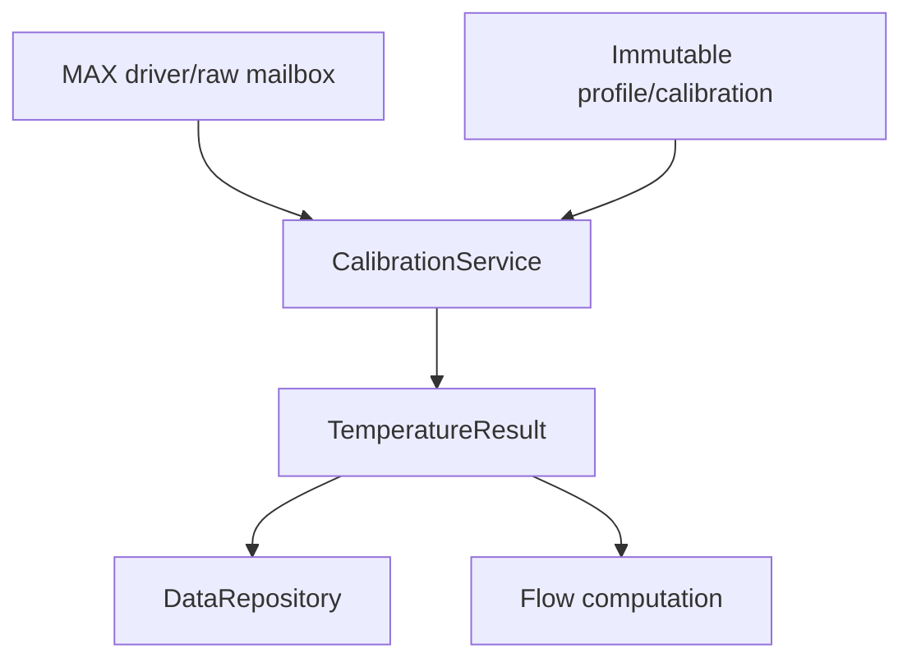
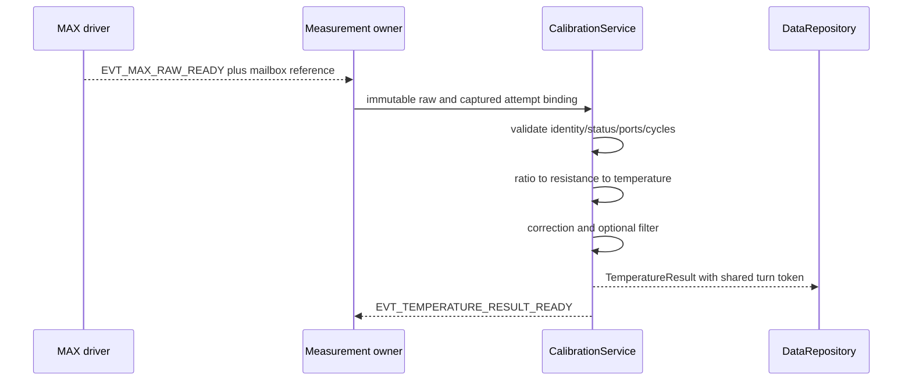

# Temperature Calibration

## 1. Mục đích

Tài liệu này định nghĩa firmware contract để chuyển raw temperature timing từ MAX35103 thành `TemperatureResult` có đơn vị milli-degree Celsius (`m°C`), quality evidence, metadata và active-binding reference đầy đủ.

Pipeline canonical:

```text
immutable MAX raw temperature timing
  -> structural/evidence validation
  -> probe/reference timing ratio
  -> corrected RTD resistance
  -> resistance-to-temperature conversion
  -> per-device temperature calibration
  -> optional bounded filter
  -> quality/acceptance decision
  -> immutable TemperatureResult publication
```

Tài liệu đóng băng:

- ownership giữa MAX driver, measurement owner, `CalibrationService`, profile owner và repository;
- raw-to-resistance và resistance-to-temperature numeric boundary;
- profile/calibration schema ở logical level;
- validation order, rounding, overflow và no-extrapolation rules;
- purpose/origin/provenance/binding propagation;
- filter-state, duplicate, stale, reset và profile-replacement behavior;
- Linux simulator, STM32 và golden-vector equivalence requirements;
- acceptance gate trước khi temperature được dùng để bù flow hoặc tạo production side effect gián tiếp.

Tài liệu không đóng băng giá trị `R_REF`, RTD type, port mapping, lead resistance, filter constant hoặc calibration coefficients cho product variant đầu tiên. Các giá trị đó phải đến từ qualified profile/evidence và còn `NEEDS_VERIFICATION` cho tới khi hardware/BOM/metrology được xác nhận.

---

## 2. Phạm vi

### 2.1. Trong phạm vi

- Input `Max35103RawTemperatureSample` hoặc temperature member của `Max35103RawEventResult`.
- Coherent port-set và cycle-count validation.
- Short/open/sentinel/reference-channel classification.
- Fixed-point timing join và ratiometric conversion.
- Reference resistor, channel/path và lead correction.
- Versioned RTD resistance-to-temperature lookup/interpolation.
- Per-device linear hoặc piecewise residual temperature correction.
- Optional deterministic temperature filter.
- Water/body/ambient source-role binding.
- `TemperatureResult` construction và publication.
- Temperature quality flags, validity, freshness và production acceptance.
- Pairing evidence được cung cấp cho flow computation.
- Profile/config/calibration safe apply.
- Deterministic Linux fixtures, cross-platform golden vectors và release gate.

### 2.2. Operational contexts

Contract áp dụng cho:

- boot self-check;
- normal production measurement;
- authorized service measurement;
- calibration session;
- diagnostic measurement;
- recovery verification;
- Linux simulated device;
- replayed raw fixture;
- STM32 live device.

`MeasurementPurpose`, `DataOrigin` và `DataProvenance` phải được capture từ attempt/raw context và giữ nguyên. `CalibrationService` không được đổi service/simulated/replayed evidence thành production/live evidence.

### 2.3. First implementation slice

Slice đầu tiên MUST hỗ trợ:

1. Một water-temperature RTD channel và một reference channel từ cùng coherent MAX result.
2. Profile-driven port mapping.
3. `uint32_t` Q16 timing join và widened ratio arithmetic.
4. Reference resistance + gain/offset path correction.
5. Strictly monotonic resistance/temperature lookup table với linear interpolation.
6. Linear per-device temperature gain/offset; piecewise residual MAY deferred.
7. Filter `NONE`; first-order filter MAY được thêm khi đã có characterized constants.
8. Explicit invalid/unavailable result, không numeric sentinel.
9. Exact metadata/binding propagation.
10. Linux golden vectors cho valid, boundary, invalid reference, short, open, duplicate, stale generation và simulated origin.

---

## 3. Source-of-truth và tài liệu liên quan

### 3.1. Thứ tự ưu tiên

Khi có mâu thuẫn:

1. Frozen decision và common data/ownership contract.
2. `01_firmware_architecture.md` cho layer/source tree.
3. `10_measurement_cycle.md` cho attempt, event, generation và publication lifecycle.
4. `11_max35103_integration.md` cho raw timing/status/port evidence.
5. Tài liệu này cho temperature processing/calibration behavior.
6. `16_sensor_profile_and_variant.md` cho binding/version/apply.
7. Product profile và qualified calibration artifacts cho numeric values.
8. Datasheet/reference notes cho component encoding.
9. Current code.

Không sửa algorithm để phù hợp một fixture không có traceable profile. Fixture phải được sửa hoặc conflict phải được đánh dấu.

### 3.2. Upstream contract

Upstream MAX driver chịu trách nhiệm:

- coherent SPI/result read;
- exact integer/fraction words;
- measured port mask;
- requested/valid cycle counts;
- status/sentinel/device validity evidence;
- attempt/correlation/source generation;
- sample/completion time;
- immutable mailbox/version publication.

MAX driver không convert timing thành resistance hoặc temperature.

### 3.3. Downstream contract

Downstream flow computation nhận immutable `TemperatureResult` và pairing identity/time. Nó không:

- đọc MAX register/raw buffer;
- tự áp dụng RTD calibration;
- sửa temperature metadata;
- dùng invalid/stale/non-water temperature như fresh water temperature;
- suy `origin`, `purpose` hoặc binding từ build type.

---

## 4. Requirement/decision được hiện thực

### 4.1. Firmware requirements

| Requirement | Nội dung |
|---|---|
| `FW-TEMP-REQ-001` | Chỉ `CalibrationService`/temperature processing owner tạo canonical `TemperatureResult`. |
| `FW-TEMP-REQ-002` | Driver giữ raw timing, không convert sang engineering temperature. |
| `FW-TEMP-REQ-003` | Probe/reference timing phải thuộc cùng coherent acquisition set. |
| `FW-TEMP-REQ-004` | Required ports, sentinel, status và valid cycle count được kiểm tra trước division. |
| `FW-TEMP-REQ-005` | Zero raw timing không bao giờ có nghĩa `0 °C`. |
| `FW-TEMP-REQ-006` | Timing integer/fraction được join chính xác trước ratio; không premature rounding. |
| `FW-TEMP-REQ-007` | Reference resistance và port mapping đến từ active qualified profile. |
| `FW-TEMP-REQ-008` | Lead/path correction không được giả định bằng zero nếu chưa có evidence. |
| `FW-TEMP-REQ-009` | RTD coefficients/table là versioned artifact, không hard-code rải rác. |
| `FW-TEMP-REQ-010` | Table knots strictly monotonic và không silent extrapolation. |
| `FW-TEMP-REQ-011` | Intermediate arithmetic có overflow/range guard và deterministic rounding. |
| `FW-TEMP-REQ-012` | Canonical output unit là signed `m°C`; invalidity nằm trong metadata. |
| `FW-TEMP-REQ-013` | Calibration/profile replacement chỉ active tại safe boundary và increment binding/calibration generation/version phù hợp. |
| `FW-TEMP-REQ-014` | Attempt dùng immutable captured profile/calibration reference; không đọc lại active binding giữa pipeline. |
| `FW-TEMP-REQ-015` | Purpose, origin, provenance, source generation và binding được giữ nguyên. |
| `FW-TEMP-REQ-016` | Simulated/replayed/service/calibration temperature không được nâng thành production-accepted result. |
| `FW-TEMP-REQ-017` | Duplicate/out-of-order/stale source result không update filter/result/product state hai lần. |
| `FW-TEMP-REQ-018` | Filter là optional, deterministic, bounded và reset khi history incompatible. |
| `FW-TEMP-REQ-019` | Sample time không bị thay bằng processing/publish time. |
| `FW-TEMP-REQ-020` | Flow pairing dùng sequence/time/source-role evidence và explicit maximum age. |
| `FW-TEMP-REQ-021` | Publication dùng immutable object/version, không pointer tới reusable driver buffer. |
| `FW-TEMP-REQ-022` | Cùng profile/raw vector tạo equivalent result/flags trên Linux và STM32. |
| `FW-TEMP-REQ-023` | Numeric constants cho production phải có profile identity, range và qualification evidence. |
| `FW-TEMP-REQ-024` | Không update filter/adaptive state từ invalid, duplicate hoặc non-current generation. |
| `FW-TEMP-REQ-025` | Processing phải bounded, không allocation động, I/O, busy-wait hoặc retry. |
| `FW-TEMP-REQ-026` | Temperature failure không được tạo valid zero hoặc tự clear unrelated flow/leak state. |
| `FW-TEMP-REQ-027` | Default/identity calibration phải có explicit provenance/quality policy; không giả là factory-calibrated. |
| `FW-TEMP-REQ-028` | Result acceptance phải kiểm tra current binding/config/calibration/source generation. |
| `FW-TEMP-REQ-029` | Raw/result trace phải đủ identity để replay và audit. |
| `FW-TEMP-REQ-030` | Production release bị block nếu RTD topology/reference/profile/metrology bounds chưa qualified. |

### 4.2. Decision binding

- Portable processing không phụ thuộc Linux hoặc STM32 HAL.
- Raw acquisition, temperature calibration và flow computation là ba ownership domain riêng.
- Một source event có thể tạo temperature và flow consequences nhưng dùng shared `SourceEventToken` và tối đa một final snapshot trong turn.
- Product profile quyết định physical mapping; runtime config chỉ thay allowlisted operational fields.
- Non-production/simulated data vẫn chạy cùng algorithm path nhưng không tạo production side effect.

---

## 5. Trách nhiệm

### 5.1. Ownership matrix

| Object/resource | Single writer | Consumer |
|---|---|---|
| MAX temperature raw mailbox | MAX driver | Measurement owner, `CalibrationService` |
| Measurement attempt context | Measurement owner | Driver, calibration, result owner |
| Temperature profile registry | Variant/profile owner | Validator, calibration service |
| Active temperature binding | Active-binding owner | Measurement/calibration services |
| Per-device temperature calibration | Calibration/config owner | Calibration service |
| Temperature filter state | `CalibrationService` instance | Diagnostics via immutable snapshot |
| `TemperatureResult` | `CalibrationService` | Repository, flow computation, health/telemetry |
| Result history/snapshot | `DataRepository` | Consumers |

### 5.2. `CalibrationService`

`CalibrationService` chịu trách nhiệm:

- validate raw/current attempt/binding;
- select profile and calibration captured by attempt;
- convert raw timing to corrected resistance and temperature;
- classify blocking/advisory quality;
- update compatible filter state exactly once;
- create immutable `TemperatureResult`;
- post `EVT_TEMPERATURE_RESULT_READY` with stable object reference/version;
- expose diagnostics without mutable state pointer.

### 5.3. Measurement owner

Measurement owner chịu trách nhiệm admission, purpose, attempt/correlation IDs, source generation, active binding capture và raw mailbox handoff. Nó không sửa result numeric value.

### 5.4. Profile/calibration owner

Owner chịu trách nhiệm decode, integrity, compatibility, qualification status, safe apply và generation/version update. `CalibrationService` chỉ đọc immutable captured view.

### 5.5. Consumer

Consumer phải đọc metadata trước numeric value. Flow computation chỉ dùng source role water-coupled và pairing policy hợp lệ.

---

## 6. Ngoài phạm vi

- MAX SPI/register/IRQ state machine.
- TOF signal validation và flow computation.
- Acoustic sound-speed/geometry model.
- Factory calibration procedure/UI/tool protocol.
- Exact persistent binary encoding/CRC algorithm.
- Board temperature hoặc MCU internal sensor driver.
- Analog thermal model của probe/water/meter body.
- Metrology qualification limits chưa được product requirement chốt.
- Billing/legal metrology certification.
- Display rounding và external wire serialization.

---

## 7. Interface và dependency

### 7.1. Dependency direction



`CalibrationService` phụ thuộc domain types và pure numeric utilities; không phụ thuộc platform backend, repository internals hoặc simulator peer.

### 7.2. Source identity and role

```c
typedef enum {
    TEMPERATURE_SOURCE_WATER,
    TEMPERATURE_SOURCE_METER_BODY,
    TEMPERATURE_SOURCE_AMBIENT,
    TEMPERATURE_SOURCE_REFERENCE_ONLY
} TemperatureSourceRole;

typedef struct {
    uint32_t source_id;
    TemperatureSourceRole role;
    uint8_t probe_port;
    uint8_t reference_port;
} TemperatureChannelBinding;
```

Exact public placement thuộc canonical source tree. `source_id` phải stable trong selected variant; không dùng array index/pointer address làm persistent identity.

### 7.3. Logical processing API

Tách pure conversion khỏi stateful publication:

```c
typedef enum {
    TEMPERATURE_PROCESS_OK,
    TEMPERATURE_PROCESS_INVALID_SAMPLE,
    TEMPERATURE_PROCESS_STALE_SAMPLE,
    TEMPERATURE_PROCESS_PROFILE_ERROR,
    TEMPERATURE_PROCESS_NUMERIC_ERROR,
    TEMPERATURE_PROCESS_INTERNAL_ERROR
} TemperatureProcessStatus;

TemperatureProcessStatus temperature_convert_raw(
    const Max35103RawTemperatureSample *raw,
    const MeasurementAttemptContext *attempt,
    const TemperatureCalibrationProfile *profile,
    const TemperatureCalibrationRecord *calibration,
    TemperatureCandidate *candidate);

TemperatureProcessStatus calibration_service_accept_candidate(
    CalibrationService *service,
    const TemperatureCandidate *candidate,
    SourceEventToken *turn_token,
    TemperatureResultReference *published_reference);
```

Exact API/file name MAY khác, nhưng pure/stateful boundary và semantics phải tương đương.

### 7.4. Input contract

Input chỉ được process khi:

- mailbox reference/version còn hợp lệ;
- raw object immutable/coherent;
- attempt/correlation/source generation current;
- raw `operation` khớp attempt;
- required port mask đầy đủ;
- captured binding/profile/calibration compatible;
- input chưa được terminal-process trước đó.

### 7.5. Internal candidate

```c
typedef struct {
    uint32_t source_id;
    TemperatureSourceRole source_role;
    int64_t resistance_uohm;
    int32_t unfiltered_temperature_mdeg_c;
    uint32_t processing_flags;
    ResultMetadata meta;
} TemperatureCandidate;
```

Candidate không phải public authoritative result. Nó có lifetime bounded trong service turn hoặc immutable mailbox nếu pipeline tách asynchronous stage.

### 7.6. Publication contract

```text
CalibrationService writes immutable result slot
  -> assigns result_version
  -> posts EVT_TEMPERATURE_RESULT_READY with ID/version
  -> DataRepository/flow consumer copies or claims const view
  -> slot release follows explicit acknowledgement/lifetime contract
```

Event không mang pointer tới stack, filter state hoặc reusable MAX buffer.

### 7.7. Event binding

| Event | Producer | Consumer | Meaning |
|---|---|---|---|
| `EVT_MAX_RAW_READY` | MAX driver | Measurement/calibration pipeline | Coherent raw mailbox ready; chưa phải temperature result |
| `EVT_FLOW_PROCESSING_COMPLETED` | Processing owner | Pipeline coordinator | Optional internal combined pipeline completion |
| `EVT_TEMPERATURE_RESULT_READY` | `CalibrationService` | Repository/flow/health | Immutable canonical temperature result ready |
| `EVT_MEASUREMENT_STATUS_CHANGED` | Measurement/calibration owner | Health/repository | Temperature stream readiness/quality changed |

Không tạo thêm `EVT_TEMPERATURE_CALIBRATED` nếu `EVT_TEMPERATURE_RESULT_READY` đã là terminal owner publication.

### 7.8. Source-tree mapping

Exact tree thuộc `01_firmware_architecture.md` section 17.1. Logical mapping:

```text
domain/measurement                 -> public temperature/profile/result types
services/measurement/calibration  -> CalibrationService and state
algorithms/temperature            -> pure raw/resistance/temperature functions
config/variants                   -> qualified temperature profiles/tables
tests/unit                        -> numeric/profile/filter tests
tests/integration                 -> MAX raw-to-result tests
tests/system                      -> scenario/golden tests
```

Không tạo Linux-only copy của algorithm.

---

## 8. Data model và đơn vị

### 8.1. Raw timing join

Mỗi MAX port gồm integer/fraction 16-bit cùng scale:

$$
N = I\cdot 2^{16} + F
$$

```c
static inline uint32_t temperature_join_time_q16(
    uint16_t integer_word,
    uint16_t fraction_word)
{
    return ((uint32_t)integer_word << 16) |
           (uint32_t)fraction_word;
}
```

Raw temperature timing là nonnegative. Short/open/error sentinel được driver/service kiểm tra trước numeric conversion; zero timing không phải zero Celsius.

### 8.2. Timing ratio

Với probe/reference trong cùng coherent measurement set:

$$
r = \frac{N_{probe}}{N_{ref}}
$$

Clock scale triệt tiêu nếu hai port dùng cùng valid timing basis. Không dùng ratio nếu reference bằng zero, sentinel, missing, incompatible averaging context hoặc invalid cycle evidence.

Không bắt buộc materialize ratio dạng float. Baseline integer resistance calculation:

$$
R_{meas,\mu\Omega}=
\operatorname{round}\left(
\frac{N_{probe}\cdot R_{ref,\mu\Omega}}{N_{ref}}
\right)
$$

Multiplication dùng widened intermediate đủ chứng minh không overflow. Nếu compiler/platform không có native wider type, dùng checked decomposition hoặc fixed-point helper đã được golden-test; không silently saturate.

### 8.3. Reference and path correction

Canonical correction:

$$
R_{path,\mu\Omega}=
\operatorname{round}\left(
R_{meas,\mu\Omega}\cdot G_R
\right)+O_{R,\mu\Omega}
$$

Trong đó:

- `reference_resistance_uohm` là measured/qualified value;
- `G_R` là dimensionless versioned fixed-point gain;
- `O_R` chứa characterized channel/lead/path residual;
- identity correction là gain 1 và offset 0 nhưng vẫn phải có qualification/default policy.

Hai-wire lead resistance không mặc định bằng zero.

### 8.4. RTD curve table

Baseline production approach là versioned monotonic lookup table:

```c
typedef struct {
    int64_t resistance_uohm;
    int32_t temperature_mdeg_c;
} TemperatureCurveKnot;
```

Với hai knots bao quanh resistance:

$$
T=T_i+
\frac{(R-R_i)(T_{i+1}-T_i)}{R_{i+1}-R_i}
$$

Rules:

- ít nhất hai knots;
- resistance strictly increasing;
- temperature strictly increasing cho supported RTD profile;
- denominator positive;
- multiplication/division checked;
- deterministic rounding mode;
- exact endpoint accepted;
- outside range không silent extrapolation;
- table integrity/version/qualification validated trước active.

Analytic Callendar–Van Dusen inversion MAY được dùng trong tooling/reference oracle. Runtime analytic implementation chỉ thay table khi có error/runtime proof và cùng golden contract.

### 8.5. Temperature calibration correction

Linear correction:

$$
T_{linear}=\operatorname{round}(G_T T_{rtd})+O_T
$$

Optional piecewise residual correction:

$$
T_{cal}=T_{linear}+C(T_{linear})
$$

Correction knots phải ordered, bounded, continuous theo declared tolerance và không tạo nonphysical local reversal trong qualified domain.

### 8.6. Rounding policy

Baseline logical policy:

- ratio/resistance division: round-to-nearest, ties-away-from-zero cho signed helper hoặc equivalent explicitly tested policy;
- interpolation: một lần tại final `m°C` boundary;
- negative operands phải có test riêng vì C integer division truncates toward zero;
- không round từng raw port trước ratio;
- no implicit float-to-int conversion.

Exact helper names và chosen tie rule phải được freeze trong public numeric utility tests trước production qualification.

### 8.7. Canonical units

| Quantity | Unit | Recommended representation |
|---|---|---|
| MAX raw port timing | Q16 clock counts | `uint32_t` joined |
| Reference/corrected resistance | micro-ohm (`uΩ`) intermediate | `int64_t` |
| Diagnostic resistance | milli-ohm (`mΩ`) if exposed | checked integer |
| Temperature | milli-degree Celsius (`m°C`) | `int32_t` |
| Gain | dimensionless fixed point | versioned Q format |
| Offset | `uΩ` or `m°C` | signed fixed-width |
| Monotonic time | microsecond (`us`) | `uint64_t` |
| Version/generation | dimensionless | fixed-width unsigned |

Persistence/wire encoding không serialize C padding.

### 8.8. Calibration profile

Logical profile:

```c
typedef enum {
    TEMPERATURE_FILTER_NONE,
    TEMPERATURE_FILTER_FIRST_ORDER
} TemperatureFilterMode;

typedef enum {
    TEMPERATURE_EXTRAPOLATION_REJECT,
    TEMPERATURE_EXTRAPOLATION_CLAMP_DEGRADED
} TemperatureExtrapolationPolicy;

typedef struct {
    uint32_t profile_id;
    uint32_t schema_version;
    uint32_t profile_version;
    uint32_t compatible_max_profile_id;
    uint32_t compatible_curve_id;

    TemperatureChannelBinding channel;
    int64_t reference_resistance_uohm;
    int32_t resistance_gain_q30;
    int64_t resistance_offset_uohm;

    const TemperatureCurveKnot *curve_knots;
    uint16_t curve_knot_count;
    TemperatureExtrapolationPolicy extrapolation_policy;

    int32_t temperature_gain_q30;
    int32_t temperature_offset_mdeg_c;
    const TemperatureCorrectionKnot *correction_knots;
    uint16_t correction_knot_count;

    int32_t physical_min_mdeg_c;
    int32_t physical_max_mdeg_c;
    int32_t expected_min_mdeg_c;
    int32_t expected_max_mdeg_c;
    int64_t ratio_min_q31;
    int64_t ratio_max_q31;
    uint8_t minimum_valid_cycle_count;

    TemperatureFilterMode filter_mode;
    uint32_t filter_time_constant_us;
    uint32_t filter_reset_gap_us;
    uint64_t maximum_pairing_age_us;
    uint64_t maximum_hold_age_us;

    uint32_t qualification_reference_id;
    uint32_t content_integrity;
} TemperatureCalibrationProfile;
```

Đây là logical contract; compiled/persistent layout MAY dùng offsets/IDs thay pointer.

### 8.9. Per-device calibration record

Record tối thiểu:

```text
record/schema/version
device/board/probe identity
compatible variant/profile/binding IDs
reference resistor measured value and uncertainty
resistance gain/offset
temperature gain/offset
optional residual knots
qualified min/max range
reference instrument/fixture identity
calibration timestamp and operator/tool evidence reference
integrity/CRC
```

Unknown schema, bad integrity, identity mismatch hoặc incompatible binding không được active.

### 8.10. Result metadata and flags

Canonical public result giữ common structure:

```c
typedef struct {
    ResultMetadata meta;
    int32_t temperature_mdeg_c;
    uint32_t processing_flags;
} TemperatureResult;
```

Proposed symbolic flags:

```text
TEMP_PROC_PORT_MISSING
TEMP_PROC_REFERENCE_INVALID
TEMP_PROC_PROBE_SHORT
TEMP_PROC_PROBE_OPEN
TEMP_PROC_DEVICE_ERROR
TEMP_PROC_CYCLE_COUNT_INSUFFICIENT
TEMP_PROC_RATIO_OUT_OF_RANGE
TEMP_PROC_RESISTANCE_OUT_OF_RANGE
TEMP_PROC_TEMPERATURE_OUT_OF_PHYSICAL_RANGE
TEMP_PROC_TEMPERATURE_OUT_OF_EXPECTED_RANGE
TEMP_PROC_PROFILE_INVALID
TEMP_PROC_CALIBRATION_INVALID
TEMP_PROC_CALIBRATION_DEFAULTED
TEMP_PROC_EXTRAPOLATION_CLAMPED
TEMP_PROC_FILTER_REINITIALIZED
TEMP_PROC_RATE_IMPLAUSIBLE
TEMP_PROC_DUPLICATE
TEMP_PROC_OUT_OF_ORDER
TEMP_PROC_STALE_GENERATION
TEMP_PROC_BINDING_MISMATCH
TEMP_PROC_NUMERIC_OVERFLOW
TEMP_PROC_SAMPLE_TIME_ESTIMATED
```

Bit values thuộc versioned public header. Blocking/advisory class phải có central table/test; consumer không tự đoán từ bit position.

### 8.11. Validity, freshness and acceptance

`DATA_VALID` yêu cầu acquisition, profile, calibration và numeric conversion không có blocking condition.

`DATA_ACCEPTED` cho production còn yêu cầu:

```text
purpose == MEAS_PURPOSE_PRODUCTION
origin == DATA_ORIGIN_LIVE_DEVICE
provenance == PROVENANCE_MEASURED
source_generation is current
binding/config/calibration are current and compatible
source role is allowed by consumer
freshness == DATA_FRESH
no blocking processing flag
```

Defaulted/clamped/held policy có thể tạo diagnostic/degraded result nhưng không tự động đủ điều kiện production metrology.

---

## 9. State machine hoặc sequence

### 9.1. Service state

```text
UNINITIALIZED
READY
PROCESSING
PUBLISH_PENDING
DEGRADED
PROFILE_APPLY_PENDING
QUIESCED
```

Pure numeric functions không giữ state. State trên thuộc service/filter/publication lifecycle.

### 9.2. Processing sequence



### 9.3. Validation order

Order bắt buộc:

1. Event/mailbox object ID/version/lifetime.
2. Attempt/correlation/source generation/current terminal state.
3. Binding/config/calibration compatibility.
4. Transport/device/raw coherency.
5. Required port mask.
6. Sentinel/short/open/status.
7. Requested/valid cycle count.
8. Probe/reference raw range và nonzero denominator.
9. Ratio plausibility.
10. Corrected resistance range.
11. Table/profile integrity and bracket lookup.
12. Temperature physical/expected range.
13. Calibration correction bounds.
14. Duplicate/out-of-order/filter-history compatibility.
15. Result metadata/freshness/acceptance.

Không reorder sentinel/division hoặc profile/apply checks để tiết kiệm branch.

### 9.4. Valid sample

```text
current coherent raw
  -> valid reference/probe/cycles
  -> checked numeric conversion
  -> calibrated candidate
  -> update compatible filter once
  -> assign result version
  -> publish immutable result/event
  -> repository final snapshot at turn end
```

### 9.5. Invalid sample

```text
blocking condition
  -> do not update filter/adaptive state
  -> do not fabricate zero/default measurement
  -> publish invalid/unavailable latest result if repository policy requires
  -> preserve last-known numeric only with invalid/stale metadata
  -> update health/diagnostic counters once
```

### 9.6. Duplicate or out-of-order

- Same source generation + sample sequence already processed: reject as duplicate.
- Lower/out-of-order sequence: reject from live stateful path.
- Duplicate does not increment result version unless policy publishes a diagnostic event; it never updates filter twice.
- Wrap handling follows common sequence policy; raw unsigned `<` is insufficient at wrap boundary.

### 9.7. Profile/calibration replacement

```text
validate candidate artifact
  -> commit/verify if persistent
  -> request measurement safe boundary
  -> quiesce/finish current attempt
  -> atomically replace active binding/calibration
  -> increment binding generation and calibration version/generation
  -> reset incompatible filter/last-processed identity
  -> require fresh functional verification sample
  -> resume production admission
```

Old attempt/result giữ old versions; chúng không bị retroactively relabeled.

### 9.8. Recovery

Temperature numeric/profile failure không reset MAX hardware nếu raw acquisition vẫn structurally valid. Owner phân tầng:

- SPI/device/sentinel/repeated port fault: MAX/measurement owner recovery.
- Profile/calibration incompatibility: config/calibration owner.
- Numeric invariant: calibration service invariant fault.
- Stale/duplicate: reject/diagnose, không device reset.

---

## 10. Timing, timeout và non-blocking behavior

### 10.1. Time fields

- `sample_monotonic_us`: best acquisition-time evidence từ raw/attempt.
- `completion_monotonic_us`: result processing/publication completion.
- `wall_time_s`: optional external timestamp khi `TimeQuality` valid.
- Processing không thay sample time bằng IRQ/read/publish time.

Nếu exact sample position trong combined MAX sequence chưa biết, dùng documented representative time kèm `TEMP_PROC_SAMPLE_TIME_ESTIMATED`.

### 10.2. Freshness

Generic freshness:

```text
age_us = now_monotonic_us - sample_monotonic_us
age_us < maximum_age_us  -> DATA_FRESH
age_us >= maximum_age_us -> DATA_STALE
```

Flow pairing age có thể chặt hơn repository freshness.

### 10.3. Flow pairing

Baseline causal rule:

```text
temperature is valid
AND source role == TEMPERATURE_SOURCE_WATER
AND binding/source generation compatible with flow attempt
AND temperature.sample_time <= flow.sample_time + sync_tolerance
AND absolute age <= maximum_pairing_age_us
AND no blocking quality flag
```

Runtime không đợi future temperature để retroactively đổi flow đã publish.

### 10.4. Optional first-order filter

Nếu enabled, filter dùng actual monotonic `dt`, deterministic fixed-point và declared discretization. State update rules:

```text
first compatible valid sample -> initialize
valid current sample          -> update once
invalid/duplicate/stale       -> no update
gap >= filter_reset_gap_us    -> reinitialize and flag
binding/calibration change    -> reset
```

Exact coefficient derivation, Q format và error bound phải có golden proof. Cho tới khi thermal/noise characterization hoàn thành, production baseline là `TEMPERATURE_FILTER_NONE`.

### 10.5. Work bound

- Lookup SHOULD dùng bounded binary search hoặc small fixed-count scan với documented maximum knots.
- No dynamic allocation.
- No I/O/storage wait.
- No retry loop.
- No unbounded iterative RTD inversion.
- Maximum knot counts và processing time có build/profile validation.

### 10.6. Wall-clock changes

Wall-clock jump/invalid không thay sequence, filter `dt`, freshness, timeout hoặc pairing. Monotonic time là authority.

---

## 11. Configuration

### 11.1. Configuration layers

| Layer | Examples | Mutability |
|---|---|---|
| Product variant | RTD topology/type, port mapping, supported range | Build/qualified immutable |
| MAX profile | Port cycles/event timing/raw behavior | Qualified profile |
| Temperature profile | Reference/curve/bounds/filter policy | Qualified profile |
| Per-device calibration | Measured reference/path/temp correction | Authorized calibrated persistent record |
| Runtime config | Allowlisted cadence/diagnostic/filter selection within bounds | Transactional |

### 11.2. Validator

Validator MUST kiểm tra:

- schema/version/integrity;
- stable IDs và active-binding compatibility;
- valid/unique probe/reference ports;
- reference resistance positive và within qualified bounds;
- Q-format gain representable;
- resistance/temperature bounds ordered;
- curve knot count/capacity;
- curve monotonicity;
- correction knot order/continuity/bounds;
- extrapolation policy supported;
- filter bounds/capacity;
- calibration identity/serial/profile compatibility;
- qualification status.

### 11.3. Runtime allowlist

Runtime MAY select only prequalified options/bounds, ví dụ:

- filter disabled hoặc qualified filter profile;
- maximum pairing/hold age trong product bound;
- advisory expected range trong immutable physical range;
- diagnostic verbosity.

Runtime MUST NOT thay arbitrary port mapping, RTD curve, reference resistor, physical range, calibration identity hoặc qualification status.

### 11.4. Safe apply

Apply result là `APPLIED`, `DEFERRED` hoặc `REJECTED`. Apply không xảy ra giữa active measurement attempt/processing turn. Deferred apply có bounded monotonic timeout và explicit reason.

### 11.5. Default behavior

- Missing required calibration không tự tạo measured production result.
- Qualified identity/default calibration chỉ dùng khi product policy cho phép và phải có `TEMP_PROC_CALIBRATION_DEFAULTED`/provenance phù hợp.
- Unknown future schema bị reject, không parse best-effort.

---

## 12. Error detection và recovery

### 12.1. Error taxonomy

| Class | Examples | Owner/outcome |
|---|---|---|
| Input identity | stale generation, wrong correlation, duplicate | Measurement/calibration reject |
| Acquisition | SPI/device/short/open/cycle count | MAX/measurement owner recovery |
| Binding | profile/calibration mismatch, unknown schema | Profile owner; readiness blocked |
| Numeric | overflow, denominator zero, nonmonotonic table | Calibration invariant/profile reject |
| Physical quality | outside physical/expected range | Invalid or degraded per class |
| Temporal | stale sample, pairing age exceeded | Consumer rejects/holds per explicit policy |
| Publication | mailbox/queue capacity failure | Event/repository policy and diagnostics |

### 12.2. Blocking versus advisory

Blocking examples:

- invalid reference/probe/sentinel;
- insufficient required cycles;
- incompatible profile/binding;
- division/overflow/table failure;
- outside physical calibrated domain;
- stale generation.

Advisory/degraded examples chỉ khi profile policy cho phép:

- outside expected but inside physical range;
- filter reinitialized;
- sample time estimated;
- boundary clamp explicitly qualified;
- defaulted calibration explicitly permitted.

### 12.3. No fabricated success

- No valid zero on error.
- No reuse of last valid sample with new sample sequence/timestamp.
- Held value, nếu policy cho phép, giữ original sample identity/time và explicit held/degraded evidence.
- Default temperature không được gắn fresh/measured provenance.

### 12.4. Escalation

Single invalid temperature sample thường làm stream degraded/invalid; repeated threshold thuộc measurement health policy. Temperature failure không tự reset whole system hoặc stop independent pressure path. Flow behavior theo `14_flow_computation.md` compensation policy.

### 12.5. Diagnostic counters

Ít nhất:

```text
raw_samples_seen
results_published
invalid_reference_count
probe_short_count
probe_open_count
cycle_insufficient_count
ratio_range_count
profile_error_count
calibration_error_count
numeric_error_count
duplicate_count
out_of_order_count
stale_generation_count
filter_reset_count
publication_failure_count
```

Counter update exactly once per terminal input outcome.

---

## 13. Linux simulation mapping

### 13.1. Reuse boundary

Linux chạy cùng pure algorithm, profile validator, `CalibrationService`, result owner và repository code. Linux-only code chỉ cung cấp virtual time, MAX peer/raw evidence, fixtures, fault injection và observation.

### 13.2. Fixture schema

Fixture tối thiểu:

```json
{
  "fixture_id": "temp-ratio-nominal-001",
  "fixture_version": 1,
  "origin": "simulated-device",
  "profile_ref": {"id": 201, "version": 1},
  "calibration_ref": {"id": 301, "version": 1},
  "probe_port": 1,
  "reference_port": 3,
  "probe_time": {"integer": 100, "fraction": 0},
  "reference_time": {"integer": 100, "fraction": 0},
  "valid_cycle_count": 4,
  "requested_cycle_count": 4,
  "expected": {
    "validity": "valid",
    "origin": "simulated-device"
  }
}
```

Numeric values chỉ là fixture minh họa; production golden phải trace về curve/profile/reference evidence.

### 13.3. Required deterministic vectors

- ratio below/at/inside/at/above qualified range;
- denominator zero;
- probe short/open/all-ones sentinel;
- missing probe/reference port;
- zero/partial/full valid cycles;
- resistance table min/max and each interpolation boundary;
- negative/zero/positive Celsius;
- rounding ties và negative correction;
- gain/offset overflow boundaries;
- nonmonotonic/bad-integrity profile reject;
- calibration identity mismatch;
- duplicate/out-of-order sequence;
- stale source/binding generation;
- profile replacement/filter reset;
- simulated/replayed origin propagation;
- service/calibration purpose isolation;
- one source turn with temperature + flow consequences and one final snapshot.

### 13.4. High-precision oracle

Test tooling MAY dùng high-precision decimal/float hoặc Callendar–Van Dusen reference để generate expected vectors. Runtime result vẫn phải so theo declared `m°C` tolerance và fixed-point rounding. Oracle source/version/hash được lưu cùng golden artifact.

### 13.5. Fault injection boundary

MAX peer inject short/open/status/cycle/raw timing qua device/transport path cho integration/system test. Unit test của pure conversion MAY gọi function trực tiếp. Integration scenario không bypass driver bằng cách post `EVT_TEMPERATURE_RESULT_READY`.

### 13.6. Trace

Normalized trace giữ:

```text
virtual sample/completion time
event/mailbox/result version
attempt/correlation/source generation
profile/calibration/binding IDs and versions
port mask/cycle count/status class
raw joined timing or fixture reference
resistance/temperature stage outcomes
processing flags
purpose/origin/provenance
validity/freshness/acceptance
filter state transition
snapshot version
```

Không đưa pointer address hoặc host floating representation vào golden.

---

## 14. STM32 mapping

### 14.1. Portable implementation

Temperature algorithm không gọi HAL, FPU service, RTOS, SPI, flash hoặc clock trực tiếp. Input/time/profile đã được owner cung cấp.

### 14.2. Integer width

Build phải static-assert field widths và test checked arithmetic. Nếu dùng compiler-specific 128-bit intermediate trên Linux nhưng không có trên STM32 toolchain, phải có portable equivalent và cross-platform vectors; không để hai backend dùng numeric path khác mà không có equivalence proof.

### 14.3. Memory

- Static maximum knot counts.
- No dynamic allocation.
- Table/profile MAY ở read-only flash.
- Per-device record decoded thành bounded immutable active object.
- Filter state fixed-size per configured channel.

### 14.4. Callback/ISR

Không chạy calibration trong ISR/SPI callback. Callback chỉ capture bounded completion evidence/post event. Numeric processing chạy trong event/service context theo budget.

### 14.5. Hardware bring-up

Bring-up phải xác nhận:

1. Physical port-to-probe/reference mapping.
2. RTD topology/type/nominal resistance.
3. Reference resistor measured value/tolerance/tempco.
4. Short/open behavior và raw sentinel.
5. Valid-cycle accumulation.
6. Raw ratio at known resistance/temperature points.
7. Lead/path offset repeatability.
8. Cross-check với traceable thermometer/resistance standard.
9. Temperature step/noise/thermal lag.
10. Linux/STM32 result equivalence for captured raw vectors.

---

## 15. Test và acceptance criteria

### 15.1. Pure numeric unit tests

- Q16 join min/max.
- Checked multiply/divide and denominator zero.
- Ratio/resistance exact and rounding cases.
- Gain/offset signed boundaries.
- Table endpoints/interpolation/negative temperature.
- Outside table policy.
- Linear and optional residual correction.
- Overflow and invalid profile paths.

### 15.2. Profile tests

- Valid profile accepted.
- Missing/duplicate port rejected.
- Probe equals reference port rejected unless explicit supported topology.
- Nonpositive/out-of-bound reference rejected.
- Nonmonotonic/too-small/too-large table rejected.
- Unsupported extrapolation/filter mode rejected.
- MAX/variant/calibration incompatibility rejected.
- Unknown schema/integrity failure rejected.

### 15.3. Raw/result tests

- Coherent valid raw creates expected result.
- Missing port, short, open, invalid reference and cycle count create correct flags.
- Invalid sample never becomes accepted zero.
- Sample time/sequence/source generation preserved.
- Result binding/config/calibration versions match captured attempt.
- Raw/result immutable after publication.

### 15.4. Metadata/provenance tests

```text
production + live + measured + current binding -> eligible for further acceptance checks
production + simulated -> not accepted
production + replayed -> not accepted
service/calibration/diagnostic purpose -> no production side effect
defaulted/estimated provenance -> not silently measured
old binding/source generation -> rejected
```

### 15.5. Filter/state tests

- First valid initializes.
- Invalid/duplicate does not update.
- Out-of-order does not update.
- Long gap resets with flag.
- Profile/calibration/binding replacement resets.
- Same sequence processed twice produces one state/result outcome.

### 15.6. Timing/pairing tests

- Freshness boundary exactly at configured age.
- Flow causal pairing before/within/after tolerance.
- Future temperature not used retroactively.
- Sample time distinct from completion/publish time.
- Wall-clock jump does not affect filter/freshness.

### 15.7. Integration/system tests

- MAX peer raw timing through driver/event loop to result/snapshot.
- Combined MAX event creates coherent temperature/flow turn.
- Short/open/missing INT/late completion/profile mismatch scenarios.
- Reset invalidates old raw/completion.
- Queue pressure does not fabricate or duplicate result.
- Linux deterministic replay produces stable normalized trace.

### 15.8. Cross-platform golden tests

Same raw/profile/calibration vector phải tạo identical hoặc declared-tolerance-equivalent:

- validity/acceptance;
- result `m°C`;
- processing flags;
- metadata/binding;
- filter transition;
- terminal outcome.

### 15.9. Characterization acceptance

Trước production qualification cần evidence:

- reference instrument uncertainty/resolution adequate;
- multi-point temperature coverage gồm endpoints và operating range;
- multiple units/lots nếu product requirement yêu cầu;
- repeatability, hysteresis, thermal lag và self-heating characterized;
- lead/path/reference contribution included in error budget;
- worst-case fixed-point/interpolation/rounding error bounded;
- calibration residual và acceptance threshold documented.

### 15.10. Acceptance criteria

Tài liệu được hiện thực đúng khi:

1. Raw timing đến `TemperatureResult` có một portable owner path duy nhất.
2. Port/reference/profile/calibration/binding identities được validate và trace được.
3. Không có division trước sentinel/reference validation.
4. Không có hard-coded unversioned production RTD/reference/calibration constant.
5. Numeric overflow/rounding/table boundaries có golden tests.
6. Invalid/nonproduction/simulated result không update production side effects.
7. Duplicate/stale/reset/profile-change không update filter/result hai lần.
8. Same vectors đạt Linux/STM32 equivalence.
9. Product profile đầu tiên có metrology/bring-up evidence và không còn critical open issue.
10. Full firmware unit, integration, system và sanitizer/static gates pass.

---

## 16. Traceability

### 16.1. Requirement mapping

| Requirement group | Source |
|---|---|
| `FW-TEMP-REQ-001`–`006` | Measurement ownership; MAX raw contract; temperature principle sections 8–11 |
| `FW-TEMP-REQ-007`–`013` | Temperature principle sections 12–15; profile/binding contract |
| `FW-TEMP-REQ-014`–`021` | Common metadata, measurement cycle, publication and freshness contracts |
| `FW-TEMP-REQ-022`–`030` | Test strategy, Linux simulation, variant qualification and release evidence |

### 16.2. Upstream/downstream mapping

| Artifact/event | Owner/document |
|---|---|
| MAX raw timing/status | `11_max35103_integration.md` |
| Attempt/generation/purpose | `10_measurement_cycle.md` |
| Common metadata/result | `04_data_model_and_ownership.md` |
| Active binding/profile | `16_sensor_profile_and_variant.md` |
| Temperature flow pairing/compensation | `14_flow_computation.md` |
| Factory/multipoint calibration workflow | `15_calibration_algorithm.md` |
| Simulator/golden policy | `92_firmware_test_strategy.md`, `93_linux_simulation_integration.md` |

### 16.3. Suggested implementation mapping

```text
include/domain/temperature_calibration.h
src/algorithms/temperature/temperature_numeric.c
src/algorithms/temperature/temperature_curve.c
src/services/measurement/calibration_service.c
src/config/variants/<variant>/temperature_profile.*
tests/unit/test_temperature_numeric.c
tests/unit/test_temperature_profile.c
tests/unit/test_calibration_service.c
tests/integration/test_max_temperature_pipeline.c
tests/system/scenarios/temperature_*.json
```

Exact paths phải được điều chỉnh theo canonical tree trong architecture document; không tạo root mới chỉ vì mapping gợi ý này.

### 16.4. Suggested test IDs

```text
TC_TEMP_Q16_JOIN
TC_TEMP_REFERENCE_ZERO_REJECTED
TC_TEMP_SHORT_OPEN_REJECTED
TC_TEMP_RATIO_TO_RESISTANCE_GOLDEN
TC_TEMP_CURVE_INTERPOLATION_GOLDEN
TC_TEMP_NEGATIVE_ROUNDING
TC_TEMP_PROFILE_NONMONOTONIC_REJECTED
TC_TEMP_CALIBRATION_BINDING_MISMATCH
TC_TEMP_DUPLICATE_NO_FILTER_UPDATE
TC_TEMP_STALE_GENERATION_REJECTED
TC_TEMP_SIMULATED_NOT_PRODUCTION_ACCEPTED
TC_TEMP_PROFILE_REPLACE_RESETS_HISTORY
TC_TEMP_MAX_PIPELINE_DETERMINISTIC
TC_TEMP_LINUX_STM32_EQUIVALENCE
```

---

## 17. Open issues / NEEDS_VERIFICATION

| ID | Vấn đề | Ảnh hưởng |
|---|---|---|
| `FW-TEMP-OQ-001` | RTD type, nominal resistance, tolerance và physical topology của variant đầu tiên | Curve/profile/accuracy |
| `FW-TEMP-OQ-002` | Exact MAX port mapping cho water/body/reference channels | Binding/driver profile |
| `FW-TEMP-OQ-003` | Measured reference resistor value, tolerance, tempco và board thermal coupling | Ratio-to-resistance error |
| `FW-TEMP-OQ-004` | Lead/path resistance model và repeatability | Calibration schema/error budget |
| `FW-TEMP-OQ-005` | Temperature operating/physical/calibration ranges | Bounds/table coverage |
| `FW-TEMP-OQ-006` | Curve source: standard coefficients, generated table resolution và artifact format | Numeric implementation |
| `FW-TEMP-OQ-007` | Chosen runtime rounding tie rule và portable widened arithmetic helper | Cross-platform equivalence |
| `FW-TEMP-OQ-008` | Maximum table/correction knot counts và RAM/flash budget | Build/resource limits |
| `FW-TEMP-OQ-009` | Có cần multipoint residual correction cho first product variant không | Factory process/schema |
| `FW-TEMP-OQ-010` | Filter mode/time constant/reset gap sau characterization | Noise/latency |
| `FW-TEMP-OQ-011` | Exact sample-time position trong combined MAX EVTMG sequence | Pairing/freshness |
| `FW-TEMP-OQ-012` | Maximum pairing/hold ages và un/held-compensated flow policy | Flow validity |
| `FW-TEMP-OQ-013` | Metrology accuracy/error budget/release threshold | Production qualification |
| `FW-TEMP-OQ-014` | Factory calibration record encoding, CRC, slot size và migration | Persistence/service tooling |
| `FW-TEMP-OQ-015` | Qualification policy cho default identity calibration | Readiness/production acceptance |

Architecture và simulator implementation không bị block bởi numeric TBD nếu fixtures/profile được đánh dấu test-only. Production release của temperature/flow bị block cho tới khi `OQ-001`–`OQ-007`, `OQ-011`–`OQ-013` có evidence và resolution.

---

## 18. Revision history

| Version | Date | Change |
|---|---|---|
| 0.1 | 2026-07-15 | Initial temperature calibration contract; freezes ownership, numeric pipeline, profile/binding, simulator and acceptance boundaries. |
