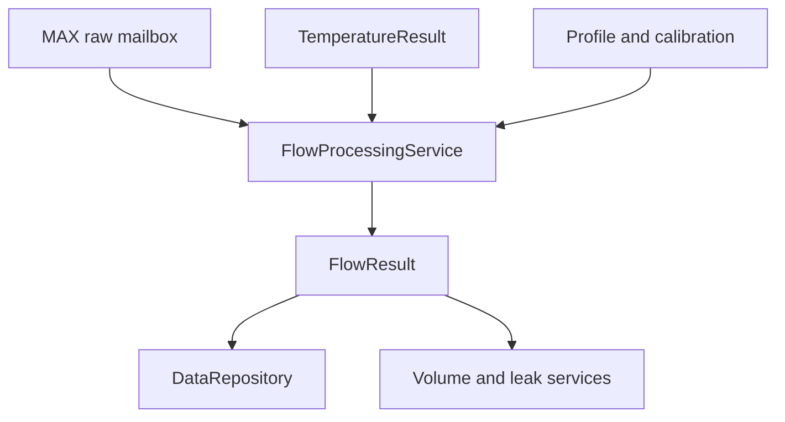
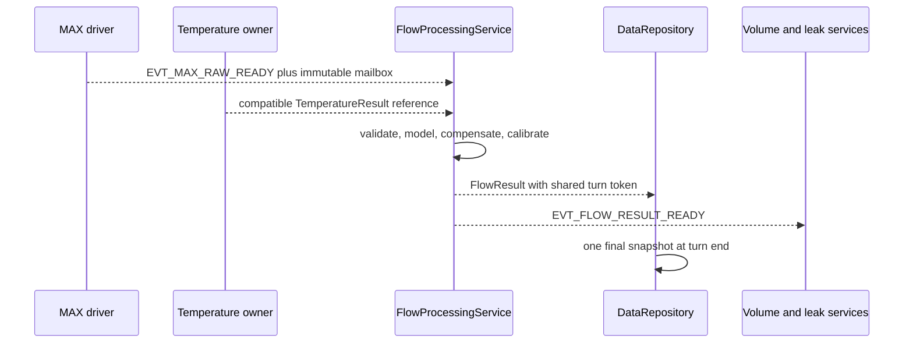

# Flow Computation

## 0. Trạng thái triển khai tại firmware baseline

- Firmware baseline: `4044414a7610d53b24c10814c12eaa09864e949e`
- Implementation status: **IMPLEMENTED ALGORITHM / PARTIAL PRODUCTION BINDING**
- Đã có trong code: FlowService, numeric helpers and flow tests exist.
- Chưa hoàn tất: MAX raw acquisition, temperature pairing and FlowService registration in MeasurementManager/AppComposition are incomplete.
- Quy ước đọc: requirement/contract bên dưới là normative design; trạng thái triển khai được xác định bởi mục 0 và bảng traceability.


## 1. Mục đích

Tài liệu này định nghĩa portable firmware contract để chuyển coherent raw transit-time evidence từ MAX35103 thành canonical signed `FlowResult` có đơn vị microlitre per second (`uL/s`), direction, quality, compensation evidence và common binding metadata đầy đủ.

Pipeline canonical:

```text
immutable MAX raw ToF result
  -> identity/coherency/device-quality validation
  -> calibrated ToF representation
  -> host differential consistency check
  -> project direction normalization
  -> reciprocal-time or qualified model feature
  -> one-domain zero-offset correction
  -> geometry/hydraulic model
  -> temperature compensation
  -> directional multipoint flow calibration
  -> zero deadband/direction classification
  -> optional bounded filter
  -> quality/acceptance decision
  -> immutable FlowResult publication
```

Tài liệu đóng băng:

- ownership giữa MAX driver, `FlowProcessingService`, temperature/calibration/profile owners, repository, volume và leak services;
- validation order và canonical flow sign;
- model, zero-offset, temperature-compensation và calibration stage order;
- fixed-point/widened arithmetic, rounding, overflow và extrapolation rules;
- purpose/origin/provenance/binding propagation;
- duplicate, stale generation, reset, gap, config và calibration replacement behavior;
- Linux simulator/HIL golden-vector equivalence;
- acceptance gate trước khi flow được dùng cho volume, leak, reporting hoặc persistence.

Tài liệu không đóng băng acoustic path, angle, effective area, zero offset, deadband, temperature surface, calibration knots hoặc accuracy class của product variant đầu tiên. Các giá trị đó phải đến từ qualified profile/calibration evidence và còn `NEEDS_VERIFICATION` cho tới khi spool, transducer, wiring, direction và metrology campaign được xác nhận.

---

## 2. Phạm vi

### 2.1. Trong phạm vi

- Input `Max35103RawTofSample` hoặc ToF member của `Max35103RawEventResult`.
- Raw status/cycle/sentinel/range/wave evidence validation.
- Integer/fraction decode và signed differential join.
- Absolute upstream/downstream ToF conversion.
- Host-versus-MAX differential consistency.
- Direction/sign normalization.
- Reciprocal-time baseline model.
- Zero-flow offset in exactly one declared domain.
- Geometry/hydraulic conversion hoặc qualified direct calibration model.
- Temperature-result pairing và compensation mode.
- Forward/reverse multipoint flow calibration.
- Zero deadband and direction classification.
- Optional deterministic filtering with explicit signal ownership.
- `FlowResult` construction/publication.
- Volume/leak consumer boundaries.
- Profile/config/calibration safe apply.
- Linux deterministic fixtures, cross-platform vectors and release gates.

### 2.2. Operational contexts

Contract áp dụng cho:

- boot self-check;
- normal production event-timing measurement;
- authorized service/calibration/diagnostic measurement;
- recovery verification;
- Linux simulated device;
- replayed raw fixture;
- STM32 live MAX35103.

Purpose/origin/provenance của source attempt phải được giữ nguyên. Processing không biến service, calibration, simulated hoặc replayed flow thành live production evidence.

### 2.3. First implementation slice

Slice đầu tiên MUST hỗ trợ:

1. Coherent `AVGUP`, `AVGDN`, signed `TOF_DIFF` và cycle/status evidence.
2. Profile-driven clock/scaling policy; không double-apply MAX calibration.
3. Reciprocal-time feature từ validated absolute ToFs.
4. Profile sign multiplier đã được commissioning-test.
5. Static zero offset trong một declared feature domain.
6. Direction-specific monotonic piecewise-linear calibration table.
7. Fresh water `TemperatureResult` pairing; explicit unavailable/degraded policy.
8. Zero deadband and `FORWARD`/`REVERSE`/`ZERO`/`UNKNOWN`.
9. Filter `NONE` baseline; optional host filter deferred tới khi characterized.
10. Exact metadata/binding propagation and production eligibility guard.
11. Golden tests cho zero, forward, reverse, invalid, boundary, duplicate, stale/reset và simulated origin.

---

## 3. Source-of-truth và tài liệu liên quan

### 3.1. Thứ tự ưu tiên

1. Frozen decisions và common data/ownership contract.
2. Firmware architecture/source-tree contract.
3. Measurement cycle/event/generation contract.
4. MAX35103 integration raw/status/scaling contract.
5. Temperature calibration/result contract.
6. Tài liệu này cho flow-processing behavior.
7. Sensor/profile/binding and flow-calibration artifacts.
8. Ultrasonic/temperature principles.
9. Product metrology evidence.
10. Current code.

Một fixture hoặc current implementation không được override qualified physical/profile contract. Conflict giữa two source-of-truth documents phải được ghi và giải quyết trước production implementation bị ảnh hưởng.

### 3.2. Upstream contract

MAX driver chịu trách nhiệm:

- exact raw words/byte order;
- signed full-word `TOF_DIFF` semantics;
- coherent status/result set;
- requested/valid cycles, wave ratio và range evidence;
- scaling/calibration policy evidence;
- attempt/correlation/source generation;
- sample/completion time;
- immutable mailbox/version.

Driver không tạo volumetric flow, zero deadband, flow calibration hoặc production acceptance.

### 3.3. Temperature contract

Temperature input là immutable `TemperatureResult` từ document 13. Flow processor không đọc raw RTD timing và không tự recalibrate temperature.

### 3.4. Downstream contract

Volume/leak/repository chỉ consume canonical `FlowResult`. Không module downstream nào được:

- tính flow trực tiếp từ raw ToF;
- sửa flow sign/calibration;
- coi `UNKNOWN` là `ZERO`;
- dùng invalid/stale/non-current flow như clear evidence;
- dùng `abs(flow)` để tự đổi reverse thành forward;
- bypass purpose/origin/provenance/binding guard.

---

## 4. Requirement/decision được hiện thực

### 4.1. Firmware requirements

| Requirement | Nội dung |
|---|---|
| `FW-FLOW-REQ-001` | Chỉ flow-processing owner tạo canonical `FlowResult`. |
| `FW-FLOW-REQ-002` | Raw MAX result không được dùng trực tiếp cho volume/leak/display/telemetry. |
| `FW-FLOW-REQ-003` | Up/down/differential/status phải thuộc cùng coherent source result. |
| `FW-FLOW-REQ-004` | Sentinel/status/cycle/identity được kiểm tra trước numeric conversion. |
| `FW-FLOW-REQ-005` | Timeout/invalid raw không bao giờ trở thành zero flow. |
| `FW-FLOW-REQ-006` | Signed differential được join/sign-extend trên full fixed-point word. |
| `FW-FLOW-REQ-007` | Host `t_up-t_down` được cross-check với MAX differential trong qualified tolerance. |
| `FW-FLOW-REQ-008` | Clock/scaling calibration chỉ được apply một lần. |
| `FW-FLOW-REQ-009` | Baseline model dùng both valid absolute ToFs; alternate model phải versioned/qualified. |
| `FW-FLOW-REQ-010` | Project sign multiplier đến từ immutable profile và physical commissioning test. |
| `FW-FLOW-REQ-011` | `UNKNOWN` direction không tương đương `ZERO`. |
| `FW-FLOW-REQ-012` | Zero offset chỉ được apply trong một declared domain. |
| `FW-FLOW-REQ-013` | Zero offset, deadband và leak threshold là ba parameter độc lập. |
| `FW-FLOW-REQ-014` | Runtime auto-zero disabled baseline; không học zero trong suspected/confirmed leak. |
| `FW-FLOW-REQ-015` | Geometry/hydraulic/model constants là versioned profile values. |
| `FW-FLOW-REQ-016` | Temperature compensation mode/table là versioned và pairing-explicit. |
| `FW-FLOW-REQ-017` | No silent temperature substitution, extrapolation hoặc held extension. |
| `FW-FLOW-REQ-018` | Forward/reverse calibration được tách nếu symmetry chưa được chứng minh. |
| `FW-FLOW-REQ-019` | Calibration knots/order/continuity/range được validate trước active. |
| `FW-FLOW-REQ-020` | Final output dùng signed `int64_t uL/s`; numeric invalidity nằm trong metadata. |
| `FW-FLOW-REQ-021` | Arithmetic có widened intermediate, overflow guard và deterministic rounding. |
| `FW-FLOW-REQ-022` | Purpose/origin/provenance/source generation/binding được giữ nguyên. |
| `FW-FLOW-REQ-023` | Simulated/replayed/service/calibration result không production-accepted. |
| `FW-FLOW-REQ-024` | Duplicate/out-of-order/stale result không update filter, volume hoặc leak hai lần. |
| `FW-FLOW-REQ-025` | Filter là optional/bounded và signal dùng cho volume/leak được freeze rõ. |
| `FW-FLOW-REQ-026` | Sample time không bị thay bằng processing/publish time. |
| `FW-FLOW-REQ-027` | Config/calibration replacement dùng safe boundary và new binding generation. |
| `FW-FLOW-REQ-028` | Attempt dùng immutable captured binding; không reread active config giữa stages. |
| `FW-FLOW-REQ-029` | Flow publication dùng stable object ID/version, không mutable pointer. |
| `FW-FLOW-REQ-030` | Mỗi accepted flow source sample được volume-consume tối đa một lần. |
| `FW-FLOW-REQ-031` | Invalid/stale flow không tạo leak progress hoặc clear evidence. |
| `FW-FLOW-REQ-032` | Reverse flow không tham gia primary leak rules nếu chưa có explicit policy. |
| `FW-FLOW-REQ-033` | Processing không allocation, I/O, busy-wait hoặc unbounded iteration. |
| `FW-FLOW-REQ-034` | Cùng raw/profile/calibration tạo equivalent result trên Linux/STM32. |
| `FW-FLOW-REQ-035` | Production release bị block khi sign/geometry/calibration/error budget chưa qualified. |

### 4.2. Stage-order decision

Canonical stage order:

```text
validate raw
-> convert absolute/differential timing
-> normalize physical direction
-> compute selected model feature
-> apply exactly one zero-offset correction
-> geometry/base-flow model
-> temperature compensation
-> directional flow calibration
-> deadband/direction classification
-> optional declared output filter
-> result quality/acceptance
```

Một profile MAY combine adjacent mathematical stages into a generated table, nhưng artifact schema/model version phải chứng minh equivalent order và không double-apply correction.

---

## 5. Trách nhiệm

### 5.1. Ownership matrix

| Object/state | Single writer | Consumers |
|---|---|---|
| MAX raw ToF mailbox | MAX driver | Measurement/flow processing |
| Attempt/binding context | Measurement owner | Driver, temperature, flow processing |
| Validated ultrasonic candidate | `FlowProcessingService` | Internal flow stages only |
| Flow model/profile | Variant/profile owner | Validator, flow service |
| Flow calibration record | Calibration/config owner | Flow service |
| Flow filter/outlier state | `FlowProcessingService` | Diagnostics via immutable snapshot |
| `FlowResult` | `FlowProcessingService` | Repository, volume, leak, display/telemetry |
| `VolumeState` | Volume service | Snapshot/reporting/leak context |
| Leak state | Leak service | Snapshot/reporting |

### 5.2. `FlowProcessingService`

Service chịu trách nhiệm:

- current identity/generation/binding validation;
- raw quality and ToF conversion;
- sign/model/zero/temperature/calibration stages;
- filter/update exactly once;
- `FlowResult` quality/acceptance;
- immutable result publication;
- post `EVT_FLOW_RESULT_READY`;
- diagnostics and health evidence.

### 5.3. Temperature owner

Temperature service tạo `TemperatureResult`; flow service chỉ select/pair immutable result theo source role, time, generation và binding.

### 5.4. Volume/leak owners

Volume và leak services tự sở hữu state. Flow service không tích volume, không đổi leak state và không quyết định reporting.

### 5.5. Profile/calibration owner

Owner validate/commit/install immutable artifacts tại safe boundary. Flow service không sửa coefficient hoặc active binding.

---

## 6. Ngoài phạm vi

- MAX SPI/register/IRQ implementation.
- Temperature RTD conversion/calibration.
- Factory calibration workflow/tool UI.
- Volume integration/checkpoint details.
- Leak state/evidence algorithm.
- Telemetry/display formatting.
- Exact persistent binary layout/CRC.
- CFD/Reynolds real-time solver.
- Acoustic waveform reconstruction/bubble compensation not characterized.
- Automatic legal-metrology certification.

---

## 7. Interface và dependency

### 7.1. Dependency direction



Portable algorithm không phụ thuộc platform, simulator, storage hoặc product-service internals.

### 7.2. Validated ultrasonic candidate

```c
typedef struct {
    int64_t tof_up_ps;
    int64_t tof_down_ps;
    int64_t delta_t_ps;
    uint64_t raw_sample_sequence;
    uint32_t source_generation;
    uint32_t evidence_flags;
    uint64_t sample_monotonic_us;
    ResultMetadata source_meta;
} ValidatedUltrasonicMeasurement;
```

Candidate là internal immutable value; invalid input không tạo candidate numeric bằng clamp/sentinel.

### 7.3. Direction

```c
typedef enum {
    FLOW_DIRECTION_UNKNOWN,
    FLOW_DIRECTION_ZERO,
    FLOW_DIRECTION_FORWARD,
    FLOW_DIRECTION_REVERSE
} FlowDirection;
```

Forward canonical flow dương; reverse âm. Profile normalization multiplier chỉ `+1` hoặc `-1` và phải được physical direction test.

### 7.4. Logical processing API

```c
typedef enum {
    FLOW_PROCESS_OK,
    FLOW_PROCESS_INVALID_SAMPLE,
    FLOW_PROCESS_STALE_SAMPLE,
    FLOW_PROCESS_TEMPERATURE_UNAVAILABLE,
    FLOW_PROCESS_PROFILE_ERROR,
    FLOW_PROCESS_NUMERIC_ERROR,
    FLOW_PROCESS_INTERNAL_ERROR
} FlowProcessStatus;

FlowProcessStatus flow_validate_max_raw(
    const Max35103RawTofSample *raw,
    const MeasurementAttemptContext *attempt,
    const FlowProcessingProfile *profile,
    ValidatedUltrasonicMeasurement *validated);

FlowProcessStatus flow_compute_candidate(
    const ValidatedUltrasonicMeasurement *validated,
    const TemperatureResult *temperature,
    const FlowProcessingProfile *profile,
    const FlowCalibrationRecord *calibration,
    FlowCandidate *candidate);

FlowProcessStatus flow_processing_publish(
    FlowProcessingService *service,
    const FlowCandidate *candidate,
    SourceEventToken *turn_token,
    FlowResultReference *published_reference);
```

Exact names MAY khác; pure validation/computation và stateful publication/filter boundary phải tương đương.

### 7.5. Flow candidate

```c
typedef struct {
    int64_t reciprocal_rate_q32_per_s;
    int64_t unfiltered_flow_ul_per_s;
    FlowDirection direction;
    uint64_t paired_temperature_sequence;
    uint32_t compensation_flags;
    uint32_t processing_flags;
    ResultMetadata meta;
} FlowCandidate;
```

Q format là versioned implementation contract. Nếu different representation được chọn, cross-platform golden behavior phải giữ equivalent units/rounding.

### 7.6. Publication

```text
FlowProcessingService writes immutable result slot
  -> assigns result_version
  -> posts EVT_FLOW_RESULT_READY with object ID/version
  -> repository/volume/leak copy or claim const view
  -> exactly-once consumer token prevents duplicate side effects
```

Không post pointer tới stack, MAX DMA buffer hoặc mutable filter state.

### 7.7. Event binding

| Event | Producer | Consumer | Meaning |
|---|---|---|---|
| `EVT_MAX_RAW_READY` | MAX driver | Measurement/flow/temperature pipeline | Coherent raw evidence available |
| `EVT_TEMPERATURE_RESULT_READY` | Temperature owner | Repository/flow pipeline | Canonical temperature available |
| `EVT_FLOW_PROCESSING_COMPLETED` | Flow processing | Pipeline coordinator | Optional internal terminal stage |
| `EVT_FLOW_RESULT_READY` | Flow result owner | Repository/volume/leak | Canonical immutable flow result ready |
| `EVT_MEASUREMENT_STATUS_CHANGED` | Stream owner | Health/repository | Flow readiness/quality changed |

### 7.8. Source-tree mapping

Exact tree thuộc architecture section 17.1. Logical mapping:

```text
domain/measurement              -> public flow/profile/result types
algorithms/flow                 -> pure ToF/model/calibration functions
services/measurement            -> FlowProcessingService and publication state
config/variants                 -> qualified geometry/model/calibration artifacts
tests/unit                      -> numeric/profile/model/filter tests
tests/integration               -> MAX-to-flow pipeline
tests/system                    -> flow/volume/leak scenarios
```

Không tạo Linux-only algorithm copy.

---

## 8. Data model và đơn vị

### 8.1. MAX raw decode

Absolute timing uses unsigned joined Q16 clock counts. Differential uses signed two's-complement full 32-bit Q16:

```c
static inline uint32_t flow_join_absolute_q16(
    uint16_t integer_word,
    uint16_t fraction_word)
{
    return ((uint32_t)integer_word << 16) |
           (uint32_t)fraction_word;
}

static inline int32_t flow_join_differential_q16(
    uint16_t integer_word,
    uint16_t fraction_word)
{
    return (int32_t)(((uint32_t)integer_word << 16) |
                     (uint32_t)fraction_word);
}
```

Không sign-extend integer half trước join.

### 8.2. Clock scaling

Với joined Q16 count `N` và qualified clock-period representation:

$$
t_{ps}=\operatorname{round}\left(\frac{N\cdot T_{clk,ps}}{2^{16}}\right)
$$

Một và chỉ một scaling policy active:

```text
MAX CAL_USE applied -> host does not apply same gain again
MAX CAL_USE disabled -> host applies captured qualified clock factor once
```

Raw/model metadata records policy/version.

### 8.3. Differential consistency

$$
\Delta t_{host}=t_{up}-t_{down}
$$

$$
|\Delta t_{host}-\Delta t_{MAX}|\le\epsilon_{diff}
$$

`epsilon_diff` chỉ bao gồm documented quantization/rounding/model difference. Large mismatch là coherency/sign/scaling failure, không được average away.

### 8.4. Direction normalization

```text
normalized_delta_ps = profile.flow_sign_multiplier * delta_t_ps
```

`flow_sign_multiplier` là `+1` hoặc `-1`. Sau normalization:

```text
positive -> forward candidate
negative -> reverse candidate
```

Direction vẫn `UNKNOWN` cho invalid sample hoặc uncommissioned sign profile.

### 8.5. Reciprocal-time feature

Với both absolute ToFs valid:

Trong các công thức của section này, $\Delta t$ là differential đã được normalize theo `flow_sign_multiplier` ở section 8.4.

$$
R_t=\frac{t_{up}-t_{down}}{t_{up}t_{down}}
$$

Nếu input là picoseconds, `R_t` đổi sang per-second bằng factor $10^{12}$. Baseline fixed-point representation:

$$
R_{q32}=\operatorname{round}\left(
\frac{\Delta t_{ps}\cdot10^{12}\cdot2^{32}}
{t_{up,ps}\cdot t_{down,ps}}
\right)
$$

Numerator/product cần widened checked arithmetic. Không yêu cầu compiler-specific 128-bit nếu portable decomposition có cùng golden result.

### 8.6. Model options

```c
typedef enum {
    FLOW_MODEL_RECIPROCAL_TIME,
    FLOW_MODEL_QUALIFIED_DIRECT_TABLE
} FlowModelType;
```

Baseline:

$$
Q_{base}=K_QR_t
$$

`K_Q` gộp qualified geometry/hydraulic scale. Direct-table model chỉ được dùng khi input domain, knots, direction, temperature dependency và qualification được versioned. Không đổi model mà tái sử dụng incompatible calibration table.

### 8.7. Zero offset domain

```c
typedef enum {
    FLOW_ZERO_OFFSET_DELTA_TIME,
    FLOW_ZERO_OFFSET_RECIPROCAL_RATE,
    FLOW_ZERO_OFFSET_BASE_FLOW
} FlowZeroOffsetDomain;
```

Exactly one selected domain:

```text
delta domain      -> delta_corrected = delta - delta_zero
reciprocal domain -> reciprocal_corrected = reciprocal - reciprocal_zero
base-flow domain  -> base_flow_corrected = base_flow - flow_zero
```

Không apply offset ở hai domain. Zero offset record giữ temperature/installation/profile context và uncertainty.

### 8.8. Temperature compensation

```c
typedef enum {
    FLOW_COMPENSATION_FULL,
    FLOW_COMPENSATION_HELD_TEMPERATURE,
    FLOW_COMPENSATION_UNCOMPENSATED_DEGRADED,
    FLOW_COMPENSATION_UNAVAILABLE
} FlowCompensationMode;
```

Supported qualified models MAY include:

- explicit temperature-dependent geometry/sound-speed model;
- temperature-indexed zero offset;
- temperature-indexed gain;
- additive residual correction;
- two-dimensional flow-temperature calibration surface.

Model ID/version/profile defines stage and prevents double compensation. Reciprocal-time sound-speed cancellation in ideal geometry không chứng minh real spool temperature-independent.

Temperature selection:

```text
fresh compatible water temperature -> FULL
last valid within explicit hold age -> HELD, degraded
temperature unavailable but qualified base-flow allowed -> UNCOMPENSATED_DEGRADED
required compensation unavailable -> flow invalid/unavailable
```

### 8.9. Directional calibration

Direction-specific monotonic piecewise-linear calibration:

```c
typedef struct {
    int64_t input_feature;
    int64_t flow_ul_per_s;
} FlowCalibrationKnot;
```

For adjacent knots:

$$
Q=Q_i+
\frac{(x-x_i)(Q_{i+1}-Q_i)}{x_{i+1}-x_i}
$$

Rules:

- forward and reverse tables separate unless symmetry qualified;
- input knots strictly increasing;
- output monotonic within direction domain;
- zero-region continuity checked;
- explicit units/scales/model compatibility;
- no silent extrapolation;
- boundary clamp only when qualified and flagged;
- calibration does not flip direction unexpectedly.

### 8.10. Zero deadband and direction

After selected correction/calibration stage:

```text
flow > +zero_deadband_ul_per_s -> FORWARD
flow < -zero_deadband_ul_per_s -> REVERSE
otherwise                      -> ZERO and canonical output policy
```

Profile declares whether output inside deadband is exactly zero or preserves diagnostic pre-deadband value outside `FlowResult`. Production `FlowResult.flow_ul_per_s` baseline is zero when direction is `ZERO`.

`zero_deadband` prevents chatter. It is not systematic offset correction and not leak threshold.

### 8.11. Optional filtering

Optional first-order output:

$$
Q_f[n]=Q_f[n-1]+\alpha_n(Q_{in}[n]-Q_f[n-1])
$$

Filter profile must declare:

- input stage;
- discretization/Q format;
- time constant and reset gap;
- maximum step distortion/latency;
- whether published flow is fast or smooth;
- which signal volume and leak consume.

Baseline production path uses unfiltered calibrated flow until characterization proves filter behavior. Presentation smoothing must not silently become volume/leak input.

### 8.12. Canonical units

| Quantity | Unit | Recommended representation |
|---|---|---|
| Absolute/differential ToF | picosecond (`ps`) | signed/widened integer |
| Reciprocal feature | Q32 per second | `int64_t` |
| Flow rate | microlitre/second (`uL/s`) | `int64_t` signed |
| Temperature | milli-degree Celsius (`m°C`) | `int32_t` |
| Time | monotonic microsecond (`us`) | `uint64_t` |
| Gain/ratio | declared fixed-point | fixed-width signed |
| Sequence/version/generation | dimensionless | fixed-width unsigned |

### 8.13. Processing profile

Logical profile:

```c
typedef enum {
    FLOW_EXTRAPOLATION_REJECT,
    FLOW_EXTRAPOLATION_CLAMP_DEGRADED
} FlowExtrapolationPolicy;

typedef enum {
    FLOW_FILTER_NONE,
    FLOW_FILTER_FIRST_ORDER
} FlowFilterMode;

typedef struct {
    uint32_t profile_id;
    uint32_t schema_version;
    uint32_t profile_version;
    uint32_t compatible_max_profile_id;
    uint32_t compatible_temperature_profile_id;

    FlowModelType model_type;
    int8_t flow_sign_multiplier;
    bool direction_commissioned;
    int64_t absolute_tof_min_ps;
    int64_t absolute_tof_max_ps;
    int64_t differential_abs_max_ps;
    int64_t differential_consistency_tolerance_ps;
    uint8_t minimum_valid_cycle_count;
    FlowRawQualityBounds raw_quality_bounds;

    FlowZeroOffsetDomain zero_offset_domain;
    int64_t zero_offset_value;
    int64_t geometry_scale_q30;
    uint32_t flow_model_version;

    uint32_t compensation_profile_id;
    FlowTemperaturePolicy temperature_policy;
    uint64_t maximum_temperature_pairing_age_us;
    uint64_t maximum_temperature_hold_age_us;

    int64_t zero_deadband_ul_per_s;
    int64_t rated_forward_max_ul_per_s;
    int64_t rated_reverse_max_ul_per_s;
    FlowExtrapolationPolicy extrapolation_policy;

    FlowFilterMode filter_mode;
    uint32_t filter_time_constant_us;
    uint32_t filter_reset_gap_us;

    uint32_t qualification_reference_id;
    uint32_t content_integrity;
} FlowProcessingProfile;
```

Logical contract only; persistent form uses explicit encoding/IDs, not pointers/padding.

### 8.14. Calibration record

Flow calibration artifact tối thiểu:

```text
schema/record/calibration version
device/spool/transducer identity
variant/MAX/geometry/model compatibility tuple
direction commissioning evidence
zero-offset domain/value and calibration temperature
forward knots and reverse knots
temperature compensation coefficients/surface reference
calibrated range and uncertainty/error metrics
reference flow-rig/instrument/method identity
calibration timestamp/time quality
artifact integrity
```

### 8.15. Result metadata and flags

```c
typedef struct {
    ResultMetadata meta;
    int64_t flow_ul_per_s;
    FlowDirection direction;
    uint32_t compensation_flags;
    uint32_t processing_flags;
    uint64_t paired_temperature_sequence;
} FlowResult;
```

Proposed processing flags:

```text
FLOW_PROC_STATUS_INVALID
FLOW_PROC_SENTINEL
FLOW_PROC_CYCLE_COUNT_INSUFFICIENT
FLOW_PROC_ABSOLUTE_TOF_RANGE
FLOW_PROC_DIFFERENTIAL_MISMATCH
FLOW_PROC_WAVE_RATIO_ANOMALY
FLOW_PROC_TOF_RANGE_HIGH
FLOW_PROC_ACOUSTIC_QUALITY_LOW
FLOW_PROC_CLOCK_MODEL_INVALID
FLOW_PROC_DIRECTION_UNCOMMISSIONED
FLOW_PROC_PROFILE_INVALID
FLOW_PROC_CALIBRATION_INVALID
FLOW_PROC_ZERO_OFFSET_INVALID
FLOW_PROC_TEMPERATURE_INVALID
FLOW_PROC_TEMPERATURE_HELD
FLOW_PROC_TEMPERATURE_UNCOMPENSATED
FLOW_PROC_TEMPERATURE_PROFILE_MISMATCH
FLOW_PROC_CALIBRATION_CLAMPED
FLOW_PROC_OUTSIDE_RATED_RANGE
FLOW_PROC_NUMERIC_OVERFLOW
FLOW_PROC_DUPLICATE
FLOW_PROC_OUT_OF_ORDER
FLOW_PROC_STALE_GENERATION
FLOW_PROC_BINDING_MISMATCH
FLOW_PROC_FILTER_REINITIALIZED
FLOW_PROC_SAMPLE_TIME_ESTIMATED
```

Flag values/classes thuộc versioned public header và central blocking/advisory policy.

### 8.16. Validity, freshness and acceptance

Production `DATA_ACCEPTED` requires:

```text
validity == DATA_VALID
freshness == DATA_FRESH
purpose == MEAS_PURPOSE_PRODUCTION
origin == DATA_ORIGIN_LIVE_DEVICE
provenance == PROVENANCE_MEASURED
source generation current
binding/config/calibration current and compatible
direction profile commissioned
required temperature compensation usable
no blocking processing/compensation flag
flow within accepted qualified domain
```

Reverse may be valid measurement but not eligible for primary leak rule or forward-volume counter according to downstream policy.

---

## 9. State machine hoặc sequence

### 9.1. Service state

```text
UNINITIALIZED
READY
WAIT_TEMPERATURE_OR_PROCESSING
PROCESSING
PUBLISH_PENDING
DEGRADED
PROFILE_APPLY_PENDING
QUIESCED
```

Pure numeric functions remain stateless.

### 9.2. Production sequence



### 9.3. Validation order

1. Event/mailbox identity/version/lifetime.
2. Attempt/correlation/source generation and terminal state.
3. Binding/config/calibration compatibility.
4. Transport/device/status/coherency.
5. Required absolute/differential words.
6. Sentinel and requested/valid cycle count.
7. Absolute ToF and raw quality bounds.
8. Clock/scaling policy.
9. Host/MAX differential consistency.
10. Direction commissioning/profile.
11. Model and zero-offset domain.
12. Temperature pairing/compensation mode.
13. Calibration table/range/interpolation.
14. Numeric overflow/final rated range.
15. Duplicate/out-of-order/filter state.
16. Result validity/freshness/acceptance.

### 9.4. Valid flow

```text
current coherent raw
  -> validated ToF
  -> normalized/model feature
  -> zero/temp/calibration
  -> optional compatible filter update once
  -> direction/deadband
  -> assign result version
  -> publish result/event
  -> volume/leak consume only if their guards pass
```

### 9.5. Invalid flow

```text
blocking condition
  -> no filter/volume/leak progress
  -> no fabricated zero/clear evidence
  -> publish invalid/unavailable latest result if policy requires
  -> preserve last-known numeric only with invalid/stale metadata
  -> health/diagnostic update once
```

### 9.6. Duplicate/out-of-order

- Same source generation + sequence processed: duplicate.
- Old sequence: out-of-order.
- Neither updates filter, volume, leak or result twice.
- Wrap follows common wrap-aware sequence policy.

### 9.7. Temperature unavailable

```text
fresh compatible water temperature -> full compensation
else bounded compatible held value -> degraded held compensation
else qualified uncompensated policy -> degraded uncorrected flow
else -> invalid/unavailable flow
```

No future sample retroactively changes published flow/volume.

### 9.8. Safe replacement

```text
validate and commit new artifact
  -> stop new measurement admission
  -> finish/quiesce active attempt at safe boundary
  -> install new binding/model/calibration generation
  -> reset incompatible filter/outlier/duplicate history
  -> require fresh functional verification and direction/readiness evidence
  -> resume production
```

### 9.9. Recovery

- Acquisition/SPI/MAX fault: MAX/measurement owner.
- Profile/calibration mismatch: binding/config owner.
- Temperature unavailable: flow compensation policy, not MAX reset.
- Numeric invariant: flow service fault and production readiness blocked.
- Duplicate/stale: reject/diagnose, no hardware reset.

---

## 10. Timing, timeout và non-blocking behavior

### 10.1. Time fields

- Sample time is best MAX acquisition evidence.
- Completion time is flow-result completion.
- Temperature age is evaluated relative to flow sample time.
- Wall time never owns ordering/filter/freshness.

### 10.2. Freshness

```text
age_us = now_monotonic_us - sample_monotonic_us
age_us < maximum_flow_age_us  -> fresh
age_us >= maximum_flow_age_us -> stale
```

Volume/leak may use stricter maximum age/gap.

### 10.3. Temperature pairing

Pair only when source role water, binding compatible, temperature sample causal within sync tolerance, age within profile bound and no blocking flag. `paired_temperature_sequence` is zero/invalid only when compensation mode explicitly permits no temperature.

### 10.4. Gap handling

- Invalid/duplicate sample does not advance state.
- Short gap pauses downstream evidence per consumer policy.
- Long gap resets incompatible host filter/outlier history.
- Volume integration never bridges unknown gaps as if valid continuous flow.

### 10.5. Processing work bound

- Bounded knot counts.
- Binary search or fixed maximum scan.
- No heap allocation.
- No I/O/storage wait.
- No CFD/iterative solver.
- No retry loop.
- Worst-case arithmetic and table time measured/tested.

### 10.6. Optional filter timing

Uses monotonic `dt`; first valid initializes; invalid/duplicate no update; long gap or model/binding change resets. Exact discretization/Q format and latency bound are profile/test artifacts.

### 10.7. MAX cadence ownership

Production MAX cadence remains device event-timing owned. Flow processing does not issue cadence commands or create software periodic flow samples.

---

## 11. Configuration

### 11.1. Configuration layers

| Layer | Examples | Mutability |
|---|---|---|
| Variant/geometry | spool/transducer/path/sign/physical bounds | Qualified immutable |
| MAX profile | raw mode/cycles/scaling/status interpretation | Qualified profile |
| Flow model | reciprocal/direct, geometry scale, numeric model | Qualified profile |
| Flow calibration | zero, directional knots, temp surface | Authorized persistent record |
| Runtime | allowlisted cadence/quality/presentation options | Transactional within bounds |
| Leak/volume | separate consumer thresholds/integration policy | Separate config owners |

### 11.2. Validator

Validator checks:

- schema/version/integrity/qualification;
- compatible variant/MAX/temperature/geometry/model/calibration tuple;
- sign multiplier and commissioning state;
- ToF/range/cycle/quality bounds;
- selected scaling and zero-offset domain;
- geometry/model coefficient representability;
- temperature policy/age/surface compatibility;
- forward/reverse table order/monotonicity/coverage;
- deadband within calibrated range and distinct from leak threshold;
- filter mode/bounds/capacity;
- rated range and extrapolation policy.

### 11.3. Runtime allowlist

Runtime MAY choose prequalified options within product bounds, for example supported filter/presentation profile or advisory quality threshold. Runtime MUST NOT change arbitrary geometry, sign, model type, raw register semantics, calibration knots, zero domain or qualification status.

### 11.4. Safe apply

Apply result `APPLIED`, `DEFERRED`, `REJECTED`. No apply between stages of an active attempt. New active tuple increments binding generation and captures new version only for later attempts.

### 11.5. Zero calibration

Zero calibration requires independent controlled no-flow evidence, full pipe, stable acoustic quality, measured temperature, enough valid samples and final installation. Runtime auto-zero is disabled baseline.

### 11.6. Default/fallback

Missing required flow calibration or uncommissioned direction keeps `flow_production_ready=false`. A test-only/default model may run simulator/diagnostics with explicit estimated/defaulted evidence; it cannot claim production qualification.

---

## 12. Error detection và recovery

### 12.1. Error taxonomy

| Class | Examples | Outcome/owner |
|---|---|---|
| Identity | stale generation, duplicate, wrong correlation | Reject by measurement/flow owner |
| Acquisition | SPI/status/sentinel/cycles | MAX/measurement recovery |
| Acoustic quality | ToF window, wave/range anomaly | Invalid/degraded per qualified policy |
| Clock/model | invalid scale, host diff mismatch | Flow invalid/readiness blocked |
| Binding | incompatible geometry/temp/calibration | Config/profile owner |
| Compensation | temperature stale/unavailable/surface range | Degraded or invalid per policy |
| Numeric | overflow/division/table invariant | Flow service invariant/profile reject |
| Publication | mailbox/queue/repository failure | Infrastructure policy/diagnostics |

### 12.2. Blocking examples

- incoherent/missing raw;
- sentinel/zero valid cycles;
- invalid absolute ToF/denominator;
- differential mismatch beyond tolerance;
- uncommissioned direction;
- incompatible binding/calibration;
- required temperature unavailable;
- numeric overflow/table error;
- stale source generation.

### 12.3. Advisory/degraded examples

Only when qualified policy permits:

- partial but sufficient valid cycles;
- expected-range warning;
- held temperature;
- qualified uncompensated mode;
- boundary clamp;
- filter reset;
- estimated sample time.

### 12.4. No fabricated success

- Timeout does not become zero flow.
- Last valid flow reused for diagnostics retains original identity/time and invalid/stale metadata.
- Invalid sample cannot clear leak evidence.
- Held temperature does not imply new temperature measurement.
- Clamped flow is explicitly flagged and not assumed metrology-valid.

### 12.5. Recovery hierarchy

```text
single invalid sample -> reject/degrade and continue supervision
repeated acquisition fault -> bounded MAX local recovery
binding/model fault -> block flow readiness and reprovision/service path
numeric invariant -> stable fault/escalation, no retry storm
fresh functional sample after recovery -> readiness evidence
```

### 12.6. Diagnostic counters

```text
raw_seen
flow_results_published
status_invalid
sentinel
cycle_insufficient
absolute_tof_range
differential_mismatch
acoustic_quality_low
clock_model_error
direction_uncommissioned
temperature_unusable
calibration_error
numeric_error
duplicate
out_of_order
stale_generation
filter_reset
publication_failure
```

Update exactly once per terminal input outcome.

---

## 13. Linux simulation mapping

### 13.1. Reuse boundary

Linux uses same driver, profile validator, temperature result, flow algorithm/service, repository, volume and leak code. Simulator only supplies virtual time, MAX peer/raw fixtures, profile/calibration fixtures, faults and observations.

### 13.2. Fixture schema example

```json
{
  "fixture_id": "flow-forward-001",
  "fixture_version": 1,
  "origin": "simulated-device",
  "binding_ref": {"id": 401, "version": 1},
  "tof_up": {"integer": 100, "fraction": 100},
  "tof_down": {"integer": 100, "fraction": 0},
  "tof_diff": {"integer": 0, "fraction": 100},
  "valid_cycle_count": 8,
  "requested_cycle_count": 8,
  "temperature_ref": {"sample_sequence": 7},
  "expected": {
    "direction": "forward",
    "origin": "simulated-device",
    "acceptance": "not-accepted"
  }
}
```

Values are illustrative, not qualified flow truth.

### 13.3. Required deterministic vectors

- raw join/sign boundaries;
- positive/negative/zero differential;
- absolute ToF min/max/outside;
- host/MAX differential match/mismatch;
- zero/partial/full cycles;
- sentinel/status/wave/range anomalies;
- sign multiplier `+1/-1`, uncommissioned profile;
- reciprocal calculation rounding/overflow boundaries;
- each zero-offset domain and double-apply rejection;
- forward/reverse table knots/interpolation/range;
- deadband boundaries;
- fresh/held/unavailable/mismatched temperature;
- compensation surface boundaries;
- filter init/update/gap/reset;
- duplicate/out-of-order/stale generations;
- profile/calibration replacement;
- simulated/replayed/service isolation;
- volume exactly-once and invalid leak-evidence behavior.

### 13.4. High-precision oracle

Tooling MAY use high-precision rational/decimal implementation for reciprocal/model/calibration expected values. Golden artifact stores generator/model/profile version/hash, units, rounding and declared tolerance. Runtime does not depend on host floating behavior.

### 13.5. Scenario path

Integration/system scenarios inject raw/device behavior through MAX peer/SPI/IRQ path. Pure numeric unit tests may call algorithm directly. Integration does not post `EVT_FLOW_RESULT_READY` to bypass processing.

### 13.6. Trace

Normalized trace contains:

```text
virtual sample/completion time
event/mailbox/result/snapshot versions
attempt/correlation/source generation
binding/config/calibration/model versions
raw/status/cycle/quality fixture reference
converted ToFs/differential consistency outcome
normalized/model/zero/temperature/calibration stages
paired temperature identity/age/mode
flow/direction/flags/acceptance
filter state transition
volume/leak consume or rejection reason
```

No pointer address, unordered iteration or host realtime in golden.

---

## 14. STM32 mapping

### 14.1. Portable implementation

Algorithm does not call HAL, SPI, timer, storage, simulator or RTOS API. All input/time/profile objects are passed by immutable reference/value.

### 14.2. Arithmetic portability

If Linux uses native 128-bit intermediate and STM32 toolchain path differs, portable checked implementation must produce same golden result. Static assertions and compiler-warning gates cover widths/conversions.

### 14.3. Memory/resource

- No heap.
- Static maximum calibration/surface/filter sizes.
- Read-only tables MAY stay in flash.
- Active decoded profile/calibration bounded.
- WCET and stack measured for maximum qualified profile.

### 14.4. ISR/callback

No flow processing in ISR/SPI callback. Callback posts bounded event/evidence; service context processes under event-loop budget.

### 14.5. Hardware bring-up

1. Verify MAX clock/scaling policy and raw encoding.
2. Confirm physical transducer/path naming.
3. Run controlled forward/reverse/zero sign test.
4. Confirm absolute/differential ToF windows.
5. Capture status/cycle/wave/range at qualified flows.
6. Characterize zero offset over temperature/installations.
7. Run multipoint forward and required reverse reference flow.
8. Characterize temperature compensation.
9. Validate deadband/noise/step response and bubble/air behavior.
10. Compare captured vectors between Linux and STM32.

---

## 15. Test và acceptance criteria

### 15.1. Raw/numeric unit tests

- Absolute/differential join and sign extension.
- Clock scaling and no double calibration.
- Reciprocal exact/rounding/denominator/overflow.
- Host differential tolerance.
- Sign normalization.
- Geometry scale and final unit conversion.

### 15.2. Zero/deadband tests

- Each selected zero domain.
- Double-domain config rejected.
- Zero offset at/around boundary.
- Deadband negative/exact/positive boundaries.
- `UNKNOWN` not `ZERO`.
- Leak threshold changes do not alter zero correction/deadband.

### 15.3. Calibration/compensation tests

- Forward/reverse table endpoints/interpolation.
- Missing reverse table policy.
- Nonmonotonic/incompatible table rejected.
- No extrapolation or explicit degraded clamp.
- Fresh/held/unavailable temperature modes.
- Temperature/profile mismatch.
- No double temperature compensation.
- Surface knot/cell boundaries if enabled.

### 15.4. Metadata/provenance tests

```text
production + live + measured + current compatible binding -> eligible
simulated/replayed -> never production accepted
service/calibration/diagnostic -> no volume/leak/report side effect
old source/binding/config/calibration -> rejected
sample/completion times remain distinct
paired temperature identity retained
```

### 15.5. Stateful tests

- First valid filter initialization.
- Invalid/duplicate/out-of-order no update.
- Long gap reset.
- Profile/calibration/binding replacement reset.
- Same result consumed by volume once.
- Invalid sample does not progress or clear leak evidence.

### 15.6. Integration tests

- MAX peer → SPI/IRQ → driver → raw → flow result.
- Combined MAX temperature/ToF source turn.
- Missing IRQ/timeout/sentinel/partial cycles.
- Late completion after reset.
- Queue pressure/coalescing without duplicate/loss.
- One final snapshot per shared source-event turn.

### 15.7. System scenarios

- Stable zero flow.
- Low/medium/high forward flow.
- Controlled reverse flow.
- Flow steps and burst.
- Continuous low flow for leak input.
- Short data gap and long outage.
- Temperature step/failure/recovery.
- Profile/calibration update.
- Reset during in-flight result.
- Simulated/replay origin isolation.

### 15.8. Cross-platform golden

Same raw/profile/calibration/temperature input produces identical or declared-tolerance-equivalent:

- ToF/differential validation;
- model/zero/calibration results;
- final `uL/s` and direction;
- flags/metadata/acceptance;
- filter transition;
- downstream consume decision.

### 15.9. Metrology/characterization acceptance

Need evidence for:

- reference rig/instrument uncertainty and traceability;
- zero stability/repeatability/hysteresis;
- forward/reverse multipoint coverage;
- temperature operating range;
- unit/lot/installation variation;
- min/start/transition/max flow behavior;
- dynamic response and chosen filter latency;
- air/bubble/acoustic-quality behavior;
- total fixed-point/model/interpolation error budget;
- calibrated accuracy/repeatability thresholds.

### 15.10. Acceptance criteria

1. Có một portable raw-to-`FlowResult` owner path duy nhất.
2. Sign is physically commissioned and profile-bound.
3. Scaling, zero and temperature correction không double-applied.
4. Raw invalidity không trở thành zero/clear evidence.
5. Numeric overflow/rounding/model/table boundaries have golden tests.
6. Forward/reverse/zero/unknown semantics stable across consumers.
7. Nonproduction/simulated/stale/incompatible result cannot update production side effects.
8. Volume exactly-once and leak invalid-gap contracts pass.
9. Linux/STM32 equivalence pass.
10. Product profile/calibration/error budget qualified and critical open issues resolved.

---

## 16. Traceability

### 16.1. Requirement mapping

| Requirement group | Source |
|---|---|
| `FW-FLOW-REQ-001`–`008` | MAX integration, data ownership, ultrasonic principle raw/validation sections |
| `FW-FLOW-REQ-009`–`021` | Ultrasonic principle model/zero/filter/calibration/unit sections |
| `FW-FLOW-REQ-022`–`029` | Measurement cycle, metadata, binding, temperature and publication contracts |
| `FW-FLOW-REQ-030`–`035` | Volume/leak boundaries, test strategy, simulator and qualification |

### 16.2. Artifact ownership

| Artifact/event | Owner/document |
|---|---|
| MAX raw/status/scaling | `11_max35103_integration.md` |
| Temperature result | `13_temperature_calibration.md` |
| Common metadata/binding | `04_data_model_and_ownership.md`, `16_sensor_profile_and_variant.md` |
| Factory flow calibration workflow | `15_calibration_algorithm.md` |
| Volume integration | `18_volume_accumulation.md` |
| Leak evidence/state | `17_leak_detection.md` |
| Simulation/golden policy | `92_firmware_test_strategy.md`, `93_linux_simulation_integration.md` |

### 16.3. Suggested implementation mapping

```text
include/domain/flow_processing.h
src/algorithms/flow/flow_numeric.c
src/algorithms/flow/flow_model.c
src/algorithms/flow/flow_calibration.c
src/services/measurement/flow_processing_service.c
src/config/variants/<variant>/flow_profile.*
tests/unit/test_flow_numeric.c
tests/unit/test_flow_profile.c
tests/unit/test_flow_processing_service.c
tests/integration/test_max_flow_pipeline.c
tests/system/scenarios/flow_*.json
```

Exact paths follow architecture canonical tree.

### 16.4. Suggested test IDs

```text
TC_FLOW_DIFF_SIGN_JOIN
TC_FLOW_CLOCK_SCALING_ONCE
TC_FLOW_RECIPROCAL_GOLDEN
TC_FLOW_HOST_MAX_DIFF_MISMATCH
TC_FLOW_DIRECTION_COMMISSION_REQUIRED
TC_FLOW_ZERO_DOMAIN_SINGLE_APPLY
TC_FLOW_DEADBAND_BOUNDARIES
TC_FLOW_FORWARD_REVERSE_CALIBRATION
TC_FLOW_TEMPERATURE_PAIRING_MODES
TC_FLOW_NUMERIC_OVERFLOW
TC_FLOW_DUPLICATE_NO_SIDE_EFFECT
TC_FLOW_STALE_GENERATION_REJECTED
TC_FLOW_SIMULATED_NOT_ACCEPTED
TC_FLOW_VOLUME_EXACTLY_ONCE
TC_FLOW_INVALID_NO_LEAK_CLEAR
TC_FLOW_LINUX_STM32_EQUIVALENCE
```

---

## 17. Open issues / NEEDS_VERIFICATION

| ID | Vấn đề | Ảnh hưởng |
|---|---|---|
| `FW-FLOW-OQ-001` | Exact spool/transducer/acoustic geometry and effective model | Flow model/profile |
| `FW-FLOW-OQ-002` | Physical launch/receive wiring and canonical sign commissioning | Direction/readiness |
| `FW-FLOW-OQ-003` | Qualified clock-scaling/CAL_USE policy for selected MAX profile | ToF accuracy |
| `FW-FLOW-OQ-004` | Absolute/differential ToF and host-consistency bounds | Raw validation |
| `FW-FLOW-OQ-005` | Chosen model: reciprocal/geometry versus direct table | Calibration schema |
| `FW-FLOW-OQ-006` | Portable widened arithmetic/Q formats/rounding tie rule | Cross-platform numeric equivalence |
| `FW-FLOW-OQ-007` | Zero-offset domain, calibration method and temperature dependency | Low-flow bias |
| `FW-FLOW-OQ-008` | Zero deadband based on characterized noise | Direction stability |
| `FW-FLOW-OQ-009` | Forward/reverse calibration ranges and symmetry policy | Reverse result accuracy |
| `FW-FLOW-OQ-010` | Temperature compensation model/surface and pairing/hold policy | Flow quality/accuracy |
| `FW-FLOW-OQ-011` | Extrapolation/clamp policy outside calibrated range | Safety/metrology |
| `FW-FLOW-OQ-012` | Host filtering/outlier policy and consumer signal ownership | Leak/burst/volume response |
| `FW-FLOW-OQ-013` | Maximum knot/surface sizes and flash/RAM/WCET budget | Embedded resources |
| `FW-FLOW-OQ-014` | Flow calibration record encoding, integrity and migration | Persistence/service |
| `FW-FLOW-OQ-015` | Accuracy/repeatability/start-flow/dynamic release thresholds | Production qualification |
| `FW-FLOW-OQ-016` | Air/bubble diagnostic bounds and policy | Acoustic fault handling |
| `FW-FLOW-OQ-017` | Reverse-volume and reverse-leak product policy | Downstream behavior |

Architecture/simulator may proceed with explicitly test-only fixtures. Production flow/volume/leak release is blocked until `OQ-001`–`OQ-011` and `OQ-015` have evidence/resolution; relevant product features remain blocked by `OQ-016`–`OQ-017` where applicable.

---

## 18. Revision history

| Version | Date | Change |
|---|---|---|
| 0.1 | 2026-07-15 | Initial flow-processing contract; freezes ownership, model stages, direction, zero/temperature/calibration boundaries, simulator and acceptance gates. |


