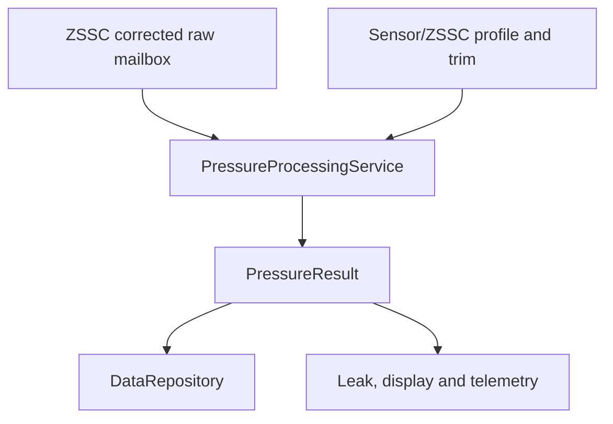
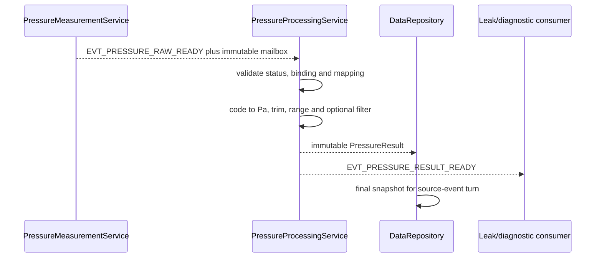

# Pressure Measurement Processing

## 1. Mục đích

Tài liệu này định nghĩa portable firmware contract để chuyển coherent corrected pressure code từ ZSSC3241 thành canonical `PressureResult` có đơn vị pascal (`Pa`), reference type, quality evidence và common binding metadata đầy đủ.

Pipeline canonical:

```text
immutable ZSSC corrected raw sample
  -> identity/status/coherency validation
  -> qualified corrected-code-to-Pa mapping
  -> optional bounded MCU field trim
  -> physical/application plausibility
  -> optional deterministic spike/filter stage
  -> validity/freshness/acceptance decision
  -> immutable PressureResult publication
```

Tài liệu đóng băng:

- ownership giữa ZSSC driver, `PressureMeasurementService`, `PressureProcessingService`, profile/calibration owner, repository và leak consumers;
- factory correction versus MCU field-trim boundary;
- code-to-Pa mapping, pressure-reference semantics và canonical units;
- numeric range, rounding, overflow và outside-mapping behavior;
- optional filtering and trend boundary;
- purpose/origin/provenance/binding propagation;
- duplicate, stale generation, shared-bus recovery, reset và profile-replacement behavior;
- Linux simulator, STM32 and golden-vector equivalence;
- acceptance gate trước khi pressure được dùng cho leak enrichment, diagnostics, display hoặc telemetry.

Tài liệu không đóng băng pressure-sensor model, gauge/absolute/differential reference, rated range, corrected-code endpoints, field trim, filter constants hoặc diagnostic thresholds của product variant đầu tiên. Các giá trị này phải đến từ qualified sensor/ZSSC/calibration artifacts và còn `NEEDS_VERIFICATION` tới khi BOM, NVM image, mechanical interface và metrology evidence được xác nhận.

---

## 2. Phạm vi

### 2.1. Trong phạm vi

- Input `Zssc3241RawCorrectedSample` từ canonical raw mailbox.
- Status/mode/memory/connection/math evidence validation.
- Corrected sensor code 24-bit handling.
- Qualified linear code-to-Pa mapping.
- Gauge, absolute and differential pressure semantics.
- Optional bounded field gain/offset trim.
- Physical/calibrated/rated/application range classification.
- Optional sensor-temperature-dependent field correction when explicitly qualified.
- Optional median/first-order filter with bounded state.
- Freshness, availability and last-known-value semantics.
- `PressureResult` construction and publication.
- Pressure diagnostic/trend/leak consumer boundary.
- Profile/config/calibration safe apply.
- Linux deterministic fixtures, shared-bus/reset scenarios and release gates.

### 2.2. Operational contexts

Contract applies to:

- boot self-check;
- normal production one-shot measurement;
- service/calibration/diagnostic attempt;
- recovery verification;
- Linux simulated ZSSC device;
- replayed corrected-code fixture;
- STM32 live ZSSC/bridge assembly.

Purpose/origin/provenance captured at attempt admission must be preserved. Processing cannot relabel simulated, replayed, service or calibration data as live production measurement.

### 2.3. First implementation slice

First slice MUST support:

1. ZSSC full factory-correction ownership mode.
2. Unsigned corrected 24-bit sensor code.
3. Strict status and active-binding validation.
4. Linear endpoint code-to-Pa mapping using widened integer arithmetic.
5. Gauge/absolute/differential reference preserved from profile; no implicit atmospheric conversion.
6. Optional bounded Q2.30 field gain and Pa offset; identity trim baseline.
7. Filter `NONE` baseline; spike/IIR deferred until characterized.
8. Explicit invalid/unavailable result, never numeric sentinel.
9. Exact metadata/binding propagation.
10. Golden tests for min/mid/max, signed pressure range, status faults, outside code, duplicate, stale bus/source generation, reset and simulated origin.

---

## 3. Source-of-truth và tài liệu liên quan

### 3.1. Thứ tự ưu tiên

1. Frozen decisions and common data/ownership contract.
2. Firmware architecture/source tree.
3. Measurement cycle/event/generation contract.
4. ZSSC integration document for acquisition/status/raw ownership.
5. This document for pressure conversion/filter/result behavior.
6. Sensor/profile/binding document.
7. Pressure principle and leak consumer policy.
8. Qualified sensor/ZSSC/NVM/calibration artifacts.
9. Official component datasheet.
10. Current code.

No implementation may infer production endpoints from generic ZSSC defaults. Mapping is sensor + ZSSC NVM + product calibration evidence.

### 3.2. Upstream contract

ZSSC driver/acquisition service owns:

- one-shot command/result state;
- generic correlated I2C completion;
- EOC/poll/read-once result ownership;
- exact status/mode/diagnostic decode;
- corrected sensor/temperature U24 parse;
- attempt/correlation/source/bus/scheduler generations;
- sample/completion time;
- immutable raw mailbox/version.

Driver does not create final Pa, field trim, filter, application diagnostic or production acceptance.

### 3.3. Factory correction boundary

Baseline variant uses ZSSC full factory correction:

```text
bridge raw signal
  -> ZSSC NVM coefficient correction
  -> corrected 24-bit sensor code
  -> MCU unit mapping + bounded field trim only
```

MCU must not apply factory polynomial/temperature correction again. MCU-owned raw/partial correction is a separate future model/schema and is not enabled by reusing this baseline mapping.

### 3.4. Downstream contract

Repository/display/telemetry/leak consume canonical `PressureResult`; they do not read ZSSC raw code or status buffer. Pressure is optional enrichment for primary flow-based leak rules: invalid pressure does not stop valid flow detection and cannot by itself clear a confirmed leak state.

---

## 4. Requirement/decision được hiện thực

### 4.1. Firmware requirements

| Requirement | Nội dung |
|---|---|
| `FW-PRESS-REQ-001` | Only `PressureProcessingService` creates canonical `PressureResult`. |
| `FW-PRESS-REQ-002` | Raw corrected code is never used directly by leak/display/telemetry. |
| `FW-PRESS-REQ-003` | Raw/status/attempt/binding must be one coherent current sample. |
| `FW-PRESS-REQ-004` | Status, mode, response length and generation are checked before conversion. |
| `FW-PRESS-REQ-005` | I2C/EOC/timeout/status failure never becomes valid 0 Pa. |
| `FW-PRESS-REQ-006` | Corrected code upper eight bits must be zero after U24 parse. |
| `FW-PRESS-REQ-007` | Mapping endpoints come from compatible qualified binding. |
| `FW-PRESS-REQ-008` | `code_max > code_min`; mapping invalid otherwise. |
| `FW-PRESS-REQ-009` | Conversion uses widened checked arithmetic and deterministic rounding. |
| `FW-PRESS-REQ-010` | Pressure reference type is preserved; no implicit atmospheric conversion. |
| `FW-PRESS-REQ-011` | ZSSC factory correction is not applied again in MCU baseline. |
| `FW-PRESS-REQ-012` | Field trim is bounded, versioned and compatible with factory mapping. |
| `FW-PRESS-REQ-013` | Invalid/missing factory NVM calibration cannot be replaced by field trim. |
| `FW-PRESS-REQ-014` | Sensor/die temperature is not substituted for water temperature. |
| `FW-PRESS-REQ-015` | Outside mapping/rated/physical/application ranges have distinct flags/policies. |
| `FW-PRESS-REQ-016` | Canonical output is signed `int32_t Pa`; invalidity is explicit metadata. |
| `FW-PRESS-REQ-017` | Purpose/origin/provenance/source generation/binding are preserved. |
| `FW-PRESS-REQ-018` | Simulated/replayed/service/calibration pressure is not production accepted. |
| `FW-PRESS-REQ-019` | Duplicate/out-of-order/stale source or bus completion has no repeated state/result effect. |
| `FW-PRESS-REQ-020` | Filter state updates only from current valid compatible samples. |
| `FW-PRESS-REQ-021` | Filter is optional/bounded and reset after incompatible gap/config/binding change. |
| `FW-PRESS-REQ-022` | Sample time remains acquisition evidence, not publish time. |
| `FW-PRESS-REQ-023` | Profile/config/trim replacement occurs at safe boundary with new binding generation. |
| `FW-PRESS-REQ-024` | Active attempt retains captured mapping/trim versions. |
| `FW-PRESS-REQ-025` | Publication uses stable object ID/version, not reusable I2C buffer pointer. |
| `FW-PRESS-REQ-026` | Invalid/stale pressure is not leak true/clear evidence. |
| `FW-PRESS-REQ-027` | Pressure-only evidence cannot confirm a leak without explicit product rule. |
| `FW-PRESS-REQ-028` | Diagnostic thresholds match pressure reference type and use hysteresis/debounce. |
| `FW-PRESS-REQ-029` | Trend calculation, if enabled, uses valid bounded windows and monotonic time. |
| `FW-PRESS-REQ-030` | Processing has no heap, I/O, busy-wait or unbounded iteration. |
| `FW-PRESS-REQ-031` | Same vectors produce equivalent Pa/flags on Linux and STM32. |
| `FW-PRESS-REQ-032` | Production release is blocked without sensor/reference/NVM/mapping/metrology qualification. |

### 4.2. Stage-order decision

```text
validate raw identity/status/binding
-> corrected-code-to-Pa mapping
-> optional bounded field trim
-> calibrated/physical/rated/application range classification
-> optional spike/filter processing
-> result validity/freshness/acceptance
-> publication
```

Factory correction precedes MCU input and is not another MCU stage.

---

## 5. Trách nhiệm

### 5.1. Ownership matrix

| Object/state | Single writer | Consumers |
|---|---|---|
| ZSSC raw mailbox | ZSSC driver/acquisition owner | Pressure processing |
| Pressure attempt context | `PressureMeasurementService` | Driver/processing |
| Pressure/ZSSC profiles | Variant/profile owner | Validator, driver, processing |
| ZSSC factory NVM image | Factory provisioning/ZSSC | Runtime verifies identity/digest |
| MCU field trim record | Calibration/config owner | Pressure processing |
| Pressure filter state | `PressureProcessingService` | Diagnostics via immutable view |
| `PressureResult` | `PressureProcessingService` | Repository, leak, display/telemetry |
| Pressure anomaly/trend state | Designated analysis/leak owner | Snapshot/reporting |

### 5.2. `PressureProcessingService`

Owns raw/current-binding validation, code-to-Pa mapping, bounded field trim, range/quality classification, optional filter state, result construction/publication and processing diagnostics.

### 5.3. `PressureMeasurementService`

Owns schedule/admission, attempt/correlation/generations, one-shot/EOC/poll/timeout lifecycle and raw mailbox handoff. It does not modify Pa or filter state.

### 5.4. Profile/calibration owner

Owns artifact decode, integrity, identity/compatibility/qualification, safe commit/apply and binding generation. Processing reads immutable captured objects.

### 5.5. Consumers

Consumers read metadata before numeric pressure. Leak service treats pressure as optional evidence unless a separately approved rule says otherwise.

---

## 6. Ngoài phạm vi

- Physical I2C/EOC/shared-bus implementation.
- ZSSC command/status/NVM protocol implementation.
- Factory NVM programming algorithm/tool authorization.
- MCU-owned raw bridge polynomial compensation.
- Water-temperature measurement/flow compensation.
- Exact leak state machine.
- Mechanical pressure-port/media qualification.
- Persistent binary layout/CRC selection.
- Display/wire unit formatting.
- Legal metrology/safety certification.

---

## 7. Interface và dependency

### 7.1. Dependency direction



Processing depends on domain types and pure numeric helpers, not platform, simulator or storage internals.

### 7.2. Pressure reference type

```c
typedef enum {
    PRESSURE_REFERENCE_GAUGE,
    PRESSURE_REFERENCE_ABSOLUTE,
    PRESSURE_REFERENCE_DIFFERENTIAL
} PressureReferenceType;
```

Reference type is immutable profile/binding semantics. Thresholds, telemetry and calibration must use the same type. Atmospheric conversion requires a separate valid atmospheric source and explicit product requirement; it is not baseline.

### 7.3. Logical processing API

```c
typedef enum {
    PRESSURE_PROCESS_OK,
    PRESSURE_PROCESS_INVALID_SAMPLE,
    PRESSURE_PROCESS_STALE_SAMPLE,
    PRESSURE_PROCESS_PROFILE_ERROR,
    PRESSURE_PROCESS_CALIBRATION_ERROR,
    PRESSURE_PROCESS_NUMERIC_ERROR,
    PRESSURE_PROCESS_INTERNAL_ERROR
} PressureProcessStatus;

PressureProcessStatus pressure_convert_raw(
    const Zssc3241RawCorrectedSample *raw,
    const MeasurementAttemptContext *attempt,
    const PressureProcessingProfile *profile,
    const PressureFieldTrimRecord *trim,
    PressureCandidate *candidate);

PressureProcessStatus pressure_processing_publish(
    PressureProcessingService *service,
    const PressureCandidate *candidate,
    SourceEventToken *turn_token,
    PressureResultReference *published_reference);
```

Exact names may differ; pure conversion and stateful filter/publication boundary remain equivalent.

### 7.4. Candidate

```c
typedef struct {
    int32_t unfiltered_pressure_pa;
    int32_t filtered_pressure_pa;
    PressureReferenceType reference_type;
    int32_t sensor_temperature_mdeg_c;
    bool sensor_temperature_valid;
    uint32_t processing_flags;
    ResultMetadata meta;
} PressureCandidate;
```

Sensor temperature is internal/diagnostic unless profile explicitly uses it for a qualified MCU trim. It is not water temperature.

### 7.5. Input contract

Process only if:

- mailbox ID/version/lifetime valid;
- attempt/correlation/source/bus generation current;
- raw operation matches attempt;
- status response structurally complete;
- binding/profile/NVM/trim tuple compatible;
- input has not already reached terminal processing;
- U24 fields are correctly masked.

### 7.6. Publication

```text
PressureProcessingService writes immutable result slot
  -> assigns result_version
  -> posts EVT_PRESSURE_RESULT_READY with object ID/version
  -> repository/leak/display consumers claim/copy const view
  -> slot release follows explicit acknowledgement
```

No pointer to stack, bus RX buffer or mutable filter state is published.

### 7.7. Event binding

| Event | Producer | Consumer | Meaning |
|---|---|---|---|
| `EVT_PRESSURE_RAW_READY` | ZSSC driver/acquisition owner | Pressure processing | Coherent raw corrected sample ready |
| `EVT_PRESSURE_RESULT_READY` | Pressure processing | Repository/leak/health | Canonical immutable result ready |
| `EVT_MEASUREMENT_STATUS_CHANGED` | Pressure owner | Health/repository | Pressure availability/readiness changed |

Generic I2C/EOC/poll/timeout events remain acquisition events defined in document 12; processing does not consume physical bus events directly.

### 7.8. Source-tree mapping

Exact tree follows architecture section 17.1:

```text
domain/measurement                  -> public pressure/profile/result types
algorithms/pressure                 -> pure mapping/trim/filter helpers
services/measurement               -> PressureProcessingService
config/variants                     -> qualified sensor/ZSSC/mapping artifacts
tests/unit                          -> numeric/profile/filter tests
tests/integration                   -> ZSSC raw-to-result pipeline
tests/system                        -> pressure/leak scenarios
```

---

## 8. Data model và đơn vị

### 8.1. Corrected U24 code

```c
static inline uint32_t pressure_u24_be(
    uint8_t msb,
    uint8_t mid,
    uint8_t lsb)
{
    return ((uint32_t)msb << 16) |
           ((uint32_t)mid << 8) |
           (uint32_t)lsb;
}
```

Exact wire order is confirmed by driver vectors. Processing receives already parsed code and verifies `(code & 0xFF000000u) == 0`.

### 8.2. Transfer mapping

```c
typedef struct {
    uint32_t code_min;
    uint32_t code_max;
    int32_t pressure_min_pa;
    int32_t pressure_max_pa;
} PressureTransferMapping;
```

For corrected code $C$:

$$
P_{mapped}=P_{min}+
\operatorname{round}\left(
\frac{(C-C_{min})(P_{max}-P_{min})}{C_{max}-C_{min}}
\right)
$$

Requirements:

- `code_max > code_min`;
- endpoint pressure span is nonzero and reference-compatible;
- signed differences are formed in widened types;
- product uses at least `int64_t` intermediate and checks multiplication;
- deterministic signed rounding;
- final result checked against `int32_t`;
- outside-code behavior follows explicit policy, never accidental unsigned underflow.

### 8.3. Endpoint semantics

Mapping endpoints are not universal ZSSC constants. They are defined by:

```text
pressure sensor mechanical/rated range
ZSSC factory calibration/NVM output scaling
pressure reference type
selected output encoding
product qualification evidence
```

Changing NVM image/output mapping requires profile/binding/calibration compatibility change.

### 8.4. Field trim

Baseline optional trim:

$$
P_{trimmed}=\operatorname{round}\left(
\frac{P_{mapped}\cdot G_{trim,q30}}{2^{30}}
\right)+O_{trim,Pa}
$$

Signed Q2.30 permits identity gain `1 << 30` and bounded corrections around unity. Use widened intermediate; validate gain/offset against immutable profile bounds.

Field trim cannot:

- compensate invalid/missing ZSSC NVM;
- change reference type;
- expand rated/overpressure range;
- hide memory/connection/math fault;
- apply factory polynomial a second time.

### 8.5. Optional temperature-dependent field correction

ZSSC corrected sensor code is already factory temperature-compensated in baseline. Additional MCU temperature-dependent trim is disabled unless residual characterization proves need and profile declares:

```text
temperature source = ZSSC bridge/die channel
calibration temperature range
correction model/table and stage
no double compensation evidence
outside-range policy
```

MAX water temperature must not substitute automatically.

### 8.6. Range categories

Distinct ranges:

| Range | Purpose | Baseline outside behavior |
|---|---|---|
| Code mapping range | Valid encoded corrected output | Reject or explicit qualified overrange |
| Calibrated pressure range | Accuracy evidence available | Reject/degrade per profile |
| Rated sensor range | Safe normal mechanical operation | Invalid/diagnostic outside |
| Qualified overpressure | Survival/safety evidence, not valid measurement range | Critical diagnostic; not accepted measurement |
| Application expected range | Product diagnostic threshold | Advisory/diagnostic, not automatic sensor invalidity |

Application low/high thresholds cannot redefine physical/rated bounds.

### 8.7. Reference semantics

- Gauge Pa is relative to sensor reference/vent design.
- Absolute Pa is relative to vacuum.
- Differential Pa is signed between declared ports.
- Negative value can be valid for differential or qualified gauge mapping.
- Firmware never adds/subtracts a guessed atmospheric constant.

### 8.8. Canonical units

| Quantity | Unit | Representation |
|---|---|---|
| Corrected code | unsigned U24 | `uint32_t` |
| Pressure | pascal (`Pa`) | `int32_t` canonical, wider intermediate |
| Sensor temperature | `m°C` | `int32_t` when qualified |
| Gain | Q2.30 dimensionless | `int32_t` |
| Offset | `Pa` | signed fixed-width |
| Time | monotonic `us` | `uint64_t` |
| Sequence/version/generation | dimensionless | fixed-width unsigned |

### 8.9. Filter modes

```c
typedef enum {
    PRESSURE_FILTER_NONE,
    PRESSURE_FILTER_MEDIAN3,
    PRESSURE_FILTER_FIRST_ORDER,
    PRESSURE_FILTER_MEDIAN3_THEN_FIRST_ORDER
} PressureFilterMode;
```

Median-of-three may reject isolated digital spikes but adds history/latency. First-order filter:

$$
P_f[n]=P_f[n-1]+\alpha_n(P_{in}[n]-P_f[n-1])
$$

Filter profile declares stage, Q format/discretization, actual monotonic `dt`, reset gap, maximum latency and which value is canonical. Baseline is `NONE` until noise/step characterization.

### 8.10. Trend boundary

Pressure trend is not part of canonical `PressureResult` numeric mapping. If enabled, a designated analysis owner consumes valid pressure results and computes endpoint delta/rate/window regression with explicit window identity. It must not mutate measurement filter state or reinterpret old samples after config change.

### 8.11. Processing profile

```c
typedef enum {
    PRESSURE_OUTSIDE_MAPPING_REJECT,
    PRESSURE_OUTSIDE_MAPPING_CLAMP_DEGRADED
} PressureOutsideMappingPolicy;

typedef struct {
    uint32_t profile_id;
    uint32_t schema_version;
    uint32_t profile_version;
    uint32_t compatible_sensor_profile_id;
    uint32_t compatible_zssc_profile_id;

    PressureReferenceType reference_type;
    PressureTransferMapping transfer;
    PressureOutsideMappingPolicy outside_mapping_policy;

    int32_t physical_min_pa;
    int32_t physical_max_pa;
    int32_t calibrated_min_pa;
    int32_t calibrated_max_pa;
    int32_t application_expected_min_pa;
    int32_t application_expected_max_pa;
    int32_t qualified_overpressure_pa;

    int32_t field_gain_min_q30;
    int32_t field_gain_max_q30;
    int32_t field_offset_abs_max_pa;

    PressureFilterMode filter_mode;
    uint32_t filter_time_constant_us;
    uint32_t filter_reset_gap_us;
    uint64_t maximum_data_age_us;

    uint32_t qualification_reference_id;
    uint32_t content_integrity;
} PressureProcessingProfile;
```

Logical contract only; encoded artifact does not persist pointers/padding.

### 8.12. Field trim record

```text
schema/record/calibration version
sensor serial/assembly identity
variant/sensor/ZSSC/NVM/profile compatibility tuple
gain_q30 and offset_pa
optional residual table reference
calibrated range and temperature context
reference pressure instrument/method identity
calibration timestamp/time quality
uncertainty/residual metrics
integrity
```

### 8.13. Result and flags

```c
typedef struct {
    ResultMetadata meta;
    int32_t pressure_pa;
    uint32_t processing_flags;
} PressureResult;
```

Reference type is obtained through `meta.binding`/profile; no ambiguous standalone `profile_version` field.

Proposed flags:

```text
PRESS_PROC_STATUS_INVALID
PRESS_PROC_BUSY_NOT_READY
PRESS_PROC_MEMORY_ERROR
PRESS_PROC_CONNECTION_FAULT
PRESS_PROC_MATH_SATURATION
PRESS_PROC_WRONG_MODE
PRESS_PROC_CODE_FORMAT_INVALID
PRESS_PROC_CODE_OUTSIDE_MAPPING
PRESS_PROC_MAPPING_CLAMPED
PRESS_PROC_PRESSURE_OUTSIDE_CALIBRATED_RANGE
PRESS_PROC_PRESSURE_OUTSIDE_RATED_RANGE
PRESS_PROC_PRESSURE_OUTSIDE_EXPECTED_RANGE
PRESS_PROC_PROFILE_INVALID
PRESS_PROC_NVM_IDENTITY_MISMATCH
PRESS_PROC_FIELD_TRIM_INVALID
PRESS_PROC_SENSOR_TEMPERATURE_INVALID
PRESS_PROC_NUMERIC_OVERFLOW
PRESS_PROC_DUPLICATE
PRESS_PROC_OUT_OF_ORDER
PRESS_PROC_STALE_SOURCE_GENERATION
PRESS_PROC_STALE_BUS_GENERATION
PRESS_PROC_BINDING_MISMATCH
PRESS_PROC_FILTER_REINITIALIZED
PRESS_PROC_SAMPLE_TIME_ESTIMATED
```

Flag bit values and blocking/advisory classes are versioned and centrally tested.

### 8.14. Validity, freshness and acceptance

Production `DATA_ACCEPTED` requires:

```text
validity == DATA_VALID
freshness == DATA_FRESH
purpose == MEAS_PURPOSE_PRODUCTION
origin == DATA_ORIGIN_LIVE_DEVICE
provenance == PROVENANCE_MEASURED
source and bus generations current
binding/config/NVM/field-trim current and compatible
reference type and mapping qualified
pressure inside accepted calibrated/rated domain
no blocking status/processing flag
```

Pressure may be valid but not accepted for a consumer whose reference type/window/age requirements differ.

---

## 9. State machine hoặc sequence

### 9.1. Processing state

```text
UNINITIALIZED
READY
PROCESSING
PUBLISH_PENDING
DEGRADED
PROFILE_APPLY_PENDING
QUIESCED
```

Acquisition EOC/poll/FSM remains in document 12.

### 9.2. Production sequence



### 9.3. Validation order

1. Event/mailbox identity/version/lifetime.
2. Attempt/correlation/source/bus generations and terminal state.
3. Binding/sensor/ZSSC/NVM/trim compatibility.
4. Device validity, response length and U24 format.
5. Busy/mode/reserved/memory/connection/math status.
6. Mapping endpoint invariants.
7. Outside-code policy.
8. Code-to-Pa checked conversion.
9. Field-trim bounds/conversion.
10. Calibrated/physical/rated/application range classification.
11. Duplicate/out-of-order/filter-history compatibility.
12. Result metadata/freshness/acceptance.

### 9.4. Valid sample

```text
current coherent raw
  -> checked mapping and trim
  -> classified pressure candidate
  -> optional filter update once
  -> assign result version
  -> publish result/event
  -> consumer independently checks usability
```

### 9.5. Invalid sample

```text
blocking condition
  -> no filter/trend/leak progress
  -> no fabricated 0 Pa
  -> publish invalid/unavailable latest result if repository policy requires
  -> retain last-known numeric only with original identity and invalid/stale metadata
  -> diagnostic/health update once
```

### 9.6. Duplicate/out-of-order/stale

- Duplicate source sequence: no second filter/result/consumer effect.
- Out-of-order source: reject from live stateful path.
- Old bus/source/binding generation: stale and no side effect.
- Sequence wrap uses common wrap-aware comparison.

### 9.7. Safe replacement

```text
validate candidate profile/trim
  -> persistent commit/verify if required
  -> wait pressure safe boundary
  -> install new binding/trim generation
  -> reset filter/trend/duplicate history if incompatible
  -> re-arm schedule
  -> require fresh production/verification sample
```

Old result retains captured versions and is never retroactively relabeled.

### 9.8. Recovery

- I2C/EOC/device faults: acquisition/bus/ZSSC owner.
- NVM/profile/trim mismatch: binding/config owner.
- Numeric invariant: pressure processing fault and readiness blocked.
- Duplicate/stale: reject/diagnose without reset.
- Pressure degradation does not stop independent flow production.

---

## 10. Timing, timeout và non-blocking behavior

### 10.1. Time fields

- Sample time: best ZSSC conversion/EOC evidence.
- Completion time: Pa result completed/published.
- Wall time optional and never used for filtering/freshness/deadline.
- Exact sample-time uncertainty is flagged if EOC/poll reconstruction is approximate.

### 10.2. Freshness

```text
age_us = now_monotonic_us - sample_monotonic_us
age_us < maximum_data_age_us  -> DATA_FRESH
age_us >= maximum_data_age_us -> DATA_STALE
```

Maximum age must account for period, conversion, shared-bus jitter and consumer correlation window.

### 10.3. Filter timing

Filter uses actual monotonic `dt`:

```text
first valid compatible sample -> initialize
valid current sample          -> update once
invalid/duplicate/stale       -> no update
gap >= reset_gap              -> reinitialize and flag
mapping/reference/trim change -> reset
```

### 10.4. Trend window

If enabled, trend requires at least configured valid samples, maximum inter-sample gap, same reference/binding semantics and bounded window. Invalid gap makes trend unavailable; it does not imply zero slope.

### 10.5. Processing bound

- Constant-time linear mapping/trim.
- Bounded filter/window capacity.
- No heap, I/O, sleep, retry or bus operation.
- No unbounded regression/iteration.
- WCET/stack measured at maximum profile.

### 10.6. Acquisition independence

Processing does not control periodic cadence, EOC poll or shared-bus retry. Slow consumers/display/telemetry cannot hold pressure acquisition/result owner.

### 10.7. RTC changes

Wall-clock invalid/jump does not alter sample order, filter `dt`, freshness or leak correlation based on monotonic time.

---

## 11. Configuration

### 11.1. Configuration layers

| Layer | Examples | Mutability |
|---|---|---|
| Sensor profile | model/reference/range/bridge/media assumptions | Qualified immutable |
| ZSSC profile | NVM/config/status/output mapping/timing | Qualified immutable |
| Processing profile | transfer/ranges/filter policy | Qualified profile |
| Field trim | bounded unit-specific gain/offset | Authorized persistent record |
| Runtime | period/freshness/qualified filter/diagnostic thresholds | Transactional allowlist |
| Leak config | pressure anomaly/correlation thresholds | Separate consumer owner |

### 11.2. Validator

Validator checks:

- schema/version/integrity/qualification;
- sensor/ZSSC/NVM/processing/trim compatibility;
- reference type consistency;
- endpoint ordering and integer representability;
- physical/calibrated/rated/application ranges;
- overpressure relationship;
- field gain/offset bounds;
- optional sensor-temperature model/range;
- filter mode/time/capacity;
- freshness versus period/conversion/jitter;
- diagnostic thresholds/hysteresis/reference type.

### 11.3. Runtime allowlist

May select bounded pressure period, freshness, qualified filter option, bounded field trim and diagnostic thresholds. Must not alter sensor type/reference/rated range, arbitrary ZSSC NVM/PGA/ADC/excitation, I2C identity, mapping semantics or disable status/NVM checks.

### 11.4. Safe apply

Apply returns `APPLIED`, `DEFERRED` or `REJECTED`. It occurs between attempts, not between mapping/filter/publication stages. Failed persistent commit keeps previous active binding.

### 11.5. Default behavior

Default runtime values do not fabricate valid sensor identity, NVM image or factory calibration. Missing required artifacts keep pressure unavailable/degraded and production acceptance blocked.

### 11.6. Diagnostic thresholds

Low/high/drop thresholds belong diagnostic/leak configuration, not transfer mapping. They require reference-type match, hysteresis, debounce/window and atomic validation.

---

## 12. Error detection và recovery

### 12.1. Error taxonomy

| Class | Examples | Owner/outcome |
|---|---|---|
| Identity | duplicate/wrong correlation/stale generations | Reject by acquisition/processing |
| Transport/acquisition | NACK/timeout/EOC/poll/length | Bus/ZSSC acquisition recovery |
| Device status | busy/wrong mode/memory/connection/math | Invalid; ZSSC/profile recovery |
| Binding/NVM | identity/digest/schema/mapping mismatch | Readiness blocked; reprovision/service |
| Numeric | endpoint/division/overflow/filter invariant | Processing/profile fault |
| Physical quality | outside calibrated/rated/expected range | Invalid/degraded by class |
| Publication | mailbox/queue/repository failure | Infrastructure policy/diagnostics |

### 12.2. Blocking examples

- stale source/bus/binding generation;
- busy/reserved/wrong mode;
- memory/connection/math error;
- invalid U24/mapping endpoints;
- incompatible NVM/profile/trim;
- numeric overflow;
- outside physical/rated accepted domain.

### 12.3. Advisory/degraded examples

Only by qualified policy:

- outside expected but inside calibrated/rated range;
- explicit boundary clamp;
- filter reset/sample-time estimate;
- pressure temporarily unavailable while flow remains operational.

### 12.4. No fabricated success

- Failure does not create valid 0 Pa.
- Last-known value retains original sample time/version and invalid/stale status.
- Field trim does not hide factory/NVM fault.
- Invalid pressure does not clear leak or produce false trend.
- Overpressure survival bound is not valid measurement bound.

### 12.5. Recovery hierarchy

```text
single invalid sample -> reject/degrade and continue bounded supervision
I2C bus fault -> bus recovery increments generation
device fault -> bounded ZSSC reset/reinit/functional verify
profile/NVM mismatch -> reprovision/service path
numeric invariant -> stable processing fault, no retry storm
fresh valid sample after recovery -> new readiness evidence
```

### 12.6. Diagnostic counters

```text
raw_seen
results_published
status_invalid
memory_error
connection_fault
math_saturation
code_outside_mapping
pressure_outside_calibrated
pressure_outside_rated
profile_nvm_mismatch
trim_error
numeric_error
duplicate
out_of_order
stale_source_generation
stale_bus_generation
filter_reset
publication_failure
```

Exactly one terminal counter outcome per input sample, plus orthogonal evidence counters where documented.

---

## 13. Linux simulation mapping

### 13.1. Reuse boundary

Linux runs the same ZSSC driver, acquisition service, profile validator, pressure algorithm/service, repository and leak-consumer code. Simulator supplies virtual time, shared-I2C/ZSSC peer, EOC, fixtures, faults and observers.

### 13.2. Fixture schema example

```json
{
  "fixture_id": "pressure-midpoint-001",
  "fixture_version": 1,
  "origin": "simulated-device",
  "binding_ref": {"id": 501, "version": 1},
  "status": "valid-sleep",
  "sensor_code_u24": 8388608,
  "temperature_code_u24": 4194304,
  "expected": {
    "reference_type": "gauge",
    "origin": "simulated-device",
    "acceptance": "not-accepted"
  }
}
```

Values are illustrative, not qualified sensor mapping.

### 13.3. Required deterministic vectors

- U24 min/max/upper-bit/byte order;
- mapping min/mid/max and signed endpoint ranges;
- invalid/reversed/equal endpoints;
- signed rounding and overflow boundaries;
- field gain/offset identity/min/max/outside;
- gauge/absolute/differential reference fixtures;
- below/at/inside/at/above mapping/calibrated/rated ranges;
- busy/wrong/reserved/memory/connection/math status;
- sensor temperature valid/invalid if used;
- filter init/spike/step/gap/reset;
- duplicate/out-of-order/stale source/bus generations;
- bus recovery and late completion;
- NVM/profile/trim mismatch/replacement;
- simulated/replayed/service/calibration isolation;
- invalid pressure with valid flow/leak behavior.

### 13.4. High-precision oracle

Tooling may use rational/decimal reference for mapping/trim/filter expected values. Golden stores generator/profile/calibration versions, units, rounding and hash. Runtime does not depend on host floating-point representation.

### 13.5. Scenario path

Integration/system tests inject via ZSSC peer/shared-I2C/EOC path. Pure numeric unit tests may call mapper directly. Integration does not post `EVT_PRESSURE_RESULT_READY` to bypass driver/processing.

### 13.6. Trace

Normalized trace includes:

```text
virtual sample/completion time
attempt/correlation/source/bus/scheduler generations
raw/result/snapshot versions
sensor/ZSSC/NVM/processing/trim/binding identities
status/U24 codes or fixture reference
mapped/trimmed/filtered stage outcomes
reference type/range classification/flags
purpose/origin/provenance/acceptance
filter/trend transition
leak consumer accept/reject reason
```

---

## 14. STM32 mapping

### 14.1. Portable implementation

Pressure processing does not call HAL, I2C, GPIO, timer, storage, simulator or RTOS APIs. Inputs/time/artifacts are immutable arguments.

### 14.2. Arithmetic portability

Use fixed-width checked operations and static assertions. Linux/STM32 may use different low-level widened helpers only if golden outputs/flags are equivalent.

### 14.3. Memory/resource

- No heap.
- Fixed filter/trend capacity.
- Profiles/tables may remain read-only flash.
- Decoded active trim is bounded.
- WCET/stack measured at maximum configuration.

### 14.4. ISR/callback

No mapping/filter/result publication in EOC/I2C callback. Callback posts bounded event/evidence; processing runs in service/event context.

### 14.5. Hardware bring-up

1. Confirm sensor model, bridge topology, media and reference type.
2. Confirm ZSSC interface/address/NVM/customer identity/digest.
3. Verify status and corrected U24 byte order.
4. Check endpoint mapping with known pressure references.
5. Verify negative/zero/full-scale behavior as applicable.
6. Exercise memory/connection/math and outside-range diagnostics.
7. Characterize zero, gain, linearity, hysteresis and repeatability.
8. Sweep operating temperature and supply conditions.
9. Characterize noise, step response and optional filter latency.
10. Compare captured vectors between Linux and STM32.

---

## 15. Test và acceptance criteria

### 15.1. Numeric unit tests

- U24 parse/format checks.
- Endpoint invariant checks.
- Exact min/mid/max mapping.
- Signed gauge/absolute/differential spans.
- Signed rounding ties.
- Overflow/final `int32_t` bounds.
- Outside-code policy.
- Q2.30 field trim identity/bounds.

### 15.2. Status/profile tests

- Busy/wrong/reserved/memory/connection/math statuses.
- Sensor/ZSSC/NVM/processing tuple valid/mismatch.
- Reference-type mismatch.
- Invalid integrity/unknown schema.
- Field trim identity/range mismatch.
- Factory correction mode mismatch/double-correction guard.

### 15.3. Range/filter tests

- Mapping/calibrated/rated/application boundaries.
- Overpressure not accepted measurement.
- Median isolated spike behavior if enabled.
- First-order init/update/step/gap/reset.
- Invalid/duplicate does not update filter.
- Reference/mapping/trim change resets history.

### 15.4. Metadata/provenance tests

```text
production + live + measured + current compatible binding -> eligible
simulated/replayed -> not production accepted
service/calibration/diagnostic -> no production side effect
old source/bus/binding/config/trim -> rejected
sample and completion times stay distinct
reference type traceable through binding
```

### 15.5. Acquisition/processing integration

- Period due → command → EOC/poll → read → raw → Pa result.
- Missing/duplicate/late EOC.
- I2C NACK/timeout/truncated frame.
- Shared F-RAM contention.
- Bus recovery during attempt.
- Late old-generation completion.
- Read-once result ownership.
- One final snapshot per pressure source turn.

### 15.6. Consumer tests

- Valid fresh pressure enriches allowed leak scenario.
- Invalid/stale pressure does not stop valid flow-only detection.
- Invalid pressure is neither true nor clear evidence.
- Pressure-only evidence does not confirm leak under baseline.
- Low/high thresholds use matching reference type and hysteresis.
- Trend unavailable on insufficient samples/gap.

### 15.7. System scenarios

- Stable nominal pressure.
- Valid zero/negative pressure where profile allows.
- Low/high pressure with enter/clear hysteresis.
- Pressure step/drop correlated with flow.
- Short gap/long outage.
- Sensor/bus reset and recovery.
- Profile/NVM/trim update.
- Simulated/replay origin isolation.
- Flow valid while pressure unavailable.

### 15.8. Cross-platform golden

Same raw/profile/trim input produces identical or declared-tolerance-equivalent:

- status/range outcome;
- mapped/trimmed/filtered Pa;
- processing flags;
- metadata/binding/acceptance;
- filter state transition;
- consumer usability decision.

### 15.9. Characterization acceptance

Evidence must cover:

- traceable pressure reference uncertainty;
- zero/gain/linearity/residual;
- repeatability/hysteresis/drift;
- temperature/supply dependence;
- unit/lot/mechanical installation variation;
- stable-noise and useful resolution;
- step/settling/filter latency;
- overload/overpressure behavior per safe test plan;
- total numeric/mapping/trim error budget;
- false pressure-anomaly rate.

### 15.10. Acceptance criteria

1. One portable corrected-code-to-`PressureResult` owner path exists.
2. Factory correction and MCU trim ownership are explicit and never doubled.
3. Reference type and endpoint mapping are qualified/binding-traceable.
4. Invalid status/transport/range never becomes valid 0 Pa.
5. Numeric/rounding/range/filter boundaries have golden tests.
6. Duplicate/stale/reset/config change cannot update state/result twice.
7. Nonproduction/simulated/incompatible result cannot create production side effects.
8. Pressure degradation does not disable independent flow production.
9. Linux/STM32 equivalence passes.
10. Sensor/ZSSC/NVM/trim/metrology evidence closes critical open issues.

---

## 16. Traceability

### 16.1. Requirement mapping

| Requirement group | Source |
|---|---|
| `FW-PRESS-REQ-001`–`006` | ZSSC raw/result ownership, common data model and pressure principle acquisition |
| `FW-PRESS-REQ-007`–`016` | ZSSC code-to-Pa, reference, factory correction and calibration contracts |
| `FW-PRESS-REQ-017`–`025` | Measurement lifecycle, metadata, generation, filter and publication contracts |
| `FW-PRESS-REQ-026`–`032` | Leak boundary, simulator/test strategy and qualification requirements |

### 16.2. Artifact ownership

| Artifact/event | Owner/document |
|---|---|
| ZSSC acquisition/raw/status | `12_pressure_measurement_zssc3241.md` |
| Common metadata/result | `04_data_model_and_ownership.md` |
| Sensor/ZSSC/active binding | `16_sensor_profile_and_variant.md` |
| Temperature/flow results | `13_temperature_calibration.md`, `14_flow_measurement_processing.md` |
| Leak pressure evidence | `17_leak_detection.md` / leak baseline principle |
| Simulation/golden policy | `92_firmware_test_strategy.md`, `93_linux_simulation_integration.md` |

### 16.3. Suggested implementation mapping

```text
include/domain/pressure_processing.h
src/algorithms/pressure/pressure_mapping.c
src/algorithms/pressure/pressure_filter.c
src/services/measurement/pressure_processing_service.c
src/config/variants/<variant>/pressure_processing_profile.*
tests/unit/test_pressure_mapping.c
tests/unit/test_pressure_profile.c
tests/unit/test_pressure_processing_service.c
tests/integration/test_zssc_pressure_pipeline.c
tests/system/scenarios/pressure_*.json
```

Exact paths follow architecture canonical tree.

### 16.4. Suggested test IDs

```text
TC_PRESS_U24_PARSE
TC_PRESS_MAPPING_ENDPOINTS
TC_PRESS_SIGNED_ROUNDING
TC_PRESS_REFERENCE_TYPE_PRESERVED
TC_PRESS_FACTORY_CORRECTION_ONCE
TC_PRESS_FIELD_TRIM_BOUNDS
TC_PRESS_STATUS_FAULT_REJECTED
TC_PRESS_RANGE_CLASSIFICATION
TC_PRESS_FILTER_INVALID_NO_UPDATE
TC_PRESS_STALE_BUS_GENERATION
TC_PRESS_BINDING_REPLACE_RESETS_HISTORY
TC_PRESS_SIMULATED_NOT_ACCEPTED
TC_PRESS_INVALID_NO_LEAK_CLEAR
TC_PRESS_FLOW_CONTINUES_WHEN_UNAVAILABLE
TC_PRESS_ZSSC_PIPELINE_DETERMINISTIC
TC_PRESS_LINUX_STM32_EQUIVALENCE
```

---

## 17. Open issues / NEEDS_VERIFICATION

| ID | Vấn đề | Ảnh hưởng |
|---|---|---|
| `FW-PRESS-OQ-001` | Exact bridge pressure-sensor model/topology/media compatibility | Sensor profile/hardware |
| `FW-PRESS-OQ-002` | Gauge/absolute/differential reference and mechanical port semantics | Result/threshold meaning |
| `FW-PRESS-OQ-003` | Rated range, calibrated range and qualified overpressure | Mapping/safety/acceptance |
| `FW-PRESS-OQ-004` | Required accuracy, resolution, repeatability and drift | Sensor/calibration/release |
| `FW-PRESS-OQ-005` | Exact ZSSC NVM image/output code endpoints/customer identity/digest | Mapping/readiness |
| `FW-PRESS-OQ-006` | Corrected U24 byte order/status constants against official vectors | Driver/processing |
| `FW-PRESS-OQ-007` | Field trim need, bounds, calibration method and record schema | Processing/persistence |
| `FW-PRESS-OQ-008` | Signed rounding helper and portable overflow policy | Cross-platform equivalence |
| `FW-PRESS-OQ-009` | Sensor-temperature residual correction need/range | Double-compensation risk |
| `FW-PRESS-OQ-010` | Sampling interval/freshness/shared-bus jitter budget | Scheduling/usability |
| `FW-PRESS-OQ-011` | Filter/spike policy, time constant and latency | Step/leak diagnostics |
| `FW-PRESS-OQ-012` | Trend ownership/window and MVP inclusion | RAM/algorithm scope |
| `FW-PRESS-OQ-013` | Low/high/drop thresholds, hysteresis and configuration owner | Diagnostic/leak behavior |
| `FW-PRESS-OQ-014` | Pressure calibration record encoding, integrity and migration | Storage/service |
| `FW-PRESS-OQ-015` | Telemetry/display need for reference type, raw/filtered/trend fields | External schema |
| `FW-PRESS-OQ-016` | Metrology test plan/reference rig and production acceptance limits | Release qualification |

Architecture/simulator may proceed with explicitly test-only mappings. Production pressure/leak-enrichment release is blocked until `OQ-001`–`OQ-010`, `OQ-013` and `OQ-016` have evidence/resolution; filter/trend/external features remain disabled until their relevant open issues close.

---

## 18. Revision history

| Version | Date | Change |
|---|---|---|
| 0.1 | 2026-07-15 | Initial pressure-processing contract; freezes ownership, factory-correction/field-trim boundary, mapping, reference, filter, simulator and acceptance gates. |
