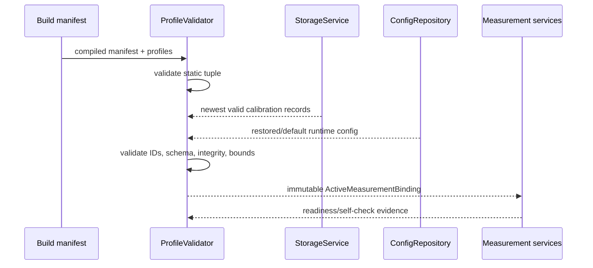
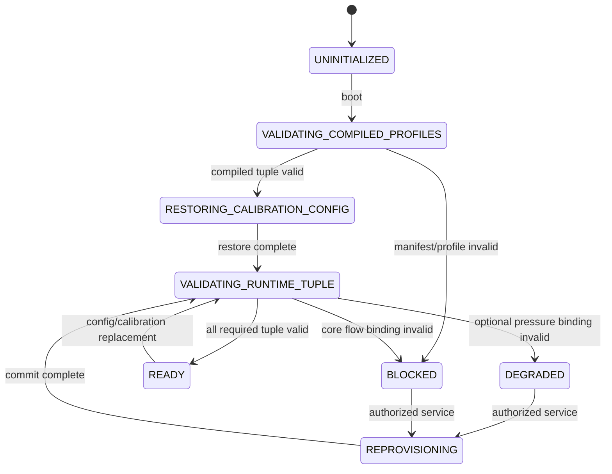

# Sensor Profile and Product Variant

## 1. Mục đích

Tài liệu này định nghĩa kiến trúc profile và product variant cho measurement subsystem nhằm:

- Dùng một codebase chung để build nhiều firmware variant.
- Cô lập hardware/model-specific constant khỏi application logic.
- Liên kết đúng cảm biến, signal conditioner, geometry, calibration và runtime config.
- Ngăn runtime configuration làm thay đổi hardware identity hoặc phá analog/safety assumption.
- Kiểm tra compatibility tại build, boot, provisioning và result acceptance.
- Đảm bảo result truy nguyên được variant/profile/calibration/config đã tạo ra nó.
- Cho phép Linux simulation và STM32 dùng cùng manifest/profile test vector.

Kiến trúc cốt lõi:

```text
ProductVariantManifest
  + immutable sensor/device profiles
  + compatible per-device calibration
  + validated allowlisted runtime configuration
  -> ActiveMeasurementBinding
```

Đổi model cảm biến không phải một runtime config operation. Nó yêu cầu variant/profile tương ứng và qualification/provisioning lại.

---

## 2. Phạm vi

### 2.1. Trong phạm vi

- `ProductVariantManifest`.
- MAX35103 device profile.
- Ultrasonic flow-sensor/geometry profile.
- Pressure bridge sensor profile.
- ZSSC3241 profile.
- Calibration binding theo từng thiết bị.
- Runtime measurement config allowlist và bounds.
- Build selection, boot validation và compatibility rules.
- Profile/config/calibration version propagation tới result/snapshot/diagnostics.
- Linux/STM32 mapping và release qualification gate.

### 2.2. Variant baseline

Mỗi production firmware image chọn đúng một product variant tại build time. Một variant có thể dùng chung module/algorithm nhưng phải có identity và compatible profile tuple duy nhất.

### 2.3. Áp dụng

- Production build.
- Factory/calibration build.
- Linux simulation variant.
- STM32L433 hardware target.
- HIL/qualification test.

---

## 3. Source-of-truth và tài liệu liên quan

### 3.1. Thứ tự ưu tiên

| Ưu tiên | Nguồn | Nội dung sở hữu |
|---:|---|---|
| 1 | `DEC-HW-001` và decision registry | Kiến trúc variant/profile/calibration/config |
| 2 | Hardware/datasheet/qualification evidence | Model/range/electrical/timing truth của variant |
| 3 | `04_data_model_and_ownership.md` | Metadata, owner và unit |
| 4 | Tài liệu này | Firmware profile type, binding và compatibility contract |
| 5 | `11`/`12` | Device register/timing interpretation |
| 6 | `13`–`15` | Algorithm/calibration sử dụng profile |

Không được dùng comment trong driver hoặc giá trị emulator làm source-of-truth cho production profile.

### 3.2. `DEC-HW-001` binding

`DEC-HW-001` đã chốt:

- Một codebase chung tạo nhiều firmware variant.
- Mỗi variant liên kết đúng một `PressureSensorProfile` và một `Zssc3241Profile` tương thích.
- Calibration riêng từng thiết bị.
- Runtime chỉ thay `PressureRuntimeConfig` trong allowlist và validated bounds.
- Boot kiểm tra IDs, schema, CRC và compatible-version tuple.
- Mismatch chặn accepted production pressure nhưng vẫn cho diagnostic/authorized service theo policy.

### 3.3. Profile numeric values

Kiến trúc đã chốt, nhưng model, range, register value, accuracy và timeout cụ thể vẫn là per-variant release artifact cần datasheet/characterization evidence.

---

## 4. Requirement/decision được hiện thực

| ID | Requirement firmware |
|---|---|
| `FW-PROF-REQ-001` | Production firmware MUST chọn đúng một `ProductVariantManifest` tại build time. |
| `FW-PROF-REQ-002` | Variant identity MUST immutable trong runtime production. |
| `FW-PROF-REQ-003` | Application/domain policy MUST NOT chứa part-specific register number hoặc sensor-model branch rải rác. |
| `FW-PROF-REQ-004` | Mọi required profile MUST có stable ID, schema version, content/profile version và integrity/validation mechanism phù hợp. |
| `FW-PROF-REQ-005` | Manifest MUST khai báo compatible profile/calibration/config schema tuple. |
| `FW-PROF-REQ-006` | Build MUST fail khi required profile thiếu, ID trùng, incompatible hoặc vượt static resource contract. |
| `FW-PROF-REQ-007` | Boot MUST validate manifest, profile, calibration và runtime-config binding trước production admission. |
| `FW-PROF-REQ-008` | Pressure accepted production MUST yêu cầu compatible manifest + pressure sensor profile + ZSSC profile + calibration + runtime config. |
| `FW-PROF-REQ-009` | Flow accepted production MUST yêu cầu compatible MAX profile + ultrasonic geometry/sensor profile + calibration/config theo algorithm contract. |
| `FW-PROF-REQ-010` | Invalid/missing calibration MUST NOT được thay bằng fabricated valid calibration. |
| `FW-PROF-REQ-011` | Runtime config MUST chỉ chứa field trong allowlist và nằm trong bounds do immutable product profile đặt ra. |
| `FW-PROF-REQ-012` | Generic raw MAX/ZSSC register write MUST NOT được expose như production runtime configuration. |
| `FW-PROF-REQ-013` | Config cần persistence MUST chỉ active sau validate, commit/verify và matching apply result. |
| `FW-PROF-REQ-014` | Active attempt/result MUST giữ profile/config/calibration versions được capture tại attempt start. |
| `FW-PROF-REQ-015` | Config/profile replacement MUST NOT retroactively sửa metadata của result đã publish. |
| `FW-PROF-REQ-016` | Calibration record MUST bind với sensor/device identity và compatible profile tuple. |
| `FW-PROF-REQ-017` | Calibration record MUST có schema, sequence/counter, integrity và traceable factory/service provenance. |
| `FW-PROF-REQ-018` | Profile mismatch MUST tạo explicit status/reason và chặn `DATA_ACCEPTED`; không tự chọn nearest profile. |
| `FW-PROF-REQ-019` | Authorized service MAY inspect/reprovision profile/calibration nhưng MUST không bypass compatibility/integrity validation. |
| `FW-PROF-REQ-020` | Result/snapshot/diagnostics MUST expose đủ variant/profile/calibration/config reference để truy nguyên. |
| `FW-PROF-REQ-021` | Consumer ngoài measurement subsystem MUST chỉ đọc canonical result, không phụ thuộc raw profile/register field. |
| `FW-PROF-REQ-022` | Linux simulator MUST load/select profile bằng cùng ID/schema/compatibility rule như STM32 build. |
| `FW-PROF-REQ-023` | Per-variant release MUST có qualification evidence cho range, timing, accuracy, electrical và error budget liên quan. |
| `FW-PROF-REQ-024` | Unknown schema/version MUST bị reject hoặc migration rõ ràng; không cast trực tiếp. |
| `FW-PROF-REQ-025` | Secret/credential MUST NOT nằm trong measurement profile hoặc public manifest. |
| `FW-PROF-REQ-026` | Profile/config apply MUST atomic ở logical owner boundary và publish generation/version mới. |
| `FW-PROF-REQ-027` | Profile change ảnh hưởng algorithm evidence MUST reset/segregate evidence theo downstream contract. |
| `FW-PROF-REQ-028` | Variant/profile identifiers MUST dùng explicit fixed-width representation và deterministic serialization khi persist/wire. |
| `FW-PROF-REQ-029` | Factory build và production build MUST dùng cùng compatibility validator core. |
| `FW-PROF-REQ-030` | Mọi field chưa qualification MUST mang `NEEDS_VERIFICATION` trong source profile và không được release như production-qualified value. |

---

## 5. Trách nhiệm

### 5.1. Owner matrix

| Artifact/object | Owner | Mutable ở đâu? |
|---|---|---|
| `ProductVariantManifest` | Build/product definition | Build-time only |
| `Max35103Profile` | MAX integration/profile owner | Build-time immutable |
| `UltrasonicSensorProfile` | Flow measurement/product owner | Build-time immutable |
| `PressureSensorProfile` | Pressure product-profile owner | Build-time immutable |
| `Zssc3241Profile` | ZSSC integration/profile owner | Build-time immutable |
| `PressureCalibrationRecord` | Calibration repository + storage | Authorized per-device transaction |
| Flow/temperature calibration record | Calibration repository + storage | Authorized per-device transaction |
| `PressureRuntimeConfig` | `ConfigRepository` | Allowlisted runtime transaction |
| Common measurement runtime config | `ConfigRepository` | Allowlisted runtime transaction |
| `ActiveMeasurementBinding` | Measurement/profile binding service | Boot/apply owner only |
| Qualification report | Product validation/release process | Controlled release artifact |

### 5.2. Build-system responsibility

- Chọn variant ID.
- Include đúng profile objects.
- Generate/verify manifest reference.
- Fail build nếu required artifact thiếu hoặc incompatible.
- Emit build metadata và variant identity.

### 5.3. Runtime responsibility

- Không cho chọn sensor model tùy ý.
- Validate persistent calibration/config theo manifest.
- Publish active binding/status.
- Admission production result chỉ khi compatibility đạt.

### 5.4. Driver responsibility

Driver nhận typed profile phù hợp và không tự chọn profile bằng heuristic/device response trừ khi tài liệu device quy định detection chỉ để validation. Driver không sở hữu product variant.

---

## 6. Ngoài phạm vi

- Numeric profile cụ thể cho model pressure bridge chưa chọn/qualification.
- Exact MAX35103 register/opcode values.
- Exact ZSSC3241 analog front-end/register image.
- Factory equipment/procedure chi tiết.
- Calibration algorithm và uncertainty computation.
- Firmware signing/secure boot.
- BLE provisioning wire format.
- Server-side variant catalog.
- Automated profile generator tool implementation.

Các nội dung này phải sử dụng contract tại đây khi được triển khai.

---

## 7. Interface và dependency

### 7.1. Identifier types

```c
typedef uint32_t ProductVariantId;
typedef uint32_t ProfileId;
typedef uint32_t ProfileVersion;
typedef uint32_t SchemaVersion;
typedef uint32_t CalibrationVersion;
typedef uint32_t ConfigVersion;
```

Exact ID registry/number allocation cần tài liệu hoặc generated registry; không dùng pointer/address/string comparison làm authoritative identity.

### 7.2. Product variant manifest

```c
typedef struct {
    ProductVariantId variant_id;
    uint32_t manifest_schema_version;
    uint32_t manifest_version;
    uint32_t hardware_revision_min;
    uint32_t hardware_revision_max;

    ProfileId max35103_profile_id;
    ProfileVersion max35103_profile_version;
    ProfileId ultrasonic_sensor_profile_id;
    ProfileVersion ultrasonic_sensor_profile_version;

    ProfileId pressure_sensor_profile_id;
    ProfileVersion pressure_sensor_profile_version;
    ProfileId zssc3241_profile_id;
    ProfileVersion zssc3241_profile_version;

    SchemaVersion flow_calibration_schema;
    SchemaVersion pressure_calibration_schema;
    SchemaVersion runtime_config_schema;
    uint32_t required_capability_flags;
    uint32_t feature_flags;
    uint32_t content_integrity;
} ProductVariantManifest;
```

`content_integrity` có thể là build-generated hash/CRC tùy threat/integrity model. Nó không thay firmware signature khi secure boot được bổ sung.

### 7.3. MAX35103 profile

Logical content:

```text
profile ID/schema/version
supported MAX device/revision/capability
event-timing mode and channel binding
clock/source assumptions
conversion/result capability
validated register image reference
result/status interpretation version
timing bounds
low-power/wake behavior
compatible ultrasonic profile IDs/versions
qualification reference
```

Exact register image thuộc `11_max35103_integration.md`, không copy vào application policy.

### 7.4. Ultrasonic sensor/geometry profile

Logical content đề xuất:

```text
sensor/transducer model identity
meter/pipe nominal variant identity
acoustic path/geometry parameters
transducer nominal capability/frequency class
temperature/operating bounds
direction/sign convention
raw plausibility bounds
compatible MAX profile tuple
compatible calibration schema
qualification reference
```

Tên type cuối cùng (`UltrasonicSensorProfile`, `FlowHardwareProfile` hoặc tương đương) cần thống nhất trong `14_flow_computation.md`; ownership boundary tại đây là bắt buộc.

### 7.5. Pressure sensor profile

```c
typedef struct {
    ProfileId profile_id;
    SchemaVersion schema_version;
    ProfileVersion profile_version;
    uint32_t sensor_model_id;
    PressureReferenceType reference_type;
    BridgeTopology bridge_topology;
    int32_t rated_min_pressure_pa;
    int32_t rated_max_pressure_pa;
    int32_t qualified_overpressure_pa;
    int32_t operating_temp_min_mdeg_c;
    int32_t operating_temp_max_mdeg_c;
    uint32_t accuracy_class_id;
    uint32_t compatible_zssc_profile_id;
    uint32_t compatible_calibration_schema;
    RuntimeBounds pressure_runtime_bounds;
    uint32_t qualification_reference_id;
} PressureSensorProfile;
```

Numeric fields chỉ production-valid sau per-variant qualification.

### 7.6. ZSSC3241 profile

Logical content:

```text
profile ID/schema/version
compatible sensor profile tuple
analog front-end/range/gain configuration
bridge/reference/excitation assumptions
conversion mode capability
Sleep Mode one-shot configuration
EOC/status behavior
conversion/poll/timeout bounds
validated register image reference
I2C address/frequency capability
status interpretation version
qualification reference
```

Application không đọc gain/register field trực tiếp; ZSSC driver sử dụng typed profile.

### 7.7. Per-device calibration record

```c
typedef struct {
    uint32_t record_schema_version;
    uint64_t record_sequence;
    uint32_t calibration_version;
    uint32_t sensor_serial_hash_or_id;
    ProductVariantId variant_id;
    ProfileId sensor_profile_id;
    ProfileVersion sensor_profile_version;
    ProfileId conditioner_profile_id;
    ProfileVersion conditioner_profile_version;
    CalibrationCoefficients coefficients;
    uint32_t calibration_counter;
    int64_t calibrated_wall_time_s;
    TimeQuality calibrated_time_quality;
    uint32_t factory_method_version;
    uint32_t integrity_crc32;
} PressureCalibrationRecord;
```

Exact encoded record phải vừa slot calibration 96 B theo storage map; runtime struct không phải persistent layout.

### 7.8. Runtime config allowlist

Allowed examples, subject to profile bounds:

```text
measurement period
freshness maximum age or baseline selector
operational threshold
filter selection among qualified options
bounded recovery/timing policy reference
feature enable when variant capability allows
```

Forbidden examples:

```text
sensor model/reference/topology
rated range/overpressure
unqualified analog gain/register image
generic raw device register write
profile/calibration ID forgery
disable compatibility/CRC check
```

### 7.9. Active binding

```c
typedef struct {
    const ProductVariantManifest *manifest;
    const Max35103Profile *max_profile;
    const UltrasonicSensorProfile *ultrasonic_profile;
    const PressureSensorProfile *pressure_profile;
    const Zssc3241Profile *zssc_profile;
    const FlowCalibration *flow_calibration;
    const PressureCalibration *pressure_calibration;
    const ActiveConfig *runtime_config;
    uint32_t binding_id;
    uint32_t binding_version;
    uint32_t binding_generation;
    uint32_t compatibility_flags;
    bool flow_production_ready;
    bool pressure_production_ready;
} ActiveMeasurementBinding;
```

Published binding view phải immutable; replacement qua owner và generation mới. `binding_id` xác định stable compatible tuple, `binding_version` đổi khi content/interpretation của tuple đổi, còn `binding_generation` đổi mỗi lần runtime active binding bị replace/re-activate.

Mọi canonical measurement result copy compact reference sau vào `ResultMetadata.binding` tại attempt start và giữ nguyên tới publication:

```c
typedef struct {
    uint32_t variant_id;
    uint32_t manifest_version;
    uint32_t binding_id;
    uint32_t binding_version;
    uint32_t binding_generation;
} MeasurementBindingReference;
```

### 7.10. Compatibility validator API

```c
ProfileValidationResult profile_validate_build_tuple(
    const ProductVariantManifest *manifest,
    const CompiledProfileSet *profiles);

ProfileValidationResult profile_validate_runtime_binding(
    const ProductVariantManifest *manifest,
    const CompiledProfileSet *profiles,
    const CalibrationSet *calibration,
    const ActiveConfig *config);

bool profile_binding_allows_result_acceptance(
    const ActiveMeasurementBinding *binding,
    MeasurementStreamId stream);
```

### 7.11. Current Phase 1 code binding

| Current code | Trạng thái | Extension cần thiết |
|---|---|---|
| `ResultMetadata.config_version/calibration_version` | Có | Giữ version captured tại attempt start |
| `ResultMetadata.binding` | Canonical extension | Common reference cho flow/temperature/pressure; thay field profile riêng lẻ |
| `PressureResult.profile_version` | Legacy | Bỏ; dùng `meta.binding` để tránh ambiguity sensor/ZSSC/combined profile |
| `FlowResult` | Không cần field profile riêng | Dùng cùng `meta.binding` |
| `RuntimeSnapshot` | Có active config/calibration version | Expose active common binding reference phục vụ diagnostics/compatibility |
| Root build target theo canonical source tree | Chưa có variant selection | Thêm `SWFPM_VARIANT`, generated/configured manifest source |
| Domain/data-model public contract | Chưa có profile/manifest type | Thêm profile/binding header, tránh làm core header part-specific |
| Boot/guard Phase 1 | Safe defaults | Bind real profile validation/readiness evidence |

---

## 8. Data model và đơn vị

### 8.1. Version semantics

| Field | Thay đổi khi nào |
|---|---|
| `manifest_version` | Variant manifest content thay đổi |
| `profile_version` | Profile content/interpretation thay đổi |
| `schema_version` | Encoded/logical structure compatibility thay đổi |
| `calibration_version` | Per-device coefficient set được commit mới |
| `config_version` | Active runtime config được replace |
| `binding_generation` | Active tuple được install/reinstall |

Không dùng schema version thay content version.

### 8.2. Unit rules

- Pressure range/overpressure: `Pa`.
- Temperature bounds: `m°C`.
- Measurement/freshness/timeout: monotonic `us` hoặc explicitly encoded seconds at config boundary.
- Flow/volume geometry: canonical SI-scaled integer theo data/flow document.
- Gain/ratio/coefficient: fixed-point format phải khai báo scale/Q-format trong schema.

### 8.3. Profile field classification

Mỗi field trong profile definition nên có metadata:

```text
field ID/name
unit/scale
source evidence
valid range
compatibility impact
runtime mutability = false
qualification status
```

### 8.4. Qualification status

```c
typedef enum {
    PROFILE_VALUE_UNVERIFIED,
    PROFILE_VALUE_DATASHEET_VERIFIED,
    PROFILE_VALUE_CHARACTERIZED,
    PROFILE_VALUE_PRODUCTION_QUALIFIED
} ProfileQualificationStatus;
```

Production release gate yêu cầu trạng thái phù hợp theo field criticality; exact policy cần release document.

### 8.5. Compatibility tuple

Pressure tuple tối thiểu:

```text
(variant_id,
 pressure_sensor_profile_id/version,
 zssc3241_profile_id/version,
 pressure_calibration_schema/version,
 runtime_config_schema/version)
```

Flow tuple tối thiểu:

```text
(variant_id,
 max35103_profile_id/version,
 ultrasonic_sensor_profile_id/version,
 flow_calibration_schema/version,
 runtime_config_schema/version)
```

### 8.6. Result trace reference

Result không nhất thiết copy toàn bộ tuple. Nó phải giữ stable reference đủ truy ngược, ví dụ:

```text
variant_id
binding_generation
combined_profile_version
calibration_version
config_version
```

Exact compact representation cần thống nhất với snapshot/telemetry schema.

---

## 9. State machine hoặc sequence

### 9.1. Boot binding sequence



### 9.2. Binding state

```text
UNINITIALIZED
VALIDATING_COMPILED_PROFILES
RESTORING_CALIBRATION_CONFIG
VALIDATING_RUNTIME_TUPLE
READY
DEGRADED
BLOCKED
REPROVISIONING
```

### 9.3. State transitions



### 9.4. Pressure mismatch behavior

```text
mismatch/invalid pressure tuple
  -> pressure_production_ready = false
  -> PressureResult acceptance != DATA_ACCEPTED
  -> publish profile/configuration reason
  -> flow path may continue NORMAL degraded
  -> allow authorized diagnostics/reprovisioning
```

### 9.5. Flow mismatch behavior

Flow là core readiness dependency. Invalid required flow tuple:

```text
flow_production_ready = false
INIT completion blocked
bounded recovery/reprovisioning/service path
no volume or flow-based leak evidence
```

### 9.6. Runtime config update

```text
receive candidate
  -> authenticate/validate schema
  -> enforce field allowlist
  -> enforce immutable profile bounds/capabilities
  -> persistent commit/verify
  -> wait measurement safe boundary
  -> install ActiveConfig version
  -> rebuild ActiveMeasurementBinding generation
  -> per-service APPLIED/DEFERRED/REJECTED
```

### 9.7. Calibration replacement

Calibration candidate chỉ active sau:

- Authorized service/calibration session.
- Sensor/variant/profile binding validation.
- Coefficient/range/quality validation.
- Inactive A/B slot write và verify.
- Safe-boundary apply.
- New calibration version/binding generation.

---

## 10. Timing, timeout và non-blocking behavior

### 10.1. Boot validation

Compile-time/static validation không tạo runtime I/O. Boot restore/validation phải chia bounded steps qua storage/service lifecycle; không block event loop chờ I2C.

### 10.2. Apply timing

Profile/config/calibration không được thay giữa active measurement attempt. Apply result có thể `DEFERRED` tới safe boundary với monotonic timeout.

### 10.3. Attempt capture

Mỗi measurement attempt capture pointer/reference immutable và version tuple một lần. Nó không đọc lại `ActiveConfig` giữa processing stages.

### 10.4. Qualification timing values

Conversion, poll, timeout và recovery bounds trong profile phải:

- Có unit rõ ràng.
- Có min/default/max nếu runtime-configurable.
- Có evidence source.
- Không dùng wall-clock.

### 10.5. Non-blocking provisioning

Calibration/config commit và verify là asynchronous storage transaction. UI/BLE command không giữ mutable candidate buffer sau ownership transfer.

---

## 11. Configuration

### 11.1. Build selection

Đề xuất CMake:

```text
-DSWFPM_VARIANT=<stable-variant-name-or-id>
```

Build maps giá trị này tới đúng manifest source/generated header. Unknown variant phải fail configure/build.

### 11.2. Source-tree mapping

Source tree duy nhất thuộc `00_core/01_firmware_architecture.md`, section 17.1. Mapping của profile/variant là:

| Canonical layer/directory | Nội dung |
|---|---|
| `domain` | Public profile/binding IDs và immutable contract types |
| `services/measurement` | Profile validator và active binding owner/use-case |
| `config/variants` | Variant registry, product manifest và component profile sources/generated data |
| `cmake` | `SWFPM_VARIANT` selection và configure-time validation |
| `tests/contract` | Manifest/profile compatibility và binding-reference tests |

Generated source MAY được dùng, nhưng generated output và input manifest phải review/version-control theo build policy. Không được tạo một source-tree layout riêng trong tài liệu này.

### 11.3. Runtime allowlist validator

Validator phải phân biệt:

```text
UNKNOWN_FIELD
IMMUTABLE_FIELD
OUT_OF_PRODUCT_BOUNDS
UNSUPPORTED_BY_VARIANT
SCHEMA_INCOMPATIBLE
VALID_CANDIDATE
```

### 11.4. Default config

`DefaultConfig` vẫn phải nằm trong bounds của selected variant. Default không có nghĩa calibration measurement hợp lệ hoặc tự bypass required per-device calibration.

### 11.5. Field migration

Schema migration chỉ được chạy qua version-specific decoder/migrator có test. Unknown future schema bị reject.

---

## 12. Error detection và recovery

### 12.1. Validation error taxonomy

| Error | Product effect |
|---|---|
| Unknown/invalid manifest | Core boot blocked/error/recovery path |
| Missing required profile | Build fail hoặc boot blocked |
| Sensor/ZSSC incompatibility | Pressure unavailable; no accepted pressure |
| MAX/ultrasonic incompatibility | Flow readiness blocked |
| Calibration CRC/schema invalid | Affected stream not accepted; try previous valid compatible slot |
| Calibration sensor binding mismatch | Reject record; authorized reprovision required |
| Runtime field forbidden | Reject candidate; keep active config |
| Runtime field out of bounds | Reject candidate; keep active config |
| Qualification incomplete | Non-production build/test only; production release blocked |

### 12.2. Fallback policy

Allowed fallback:

- Previous valid compatible A/B record.
- Safe `DefaultConfig` within variant bounds.
- Degraded optional pressure path if flow/core remains ready.

Forbidden fallback:

- Nearest sensor profile.
- Calibration from another serial/profile.
- Generic register defaults presented as qualified production configuration.
- Zero/gain identity fabricated as accepted calibration without explicit qualified policy.

### 12.3. Recovery

Profile mismatch thường là provisioning/configuration fault, không phải transient bus fault. Retry hardware transaction không giải quyết incompatible tuple. Recovery phải hướng tới correct record/profile/variant hoặc authorized reprovisioning.

### 12.4. Diagnostic context

Diagnostic cần chứa bounded non-secret data:

```text
variant ID/version
expected and actual profile IDs/versions
expected and actual calibration schema/version
validation stage
reason/error code
selected slot/record sequence when relevant
qualification status/reference
```

### 12.5. Internal invariant

Pointer profile null sau build validation, duplicate ID, impossible compatibility success hoặc mutation của immutable profile là internal invariant fault.

---

## 13. Linux simulation mapping

### 13.1. Variant selection

Linux build dùng cùng `SWFPM_VARIANT` hoặc test fixture manifest. Không bypass validator bằng cách inject raw pointer trực tiếp vào measurement service.

### 13.2. Fixture catalog

Simulator phải có fixture:

- Valid complete variant.
- Missing pressure profile.
- Sensor/ZSSC incompatible tuple.
- Calibration CRC invalid.
- Calibration serial/profile mismatch.
- Runtime config forbidden/out-of-range.
- Unknown schema.
- Unqualified profile field.

### 13.3. Deterministic identity

Profile IDs, versions và content phải stable trong golden tests. Test không phụ thuộc filesystem enumeration order hoặc pointer address.

### 13.4. Emulator binding

MAX/ZSSC emulator đọc relevant profile/capability qua typed adapter. Emulator MAY inject device revision mismatch để verify validation/recovery behavior.

### 13.5. Serialization test

Persistent calibration/config fixture được encode/decode explicit, kiểm tra endianness, bounds, CRC và slot-size constraint.

---

## 14. STM32 mapping

### 14.1. Compile-time storage

Manifest và immutable profiles nên ở `const` read-only flash. Không copy toàn bộ register/profile table vào RAM nếu không cần mutation.

### 14.2. Hardware revision

Nếu board có hardware revision/option identity, board adapter cung cấp evidence cho manifest validation. Không suy diễn sensor model chỉ từ raw measurement value.

### 14.3. Persistent calibration/config

FM24CL04B giữ per-device calibration/config records theo fixed A/B map. Boot chọn newest compatible valid record sau type/schema/length/sequence/CRC check.

### 14.4. Driver binding

- SPI/MAX driver nhận `const Max35103Profile *`.
- ZSSC driver nhận `const Zssc3241Profile *`.
- Pressure processing nhận canonical sensor/calibration binding, không đọc raw register config.
- Shared I2C instance vẫn thuộc `I2cBusManager` theo `DEC-HW-006`.

### 14.5. Resource assertions

Build/static assertions kiểm tra profile/register table count, record encoded size, buffer capacity và capability flags phù hợp target.

---

## 15. Test và acceptance criteria

### 15.1. Build-time tests

- Valid variant builds.
- Unknown variant fails configure/build.
- Missing required profile fails.
- Duplicate profile ID fails registry validation.
- Incompatible sensor/ZSSC tuple fails.
- Encoded calibration record vượt 96 B fails static/generation validation.

### 15.2. Boot validation tests

```text
valid tuple -> binding READY
pressure mismatch -> pressure blocked/degraded, flow unaffected
flow tuple mismatch -> core readiness blocked
invalid newest calibration + valid previous slot -> previous compatible record selected
both calibration slots invalid -> affected stream not accepted
unknown schema -> rejected, no unsafe cast
```

### 15.3. Runtime configuration tests

- Allowlisted field inside bounds accepted.
- Immutable field rejected.
- Unknown field rejected.
- Out-of-bounds field rejected.
- Capability-disabled field rejected.
- Commit failure giữ old active config/binding.
- Apply deferred tới safe boundary.
- Active attempt giữ old captured versions.

### 15.4. Calibration tests

- Matching serial/profile/calibration accepted.
- Serial mismatch rejected.
- Profile version mismatch rejected nếu không có compatibility rule.
- CRC/schema invalid rejected.
- Authorized replacement creates new version/generation.
- Failed verify keeps previous active calibration.

### 15.5. Result tests

- Accepted pressure giữ correct binding/profile/calibration/config references.
- Mismatch result là `REJECTED` hoặc `DEGRADED_NOT_ACCEPTED` với reason.
- Flow result có traceable flow profile binding.
- Consumer không cần raw profile/register field.
- Result cũ không đổi khi binding mới installed.

### 15.6. Cross-platform tests

Cùng manifest/calibration/config fixture phải cho cùng validation result trên Linux và STM32 target/HIL.

### 15.7. Release acceptance

Một production variant chỉ được release khi:

1. Manifest/profile tuple build và boot validation đạt.
2. Required numeric field có evidence/qualification status phù hợp.
3. Calibration provisioning/restore tests đạt.
4. Runtime allowlist/bounds tests đạt.
5. Driver/device revision compatibility đạt.
6. Accuracy/range/timing/electrical/error-budget report được phê duyệt.
7. Variant ID/profile/calibration/config trace xuất hiện đúng trong diagnostics/result contract.

---

## 16. Traceability

### 16.1. Requirement mapping

| Firmware requirement | Source |
|---|---|
| `FW-PROF-REQ-001`–`007` | `DEC-HW-001`; firmware architecture profile section |
| `FW-PROF-REQ-008` | `REQ-FW-026`; pressure data-flow contract |
| `FW-PROF-REQ-009`–`010` | Flow readiness/calibration/compensation decisions |
| `FW-PROF-REQ-011`–`013` | `DEC-HW-001` runtime boundary; config lifecycle |
| `FW-PROF-REQ-014`–`017` | Measurement attempt/data version and persistent calibration contract |
| `FW-PROF-REQ-018`–`021` | `DEC-HW-001` compatibility/consumer boundary |
| `FW-PROF-REQ-022`–`024` | Simulation parity, release gate and schema contract |
| `FW-PROF-REQ-025`–`030` | Security, atomic apply, evidence reset, deterministic encoding and qualification |

### 16.2. Artifact traceability

| Artifact | Downstream owner |
|---|---|
| `Max35103Profile` | `11_max35103_integration.md` |
| `PressureSensorProfile`/`Zssc3241Profile` | `12_pressure_measurement_zssc3241.md` |
| Ultrasonic profile/geometry fields | `14_flow_computation.md` |
| Calibration coefficient schema | `15_calibration_algorithm.md` |
| Runtime config transaction | `21_config_management.md` |
| Persistent record encoding | `22_persistent_storage.md` |
| Factory provisioning | `35_factory_service_interface.md` |

### 16.3. Suggested implementation mapping

```text
domain              -> public variant/profile/binding types
services/measurement -> profile validator and active binding owner
config/variants     -> variant registry, manifest and profile data
cmake               -> variant selection/configure validation
tests/contract      -> compatibility and binding-reference tests
```

Exact path phải theo `01_firmware_architecture.md` section 17.1.

### 16.4. Suggested test IDs

```text
TC_PROF_BUILD_VALID_VARIANT
TC_PROF_BUILD_MISSING_REQUIRED_PROFILE
TC_PROF_PRESSURE_TUPLE_MISMATCH
TC_PROF_CALIBRATION_BINDING_MISMATCH
TC_PROF_RUNTIME_FORBIDDEN_FIELD
TC_PROF_RUNTIME_OUT_OF_BOUNDS
TC_PROF_ACTIVE_ATTEMPT_VERSION_CAPTURE
TC_PROF_UNKNOWN_SCHEMA_REJECTED
TC_PROF_CROSS_PLATFORM_GOLDEN
```

---

## 17. Open issues / NEEDS_VERIFICATION

| ID | Vấn đề | Ảnh hưởng |
|---|---|---|
| `FW-PROF-OQ-001` | Stable registry/range cho variant/profile IDs | Build/diagnostics/schema |
| `FW-PROF-OQ-002` | Tên và exact schema của ultrasonic geometry/sensor profile | Flow computation API |
| `FW-PROF-OQ-003` | Model/range/reference/topology pressure sensor cho variant đầu tiên | Pressure release gate |
| `FW-PROF-OQ-004` | Exact ZSSC3241 register image, gain/range/excitation và timing | ZSSC qualification |
| `FW-PROF-OQ-005` | Exact MAX35103 event-timing/register profile values | MAX qualification |
| `FW-PROF-OQ-006` | Flow/temperature calibration schema và binding fields | Calibration/storage |
| `FW-PROF-OQ-007` | Exact pressure calibration coefficient encoding vừa 96 B slot | Storage/calibration |
| `FW-PROF-OQ-008` | Content integrity: CRC/hash nào cho compiled manifest/profile | Build integrity |
| `FW-PROF-OQ-009` | Hardware revision identity source trên board | STM32 boot validation |
| `FW-PROF-OQ-010` | Common compact binding reference | **RESOLVED:** `MeasurementBindingReference` trong `ResultMetadata.binding`; snapshot expose active reference |
| `FW-PROF-OQ-011` | Qualification status policy theo field criticality | Release process |
| `FW-PROF-OQ-012` | Migration policy cho calibration/config schema cũ | Field upgrade/service |
| `FW-PROF-OQ-013` | Có cho phép qualified default flow calibration trong factory-unprovisioned state không | Core readiness/product policy |
| `FW-PROF-OQ-014` | Tool/source format để generate C profile và validation report | Build tooling |

Architecture không bị block bởi các numeric TBD trên, nhưng production release của từng variant bị block cho đến khi required evidence được hoàn tất.

---

## 18. Revision history

| Version | Date | Thay đổi |
|---|---|---|
| 0.1 | 2026-07-14 | Initial variant/profile/calibration/runtime-config architecture, compatibility validator, current-code binding và Linux/STM32 qualification contract |
| 0.2 | 2026-07-14 | Chốt common MeasurementBindingReference và quy profile/variant modules về source tree duy nhất trong firmware architecture |
