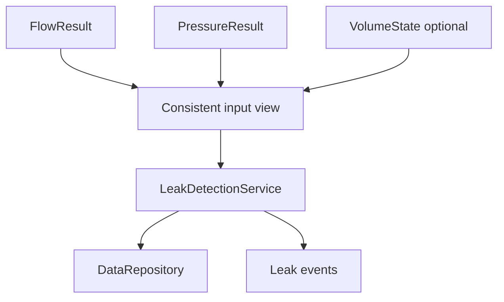
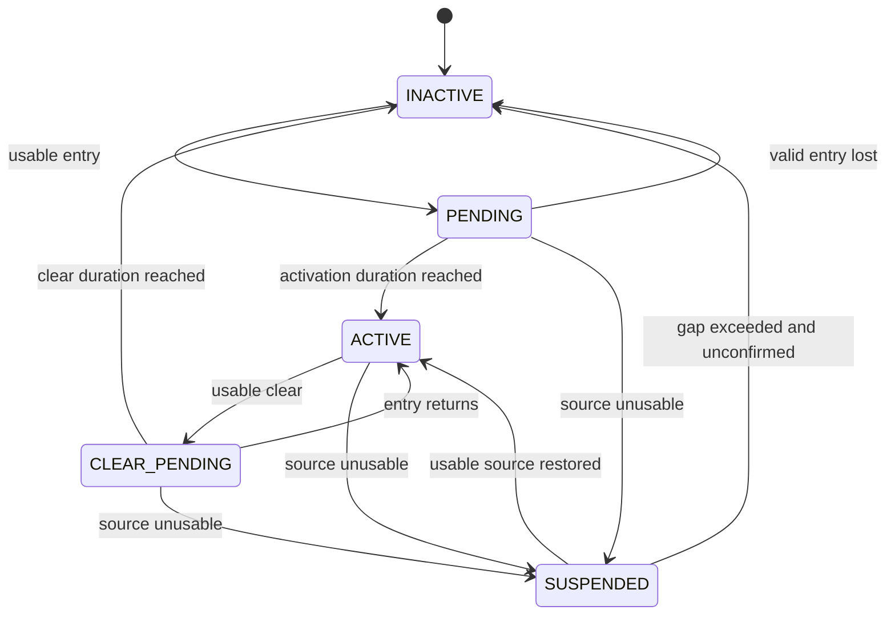
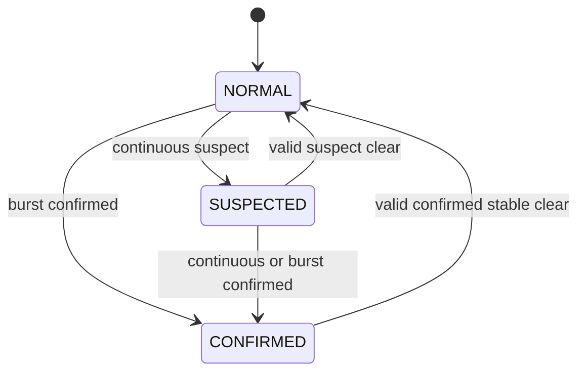

# Leak Detection

## 0. Trạng thái triển khai tại firmware baseline

- Firmware baseline: `4044414a7610d53b24c10814c12eaa09864e949e`
- Implementation status: **IMPLEMENTED ALGORITHM / PARTIAL PRODUCT BINDING**
- Đã có trong code: Leak config, detector/tracker and unit tests exist.
- Chưa hoàn tất: Full scheduling, repository publication, persistent diagnostics and interface binding are incomplete.
- Quy ước đọc: các mục requirement/contract bên dưới là thiết kế chuẩn; chỉ những capability được liệt kê “Đã có trong code” mới được xem là đã triển khai.


## 1. Mục đích

Tài liệu này định nghĩa firmware contract chính thức cho leak detection của MVP. Nó chuyển algorithm baseline và state/evidence model ở nhóm `01_principle` thành interface, ownership, timing, configuration, event và acceptance contract có thể triển khai nhất quán trên Linux simulator và STM32L433.

Tài liệu chốt:

- input admission từ `FlowResult`, `PressureResult` và optional `VolumeState`;
- vai trò của flow, pressure và volume;
- `LeakState`, `LeakEvaluationStatus`, evidence, reason và severity;
- continuous-flow, burst, pressure diagnostic và correlation rules;
- hysteresis, debounce, clear, invalid-gap và evidence lifetime;
- `LeakDetectionResult` và event-publication semantics;
- behavior theo boot, mode, reset, recovery và configuration apply;
- Linux simulation mapping, STM32 mapping và acceptance criteria;
- ranh giới persistence và các hạng mục cần hardware/dataset qualification.

Tài liệu không chốt threshold production khi chưa có hardware characterization và labeled dataset. Mọi giá trị số chưa được qualification phải là versioned configuration và được đánh dấu `TBD` hoặc `TEST_ONLY`.

---

## 2. Phạm vi

### 2.1. Trong phạm vi

- Forward continuous-flow evidence.
- Forward high-flow/burst evidence.
- Low-pressure, high-pressure và pressure-drop diagnostics.
- Flow-pressure correlation làm supporting evidence.
- `NORMAL`, `SUSPECTED`, `CONFIRMED` state machine.
- `NOT_READY`, `ACTIVE`, `DEGRADED`, `UNAVAILABLE` evaluation status.
- Deterministic evidence trackers dùng monotonic time.
- Runtime result, state-change event và diagnostics.
- Configuration validation và atomic apply.
- Synthetic dataset, golden model và Linux full-stack simulation.
- Portable implementation không cấp phát động trong runtime.

### 2.2. Operational contexts

| Context | Leak evaluation |
|---|---|
| Production `NORMAL` mode | Active khi có accepted production flow |
| Boot/initialization | `NORMAL + NOT_READY`; chưa kết luận “không leak” |
| Low power | Không tạo evidence từ thời gian trôi khi không có usable sample |
| Service/calibration | Không cập nhật production leak state bằng sample ngoài production |
| Recovery | Reset/suspend runtime evidence; cần production flow mới |
| Linux simulation | Chạy cùng algorithm/service với virtual monotonic time |
| Factory test | Có thể quan sát rule bằng test profile nhưng không nâng thành production evidence |

### 2.3. First implementation slice

First slice bắt buộc có:

1. Config validator.
2. Generic evidence tracker.
3. Continuous-flow tracker.
4. Burst tracker.
5. Low/high-pressure diagnostic tracker.
6. Optional pressure-drop tracker chỉ khi cadence/window contract đã đáp ứng.
7. Evidence aggregation và state machine.
8. `LeakDetectionService` tích hợp repository/event loop.
9. Deterministic unit, integration và simulator tests.

---

## 3. Source-of-truth và tài liệu liên quan

### 3.1. Thứ tự ưu tiên

| Ưu tiên | Nguồn | Nội dung sở hữu |
|---:|---|---|
| 1 | Decision registry/open decisions | Product/system decision đã chốt |
| 2 | `05_leak_detection_algorithm_baseline.md` | Algorithm rules và input-quality policy |
| 3 | `06_leak_detection_state_and_evidence_model.md` | State, evidence, reason, clear và event semantics |
| 4 | `04_data_model_and_ownership.md` | Common metadata, repository và ownership |
| 5 | `02_event_model_and_scheduler.md` | Event catalog, delivery và monotonic scheduling |
| 6 | Tài liệu này | Concrete firmware contract cho leak detection |
| 7 | Code/test | Implementation evidence, không tự thay đổi contract |

Khi tài liệu principle và code hiện tại khác nhau, không được âm thầm giữ enum cũ. Phải cập nhật data model, test và traceability theo contract đã chốt trong tài liệu này.

### 3.2. Upstream contract

- `14_flow_measurement_processing.md` sở hữu dấu, direction, canonical unit, validity, freshness, acceptance và provenance của `FlowResult`.
- `15_pressure_measurement_processing.md` sở hữu pressure unit, reference type, validity, freshness và processing flags.
- `18_volume_accumulation.md` sở hữu `VolumeState`, exactly-once flow consumption và persistent volume checkpoint.
- Leak service không đọc MAX35103, ZSSC3241, SPI hoặc I2C trực tiếp.

### 3.3. Downstream contract

- `DataRepository` sở hữu stable `RuntimeSnapshot` publication.
- LCD, BLE, telemetry và diagnostics chỉ đọc immutable `LeakDetectionResult`.
- Reporting cadence không thay đổi leak evaluation cadence.
- `StorageService` không lưu current leak state/timers trong MVP.

---

## 4. Requirement/decision được hiện thực

### 4.1. Firmware requirements

| ID | Requirement |
|---|---|
| `FW-LEAK-REQ-001` | Leak detection MUST chỉ dùng processed result, không đọc driver/raw device trực tiếp. |
| `FW-LEAK-REQ-002` | Forward flow MUST là primary state-changing evidence của MVP. |
| `FW-LEAK-REQ-003` | Pressure-only condition MUST NOT chuyển leak state sang `SUSPECTED` hoặc `CONFIRMED`. |
| `FW-LEAK-REQ-004` | Volume MUST NOT xác nhận leak một mình trong first slice. |
| `FW-LEAK-REQ-005` | Duration, debounce, gap và clear MUST dùng monotonic time. |
| `FW-LEAK-REQ-006` | Invalid, stale, rejected hoặc incompatible input MUST NOT được hiểu là zero/clear. |
| `FW-LEAK-REQ-007` | Reverse/unknown direction MUST NOT tạo hoặc clear flow leak evidence. |
| `FW-LEAK-REQ-008` | Mỗi evidence tracker MUST deterministic, bounded và không cấp phát động. |
| `FW-LEAK-REQ-009` | Entry và clear threshold MUST tách nhau để tạo hysteresis. |
| `FW-LEAK-REQ-010` | Burst confirmation MUST có positive debounce; một spike đơn không được confirm. |
| `FW-LEAK-REQ-011` | `LeakState` và `LeakEvaluationStatus` MUST là hai dimension trực giao. |
| `FW-LEAK-REQ-012` | Boot/reset MUST khởi tạo `NORMAL + NOT_READY` và reset runtime tracker. |
| `FW-LEAK-REQ-013` | `NORMAL + NOT_READY` MUST NOT được trình bày như verified no-leak. |
| `FW-LEAK-REQ-014` | Pressure unavailable với usable flow MUST tạo `DEGRADED`, không phải `UNAVAILABLE`. |
| `FW-LEAK-REQ-015` | Flow unusable quá allowed gap MUST tạo `UNAVAILABLE` và không progress/clear state. |
| `FW-LEAK-REQ-016` | Result publication MUST immutable và có stable identity/version. |
| `FW-LEAK-REQ-017` | State-change event MUST phát đúng một lần cho mỗi transition quan trọng. |
| `FW-LEAK-REQ-018` | Duplicate/out-of-order input hoặc evaluation tick MUST NOT tạo duplicate transition/event. |
| `FW-LEAK-REQ-019` | Configuration MUST validate đầy đủ và apply atomically tại safe boundary. |
| `FW-LEAK-REQ-020` | Threshold production chưa qualification MUST không được hard-code như product default. |
| `FW-LEAK-REQ-021` | Current leak state, timers và evidence trackers MUST RAM-only trong MVP. |
| `FW-LEAK-REQ-022` | Leak service MUST không ghi trực tiếp F-RAM, telemetry, BLE hoặc LCD. |
| `FW-LEAK-REQ-023` | Linux và STM32 MUST dùng cùng domain algorithm và result semantics. |
| `FW-LEAK-REQ-024` | Một source-event turn MUST tạo tối đa một final `RuntimeSnapshot`. |
| `FW-LEAK-REQ-025` | Pressure-drop rule MUST bị disable nếu cadence/window/reference contract không hợp lệ. |
| `FW-LEAK-REQ-026` | Wall-clock invalid MUST không dừng duration logic khi monotonic clock còn hợp lệ. |
| `FW-LEAK-REQ-027` | Service/calibration/simulated/replayed input MUST không nâng thành production leak evidence. |
| `FW-LEAK-REQ-028` | Algorithm output MUST giải thích được bằng primary reason, evidence và quality flags. |

### 4.2. Canonical authority decision

```text
Forward flow -> primary evidence; được phép đổi LeakState
Pressure     -> supporting/diagnostic evidence; không confirm một mình
Volume       -> optional context; không confirm một mình trong first slice
```

### 4.3. Canonical model migration

Code tại baseline Phase 10 còn có:

```text
LeakState: UNKNOWN / NORMAL / SUSPECTED / CONFIRMED
LeakEvaluationStatus:
  NOT_EVALUATED / INSUFFICIENT_DATA / EVALUATING / COMPLETED
```

Phase 11 phải chuyển sang:

```text
LeakState:
  NORMAL / SUSPECTED / CONFIRMED

LeakEvaluationStatus:
  NOT_READY / ACTIVE / DEGRADED / UNAVAILABLE
```

`UNKNOWN` chỉ có thể tồn tại như absence/uninitialized storage trước khi repository khởi tạo; nó không phải runtime product state sau init. `NOT_EVALUATED`, `INSUFFICIENT_DATA`, `EVALUATING`, `COMPLETED` không còn là canonical enum.

---

## 5. Trách nhiệm

### 5.1. Ownership matrix

| Object/resource | Producer | Single writer | Consumer |
|---|---|---|---|
| `FlowResult` | Flow pipeline | `FlowService`/repository owner | Volume, leak, snapshot |
| `PressureResult` | Pressure pipeline | `PressureService`/repository owner | Leak, snapshot |
| `VolumeState` | Volume algorithm | `VolumeAccumulator` | Leak context, storage, snapshot |
| `LeakDetectionConfig` | Config path | `ConfigRepository` | `LeakDetectionService` |
| Evidence trackers | Leak algorithm | `LeakDetectionService` | Aggregator/diagnostics |
| `LeakDetectionResult` | Leak algorithm | `LeakDetectionService` | Repository |
| Leak runtime event sequence | Leak service | `LeakDetectionService` | Event consumers |
| `RuntimeSnapshot` | Result repository | `DataRepository` | UI/telemetry/BLE/diagnostics |

### 5.2. `LeakDetectionService`

Service chịu trách nhiệm:

- capture một consistent input view;
- kiểm tra identity, generation, binding, validity, freshness, acceptance, purpose, origin và provenance;
- update tracker/aggregator/FSM bằng bounded step;
- sở hữu state, tracker, config generation và result/event sequence;
- publish immutable result;
- phát canonical leak events;
- apply config ở safe boundary;
- reset/quiesce theo mode/recovery policy;
- expose counters, không expose mutable tracker pointer.

### 5.3. Algorithm core

Pure/domain core:

- không biết event queue, repository, driver, storage hoặc platform;
- nhận input/config/time rõ ràng;
- trả về next state/result delta;
- không đọc global mutable state;
- không gọi heap, clock hệ điều hành hoặc logging;
- có thể unit test trực tiếp.

### 5.4. Repository và event loop

Repository giữ stable measurement/result copies. Event loop quyết định lúc gọi service và publish final snapshot, nhưng không được tự tính leak rule.

---

## 6. Ngoài phạm vi

- Acoustic leak classification.
- Machine-learning usage classification.
- Automatic shutoff valve.
- Controlled pressure-decay test.
- Reverse-flow leak rule; reverse chỉ là diagnostic riêng.
- Time-of-day hoặc learned user-behavior model.
- Cloud/fleet leak localization.
- Exact physical leak location.
- Production-qualified thresholds chưa có labeled evidence.
- Current leak-state/timer persistence.
- Telemetry wire schema, BLE GATT mapping và UI copy cụ thể.
- Thay đổi flow/pressure metrology để làm leak test pass.

---

## 7. Interface và dependency

### 7.1. Dependency direction



Dependency bắt buộc:

```text
drivers/platform -> measurement services -> repository/input view
                                      -> leak domain/service
                                      -> repository/event loop
```

Leak core không phụ thuộc ngược về driver/platform/storage/communication.

### 7.2. Logical input snapshot

```c
typedef struct {
    const FlowResult *flow;
    const PressureResult *pressure;
    const VolumeState *volume;
    uint64_t evaluation_monotonic_us;
    uint64_t source_snapshot_version;
    uint32_t runtime_generation;
    uint32_t active_config_version;
} LeakInputSnapshot;
```

Pointer trong logical example chỉ hợp lệ trong bounded evaluation call. Concrete API có thể dùng value copy hoặc snapshot handle, nhưng không được đọc flow, pressure và config qua các mutable version khác nhau mà không có compatibility rule.

### 7.3. Logical service API

```c
typedef enum {
    LEAK_UPDATE_NO_CHANGE,
    LEAK_UPDATE_RESULT_CHANGED,
    LEAK_UPDATE_STATE_CHANGED,
    LEAK_UPDATE_REJECTED_DUPLICATE,
    LEAK_UPDATE_REJECTED_STALE,
    LEAK_UPDATE_CONFIG_ERROR,
    LEAK_UPDATE_TIME_ERROR,
    LEAK_UPDATE_INTERNAL_ERROR
} LeakUpdateStatus;

void LeakDetectionService_Init(
    LeakDetectionService *self,
    const LeakDetectionConfig *config,
    uint64_t now_monotonic_us);

LeakUpdateStatus LeakDetectionService_Evaluate(
    LeakDetectionService *self,
    const LeakInputSnapshot *input,
    LeakDetectionResult *result_out);

bool LeakDetectionService_ApplyConfig(
    LeakDetectionService *self,
    const LeakDetectionConfig *candidate,
    uint64_t now_monotonic_us);

void LeakDetectionService_Reset(
    LeakDetectionService *self,
    uint32_t new_generation,
    uint64_t now_monotonic_us);
```

Tên và layout concrete có thể đổi, nhưng behavior và ownership không được đổi.

### 7.4. Evaluation triggers

Baseline dùng:

- new accepted `FlowResult`: trigger chính cho flow evidence và state;
- new accepted `PressureResult`: update pressure evidence/correlation;
- monotonic evaluation tick: expiry, suspension timeout và duration boundary khi cần;
- config/mode/reset event: safe rebase hoặc reset.

Tick không được tái sử dụng stale sample để tích lũy evidence vô hạn. Nếu không có new usable sample, algorithm chỉ được đánh giá freshness/gap/expiry bằng current monotonic time.

### 7.5. Source-tree mapping

Mapping đề xuất phù hợp source tree Phase 10:

```text
2.firmware/src/services/leak_detection.h
2.firmware/src/services/leak_detection.c
2.firmware/src/services/leak_config.h
2.firmware/src/services/leak_config.c
2.firmware/src/services/leak_tracker.h
2.firmware/src/services/leak_tracker.c
2.firmware/tests/test_leak_config.c
2.firmware/tests/test_leak_tracker.c
2.firmware/tests/test_leak_state.c
2.firmware/tests/test_leak_service.c
2.firmware/tests/test_leak_e2e.c
2.firmware/tests/fixtures/leak/
```

Không tạo một parallel framework mới nếu repository/CMake/service pattern hiện có đáp ứng được.

---

## 8. Data model và đơn vị

### 8.1. Canonical units

| Quantity | Unit/type |
|---|---|
| Flow | signed `µL/s`, `int64_t` |
| Pressure | `Pa`, `int32_t` |
| Volume context | `µL`, `uint64_t` |
| Monotonic time/duration | `µs`, `uint64_t` |
| Confidence nếu giữ compatibility | permille `0..1000`, không phải acceptance authority |
| Version/flags | fixed-width unsigned integer |

Không dùng floating point làm canonical runtime storage nếu fixed-point/integer đã đủ. Test oracle có thể dùng higher precision độc lập.

### 8.2. Input admission

Flow được phép progress/clear tracker khi tất cả điều kiện đúng:

```text
meta.validity   == DATA_VALID
meta.freshness  == DATA_FRESH
meta.acceptance == DATA_ACCEPTED
meta.purpose    == MEAS_PURPOSE_PRODUCTION
meta.origin     == DATA_ORIGIN_LIVE_DEVICE
meta.provenance == PROVENANCE_MEASURED
source generation current
binding/config/profile compatible
sample identity newer hoặc chưa consumed
direction và signed value consistent
```

Pressure supporting input dùng admission tương tự và phải có compatible pressure reference/config. Pressure unavailable không vô hiệu flow-only rules.

`SIMULATED_DEVICE` và `REPLAYED_FIXTURE` hợp lệ trong Linux test path nhưng không được giả mạo `LIVE_DEVICE` trong production admission. Simulator có explicit build/test policy để chạy cùng rule với test provenance.

### 8.3. Flow direction policy

| Direction | Entry evidence | Clear evidence | Diagnostic |
|---|---:|---:|---:|
| Forward dương | Có | Có khi dưới clear threshold | Có |
| Canonical zero/none | Không | Có nếu zero là accepted result | Có |
| Reverse âm | Không | Không | Reverse diagnostic riêng |
| Unknown/inconsistent | Không | Không | Data-quality fault |

Không dùng `abs(flow_ul_per_s)` cho leak evidence.

### 8.4. Canonical state và status

```c
typedef enum {
    LEAK_STATE_NORMAL,
    LEAK_STATE_SUSPECTED,
    LEAK_STATE_CONFIRMED
} LeakState;

typedef enum {
    LEAK_EVAL_NOT_READY,
    LEAK_EVAL_ACTIVE,
    LEAK_EVAL_DEGRADED,
    LEAK_EVAL_UNAVAILABLE
} LeakEvaluationStatus;
```

Status precedence:

```text
chưa có initial valid production flow -> NOT_READY
flow unusable quá maximum evidence gap -> UNAVAILABLE
flow usable, pressure unavailable và pressure assist enabled -> DEGRADED
flow usable, pressure usable hoặc pressure assist disabled -> ACTIVE
```

### 8.5. Evidence types và phases

```c
typedef enum {
    LEAK_EVIDENCE_CONTINUOUS_FLOW = 1u << 0,
    LEAK_EVIDENCE_HIGH_FLOW = 1u << 1,
    LEAK_EVIDENCE_LOW_PRESSURE = 1u << 2,
    LEAK_EVIDENCE_HIGH_PRESSURE = 1u << 3,
    LEAK_EVIDENCE_PRESSURE_DROP = 1u << 4,
    LEAK_EVIDENCE_FLOW_PRESSURE_CORRELATED = 1u << 5
} LeakEvidenceFlag;

typedef enum {
    LEAK_EVIDENCE_INACTIVE,
    LEAK_EVIDENCE_PENDING,
    LEAK_EVIDENCE_ACTIVE,
    LEAK_EVIDENCE_CLEAR_PENDING,
    LEAK_EVIDENCE_SUSPENDED
} LeakEvidencePhase;
```

Validity/freshness faults là quality flags, không phải leak evidence.

### 8.6. Evidence tracker

Logical fields:

```c
typedef struct {
    LeakEvidencePhase phase;
    LeakEvidencePhase suspended_from_phase;
    uint64_t entry_start_us;
    uint64_t active_since_us;
    uint64_t clear_start_us;
    uint64_t last_usable_sample_us;
    uint64_t last_source_sequence;
    uint64_t last_result_version;
    uint32_t source_generation;
    uint32_t activation_count;
} LeakEvidenceTracker;
```

Tracker giữ timestamps và bounded context, không giữ unbounded history. Pressure-drop chỉ được giữ fixed-capacity window đã validate.

### 8.7. Reason và severity

```c
typedef enum {
    LEAK_REASON_NONE,
    LEAK_REASON_CONTINUOUS_FLOW,
    LEAK_REASON_HIGH_FLOW_BURST,
    LEAK_REASON_FLOW_PRESSURE_CORRELATED
} LeakPrimaryReason;

typedef enum {
    LEAK_SEVERITY_NONE,
    LEAK_SEVERITY_ADVISORY,
    LEAK_SEVERITY_WARNING,
    LEAK_SEVERITY_CRITICAL
} LeakSeverity;
```

Primary-reason precedence:

```text
HIGH_FLOW_BURST > CONTINUOUS_FLOW > NONE
```

Correlation được publish như supporting reason/evidence. Nó không bypass flow debounce. Nếu product muốn correlation trở thành primary reason, phải cập nhật principle state model và tests trước.

Baseline severity:

| Condition | Severity direction |
|---|---|
| Normal, no pressure diagnostic | `NONE` |
| Pressure-only diagnostic | `ADVISORY` |
| Suspected continuous flow | `WARNING` |
| Confirmed continuous flow | `WARNING` |
| Confirmed burst | `CRITICAL` |

Giá trị threshold không được suy ra từ severity.

### 8.8. Canonical result

`LeakDetectionResult` phải chứa tối thiểu:

```c
typedef struct {
    uint64_t result_version;
    uint64_t state_change_sequence;
    LeakState state;
    LeakEvaluationStatus evaluation_status;
    LeakPrimaryReason primary_reason;
    LeakSeverity severity;
    uint32_t reason_flags;
    uint32_t evidence_flags;
    uint32_t quality_flags;
    uint64_t state_entered_monotonic_us;
    uint64_t latest_evidence_monotonic_us;
    uint64_t continuous_duration_us;
    uint64_t pressure_evidence_duration_us;
    uint64_t source_snapshot_version;
    uint64_t flow_result_version;
    uint64_t pressure_result_version;
    uint64_t volume_state_version;
    uint32_t runtime_generation;
    uint32_t config_version;
    uint32_t algorithm_version;
    uint32_t profile_version;
    int64_t event_wall_time_s;
    TimeQuality event_time_quality;
} LeakDetectionResult;
```

Concrete layout phải cân đối memory budget. Field không dùng có explicit zero/invalid semantics. Không serialize runtime struct trực tiếp thành persistent/wire record.

`confidence_permille` trong Phase 10 model không được dùng làm state authority. Nếu giữ vì ABI compatibility, nó phải là derived diagnostic với documented mapping; nếu chưa có validated confidence model, đặt `0` và đánh dấu unavailable hoặc loại bỏ trong controlled schema update.

### 8.9. Quality flags

Candidate flags:

```text
LEAK_QUALITY_FLOW_INVALID
LEAK_QUALITY_FLOW_STALE
LEAK_QUALITY_FLOW_REJECTED
LEAK_QUALITY_FLOW_INCOMPATIBLE
LEAK_QUALITY_PRESSURE_INVALID
LEAK_QUALITY_PRESSURE_STALE
LEAK_QUALITY_PRESSURE_INCOMPATIBLE
LEAK_QUALITY_TIME_INVALID
LEAK_QUALITY_CONFIG_TEST_ONLY
LEAK_QUALITY_HISTORY_INSUFFICIENT
```

Quality flag không tự clear hoặc confirm leak.

---

## 9. Algorithm và state machine

### 9.1. Generic evidence tracker FSM



Implementation phải nhớ `suspended_from_phase` để phục hồi đúng short-gap context. Diagram rút gọn không thay thế transition table/test trong `06_leak_detection_state_and_evidence_model.md`.

### 9.2. Continuous-flow rule

Entry:

```text
usable production forward flow
AND flow_ul_per_s >= continuous_entry_ul_per_s
AND flow_ul_per_s < burst_entry_ul_per_s
```

Behavior:

- entry liên tục đến `continuous_suspect_duration_us` tạo suspected condition;
- entry liên tục đến `continuous_confirm_duration_us` tạo confirmed condition;
- accepted forward/zero flow `<= continuous_clear_ul_per_s` bắt đầu clear;
- flow trong hysteresis band giữ phase hiện tại, không toggle;
- invalid/stale/reverse/unknown suspend hoặc reset theo gap policy, không clear;
- confirm duration phải lớn hơn hoặc bằng suspect duration.

### 9.3. High-flow/burst rule

Entry:

```text
usable production forward flow
AND flow_ul_per_s >= burst_entry_ul_per_s
```

Behavior:

- phải duy trì ít nhất `burst_confirm_duration_us > 0`;
- một sample spike không confirm;
- clear bắt đầu khi usable flow `<= burst_clear_ul_per_s`;
- nếu burst clear nhưng continuous condition còn active, state fallback sang continuous context thay vì clear sớm;
- pressure correlation có thể enrich severity/reason flags nhưng không rút ngắn burst debounce.

### 9.4. Low/high-pressure diagnostics

- Low pressure active sau threshold, debounce và hysteresis riêng.
- High pressure active sau threshold, debounce và hysteresis riêng.
- Pressure-only evidence không đổi `LeakState`.
- Invalid/stale pressure suspend/expire pressure tracker theo config.
- Reference type của `PressureResult` phải tương thích config/profile.

### 9.5. Pressure-drop rule

Chỉ enable nếu config xác định rõ:

- pressure sampling cadence;
- fixed trend window;
- minimum usable samples;
- maximum gap;
- reference type;
- drop formula và threshold;
- history capacity và overflow behavior.

Baseline calculation direction:

```text
pressure_drop_pa = oldest_usable_pressure_pa - newest_usable_pressure_pa
```

Hai sample tùy ý không được coi là valid trend. Nếu window thiếu sample hoặc có incompatible generation/config, publish insufficient-history quality và không activate evidence.

### 9.6. Flow-pressure correlation

Correlation active khi:

```text
primary flow evidence active
AND supporting pressure evidence active/fresh
AND evidence timestamps within correlation_window_us
```

Correlation chỉ thêm evidence/reason/severity context. Nó không tạo flow evidence và không confirm pressure-only condition.

### 9.7. Evidence aggregation

Aggregator nhận output tracker; không tính lại raw measurements.

```text
burst confirmed      -> confirmed candidate, reason HIGH_FLOW_BURST
continuous confirmed -> confirmed candidate, reason CONTINUOUS_FLOW
continuous suspected -> suspected candidate
pressure only        -> state unchanged, diagnostic result may change
no valid clear       -> state unchanged
```

### 9.8. Leak state machine



Invalid/stale/unknown/reverse input không phải transition trigger về `NORMAL`.

### 9.9. Clear policy

Clear chỉ hợp lệ khi:

- flow sample usable theo admission policy;
- direction là forward dưới clear threshold hoặc canonical accepted zero;
- clear condition liên tục đủ configured duration;
- sample sequence/time progress hợp lệ;
- không có burst/continuous condition yêu cầu giữ state.

`CONFIRMED` dùng `confirmed_clear_duration_us`, có thể khác suspect clear duration. Pressure recovery không được clear flow-confirmed leak một mình.

### 9.10. Evidence gap policy

- Short unusable gap: tracker chuyển `SUSPENDED`, timer không progress và không clear.
- Source restored trong allowed gap: resume theo documented phase/timing policy.
- Gap vượt `maximum_evidence_gap_us`: unconfirmed pending context reset.
- Confirmed state được giữ; status thành `UNAVAILABLE` cho đến usable flow trở lại.
- Không cộng toàn bộ gap vào active duration nếu không có usable sample chứng minh continuity.

### 9.11. Duplicate và out-of-order

Identity tối thiểu dùng:

```text
source_generation + sample_sequence + result_version
```

Duplicate không update timer, result version hoặc event sequence. Out-of-order sample bị reject và tăng diagnostic counter. Generation mới làm reset/rebase tracker theo mode/recovery/config policy.

### 9.12. Boot, reset và recovery

Sau init/reset:

```text
state             = NORMAL
evaluation_status = NOT_READY
primary_reason    = NONE
evidence_flags    = 0
trackers          = INACTIVE
runtime timers    = reset
```

New valid production flow mới được đưa status sang `ACTIVE` hoặc `DEGRADED`.

### 9.13. Configuration replacement

Safe apply:

```text
validate candidate
  -> commit persistent config if required
  -> quiesce evaluation at event boundary
  -> atomically install whole config/version
  -> reset/rebase affected trackers
  -> publish apply result
  -> require new usable input
```

Không đánh giá một turn bằng hỗn hợp threshold cũ/mới.

---

## 10. Timing, timeout và non-blocking behavior

### 10.1. Time authority

- `sample_monotonic_us`: freshness và sample ordering.
- `evaluation_monotonic_us`: duration boundary, expiry và scheduled tick.
- wall time: event timestamp khi valid; không dùng cho rule.

### 10.2. Duration boundary

Activation/clear xảy ra khi elapsed `>= configured_duration`. Test bắt buộc tại `duration - 1`, `duration`, `duration + 1` microsecond với checked subtraction.

### 10.3. Freshness

Freshness lấy theo upstream per-stream policy. Leak service được phép áp dụng stricter maximum age đã validate nhưng không được tự nâng stale thành fresh.

### 10.4. Scheduled evaluation

Scheduled tick dùng monotonic scheduler và stable generation/job identity. Tick phải:

- bounded;
- idempotent;
- không fabricate sample;
- không progress evidence bằng stale last-known value;
- chỉ publish khi material result/status/evidence thay đổi hoặc policy yêu cầu heartbeat riêng.

### 10.5. Bounded work

Mỗi evaluation:

- xử lý fixed number of trackers;
- pressure history có fixed capacity;
- không loop theo elapsed time;
- không catch-up từng missed sample;
- không blocking I/O;
- không cấp phát động.

### 10.6. Overflow và backward time

- Dùng checked subtraction/addition.
- Backward monotonic time là internal/platform fault; không clear/confirm.
- Duration config phải nhỏ hơn safe arithmetic horizon.
- Counter saturation phải visible; không wrap silent.

### 10.7. Low-power behavior

Monotonic time có thể tiến qua sleep, nhưng evidence chỉ progress khi sample continuity policy chứng minh input còn usable. Wake sau long gap phải đánh giá gap/freshness trước duration.

---

## 11. Configuration

### 11.1. Logical configuration

```c
typedef struct {
    uint32_t schema_version;
    uint32_t config_version;
    uint32_t algorithm_version;
    uint32_t profile_version;

    int64_t continuous_entry_ul_per_s;
    int64_t continuous_clear_ul_per_s;
    uint64_t continuous_suspect_duration_us;
    uint64_t continuous_confirm_duration_us;
    uint64_t continuous_clear_duration_us;

    int64_t burst_entry_ul_per_s;
    int64_t burst_clear_ul_per_s;
    uint64_t burst_confirm_duration_us;
    uint64_t burst_clear_duration_us;

    bool pressure_assist_enabled;
    int32_t low_pressure_entry_pa;
    int32_t low_pressure_clear_pa;
    int32_t high_pressure_entry_pa;
    int32_t high_pressure_clear_pa;
    uint64_t pressure_activation_duration_us;
    uint64_t pressure_clear_duration_us;

    bool pressure_drop_enabled;
    int32_t pressure_drop_entry_pa;
    int32_t pressure_drop_clear_pa;
    uint64_t pressure_drop_window_us;
    uint32_t pressure_drop_min_samples;

    uint64_t maximum_flow_age_us;
    uint64_t maximum_pressure_age_us;
    uint64_t maximum_evidence_gap_us;
    uint64_t correlation_window_us;
    uint64_t confirmed_clear_duration_us;
    uint64_t evaluation_period_us;
} LeakDetectionConfig;
```

Tên field concrete có thể thay đổi nhưng dependency semantics phải giữ.

### 11.2. Validation rules

Validator tối thiểu phải reject khi:

- continuous clear không nhỏ hơn continuous entry;
- continuous entry không nhỏ hơn burst entry;
- burst clear không nhỏ hơn burst entry;
- suspect/confirm/clear/burst debounce bằng zero khi rule enabled;
- continuous confirm nhỏ hơn suspect duration;
- pressure low/high thresholds hoặc hysteresis không hợp lệ;
- pressure-drop window/min samples không phù hợp cadence/history capacity;
- maximum evidence gap nhỏ hơn freshness/evaluation requirements;
- correlation window zero/unbounded khi correlation enabled;
- confirmed clear duration zero/unbounded;
- timestamp arithmetic có thể overflow;
- schema/algorithm/profile version unsupported;
- pressure reference type không compatible;
- production profile chưa qualified nhưng bị đánh dấu production default.

### 11.3. Disabled rule semantics

Optional rule phải có explicit enable flag. Disabled tracker luôn `INACTIVE`, không emit event/quality fault và không yêu cầu input của rule đó.

### 11.4. Default policy

Repository có thể chứa test-only synthetic defaults để CI chạy, nhưng phải gắn `TEST_ONLY`. Production build không được claim qualified leak detection nếu threshold/duration chưa được hardware/labeled-data sign-off.

### 11.5. Runtime allowlist

Runtime config chỉ được đổi các field đã định nghĩa và validate. Schema/algorithm version, buffer capacity hoặc reference semantics không được hot-change nếu cần thay layout/code path.

---

## 12. Event model, publication và idempotence

### 12.1. Canonical events

Giữ event catalog đã chốt:

```text
EVT_LEAK_RESULT_UPDATED = 0x0302
EVT_LEAK_STATE_CHANGED  = 0x0303
```

Không tạo alias event mới cho cùng semantics.

### 12.2. Result-updated semantics

`EVT_LEAK_RESULT_UPDATED` chỉ phát khi material field thay đổi, ví dụ:

- evaluation status;
- evidence/reason/quality flags;
- severity;
- state;
- config/generation binding.

Không phát mỗi tick chỉ vì evaluation đã chạy.

### 12.3. State-changed semantics

Phát đúng một lần khi:

- `NORMAL -> SUSPECTED`;
- `NORMAL/SUSPECTED -> CONFIRMED`;
- `SUSPECTED/CONFIRMED -> NORMAL` qua valid clear;
- policy-significant primary reason change nếu event contract mở rộng rõ ràng.

Repeated unchanged evaluation không phát lại state-change event.

### 12.4. Logical payload

Payload phải reference/copy stable data:

```text
result_version
state_change_sequence
previous_state
current_state
primary_reason
severity
config_version
runtime_generation
event monotonic time
optional valid wall time
```

Không queue pointer tới mutable service state.

### 12.5. Repository sequence

```text
measurement result accepted
  -> leak evaluates consistent view
  -> repository accepts LeakDetectionResult
  -> leak event(s) queued
  -> one final RuntimeSnapshot published for the turn
```

Nếu evaluation tick là một turn riêng, nó cũng chỉ tạo tối đa một final snapshot.

### 12.6. Queue failure

Result owner không rollback state vì noncritical notification queue failure. Failure phải visible qua counter/health path và event delivery class phải được chốt theo `02_event_model_and_scheduler.md`.

---

## 13. Error detection và recovery

### 13.1. Error taxonomy

| Class | Ví dụ | Behavior |
|---|---|---|
| Input quality | invalid/stale/rejected flow | Suspend/reset theo gap; không clear |
| Compatibility | generation/binding/config mismatch | Reject input, diagnostic |
| Time | backward monotonic/overflow | Freeze safe state, internal fault |
| Configuration | dependency/version invalid | Reject toàn bộ candidate |
| Pressure history | thiếu sample/gap | Disable evidence cho window đó |
| Publication | repository/event queue failure | Preserve owner state; report fault |
| Internal invariant | illegal phase/state | Fail safe, diagnostic/recovery request |

### 13.2. No fabricated success

- Không biến invalid flow thành zero.
- Không biến missing pressure thành normal pressure.
- Không biến missing history thành no pressure drop.
- Không clear vì timeout không có usable data.
- Không tăng confidence vì input lâu không đổi.

### 13.3. Recovery hierarchy

1. Reject duplicate/stale/incompatible input.
2. Suspend affected tracker với short gap.
3. Reset unconfirmed context khi gap vượt policy.
4. Giữ confirmed state và set `UNAVAILABLE` nếu flow mất lâu.
5. Reset runtime evidence khi generation/recovery thay đổi.
6. Yêu cầu system recovery nếu monotonic/invariant fault không thể xử lý cục bộ.

### 13.4. Diagnostic counters

Tối thiểu:

```text
evaluations_total
material_updates_total
state_transitions_total
duplicate_inputs_rejected
out_of_order_inputs_rejected
flow_unusable_total
pressure_unusable_total
short_gap_suspensions
over_gap_resets
config_rejections
time_faults
repository_publish_failures
event_post_failures
```

Counters là diagnostic, không phải algorithm evidence.

---

## 14. Persistence và reboot policy

### 14.1. MVP policy

Không persist:

- current `LeakState`;
- evidence phases;
- pending/active/clear timestamps;
- evaluation status;
- current reason/severity;
- last consumed flow identity của leak service.

Sau reboot, runtime bắt đầu `NORMAL + NOT_READY` và đánh giá lại từ production samples mới.

### 14.2. Volume checkpoint independence

Phase 10 volume/F-RAM checkpoint không cấp quyền lưu leak state. `VolumeState` restored có thể làm context, nhưng không được biến thành proof rằng current leak condition còn active.

### 14.3. Historical event persistence

Last confirmed event/history được deferred. Muốn thêm phải:

1. sửa `22_persistent_storage.md` và memory map;
2. định nghĩa record schema/version/integrity;
3. phân tích wear/capacity/power-loss behavior;
4. dùng asynchronous `StorageService`;
5. thêm corruption/restore/migration tests.

Không dùng ad hoc vùng F-RAM reserved 64 byte.

---

## 15. Linux simulation mapping

### 15.1. Reuse boundary

Simulator phải compile/run cùng:

- config validator;
- evidence trackers;
- aggregator/FSM;
- result builder;
- `LeakDetectionService` integration.

Chỉ clock, device peer, scenario injection và platform provider là Linux-specific.

### 15.2. Dataset schema

Mỗi record nên có:

```text
scenario_id
monotonic_us
flow value/direction/identity/quality/metadata
pressure value/reference/identity/quality/metadata
optional volume context
config/profile/generation action
expected evidence phases/flags
expected state/status/reason/severity
expected event delta
```

### 15.3. Minimum deterministic scenarios

1. Boot without data.
2. First valid zero-flow sample.
3. Stable normal flow below entry.
4. Entry boundary below/exact/above.
5. Suspect duration before/exact/after.
6. Continuous confirm before/exact/after.
7. Burst spike shorter than debounce.
8. Burst confirm at exact duration.
9. Continuous hysteresis band.
10. Valid stable clear.
11. Short invalid gap and recovery.
12. Over-limit gap while suspected.
13. Over-limit gap while confirmed.
14. Pressure-only low/high/drop.
15. Flow-pressure correlation.
16. Missing/stale pressure with valid flow.
17. Reverse flow while normal/suspected/confirmed.
18. Duplicate/out-of-order input.
19. Config atomic replacement.
20. Recovery/source generation change.
21. Wall-clock invalid with valid monotonic time.
22. Reporting enabled/disabled invariance.
23. Reboot after confirmed state.
24. Long virtual-time run near arithmetic boundaries.

### 15.4. Independent golden model

Golden model phải độc lập với production implementation:

- không gọi production tracker/FSM để sinh expected output;
- dùng declarative table hoặc reference implementation riêng;
- cố định config/profile/version trong dataset;
- thay đổi golden phải giải thích rule/config change;
- so sánh state, status, reason, evidence, timestamps và event sequence.

### 15.5. Determinism

Cùng scenario/config/seed phải tạo byte-for-byte normalized trace giống nhau. Test không sleep theo wall clock và không phụ thuộc CPU speed.

---

## 16. STM32 mapping

### 16.1. Portable core

Algorithm/service domain là pure C fixed-width, không gọi POSIX. STM32 adapter chỉ cung cấp monotonic clock, event ingress và repository/platform binding.

### 16.2. Memory

- Static allocation.
- Fixed tracker count.
- Pressure trend dùng compile-time bounded capacity.
- Không lưu toàn bộ measurement history.
- Kích thước state/result/config phải được đo và ghi trong build report.

### 16.3. ISR/callback

ISR không chạy leak rule, không publish `LeakDetectionResult` và không đổi state. ISR chỉ capture/post bounded hardware event; evaluation chạy main cooperative context.

### 16.4. WCET và watchdog

Đo worst-case evaluation trên target hoặc cycle-accurate/representative bench khi có hardware. Event loop phải giữ finite budget và watchdog progress contract.

### 16.5. Hardware qualification

STM32 compile/pass không đủ chốt threshold. Cần flow/pressure rig và labeled ground truth để qualification detection latency, false positive/negative và resource behavior.

---

## 17. Test và acceptance criteria

### 17.1. Configuration tests

- Mỗi dependency invalid bị reject.
- Boundary min/max và overflow.
- Disabled rule semantics.
- Test-only vs qualified profile.
- Atomic apply; không mixed version.

### 17.2. Tracker tests

- Mọi phase transition.
- Entry/clear below-exact-above.
- Duration one-before/exact/one-after.
- Hysteresis stability.
- Short-gap suspend/resume.
- Over-gap reset.
- Duplicate/out-of-order idempotence.
- Backward time/internal fault.

### 17.3. Rule tests

- Continuous suspect và confirm.
- Burst debounce và direct confirm.
- Burst-to-continuous fallback.
- Pressure low/high/drop.
- Pressure-only cannot change leak state.
- Correlation cannot bypass flow duration.
- Reverse/unknown cannot enter/clear.

### 17.4. State/result/event tests

- Full state-transition table.
- Evaluation-status precedence.
- Primary-reason precedence.
- Stable clear.
- Confirmed state under unavailable flow.
- Result version changes only on material update policy.
- State event exactly once.
- Immutable payload và stable identity.

### 17.5. Integration tests

- Real Phase 9 flow path to leak service.
- Real Phase 9 pressure path enriches evidence.
- Phase 10 volume exists but does not become confirmation authority.
- Repository consistent input and one-final-snapshot.
- Mode/service/recovery generation behavior.
- Config transaction/apply behavior.
- Queue duplicate/late event behavior.

### 17.6. Cross-platform tests

- Same synthetic fixtures on Linux and STM32-compatible core build.
- Same normalized trace/golden result.
- Sanitizer and warnings-as-errors on Linux.
- Static analysis for overflow, lifetime và enum completeness.

### 17.7. Acceptance criteria

Phase 11 implementation chỉ hoàn tất khi:

- [ ] Canonical enum/result/config đã thay model Phase 10 cũ.
- [ ] Tất cả `FW-LEAK-REQ-*` có code/test/document evidence.
- [ ] Continuous, burst, pressure diagnostic và correlation semantics pass.
- [ ] Pressure-only không confirm trong mọi unit/integration scenario.
- [ ] Invalid/stale/reverse không clear state.
- [ ] Duplicate evaluation không tạo duplicate event.
- [ ] Boot/reboot trả `NORMAL + NOT_READY`.
- [ ] Current leak runtime state không ghi F-RAM.
- [ ] Full CTest, determinism, sanitizer và warning gates pass.
- [ ] Phase 8–10 regression pass.
- [ ] Test profiles được ghi `TEST_ONLY`; không claim production qualification.
- [ ] README/status phản ánh implementation-complete và qualification-deferred riêng biệt.

---

## 18. Traceability

### 18.1. Requirement mapping

| Contract area | Principle source | Firmware evidence |
|---|---|---|
| MVP rules | `05` §§3, 11–15 | tracker/rule tests |
| State/status | `06` §§4–5, 12–17 | state/status tests |
| Evidence phase | `06` §§6–8, 20–21 | tracker tests |
| Reason/severity | `06` §§9–11, 22–23 | result tests |
| Event/idempotence | `06` §19; core event model | event tests |
| Validation datasets | `07` §§8–24 | fixtures/golden/e2e |
| Input metadata | data model §8 | admission tests |
| Flow upstream | `14` §§7–10 | integration tests |
| Pressure upstream | `15` §§7–10 | integration tests |
| Volume boundary | `18` §§7–9 | no-authority/e2e tests |
| Persistence boundary | `22`; this document §14 | reboot/storage tests |

### 18.2. Suggested implementation mapping

| Artifact | Responsibility |
|---|---|
| `leak_config.*` | Config type, defaults label và validation |
| `leak_tracker.*` | Generic tracker và bounded pressure window |
| `leak_detection.*` | Rules, aggregation, FSM, result builder/service |
| `data_model.h` | Canonical public enums/result |
| `app_event*` | Existing canonical event IDs/payload binding |
| `data_repository.*` | Leak result accept và final snapshot |
| simulator fixtures | Deterministic scenario input |
| leak tests | Unit, integration, golden, e2e |

### 18.3. Suggested test IDs

```text
LEAK-CFG-xxx    configuration validation
LEAK-TRK-xxx    evidence tracker
LEAK-RULE-xxx   continuous/burst/pressure/correlation
LEAK-FSM-xxx    state/status/reason transition
LEAK-EVT-xxx    publication/idempotence
LEAK-INT-xxx    repository/upstream integration
LEAK-SIM-xxx    simulator/golden/determinism
LEAK-RBT-xxx    reboot/persistence boundary
```

---

## 19. Open issues / NEEDS_VERIFICATION

| ID | Item | Blocking scope |
|---|---|---|
| `LEAK-NV-001` | Production continuous-flow thresholds/durations | Production qualification, không block synthetic implementation |
| `LEAK-NV-002` | Production burst thresholds/debounce | Production qualification |
| `LEAK-NV-003` | Pressure low/high thresholds theo sensor reference/profile | Pressure diagnostic qualification |
| `LEAK-NV-004` | Pressure cadence/window đủ cho pressure-drop rule | Rule enablement |
| `LEAK-NV-005` | Maximum evidence gap và clear durations từ real usage data | Product tuning |
| `LEAK-NV-006` | Severity mapping/UI wording product review | Presentation contract |
| `LEAK-NV-007` | Có giữ `confidence_permille` vì ABI hay remove | Data-model migration |
| `LEAK-NV-008` | Exact event delivery class/payload layout | Event integration |
| `LEAK-NV-009` | STM32 WCET/stack measurement | Target qualification |
| `LEAK-NV-010` | Labeled ground truth và acceptance targets | Field/product readiness |

Các item này không cho phép AI tự chọn production value. Giá trị synthetic phải được gắn test-only và nằm trong fixture/profile rõ ràng.

---

## 20. Revision history

| Version | Date | Change |
|---|---|---|
| `0.1` | 2026-07-15 | Initial canonical firmware contract for Phase 11 leak detection; aligned with Phase 10 repository baseline and principle documents 04–07. |


