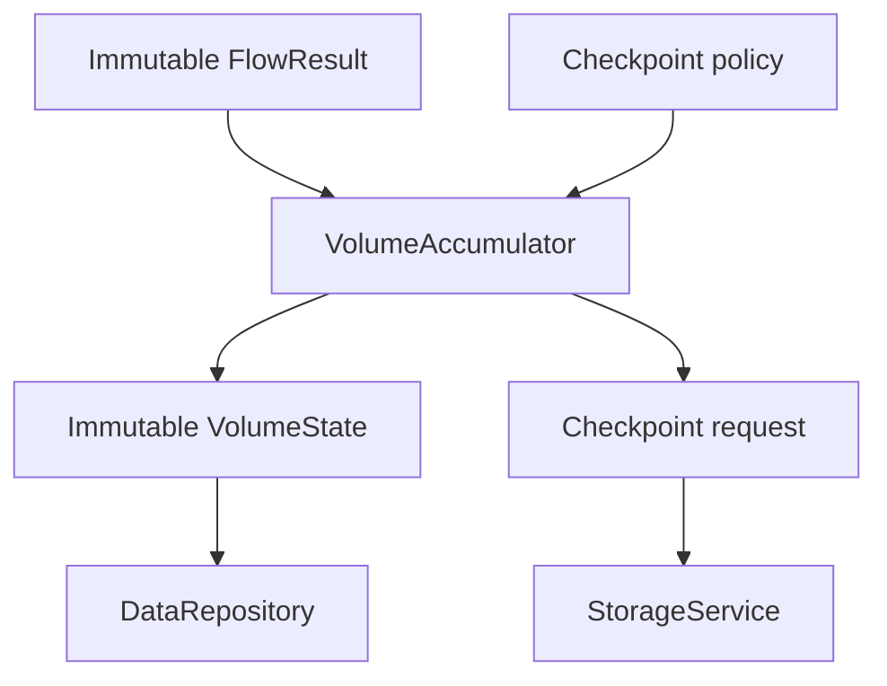
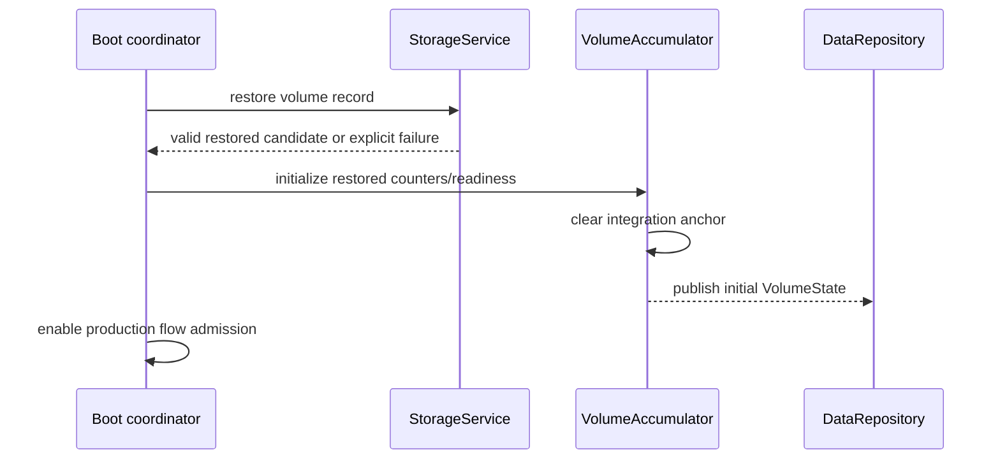
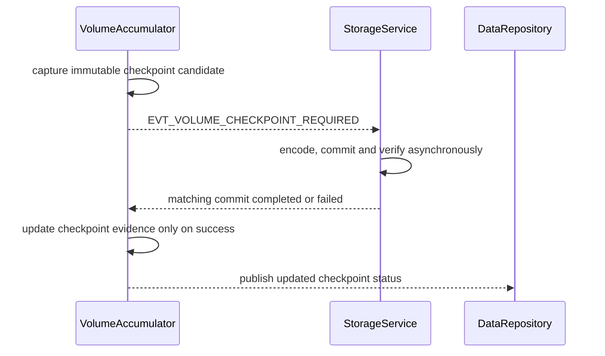

# Volume Accumulation

## 0. Trạng thái triển khai tại firmware baseline

- Firmware baseline: `4044414a7610d53b24c10814c12eaa09864e949e`
- Implementation status: **IMPLEMENTED ALGORITHM + STORAGE TEST FOUNDATION**
- Đã có trong code: Admission, arithmetic, duplicate guard, reset, checkpoint policy and boot/power-loss tests exist.
- Chưa hoàn tất: Full AppComposition ownership and target FRAM/I2C binding remain incomplete.
- Quy ước đọc: các mục requirement/contract bên dưới là thiết kế chuẩn; chỉ những capability được liệt kê “Đã có trong code” mới được xem là đã triển khai.


## 1. Mục đích

Tài liệu này định nghĩa portable firmware contract để chuyển chuỗi canonical signed `FlowResult` có đơn vị microlitre per second (`uL/s`) thành `VolumeState` có đơn vị microlitre (`uL`) theo cách deterministic, exactly-once, reset-safe và sẵn sàng checkpoint bất đồng bộ.

Pipeline canonical:

```text
immutable FlowResult
  -> production admission guard
  -> identity/duplicate/generation validation
  -> monotonic sample-time continuity validation
  -> zero-order-hold interval integration
  -> forward/reverse counter update
  -> immutable VolumeState publication
  -> checkpoint policy evaluation
  -> immutable checkpoint request
```

Tài liệu đóng băng:

- ownership giữa flow owner, `VolumeAccumulator`, repository và `StorageService`;
- canonical volume unit và directional representation;
- first-slice integration method;
- fixed-point arithmetic, fractional remainder và overflow behavior;
- admission, duplicate, stale, generation, reset và gap semantics;
- one-final-snapshot interaction;
- checkpoint trigger contract và asynchronous storage boundary;
- Linux deterministic vectors và acceptance gate;
- boundary giữa implementation-complete và hardware/metrology qualification.

Tài liệu không đóng băng exact F-RAM address map, binary record encoding, integrity polynomial hoặc A/B commit byte order. Các nội dung đó thuộc `22_persistent_storage.md`.

Tài liệu cũng không tuyên bố forward volume là legally billable volume. Billing, legal metrology, tariff, tamper và regulatory reverse-flow policy cần decision/product qualification riêng.

---

## 2. Phạm vi

### 2.1. Trong phạm vi

- Admission của canonical `FlowResult`.
- Exactly-once flow consumption.
- Monotonic-time interval formation.
- Signed flow-to-volume conversion.
- Forward/reverse volume accumulation.
- Derived net volume.
- Fractional microlitre remainder carry.
- Gap, invalid sample, duplicate, reset và generation handling.
- Runtime `VolumeState` ownership/publication.
- Checkpoint dirty-state và trigger evaluation.
- Storage request handoff.
- Boot/restored-state integration-anchor behavior.
- Linux fixtures, deterministic scenarios và tests.

### 2.2. Operational contexts

Contract áp dụng cho:

- normal production measurement;
- boot restore;
- controlled software reset;
- watchdog/brownout recovery;
- normal/degraded operating modes theo FSM admission;
- Linux simulated device;
- replay/system tests chỉ để quan sát, không update production volume;
- STM32 live device sau khi platform backend được triển khai.

### 2.3. First implementation slice

Slice đầu tiên MUST hỗ trợ:

1. Input signed `FlowResult.flow_ul_per_s`.
2. Canonical output `uL`.
3. Zero-order hold dùng flow sample trước cho interval tới sample hiện tại.
4. Hai authoritative monotonic counters: forward và reverse.
5. Net volume là derived signed view, không phải counter authoritative độc lập.
6. Separate signed fractional remainder cho forward/reverse arithmetic path hoặc equivalent exact representation.
7. First sample chỉ tạo anchor.
8. Invalid current production sample làm continuity break.
9. Duplicate/stale/non-production input không update volume.
10. Reset/boot clear anchor nhưng giữ restored counters.
11. Checkpoint policy gồm maximum interval, maximum uncheckpointed activity và minimum spacing.
12. Asynchronous checkpoint request; accumulator không gọi storage/I2C.
13. Linux golden vectors cho forward, reverse, zero, rounding, duplicate, gap, reset và origin isolation.

First slice không hỗ trợ retroactive interpolation, reconstruction qua missing interval hoặc compensation từ future sample.

---

## 3. Source-of-truth và tài liệu liên quan

### 3.1. Thứ tự ưu tiên

Khi có mâu thuẫn:

1. Frozen decisions và common data/ownership contract.
2. `01_firmware_architecture.md` cho layer/owner/dependency.
3. `04_data_model_and_ownership.md` cho common types, metadata, snapshot và persistent boundary.
4. `14_flow_measurement_processing.md` cho `FlowResult`, sign, unit, identity và acceptance.
5. Tài liệu này cho volume integration/runtime state/checkpoint trigger.
6. `22_persistent_storage.md` cho persistent bytes, integrity, A/B commit và restore selection.
7. `03_system_fsm_binding.md` cho mode admission/quiesce.
8. `92_firmware_test_strategy.md` và `93_linux_simulation_integration.md` cho evidence/scenario contract.
9. Current code.

Không sửa volume algorithm để phù hợp một fixture có flow unit/sign/metadata không traceable. Fixture phải được sửa hoặc conflict phải được đánh dấu.

### 3.2. Upstream flow contract

Upstream `FlowProcessingService` chịu trách nhiệm:

- canonical signed `flow_ul_per_s`;
- canonical direction/deadband classification;
- immutable `FlowResult` object/reference/version;
- `sample_monotonic_us`;
- result/source sequence và source generation;
- purpose, origin, provenance và acceptance status;
- common binding/config/calibration reference;
- processing/quality flags;
- exactly one terminal result publication per accepted raw source.

`VolumeAccumulator` không:

- đọc MAX raw result;
- tính lại flow;
- đổi flow sign;
- tự áp zero deadband;
- tự sửa temperature compensation/calibration;
- dùng completion/publication time thay sample time.

### 3.3. Downstream repository contract

Repository nhận immutable `VolumeState`/version. Một source-event turn có thể tạo flow rồi volume consequence; repository chỉ publish tối đa một final snapshot sau các synchronous accepted consequences trong turn.

### 3.4. Downstream storage contract

`StorageService` nhận immutable checkpoint candidate/reference và chịu trách nhiệm encode, commit, verify, retry/degraded state và persistent completion. Accumulator không biết slot A/B, CRC, F-RAM address hoặc I2C transaction.

---

## 4. Requirement/decision được hiện thực

### 4.1. Firmware requirements

| Requirement | Nội dung |
|---|---|
| `FW-VOL-REQ-001` | Chỉ `VolumeAccumulator` tạo authoritative runtime `VolumeState`. |
| `FW-VOL-REQ-002` | Volume chỉ consume canonical `FlowResult`, không consume raw MAX data. |
| `FW-VOL-REQ-003` | Canonical runtime volume unit là `uL`. |
| `FW-VOL-REQ-004` | Canonical input flow unit là signed `uL/s`. |
| `FW-VOL-REQ-005` | Chỉ production + live-device + measured + valid/fresh/accepted/current-compatible flow mới update production volume. |
| `FW-VOL-REQ-006` | Mỗi accepted flow identity được consume tối đa một lần. |
| `FW-VOL-REQ-007` | Sample monotonic time là time authority; completion, publication và RTC time không dùng cho integration. |
| `FW-VOL-REQ-008` | First accepted sample chỉ thiết lập integration anchor. |
| `FW-VOL-REQ-009` | First slice dùng zero-order hold của sample trước trên interval tới sample hiện tại. |
| `FW-VOL-REQ-010` | Forward và reverse volume là hai unsigned monotonic authoritative counters. |
| `FW-VOL-REQ-011` | Net volume được derive từ forward trừ reverse; không duy trì counter net độc lập có thể drift. |
| `FW-VOL-REQ-012` | Không dùng `abs(flow)` để đổi reverse thành forward. |
| `FW-VOL-REQ-013` | Exact zero flow advance anchor nhưng tạo delta bằng zero. |
| `FW-VOL-REQ-014` | UNKNOWN/invalid flow không tương đương zero flow. |
| `FW-VOL-REQ-015` | Invalid current production sample làm continuity break; interval qua invalid gap không được tích phân. |
| `FW-VOL-REQ-016` | Duplicate/stale/out-of-order input không thay volume, remainder hoặc anchor. |
| `FW-VOL-REQ-017` | Non-production/simulated/replayed/service/calibration/diagnostic input không thay production accumulator hoặc anchor. |
| `FW-VOL-REQ-018` | `dt == 0` không tạo delta; identity mới cùng timestamp được consume theo explicit no-volume outcome. |
| `FW-VOL-REQ-019` | Backward timestamp làm continuity break và tạo diagnostic; không tích phân. |
| `FW-VOL-REQ-020` | Interval lớn hơn configured maximum gap không được tích phân; current sample trở thành anchor mới nếu otherwise eligible. |
| `FW-VOL-REQ-021` | Runtime/source generation hoặc incompatible binding change làm continuity break. |
| `FW-VOL-REQ-022` | Reset/boot không tích phân qua downtime và luôn clear integration anchor. |
| `FW-VOL-REQ-023` | Flow-to-volume arithmetic dùng checked widened integer và deterministic division. |
| `FW-VOL-REQ-024` | Fractional `uL` được carry để tránh systematic truncation; không round độc lập mỗi interval. |
| `FW-VOL-REQ-025` | Counter/intermediate overflow không wrap; volume chuyển stable fault/degraded state theo policy. |
| `FW-VOL-REQ-026` | Volume update không allocation, I/O, sleep, retry, busy-wait hoặc unbounded iteration. |
| `FW-VOL-REQ-027` | Accepted update tạo một immutable `VolumeState` version mới. |
| `FW-VOL-REQ-028` | Flow và resulting volume thuộc cùng source-event turn và không tạo intermediate final snapshot. |
| `FW-VOL-REQ-029` | Checkpoint trigger không đồng nghĩa checkpoint đã committed. |
| `FW-VOL-REQ-030` | Checkpoint request là immutable và asynchronous. |
| `FW-VOL-REQ-031` | Checkpointed state chỉ tiến sau storage durable-success completion khớp request/state version. |
| `FW-VOL-REQ-032` | Storage failure không rollback accepted runtime volume và không fabricate checkpoint success. |
| `FW-VOL-REQ-033` | Dirty activity dùng directional activity; forward và reverse không triệt tiêu checkpoint threshold. |
| `FW-VOL-REQ-034` | Brownout/reset không phụ thuộc emergency storage flush. |
| `FW-VOL-REQ-035` | Restored counters giữ persistent value nhưng restored integration anchor không được dùng. |
| `FW-VOL-REQ-036` | Missing/corrupt persistent record không tự động được trình bày là valid zero historical volume. |
| `FW-VOL-REQ-037` | Same input/config tạo equivalent counters, remainder, flags và state version behavior trên Linux/STM32. |
| `FW-VOL-REQ-038` | Trace giữ đủ input identity, `dt`, delta, remainder, state/checkpoint version và outcome để replay/audit. |
| `FW-VOL-REQ-039` | Reverse/billing semantics ngoài counters baseline cần explicit product decision; không suy từ UI/telemetry. |
| `FW-VOL-REQ-040` | Production qualification bị block khi flow metrology, integration error budget hoặc persistent contract critical issue chưa đóng. |

### 4.2. Integration-method decision

First slice dùng causal zero-order hold:

$$
\Delta V_k = Q_{k-1}\,(t_k-t_{k-1})
$$

Trong đó:

- $Q_{k-1}$ là previous accepted production flow sample;
- $t_{k-1}$ và $t_k$ là monotonic sample times;
- current sample đóng interval trước và trở thành anchor cho interval tiếp theo.

Lý do chọn baseline:

- causal, không retroactively thay published volume bằng future interpolation;
- xử lý direction change rõ ràng theo flow đã biết của interval;
- bounded fixed-point implementation đơn giản;
- phù hợp cooperative event runtime;
- deterministic trên Linux và STM32.

Trapezoidal hoặc higher-order integration chỉ được thay bằng versioned algorithm/profile sau khi có error-budget evidence và migration/compatibility decision. Không đổi method bằng runtime config tùy ý.

### 4.3. Direction decision

Authoritative state dùng:

- `forward_volume_ul`: tổng magnitude của interval có previous flow dương;
- `reverse_volume_ul`: tổng magnitude của interval có previous flow âm;
- exact zero không tăng counter nào;
- `net_volume = forward - reverse` là derived view.

Hai counters luôn tăng hoặc giữ nguyên. Reverse không giảm forward counter. Cách này giữ auditability và tránh unsigned underflow.

`forward_volume_ul` không tự động là billable volume; downstream policy phải dùng explicit field/decision.

---

## 5. Trách nhiệm

### 5.1. Ownership matrix

| Object/resource | Single writer | Consumer |
|---|---|---|
| `FlowResult` | `FlowProcessingService` | Repository, volume, leak |
| Production admission decision | `VolumeAccumulator` cho volume domain | Diagnostics/trace |
| Integration anchor | `VolumeAccumulator` | Internal only |
| Fractional remainders | `VolumeAccumulator` | Diagnostics via immutable state if exposed |
| `VolumeState` | `VolumeAccumulator` | Repository, storage policy, leak/reporting |
| Checkpoint policy state | `VolumeAccumulator` hoặc dedicated checkpoint policy owner | Storage request producer |
| Checkpoint candidate | Capturing owner at request creation | `StorageService` |
| In-flight persistent record | `StorageService` | F-RAM driver |
| Persistent volume record | `StorageService` codec/protocol | Boot restore |
| Final `RuntimeSnapshot` | `DataRepository` | Presentation/reporting/tests |

### 5.2. `VolumeAccumulator`

Chịu trách nhiệm:

- mode/metadata/acceptance admission;
- identity, sequence, generation và binding validation;
- `dt`/gap validation;
- deterministic integration;
- directional counters và remainder;
- exactly-once watermark;
- state version/flags/diagnostics;
- immutable publication;
- checkpoint trigger evaluation;
- async checkpoint request creation.

### 5.3. Flow owner

Flow owner không tích volume, không sửa `VolumeState` và không gọi storage. Nó chỉ publish immutable result với exact identity/evidence.

### 5.4. Repository

Repository lưu latest immutable `VolumeState`/version và xây final snapshot. Nó không tính delta volume hoặc quyết định checkpoint.

### 5.5. `StorageService`

Storage owner chịu trách nhiệm codec, slot selection, commit/verify, in-flight ownership và completion. Nó không tính volume từ flow và không sửa integration anchor.

### 5.6. Consumer

Consumer phải phân biệt:

- current runtime counters;
- last durably checkpointed counters;
- dirty/uncheckpointed status;
- valid/restored/degraded readiness;
- forward, reverse và derived net semantics.

---

## 6. Ngoài phạm vi

- Raw MAX acquisition và flow computation.
- Flow sign/zero calibration.
- Leak state/evidence algorithm.
- Billing/tariff/legal-metrology policy.
- Tamper/fraud detection.
- Display rounding và external protocol encoding.
- Exact F-RAM map/CRC/A-B byte protocol.
- F-RAM hardware timing/endurance qualification.
- Emergency power-fail write hardware.
- Historical interval reconstruction từ missing samples.
- Cloud-side volume reconciliation.

---

## 7. Interface và dependency

### 7.1. Dependency direction



`VolumeAccumulator` phụ thuộc domain types, pure checked math và event/publication ports. Nó không phụ thuộc Linux, STM32 HAL, simulator peer, F-RAM driver hoặc storage codec internals.

### 7.2. Logical consume API

```c
typedef enum {
    VOLUME_CONSUME_UPDATED,
    VOLUME_CONSUME_ANCHORED,
    VOLUME_CONSUME_ZERO_INTERVAL,
    VOLUME_CONSUME_REJECTED_NON_PRODUCTION,
    VOLUME_CONSUME_REJECTED_INVALID,
    VOLUME_CONSUME_REJECTED_DUPLICATE,
    VOLUME_CONSUME_REJECTED_STALE,
    VOLUME_CONSUME_REANCHORED_GAP,
    VOLUME_CONSUME_REANCHORED_GENERATION,
    VOLUME_CONSUME_NUMERIC_FAULT,
    VOLUME_CONSUME_INTERNAL_FAULT
} VolumeConsumeStatus;

VolumeConsumeStatus volume_accumulator_consume(
    VolumeAccumulator *accumulator,
    const FlowResult *flow,
    SourceEventToken *turn_token,
    VolumeStateReference *published_reference);
```

Exact names MAY khác. Status phải đủ phân biệt update, anchor/reanchor, rejection và fault.

### 7.3. Input contract

Input reference chỉ được dereference khi:

- object/version/lifetime hợp lệ;
- canonical result type là flow;
- source/result identity present;
- metadata ABI/schema supported;
- source generation/binding evidence có thể validate;
- event payload reference khớp published result.

### 7.4. Integration identity

Logical stable identity:

```c
typedef struct {
    uint32_t source_generation;
    uint64_t source_sequence;
    uint64_t result_version;
} FlowConsumptionIdentity;
```

Exact tuple theo common data model. Không dùng pointer address, array slot hoặc sample time đơn lẻ làm exactly-once identity.

### 7.5. Checkpoint request

```c
typedef struct {
    uint64_t request_id;
    uint64_t volume_state_version;
    uint64_t checkpoint_sequence_candidate;
    VolumeCheckpointReason reason;
    VolumeCheckpointSnapshot snapshot;
} VolumeCheckpointRequest;
```

Snapshot là immutable explicit logical candidate. Persistent encoder không được giả định layout giống `VolumeState`.

### 7.6. Publication contract

```text
VolumeAccumulator updates private state
  -> assigns new state_version when authoritative state changes
  -> publishes immutable VolumeState/reference
  -> posts EVT_VOLUME_UPDATED with stable ID/version
  -> repository marks turn dirty
  -> final snapshot is published at source-turn end
```

Anchor-only or diagnostic-only outcome có tạo new state version hay không phải theo state observability policy; baseline tạo state version khi public state/flags/watermark thay đổi, không tạo snapshot cho pure duplicate rejection.

### 7.7. Event binding

| Event | Producer | Consumer | Meaning |
|---|---|---|---|
| `EVT_FLOW_RESULT_READY` | Flow result owner | Repository/volume/leak | Immutable canonical flow result ready |
| `EVT_VOLUME_UPDATED` | `VolumeAccumulator` | Repository/product consumers | Authoritative runtime volume state updated |
| `EVT_VOLUME_CHECKPOINT_REQUIRED` | Volume/checkpoint policy owner | `StorageService` coordinator | Immutable checkpoint candidate required |
| `EVT_STORAGE_COMMIT_REQUESTED` | Storage coordinator | `StorageService` | Begin async record commit |
| `EVT_STORAGE_COMMIT_COMPLETED` | `StorageService` | Volume/config owners | Matching request durably committed |
| `EVT_STORAGE_COMMIT_FAILED` | `StorageService` | Volume/config/health | Matching request terminal failure |
| `EVT_SNAPSHOT_PUBLISH_REQUESTED` | Turn coordinator | Repository | Publish one final snapshot if dirty |

Không tạo thêm event đồng nghĩa nếu canonical catalog đã có event trên.

### 7.8. Source-tree mapping

Exact tree thuộc architecture section 17.1. Logical mapping:

```text
domain/product_state             -> VolumeState and public volume types
services/volume                  -> VolumeAccumulator and checkpoint policy
algorithms/volume                -> pure checked integration helpers
services/storage                 -> checkpoint commit/restore coordinator
protocols/storage                -> explicit record codec and A/B protocol
drivers                          -> portable F-RAM driver
tests/unit                       -> arithmetic/state/codec tests
tests/contract                   -> accumulator/storage contracts
tests/integration                -> flow-to-volume and F-RAM/shared-I2C
tests/system                     -> reset/power-loss/restore scenarios
```

---

## 8. Data model và đơn vị

### 8.1. Canonical units

| Quantity | Unit | Representation |
|---|---|---|
| Flow rate | `uL/s` | `int64_t` signed |
| Sample time | monotonic `us` | `uint64_t` |
| Interval | `us` | `uint64_t` bounded |
| Directional volume | `uL` | `uint64_t` |
| Fractional numerator | `uL·us/s` scaled numerator | widened signed/unsigned integer |
| Version/sequence/generation | dimensionless | fixed-width unsigned |

External SI conversion belongs serialization/presentation. Runtime accumulator không dùng `double` m³.

### 8.2. Zero-order-hold conversion

Với previous anchor $Q_p$ và interval $\Delta t_{us}$:

$$
\Delta V_{uL}=\frac{Q_{p,uL/s}\cdot\Delta t_{us}}{1{,}000{,}000}
$$

Denominator canonical:

```c
#define VOLUME_TIME_SCALE_US_PER_S UINT64_C(1000000)
```

No implicit unit conversion hoặc magic literal rải rác.

### 8.3. Fractional remainder

Để tránh mất phần lẻ mỗi interval, mỗi direction giữ remainder magnitude:

```text
numerator = previous_remainder + abs(previous_flow_ul_per_s) * dt_us
delta_ul  = numerator / 1_000_000
remainder = numerator % 1_000_000
```

Invariant:

```text
0 <= remainder < 1_000_000
```

Forward và reverse dùng separate remainders để đổi direction không làm phần lẻ direction này triệt tiêu direction kia.

Remainder là runtime accuracy state. Persistent checkpoint MUST lưu remainder nếu muốn reboot không tạo bounded fractional loss. Nếu persistent slice cố ý không lưu remainder, error bound/migration phải explicit trong document 22 và metrology budget; baseline yêu cầu lưu cả hai remainders.

### 8.4. Direction allocation

```text
previous_flow > 0 -> update forward counter/remainder
previous_flow < 0 -> update reverse counter/remainder using magnitude
previous_flow = 0 -> no counter/remainder change
```

Direction của current sample chỉ áp cho interval kế tiếp.

### 8.5. Net volume

Mathematically:

$$
V_{net}=V_{forward}-V_{reverse}
$$

Nếu public API cần `int64_t net_volume_ul`, conversion phải checked. Khi either counter vượt representable signed range, expose split counters và net-overflow flag; không wrap/cast implementation-defined.

### 8.6. Logical runtime state

```c
typedef struct {
    uint64_t state_version;

    uint64_t forward_volume_ul;
    uint64_t reverse_volume_ul;
    uint64_t forward_remainder;
    uint64_t reverse_remainder;

    FlowConsumptionIdentity last_consumed_flow;
    uint64_t last_anchor_sample_monotonic_us;
    int64_t last_anchor_flow_ul_per_s;
    uint32_t anchor_source_generation;
    MeasurementBindingReference anchor_binding;
    bool anchor_valid;

    uint64_t updated_monotonic_us;
    uint64_t checkpointed_forward_volume_ul;
    uint64_t checkpointed_reverse_volume_ul;
    uint64_t checkpointed_state_version;
    uint64_t checkpoint_sequence;

    uint32_t config_version;
    uint32_t flags;
} VolumeState;
```

Đây là logical contract, không phải exact ABI/persistent layout. Exact code có thể tách private anchor/remainder khỏi public state. Persistent bytes không serialize trực tiếp struct này.

### 8.7. Compatibility với `total_volume_ul`

Field legacy/đề xuất cũ `total_volume_ul` là ambiguous khi reverse flow tồn tại. Canonical migration:

- authoritative: `forward_volume_ul`, `reverse_volume_ul`;
- derived: checked `net_volume_ul`;
- nếu cần giữ `total_volume_ul` cho ABI tạm thời, phải định nghĩa rõ nó alias forward-only hay net-clamped và đánh dấu deprecated;
- không duy trì ba counters độc lập.

Không tự migrate historical `total_volume_ul` sang reverse counter khác zero nếu không có evidence.

### 8.8. Flags

Logical flags tối thiểu:

```text
VOLUME_STATE_READY
VOLUME_STATE_RESTORED
VOLUME_STATE_DIRTY
VOLUME_STATE_CHECKPOINT_IN_FLIGHT
VOLUME_STATE_CHECKPOINT_FAILED
VOLUME_STATE_GAP_REANCHORED
VOLUME_STATE_TIME_ORDER_FAULT
VOLUME_STATE_NUMERIC_FAULT
VOLUME_STATE_NET_NOT_REPRESENTABLE
VOLUME_STATE_PERSISTENCE_UNAVAILABLE
```

Bit values thuộc versioned public header. Transient diagnostic pulse và persistent state flag phải phân biệt.

### 8.9. Checkpoint activity

Uncheckpointed activity không dùng net delta vì forward/reverse có thể triệt tiêu:

$$
A=(V_f-V_{f,cp})+(V_r-V_{r,cp})
$$

Subtraction phải checked và checkpoint baselines không được lớn hơn runtime counters.

### 8.10. Persistent checkpoint candidate

Logical payload tối thiểu:

```text
forward_volume_ul
reverse_volume_ul
forward_remainder
reverse_remainder
last_consumed_flow identity/watermark if boot replay contract needs it
volume_state_version
checkpoint_sequence
config/binding compatibility evidence as required
```

Integration anchor không được restore as valid. Document 22 quyết định record envelope và exact fields.

---

## 9. State machine hoặc sequence

### 9.1. Accumulator states

```text
UNRESTORED
READY_NO_ANCHOR
READY_ANCHORED
DEGRADED_STORAGE
FAULT_NUMERIC
QUIESCED
```

Storage in-flight/pending có thể là orthogonal substate, không cần nhân đôi toàn bộ accumulator states.

### 9.2. Boot sequence



Không enable production accumulator trước khi restore policy đạt terminal outcome.

### 9.3. First accepted sample

```text
validate admission and identity
  -> set last-consumed watermark
  -> capture flow/sample time/generation/binding as anchor
  -> no volume delta
  -> publish anchored state if observable contract requires
```

### 9.4. Normal interval

```text
current accepted flow arrives
  -> reject duplicate/stale first
  -> validate current generation/binding/time
  -> dt = current.sample_time - anchor.sample_time
  -> integrate anchor.flow over dt
  -> update directional counter/remainder
  -> consume current identity
  -> current becomes new anchor
  -> publish VolumeState
  -> evaluate checkpoint
```

### 9.5. Exact zero

Zero current sample closes prior interval normally. Sau đó zero trở thành new anchor. Interval tiếp theo với zero anchor tạo zero delta nhưng vẫn advance timing/identity.

### 9.6. Invalid production sample

```text
current production result has blocking invalidity
  -> record terminal rejection/diagnostic
  -> clear anchor continuity
  -> do not integrate prior anchor to invalid sample
  -> do not treat invalid as zero
```

Next valid sample establishes new anchor.

### 9.7. Non-production sample

Service/calibration/diagnostic/simulated/replayed result:

- không update counters;
- không update production watermark;
- không clear hoặc replace production anchor;
- có thể đi diagnostic repository riêng;
- không trigger production checkpoint.

### 9.8. Duplicate và stale

- Same identity: duplicate; no state change.
- Older sequence by wrap-aware policy: stale/out-of-order; no state change.
- Same timestamp nhưng new valid identity: consume identity, zero-duration outcome, replace anchor với current sample.
- Old source generation: stale; no state change.

### 9.9. Large gap

Nếu `dt_us > maximum_integration_gap_us`:

```text
do not integrate old anchor
  -> mark gap diagnostic
  -> consume current eligible identity
  -> current becomes new anchor
```

Không clamp `dt` xuống maximum rồi tích phân, vì sẽ fabricate một phần interval.

### 9.10. Binding/generation replacement

Current accepted sample có runtime/source generation hoặc incompatible binding khác anchor:

- không integrate cross-generation/cross-binding interval;
- current becomes new anchor sau validation;
- counters giữ nguyên;
- remainder giữ nguyên vì nó thuộc accumulated volume quantization, không thuộc flow profile history;
- trace reanchor reason.

### 9.11. Reset

Reset sequence:

```text
quiesce/stop flow admission
  -> cancel/terminalize transient events by generation
  -> preserve only durably restored/checkpoint-selected counters after reboot
  -> clear anchor
  -> restore terminal outcome
  -> first new production sample anchors
```

Runtime volume chưa checkpoint có thể mất khi power loss. Maximum loss được bound bởi checkpoint policy; không giả định emergency flush.

### 9.12. Checkpoint sequence



### 9.13. One final snapshot

```text
EVT_FLOW_RESULT_READY turn
  -> repository accepts FlowResult
  -> VolumeAccumulator consumes result
  -> repository accepts VolumeState
  -> other synchronous product consequences finish
  -> one final snapshot publish
```

Checkpoint I/O completion xảy ra turn khác và có thể publish status-only state/snapshot theo repository policy.

---

## 10. Timing, timeout và non-blocking behavior

### 10.1. Time authority

- Integration: flow `sample_monotonic_us`.
- Freshness/admission: monotonic now versus sample time theo flow contract.
- Checkpoint interval/min spacing: monotonic time.
- RTC/wall clock: external reporting only, không ảnh hưởng volume arithmetic.

### 10.2. Interval bounds

Config/profile phải chốt:

```text
maximum_integration_gap_us
expected_flow_period_us
```

Validation cần bảo đảm maximum gap không nhỏ hơn legal scheduler jitter nhưng đủ nhỏ để bound missing-data error.

Exact production value còn `NEEDS_VERIFICATION` theo measurement cadence và error budget.

### 10.3. Bounded work

Mỗi consume call:

- O(1) arithmetic/state transition;
- không loop theo elapsed time;
- không allocation;
- không I/O;
- không retry;
- không wait storage completion.

### 10.4. Overflow proof

Validator/build phải chứng minh:

```text
abs(max_flow_ul_per_s) * maximum_integration_gap_us + max_remainder
```

vừa chosen widened intermediate. Nếu platform không có native type đủ rộng, dùng checked decomposition helper có golden equivalence.

### 10.5. Checkpoint timing

Checkpoint policy baseline:

```text
max_interval_s
max_uncheckpointed_volume_ul
min_spacing_s
```

Trigger khi dirty và một maximum condition đạt, nhưng không sớm hơn minimum spacing trừ explicit critical controlled policy. Background storage phải không phá measurement deadline.

### 10.6. Storage decoupling

Accumulator capture request trong bounded time. Encode/CRC/F-RAM transaction chạy ở `StorageService` qua cooperative state machine.

### 10.7. WCET/stack

Linux/STM32 build phải đo hoặc bound consume path tại maximum values. Không đưa persistent buffer lớn lên event-loop stack nếu vượt budget.

---

## 11. Configuration

### 11.1. Volume integration config

Logical config:

```c
typedef struct {
    uint32_t schema_version;
    uint32_t config_version;
    uint64_t maximum_integration_gap_us;
    VolumeIntegrationMethod method;
} VolumeIntegrationConfig;
```

First slice chỉ accept method zero-order hold. Unknown method bị reject.

### 11.2. Checkpoint policy

```c
typedef struct {
    uint32_t schema_version;
    uint32_t config_version;
    uint32_t max_interval_s;
    uint64_t max_uncheckpointed_volume_ul;
    uint32_t min_spacing_s;
} VolumeCheckpointPolicy;
```

### 11.3. Validation

Validator kiểm tra:

- supported schema/method;
- nonzero/bounded maximum gap;
- checkpoint interval/spacing relationship;
- uncheckpointed threshold nonzero và within counter arithmetic;
- compatibility với measurement period;
- storage throughput/latency assumptions;
- no value làm intermediate overflow;
- no policy yêu cầu emergency flush.

### 11.4. Safe apply

Config apply tại safe boundary giữa consume operations:

- validate candidate;
- persistent commit/verify nếu config persistent;
- apply atomically;
- increment config version;
- clear anchor nếu integration semantics/gap compatibility thay đổi;
- không reset accumulated counters/remainders;
- checkpoint policy change không giả checkpoint success.

### 11.5. Defaults

Default config có thể phục vụ deterministic simulator/test. Production default chỉ qualified khi cadence, error budget và storage loss budget được xác nhận.

### 11.6. Runtime allowlist

MAY allow bounded checkpoint thresholds và maximum gap trong qualified range. MUST NOT runtime-switch arbitrary integration method, volume unit, direction semantics hoặc persistent schema.

---

## 12. Error detection và recovery

### 12.1. Error taxonomy

| Class | Ví dụ | Outcome |
|---|---|---|
| Admission | non-production, invalid, stale, wrong binding | Reject without volume update |
| Identity | duplicate, old sequence/generation | Reject without state change |
| Time | backward, equal, excessive gap | Zero-duration or reanchor according to contract |
| Numeric | multiply/counter/net overflow, bad remainder invariant | Stable numeric fault; no wrap |
| State | checkpoint baseline > runtime, invalid anchor | Invariant fault; quiesce affected path |
| Publication | queue/repository failure | Infrastructure policy; no duplicate integration retry without identity guard |
| Storage | commit/verify failed | Runtime remains dirty; checkpoint evidence unchanged |
| Restore | missing/corrupt/incompatible record | Explicit unavailable/degraded/factory-empty policy |

### 12.2. No fabricated success

- Invalid flow không tạo zero interval.
- Missing record không tự động chứng minh historical zero volume.
- Failed checkpoint không tăng checkpoint sequence/reference.
- Counter overflow không saturate silently nếu saturation policy chưa qualified.
- Reverse flow không cộng forward volume.
- Storage completion không khớp request/state version bị ignore/diagnose.

### 12.3. Numeric fault

Khi arithmetic invariant/overflow xảy ra:

- không update counters/remainder/watermark/anchor bằng partial result;
- set stable fault evidence;
- publish health/state according to policy;
- require authorized recovery/config correction;
- không retry arithmetic loop.

### 12.4. Publication failure và idempotency

Nếu volume updated private state nhưng event/repository enqueue fail, retry policy phải dùng same state version/reference, không consume flow lại. Exactly-once watermark bảo vệ duplicate ingress nhưng owner phải giữ publication state machine rõ ràng.

### 12.5. Storage failure

- Keep runtime counters and dirty status.
- Keep last successful checkpoint reference.
- Retry/backoff/coalescing thuộc StorageService/checkpoint policy.
- Không block measurement/volume path.
- Escalate khi uncheckpointed loss budget vượt policy/time.

### 12.6. Restore failure

Product policy phải phân biệt:

- factory-new/uninitialized storage;
- corrupt existing record;
- unsupported future schema;
- incompatible product binding;
- transient bus failure.

Không collapse tất cả thành zero volume.

### 12.7. Diagnostic counters

Logical counters:

```text
flow_results_seen
flow_results_consumed
intervals_integrated
anchors_created
zero_intervals
nonproduction_rejected
invalid_rejected
duplicate_rejected
stale_rejected
gap_reanchors
generation_reanchors
time_order_faults
numeric_faults
volume_updates_published
checkpoint_requests
checkpoint_success
checkpoint_failure
```

Mỗi input có đúng một terminal accumulator outcome; orthogonal diagnostics có thể tăng thêm khi documented.

---

## 13. Linux simulation mapping

### 13.1. Reuse boundary

Linux chạy cùng `FlowProcessingService`, `VolumeAccumulator`, repository, checkpoint policy, storage codec/service và portable F-RAM driver. Simulator chỉ cung cấp virtual time, scenario actions, F-RAM peer, faults và observers.

### 13.2. Flow fixture

Logical fixture:

```json
{
  "fixture_id": "volume-forward-constant-001",
  "fixture_version": 1,
  "flow_unit": "uL/s",
  "samples": [
    {"t_us": 1000000, "flow_ul_per_s": 1000},
    {"t_us": 2000000, "flow_ul_per_s": 1000},
    {"t_us": 3000000, "flow_ul_per_s": 1000}
  ],
  "expected_forward_volume_ul": 2000,
  "expected_reverse_volume_ul": 0
}
```

Full-stack system scenario ưu tiên tạo flow qua MAX peer/real flow processing. Direct `FlowResult` fixture chỉ phù hợp unit/contract boundary test.

### 13.3. Independent oracle

Golden generator dùng arbitrary-precision integer/rational hoặc decimal reference. Nó phải versioned và không import/call runtime accumulator implementation.

Golden artifact lưu:

- sample identities/times/flows;
- admission metadata;
- config/method version;
- expected deltas/counters/remainders;
- expected state/checkpoint versions;
- generator version/hash.

### 13.4. Required deterministic vectors

- first sample anchor;
- constant forward/reverse/zero;
- sub-microlitre remainder accumulation;
- direction change;
- exact second/fractional intervals;
- equal/backward timestamp;
- maximum accepted gap và one-above gap;
- invalid production break;
- duplicate/stale/out-of-order;
- source generation/binding replacement;
- simulated/replayed/service/calibration rejection;
- overflow boundaries;
- checkpoint threshold/spacing;
- reset and restore anchor behavior.

### 13.5. Scenario path

```text
scenario/MAX fixture
  -> real FlowResult
  -> EVT_FLOW_RESULT_READY
  -> VolumeAccumulator
  -> EVT_VOLUME_UPDATED
  -> repository final snapshot
  -> checkpoint policy
  -> StorageService/F-RAM peer when triggered
```

System test không post `EVT_VOLUME_UPDATED` hoặc trực tiếp sửa repository để bypass accumulator.

### 13.6. Reset/persistence policy

Scenario manifest phải explicit:

- virtual time reset/preserve;
- runtime generation increment;
- F-RAM image preserve/clear;
- pending actions/completions invalidation;
- boot restore expectation.

Default không được suy persistent behavior.

### 13.7. Normalized trace

Trace tối thiểu:

```text
flow identity/version/source generation
purpose/origin/provenance/acceptance
sample time and anchor time
dt and terminal admission reason
direction and delta_ul
forward/reverse remainder
forward/reverse counters
volume state version
checkpoint trigger/request/state version
storage terminal outcome
reset/restore evidence
```

### 13.8. Determinism

Cùng manifest, seed, initial persistent image, config và build semantics phải tạo same counters, remainder, versions, selected checkpoint outcome và normalized trace.

---

## 14. STM32 mapping

### 14.1. Portable implementation

Volume algorithm không gọi HAL, timer peripheral, F-RAM, I2C, GPIO, simulator hoặc RTOS APIs. Inputs/time/config là immutable arguments/state.

### 14.2. Arithmetic portability

Use fixed-width types, checked helpers và static assertions. Linux/STM32 có thể dùng low-level widened helper khác nhau chỉ khi golden results bit-exact equivalent.

### 14.3. Memory

- No heap.
- One bounded accumulator instance.
- Fixed checkpoint candidate/mailbox capacity.
- No large persistent record on ISR stack.
- WCET/stack measured at maximum configured values.

### 14.4. ISR/callback

Không tích volume, encode record hoặc cập nhật repository trong ISR/I2C callback. Callback chỉ post bounded terminal event/evidence.

### 14.5. Persistence

STM32 `StorageService` dùng same codec/A-B protocol qua portable `FramDriver` và `I2cBusManager`. Exact electrical/timing qualification thuộc Phase 13–14.

### 14.6. Hardware qualification

Phải xác nhận:

- flow cadence/jitter và chosen maximum gap;
- accumulator numeric error budget;
- reset/BOR behavior;
- F-RAM timing/endurance/retention;
- maximum uncheckpointed loss budget;
- shared-bus latency margin;
- legal reverse/billing policy nếu applicable.

---

## 15. Test và acceptance criteria

### 15.1. Admission tests

- Production/live/measured/valid/fresh/accepted/current binding accepted.
- Simulated/replayed rejected.
- Service/calibration/diagnostic rejected.
- Invalid/stale/unaccepted rejected.
- Old source generation/binding rejected or reanchored only as documented.
- Metadata field missing/unknown schema rejected.

### 15.2. Arithmetic unit tests

- First sample no delta.
- Constant forward/reverse/zero.
- `Q * dt` exact and fractional.
- Separate forward/reverse remainder.
- Multiple sub-uL intervals accumulate correctly.
- Direction change uses previous anchor direction.
- `dt=0` no delta.
- Max accepted values.
- Multiply/counter/net overflow.
- No implicit floating-point dependency.

### 15.3. Time/gap tests

- Ordered normal cadence.
- Equal timestamp new identity.
- Backward timestamp.
- Exact maximum gap.
- One microsecond above maximum gap.
- Invalid production sample breaks continuity.
- Non-production sample does not disturb production anchor.
- Wall-clock jump has no effect.

### 15.4. Exactly-once tests

- Same result redispatched.
- Same source sequence with new event envelope.
- Older sequence.
- Wrap boundary according to common sequence policy.
- Publication retry does not reintegrate.
- Reset old-generation completion/result.

### 15.5. State/publication tests

- Monotonic state version.
- Counter/remainder/anchor invariants.
- Flow and volume in one final snapshot.
- Duplicate rejection does not create duplicate snapshot.
- Stable immutable reference lifetime.
- Repository failure follows explicit retry/reference policy.

### 15.6. Checkpoint-policy tests

- Maximum interval trigger.
- Maximum uncheckpointed directional activity trigger.
- Minimum spacing.
- Forward/reverse activity does not cancel.
- Repeated trigger while in flight.
- Success updates checkpoint baseline/reference.
- Failure leaves checkpoint baseline unchanged and runtime dirty.
- Policy safe apply does not reset volume.

### 15.7. Reset/restore tests

- Restored counters with cleared anchor.
- First post-boot sample anchors only.
- No integration across downtime.
- Software reset/watchdog/brownout scenario.
- Old action/completion rejected by generation.
- Missing/corrupt record produces explicit readiness outcome.

### 15.8. Integration tests

- MAX peer → real flow → volume → snapshot.
- Forward, reverse, zero and direction transition.
- Invalid flow/result timeout breaks continuity.
- Binding/profile replacement reanchors.
- Checkpoint request reaches StorageService asynchronously.
- Shared ZSSC/F-RAM work does not block volume/event loop.

### 15.9. Cross-platform golden

Same inputs/config/restored state produce equivalent:

- terminal consume status;
- delta allocation;
- counters/remainders;
- anchor/watermark;
- state version/flags;
- checkpoint trigger decision;
- normalized trace semantics.

### 15.10. Characterization acceptance

Production evidence cần cover:

- flow measurement uncertainty contribution;
- zero-order-hold integration error versus representative profiles;
- cadence/jitter/missing sample distribution;
- reverse/zero transition behavior;
- maximum uncheckpointed loss;
- long-duration counter/remainder stability;
- overflow lifetime bound;
- hardware reset/storage behavior.

### 15.11. Acceptance criteria

1. Có một production `FlowResult` → `VolumeState` owner path duy nhất.
2. Exactly-once identity guard pass duplicate/stale/reset tests.
3. Unit, integration method và rounding/remainder behavior bit-exact deterministic.
4. Forward/reverse counters monotonic và net chỉ derived.
5. Invalid/non-production flow không update production state.
6. Gap/reset/binding behavior không fabricate volume.
7. One final snapshot per source turn pass.
8. Checkpoint trigger asynchronous và không đồng nghĩa durable success.
9. Linux/STM32 golden equivalence pass khi STM32 backend available.
10. Critical product/metrology/persistence open issues đóng trước production qualification.

---

## 16. Traceability

### 16.1. Requirement mapping

| Requirement group | Source |
|---|---|
| Ownership/dependency | `DEC-ARCH-001/002/003/004/006`, document 01 |
| Common data/snapshot/exactly-once | `DEC-DATA-003`, document 04 |
| Persistent async/A-B boundary | `DEC-DATA-004/005`, document 22 |
| Flow input/sign/unit | document 14 |
| Scheduling/monotonic time | `DEC-MEAS-001`, document 02/10 |
| Linux deterministic verification | documents 51/92/93 |

### 16.2. Upstream events/data

| Input | Owner | Required evidence |
|---|---|---|
| `EVT_FLOW_RESULT_READY` | Flow result owner | Stable reference/version |
| `FlowResult` | `FlowProcessingService` | Unit, sign, identity, time, metadata, binding, flags |
| Mode state | System FSM | Production side-effect admission |
| Volume config | Config owner | Versioned validated immutable config |
| Restored candidate | `StorageService` | Valid/compatible selected record evidence |

### 16.3. Downstream ownership

| Artifact | Owner/consumer |
|---|---|
| `VolumeState` | `VolumeAccumulator` / repository |
| `EVT_VOLUME_UPDATED` | Volume owner / repository/product consumers |
| Checkpoint candidate | Volume/checkpoint owner / `StorageService` |
| Persistent bytes | Storage codec/service |
| RuntimeSnapshot | `DataRepository` |
| Leak/reporting use | Documents 17/communication policies |

### 16.4. Suggested implementation mapping

```text
src/domain/product_state/volume_types.h
src/algorithms/volume/volume_integrator.c
src/services/volume/volume_accumulator.c
src/services/volume/volume_checkpoint_policy.c
src/services/storage/storage_service.c
src/protocols/storage/volume_record_codec.c
tests/unit/volume/
tests/contract/volume/
tests/integration/volume/
tests/system/volume_persistence/
```

Exact path theo architecture canonical hiện hành.

### 16.5. Suggested test IDs

```text
TC_VOL_ADMISSION_*
TC_VOL_INTEGRATION_*
TC_VOL_REMAINDER_*
TC_VOL_DIRECTION_*
TC_VOL_TIME_*
TC_VOL_DUPLICATE_*
TC_VOL_GENERATION_*
TC_VOL_SNAPSHOT_*
TC_VOL_CHECKPOINT_*
TC_VOL_RESET_RESTORE_*
TC_VOL_DETERMINISM_*
```

---

## 17. Open issues / NEEDS_VERIFICATION

| ID | Vấn đề | Owner/closure evidence | Blocking scope |
|---|---|---|---|
| `FW-VOL-OQ-001` | Exact production `maximum_integration_gap_us` | Measurement cadence + error-budget test | Production profile |
| `FW-VOL-OQ-002` | Zero-order-hold error trên representative hydraulic profiles | Metrology dataset/reference integration | Production qualification |
| `FW-VOL-OQ-003` | Legal/billing use của forward, reverse và net | Product/regulatory decision | Billing output |
| `FW-VOL-OQ-004` | Exact long-life counter overflow horizon | Product lifetime + max-flow analysis | Production qualification |
| `FW-VOL-OQ-005` | Maximum acceptable uncheckpointed loss | Product/power/storage requirement | Checkpoint profile |
| `FW-VOL-OQ-006` | Persist remainders and flow watermark exact schema | Document 22 record budget/decision | Persistent implementation |
| `FW-VOL-OQ-007` | Factory-new versus corrupt-storage boot behavior | Product/service decision | Boot readiness |
| `FW-VOL-OQ-008` | Sequence wrap policy for flow identity | Common data ABI/tests | Exactly-once implementation |
| `FW-VOL-OQ-009` | STM32 widened arithmetic helper | Compiler/target golden proof | STM32 backend |
| `FW-VOL-OQ-010` | F-RAM/shared-I2C latency and checkpoint chunk size | Hardware timing/HIL | Hardware qualification |
| `FW-VOL-OQ-011` | Whether volume is legally retained across firmware migration/downgrade | Product/update policy | Schema migration |
| `FW-VOL-OQ-012` | External telemetry/display rounding and unit | Communication/presentation docs | External representation |

First implementation có thể dùng test-qualified config cho OQ-001/002/005. Không được đánh dấu production-qualified cho tới khi closure evidence tồn tại.

---

## 18. Revision history

| Version | Date | Change |
|---|---|---|
| 0.1 | 2026-07-15 | Initial canonical volume contract: production admission, zero-order-hold integration, forward/reverse counters, remainder carry, exactly-once, reset/gap semantics, snapshot and checkpoint boundary |


