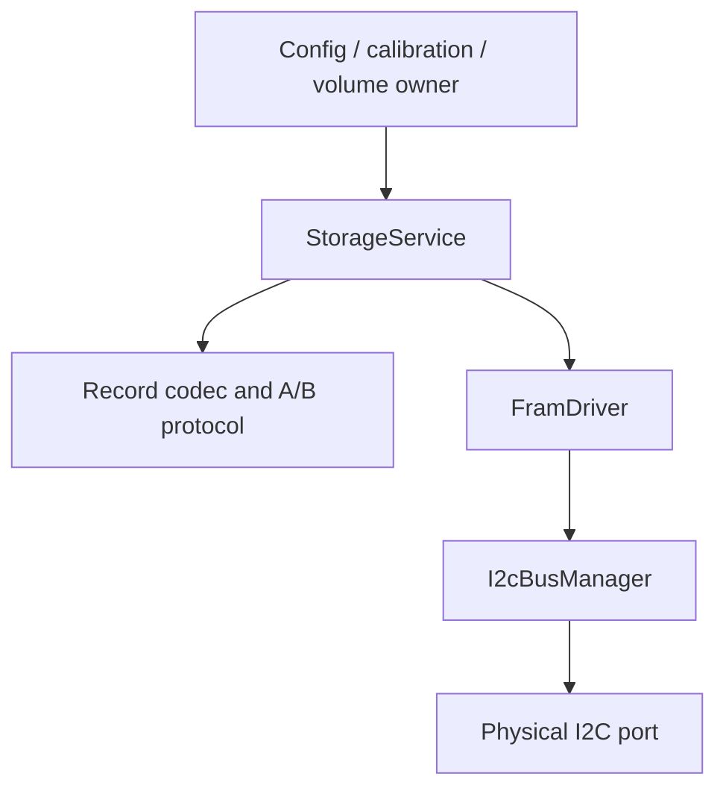
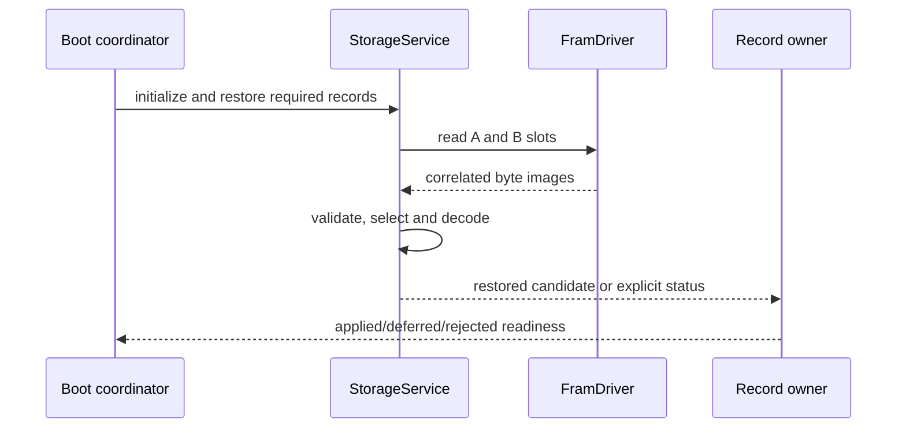

# Persistent Storage

## 1. Mục đích

Tài liệu này định nghĩa canonical firmware contract để lưu, commit, verify, chọn và khôi phục các record quan trọng trên FM24CL04B 512-byte F-RAM theo explicit encoding và fixed A/B slots.

Pipeline canonical:

```text
immutable runtime candidate
  -> record-type codec
  -> canonical byte image
  -> inactive-slot invalidation
  -> bounded asynchronous F-RAM writes
  -> read-back verification
  -> commit byte written last
  -> commit read-back verification
  -> durable-success completion
```

Boot pipeline:

```text
read slot A and slot B
  -> structural validation
  -> commit validation
  -> CRC verification
  -> schema/type/compatibility validation
  -> wrap-safe newest selection
  -> explicit decode
  -> restored candidate publication
```

Tài liệu đóng băng:

- 512-byte logical F-RAM memory map;
- A/B slot sizes và offsets;
- common record header;
- canonical byte order;
- CRC algorithm và exact coverage;
- commit byte/value/order;
- A/B write/verify/activate protocol;
- sequence comparison và ambiguous cases;
- record-type codec boundary;
- boot selection/fallback;
- asynchronous `StorageService` ownership;
- in-flight/pending checkpoint behavior;
- shared-I2C/F-RAM driver boundary;
- deterministic Linux power-loss/corruption tests.

Tài liệu không định nghĩa flow/volume arithmetic, calibration algorithm, configuration semantics hoặc external protocol frame. Mỗi record-type owner định nghĩa logical payload fields; tài liệu này định nghĩa persistent envelope, slot budget và storage lifecycle.

---

## 2. Phạm vi

### 2.1. Trong phạm vi

- FM24CL04B logical address space `0x000`–`0x1FF`.
- CONFIG A/B records.
- CALIBRATION A/B records.
- VOLUME A/B records.
- Reserved region policy.
- Common header and commit byte.
- Little-endian field encoding.
- CRC-32/ISO-HDLC.
- Record validation and selection.
- Async read/write/verify state machines.
- Boot restore and degraded behavior.
- Latest-wins bounded pending requests.
- Shared I2C arbitration constraints.
- Linux F-RAM peer, image and fault scenarios.

### 2.2. Operational contexts

Contract áp dụng cho:

- first boot/factory-new device;
- normal configuration/calibration/volume commit;
- controlled reset;
- watchdog/brownout recovery;
- transient I2C/storage fault;
- firmware upgrade with supported schema;
- Linux simulator and replayed persistent image;
- STM32 live hardware after backend integration.

### 2.3. First implementation slice

First slice MUST hỗ trợ:

1. Volume record encode/decode.
2. Volume A/B commit and restore.
3. Common slot scanner/validator reusable cho config/calibration.
4. Little-endian explicit serialization.
5. CRC-32/ISO-HDLC known-answer tests.
6. Commit-invalid → body → verify → commit-valid → verify order.
7. Sequence wrap-safe comparison.
8. Newer-invalid fallback to older valid.
9. Torn write at every durable boundary.
10. Immutable in-flight record and one latest pending request per record type.
11. Async F-RAM access through `I2cBusManager`.
12. Linux initial/final persistent image and reset-preserve policy.

Config/calibration codecs MAY follow after common protocol, nhưng slot map và common envelope đã canonical trong revision này.

---

## 3. Source-of-truth và component constraints

### 3.1. Thứ tự ưu tiên

Khi có mâu thuẫn:

1. Frozen architecture/data/hardware decisions.
2. `04_data_model_and_ownership.md` cho runtime/persistent ownership boundary.
3. Tài liệu này cho byte map, envelope, CRC, A/B lifecycle và restore.
4. Record-type document cho logical payload semantics.
5. `50_platform_abstraction.md` cho I2C/completion/buffer contract.
6. FM24CL04B datasheet/note cho device addressing/electrical behavior.
7. Current code.

Component datasheet không quyết định product record map, CRC hoặc A/B policy. Firmware document không được thay đổi electrical/device behavior do datasheet quy định.

### 3.2. FM24CL04B constraints

Canonical component assumptions:

| Property | Value |
|---|---|
| Capacity | 4 Kbit = 512 bytes |
| Organization | 512 × 8 |
| Logical address | 9-bit, `0x000`–`0x1FF` |
| Page select | Address bit 8 nằm trong I2C slave address |
| Word address | Address bits 7:0 truyền như one-byte word address |
| Maximum I2C rate | 1 MHz subject to board/timing qualification |
| Write cycle delay | Không có EEPROM-style delay/ACK polling |
| Multi-byte atomicity | Không atomic; ACKed prefix có thể bền khi power loss |
| Internal rollover | `0x1FF` → `0x000`; public driver MUST prevent unintended rollover |
| Write protect | WP high khóa toàn bộ write |

### 3.3. Device-address mapping

Với A2=A1=0:

```text
logical 0x000..0x0FF -> 7-bit slave 0x50
logical 0x100..0x1FF -> 7-bit slave 0x51
word address         -> logical_address & 0xFF
```

Application/storage service dùng logical address; không tự truyền page slave address.

### 3.4. Power-loss implication

F-RAM ghi byte đã ACK mà không có page buffer/rollback. Một multi-byte record có thể chứa prefix mới và suffix cũ sau reset. Vì vậy:

- transport success không phải application commit;
- STOP không phải record-valid evidence;
- CRC và commit-last là bắt buộc;
- scan/validate A/B sau boot là bắt buộc;
- không overwrite active valid slot in-place.

---

## 4. Requirement/decision được hiện thực

### 4.1. Firmware requirements

| Requirement | Nội dung |
|---|---|
| `FW-STOR-REQ-001` | Chỉ `StorageService` thay persistent record state. |
| `FW-STOR-REQ-002` | F-RAM driver chỉ đọc/ghi bytes, không hiểu schema/config/calibration/volume. |
| `FW-STOR-REQ-003` | Runtime C struct không được `memcpy` thành persistent format. |
| `FW-STOR-REQ-004` | Persistent fields encode explicit little-endian. |
| `FW-STOR-REQ-005` | Mỗi protected record type dùng fixed A/B slots. |
| `FW-STOR-REQ-006` | Active valid slot không bị ghi đè trong commit mới. |
| `FW-STOR-REQ-007` | Commit target luôn là inactive/older slot được chọn deterministic. |
| `FW-STOR-REQ-008` | Target commit byte phải invalid và được verify trước body write. |
| `FW-STOR-REQ-009` | Header/payload/reserved body phải deterministic và fit slot. |
| `FW-STOR-REQ-010` | CRC-32/ISO-HDLC dùng exact parameters và coverage trong tài liệu này. |
| `FW-STOR-REQ-011` | Commit byte không nằm trong CRC coverage. |
| `FW-STOR-REQ-012` | Body phải read-back và byte/CRC verify trước commit valid. |
| `FW-STOR-REQ-013` | Commit byte valid được ghi bằng transaction riêng cuối cùng. |
| `FW-STOR-REQ-014` | Durable success chỉ publish sau commit byte read-back valid và full slot revalidation. |
| `FW-STOR-REQ-015` | Request submission/write completion không được trình bày là durable success. |
| `FW-STOR-REQ-016` | Boot validate A/B độc lập và chọn newest valid compatible record. |
| `FW-STOR-REQ-017` | Newer invalid/torn record không che older valid record. |
| `FW-STOR-REQ-018` | Equal sequence + identical canonical content chọn slot A deterministic; equal sequence + different content là conflict. |
| `FW-STOR-REQ-019` | Sequence comparison dùng wrap-safe half-range rule; exact half-range difference là ambiguous conflict. |
| `FW-STOR-REQ-020` | Unsupported schema/type/length không được decode như current runtime struct. |
| `FW-STOR-REQ-021` | Bounds được validate trước CRC/decode/copy. |
| `FW-STOR-REQ-022` | Missing/uninitialized khác corrupt/incompatible trong terminal status. |
| `FW-STOR-REQ-023` | In-flight encoded record/buffer immutable tới terminal completion. |
| `FW-STOR-REQ-024` | Mỗi record type có tối đa một in-flight commit và bounded latest-wins pending candidate. |
| `FW-STOR-REQ-025` | Pending candidate không sửa in-flight bytes/request identity. |
| `FW-STOR-REQ-026` | Duplicate/late/old-generation I2C completion không advance state machine. |
| `FW-STOR-REQ-027` | Mỗi storage operation có đúng một terminal outcome. |
| `FW-STOR-REQ-028` | Storage commit/restore chạy asynchronous; event loop không block I2C. |
| `FW-STOR-REQ-029` | F-RAM access chỉ qua portable driver và `I2cBusManager`. |
| `FW-STOR-REQ-030` | Storage request có client/operation/correlation/bus generation identity. |
| `FW-STOR-REQ-031` | F-RAM transaction chunk bounded để không phá pressure deadline. |
| `FW-STOR-REQ-032` | Priority áp trước physical transaction; transaction đã start không bị preempt. |
| `FW-STOR-REQ-033` | Bus recovery không tự động nghĩa F-RAM record/service ready. |
| `FW-STOR-REQ-034` | Brownout/reset không phụ thuộc emergency flush. |
| `FW-STOR-REQ-035` | Reset tăng generation; old completion không mutate new storage state. |
| `FW-STOR-REQ-036` | Linux peer persistence qua reset explicit trong scenario. |
| `FW-STOR-REQ-037` | Initial/final persistent image có identity/hash cho deterministic test. |
| `FW-STOR-REQ-038` | CRC bảo vệ accidental corruption, không được mô tả là cryptographic authentication. |
| `FW-STOR-REQ-039` | WP policy không được suy từ NACK nếu không có independent WP evidence. |
| `FW-STOR-REQ-040` | Public driver range check ngăn access ngoài `0x000`–`0x1FF` và unintended rollover. |
| `FW-STOR-REQ-041` | Same logical candidate tạo same canonical body bytes trên Linux/STM32. |
| `FW-STOR-REQ-042` | Persistent schema migration/downgrade phải explicit; unknown future record không silently default/overwrite. |
| `FW-STOR-REQ-043` | Repair degraded redundant slot là bounded background work, không block boot readiness khi một valid slot tồn tại. |
| `FW-STOR-REQ-044` | Failed commit giữ previous active slot và không update owner checkpointed reference. |
| `FW-STOR-REQ-045` | Production release bị block nếu address map, record size, CRC vectors hoặc power-loss gates không pass. |

### 4.2. Byte-order decision

All multi-byte persistent integers use little-endian:

```text
u16 -> least-significant byte first
u32 -> least-significant byte first
u64 -> least-significant byte first
```

Enums/booleans encode bằng fixed-width integer với explicit allowed values. Không encode compiler enum size, `bool`, pointer hoặc padding.

### 4.3. Integrity decision

Canonical integrity là CRC-32/ISO-HDLC:

```text
width      = 32
poly       = 0x04C11DB7
refin      = true
refout     = true
init       = 0xFFFFFFFF
xorout     = 0xFFFFFFFF
check("123456789") = 0xCBF43926
```

Reflected implementation MAY use polynomial `0xEDB88320` nếu output bit-exact matches canonical vectors.

### 4.4. Commit decision

```text
PERSIST_COMMIT_VALID   = 0xA5
PERSIST_COMMIT_INVALID = 0x00
```

Only exact `0xA5` means committed. Every other byte value is not committed. Commit byte is last byte of each slot and written separately after body verification.

---

## 5. Trách nhiệm

### 5.1. Ownership matrix

| Object/resource | Single writer | Consumer |
|---|---|---|
| Logical runtime candidate | Record-type owner | Codec/StorageService |
| Canonical encoded body | Record-type codec/StorageService | F-RAM driver/verify |
| In-flight buffer/context | `StorageService` | Driver via immutable view |
| Pending candidate | `StorageService` per record type | Next commit |
| Slot validity/selection | Common A/B protocol | Boot/record repository |
| Physical F-RAM bytes | F-RAM device via driver | Storage scanner |
| I2C physical bus | `I2cBusManager` | ZSSC/F-RAM clients |
| Commit completion | `StorageService` | Config/calibration/volume owner |
| Restored candidate | `StorageService`/record repository | Record-type owner |

### 5.2. `StorageService`

Chịu trách nhiệm:

- request admission/type routing;
- immutable candidate capture;
- codec invocation;
- A/B scan/selection;
- async invalidation/write/read/verify/commit;
- operation/correlation/generation validation;
- retry/degraded/repair policy;
- latest-wins pending;
- terminal completion and diagnostics.

### 5.3. Record-type codec

Chịu trách nhiệm:

- logical payload schema;
- explicit field encode/decode;
- payload length/version validation;
- semantic range/compatibility hooks;
- deterministic reserved bytes;
- golden byte vectors.

Codec không gọi I2C, clock, repository hoặc event queue.

### 5.4. F-RAM driver

Chịu trách nhiệm:

- logical 9-bit address mapping;
- range/null/length validation;
- page-select/device address construction;
- bounded async read/write requests;
- transaction identity/completion mapping;
- optional WP control port integration.

Driver không tính CRC, chọn slot, decode schema hoặc publish config/volume.

### 5.5. `I2cBusManager`

Chịu trách nhiệm arbitration, queue capacity, client priority, physical ownership, timeout/recovery generation và terminal client completion.

### 5.6. Record owner

Config/calibration/volume owner chỉ:

- tạo immutable candidate;
- submit request;
- giữ runtime state độc lập;
- update checkpointed/active reference sau matching durable success;
- xử lý terminal failure theo domain policy.

---

## 6. Ngoài phạm vi

- Flow/volume/calibration numeric algorithms.
- BLE/Modbus/telemetry wire encoding.
- Firmware image/bootloader/OTA storage.
- Cryptographic confidentiality/authentication.
- Secure boot/key storage.
- Long event log/file system/database.
- External flash/EEPROM abstraction beyond this first device.
- Hardware schematic/pull-up/BOR design details.
- Legal retention policy.
- Automatic downgrade migration.

---

## 7. Interface và dependency

### 7.1. Layering



Domain/service code không phụ thuộc FM24CL04B slave-address detail. Driver không phụ thuộc record schema.

### 7.2. Logical storage request

```c
typedef enum {
    PERSIST_RECORD_CONFIG = 1,
    PERSIST_RECORD_CALIBRATION = 2,
    PERSIST_RECORD_VOLUME = 3
} PersistentRecordType;

typedef struct {
    uint64_t request_id;
    PersistentRecordType record_type;
    uint64_t candidate_version;
    uint32_t runtime_generation;
    const void *candidate;
} StorageCommitRequest;
```

Exact candidate lifetime phải được capture/copy into owned bounded storage before async submit. Không giữ pointer tới caller stack.

### 7.3. Logical restore result

```c
typedef enum {
    STORAGE_RESTORE_OK,
    STORAGE_RESTORE_EMPTY,
    STORAGE_RESTORE_CORRUPT,
    STORAGE_RESTORE_UNSUPPORTED_SCHEMA,
    STORAGE_RESTORE_INCOMPATIBLE,
    STORAGE_RESTORE_SEQUENCE_CONFLICT,
    STORAGE_RESTORE_IO_ERROR,
    STORAGE_RESTORE_INTERNAL_ERROR
} StorageRestoreStatus;
```

Không collapse các status trên thành một generic default.

### 7.4. Terminal commit result

```c
typedef enum {
    STORAGE_COMMIT_OK,
    STORAGE_COMMIT_REJECTED,
    STORAGE_COMMIT_ENCODE_ERROR,
    STORAGE_COMMIT_IO_ERROR,
    STORAGE_COMMIT_VERIFY_ERROR,
    STORAGE_COMMIT_SEQUENCE_CONFLICT,
    STORAGE_COMMIT_CANCELLED_GENERATION,
    STORAGE_COMMIT_INTERNAL_ERROR
} StorageCommitStatus;
```

Completion giữ request ID, candidate/state version, record type, selected slot/sequence và diagnostic reason.

### 7.5. Persistent storage port

Logical port:

```c
typedef struct {
    bool (*read_async)(void *ctx,
                       uint64_t operation_id,
                       uint16_t address,
                       uint8_t *buffer,
                       uint16_t length);
    bool (*write_async)(void *ctx,
                        uint64_t operation_id,
                        uint16_t address,
                        const uint8_t *buffer,
                        uint16_t length);
} PersistentStoragePort;
```

Exact common completion/error type theo platform abstraction. Buffer lifetime kéo dài tới terminal completion.

### 7.6. Event binding

| Event | Producer | Consumer | Meaning |
|---|---|---|---|
| `EVT_STORAGE_COMMIT_REQUESTED` | Record owner/coordinator | `StorageService` | Immutable candidate ready for async commit |
| `EVT_I2C_TRANSACTION_COMPLETED` | `I2cBusManager` | F-RAM registered client | Correlated physical step completed |
| `EVT_I2C_TRANSACTION_FAILED` | `I2cBusManager` | F-RAM registered client | Correlated physical step failed |
| `EVT_STORAGE_COMMIT_COMPLETED` | `StorageService` | Record owner/health | Durable matching record committed |
| `EVT_STORAGE_COMMIT_FAILED` | `StorageService` | Record owner/health | Terminal commit failure |
| `EVT_CONFIG_COMMIT_COMPLETED/FAILED` | Config coordinator | Config lifecycle | Domain-level config commit outcome |

Không map I2C completion trực tiếp thành config/volume commit success.

### 7.7. Source-tree mapping

```text
domain/storage                    -> record types/status/reference
services/storage                  -> StorageService and restore coordinator
protocols/storage                 -> common header, codec, CRC, A/B protocol
protocols/storage/records         -> config/calibration/volume codecs
drivers                           -> FM24CL04B driver
platform/include                  -> async I2C/persistent ports
tests/unit/storage                -> codec/CRC/selection
tests/contract/storage            -> service state machine
tests/integration/storage         -> driver/bus/F-RAM peer
tests/system/storage              -> boot/reset/power-loss
```

Exact path theo architecture canonical hiện hành.

---

## 8. Memory map và record data model

### 8.1. Canonical 512-byte memory map

| Start | End | Size | Region | Slot |
|---:|---:|---:|---|---|
| `0x000` | `0x03F` | 64 B | CONFIG | A |
| `0x040` | `0x07F` | 64 B | CONFIG | B |
| `0x080` | `0x0DF` | 96 B | CALIBRATION | A |
| `0x0E0` | `0x13F` | 96 B | CALIBRATION | B |
| `0x140` | `0x17F` | 64 B | VOLUME | A |
| `0x180` | `0x1BF` | 64 B | VOLUME | B |
| `0x1C0` | `0x1FF` | 64 B | RESERVED | — |

Total = 512 bytes. Regions không overlap và không dựa vào compiler alignment.

### 8.2. Map rationale

- CONFIG 64 B/slot: compact device/reporting/runtime configuration.
- CALIBRATION 96 B/slot: compatible with documented 96-byte calibration budget.
- VOLUME 64 B/slot: đủ common header + forward/reverse counters + remainders + watermark.
- RESERVED 64 B: không được dùng nếu chưa có schema/map revision decision.

Map tham khảo cũ dùng METER slot 32 B không đủ canonical volume payload mới và bị supersede bởi map này.

### 8.3. Common slot layout

Mỗi slot:

```text
offset  size  field
0x00    4     magic_u32
0x04    1     record_type_u8
0x05    1     schema_version_u8
0x06    2     payload_length_u16
0x08    4     sequence_u32
0x0C    4     crc32_u32
0x10    N     payload
...           deterministic reserved bytes = 0x00
last    1     commit_u8
```

Common header size = 16 bytes. Commit byte offset = `slot_size - 1`.

Maximum payload:

| Slot | Size | Max payload |
|---|---:|---:|
| CONFIG | 64 | 47 B |
| CALIBRATION | 96 | 79 B |
| VOLUME | 64 | 47 B |

Formula:

```text
max_payload = slot_size - common_header_size - commit_size
```

### 8.4. Common constants

```c
#define PERSIST_MAGIC_U32             UINT32_C(0x53574650)
#define PERSIST_COMMON_HEADER_SIZE    16u
#define PERSIST_COMMIT_VALID          UINT8_C(0xA5)
#define PERSIST_COMMIT_INVALID        UINT8_C(0x00)
```

On-media little-endian magic bytes for `0x53574650` are:

```text
50 46 57 53
```

Magic alone không chứng minh validity.

### 8.5. CRC coverage

CRC input byte stream exactly:

```text
header bytes offset 0x00..0x0B
then payload bytes offset 0x10..(0x10 + payload_length - 1)
```

CRC field offsets `0x0C..0x0F`, reserved tail và commit byte không nằm trong coverage.

Rationale:

- CRC field không self-cover;
- commit được ghi riêng cuối cùng;
- reserved tail vẫn read-back byte-compare `0x00`, nhưng không cần thay CRC khi slot budget thay đổi trong same schema only if compatibility rules permit;
- payload length được CRC bảo vệ và bounds-check trước reading payload.

### 8.6. Structural validation order

1. Slot address/size known from map.
2. Read complete slot.
3. Commit byte equals exact valid value.
4. Magic matches.
5. Record type matches region.
6. Schema is recognized or classified unsupported.
7. Payload length within max and exact schema expectation.
8. Reserved required bytes match canonical value if schema requires.
9. CRC matches exact coverage.
10. Payload decode/range/compatibility validation.

Không dùng payload length để index/calculate CRC trước bounds validation.

### 8.7. Volume schema v1

VOLUME payload v1 is exactly 44 bytes:

| Payload offset | Size | Field | Type |
|---:|---:|---|---|
| `0x00` | 8 | `forward_volume_ul` | `u64` |
| `0x08` | 8 | `reverse_volume_ul` | `u64` |
| `0x10` | 4 | `forward_remainder` | `u32` |
| `0x14` | 4 | `reverse_remainder` | `u32` |
| `0x18` | 8 | `volume_state_version` | `u64` |
| `0x20` | 8 | `last_consumed_flow_sequence` | `u64` |
| `0x28` | 4 | `last_consumed_source_generation` | `u32` |

Slot positions:

```text
common header  0x00..0x0F
payload        0x10..0x3B
reserved       0x3C..0x3E = 0x00
commit         0x3F
```

Volume remainders MUST be less than `1_000_000`. Integration anchor is not persisted/restored valid.

### 8.8. CONFIG and CALIBRATION schemas

Common envelope/map are frozen. Exact payload v1 fields belong dedicated config/calibration documents. Until defined:

- unknown/absent codec must not write those regions;
- scanner can classify structural slot but cannot publish decoded domain candidate;
- simulator fixture must not fabricate supported schema.

### 8.9. Reserved region

`0x1C0`–`0x1FF` is reserved. Production firmware MUST NOT write it without memory-map version update and migration decision. Tests MAY preload arbitrary bytes to prove scanner ignores reserved region.

### 8.10. Persistent map version

Memory map version belongs firmware/storage build contract, not a mutable byte pointer. Any slot offset/size change requires:

- documented map revision;
- migration/update compatibility policy;
- test fixtures for old/new image;
- prevention of old firmware overwriting unknown new layout.

---

## 9. A/B state machine và sequence

### 9.1. Slot classification

Each slot terminal classification:

```text
VALID_COMPATIBLE
VALID_UNSUPPORTED_SCHEMA
VALID_INCOMPATIBLE
EMPTY_UNINITIALIZED
NOT_COMMITTED
BAD_MAGIC
BAD_TYPE
BAD_LENGTH
BAD_RESERVED
BAD_CRC
BAD_PAYLOAD
IO_ERROR
```

“Valid CRC” chưa đủ để active nếu schema/payload compatibility fail.

### 9.2. Sequence comparison

For `uint32_t a`, `b`:

```text
a is newer than b iff:
    a != b
    and (uint32_t)(a - b) < 0x80000000
```

Cases:

- `a == b`: equal sequence.
- `(uint32_t)(a-b) == 0x80000000`: ambiguous half-range conflict.
- no signed cast-based comparison.

### 9.3. Boot selection

| A | B | Selection |
|---|---|---|
| valid compatible | invalid | A |
| invalid | valid compatible | B |
| valid compatible | valid compatible, newer | Newer slot |
| equal sequence, identical body | A deterministic; schedule optional redundancy repair |
| equal sequence, different canonical body | Sequence conflict; no silent selection |
| half-range ambiguous | Sequence conflict |
| valid unsupported future schema + older compatible | Use older compatible, preserve future slot, report upgrade/downgrade conflict |
| both invalid/empty | Explicit empty/corrupt outcome by classifications |

### 9.4. Commit target selection

- If one selected active slot: target the other slot.
- If no valid slot: target slot A first.
- If equal identical: target B for repair/next sequence after deterministic A selection.
- Do not overwrite a sole valid compatible slot.
- New sequence = selected sequence + 1 modulo `uint32_t`.
- Sequence conflict requires authorized recovery; do not guess.

### 9.5. Commit states

```text
IDLE
ENCODING
INVALIDATE_SUBMIT
INVALIDATE_WAIT
INVALIDATE_VERIFY_SUBMIT
INVALIDATE_VERIFY_WAIT
BODY_WRITE_SUBMIT
BODY_WRITE_WAIT
BODY_READBACK_SUBMIT
BODY_READBACK_WAIT
BODY_VERIFY
COMMIT_WRITE_SUBMIT
COMMIT_WRITE_WAIT
COMMIT_READBACK_SUBMIT
COMMIT_READBACK_WAIT
FINAL_VALIDATE
COMPLETE
FAILED
```

Implementation MAY combine bounded local validation states, nhưng durable order không được thay đổi.

### 9.6. Canonical commit sequence

1. Capture immutable candidate.
2. Scan/select active and target.
3. Compute next sequence.
4. Encode complete canonical target slot image with commit invalid.
5. Write target commit byte = invalid as separate one-byte transaction.
6. Read target commit byte; require not valid/exact invalid according to policy.
7. Write target body excluding commit in bounded chunks.
8. Read back target body excluding commit.
9. Require byte-for-byte match with encoded body.
10. Re-run structural/CRC/payload validation treating commit as not-yet-valid.
11. Write target commit byte = valid as separate one-byte transaction.
12. Read commit byte; require exact valid.
13. Read/revalidate complete slot or sufficient canonical body + commit evidence.
14. Publish durable success with request/candidate/slot/sequence identity.

If any step fails, target slot remains untrusted and previous valid slot remains active.

### 9.7. Why invalidate first

If target held an older valid record, body overwrite without first invalidating could temporarily leave commit valid while header/payload are partially new. CRC may eventually catch it, but explicit invalidation narrows states and makes power-loss evidence unambiguous.

### 9.8. Read-back policy

Transport `OK` is insufficient. Body byte compare and CRC/decode validation are both required. Commit write also requires read-back.

### 9.9. Repair policy

If one valid slot exists:

- boot may proceed with degraded redundancy;
- repair is bounded background commit of same logical candidate with next sequence or explicit repair policy;
- repair obeys shared-I2C priority/min spacing;
- failure does not invalidate existing valid slot;
- do not repair unsupported future slot automatically during downgrade.

---

## 10. StorageService lifecycle và non-blocking behavior

### 10.1. Service composition

```text
request mailbox
codec registry
A/B scanner/selector
in-flight context and encoded buffer
one latest pending candidate per record type
F-RAM client adapter
diagnostic counters
```

### 10.2. Request admission

Reject before side effect when:

- unknown record type;
- unsupported candidate/schema;
- candidate too large;
- null/invalid reference;
- runtime generation stale;
- record type already in unrecoverable conflict;
- storage not initialized/ready.

### 10.3. Immutable in-flight context

Once accepted:

- candidate is copied/captured into bounded owned storage;
- encoded body remains unchanged through verify;
- request ID, candidate version, sequence and target slot remain stable;
- new request cannot mutate in-flight bytes.

### 10.4. Pending latest-wins

Per record type:

- at most one in-flight;
- at most one pending candidate;
- newer candidate replaces pending if version ordering valid;
- older/equal duplicate pending rejected/coalesced;
- after terminal in-flight result, pending re-evaluated against latest durable/runtime owner state;
- no unbounded queue.

Config/calibration requests may require stricter non-coalescing transaction semantics; record owner policy must declare whether latest-wins is allowed. Volume checkpoint baseline uses latest-wins.

### 10.5. Work budget

Each event-loop turn performs bounded local work and at most bounded submit/copy/CRC chunk. CRC may process complete max 96-byte slot in one bounded turn if WCET proves acceptable; otherwise chunk with explicit context.

### 10.6. Retry

- Retry count/backoff bounded and classified by error.
- Do not blindly restart opaque full commit after timeout.
- Rescan target/active state before retry when durability is uncertain.
- Old completion remains rejected by operation/generation.
- No retry storm blocks measurement.

### 10.7. Cancellation/reset

Controlled reset:

- stop new admission;
- do not claim in-flight success;
- increment runtime/bus generation;
- discard transient context after terminal/cancel policy;
- on next boot rescan A/B from bytes;
- no emergency completion assumption.

### 10.8. Terminal completion

Exactly one terminal service outcome per request:

```text
COMPLETED_DURABLE
FAILED_TERMINAL
REJECTED_BEFORE_START
CANCELLED_GENERATION
COALESCED_PENDING
```

Only `COMPLETED_DURABLE` authorizes owner checkpointed/active reference update.

---

## 11. F-RAM driver và shared-I2C behavior

### 11.1. Driver address API

Public driver uses logical address `uint16_t 0x000..0x1FF`. It computes page slave address internally.

### 11.2. Range validation

Overflow-safe rule:

```c
if (length == 0u) {
    return address <= FM24CL04B_SIZE_BYTES;
}

return address < FM24CL04B_SIZE_BYTES &&
       length <= FM24CL04B_SIZE_BYTES - address;
```

Zero-length semantics must be consistent across port; baseline zero-length is no-op success only when buffer contract permits.

### 11.3. Transaction splitting

Driver SHOULD split at logical `0x100` boundary so each new transaction recomputes page-select slave address. It MAY also split by configured maximum chunk size to meet shared-bus latency.

Driver MUST NOT allow internal rollover at `0x1FF` to write `0x000`.

### 11.4. Read primitive

Use selective/random read with explicit logical address. Do not use current-address read as persistent repository primitive because it depends on prior latch state.

### 11.5. Write behavior

- No EEPROM write-cycle delay.
- No ACK polling after successful write.
- Multi-byte transaction remains non-atomic at record level.
- Each ACKed byte may be durable.

### 11.6. WP

If WP controlled:

- only enable writes during bounded commit operations;
- hold stable through transaction and STOP;
- restore protected state after final write/terminal cleanup;
- independent GPIO/state evidence required to classify WP error;
- generic NACK alone does not prove write protection.

### 11.7. Shared bus priority

- ZSSC critical result read has higher admission priority than background F-RAM chunks.
- Physical transaction not preempted mid-frame.
- F-RAM chunk size chosen to bound non-preemptible occupancy.
- Background storage receives bounded anti-starvation service.
- All clients use one `I2cBusManager` owner.

### 11.8. Completion identity

Completion MUST carry:

```text
client_id = F-RAM
transaction_id
operation_id/correlation_id
client_generation
bus_generation
status
transferred_length
```

Storage step advances only on exact current match and expected length/status.

### 11.9. Bus recovery

After timeout/stuck bus:

- bus owner performs bounded recovery;
- bus generation increments;
- F-RAM owner receives terminal old operation outcome;
- StorageService rescans bytes if durability uncertain;
- ZSSC/F-RAM functional readiness evaluated separately.

---

## 12. Error detection và recovery

### 12.1. Error taxonomy

| Class | Examples | Outcome |
|---|---|---|
| Request | bad type/version/size/stale generation | Reject before I/O |
| Codec | unsupported schema/range/overflow | Reject/encode failure |
| Structural | magic/type/length/reserved | Slot invalid |
| Integrity | CRC mismatch | Slot corrupt |
| Commit | invalid/partial/unexpected byte | Slot not committed |
| Sequence | equal-different/half-range | Conflict, no silent selection |
| Compatibility | wrong product/profile/schema | Preserve but do not activate |
| Transport | NACK/timeout/bus error/short transfer | Terminal step failure/recovery |
| Verify | byte mismatch/readback error | Commit fails, old slot retained |
| Resource | queue/buffer capacity | Reject/coalesce by policy |
| Internal | impossible state/offset overlap | Stable storage fault |

### 12.2. No fabricated success

- `HAL_OK`/provider success không phải record commit.
- CRC valid + commit invalid không active.
- Commit valid + CRC bad không active.
- Newer sequence + invalid content không active.
- Missing record không đồng nghĩa valid defaults unless domain declares factory-new policy.
- Commit failure không update checkpointed config/calibration/volume reference.

### 12.3. One-slot recovery

One valid compatible slot:

- restore/use it;
- mark redundancy degraded;
- schedule optional repair;
- do not block normal runtime solely because backup invalid if product policy allows;
- never destroy sole valid slot during repair.

### 12.4. Both-slot failure

Classify:

- both empty/uninitialized;
- corrupt;
- unsupported;
- incompatible;
- I/O unavailable;
- sequence conflict.

Record owner decides factory defaults/service/recovery. Storage layer returns evidence, không tự fabricate domain state.

### 12.5. Downgrade/future schema

Older firmware encountering valid future schema:

- preserve slot bytes;
- do not decode as older schema;
- do not automatically overwrite future slot merely to repair redundancy;
- may use older compatible slot if available;
- report downgrade/compatibility condition.

### 12.6. Internal invariants

Detect:

- overlapping map regions;
- payload beyond slot;
- commit offset not last byte;
- CRC coverage outside body;
- target equals sole active slot;
- in-flight buffer mutation;
- unexpected completion/state;
- duplicate terminal completion;
- pending capacity violation.

### 12.7. Diagnostic counters

```text
restore_requests
slots_read
slots_valid
slots_empty
bad_magic
bad_length
bad_crc
not_committed
unsupported_schema
incompatible_records
sequence_conflicts
commit_requests
commit_completed
commit_failed
verify_failed
requests_coalesced
late_completions
bus_recoveries
repairs_scheduled
repairs_completed
```

---

## 13. Boot, reset và power-loss sequences

### 13.1. Boot initialization



Required record restore reaches terminal outcome before dependent production service active.

### 13.2. Power loss before invalidation

No target change; old valid slots remain.

### 13.3. Power loss during invalidation

Target commit byte may remain valid, invalid or other. If still valid but body old, it remains old valid record; if corrupted, structural/CRC catches. Service never proceeded to body without invalidation verify during live run.

### 13.4. Power loss during body write

Target commit invalid; target rejected. Previous active slot remains.

### 13.5. Power loss after body verify before commit

Target body may be complete/valid CRC but commit invalid; rejected. Previous active remains.

### 13.6. Power loss during commit-byte write

Target commit may be valid or other. Boot performs full validation:

- exact valid + body valid → target can be selected;
- otherwise target rejected.

### 13.7. Power loss after durable commit before event completion

Boot selects newly committed higher sequence even if runtime owner never received completion before reset. This is correct durable-state behavior.

### 13.8. Reset with old completion scheduled

Runtime/bus generation changes. Old completion cannot advance new service state. Boot scan, not old callback, determines durability.

### 13.9. Brownout policy

- Do not start new writes below safe power condition.
- Do not rely on emergency flush.
- After power recovery wait component `tPU` and initialize/recover bus.
- Scan A/B and validate.
- BOR/PVD/WP electrical qualification belongs hardware phase.

---

## 14. Linux simulation mapping

### 14.1. Reuse boundary

Linux runs same codec, CRC, A/B protocol, `StorageService`, F-RAM driver and I2C manager. Simulator supplies virtual clock, F-RAM peer bytes, resets/faults and observers.

### 14.2. F-RAM peer state

Peer maintains exactly 512 bytes plus protocol state. It must support:

- logical read/write;
- page-select/address behavior;
- bounds and configured latency;
- reset preserve/clear policy;
- initial image load;
- final image export;
- corruption/partial write;
- NACK/timeout/drop/duplicate/late completion;
- WP state if modeled.

Peer does not decide record validity.

### 14.3. Persistent image artifact

Artifact metadata:

```text
image_id
image_schema/tool_version
size = 512
initial/final hash
scenario ID/seed
reset persistence policy
```

Raw image can accompany normalized slot-decoder report.

### 14.4. Fault actions

Scenario actions/faults SHOULD support:

```text
fram.load-image
fram.corrupt-range
fram.set-write-protect
fram.drop-completion
fram.nack-next
fram.partial-write
system.reset
observer.checkpoint
```

Exact manifest names follow document 93 schema.

### 14.5. Durable-boundary scenarios

Inject reset/fault:

- before invalidate submit;
- during invalidate;
- during body chunks;
- after body write;
- during read-back;
- after body verify;
- during commit byte;
- after commit before completion event;
- during repair;
- with ZSSC priority work queued.

### 14.6. Golden bytes

Codec unit tests compare exact slot body bytes. System tests compare semantic selected record and optionally final image hash. Golden generator must not call runtime codec for expected bytes.

### 14.7. Determinism

Same initial image, candidate, action schedule and seed must produce same:

- step/slot/sequence choices;
- final byte image;
- terminal result;
- boot selection;
- normalized trace.

### 14.8. Trace

Normalized trace includes:

```text
request/candidate version
record type/schema
active/target slot and sequence
storage state-machine step
logical address/length/chunk
I2C transaction/client/bus generation
CRC expected/actual status
commit byte expected/actual
terminal outcome
reset generation
boot slot classifications/selection
```

No pointer, host path or uninitialized bytes.

---

## 15. STM32 mapping

### 15.1. Portable components

Same codec/A-B/StorageService logic builds for Linux and STM32. STM32 supplies physical I2C, optional WP GPIO, reset/power evidence and F-RAM instance config.

### 15.2. I2C mapping

- A1/A2 board straps map base address.
- Page bit derives from logical address bit 8.
- STM32 HAL address shift convention remains adapter-local.
- Use 8-bit memory/word address for each selected page transaction.
- Split at `0x100` and configured chunk bound.

### 15.3. Buffer/static memory

- Fixed maximum slot buffer 96 bytes plus bounded contexts.
- No heap.
- In-flight DMA buffer remains valid until completion.
- Static assertions for map, header, payload and slot sizes.

### 15.4. ISR/callback

I2C callback only posts bounded completion. CRC, selection, decode and owner publication run in service/event context.

### 15.5. WP mapping

If hardware WP is MCU-controlled, adapter implements enable/disable sequence. Product boot default should prefer protected state if hardware design supports it. Exact pin/electrical behavior belongs hardware docs.

### 15.6. Power qualification

Verify on board:

- VDD/tPU/BOR/PVD;
- reset during each transaction phase;
- WP transition behavior;
- bus recovery;
- real chunk latency;
- pressure deadline coexistence;
- retention/endurance assumptions.

### 15.7. Hardware evidence boundary

Linux tests prove logic, not analog power-fail waveform or physical retention. Hardware-qualified status requires Phase 13–14 evidence.

---

## 16. Test và acceptance criteria

### 16.1. Memory-map tests

- Total exactly 512 bytes.
- All regions in bounds/no overlap.
- Correct slot sizes/commit offsets.
- Max payload calculations.
- Reserved region untouched.
- Volume v1 payload exactly 44 bytes and fits.

### 16.2. Endian/codec tests

- u16/u32/u64 known bytes.
- Min/max/zero values.
- Unknown enum/schema rejection.
- Exact volume v1 golden body.
- Encode/decode round trip.
- Runtime struct padding/order change has no effect.
- Reserved body bytes deterministic zero.

### 16.3. CRC tests

- Canonical `123456789` check.
- Empty/short/header/payload vectors.
- Single-bit corruption in each covered field.
- CRC field excluded.
- Commit/reserved exclusion behavior as specified.
- Linux/STM32 helper equivalence.

### 16.4. Structural validation tests

- Bad magic/type/schema/length/reserved/CRC/commit.
- Payload length zero/max/one over max.
- Truncated buffer.
- Valid CRC but semantic payload invalid.
- Volume remainder >= 1,000,000 rejected.

### 16.5. Sequence/selection tests

- Only A/only B/both valid.
- A newer/B newer.
- Newer invalid fallback.
- Wrap from `0xFFFFFFFF` to `0`.
- Equal identical.
- Equal different conflict.
- Exact half-range conflict.
- Future schema plus older compatible.

### 16.6. Commit state-machine tests

- Normal full commit.
- Every submit/completion failure.
- Short transfer.
- Read-back byte mismatch.
- CRC/decode verify failure.
- Commit read-back mismatch.
- Duplicate/late/out-of-order completion.
- One terminal result.
- Previous valid slot preserved.

### 16.7. Pending/coalescing tests

- New request while in-flight.
- Newer pending replaces older pending.
- Duplicate/equal candidate.
- Pending after success/failure.
- Per-record-type isolation.
- Bounded capacity/no leak.

### 16.8. Driver tests

- Logical addresses `0x000`, `0x0FF`, `0x100`, `0x1FF`.
- Crossing `0x0FF` split.
- Out-of-range/overflow/zero length/null.
- Correct page slave mapping.
- Selective read semantics.
- No EEPROM delay/ACK polling.
- WP and NACK classification boundaries.

### 16.9. Shared-I2C tests

- F-RAM before/during/after ZSSC conversion.
- ZSSC EOC while F-RAM queued/in transaction.
- Priority before admission, no mid-frame preemption.
- Storage anti-starvation bound.
- Bus timeout/recovery generation.
- Old ZSSC/F-RAM completion rejected.

### 16.10. Power-loss/reset tests

- Reset at every durable boundary in section 13.
- Prefix write/torn body.
- Commit byte partial/unexpected.
- Durable commit before lost event.
- Old completion after reset.
- One/both slot corruption.
- Restore and optional repair.

### 16.11. System tests

- Real flow → volume → checkpoint → reboot → restore.
- Config/calibration slot scanner compatibility when codecs exist.
- Long repeated commits and sequence wrap fixture.
- Simulated origin does not dirty production volume record.
- Deterministic final image/trace.
- Storage fault does not block measurement/event loop.

### 16.12. Acceptance criteria

1. Fixed map/header/CRC/commit values have golden vectors.
2. No persistent runtime-struct `memcpy` path exists.
3. A/B protocol preserves previous valid slot under all injected failures.
4. Durable success only after commit read-back/full validation.
5. Boot selection handles wrap/conflict/future schema deterministically.
6. Volume v1 round-trip and reset restore pass.
7. Shared-I2C timing/arbitration contract pass in simulator.
8. Same candidate produces same bytes across compilers/platforms.
9. Sanitizer/static/CI gates pass.
10. Hardware qualification items close before production release.

---

## 17. Traceability

### 17.1. Requirement mapping

| Requirement group | Source |
|---|---|
| A/B explicit encoding | `DEC-DATA-004/005`, documents 01/04 |
| Async storage ownership | `DEC-ARCH-001/002/003/004`, documents 00/01 |
| Volume payload | document 18 |
| Calibration compatibility | document 16 |
| Shared ZSSC/F-RAM bus | `DEC-HW-006`, document 12/50 |
| Linux fault/reset evidence | documents 51/92/93 |
| Device addressing/timing | FM24CL04B datasheet/note |

### 17.2. Artifact traceability

| Artifact | Identity |
|---|---|
| Memory map | Document/version + build map version |
| Codec | Record type/schema version |
| Persistent slot | Region/slot/sequence/CRC/commit |
| Commit request | Request/candidate/runtime generation |
| F-RAM operation | Operation/transaction/client/bus generation |
| Simulator image | Image ID/hash/scenario/seed |

### 17.3. Suggested implementation mapping

```text
src/domain/storage/persistent_types.h
src/services/storage/storage_service.c
src/protocols/storage/persistent_map.h
src/protocols/storage/persistent_header_codec.c
src/protocols/storage/persistent_crc32.c
src/protocols/storage/storage_ab_slot.c
src/protocols/storage/records/volume_record_codec.c
src/drivers/fm24cl04b_driver.c
src/simulation/peers/fram_peer.c
tests/unit/storage/
tests/contract/storage/
tests/integration/storage/
tests/system/storage/
```

### 17.4. Suggested test IDs

```text
TC_STOR_MAP_*
TC_STOR_ENDIAN_*
TC_STOR_CRC_*
TC_STOR_CODEC_*
TC_STOR_SLOT_*
TC_STOR_SEQUENCE_*
TC_STOR_COMMIT_*
TC_STOR_PENDING_*
TC_STOR_RESTORE_*
TC_FRAM_DRIVER_*
TC_SIM_FRAM_*
TC_SIM_STORAGE_POWERLOSS_*
TC_SIM_I2C_ZSSC_FRAM_CONTENTION
```

---

## 18. Open issues / NEEDS_VERIFICATION

| ID | Vấn đề | Owner/closure evidence | Blocking scope |
|---|---|---|---|
| `FW-STOR-OQ-001` | Exact CONFIG payload v1 | Config document/codec vectors | Config persistence |
| `FW-STOR-OQ-002` | Exact CALIBRATION payload v1 | Calibration/profile document + 96 B proof | Calibration persistence |
| `FW-STOR-OQ-003` | Factory-new versus corrupt fallback per record type | Product/service decision | Boot behavior |
| `FW-STOR-OQ-004` | Firmware upgrade/downgrade migration matrix | Update/release policy | Schema migration |
| `FW-STOR-OQ-005` | Maximum F-RAM chunk size | Pressure timing + board measurement | Hardware/backend |
| `FW-STOR-OQ-006` | Storage anti-starvation bound | Scheduler/I2C timing analysis | Runtime config |
| `FW-STOR-OQ-007` | WP hardware topology/control | Hardware schematic/bring-up | Hardware protection |
| `FW-STOR-OQ-008` | Exact retry/backoff values | Fault-rate/timing evidence | Production config |
| `FW-STOR-OQ-009` | CRC implementation uses software or STM32 CRC peripheral | Cross-platform golden/performance proof | STM32 optimization |
| `FW-STOR-OQ-010` | Reserved 64-byte future use | New decision/map revision | Future feature |
| `FW-STOR-OQ-011` | Repair writes same logical data with next sequence versus dedicated repair semantics | Storage policy test/review | Redundancy repair |
| `FW-STOR-OQ-012` | Real power interruption at each byte/transaction boundary | HIL/power fixture | Hardware qualification |
| `FW-STOR-OQ-013` | Endurance/retention margin in final thermal profile | Hardware/reliability evidence | Production qualification |
| `FW-STOR-OQ-014` | Whether cryptographic authentication is required | Security/threat-model decision | Security scope |

First implementation can use deterministic simulator latency/chunk/retry values, nhưng không được đánh dấu hardware-qualified.

---

## 19. Revision history

| Version | Date | Change |
|---|---|---|
| 0.1 | 2026-07-15 | Initial canonical persistent storage contract: 512-byte map, common header, little-endian encoding, CRC-32/ISO-HDLC, commit-last A/B protocol, volume schema v1, async service, shared-I2C and deterministic power-loss recovery |
