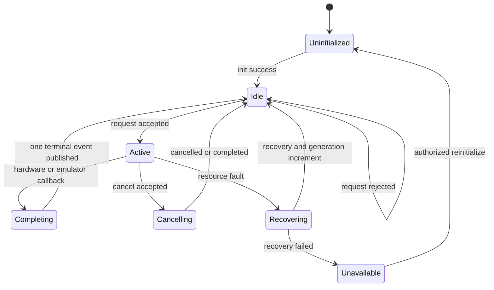
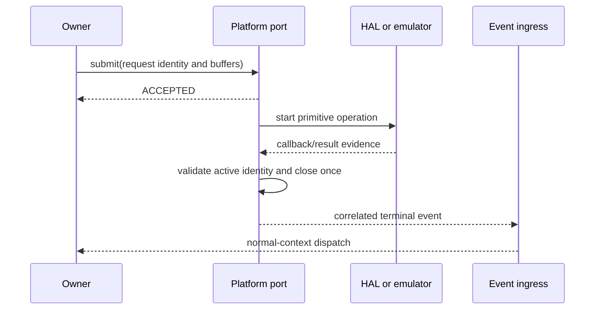
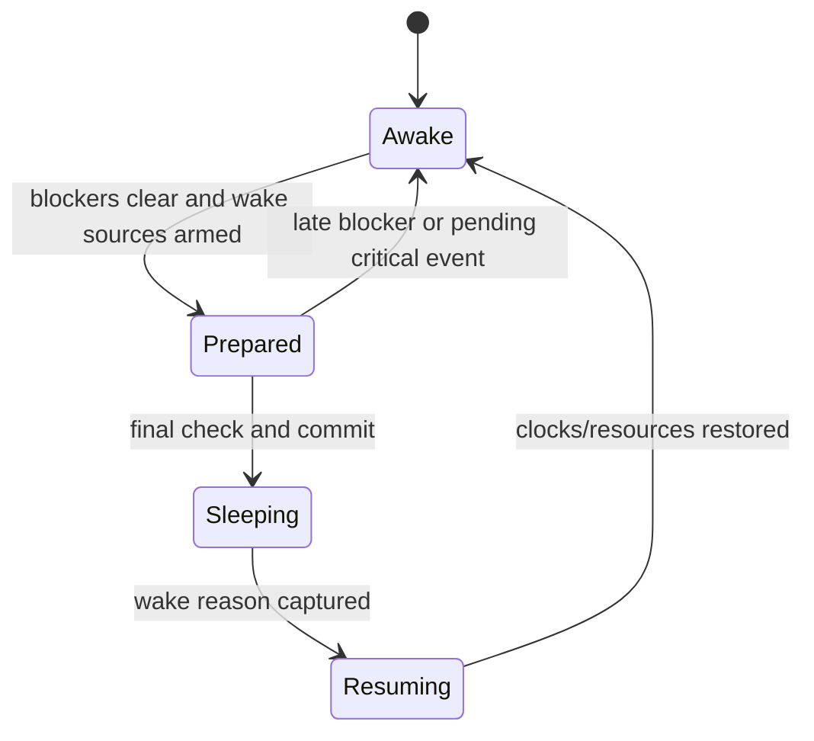

# Platform Abstraction

## 1. Mục đích

Tài liệu này định nghĩa behavioral contract giữa portable firmware và platform backend của dự án Smart Water Flow and Pressure Monitor.

Mục tiêu là để cùng application, domain service, infrastructure và portable device-driver logic có thể:

- build và chạy deterministic trên Linux;
- sử dụng fake hoặc emulator để kiểm thử;
- port sang STM32L433RCT6 mà không đổi business rule;
- giữ event, correlation, generation, timeout và ownership semantics tương đương giữa hai platform;
- cô lập POSIX, STM32 HAL/LL, vendor handle, pin mapping và interrupt implementation;
- cho phép contract test chạy trên mọi backend;
- hỗ trợ bare-metal cooperative runtime hiện tại và không buộc core phụ thuộc RTOS.

Platform abstraction không cố tạo một generic HAL cho mọi thiết bị. Nó chỉ định nghĩa tập primitive và callback/completion semantics cần thiết cho firmware hiện tại.

---

## 2. Phạm vi

### 2.1. Trong phạm vi

Tài liệu định nghĩa:

- platform lifecycle và capability discovery;
- monotonic time source;
- event wait/wake primitive;
- critical-section và atomic-publication support;
- asynchronous SPI transaction primitive;
- asynchronous physical I2C transaction primitive;
- GPIO input/output và interrupt evidence;
- asynchronous UART transport primitive;
- RTC wall-clock/alarm primitive;
- power, wake, reset-reason và controlled-reset primitive;
- watchdog primitive;
- platform completion envelope;
- request/buffer lifetime;
- cancellation, timeout và stale-completion behavior;
- ISR/callback boundary;
- Linux/STM32 behavioral equivalence;
- fake/backend contract-test seam;
- error normalization và diagnostic evidence.

### 2.2. Phạm vi implementation đầu tiên

Vertical slice Linux đầu tiên bắt buộc hiện thực:

- monotonic/virtual time;
- event wait/wake;
- SPI backend cho MAX35103;
- physical I2C backend cho I2cBusManager/ZSSC3241;
- GPIO evidence cho MAX INT và ZSSC EOC;
- deterministic completion injection;
- timeout, invalid status và stale-completion scenarios.

UART, RTC, power, watchdog và reset vẫn thuộc canonical contract nhưng MAY được hiện thực bằng bounded stub cho tới khi vertical slice tương ứng bắt đầu.

### 2.3. Ngoài phạm vi

Tài liệu không chốt:

- source tree khác với section 17.1 của `01_firmware_architecture.md`;
- MAX35103 opcode, register image hoặc result-decoding rule;
- ZSSC3241 command/status/register semantics;
- I2C client arbitration policy phía trên physical bus;
- BLE/4G application protocol;
- persistent record layout;
- LCD segment mapping;
- pin, alternate function, DMA channel hoặc NVIC priority;
- exact Linux emulator socket protocol;
- exact STM32 HAL function;
- RTOS task, mutex, semaphore hoặc queue topology;
- product measurement period, filter, calibration hoặc leak algorithm;
- numeric production timeout chưa qualification.

Các nội dung trên thuộc device, hardware, communication, storage hoặc backend document tương ứng.

---

## 3. Source-of-truth và tài liệu liên quan

| Nội dung | Source-of-truth |
|---|---|
| Layer, dependency và source tree | `01_firmware_architecture.md` |
| Event envelope, priority và scheduler | `02_event_model_and_scheduler.md` |
| System mode/admission | `03_system_fsm_binding.md` |
| Canonical data/result ownership | `04_data_model_and_ownership.md` |
| MAX device behavior | `11_max35103_integration.md` |
| ZSSC/shared-I2C behavior | `12_pressure_measurement_zssc3241.md` |
| Product binding/profile | `16_sensor_profile_and_variant.md` |
| Portable platform behavioral contract | Tài liệu này |
| Linux concrete implementation | `51_linux_platform_backend.md` |
| STM32 HAL/board mapping | `52_stm32_platform_backend.md` |
| ISR/DMA/callback implementation rule | `53_interrupt_dma_and_callback_rules.md` |
| Test pyramid/coverage | `92_firmware_test_strategy.md` |
| Emulator/scenario integration | `93_linux_simulation_integration.md` |

Quy tắc ưu tiên:

1. Tài liệu này sở hữu semantics của platform request/completion.
2. Backend document chỉ chọn cơ chế hiện thực, không thay semantics.
3. Device document sở hữu device protocol, không mở rộng platform primitive thành product policy.
4. Khi backend không thể giữ contract, phải tạo decision/ADR; không sửa ngầm behavior theo platform.

---

## 4. Requirement/decision được hiện thực

### 4.1. Firmware requirements

| ID | Requirement |
|---|---|
| `FW-PLAT-REQ-001` | Portable application, service, infrastructure và public driver contract MUST NOT include POSIX, STM32 HAL/LL hoặc RTOS type. |
| `FW-PLAT-REQ-002` | Mỗi production target MUST bind đúng một provider cho mỗi required platform port. |
| `FW-PLAT-REQ-003` | Platform request MUST trả admission result ngay và không ẩn blocking wait. |
| `FW-PLAT-REQ-004` | Accepted asynchronous request MUST có đúng một terminal completion hoặc một explicit platform-fatal diagnostic khi completion không thể bảo toàn. |
| `FW-PLAT-REQ-005` | Completion MUST giữ operation, correlation, owner/client generation và platform-resource generation cần thiết để lọc stale. |
| `FW-PLAT-REQ-006` | Platform callback/ISR MUST chỉ capture bounded evidence, hoàn tất primitive bookkeeping và post/latch event. |
| `FW-PLAT-REQ-007` | Platform callback/ISR MUST NOT chạy product algorithm, publish RuntimeSnapshot hoặc quyết định business recovery. |
| `FW-PLAT-REQ-008` | Timeout, duration, retry và freshness MUST dùng monotonic time. |
| `FW-PLAT-REQ-009` | Monotonic time MUST không đi lùi trong một boot generation. |
| `FW-PLAT-REQ-010` | Wall-clock adjustment MUST NOT thay đổi active monotonic deadline. |
| `FW-PLAT-REQ-011` | Buffer lifetime MUST explicit; backend không giữ stack/mutable caller pointer ngoài contract. |
| `FW-PLAT-REQ-012` | Cancellation MUST có expected generation/correlation và MUST NOT biến accepted in-flight operation thành mất completion im lặng. |
| `FW-PLAT-REQ-013` | Duplicate/late callback MUST không tạo duplicate terminal side effect. |
| `FW-PLAT-REQ-014` | Port status MUST normalize platform/vendor error thành canonical category và giữ raw diagnostic detail riêng. |
| `FW-PLAT-REQ-015` | Physical I2C MUST có một platform transaction owner; ZSSC/F-RAM driver không gọi HAL trực tiếp. |
| `FW-PLAT-REQ-016` | SPI CE/transaction lifecycle MUST atomic theo device-port contract và finite. |
| `FW-PLAT-REQ-017` | GPIO interrupt evidence MUST retain source, level/edge evidence, sequence và capture time khi khả dụng. |
| `FW-PLAT-REQ-018` | Event ingress failure đối với critical/completion evidence MUST visible và MUST dùng reserved latch/mailbox/counter hoặc escalate. |
| `FW-PLAT-REQ-019` | Low-power entry MUST kiểm tra blocker/pending evidence ngay trước sleep commit. |
| `FW-PLAT-REQ-020` | Wake/resume MUST capture all observable wake reasons trước khi clear platform flags. |
| `FW-PLAT-REQ-021` | Watchdog feed primitive MUST chỉ được gọi bởi WatchdogSupervisor sau progress validation. |
| `FW-PLAT-REQ-022` | Linux fake/emulator và STM32 backend MUST vượt cùng contract-test suite cho required ports. |
| `FW-PLAT-REQ-023` | Production path MUST không dùng unbounded dynamic allocation. |
| `FW-PLAT-REQ-024` | Backend capability/config mismatch MUST fail init/readiness; không silently downgrade behavior ảnh hưởng product semantics. |
| `FW-PLAT-REQ-025` | Platform API MUST giữ bounded execution trong cooperative event-loop context. |
| `FW-PLAT-REQ-026` | Platform reset/reinitialize MUST tăng lifecycle generation hoặc tạo boot generation mới để invalidate old completion. |
| `FW-PLAT-REQ-027` | Simulated/replayed input MUST được đánh dấu bằng DataOrigin ở result layer; platform không được giả mạo live-device origin. |
| `FW-PLAT-REQ-028` | Platform code MUST không sửa MeasurementPurpose, DataOrigin, DataProvenance hoặc MeasurementBindingReference do owner truyền xuống. |
| `FW-PLAT-REQ-029` | Backend MUST provide bounded diagnostic counters cho admission failure, timeout, stale/duplicate callback và overflow. |
| `FW-PLAT-REQ-030` | Exact numeric limits chưa qualification MUST nằm trong build/profile config và mang NEEDS_VERIFICATION. |

### 4.2. Decision binding

| Decision | Platform implication |
|---|---|
| Bare-metal cooperative runtime | Port API non-blocking/bounded; không expose RTOS primitive |
| Monotonic measurement scheduler | Platform cung cấp monotonic now/wait/wake, scheduler giữ policy |
| MAX event-timing mode | SPI/GPIO primitive; cadence/product state không nằm trong platform |
| ZSSC one-shot | Async I2C + GPIO EOC hoặc scheduler polling |
| Shared ZSSC/F-RAM I2C | Một physical I2C port dưới I2cBusManager |
| Atomic RuntimeSnapshot | Platform cung cấp primitive đủ cho bounded index/buffer publication |
| STOP 2 baseline | Power port giữ admission/wake/resume evidence |
| Linux simulation-first | Virtual time và deterministic completion là first-class backend |

---

## 5. Trách nhiệm

### 5.1. Platform abstraction layer

Platform abstraction chịu trách nhiệm:

- công bố primitive type và port API không chứa vendor type;
- định nghĩa admission/completion/error/lifetime semantics;
- định nghĩa capability và initialization evidence;
- chuẩn hóa time, correlation, generation và diagnostic evidence;
- tạo seam để bind Linux fake/emulator hoặc STM32 backend;
- bảo đảm backend-specific callback được chuyển thành canonical event/evidence.

### 5.2. Backend provider

Mỗi backend chịu trách nhiệm:

- bind concrete context cho từng port;
- cấu hình OS/HAL/vendor resource;
- quản lý active primitive transaction;
- giữ buffer/CE/chip-select/GPIO lifecycle đúng contract;
- capture callback evidence;
- phát đúng terminal completion;
- expose raw vendor status chỉ trong diagnostic field;
- bảo đảm cleanup/reinit/cancel không làm mất accepted completion.

### 5.3. Caller/owner

Caller chịu trách nhiệm:

- validate request trước submit;
- cung cấp unique operation/correlation identity;
- giữ owner/client generation;
- chọn deadline bằng monotonic time;
- tuân thủ buffer-lifetime option;
- xử lý admission failure;
- schedule timeout ở owner/scheduler khi contract yêu cầu;
- lọc stale completion;
- quyết định retry/recovery/product consequence.

### 5.4. Ownership matrix

| Resource/object | Owner |
|---|---|
| Platform lifecycle/capabilities | Platform runtime instance |
| Monotonic source state | Time backend |
| Physical SPI peripheral transaction | SPI backend instance |
| Physical I2C peripheral transaction | I2C backend instance dưới I2cBusManager |
| UART RX/TX DMA/ring state | UART backend instance |
| GPIO interrupt latch/sequence | GPIO/EXTI adapter |
| RTC hardware/alarm state | RTC backend instance |
| Power/wake hardware state | Power backend |
| Watchdog hardware state | Watchdog backend |
| Product timeout/retry policy | Scheduler/service owner, không phải platform |
| Sensor/device protocol FSM | Device driver, không phải platform |
| Product result/snapshot | Result owner/DataRepository, không phải platform |

---

## 6. Ngoài phạm vi

Platform abstraction không được:

- gọi application/service function trực tiếp từ ISR/callback;
- chứa MAX/ZSSC register decoder;
- sở hữu measurement cadence;
- quyết định sample accepted production;
- tạo hoặc sửa ResultMetadata purpose/origin/provenance/binding;
- update volume, leak, config hoặc telemetry;
- tự retry vô hạn;
- tự reinitialize device khi chưa có owner request;
- expose HAL handle/POSIX fd trong public portable header;
- dùng sleep/delay để giả lập asynchronous behavior trong deterministic test;
- dùng memcpy runtime struct làm wire/persistent format;
- tạo source-tree mapping riêng;
- silently coalesce edge/completion event;
- feed watchdog từ arbitrary service/backend callback.

---

## 7. Interface và dependency

### 7.1. Dependency direction

```text
Application/services
  -> domain/device/infrastructure ports
    -> portable drivers and infrastructure owners
      -> platform ports
        -> Linux or STM32 backend
          -> OS/HAL/hardware/emulator
```

Allowed:

```text
driver -> SPI/GPIO platform port
I2cBusManager -> physical I2C platform port
UART driver/adapter -> UART platform port
TimeService/scheduler -> time/RTC ports
PowerManager -> power platform port
WatchdogSupervisor -> watchdog platform port
```

Forbidden:

```text
service -> STM32 HAL/POSIX
ZSSC driver -> physical I2C HAL
platform callback -> product service
platform backend -> DataRepository
Linux backend -> STM32 symbol
STM32 backend -> POSIX symbol
portable header -> vendor handle
```

### 7.2. Common status

```c
typedef enum {
    PLATFORM_OK,
    PLATFORM_BUSY,
    PLATFORM_INVALID_ARGUMENT,
    PLATFORM_NOT_INITIALIZED,
    PLATFORM_NOT_SUPPORTED,
    PLATFORM_NOT_READY,
    PLATFORM_QUEUE_FULL,
    PLATFORM_TIMEOUT,
    PLATFORM_CANCELLED,
    PLATFORM_IO_ERROR,
    PLATFORM_INTEGRITY_ERROR
} PlatformStatus;

typedef enum {
    PLATFORM_REQUEST_ACCEPTED,
    PLATFORM_REQUEST_BUSY,
    PLATFORM_REQUEST_REJECTED,
    PLATFORM_REQUEST_INVALID,
    PLATFORM_REQUEST_NOT_READY,
    PLATFORM_REQUEST_NO_CAPACITY
} PlatformRequestResult;
```

Admission result không phải terminal completion. Chỉ request trả `PLATFORM_REQUEST_ACCEPTED` mới tạo obligation phát terminal completion.

### 7.3. Common operation identity

```c
typedef struct {
    uint32_t operation_id;
    uint32_t correlation_id;
    uint32_t owner_generation;
    uint32_t resource_generation;
    uint64_t submitted_monotonic_us;
    uint64_t completion_deadline_us;
} PlatformOperationIdentity;
```

Rules:

- `operation_id` unique trong owner generation.
- `correlation_id` ghép request với completion ở consumer boundary.
- `owner_generation` invalidates completion sau driver/service reinit.
- `resource_generation` invalidates completion sau SPI/I2C/UART/platform recovery.
- Deadline là absolute monotonic time.
- Platform copy identity khi accept; không giữ pointer tới mutable caller context.

### 7.4. Common terminal completion

```c
typedef struct {
    PlatformOperationIdentity identity;
    PlatformStatus status;
    uint32_t transferred_count;
    uint32_t vendor_status;
    uint64_t completed_monotonic_us;
    uint32_t completion_sequence;
} PlatformCompletion;
```

`vendor_status` chỉ để diagnostics. Portable owner không được dùng numeric vendor code làm business rule; backend phải map sang `PlatformStatus`.

### 7.5. Platform lifecycle

```c
typedef struct PlatformRuntime PlatformRuntime;

PlatformStatus platform_runtime_init(
    PlatformRuntime *runtime,
    const PlatformBuildConfig *config);

PlatformStatus platform_runtime_start(
    PlatformRuntime *runtime);

PlatformStatus platform_runtime_quiesce(
    PlatformRuntime *runtime,
    uint64_t deadline_us);

PlatformCapabilitySet platform_runtime_capabilities(
    const PlatformRuntime *runtime);
```

Init sequence:

1. Validate build/backend capability.
2. Initialize time/event ingress required by all other ports.
3. Initialize resource ports in dependency order.
4. Bind callback contexts.
5. Publish readiness evidence.

Init returning OK only proves primitive initialization. Device readiness still belongs to driver/service functional verification.

### 7.6. Monotonic time port

```c
typedef struct {
    void *context;
    uint64_t (*now_us)(void *context);
    PlatformStatus (*arm_wakeup)(
        void *context,
        uint64_t absolute_deadline_us,
        uint32_t generation);
    PlatformStatus (*cancel_wakeup)(
        void *context,
        uint32_t expected_generation);
} MonotonicTimePort;
```

Contract:

- `now_us` bounded và không đi lùi trong boot generation.
- Core scheduler sở hữu job table; platform chỉ cung cấp time/wakeup primitive.
- Linux deterministic backend dùng virtual time.
- STM32 backend có thể reconstruct elapsed time qua low power.
- Wall-clock sync không sửa monotonic counter/deadline.
- Wrap của hardware counter phải được mở rộng hoặc compare wrap-safe.

### 7.7. Event wait/wake port

```c
typedef struct {
    void *context;
    PlatformStatus (*signal)(void *context);
    PlatformStatus (*wait_until)(
        void *context,
        uint64_t absolute_deadline_us);
} PlatformEventWaitPort;
```

Port này tối ưu idle wait; nó không sở hữu event queue. `signal` MAY được gọi từ callback/ISR-safe adapter theo backend contract. Deterministic test MAY triển khai `wait_until` bằng advance virtual time, không dùng real sleep.

### 7.8. Critical-section/atomic port

```c
typedef uintptr_t PlatformCriticalToken;

typedef struct {
    void *context;
    PlatformCriticalToken (*enter)(void *context);
    void (*exit)(void *context, PlatformCriticalToken token);
} PlatformCriticalSectionPort;
```

Contract:

- chỉ bảo vệ bounded in-memory update;
- không giữ critical section qua I/O, parsing hoặc algorithm;
- không dùng như mutex business-level;
- implementation phải support nested behavior hoặc explicitly reject nesting;
- DataRepository MAY dùng critical section ngắn hoặc backend-qualified atomic index.

### 7.9. SPI platform port

```c
typedef struct {
    PlatformOperationIdentity identity;
    const uint8_t *tx_data;
    uint8_t *rx_data;
    uint16_t length;
    uint32_t config_id;
    uint32_t flags;
} PlatformSpiRequest;

typedef struct {
    void *context;
    PlatformRequestResult (*submit)(
        void *context,
        const PlatformSpiRequest *request);
    PlatformStatus (*cancel)(
        void *context,
        const PlatformOperationIdentity *expected);
    bool (*is_busy)(void *context);
} PlatformSpiPort;
```

SPI contract:

- backend copy request metadata khi accept;
- buffer lifetime theo section 8;
- một request có đúng một terminal `EVT_MAX_SPI_COMPLETED` hoặc `EVT_MAX_SPI_FAILED` qua MAX adapter;
- device-specific CE timing nằm trong MAX SPI adapter/port binding, không trong application;
- config ID map tới qualified immutable SPI configuration;
- arbitrary runtime CPOL/CPHA/frequency write từ service bị cấm;
- cancellation không deassert CE/abort unsafe nếu device transaction không cho phép; trả explicit status;
- length zero hoặc vượt configured maximum bị reject;
- timeout policy thuộc owner/scheduler; backend có finite hardware-abort path.

### 7.10. Physical I2C platform port

```c
typedef struct {
    PlatformOperationIdentity identity;
    uint8_t address_7bit;
    const uint8_t *tx_data;
    uint16_t tx_length;
    uint8_t *rx_data;
    uint16_t rx_length;
    uint32_t config_id;
    uint32_t flags;
} PlatformI2cRequest;

typedef struct {
    void *context;
    PlatformRequestResult (*submit)(
        void *context,
        const PlatformI2cRequest *request);
    PlatformStatus (*cancel)(
        void *context,
        const PlatformOperationIdentity *expected);
    PlatformRequestResult (*start_recovery)(
        void *context,
        const PlatformOperationIdentity *recovery_identity);
    bool (*is_busy)(void *context);
} PlatformI2cPort;
```

Physical I2C port chỉ có một client trực tiếp là `I2cBusManager`. ZSSC3241 và F-RAM driver submit logical client transaction tới bus manager, không gọi port này.

I2C contract:

- một active physical transaction tại một thời điểm;
- non-preemptive sau hardware start;
- bus manager quyết định admission priority/starvation/chunking;
- backend trả generic `PlatformCompletion` cho I2cBusManager; bus manager map thành `EVT_I2C_TRANSACTION_COMPLETED/FAILED`;
- completion payload giữ logical client/transaction identity do bus manager bind;
- bus recovery tăng resource/bus generation;
- completion thuộc generation cũ bị stale-filter;
- physical bus recovered không đồng nghĩa ZSSC/F-RAM functional-ready.

### 7.11. GPIO port

```c
typedef enum {
    PLATFORM_GPIO_LOW = 0,
    PLATFORM_GPIO_HIGH = 1
} PlatformGpioLevel;

typedef struct {
    uint32_t line_id;
    uint32_t source_generation;
    uint32_t irq_sequence;
    PlatformGpioLevel captured_level;
    uint64_t captured_monotonic_us;
    uint32_t raw_flags;
} PlatformGpioEvidence;

typedef struct {
    void *context;
    PlatformStatus (*write)(
        void *context,
        uint32_t line_id,
        PlatformGpioLevel level);
    PlatformStatus (*read)(
        void *context,
        uint32_t line_id,
        PlatformGpioLevel *level_out);
    PlatformStatus (*arm_irq)(
        void *context,
        uint32_t line_id,
        uint32_t source_generation);
    PlatformStatus (*disarm_irq)(
        void *context,
        uint32_t line_id,
        uint32_t expected_generation);
} PlatformGpioPort;
```

GPIO adapter canonical mapping:

- MAX INT evidence -> `EVT_MAX_IRQ_ASSERTED`.
- ZSSC EOC evidence -> `EVT_PRESSURE_EOC_ASSERTED`.
- GPIO event chỉ là evidence; không ngụ ý device result đã đọc.
- Active level/edge/pull/wake detail thuộc backend/profile binding.
- Adapter phải xử lý trường hợp level vẫn active khi edge bị miss/coalesced.

### 7.12. UART platform port

```c
typedef struct {
    PlatformOperationIdentity identity;
    const uint8_t *data;
    uint16_t length;
    uint32_t channel_id;
} PlatformUartTxRequest;

typedef struct {
    void *context;
    PlatformRequestResult (*submit_tx)(
        void *context,
        const PlatformUartTxRequest *request);
    PlatformStatus (*start_rx)(void *context, uint32_t channel_id);
    PlatformStatus (*consume_rx)(
        void *context,
        uint32_t channel_id,
        uint8_t *dst,
        uint16_t capacity,
        uint16_t *count_out);
    PlatformStatus (*cancel_tx)(
        void *context,
        const PlatformOperationIdentity *expected);
} PlatformUartPort;
```

UART contract:

- BLE và cellular dùng instance/context riêng;
- RX callback chỉ update ring/mailbox evidence và post availability event;
- parser chạy bounded trong normal context;
- overflow/ring watermark visible;
- TX accepted tạo terminal completion;
- UART transport ACK không đồng nghĩa config/telemetry transaction hoàn tất.

### 7.13. RTC port

```c
typedef struct {
    int64_t unix_seconds;
    uint32_t subsecond_us;
    TimeQuality quality;
    uint32_t time_generation;
} PlatformWallClock;

typedef struct {
    void *context;
    PlatformStatus (*read)(
        void *context,
        PlatformWallClock *time_out);
    PlatformStatus (*set)(
        void *context,
        const PlatformWallClock *time);
    PlatformStatus (*arm_alarm)(
        void *context,
        int64_t unix_seconds,
        uint32_t alarm_generation);
    PlatformStatus (*cancel_alarm)(
        void *context,
        uint32_t expected_generation);
} PlatformRtcPort;
```

RTC contract:

- TimeService sở hữu validity/time-generation policy.
- ReportingScheduler sở hữu report slot calculation.
- RTC alarm chỉ là wake/deadline mechanism.
- Wall-clock jump tăng time generation và recompute future slot; không sửa monotonic measurement jobs.

### 7.14. Power/reset port

```c
typedef uint32_t PlatformWakeReasonMask;

typedef struct {
    PlatformWakeReasonMask reasons;
    uint64_t captured_monotonic_us;
    uint32_t raw_platform_flags;
} PlatformWakeEvidence;

typedef struct {
    void *context;
    PlatformStatus (*prepare_sleep)(
        void *context,
        const PlatformSleepRequest *request);
    PlatformStatus (*commit_sleep)(
        void *context,
        PlatformWakeEvidence *wake_out);
    PlatformStatus (*abort_sleep)(void *context);
    PlatformStatus (*request_controlled_reset)(
        void *context,
        PlatformResetReason reason);
    PlatformResetEvidence (*read_reset_evidence)(void *context);
} PowerPlatformPort;
```

PowerManager sở hữu blocker/admission policy. Platform chỉ:

- chuẩn bị resource/wake sources;
- thực hiện final bounded pre-sleep check;
- enter platform-specific low power;
- capture toàn bộ wake evidence;
- restore primitive clocks/resource state theo backend contract.

### 7.15. Watchdog port

```c
typedef struct {
    void *context;
    PlatformStatus (*init)(
        void *context,
        const PlatformWatchdogConfig *config);
    PlatformStatus (*feed)(void *context);
    PlatformStatus (*read_evidence)(
        void *context,
        PlatformWatchdogEvidence *evidence_out);
} PlatformWatchdogPort;
```

Chỉ `WatchdogSupervisor` được gọi `feed`. Platform không tự feed trong timer ISR, idle hook hoặc long-running driver callback.

### 7.16. Capability set

```c
typedef struct {
    bool has_virtual_time;
    bool supports_spi_async;
    bool supports_i2c_async;
    bool supports_gpio_irq;
    bool supports_uart_async;
    bool supports_rtc_alarm;
    bool supports_low_power;
    bool supports_watchdog;
    bool monotonic_continues_in_low_power;
    uint32_t max_spi_transfer;
    uint32_t max_i2c_tx;
    uint32_t max_i2c_rx;
    uint32_t max_uart_tx;
} PlatformCapabilitySet;
```

Capability mismatch với required product variant làm platform readiness fail. Test backend có thể thiếu optional feature, nhưng phải báo explicit thay vì giả success.

---

## 8. Data model và đơn vị

### 8.1. Canonical units

| Quantity | Unit/type |
|---|---|
| Monotonic time/deadline | unsigned 64-bit microsecond |
| Wall clock | Unix second + subsecond + TimeQuality |
| Transfer length | byte count, fixed-width unsigned |
| GPIO level | explicit low/high enum |
| Sequence/generation | fixed-width unsigned, wrap-aware |
| Platform status | canonical enum + optional raw diagnostic |

Port API không dùng implicit tick unit. Nếu backend hardware dùng tick/cycle, conversion sang microsecond phải:

- overflow-safe;
- có documented resolution;
- không đi lùi;
- được unit/contract test;
- không dùng floating-point state làm authoritative time.

### 8.2. Identity domains

| Identity | Owner | Không được thay thế bởi |
|---|---|---|
| `operation_id` | Primitive caller/owner | Event sequence |
| `correlation_id` | Request initiator | Resource generation |
| `owner_generation` | Driver/service lifecycle | Mode generation |
| `resource_generation` | SPI/I2C/UART/backend lifecycle | Owner generation |
| `completion_sequence` | Backend resource | Sample sequence |
| `mode_generation` | SystemModeManager | Platform generation |
| `scheduler_generation` | Scheduler job owner | Resource generation |
| `bus_generation` | I2cBusManager/physical bus | ZSSC source generation |

Backend chỉ copy/return identity được truyền vào hoặc identity nó sở hữu. Nó không tự dùng current system-mode generation để ghi đè owner/source generation.

### 8.3. Buffer lifetime classes

```c
typedef enum {
    PLATFORM_BUFFER_CALLER_STABLE_UNTIL_COMPLETION,
    PLATFORM_BUFFER_BACKEND_COPY_ON_ACCEPT,
    PLATFORM_BUFFER_BACKEND_OWNED_SLOT
} PlatformBufferLifetime;
```

Baseline:

- Request metadata luôn copy-on-accept.
- Small TX command MAY copy-on-accept nếu capacity compile-time cho phép.
- RX buffer thường caller-stable tới terminal completion.
- DMA buffer phải đúng alignment/cache rule của backend.
- Stack buffer không được dùng cho asynchronous request nếu backend không copy.
- Callback/event không mang pointer tới reusable DMA buffer khi consumer có thể chạy muộn.
- Large payload dùng owner mailbox/slot ID/version và explicit release.

Mỗi port/request type phải chọn đúng một lifetime class; không để caller suy đoán.

### 8.4. Completion invariant

Với mỗi accepted request:

```text
exactly one logical terminal outcome
  = COMPLETED
  | FAILED
  | CANCELLED
  | TIMED_OUT/ABORTED
```

Platform MAY nhận duplicate hardware callback nhưng chỉ publish một logical completion. Callback đến sau terminal outcome được đếm stale/duplicate và không tạo second event.

Nếu owner timeout trước khi backend callback đến:

1. Owner đóng attempt bằng correlation/generation.
2. Owner MAY request cancel/abort.
3. Backend late completion vẫn có thể được phát.
4. Consumer phân loại stale.
5. Buffer chỉ được release theo port lifetime/cancel completion contract.

Timeout không đồng nghĩa backend đã ngừng chạm buffer.

### 8.5. Platform diagnostic record

```c
typedef struct {
    uint32_t resource_id;
    uint32_t resource_generation;
    PlatformStatus status;
    uint32_t vendor_status;
    uint32_t operation_id;
    uint32_t correlation_id;
    uint64_t observed_monotonic_us;
    uint32_t flags;
} PlatformDiagnosticEvidence;
```

Diagnostic evidence không phải wire/persistent format. Logger/binding phải encode explicit nếu cần lưu/gửi.

### 8.6. Origin boundary

Platform backend không sở hữu ResultMetadata, nhưng simulator/emulator adapter phải cung cấp origin evidence:

| Backend/input | Required DataOrigin downstream |
|---|---|
| Physical STM32 device | `DATA_ORIGIN_LIVE_DEVICE` |
| In-process fake/emulator | `DATA_ORIGIN_SIMULATED_DEVICE` |
| Golden trace/dataset replay | `DATA_ORIGIN_REPLAYED_FIXTURE` |

Production build phải có static/build guard ngăn simulated/replayed provider được bind nhầm vào production target.

---

## 9. State machine hoặc sequence

### 9.1. Generic asynchronous transaction



Mỗi resource instance chỉ có state do backend owner sửa. Caller không đọc/sửa private HAL/emulator state.

### 9.2. Request/completion sequence



Nếu submit trả non-accepted, không có terminal callback obligation.

### 9.3. MAX SPI/INT sequence

```text
MAX asserts INT
  -> GPIO/EXTI adapter captures evidence
  -> EVT_MAX_IRQ_ASSERTED
  -> MAX owner submits SPI step
  -> SPI terminal callback
  -> EVT_MAX_SPI_COMPLETED or EVT_MAX_SPI_FAILED
  -> portable MAX driver advances bounded sub-FSM
  -> coherent mailbox
  -> EVT_MAX_RAW_READY
```

Platform không tạo `EVT_MAX_RAW_READY`; event đó thuộc portable driver/measurement boundary.

### 9.4. ZSSC/shared-I2C sequence

```text
Pressure owner submits logical ZSSC transaction
  -> I2cBusManager admits and binds client identity
  -> physical I2C platform submit
  -> generic PlatformCompletion to I2cBusManager
  -> I2cBusManager emits EVT_I2C_TRANSACTION_COMPLETED or FAILED
  -> I2cBusManager routes the correlated outcome to ZSSC client
  -> wait EOC or bounded poll
  -> result-read transaction
  -> coherent ZSSC mailbox
  -> EVT_PRESSURE_RAW_READY
```

Platform không biết pressure priority, ZSSC command mode hoặc F-RAM record semantics.

### 9.5. Cancellation

```text
owner cancel(expected identity)
  -> mismatch: STALE/REJECTED, active operation unchanged
  -> not started: remove and terminal CANCELLED
  -> active but abort-safe: request abort, await terminal callback
  -> active and not abort-safe: return BUSY/DEFERRED, operation completes normally
```

Không free/reuse buffer chỉ vì cancel API trả OK nếu contract yêu cầu terminal cancellation completion.

### 9.6. Resource recovery

```text
resource fault
  -> close/latch active primitive status
  -> capture diagnostic
  -> increment resource generation at recovery boundary
  -> run finite recovery step(s)
  -> publish recovery outcome
  -> owner re-verifies device function
```

Platform resource recovery success không tự clear device/service health.

### 9.7. Low-power entry/resume



Platform MAY simulate sleep bằng advance virtual time. Observable event/wake ordering phải giống STM32 contract.

---

## 10. Timing, timeout và non-blocking behavior

### 10.1. Time domains

| Domain | Platform responsibility | Policy owner |
|---|---|---|
| Monotonic | now/resolution/continuity/wakeup | Scheduler/service |
| Wall clock | RTC read/set/alarm primitive | TimeService/ReportingScheduler |
| Execution budget | bounded timestamp/counter support | AppEventLoop/WatchdogSupervisor |

### 10.2. API execution rule

Các API sau phải bounded và không chờ physical completion:

- submit SPI/I2C/UART;
- cancel request;
- GPIO read/write/arm;
- event signal;
- RTC alarm arm/cancel;
- power prepare/abort;
- watchdog feed;
- monotonic now.

`wait_until` và `commit_sleep` là intentional idle/block boundary và chỉ được gọi khi event loop/PowerManager đã xác nhận safe. Chúng không được gọi từ service step tùy ý.

### 10.3. Deadline semantics

- Deadline dùng absolute monotonic microsecond.
- Backend không tự gia hạn deadline.
- Admission MAY reject request đã quá deadline.
- Owner/scheduler sở hữu timeout event.
- Hardware timeout có thể kết thúc primitive sớm nhưng phải map canonical completion.
- Completion timestamp là thời điểm backend quan sát terminal evidence, không phải sample time.

### 10.4. Work budget

Callback/ISR budget gồm:

- capture flags/level/time;
- update bounded resource state;
- copy small completion metadata;
- post/latch event;
- return.

Không gồm:

- device register drain loop không bounded;
- parser;
- result conversion;
- retry sequence;
- logging flush;
- snapshot publication.

Exact WCET/budget là NEEDS_VERIFICATION trên STM32.

### 10.5. Monotonic continuity

Backend phải chứng minh một trong:

1. monotonic counter tiếp tục trong low power; hoặc
2. elapsed sleep time được reconstruct từ retained/RTC/LPTIM evidence.

Nếu continuity không thể chứng minh:

- platform phát critical time-discontinuity diagnostic;
- active deadline/freshness không được silently tiếp tục;
- RecoveryCoordinator/SystemMode policy quyết định response.

### 10.6. Deterministic Linux rule

Deterministic tests:

- không dùng `sleep()`;
- không phụ thuộc scheduler của host;
- completion được schedule trên virtual clock;
- same timestamp dùng fixed tie-break;
- `RunUntilIdle(max_steps)` có finite bound;
- wall-clock và monotonic clock inject độc lập.

### 10.7. Capacity

Mỗi backend/profile chốt compile-time capacity cho:

- active transaction count;
- completion mailbox;
- RX/TX ring;
- GPIO pending counter/latch;
- maximum transfer length;
- diagnostic counter/history.

Capacity exhaustion trả explicit result và không corrupt active request.

---

## 11. Configuration

### 11.1. Build-time configuration

Build config MAY chọn:

- backend: Linux hoặc STM32;
- product variant;
- port provider instances;
- static buffer/capacity;
- supported peripheral capability;
- virtual-time/test hooks;
- diagnostic detail level;
- qualified timing/config IDs.

Unknown provider hoặc duplicate provider phải fail configure/link.

### 11.2. Immutable port configuration

Các field sau thuộc immutable build/profile binding:

- SPI mode/frequency capability/CE behavior;
- I2C timing/address capability;
- GPIO polarity/edge/wake behavior;
- UART channel/framing/flow-control capability;
- RTC resolution/source;
- low-power/wake capability;
- watchdog window capability;
- maximum transfer/buffer size.

Service không gửi raw HAL configuration vào platform API.

### 11.3. Runtime configuration

Runtime config MAY chọn trong allowlist:

- pre-qualified config ID;
- enable/disable optional port at safe boundary;
- bounded timeout/recovery policy reference;
- RX/parser work budget;
- low-power wake option được hardware/profile cho phép.

Runtime config không được:

- đổi pin/peripheral;
- chọn unqualified SPI/I2C timing;
- disable generation/correlation check;
- bypass event ingress;
- bind simulated backend trong production;
- tăng buffer vượt compile-time capacity.

### 11.4. Validation

Platform config validation kiểm tra:

```text
schema/version
required capability
one provider per port
buffer and transfer bounds
config ID exists and qualified
cross-resource conflicts
low-power/wake compatibility
production/test backend policy
```

Invalid required config làm readiness fail. Optional feature có thể unavailable/degraded nếu system policy cho phép.

---

## 12. Error detection và recovery

### 12.1. Canonical error categories

| Category | Ví dụ | Owner response |
|---|---|---|
| Admission | busy, no capacity, not ready | defer/reject theo caller policy |
| Transport | NACK, SPI/UART error | terminal completion + local recovery decision |
| Timeout | primitive/deadline missed | close attempt once, cancel/recover |
| Integrity | invalid identity/state/callback order | diagnostic, recovery/escalation |
| Resource | stuck bus, peripheral fault | generation increment + finite recovery |
| Capacity | mailbox/ring/event overflow | preserve critical evidence, escalate |
| Time | monotonic discontinuity | critical diagnostic/recovery |
| Capability | required feature missing | init/readiness fail |

### 12.2. Invariant faults

Phải detect tối thiểu:

- callback không có active request;
- callback identity/resource generation mismatch;
- duplicate terminal callback;
- transfer count vượt request buffer;
- impossible state transition;
- monotonic time going backward;
- platform provider duplicate/missing;
- cancel wrong identity;
- buffer/lifetime violation phát hiện được;
- completion event post failure;
- sleep commit khi resource active;
- simulated backend trong production build.

### 12.3. Event-ingress failure

Khi callback không post được completion/critical event:

1. Latch completion vào dedicated bounded mailbox/flag/counter.
2. Increment diagnostic.
3. Signal event loop bằng fallback wake nếu có.
4. Nếu evidence vẫn không thể bảo toàn, raise platform-critical condition/watchdog-visible failure.

Không drop im lặng.

### 12.4. Recovery layering

| Layer | Ví dụ | Quyền |
|---|---|---|
| Primitive backend | clear peripheral flag, abort DMA safely | Không retry product operation |
| Resource owner | I2C bus recovery, resource generation | Không kết luận device ready |
| Device driver | reinitialize MAX/ZSSC | Không đổi system mode trực tiếp |
| Service | retry/health/readiness | Không reset platform tùy ý |
| RecoveryCoordinator | system recovery/reset | Theo FSM policy |

### 12.5. Retry rule

Platform primitive không tự retry transaction trừ khi retry là electrically/protocol-transparent và được contract cho phép. Mọi retry quan sát được, có timing hoặc side effect phải do owner schedule với finite budget.

### 12.6. Reset rule

Controlled reset:

- capture reset reason/evidence;
- không giả completion cho work chưa commit;
- invalidate volatile generations;
- boot lại qua INIT;
- restore persistent state theo storage contract;
- không coi platform init OK là device functional readiness.

---

## 13. Linux simulation mapping

### 13.1. Backend composition

```text
portable firmware
  -> platform port table
    -> linux backend
      -> virtual clock
      -> deterministic transaction scheduler
      -> in-process fake or emulator adapter
      -> optional realtime host adapter
```

Linux backend không được bypass portable driver trong integration test.

### 13.2. Virtual time

Virtual clock API downstream cần hỗ trợ logical operations:

```text
NowUs()
AdvanceBy(delta_us)
AdvanceTo(deadline_us)
ScheduleCompletion(deadline, stable_tie_break, payload)
RunOneTurn()
RunUntilIdle(max_steps)
```

Exact API thuộc `51_linux_platform_backend.md`. Tất cả scheduled completion giữ immutable copy/slot reference và identity.

### 13.3. Fake versus emulator

| Level | Mục đích | Có thể bypass |
|---|---|---|
| Port fake | Unit test caller/owner admission/completion | Physical wire behavior |
| Device emulator | Driver integration | Không bypass driver |
| Processing stub | Chưa có thuật toán hoàn chỉnh | Chỉ algorithm; phải giữ metadata/origin |
| Scenario runner | End-to-end orchestration/fault injection | Không sửa private state tùy ý |

Fake/emulator phải inject được:

- accepted success;
- admission busy/no capacity;
- transport failure;
- timeout/no completion;
- duplicate completion;
- late completion;
- stale owner/resource generation;
- truncated transfer;
- invalid GPIO/EOC/INT sequence;
- resource recovery;
- monotonic/wall-clock changes độc lập.

### 13.4. Deterministic ordering

Các event cùng virtual timestamp dùng fixed key, ví dụ:

```text
timestamp
priority class
resource ID
completion sequence
insertion sequence
```

Exact key phải được freeze trong Linux backend/test strategy và không phụ thuộc pointer address, thread scheduling hoặc filesystem order.

### 13.5. Realtime mode

Linux realtime mode MAY dùng host monotonic wait cho interactive demo, nhưng:

- không là oracle cho deterministic CI;
- không đổi core semantics;
- không dùng wall clock cho timeout;
- host delay không được làm completion ordering nondeterministic trong golden test.

### 13.6. Trace

Normalized platform trace tối thiểu:

```text
virtual/monotonic timestamp
resource and operation identity
admission result
state before/after
terminal status
correlation and generations
event ID
vendor/emulator detail
```

Trace không chứa pointer address hoặc backend-only object identity.

---

## 14. STM32 mapping

### 14.1. Backend boundary

STM32 implementation nằm trong canonical `platform/stm32`/BSP binding theo source tree. Public portable header không include STM32 HAL.

Logical mapping:

| Platform port | STM32 class |
|---|---|
| Monotonic time | Timer/LPTIM/SysTick-derived qualified source |
| Event wait/wake | cooperative idle/WFI/PowerManager integration |
| Critical section | short interrupt mask/atomic primitive |
| SPI | SPI1 + GPIO CE + interrupt/DMA completion |
| Physical I2C | selected shared I2C + interrupt/DMA completion |
| GPIO IRQ | EXTI evidence adapter |
| UART | dedicated UART/LPUART + DMA/IT/ring |
| RTC | internal RTC read/set/alarm |
| Power | STOP 2/wake/clock restore |
| Watchdog | IWDG adapter |
| Reset evidence | RCC/PWR reset flags and retained diagnostic |

Exact instance/pin/DMA/NVIC thuộc hardware và `52_stm32_platform_backend.md`.

### 14.2. Callback mapping

HAL callback:

1. Identify resource instance.
2. Capture raw flags/status/time.
3. Validate/latch active identity.
4. Close or advance only primitive backend state.
5. Post canonical completion/evidence event.
6. Return.

Portable driver/service advance chạy trong AppEventLoop context.

### 14.3. DMA/cache/buffer

STM32 backend phải chốt:

- buffer alignment;
- DMA accessibility;
- cache maintenance nếu MCU/target cần;
- static maximum transfer;
- buffer lifetime tới callback;
- cancellation/abort callback order;
- peripheral error flag clear order.

STM32L433 không được dùng đặc tính của host memory model làm giả định.

### 14.4. Low power

STOP 2 admission yêu cầu tối thiểu:

- không có active non-suspendable SPI/I2C/UART transaction;
- completion mailbox đã được drain/preserved;
- wake source đã arm;
- monotonic continuity/reconstruction contract active;
- MAX INT/ZSSC EOC/RTC/LPUART wake policy phù hợp binding;
- final blocker check ngay trước entry.

Sau wake:

- capture flags trước clear;
- restore system clock và peripheral clock;
- restore port readiness;
- post retained wake/device evidence;
- không reinitialize device nếu không có fault evidence.

### 14.5. Static resource rule

Production backend dùng static context/buffer. Heap MAY bị cấm hoàn toàn theo build policy; nếu thư viện vendor dùng allocation, phải có bounded audited wrapper và ADR.

---

## 15. Test và acceptance criteria

### 15.1. Public-header/build tests

| Test ID | Kiểm tra |
|---|---|
| `TC_PLAT_HEADER_PORTABLE_C` | Public headers compile trong C11 độc lập |
| `TC_PLAT_NO_HAL_POSIX_IN_CORE` | Core/service/portable driver không include/link forbidden API |
| `TC_PLAT_ONE_PROVIDER_PER_PORT` | Missing/duplicate provider fail build |
| `TC_PLAT_STATIC_CAPACITY_ASSERTS` | Transfer/buffer/config bounds có static assertion |

### 15.2. Common operation tests

| Test ID | Scenario | Expected |
|---|---|---|
| `TC_PLAT_ACCEPT_ONE_COMPLETION` | Accepted request | Đúng một terminal completion |
| `TC_PLAT_REJECT_NO_COMPLETION` | Admission rejected | Không có terminal callback obligation |
| `TC_PLAT_DUP_CALLBACK` | Hardware callback hai lần | Một logical completion, duplicate counter tăng |
| `TC_PLAT_LATE_CALLBACK` | Timeout/reinit trước callback | Completion stale, không side effect |
| `TC_PLAT_WRONG_GENERATION` | Resource/owner generation mismatch | Reject stale |
| `TC_PLAT_CANCEL_ACTIVE` | Cancel active | Theo abort-safe contract, buffer không reuse sớm |
| `TC_PLAT_TRANSFER_BOUNDARY` | Zero/max/max+1 length | Reject/accept đúng |
| `TC_PLAT_VENDOR_ERROR_MAP` | Vendor-specific failure | Canonical status + diagnostic detail |

### 15.3. Time tests

- Monotonic never decreases.
- Exact deadline fires once.
- Same timestamp tie-break deterministic.
- Wall-clock jump does not change monotonic deadline.
- Virtual time uses no real sleep.
- Low-power elapsed reconstruction preserves age/deadline.
- Counter wrap/extension correct.

### 15.4. SPI tests

- Request metadata copied on accept.
- Buffer lifetime honored.
- CE lifecycle đúng device adapter contract.
- Complete/fail/cancel/timeout paths.
- Late SPI completion after MAX source-generation change.
- Completion event capacity fallback.
- Linux fake và STM32 adapter normalized trace equivalence.

### 15.5. I2C tests

- One active physical transaction.
- Bus manager is sole caller.
- ZSSC/F-RAM client identity preserved.
- NACK/timeout/stuck-bus mapping.
- Recovery increments bus/resource generation.
- Old bus completion stale.
- Recovery success does not mark device ready.
- Active transaction not preempted by later priority request.

### 15.6. GPIO/interrupt tests

- MAX INT maps only to `EVT_MAX_IRQ_ASSERTED`.
- ZSSC EOC maps only to `EVT_PRESSURE_EOC_ASSERTED`.
- Level remains active after missed edge.
- Duplicate/coalesced evidence retains counter/sequence.
- Disarmed/old-generation interrupt classified stale.
- Callback does not execute SPI/I2C/processing.

### 15.7. UART/RTC/power/watchdog tests

- UART RX overflow visible.
- UART TX accepted produces one terminal completion.
- RTC alarm generation filters stale alarm.
- Multi-source wake retains all reason bits.
- Late blocker aborts sleep.
- Watchdog only fed after supervisor progress approval.
- Controlled reset returns through INIT with reset evidence.

### 15.8. Contract-test requirement

Mỗi backend provider phải chạy cùng reusable contract suite:

```text
port admission
identity/generation
buffer lifetime
terminal completion
cancel/timeout
error normalization
capacity
diagnostic evidence
```

Backend-specific test bổ sung nhưng không thay common suite.

### 15.9. Acceptance criteria

Tài liệu/implementation được accepted khi:

1. Portable core build không cần POSIX/HAL.
2. Linux và STM32 bind cùng logical port headers.
3. Accepted request không mất/nhân đôi terminal outcome.
4. Stale/duplicate completion không tạo product side effect.
5. Monotonic time contract đạt trên virtual time và STM32 target.
6. MAX/ZSSC canonical event boundary được giữ.
7. I2cBusManager là caller duy nhất của physical I2C port.
8. Callback/ISR không chạy product algorithm.
9. Simulated/replayed origin không thể được nhận như live production.
10. Fault injection không deadlock, busy-wait hoặc retry vô hạn.
11. Source tree chỉ theo `01_firmware_architecture.md`.
12. Mọi numeric production limit chưa qualification vẫn NEEDS_VERIFICATION.

---

## 16. Traceability

### 16.1. Upstream mapping

| Platform requirement | Upstream |
|---|---|
| `FW-PLAT-REQ-001`–`004` | Runtime/architecture non-blocking and isolation |
| `FW-PLAT-REQ-005`–`007` | Event correlation, generation and ISR boundary |
| `FW-PLAT-REQ-008`–`010` | Monotonic scheduler/time-domain decisions |
| `FW-PLAT-REQ-011`–`014` | Data ownership/completion/error model |
| `FW-PLAT-REQ-015`–`018` | Shared I2C, MAX/ZSSC event integration |
| `FW-PLAT-REQ-019`–`021` | STOP 2, wake and watchdog decisions |
| `FW-PLAT-REQ-022`–`030` | Simulation-first, build/profile and qualification policy |

### 16.2. Downstream ownership

| Contract area | Downstream |
|---|---|
| Linux concrete port implementation | `51_linux_platform_backend.md` |
| STM32 peripheral/HAL implementation | `52_stm32_platform_backend.md` |
| ISR/DMA callback details | `53_interrupt_dma_and_callback_rules.md` |
| Measurement fake/emulator | `93_linux_simulation_integration.md` |
| Common/backend test matrix | `92_firmware_test_strategy.md` |
| MAX SPI/INT device semantics | `11_max35103_integration.md` |
| ZSSC/I2C/EOC device semantics | `12_pressure_measurement_zssc3241.md` |
| Low-power admission policy | `43_low_power_mode.md` |
| Watchdog progress policy | `42_watchdog_strategy.md` |

### 16.3. Canonical source-tree mapping

Exact source tree chỉ lấy từ `01_firmware_architecture.md` section 17.1:

| Canonical directory | Platform content |
|---|---|
| `src/platform/include` | Portable platform port headers/types |
| `src/platform/linux` | Linux providers/adapters |
| `src/platform/stm32` | STM32 providers/BSP binding |
| `src/infrastructure/bus` | I2cBusManager phía trên physical I2C port |
| `tests/contract` | Reusable port contract tests |
| `tests/integration` | Emulator/backend integration |

Không tạo `src/measurement`, root include tree hoặc alternative platform tree từ tài liệu này.

### 16.4. Suggested test IDs

```text
TC_PLAT_HEADER_PORTABLE_C
TC_PLAT_NO_HAL_POSIX_IN_CORE
TC_PLAT_ACCEPT_ONE_COMPLETION
TC_PLAT_REJECT_NO_COMPLETION
TC_PLAT_DUP_CALLBACK
TC_PLAT_LATE_CALLBACK
TC_PLAT_WRONG_GENERATION
TC_PLAT_MONOTONIC_CONTINUITY
TC_PLAT_SPI_CONTRACT
TC_PLAT_I2C_CONTRACT
TC_PLAT_GPIO_EVIDENCE
TC_PLAT_LOW_POWER_RACE
TC_PLAT_ORIGIN_BUILD_GUARD
TC_PLAT_LINUX_STM32_NORMALIZED_TRACE
```

---

## 17. Open issues / NEEDS_VERIFICATION

| ID | Vấn đề | Ảnh hưởng/owner |
|---|---|---|
| `FW-PLAT-OQ-001` | Exact monotonic hardware source và resolution trên STM32 | `52_stm32_platform_backend.md`, board timing |
| `FW-PLAT-OQ-002` | Monotonic continuity/reconstruction qua STOP 2 | Power/time qualification |
| `FW-PLAT-OQ-003` | Exact maximum SPI/I2C/UART transfer và static buffer sizes | RAM/WCET/build profile |
| `FW-PLAT-OQ-004` | SPI dùng DMA, interrupt hay bounded polling cho first board | WCET/complexity |
| `FW-PLAT-OQ-005` | Physical I2C dùng DMA hay interrupt và exact recovery sequence | Bus reliability |
| `FW-PLAT-OQ-006` | Exact callback/event reserved capacity | Event/RAM/load test |
| `FW-PLAT-OQ-007` | Exact critical-section/atomic primitive cho snapshot index | Compiler/MCU verification |
| `FW-PLAT-OQ-008` | GPIO EXTI level/edge/pull/wake behavior trên final board | MAX INT/ZSSC EOC |
| `FW-PLAT-OQ-009` | UART RX ring capacities và DMA/idle-line strategy | BLE/4G integration |
| `FW-PLAT-OQ-010` | RTC alarm resolution/latency và timezone-independent representation | Reporting |
| `FW-PLAT-OQ-011` | Exact STOP 2 admission/resume ordering | Low-power document |
| `FW-PLAT-OQ-012` | Watchdog timeout/window và reset-evidence retention | Reliability |
| `FW-PLAT-OQ-013` | Linux same-timestamp deterministic tie-break key | `51`/`93` |
| `FW-PLAT-OQ-014` | Emulator is in-process only hay external transport cũng required | Simulation architecture |
| `FW-PLAT-OQ-015` | Exact vendor-status retention width và diagnostic upload policy | Diagnostics/data ABI |
| `FW-PLAT-OQ-016` | Có cần explicit cache-maintenance port cho future MCU variant | Deferred variant requirement |
| `FW-PLAT-OQ-017` | Production build guard/link check ngăn test provider | Build strategy |
| `FW-PLAT-OQ-018` | Exact per-port cancellation semantics khi hardware abort không an toàn | Backend/device qualification |

Các open issue không chặn Linux deterministic measurement vertical slice nếu:

- API giữ identity/generation/buffer/completion contract;
- numeric value nằm trong test/build config;
- simulated origin được giữ;
- không giả định behavior chưa qualification là production truth.

---

## 18. Revision history

| Version | Date | Thay đổi |
|---|---|---|
| 0.1 | 2026-07-14 | Initial portable platform contract for lifecycle, time, event wait, atomicity, SPI, shared I2C, GPIO, UART, RTC, power, watchdog, Linux/STM32 mapping and contract tests |
