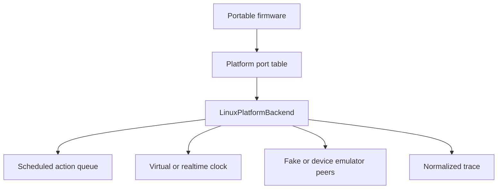
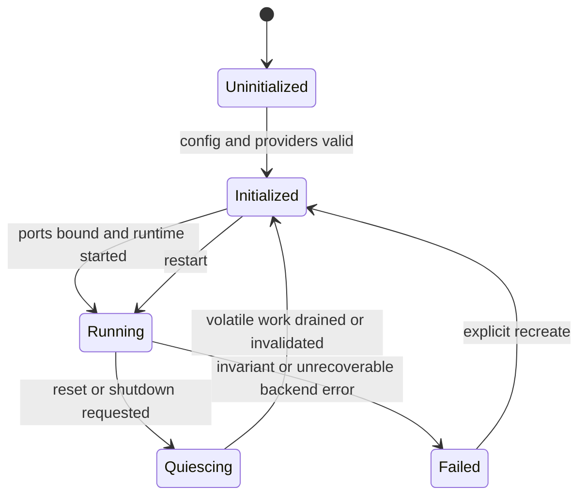
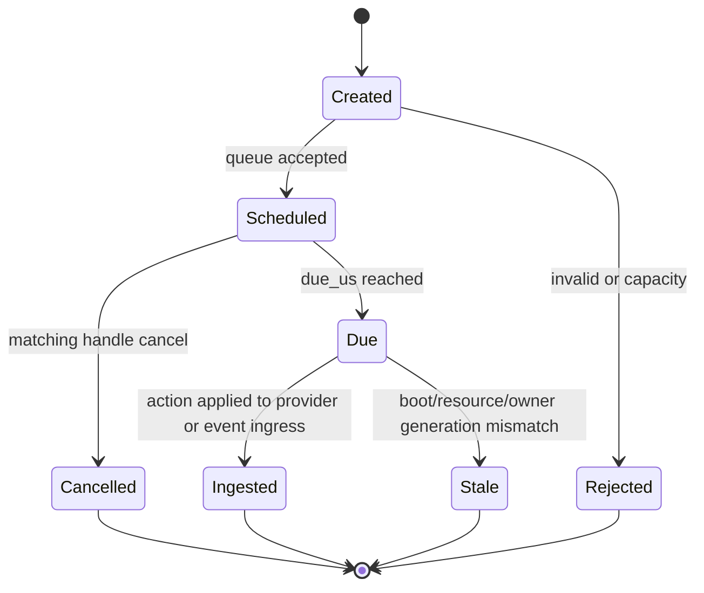
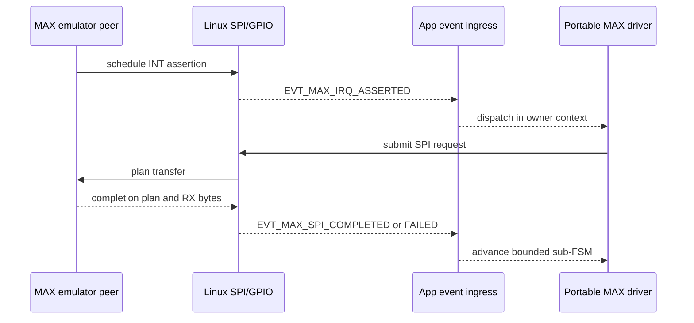
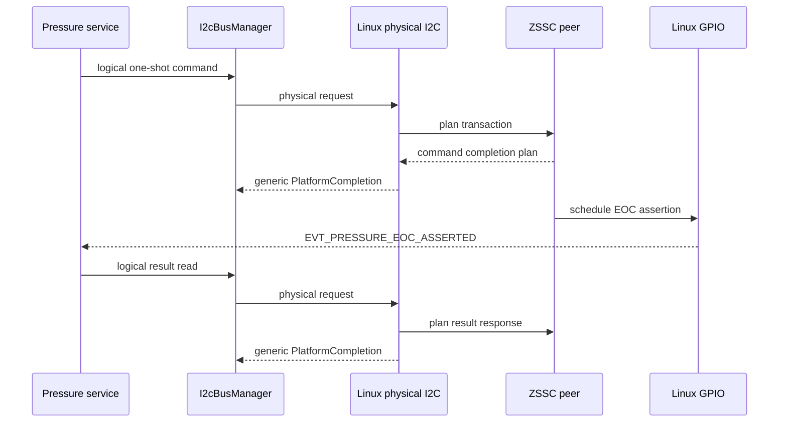
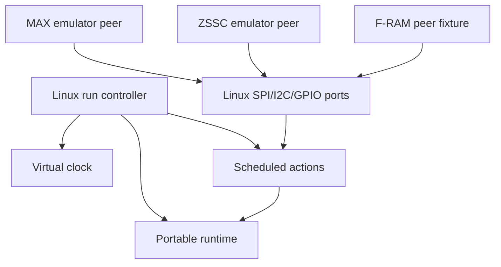

# Linux Platform Backend

## 1. Mục đích

Tài liệu này định nghĩa concrete Linux implementation của các platform port trong `50_platform_abstraction.md`.

Backend Linux có hai mục tiêu:

1. Tạo runtime deterministic dùng virtual time làm oracle cho unit, contract, integration và system test.
2. Cung cấp optional realtime mode cho interactive demo hoặc external-emulator integration mà không thay portable firmware semantics.

Backend phải cho phép cùng application, service, infrastructure và portable driver code chạy như trên STM32, trong khi Linux-specific mechanism được cô lập trong canonical `platform/linux`.

Tài liệu chốt:

- composition và lifecycle của Linux backend;
- virtual clock authoritative;
- deterministic scheduled-action queue;
- exact same-timestamp ordering;
- event-loop/monotonic-scheduler integration;
- SPI/I2C/GPIO/UART/RTC/power/watchdog Linux providers;
- fake/emulator peer seam;
- fault-injection boundary;
- reset, cancellation, duplicate và stale-completion behavior;
- normalized trace;
- contract tests và acceptance criteria.

---

## 2. Phạm vi

### 2.1. Trong phạm vi

- C11 Linux backend build.
- Default single-thread deterministic execution.
- Virtual monotonic time.
- Independent virtual wall clock.
- Bounded scheduled-action heap/queue.
- In-process fake và device emulator adapters.
- MAX35103 SPI/INT simulation binding.
- ZSSC3241 shared-I2C/EOC simulation binding.
- Optional F-RAM competing I2C peer fixture.
- Event wait/wake mapping.
- Critical-section/atomic mapping.
- UART/RTC/power/watchdog bounded Linux providers.
- Deterministic reset/recreate runtime.
- Trace, diagnostic counter và failure visibility.
- Optional realtime host adapter.
- Reusable platform contract-test binding.

### 2.2. Required first vertical slice

Implementation đầu tiên MUST có:

- `LinuxVirtualClock`;
- `LinuxScheduledActionQueue`;
- Linux event wait/wake provider;
- Linux SPI provider + MAX fake/emulator peer seam;
- Linux GPIO line/INT model;
- Linux physical I2C provider + address/peer registry;
- ZSSC EOC/polling behavior;
- origin evidence `DATA_ORIGIN_SIMULATED_DEVICE`;
- success, timeout, invalid response, duplicate và stale-generation injection;
- `RunOneTurn`, `RunUntilIdle(max_steps)`;
- normalized deterministic trace.

UART, RTC, low power và watchdog MUST compile and satisfy their basic contract, nhưng MAY chỉ có minimal deterministic provider trước vertical slice tương ứng.

### 2.3. Ngoài phạm vi

Tài liệu không chốt:

- source tree khác `01_firmware_architecture.md` section 17.1;
- scenario file schema hoặc command-line UX chính thức;
- external emulator socket protocol;
- device register semantics do MAX/ZSSC document sở hữu;
- production algorithm/calibration accuracy;
- STM32 HAL/pin/DMA implementation;
- CI matrix/file naming;
- telemetry/BLE/4G protocol;
- persistent storage byte layout;
- full performance model của Linux host;
- multi-process distributed simulation;
- RTOS/thread topology.

Scenario syntax, golden-file governance và end-to-end fixture catalog thuộc `92_firmware_test_strategy.md` và `93_linux_simulation_integration.md`.

---

## 3. Source-of-truth và tài liệu liên quan

| Nội dung | Source-of-truth |
|---|---|
| Runtime/event-loop invariant | `00_runtime_decision.md` |
| Layer/source tree | `01_firmware_architecture.md` |
| Event/scheduler semantics | `02_event_model_and_scheduler.md` |
| Canonical data/ownership | `04_data_model_and_ownership.md` |
| Portable platform contract | `50_platform_abstraction.md` |
| Linux concrete implementation | Tài liệu này |
| STM32 concrete implementation | `52_stm32_platform_backend.md` |
| Callback/ISR rule | `53_interrupt_dma_and_callback_rules.md` |
| MAX behavior | `11_max35103_integration.md` |
| ZSSC/shared-I2C behavior | `12_pressure_measurement_zssc3241.md` |
| Test/scenario policy | `92` và `93` |

Rule:

1. Tài liệu 50 sở hữu public port semantics.
2. Tài liệu này sở hữu Linux mechanism và deterministic ordering.
3. Device emulator không được thay đổi canonical device/driver contract.
4. Test harness không được sửa private owner state trừ white-box unit test.
5. Realtime mode không được định nghĩa behavior khác deterministic mode.

---

## 4. Requirement/decision được hiện thực

### 4.1. Linux backend requirements

| ID | Requirement |
|---|---|
| `FW-LNX-REQ-001` | Deterministic mode MUST là default cho automated tests. |
| `FW-LNX-REQ-002` | Deterministic mode MUST không gọi sleep/usleep/nanosleep để đạt simulated deadline. |
| `FW-LNX-REQ-003` | Virtual monotonic time MUST chỉ tiến khi harness/runtime explicit advance. |
| `FW-LNX-REQ-004` | Virtual monotonic time MUST không đi lùi và overflow arithmetic MUST được kiểm tra. |
| `FW-LNX-REQ-005` | Wall clock MUST là time domain độc lập và wall-clock step MUST không thay monotonic deadline. |
| `FW-LNX-REQ-006` | Scheduled platform actions MUST có stable deterministic total order. |
| `FW-LNX-REQ-007` | Same input/config/seed MUST tạo cùng normalized trace. |
| `FW-LNX-REQ-008` | Pointer address, thread scheduling, filesystem enumeration và host wall clock MUST không tham gia deterministic ordering. |
| `FW-LNX-REQ-009` | Default deterministic backend MUST chạy single-thread cooperative. |
| `FW-LNX-REQ-010` | Platform scheduled-action queue MUST có static/configured bounded capacity và visible overflow. |
| `FW-LNX-REQ-011` | Accepted SPI/I2C/UART operation MUST tạo đúng một logical terminal completion trừ explicit no-completion fault scenario. |
| `FW-LNX-REQ-012` | No-completion fault MUST để owner scheduler tạo timeout; backend không tự fabricate success/failure. |
| `FW-LNX-REQ-013` | Duplicate/late scheduled action MUST có thể inject và MUST không tạo duplicate product side effect. |
| `FW-LNX-REQ-014` | Scheduled action MUST retain operation/correlation/owner/resource generation. |
| `FW-LNX-REQ-015` | Linux provider MUST honor buffer lifetime class trong platform contract. |
| `FW-LNX-REQ-016` | SPI peer MUST không bypass portable MAX driver trong integration tests. |
| `FW-LNX-REQ-017` | Physical I2C provider MUST chỉ được gọi bởi I2cBusManager. |
| `FW-LNX-REQ-018` | I2C address registry MUST reject duplicate/unknown binding deterministically. |
| `FW-LNX-REQ-019` | I2C bus recovery MUST increment resource generation và invalidate old completion. |
| `FW-LNX-REQ-020` | GPIO model MUST support level, edge/evidence sequence, arm generation và missed-edge/active-level scenario. |
| `FW-LNX-REQ-021` | MAX INT MUST map tới `EVT_MAX_IRQ_ASSERTED`; platform không post `EVT_MAX_RAW_READY`. |
| `FW-LNX-REQ-022` | ZSSC EOC MUST map tới `EVT_PRESSURE_EOC_ASSERTED`; platform không post `EVT_PRESSURE_RAW_READY`. |
| `FW-LNX-REQ-023` | Fake/emulator/replay provider MUST expose origin evidence; downstream result MUST không mang live-device origin. |
| `FW-LNX-REQ-024` | Production target MUST fail build/link nếu Linux simulated provider được selected. |
| `FW-LNX-REQ-025` | `RunUntilIdle` MUST có max-step bound và explicit livelock/step-limit result. |
| `FW-LNX-REQ-026` | Run loop MUST advance tới min(next platform action, next monotonic scheduler deadline) khi idle. |
| `FW-LNX-REQ-027` | Due platform actions tại current time MUST được ingested trước application event dispatch của turn. |
| `FW-LNX-REQ-028` | Core scheduler jobs MUST vẫn do MonotonicScheduler sở hữu; Linux action queue không thay scheduler. |
| `FW-LNX-REQ-029` | Reset MUST recreate volatile runtime, increment boot generation và cancel/invalidate old actions. |
| `FW-LNX-REQ-030` | Persistent device-emulator state qua reset MUST explicit per scenario; default không được suy đoán. |
| `FW-LNX-REQ-031` | Trace MUST normalized và không chứa pointer/fd/host-thread identity. |
| `FW-LNX-REQ-032` | Realtime mode MUST dùng CLOCK_MONOTONIC-equivalent cho timeout và không là golden-test oracle. |
| `FW-LNX-REQ-033` | External I/O/realtime ingress MUST đi qua bounded mailbox rồi được serialized vào owner loop. |
| `FW-LNX-REQ-034` | Fault injection MUST đi qua public test seam/action plan; không sửa private firmware state. |
| `FW-LNX-REQ-035` | Linux backend MUST vượt reusable platform contract tests. |
| `FW-LNX-REQ-036` | Numeric latency/capacity default chỉ là test profile và không được quảng bá thành production-qualified value. |

### 4.2. Decision binding

| Decision | Linux backend implication |
|---|---|
| Cooperative bare-metal model | Single owner loop; no thread-per-service |
| Monotonic scheduling | Virtual clock + min-next-deadline idle advance |
| MAX event timing | Emulator schedules INT/device actions; MCU scheduler chỉ supervision |
| ZSSC one-shot | I2C completion + EOC/poll scheduled actions |
| Shared I2C | Một Linux physical bus provider dưới I2cBusManager |
| Atomic snapshot | Single-thread deterministic publication + contract-compatible critical port |
| STOP 2 | Simulated sleep advances virtual time to eligible wake |
| Simulation-first | Deterministic mode is normative test backend |

---

## 5. Trách nhiệm

### 5.1. LinuxPlatformBackend

Top-level backend chịu trách nhiệm:

- own virtual/realtime clock provider;
- own scheduled-action queue;
- bind all Linux platform ports;
- register fake/emulator peers;
- collect diagnostic counters;
- serialize external ingress;
- provide idle/run/reset hooks;
- expose normalized trace sink;
- enforce backend mode/capability/build policy.

### 5.2. LinuxVirtualClock

- giữ authoritative `now_us`;
- reject backward advance;
- check overflow;
- giữ independent wall-clock base/generation;
- notify runtime khi advance tới due action/deadline;
- không tự dispatch firmware service.

### 5.3. LinuxScheduledActionQueue

- copy immutable action metadata;
- order by canonical key;
- enforce capacity;
- cancel by stable action ID/generation;
- pop all actions due at current time;
- retain insertion sequence;
- expose next deadline;
- record schedule/cancel/fire/duplicate/stale trace.

### 5.4. Port providers

| Provider | Responsibility |
|---|---|
| `LinuxSpiProvider` | SPI admission, buffer rule, peer plan và terminal callback |
| `LinuxI2cProvider` | Physical bus transaction, address peer, failure/recovery |
| `LinuxGpioProvider` | Line state, arm generation, edge/level evidence |
| `LinuxUartProvider` | Deterministic RX/TX ring/mailbox and completion |
| `LinuxRtcProvider` | Independent wall clock/alarm action |
| `LinuxPowerProvider` | Simulated sleep/wake/reset evidence |
| `LinuxWatchdogProvider` | Virtual watchdog deadline/evidence |
| `LinuxCriticalSectionProvider` | Contract-compatible bounded primitive |
| `LinuxEventWaitProvider` | Idle signal/wait behavior |

### 5.5. Emulator/fake peer

Peer chịu trách nhiệm device/wire-side behavior:

- nhận immutable transaction view;
- validate command/address/profile as applicable;
- return a bounded action plan;
- schedule data/status/GPIO evidence;
- keep device state it owns;
- expose deterministic fault points;
- never call firmware service/repository directly.

### 5.6. Harness

Harness chịu trách nhiệm:

- select backend mode/profile;
- install peers/fixtures;
- advance virtual time;
- inject public faults/events;
- call run functions with bounds;
- assert trace/result/snapshot;
- recreate/reset runtime in explicit sequence.

---

## 6. Ngoài phạm vi

Linux backend không được:

- thay MonotonicScheduler bằng its own product job scheduler;
- post canonical processed/raw-ready event thuộc driver/service owner;
- set production DataOrigin;
- calculate flow/pressure/leak;
- modify ActiveConfig/Binding directly;
- call private service context from fault hook;
- use random iteration order;
- use pointer address làm ID/tie-break;
- depend on real sleep in deterministic mode;
- hide queue overflow or no-completion fault;
- automatically retry device transaction;
- treat host file/socket success as firmware transaction success;
- create a second source tree;
- expose pthread, fd, timespec hoặc POSIX status trong portable public header.

---

## 7. Interface và dependency

### 7.1. Composition



### 7.2. Backend mode

```c
typedef enum {
    LINUX_BACKEND_DETERMINISTIC,
    LINUX_BACKEND_REALTIME
} LinuxBackendMode;
```

Automated contract/integration/system tests MUST use deterministic mode unless test explicitly validates realtime adapter.

### 7.3. Top-level context

```c
typedef struct {
    LinuxBackendMode mode;
    uint32_t boot_generation;
    LinuxVirtualClock clock;
    LinuxScheduledActionQueue actions;
    LinuxSpiProvider spi;
    LinuxI2cProvider i2c;
    LinuxGpioProvider gpio;
    LinuxUartProvider uart_ble;
    LinuxUartProvider uart_cellular;
    LinuxRtcProvider rtc;
    LinuxPowerProvider power;
    LinuxWatchdogProvider watchdog;
    LinuxDiagnosticCounters diagnostics;
    LinuxTraceSink trace;
} LinuxPlatformBackend;
```

Đây là logical composition. Exact public/private split thuộc implementation; portable code chỉ nhận port interfaces từ `50_platform_abstraction.md`.

### 7.4. Initialization

```c
PlatformStatus linux_platform_init(
    LinuxPlatformBackend *backend,
    const LinuxPlatformConfig *config);

PlatformStatus linux_platform_bind_ports(
    LinuxPlatformBackend *backend,
    PlatformPortTable *ports_out);

PlatformStatus linux_platform_start(
    LinuxPlatformBackend *backend);

PlatformStatus linux_platform_reset(
    LinuxPlatformBackend *backend,
    PlatformResetReason reason,
    LinuxResetPersistencePolicy persistence);
```

Init order:

1. Validate mode/capacity/config.
2. Initialize clock and action queue.
3. Initialize event/trace/diagnostic sinks.
4. Initialize GPIO/SPI/I2C/UART/RTC/power/watchdog providers.
5. Register peer maps.
6. Bind portable port table.
7. Publish platform primitive readiness.

### 7.5. Virtual clock API

```c
typedef struct {
    uint64_t now_us;
    int64_t wall_base_s;
    uint32_t wall_subsecond_us;
    uint32_t time_generation;
    bool wall_time_valid;
} LinuxVirtualClock;

uint64_t linux_clock_now_us(
    const LinuxVirtualClock *clock);

PlatformStatus linux_clock_advance_to(
    LinuxVirtualClock *clock,
    uint64_t target_us);

PlatformStatus linux_clock_advance_by(
    LinuxVirtualClock *clock,
    uint64_t delta_us);

PlatformStatus linux_clock_step_wall(
    LinuxVirtualClock *clock,
    int64_t new_wall_s,
    uint32_t new_subsecond_us,
    TimeQuality quality);
```

Advance function chỉ đổi clock; due-action ingestion/run do top-level run function điều phối để tránh callback reentrancy.

### 7.6. Scheduled action model

```c
typedef enum {
    LINUX_ACTION_CRITICAL_RESET_OR_FAULT = 0,
    LINUX_ACTION_GPIO_OR_WAKE_EVIDENCE = 1,
    LINUX_ACTION_TRANSPORT_COMPLETION = 2,
    LINUX_ACTION_RTC_OR_TIMER_EVIDENCE = 3,
    LINUX_ACTION_UART_RX_AVAILABLE = 4,
    LINUX_ACTION_TEST_OBSERVER = 5
} LinuxActionClass;

typedef struct {
    uint64_t due_us;
    LinuxActionClass action_class;
    uint32_t resource_id;
    uint32_t resource_generation;
    uint32_t source_sequence;
    uint64_t insertion_sequence;
    uint32_t action_id;
    LinuxActionPayload payload;
} LinuxScheduledAction;
```

Canonical total-order key:

```text
due_us ascending
action_class ascending
resource_id ascending
resource_generation ascending
source_sequence ascending
insertion_sequence ascending
```

Rules:

- insertion sequence monotonically increases within boot generation;
- action ID is stable and not a pointer;
- action class is platform-action ordering, not AppEvent priority;
- all due actions are ingested, then AppEventQueue priority decides firmware dispatch;
- same input/config creates same order;
- no random tie-break.

### 7.7. Action queue API

```c
LinuxScheduleResult linux_action_schedule(
    LinuxScheduledActionQueue *queue,
    const LinuxScheduledAction *action,
    LinuxActionHandle *handle_out);

LinuxCancelResult linux_action_cancel(
    LinuxScheduledActionQueue *queue,
    LinuxActionHandle expected);

bool linux_action_next_due(
    const LinuxScheduledActionQueue *queue,
    uint64_t *due_us_out);

LinuxDrainResult linux_action_drain_due(
    LinuxPlatformBackend *backend,
    uint64_t now_us,
    uint32_t max_actions);
```

Queue MAY dùng static binary heap + stable fields. Heap implementation detail không được thay key semantics.

### 7.8. Run API

```c
typedef enum {
    LINUX_RUN_PROGRESS,
    LINUX_RUN_IDLE,
    LINUX_RUN_QUIESCENT,
    LINUX_RUN_STEP_LIMIT,
    LINUX_RUN_LIVELOCK,
    LINUX_RUN_ERROR
} LinuxRunResult;

LinuxRunResult linux_run_one_turn(
    LinuxPlatformBackend *backend,
    FirmwareRuntime *runtime);

LinuxRunResult linux_run_until_idle(
    LinuxPlatformBackend *backend,
    FirmwareRuntime *runtime,
    uint32_t max_steps);

LinuxRunResult linux_run_until_time(
    LinuxPlatformBackend *backend,
    FirmwareRuntime *runtime,
    uint64_t target_us,
    uint32_t max_steps);
```

Run function không thuộc portable firmware API; nó là Linux harness/runtime adapter.

### 7.9. Peer plan

```c
typedef enum {
    LINUX_PEER_ACCEPT,
    LINUX_PEER_REJECT,
    LINUX_PEER_NO_COMPLETION
} LinuxPeerDisposition;

typedef struct {
    LinuxPeerDisposition disposition;
    uint64_t completion_latency_us;
    PlatformStatus terminal_status;
    uint16_t transferred_count;
    LinuxPeerRxData rx;
    LinuxPeerSideAction side_actions[LINUX_PEER_MAX_SIDE_ACTIONS];
    uint8_t side_action_count;
    uint32_t diagnostic_flags;
} LinuxPeerPlan;
```

`NO_COMPLETION` là explicit fault fixture. Backend vẫn giữ accepted operation active/timeout-observable theo configured test semantics; owner scheduler quyết định terminal attempt timeout.

Đây là test-only emulation của missing hardware completion, không phải normal provider behavior. Backend MUST ghi injected-fault diagnostic để thỏa platform invariant “terminal completion hoặc explicit platform-fatal/fault evidence”; production-equivalent success path không được dùng disposition này.

### 7.10. SPI peer interface

```c
typedef struct {
    void *context;
    LinuxPeerDisposition (*plan_transfer)(
        void *context,
        const PlatformSpiRequest *request,
        uint64_t now_us,
        LinuxPeerPlan *plan_out);
    void (*on_reset)(
        void *context,
        LinuxResetPersistencePolicy policy);
} LinuxSpiPeer;
```

MAX emulator peer có thể schedule:

- SPI terminal completion;
- later MAX INT line assertion;
- unexpected reset/status change;
- duplicate/late callback fixture.

Peer không post `EVT_MAX_RAW_READY`.

### 7.11. I2C peer registry

```c
typedef struct {
    uint8_t address_7bit;
    uint32_t peer_id;
    LinuxI2cPeer peer;
} LinuxI2cPeerBinding;
```

Registry:

- sorted/stable by address/peer ID;
- rejects duplicate address;
- rejects unknown address as deterministic NACK/failure;
- contains ZSSC peer and optional F-RAM peer;
- not enumerated using unordered container behavior.

### 7.12. GPIO line interface

```c
typedef struct {
    uint32_t line_id;
    PlatformGpioLevel level;
    bool irq_armed;
    uint32_t arm_generation;
    uint32_t evidence_sequence;
    bool pending_level_evidence;
} LinuxGpioLine;

PlatformStatus linux_gpio_peer_drive(
    LinuxPlatformBackend *backend,
    uint32_t line_id,
    PlatformGpioLevel new_level,
    uint64_t due_us,
    uint32_t source_generation);
```

Peer drive schedules a GPIO action; nó không mutate firmware-visible line asynchronously ngoài action queue.

### 7.13. Fault injection interface

```c
typedef enum {
    LINUX_FAULT_REJECT_NEXT,
    LINUX_FAULT_FAIL_NEXT,
    LINUX_FAULT_DROP_COMPLETION,
    LINUX_FAULT_DUPLICATE_COMPLETION,
    LINUX_FAULT_DELAY_COMPLETION,
    LINUX_FAULT_TRUNCATE_TRANSFER,
    LINUX_FAULT_FORCE_RESOURCE_RESET,
    LINUX_FAULT_ASSERT_GPIO,
    LINUX_FAULT_STEP_WALL_CLOCK
} LinuxFaultKind;

LinuxFaultResult linux_fault_schedule(
    LinuxPlatformBackend *backend,
    const LinuxFaultRequest *request);
```

Fault request phải target stable resource/action/operation/occurrence selector. Exact scenario schema thuộc tài liệu 93.

### 7.14. Trace sink

```c
typedef struct {
    uint64_t monotonic_us;
    uint32_t boot_generation;
    LinuxTraceKind kind;
    uint32_t resource_id;
    uint32_t action_id;
    uint32_t operation_id;
    uint32_t correlation_id;
    uint32_t owner_generation;
    uint32_t resource_generation;
    PlatformStatus status;
    uint32_t detail_flags;
} LinuxTraceRecord;
```

Trace sink MAY render text/JSON later, nhưng canonical record không chứa pointer, fd, pthread ID hoặc nondeterministic host timestamp.

---

## 8. Data model và đơn vị

### 8.1. Canonical units

| Field | Unit/type |
|---|---|
| Virtual monotonic time | `uint64_t us` |
| Completion/action latency | `uint64_t us` |
| Wall clock | Unix second + subsecond + TimeQuality |
| Queue index/capacity | fixed-width unsigned |
| Action insertion sequence | `uint64_t` within boot generation |
| Transfer length | bytes |
| GPIO level | explicit low/high enum |

No Linux API type such as `timespec` appears in portable port or trace record.

### 8.2. Clock invariants

```text
target_us >= now_us
now_us + delta_us does not overflow
wall-clock step does not modify now_us
boot reset initializes monotonic origin according to explicit reset policy
```

Baseline reset creates a new boot generation and resets virtual monotonic time to zero. Cross-reset ordering uses boot generation + monotonic time; it does not assume monotonic continuity across recreated process/runtime.

### 8.3. Action identity

| Field | Owner |
|---|---|
| `action_id` | Linux action queue |
| `insertion_sequence` | Linux action queue |
| `source_sequence` | Resource/peer |
| `operation_id/correlation_id` | Portable request owner |
| `owner_generation` | Driver/service |
| `resource_generation` | Linux port provider |
| `boot_generation` | Top-level backend |

Action handle includes action ID, boot generation và queue generation. Cancel handle from old reset is stale.

### 8.4. Capacity model

```c
typedef struct {
    uint32_t max_scheduled_actions;
    uint32_t max_due_actions_per_turn;
    uint32_t max_spi_transfer;
    uint32_t max_i2c_tx;
    uint32_t max_i2c_rx;
    uint32_t max_gpio_lines;
    uint32_t max_i2c_peers;
    uint32_t max_uart_rx_bytes;
    uint32_t max_uart_tx;
    uint32_t max_trace_records;
} LinuxPlatformCapacity;
```

All capacities validated at init. Test profile values are configurable but bounded by compile-time maxima.

### 8.5. Scheduled-action payload

Payload uses a tagged bounded union or stable mailbox/slot reference:

```text
TRANSPORT_COMPLETION -> PlatformCompletion + resource-specific bounded RX slot
GPIO_EVIDENCE        -> PlatformGpioEvidence
RTC_ALARM            -> alarm generation/time evidence
WAKE                 -> wake reason mask
RESET/FAULT          -> reason/resource evidence
UART_RX              -> ring/mailbox version and byte count
```

Action payload không giữ pointer tới stack hoặc mutable peer scratch buffer.

### 8.6. Operation state

```c
typedef enum {
    LINUX_OP_IDLE,
    LINUX_OP_ACTIVE,
    LINUX_OP_CANCEL_PENDING,
    LINUX_OP_TERMINAL_SCHEDULED,
    LINUX_OP_RECOVERING,
    LINUX_OP_UNAVAILABLE
} LinuxOperationState;
```

Each SPI/I2C/UART provider instance retains at most configured active operations. Measurement baseline SPI/I2C uses one active operation per physical provider.

### 8.7. Diagnostic counters

```c
typedef struct {
    uint64_t admission_accepted;
    uint64_t admission_rejected;
    uint64_t queue_overflow;
    uint64_t completion_scheduled;
    uint64_t completion_fired;
    uint64_t completion_cancelled;
    uint64_t duplicate_action;
    uint64_t stale_action;
    uint64_t late_completion;
    uint64_t resource_recovery;
    uint64_t run_step_limit;
    uint64_t livelock_detected;
} LinuxResourceCounters;
```

Counter is diagnostic only; tests assert expected delta rather than memory layout.

### 8.8. Origin evidence

Peer binding declares:

```c
typedef enum {
    LINUX_INPUT_SIMULATED_DEVICE,
    LINUX_INPUT_REPLAYED_FIXTURE
} LinuxInputOrigin;
```

Adapter maps:

- simulated device -> `DATA_ORIGIN_SIMULATED_DEVICE`;
- replay fixture -> `DATA_ORIGIN_REPLAYED_FIXTURE`.

Linux backend has no API to emit `DATA_ORIGIN_LIVE_DEVICE`.

---

## 9. State machine hoặc sequence

### 9.1. Backend lifecycle



### 9.2. Scheduled action lifecycle



### 9.3. Deterministic run-one-turn

```text
1. Read virtual now.
2. Drain due Linux platform actions at now, bounded.
3. Apply action effects and post/latch canonical event evidence.
4. Ask MonotonicScheduler to dispatch due jobs at now.
5. Execute one bounded AppEventLoop turn.
6. Publish final snapshot if SourceEventToken policy requires.
7. Record progress signature and next deadlines.
8. Return PROGRESS, IDLE, QUIESCENT or ERROR.
```

If more due platform actions remain because per-turn action budget is exhausted, next turn runs at same virtual time. No time advance occurs while due work remains.

### 9.4. Run-until-idle

```text
for step in 0..max_steps-1:
    result = RunOneTurn()
    if result made progress:
        continue
    if firmware event/work pending:
        continue
    next = min(platform_next_action, scheduler_next_deadline)
    if no next:
        return QUIESCENT
    if next < now:
        return ERROR
    if next == now and progress signature unchanged:
        return LIVELOCK
    advance virtual clock to next
return STEP_LIMIT
```

`IDLE` means no immediate work nhưng future deadline/action exists. `QUIESCENT` means no immediate or scheduled future work within configured model.

### 9.5. MAX deterministic sequence



After coherent reads, portable driver owns `EVT_MAX_RAW_READY`.

### 9.6. ZSSC deterministic sequence



Portable pressure acquisition/driver owns `EVT_PRESSURE_RAW_READY`.

### 9.7. Drop/no-completion

```text
request accepted
  -> peer disposition NO_COMPLETION
  -> provider remains active or fault-marked per fixture
  -> no platform terminal event injected
  -> owner supervision timeout fires
  -> owner cancels/recovers/increments generation
  -> any later injected completion becomes stale
```

This path tests timeout ownership; backend does not post an artificial timeout unless primitive-specific hardware timeout is explicitly modeled.

### 9.8. Duplicate completion

Duplicate fixture schedules two actions with same operation identity but distinct action/source sequence. Provider closes on first terminal action; second is classified duplicate/stale and cannot emit second canonical terminal event.

### 9.9. Reset

```text
schedule/request reset
  -> stop new admission
  -> invalidate/cancel volatile scheduled actions
  -> capture reset evidence
  -> increment boot generation
  -> apply explicit peer persistence policy
  -> reset virtual monotonic origin
  -> recreate portable runtime
  -> enter INIT
```

### 9.10. Simulated low power

```text
PowerManager confirms blockers clear
  -> LinuxPowerProvider prepare
  -> final pending-work/action check
  -> select earliest armed wake action/deadline
  -> advance virtual time
  -> capture wake mask
  -> resume providers
  -> post wake/device evidence
```

Low power simulation không tự skip non-wake platform action; action eligibility must be explicit.

---

## 10. Timing, timeout và non-blocking behavior

### 10.1. Deterministic timing

- Virtual latency is configured in microseconds.
- Scheduling an action does not advance time.
- Running firmware work does not implicitly consume virtual time in functional tests.
- Optional execution-cost model MAY add explicit cost, but it must be disabled/default-stable and separately tested.
- Completion time is scheduled due time.
- Sample time comes from emulator/device semantics, not automatically completion time.

### 10.2. Next-deadline selection

```text
next_us = min(
    linux_action_queue_next_due(),
    monotonic_scheduler_next_deadline(),
    armed_watchdog_deadline(),
    eligible_rtc_or_wake_deadline()
)
```

Inputs absent are ignored. Selection uses checked comparisons and never advances backward.

### 10.3. Same-timestamp rule

Backend freezes action order in section 7.6. After all due actions are ingested, canonical AppEventQueue priority/delivery decides dispatch. Linux action class does not override firmware event priority.

### 10.4. Bounded work

Each run turn has configured bounds:

- max platform actions drained;
- max firmware events dispatched;
- max service steps;
- max parser bytes;
- max trace records appended;
- optional host execution-time guard.

Exhausted bound retains work for next turn at same virtual time.

### 10.5. Realtime mode

Realtime mode MAY use:

- `clock_gettime(CLOCK_MONOTONIC)` or equivalent;
- `poll`/condition/eventfd-like internal wait;
- host thread only for external ingress if isolated.

Rules:

- portable code does not see these types;
- time converted to canonical microseconds;
- timeout never uses CLOCK_REALTIME;
- external callbacks write bounded mailbox and signal owner loop;
- golden tests do not depend on realtime mode;
- host lateness records diagnostic but does not change correlation/generation semantics.

### 10.6. No blocking in providers

SPI/I2C/GPIO/UART provider submit:

- validates/copies metadata;
- asks peer for bounded plan;
- schedules action(s);
- returns admission result.

It does not wait until due time or call portable callback synchronously. Even zero-latency plan schedules due action at `now_us`, processed by run loop after submit returns.

### 10.7. Livelock detection

Progress signature MAY include:

```text
now_us
event queue sequence/depth
scheduled action queue sequence/depth
active provider states/generations
scheduler pending/version
snapshot version
```

Repeated signature at same now with pending work beyond configured threshold returns `LINUX_RUN_LIVELOCK`.

### 10.8. Realtime host performance

Host timing/CPU performance is not production timing evidence. Linux profiling may reveal algorithmic hot spots, nhưng STM32 WCET/latency vẫn cần qualification riêng.

---

## 11. Configuration

### 11.1. Linux platform config

```c
typedef struct {
    LinuxBackendMode mode;
    LinuxPlatformCapacity capacity;
    uint64_t initial_monotonic_us;
    PlatformWallClock initial_wall_clock;
    bool trace_enabled;
    bool strict_invariant_mode;
    uint32_t deterministic_seed;
    LinuxBuildFeatureMask features;
} LinuxPlatformConfig;
```

Deterministic seed chỉ dùng cho explicitly seeded fixture generation. It must not affect ordering key or unseeded baseline.

### 11.2. Required config validation

- mode valid;
- capacities nonzero/within compile-time maxima;
- initial time valid and non-overflowing;
- required port providers enabled;
- unique resource and GPIO IDs;
- unique I2C address binding;
- peer origin is simulated/replay only;
- no external/realtime provider in strict deterministic build;
- trace capacity compatible with selected policy;
- action-class registry complete.

### 11.3. Test latency profile

Test profile MAY define:

```text
spi_completion_latency_us
i2c_command_latency_us
i2c_read_latency_us
zssc_conversion_latency_us
max_event_interval_us
uart_tx_latency_us
rtc_alarm_latency_us
```

These are simulator values, not production-qualified defaults. Fixture/trace records profile ID/version.

### 11.4. Peer registry config

Peer bindings include:

- stable peer/resource ID;
- input origin;
- compatible profile/fixture ID;
- initial device state;
- reset persistence policy;
- fault capabilities;
- deterministic latency profile.

Unknown/incompatible peer causes init or transaction failure explicitly.

### 11.5. Strict modes

```text
STRICT_DETERMINISTIC
  no realtime ingress
  no filesystem enumeration dependency
  no unseeded randomness
  invariant violation aborts scenario with evidence

INTERACTIVE_REALTIME
  external ingress allowed
  normalized semantics retained
  not golden oracle
```

### 11.6. Build selection

Canonical build selects Linux provider through CMake target/config following `01_firmware_architecture.md`. Core target must not conditionally compile business logic based on Linux macros; only provider composition/build binding is platform-specific.

---

## 12. Error detection và recovery

### 12.1. Linux-specific errors

| Error | Response |
|---|---|
| Backward/overflow time advance | Reject + invariant diagnostic |
| Action queue capacity exhausted | Explicit no-capacity; no partial schedule |
| Invalid same-time key/action class | Reject/init failure |
| Duplicate I2C address/resource ID | Init failure |
| Peer returns invalid plan | Terminal integrity error or admission rejection |
| RX length exceeds request | Integrity error; no buffer overwrite |
| Action fires after reset | Stale by boot generation |
| Resource generation mismatch | Stale; no canonical completion |
| Event ingress full | Completion latch/fallback + diagnostic |
| max_steps exhausted | STEP_LIMIT with trace tail |
| no progress at same time | LIVELOCK |
| realtime external mailbox overflow | Visible error/recovery |

### 12.2. Peer-plan validation

Before scheduling:

- disposition is valid;
- latency addition does not overflow;
- transferred count within request;
- RX bytes fit requested/copy slot;
- side-action count within capacity;
- GPIO/resource IDs registered;
- action due time not earlier than now;
- terminal/no-completion combination consistent;
- diagnostic flags bounded.

Invalid plan cannot partially schedule actions.

### 12.3. Transaction rollback

If action scheduling for an accepted peer plan needs multiple queue slots, provider reserves required capacity first or atomically rolls back. It must not schedule completion but lose required GPIO/side action silently.

### 12.4. Resource recovery

SPI/I2C/UART recovery:

1. Mark provider recovering.
2. Increment resource generation at defined boundary.
3. Cancel/invalidate queued old-generation actions.
4. Reset peer transport state per explicit policy.
5. Return provider idle or unavailable.
6. Publish recovery evidence.
7. Let portable driver/service perform functional re-verification.

### 12.5. Strict invariant response

In strict deterministic mode, invariant violation:

- stops scenario/run with `LINUX_RUN_ERROR`;
- retains last bounded trace window;
- does not silently continue with guessed state;
- does not call process abort from library code unless test runner policy chooses.

### 12.6. Realtime isolation

External host thread/socket callback cannot mutate provider/device/firmware owner state. It creates immutable ingress item in bounded mailbox; owner loop assigns deterministic local sequence when consuming. Arrival timing is observable but not golden-deterministic.

### 12.7. Cleanup

Shutdown/reset cleanup:

- stops admission;
- closes external adapters if any;
- invalidates queued action handles;
- releases only backend-owned resources;
- does not free caller-stable buffer before terminal/cancel contract;
- writes final diagnostic/trace state through explicit harness path.

---

## 13. Linux simulation mapping

### 13.1. First measurement simulator composition



### 13.2. MAX adapter mapping

| Logical element | Linux component |
|---|---|
| SPI wire/config | `LinuxSpiProvider` + immutable config ID |
| CE/device transaction | MAX-specific Linux adapter/peer context |
| MAX register/status state | MAX emulator peer |
| Event-timing cadence | Emulator side action schedule |
| INT line | Registered Linux GPIO line |
| SPI completion | Scheduled transport action |
| Driver | Same portable MAX driver as STM32 |
| Raw-ready | Portable driver/measurement owner |

Required MAX fixtures:

- normal event-timing result;
- invalid status/sentinel/partial cycle evidence;
- SPI failure/truncated RX;
- missing INT;
- INT level remains asserted;
- duplicate INT;
- missing SPI completion;
- late completion after reset/generation change;
- unexpected device reset;
- HALT/init delayed completion.

### 13.3. ZSSC/shared-I2C mapping

| Logical element | Linux component |
|---|---|
| Physical shared bus | `LinuxI2cProvider` |
| Client arbitration | Portable `I2cBusManager` |
| ZSSC address/device state | ZSSC peer |
| F-RAM competition | F-RAM peer fixture |
| One-shot conversion | ZSSC scheduled side action |
| EOC | Linux GPIO line/action |
| Polling-only variant | No EOC binding; scheduler polls |
| Bus recovery | Linux I2C resource generation |
| Pressure raw-ready | Portable acquisition/driver owner |

Required pressure fixtures:

- normal EOC completion;
- bounded polling completion;
- EOC missing;
- busy until timeout;
- duplicate/late EOC;
- NACK/truncated result;
- invalid status/raw code;
- bus recovery during attempt;
- old bus completion;
- contention with bounded F-RAM request.

### 13.4. Processing stub boundary

Before documents 13–15 are implemented, processing stub MAY convert deterministic raw fixture to canonical results. It must:

- run above driver/acquisition boundary;
- keep captured purpose/config/calibration/binding;
- set origin simulated/replay correctly;
- preserve validity/freshness/acceptance/reason model;
- never claim production-qualified accuracy;
- not bypass canonical raw-ready event in integration tests.

### 13.5. Scenario adapter boundary

Scenario runner MAY call:

```text
install peer/profile
schedule public fault
drive GPIO/device input
step wall clock
advance virtual time
run one turn/until idle
request reset
inspect public result/snapshot/trace
```

It MUST NOT:

```text
write private service FSM state
replace active generation silently
publish ResultMetadata directly
edit DataRepository buffer
skip portable driver for integration scenario
```

### 13.6. External emulator option

External emulator transport is deferred. Nếu được thêm:

- adapter converts messages to the same peer plan/action model;
- deterministic CI requires recorded/replayed ordered ingress or fully controlled transport;
- raw socket/fd stays private;
- disconnect maps explicit peer/transport error;
- external process timing does not redefine device semantics.

### 13.7. Output artifacts

Backend MAY expose:

- normalized trace;
- structured diagnostic counters;
- final RuntimeSnapshot copy;
- result/event histories with bounded capacity;
- scenario outcome.

File format/path belongs test/simulation tooling, not portable backend contract.

---

## 14. STM32 mapping

### 14.1. Equivalence objective

Linux backend is an executable oracle for logical behavior, not an electrical/timing model của STM32.

Must remain equivalent:

- public port request/admission types;
- operation/correlation/generation semantics;
- one-terminal-completion rule;
- canonical event IDs;
- driver/service FSM transitions;
- stale/duplicate handling;
- ResultMetadata and binding/origin semantics;
- snapshot publication;
- recovery ownership.

May differ:

- actual latency;
- HAL/vendor status code;
- DMA/interrupt mechanism;
- memory address/alignment;
- low-power clock reconstruction;
- physical electrical faults.

### 14.2. Normalized trace comparison

Cross-platform comparison ignores:

```text
host/MCU raw timestamp offset when scenario permits
vendor status numeric detail
pointer/address
DMA channel
NVIC/host thread
```

It compares:

```text
event/order class
operation/correlation/generation
terminal canonical status
driver/service state outcome
result validity/acceptance/reasons
snapshot/result versions
```

### 14.3. Timing caveat

Linux virtual time proves scheduling semantics and timeout paths. It does not prove STM32 WCET, ISR latency, bus electrical timing, STOP 2 current hoặc modem peak power.

### 14.4. HIL/replay

Future STM32 HIL trace MAY be replayed through Linux replay peer using `DATA_ORIGIN_REPLAYED_FIXTURE`. Replay does not become live production evidence.

---

## 15. Test và acceptance criteria

### 15.1. Unit tests — virtual clock/action queue

| Test ID | Scenario | Expected |
|---|---|---|
| `TC_LNX_CLOCK_START` | Initialize at configured time | Exact now |
| `TC_LNX_CLOCK_BACKWARD` | Advance backward | Rejected, unchanged |
| `TC_LNX_CLOCK_OVERFLOW` | Advance overflow | Rejected, diagnostic |
| `TC_LNX_WALL_STEP_INDEPENDENT` | Step wall clock | Monotonic unchanged |
| `TC_LNX_ACTION_TOTAL_ORDER` | Same due time, mixed classes/resources | Exact frozen order |
| `TC_LNX_ACTION_STABLE_INSERT` | Same key except insertion | FIFO by insertion sequence |
| `TC_LNX_ACTION_CANCEL` | Matching/stale handle | Correct cancel/stale |
| `TC_LNX_ACTION_CAPACITY` | Fill + one | Visible no-capacity, no corruption |
| `TC_LNX_ACTION_RESET_STALE` | Fire old boot action | Stale/no effect |

### 15.2. Unit tests — run controller

- Due actions ingested before event dispatch.
- Core scheduler remains separate.
- Next time is min action/job deadline.
- No future work returns QUIESCENT.
- Future work returns/advances IDLE path.
- max_steps returns STEP_LIMIT with evidence.
- Same-now no-progress returns LIVELOCK.
- Due-action budget retains remainder at same time.
- No real sleep in deterministic build/test.

### 15.3. SPI tests

- Submit reject/accept paths.
- Zero-latency plan remains asynchronous.
- RX copy/buffer bounds.
- Exactly one completion.
- Fail next/drop/duplicate/delay/truncate.
- Cancel before/after terminal scheduled.
- Resource reset invalidates old action.
- MAX canonical INT/SPI/raw-ready boundary.

### 15.4. I2C tests

- I2cBusManager sole-caller integration.
- Unique address registry.
- Unknown address deterministic failure.
- One active physical transaction.
- ZSSC/F-RAM contention serialized.
- Multi-action peer plan capacity reservation.
- NACK/timeout/drop/duplicate/truncate.
- Recovery generation.
- Old completion stale.
- ZSSC EOC and polling variants.

### 15.5. GPIO tests

- Arm/disarm generation.
- Level transition schedules evidence.
- Missed edge with active level.
- Duplicate assertion sequence.
- Old-generation evidence stale.
- MAX and ZSSC canonical event IDs only.
- GPIO peer cannot call service directly.

### 15.6. UART/RTC/power/watchdog tests

- UART ring boundary/overflow.
- UART TX completion/drop.
- Independent BLE/cellular providers.
- RTC alarm generation and wall step.
- Simulated sleep advances to eligible wake.
- Multi-reason same-time wake.
- Late blocker abort.
- Watchdog virtual deadline/reset evidence.

### 15.7. Reset/persistence tests

- Boot generation increments.
- Old action handles/completions stale.
- Volatile provider state reset.
- Peer state reset/preserve follows explicit policy.
- Runtime re-enters INIT.
- Trace includes reset boundary.
- Persistent fixture behavior is not guessed.

### 15.8. Determinism/property tests

```text
same scenario/config/seed -> byte-equivalent normalized trace
no pointer/fd/thread ID in trace
scheduled action order is total
virtual time never decreases
accepted operation has <=1 logical terminal event
stale completion has no product side effect
simulated/replay origin never becomes live
RunUntilIdle always terminates by idle/quiescent/bound/error
```

### 15.9. Measurement integration tests

- MAX normal sample -> simulated TemperatureResult/FlowResult -> snapshot.
- ZSSC normal sample -> simulated PressureResult -> snapshot.
- Timeout never creates valid zero.
- Invalid status publishes invalid/unavailable metadata as policy requires.
- Duplicate completion does not duplicate result/snapshot consequence.
- Late completion after generation change is stale.
- Shared source event produces at most one final snapshot.
- Simulated results do not update production volume/leak/telemetry.

### 15.10. Contract suite

Linux providers run reusable tests from platform abstraction:

```text
admission
identity/generation
buffer lifetime
terminal completion
cancel/timeout
error normalization
capacity
diagnostic evidence
```

### 15.11. Acceptance criteria

Linux backend is accepted for first measurement vertical slice when:

1. Builds as C11 target using canonical source tree.
2. Portable core contains no POSIX dependency.
3. Deterministic mode uses no real sleep.
4. Same scenario generates same normalized trace.
5. Virtual time/run controller terminates with finite bounds.
6. SPI MAX path uses canonical INT/SPI/raw-ready boundaries.
7. ZSSC path goes through I2cBusManager and canonical EOC/raw-ready boundaries.
8. Timeout, duplicate, late and stale faults are injectable.
9. Simulated origin is preserved and production side effects are rejected.
10. All required platform contract tests pass.
11. Queue/capacity failures are visible.
12. Realtime/external options do not affect deterministic oracle.

---

## 16. Traceability

### 16.1. Requirement mapping

| Linux requirements | Parent contract |
|---|---|
| `FW-LNX-REQ-001`–`010` | Deterministic time/order/capacity; `FW-PLAT-REQ-008`, `022`, `025` |
| `FW-LNX-REQ-011`–`015` | Completion/identity/buffer; `FW-PLAT-REQ-003`–`014` |
| `FW-LNX-REQ-016`–`022` | SPI/I2C/GPIO and canonical measurement events |
| `FW-LNX-REQ-023`–`024` | DataOrigin/build isolation; `FW-PLAT-REQ-027`–`028` |
| `FW-LNX-REQ-025`–`030` | Run/reset/scheduler ownership |
| `FW-LNX-REQ-031`–`036` | Trace/realtime/fault/test/qualification |

### 16.2. Downstream ownership

| Content | Downstream document |
|---|---|
| Scenario schema and fixture catalog | `93_linux_simulation_integration.md` |
| Test pyramid/CI/golden governance | `92_firmware_test_strategy.md` |
| MAX emulator internals | `11_max35103_integration.md` + `93` |
| ZSSC emulator internals | `12_pressure_measurement_zssc3241.md` + `93` |
| Processing stub replacement | `13`, `14`, `15` measurement docs |
| STM32 concrete backend | `52_stm32_platform_backend.md` |
| ISR/DMA callback details | `53_interrupt_dma_and_callback_rules.md` |

### 16.3. Canonical source-tree mapping

Exact source tree belongs to `01_firmware_architecture.md` section 17.1.

| Canonical directory | Linux content |
|---|---|
| `src/platform/include` | Shared platform port headers from document 50 |
| `src/platform/linux` | Backend context, clock, action queue and providers |
| `src/infrastructure/event` | Portable AppEventQueue/AppEventLoop integration |
| `src/infrastructure/time` | Portable MonotonicScheduler/TimeService |
| `src/infrastructure/bus` | Portable I2cBusManager |
| `src/drivers` | Portable MAX/ZSSC/F-RAM drivers |
| `tests/unit` | Clock/action/provider white-box tests |
| `tests/contract` | Reusable platform port tests |
| `tests/integration` | Fake/emulator vertical slices |
| `tests/system` | Scenario/end-to-end tests |

No alternative `src/measurement`, root include tree or simulator-owned core tree is introduced here.

### 16.4. Suggested implementation modules

```text
platform/linux/linux_platform_backend
platform/linux/linux_virtual_clock
platform/linux/linux_action_queue
platform/linux/linux_run_controller
platform/linux/linux_spi_provider
platform/linux/linux_i2c_provider
platform/linux/linux_gpio_provider
platform/linux/linux_uart_provider
platform/linux/linux_rtc_provider
platform/linux/linux_power_provider
platform/linux/linux_watchdog_provider
platform/linux/linux_trace
```

Names are logical module names; exact filename follows project naming/build strategy.

### 16.5. Suggested test IDs

```text
TC_LNX_CLOCK_START
TC_LNX_CLOCK_BACKWARD
TC_LNX_ACTION_TOTAL_ORDER
TC_LNX_ACTION_CAPACITY
TC_LNX_RUN_NEXT_DEADLINE
TC_LNX_RUN_STEP_LIMIT
TC_LNX_RUN_LIVELOCK
TC_LNX_SPI_EXACTLY_ONE_COMPLETION
TC_LNX_I2C_SHARED_BUS
TC_LNX_GPIO_ACTIVE_LEVEL
TC_LNX_RESET_STALE_ACTION
TC_LNX_ORIGIN_ISOLATION
TC_LNX_MAX_VERTICAL_SLICE
TC_LNX_ZSSC_VERTICAL_SLICE
TC_LNX_TRACE_DETERMINISTIC
```

---

## 17. Open issues / NEEDS_VERIFICATION

| ID | Vấn đề | Ảnh hưởng/owner |
|---|---|---|
| `FW-LNX-OQ-001` | Exact compile-time capacities cho action/trace/ring/transfer | Build/RAM/test profile |
| `FW-LNX-OQ-002` | Binary heap hay sorted fixed array cho action queue | Performance only; ordering frozen |
| `FW-LNX-OQ-003` | Exact max due actions per turn | Fairness/load test |
| `FW-LNX-OQ-004` | Exact progress signature/livelock repeat threshold | Test strategy |
| `FW-LNX-OQ-005` | Initial virtual time/reset-to-zero policy có cần alternate mode | Scenario/replay |
| `FW-LNX-OQ-006` | Exact peer-plan RX storage/slot ownership | Buffer ABI |
| `FW-LNX-OQ-007` | Exact multi-action atomic reservation mechanism | Queue implementation |
| `FW-LNX-OQ-008` | MAX emulator in-process boundary/file split | Implementation plan |
| `FW-LNX-OQ-009` | ZSSC/F-RAM peer latency defaults | Test fixtures only |
| `FW-LNX-OQ-010` | External emulator socket/process requirement | Deferred simulation architecture |
| `FW-LNX-OQ-011` | Realtime wait primitive: poll/eventfd/condition | Host efficiency |
| `FW-LNX-OQ-012` | External ingress mailbox capacity/order policy | Realtime/external mode |
| `FW-LNX-OQ-013` | Trace record retention/ring/drop policy | Test diagnostics |
| `FW-LNX-OQ-014` | Normalized trace serialization format/version | `92`/`93` |
| `FW-LNX-OQ-015` | Reset persistence policy cho từng emulator device | Scenario catalog |
| `FW-LNX-OQ-016` | Exact virtual watchdog behavior and default timeout | Reliability doc |
| `FW-LNX-OQ-017` | Optional execution-cost model có cần cho latency tests | Deferred profiling |
| `FW-LNX-OQ-018` | Production build/link guard implementation | Build strategy |

Open issues do not block deterministic measurement vertical slice if:

- action ordering and time semantics remain frozen;
- capacity/latency values are explicit test profile data;
- port/driver boundaries remain canonical;
- origin cannot become live production;
- all run operations remain bounded.

---

## 18. Revision history

| Version | Date | Thay đổi |
|---|---|---|
| 0.1 | 2026-07-15 | Initial deterministic/realtime Linux backend, virtual clock, scheduled-action order, run controller, SPI/I2C/GPIO providers, fake/emulator seam, reset, trace and contract-test mapping |
