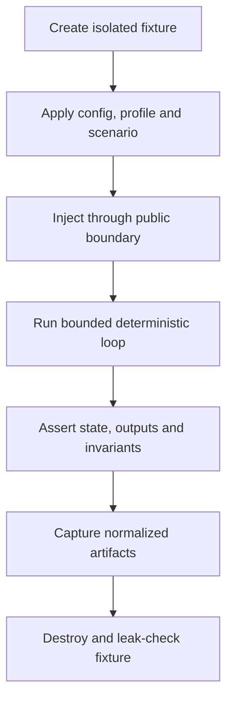

# Firmware Test Strategy

## 1. Mục đích

Tài liệu này định nghĩa chiến lược kiểm thử chính thức cho firmware **Smart Water Flow and Pressure Monitor**.

Mục tiêu:

- phát hiện lỗi sớm tại module và contract boundary;
- kiểm chứng invariant về event, ownership, generation, timeout và publication;
- dùng Linux deterministic backend làm execution oracle cho portable firmware;
- kiểm chứng integration với MAX35103, ZSSC3241, shared I2C và các service;
- chứng minh simulated/service/calibration data không tạo production side effect;
- so sánh behavior portable giữa Linux và STM32 bằng normalized evidence;
- tách functional correctness khỏi hardware timing, electrical và algorithm qualification;
- tạo traceability từ requirement/decision tới test case và artifact;
- quy định gate cho pull request, main, release candidate và hardware qualification.

Tài liệu sở hữu test taxonomy, oracle policy, coverage policy, CI gate, failure handling và acceptance criteria. Scenario schema, emulator transport và fixture catalog chi tiết thuộc `93_linux_simulation_integration.md`.

---

## 2. Phạm vi

### 2.1. Trong phạm vi

- Unit test cho portable module và Linux backend primitive.
- Reusable contract test cho platform ports, repository và public service contract.
- Component/driver test với fake hoặc emulator peer.
- Integration test qua public production boundary.
- Deterministic scenario/system test trên Linux.
- STM32 target smoke, on-target contract test và HIL.
- Startup, reset, timeout, recovery, storage và communication failure.
- Event ordering, duplicate, stale generation, overflow và bounded execution.
- `MeasurementPurpose`, `DataOrigin`, `DataProvenance` và `MeasurementBindingReference`.
- Golden normalized trace và structured-state oracle governance.
- Property, boundary, metamorphic và parser fuzz test phù hợp.
- Static analysis, sanitizer và coverage evidence.
- Test selection, tagging, retry, quarantine và flaky-test policy.
- Artifact, naming, traceability và release gate.

### 2.2. Required first vertical slice

Vertical slice đầu tiên MUST có:

1. Unit test cho event queue, scheduler, repository và Linux virtual clock/action queue.
2. Platform contract suite chạy trên Linux deterministic backend.
3. MAX success, timeout, invalid, duplicate và stale-generation integration tests.
4. ZSSC success, timeout, invalid, duplicate, stale-generation và shared-I2C tests.
5. Production-origin isolation cho simulated, replay, service và calibration sample.
6. Một accepted source event tạo tối đa một final `RuntimeSnapshot` trong cùng turn.
7. Cùng input/config/seed tạo cùng normalized outcome.
8. `RunUntilIdle(max_steps)` kết thúc hoặc trả explicit step-limit/livelock result.
9. Reset invalidates old completion; emulator persistence phải explicit.
10. CI gate gồm build, unit, contract và measurement integration suite.

### 2.3. Ngoài phạm vi

Tài liệu không chốt:

- exact scenario file syntax hoặc external emulator protocol;
- register-level emulator implementation;
- production pass/fail threshold cho accuracy;
- electrical, EMC, environmental, mechanical hoặc regulatory qualification;
- exact STM32 WCET, interrupt latency hoặc power number trước khi đo;
- BLE/4G payload schema và server-side validation;
- factory calibration equipment procedure;
- source tree khác cây canonical trong `01_firmware_architecture.md` section 17.1;
- universal numeric coverage threshold thay requirement-based verification;
- test framework/vendor tool cụ thể khi chưa được build strategy chấp thuận.

Các mục trên chỉ được đưa vào gate sau khi source-of-truth và acceptance limit tương ứng được chấp thuận.

---

## 3. Source-of-truth và tài liệu liên quan

| Nội dung | Source-of-truth |
|---|---|
| Product/system behavior | Nhóm system overview |
| Runtime và dependency invariant | `00_runtime_decision.md`, `01_firmware_architecture.md` |
| Event/scheduler semantics | `02_event_model_and_scheduler.md` |
| FSM transition và mode action | `03_system_fsm_binding.md` |
| Data model, ownership, purpose/origin/provenance | `04_data_model_and_ownership.md` |
| MAX/ZSSC behavior | `11_max35103_integration.md`, `12_pressure_measurement_zssc3241.md` |
| Portable platform contract | `50_platform_abstraction.md` |
| Linux deterministic mechanism | `51_linux_platform_backend.md` |
| Test taxonomy, oracle, gate và governance | Tài liệu này |
| Scenario/emulator binding | `93_linux_simulation_integration.md` |
| STM32 port/equivalence plan | `94_linux_to_stm32_porting_plan.md` |
| Project trace matrix | `95_firmware_traceability.md` |

Quy tắc:

1. Test MUST kiểm chứng contract nguồn; test không được âm thầm định nghĩa product behavior.
2. Khi expected behavior và tài liệu mâu thuẫn, xử lý requirement/decision trước khi cập nhật expected output.
3. Test-only latency, capacity, sample và tolerance MUST được ghi là test profile.
4. Hardware/dataset claim chưa có evidence MUST mang `NEEDS_VERIFICATION`.

---

## 4. Requirement/decision được hiện thực

### 4.1. Firmware test requirements

| ID | Requirement |
|---|---|
| `FW-TEST-REQ-001` | Mỗi accepted firmware requirement MUST có verification method và evidence owner. |
| `FW-TEST-REQ-002` | Test MUST dùng public contract; chỉ white-box unit test mới truy cập private state qua explicit test seam. |
| `FW-TEST-REQ-003` | Automated functional tests MUST mặc định chạy trên Linux deterministic backend. |
| `FW-TEST-REQ-004` | Same input, config, seed và build identity MUST tạo cùng normalized outcome. |
| `FW-TEST-REQ-005` | Test MUST không phụ thuộc host wall clock, pointer, thread scheduling, file enumeration order hoặc uncontrolled randomness. |
| `FW-TEST-REQ-006` | Mọi loop/wait/retry trong harness MUST có finite bound và explicit failure. |
| `FW-TEST-REQ-007` | Platform providers MUST vượt cùng reusable contract suite trên mọi backend áp dụng. |
| `FW-TEST-REQ-008` | Async operation MUST được kiểm thử admission, terminal completion, timeout, duplicate, late và stale generation. |
| `FW-TEST-REQ-009` | Critical event/queue overflow MUST được kiểm thử là visible và deterministic. |
| `FW-TEST-REQ-010` | Monotonic deadline MUST được kiểm thử độc lập wall-clock adjustment. |
| `FW-TEST-REQ-011` | Event same-timestamp ordering MUST có test theo Linux backend contract. |
| `FW-TEST-REQ-012` | Mỗi accepted source event MUST publish tối đa một final snapshot trong cùng event-loop turn. |
| `FW-TEST-REQ-013` | Duplicate/stale input MUST không tạo duplicate volume, storage, config hoặc telemetry side effect. |
| `FW-TEST-REQ-014` | Simulated/replayed/service/calibration result MUST không được chấp nhận như live production evidence. |
| `FW-TEST-REQ-015` | Test MUST assert purpose, origin, provenance và binding reference tại boundary liên quan. |
| `FW-TEST-REQ-016` | MAX integration MUST đi qua portable driver và canonical IRQ/raw-ready boundary. |
| `FW-TEST-REQ-017` | ZSSC integration MUST đi qua `I2cBusManager` và canonical EOC/raw-ready boundary. |
| `FW-TEST-REQ-018` | Shared-I2C arbitration, timeout, recovery và resource generation MUST được kiểm thử. |
| `FW-TEST-REQ-019` | Reset test MUST chứng minh old completion bị invalid và persistence policy là explicit. |
| `FW-TEST-REQ-020` | Config test MUST tách commit, runtime apply, reject và rollback milestone. |
| `FW-TEST-REQ-021` | Storage test MUST bao phủ valid, torn/corrupt, version mismatch, A/B recovery và idempotent retry. |
| `FW-TEST-REQ-022` | Reporting test MUST bao phủ time invalid, duplicate/missed slot, clock step và no burst catch-up. |
| `FW-TEST-REQ-023` | Mode test MUST chứng minh SERVICE quiesces production path và không nhiễm production state. |
| `FW-TEST-REQ-024` | Recovery test MUST phân biệt local retry/reinitialize, degraded mode và system reset escalation. |
| `FW-TEST-REQ-025` | Parser/decoder MUST có malformed, truncated, overlength, unsupported-version và fuzz/property tests. |
| `FW-TEST-REQ-026` | Fixed-capacity resource MUST có zero, one, full, overflow và reuse boundary tests. |
| `FW-TEST-REQ-027` | Golden trace chỉ dùng sau normalization; schema/version MUST explicit. |
| `FW-TEST-REQ-028` | Golden update MUST được review như behavior change; không auto-accept output mới. |
| `FW-TEST-REQ-029` | Realtime Linux test là smoke/integration evidence, không là deterministic golden oracle. |
| `FW-TEST-REQ-030` | STM32 equivalence MUST so normalized semantic evidence, không so host-specific timing noise. |
| `FW-TEST-REQ-031` | Hardware timing/power/accuracy claim MUST có HIL/lab evidence và qualification context. |
| `FW-TEST-REQ-032` | Pull-request gate MUST chạy build, unit, contract và impacted integration tests. |
| `FW-TEST-REQ-033` | Main/nightly gate MUST chạy full deterministic scenarios, analysis và repeated determinism checks. |
| `FW-TEST-REQ-034` | Release gate MUST không có failed mandatory test, requirement gap hoặc unexplained flaky result. |
| `FW-TEST-REQ-035` | Test retry MUST không che lỗi; first-attempt result và mọi attempt MUST được lưu. |
| `FW-TEST-REQ-036` | Quarantined test MUST có owner, issue, expiry và không được tính passed coverage. |
| `FW-TEST-REQ-037` | Artifact MUST giữ build/config/profile/seed/scenario/backend identity. |
| `FW-TEST-REQ-038` | Coverage report dùng tìm gap; percentage không thay requirement traceability. |
| `FW-TEST-REQ-039` | Production build MUST chứng minh test provider/simulated backend không được link. |
| `FW-TEST-REQ-040` | Mỗi test MUST cleanup/recreate fixture để không phụ thuộc execution order. |

### 4.2. Decision binding

| Decision/contract | Test consequence |
|---|---|
| Cooperative event loop | Bounded turn, fairness, queue capacity, no hidden blocking |
| Monotonic scheduling | Virtual-time oracle; wall-clock step không đổi deadline |
| MAX event-timing | INT, SPI readout, supervision timeout, duplicate IRQ |
| ZSSC one-shot | EOC/poll, shared-I2C serialization, timeout, recovery |
| Single writer | Negative test cấm owner khác sửa canonical object |
| Atomic snapshot | Reader chỉ thấy old hoặc new complete snapshot |
| Purpose/origin/provenance | Assert metadata và production-acceptance isolation |
| Config commit/apply split | Separate milestone assertions và reset/retry cases |
| Scheduled telemetry | Stable slot ID, no duplicate, skip-to-next |
| Simulation-first | Linux deterministic suite là pre-hardware functional gate |

---

## 5. Trách nhiệm

### 5.1. Module/test owner

Mỗi module owner:

- viết unit/component tests cho contract mình sở hữu;
- cung cấp test seam có giới hạn khi public observation không đủ;
- duy trì mapping requirement–test;
- phân loại failure là product, test, infrastructure hoặc contract gap;
- không đổi expected output để làm xanh pipeline khi chưa hiểu behavior change.

### 5.2. Integration owner

- quản lý fixture giữa service, driver, platform và emulator;
- giữ scenario deterministic và isolated;
- xác minh canonical events và metadata xuyên boundary;
- duy trì normalized trace schema;
- phối hợp HIL mapping khi STM32 backend sẵn sàng.

### 5.3. Reviewer

- kiểm tra observable behavior và negative/boundary cases;
- tránh assertion phụ thuộc implementation detail không cần thiết;
- review golden update cùng contract/decision;
- xác nhận requirement link và evidence owner.

### 5.4. CI/release owner

- cấu hình gate và lưu artifact;
- không rerun-until-pass làm mất first failure;
- duy trì quarantine expiry;
- tổng hợp unresolved gap;
- không quảng bá Linux-only pass thành hardware qualification.

### 5.5. Ownership matrix

| Artifact | Owner | Consumer |
|---|---|---|
| Unit/component tests | Module owner | PR/main CI |
| Platform contract suite | Platform owner | Linux/STM32 backend |
| Scenario catalog | Simulation integration owner | System/nightly CI |
| Golden trace | Integration owner + reviewer | Regression suite |
| HIL result | STM32/integration owner | Release/qualification |
| Requirement-test matrix | Traceability owner | Review/release |
| Quarantine registry | CI owner | All developers |

---

## 6. Ngoài phạm vi trách nhiệm

Test code và harness MUST NOT:

- định nghĩa lại product algorithm, event name hoặc error policy;
- bypass portable driver trong integration/system test;
- sửa private owner state để tạo trạng thái không thể đạt từ public input;
- sửa `DataOrigin` thành live-device;
- dùng arbitrary delay/sleep để đợi deadline trong deterministic test;
- bỏ qua completion, queue overflow hoặc timeout diagnostic;
- phụ thuộc test execution order;
- dùng một golden file lớn thay toàn bộ focused assertions;
- gộp functional pass với performance/accuracy qualification;
- coi coverage percentage cao là bằng chứng đầy đủ;
- link fake/emulator vào production target.

White-box unit test MAY inspect private invariant qua explicit compile-time test seam, nhưng không được là oracle duy nhất cho public behavior.

---

## 7. Interface và dependency

### 7.1. Test levels

| Level | Mục tiêu | Dependency | Gate |
|---|---|---|---|
| Static/build | Dependency, warning, forbidden include/link | Compiler/analyzer | Mọi PR |
| Unit | Pure logic, state transition, boundary | Controlled fake | Mọi PR |
| Contract | Public API invariant dùng chung | Implementation binding | Mọi PR |
| Component | Driver/repository/service | Fake/emulator nhỏ | Impacted PR |
| Integration | Nhiều production module | Linux deterministic | PR/main |
| System/scenario | Boot-to-observable outcome | Full runtime + emulators | Main/nightly |
| On-target/HIL | Backend/hardware behavior | STM32/instrument | Scheduled/release |
| Qualification | Accuracy, timing, power, robustness | Lab/dataset | Separate release evidence |

Không dùng tỷ lệ cứng giữa các level. Assertion đặt ở level thấp nhất vẫn quan sát được contract thật.

### 7.2. Dependency rule

```text
test case
  -> public module/port contract
  -> production implementation
  -> controlled fake/emulator/platform binding
  -> structured observation and trace
```

System test MUST không include private header. Contract test MAY nhận implementation binding table nhưng không gọi vendor API.

### 7.3. Harness contract

Harness tối thiểu cung cấp:

- build/config/profile identity;
- fixture create/reset/destroy;
- virtual monotonic và wall-clock control;
- injection qua public seam;
- `RunOneTurn` và bounded `RunUntilIdle`;
- structured assertions và normalized trace;
- deterministic seed;
- failure context gồm events, deadlines, generations và counters.

### 7.4. Fixture boundary

Fixture được phép bind peer, set initial persistent image, configure clocks, select test profile/failure plan và inject canonical external input.

Fixture không được:

- sửa snapshot active index;
- cập nhật volume trực tiếp;
- thay owner generation để né stale check;
- post raw-ready nếu canonical boundary yêu cầu IRQ/EOC trước;
- sửa production acceptance sau khi result được tạo.

### 7.5. Test ID

Canonical form:

```text
TC_<AREA>_<BEHAVIOR>_<CONDITION>
```

Ví dụ:

- `TC_EVT_QUEUE_CRITICAL_OVERFLOW`
- `TC_MAX_DUPLICATE_IRQ_NO_DUPLICATE_RESULT`
- `TC_ZSSC_RECOVERY_REJECTS_STALE_COMPLETION`
- `TC_META_SIMULATED_ORIGIN_NOT_PRODUCTION`
- `TC_REPORT_BACKWARD_STEP_NO_DUPLICATE_SLOT`

---

## 8. Data model và đơn vị

### 8.1. Test result

| Field | Ý nghĩa |
|---|---|
| `test_id` | Stable identity |
| `status` | `PASS`, `FAIL`, `SKIP`, `BLOCKED`, `QUARANTINED` |
| `build_id` | Firmware/test binary identity |
| `backend_id` | Linux deterministic/realtime hoặc STM32 |
| `config_id` | Product/build config |
| `profile_id` | Sensor/test profile |
| `scenario_id` | Scenario nếu có |
| `seed` | Controlled property/fuzz seed |
| `failure_code` | Stable category |
| `artifact_refs` | Trace/log/coverage/HIL evidence |

### 8.2. Status semantics

- `PASS`: mọi mandatory assertion đạt.
- `FAIL`: behavior khác contract hoặc harness invariant bị vi phạm.
- `SKIP`: optional capability không áp dụng; không che missing required capability.
- `BLOCKED`: dependency/equipment/contract chưa sẵn sàng; không tính pass.
- `QUARANTINED`: known unstable test có registry entry; không cover requirement.

### 8.3. Time domains

- Product timeout/cadence/freshness dùng virtual/target monotonic time.
- Reporting dùng controlled wall clock và stable slot identity.
- Host duration chỉ giám sát CI, không làm product oracle.
- HIL latency dùng clock/instrument có uncertainty xác định.

### 8.4. Numeric comparison

Mỗi numeric assertion MUST chỉ rõ unit, representation, comparison mode, tolerance source, saturation/overflow expectation và invalid policy. Tolerance không được nới chỉ để pass.

### 8.5. Metadata oracle

Với measurement result, test SHOULD assert:

```text
purpose
origin
provenance/source chain
binding reference: variant/profile/calibration/config
capture/completion time
sequence and generation
validity/freshness/production acceptance
reason
```

Không suy ra origin từ target/scenario name; origin phải là evidence trong result path.

### 8.6. Artifact identity

Mọi artifact cần đủ identity để tái tạo:

```text
test + build + backend + config + profile + scenario + seed
```

Host path, PID và timestamp không tham gia semantic identity.

---

## 9. State machine hoặc sequence

### 9.1. Canonical execution



### 9.2. Failure classification

```text
failure observed
  -> preserve first-attempt artifacts
  -> classify product/test/infrastructure/contract-gap
  -> reproduce with recorded identity and seed
  -> fix source cause
  -> rerun impacted and regression suites
  -> update traceability when behavior changes
```

### 9.3. Async operation sequence

Mỗi async suite MUST bao phủ:

1. Admission reject không tạo in-flight ownership.
2. Admission accept giữ correlation/generation.
3. Exactly one normal terminal completion.
4. Owner timeout khi no-completion fault được inject.
5. Duplicate completion không tạo duplicate side effect.
6. Late completion sau cancel/recovery/reset bị reject.
7. Queue/full/ingress failure visible.
8. Buffer lifetime được bảo toàn.

### 9.4. Reset sequence

```text
start operation at generation N
  -> schedule completion
  -> reset/recreate runtime
  -> boot generation N+1
  -> observe old action
  -> reject as stale
  -> assert no product side effect
  -> assert configured persistent state only
```

### 9.5. Golden update

```text
intentional contract change
  -> update source document/decision
  -> update focused assertions
  -> regenerate normalized candidate
  -> semantic diff review
  -> approve golden version
  -> update traceability
```

Pipeline MUST không tự ghi đè golden.

---

## 10. Timing, timeout và non-blocking behavior

### 10.1. Deterministic virtual time

Automated functional test MUST:

- không sleep để đạt product deadline;
- advance tới earliest eligible platform action hoặc scheduler deadline;
- ingest due platform actions trước application dispatch;
- giữ same-timestamp total order của document 51;
- fail nếu virtual time đi lùi/overflow;
- record step count và final virtual time.

### 10.2. Execution bounds

Mỗi test có:

- host timeout bắt runner hang;
- virtual-time horizon;
- maximum event-loop turns;
- bounded trace/action capacity;
- progress/livelock detector.

Chạm bound là explicit failure hoặc expected assertion, không là idle success.

### 10.3. Deadline boundaries

Mỗi deadline-critical module SHOULD kiểm thử completion:

- ngay trước deadline;
- đúng timestamp deadline theo frozen ordering;
- ngay sau deadline;
- với duplicate timeout;
- sau generation change;
- trong khi wall clock step.

### 10.4. Periodic scheduling

Assert anchor-based no drift, missed-period policy, safe-boundary config apply, generation invalidation và no burst catch-up.

### 10.5. Performance/WCET

Linux host duration chỉ tìm regression thô. Production WCET/IRQ/DMA/STOP 2/watchdog claim cần STM32 measurement với build, board, input/load, instrument, sample count, uncertainty và threshold source.

---

## 11. Configuration

### 11.1. Configuration layers

| Layer | Ví dụ | Rule |
|---|---|---|
| Build target | Linux deterministic/realtime, STM32 | Immutable per binary |
| Product variant | Sensor/board variant | Validated binding |
| Device profile | Sensor/calibration profile | Versioned identity |
| Test profile | Capacities/latencies | Explicit test-only |
| Scenario | Inputs, faults, clocks, reset plan | Versioned/deterministic |
| Seed | Property/fuzz generation | Always recorded |

### 11.2. Seed policy

- Deterministic tests dùng fixed seed.
- Property/fuzz MAY dùng generated seed nhưng MUST record seed và reproducer.
- Rerun MUST dùng seed gốc trước.
- Random generation không được ảnh hưởng product event ordering.

### 11.3. Tags

```text
unit contract component integration system hil
fast slow nightly release
max zssc i2c storage config telemetry power metadata
fault determinism sanitizer fuzz
```

Tag hỗ trợ selection; requirement gate không phụ thuộc tag mơ hồ.

### 11.4. Capability skip

Test chỉ `SKIP` khi capability optional, descriptor nêu requirement và result ghi lý do/config. Missing required capability phải fail init/contract.

### 11.5. Test data governance

Fixture/dataset MUST có stable ID/version, nguồn/quyền sử dụng, unit/range/metadata, phân loại synthetic/simulated/replayed/measured, không chứa secret và có review khi đổi expected behavior.

---

## 12. Error detection và recovery

### 12.1. Mandatory fault matrix

| Fault class | Example | Expected verification |
|---|---|---|
| Admission/resource | busy, full, invalid args | Immediate normalized reject |
| Missing completion | no IRQ/EOC/UART completion | Owner timeout + injection evidence |
| Transport | NACK, CRC/frame, short transfer | Normalized error + bounded recovery |
| Duplicate/late | repeated IRQ/completion | No duplicate terminal side effect |
| Stale generation | cancel/recovery/reset | Rejected and counted |
| Queue pressure | normal/critical overflow | Policy-visible behavior |
| Data invalid | range/status/quality | Reason + acceptance false |
| Storage | torn/corrupt/version mismatch | Valid record/default/degraded policy |
| Time | invalid, step, missed slot | No duplicate/burst |
| Power/reset | wake race, reset in-flight | Recreate and invalidate old work |
| Communication | no ACK, malformed command | Retry/reject without state corruption |

### 12.2. Injection boundary

Fault được inject tại lowest suitable public boundary:

- peer response plan cho device fault;
- platform completion plan cho transport fault;
- public command/record cho protocol fault;
- controlled persistent image cho corruption;
- clock API cho time fault.

Không sửa private state trong integration/system test.

### 12.3. Recovery assertions

Mỗi recovery test assert:

1. trigger/evidence được detect;
2. transition/retry đúng owner;
3. generation/correlation cập nhật;
4. old work invalid;
5. no duplicate side effect;
6. health/diagnostic cập nhật;
7. bounded exit hoặc escalation.

### 12.4. Flaky test

Policy:

- giữ first failure;
- không auto-mark pass sau rerun;
- tạo owner/issue/expiry;
- quarantine chỉ tạm thời;
- requirement vẫn gap nếu không có evidence khác;
- ưu tiên sửa uncontrolled clock, fixture, race, ordering hoặc infrastructure.

### 12.5. Infrastructure failure

Runner/disk/equipment/board failure là infrastructure nhưng release vẫn blocked nếu mandatory evidence chưa tạo. Không chuyển infrastructure failure thành product pass.

---

## 13. Linux simulation mapping

### 13.1. Deterministic oracle

Linux deterministic backend là oracle cho:

- portable application/service/domain behavior;
- event order và virtual deadline;
- driver transaction với fake/emulator;
- metadata/provenance isolation;
- fault/recovery logic;
- snapshot, config, storage và telemetry transition;
- normalized regression trace.

### 13.2. Oracle hierarchy

Ưu tiên:

1. Focused public semantic assertion.
2. Invariant/counter assertion.
3. Structured event subsequence.
4. Normalized golden comparison.
5. Human-readable debug log.

Log text không là stable oracle nếu schema chưa được version hóa.

### 13.3. Golden normalized trace

Trace MUST loại pointer, fd, PID/TID, host timestamps, filesystem order, unstable text và secret.

Trace SHOULD giữ schema version, virtual timestamp, canonical event/action, logical resource, correlation/generation/sequence, normalized status/reason và product side-effect identity.

Golden SHOULD nhỏ và scoped. Full trace MAY lưu làm debug artifact.

### 13.4. Realtime mode

Realtime mode dùng cho interactive demo, external emulator integration, mailbox/serialization smoke và host resource checks. Không dùng để chốt same-timestamp ordering hoặc exact latency.

### 13.5. Sanitizer/dynamic checks

Linux builds SHOULD có strict warnings, address/undefined sanitizer, leak detection khi hỗ trợ và thread sanitizer chỉ cho optional threaded ingress. Sanitizer không thay deterministic functional build.

### 13.6. Property/fuzz

Ưu tiên codec/parser, fixed queue, scheduler insert/cancel, config validation, storage decode, duplicate/stale sequence và numeric saturation. Runner MUST bounded, record seed và tạo minimal reproducer.

---

## 14. STM32 mapping

### 14.1. Equivalence objective

STM32 test chứng minh portable contract với real clock, HAL/LL/DMA/IRQ, physical peripheral, reset/low power và constrained memory. Linux pass là prerequisite, không thay hardware evidence.

### 14.2. Reusable contract suite

Bind trên STM32 cho:

- time monotonicity/resolution;
- SPI/I2C/UART admission/completion;
- GPIO evidence;
- cancel/generation;
- error normalization;
- critical section/atomic publication;
- RTC, power/wake và watchdog.

### 14.3. Normalized equivalence

So Linux–STM32 trên input identity, canonical events, result metadata/status/reason, mode transition, snapshot, side-effect IDs và recovery outcome.

Không yêu cầu giống cycle count, unqualified IRQ latency, vendor raw error, debug-log interleaving hoặc hardware transaction duration.

### 14.4. HIL levels

| Level | Binding | Mục tiêu |
|---|---|---|
| On-target self-test | MCU + software fixture | Backend primitive/contract |
| Peripheral HIL | MCU + real/emulated devices | Driver/bus/IRQ |
| Product-board HIL | Final board + interfaces | Boot, measurement, recovery, low power |
| Lab qualification | Reference equipment/dataset | Accuracy/timing/power |

### 14.5. Hardware evidence

HIL result MUST ghi board/build/config/profile, fixture/instrument version, relevant environment, procedure version, raw artifact, threshold source và automation/operator identity phù hợp.

---

## 15. Test và acceptance criteria

### 15.1. Unit suite

Bao phủ calculation/validation boundaries, FSM transitions, queue capacity, scheduler time/generation, snapshot publication, config transaction, storage codec/selection và metadata construction.

### 15.2. Platform contract suite

Bao phủ invalid args/capability, admission/busy/full, exactly-one completion, correlation/generation, cancel/timeout/late, buffer lifetime, error normalization, clock separation, diagnostics và reset.

### 15.3. MAX integration

- event-timing EVT_MAX_IRQ_ASSERTED → SPI readout → EVT_MAX_RAW_READY;
- active-level/missed-edge evidence;
- invalid response;
- supervision timeout/no completion;
- duplicate IRQ/completion;
- stale completion after reset;
- simulated-origin isolation.

### 15.4. ZSSC/shared-I2C integration

- one-shot start → EVT_PRESSURE_EOC_ASSERTED/status completion → EVT_PRESSURE_RAW_READY;
- bounded polling nếu configured;
- arbitration với F-RAM peer;
- NACK/busy/timeout/recovery;
- duplicate/late/stale completion;
- active-level/missed-edge;
- resource generation;
- simulated-origin isolation.

### 15.5. Metadata/ownership suite

Bao phủ production/service/calibration/diagnostic purpose; live/simulated/replayed origin; provenance chain; variant/profile/calibration/config binding; owner-only mutation; immutable consumer; validity/freshness/acceptance/reason.

### 15.6. System scenarios

Bao phủ clean/degraded boot, measurement/single snapshot, different cadences, SERVICE quiesce, config commit/apply/reset, storage recovery, telemetry slot/retry, wall-clock invalid/jump, queue pressure, in-flight reset và low-power/wake khi backend hỗ trợ.

### 15.7. CI gates

| Gate | Mandatory evidence |
|---|---|
| Local/PR fast | Build, warnings, focused unit, contract, impacted integration |
| Critical PR | All unit/contract + affected system + sanitizer |
| Main | Full deterministic suite + analysis + coverage/traceability |
| Nightly | Repeated determinism, property/fuzz budget, scenarios, realtime smoke |
| STM32 integration | Cross-build + on-target contract/smoke + selected HIL |
| Release candidate | Mandatory suites + traceability + applicable qualification |

### 15.8. Coverage policy

Mandatory:

- 100% accepted in-scope requirements có verification method/status;
- critical data-integrity/reliability invariant có positive và negative evidence;
- public error/recovery branch có planned test;
- uncovered code/branch được review.

Coverage percentage được báo cáo theo module và chống regression. Exact numeric gate là `NEEDS_VERIFICATION`; percentage không thay requirement coverage.

### 15.9. Release acceptance

1. Required test matrix có owner/status.
2. Mandatory deterministic tests pass và first failures được giữ.
3. Không có unresolved deterministic mismatch.
4. Platform contract suite pass trên required backend.
5. Traceability không có unexplained gap.
6. Golden updates có contract review.
7. Không có expired quarantine.
8. Production guard chứng minh không link simulated provider.
9. Applicable STM32/HIL gates pass.
10. Hardware/accuracy claim có qualification evidence.
11. Artifacts đủ reproduce identity/seed.
12. Remaining `NEEDS_VERIFICATION` không bị quảng bá verified.

---

## 16. Traceability

### 16.1. Requirement mapping

| Test requirements | Parent contract |
|---|---|
| `FW-TEST-REQ-001`–`007` | Architecture, traceability, deterministic foundation |
| `FW-TEST-REQ-008`–`013` | Completion, ordering, idempotency, snapshot |
| `FW-TEST-REQ-014`–`018` | Metadata isolation, MAX/ZSSC/shared-I2C |
| `FW-TEST-REQ-019`–`024` | Reset, config, storage, reporting, mode, recovery |
| `FW-TEST-REQ-025`–`031` | Robustness, golden, Linux/STM32 qualification |
| `FW-TEST-REQ-032`–`040` | CI/release, flaky, artifact, coverage, isolation |

### 16.2. Test families

| Prefix | Area |
|---|---|
| `TC_ARCH_*` | Dependency/build isolation |
| `TC_EVT_*` | Event/scheduler |
| `TC_DATA_*` | Ownership/snapshot |
| `TC_META_*` | Purpose/origin/provenance/binding |
| `TC_MAX_*` | MAX35103 |
| `TC_ZSSC_*` | ZSSC3241 |
| `TC_I2C_*` | Shared bus |
| `TC_CFG_*` | Config |
| `TC_STOR_*` | Persistence |
| `TC_REPORT_*` | Reporting |
| `TC_PWR_*` | Reset/power/watchdog |
| `TC_LNX_*` | Linux backend |
| `TC_STM32_*` | STM32/HIL |

### 16.3. Canonical source-tree mapping

Exact tree thuộc `01_firmware_architecture.md` section 17.1.

| Directory | Responsibility |
|---|---|
| `tests/unit` | Module unit tests |
| `tests/contract` | Reusable contract suites |
| `tests/integration` | Multi-module fake/emulator integration |
| `tests/system` | Boot-to-outcome scenarios |

HIL tooling MUST ánh xạ vào build strategy mà không tạo source tree thay thế.

### 16.4. Trace record

```text
requirement/decision
  -> design section
  -> module/public interface
  -> test ID and level
  -> config/scenario
  -> latest evidence/status
  -> open gap or qualification note
```

### 16.5. Downstream ownership

| Nội dung | Owner document |
|---|---|
| Exact scenario schema/catalog | `93_linux_simulation_integration.md` |
| STM32 bring-up/equivalence sequence | `94_linux_to_stm32_porting_plan.md` |
| Project-wide matrix format | `95_firmware_traceability.md` |
| Build/test targets/toolchain | `91_build_and_variant_strategy.md` |
| Module vectors/tolerance | Corresponding module document |

---

## 17. Open issues / NEEDS_VERIFICATION

| ID | Vấn đề | Owner/closure |
|---|---|---|
| `FW-TEST-OQ-001` | Exact C test framework/assertion library | Build strategy |
| `FW-TEST-OQ-002` | Compiler/analyzer/sanitizer matrix | Toolchain/CI |
| `FW-TEST-OQ-003` | Numeric coverage gates per module | Criticality/baseline |
| `FW-TEST-OQ-004` | PR/main/nightly execution budgets | CI measurement |
| `FW-TEST-OQ-005` | Normalized trace schema/version | Documents 51/93 |
| `FW-TEST-OQ-006` | Golden artifact storage/review | Repository/CI |
| `FW-TEST-OQ-007` | Property/fuzz runner/budget | Toolchain |
| `FW-TEST-OQ-008` | Livelock signature/step limit | Linux experiments |
| `FW-TEST-OQ-009` | Test capacities/latencies | Load/scenario |
| `FW-TEST-OQ-010` | External vs in-process emulator scope | Simulation architecture |
| `FW-TEST-OQ-011` | STM32 on-target runner/transport | Board bring-up |
| `FW-TEST-OQ-012` | HIL equipment/fixture ownership | Hardware/test plan |
| `FW-TEST-OQ-013` | Accuracy datasets/tolerances | Algorithm/qualification |
| `FW-TEST-OQ-014` | WCET/IRQ/STOP 2/watchdog limits | STM32 measurement |
| `FW-TEST-OQ-015` | Quarantine lifetime/exception authority | Release policy |
| `FW-TEST-OQ-016` | Endurance campaign duration | Reliability plan |
| `FW-TEST-OQ-017` | Production link guard implementation | Build strategy |
| `FW-TEST-OQ-018` | Coverage/result exchange format | Document 95/CI |

Các open issue không chặn first deterministic measurement slice nếu public contract ổn định, origin isolation đạt, execution bounded, test-only numbers explicit và hardware claims vẫn `NEEDS_VERIFICATION`.

---

## 18. Revision history

| Version | Date | Thay đổi |
|---|---|---|
| 0.1 | 2026-07-15 | Initial test taxonomy, deterministic oracle, contract/integration/system/HIL strategy, fault matrix, golden governance, CI gates and traceability |
