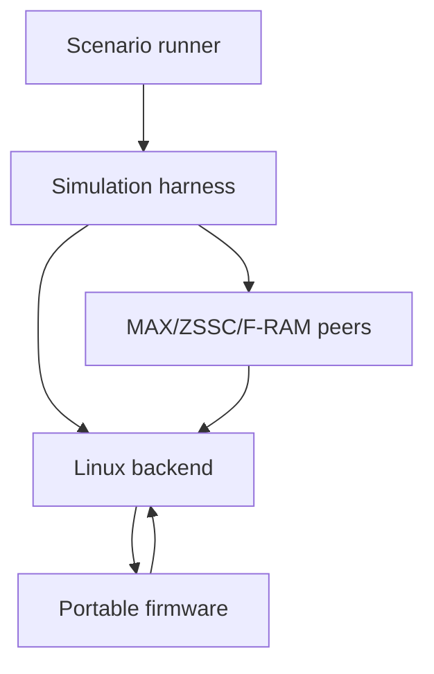
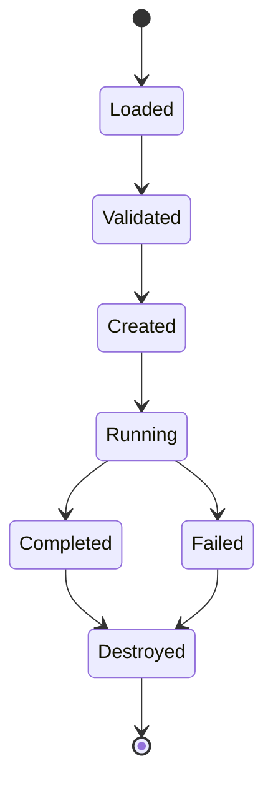
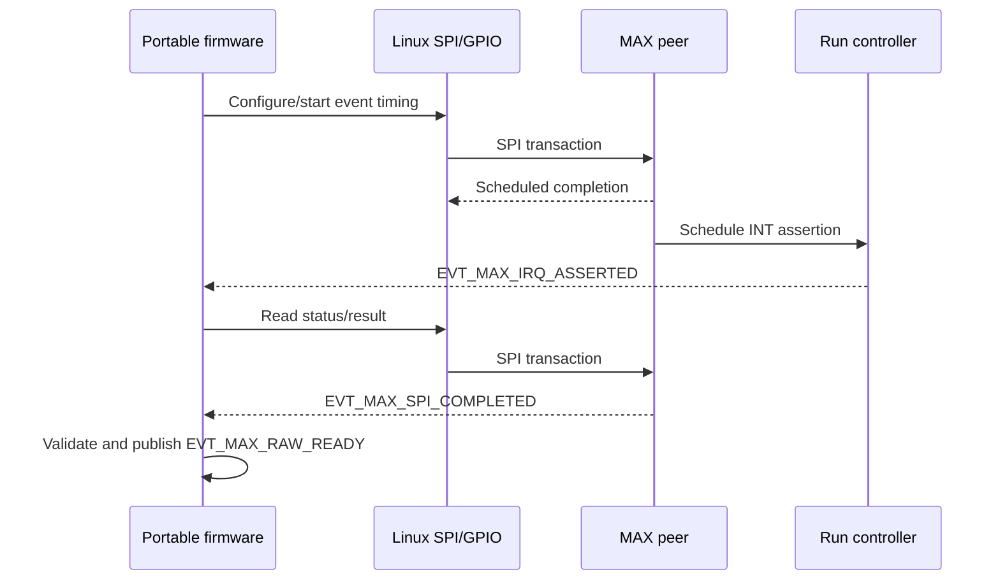
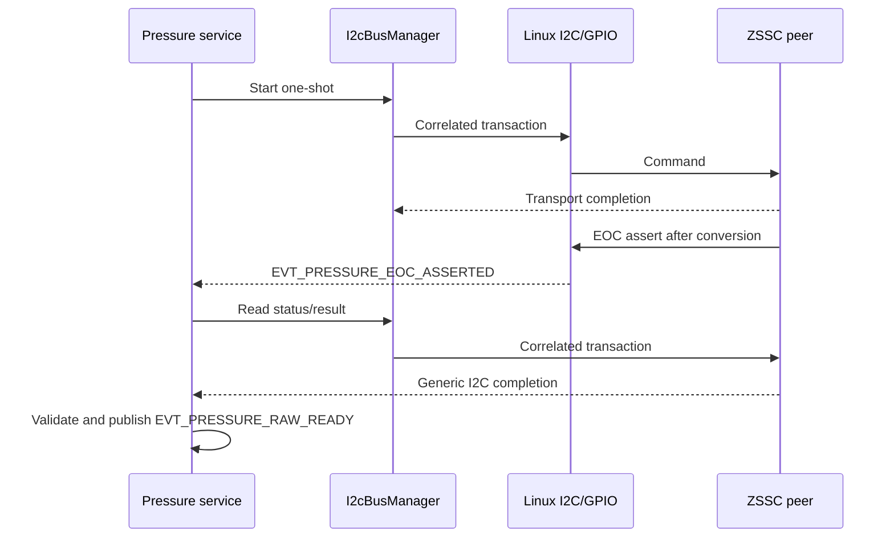
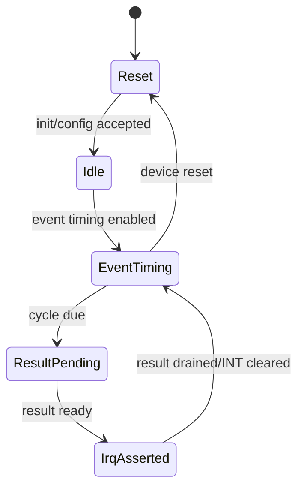
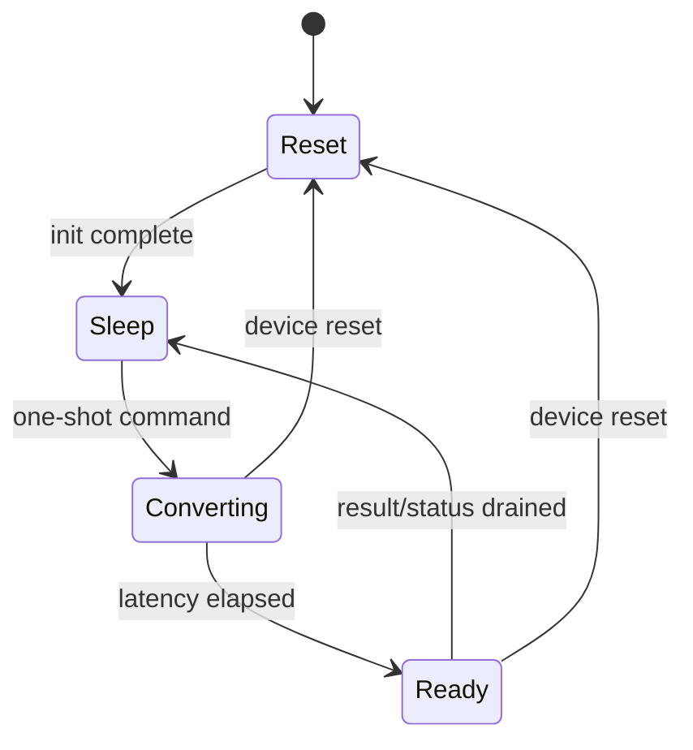

 ---
document_id: FW-IMPL-004
title: Linux Simulation Integration
status: DRAFT
version: 0.1
owner: Firmware
last_updated: 2026-07-15
source_of_truth: true
related_decisions:
  - DEC-ARCH-001
  - DEC-ARCH-002
  - DEC-ARCH-003
  - DEC-ARCH-004
  - DEC-ARCH-005
  - DEC-ARCH-006
  - DEC-ARCH-007
  - DEC-DATA-003
  - DEC-MEAS-001
  - DEC-MEAS-002
  - DEC-MEAS-003
  - DEC-MEAS-004
  - DEC-SCHED-001
  - DEC-SCHED-002
  - DEC-SCHED-003
  - DEC-SCHED-004
related_documents:
  - ../README.md
  - ../00_core/00_runtime_decision.md
  - ../00_core/01_firmware_architecture.md
  - ../00_core/02_event_model_and_scheduler.md
  - ../00_core/03_system_fsm_binding.md
  - ../00_core/04_data_model_and_ownership.md
  - ../10_measurement/10_measurement_cycle.md
  - ../10_measurement/11_max35103_integration.md
  - ../10_measurement/12_pressure_measurement_zssc3241.md
  - ../10_measurement/16_sensor_profile_and_variant.md
  - ../50_platform/50_platform_abstraction.md
  - ../50_platform/51_linux_platform_backend.md
  - 92_firmware_test_strategy.md
  - 94_linux_to_stm32_porting_plan.md
  - 95_firmware_traceability.md
---

# Linux Simulation Integration

## 1. Mục đích

Tài liệu này định nghĩa contract tích hợp chính thức giữa portable firmware và môi trường mô phỏng Linux của dự án **Smart Water Flow and Pressure Monitor**.

Tài liệu chốt:

- topology của deterministic simulation runtime;
- ranh giới giữa firmware, Linux platform backend, harness và device peers;
- scenario manifest/schema version 1;
- virtual monotonic time và wall-clock control;
- MAX35103, ZSSC3241 và F-RAM peer behavior;
- canonical action/input/fault catalog;
- reset, persistence, generation và replay semantics;
- purpose/origin/provenance/binding mapping;
- normalized trace và scenario outcome;
- first measurement-simulator vertical slice;
- integration/system test catalog và acceptance gates;
- mapping sang STM32/HIL mà không thay portable behavior.

Mục tiêu không phải mô phỏng điện/analog hoàn hảo. Mục tiêu là chạy cùng application, service, infrastructure và portable driver code trong một môi trường deterministic, có thể inject success/failure và tạo evidence đủ để phát hiện lỗi contract trước khi lên STM32.

---

## 2. Phạm vi

### 2.1. Trong phạm vi

- In-process deterministic simulator là baseline.
- Linux virtual clock và scheduled-action queue từ document 51.
- Scenario manifest JSON versioned.
- Scenario runner và bounded execution controller.
- In-process stateful peer cho MAX35103.
- In-process stateful peer cho ZSSC3241.
- F-RAM peer tối thiểu để kiểm thử shared-I2C contention/persistence.
- GPIO INT/EOC line model.
- SPI/I2C completion plan.
- Fault injection qua public simulation seam.
- Reset và explicit persistent-state policy.
- Synthetic và replay fixture origin.
- Structured observations, normalized trace và scenario result.
- Integration/system fixtures dưới canonical `tests/integration` và `tests/system`.
- Optional realtime/external adapter boundary.

### 2.2. First vertical slice

Implementation đầu tiên MUST hỗ trợ:

1. Load/validate một scenario version 1.
2. Tạo Linux deterministic backend và portable runtime.
3. Bind một MAX peer, một ZSSC peer và một optional F-RAM peer.
4. Bind MAX INT và ZSSC EOC vào Linux GPIO provider.
5. Set virtual monotonic/wall-clock start.
6. Queue synthetic MAX ToF/temperature raw fixture.
7. Queue synthetic ZSSC pressure/raw/status fixture.
8. Inject normal, invalid, timeout/no-completion, duplicate và stale-generation behavior.
9. Chạy `RunOneTurn` và bounded `RunUntilIdle`.
10. Quan sát canonical events, raw/result metadata và final snapshot.
11. Gắn `DATA_ORIGIN_SIMULATED_DEVICE`, không giả mạo live origin.
12. Xuất normalized trace và structured scenario outcome.

Trong slice này, processing stub MAY tạo deterministic `TemperatureResult`, `FlowResult` và `PressureResult` nếu documents 13–15 chưa được implement, nhưng MUST giữ metadata contract và MUST không claim production accuracy.

### 2.3. Ngoài phạm vi

- Electrical/analog/transducer/acoustic simulation.
- Bit-accurate SPI/I2C waveform simulation.
- Full vendor-register model nếu portable driver không dùng register đó.
- Production algorithm accuracy qualification.
- STM32 HAL/DMA/IRQ implementation.
- Exact external socket protocol.
- Multi-process distributed simulation.
- Uncontrolled realtime timing làm CI oracle.
- GUI/dashboard.
- BLE/4G server/network emulation đầy đủ.
- Source tree khác `01_firmware_architecture.md` section 17.1.

---

## 3. Source-of-truth và tài liệu liên quan

| Nội dung | Source-of-truth |
|---|---|
| Runtime/dependency/source tree | `00_runtime_decision.md`, `01_firmware_architecture.md` |
| Event catalog/order/delivery | `02_event_model_and_scheduler.md` |
| Mode/FSM behavior | `03_system_fsm_binding.md` |
| Data ownership và ResultMetadata | `04_data_model_and_ownership.md` |
| Measurement sequence | `10_measurement_cycle.md` |
| MAX device/driver contract | `11_max35103_integration.md` |
| ZSSC device/driver/shared-I2C contract | `12_pressure_measurement_zssc3241.md` |
| Variant/profile/binding | `16_sensor_profile_and_variant.md` |
| Portable platform ports | `50_platform_abstraction.md` |
| Linux backend/time/action order | `51_linux_platform_backend.md` |
| Test/golden/CI governance | `92_firmware_test_strategy.md` |
| Scenario schema, peer binding và artifacts | Tài liệu này |
| STM32 equivalence/bring-up | `94_linux_to_stm32_porting_plan.md` |

Rules:

1. Scenario runner điều phối; không sở hữu product state.
2. Peer mô phỏng device boundary; không gọi application/service trực tiếp.
3. Linux provider hoàn tất transport/GPIO; không tạo raw result thay driver.
4. Portable driver và service giữ nguyên giữa Linux và STM32.
5. Document 51 sở hữu same-timestamp action order; tài liệu này không định nghĩa lại.
6. Document 92 sở hữu test gate/golden governance; tài liệu này sở hữu scenario content/schema.

---

## 4. Requirement/decision được hiện thực

### 4.1. Simulation integration requirements

| ID | Requirement |
|---|---|
| `FW-SIM-REQ-001` | Automated scenario MUST mặc định dùng in-process Linux deterministic backend. |
| `FW-SIM-REQ-002` | Same scenario, build, config, profiles, seed và fixture versions MUST tạo cùng normalized outcome. |
| `FW-SIM-REQ-003` | Scenario MUST có schema version, stable ID và explicit run bounds. |
| `FW-SIM-REQ-004` | Scenario time/duration MUST dùng integer canonical units; không dùng floating time. |
| `FW-SIM-REQ-005` | Scenario MUST không phụ thuộc host wall clock, sleep, pointer, PID/TID hoặc filesystem enumeration order. |
| `FW-SIM-REQ-006` | Runner MUST validate toàn bộ manifest trước khi boot runtime; invalid scenario MUST fail closed. |
| `FW-SIM-REQ-007` | Runner MUST chỉ inject qua public harness/platform/peer seam. |
| `FW-SIM-REQ-008` | Integration/system scenario MUST không sửa private firmware state hoặc post raw-ready trực tiếp. |
| `FW-SIM-REQ-009` | MAX scenario MUST đi qua MAX peer → SPI/GPIO provider → portable MAX driver. |
| `FW-SIM-REQ-010` | MAX INT MUST tạo `EVT_MAX_IRQ_ASSERTED`; peer/platform MUST không post `EVT_MAX_RAW_READY`. |
| `FW-SIM-REQ-011` | ZSSC scenario MUST đi qua ZSSC peer → shared Linux I2C/GPIO → `I2cBusManager` → portable driver. |
| `FW-SIM-REQ-012` | ZSSC EOC MUST tạo `EVT_PRESSURE_EOC_ASSERTED`; peer/platform MUST không post `EVT_PRESSURE_RAW_READY`. |
| `FW-SIM-REQ-013` | F-RAM peer MUST chia sẻ cùng physical I2C provider với ZSSC khi scenario kiểm thử contention. |
| `FW-SIM-REQ-014` | Peer response MUST giữ operation/correlation/resource generation cần cho completion filtering. |
| `FW-SIM-REQ-015` | No-completion fault MUST để firmware owner timeout; simulator MUST không fabricate terminal result. |
| `FW-SIM-REQ-016` | Duplicate/late/stale action MAY được inject nhưng MUST không tạo duplicate product side effect. |
| `FW-SIM-REQ-017` | Fault plan MUST declarative, bounded và có stable fault ID. |
| `FW-SIM-REQ-018` | Scenario MUST khai báo initial monotonic time, wall-clock state và time quality hoặc explicit defaults theo schema. |
| `FW-SIM-REQ-019` | Wall-clock step MUST không đổi active monotonic deadline. |
| `FW-SIM-REQ-020` | Same-timestamp action MUST dùng exact total order từ document 51. |
| `FW-SIM-REQ-021` | Runner MUST không dùng JSON array order để override action-class/resource/generation ordering. |
| `FW-SIM-REQ-022` | Run operation MUST có max turns, max virtual time và max trace/action bounds. |
| `FW-SIM-REQ-023` | Reset MUST recreate volatile runtime, tăng boot generation và invalidate old scheduled actions/completions. |
| `FW-SIM-REQ-024` | Peer/persistent state qua reset MUST explicit cho từng resource; absent policy MUST dùng schema default, không suy đoán. |
| `FW-SIM-REQ-025` | Synthetic device result MUST mang `DATA_ORIGIN_SIMULATED_DEVICE`. |
| `FW-SIM-REQ-026` | Recorded fixture replay MUST mang `DATA_ORIGIN_REPLAYED_FIXTURE`. |
| `FW-SIM-REQ-027` | Simulator MUST không tạo `DATA_ORIGIN_LIVE_DEVICE`. |
| `FW-SIM-REQ-028` | Purpose MUST do firmware request/context sở hữu; scenario/peer không được sửa purpose sau admission. |
| `FW-SIM-REQ-029` | Simulated/replayed input MUST giữ `DataProvenance` phù hợp và không tự chuyển thành production-accepted evidence. |
| `FW-SIM-REQ-030` | Active `MeasurementBindingReference` MUST đến từ selected variant/profile/config binding; fixture không được thay binding ngầm. |
| `FW-SIM-REQ-031` | Processing stub MUST ở trên raw-ready boundary và giữ full metadata. |
| `FW-SIM-REQ-032` | Processing stub output MUST được đánh dấu not production-qualified và không tạo production volume/leak/telemetry side effect. |
| `FW-SIM-REQ-033` | Normalized trace MUST versioned, bounded và không chứa host-unstable identity. |
| `FW-SIM-REQ-034` | Scenario outcome MUST phân biệt pass, assertion fail, validation fail, step limit, livelock và infrastructure/internal error. |
| `FW-SIM-REQ-035` | Assertion MUST quan sát public result/snapshot/event/diagnostic; debug log không là oracle duy nhất. |
| `FW-SIM-REQ-036` | External/realtime adapter nếu có MUST map về cùng peer plan/action model. |
| `FW-SIM-REQ-037` | External ingress MUST qua bounded mailbox và được serialize vào owner loop. |
| `FW-SIM-REQ-038` | Production build MUST fail nếu simulator peer, scenario runner hoặc simulated provider được link. |
| `FW-SIM-REQ-039` | Scenario/fixture reference MUST dùng stable ID + version/hash; relative path chỉ là locator, không là identity. |
| `FW-SIM-REQ-040` | Scenario MUST tạo isolated fixture và cleanup toàn bộ volatile resource sau run. |
| `FW-SIM-REQ-041` | Unknown schema field/action/fault MUST reject trong strict CI mode. |
| `FW-SIM-REQ-042` | Test-only latency/capacity/value MUST không được quảng bá thành production-qualified default. |

### 4.2. Decision binding

| Decision/contract | Simulation consequence |
|---|---|
| Cooperative runtime | Single owner loop; runner chỉ step/advance |
| Event-timing MAX | Peer schedules INT/device state; MCU scheduler chỉ supervision |
| ZSSC one-shot | Command, conversion, EOC/poll và result-read state |
| Shared physical I2C | ZSSC/F-RAM peers dưới một Linux provider |
| Atomic snapshot | Scenario quan sát immutable published snapshot |
| SERVICE isolation | Scenario purpose không tạo production side effect |
| Binding/profile model | Explicit stable binding refs |
| Scheduled telemetry | Controlled wall clock + stable slot |
| Simulation-first | Deterministic scenario là functional pre-hardware oracle |

---

## 5. Trách nhiệm

### 5.1. ScenarioRunner

`ScenarioRunner`:

- parse và validate manifest;
- resolve fixture/profile/config references;
- create isolated backend/runtime/peer graph;
- install peer plans và faults;
- schedule declared scenario actions;
- drive virtual time/run controller;
- evaluate public assertions;
- capture normalized artifacts;
- cleanup fixture.

`ScenarioRunner` không:

- chạy product algorithm;
- post driver-owned raw-ready;
- sửa owner state;
- quyết định production acceptance;
- tự reschedule firmware jobs.

### 5.2. LinuxSimulationHarness

Harness:

- bind platform ports và peers;
- expose controlled clock/reset/run hooks;
- expose read-only observation adapters;
- assign stable resource/action IDs;
- enforce capacity/bounds;
- collect trace/diagnostics;
- return typed run result.

### 5.3. Device peer

Mỗi peer:

- sở hữu device-local simulated state;
- accept transaction từ Linux provider;
- validate device protocol sequence;
- schedule device-side effects/completions;
- expose GPIO line state;
- implement declared reset/persistence policy;
- produce explicit peer diagnostics.

Peer không biết `MeasurementManager`, `DataRepository` hoặc product mode.

### 5.4. Portable firmware

Portable firmware:

- khởi động và điều phối như production;
- phát device transactions qua platform ports;
- xử lý canonical events;
- tạo raw/result/snapshot;
- quyết định timeout/recovery/acceptance;
- lọc duplicate/stale completion.

### 5.5. Observer/assertion layer

Observer:

- subscribe/copy public immutable evidence;
- không làm thay đổi scheduling/state;
- dùng `LINUX_ACTION_TEST_OBSERVER` khi cần scheduled observation;
- không tham gia product event priority;
- normalize output trước golden comparison.

### 5.6. Ownership matrix

| Object | Owner |
|---|---|
| Scenario manifest/result | Scenario runner |
| Virtual clocks/action queue | Linux backend |
| Peer plan/device state | Corresponding peer |
| App events/scheduler jobs | Portable runtime |
| Measurement result/snapshot | Canonical firmware owner |
| Trace buffer | Harness trace sink |
| Persistent fixture image | Scenario fixture owner |
| Golden/reference artifact | Test governance owner |

---

## 6. Ngoài phạm vi trách nhiệm

Simulation integration MUST NOT:

- thay portable driver bằng direct result injection trong integration/system tests;
- duplicate product scheduler trong harness;
- gọi ISR/callback product logic từ scenario parser;
- sửa result metadata sau publication;
- dùng `MEAS_PURPOSE_PRODUCTION` + simulated/replayed origin để tạo accepted production side effect;
- tự đoán missing profile/config/calibration;
- dùng host time/sleep làm deterministic deadline;
- inject pointer/raw address vào scenario/trace;
- dùng shared mutable fixture giữa tests;
- bỏ qua unknown action/fault trong strict mode;
- coi peer latency là STM32 latency;
- coi synthetic accuracy là device qualification.

Unit test của downstream consumer MAY post raw-ready trực tiếp nếu chính raw-ready là input contract của unit đó; exception này không áp dụng cho integration/system scenario.

---

## 7. Interface và dependency

### 7.1. Composition



Scenario runner không link vào production STM32 target.

### 7.2. Canonical source-tree mapping

Exact tree thuộc `01_firmware_architecture.md` section 17.1.

| Canonical directory | Simulation content |
|---|---|
| `src/platform/linux` | Clock, run controller, Linux SPI/I2C/GPIO providers, peer port interfaces |
| `src/drivers` | Same portable MAX/ZSSC/F-RAM drivers |
| `src/infrastructure/event` | Event loop/queue |
| `src/infrastructure/time` | Monotonic scheduler/time service |
| `src/infrastructure/bus` | `I2cBusManager` |
| `tests/integration` | Reusable peer fixtures, device/driver/service integration scenarios |
| `tests/system` | Full boot-to-outcome scenario runner, manifests và goldens |

Allowed nested organization dưới `tests/integration`/`tests/system` không tạo root mới. Không tạo một simulator root riêng hoặc simulator-owned copy của portable core.

### 7.3. Logical top-level API

```c
typedef struct LinuxSimulationContext LinuxSimulationContext;

typedef enum {
    SIM_RUN_IDLE,
    SIM_RUN_ASSERTION_FAILED,
    SIM_RUN_VALIDATION_FAILED,
    SIM_RUN_STEP_LIMIT,
    SIM_RUN_LIVELOCK,
    SIM_RUN_INTERNAL_ERROR
} SimulationRunStatus;

SimulationRunStatus LinuxSimulation_Create(
    const SimulationManifest *manifest,
    LinuxSimulationContext *context);

SimulationRunStatus LinuxSimulation_Run(
    LinuxSimulationContext *context,
    SimulationOutcome *outcome);

void LinuxSimulation_Destroy(LinuxSimulationContext *context);
```

Đây là logical contract; exact filename/framework thuộc implementation/build strategy.

### 7.4. Peer interface

```c
typedef struct {
    PeerStatus (*reset)(void *context, PeerResetKind kind);
    PeerStatus (*accept_spi)(void *context, const SimSpiRequest *request);
    PeerStatus (*accept_i2c)(void *context, const SimI2cRequest *request);
    PeerStatus (*apply_action)(void *context, const SimPeerAction *action);
    PeerStatus (*snapshot)(const void *context, PeerPublicSnapshot *snapshot);
} SimulationPeerOps;
```

Một peer chỉ implement transport liên quan; unsupported operation reject deterministically.

### 7.5. Observation interface

Observer MAY đọc:

- scenario outcome;
- normalized trace;
- diagnostic counters;
- immutable result history;
- final/selected snapshot copy;
- public mode/readiness;
- peer public snapshot;
- persistent fixture image/hash.

Observer không trả mutable pointer vào owner state.

### 7.6. Reference resolver

Manifest reference:

```json
{
  "id": "pressure-profile-dn50-a",
  "version": 3,
  "sha256": "optional-content-hash",
  "locator": "fixtures/profiles/pressure-profile-dn50-a.json"
}
```

`id + version` là minimum identity. Hash SHOULD được dùng cho golden/replay-critical fixture. Locator không tham gia semantic identity.

---

## 8. Data model và đơn vị

### 8.1. Scenario manifest version 1

Canonical serialization là strict UTF-8 JSON.

Top-level fields:

| Field | Required | Meaning |
|---|---|---|
| `schema_version` | Yes | Integer, baseline = 1 |
| `scenario_id` | Yes | Stable lower-kebab identifier |
| `scenario_version` | Yes | Positive integer |
| `description` | Yes | Human-readable, not oracle |
| `seed` | Yes | Unsigned integer |
| `backend` | Yes | `linux-deterministic` baseline |
| `references` | Yes | Build/config/profile/calibration/fixture refs |
| `initial_time` | Yes | Monotonic/wall/time-quality |
| `resources` | Yes | Peer/GPIO/bus bindings |
| `reset_policy` | Yes | Volatile/persistent behavior |
| `actions` | Yes | Ordered declarations with stable IDs |
| `run_limits` | Yes | Finite execution bounds |
| `assertions` | Yes | Public expected evidence |
| `artifacts` | Yes | Trace/outcome capture policy |
| `tags` | No | Selection only |

Strict mode rejects unknown top-level or nested fields.

### 8.2. Canonical units

| Quantity | Unit/representation |
|---|---|
| Monotonic/action time | Unsigned integer microseconds |
| Wall time | Signed integer Unix seconds |
| Duration/latency | Unsigned integer microseconds |
| Sequence/generation | Unsigned integer |
| ToF | Integer picoseconds or canonical raw register words per fixture type |
| Temperature | Integer canonical raw code or millidegrees Celsius when result-level stub |
| Pressure | Integer raw bridge/ZSSC code or pascals when result-level stub |
| Flow | Integer canonical fixed-point/result unit from data model |
| Byte/register data | Hex string with explicit length or integer array 0–255 |

No implicit unit conversion. Field name SHOULD carry unit suffix.

### 8.3. Initial time

```json
{
  "initial_time": {
    "monotonic_us": 0,
    "wall_valid": true,
    "wall_time_s": 1784066400,
    "time_quality": "synchronized"
  }
}
```

Schema value `time_quality` được runner map sang canonical `TimeQuality`; exact C enum spelling thuộc common data header. If `wall_valid=false`, `wall_time_s` MAY be zero but reporting scenario MUST assert no scheduled record until time becomes valid.

### 8.4. Resource declaration

```json
{
  "resources": {
    "spi_buses": [{"id": 1}],
    "i2c_buses": [{"id": 1}],
    "gpio_lines": [
      {"id": 10, "name": "max-int", "initial_level": 0},
      {"id": 11, "name": "zssc-eoc", "initial_level": 0}
    ],
    "peers": [
      {"id": 100, "type": "max35103", "spi_bus_id": 1, "irq_gpio_id": 10},
      {"id": 101, "type": "zssc3241", "i2c_bus_id": 1, "address_7bit": 40, "eoc_gpio_id": 11},
      {"id": 102, "type": "fm24cl04b", "i2c_bus_id": 1, "address_7bit": 80}
    ]
  }
}
```

IDs MUST be unique within type domain. I2C duplicate address on same bus rejects manifest.

### 8.5. Action model

```json
{
  "id": "a-001",
  "at_us": 100000,
  "type": "max.queue-cycle",
  "resource_id": 100,
  "source_sequence": 1,
  "payload": {}
}
```

Required action fields:

- stable `id`;
- exactly one of absolute `at_us` or phase-relative `after_us` under explicit parent;
- `type`;
- logical `resource_id` when applicable;
- monotonic `source_sequence` per resource when scheduled peer evidence is created;
- versioned payload appropriate to action.

Manifest order is declaration order only. Runtime order follows document 51 total-order key.

### 8.6. Fault descriptor

```json
{
  "fault_id": "fault-max-no-completion-1",
  "target_resource_id": 100,
  "trigger": {
    "match_operation": "spi-read-result",
    "occurrence": 1
  },
  "effect": {
    "type": "no-completion"
  },
  "max_applications": 1
}
```

Fault MUST have finite `max_applications` unless scenario duration itself is the explicit bound and schema permits persistent fault.

### 8.7. Result metadata mapping

| Scenario input | ResultMetadata |
|---|---|
| Synthetic emulator peer | `DATA_ORIGIN_SIMULATED_DEVICE` |
| Recorded/replayed fixture | `DATA_ORIGIN_REPLAYED_FIXTURE` |
| Direct restored persistent value | Origin according to stored record; `PROVENANCE_RESTORED` |
| Processing estimate | Preserved origin; `PROVENANCE_ESTIMATED` |
| Default fallback | Origin/context preserved where applicable; `PROVENANCE_DEFAULTED` |

Purpose is captured from firmware measurement request:

- `MEAS_PURPOSE_BOOT_SELF_CHECK`
- `MEAS_PURPOSE_PRODUCTION`
- `MEAS_PURPOSE_SERVICE`
- `MEAS_PURPOSE_CALIBRATION`
- `MEAS_PURPOSE_DIAGNOSTIC`
- `MEAS_PURPOSE_RECOVERY_VERIFY`

Scenario cannot rewrite purpose after request admission.

### 8.8. Binding reference

Manifest references select variant/profile/calibration/config inputs. Firmware builds active binding and result carries:

```text
variant_id
manifest_version
binding_id
binding_version
binding_generation
```

Peer MAY include device-local profile identity in diagnostic context, but MUST not construct canonical `MeasurementBindingReference`.

### 8.9. Scenario outcome

```json
{
  "scenario_id": "measurement-normal-001",
  "scenario_version": 1,
  "status": "PASS",
  "final_monotonic_us": 250000,
  "turn_count": 42,
  "assertions_passed": 18,
  "assertions_failed": 0,
  "trace_schema_version": 1,
  "artifact_refs": []
}
```

Outcome also records build/backend/config/profile/seed identities required by document 92.

---

## 9. State machine hoặc sequence

### 9.1. Simulator lifecycle



Validation failure does not create runtime/peer state.

### 9.2. Boot/run sequence

```text
parse manifest
  -> validate schema/references/resources/bounds
  -> create Linux backend
  -> register buses/GPIO/peers
  -> install persistent images and fault plans
  -> initialize portable firmware
  -> schedule scenario actions
  -> run bounded turns/virtual time
  -> evaluate assertions
  -> emit normalized outcome/artifacts
  -> destroy fixture
```

### 9.3. MAX normal sequence



Peer never posts `EVT_MAX_RAW_READY`.

### 9.4. ZSSC normal sequence



### 9.5. Shared-I2C contention

```text
ZSSC conversion in progress
  -> F-RAM request enters I2cBusManager
  -> current physical transaction completes
  -> bus manager selects eligible queued client
  -> each completion carries correlation + bus generation
  -> recovery increments generation
  -> old completion is rejected
```

Scenario MUST not call Linux I2C provider directly as ZSSC/F-RAM client.

### 9.6. No-completion/timeout

```text
operation admitted
  -> fault plan suppresses transport/GPIO completion
  -> explicit injected-fault diagnostic remains visible
  -> firmware monotonic supervision deadline becomes due
  -> firmware emits timeout/recovery behavior
  -> scenario asserts no fabricated success
```

### 9.7. Reset/stale action

```text
schedule action at boot generation N
  -> reset before due time
  -> recreate runtime at generation N+1
  -> cancel or observe old action
  -> reject old generation
  -> no snapshot/product side effect
```

### 9.8. Replay

Replay fixture supplies recorded raw/device-boundary evidence through the same peer/transport path. Replay timing is controlled by scenario virtual time; original capture timestamps MAY be stored as fixture metadata but MUST not replace scenario scheduling.

---

## 10. Timing, timeout và non-blocking behavior

### 10.1. Time authority

- `LinuxVirtualClock` is authoritative in deterministic mode.
- Scenario action `at_us` uses virtual monotonic boot-domain time.
- Firmware timeout/cadence remains owned by `MonotonicScheduler`.
- Wall-clock actions only affect `TimeService`/reporting behavior.
- Peer latency is a test fixture parameter.

### 10.2. Exact same-timestamp order

All scheduled platform actions use:

```text
due_us
action_class
resource_id
resource_generation
source_sequence
insertion_sequence
```

ascending as frozen in document 51.

Scenario action declaration order only contributes through assigned insertion sequence after higher-order keys. Assertions MUST not assume array order overrides this contract.

### 10.3. Action-to-class mapping

| Scenario/effect | Linux action class |
|---|---|
| Runtime reset/fatal injected platform fault | `LINUX_ACTION_CRITICAL_RESET_OR_FAULT` |
| MAX INT/ZSSC EOC/wake line | `LINUX_ACTION_GPIO_OR_WAKE_EVIDENCE` |
| SPI/I2C/UART terminal completion | `LINUX_ACTION_TRANSPORT_COMPLETION` |
| RTC/timer evidence | `LINUX_ACTION_RTC_OR_TIMER_EVIDENCE` |
| UART RX availability | `LINUX_ACTION_UART_RX_AVAILABLE` |
| Scheduled observer checkpoint | `LINUX_ACTION_TEST_OBSERVER` |

Scenario cannot select a lower numeric class to change product behavior; class is derived from effect type.

### 10.4. Run limits

```json
{
  "run_limits": {
    "max_turns": 10000,
    "max_virtual_time_us": 60000000,
    "max_actions": 10000,
    "max_trace_records": 50000,
    "max_same_time_progress_repeats": 100
  }
}
```

Numbers above are illustrative test profile values and `NEEDS_VERIFICATION`. Schema requires finite values; product defaults are not inferred.

### 10.5. Idle and completion

Scenario completes when:

- all required assertions are decided;
- no required future scenario action remains;
- firmware/platform are idle according to run-controller contract;
- or an explicit `stop_when` condition is satisfied.

Future periodic firmware jobs do not necessarily prevent scenario completion; stop policy MUST state intended horizon/checkpoint.

### 10.6. Non-blocking

Peer/provider/action handler MUST perform bounded bookkeeping only. No handler may sleep, wait for another thread/process or recursively run firmware until idle.

### 10.7. Realtime mode

Realtime mode maps virtual intent to host monotonic scheduling but:

- is not golden oracle;
- accepts host scheduling variation outside contract;
- serializes external ingress;
- keeps scenario/action/resource IDs;
- must retain finite host timeout.

---

## 11. Configuration

### 11.1. Reference set

`references` MUST identify:

- firmware build;
- product variant;
- product config;
- sensor/device profiles;
- calibration image/version;
- initial persistent image;
- peer fixture catalog;
- optional replay dataset.

No hidden current/latest resolution in CI. `latest` is forbidden in strict reproducible scenarios.

### 11.2. Backend config

Required:

- mode = `linux-deterministic` for normative tests;
- static capacities;
- strict unknown-field/action behavior;
- trace schema/version;
- reset-to-time policy;
- enabled platform capabilities.

### 11.3. Peer config

MAX peer config MAY include:

- supported command/register subset;
- power/reset initial state;
- event-timing cadence;
- INT polarity/level behavior;
- transaction latency profile;
- queued measurement cycles.

ZSSC peer config MAY include:

- 7-bit address;
- EOC enabled/polarity;
- one-shot conversion latency;
- status/raw frame format subset;
- queued conversions.

F-RAM peer config MAY include:

- address mapping;
- byte image;
- write behavior/latency;
- reset persistence;
- corruption/torn-write plan.

### 11.4. Reset policy

```json
{
  "reset_policy": {
    "virtual_monotonic": "continue",
    "wall_clock": "preserve",
    "max35103_state": "device-reset",
    "zssc3241_state": "device-reset",
    "fram_state": "preserve",
    "pending_actions": "invalidate-old-generation"
  }
}
```

Baseline uses monotonic continuation across software reset within same simulation time domain unless scenario tests power-cycle semantics. Exact firmware boot monotonic reconstruction on STM32 remains hardware verification.

### 11.5. Strict validation

Reject:

- duplicate scenario/action/fault/resource IDs;
- unsupported schema version;
- unknown action/fault in strict mode;
- negative unsigned time;
- action beyond run horizon unless explicitly allowed;
- invalid I2C address/bus binding;
- missing GPIO for required INT/EOC mode;
- duplicate peer address on same bus;
- circular relative action dependency;
- unbounded repeat;
- missing profile/config/calibration reference;
- production/live origin requested from simulator.

### 11.6. Scenario actions

Canonical version-1 categories:

| Category | Examples |
|---|---|
| Runtime | `runtime.boot`, `runtime.reset`, `runtime.stop` |
| Time | `time.set-wall-valid`, `time.step-wall` |
| MAX | `max.queue-cycle`, `max.set-int-level`, `max.device-reset` |
| ZSSC | `zssc.queue-conversion`, `zssc.set-eoc-level`, `zssc.device-reset` |
| F-RAM | `fram.load-image`, `fram.corrupt-range` |
| Fault | `fault.install`, `fault.remove` |
| External | `external.inject-command` when corresponding interface exists |
| Observer | `observer.checkpoint` |

Direct `firmware.post-raw-ready` and `firmware.write-private-state` actions do not exist.

---

## 12. Error detection và recovery

### 12.1. Validation errors

Validation error outcome includes:

- stable error code;
- JSON field/action/resource locator;
- scenario ID/version when readable;
- no partially booted runtime;
- no golden update.

### 12.2. Peer/protocol errors

| Error | Detection | Mapping |
|---|---|---|
| Unexpected SPI opcode/order | MAX peer | Explicit peer/transport failure |
| Unsupported MAX register | MAX peer | Deterministic reject |
| ZSSC read before ready | ZSSC peer | Busy/status response per fixture |
| Unknown I2C address | Linux I2C provider | Normalized transport failure |
| Duplicate address | Manifest validation | Validation fail |
| Invalid GPIO transition | GPIO/peer invariant | Strict simulator error |
| Peer plan exhausted | Peer | Explicit unexpected-operation error |

Peer plan exhaustion MUST not silently synthesize a normal result.

### 12.3. Fault effects

Canonical effects:

- `admission-reject`;
- `transport-fail`;
- `no-completion`;
- `delay-completion`;
- `duplicate-completion`;
- `truncate-response`;
- `corrupt-response`;
- `hold-gpio-level`;
- `suppress-gpio-edge`;
- `device-reset`;
- `bus-recovery`;
- `queue-capacity-pressure`.

Each effect maps to existing public/backend behavior. Fault catalog MUST not introduce a fake product event.

### 12.4. Recovery ownership

- Device peer models device state consequence.
- Linux provider models transport/resource generation.
- Portable driver handles protocol/transaction state.
- Service/RecoveryCoordinator decides retry, reinitialize, degraded mode or reset.
- Runner observes and asserts; it does not choose recovery on behalf of firmware.

### 12.5. Assertion failure

On failure, runner SHOULD capture:

- failing assertion ID;
- expected vs normalized actual;
- last bounded event/action window;
- current virtual/wall time;
- owner/resource/boot generations;
- in-flight operations;
- diagnostics/capacity high-water marks;
- build/config/profile/scenario/seed identity.

### 12.6. Internal simulator invariant

Examples:

- clock moved backward;
- duplicate action ID;
- completion references nonexistent operation;
- resource generation mismatch produced by harness itself;
- observer changed state;
- unbounded recursion/reentrant run.

These produce `SIM_RUN_INTERNAL_ERROR`, not firmware pass/fail.

### 12.7. Cleanup

Destroy MUST:

- invalidate pending actions;
- release backend-owned resources;
- close external adapter if any;
- clear peer/test buffers;
- preserve requested artifacts only;
- not leak fixture state into next scenario.

---

## 13. Linux simulation mapping

### 13.1. MAX peer state

Logical states:



Peer models only externally observable subset required by driver tests. Unsupported commands reject; they are not silently ignored.

### 13.2. MAX cycle fixture

```json
{
  "id": "max-cycle-001",
  "kind": "synthetic",
  "tof_up_ps": 125000000,
  "tof_down_ps": 124900000,
  "temperature_raw": [1200, 1210],
  "status_flags": 0,
  "conversion_latency_us": 2000,
  "irq_behavior": "assert-until-drained"
}
```

Exact raw fields must match document 11/implemented driver interface. Values above are illustrative fixtures, not qualified device data.

### 13.3. MAX required behaviors

- event-timing cycle;
- INT asserted until drained;
- INT already active when armed;
- missing/duplicate INT;
- invalid/sentinel/partial status;
- SPI admission/transport/no-completion;
- truncated RX;
- late completion after reset;
- unexpected device reset;
- HALT/init delay;
- multiple queued cycles with stable sequence.

### 13.4. ZSSC peer state



EOC-enabled peer asserts line at `Ready`. Polling mode exposes busy/ready status without EOC.

### 13.5. ZSSC conversion fixture

```json
{
  "id": "zssc-conversion-001",
  "kind": "synthetic",
  "pressure_raw": 524288,
  "temperature_raw": 16384,
  "status": "valid",
  "conversion_latency_us": 1500,
  "eoc_behavior": "assert-until-read"
}
```

Exact encoding and valid ranges follow document 12/confirmed datasheet binding. Values are test-only.

### 13.6. ZSSC/F-RAM contention

The Linux physical I2C provider hosts both peers. Scenario injects F-RAM work through `StorageService` or a public integration fixture at `I2cBusManager` client boundary, not direct provider calls from device driver.

Required cases:

- F-RAM request before ZSSC one-shot;
- F-RAM request during conversion but no physical transaction;
- F-RAM transaction when EOC arrives;
- bus error/recovery with both clients queued;
- old completion from pre-recovery generation;
- bounded fairness/no starvation.

### 13.7. Processing stub

Before complete processing services exist:

```text
EVT_MAX_RAW_READY / EVT_PRESSURE_RAW_READY
  -> deterministic test processing adapter
  -> canonical result type
  -> ResultMetadata preserved
  -> snapshot publication path unchanged
```

Stub:

- MUST be test/simulation-only;
- MUST not live inside platform provider;
- MUST not be linked in production;
- MUST preserve purpose/origin/provenance/binding;
- MUST mark acceptance/reason so production side effects are rejected;
- MUST be replaced by real services without changing driver/platform contracts.

### 13.8. Replay adapter

Replay input is normalized into peer fixture operations:

- recorded SPI/I2C response sequence;
- recorded device-boundary raw cycle;
- optional original capture metadata;
- virtual scheduling controlled by scenario.

Replay bypassing portable driver is allowed only for downstream unit tests, not integration/system scenario.

### 13.9. Optional external emulator

External adapter MAY be added later:

```text
external process/socket
  -> bounded Linux ingress mailbox
  -> message validation
  -> peer action/response plan
  -> Linux scheduled-action queue
```

Requirements:

- no socket/fd escapes platform/test adapter;
- disconnect is explicit peer/transport error;
- message has stable IDs/generation;
- deterministic CI uses recorded/replayed ingress or controlled lockstep;
- external timing does not redefine device semantics.

---

## 14. STM32 mapping

### 14.1. Equivalence boundary

Must remain equivalent:

- public platform/driver/service interfaces;
- canonical event IDs;
- correlation/generation semantics;
- one terminal completion contract;
- duplicate/stale filtering;
- purpose/origin/provenance/binding semantics;
- snapshot publication;
- recovery ownership.

May differ:

- actual latency;
- HAL/DMA/IRQ mechanism;
- vendor raw status;
- memory address/alignment;
- low-power timing;
- electrical behavior.

### 14.2. Scenario-to-HIL mapping

| Linux scenario element | STM32/HIL analogue |
|---|---|
| Virtual clock advance | Target timer/RTC + controlled wait/instrument |
| MAX peer | Real MAX or peripheral emulator |
| ZSSC peer | Real ZSSC/bridge or peripheral emulator |
| GPIO action | Physical INT/EOC signal |
| Transport fault | Bus fault fixture/instrument where safe |
| Runtime reset | MCU reset/power-cycle |
| Normalized observer | Target diagnostic/test transport |
| Persistent image | Programmed F-RAM fixture |

Not every synthetic fault must be recreated electrically; equivalent observable contract evidence is sufficient when documented.

### 14.3. Portable scenario subset

Scenario schema MAY define a future `backend_capabilities` filter. HIL runner can execute only actions with safe hardware mapping. Unsupported mandatory action must report `BLOCKED/UNSUPPORTED`, not silently skip.

### 14.4. Origin mapping

Linux peer always simulated/replayed. STM32 with real attached device may produce `DATA_ORIGIN_LIVE_DEVICE` only through production binding. Peripheral emulator connected to STM32 must remain `DATA_ORIGIN_SIMULATED_DEVICE` or `DATA_ORIGIN_REPLAYED_FIXTURE` according to evidence path.

### 14.5. Trace comparison

Compare semantic checkpoints:

- canonical event;
- operation/correlation/generation;
- result metadata/status/reason;
- mode/readiness;
- snapshot sequence/content;
- recovery outcome.

Do not compare exact timing unless HIL test owns explicit tolerance/qualification.

---

## 15. Test và acceptance criteria

### 15.1. Manifest/parser tests

- valid minimum/full manifest;
- unsupported schema;
- unknown field/action/fault in strict mode;
- duplicate ID;
- invalid reference/hash;
- invalid time/unit/address;
- unbounded repeat;
- action beyond horizon;
- circular relative dependency;
- forbidden live origin;
- malformed/truncated/overlength JSON.

### 15.2. Runner/harness tests

- create/run/destroy isolation;
- same scenario repeated N times has same trace/outcome;
- step/virtual-time/trace bounds;
- idle/stop condition;
- assertion failure artifact;
- internal invariant classification;
- cleanup after early failure;
- no host sleep in deterministic mode.

### 15.3. MAX integration scenarios

| Scenario | Expected evidence |
|---|---|
| Normal event timing | `EVT_MAX_IRQ_ASSERTED` → SPI completion → `EVT_MAX_RAW_READY` |
| Missing INT | Firmware supervision timeout |
| Duplicate INT | No duplicate raw/result/snapshot side effect |
| INT active level | Evidence drained without missed sample |
| Invalid status | Rejected/degraded reason |
| SPI failure | Normalized error + bounded recovery |
| No completion | Owner timeout; injected-fault diagnostic |
| Late after reset | Stale generation rejected |
| Simulated origin | No production volume/leak/telemetry side effect |

### 15.4. ZSSC integration scenarios

| Scenario | Expected evidence |
|---|---|
| EOC normal | `EVT_PRESSURE_EOC_ASSERTED` → result read → `EVT_PRESSURE_RAW_READY` |
| Polling mode | Bounded busy polls then ready |
| Missing EOC | Timeout or configured polling recovery |
| Busy forever | Bounded timeout |
| Invalid raw/status | Rejected/degraded reason |
| I2C NACK/truncated | Normalized error |
| Duplicate/late EOC | No duplicate result |
| Bus recovery | Generation increment, old completion rejected |
| F-RAM contention | Serialized and bounded ownership |

### 15.5. Metadata scenarios

- each `MeasurementPurpose` value where supported;
- synthetic → `DATA_ORIGIN_SIMULATED_DEVICE`;
- replay → `DATA_ORIGIN_REPLAYED_FIXTURE`;
- measured/restored/defaulted/estimated provenance as applicable;
- binding generation change invalidates old result;
- simulated production-purpose result still not accepted;
- service/calibration result does not update production side effects.

### 15.6. Time/reporting scenarios

- wall invalid at boot;
- wall becomes valid;
- wall forward/backward step;
- monotonic deadline unaffected;
- duplicate report slot;
- missed slot skip-to-next;
- no burst catch-up;
- reset with configured time persistence.

### 15.7. Reset/persistence scenarios

- software reset with F-RAM preserve;
- power-cycle scenario with explicit device reset;
- reset while MAX SPI in flight;
- reset while ZSSC converting;
- reset during shared-I2C transaction;
- old GPIO/completion action invalidation;
- peer plan persistence explicit;
- no test-state leakage across scenarios.

### 15.8. Artifact/golden tests

- trace schema version present;
- unstable host identity absent;
- bounded overflow visible;
- semantic diff stable;
- scenario/outcome identity complete;
- golden cannot be updated by ordinary run;
- debug log change alone does not fail semantic assertions.

### 15.9. First vertical-slice acceptance

Accepted when:

1. Strict version-1 manifest loads and validates.
2. Canonical source tree is preserved.
3. Linux deterministic runtime uses no real sleep.
4. MAX path uses portable driver and canonical events.
5. ZSSC path uses `I2cBusManager` and canonical events.
6. F-RAM contention is deterministic.
7. Success/invalid/timeout/duplicate/stale faults work.
8. Reset invalidates old generation.
9. Synthetic/replay origin is correct.
10. No simulated/service/calibration result creates production side effect.
11. Same scenario/build/config/profile/seed produces same normalized outcome.
12. All run operations are bounded.
13. Trace/outcome artifacts meet document 92 governance.
14. Production build excludes simulator/test providers.

### 15.10. Required initial catalog

```text
TC_SIM_MANIFEST_MINIMUM_VALID
TC_SIM_MANIFEST_UNKNOWN_FIELD_REJECTED
TC_SIM_DETERMINISTIC_REPEAT
TC_SIM_RUN_STEP_LIMIT
TC_SIM_MAX_NORMAL
TC_SIM_MAX_NO_IRQ_TIMEOUT
TC_SIM_MAX_DUPLICATE_NO_SIDE_EFFECT
TC_SIM_MAX_STALE_AFTER_RESET
TC_SIM_ZSSC_EOC_NORMAL
TC_SIM_ZSSC_POLL_NORMAL
TC_SIM_ZSSC_BUSY_TIMEOUT
TC_SIM_ZSSC_I2C_RECOVERY_STALE
TC_SIM_I2C_ZSSC_FRAM_CONTENTION
TC_SIM_ORIGIN_SYNTHETIC
TC_SIM_ORIGIN_REPLAY
TC_SIM_PURPOSE_ISOLATION
TC_SIM_BINDING_GENERATION
TC_SIM_RESET_PERSISTENCE
TC_SIM_TRACE_NORMALIZED
```

---

## 16. Traceability

### 16.1. Requirement mapping

| Simulation requirements | Parent contract |
|---|---|
| `FW-SIM-REQ-001`–`008` | Architecture, deterministic test/harness boundary |
| `FW-SIM-REQ-009`–`017` | MAX/ZSSC/shared bus/completion/fault |
| `FW-SIM-REQ-018`–`024` | Time/order/bounds/reset/persistence |
| `FW-SIM-REQ-025`–`032` | Purpose/origin/provenance/binding/stub |
| `FW-SIM-REQ-033`–`042` | Trace/outcome/external/build/reference/isolation |

### 16.2. Upstream events

| Device path | Canonical events |
|---|---|
| MAX | `EVT_MAX_IRQ_ASSERTED`, `EVT_MAX_SPI_COMPLETED`, `EVT_MAX_SPI_FAILED`, `EVT_MAX_RAW_READY`, `EVT_MAX_RESULT_TIMEOUT` |
| Pressure | `EVT_PRESSURE_SAMPLE_DUE`, `EVT_PRESSURE_EOC_ASSERTED`, `EVT_PRESSURE_POLL_DUE`, `EVT_PRESSURE_RAW_READY`, `EVT_PRESSURE_TIMEOUT`, `EVT_PRESSURE_RESULT_READY` |

Legacy names `EVT_MAX_RESULT_READY`, `EVT_PRESSURE_EOC`, `EVT_PRESSURE_I2C_COMPLETED` và `EVT_PRESSURE_I2C_FAILED` MUST not appear in new simulator code/scenarios.

### 16.3. Scenario-to-test mapping

```text
scenario_id/version
  -> requirement/decision IDs
  -> references and peer fixture IDs
  -> test IDs/assertions
  -> normalized artifact
  -> latest status
```

### 16.4. Implementation modules

Logical mapping:

| Module | Directory |
|---|---|
| Linux run/clock/providers | `src/platform/linux` |
| Peer port contracts needed by provider | `src/platform/linux` private/test-capable boundary |
| MAX/ZSSC/F-RAM reusable peers | `tests/integration` |
| Scenario parser/runner/assertions | `tests/system` |
| Scenario manifests/goldens | Nested under `tests/system` |
| Component fixtures | Nested under `tests/integration` |

Exact filenames/CMake targets belong document 91; no alternative tree is introduced.

### 16.5. Downstream

| Content | Downstream owner |
|---|---|
| Concrete CMake targets/dependencies | `91_build_and_variant_strategy.md` |
| Implementation order/tasks | `90_firmware_implementation_plan.md` |
| STM32/HIL port sequence | `94_linux_to_stm32_porting_plan.md` |
| Full requirement matrix | `95_firmware_traceability.md` |
| Processing algorithm replacement | Documents 13–15 |

---

## 17. Open issues / NEEDS_VERIFICATION

| ID | Vấn đề | Owner/closure |
|---|---|---|
| `FW-SIM-OQ-001` | Exact JSON parser/schema validator | Build strategy/prototype |
| `FW-SIM-OQ-002` | Exact filenames và CMake target names | Document 91 |
| `FW-SIM-OQ-003` | Exact trace JSON/JSONL/binary serialization | Test tooling |
| `FW-SIM-OQ-004` | Exact action/trace/peer-plan capacities | Load/RAM tests |
| `FW-SIM-OQ-005` | Exact livelock progress signature | Linux runner tests |
| `FW-SIM-OQ-006` | MAX supported command/register subset | Driver implementation |
| `FW-SIM-OQ-007` | Exact MAX fixture raw representation | Document 11/driver ABI |
| `FW-SIM-OQ-008` | Exact ZSSC frame/status encoding subset | Document 12/driver ABI |
| `FW-SIM-OQ-009` | F-RAM peer depth for first slice | Storage slice scope |
| `FW-SIM-OQ-010` | Processing stub fixed mapping/result units | Documents 13–15 |
| `FW-SIM-OQ-011` | Initial scenario test-profile latencies | Fixture tuning only |
| `FW-SIM-OQ-012` | External emulator/socket requirement | Deferred simulation architecture |
| `FW-SIM-OQ-013` | Realtime ingress mailbox capacity | Realtime integration |
| `FW-SIM-OQ-014` | Replay fixture format and capture tool | HIL/replay design |
| `FW-SIM-OQ-015` | Golden artifact retention/storage | CI/test governance |
| `FW-SIM-OQ-016` | Exact reset monotonic policy for power-cycle vs software reset | STM32 time design |
| `FW-SIM-OQ-017` | HIL-compatible scenario subset/capability schema | Document 94 |
| `FW-SIM-OQ-018` | Production link-guard mechanism | Document 91 |

Open issues do not block first slice if:

- strict logical schema/action semantics remain stable;
- canonical driver/event boundaries are preserved;
- run is deterministic and bounded;
- origin/purpose/provenance/binding isolation is enforced;
- illustrative values remain test-only;
- hardware/accuracy claims remain `NEEDS_VERIFICATION`.

---

## 18. Revision history

| Version | Date | Thay đổi |
|---|---|---|
| 0.1 | 2026-07-15 | Initial deterministic simulation topology, JSON scenario schema, MAX/ZSSC/F-RAM peers, action/fault/reset model, metadata mapping, artifacts and first vertical-slice acceptance |
