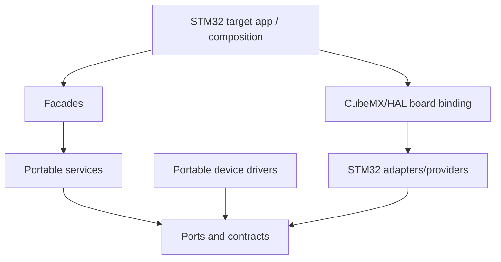

# Linux-to-STM32 and New-Board Implementation Plan

## 0. Mục đích và cách dùng tài liệu

Tài liệu này là kế hoạch chuyển firmware hiện có từ Linux simulation sang sản phẩm mới dùng `STM32L433RCT6`, đồng thời định nghĩa các firmware input phải được chốt trong quá trình thiết kế bo mạch mới.

Bo mạch sản phẩm chưa được freeze. Các mạch hiện có trong `1.docs/02_hardware` là tài liệu được sao chép để tham khảo, không phải schematic, pin map, power tree hoặc board baseline của sản phẩm đang triển khai. Không được dùng trực tiếp pin, peripheral instance, voltage domain, pull-up, segment map hoặc connector mapping từ các tài liệu này làm firmware requirement.

Kế hoạch được chia thành ba lớp công việc:

1. **Hardware architecture and board-definition gate**: chốt yêu cầu ngoại vi, wake source, pin allocation, power tree, schematic và `ProductVariantManifest` cho board mới.
2. **Pre-PCB firmware implementation**: tiếp tục port contract, provider, driver state machine, parser, composition và host test trước khi có PCB.
3. **Target bring-up and qualification**: bind firmware vào CubeMX/HAL của board mới, chạy smoke/HIL test, đo timing/power và thu release evidence.

Mỗi phase là một integration gate độc lập. Trong thời gian chưa có PCB, một phase có thể đạt `PRE_PCB_IMPLEMENTED` và cho phép bắt đầu phần portable của phase kế tiếp khi:

1. code build được trên host và target compile profile;
2. contract test liên quan vẫn pass trên Linux;
3. không đưa STM32 HAL type vào `domain`, `services`, `infrastructure` hoặc portable driver API;
4. mọi assumption phụ thuộc phần cứng được đưa vào manifest/profile và đánh dấu `NEEDS_VERIFICATION`.

Phase chỉ đạt `BOARD_VERIFIED` khi target smoke/HIL test, bus evidence và timing/error path tương ứng đã pass trên đúng board revision. Không được đổi nhãn `PRE_PCB_IMPLEMENTED` thành `BOARD_VERIFIED` chỉ vì CubeMX compile thành công.

Tài liệu không thay thế datasheet, schematic, BOM, PCB design, CubeMX project hay protocol document. Nó xác định thứ tự, dependency, file cần thay đổi, phần nào có thể làm trước khi có PCB và Definition of Done cho từng phase.

---

## 1. Baseline hiện tại

### 1.1. Repository baseline

- Latest `origin/main` khi lập kế hoạch: `041d456fd07ab89faf030376c181be104b581e46`.
- Firmware architecture/source baseline vẫn tương ứng refactor tại `4044414a7610d53b24c10814c12eaa09864e949e`; các commit sau chủ yếu cập nhật tài liệu.
- Linux deterministic backend và portable service foundation đã có.
- STM32 backend hiện chỉ có `adc_port_stm32` theo cơ chế đồng bộ `configure → start → poll → read → stop`.

### 1.2. Những phần đã có thể tái sử dụng

| Khối | Trạng thái |
|---|---|
| `AppComposition`, event queue, mediator/router, event loop | Implemented foundation |
| Instance-owned scheduler | Implemented |
| `DataRepository`, double buffer và `RepoWriteTxn` | Implemented |
| `MeasurementManager` registry | Implemented foundation |
| Flow/pressure/calibration/volume/leak services | Portable implementation foundation |
| Power service/facade và ADC contract | Implemented; STM32 adapter synchronous |
| Storage codec, A/B slot, storage service | Implemented foundation |
| Reporting schedule, telemetry builder/queue/delivery model | Implemented foundation |
| Linux simulation và contract-test structure | Implemented |

### 1.3. Khoảng trống phải xử lý cho board mới và STM32 target

| Khoảng trống | Code truth hiện tại | Phase xử lý |
|---|---|---:|
| Hardware baseline của sản phẩm | Chưa có schematic/pin allocation/power tree canonical; `02_hardware` chỉ là reference | 0 |
| STM32 board composition/startup | Chưa có target application, CubeMX baseline và HAL handle ownership cho board mới | 1–3 |
| Monotonic clock, reset reason, event wake | Chưa có STM32 provider | 2 |
| IRQ/DMA callback routing | Chưa có callback broker/adapter | 3 |
| Battery ADC | Adapter có nhưng polling đồng bộ; chưa có ADC channel/divider profile của board mới | 4 |
| Shared I²C | `I2cBusManager` có; topology, instance, pin và physical provider chưa được chốt | 0, 5 |
| FM24CL04B | I²C path trong `FramDriver` đang trả `FRAM_DRV_IO_ERROR` | 6 |
| MAX35103 | Driver chưa submit SPI và chưa parse coherent raw payload | 7 |
| ZSSC3241 | Driver chưa submit I²C và chưa parse pressure payload | 8 |
| Measurement compute binding | MAX/ZSSC built-in entry chưa có `compute` callback | 9 |
| RTC/reporting alarm | Chưa có STM32 RTC provider | 10 |
| BLE nRF52810 | Chưa có UART/AT port, parser, service binding hoặc wake handshake của board mới | 0, 11 |
| EC200U-CN | Chưa có UART/AT, network/session, MQTT/HTTP adapter hoặc canonical power/control binding | 0, 12 |
| LCD | Chưa freeze glass, COM/SEG allocation, view/driver/adapter | 0, 13 |
| Watchdog, boot self-check, STOP 2 | Chưa có target implementation | 14 |
| Full-system HIL/release evidence | Chưa có | 15 |

---

## 2. Hardware-definition gate cho bo mạch mới

### 2.1. Thứ tự ưu tiên của nguồn dữ liệu

Khi tài liệu, code và schematic không đồng nhất, dùng thứ tự sau:

1. accepted product/system requirement;
2. accepted hardware/architecture decision;
3. released schematic, BOM và PCB revision của board mới;
4. reviewed pin/DMA/wake allocation và `ProductVariantManifest`;
5. CubeMX project và STM32 board binding;
6. firmware implementation;
7. tài liệu reference trong `02_hardware`.

`02_hardware` chỉ có thể cung cấp ý tưởng, datasheet note hoặc reference circuit. Mọi giá trị lấy từ đó phải được xác minh lại bằng datasheet chính thức và thiết kế board mới trước khi trở thành normative input.

### 2.2. Các quyết định phải chốt trong quá trình thiết kế board

| ID | Quyết định cần chốt | Baseline đề xuất | Gate đóng quyết định |
|---|---|---|---|
| `STM32-HWD-001` | Phạm vi ngoại vi thật sự của sản phẩm | MAX35103, ZSSC3241, FM24CL04B, nRF52810, EC200U-CN và LCD chỉ được giữ nếu có trong approved system scope; RS485/service UART không tự động kế thừa từ mạch reference. | Approved peripheral inventory và interface requirement. |
| `STM32-HWD-002` | UART ownership và STOP 2 wake | Thiết bị phải đánh thức STM32 từ STOP 2 dùng `LPUART1` hoặc một GPIO `HOST_WAKE` qua EXTI. Nếu BLE cần wake trực tiếp, ưu tiên BLE → LPUART1 và route thêm `BLE_HOST_WAKE/MCU_READY`; không hard-code mapping trước pin review. | Wake matrix, UART allocation và protocol handshake được review. |
| `STM32-HWD-003` | LCD glass và COM/SEG allocation | Chọn glass trước; allocate LCD pins sớm vì alternate-function bị giới hạn; chỉ tạo segment profile sau khi part number và truth table được chốt. | LCD part, duty/bias, COM/SEG table và CubeMX pin check được approve. |
| `STM32-HWD-004` | Shared-I²C topology | ZSSC3241 và FM24CL04B có thể dùng chung một bus nếu voltage, address, pull-up, capacitance và power-off behavior tương thích. I²C instance/pin được chọn từ pin matrix của board mới. | Schematic/net review và electrical calculation pass. |
| `STM32-HWD-005` | ZSSC3241 EOC/interrupt path | Route `EOC` tới GPIO/EXTI nếu còn pin; firmware vẫn giữ bounded polling fallback cho bring-up và variant không có EOC. | Pin allocation và schematic xác nhận capability `has_zssc_eoc`. |
| `STM32-HWD-006` | ZSSC3241 interface/NVM profile | Runtime dùng approved digital interface; address, command/status format, operation mode và NVM profile ID/checksum nằm trong product profile; runtime NVM write bị disable trừ manufacturing/calibration flow đã approve. | Golden transaction/profile evidence và manifest fields được review. |
| `STM32-HWD-007` | EC200U-CN power/control/UART binding | Chốt UART, `PWRKEY`, reset, rail enable, status, DTR/RI và RTS/CTS capability; thiết kế rail theo worst-case modem load, không dựa vào reference board. | Modem interface manifest, power budget và schematic review pass. |
| `STM32-HWD-008` | Battery/power tree/low-power policy | Chốt nguồn, regulator, ADC divider, BOR và measurement points trước schematic release; low/critical thresholds chỉ thành validated profile sau measurement. | Power architecture pass trước schematic; threshold qualification pass trước release. |
| `STM32-HWD-009` | Debug và production service interface | SWD bắt buộc; debug UART/test point chỉ có trong development variant; không expose production service shell nếu chưa có requirement/decision riêng. | Debug/service scope và production feature flags được approve. |

### 2.3. Thứ tự phân bổ pin đề xuất

Không copy pin từ reference circuit. Tạo một peripheral/pin conflict matrix cho đúng package `STM32L433RCT6` và phân bổ theo thứ tự:

1. nguồn, ground, `NRST`, boot strap, SWD và clock;
2. LCD COM/SEG nếu LCD đã được chọn;
3. LPUART/EXTI cho wake requirement;
4. MAX35103 SPI, chip-select, reset và interrupt;
5. shared I²C cho ZSSC3241/F-RAM và ZSSC EOC;
6. EC200U UART và power/control pins;
7. nRF52810 UART và wake/ready handshake;
8. battery ADC và các diagnostic input;
9. optional RS485/debug/service interface nếu vẫn thuộc scope;
10. test points và GPIO dự phòng.

Với mỗi candidate mapping phải kiểm tra:

- alternate-function đúng package;
- LCD/clock/debug/boot conflict;
- EXTI line conflict;
- DMA request/channel availability;
- voltage domain và 5 V tolerance;
- reset-time safe state;
- low-power retention/wake capability;
- production test access.

### 2.4. Artifact phải tồn tại trước khi freeze CubeMX

```text
HardwareRequirements
    → PeripheralInventory
    → WakeAndPowerMatrix
    → PinDmaExtiAllocation
    → PowerTreeAndBudget
    → ReleasedSchematic/BOM
    → ProductVariantManifest
    → CubeMXBaseline
    → STM32BoardBinding
```

`ProductVariantManifest` tối thiểu phải chứa:

- MCU/package và board revision;
- feature capability;
- peripheral instance, pin và alternate-function;
- DMA/IRQ/EXTI binding;
- device address/CS/reset/interrupt/power control;
- clock/baud/bus frequency;
- wake source và supported low-power mode;
- electrical/profile identifier cần cho driver;
- trạng thái `PROVISIONAL`, `SCHEMATIC_VERIFIED`, `BOARD_VERIFIED` hoặc `RELEASE_VALIDATED`.

Các giá trị clock, baud rate, timeout, DMA request, NVIC priority và device profile phải nằm trong board/variant configuration. Không hard-code chúng trong service hoặc suy ra từ `02_hardware`.

---

## 3. Kiến trúc STM32 target

### 3.1. Dependency direction



Quy tắc chính:

- `main.c`/CubeMX chỉ khởi tạo clock, HAL peripheral và gọi target composition.
- STM32 HAL include chỉ xuất hiện trong `src/platform/stm32` hoặc board-generated boundary.
- Portable driver sở hữu device protocol state machine; provider chỉ sở hữu physical transaction.
- ISR/callback không chạy business logic và không publish `RuntimeSnapshot`.
- Mọi asynchronous completion phải có operation/correlation/generation và kết thúc đúng một lần.

### 3.2. Source tree cần bổ sung

```text
2.firmware/
├── apps/
│   └── stm32_target/
├── src/
│   ├── ports/
│   │   ├── spi_port.h
│   │   ├── i2c_port.h
│   │   ├── uart_port.h
│   │   ├── gpio_port.h
│   │   ├── rtc_port.h
│   │   ├── watchdog_port.h
│   │   └── power_port.h
│   └── platform/stm32/
│       ├── board/
│       ├── providers/
│       └── adapters/
└── tests/
    ├── contract/
    ├── integration/
    └── system/
```

Không bắt buộc tạo toàn bộ port ngay Phase 1. Mỗi port chỉ được thêm khi có consumer và contract test trong phase tương ứng.

### 3.3. Target-owned composition

```c
typedef struct {
    AppComposition app;

    Stm32BoardContext board;
    Stm32ClockAdapter clock;
    Stm32AdcAdapter adc;
    Stm32I2cProvider sensor_storage_i2c;
    Stm32SpiProvider measurement_spi;
    Stm32UartProvider ble_uart;
    Stm32UartProvider modem_uart;

    AdcPort adc_port;
    I2cPort i2c_port;
    SpiPort spi_port;
    UartPort ble_port;
    UartPort modem_port;
} Stm32Composition;
```

Mục đích của struct này là làm ownership/lifetime rõ ràng. HAL handles có thể do CubeMX tạo, nhưng adapter/provider context phải sống suốt thời gian target application hoạt động.

---

## 4. Bản đồ phase tổng thể

Mỗi phase có thể có hai Definition of Done:

- **Pre-PCB DoD**: contract, provider skeleton, state machine, composition và host test hoàn thành mà chưa claim hardware verification.
- **Board DoD**: CubeMX/HAL binding, smoke/HIL test và measurement evidence trên board mới hoàn thành.

Không cần dừng toàn bộ firmware trong thời gian schematic/PCB đang được thiết kế. Chỉ những phần phụ thuộc physical binding mới phải chờ board manifest hoặc PCB.

| Phase | Mục tiêu chính | Có thể làm trước PCB | Output/gate cuối |
|---:|---|---|---|
| 0 | Hardware requirements, interface allocation, power/wake matrix và variant contract | Có | Approved board-definition package |
| 1 | Toolchain, CubeMX baseline, startup, SWD/debug | Một phần | Boot + heartbeat + fault capture trên board |
| 2 | Monotonic clock, reset reason, event runtime | Một phần | Event loop chạy trên target |
| 3 | GPIO/EXTI/DMA callback infrastructure | Có, trừ HIL | ISR evidence vào event queue |
| 4 | ADC battery vertical slice | Có, dùng profile/fake | Battery mV/status khớp DMM trên board |
| 5 | Physical shared-I²C provider và bus ownership | Có, trừ physical test | Transaction contract trên target |
| 6 | FM24CL04B + storage/boot restore | Có | A/B record survive reset/power-cycle |
| 7 | MAX35103 SPI/INT driver | Có | Coherent MAX raw payload trên board |
| 8 | ZSSC3241 shared-I²C/EOC driver | Có | Coherent pressure raw payload trên board |
| 9 | Measurement compute + repository integration | Có | Flow/temp/pressure snapshot tương đương Linux |
| 10 | RTC/time/reporting scheduler | Có, trừ LSE/RTC HIL | Report slot/alarm đúng trên board |
| 11 | BLE UART/configuration | Có | Config round-trip + persist/apply |
| 12 | EC200U/telemetry delivery | Có với fake/AT transcript | One scheduled record acknowledged |
| 13 | LCD display | View model có; glass adapter chờ part/map | Snapshot rendered trên selected glass |
| 14 | Watchdog, boot self-check, low-power | Policy có; STOP measurement chờ board | Sleep/wake/recovery loop |
| 15 | System HIL, budgets và release | Không | Release candidate evidence |

---

## 5. Phase 0 — Định nghĩa bo mạch mới và firmware/hardware contract

### Mục tiêu

Tạo nguồn sự thật canonical cho bo mạch mới trước khi freeze schematic và CubeMX. Phase này không yêu cầu PCB vật lý, nhưng yêu cầu sự phối hợp giữa system, hardware và firmware.

### Công việc

1. Xác nhận peripheral inventory từ approved product scope; loại bỏ mọi module chỉ xuất hiện trong reference circuit mà không còn requirement.
2. Chốt wake/power matrix:
   - nguồn đánh thức từ RTC, BLE, MAX35103, modem hoặc external interface;
   - mode được phép: Run/Sleep/STOP 1/STOP 2;
   - handshake cần thiết để không mất byte/event khi wake.
3. Chọn LCD part trước khi allocate COM/SEG; nếu LCD chưa chốt, đánh dấu LCD phase là feature-gated và không chiếm pin giả định.
4. Tạo pin/DMA/EXTI conflict matrix cho đúng package và review bằng datasheet/CubeMX candidate project.
5. Định nghĩa power tree và budget:
   - battery/input range;
   - MCU/sensor/BLE rails;
   - modem rail, enable/reset/PWRKEY;
   - battery ADC divider và measurement points;
   - reset/BOR/safe-state assumptions.
6. Tạo `ProductVariantManifest`/`Stm32BoardManifest` chứa:
   - MCU/package/board revision;
   - feature capabilities;
   - peripheral instance và pin/alternate-function;
   - DMA request, EXTI line và NVIC policy;
   - device address/CS/reset/interrupt/power control;
   - clock source và target frequency;
   - wake capability như `has_zssc_eoc`, `has_ble_host_wake`, `ble_can_wake_stop2`;
   - profile validation state.
7. Review schematic, BOM, voltage domain, pull-up, test point và production programming/debug access trước release PCB.
8. Freeze toolchain, linker script, startup file, STM32CubeL4 version và build profiles.
9. Định nghĩa evidence format: serial log, normalized trace, logic-analyzer capture, memory map, current measurement và HIL report.
10. Tạo bring-up checklist cho từng board revision.

### Tài liệu phải đọc

- `00_overview/00_open_questions_and_decisions.md`.
- Datasheet/reference manual chính thức của MCU và từng IC được chọn.
- Các tài liệu trong `02_hardware` chỉ để tham khảo ý tưởng; không dùng làm pin/power baseline.
- `50_platform_abstraction.md`, `52_stm32_platform_backend.md`.

### Exit criteria

- Product scope, wake matrix, power architecture và pin allocation của board mới đã được review.
- Schematic/BOM release candidate không còn unresolved pin/voltage/address conflict ảnh hưởng firmware.
- Có một manifest được review với trạng thái tối thiểu `SCHEMATIC_VERIFIED` cho active variant.
- Mỗi open decision có owner/gate; không hard-code assumption hoặc lấy pin từ reference circuit để đi vòng gate.
- Toolchain có thể tạo `.elf`, `.map`, `.hex/.bin` tối thiểu.

---

## 6. Phase 1 — STM32 project, generated boundary và board bring-up

### Mục tiêu

Tạo target build độc lập cho board mới, giữ generated boundary sạch và boot/debug được trước khi thêm driver sản phẩm. Toolchain, target skeleton và CubeMX candidate có thể tạo trước PCB; cold-boot/safe-state evidence phải chờ board thật.

### Thực hiện

1. Tạo `apps/stm32_target` và target CMake/toolchain tương ứng.
2. Import hoặc wrap CubeMX generated code từ reviewed board manifest; giữ generated files tách khỏi portable firmware.
3. Khởi tạo theo thứ tự tối thiểu:
   - HAL, power/voltage scaling;
   - system clock;
   - GPIO safe-state;
   - SWD;
   - debug UART nếu approved;
   - error/fault capture.
4. Tất cả CS/reset/power-enable phải có safe level được xác định từ schematic mới ngay sau reset.
5. Thêm build identity và board manifest hash vào boot log.
6. Tạo linker assertions và báo cáo `.text/.data/.bss/stack`.

### Không làm trong phase này

- Không khởi tạo toàn bộ peripheral chỉ vì CubeMX đã generate.
- Không chạy sensor algorithm trong `while(1)`.
- Không đặt business logic vào `main.c`, HAL callback hoặc `Error_Handler()`.

### Test/evidence

- Cold boot 100 lần không rơi fault.
- SWD attach/reset ổn định.
- Debug output không block vô hạn khi host không nối.
- Kiểm tra safe-state của MAX CS/RST, modem power/reset và bus pins.
- Lưu `.map`, build log và startup trace.

### Exit criteria

Board mới boot đến một target entry function lặp lại được; không có sensor driver nào cần thiết để chứng minh Phase 1. Trước khi có PCB, phase chỉ được đánh dấu `PRE_PCB_IMPLEMENTED`, không phải `BOARD_VERIFIED`.

---

## 7. Phase 2 — Platform core: monotonic time, reset reason và event runtime

### Mục tiêu

Chạy cùng cooperative event loop/scheduler trên STM32 mà không sửa semantics portable.

### File dự kiến

```text
src/platform/stm32/providers/stm32_monotonic_clock.c
src/platform/stm32/providers/stm32_system_control.c
src/platform/stm32/providers/stm32_platform_runtime.c
src/platform/stm32/board/stm32_reset_reason.c
```

### Thực hiện

1. Chọn timer/timebase tạo `monotonic_now_us()` không đi lùi.
2. Xử lý wrap của counter bằng extension state hoặc timer đủ rộng.
3. Capture reset reason trước khi clear RCC/PWR flags.
4. Implement `system_request_reset(reason)` với bounded diagnostic capture rồi `NVIC_SystemReset()`.
5. Implement `platform_init()` và `platform_poll()` cho target.
6. Bind `AppEventLoop` và scheduler vào target main loop.
7. Đo duration của một empty turn và worst-case scheduler collection.

### Test/evidence

- Monotonic value không giảm qua counter wrap test.
- Wall-clock/RTC thay đổi không ảnh hưởng monotonic deadline.
- Scheduler periodic job dùng `MISS_POLICY_SKIP` đúng như Linux.
- Reset reason được phân biệt ít nhất: power-on, pin/software, watchdog, brownout nếu MCU hỗ trợ evidence.

### Exit criteria

Một synthetic periodic event đi qua queue → mediator → handler trên board, với timestamp monotonic và không dùng `HAL_Delay()` làm scheduler.

---

## 8. Phase 3 — GPIO, EXTI, DMA và callback broker

### Mục tiêu

Tạo một pattern dùng chung cho mọi IRQ/DMA completion trước khi viết MAX, UART và low-power wake.

### Thực hiện

1. Tạo GPIO output/input abstraction và EXTI source table.
2. Tạo callback broker ánh xạ HAL handle/channel → adapter instance.
3. Mỗi operation có `operation_id`, `correlation_id`, owner generation và resource generation.
4. ISR chỉ:
   - capture/clear hardware evidence tối thiểu;
   - latch terminal status;
   - post reserved completion/event;
   - trả về.
5. Xử lý queue-full bằng counter + reserved latch/escalation, không drop im lặng.
6. Viết reusable timeout/completion race helper hoặc pattern test.

```c
void HAL_GPIO_EXTI_Callback(uint16_t pin)
{
    Stm32GpioEvidence evidence;
    if (stm32_exti_capture(pin, &evidence)) {
        // Deferred processing preserves bounded ISR latency.
        stm32_event_ingress_post_gpio(&evidence);
    }
}
```

### Test/evidence

- Duplicate/late callback không complete operation mới.
- Timeout và completion cùng tick tạo đúng một terminal result.
- Interrupt storm không làm hỏng queue metadata.
- Đo ISR WCET và max callback-to-event latency.

### Exit criteria

Synthetic EXTI và DMA completion đi qua canonical event boundary; không có service/repository call trong ISR.

---

## 9. Phase 4 — Battery ADC vertical slice

### Mục tiêu

Hoàn thiện driver đơn giản nhất từ HAL đến `RuntimeSnapshot`, dùng nó để kiểm tra toàn bộ composition pattern.

### Thực hiện

1. Bind ADC instance/channel đã được chốt trong `ProductVariantManifest` vào `adc_port_stm32`; không kế thừa `PA0/ADC1_IN5` từ reference circuit.
2. Đo WCET của path đồng bộ hiện tại với mọi status.
3. Chọn một trong hai phương án:
   - giữ bounded polling nếu WCET nhỏ hơn loop budget đã chứng minh; hoặc
   - refactor sang async ADC/DMA completion event.
4. Dùng VDDA/VREF calibration và divider parameters từ `PowerHardwareProfile`; không hard-code 3.3 V và ×2 trong service.
5. Bind `PowerFacade` vào `AppComposition` target.
6. Ghi battery voltage/status vào repository transaction.

### Test/evidence

- 0, mid-scale, full-scale và out-of-range raw value.
- HAL busy, timeout, read error và stop error mapping.
- So sánh ADC-derived voltage với DMM tại nhiều điểm nguồn.
- Không qualification low/critical threshold khi `DEC-PWR-001` chưa đóng.

### Exit criteria

Battery sample xuất hiện trong stable snapshot với provenance/profile version đúng; event loop vẫn đạt budget.

---

## 10. Phase 5 — Physical shared-I²C provider và bus ownership

### Mục tiêu

Tạo một physical I²C provider duy nhất để ZSSC3241 và FM24CL04B không gọi HAL trực tiếp.

### Thực hiện

1. Định nghĩa/hoàn thiện instance-owned `I2cPort` và completion envelope.
2. Implement `stm32_i2c_provider` cho I²C instance được board manifest chọn, dùng interrupt hoặc DMA khi phù hợp.
3. Bind provider vào đúng một `I2cBusManager` instance.
4. Client registration phải chứa slave address, generation và callback context.
5. Hỗ trợ write, read và write-then-read/repeated-start theo device contract.
6. Recovery sequence phải:
   - stop/cancel active transfer;
   - capture HAL/raw error;
   - reinitialize physical resource;
   - increment `bus_generation`;
   - reject old completion.
7. Pressure priority cao hơn storage; không preempt transaction đang chạy.

### Test/evidence

- Address NACK, bus busy, timeout, arbitration/error callback.
- ZSSC request đến khi storage pending.
- Recovery giữa transaction và late completion.
- Logic analyzer chứng minh address/restart/STOP đúng.

### Exit criteria

I²C contract tests pass trên Linux và target; hai fake/real clients dùng chung manager mà không gọi `HAL_I2C_*` ngoài provider. Không claim electrical verification cho tới khi logic-analyzer evidence được thu trên board mới.

---

## 11. Phase 6 — FM24CL04B driver, StoragePort và boot restore

### Mục tiêu

Biến storage I²C path từ stub thành persistent storage thật trước khi phụ thuộc vào config/calibration trên target.

### Thực hiện

1. Refactor `FramDriver` để I²C mode submit qua `I2cBusManager`/port.
2. Xử lý bit địa chỉ thứ 9 của FM24CL04B qua slave-page address đúng datasheet và đúng address straps trong schematic mới.
3. Loại bỏ global-style `storage_port_read/write`; dùng instance-owned `StoragePort` với context/ops/lifetime rõ.
4. Bind `StorageService` vào canonical `StoragePort`, không phụ thuộc trực tiếp `FramDriver*` ở service boundary.
5. Giữ codec `storage_record` và A/B selection làm canonical format duy nhất.
6. Implement boot restore trong target composition:
   - đọc hai slot;
   - validate magic/schema/length/CRC;
   - chọn generation mới nhất hợp lệ;
   - fallback safe default khi cả hai invalid.
7. Chỉ enable write protection nếu hardware/board thực sự hỗ trợ.

### Test/evidence

- Read/write qua boundary `0x0FF/0x100`.
- Range `0..511`, zero length, crossing-end failure.
- Torn/corrupt slot, stale generation, schema mismatch.
- Power-cycle cho thấy config/calibration/volume checkpoint restore đúng.
- Reset ở từng commit stage vẫn chọn được old hoặc new valid record.

### Exit criteria

A/B persistent record survive ít nhất 100 power-cycle test; service code không chứa STM32 HAL và không còn I²C stub path.

---

## 12. Phase 7 — MAX35103 SPI/INT driver

### Mục tiêu

Tạo coherent MAX raw measurement từ SPI + EXTI binding được chọn cho board mới, chưa vội qualification flow accuracy.

### Thực hiện

1. Định nghĩa `SpiPort` instance-owned với CS lifecycle, tx/rx buffer lifetime, deadline và completion identity.
2. Implement `stm32_spi_provider` cho SPI instance/mode/frequency được approved profile chọn; frequency cuối phải được xác minh bằng datasheet và signal-integrity evidence trên board.
3. Bind CS, reset, INT và optional CMP/WDO theo board manifest; không copy pin từ reference circuit.
4. Hoàn thiện `Max35103Driver`:
   - init/reset/probe;
   - register/opcode access;
   - event-timing configuration;
   - INT → status read → result read;
   - parse coherent ToF/temperature-related raw values;
   - validate correlation/generation;
   - publish `EVT_MAX_RAW_READY` kèm bounded payload/reference.
5. Timeout/recovery phải local trước khi yêu cầu FSM/system escalation.
6. Không tính flow/temperature trong SPI callback/driver.

### Test/evidence

- Device ID/register readback nếu IC hỗ trợ.
- Success, invalid status, all-zero/all-one bus, timeout, duplicate INT, stale SPI completion.
- Logic-analyzer capture CS/SCK/MOSI/MISO.
- MAX reset trong active operation invalidates old completion.

### Exit criteria

Driver tạo coherent raw object có sequence/timestamp/generation; raw data khớp logic-analyzer capture và không publish engineering result trực tiếp.

---

## 13. Phase 8 — ZSSC3241 shared-I²C pressure driver

### Mục tiêu

Đọc coherent pressure raw result qua cùng I²C manager với F-RAM.

### Thực hiện

1. Freeze ZSSC digital interface, address, NVM profile, command/status format và bridge/sensor variant.
2. Hoàn thiện `Zssc3241Driver`:
   - probe/profile validation;
   - one-shot start;
   - wait conversion;
   - EOC-driven completion nếu board mới đã route EOC;
   - bounded status polling làm fallback cho bring-up/variant không có EOC;
   - result read/parse;
   - publish `EVT_PRESSURE_RAW_READY`.
3. EOC và polling phải tạo cùng terminal event contract; thay đổi completion source không được làm đổi service API.
4. Submit mọi transaction qua `I2cBusManager`; không gọi HAL trực tiếp.
5. Release bus trong conversion wait; không giữ I²C busy khi sensor đang đo.
6. Timeout/recovery tăng client/resource generation phù hợp.

### Test/evidence

- Success, not-ready polling, sensor fault status, NACK, timeout, invalid frame.
- Pressure request ưu tiên hơn storage pending.
- F-RAM commit vẫn tiến triển, không starvation vô hạn.
- So sánh raw code với known pressure/reference fixture; chưa claim accuracy nếu calibration chưa qualification.

### Exit criteria

Pressure raw object có provenance/profile/calibration reference; shared-I²C race/recovery tests pass.

---

## 14. Phase 9 — Measurement compute, calibration và repository integration

### Mục tiêu

Kết nối raw-ready events vào các `MeasurementService.compute()` và publish một snapshot atomic.

### Thực hiện

1. Tách concrete service instances khỏi driver state trong target/application composition.
2. Đăng ký MAX, temperature/calibration, flow và pressure compute strategies với `MeasurementManager`.
3. `on_event` chỉ nhận/validate raw event; `compute` đọc `context.input` và ghi `context.output`.
4. Một dispatch dùng đúng một `RepoWriteTxn`; abort toàn bộ khi strategy trả error.
5. Enforce ordering dependency, ví dụ temperature result trước flow compensation nếu cùng source event yêu cầu.
6. Bind `VolumeAccumulator` và `LeakDetectionService` sau accepted production flow/pressure.
7. Chặn simulated/service/calibration origin khỏi production volume/leak/telemetry.

```c
MeasurementService pressure_strategy = {
    .service_id = MEASUREMENT_SERVICE_ID_PRESSURE_PROCESSING,
    .instance = &composition->pressure_service,
    .on_event = pressure_service_on_event,
    .compute = pressure_service_compute,
    .enabled = true
};
```

### Test/evidence

- Một accepted raw event tạo tối đa một final snapshot commit.
- Invalid/stale/profile-mismatch raw event không sửa canonical result.
- Duplicate raw event không cộng volume hai lần.
- Fixed/golden vector giống Linux trong tolerance đã định nghĩa.
- Event-loop WCET của full measurement turn được đo trên target.

### Exit criteria

Flow, temperature, pressure, volume và leak result xuất hiện trong consistent snapshot; normalized semantic trace tương đương Linux.

---

## 15. Phase 10 — RTC, TimeService và reporting scheduler

### Mục tiêu

Đưa wall clock/reporting alarm lên STM32 mà không trộn với monotonic timeout.

### Thực hiện

1. Implement RTC port: get/set time, validity, alarm, source metadata.
2. Validate LSE startup/fallback và capture clock failure.
3. Bind `TimeService` source priority: 4G/server, BLE initial set, RTC holdover theo policy.
4. Bind `ReportingSchedule` hai window và `SKIP_TO_NEXT` missed policy.
5. RTC alarm callback chỉ post event; telemetry record build ở event context từ stable snapshot.
6. Test clock step/timezone/fixed-offset behavior mà không đổi active monotonic deadlines.

### Exit criteria

Reporting slot ID và next alarm đúng qua midnight/window boundary; time invalid không phát report sai policy.

---

## 16. Phase 11 — BLE nRF52810 UART/configuration integration

### Mục tiêu

Hoàn thiện local configuration path sau khi UART ownership và wake handshake của board mới đã được chốt.

### Thực hiện

1. Implement asynchronous UART provider với RX DMA/ring + IDLE/timeout evidence và bounded TX queue; bind UART instance/pin từ board manifest.
2. Tạo nRF52810 transport/parser theo `1.docs/03_communication`.
3. Parser xử lý fragmented/combined frame, checksum/version/length và unknown command.
4. Bind command vào authorization, `ModeGuard`, PendingConfig transaction, persistent commit và per-service apply ACK.
5. Command correlation và idempotency ngăn duplicate side effect.
6. Nếu BLE được phép đánh thức STM32 từ STOP 2:
   - với LPUART wake, HIL test start-bit/frame wake và data preservation;
   - với `BLE_HOST_WAKE`, nRF52810 phải assert wake, chờ `MCU_READY`, rồi mới gửi UART frame;
   - không claim STOP 2 BLE wake nếu board chỉ dùng USART không có EXTI handshake phù hợp.

### Exit criteria

Mobile/fake BLE có thể đọc status, set time, gửi config candidate, nhận commit/apply result; reset vẫn restore config hợp lệ.

---

## 17. Phase 12 — EC200U-CN và remote telemetry

### Mục tiêu

Gửi một scheduled telemetry record qua modem với ACK/retry đúng policy.

### Thực hiện

1. Dùng modem UART/power/PWRKEY/RESET/status/DTR/RI binding đã được freeze trong board manifest; xác minh active level và reset-time state theo schematic mới.
2. Tái sử dụng UART provider nhưng tạo instance/ring/buffer riêng.
3. Implement EC200U AT engine:
   - one active command;
   - correlated deadline;
   - partial/combined response;
   - unsolicited result code interleave;
   - generation invalidation sau power cycle.
4. Tạo network registration/session state machine.
5. Bind một transport active: MQTT QoS 1 hoặc HTTP POST theo product profile.
6. Queue item chỉ remove sau PUBACK hoặc HTTP 2xx theo approved contract.
7. Retry dùng monotonic timer, không block 90 giây trong một handler.
8. Credentials không nằm trong general snapshot/log.

### Test/evidence

- Partial response, URC interleave, timeout, reconnect, duplicate ACK, offline TTL.
- Power interruption trong in-flight request.
- One report slot không tạo duplicate record/delivery side effect.
- Đo modem peak-current/supply droop; release vẫn blocked nếu `DEC-HW-005` chưa qualification.

### Exit criteria

Một scheduled record đi snapshot → queue → modem → ACK → remove; failure path giữ/retry đúng policy và event loop không bị block.

---

## 18. Phase 13 — LCD view model và STM32 segment LCD

### Điều kiện bắt đầu

LCD part number, electrical profile và COM/SEG allocation của board mới phải được approve. Reference segment map không thỏa điều kiện bắt đầu.

### Thực hiện

1. Viết display view model portable trước: flow, volume, temperature, pressure, battery, leak/mode/error.
2. Tạo segment-map profile riêng cho LCD glass thực sự được chọn; chỉ dùng `OST26067TWPRP-P` nếu part này được chốt lại cho board mới.
3. Implement LCD adapter dùng STM32 LCD peripheral, clock source, duty và bias theo approved electrical profile.
4. Refresh rate-limited/coalesced; không đọc sensor driver trực tiếp.
5. Invalid/stale/unavailable có biểu diễn riêng.

### Exit criteria

Golden view-model tests pass; HIL xác nhận toàn bộ segment/COM mapping và refresh không ảnh hưởng measurement timing.

---

## 19. Phase 14 — Boot self-check, watchdog và STOP 2

### Mục tiêu

Chỉ thêm reliability/low power sau khi các driver có quiesce/rebind contract rõ.

### Thực hiện

1. Boot sequence:
   - minimal platform;
   - capture reset reason;
   - storage/config restore;
   - repository/services;
   - critical device probe;
   - readiness aggregation;
   - FSM NORMAL/degraded/ERROR.
2. Implement watchdog port và `WatchdogSupervisor`; feed chỉ sau progress validation.
3. Define blocker set: active SPI/I²C/UART, storage commit, modem session, recovery và pending critical completion.
4. Chỉ enable low-power mode mà board wake matrix đã chứng minh. Nếu một active communication source chỉ wake được STOP 1, policy phải chọn STOP 1 hoặc dùng approved EXTI handshake thay vì ép STOP 2.
5. STOP 2 entry:
   - evaluate FSM/policy;
   - quiesce/cancel bounded operations;
   - check blocker lần cuối;
   - configure wake;
   - enter STOP 2.
6. Resume:
   - capture wake reason;
   - restore clocks/timebase;
   - reinitialize/rebind peripherals;
   - increment resource generation;
   - reject pre-sleep late completions;
   - require fresh readiness evidence.

### Test/evidence

- Wake by RTC, MAX INT và approved BLE LPUART/EXTI source theo board manifest.
- Repeated sleep/wake; clock continuity; stale callback after wake.
- Watchdog stall and repeated-reset policy.
- Storage/config busy prevents sleep.
- Current measurement ở INIT/NORMAL/approved low-power modes; không claim production target khi power tree hoặc wake decisions chưa được validate.

### Exit criteria

Sleep/wake/recovery loop pass HIL, không mất persistent data, không accept stale operation và watchdog không feed khi event loop mất progress.

---

## 20. Phase 15 — Full-system HIL, budget và release candidate

### Mục tiêu

Chuyển từ “chạy được trên board” thành release evidence có traceability.

### Mandatory suites

1. Build profiles: STM32 debug/release và Linux deterministic.
2. Architecture enforcement và static analysis.
3. Unit/contract/integration/system tests.
4. Driver HIL normal/fault/recovery.
5. End-to-end measurement, storage, BLE config, scheduled telemetry và display.
6. Reset/power-cycle/sleep-wake campaigns.
7. Timing:
   - ISR WCET;
   - event-loop turn WCET;
   - measurement deadline;
   - storage/modem latency;
   - wake latency.
8. Resources: flash, static RAM, stack high-water, DMA/ring buffers.
9. Power: normal, measurement, modem burst, STOP 2.
10. Traceability update trong `95_firmware_traceability.md`.

### Release gate

- Không mandatory test failure hoặc unexplained flaky result.
- Không `NEEDS_VERIFICATION` ảnh hưởng safety/product acceptance trong active variant.
- Production image không link Linux fake/test provider.
- Mọi open decision ảnh hưởng release được đóng hoặc feature bị disable rõ ràng.
- Firmware, board manifest, config/profile và test evidence cùng một build identity.

---

## 21. Quy tắc commit và review cho từng phase

Mỗi phase nên chia thành các commit/PR nhỏ theo thứ tự:

1. contract/port và tests;
2. STM32 provider/adapter;
3. portable driver state machine hoặc parser;
4. composition/service binding;
5. HIL tests, evidence và documentation update.

Không trộn nhiều peripheral chưa liên quan trong cùng commit. Mỗi PR phải ghi:

- phase/requirement ID;
- board/variant được test;
- đường chạy normal và fault đã kiểm tra;
- HAL callback/ISR ownership;
- buffer lifetime;
- timeout/generation policy;
- memory/timing delta;
- open risk còn lại.

---

## 22. Definition of Done chung cho một driver

Một driver chỉ được coi là hoàn thành khi đáp ứng tất cả mục sau:

- [ ] API không expose STM32 HAL type ra portable layer.
- [ ] Instance/context lifetime và ownership được ghi rõ.
- [ ] Init/probe/normal operation/timeout/recovery đều finite.
- [ ] Buffer lifetime rõ; không giữ pointer stack ngoài call contract.
- [ ] Completion có correlation và generation.
- [ ] Duplicate/late/stale completion bị loại an toàn.
- [ ] Error được map sang canonical status; raw HAL detail chỉ dùng diagnostics.
- [ ] ISR/callback bounded, không compute/publish snapshot.
- [ ] Unit/contract test chạy trên host.
- [ ] Target smoke/HIL normal và fault path pass.
- [ ] Logic-analyzer hoặc equivalent evidence cho bus protocol khi cần.
- [ ] WCET, RAM/flash và queue/buffer usage được đo.
- [ ] Tài liệu driver/platform/traceability được cập nhật.

---

## 23. Những việc không thuộc kế hoạch MVP này

- OTA/bootloader update qua 4G.
- Generic remote command/configuration qua cellular.
- Automatic MQTT/HTTP failover.
- Persistent long-term telemetry history nếu chưa có decision mới.
- RS485/Modbus product feature nếu chưa được đưa lại vào approved system scope; sự xuất hiện trong reference hardware không đủ để đưa vào firmware.
- Dedicated production service UART nếu chưa có requirement/decision riêng.
- RTOS migration; cooperative event-driven runtime vẫn là baseline.

---

## 24. Thứ tự triển khai được khuyến nghị ngay sau tài liệu này

1. Đánh dấu rõ `02_hardware` là `REFERENCE_ONLY`; xác nhận lại peripheral inventory từ system requirements.
2. Hoàn thành Phase 0: wake/power matrix, LCD choice, pin/DMA/EXTI allocation, shared-I²C topology, modem controls và schematic-verified manifest.
3. Trong thời gian thiết kế/sản xuất PCB, triển khai các Pre-PCB DoD: port contract, provider skeleton, driver FSM, parser, composition và Linux contract tests.
4. Tạo STM32 toolchain + target app từ board manifest, sau đó hoàn thành Phase 1 khi board mới có thể boot.
5. Làm Phase 2–4 để có vertical slice battery chạy end-to-end.
6. Làm Phase 5–6 để boot/config/calibration có persistence thật.
7. Làm Phase 7–9 để hoàn thiện measurement product core.
8. Làm RTC/BLE trước modem nếu cần cấu hình và time bring-up tại chỗ.
9. Làm LCD adapter sau khi LCD glass/mapping được chốt; qualification modem power và low-power chỉ hoàn tất sau khi có measurement evidence trên board.

Đây là thứ tự giảm rủi ro: mỗi phase tạo một output đo được, giữ Linux làm functional oracle và tránh tích hợp toàn bộ peripheral trong một lần.
