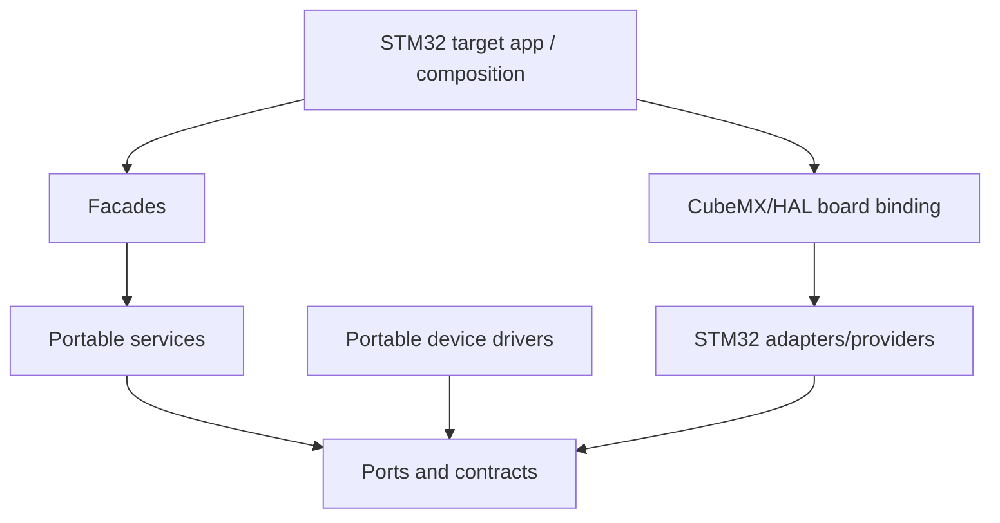

---

document_id: FW-IMPL-094
title: STM32 Implementation Phase Execution Plan
status: ACTIVE
version: 2.0
owner: Firmware
last_updated: 2026-07-16
repository_baseline: 041d456fd07ab89faf030376c181be104b581e46
related_decisions:

- DEC-ARCH-005
- DEC-HW-004
- DEC-HW-005
- DEC-HW-006
- DEC-HW-007
- DEC-HW-008
- DEC-PWR-001
- DEC-DIAG-001
related_documents:
- ../00_core/01_firmware_architecture.md
- ../00_core/02_event_model_and_scheduler.md
- ../00_core/03_system_fsm_binding.md
- ../00_core/04_data_model_and_ownership.md
- ../10_measurement/10_measurement_cycle.md
- ../10_measurement/11_max35103_integration.md
- ../10_measurement/12_pressure_measurement_zssc3241.md
- ../20_data_and_storage/22_persistent_storage.md
- ../30_interfaces/30_ble_integration.md
- ../30_interfaces/32_4g_modem_integration.md
- ../30_interfaces/34_lcd_display_integration.md
- ../40_reliability/42_watchdog_strategy.md
- ../40_reliability/43_low_power_mode.md
- ../40_reliability/44_boot_and_self_check.md
- ../50_platform/50_platform_abstraction.md
- ../50_platform/52_stm32_platform_backend.md
- ../50_platform/53_interrupt_dma_and_callback_rules.md
- 91_build_and_variant_strategy.md
- 92_firmware_test_strategy.md
- 95_firmware_traceability.md

---

# STM32 Implementation Phase Execution Plan

## 0. Mục đích và cách dùng tài liệu

Tài liệu này là kế hoạch triển khai firmware hiện có từ Linux simulation sang bo mạch dùng `STM32L433RCT6`. Kế hoạch bắt đầu từ board bring-up và driver từng peripheral/module, sau đó mới kết nối driver vào service, application composition, system FSM và các chức năng sản phẩm.

Mỗi phase là một integration gate độc lập. Chỉ chuyển sang phase sau khi:

1. code build được trên target profile;
2. contract test liên quan vẫn pass trên Linux;
3. target smoke/HIL test của phase pass;
4. không đưa STM32 HAL type vào `domain`, `services`, `infrastructure` hoặc portable driver API;
5. artifact, pin/profile, timeout và các giới hạn `NEEDS_VERIFICATION` đã được ghi lại.

Tài liệu không thay thế datasheet, schematic, CubeMX project hay protocol document. Nó xác định thứ tự, dependency, file cần thay đổi và Definition of Done cho từng phase.

---

## 1. Baseline hiện tại

### 1.1. Repository baseline

* Latest `origin/main` khi lập kế hoạch: `041d456fd07ab89faf030376c181be104b581e46`.
* Firmware architecture/source baseline vẫn tương ứng refactor tại `4044414a7610d53b24c10814c12eaa09864e949e`; các commit sau chủ yếu cập nhật tài liệu.
* Linux deterministic backend và portable service foundation đã có.
* STM32 backend hiện chỉ có `adc_port_stm32` theo cơ chế đồng bộ `configure → start → poll → read → stop`.

### 1.2. Những phần đã có thể tái sử dụng

| Khối                                                       | Trạng thái                             |
| ---------------------------------------------------------- | -------------------------------------- |
| `AppComposition`, event queue, mediator/router, event loop | Implemented foundation                 |
| Instance-owned scheduler                                   | Implemented                            |
| `DataRepository`, double buffer và `RepoWriteTxn`          | Implemented                            |
| `MeasurementManager` registry                              | Implemented foundation                 |
| Flow/pressure/calibration/volume/leak services             | Portable implementation foundation     |
| Power service/facade và ADC contract                       | Implemented; STM32 adapter synchronous |
| Storage codec, A/B slot, storage service                   | Implemented foundation                 |
| Reporting schedule, telemetry builder/queue/delivery model | Implemented foundation                 |
| Linux simulation và contract-test structure                | Implemented                            |

### 1.3. Khoảng trống phải xử lý trên STM32

| Khoảng trống                              | Code truth hiện tại                                       | Phase xử lý |
| ----------------------------------------- | --------------------------------------------------------- | ----------: |
| STM32 board composition/startup           | Chưa có target application và HAL handle ownership        |         1–3 |
| Monotonic clock, reset reason, event wake | Chưa có STM32 provider                                    |           2 |
| IRQ/DMA callback routing                  | Chưa có callback broker/adapter                           |           3 |
| Battery ADC                               | Adapter có nhưng polling đồng bộ; chưa bind board         |           4 |
| Shared I²C                                | `I2cBusManager` có, physical provider chưa có             |           5 |
| FM24CL04B                                 | I²C path trong `FramDriver` đang trả `FRAM_DRV_IO_ERROR`  |           6 |
| MAX35103                                  | Driver chưa submit SPI và chưa parse coherent raw payload |           7 |
| ZSSC3241                                  | Driver chưa submit I²C và chưa parse pressure payload     |           8 |
| Measurement compute binding               | MAX/ZSSC built-in entry chưa có `compute` callback        |           9 |
| RTC/reporting alarm                       | Chưa có STM32 RTC provider                                |          10 |
| BLE nRF52810                              | Chưa có UART/AT port, parser, service binding             |          11 |
| EC200U-CN                                 | Chưa có UART/AT, network/session, MQTT/HTTP adapter       |          12 |
| LCD                                       | Chưa có view/driver/adapter; decision còn mâu thuẫn       |          13 |
| Watchdog, boot self-check, STOP 2         | Chưa có target implementation                             |          14 |
| Full-system HIL/release evidence          | Chưa có                                                   |          15 |

---

## 2. Các blocker phải xử lý trước khi freeze CubeMX

### 2.1. Hardware/document conflicts

| ID              | Vấn đề                                                                                                                          | Ảnh hưởng                                                                           | Hành động bắt buộc                                                                          |
| --------------- | ------------------------------------------------------------------------------------------------------------------------------- | ----------------------------------------------------------------------------------- | ------------------------------------------------------------------------------------------- |
| `STM32-BLK-001` | Overview bind nRF52810 vào `LPUART1` để wake STOP 2, nhưng hardware document bind BLE vào `USART3` và dùng `LPUART1` cho RS485. | Wake matrix và UART ownership không thể đồng thời đúng.                             | Chốt một mapping, cập nhật `DEC-HW-007`, pin map, CubeMX và firmware variant trước Phase 1. |
| `STM32-BLK-002` | `DEC-HW-004` vẫn OPEN nhưng hardware document đã ghi LCD `OST26067TWPRP-P` và segment map.                                      | Không biết mapping này là approved baseline hay provisional.                        | Chốt/adopt LCD decision hoặc giữ Phase 13 blocked.                                          |
| `STM32-BLK-003` | `DEC-HW-005` và `DEC-PWR-001` còn OPEN.                                                                                         | Không thể qualification nguồn modem, battery-low/critical và STOP 2 power behavior. | Đo power tree/4G burst, chốt threshold trong validated profile trước release.               |
| `STM32-BLK-004` | ZSSC3241 `EOC` chưa route ra connector.                                                                                         | Không thể dùng EOC interrupt theo target sequence.                                  | MVP dùng bounded polling; chỉ bật EOC path ở variant có pin route.                          |
| `STM32-BLK-005` | ZSSC3241 I²C address/NVM interface profile chưa được chứng minh.                                                                | Driver không thể probe/read ổn định.                                                | Ghi address, command/status format và NVM profile vào `ProductVariantManifest`.             |
| `STM32-BLK-006` | Quyết định dùng chung I²C đã chốt nhưng schematic binding ZSSC → `PB6/PB7` chưa được thể hiện đầy đủ.                           | Có thể wiring sai bus hoặc sai voltage domain.                                      | Xác nhận ZSSC SDA/SCL nối I2C1 cùng FM24CL04B và mức điện áp/pull-up tương thích.           |
| `STM32-BLK-007` | EC200U nằm trong hardware document riêng; exact MCU pin/board variant chưa freeze.                                              | Không thể tạo UART/power-control adapter canonical.                                 | Chốt board variant và pin manifest trước Phase 12.                                          |
| `STM32-BLK-008` | `DEC-HW-008` service UART còn OPEN.                                                                                             | Dễ nhầm debug UART với production service interface.                                | Phase 1 chỉ dùng debug console; không expose service command nếu decision chưa chốt.        |

### 2.2. Pin baseline được phép dùng sau khi xác nhận

| Module                | Peripheral/pin hiện ghi trong hardware docs                                                            |
| --------------------- | ------------------------------------------------------------------------------------------------------ |
| MAX35103              | SPI1: `PA4 NSS`, `PA5 SCK`, `PA6 MISO`, `PA7 MOSI`; `PC4 RST`; `PC5 INT/EXTI9_5`; `PB0 CMP`; `PB2 WDO` |
| FM24CL04B             | I2C1: `PB6 SCL`, `PB7 SDA`, 100 kHz, base address `0x50`                                               |
| Battery               | ADC1_IN5 trên `PA0`, 12-bit; divider nominal ×2                                                        |
| BLE theo hardware doc | USART3: `PC10 TX`, `PC11 RX`, `PC12 MCU_BLE` — đang mâu thuẫn với wake decision                        |
| Debug                 | USART2: `PA2 TX`, `PA3 RX`                                                                             |
| RTC/LCD clock         | LSE trên `PC14/PC15`                                                                                   |
| LCD                   | 4 COM và segment mapping trong `stm32_water_meter.md`; chưa release khi `DEC-HW-004` chưa đóng         |

Các giá trị clock, baud rate, timeout, DMA channel và NVIC priority phải nằm trong board/variant configuration. Không copy nguyên numeric từ tài liệu hardware vào service code.

---

## 3. Kiến trúc STM32 target

### 3.1. Dependency direction



Quy tắc chính:

* `main.c`/CubeMX chỉ khởi tạo clock, HAL peripheral và gọi target composition.
* STM32 HAL include chỉ xuất hiện trong `src/platform/stm32` hoặc board-generated boundary.
* Portable driver sở hữu device protocol state machine; provider chỉ sở hữu physical transaction.
* ISR/callback không chạy business logic và không publish `RuntimeSnapshot`.
* Mọi asynchronous completion phải có operation/correlation/generation và kết thúc đúng một lần.

### 3.2. Source tree cần bổ sung

```text
2.firmware/
├── apps/
│   └── stm32_target/
├── src/
│   ├── ports/
│   │   ├── spi_port.h
│   │   ├── i2c_port.h
│   │   ├── uart_port.h
│   │   ├── gpio_port.h
│   │   ├── rtc_port.h
│   │   ├── watchdog_port.h
│   │   └── power_port.h
│   └── platform/stm32/
│       ├── board/
│       ├── providers/
│       └── adapters/
└── tests/
    ├── contract/
    ├── integration/
    └── system/
```

Không bắt buộc tạo toàn bộ port ngay Phase 1. Mỗi port chỉ được thêm khi có consumer và contract test trong phase tương ứng.

### 3.3. Target-owned composition

```c
typedef struct {
    AppComposition app;

    Stm32BoardContext board;
    Stm32ClockAdapter clock;
    Stm32AdcAdapter adc;
    Stm32I2cProvider i2c1;
    Stm32SpiProvider spi1;
    Stm32UartProvider ble_uart;
    Stm32UartProvider modem_uart;

    AdcPort adc_port;
    I2cPort i2c_port;
    SpiPort spi_port;
    UartPort ble_port;
    UartPort modem_port;
} Stm32Composition;
```

Mục đích của struct này là làm ownership/lifetime rõ ràng. HAL handles có thể do CubeMX tạo, nhưng adapter/provider context phải sống suốt thời gian target application hoạt động.

---

## 4. Bản đồ phase tổng thể

| Phase | Mục tiêu chính                                | Output có thể demo                | Dependency             |
| ----: | --------------------------------------------- | --------------------------------- | ---------------------- |
|     0 | Freeze contract, variant và hardware blockers | Approved bring-up manifest        | Không                  |
|     1 | Toolchain, CubeMX, startup, SWD/debug         | Boot + heartbeat + fault capture  | 0                      |
|     2 | Monotonic clock, reset reason, event runtime  | Event loop chạy trên target       | 1                      |
|     3 | GPIO/EXTI/DMA callback infrastructure         | ISR evidence vào event queue      | 2                      |
|     4 | ADC battery vertical slice                    | Battery mV/status trong snapshot  | 3                      |
|     5 | Physical I²C1 provider và bus ownership       | Transaction contract trên target  | 3                      |
|     6 | FM24CL04B + storage/boot restore              | A/B record survive reset          | 5                      |
|     7 | MAX35103 SPI/INT driver                       | Coherent MAX raw payload          | 3                      |
|     8 | ZSSC3241 shared-I²C driver                    | Coherent pressure raw payload     | 5                      |
|     9 | Measurement compute + repository integration  | Flow/temp/pressure snapshot       | 6–8                    |
|    10 | RTC/time/reporting scheduler                  | Report slot/alarm đúng            | 2, 6                   |
|    11 | BLE UART/configuration                        | Config round-trip + persist/apply | 6, 10                  |
|    12 | EC200U/telemetry delivery                     | One scheduled record acknowledged | 10                     |
|    13 | LCD display                                   | Snapshot rendered trên glass      | 9, decision LCD        |
|    14 | Watchdog, boot self-check, STOP 2             | Sleep/wake/recovery loop          | 6–13                   |
|    15 | System HIL, budgets và release                | Release candidate evidence        | Tất cả mandatory phase |

---

## 5. Phase 0 — Freeze contract, board variant và acceptance evidence

### Mục tiêu

Không bắt đầu viết HAL binding khi pin mapping, wake source và module variant còn mâu thuẫn.

### Công việc

1. Tạo `Stm32BoardManifest` hoặc header generated/config chứa:

   * MCU/package/board revision;
   * peripheral instance và pin/alternate function;
   * DMA channel/request;
   * NVIC priority;
   * device address/CS/reset/interrupt;
   * clock source và target frequency;
   * feature capability như `has_zssc_eoc`, `has_ble_stop2_wake`.
2. Giải quyết `STM32-BLK-001` đến `STM32-BLK-008` hoặc đánh dấu phase bị block.
3. Freeze toolchain, linker script, startup file, STM32CubeL4 version và build profiles.
4. Định nghĩa evidence format: serial log, normalized trace, logic-analyzer capture, memory map, current measurement và HIL report.
5. Tạo bring-up checklist cho từng board revision.

### Tài liệu phải đọc

* `00_overview/00_open_questions_and_decisions.md`.
* Hardware `stm32_water_meter.md`, `ZSSC324_circuit.md`, `dataloger_4G.md`.
* `50_platform_abstraction.md`, `52_stm32_platform_backend.md`.

### Exit criteria

* Có một manifest được review và không còn pin conflict trong active variant.
* Mỗi open decision có owner/gate; không hard-code assumption để đi vòng blocker.
* Toolchain có thể tạo `.elf`, `.map`, `.hex/.bin` tối thiểu.

---

## 6. Phase 1 — STM32 project, startup và board bring-up

### Mục tiêu

Tạo target build độc lập, boot ổn định và debug được trước khi thêm driver sản phẩm.

### Thực hiện

1. Tạo `apps/stm32_target` và target CMake/toolchain tương ứng.
2. Import hoặc wrap CubeMX generated code; giữ generated files tách khỏi portable firmware.
3. Khởi tạo theo thứ tự tối thiểu:

   * HAL, power/voltage scaling;
   * system clock;
   * GPIO safe-state;
   * SWD;
   * debug UART nếu approved;
   * error/fault capture.
4. Tất cả CS/reset/power-enable phải có safe level ngay sau reset.
5. Thêm build identity và board manifest hash vào boot log.
6. Tạo linker assertions và báo cáo `.text/.data/.bss/stack`.

### Không làm trong phase này

* Không khởi tạo toàn bộ peripheral chỉ vì CubeMX đã generate.
* Không chạy sensor algorithm trong `while(1)`.
* Không đặt business logic vào `main.c`, HAL callback hoặc `Error_Handler()`.

### Test/evidence

* Cold boot 100 lần không rơi fault.
* SWD attach/reset ổn định.
* Debug output không block vô hạn khi host không nối.
* Kiểm tra safe-state của MAX CS/RST, modem power/reset và bus pins.
* Lưu `.map`, build log và startup trace.

### Exit criteria

Board boot đến một target entry function lặp lại được; không có sensor driver nào cần thiết để chứng minh Phase 1.

---

## 7. Phase 2 — Platform core: monotonic time, reset reason và event runtime

### Mục tiêu

Chạy cùng cooperative event loop/scheduler trên STM32 mà không sửa semantics portable.

### File dự kiến

```text
src/platform/stm32/providers/stm32_monotonic_clock.c
src/platform/stm32/providers/stm32_system_control.c
src/platform/stm32/providers/stm32_platform_runtime.c
src/platform/stm32/board/stm32_reset_reason.c
```

### Thực hiện

1. Chọn timer/timebase tạo `monotonic_now_us()` không đi lùi.
2. Xử lý wrap của counter bằng extension state hoặc timer đủ rộng.
3. Capture reset reason trước khi clear RCC/PWR flags.
4. Implement `system_request_reset(reason)` với bounded diagnostic capture rồi `NVIC_SystemReset()`.
5. Implement `platform_init()` và `platform_poll()` cho target.
6. Bind `AppEventLoop` và scheduler vào target main loop.
7. Đo duration của một empty turn và worst-case scheduler collection.

### Test/evidence

* Monotonic value không giảm qua counter wrap test.
* Wall-clock/RTC thay đổi không ảnh hưởng monotonic deadline.
* Scheduler periodic job dùng `MISS_POLICY_SKIP` đúng như Linux.
* Reset reason được phân biệt ít nhất: power-on, pin/software, watchdog, brownout nếu MCU hỗ trợ evidence.

### Exit criteria

Một synthetic periodic event đi qua queue → mediator → handler trên board, với timestamp monotonic và không dùng `HAL_Delay()` làm scheduler.

---

## 8. Phase 3 — GPIO, EXTI, DMA và callback broker

### Mục tiêu

Tạo một pattern dùng chung cho mọi IRQ/DMA completion trước khi viết MAX, UART và low-power wake.

### Thực hiện

1. Tạo GPIO output/input abstraction và EXTI source table.
2. Tạo callback broker ánh xạ HAL handle/channel → adapter instance.
3. Mỗi operation có `operation_id`, `correlation_id`, owner generation và resource generation.
4. ISR chỉ:

   * capture/clear hardware evidence tối thiểu;
   * latch terminal status;
   * post reserved completion/event;
   * trả về.
5. Xử lý queue-full bằng counter + reserved latch/escalation, không drop im lặng.
6. Viết reusable timeout/completion race helper hoặc pattern test.

```c
void HAL_GPIO_EXTI_Callback(uint16_t pin)
{
    Stm32GpioEvidence evidence;
    if (stm32_exti_capture(pin, &evidence)) {
        // Deferred processing preserves bounded ISR latency.
        stm32_event_ingress_post_gpio(&evidence);
    }
}
```

### Test/evidence

* Duplicate/late callback không complete operation mới.
* Timeout và completion cùng tick tạo đúng một terminal result.
* Interrupt storm không làm hỏng queue metadata.
* Đo ISR WCET và max callback-to-event latency.

### Exit criteria

Synthetic EXTI và DMA completion đi qua canonical event boundary; không có service/repository call trong ISR.

---

## 9. Phase 4 — Battery ADC vertical slice

### Mục tiêu

Hoàn thiện driver đơn giản nhất từ HAL đến `RuntimeSnapshot`, dùng nó để kiểm tra toàn bộ composition pattern.

### Thực hiện

1. Bind `ADC1_IN5/PA0` vào `adc_port_stm32`.
2. Đo WCET của path đồng bộ hiện tại với mọi status.
3. Chọn một trong hai phương án:

   * giữ bounded polling nếu WCET nhỏ hơn loop budget đã chứng minh; hoặc
   * refactor sang async ADC/DMA completion event.
4. Dùng VDDA/VREF calibration và divider parameters từ `PowerHardwareProfile`; không hard-code 3.3 V và ×2 trong service.
5. Bind `PowerFacade` vào `AppComposition` target.
6. Ghi battery voltage/status vào repository transaction.

### Test/evidence

* 0, mid-scale, full-scale và out-of-range raw value.
* HAL busy, timeout, read error và stop error mapping.
* So sánh ADC-derived voltage với DMM tại nhiều điểm nguồn.
* Không qualification low/critical threshold khi `DEC-PWR-001` chưa đóng.

### Exit criteria

Battery sample xuất hiện trong stable snapshot với provenance/profile version đúng; event loop vẫn đạt budget.

---

## 10. Phase 5 — Physical I²C1 provider và shared-bus ownership

### Mục tiêu

Tạo một physical I²C provider duy nhất để ZSSC3241 và FM24CL04B không gọi HAL trực tiếp.

### Thực hiện

1. Định nghĩa/hoàn thiện instance-owned `I2cPort` và completion envelope.
2. Implement `stm32_i2c_provider` cho I2C1 với interrupt hoặc DMA khi phù hợp.
3. Bind provider vào đúng một `I2cBusManager` instance.
4. Client registration phải chứa slave address, generation và callback context.
5. Hỗ trợ write, read và write-then-read/repeated-start theo device contract.
6. Recovery sequence phải:

   * stop/cancel active transfer;
   * capture HAL/raw error;
   * reinitialize physical resource;
   * increment `bus_generation`;
   * reject old completion.
7. Pressure priority cao hơn storage; không preempt transaction đang chạy.

### Test/evidence

* Address NACK, bus busy, timeout, arbitration/error callback.
* ZSSC request đến khi storage pending.
* Recovery giữa transaction và late completion.
* Logic analyzer chứng minh address/restart/STOP đúng.

### Exit criteria

I²C contract tests pass trên Linux và target; hai fake/real clients dùng chung manager mà không gọi `HAL_I2C_*` ngoài provider.

---

## 11. Phase 6 — FM24CL04B driver, StoragePort và boot restore

### Mục tiêu

Biến storage I²C path từ stub thành persistent storage thật trước khi phụ thuộc vào config/calibration trên target.

### Thực hiện

1. Refactor `FramDriver` để I²C mode submit qua `I2cBusManager`/port.
2. Xử lý bit địa chỉ thứ 9 của FM24CL04B qua slave-page address đúng datasheet.
3. Loại bỏ global-style `storage_port_read/write`; dùng instance-owned `StoragePort` với context/ops/lifetime rõ.
4. Bind `StorageService` vào canonical `StoragePort`, không phụ thuộc trực tiếp `FramDriver*` ở service boundary.
5. Giữ codec `storage_record` và A/B selection làm canonical format duy nhất.
6. Implement boot restore trong target composition:

   * đọc hai slot;
   * validate magic/schema/length/CRC;
   * chọn generation mới nhất hợp lệ;
   * fallback safe default khi cả hai invalid.
7. Chỉ enable write protection nếu hardware/board thực sự hỗ trợ.

### Test/evidence

* Read/write qua boundary `0x0FF/0x100`.
* Range `0..511`, zero length, crossing-end failure.
* Torn/corrupt slot, stale generation, schema mismatch.
* Power-cycle cho thấy config/calibration/volume checkpoint restore đúng.
* Reset ở từng commit stage vẫn chọn được old hoặc new valid record.

### Exit criteria

A/B persistent record survive ít nhất 100 power-cycle test; service code không chứa STM32 HAL và không còn I²C stub path.

---

## 12. Phase 7 — MAX35103 SPI/INT driver

### Mục tiêu

Tạo coherent MAX raw measurement từ SPI1 + `PC5` EXTI, chưa vội qualification flow accuracy.

### Thực hiện

1. Định nghĩa `SpiPort` instance-owned với CS lifecycle, tx/rx buffer lifetime, deadline và completion identity.
2. Implement `stm32_spi_provider` cho SPI1 Mode 0; xác minh clock 16 Mbps với datasheet/board signal integrity.
3. Bind GPIO `PA4 NSS`, `PC4 RST`, `PC5 INT`; CMP/WDO chỉ dùng nếu device profile yêu cầu.
4. Hoàn thiện `Max35103Driver`:

   * init/reset/probe;
   * register/opcode access;
   * event-timing configuration;
   * INT → status read → result read;
   * parse coherent ToF/temperature-related raw values;
   * validate correlation/generation;
   * publish `EVT_MAX_RAW_READY` kèm bounded payload/reference.
5. Timeout/recovery phải local trước khi yêu cầu FSM/system escalation.
6. Không tính flow/temperature trong SPI callback/driver.

### Test/evidence

* Device ID/register readback nếu IC hỗ trợ.
* Success, invalid status, all-zero/all-one bus, timeout, duplicate INT, stale SPI completion.
* Logic-analyzer capture CS/SCK/MOSI/MISO.
* MAX reset trong active operation invalidates old completion.

### Exit criteria

Driver tạo coherent raw object có sequence/timestamp/generation; raw data khớp logic-analyzer capture và không publish engineering result trực tiếp.

---

## 13. Phase 8 — ZSSC3241 shared-I²C pressure driver

### Mục tiêu

Đọc coherent pressure raw result qua cùng I²C manager với F-RAM.

### Thực hiện

1. Freeze ZSSC address, NVM profile, command/status format và bridge/sensor variant.
2. Hoàn thiện `Zssc3241Driver`:

   * probe/profile validation;
   * one-shot start;
   * wait conversion;
   * bounded status polling vì EOC chưa route;
   * result read/parse;
   * publish `EVT_PRESSURE_RAW_READY`.
3. Nếu variant có EOC, dùng GPIO evidence nhưng giữ cùng terminal event contract.
4. Submit mọi transaction qua `I2cBusManager`; không gọi HAL trực tiếp.
5. Release bus trong conversion wait; không giữ I²C busy khi sensor đang đo.
6. Timeout/recovery tăng client/resource generation phù hợp.

### Test/evidence

* Success, not-ready polling, sensor fault status, NACK, timeout, invalid frame.
* Pressure request ưu tiên hơn storage pending.
* F-RAM commit vẫn tiến triển, không starvation vô hạn.
* So sánh raw code với known pressure/reference fixture; chưa claim accuracy nếu calibration chưa qualification.

### Exit criteria

Pressure raw object có provenance/profile/calibration reference; shared-I²C race/recovery tests pass.

---

## 14. Phase 9 — Measurement compute, calibration và repository integration

### Mục tiêu

Kết nối raw-ready events vào các `MeasurementService.compute()` và publish một snapshot atomic.

### Thực hiện

1. Tách concrete service instances khỏi driver state trong target/application composition.
2. Đăng ký MAX, temperature/calibration, flow và pressure compute strategies với `MeasurementManager`.
3. `on_event` chỉ nhận/validate raw event; `compute` đọc `context.input` và ghi `context.output`.
4. Một dispatch dùng đúng một `RepoWriteTxn`; abort toàn bộ khi strategy trả error.
5. Enforce ordering dependency, ví dụ temperature result trước flow compensation nếu cùng source event yêu cầu.
6. Bind `VolumeAccumulator` và `LeakDetectionService` sau accepted production flow/pressure.
7. Chặn simulated/service/calibration origin khỏi production volume/leak/telemetry.

```c
MeasurementService pressure_strategy = {
    .service_id = MEASUREMENT_SERVICE_ID_PRESSURE_PROCESSING,
    .instance = &composition->pressure_service,
    .on_event = pressure_service_on_event,
    .compute = pressure_service_compute,
    .enabled = true
};
```

### Test/evidence

* Một accepted raw event tạo tối đa một final snapshot commit.
* Invalid/stale/profile-mismatch raw event không sửa canonical result.
* Duplicate raw event không cộng volume hai lần.
* Fixed/golden vector giống Linux trong tolerance đã định nghĩa.
* Event-loop WCET của full measurement turn được đo trên target.

### Exit criteria

Flow, temperature, pressure, volume và leak result xuất hiện trong consistent snapshot; normalized semantic trace tương đương Linux.

---

## 15. Phase 10 — RTC, TimeService và reporting scheduler

### Mục tiêu

Đưa wall clock/reporting alarm lên STM32 mà không trộn với monotonic timeout.

### Thực hiện

1. Implement RTC port: get/set time, validity, alarm, source metadata.
2. Validate LSE startup/fallback và capture clock failure.
3. Bind `TimeService` source priority: 4G/server, BLE initial set, RTC holdover theo policy.
4. Bind `ReportingSchedule` hai window và `SKIP_TO_NEXT` missed policy.
5. RTC alarm callback chỉ post event; telemetry record build ở event context từ stable snapshot.
6. Test clock step/timezone/fixed-offset behavior mà không đổi active monotonic deadlines.

### Exit criteria

Reporting slot ID và next alarm đúng qua midnight/window boundary; time invalid không phát report sai policy.

---

## 16. Phase 11 — BLE nRF52810 UART/configuration integration

### Mục tiêu

Hoàn thiện local configuration path sau khi UART mapping/wake conflict đã được giải quyết.

### Thực hiện

1. Implement asynchronous UART provider với RX DMA/ring + IDLE/timeout evidence và bounded TX queue.
2. Tạo nRF52810 transport/parser theo `1.docs/03_communication`.
3. Parser xử lý fragmented/combined frame, checksum/version/length và unknown command.
4. Bind command vào authorization, `ModeGuard`, PendingConfig transaction, persistent commit và per-service apply ACK.
5. Command correlation và idempotency ngăn duplicate side effect.
6. Nếu UART được chọn làm STOP 2 wake source, phải HIL test start-bit/wake và data preservation.

### Exit criteria

Mobile/fake BLE có thể đọc status, set time, gửi config candidate, nhận commit/apply result; reset vẫn restore config hợp lệ.

---

## 17. Phase 12 — EC200U-CN và remote telemetry

### Mục tiêu

Gửi một scheduled telemetry record qua modem với ACK/retry đúng policy.

### Thực hiện

1. Freeze modem UART/power/PWRKEY/RESET pin manifest và voltage-level assumptions.
2. Tái sử dụng UART provider nhưng tạo instance/ring/buffer riêng.
3. Implement EC200U AT engine:

   * one active command;
   * correlated deadline;
   * partial/combined response;
   * unsolicited result code interleave;
   * generation invalidation sau power cycle.
4. Tạo network registration/session state machine.
5. Bind một transport active: MQTT QoS 1 hoặc HTTP POST theo product profile.
6. Queue item chỉ remove sau PUBACK hoặc HTTP 2xx theo approved contract.
7. Retry dùng monotonic timer, không block 90 giây trong một handler.
8. Credentials không nằm trong general snapshot/log.

### Test/evidence

* Partial response, URC interleave, timeout, reconnect, duplicate ACK, offline TTL.
* Power interruption trong in-flight request.
* One report slot không tạo duplicate record/delivery side effect.
* Đo modem peak-current/supply droop; release vẫn blocked nếu `DEC-HW-005` chưa qualification.

### Exit criteria

Một scheduled record đi snapshot → queue → modem → ACK → remove; failure path giữ/retry đúng policy và event loop không bị block.

---

## 18. Phase 13 — LCD view model và STM32 segment LCD

### Điều kiện bắt đầu

`DEC-HW-004` phải được đóng hoặc board manifest phải ghi rõ mapping chỉ là prototype, không phải release baseline.

### Thực hiện

1. Viết display view model portable trước: flow, volume, temperature, pressure, battery, leak/mode/error.
2. Tạo segment-map profile riêng cho `OST26067TWPRP-P`.
3. Implement LCD adapter dùng STM32 LCD peripheral, LSE, 1/4 duty, 1/3 bias theo approved profile.
4. Refresh rate-limited/coalesced; không đọc sensor driver trực tiếp.
5. Invalid/stale/unavailable có biểu diễn riêng.

### Exit criteria

Golden view-model tests pass; HIL xác nhận toàn bộ segment/COM mapping và refresh không ảnh hưởng measurement timing.

---

## 19. Phase 14 — Boot self-check, watchdog và STOP 2

### Mục tiêu

Chỉ thêm reliability/low power sau khi các driver có quiesce/rebind contract rõ.

### Thực hiện

1. Boot sequence:

   * minimal platform;
   * capture reset reason;
   * storage/config restore;
   * repository/services;
   * critical device probe;
   * readiness aggregation;
   * FSM NORMAL/degraded/ERROR.
2. Implement watchdog port và `WatchdogSupervisor`; feed chỉ sau progress validation.
3. Define blocker set: active SPI/I²C/UART, storage commit, modem session, recovery và pending critical completion.
4. STOP 2 entry:

   * evaluate FSM/policy;
   * quiesce/cancel bounded operations;
   * check blocker lần cuối;
   * configure wake;
   * enter STOP 2.
5. Resume:

   * capture wake reason;
   * restore clocks/timebase;
   * reinitialize/rebind peripherals;
   * increment resource generation;
   * reject pre-sleep late completions;
   * require fresh readiness evidence.

### Test/evidence

* Wake by RTC, MAX INT và approved BLE UART source.
* Repeated sleep/wake; clock continuity; stale callback after wake.
* Watchdog stall and repeated-reset policy.
* Storage/config busy prevents sleep.
* Current measurement ở INIT/NORMAL/STOP 2; không claim production target khi power decisions còn open.

### Exit criteria

Sleep/wake/recovery loop pass HIL, không mất persistent data, không accept stale operation và watchdog không feed khi event loop mất progress.

---

## 20. Phase 15 — Full-system HIL, budget và release candidate

### Mục tiêu

Chuyển từ “chạy được trên board” thành release evidence có traceability.

### Mandatory suites

1. Build profiles: STM32 debug/release và Linux deterministic.
2. Architecture enforcement và static analysis.
3. Unit/contract/integration/system tests.
4. Driver HIL normal/fault/recovery.
5. End-to-end measurement, storage, BLE config, scheduled telemetry và display.
6. Reset/power-cycle/sleep-wake campaigns.
7. Timing:

   * ISR WCET;
   * event-loop turn WCET;
   * measurement deadline;
   * storage/modem latency;
   * wake latency.
8. Resources: flash, static RAM, stack high-water, DMA/ring buffers.
9. Power: normal, measurement, modem burst, STOP 2.
10. Traceability update trong `95_firmware_traceability.md`.

### Release gate

* Không mandatory test failure hoặc unexplained flaky result.
* Không `NEEDS_VERIFICATION` ảnh hưởng safety/product acceptance trong active variant.
* Production image không link Linux fake/test provider.
* Mọi open decision ảnh hưởng release được đóng hoặc feature bị disable rõ ràng.
* Firmware, board manifest, config/profile và test evidence cùng một build identity.

---

## 21. Quy tắc commit và review cho từng phase

Mỗi phase nên chia thành các commit/PR nhỏ theo thứ tự:

1. contract/port và tests;
2. STM32 provider/adapter;
3. portable driver state machine hoặc parser;
4. composition/service binding;
5. HIL tests, evidence và documentation update.

Không trộn nhiều peripheral chưa liên quan trong cùng commit. Mỗi PR phải ghi:

* phase/requirement ID;
* board/variant được test;
* đường chạy normal và fault đã kiểm tra;
* HAL callback/ISR ownership;
* buffer lifetime;
* timeout/generation policy;
* memory/timing delta;
* open risk còn lại.

---

## 22. Definition of Done chung cho một driver

Một driver chỉ được coi là hoàn thành khi đáp ứng tất cả mục sau:

* [ ] API không expose STM32 HAL type ra portable layer.
* [ ] Instance/context lifetime và ownership được ghi rõ.
* [ ] Init/probe/normal operation/timeout/recovery đều finite.
* [ ] Buffer lifetime rõ; không giữ pointer stack ngoài call contract.
* [ ] Completion có correlation và generation.
* [ ] Duplicate/late/stale completion bị loại an toàn.
* [ ] Error được map sang canonical status; raw HAL detail chỉ dùng diagnostics.
* [ ] ISR/callback bounded, không compute/publish snapshot.
* [ ] Unit/contract test chạy trên host.
* [ ] Target smoke/HIL normal và fault path pass.
* [ ] Logic-analyzer hoặc equivalent evidence cho bus protocol khi cần.
* [ ] WCET, RAM/flash và queue/buffer usage được đo.
* [ ] Tài liệu driver/platform/traceability được cập nhật.

---

## 23. Những việc không thuộc kế hoạch MVP này

* OTA/bootloader update qua 4G.
* Generic remote command/configuration qua cellular.
* Automatic MQTT/HTTP failover.
* Persistent long-term telemetry history nếu chưa có decision mới.
* RS485/Modbus product feature nếu chưa được đưa lại vào system scope.
* Dedicated service UART khi `DEC-HW-008` chưa chốt.
* RTOS migration; cooperative event-driven runtime vẫn là baseline.

---

## 24. Thứ tự triển khai được khuyến nghị ngay sau tài liệu này

1. Đóng conflict BLE `LPUART1`/`USART3` và xác nhận ZSSC dùng chung I2C1 với F-RAM.
2. Tạo STM32 toolchain + target app, hoàn thành Phase 1.
3. Làm Phase 2–4 để có vertical slice battery chạy end-to-end.
4. Làm Phase 5–6 để boot/config/calibration có persistence thật.
5. Làm Phase 7–9 để hoàn thiện measurement product core.
6. Làm RTC/BLE trước modem nếu cần cấu hình và time bring-up tại chỗ.
7. Chỉ làm LCD, modem power qualification và STOP 2 release sau khi các hardware decision tương ứng đã đủ evidence.

Đây là thứ tự giảm rủi ro: mỗi phase tạo một output đo được, giữ Linux làm functional oracle và tránh tích hợp toàn bộ peripheral trong một lần.
